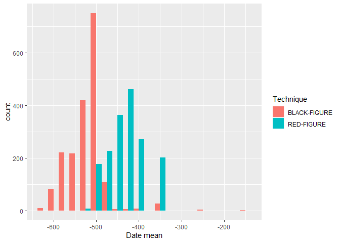
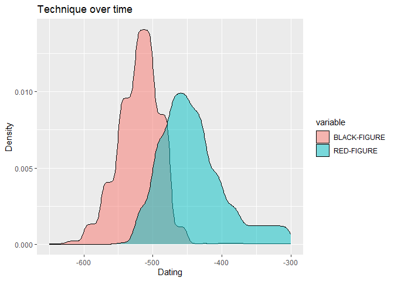
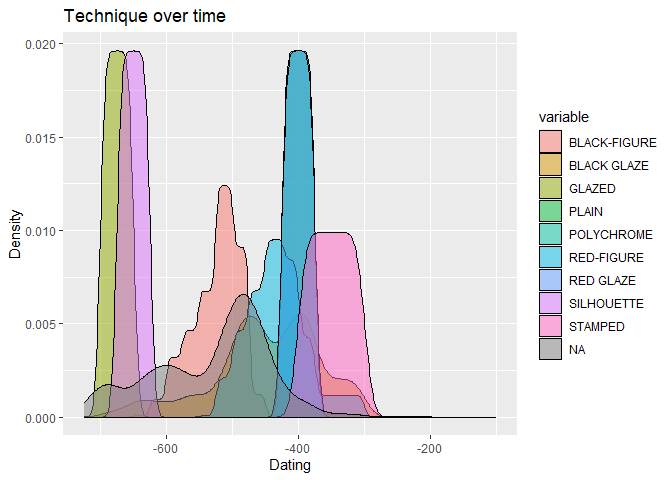

- [Fuzzy dates](#fuzzy-dates)
- [Homework assignments](#homework-assignments)
  - [Assignment 1](#assignment-1)
  - [Assignment 2](#assignment-2)
  - [Assignment 3](#assignment-3)
  - [Assignment 4](#assignment-4)

In this workshop, we will work with Beazley Archive data and focus more
on text analysis and fuzzy dates. This workshop is based on work done by
Kalle Valkeakari.

As always, we start by loading `tidyverse`.

``` r
library(tidyverse)
```

We then load the data. We use the same dataset we had from the first
workshop.

``` r
data <- read_csv("https://github.com/ucrdatacenter/projects/raw/main/AH-ANTQ103/Beazley_Archive.csv")
```

We start by looking at the data. We can use the following functions to
look at the data.

``` r
head(data)
glimpse(data)
summary(data)
names(data)
```

After looking at the data, we have decided that we don’t need the 9th
and the 12th through the 29th columns, so we remove them. We can do this
using the `select()` function. Think about why we don’t need these
columns.

``` r
data_short <- data %>% 
  select(-9, -12:-29)
```

Note that we can also do this by defining the columns we do want to keep

``` r
data_short <- data %>% 
  select(1:8, 10:11)
```

Or by stating the column names we want to keep

``` r
data_short <- data %>% 
  select(`URI`, `Vase Number`, `Fabric`, `Technique`, `Sub Technique`, `Shape Name`, `Provenance`, `Date`, `Attributed To`, `Decoration`)
```

We might want to check if there are multiple entries for the same
object. Luckily there is a Vase Number column, so we can check if there
are multiple entries for the same vase number. We can do this using the
`duplicated()` function. Note that if there is a space in the column
name, we need to use backticks around the column name. We can then use
the `filter()` function to filter the data to only include the
duplicated rows.

``` r
data_short %>% 
  filter(duplicated(`Vase Number`))
```

Given that the tibble that this returns is empty, we can conclude that
there are no rows with the same vase number.

We can also check if there are any rows with missing data. We can do
this using the `is.na()` function. This returns a logical vector, which
we can then use to filter the data.

``` r
data_short %>% 
  filter(is.na(`Vase Number`))
```

Given that the tibble that this returns is empty, we can conclude that
there are no rows with missing data.

Now that we know that there are no rows with missing data, and no rows
with the same vase number, we can start looking at the data in more
detail. We are interested in the decorations on the vases, so we will
look at the Decoration column.

``` r
data_short %>% 
  select(Decoration)
```

This is text data. An interesting question may be what the most common
words are in the Decoration column. These would correspond with the most
common decorations. We can do this using the `unnest_tokens()` function.
This function takes a column of text data, and splits it into individual
words. It then returns a tibble with the words in a column called word.
The `unnest_tokens()` function is a part of the `tidytext` package,
which we must download and load before we can use the function.

``` r
install.packages("tidytext")
```

``` r
library(tidytext)
```

``` r
data_words <- data_short %>% 
  unnest_tokens(word, Decoration)
```

Lets take a look at the most common words.

``` r
data_words %>% 
  count(word) %>% 
  arrange(desc(n))
```

We can already see that there are some `NA` values. We can remove these
easily using the `drop_na()` function.

``` r
data_words %>% 
  drop_na(word) %>% 
  count(word) %>% 
  arrange(desc(n))
```

There are still some words that are not interesting for our analysis.
These are called stop words. We can remove these using the `anti_join()`
function. This function takes two tibbles, and returns a tibble with the
rows from the first tibble that are not in the second tibble. The stop
words are in a tibble in the `tidytext` package.

``` r
stop_words %>% 
  View()
```

Alternatively we can define our own custom stop words.

``` r
tibble <- tibble(
  word = c("a", "and", "with", "an", "or", "the", "of", "to", "in", "for", "on", "at", "from", "by", "about", "as", "into", "like", "through", "after", "over", "between", "out", "against", "during", "without", "before", "under", "around", "among"),
)
```

We can then use the `anti_join()` function to remove the stop words from
the data.

``` r
word_counts <- data_words %>% 
  drop_na(word) %>%
  anti_join(tibble, by = "word") %>%
  count(word) %>%
  arrange(desc(n))
```

Here we still have the letter “b”. We may decide to remove all words
that are only one letter long. We can do this using the `filter()`
function. The `str_length()` function returns the number of characters
in a string. We can use this to filter the data.

``` r
word_counts <- word_counts %>% 
  filter(str_length(word) > 1) %>% 
  print()
```

There are still a lot of words in here. We decide to only look at the
top 20 words. We can do this using the `top_n()` function.

``` r
word_counts_top_20 <- word_counts %>% 
  top_n(20, n) %>% 
  print()
```

We can then create a plot of these words.

``` r
ggplot(word_counts_top_20, aes(x = reorder(word, n), y = n)) +
  geom_col() +
  coord_flip() +
  xlab("Word") +
  ylab("Number of occurrences") +
  ggtitle("Most common words in the Decoration column") +
  theme_bw()
```

<!-- -->

For the homework, the `separate()` function is essential. This function
takes a tibble, a column name, a new column name and a separator. It
then splits the column into two (or more) columns, and returns a tibble
with the new columns. Here I give a silly example of how to use this
function. It will be actually useful in the homework. If we take a look
at the decoration column, we can see that some vases have an entry that
is one word, then a colon and then more words. Imagine we want to
isolate the first word and the words after the colon. We can do this
using the `separate()` function, by setting the separator to “:”.

``` r
data_short %>% 
  separate(Decoration, c("Decoration 1", "Decoration 2"), sep = ":")
```

## Fuzzy dates

Usually data for origins of artefacts are given in ranges (e.g. 450-375
BC) and computers do not really like this type of “fuzzy” or uncertain
time. There are two ways to deal with this type of data. The first is
quite simple and implies taking the mean of these two values, but can
lead to big errors if you do not understand the limitations to this
approach. Let’s look at the underlying technique used for pottery, that
is, the colors of the decorations on the pottery. Then we can ask, how
does the technique change over time?

We can separate the dates into two columns, and then take the mean of
the two columns. We can do this using the `separate()` function.

``` r
data_short_dates <- data_short %>% 
  separate(Date, c("Date start", "Date end"), sep = " to ")
```

These columns are now character columns. We can convert them to numeric
columns using the `as.numeric()` function.

``` r
data_short_dates <- data_short_dates %>% 
  mutate(`Date start` = as.numeric(`Date start`), 
         `Date end` = as.numeric(`Date end`))
```

We can then calculate the mean for each row.

``` r
data_short_dates <- data_short_dates %>% 
  mutate(`Date mean` = (`Date start` + `Date end`) / 2)
```

We only keep the rows with a black figure or red figure techniqu, as
this allows for easier comparison with the plot we will make later.

``` r
plotting_data <- data_short_dates %>% 
  filter(Technique == "BLACK-FIGURE" | Technique == "RED-FIGURE")
```

We can then create a plot of the technique over time. We use the `fill`
aesthetic to fill the bars with the technique.

``` r
ggplot(plotting_data, aes(x = `Date mean`, fill = Technique)) +
  geom_histogram(binwidth = 25, position = "dodge")
```

<!-- -->

Alternatively, we can keep the times fuzzy. For this we use the
`datplot` package.

``` r
install.packages("datplot")
```

``` r
library(datplot)
```

In this package, there is already a Beazley dataset, which we will use
from now on. We can load this dataset using the `data()` function.

``` r
data(Beazley)
```

For the type of plot we want to make, we need to have the data in a
specific format, namely ID, Factor, date_min, date_max. The `datplot`
dataset is already in this format.

The following code creates a copy of every year it could possibly be,
given the range of dates. We can define the step size, which is the
number of years between each copy.

``` r
result <- datsteps(Beazley, stepsize = 1)
```

It also calculates a weight for each date. This is the inverse of the
number of copies. This means that if there are more copies of a date,
the weight will be lower.

We can use this data to plot the technique over time. Note that we
define the weight as the `weight` aesthetic. This means that the weight
will be used to determine the height of the density curve. Also note
than the `Technique` column is here called `variable`.

``` r
ggplot(result, aes(x = DAT_step, fill = variable, weight = weight)) +
  geom_density(alpha = 0.5) +
  labs(x = "Dating", y = "Density") +
  ggtitle("Technique over time")
```

<!-- -->

## Homework assignments

### Assignment 1

1.  Create a plot of the most common descriptions of the vases (As we
    did in the tutorial) in a new dataset. Use [this
    dataset](https://www.carc.ox.ac.uk/XDB/ASP/searchOpen.asp?setResultCheckboxes=chkAlbum&chkAlbum=true&windowWidth=1535&windowHeight=689&search=%20%7BAND%7D%20%20%5BProvenance%5D%20GREECE%2C%20ATHENS%2C%20CERAMICUS#aHeader)
    which you can also download from
    [GitHub](https://github.com/ucrdatacenter/projects/raw/main/AH-ANTQ103/Beazley_Archive_2.csv).
    Reuse the code from the lecture to create the plot, and compare the
    results. What do you notice?

### Assignment 2

1.  Create a plot of the most common shapes of the pottery in a new
    dataset. Use the dataset from 1.1. We are looking just for the main
    shapes, so for example: “CUP FRAGMENT” and “CUP” should be counted
    as the same shape, namely “CUP”. Show the top 10. You will need to
    split a column. Hint: The separator you want to use is either a
    comma or a space You can use this expression to do that `[, ]`.

2.  Use the code you wrote for 1.1 to create a plot of the most common
    shapes of the pottery in the original dataset. Again, “CUP FRAGMENT”
    and “CUP” (and similar definitions) should be counted as the same
    shape. Adapting the code should be very straightforward.

### Assignment 3

Create a plot of the technique over time using the original dataset,
which includes the fuzzy dates.

Hint: The dataset you use for the `datsteps` function needs to be in a
specific format.

You can use this code to create a dataset you can use as a starting
point.

``` r
data_short_dates <- data_short %>% 
  separate(Date, c("Date start", "Date end"), sep = " to ")
data_short_dates <- data_short_dates %>% 
  mutate(`Date start` = as.numeric(`Date start`), 
         `Date end` = as.numeric(`Date end`))
```

The plot should look like this:

<!-- -->

### Assignment 4

This is an open assignment. Create a new, original plot that you think
is interesting and report your findings. This could be a text analysis
on a new Beazley dataset and compare the results to what we found
earlier, or you can perform another time analysis on the Beazley
dataset. You can also use a different dataset and compare your findings.
Lastly, if you can think of another interesting analysis using
archaeological data, you can do that as well. While working on this
assignment, please be aware that this is the file you will be asked to
work with for the final report.

Some ideas may include, but are not limited to:

- Comparing the provenances of vases from several large museums

- Look at the occurrences of mythological figures on vases

- Compare the shapes of vases for shapes that may be used in every day
  life
