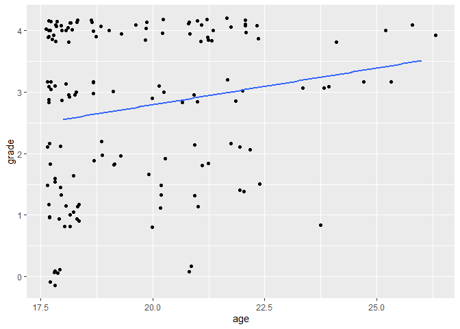

- [Objectives](#objectives)
  - [Why R?](#why-r)
  - [Why `tidyverse`?](#why-tidyverse)
- [Introduction to R](#introduction-to-r)
  - [Objects in R](#objects-in-r)
  - [Functions in R](#functions-in-r)
- [Importing data](#importing-data)
- [Data wrangling](#data-wrangling)
  - [Filtering observations](#filtering-observations)
  - [Selecting variables](#selecting-variables)
  - [Creating new variables](#creating-new-variables)
  - [Categorical variables as
    factors](#categorical-variables-as-factors)
  - [Data cleaning as a single
    pipeline](#data-cleaning-as-a-single-pipeline)
- [Data visualization](#data-visualization)
  - [The logic of `ggplot2`](#the-logic-of-ggplot2)
  - [Univariate plots](#univariate-plots)
  - [Bivariate plots](#bivariate-plots)
  - [Customizing plot features](#customizing-plot-features)
  - [More advanced features](#more-advanced-features)
  - [Saving plots](#saving-plots)
- [Summary statistics](#summary-statistics)
  - [Summaries in the console](#summaries-in-the-console)
  - [Export-ready summary tables](#export-ready-summary-tables)
- [Hypothesis testing](#hypothesis-testing)

# Objectives

## Why R?

- Free and open-source
- Reproducible
- Widely used in academia and industry; up-to-date with the latest
  technological developments
- Very versatile: extensive package ecosystem for statistics and more
- Powerful data wrangling and visualization capabilities
- Extensive community support (open-access books, tutorials, forums, AI
  tools, etc.)

## Why `tidyverse`?

- Clean, consistent, intuitive, readable syntax for all steps of the
  data analysis process
- Limited set of functions that can be combined in many ways
- Many packages beyond core `tidyverse` with the same underlying design,
  grammar, and data structures, therefore easier to learn advanced
  techniques

# Introduction to R

## Objects in R

One of the most basic types of objects in R is a vector. A vector is a
collection of values of the same type, such as numbers, characters, or
logicals (TRUE/FALSE). You can create a vector with the `c()` function,
which stands for concatenate. If you assign a vector to an object with
the assignment operator `<-`, your vector will be saved in your
environment so you can work with it within your current R session. Some
examples of creating vectors are:

``` r
v1 <- c("A", "B", "C")  # character vector with 3 elements
v2 <- 25                # numeric vector with 1 element
v3 <- 1:10              # numeric vector with 10 elements - integers from 1 to 10
```

To subset or extract elements from a vector, you can use square brackets
`[ ]` with an index. For example, `v1[1]` returns the first element of
`v1`, `v3[2:5]` returns the 2nd to 5th elements of `v3`, and
`v3[-c(2, 4, 6)]` returns all but the 2nd, 4th and 6th elements of `v3`.

``` r
v1[1]
```

    ## [1] "A"

``` r
v3[2:5]
```

    ## [1] 2 3 4 5

``` r
v3[-c(2, 4, 6)]
```

    ## [1]  1  3  5  7  8  9 10

A dataframe (or “tibble” in `tidyverse`) is a special type of object
that combines vectors into a rectangular table. Each column of a
dataframe is a vector, and each row is an observation. usually you would
load data from an external source, but you can create a dataframe with
the `data.frame()` and a tibble with the `tibble()` function. You can
also convert other data types such as matrices to tibbles with the
`as_tibble()` function. Both functions take vectors as their arguments.
Tibbles are preferred because they are more modern and have some
convenient features that dataframes don’t, but for the most part,
differences are minor and for the most part it does not matter whether
you work with tibbles or dataframes.

A simple example of creating a tibble is (make sure to load `tidyverse`
first):

``` r
library(tidyverse)

# define vectors within the tibble() function
tibble(
  name = c("Alice", "Bob", "Chris"),
  height = c(165, 180, 175)
)
```

    ## # A tibble: 3 × 2
    ##   name  height
    ##   <chr>  <dbl>
    ## 1 Alice    165
    ## 2 Bob      180
    ## 3 Chris    175

## Functions in R

Functions are reusable pieces of code that perform a specific task. They
take arguments as inputs and return one or more pieces of output. You
will mostly work with functions loaded from various packages or from the
base R distribution, and in some cases you may write your own functions
to avoid repetition or improve the readability of your code. We will
cover writing your own functions later in the program.

As with vectors, the output of a function is saved to your environment
only if you assign the result to an object. For example, `sum(x)` will
display the sum of the elements of the vector `x`, but `sum <- sum(x)`
will save this result to an object.

``` r
x <- c(1, 5, 6, 2, 1, 8)

sum(x)
```

    ## [1] 23

``` r
result <- sum(x)
```

Some important functions on vectors are

``` r
mean(x)   # return the mean; add the argument na.rm = TRUE if missing values should be excluded
```

    ## [1] 3.833333

``` r
length(x) # give the length of the vector (number of elements)
```

    ## [1] 6

``` r
unique(x) # list the unique elements of the vector
```

    ## [1] 1 5 6 2 8

To learn more about a function and its arguments, you can use the ?
operator or the help() function, for example by typing `?sum` (or
equivalently, `?sum()`). It is good practice to request help files from
your console and not you R script, since there is no need to save these
queries for the future.

# Importing data

R can handle practically any type of data, from simple text files to
files used by other (not necessarily open-source) software and complex
databases. This gives users a lot of flexibility in terms of data
sources and formats.

In addition to using your own data (e.g. as exported from a survey), the
Data Center keeps a continuously updated list of useful datasets by
discipline, accessible [here](../../../../tutorials/data).

In the following, we’ll import a CSV file from a URL, but if you want to
know more about importing various common file types, follow our more
complete [tutorial on importing
data](../../../../tutorials/r_adv_import).

We can use the `read_csv()` function to import a [CSV
file](https://github.com/ucrdatacenter/projects/blob/main/apprenticeship/2025h1/student_data.csv)
uploaded to the Data Center’s GitHub repository. The “Raw” button on the
GitHub page opens the file in a plain text format, which is the format
that `read_csv()` expects. Our data is based on a dataset on student
characteristics and grades at a university ([original
source](https://www.kaggle.com/datasets/jacksondivakarr/student-classification-dataset?resource=download)).
We assign the imported tibble to an object called `data`. *Note:* make
sure to load `tidyverse` before proceeding with the rest of the
tutorial.

``` r
data <- read_csv("https://github.com/ucrdatacenter/projects/raw/refs/heads/main/apprenticeship/2025h1/student_data.csv")
```

A few notes regarding importing and exporting data:

- Always make sure you know your current working directory and the
  relative path to your data directory. It is better to use relative
  rather than absolute file paths (i.e. `data/data.csv` instead of
  `C:/User/Project/data/data.csv`).
- Note that if you are using Windows, you may need to replace the
  backslashes (\\ in the file path with forward slashes (/) to avoid
  errors.
- You can import files directly from URLs, although you usually need the
  URL of a raw file. If a file downloads immediately instead of opening
  in a raw format, you can try to copy that download link by
  right-clicking and selecting “Copy link address”; the `import()`
  function from the `rio` package might be successful with those links.
- To export data from R, you can almost always use the `write_...()`
  function corresponding to the desired file format, e.g. `write_csv()`.
  For Excel files the preferred export function is `write_xlsx()`, and
  for SPSS’s .sav files it is `write_sav()`.
- For other file formats, the generic `write()` function is useful; you
  can specify any file format, and if your input data is readable in the
  chosen format, the file will export properly.
- In all `write_()` functions you need to specify the data you’d like to
  save and the output file path (absolute or relative) including chosen
  file extension.

# Data wrangling

Data wrangling is the process of cleaning, structuring, and enriching
raw data into a more usable format. The `dplyr` package is a part of the
`tidyverse` and provides a set of functions that can be combined to
perform the most common data wrangling tasks. The package is built
around the concept of the “grammar of data manipulation”, which is a
consistent set of verbs that can be combined in many ways to achieve the
desired result.

The main functions in `dplyr` are `filter()`, `select()`, `mutate()`,
`arrange()`, `group_by()`, `summarize()`, and `rename()`. `dplyr` also
provides a set of functions for combining datasets: `bind_rows()` and
`bind_cols()` for row-wise and column-wise binding, and `left_join()`,
`right_join()`, `inner_join()`, and `full_join()` for joining datasets
based on common variables. These functions can be combined using the
pipe operator `|>` (or `%>%`, they are mostly equivalent) to create a
data wrangling workflow. The pipe operator takes the output of the
function on its left and passes it as the first argument to the function
on its right. This allows you to chain multiple functions together in a
single line of code, making your code more readable and easier to
understand.

In the following, we’ll work with the `data` object imported in the
previous section and show how to use the main `dplyr` functions to clean
the data so it is suitable for analysis. These steps are useful even if
the input data is quite clean, as we often need to work with only a
subset of observations/variables, define new variables, or aggregate the
data.

## Filtering observations

If we want to keep only a subset of observations, we can use the
`filter()` function. We can specify a logical condition as the argument
to `filter()`, and only observations that meet that condition will be
kept. For example, to keep only students who are over 21 years old, we
can use the following code:

``` r
filter(data, age > 21)
```

    ## # A tibble: 27 × 9
    ##       id   age sex    scholarship additional_work reading notes listening grade
    ##    <dbl> <dbl> <chr>        <dbl> <lgl>           <lgl>   <lgl> <lgl>     <dbl>
    ##  1  5005    22 Male            50 FALSE           TRUE    FALSE TRUE          4
    ##  2  5015    26 Male            75 TRUE            FALSE   FALSE TRUE          4
    ##  3  5016    22 Male            50 FALSE           FALSE   TRUE  FALSE         4
    ##  4  5018    22 Male            50 FALSE           TRUE    FALSE FALSE         4
    ##  5  5023    22 Male            50 TRUE            TRUE    TRUE  TRUE          3
    ##  6  5024    25 Male            25 TRUE            TRUE    TRUE  FALSE         4
    ##  7  5029    24 Male            50 FALSE           FALSE   FALSE FALSE         3
    ##  8  5032    25 Male            50 TRUE            FALSE   TRUE  FALSE         3
    ##  9  5040    22 Female          50 FALSE           FALSE   TRUE  TRUE          4
    ## 10  5042    24 Male            50 TRUE            FALSE   TRUE  FALSE         4
    ## # ℹ 17 more rows

We can also apply logical conditions to character variables, e.g. to
keep only students who went to a private high school and who did not
receive a failing grade. Filters can be combined with AND (`,` or `&`)
and OR (`|`) operators into a single function. Note the use of quotation
marks around character values in the logical condition and the double
equal sign `==` to denote equality and `!=` for “not equal”.

``` r
filter(data, sex == "Male", grade != 0) 
```

    ## # A tibble: 87 × 9
    ##       id   age sex   scholarship additional_work reading notes listening grade
    ##    <dbl> <dbl> <chr>       <dbl> <lgl>           <lgl>   <lgl> <lgl>     <dbl>
    ##  1  5001    21 Male           50 TRUE            TRUE    TRUE  FALSE         4
    ##  2  5002    20 Male           50 TRUE            TRUE    FALSE TRUE          4
    ##  3  5003    21 Male           50 FALSE           FALSE   FALSE FALSE         4
    ##  4  5005    22 Male           50 FALSE           TRUE    FALSE TRUE          4
    ##  5  5006    20 Male           50 FALSE           TRUE    FALSE TRUE          4
    ##  6  5007    18 Male           75 FALSE           FALSE   TRUE  TRUE          2
    ##  7  5015    26 Male           75 TRUE            FALSE   FALSE TRUE          4
    ##  8  5016    22 Male           50 FALSE           FALSE   TRUE  FALSE         4
    ##  9  5018    22 Male           50 FALSE           TRUE    FALSE FALSE         4
    ## 10  5020    18 Male           50 FALSE           FALSE   FALSE TRUE          3
    ## # ℹ 77 more rows

Another useful logical operator is `%in%`, which allows you to filter
observations based on a list of values. For example, to keep only
students who receive either 75% or 100% scholarships, we can use the
following code:

``` r
filter(data, scholarship %in% c(75, 100))
```

    ## # A tibble: 65 × 9
    ##       id   age sex    scholarship additional_work reading notes listening grade
    ##    <dbl> <dbl> <chr>        <dbl> <lgl>           <lgl>   <lgl> <lgl>     <dbl>
    ##  1  5007    18 Male            75 FALSE           FALSE   TRUE  TRUE          2
    ##  2  5012    18 Female          75 TRUE            FALSE   TRUE  FALSE         0
    ##  3  5013    18 Female          75 FALSE           TRUE    FALSE FALSE         0
    ##  4  5014    19 Female         100 FALSE           TRUE    FALSE FALSE         4
    ##  5  5015    26 Male            75 TRUE            FALSE   FALSE TRUE          4
    ##  6  5017    18 Female         100 FALSE           TRUE    FALSE FALSE         4
    ##  7  5019    18 Female          75 FALSE           TRUE    FALSE FALSE         4
    ##  8  5021    18 Male           100 TRUE            FALSE   FALSE TRUE          4
    ##  9  5022    18 Male           100 FALSE           FALSE   FALSE FALSE         4
    ## 10  5030    19 Male            75 FALSE           FALSE   FALSE TRUE          2
    ## # ℹ 55 more rows

## Selecting variables

If we want to keep only a subset of variables, we can use the `select()`
function. We can specify the variables we want to keep (or exclude, with
`-` signs) as the arguments to `select()`, and only those variables will
be kept. For example, to keep only the `Id` and `Student_Age` variables,
we can use the following code:

``` r
select(data, id, age)
```

    ## # A tibble: 145 × 2
    ##       id   age
    ##    <dbl> <dbl>
    ##  1  5001    21
    ##  2  5002    20
    ##  3  5003    21
    ##  4  5004    18
    ##  5  5005    22
    ##  6  5006    20
    ##  7  5007    18
    ##  8  5008    18
    ##  9  5009    19
    ## 10  5010    21
    ## # ℹ 135 more rows

We can also select columns based on their location in the tibble or by
looking for patterns in the column names:

``` r
select(data, id:sex) # select a range of columns
```

    ## # A tibble: 145 × 3
    ##       id   age sex   
    ##    <dbl> <dbl> <chr> 
    ##  1  5001    21 Male  
    ##  2  5002    20 Male  
    ##  3  5003    21 Male  
    ##  4  5004    18 Female
    ##  5  5005    22 Male  
    ##  6  5006    20 Male  
    ##  7  5007    18 Male  
    ##  8  5008    18 Female
    ##  9  5009    19 Female
    ## 10  5010    21 Female
    ## # ℹ 135 more rows

``` r
select(data, starts_with("a")) # select columns that start with "a"
```

    ## # A tibble: 145 × 2
    ##      age additional_work
    ##    <dbl> <lgl>          
    ##  1    21 TRUE           
    ##  2    20 TRUE           
    ##  3    21 FALSE          
    ##  4    18 TRUE           
    ##  5    22 FALSE          
    ##  6    20 FALSE          
    ##  7    18 FALSE          
    ##  8    18 TRUE           
    ##  9    19 FALSE          
    ## 10    21 FALSE          
    ## # ℹ 135 more rows

``` r
select(data, -grade) # keep everything but "grade"
```

    ## # A tibble: 145 × 8
    ##       id   age sex    scholarship additional_work reading notes listening
    ##    <dbl> <dbl> <chr>        <dbl> <lgl>           <lgl>   <lgl> <lgl>    
    ##  1  5001    21 Male            50 TRUE            TRUE    TRUE  FALSE    
    ##  2  5002    20 Male            50 TRUE            TRUE    FALSE TRUE     
    ##  3  5003    21 Male            50 FALSE           FALSE   FALSE FALSE    
    ##  4  5004    18 Female          50 TRUE            FALSE   TRUE  FALSE    
    ##  5  5005    22 Male            50 FALSE           TRUE    FALSE TRUE     
    ##  6  5006    20 Male            50 FALSE           TRUE    FALSE TRUE     
    ##  7  5007    18 Male            75 FALSE           FALSE   TRUE  TRUE     
    ##  8  5008    18 Female          50 TRUE            FALSE   TRUE  TRUE     
    ##  9  5009    19 Female          50 FALSE           FALSE   FALSE FALSE    
    ## 10  5010    21 Female          50 FALSE           FALSE   TRUE  FALSE    
    ## # ℹ 135 more rows

A pipe workflow allows us to combine the filtering and selecting
operations into a single, step-by-step workflow:

``` r
data |> 
  filter(age > 21) |> 
  select(id, age)
```

    ## # A tibble: 27 × 2
    ##       id   age
    ##    <dbl> <dbl>
    ##  1  5005    22
    ##  2  5015    26
    ##  3  5016    22
    ##  4  5018    22
    ##  5  5023    22
    ##  6  5024    25
    ##  7  5029    24
    ##  8  5032    25
    ##  9  5040    22
    ## 10  5042    24
    ## # ℹ 17 more rows

## Creating new variables

If we want to create a new variable based on existing variables, we can
use the `mutate()` function. We can specify the new variable name and
the calculation for the new variable as the arguments to `mutate()`, and
the new variable will be added to the dataset. For example, we can
create a new variable `participation`, which is `TRUE` if the student
does the assigned reading *and* listens in class *and* takes notes. We
create this variable using a logical expression, using a simplified
notation (i.e. not write out `reading == TRUE`, as doing so is not
necessary for logical variables). Andother variable,
`scholarship_decimal`, is created by dividing the `Scholarship` variable
by 100 to get a variable that represents the value of scholarship as a
fraction of total cost.

``` r
data |> 
  # create new variables
  mutate(participation = reading & notes & listening,
         scholarship_decimal = scholarship / 100) |> 
  # keep only new variables and student id
  select(id, participation, scholarship_decimal)
```

    ## # A tibble: 145 × 3
    ##       id participation scholarship_decimal
    ##    <dbl> <lgl>                       <dbl>
    ##  1  5001 FALSE                        0.5 
    ##  2  5002 FALSE                        0.5 
    ##  3  5003 FALSE                        0.5 
    ##  4  5004 FALSE                        0.5 
    ##  5  5005 FALSE                        0.5 
    ##  6  5006 FALSE                        0.5 
    ##  7  5007 FALSE                        0.75
    ##  8  5008 FALSE                        0.5 
    ##  9  5009 FALSE                        0.5 
    ## 10  5010 FALSE                        0.5 
    ## # ℹ 135 more rows

## Categorical variables as factors

It is often useful to clearly define the levels of a categorical
variable, especially if these levels have a meaningful ordering. For
unordered categories, R provides the data type `factor`, while for
ordered variables the relevant data type is `ordered`. Factor and
ordered values appear as character strings when viewed, but are treated
as numbers with labels internally, which makes it easier to show
descriptives of the variable and include it in models. For example, we
can define `sex` as a factor with two levels. If we don’t specify the
levels of the factor explicitly, then the levels will be sorted
alphabetically.

``` r
data |> 
  mutate(sex = factor(sex)) |> 
  # view variable types and levels by looking at the structure of the data
  str()
```

    ## tibble [145 × 9] (S3: tbl_df/tbl/data.frame)
    ##  $ id             : num [1:145] 5001 5002 5003 5004 5005 ...
    ##  $ age            : num [1:145] 21 20 21 18 22 20 18 18 19 21 ...
    ##  $ sex            : Factor w/ 2 levels "Female","Male": 2 2 2 1 2 2 2 1 1 1 ...
    ##  $ scholarship    : num [1:145] 50 50 50 50 50 50 75 50 50 50 ...
    ##  $ additional_work: logi [1:145] TRUE TRUE FALSE TRUE FALSE FALSE ...
    ##  $ reading        : logi [1:145] TRUE TRUE FALSE FALSE TRUE TRUE ...
    ##  $ notes          : logi [1:145] TRUE FALSE FALSE TRUE FALSE FALSE ...
    ##  $ listening      : logi [1:145] FALSE TRUE FALSE FALSE TRUE TRUE ...
    ##  $ grade          : num [1:145] 4 4 4 4 4 4 2 4 2 0 ...

## Data cleaning as a single pipeline

Until now we didn’t save any of our data wrangling steps as new objects,
so the original `data` object is still unchanged. If we want to save the
cleaned data as a new object, we can assign the result of the pipe
workflow to a new object.

``` r
data_subset <- data |> 
  filter(age > 21) |> 
  mutate(sex = factor(sex)) |> 
  select(id, age, sex)
```

# Data visualization

## The logic of `ggplot2`

The `ggplot2` package builds up figures in layers, by adding elements
one at a time. You always start with a base `ggplot` where you specify
the data used by the plot and possibly the variables to place on each
axis. These variables are specified within an `aes()` function, which
stands for aesthetics.

The `ggplot()` function in itself only creates a blank canvas; we need
to add so-called geoms to actually plot the data. You can choose from a
wide range of geoms, and also use multiple geoms in one plot. You can
add elements to a `ggplot` objects with the `+` sign. You should think
of the `+` sign in `ggplot` workflows in the same way you think of the
pipe operators in data wrangling workflows.

## Univariate plots

You can plot a single continuous variable with a histogram, a density
plot, or a boxplot. Other than the name of the dataset and the variable,
no additional arguments need to be specified; but you can customize the
plot by adding arguments to the `geom_` functions.

``` r
# binwidth or bins determine the number of bins
# with binwidth = 1, each bin is 1 year wide
ggplot(data, aes(x = age)) +
  geom_histogram(binwidth = 1, color = "black", fill = "lightblue")
```

<!-- -->

``` r
ggplot(data, aes(x = age)) +
  geom_density(fill = "lightblue", alpha = 0.5)
```

<!-- -->

``` r
ggplot(data, aes(x = age)) +
  geom_boxplot()
```

<!-- -->

To compare the frequencies of discrete variables, you can use a bar
plot.

``` r
ggplot(data, aes(x = additional_work)) +
  geom_bar()
```

<!-- -->

## Bivariate plots

You can plot two continuous variables with a scatter plot. For example,
you can plot the relationship between age and grade by specifying these
variables as the x and y aesthetics:

``` r
ggplot(data, aes(x = age, y = grade)) +
  geom_point()
```

<!-- -->

Fitting a smooth curve or a linear regression line to the scatter plot
can help you see the overall trend in the data.

``` r
ggplot(data, aes(x = age, y = grade)) +
  geom_point() + 
  geom_smooth()
```

<!-- -->

``` r
ggplot(data, aes(x = age, y = grade)) +
  geom_point() + 
  # method = "lm" fits a linear model, se = FALSE removes the confidence interval
  geom_smooth(method = "lm", se = FALSE)
```

<!-- -->

If points overlap a lot, it might be useful to add some jitter,
i.e. random noise to distribute the points, by using `geom_jitter()`
instead of `geom_point()`.

``` r
ggplot(data, aes(x = age, y = grade)) +
  geom_jitter() + 
  geom_smooth(method = "lm", se = FALSE)
```

<!-- -->

Categorical variables can be used to show the distribution of continuous
variables by group. You can put a categorical variable on one of the
axes, or use it on another aesthetic, such as the fill or color. Note
that if a variable determines the fill, the color, and the shape of the
points, that has to be specified inside an `aes()` function, while if
the characteristic is pre-defined, then it goes outside the `aes()`
function. Also note that if you specify aesthetics in the main
`ggplot()` function, then they apply to all geoms, while if you specify
them in a `geom_...()` function, they apply only to that geom.

``` r
ggplot(data, aes(x = grade, y = additional_work)) +
  geom_boxplot()
```

<!-- -->

``` r
ggplot(data) +
  geom_density(aes(x = grade, fill = additional_work), alpha = 0.5)
```

<!-- -->

To plot two categorical variables, you can use a bar plot with an extra
grouping argument specifying the fill of the bars. The next plot shows
the number of students who do the class readings or not, and for each
group we know whether they work take notes in class or not.

``` r
ggplot(data, aes(x = reading, fill = notes)) +
  geom_bar()
```

<!-- -->

``` r
# to put the bars next to each other instead of on top, specify the position
ggplot(data, aes(x = reading, fill = notes)) +
  geom_bar(position = "dodge")
```

<!-- -->

## Customizing plot features

The two largest advantages of `ggplot2` are the ability to layer
multiple geoms on top of each other and the ability to extensively
customize every plot by adding additional plot elements.

You can make the plot more informative by adding titles and axis labels.

``` r
ggplot(data, aes(x = grade, y = reading)) +
  geom_boxplot() +
  labs(title = "Grade distribution based on whether the student does the reading",
       x = "Grade",
       y = "Student does the reading?")
```

<!-- -->

You can also change the appearance of the plot by changing the theme,
the color palette, and the axis scales.

You can set the theme of the plot with one of the `theme_...()`
functions, or set the theme for the entire R session with `theme_set()`.

``` r
ggplot(data, aes(x = grade, y = reading)) +
  geom_boxplot() +
  labs(title = "Grade distribution based on whether the student does the reading",
       x = "Grade",
       y = "Student does the reading?") +
  # set the theme of this plot to the pre-defined theme_light
  theme_light()
```

<!-- -->

``` r
# set the theme of all future plots to the pre-defined theme_minimal
theme_set(theme_minimal())
```

You can adjust the axis breaks and labels with the `scale_x_...()` and
`scale_y_...()` functions.

``` r
ggplot(data, aes(x = grade, y = reading)) +
  geom_boxplot() +
  labs(title = "Grade distribution based on whether the student does the reading",
       x = "Grade",
       y = "Student does the reading?") +
  # define the axis tick positions on the continuous x axis
  scale_x_continuous(breaks = seq(0, 4, 0.5)) +
  # relabel the items on the discrete y axis
  scale_y_discrete(breaks = c(FALSE, TRUE), labels = c("No", "Yes"))
```

<!-- -->

## More advanced features

The [R Graph Gallery](https://r-graph-gallery.com/) provides a long list
of common plot types, and so do Chapters 4 and 5 of [*Modern Data
Visualization with R*](https://rkabacoff.github.io/datavis/index.html).
Both resources group geoms by the type of variable(s) plotted.

## Saving plots

You can save `ggplot` objects to use outside of the R environment with
the `ggsave` function. By default `ggsave()` saves the last plot
displayed in your Plots panel. You always need to specify the file path
of the saved plot, including the preferred file format (e.g. .png, .jpg,
.pdf).

``` r
ggplot(data, aes(x = grade, y = age)) + 
  geom_point()

# Save last plot
ggsave("figures/plot1.png", scale = 1.5)
```

# Summary statistics

## Summaries in the console

In the R console, the `summary()` function provides a quick overview of
the data, showing the minimum, 1st quartile, median, mean, 3rd quartile,
and maximum of each numerical variable, and levels for factors. The
`count()` function provides a tibble of frequencies for any number of
variables.

``` r
summary(data)
```

    ##        id            age            sex             scholarship    
    ##  Min.   :5001   Min.   :18.00   Length:145         Min.   : 25.00  
    ##  1st Qu.:5037   1st Qu.:18.00   Class :character   1st Qu.: 50.00  
    ##  Median :5073   Median :19.00   Mode  :character   Median : 50.00  
    ##  Mean   :5073   Mean   :19.68                      Mean   : 64.76  
    ##  3rd Qu.:5109   3rd Qu.:21.00                      3rd Qu.: 75.00  
    ##  Max.   :5145   Max.   :26.00                      Max.   :100.00  
    ##                                                    NA's   :1       
    ##  additional_work  reading          notes         listening      
    ##  Mode :logical   Mode :logical   Mode :logical   Mode :logical  
    ##  FALSE:96        FALSE:76        FALSE:68        FALSE:70       
    ##  TRUE :49        TRUE :69        TRUE :77        TRUE :75       
    ##                                                                 
    ##                                                                 
    ##                                                                 
    ##                                                                 
    ##      grade      
    ##  Min.   :0.000  
    ##  1st Qu.:1.500  
    ##  Median :3.000  
    ##  Mean   :2.755  
    ##  3rd Qu.:4.000  
    ##  Max.   :4.000  
    ## 

``` r
count(data, sex, scholarship)
```

    ## # A tibble: 8 × 3
    ##   sex    scholarship     n
    ##   <chr>        <dbl> <int>
    ## 1 Female          50    26
    ## 2 Female          75    19
    ## 3 Female         100    13
    ## 4 Male            25     3
    ## 5 Male            50    50
    ## 6 Male            75    23
    ## 7 Male           100    10
    ## 8 Male            NA     1

## Export-ready summary tables

The `gtsummary` package provides a more customizable way to create
tables for publication with the `tbl_summary()` function. In addition,
the `gtsave()` function from the `gt` package allows you to save the
table in a variety of formats, including as a Word or TeX file. Make
sure to install and load the `gtsummary` and `gt` packages before using
them.

``` r
# install.packages("gtsummary")
# install.packages("gt")
library(gtsummary)
library(gt)

# create a summary table of the data
tbl_summary(data)
```

<div id="xkacjatvib" style="padding-left:0px;padding-right:0px;padding-top:10px;padding-bottom:10px;overflow-x:auto;overflow-y:auto;width:auto;height:auto;">
<style>#xkacjatvib table {
  font-family: system-ui, 'Segoe UI', Roboto, Helvetica, Arial, sans-serif, 'Apple Color Emoji', 'Segoe UI Emoji', 'Segoe UI Symbol', 'Noto Color Emoji';
  -webkit-font-smoothing: antialiased;
  -moz-osx-font-smoothing: grayscale;
}
&#10;#xkacjatvib thead, #xkacjatvib tbody, #xkacjatvib tfoot, #xkacjatvib tr, #xkacjatvib td, #xkacjatvib th {
  border-style: none;
}
&#10;#xkacjatvib p {
  margin: 0;
  padding: 0;
}
&#10;#xkacjatvib .gt_table {
  display: table;
  border-collapse: collapse;
  line-height: normal;
  margin-left: auto;
  margin-right: auto;
  color: #333333;
  font-size: 16px;
  font-weight: normal;
  font-style: normal;
  background-color: #FFFFFF;
  width: auto;
  border-top-style: solid;
  border-top-width: 2px;
  border-top-color: #A8A8A8;
  border-right-style: none;
  border-right-width: 2px;
  border-right-color: #D3D3D3;
  border-bottom-style: solid;
  border-bottom-width: 2px;
  border-bottom-color: #A8A8A8;
  border-left-style: none;
  border-left-width: 2px;
  border-left-color: #D3D3D3;
}
&#10;#xkacjatvib .gt_caption {
  padding-top: 4px;
  padding-bottom: 4px;
}
&#10;#xkacjatvib .gt_title {
  color: #333333;
  font-size: 125%;
  font-weight: initial;
  padding-top: 4px;
  padding-bottom: 4px;
  padding-left: 5px;
  padding-right: 5px;
  border-bottom-color: #FFFFFF;
  border-bottom-width: 0;
}
&#10;#xkacjatvib .gt_subtitle {
  color: #333333;
  font-size: 85%;
  font-weight: initial;
  padding-top: 3px;
  padding-bottom: 5px;
  padding-left: 5px;
  padding-right: 5px;
  border-top-color: #FFFFFF;
  border-top-width: 0;
}
&#10;#xkacjatvib .gt_heading {
  background-color: #FFFFFF;
  text-align: center;
  border-bottom-color: #FFFFFF;
  border-left-style: none;
  border-left-width: 1px;
  border-left-color: #D3D3D3;
  border-right-style: none;
  border-right-width: 1px;
  border-right-color: #D3D3D3;
}
&#10;#xkacjatvib .gt_bottom_border {
  border-bottom-style: solid;
  border-bottom-width: 2px;
  border-bottom-color: #D3D3D3;
}
&#10;#xkacjatvib .gt_col_headings {
  border-top-style: solid;
  border-top-width: 2px;
  border-top-color: #D3D3D3;
  border-bottom-style: solid;
  border-bottom-width: 2px;
  border-bottom-color: #D3D3D3;
  border-left-style: none;
  border-left-width: 1px;
  border-left-color: #D3D3D3;
  border-right-style: none;
  border-right-width: 1px;
  border-right-color: #D3D3D3;
}
&#10;#xkacjatvib .gt_col_heading {
  color: #333333;
  background-color: #FFFFFF;
  font-size: 100%;
  font-weight: normal;
  text-transform: inherit;
  border-left-style: none;
  border-left-width: 1px;
  border-left-color: #D3D3D3;
  border-right-style: none;
  border-right-width: 1px;
  border-right-color: #D3D3D3;
  vertical-align: bottom;
  padding-top: 5px;
  padding-bottom: 6px;
  padding-left: 5px;
  padding-right: 5px;
  overflow-x: hidden;
}
&#10;#xkacjatvib .gt_column_spanner_outer {
  color: #333333;
  background-color: #FFFFFF;
  font-size: 100%;
  font-weight: normal;
  text-transform: inherit;
  padding-top: 0;
  padding-bottom: 0;
  padding-left: 4px;
  padding-right: 4px;
}
&#10;#xkacjatvib .gt_column_spanner_outer:first-child {
  padding-left: 0;
}
&#10;#xkacjatvib .gt_column_spanner_outer:last-child {
  padding-right: 0;
}
&#10;#xkacjatvib .gt_column_spanner {
  border-bottom-style: solid;
  border-bottom-width: 2px;
  border-bottom-color: #D3D3D3;
  vertical-align: bottom;
  padding-top: 5px;
  padding-bottom: 5px;
  overflow-x: hidden;
  display: inline-block;
  width: 100%;
}
&#10;#xkacjatvib .gt_spanner_row {
  border-bottom-style: hidden;
}
&#10;#xkacjatvib .gt_group_heading {
  padding-top: 8px;
  padding-bottom: 8px;
  padding-left: 5px;
  padding-right: 5px;
  color: #333333;
  background-color: #FFFFFF;
  font-size: 100%;
  font-weight: initial;
  text-transform: inherit;
  border-top-style: solid;
  border-top-width: 2px;
  border-top-color: #D3D3D3;
  border-bottom-style: solid;
  border-bottom-width: 2px;
  border-bottom-color: #D3D3D3;
  border-left-style: none;
  border-left-width: 1px;
  border-left-color: #D3D3D3;
  border-right-style: none;
  border-right-width: 1px;
  border-right-color: #D3D3D3;
  vertical-align: middle;
  text-align: left;
}
&#10;#xkacjatvib .gt_empty_group_heading {
  padding: 0.5px;
  color: #333333;
  background-color: #FFFFFF;
  font-size: 100%;
  font-weight: initial;
  border-top-style: solid;
  border-top-width: 2px;
  border-top-color: #D3D3D3;
  border-bottom-style: solid;
  border-bottom-width: 2px;
  border-bottom-color: #D3D3D3;
  vertical-align: middle;
}
&#10;#xkacjatvib .gt_from_md > :first-child {
  margin-top: 0;
}
&#10;#xkacjatvib .gt_from_md > :last-child {
  margin-bottom: 0;
}
&#10;#xkacjatvib .gt_row {
  padding-top: 8px;
  padding-bottom: 8px;
  padding-left: 5px;
  padding-right: 5px;
  margin: 10px;
  border-top-style: solid;
  border-top-width: 1px;
  border-top-color: #D3D3D3;
  border-left-style: none;
  border-left-width: 1px;
  border-left-color: #D3D3D3;
  border-right-style: none;
  border-right-width: 1px;
  border-right-color: #D3D3D3;
  vertical-align: middle;
  overflow-x: hidden;
}
&#10;#xkacjatvib .gt_stub {
  color: #333333;
  background-color: #FFFFFF;
  font-size: 100%;
  font-weight: initial;
  text-transform: inherit;
  border-right-style: solid;
  border-right-width: 2px;
  border-right-color: #D3D3D3;
  padding-left: 5px;
  padding-right: 5px;
}
&#10;#xkacjatvib .gt_stub_row_group {
  color: #333333;
  background-color: #FFFFFF;
  font-size: 100%;
  font-weight: initial;
  text-transform: inherit;
  border-right-style: solid;
  border-right-width: 2px;
  border-right-color: #D3D3D3;
  padding-left: 5px;
  padding-right: 5px;
  vertical-align: top;
}
&#10;#xkacjatvib .gt_row_group_first td {
  border-top-width: 2px;
}
&#10;#xkacjatvib .gt_row_group_first th {
  border-top-width: 2px;
}
&#10;#xkacjatvib .gt_summary_row {
  color: #333333;
  background-color: #FFFFFF;
  text-transform: inherit;
  padding-top: 8px;
  padding-bottom: 8px;
  padding-left: 5px;
  padding-right: 5px;
}
&#10;#xkacjatvib .gt_first_summary_row {
  border-top-style: solid;
  border-top-color: #D3D3D3;
}
&#10;#xkacjatvib .gt_first_summary_row.thick {
  border-top-width: 2px;
}
&#10;#xkacjatvib .gt_last_summary_row {
  padding-top: 8px;
  padding-bottom: 8px;
  padding-left: 5px;
  padding-right: 5px;
  border-bottom-style: solid;
  border-bottom-width: 2px;
  border-bottom-color: #D3D3D3;
}
&#10;#xkacjatvib .gt_grand_summary_row {
  color: #333333;
  background-color: #FFFFFF;
  text-transform: inherit;
  padding-top: 8px;
  padding-bottom: 8px;
  padding-left: 5px;
  padding-right: 5px;
}
&#10;#xkacjatvib .gt_first_grand_summary_row {
  padding-top: 8px;
  padding-bottom: 8px;
  padding-left: 5px;
  padding-right: 5px;
  border-top-style: double;
  border-top-width: 6px;
  border-top-color: #D3D3D3;
}
&#10;#xkacjatvib .gt_last_grand_summary_row_top {
  padding-top: 8px;
  padding-bottom: 8px;
  padding-left: 5px;
  padding-right: 5px;
  border-bottom-style: double;
  border-bottom-width: 6px;
  border-bottom-color: #D3D3D3;
}
&#10;#xkacjatvib .gt_striped {
  background-color: rgba(128, 128, 128, 0.05);
}
&#10;#xkacjatvib .gt_table_body {
  border-top-style: solid;
  border-top-width: 2px;
  border-top-color: #D3D3D3;
  border-bottom-style: solid;
  border-bottom-width: 2px;
  border-bottom-color: #D3D3D3;
}
&#10;#xkacjatvib .gt_footnotes {
  color: #333333;
  background-color: #FFFFFF;
  border-bottom-style: none;
  border-bottom-width: 2px;
  border-bottom-color: #D3D3D3;
  border-left-style: none;
  border-left-width: 2px;
  border-left-color: #D3D3D3;
  border-right-style: none;
  border-right-width: 2px;
  border-right-color: #D3D3D3;
}
&#10;#xkacjatvib .gt_footnote {
  margin: 0px;
  font-size: 90%;
  padding-top: 4px;
  padding-bottom: 4px;
  padding-left: 5px;
  padding-right: 5px;
}
&#10;#xkacjatvib .gt_sourcenotes {
  color: #333333;
  background-color: #FFFFFF;
  border-bottom-style: none;
  border-bottom-width: 2px;
  border-bottom-color: #D3D3D3;
  border-left-style: none;
  border-left-width: 2px;
  border-left-color: #D3D3D3;
  border-right-style: none;
  border-right-width: 2px;
  border-right-color: #D3D3D3;
}
&#10;#xkacjatvib .gt_sourcenote {
  font-size: 90%;
  padding-top: 4px;
  padding-bottom: 4px;
  padding-left: 5px;
  padding-right: 5px;
}
&#10;#xkacjatvib .gt_left {
  text-align: left;
}
&#10;#xkacjatvib .gt_center {
  text-align: center;
}
&#10;#xkacjatvib .gt_right {
  text-align: right;
  font-variant-numeric: tabular-nums;
}
&#10;#xkacjatvib .gt_font_normal {
  font-weight: normal;
}
&#10;#xkacjatvib .gt_font_bold {
  font-weight: bold;
}
&#10;#xkacjatvib .gt_font_italic {
  font-style: italic;
}
&#10;#xkacjatvib .gt_super {
  font-size: 65%;
}
&#10;#xkacjatvib .gt_footnote_marks {
  font-size: 75%;
  vertical-align: 0.4em;
  position: initial;
}
&#10;#xkacjatvib .gt_asterisk {
  font-size: 100%;
  vertical-align: 0;
}
&#10;#xkacjatvib .gt_indent_1 {
  text-indent: 5px;
}
&#10;#xkacjatvib .gt_indent_2 {
  text-indent: 10px;
}
&#10;#xkacjatvib .gt_indent_3 {
  text-indent: 15px;
}
&#10;#xkacjatvib .gt_indent_4 {
  text-indent: 20px;
}
&#10;#xkacjatvib .gt_indent_5 {
  text-indent: 25px;
}
&#10;#xkacjatvib .katex-display {
  display: inline-flex !important;
  margin-bottom: 0.75em !important;
}
&#10;#xkacjatvib div.Reactable > div.rt-table > div.rt-thead > div.rt-tr.rt-tr-group-header > div.rt-th-group:after {
  height: 0px !important;
}
</style>
<table class="gt_table" data-quarto-disable-processing="false" data-quarto-bootstrap="false">
  <thead>
    <tr class="gt_col_headings">
      <th class="gt_col_heading gt_columns_bottom_border gt_left" rowspan="1" colspan="1" scope="col" id="label"><span class='gt_from_md'><strong>Characteristic</strong></span></th>
      <th class="gt_col_heading gt_columns_bottom_border gt_center" rowspan="1" colspan="1" scope="col" id="stat_0"><span class='gt_from_md'><strong>N = 145</strong></span><span class="gt_footnote_marks" style="white-space:nowrap;font-style:italic;font-weight:normal;line-height:0;"><sup>1</sup></span></th>
    </tr>
  </thead>
  <tbody class="gt_table_body">
    <tr><td headers="label" class="gt_row gt_left">id</td>
<td headers="stat_0" class="gt_row gt_center">5,073 (5,037, 5,109)</td></tr>
    <tr><td headers="label" class="gt_row gt_left">age</td>
<td headers="stat_0" class="gt_row gt_center"><br /></td></tr>
    <tr><td headers="label" class="gt_row gt_left">    18</td>
<td headers="stat_0" class="gt_row gt_center">65 (45%)</td></tr>
    <tr><td headers="label" class="gt_row gt_left">    19</td>
<td headers="stat_0" class="gt_row gt_center">17 (12%)</td></tr>
    <tr><td headers="label" class="gt_row gt_left">    20</td>
<td headers="stat_0" class="gt_row gt_center">15 (10%)</td></tr>
    <tr><td headers="label" class="gt_row gt_left">    21</td>
<td headers="stat_0" class="gt_row gt_center">21 (14%)</td></tr>
    <tr><td headers="label" class="gt_row gt_left">    22</td>
<td headers="stat_0" class="gt_row gt_center">17 (12%)</td></tr>
    <tr><td headers="label" class="gt_row gt_left">    23</td>
<td headers="stat_0" class="gt_row gt_center">1 (0.7%)</td></tr>
    <tr><td headers="label" class="gt_row gt_left">    24</td>
<td headers="stat_0" class="gt_row gt_center">4 (2.8%)</td></tr>
    <tr><td headers="label" class="gt_row gt_left">    25</td>
<td headers="stat_0" class="gt_row gt_center">3 (2.1%)</td></tr>
    <tr><td headers="label" class="gt_row gt_left">    26</td>
<td headers="stat_0" class="gt_row gt_center">2 (1.4%)</td></tr>
    <tr><td headers="label" class="gt_row gt_left">sex</td>
<td headers="stat_0" class="gt_row gt_center"><br /></td></tr>
    <tr><td headers="label" class="gt_row gt_left">    Female</td>
<td headers="stat_0" class="gt_row gt_center">58 (40%)</td></tr>
    <tr><td headers="label" class="gt_row gt_left">    Male</td>
<td headers="stat_0" class="gt_row gt_center">87 (60%)</td></tr>
    <tr><td headers="label" class="gt_row gt_left">scholarship</td>
<td headers="stat_0" class="gt_row gt_center"><br /></td></tr>
    <tr><td headers="label" class="gt_row gt_left">    25</td>
<td headers="stat_0" class="gt_row gt_center">3 (2.1%)</td></tr>
    <tr><td headers="label" class="gt_row gt_left">    50</td>
<td headers="stat_0" class="gt_row gt_center">76 (53%)</td></tr>
    <tr><td headers="label" class="gt_row gt_left">    75</td>
<td headers="stat_0" class="gt_row gt_center">42 (29%)</td></tr>
    <tr><td headers="label" class="gt_row gt_left">    100</td>
<td headers="stat_0" class="gt_row gt_center">23 (16%)</td></tr>
    <tr><td headers="label" class="gt_row gt_left">    Unknown</td>
<td headers="stat_0" class="gt_row gt_center">1</td></tr>
    <tr><td headers="label" class="gt_row gt_left">additional_work</td>
<td headers="stat_0" class="gt_row gt_center">49 (34%)</td></tr>
    <tr><td headers="label" class="gt_row gt_left">reading</td>
<td headers="stat_0" class="gt_row gt_center">69 (48%)</td></tr>
    <tr><td headers="label" class="gt_row gt_left">notes</td>
<td headers="stat_0" class="gt_row gt_center">77 (53%)</td></tr>
    <tr><td headers="label" class="gt_row gt_left">listening</td>
<td headers="stat_0" class="gt_row gt_center">75 (52%)</td></tr>
    <tr><td headers="label" class="gt_row gt_left">grade</td>
<td headers="stat_0" class="gt_row gt_center"><br /></td></tr>
    <tr><td headers="label" class="gt_row gt_left">    0</td>
<td headers="stat_0" class="gt_row gt_center">8 (5.5%)</td></tr>
    <tr><td headers="label" class="gt_row gt_left">    1</td>
<td headers="stat_0" class="gt_row gt_center">17 (12%)</td></tr>
    <tr><td headers="label" class="gt_row gt_left">    1.5</td>
<td headers="stat_0" class="gt_row gt_center">13 (9.0%)</td></tr>
    <tr><td headers="label" class="gt_row gt_left">    2</td>
<td headers="stat_0" class="gt_row gt_center">17 (12%)</td></tr>
    <tr><td headers="label" class="gt_row gt_left">    3</td>
<td headers="stat_0" class="gt_row gt_center">31 (21%)</td></tr>
    <tr><td headers="label" class="gt_row gt_left">    4</td>
<td headers="stat_0" class="gt_row gt_center">59 (41%)</td></tr>
  </tbody>
  &#10;  <tfoot class="gt_footnotes">
    <tr>
      <td class="gt_footnote" colspan="2"><span class="gt_footnote_marks" style="white-space:nowrap;font-style:italic;font-weight:normal;line-height:0;"><sup>1</sup></span> <span class='gt_from_md'>Median (Q1, Q3); n (%)</span></td>
    </tr>
  </tfoot>
</table>
</div>

``` r
# the by argument allows for stratification by a variable
tbl_summary(data, by = sex) |> 
  # convert to gt object for export
  as_gt() |>
  # export table as a Word file
  gtsave("summary_table.docx")
```

# Hypothesis testing

Most of the simple statistical tests are from base R, so they don’t rely
on tidy principles, but many are compatible with tidy workflows to at
least some extent. Most of them use a formula interface, where the
dependent variable is on the left side of the tilde `~` and the
independent variable(s) on the right side.

For example, a two-sided t-test requires a continuous dependent variable
and a categorical independent variable inside the `t.test()` function.
Similarly, the `lm()` function for linear regressions allows for
multiple independent variables and automatically converts characters and
factors to dummy variables.

``` r
# two-sided t-test for grade differences based on doing the reading
t.test(grade ~ reading, data = data)
```

    ## 
    ##  Welch Two Sample t-test
    ## 
    ## data:  grade by reading
    ## t = -2.1671, df = 142.85, p-value = 0.03189
    ## alternative hypothesis: true difference in means between group FALSE and group TRUE is not equal to 0
    ## 95 percent confidence interval:
    ##  -0.86673880 -0.03982108
    ## sample estimates:
    ## mean in group FALSE  mean in group TRUE 
    ##            2.539474            2.992754

``` r
# linear regression for grade based on age, scholarship, and doing the reading
lm(grade ~ age + scholarship + reading, data = data)
```

    ## 
    ## Call:
    ## lm(formula = grade ~ age + scholarship + reading, data = data)
    ## 
    ## Coefficients:
    ## (Intercept)          age  scholarship  readingTRUE  
    ##   -0.192832     0.129495     0.002707     0.460493

``` r
# linear regression based on all variables in the data
lm(grade ~ ., data = data)
```

    ## 
    ## Call:
    ## lm(formula = grade ~ ., data = data)
    ## 
    ## Coefficients:
    ##         (Intercept)                   id                  age  
    ##           45.780346            -0.009043             0.128874  
    ##             sexMale          scholarship  additional_workTRUE  
    ##           -0.517980             0.005147            -0.041568  
    ##         readingTRUE            notesTRUE        listeningTRUE  
    ##            0.361383             0.011816             0.225988

To get more detailed information about the results of a hypothesis test,
we can assign the result to an object and use the `summary()` function
to get the full output. In addition, the `tbl_regression()` function
from the `gtsummary` package provides a publication-ready regression
table.

``` r
fit <- lm(grade ~ ., data = data)
summary(fit)
```

    ## 
    ## Call:
    ## lm(formula = grade ~ ., data = data)
    ## 
    ## Residuals:
    ##     Min      1Q  Median      3Q     Max 
    ## -3.5165 -0.9030  0.2786  0.9096  2.1809 
    ## 
    ## Coefficients:
    ##                      Estimate Std. Error t value Pr(>|t|)   
    ## (Intercept)         45.780346  14.038274   3.261  0.00141 **
    ## id                  -0.009043   0.002749  -3.290  0.00128 **
    ## age                  0.128874   0.056319   2.288  0.02367 * 
    ## sexMale             -0.517980   0.230416  -2.248  0.02620 * 
    ## scholarship          0.005147   0.005825   0.883  0.37855   
    ## additional_workTRUE -0.041568   0.231178  -0.180  0.85757   
    ## readingTRUE          0.361383   0.206867   1.747  0.08292 . 
    ## notesTRUE            0.011816   0.210672   0.056  0.95536   
    ## listeningTRUE        0.225988   0.209844   1.077  0.28343   
    ## ---
    ## Signif. codes:  0 '***' 0.001 '**' 0.01 '*' 0.05 '.' 0.1 ' ' 1
    ## 
    ## Residual standard error: 1.218 on 135 degrees of freedom
    ##   (1 observation deleted due to missingness)
    ## Multiple R-squared:  0.1525, Adjusted R-squared:  0.1023 
    ## F-statistic: 3.037 on 8 and 135 DF,  p-value: 0.003596

``` r
tbl_regression(fit)
```

<div id="vaccrmrfyx" style="padding-left:0px;padding-right:0px;padding-top:10px;padding-bottom:10px;overflow-x:auto;overflow-y:auto;width:auto;height:auto;">
<style>#vaccrmrfyx table {
  font-family: system-ui, 'Segoe UI', Roboto, Helvetica, Arial, sans-serif, 'Apple Color Emoji', 'Segoe UI Emoji', 'Segoe UI Symbol', 'Noto Color Emoji';
  -webkit-font-smoothing: antialiased;
  -moz-osx-font-smoothing: grayscale;
}
&#10;#vaccrmrfyx thead, #vaccrmrfyx tbody, #vaccrmrfyx tfoot, #vaccrmrfyx tr, #vaccrmrfyx td, #vaccrmrfyx th {
  border-style: none;
}
&#10;#vaccrmrfyx p {
  margin: 0;
  padding: 0;
}
&#10;#vaccrmrfyx .gt_table {
  display: table;
  border-collapse: collapse;
  line-height: normal;
  margin-left: auto;
  margin-right: auto;
  color: #333333;
  font-size: 16px;
  font-weight: normal;
  font-style: normal;
  background-color: #FFFFFF;
  width: auto;
  border-top-style: solid;
  border-top-width: 2px;
  border-top-color: #A8A8A8;
  border-right-style: none;
  border-right-width: 2px;
  border-right-color: #D3D3D3;
  border-bottom-style: solid;
  border-bottom-width: 2px;
  border-bottom-color: #A8A8A8;
  border-left-style: none;
  border-left-width: 2px;
  border-left-color: #D3D3D3;
}
&#10;#vaccrmrfyx .gt_caption {
  padding-top: 4px;
  padding-bottom: 4px;
}
&#10;#vaccrmrfyx .gt_title {
  color: #333333;
  font-size: 125%;
  font-weight: initial;
  padding-top: 4px;
  padding-bottom: 4px;
  padding-left: 5px;
  padding-right: 5px;
  border-bottom-color: #FFFFFF;
  border-bottom-width: 0;
}
&#10;#vaccrmrfyx .gt_subtitle {
  color: #333333;
  font-size: 85%;
  font-weight: initial;
  padding-top: 3px;
  padding-bottom: 5px;
  padding-left: 5px;
  padding-right: 5px;
  border-top-color: #FFFFFF;
  border-top-width: 0;
}
&#10;#vaccrmrfyx .gt_heading {
  background-color: #FFFFFF;
  text-align: center;
  border-bottom-color: #FFFFFF;
  border-left-style: none;
  border-left-width: 1px;
  border-left-color: #D3D3D3;
  border-right-style: none;
  border-right-width: 1px;
  border-right-color: #D3D3D3;
}
&#10;#vaccrmrfyx .gt_bottom_border {
  border-bottom-style: solid;
  border-bottom-width: 2px;
  border-bottom-color: #D3D3D3;
}
&#10;#vaccrmrfyx .gt_col_headings {
  border-top-style: solid;
  border-top-width: 2px;
  border-top-color: #D3D3D3;
  border-bottom-style: solid;
  border-bottom-width: 2px;
  border-bottom-color: #D3D3D3;
  border-left-style: none;
  border-left-width: 1px;
  border-left-color: #D3D3D3;
  border-right-style: none;
  border-right-width: 1px;
  border-right-color: #D3D3D3;
}
&#10;#vaccrmrfyx .gt_col_heading {
  color: #333333;
  background-color: #FFFFFF;
  font-size: 100%;
  font-weight: normal;
  text-transform: inherit;
  border-left-style: none;
  border-left-width: 1px;
  border-left-color: #D3D3D3;
  border-right-style: none;
  border-right-width: 1px;
  border-right-color: #D3D3D3;
  vertical-align: bottom;
  padding-top: 5px;
  padding-bottom: 6px;
  padding-left: 5px;
  padding-right: 5px;
  overflow-x: hidden;
}
&#10;#vaccrmrfyx .gt_column_spanner_outer {
  color: #333333;
  background-color: #FFFFFF;
  font-size: 100%;
  font-weight: normal;
  text-transform: inherit;
  padding-top: 0;
  padding-bottom: 0;
  padding-left: 4px;
  padding-right: 4px;
}
&#10;#vaccrmrfyx .gt_column_spanner_outer:first-child {
  padding-left: 0;
}
&#10;#vaccrmrfyx .gt_column_spanner_outer:last-child {
  padding-right: 0;
}
&#10;#vaccrmrfyx .gt_column_spanner {
  border-bottom-style: solid;
  border-bottom-width: 2px;
  border-bottom-color: #D3D3D3;
  vertical-align: bottom;
  padding-top: 5px;
  padding-bottom: 5px;
  overflow-x: hidden;
  display: inline-block;
  width: 100%;
}
&#10;#vaccrmrfyx .gt_spanner_row {
  border-bottom-style: hidden;
}
&#10;#vaccrmrfyx .gt_group_heading {
  padding-top: 8px;
  padding-bottom: 8px;
  padding-left: 5px;
  padding-right: 5px;
  color: #333333;
  background-color: #FFFFFF;
  font-size: 100%;
  font-weight: initial;
  text-transform: inherit;
  border-top-style: solid;
  border-top-width: 2px;
  border-top-color: #D3D3D3;
  border-bottom-style: solid;
  border-bottom-width: 2px;
  border-bottom-color: #D3D3D3;
  border-left-style: none;
  border-left-width: 1px;
  border-left-color: #D3D3D3;
  border-right-style: none;
  border-right-width: 1px;
  border-right-color: #D3D3D3;
  vertical-align: middle;
  text-align: left;
}
&#10;#vaccrmrfyx .gt_empty_group_heading {
  padding: 0.5px;
  color: #333333;
  background-color: #FFFFFF;
  font-size: 100%;
  font-weight: initial;
  border-top-style: solid;
  border-top-width: 2px;
  border-top-color: #D3D3D3;
  border-bottom-style: solid;
  border-bottom-width: 2px;
  border-bottom-color: #D3D3D3;
  vertical-align: middle;
}
&#10;#vaccrmrfyx .gt_from_md > :first-child {
  margin-top: 0;
}
&#10;#vaccrmrfyx .gt_from_md > :last-child {
  margin-bottom: 0;
}
&#10;#vaccrmrfyx .gt_row {
  padding-top: 8px;
  padding-bottom: 8px;
  padding-left: 5px;
  padding-right: 5px;
  margin: 10px;
  border-top-style: solid;
  border-top-width: 1px;
  border-top-color: #D3D3D3;
  border-left-style: none;
  border-left-width: 1px;
  border-left-color: #D3D3D3;
  border-right-style: none;
  border-right-width: 1px;
  border-right-color: #D3D3D3;
  vertical-align: middle;
  overflow-x: hidden;
}
&#10;#vaccrmrfyx .gt_stub {
  color: #333333;
  background-color: #FFFFFF;
  font-size: 100%;
  font-weight: initial;
  text-transform: inherit;
  border-right-style: solid;
  border-right-width: 2px;
  border-right-color: #D3D3D3;
  padding-left: 5px;
  padding-right: 5px;
}
&#10;#vaccrmrfyx .gt_stub_row_group {
  color: #333333;
  background-color: #FFFFFF;
  font-size: 100%;
  font-weight: initial;
  text-transform: inherit;
  border-right-style: solid;
  border-right-width: 2px;
  border-right-color: #D3D3D3;
  padding-left: 5px;
  padding-right: 5px;
  vertical-align: top;
}
&#10;#vaccrmrfyx .gt_row_group_first td {
  border-top-width: 2px;
}
&#10;#vaccrmrfyx .gt_row_group_first th {
  border-top-width: 2px;
}
&#10;#vaccrmrfyx .gt_summary_row {
  color: #333333;
  background-color: #FFFFFF;
  text-transform: inherit;
  padding-top: 8px;
  padding-bottom: 8px;
  padding-left: 5px;
  padding-right: 5px;
}
&#10;#vaccrmrfyx .gt_first_summary_row {
  border-top-style: solid;
  border-top-color: #D3D3D3;
}
&#10;#vaccrmrfyx .gt_first_summary_row.thick {
  border-top-width: 2px;
}
&#10;#vaccrmrfyx .gt_last_summary_row {
  padding-top: 8px;
  padding-bottom: 8px;
  padding-left: 5px;
  padding-right: 5px;
  border-bottom-style: solid;
  border-bottom-width: 2px;
  border-bottom-color: #D3D3D3;
}
&#10;#vaccrmrfyx .gt_grand_summary_row {
  color: #333333;
  background-color: #FFFFFF;
  text-transform: inherit;
  padding-top: 8px;
  padding-bottom: 8px;
  padding-left: 5px;
  padding-right: 5px;
}
&#10;#vaccrmrfyx .gt_first_grand_summary_row {
  padding-top: 8px;
  padding-bottom: 8px;
  padding-left: 5px;
  padding-right: 5px;
  border-top-style: double;
  border-top-width: 6px;
  border-top-color: #D3D3D3;
}
&#10;#vaccrmrfyx .gt_last_grand_summary_row_top {
  padding-top: 8px;
  padding-bottom: 8px;
  padding-left: 5px;
  padding-right: 5px;
  border-bottom-style: double;
  border-bottom-width: 6px;
  border-bottom-color: #D3D3D3;
}
&#10;#vaccrmrfyx .gt_striped {
  background-color: rgba(128, 128, 128, 0.05);
}
&#10;#vaccrmrfyx .gt_table_body {
  border-top-style: solid;
  border-top-width: 2px;
  border-top-color: #D3D3D3;
  border-bottom-style: solid;
  border-bottom-width: 2px;
  border-bottom-color: #D3D3D3;
}
&#10;#vaccrmrfyx .gt_footnotes {
  color: #333333;
  background-color: #FFFFFF;
  border-bottom-style: none;
  border-bottom-width: 2px;
  border-bottom-color: #D3D3D3;
  border-left-style: none;
  border-left-width: 2px;
  border-left-color: #D3D3D3;
  border-right-style: none;
  border-right-width: 2px;
  border-right-color: #D3D3D3;
}
&#10;#vaccrmrfyx .gt_footnote {
  margin: 0px;
  font-size: 90%;
  padding-top: 4px;
  padding-bottom: 4px;
  padding-left: 5px;
  padding-right: 5px;
}
&#10;#vaccrmrfyx .gt_sourcenotes {
  color: #333333;
  background-color: #FFFFFF;
  border-bottom-style: none;
  border-bottom-width: 2px;
  border-bottom-color: #D3D3D3;
  border-left-style: none;
  border-left-width: 2px;
  border-left-color: #D3D3D3;
  border-right-style: none;
  border-right-width: 2px;
  border-right-color: #D3D3D3;
}
&#10;#vaccrmrfyx .gt_sourcenote {
  font-size: 90%;
  padding-top: 4px;
  padding-bottom: 4px;
  padding-left: 5px;
  padding-right: 5px;
}
&#10;#vaccrmrfyx .gt_left {
  text-align: left;
}
&#10;#vaccrmrfyx .gt_center {
  text-align: center;
}
&#10;#vaccrmrfyx .gt_right {
  text-align: right;
  font-variant-numeric: tabular-nums;
}
&#10;#vaccrmrfyx .gt_font_normal {
  font-weight: normal;
}
&#10;#vaccrmrfyx .gt_font_bold {
  font-weight: bold;
}
&#10;#vaccrmrfyx .gt_font_italic {
  font-style: italic;
}
&#10;#vaccrmrfyx .gt_super {
  font-size: 65%;
}
&#10;#vaccrmrfyx .gt_footnote_marks {
  font-size: 75%;
  vertical-align: 0.4em;
  position: initial;
}
&#10;#vaccrmrfyx .gt_asterisk {
  font-size: 100%;
  vertical-align: 0;
}
&#10;#vaccrmrfyx .gt_indent_1 {
  text-indent: 5px;
}
&#10;#vaccrmrfyx .gt_indent_2 {
  text-indent: 10px;
}
&#10;#vaccrmrfyx .gt_indent_3 {
  text-indent: 15px;
}
&#10;#vaccrmrfyx .gt_indent_4 {
  text-indent: 20px;
}
&#10;#vaccrmrfyx .gt_indent_5 {
  text-indent: 25px;
}
&#10;#vaccrmrfyx .katex-display {
  display: inline-flex !important;
  margin-bottom: 0.75em !important;
}
&#10;#vaccrmrfyx div.Reactable > div.rt-table > div.rt-thead > div.rt-tr.rt-tr-group-header > div.rt-th-group:after {
  height: 0px !important;
}
</style>
<table class="gt_table" data-quarto-disable-processing="false" data-quarto-bootstrap="false">
  <thead>
    <tr class="gt_col_headings">
      <th class="gt_col_heading gt_columns_bottom_border gt_left" rowspan="1" colspan="1" scope="col" id="label"><span class='gt_from_md'><strong>Characteristic</strong></span></th>
      <th class="gt_col_heading gt_columns_bottom_border gt_center" rowspan="1" colspan="1" scope="col" id="estimate"><span class='gt_from_md'><strong>Beta</strong></span></th>
      <th class="gt_col_heading gt_columns_bottom_border gt_center" rowspan="1" colspan="1" scope="col" id="conf.low"><span class='gt_from_md'><strong>95% CI</strong></span><span class="gt_footnote_marks" style="white-space:nowrap;font-style:italic;font-weight:normal;line-height:0;"><sup>1</sup></span></th>
      <th class="gt_col_heading gt_columns_bottom_border gt_center" rowspan="1" colspan="1" scope="col" id="p.value"><span class='gt_from_md'><strong>p-value</strong></span></th>
    </tr>
  </thead>
  <tbody class="gt_table_body">
    <tr><td headers="label" class="gt_row gt_left">id</td>
<td headers="estimate" class="gt_row gt_center">-0.01</td>
<td headers="conf.low" class="gt_row gt_center">-0.01, 0.00</td>
<td headers="p.value" class="gt_row gt_center">0.001</td></tr>
    <tr><td headers="label" class="gt_row gt_left">age</td>
<td headers="estimate" class="gt_row gt_center">0.13</td>
<td headers="conf.low" class="gt_row gt_center">0.02, 0.24</td>
<td headers="p.value" class="gt_row gt_center">0.024</td></tr>
    <tr><td headers="label" class="gt_row gt_left">sex</td>
<td headers="estimate" class="gt_row gt_center"><br /></td>
<td headers="conf.low" class="gt_row gt_center"><br /></td>
<td headers="p.value" class="gt_row gt_center"><br /></td></tr>
    <tr><td headers="label" class="gt_row gt_left">    Female</td>
<td headers="estimate" class="gt_row gt_center">—</td>
<td headers="conf.low" class="gt_row gt_center">—</td>
<td headers="p.value" class="gt_row gt_center"><br /></td></tr>
    <tr><td headers="label" class="gt_row gt_left">    Male</td>
<td headers="estimate" class="gt_row gt_center">-0.52</td>
<td headers="conf.low" class="gt_row gt_center">-0.97, -0.06</td>
<td headers="p.value" class="gt_row gt_center">0.026</td></tr>
    <tr><td headers="label" class="gt_row gt_left">scholarship</td>
<td headers="estimate" class="gt_row gt_center">0.01</td>
<td headers="conf.low" class="gt_row gt_center">-0.01, 0.02</td>
<td headers="p.value" class="gt_row gt_center">0.4</td></tr>
    <tr><td headers="label" class="gt_row gt_left">additional_work</td>
<td headers="estimate" class="gt_row gt_center"><br /></td>
<td headers="conf.low" class="gt_row gt_center"><br /></td>
<td headers="p.value" class="gt_row gt_center"><br /></td></tr>
    <tr><td headers="label" class="gt_row gt_left">    FALSE</td>
<td headers="estimate" class="gt_row gt_center">—</td>
<td headers="conf.low" class="gt_row gt_center">—</td>
<td headers="p.value" class="gt_row gt_center"><br /></td></tr>
    <tr><td headers="label" class="gt_row gt_left">    TRUE</td>
<td headers="estimate" class="gt_row gt_center">-0.04</td>
<td headers="conf.low" class="gt_row gt_center">-0.50, 0.42</td>
<td headers="p.value" class="gt_row gt_center">0.9</td></tr>
    <tr><td headers="label" class="gt_row gt_left">reading</td>
<td headers="estimate" class="gt_row gt_center"><br /></td>
<td headers="conf.low" class="gt_row gt_center"><br /></td>
<td headers="p.value" class="gt_row gt_center"><br /></td></tr>
    <tr><td headers="label" class="gt_row gt_left">    FALSE</td>
<td headers="estimate" class="gt_row gt_center">—</td>
<td headers="conf.low" class="gt_row gt_center">—</td>
<td headers="p.value" class="gt_row gt_center"><br /></td></tr>
    <tr><td headers="label" class="gt_row gt_left">    TRUE</td>
<td headers="estimate" class="gt_row gt_center">0.36</td>
<td headers="conf.low" class="gt_row gt_center">-0.05, 0.77</td>
<td headers="p.value" class="gt_row gt_center">0.083</td></tr>
    <tr><td headers="label" class="gt_row gt_left">notes</td>
<td headers="estimate" class="gt_row gt_center"><br /></td>
<td headers="conf.low" class="gt_row gt_center"><br /></td>
<td headers="p.value" class="gt_row gt_center"><br /></td></tr>
    <tr><td headers="label" class="gt_row gt_left">    FALSE</td>
<td headers="estimate" class="gt_row gt_center">—</td>
<td headers="conf.low" class="gt_row gt_center">—</td>
<td headers="p.value" class="gt_row gt_center"><br /></td></tr>
    <tr><td headers="label" class="gt_row gt_left">    TRUE</td>
<td headers="estimate" class="gt_row gt_center">0.01</td>
<td headers="conf.low" class="gt_row gt_center">-0.40, 0.43</td>
<td headers="p.value" class="gt_row gt_center">>0.9</td></tr>
    <tr><td headers="label" class="gt_row gt_left">listening</td>
<td headers="estimate" class="gt_row gt_center"><br /></td>
<td headers="conf.low" class="gt_row gt_center"><br /></td>
<td headers="p.value" class="gt_row gt_center"><br /></td></tr>
    <tr><td headers="label" class="gt_row gt_left">    FALSE</td>
<td headers="estimate" class="gt_row gt_center">—</td>
<td headers="conf.low" class="gt_row gt_center">—</td>
<td headers="p.value" class="gt_row gt_center"><br /></td></tr>
    <tr><td headers="label" class="gt_row gt_left">    TRUE</td>
<td headers="estimate" class="gt_row gt_center">0.23</td>
<td headers="conf.low" class="gt_row gt_center">-0.19, 0.64</td>
<td headers="p.value" class="gt_row gt_center">0.3</td></tr>
  </tbody>
  &#10;  <tfoot class="gt_footnotes">
    <tr>
      <td class="gt_footnote" colspan="4"><span class="gt_footnote_marks" style="white-space:nowrap;font-style:italic;font-weight:normal;line-height:0;"><sup>1</sup></span> <span class='gt_from_md'>CI = Confidence Interval</span></td>
    </tr>
  </tfoot>
</table>
</div>
