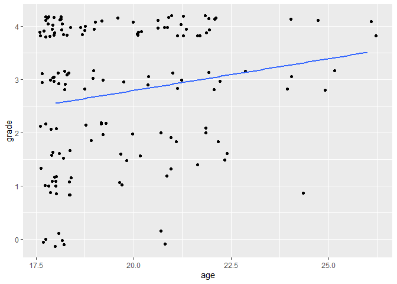
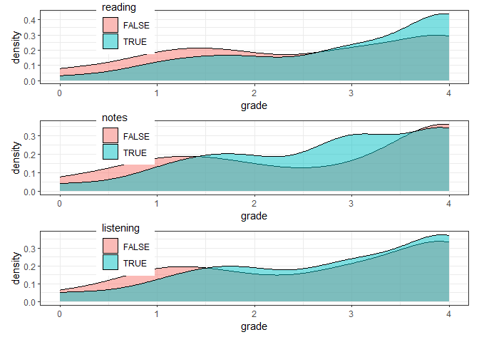
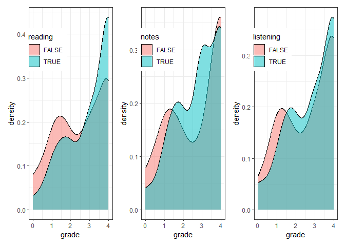

- [Installation and setup: prepare in
  advance](#installation-and-setup-prepare-in-advance)
- [Objectives](#objectives)
  - [Why R?](#why-r)
  - [Why `tidyverse`?](#why-tidyverse)
- [Introduction to R](#introduction-to-r)
  - [Objects](#objects)
  - [Functions in R](#functions-in-r)
- [Data analysis workflow](#data-analysis-workflow)
  - [Finding and importing data](#finding-and-importing-data)
  - [Data wrangling with `dplyr`](#data-wrangling-with-dplyr)
    - [Merging datasets](#merging-datasets)
    - [Filtering observations](#filtering-observations)
    - [Selecting variables](#selecting-variables)
    - [Creating new variables](#creating-new-variables)
    - [Sorting the data](#sorting-the-data)
    - [Renaming variables](#renaming-variables)
    - [Categorical variables as
      factors](#categorical-variables-as-factors)
    - [Data cleaning as a single
      pipeline](#data-cleaning-as-a-single-pipeline)
  - [Exploratory analysis](#exploratory-analysis)
    - [Summary statistics](#summary-statistics)
    - [Data visualization with
      `ggplot2`](#data-visualization-with-ggplot2)
  - [Hypothesis testing / modelling](#hypothesis-testing-modelling)
    - [t-tests](#t-tests)
    - [Correlation test](#correlation-test)
    - [Simple regression](#simple-regression)
    - [Multiple regression](#multiple-regression)
    - [ANOVA](#anova)
    - [Chi-square test](#chi-square-test)
    - [Logistic regression](#logistic-regression)
    - [Non-parametric tests](#non-parametric-tests)
    - [Effect size calculations](#effect-size-calculations)
    - [PCA and factor analysis](#pca-and-factor-analysis)
    - [Repeated measures and mixed design
      ANOVA](#repeated-measures-and-mixed-design-anova)
- [Other resources](#other-resources)

# Installation and setup: prepare in advance

Before the first workshop, please make sure that you have access to R
and RStudio on your laptop. If you need help with the installation,
please follow [this tutorial](../../tutorial/r_install).

In addition the [R basics tutorial](../../tutorial/r_basics) on the Data
Center website explains the RStudio interface, and shows how to create a
new project and how to install packages.

As a first step, please create a new project in your preferred working
directory for these workshops, install the `tidyverse` package, and load
it in your R session at the top of a new script. Note that packages need
to be installed only once, but need to be loaded at the beginning of
each new R session.

``` r
# install.packages("tidyverse")
library(tidyverse)
```

# Objectives

## Why R?

- Free and open-source
- Reproducible
- Widely used in academia and industry; up-to-date with the latest
  technological developments
- Very versatile: extensive package ecosystem for statistics and more
- Powerful data wrangling and visualization capabilities
- Extensive community support (open-access books, tutorials, forums, AI
  tools, etc.)

## Why `tidyverse`?

- Clean, consistent, intuitive, readable syntax for all steps of the
  data analysis process
- Limited set of functions that can be combined in many ways
- Many packages beyond core `tidyverse` with the same underlying design,
  grammar, and data structures, therefore easier to learn advanced
  techniques

# Introduction to R

## Objects

One of the most basic types of objects in R is a vector. A vector is a
collection of values of the same type, such as numbers, characters, or
logicals (TRUE/FALSE). You can create a vector with the `c()` function,
which stands for concatenate. If you assign a vector to an object with
the assignment operator `<-`, your vector will be saved in your
environment so you can work with it within your current R session. Some
examples of creating vectors are:

``` r
v1 <- c("A", "B", "C")  # character vector with 3 elements
v2 <- 25                # numeric vector with 1 element
v3 <- 1:10              # numeric vector with 10 elements - integers from 1 to 10
```

To subset or extract elements from a vector, you can use square brackets
`[ ]` with an index. For example, `v1[1]` returns the first element of
`v1`, `v3[2:5]` returns the 2nd to 5th elements of `v3`, and
`v3[-c(2, 4, 6)]` returns all but the 2nd, 4th and 6th elements of `v3`.

``` r
v1[1]
```

    ## [1] "A"

``` r
v3[2:5]
```

    ## [1] 2 3 4 5

``` r
v3[-c(2, 4, 6)]
```

    ## [1]  1  3  5  7  8  9 10

A dataframe (or “tibble” in `tidyverse`) is a special type of object
that combines vectors into a rectangular table. Each column of a
dataframe is a vector, and each row is an observation. usually you would
load data from an external source, but you can create a dataframe with
the `data.frame()` and a tibble with the `tibble()` function. You can
also convert other data types such as matrices to tibbles with the
`as_tibble()` function. Both functions take vectors as their arguments.
Tibbles are preferred because they are more modern and have some
convenient features that dataframes don’t, but for the most part,
differences are minor and for the most part it does not matter whether
you work with tibbles or dataframes.

A simple example of creating a tibble is (make sure to load
`tidyverse first`):

``` r
library(tidyverse)

# define vectors within the tibble() function
tibble(
  name = c("Alice", "Bob", "Chris"),
  height = c(165, 180, 175)
)
```

    ## # A tibble: 3 × 2
    ##   name  height
    ##   <chr>  <dbl>
    ## 1 Alice    165
    ## 2 Bob      180
    ## 3 Chris    175

``` r
# define the vectors first, then combine them into a tibble
name <- c("Alice", "Bob", "Chris")
height <- c(165, 180, 175)
tibble(name, height)
```

    ## # A tibble: 3 × 2
    ##   name  height
    ##   <chr>  <dbl>
    ## 1 Alice    165
    ## 2 Bob      180
    ## 3 Chris    175

## Functions in R

Functions are reusable pieces of code that perform a specific task. They
take arguments as inputs and return one or more pieces of output. You
will mostly work with functions loaded from various packages or from the
base R distribution, and in some cases you may write your own functions
to avoid repetition or improve the readability of your code. We will
cover writing your own functions later in the program.

As with vectors, the output of a function is saved to your environment
only if you assign the result to an object. For example, `sum(x)` will
display the sum of the elements of the vector `x`, but `sum <- sum(x)`
will save this result to an object.

``` r
x <- c(1, 5, 6, 2, 1, 8)

sum(x)
```

    ## [1] 23

``` r
sum <- sum(x)
```

Some important functions on vectors are

``` r
mean(x)   # return the mean; add the argument na.rm = TRUE if missing values should be excluded
```

    ## [1] 3.833333

``` r
length(x) # give the length of the vector (number of elements)
```

    ## [1] 6

``` r
unique(x) # list the unique elements of the vector
```

    ## [1] 1 5 6 2 8

To learn more about a function and its arguments, you can use the ?
operator or the help() function, for example by typing `?sum` (or
equivalently, `?sum()`). It is good practice to request help files from
your console and not you R script, since there is no need to save these
queries for the future.

# Data analysis workflow

## Finding and importing data

R can handle practically any type of data, from simple text files to
files used by other (not necessarily open-source) software and complex
databases. This gives users a lot of flexibility in terms of data
sources and formats.

In addition to using your own data (e.g. as exported from a survey), the
Data Center keeps a continuously updated list of useful datasets by
discipline, accessible [here](../../tutorial/data).

In the following, we’ll discuss how to import and export from and to
various file formats, and discuss a number of available packages to do
so.

Start by reading the introduction to importing the most common file
types (text files, Excel, SPSS, Stata) [here](../../tutorial/r_data). It
is good to be aware of the Import dataset button and use it when needed,
but in the long run it is easier to be aware of the available import
functions and use them directly. The rest of this section gives more
information and examples of importing data from different file formats
and different levels of tidiness.

We will use the following packages for importing different file formats:

``` r
library(tidyverse)
library(readxl) # for Excel
library(haven) # for SPSS, Stata, SAS
```

In addition, the `rio` package provides a generic import function,
however, it is simply a wrapper for many of the other import functions
shown below. While it may be easier to use the same import function for
many file formats, `rio` redirects you to the original functions if you
look for the possible function arguments, therefore for debugging it is
better practice to use the “original” functions. In some cases, `rio`
can read URL file paths that `readr` and `readxl` can’t.

In the following, we’ll work with some example data of student
characteristics and grades. First, download
[this](https://github.com/ucrdatacenter/projects/tree/main/apprenticeship2/data)
zip-file from GitHub, and extract it into a data folder within your
apprenticeship project directory. We now import each file, explaining
the packages, functions, and function arguments used. These files are
all different subsets of the same dataset on student characteristics and
grades at a university ([original
source](https://www.kaggle.com/datasets/jacksondivakarr/student-classification-dataset?resource=download)).

`student1.csv` is a comma-separated text file. Opening it in a notepad
or Excel shows that the column separators are commas (,). The
`read_csv()` function from the previous workshop expects commas as a
separator, while `read_csv2()` expects semicolons (common with
e.g. Dutch language settings). Since CSV files are a form of delimited
text files, we can also use the more versatile `read_delim()` function
specifying the delimiter as the argument.

In the following, we use the `read_csv()` (and `read_delim()`) function
to import the data, and assign the resulting object to an object called
`student1` with the assignment operator `<-`. The `student1` object is
now a tibble in the R environment: you can find the object in the
Environment tab in RStudio, and view the data by clicking on the object
name or running `View(student1)` in the Console.

``` r
student1 <- read_csv("data/student1.csv")
student1 <- read_delim("data/student1.csv", delim = ",")
```

In this case, we used `read_csv()` only specifying its one mandatory
argument: the file path. When using `read_delim()`, we also specified an
optional argument: we defined the delimiter as a comma, thereby
overriding the default function behavior. To learn more about the
mandatory and optional arguments of a function, and find out what the
default behaviors are, you can use the `?` operator followed by the
function name, e.g. `?read_delim` in the Console to open the help file
of a function (or use the search bar of the Help tab).

`student2.tab` is also a delimited text file. Opening it in a notepad
shows that the delimiter is a tab. The notation for tab whitespace is
`\t`, which we can specify in the `delim` argument. Like the “.tab” file
extension, “.tsv” is also a tab-separated text file, so the more
specialized `read_tsv()` function also works.

If you load this data without optional arguments, you’ll see that
instead of the correct number of columns, we get a single column, with
the variable name containing some metadata. To get the correct number of
columns, we need to skip the first row of the data that contains this
metadata, as the actual data starts from the second row. We can use the
`skip` argument to skip the first row. If we use one of the relevant
import functions, and assign the outcome to the `student2` object, we
can see that the data is now correctly imported and shows up in the
environment next to `student1` as another tibble.

``` r
student2 <- read_delim("data/student2.tab", delim = "\t", skip = 1)
student2 <- read_tsv("data/student2.tab", skip = 1)
```

`student3.xlsx` is an Excel file. To import Excel file we need the
`read_excel()` function from the `readxl` package (the `readxl` package
is one of packages that is not a part of core `tidyverse` but uses the
same principles). With the `read_excel()` function you can specify which
sheet to use in addition to similar arguments as for delimited text
files. Notice that by default R imports the “Metadata” sheet, so we can
use the `sheet` argument to specify which sheet to import. In addition,
the first two rows contain introductory text, not the data, so we can
use the `skip` argument to skip those rows. You may also notice that
previously the variable name for age was `Student_Age` and now it is
`Student_age`. You can rename the variable either by giving a full list
of column names in the import function, but often it is easier to use
the `rename()` function after importing.

``` r
student3 <- read_excel("data/student3.xlsx", sheet = "Data")
```

The `haven` package (also not core `tidyverse` but same principles)
reads files in the data formats of SPSS (.sav) and Stata (.dta). It can
also extract variable and value labels from these files; here we can use
the `read_spss()` to import `student4.sav`.

``` r
student4 <- read_spss("data/student4.sav")
```

RDS is an R-specific file format that saves all attributes of the
dataframe (e.g. grouping, factor levels). It is particularly useful for
saving intermediate data files, e.g. saving the cleaned data before
analysis to avoid needing to run the data cleaning script repeatedly. To
import an RDS file such as `student5.rds`, use the `read_rds()`
function.

``` r
student5 <- read_rds("data/student5.rds")
```

A few notes regarding importing and exporting data:

- Always make sure you know your current working directory and the
  relative path to your data directory. It is better to use relative
  rather than absolute file paths (i.e. `data/data.csv` instead of
  `C:/User/Project/data/data.csv`).
- Note that if you are using Windows, you may need to replace the
  backslashes (\\ in the file path with forward slashes (/) to avoid
  errors.
- You can import files directly from URLs, although you usually need the
  URL of a raw file. If a file downloads immediately instead of opening
  in a raw format, you can try to copy that download link by
  right-clicking and selecting “Copy link address”; the `import()`
  function from `rio` might be successful with those links.
- To export data from R, you can almost always use the `write_...()`
  function corresponding to the desired file format, e.g. `write_csv()`.
  For Excel files the preferred export function is `write_xlsx()`, and
  for SPSS’s .sav files it is `write_sav()`.
- For other file formats, the generic `write()` function is useful; you
  can specify any file format, and if your input data is readable in the
  chosen format, the file will export properly.
- In all `write_()` functions you need to specify the data you’d like to
  save and the output file path (absolute or relative) including chosen
  file extension.

``` r
# example export code
write_csv(student1, "data/new_csv_data.csv")
```

## Data wrangling with `dplyr`

Data wrangling is the process of cleaning, structuring, and enriching
raw data into a more usable format. The `dplyr` package is a part of the
`tidyverse` and provides a set of functions that can be combined to
perform the most common data wrangling tasks. The package is built
around the concept of the “grammar of data manipulation”, which is a
consistent set of verbs that can be combined in many ways to achieve the
desired result.

The main functions in `dplyr` are `filter()`, `select()`, `mutate()`,
`arrange()`, `group_by()`, `summarize()`, and `rename()`. `dplyr` also
provides a set of functions for combining datasets: `bind_rows()` and
`bind_cols()` for row-wise and column-wise binding, and `left_join()`,
`right_join()`, `inner_join()`, and `full_join()` for joining datasets
based on common variables. These functions can be combined using the
pipe operator `|>` (or `%>%`, they are mostly equivalent) to create a
data wrangling workflow. The pipe operator takes the output of the
function on its left and passes it as the first argument to the function
on its right. This allows you to chain multiple functions together in a
single line of code, making your code more readable and easier to
understand.

In the following, we’ll work with the `student` datasets and show how to
use the main `dplyr` functions to clean the data so it is suitable for
analysis. These steps are useful even if the input data is quite clean,
as we often need to work with only a subset of observations/variables,
define new variables, or aggregate the data.

### Merging datasets

In our current application, we have five datasets that contain different
observations of the same, larger dataset. So we can list all datasets in
a row-binding function to combine them into a single dataset called
`student`.

``` r
student <- bind_rows(student1, student2, student3, student4, student5)
```

In the following, we’ll demonstrate the key data cleaning functions on
this merged tibble.

### Filtering observations

If we want to keep only a subset of observations, we can use the
`filter()` function. We can specify a logical condition as the argument
to `filter()`, and only observations that meet that condition will be
kept. For example, to keep only students who are over 21 years old, we
can use the following code:

``` r
filter(student, Student_Age > 21)
```

    ## # A tibble: 27 × 15
    ##       Id Student_Age Sex    High_School_Type Scholarship Additional_Work
    ##    <dbl>       <dbl> <chr>  <chr>            <chr>       <chr>          
    ##  1  5005          22 Male   Private          50%         No             
    ##  2  5015          26 Male   State            75%         Yes            
    ##  3  5016          22 Male   State            50%         No             
    ##  4  5018          22 Male   State            50%         No             
    ##  5  5023          22 Male   State            50%         Yes            
    ##  6  5024          25 Male   State            25%         Yes            
    ##  7  5029          24 Male   State            50%         No             
    ##  8  5032          25 Male   State            50%         Yes            
    ##  9  5040          22 Female State            50%         No             
    ## 10  5042          24 Male   State            50%         Yes            
    ## # ℹ 17 more rows
    ## # ℹ 9 more variables: Sports_activity <chr>, Transportation <chr>,
    ## #   Weekly_Study_Hours <dbl>, Attendance <chr>, Reading <chr>, Notes <chr>,
    ## #   Listening_in_Class <chr>, Project_work <chr>, Grade <chr>

In a pipe workflow, the same code would look like this:

``` r
student |> 
  filter(Student_Age > 21)
```

    ## # A tibble: 27 × 15
    ##       Id Student_Age Sex    High_School_Type Scholarship Additional_Work
    ##    <dbl>       <dbl> <chr>  <chr>            <chr>       <chr>          
    ##  1  5005          22 Male   Private          50%         No             
    ##  2  5015          26 Male   State            75%         Yes            
    ##  3  5016          22 Male   State            50%         No             
    ##  4  5018          22 Male   State            50%         No             
    ##  5  5023          22 Male   State            50%         Yes            
    ##  6  5024          25 Male   State            25%         Yes            
    ##  7  5029          24 Male   State            50%         No             
    ##  8  5032          25 Male   State            50%         Yes            
    ##  9  5040          22 Female State            50%         No             
    ## 10  5042          24 Male   State            50%         Yes            
    ## # ℹ 17 more rows
    ## # ℹ 9 more variables: Sports_activity <chr>, Transportation <chr>,
    ## #   Weekly_Study_Hours <dbl>, Attendance <chr>, Reading <chr>, Notes <chr>,
    ## #   Listening_in_Class <chr>, Project_work <chr>, Grade <chr>

We can also apply logical conditions to character variables, e.g. to
keep only students who went to a private high school and who did not
receive a failing grade. Filters can be combined with AND (`,` or `&`)
and OR (`|`) operators into a single function. Note the use of quotation
marks around the character values in the logical condition and the
double equal sign `==` to denote equality.

``` r
student |> 
  filter(High_School_Type == "Private", Grade != "Fail") 
```

    ## # A tibble: 23 × 15
    ##       Id Student_Age Sex    High_School_Type Scholarship Additional_Work
    ##    <dbl>       <dbl> <chr>  <chr>            <chr>       <chr>          
    ##  1  5004          18 Female Private          50%         Yes            
    ##  2  5005          22 Male   Private          50%         No             
    ##  3  5011          18 Female Private          50%         No             
    ##  4  5020          18 Male   Private          50%         No             
    ##  5  5028          18 Male   Private          50%         Yes            
    ##  6  5035          18 Male   Private          50%         No             
    ##  7  5036          18 Male   Private          75%         No             
    ##  8  5041          18 Male   Private          50%         No             
    ##  9  5050          18 Male   Private          75%         No             
    ## 10  5077          20 Male   Private          25%         No             
    ## # ℹ 13 more rows
    ## # ℹ 9 more variables: Sports_activity <chr>, Transportation <chr>,
    ## #   Weekly_Study_Hours <dbl>, Attendance <chr>, Reading <chr>, Notes <chr>,
    ## #   Listening_in_Class <chr>, Project_work <chr>, Grade <chr>

Another useful logical operator is `%in%`, which allows you to filter
observations based on a list of values. For example, to keep only
students who receive either 75% or 100% scholarships, we can use the
following code:

``` r
student |> 
  filter(Scholarship %in% c("75%", "100%"))
```

    ## # A tibble: 65 × 15
    ##       Id Student_Age Sex    High_School_Type Scholarship Additional_Work
    ##    <dbl>       <dbl> <chr>  <chr>            <chr>       <chr>          
    ##  1  5007          18 Male   State            75%         No             
    ##  2  5012          18 Female Private          75%         Yes            
    ##  3  5013          18 Female Private          75%         No             
    ##  4  5014          19 Female State            100%        No             
    ##  5  5015          26 Male   State            75%         Yes            
    ##  6  5017          18 Female State            100%        No             
    ##  7  5019          18 Female State            75%         No             
    ##  8  5021          18 Male   State            100%        Yes            
    ##  9  5022          18 Male   State            100%        No             
    ## 10  5030          19 Male   Other            75%         No             
    ## # ℹ 55 more rows
    ## # ℹ 9 more variables: Sports_activity <chr>, Transportation <chr>,
    ## #   Weekly_Study_Hours <dbl>, Attendance <chr>, Reading <chr>, Notes <chr>,
    ## #   Listening_in_Class <chr>, Project_work <chr>, Grade <chr>

### Selecting variables

If we want to keep only a subset of variables, we can use the `select()`
function. We can specify the variables we want to keep (or exclude, with
`-` signs) as the arguments to `select()`, and only those variables will
be kept. For example, to keep only the `Id` and `Student_Age` variables,
we can use the following code:

``` r
select(student, Id, Student_Age)
```

    ## # A tibble: 145 × 2
    ##       Id Student_Age
    ##    <dbl>       <dbl>
    ##  1  5001          21
    ##  2  5002          20
    ##  3  5003          21
    ##  4  5004          18
    ##  5  5005          22
    ##  6  5006          20
    ##  7  5007          18
    ##  8  5008          18
    ##  9  5009          19
    ## 10  5010          21
    ## # ℹ 135 more rows

We can also select columns based on their location in the dataframe or
by looking for patterns in the column names:

``` r
select(student, 1:3) # select the first three columns
```

    ## # A tibble: 145 × 3
    ##       Id Student_Age Sex   
    ##    <dbl>       <dbl> <chr> 
    ##  1  5001          21 Male  
    ##  2  5002          20 Male  
    ##  3  5003          21 Male  
    ##  4  5004          18 Female
    ##  5  5005          22 Male  
    ##  6  5006          20 Male  
    ##  7  5007          18 Male  
    ##  8  5008          18 Female
    ##  9  5009          19 Female
    ## 10  5010          21 Female
    ## # ℹ 135 more rows

``` r
select(student, starts_with("Student")) # select columns that start with "Student"
```

    ## # A tibble: 145 × 1
    ##    Student_Age
    ##          <dbl>
    ##  1          21
    ##  2          20
    ##  3          21
    ##  4          18
    ##  5          22
    ##  6          20
    ##  7          18
    ##  8          18
    ##  9          19
    ## 10          21
    ## # ℹ 135 more rows

``` r
select(student, -Grade) # keep everything but "Grade"
```

    ## # A tibble: 145 × 14
    ##       Id Student_Age Sex    High_School_Type Scholarship Additional_Work
    ##    <dbl>       <dbl> <chr>  <chr>            <chr>       <chr>          
    ##  1  5001          21 Male   Other            50%         Yes            
    ##  2  5002          20 Male   Other            50%         Yes            
    ##  3  5003          21 Male   State            50%         No             
    ##  4  5004          18 Female Private          50%         Yes            
    ##  5  5005          22 Male   Private          50%         No             
    ##  6  5006          20 Male   State            50%         No             
    ##  7  5007          18 Male   State            75%         No             
    ##  8  5008          18 Female State            50%         Yes            
    ##  9  5009          19 Female Other            50%         No             
    ## 10  5010          21 Female State            50%         No             
    ## # ℹ 135 more rows
    ## # ℹ 8 more variables: Sports_activity <chr>, Transportation <chr>,
    ## #   Weekly_Study_Hours <dbl>, Attendance <chr>, Reading <chr>, Notes <chr>,
    ## #   Listening_in_Class <chr>, Project_work <chr>

``` r
select(student, -c(2, 6, 10)) # keep everything but the 2nd, 6th, and 10th columns
```

    ## # A tibble: 145 × 12
    ##       Id Sex    High_School_Type Scholarship Sports_activity Transportation
    ##    <dbl> <chr>  <chr>            <chr>       <chr>           <chr>         
    ##  1  5001 Male   Other            50%         No              Private       
    ##  2  5002 Male   Other            50%         No              Private       
    ##  3  5003 Male   State            50%         No              Private       
    ##  4  5004 Female Private          50%         No              Bus           
    ##  5  5005 Male   Private          50%         No              Bus           
    ##  6  5006 Male   State            50%         No              Private       
    ##  7  5007 Male   State            75%         No              Private       
    ##  8  5008 Female State            50%         Yes             Bus           
    ##  9  5009 Female Other            50%         Yes             Bus           
    ## 10  5010 Female State            50%         No              Bus           
    ## # ℹ 135 more rows
    ## # ℹ 6 more variables: Weekly_Study_Hours <dbl>, Reading <chr>, Notes <chr>,
    ## #   Listening_in_Class <chr>, Project_work <chr>, Grade <chr>

A pipe workflow allows us to combine the filtering and selecting
operations into a single, step-by-step workflow:

``` r
student |> 
  filter(Student_Age > 21) |> 
  select(Id, Student_Age)
```

    ## # A tibble: 27 × 2
    ##       Id Student_Age
    ##    <dbl>       <dbl>
    ##  1  5005          22
    ##  2  5015          26
    ##  3  5016          22
    ##  4  5018          22
    ##  5  5023          22
    ##  6  5024          25
    ##  7  5029          24
    ##  8  5032          25
    ##  9  5040          22
    ## 10  5042          24
    ## # ℹ 17 more rows

### Creating new variables

If we want to create a new variable based on existing variables, we can
use the `mutate()` function. We can specify the new variable name and
the calculation for the new variable as the arguments to `mutate()`, and
the new variable will be added to the dataset. For example, we can
create a new variable `Daily_Study_Hours` that divides
`Weekly_Study_Hours` by 5, a new variable `Class_Participation` that is
a logical variable indicating whether the student has at least one “Yes”
answer for reading, listening, and taking notes, and a new variable
`Scholarship_num` that extracts the numeric value of `Scholarship` if
the string contains a number.

``` r
student |> 
  # create new variables
  mutate(Daily_Study_Hours = Weekly_Study_Hours / 5,
         Class_Participation = Reading == "Yes" | Listening_in_Class == "Yes" | Notes == "Yes",
         Scholarship_num = parse_number(Scholarship)) |> 
  # show only ID and the new variables
  select(Id, Daily_Study_Hours, Class_Participation, Scholarship_num)
```

    ## # A tibble: 145 × 4
    ##       Id Daily_Study_Hours Class_Participation Scholarship_num
    ##    <dbl>             <dbl> <lgl>                         <dbl>
    ##  1  5001               0   TRUE                             50
    ##  2  5002               0   TRUE                             50
    ##  3  5003               0.4 FALSE                            50
    ##  4  5004               0.4 TRUE                             50
    ##  5  5005               2.4 TRUE                             50
    ##  6  5006               0.4 TRUE                             50
    ##  7  5007               0   TRUE                             75
    ##  8  5008               0.4 TRUE                             50
    ##  9  5009               0   FALSE                            50
    ## 10  5010               2.4 TRUE                             50
    ## # ℹ 135 more rows

### Sorting the data

If we want to sort the data based on one or more variables, we can use
the `arrange()` function, taking the tibble and a variable list as its
arguments. By default, `arrange()` sorts in ascending order, but you can
specify descending order by using the `desc()` function. For example, to
sort the data by `Student_Age` in descending order, and
`Weekly_Study_Hours` in ascending order, we can use the following code:

``` r
student |> 
  arrange(desc(Student_Age), Weekly_Study_Hours)
```

    ## # A tibble: 145 × 15
    ##       Id Student_Age Sex    High_School_Type Scholarship Additional_Work
    ##    <dbl>       <dbl> <chr>  <chr>            <chr>       <chr>          
    ##  1  5118          26 Female Private          50%         No             
    ##  2  5015          26 Male   State            75%         Yes            
    ##  3  5032          25 Male   State            50%         Yes            
    ##  4  5056          25 Male   State            50%         Yes            
    ##  5  5024          25 Male   State            25%         Yes            
    ##  6  5029          24 Male   State            50%         No             
    ##  7  5082          24 Male   State            50%         Yes            
    ##  8  5042          24 Male   State            50%         Yes            
    ##  9  5085          24 Male   Other            50%         Yes            
    ## 10  5059          23 Male   State            50%         No             
    ## # ℹ 135 more rows
    ## # ℹ 9 more variables: Sports_activity <chr>, Transportation <chr>,
    ## #   Weekly_Study_Hours <dbl>, Attendance <chr>, Reading <chr>, Notes <chr>,
    ## #   Listening_in_Class <chr>, Project_work <chr>, Grade <chr>

### Renaming variables

If we want to rename variables, we can use the `rename()` function with
the argument structure `new name = old name`. For example, we can rename
the `Student_Age` variable to `age` and the `Weekly_Study_Hours`
variable to `weekly_hours`, we can use the following code:

``` r
student |> 
  rename(age = Student_Age, weekly_hours = Weekly_Study_Hours)
```

    ## # A tibble: 145 × 15
    ##       Id   age Sex    High_School_Type Scholarship Additional_Work
    ##    <dbl> <dbl> <chr>  <chr>            <chr>       <chr>          
    ##  1  5001    21 Male   Other            50%         Yes            
    ##  2  5002    20 Male   Other            50%         Yes            
    ##  3  5003    21 Male   State            50%         No             
    ##  4  5004    18 Female Private          50%         Yes            
    ##  5  5005    22 Male   Private          50%         No             
    ##  6  5006    20 Male   State            50%         No             
    ##  7  5007    18 Male   State            75%         No             
    ##  8  5008    18 Female State            50%         Yes            
    ##  9  5009    19 Female Other            50%         No             
    ## 10  5010    21 Female State            50%         No             
    ## # ℹ 135 more rows
    ## # ℹ 9 more variables: Sports_activity <chr>, Transportation <chr>,
    ## #   weekly_hours <dbl>, Attendance <chr>, Reading <chr>, Notes <chr>,
    ## #   Listening_in_Class <chr>, Project_work <chr>, Grade <chr>

### Categorical variables as factors

It is often useful to clearly define the levels of a categorical
variable, especially if these levels have a meaningful ordering. For
unordered categories, R provides the data type `factor`, while for
ordered variables the relevant data type is `ordered`. Factor and
ordered values appear as character strings when viewed, but are treated
as numbers with labels internally, which makes it easier to show
descriptives of the variable and include it in models. For example, we
can define `High_School_Type` as a factor with three levels and
`Attendance` as ordered with the `factor()` and `ordered()` functions.
If we don’t specify the levels of the factor explicitly, then the levels
will be sorted alphabetically.

``` r
student |> 
  mutate(High_School_Type = factor(High_School_Type),
         Attendance = ordered(Attendance, levels = c("Never", "Sometimes", "Always"))) |> 
  select(High_School_Type, Attendance) |> 
  # view variable types and levels by looking at the structure of the data
  str()
```

    ## tibble [145 × 2] (S3: tbl_df/tbl/data.frame)
    ##  $ High_School_Type: Factor w/ 3 levels "Other","Private",..: 1 1 3 2 2 3 3 3 1 3 ...
    ##  $ Attendance      : Ord.factor w/ 3 levels "Never"<"Sometimes"<..: 3 3 1 3 3 3 3 2 3 1 ...

### Data cleaning as a single pipeline

Until now we didn’t save any of our data wrangling steps as new objects,
so the original `student1` object is still unchanged. If we want to save
the cleaned data as a new object, we can assign the result of the pipe
workflow to a new object.

``` r
student_subset <- student1 |> 
  filter(Student_Age > 21) |> 
  select(Id, Student_Age) |> 
  arrange(desc(Student_Age)) |> 
  rename(age = Student_Age)
```

To prepare for the rest of the analysis, let’s create a new `data`
object that keeps all observations, and converts some of the indicators
to numeric and logical, and rename the relevant variables to convenient
“snake case”:

``` r
data <- student |> 
  mutate(scholarship = parse_number(Scholarship),
         # ifelse contains a logical condition, a value if TRUE, and a value if FALSE
         additional_work = ifelse(Additional_Work == "Yes", TRUE, FALSE),
         reading = ifelse(Reading == "Yes", TRUE, FALSE),
         notes = ifelse(Notes == "Yes", TRUE, FALSE),
         listening = ifelse(Listening_in_Class == "Yes", TRUE, FALSE),
         # case_when is an expansion of ifelse: it allows multiple conditions
         # the value after the tilde (~) is the value if the condition is TRUE
         grade = case_when(
           Grade == "Fail" ~ 0,
           Grade == "DD" ~ 1,
           Grade == "DC" ~ 1.5,
           Grade == "CC" ~ 2,
           Grade == "CB" ~ 3,
           Grade == "BB" ~ 3,
           Grade == "BA" ~ 4,
           Grade == "AA" ~ 4
         )) |> 
  rename(id = Id, age = Student_Age) |> 
  select(id, age, scholarship, additional_work, reading, notes, listening, grade)
```

## Exploratory analysis

### Summary statistics

To get a descriptive statistic of a single variable in a tibble, we can
use that variable as an argument to a relevant function (using `$` to
refer to a variable in a tibble).

``` r
mean(data$age)
```

    ## [1] 19.68276

``` r
median(data$age)
```

    ## [1] 19

``` r
sd(data$grade)
```

    ## [1] 1.281705

To get the frequencies of a categorical variable, we can use the
`count()` function, with the `sort = TRUE` argument returning the values
in descending frequency. `count()` is a tidy function that works well
with pipe workflows and can count the joint frequencies of multiple
variables.

``` r
# frequencies of a single variable
count(data, reading)
```

    ## # A tibble: 2 × 2
    ##   reading     n
    ##   <lgl>   <int>
    ## 1 FALSE      76
    ## 2 TRUE       69

``` r
# joint frequency distribution
count(data, reading, listening, notes)
```

    ## # A tibble: 8 × 4
    ##   reading listening notes     n
    ##   <lgl>   <lgl>     <lgl> <int>
    ## 1 FALSE   FALSE     FALSE    14
    ## 2 FALSE   FALSE     TRUE     23
    ## 3 FALSE   TRUE      FALSE    20
    ## 4 FALSE   TRUE      TRUE     19
    ## 5 TRUE    FALSE     FALSE    19
    ## 6 TRUE    FALSE     TRUE     14
    ## 7 TRUE    TRUE      FALSE    15
    ## 8 TRUE    TRUE      TRUE     21

To get the correlation coefficient between two variables, we can use the
`cor()` function in the same way we used other descriptives such as
`mean()`.

``` r
cor(data$age, data$grade)
```

    ## [1] 0.1856025

The easiest way to get summary statistics of all variables in a tibble
is with the `summary()` function: this function shows the distribution
of numeric variables, the frequencies of categorical variables, and the
number of missing values for each variable.

``` r
summary(data)
```

    ##        id            age         scholarship     additional_work
    ##  Min.   :5001   Min.   :18.00   Min.   : 25.00   Mode :logical  
    ##  1st Qu.:5037   1st Qu.:18.00   1st Qu.: 50.00   FALSE:96       
    ##  Median :5073   Median :19.00   Median : 50.00   TRUE :49       
    ##  Mean   :5073   Mean   :19.68   Mean   : 64.76                  
    ##  3rd Qu.:5109   3rd Qu.:21.00   3rd Qu.: 75.00                  
    ##  Max.   :5145   Max.   :26.00   Max.   :100.00                  
    ##                                 NA's   :1                       
    ##   reading          notes         listening           grade      
    ##  Mode :logical   Mode :logical   Mode :logical   Min.   :0.000  
    ##  FALSE:76        FALSE:68        FALSE:70        1st Qu.:1.500  
    ##  TRUE :69        TRUE :77        TRUE :75        Median :3.000  
    ##                                                  Mean   :2.755  
    ##                                                  3rd Qu.:4.000  
    ##                                                  Max.   :4.000  
    ## 

The `summary()` function is useful for viewing the data in the Console,
but doesn’t export to outside of R nicely. There are a few packages
available for generating simple summary statistics tables that contain
information about the central tendencies and dispersion of the data,
such as `vtable` or `stargazer` (with many more available). These
packages all have different default settings, output types, and
customization options.

``` r
library(vtable)
library(stargazer)

# vtable

data |> 
  # by default creates HTML table; out = "csv" returns a dataframe
  # can change which descriptives to keep
  # can report group-level descriptives
  sumtable(out = "csv", group = "reading")
```

    ##           Variable  N Mean  SD   N Mean  SD
    ## 1          reading No          Yes         
    ## 2               id 76 5080  44  69 5066  39
    ## 3              age 76   20 2.3  69   20 1.7
    ## 4      scholarship 75   65  18  69   64  21
    ## 5  additional_work 76           69         
    ## 6           ... No 47  62%      49  71%    
    ## 7          ... Yes 29  38%      20  29%    
    ## 8            notes 76           69         
    ## 9           ... No 34  45%      34  49%    
    ## 10         ... Yes 42  55%      35  51%    
    ## 11       listening 76           69         
    ## 12          ... No 37  49%      33  48%    
    ## 13         ... Yes 39  51%      36  52%    
    ## 14           grade 76  2.5 1.3  69    3 1.2

``` r
# stargazer

data |> 
  # input needs to be a data.frame, not tibble
  as.data.frame() |> 
  # default output is LaTeX table
  # can be exported with the out argument or a following write() function
  # can change which descriptives to keep or omit
  # limited to numeric variables
  stargazer(type = "text")
```

    ## 
    ## ==================================================
    ## Statistic        N    Mean    St. Dev.  Min   Max 
    ## --------------------------------------------------
    ## id              145 5,073.000  42.002  5,001 5,145
    ## age             145  19.683    1.992    18    26  
    ## scholarship     144  64.757    19.480   25    100 
    ## additional_work 145   0.338    0.475     0     1  
    ## reading         145   0.476    0.501     0     1  
    ## notes           145   0.531    0.501     0     1  
    ## listening       145   0.517    0.501     0     1  
    ## grade           145   2.755    1.282   0.000 4.000
    ## --------------------------------------------------

Alternatively, we can define our own summary statistics with the `dplyr`
functions `group_by()` and `summarize()`, which also easily allows the
calculation of more complex descriptive statistics, including grouped
statistics based on categorical variables. The `across()` helper
function in the `summarize()` function can be used to apply the same
calculation to multiple variables at once: it requires the first
argument as the list of variables (potentially with the help of selector
functions) and the function we’d like to apply.

``` r
# tibble of mean and sd for a single variable
data |> 
  summarize(mean_grade = mean(grade),
            sd_grade = sd(grade))
```

    ## # A tibble: 1 × 2
    ##   mean_grade sd_grade
    ##        <dbl>    <dbl>
    ## 1       2.76     1.28

``` r
# mean and sd of age and grade variables, grouped by reading
data |> 
  group_by(reading) |> 
  # .names allows overriding default option to reuse original column names
  summarize(across(c(age, grade), mean, .names = "mean_{.col}"),
            across(c(age, grade), sd, .names = "sd_{.col}"))
```

    ## # A tibble: 2 × 5
    ##   reading mean_age mean_grade sd_age sd_grade
    ##   <lgl>      <dbl>      <dbl>  <dbl>    <dbl>
    ## 1 FALSE       19.7       2.54   2.27     1.34
    ## 2 TRUE        19.7       2.99   1.66     1.18

``` r
# mean of all numeric variables, grouped by reading
data |> 
  group_by(reading) |> 
  # where() is a helper function evaluating the contents of variables
  # specify full function call with ~ at the start and .x replacing the variable name
  summarize(across(where(is.numeric), ~mean(.x, na.rm = TRUE)))
```

    ## # A tibble: 2 × 5
    ##   reading    id   age scholarship grade
    ##   <lgl>   <dbl> <dbl>       <dbl> <dbl>
    ## 1 FALSE   5080.  19.7        65    2.54
    ## 2 TRUE    5066.  19.7        64.5  2.99

``` r
# mean of all variables with names containing the letter a
data |> 
  summarize(across(contains("a"), ~mean(.x, na.rm = TRUE)))
```

    ## # A tibble: 1 × 5
    ##     age scholarship additional_work reading grade
    ##   <dbl>       <dbl>           <dbl>   <dbl> <dbl>
    ## 1  19.7        64.8           0.338   0.476  2.76

``` r
# sample size of each group and correlation between age and grade per group
data |> 
  group_by(reading, listening) |> 
  summarize(age_grade_correlation = cor(age, grade),
            n = n())
```

    ## # A tibble: 4 × 4
    ## # Groups:   reading [2]
    ##   reading listening age_grade_correlation     n
    ##   <lgl>   <lgl>                     <dbl> <int>
    ## 1 FALSE   FALSE                    0.267     37
    ## 2 FALSE   TRUE                     0.334     39
    ## 3 TRUE    FALSE                    0.0720    33
    ## 4 TRUE    TRUE                    -0.0777    36

The list of helper functions that can be used instead of listing which
variables to include/exclude is in the help file accessible with
`?dplyr_tidy_select`.

To export a descriptive statistics table, we can use the relevant
`write...()` function shown in the data importing section
(e.g. `write_csv()` for tibbles, general `write()` for HTML, plain text,
LaTeX, other general types). CSV tables already copy nicely into e.g. MS
Word. If using LaTeX or RMarkdown, the `knitr` package contains the
`kable()` function that directly improves on the design of the table
without needing formatting afterwards.

``` r
data |> 
  count(reading, listening) |> 
  write_csv("table1.csv")
```

``` r
data |> 
  count(reading, listening) |> 
  # knitr:: allows using function from the package without library(knitr)
  knitr::kable()
```

| reading | listening |   n |
|:--------|:----------|----:|
| FALSE   | FALSE     |  37 |
| FALSE   | TRUE      |  39 |
| TRUE    | FALSE     |  33 |
| TRUE    | TRUE      |  36 |

### Data visualization with `ggplot2`

This section introduces data visualization in R, primarily using the
`ggplot2` package (included in `tidyverse`). The tutorial draws on [*A
ggplot2 Tutorial for Beautiful Plotting in
R*](https://cedricscherer.netlify.app/2019/08/05/a-ggplot2-tutorial-for-beautiful-plotting-in-r/)
by Cédric Scherer.

**The logic of `ggplot2`**

The `ggplot2` package builds up figures in layers, by adding elements
one at a time. You always start with a base `ggplot` where you specify
the data used by the plot and possibly the variables to place on each
axis. These variables are specified within an `aes()` function, which
stands for aesthetics.

The `ggplot()` function in itself only creates a blank canvas; we need
to add so-called geoms to actually plot the data. You can choose from a
wide range of geoms, and also use multiple geoms in one plot. You can
add elements to a `ggplot` objects with the `+` sign. You should think
of the `+` sign in `ggplot` workflows in the same way you think of the
pipe operators in data wrangling workflows.

**Univariate plots**

You can plot a single continuous variable with a histogram, a density
plot, or a boxplot. Other than the name of the dataset and the variable,
no additional arguments need to be specified; but you can customize the
plot by adding arguments to the `geom_` functions.

``` r
# binwidth or bins determine the number of bins
# qith binwidth = 1, each bin is 1 year wide
ggplot(data, aes(x = age)) +
  geom_histogram(binwidth = 1, color = "black", fill = "lightblue")
```

<!-- -->

``` r
ggplot(data, aes(x = age)) +
  geom_density(fill = "lightblue", alpha = 0.5)
```

<!-- -->

``` r
ggplot(data, aes(x = age)) +
  geom_boxplot()
```

<!-- -->

To compare the frequencies of discrete variables, you can use a bar
plot.

``` r
ggplot(data, aes(x = additional_work)) +
  geom_bar()
```

<!-- -->

**Bivariate plots**

You can plot two continuous variables with a scatter plot. For example,
you can plot the relationship between age and grade by specifying these
variables as the x and y aesthetics:

``` r
ggplot(data, aes(x = age, y = grade)) +
  geom_point()
```

<!-- -->

Fitting a smooth curve or a linear regression line to the scatter plot
can help you see the overall trend in the data.

``` r
ggplot(data, aes(x = age, y = grade)) +
  geom_point() + 
  geom_smooth()
```

<!-- -->

``` r
ggplot(data, aes(x = age, y = grade)) +
  geom_point() + 
  # method = "lm" fits a linear model, se = FALSE removes the confidence interval
  geom_smooth(method = "lm", se = FALSE)
```

<!-- -->

If points overlap a lot, it might be useful to add some jitter,
i.e. random noise to distribute the points, by using `geom_jitter()`
instead of `geom_point()`.

``` r
ggplot(data, aes(x = age, y = grade)) +
  geom_jitter() + 
  geom_smooth(method = "lm", se = FALSE)
```

<!-- -->

Categorical variables can be used to show the distribution of continuous
variables by group. You can put a categorical variable on one of the
axes, or use it on another aesthetic, such as the fill or color. Note
that if a variable determines the fill, the color, and the shape of the
points, that has to be specified inside an `aes()` function, while if
the characteristic is pre-defined, then it goes outside the `aes()`
function. Also note that if you specify aesthetics in the main
`ggplot()` function, then they apply to all geoms, while if you specify
them in a `geom_...()` function, they apply only to that geom.

``` r
ggplot(data, aes(x = grade, y = additional_work)) +
  geom_boxplot()
```

<!-- -->

``` r
ggplot(data) +
  geom_density(aes(x = grade, fill = additional_work), alpha = 0.5)
```

<!-- -->

To plot two categorical variables, you can use a bar plot with an extra
grouping argument. The next plot shows the number of students who do the
class readings or not, and for each group we know whether they work take
notes in class or not.

``` r
ggplot(data, aes(x = reading, fill = notes)) +
  geom_bar()
```

<!-- -->

``` r
# to put the bars next to each other instead of on top, specify the position
ggplot(data, aes(x = reading, fill = notes)) +
  geom_bar(position = "dodge")
```

<!-- -->

Alternatively, you can use the `count()` function to count the number of
observations in each possible combination of the two variables, and plot
the results on a heatmap where lighter colors correspond to larger
frequencies. To make the plot more readable, you can add the observed
counts to the tiles with a `geom_text()` function, which requires an
extra aesthetic `label`.

``` r
data |> 
  count(reading, notes) |> 
  ggplot(aes(x = reading, y = notes, fill = n)) +
  geom_tile(color = "white") +
  geom_text(aes(label = n), color = "white")
```

<!-- -->

**Customizing plot features**

The two largest advantages of `ggplot2` are the ability to layer
multiple geoms on top of each other and the ability to extensively
customize every plot by adding additional plot elements.

You can make the plot more informative by adding titles and axis labels.

``` r
ggplot(data, aes(x = grade, y = reading)) +
  geom_boxplot() +
  labs(title = "Grade distribution based on whether the student does the reading",
       x = "Grade",
       y = "Student does the reading?")
```

<!-- -->

You can also change the appearance of the plot by changing the theme,
the color palette, and the axis scales.

``` r
ggplot(data, aes(x = grade, y = reading)) +
  geom_boxplot() +
  labs(title = "Grade distribution based on whether the student does the reading",
       x = "Grade",
       y = "Student does the reading?") +
  # define the axis tick positions on the continuous x axis
  scale_x_continuous(breaks = seq(0, 4, 0.5)) +
  # relabel the items on the discrete y axis
  scale_y_discrete(breaks = c(FALSE, TRUE), labels = c("No", "Yes")) +
  # change the theme to a pre-defined theme
  theme_light()
```

<!-- -->

``` r
ggplot(data, aes(x = reading, fill = notes)) +
  geom_bar() +
  labs(x = "Student does the reading?",
       y = "Number of students",
       fill = "Student takes notes?") +
  # change the colors to a palette from the RColorBrewer package
  scale_fill_brewer(palette = "Set1") +
  theme_light()
```

<!-- -->

You can change the theme in your entire R session by using the
`theme_set()` function. In that case, you don’t need to include the
`theme_...()` function in every plot. For example:

``` r
theme_set(theme_bw()) # change the theme of all future plots to a black-and-white theme
```

**More advanced features**

The [R Graph Gallery](https://r-graph-gallery.com/) provides a long list
of common plot types, and so do Chapters 4 and 5 of [*Modern Data
Visualization with R*](https://rkabacoff.github.io/datavis/index.html).
Both resources group geoms by the type of variable(s) plotted.

You can use multiple datasets inside the same plot by specifying a new
dataset (such as a filtered version of the original dataset) in the
`data` argument of a `geom_...()` function. This feature can be useful
to highlight particular observations, such as the location of the one
student who doesn’t receive a scholarship on the age-grade scatterplot.

``` r
ggplot(data, aes(x = age, y = grade)) +
  geom_point() +
  geom_point(data = filter(data, is.na(scholarship)), color = "red") +
  labs(caption = "The red point corresponds to the student without a scholarship")
```

<!-- -->

**Multiple plots**

Often you would like to present multiple plots side-by-side: maybe show
how the relationship between variables differs depending on some
groupings of observations (and putting all observations on a single plot
looks too cluttered), or compare how different outcome variables react
to changes in an explanatory variable. The two main ways to nicely
arrange plots are

- creating a single plot with multiple panels, known as facets;
- creating multiple independent plots, and arranging them into one
  figure afterwards.

*Using facets*

By specifying a grouping variable along which to facet, you can create a
separate plot for each value of your facet variable. You can create
faceted plots by adding `facet_wrap()` to your `ggplot` object, and
specify the faceting variable with a tilde (`~`). You can also specify
additional arguments such as whether to allow the axis limits to vary
between panels. Only use variables with relatively few unique values as
your facet dimension, otherwise R will attempt to create far too many
plots, which takes a long time and might even crash your R session.

``` r
ggplot(data, aes(x = age)) +
  geom_histogram(binwidth = 1) +
  # Create separate plots based on whether the student does the reading
  facet_wrap(~reading)
```

<!-- -->

``` r
ggplot(data, aes(x = age)) +
  geom_histogram(binwidth = 1) +
  # Create separate plots per season, arrange all plots in one column, let all scales vary
  facet_wrap(~reading, ncol = 1, scales = "free")
```

<!-- -->

If you would like to group your data based on two variables, you can use
`facet_grid()`, separating your two variables with a tilde. In this
example, let’s rename the variable values to make it clear which group
each plot represents.

``` r
data |> 
  mutate(reading = ifelse(reading, "Reading", "No reading"),
         notes = ifelse(notes, "Notes", "No notes")) |>
  ggplot(aes(x = age)) +
  geom_histogram(binwidth = 1) +
  # Create separate plots based on whether the student does the reading and takes notes
  facet_grid(~reading~notes)
```

<!-- -->

*Combining independent plots with `patchwork`*

In order to nicely arrange separate plots and same them as a single
file, you can use the `patchwork packages`. First you need to save each
of your plots into an R object (here `p1`, `p2`, `p3`), then use `+`
signs to combine the plots horizontally, and `/` signs to combine them
vertically. You can make these layouts as complex as you want to by
using parentheses to group rows. Alternatively, you can specify custom
layout options, including additional options such as whether to repeat
or collect legends, by adding a `plot_layout()` function to the plot
objects.

``` r
# install.packages("patchwork")
library(patchwork)
# Create and save plots of grades per reading, notetakings, and listening

p1 <- ggplot(data, aes(x = grade, fill = reading)) +
  geom_density(alpha = 0.5) + 
  # place the legend inside the plot at the defined coordinates (0-1 scale)
  theme(legend.position = c(0.2, 0.8))

p2 <- ggplot(data, aes(x = grade, fill = notes)) +
  geom_density(alpha = 0.5) + 
  theme(legend.position = c(0.2, 0.8))

p3 <- ggplot(data, aes(x = grade, fill = listening)) +
  geom_density(alpha = 0.5) + 
  theme(legend.position = c(0.2, 0.8))

# Combine the plots horizontally
p1 + p2 + p3
```

<!-- -->

``` r
# Combine temp and ozone vertically
p1 / p2 / p3
```

<!-- -->

``` r
# Combine the plots vertically with plot_layout
p1 + p2 + p3 + plot_layout(ncol = 1)
```

<!-- -->

**Saving plots**

You can save `ggplot` objects to use outside of the R environment with
the `ggsave` function. You can specify an existing `ggplot` object as
the first argument, but by default `ggsave()` saves the last plot
displayed in your Plots panel. You always need to specify the file path
of the saved plot, including the preferred file format (e.g. .png, .jpg,
.pdf). You can adjust the plot size with the `scale` argument or by
specifying the height and width in your preferred units (the default
units are inches).

``` r
ggplot(data, aes(x = grade, y = age)) + 
  geom_point()

# Save last plot
ggsave("figures/plot1.png", scale = 1.5)

p <- ggplot(data, aes(x = grade, y = age)) + 
  geom_point()

# Save plot saved to the Environment
ggsave(p, "figures/plot2.png", height = 10, width = 15, units = "cm")
```

## Hypothesis testing / modelling

Most of the simple statistical tests are from base R, so they don’t rely
on tidy principles, but many are compatible with tidy workflows to at
least some extent. In the following we’ll cover some of the key methods
that show up in methods and statistics courses at UCR. In addition, the
`tidy()` function from the `broom` package converts most text output
into simple tibblesy, which are useful for exporting and visualizing
results.

### t-tests

``` r
library(broom) # for tidy()

# simple t-test (H0: mean=mu)
t.test(data$scholarship, mu = 50)
```

    ## 
    ##  One Sample t-test
    ## 
    ## data:  data$scholarship
    ## t = 9.0903, df = 143, p-value = 7.493e-16
    ## alternative hypothesis: true mean is not equal to 50
    ## 95 percent confidence interval:
    ##  61.54805 67.96584
    ## sample estimates:
    ## mean of x 
    ##  64.75694

``` r
# use data argument instead of data$... to work in pipe workflows
data |> 
  # grade ~ reading is formula specification: variable ~ group
  # _ is placeholder if the pipe input is not the first argument of the next function
  t.test(grade ~ reading, alternative = "greater", data = _)
```

    ## 
    ##  Welch Two Sample t-test
    ## 
    ## data:  grade by reading
    ## t = -2.1671, df = 142.85, p-value = 0.9841
    ## alternative hypothesis: true difference in means between group FALSE and group TRUE is greater than 0
    ## 95 percent confidence interval:
    ##  -0.7995718        Inf
    ## sample estimates:
    ## mean in group FALSE  mean in group TRUE 
    ##            2.539474            2.992754

``` r
data |> 
  t.test(grade ~ reading, alternative = "greater", data = _) |> 
  tidy()
```

    ## # A tibble: 1 × 10
    ##   estimate estimate1 estimate2 statistic p.value parameter conf.low conf.high
    ##      <dbl>     <dbl>     <dbl>     <dbl>   <dbl>     <dbl>    <dbl>     <dbl>
    ## 1   -0.453      2.54      2.99     -2.17   0.984      143.   -0.800       Inf
    ## # ℹ 2 more variables: method <chr>, alternative <chr>

### Correlation test

``` r
cor.test( ~ grade + age, data = data)
```

    ## 
    ##  Pearson's product-moment correlation
    ## 
    ## data:  grade and age
    ## t = 2.2587, df = 143, p-value = 0.02541
    ## alternative hypothesis: true correlation is not equal to 0
    ## 95 percent confidence interval:
    ##  0.02329811 0.33837421
    ## sample estimates:
    ##       cor 
    ## 0.1856025

### Simple regression

``` r
# assign outcome to object
fit <- lm(grade ~ age, data = data)

# extensive result summary
fit |> summary()
```

    ## 
    ## Call:
    ## lm(formula = grade ~ age, data = data)
    ## 
    ## Residuals:
    ##     Min      1Q  Median      3Q     Max 
    ## -2.9125 -1.0542  0.3264  1.0875  1.4458 
    ## 
    ## Coefficients:
    ##             Estimate Std. Error t value Pr(>|t|)  
    ## (Intercept)  0.40464    1.04592   0.387   0.6994  
    ## age          0.11942    0.05287   2.259   0.0254 *
    ## ---
    ## Signif. codes:  0 '***' 0.001 '**' 0.01 '*' 0.05 '.' 0.1 ' ' 1
    ## 
    ## Residual standard error: 1.264 on 143 degrees of freedom
    ## Multiple R-squared:  0.03445,    Adjusted R-squared:  0.0277 
    ## F-statistic: 5.102 on 1 and 143 DF,  p-value: 0.02541

``` r
# tidy coefficients
fit |> tidy()
```

    ## # A tibble: 2 × 5
    ##   term        estimate std.error statistic p.value
    ##   <chr>          <dbl>     <dbl>     <dbl>   <dbl>
    ## 1 (Intercept)    0.405    1.05       0.387  0.699 
    ## 2 age            0.119    0.0529     2.26   0.0254

``` r
# display-ready table
fit |> 
  stargazer(type = "text", title = "Grade - agre regression results")
```

    ## 
    ## Grade - agre regression results
    ## ===============================================
    ##                         Dependent variable:    
    ##                     ---------------------------
    ##                                grade           
    ## -----------------------------------------------
    ## age                           0.119**          
    ##                               (0.053)          
    ##                                                
    ## Constant                       0.405           
    ##                               (1.046)          
    ##                                                
    ## -----------------------------------------------
    ## Observations                    145            
    ## R2                             0.034           
    ## Adjusted R2                    0.028           
    ## Residual Std. Error      1.264 (df = 143)      
    ## F Statistic            5.102** (df = 1; 143)   
    ## ===============================================
    ## Note:               *p<0.1; **p<0.05; ***p<0.01

### Multiple regression

``` r
lm(grade ~ age + scholarship, data = data) |> summary()
```

    ## 
    ## Call:
    ## lm(formula = grade ~ age + scholarship, data = data)
    ## 
    ## Residuals:
    ##     Min      1Q  Median      3Q     Max 
    ## -2.8845 -1.0609  0.3735  1.1478  1.5025 
    ## 
    ## Coefficients:
    ##             Estimate Std. Error t value Pr(>|t|)  
    ## (Intercept) 0.048581   1.292374   0.038    0.970  
    ## age         0.129004   0.056549   2.281    0.024 *
    ## scholarship 0.002536   0.005788   0.438    0.662  
    ## ---
    ## Signif. codes:  0 '***' 0.001 '**' 0.01 '*' 0.05 '.' 0.1 ' ' 1
    ## 
    ## Residual standard error: 1.271 on 141 degrees of freedom
    ##   (1 observation deleted due to missingness)
    ## Multiple R-squared:  0.03636,    Adjusted R-squared:  0.0227 
    ## F-statistic:  2.66 on 2 and 141 DF,  p-value: 0.07343

``` r
# all variables in data
lm(grade ~ ., data = data) |> summary()
```

    ## 
    ## Call:
    ## lm(formula = grade ~ ., data = data)
    ## 
    ## Residuals:
    ##     Min      1Q  Median      3Q     Max 
    ## -3.0882 -1.0476  0.2493  0.9597  2.0916 
    ## 
    ## Coefficients:
    ##                      Estimate Std. Error t value Pr(>|t|)   
    ## (Intercept)         35.267125  13.432207   2.626  0.00964 **
    ## id                  -0.007013   0.002635  -2.662  0.00870 **
    ## age                  0.118805   0.056971   2.085  0.03891 * 
    ## scholarship          0.006236   0.005891   1.059  0.29167   
    ## additional_workTRUE  0.064106   0.229697   0.279  0.78060   
    ## readingTRUE          0.373299   0.209859   1.779  0.07750 . 
    ## notesTRUE            0.030760   0.213618   0.144  0.88572   
    ## listeningTRUE        0.200443   0.212636   0.943  0.34753   
    ## ---
    ## Signif. codes:  0 '***' 0.001 '**' 0.01 '*' 0.05 '.' 0.1 ' ' 1
    ## 
    ## Residual standard error: 1.236 on 136 degrees of freedom
    ##   (1 observation deleted due to missingness)
    ## Multiple R-squared:  0.1208, Adjusted R-squared:  0.07553 
    ## F-statistic: 2.669 on 7 and 136 DF,  p-value: 0.0128

``` r
# interactions
lm(grade ~ age * scholarship, data = data) |> summary()
```

    ## 
    ## Call:
    ## lm(formula = grade ~ age * scholarship, data = data)
    ## 
    ## Residuals:
    ##     Min      1Q  Median      3Q     Max 
    ## -2.8931 -1.0857  0.2747  1.1853  1.5539 
    ## 
    ## Coefficients:
    ##                  Estimate Std. Error t value Pr(>|t|)
    ## (Intercept)     -2.554899   3.814695  -0.670    0.504
    ## age              0.262316   0.192274   1.364    0.175
    ## scholarship      0.046368   0.060690   0.764    0.446
    ## age:scholarship -0.002266   0.003123  -0.726    0.469
    ## 
    ## Residual standard error: 1.273 on 140 degrees of freedom
    ##   (1 observation deleted due to missingness)
    ## Multiple R-squared:  0.03997,    Adjusted R-squared:  0.0194 
    ## F-statistic: 1.943 on 3 and 140 DF,  p-value: 0.1254

### ANOVA

``` r
anova_fit <- aov(grade ~ reading, data = data)

summary(anova_fit)
```

    ##              Df Sum Sq Mean Sq F value Pr(>F)  
    ## reading       1   7.43   7.431   4.638  0.033 *
    ## Residuals   143 229.13   1.602                 
    ## ---
    ## Signif. codes:  0 '***' 0.001 '**' 0.01 '*' 0.05 '.' 0.1 ' ' 1

``` r
tidy(anova_fit)
```

    ## # A tibble: 2 × 6
    ##   term         df  sumsq meansq statistic p.value
    ##   <chr>     <dbl>  <dbl>  <dbl>     <dbl>   <dbl>
    ## 1 reading       1   7.43   7.43      4.64  0.0330
    ## 2 Residuals   143 229.     1.60     NA    NA

``` r
# equivalent regression
lm(grade ~ reading, data = data) |> summary()
```

    ## 
    ## Call:
    ## lm(formula = grade ~ reading, data = data)
    ## 
    ## Residuals:
    ##     Min      1Q  Median      3Q     Max 
    ## -2.9928 -1.0395  0.4605  1.0072  1.4605 
    ## 
    ## Coefficients:
    ##             Estimate Std. Error t value Pr(>|t|)    
    ## (Intercept)   2.5395     0.1452  17.490   <2e-16 ***
    ## readingTRUE   0.4533     0.2105   2.153    0.033 *  
    ## ---
    ## Signif. codes:  0 '***' 0.001 '**' 0.01 '*' 0.05 '.' 0.1 ' ' 1
    ## 
    ## Residual standard error: 1.266 on 143 degrees of freedom
    ## Multiple R-squared:  0.03141,    Adjusted R-squared:  0.02464 
    ## F-statistic: 4.638 on 1 and 143 DF,  p-value: 0.03296

### Chi-square test

``` r
chisq.test(data$reading)
```

    ## 
    ##  Chi-squared test for given probabilities
    ## 
    ## data:  data$reading
    ## X-squared = 76, df = 144, p-value = 1

``` r
chisq.test(data$reading, data$notes)
```

    ## 
    ##  Pearson's Chi-squared test with Yates' continuity correction
    ## 
    ## data:  data$reading and data$notes
    ## X-squared = 0.14464, df = 1, p-value = 0.7037

### Logistic regression

### Non-parametric tests

### Effect size calculations

### PCA and factor analysis

### Repeated measures and mixed design ANOVA

# Other resources

- [Data Center collection of resources](../../tutorial/links/)
