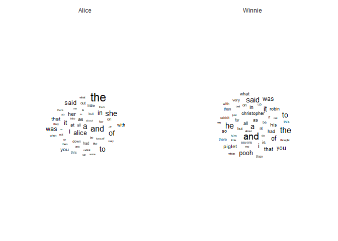
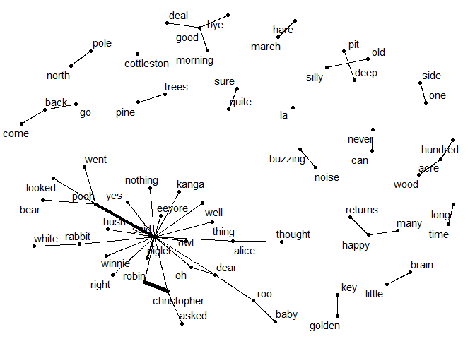
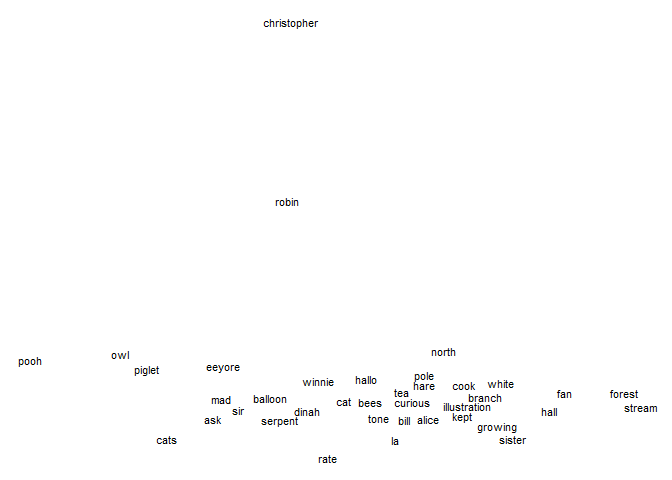

- [Introduction](#introduction)
- [Representing text as data](#representing-text-as-data)
  - [Tidy text format](#tidy-text-format)
  - [Term frequency](#term-frequency)
  - [Term frequency - inverse document frequency
    (tf-idf)](#term-frequency---inverse-document-frequency-tf-idf)
  - [Document-term matrix](#document-term-matrix)
- [Text analysis](#text-analysis)
  - [Visualize word frequencies](#visualize-word-frequencies)
  - [Bigrams, n-grams](#bigrams-n-grams)
  - [Sentiment analysis](#sentiment-analysis)
  - [Topic modelling](#topic-modelling)
  - [Word embeddings](#word-embeddings)

# Introduction

This tutorial is based on multiple chapters of [“Text Mining with R: A
Tidy Approach”](https://www.tidytextmining.com/) by Julia Silge and
David Robinson.

Throughout this tutorial, we will use the `tidytext` package to analyze
text data, in particular the contents of Alice in Wonderland and
Winnie-the-Pooh. This book and many others are available via the
`gutenberg_download()` function in the `gutenbergr` package, which
provides access to the Project Gutenberg collection of public domain
books.

``` r
# install.packages("tidytext")
# install.packages("gutenbergr")
library(tidyverse)
library(tidytext)
library(gutenbergr)

# Download books based on their Gutenberg ID
# https://gutenberg.org/ebooks/19033
# https://gutenberg.org/ebooks/67098
books <- gutenberg_download(c(19033, 67098))
```

# Representing text as data

## Tidy text format

Currently in the `books` tibble, each row represents a line of text from
one of the books. It is often useful to represent text data in a tidy
format, where each row represents a word or token, as then we can apply
data wrangling operations on the word level. We can use the
`unnest_tokens()` function from the `tidytext` package to easily split
the text into words, or into other levels of analysis such as
characters, sentences or paragraphs. This function also takes care of
removing punctuation, converting words to lowercase, and dropping empty
rows. Before tokenizing, we may want to remove the contents of the
titlepage, as the actual book contents only start on line 38 for Alice
in Wonderland and line 79 for Winnie-the-Pooh.

``` r
# remove title page and add book title variable
books_content <- books |> 
  # add book title
  mutate(book_title = ifelse(gutenberg_id == 19033, "Alice", "Winnie")) |> 
  # restart counting row numbers for each book
  group_by(book_title) |> 
  filter((book_title == "Alice" & row_number() >= 38) |
           (book_title == "Winnie" & row_number() >= 79)) |> 
  ungroup()

words <- books_content |> 
  # split books into words
  unnest_tokens(output = word, input = text)
```

You may notice that not all words are completely clean or relevant: some
are surrounded by underscores and some are numbers. We can clean these
up manually with regular expressions.

``` r
words <- words |> 
  mutate(word = str_remove_all(word, "_")) |>
  filter(!str_detect(word, "^\\d+$"))
```

## Term frequency

The term frequency (tf) of a word is the number of times it appears in a
document, divided by the total number of words in the document. It is
simply the result of counting the number of times a word appears in the
document.

``` r
tf <- words |> 
  # count the number of times each word appears in each book
  count(book_title, word) |>
  # divide by number of words in each book
  group_by(book_title) |> 
  mutate(tf = n / sum(n)) |> 
  ungroup()
```

## Term frequency - inverse document frequency (tf-idf)

The inverse document frequency (idf) of a word is the logarithm of the
total number of documents divided by the number of documents that
contain the word. It is a measure of how unique or rare a word is across
the entire corpus. The intuition for why idf matters is that words that
appear in many documents are less informative than words that appear in
only a few documents. Therefore we often combine tf and idf into a
single metric called term frequency-inverse document frequency (tf-idf),
which is the product of tf and idf. The `bind_tf_idf()` function from
the `tidytext` package can be used to calculate tf-idf values (the
function also generates tf and idf separately).

``` r
tf_idf <- words |> 
  count(book_title, word) |>
  bind_tf_idf(word, book_title, n)
```

## Document-term matrix

Documents (in out case, books) can be represented as a document-term
matrix, where each row represents a document and each column represents
a word. The value in each cell is equal to the frequency of the word in
the document. This matrix is sometimes called the bag-of-words
representation of the text data (although sometimes that contains 0/1
values based on whether the word appears in the document), because it
ignores the ordering of the words in the text. These matrices can be
created using the `cast_dtm()` function from the `tidytext` package.
Note that these matrices can get very large depending on the size of the
vocabulary and the number of documents. Our data has less than 3000
unique words and 2 documents, so it is manageable.

``` r
# DTM with pivot_wider() (generic tibble)
dtm <- words |> 
  count(book_title, word) |>
  pivot_wider(names_from = word, values_from = n, values_fill = 0)

# DTM with cast_dtm() (DocumentTermMatrix object)
dtm <- words |> 
  count(book_title, word) |>
  cast_dtm(document = book_title, term = word, value = n)
```

# Text analysis

## Visualize word frequencies

The easiest way to represent the contents of a document is to show the
most frequent words. We can use a bar chart to show the words with
highest term frequency in each book, or use a word cloud where the size
of the word is proportional to its frequency (using the `ggwordcloud`
package).

``` r
library(ggwordcloud)

# Most frequent words
tf_idf |> 
  group_by(book_title) |> 
  slice_max(tf, n = 20) |> 
  ggplot(aes(tf, reorder_within(word, tf, book_title))) +
  geom_col() +
  facet_wrap(~book_title, scales = "free") +
  scale_y_reordered() +
  labs(x = "Term frequency", y = NULL, title = "Most frequent words") + 
  theme_minimal()
```

<!-- -->

``` r
# Word cloud
tf |> 
  group_by(book_title) |> 
  top_n(50, tf) |> 
  ggplot(aes(label = word, size = tf)) +
  geom_text_wordcloud() +
  facet_wrap(~book_title) +
  theme_minimal()
```

<!-- -->

Using simple word frequencies is often uninformative because common
words like “the” or “and” will dominate the results. One way to address
this problem is to display the words with highest tf-idf values: in the
case of two books, this will show the words that are unique to each
book, as words that show up in all document have idf=tf-idf=0.

``` r
tf_idf |> 
  group_by(book_title) |> 
  slice_max(tf_idf, n = 20) |> 
  ggplot(aes(tf_idf, reorder_within(word, tf_idf, book_title))) +
  geom_col() +
  facet_wrap(~book_title, scales = "free") +
  scale_y_reordered() +
  labs(x = "tf-idf", y = NULL, title = "Highest tf-idf words") + 
  theme_minimal()
```

<!-- -->

An alternative method is to remove common words (called stopwords) from
the analysis, using a stopword list. `tidytext` provides a list of
stopwords with the `get_stopwords()` function, which can be used to
filter out common words from the analysis.

``` r
stopwords <- get_stopwords() |> pull(word)

tf_idf |> 
  group_by(book_title) |> 
  # remove stopwords
  filter(!word %in% stopwords) |>
  slice_max(tf_idf, n = 20) |> 
  ggplot(aes(tf, reorder_within(word, tf, book_title))) +
  geom_col() +
  facet_wrap(~book_title, scales = "free") +
  scale_y_reordered() +
  labs(x = "Term frequency", y = NULL, title = "Most frequent words (excl. stopwords)") + 
  theme_minimal()
```

<!-- -->

## Bigrams, n-grams

Bigrams are pairs of words that appear next to each other in a document;
n-grams are sequences of n words. They can be useful to capture the
context in which words appear, as the meaning of a word can depend on
the words that surround it. By specifying the `token` argument in the
`unnest_tokens()` function, we can split the text into bigrams or
n-grams.

``` r
bigrams <- books_content |> 
  unnest_tokens(bigram, text, token = "ngrams", n = 2)
```

We can visualize the most common bigrams the same way we did for
unigrams (single words).

``` r
bigrams |> 
  drop_na() |> 
  count(book_title, bigram) |> 
  group_by(book_title) |> 
  slice_max(n, n = 20) |> 
  ggplot(aes(n, reorder_within(bigram, n, book_title))) +
  geom_col() +
  facet_wrap(~book_title, scales = "free") +
  scale_y_reordered() +
  labs(x = "Frequency", y = NULL, title = "Most frequent bigrams") + 
  theme_minimal()
```

<!-- -->

In addition, we can make use of the extra context information provided
by bigrams, and visualize which words are most likely to appear after a
given word. For that, we need to separate the bigrams into two columns,
one for the first word and one for the second word. To keep the
vocabulary relatively small, we will only consider bigrams where neither
of the words is a stopword. We can use these frequencies to create a
network visualization of the most common bigrams with the `igraph` and
`ggraph` packages.

``` r
library(igraph)
library(ggraph)

# create graph object
bigram_graph <- bigrams |> 
  drop_na() |> 
  # separate bigrams into two columns
  separate(bigram, c("word1", "word2"), sep = " ") |> 
  # remove stopwords
  filter(!word1 %in% stopwords & !word2 %in% stopwords) |> 
  # count word frequencies
  count(word1, word2) |> 
  # remove bigrams that appear less than 5 times
  filter(n > 5) |> 
  # create graph object
  graph_from_data_frame()

# plot graph
ggraph(bigram_graph, layout = "fr") +
  geom_edge_link(aes(edge_width = n), show.legend = FALSE) +
  geom_node_point() +
  geom_node_text(aes(label = name), repel = TRUE) +
  scale_edge_width(range = c(0.1, 2)) +
  theme_void()
```

<!-- -->

## Sentiment analysis

Sentiment analysis is the process of determining the sentiment of a
piece of text, i.e. whether it is positive, negative, or neutral. One
way to do this is to use a sentiment lexicon, which is a list of words
and their associated sentiment scores. There are multiple different
sentiment lexicons available, such as Bing, AFINN, and NRC. These differ
in their training data and the sentiment categories they use, but are
all available with the `get_sentiments()` function. So we can use the
tidy words tibble and merge it with the sentiment lexicon to assign
sentiment scores to each word.

``` r
# get sentiment lexicons
bing <- get_sentiments("bing")
afinn <- get_sentiments("afinn")

# plot the most common positive and negative words with the Bing lexicon
words |> 
  inner_join(bing, by = "word") |> 
  count(book_title, word, sentiment) |>
  group_by(book_title, sentiment) |> 
  slice_max(n, n = 10) |>
  ggplot(aes(n, reorder_within(word, n, book_title), fill = sentiment)) +
  geom_col() +
  scale_y_reordered() +
  labs(x = "Frequency", y = NULL) +
  facet_wrap(~book_title, scales = "free") +
  theme_minimal()
```

<!-- -->

``` r
# calculate sentiment scores per book with the AFINN lexicon
words |> 
  count(book_title, word) |>
  inner_join(afinn, by = "word") |> 
  # calculate each word's contribution to the sentiment score
  mutate(value_n = value * n) |>
  group_by(book_title) |> 
  # calculate the sentiment score for each book (sum of sentiment scores / number of words)
  summarize(score = sum(value_n) / sum(n))
```

    ## # A tibble: 2 × 2
    ##   book_title score
    ##   <chr>      <dbl>
    ## 1 Alice      0.124
    ## 2 Winnie     0.810

## Topic modelling

Topic modelling is a method to discover the topics that are present in a
collection of documents. It is an unsupervised learning method, meaning
that it does not require labeled data. One popular topic modelling
method is latent Dirichlet allocation (LDA), which assumes that each
document is a mixture of different topics, and each topic is a mixture
of words. The `LDA()` function from the `topicmodels` package can be
used to fit an LDA model to a document-term matrix. The function
requires a document-term matrix as created by `cast_dtm()`, so first we
should create a clean version of our previous `dtm` object (remove
stopwords).

Before we fit a model, we need to decide how many topics to use. If we
have previous expectations about what results we want to see, we can
choose a specific number of topics, otherwise we can try multiple values
until we find sensible results. The model also includes a random
initialization step, so it is a good idea to set a seed to ensure that
we get the same results every time. In this case, we might try to fit a
model with 2 topics if we hope that the model can separate the topics of
the two documents.

``` r
library(topicmodels)

dtm <- words |> 
  count(book_title, word) |>
  filter(!word %in% stopwords) |>
  cast_dtm(document = book_title, term = word, value = n)

# set seed for reproducibility
set.seed(1)

# fit LDA model with 2 topics
lda <- LDA(dtm, k = 2)
```

When interpreting LDA results, we consider two sets of parameters: the
document-topic matrix and the topic-word matrix. The document-topic
matrix tells us how much of each topic is present in each document,
while the topic-word matrix tells us which words are associated with
each topic. We can use the `tidy()` function from the `topicmodels`
package to extract these matrices into a tidy format, specifying
`matrix = "beta"` for the topic-word matrix and `matrix = "gamma"` for
the document-topic matrix.

``` r
topic_word <- tidy(lda, matrix = "beta")
document_topic <- tidy(lda, matrix = "gamma")
```

The topic-word matrix helps us give meaning to the topics by showing
which words are the most strongly associated with each topic. We can
plot these word probabilities to visualize the topics.

``` r
topic_word |> 
  group_by(topic) |> 
  slice_max(beta, n = 10) |> 
  ggplot(aes(beta, reorder_within(term, beta, topic))) +
  geom_col() +
  facet_wrap(~topic, scales = "free") +
  scale_y_reordered() +
  labs(x = "Per-topic-per-word probability", y = NULL) + 
  theme_minimal()
```

<!-- -->

It does not seem like the topics can separate the two books, maybe
because Winnie-the-Pooh is longer and the model tries to create about
equal-sized topics.

The per-document-per-topic probabilities confirm that the the documents
are not clearly split into topics, as both documents have an ~60%
probability of belonging to topic 1 and 40% probability of belonging to
topic 2.

``` r
document_topic |> 
  pivot_wider(names_from = topic, values_from = gamma)
```

    ## # A tibble: 2 × 3
    ##   document        `1`        `2`
    ##   <chr>         <dbl>      <dbl>
    ## 1 Alice    0.00000816 1.00      
    ## 2 Winnie   1.00       0.00000349

Nevertheless, topic modelling can be very useful for larger collections
of documents, where it can help to identify the main themes present in
the corpus.

## Word embeddings

Word embeddings are a way to represent words as vectors in a
high-dimensional space, where words with similar meanings are close to
each other. There are pre-trained models (such as GloVe or BERT), that
were trained on large corpora of text data, but we can also create our
own word embeddings from our own data, which will be specific to the
context at hand. One popular method to create our own word embeddings is
word2vec, which is implemented in the `word2vec` package. word2vec is
the simplest type of embedding model, but more complex, more
contextualized embeddings form the basis of the current large language
models.

`word2vec()` takes a character vector containing the full text, so let’s
create a 2-element vector where each element corresponds to the full
text of one of the books, using the cleaned version of the text from
`words`. We can specify a lot of model parameters, such as the dimension
of the word vectors (the length of the vector associated with a word) or
the context window (the number of words around each word to consider as
the context), but we can also go with the default settings. The
numerical values of the embeddings aren’t informative, the information
is in the similarities and differences between different words.

``` r
library(word2vec)

text <- words |> 
  group_by(book_title) |>
  # collapse words into a single string
  summarize(text = paste(word, collapse = " ")) |> 
  # extract the text as a vector
  pull(text)

# create word embeddings
embeddings <- word2vec(text)

# view word embeddings
predict(embeddings, words$word, type = "embedding")
```

    ##                      [,1]     [,2]       [,3]       [,4]       [,5]       [,6]
    ## i              -0.3217354 1.214458 -0.7844283 0.32657400 -0.2421101 -0.5759880
    ## down           -0.2887204 1.690001 -1.3870794 0.16201735 -0.6832804 -1.0505134
    ## the            -0.3057811 1.792576 -1.5032494 0.05645404 -0.7909943 -1.1504323
    ## rabbit         -0.3364829 1.544489 -1.2450333 0.16584028 -0.5612189 -0.9355745
    ## hole           -0.3146615 1.605260 -1.2701516 0.17826559 -0.6112927 -0.9357208
    ## alice          -0.3185399 1.559870 -1.2731210 0.19754104 -0.5766475 -0.9489033
    ## was            -0.2501664 1.659191 -1.4366637 0.14995356 -0.6961492 -1.0113935
    ## beginning      -0.3199793 1.552983 -1.2513988 0.20618522 -0.5670729 -0.8882698
    ## to             -0.3238745 1.589190 -1.2564509 0.14671831 -0.6338929 -0.9172201
    ## get            -0.3328942 1.548040 -1.1774735 0.20037599 -0.5599211 -0.8452411
    ## very           -0.2653738 1.565281 -1.2395635 0.16843578 -0.6067992 -0.9220272
    ## tired          -0.2969550 1.592152 -1.3160990 0.19605182 -0.6023825 -0.9807951
    ## of             -0.2528325 1.705958 -1.4384155 0.06956203 -0.7416146 -1.0305920
    ## sitting        -0.3052437 1.639849 -1.3124013 0.17366961 -0.6471195 -0.9716128
    ## by             -0.3008053 1.621334 -1.3135294 0.15457478 -0.6480736 -0.9818744
    ## her            -0.2731908 1.691122 -1.3716868 0.15825936 -0.6714624 -1.0262510
    ## sister         -0.2872168 1.608368 -1.2369956 0.22569840 -0.6451043 -1.0243464
    ## on             -0.2934800 1.606980 -1.3416787 0.16766554 -0.6170689 -0.9633421
    ## the            -0.3057811 1.792576 -1.5032494 0.05645404 -0.7909943 -1.1504323
    ## bank           -0.3229253 1.608191 -1.2767216 0.14324662 -0.5979842 -0.9550058
    ## and            -0.2936489 1.755417 -1.4612596 0.10846175 -0.7557149 -1.1327221
    ## of             -0.2528325 1.705958 -1.4384155 0.06956203 -0.7416146 -1.0305920
    ## having         -0.3153886 1.554397 -1.1999811 0.19231629 -0.5690936 -0.9119855
    ## nothing        -0.3238680 1.543867 -1.1933869 0.19128317 -0.5457630 -0.8984053
    ## to             -0.3238745 1.589190 -1.2564509 0.14671831 -0.6338929 -0.9172201
    ## do             -0.3311558 1.307099 -0.9377708 0.25719634 -0.3768750 -0.6897517
    ## once           -0.2990434 1.583129 -1.2492098 0.16055471 -0.5750944 -0.9370415
    ## or             -0.2994700 1.564143 -1.2605225 0.15208533 -0.5283412 -0.9365678
    ## twice          -0.3298281 1.577655 -1.2629592 0.19071497 -0.5636811 -0.9165831
    ## she            -0.2357039 1.699232 -1.3867453 0.14557020 -0.7039371 -1.0624341
    ## had            -0.2814778 1.669028 -1.3757738 0.16639623 -0.6883591 -1.0438281
    ## peeped                 NA       NA         NA         NA         NA         NA
    ## into           -0.2922955 1.638955 -1.3617507 0.12988752 -0.6880339 -0.9837542
    ## the            -0.3057811 1.792576 -1.5032494 0.05645404 -0.7909943 -1.1504323
    ## book           -0.3148954 1.572296 -1.2493459 0.18905507 -0.5990360 -0.9592571
    ## her            -0.2731908 1.691122 -1.3716868 0.15825936 -0.6714624 -1.0262510
    ## sister         -0.2872168 1.608368 -1.2369956 0.22569840 -0.6451043 -1.0243464
    ## was            -0.2501664 1.659191 -1.4366637 0.14995356 -0.6961492 -1.0113935
    ## reading                NA       NA         NA         NA         NA         NA
    ## but            -0.2983935 1.484273 -1.1322087 0.19921574 -0.5010421 -0.8404158
    ## it             -0.2903288 1.474941 -1.1365932 0.21937925 -0.4812229 -0.8356208
    ## had            -0.2814778 1.669028 -1.3757738 0.16639623 -0.6883591 -1.0438281
    ## no             -0.2964032 1.528455 -1.1762655 0.17798935 -0.5105111 -0.8262268
    ## pictures               NA       NA         NA         NA         NA         NA
    ## or             -0.2994700 1.564143 -1.2605225 0.15208533 -0.5283412 -0.9365678
    ## conversations          NA       NA         NA         NA         NA         NA
    ## in             -0.2619611 1.735085 -1.4621933 0.11258318 -0.7108682 -1.0176126
    ## it             -0.2903288 1.474941 -1.1365932 0.21937925 -0.4812229 -0.8356208
    ## and            -0.2936489 1.755417 -1.4612596 0.10846175 -0.7557149 -1.1327221
    ## what           -0.3417095 1.390201 -1.0342114 0.25488600 -0.4125456 -0.7759668
    ## is             -0.3226670 1.424017 -1.1431885 0.21516992 -0.5008930 -0.8110880
    ## the            -0.3057811 1.792576 -1.5032494 0.05645404 -0.7909943 -1.1504323
    ## use            -0.2575366 1.604878 -1.2717336 0.13517679 -0.5874444 -0.8896501
    ## of             -0.2528325 1.705958 -1.4384155 0.06956203 -0.7416146 -1.0305920
    ## a              -0.2673957 1.675926 -1.3659208 0.14221165 -0.6600368 -1.0081499
    ## book           -0.3148954 1.572296 -1.2493459 0.18905507 -0.5990360 -0.9592571
    ## thought        -0.2569903 1.569787 -1.1996900 0.18948154 -0.5797619 -0.9079835
    ## alice          -0.3185399 1.559870 -1.2731210 0.19754104 -0.5766475 -0.9489033
    ## without        -0.2878342 1.560804 -1.2104870 0.19885334 -0.5746642 -0.8894212
    ## pictures               NA       NA         NA         NA         NA         NA
    ## or             -0.2994700 1.564143 -1.2605225 0.15208533 -0.5283412 -0.9365678
    ## conversations          NA       NA         NA         NA         NA         NA
    ## so             -0.3122483 1.540357 -1.2135808 0.21728440 -0.5892335 -0.9220639
    ## she            -0.2357039 1.699232 -1.3867453 0.14557020 -0.7039371 -1.0624341
    ## was            -0.2501664 1.659191 -1.4366637 0.14995356 -0.6961492 -1.0113935
    ## considering            NA       NA         NA         NA         NA         NA
    ## in             -0.2619611 1.735085 -1.4621933 0.11258318 -0.7108682 -1.0176126
    ## her            -0.2731908 1.691122 -1.3716868 0.15825936 -0.6714624 -1.0262510
    ## own            -0.2858920 1.581468 -1.3047117 0.18640798 -0.6202397 -0.9837238
    ## mind           -0.3121047 1.480792 -1.1687952 0.19217607 -0.4894594 -0.8563671
    ## as             -0.2401972 1.621100 -1.3103366 0.22602652 -0.6549665 -1.0336177
    ## well           -0.2985775 1.407169 -1.0356401 0.25273177 -0.4376524 -0.7859491
    ## as             -0.2401972 1.621100 -1.3103366 0.22602652 -0.6549665 -1.0336177
    ## she            -0.2357039 1.699232 -1.3867453 0.14557020 -0.7039371 -1.0624341
    ## could          -0.2881632 1.558231 -1.2056427 0.23576389 -0.5702354 -0.9452141
    ## for            -0.2773351 1.602793 -1.3191928 0.16835469 -0.6249428 -0.9673988
    ## the            -0.3057811 1.792576 -1.5032494 0.05645404 -0.7909943 -1.1504323
    ## day            -0.2779537 1.619900 -1.3246768 0.15038028 -0.6434539 -0.9704973
    ## made           -0.3151253 1.605755 -1.2826096 0.16701461 -0.6123880 -0.9535161
    ## her            -0.2731908 1.691122 -1.3716868 0.15825936 -0.6714624 -1.0262510
    ## feel           -0.3176758 1.521078 -1.2521107 0.15229151 -0.5528710 -0.8742998
    ## very           -0.2653738 1.565281 -1.2395635 0.16843578 -0.6067992 -0.9220272
    ## sleepy                 NA       NA         NA         NA         NA         NA
    ## and            -0.2936489 1.755417 -1.4612596 0.10846175 -0.7557149 -1.1327221
    ## stupid                 NA       NA         NA         NA         NA         NA
    ## whether        -0.3094960 1.578498 -1.2474570 0.15979069 -0.5523072 -0.8723269
    ## the            -0.3057811 1.792576 -1.5032494 0.05645404 -0.7909943 -1.1504323
    ## pleasure               NA       NA         NA         NA         NA         NA
    ## of             -0.2528325 1.705958 -1.4384155 0.06956203 -0.7416146 -1.0305920
    ## making         -0.2811885 1.586074 -1.2449044 0.19940089 -0.5683287 -0.9162680
    ## a              -0.2673957 1.675926 -1.3659208 0.14221165 -0.6600368 -1.0081499
    ## daisy                  NA       NA         NA         NA         NA         NA
    ## chain                  NA       NA         NA         NA         NA         NA
    ## would          -0.3148715 1.515242 -1.1633552 0.17072740 -0.5172482 -0.8697684
    ## be             -0.2818262 1.529115 -1.1666011 0.21395802 -0.5048697 -0.8380901
    ## worth                  NA       NA         NA         NA         NA         NA
    ## the            -0.3057811 1.792576 -1.5032494 0.05645404 -0.7909943 -1.1504323
    ## trouble        -0.3869736 1.565931 -1.1628395 0.18700102 -0.4662207 -0.8832706
    ## of             -0.2528325 1.705958 -1.4384155 0.06956203 -0.7416146 -1.0305920
    ## getting        -0.3175702 1.577919 -1.2356604 0.16013035 -0.5445573 -0.9108819
    ## up             -0.2761379 1.666633 -1.3120551 0.15968619 -0.6735224 -1.0244474
    ## and            -0.2936489 1.755417 -1.4612596 0.10846175 -0.7557149 -1.1327221
    ## picking                NA       NA         NA         NA         NA         NA
    ## the            -0.3057811 1.792576 -1.5032494 0.05645404 -0.7909943 -1.1504323
    ## daisies                NA       NA         NA         NA         NA         NA
    ## when           -0.3180774 1.612216 -1.3105425 0.13406552 -0.6552759 -0.9900649
    ## suddenly       -0.3057133 1.620001 -1.2900980 0.15343486 -0.5980857 -1.0032234
    ## a              -0.2673957 1.675926 -1.3659208 0.14221165 -0.6600368 -1.0081499
    ## white          -0.3185208 1.595341 -1.2865177 0.13989465 -0.6281611 -0.9478033
    ## rabbit         -0.3364829 1.544489 -1.2450333 0.16584028 -0.5612189 -0.9355745
    ## with           -0.3218700 1.684777 -1.3531032 0.11790705 -0.6809273 -0.9870533
    ## pink           -0.3521183 1.590613 -1.2771456 0.16554600 -0.6209462 -0.8955741
    ## eyes           -0.2987302 1.578511 -1.2688159 0.17151812 -0.5752993 -0.9360529
    ## ran            -0.3027727 1.623480 -1.2645494 0.16559024 -0.6271476 -0.9544332
    ## close          -0.2619729 1.638516 -1.2954854 0.12799454 -0.5983328 -0.9159655
    ## by             -0.3008053 1.621334 -1.3135294 0.15457478 -0.6480736 -0.9818744
    ## her            -0.2731908 1.691122 -1.3716868 0.15825936 -0.6714624 -1.0262510
    ## there          -0.2776963 1.570121 -1.2699636 0.15848929 -0.5410801 -0.8941478
    ## was            -0.2501664 1.659191 -1.4366637 0.14995356 -0.6961492 -1.0113935
    ## nothing        -0.3238680 1.543867 -1.1933869 0.19128317 -0.5457630 -0.8984053
    ## so             -0.3122483 1.540357 -1.2135808 0.21728440 -0.5892335 -0.9220639
    ## very           -0.2653738 1.565281 -1.2395635 0.16843578 -0.6067992 -0.9220272
    ## remarkable             NA       NA         NA         NA         NA         NA
    ## in             -0.2619611 1.735085 -1.4621933 0.11258318 -0.7108682 -1.0176126
    ## that           -0.2722599 1.510416 -1.1668608 0.21013020 -0.5115267 -0.8889709
    ## nor                    NA       NA         NA         NA         NA         NA
    ## did            -0.2943979 1.354227 -0.9977633 0.26902330 -0.4071886 -0.7249467
    ## alice          -0.3185399 1.559870 -1.2731210 0.19754104 -0.5766475 -0.9489033
    ## think          -0.3250078 1.346892 -0.9662127 0.25685805 -0.4172477 -0.6954088
    ## it             -0.2903288 1.474941 -1.1365932 0.21937925 -0.4812229 -0.8356208
    ## so             -0.3122483 1.540357 -1.2135808 0.21728440 -0.5892335 -0.9220639
    ## very           -0.2653738 1.565281 -1.2395635 0.16843578 -0.6067992 -0.9220272
    ## much           -0.3076563 1.561135 -1.2329471 0.16037342 -0.5767546 -0.9186257
    ## out            -0.3183048 1.692444 -1.4007502 0.11723214 -0.6927011 -1.0486439
    ## of             -0.2528325 1.705958 -1.4384155 0.06956203 -0.7416146 -1.0305920
    ## the            -0.3057811 1.792576 -1.5032494 0.05645404 -0.7909943 -1.1504323
    ## way            -0.3156721 1.650414 -1.3019162 0.14099449 -0.6426167 -0.9851341
    ## to             -0.3238745 1.589190 -1.2564509 0.14671831 -0.6338929 -0.9172201
    ## hear           -0.3369424 1.505127 -1.1511664 0.19240619 -0.5605615 -0.8873209
    ## the            -0.3057811 1.792576 -1.5032494 0.05645404 -0.7909943 -1.1504323
    ## rabbit         -0.3364829 1.544489 -1.2450333 0.16584028 -0.5612189 -0.9355745
    ## say            -0.3078975 1.482594 -1.1534311 0.18623523 -0.4977285 -0.8292815
    ## to             -0.3238745 1.589190 -1.2564509 0.14671831 -0.6338929 -0.9172201
    ## itself         -0.3175640 1.556075 -1.2617921 0.16555814 -0.5865771 -0.9060361
    ## oh             -0.3339412 1.456855 -1.0766511 0.22288975 -0.4696400 -0.7737506
    ## dear           -0.3156858 1.507001 -1.1432754 0.19293681 -0.4898222 -0.8283669
    ## oh             -0.3339412 1.456855 -1.0766511 0.22288975 -0.4696400 -0.7737506
    ## dear           -0.3156858 1.507001 -1.1432754 0.19293681 -0.4898222 -0.8283669
    ## i              -0.3217354 1.214458 -0.7844283 0.32657400 -0.2421101 -0.5759880
    ## shall          -0.3380854 1.493303 -1.1133806 0.22185430 -0.5060518 -0.8117205
    ## be             -0.2818262 1.529115 -1.1666011 0.21395802 -0.5048697 -0.8380901
    ## too            -0.2980506 1.536592 -1.2212762 0.17957674 -0.5445263 -0.8975552
    ## late           -0.2937349 1.539098 -1.2189982 0.13029727 -0.5583742 -0.8676796
    ## but            -0.2983935 1.484273 -1.1322087 0.19921574 -0.5010421 -0.8404158
    ## when           -0.3180774 1.612216 -1.3105425 0.13406552 -0.6552759 -0.9900649
    ## the            -0.3057811 1.792576 -1.5032494 0.05645404 -0.7909943 -1.1504323
    ## rabbit         -0.3364829 1.544489 -1.2450333 0.16584028 -0.5612189 -0.9355745
    ## actually               NA       NA         NA         NA         NA         NA
    ## took           -0.3423702 1.676394 -1.3227539 0.14974025 -0.6421835 -1.0236068
    ## a              -0.2673957 1.675926 -1.3659208 0.14221165 -0.6600368 -1.0081499
    ## watch                  NA       NA         NA         NA         NA         NA
    ## out            -0.3183048 1.692444 -1.4007502 0.11723214 -0.6927011 -1.0486439
    ## of             -0.2528325 1.705958 -1.4384155 0.06956203 -0.7416146 -1.0305920
    ## its            -0.2927154 1.605386 -1.2896489 0.13907100 -0.6334962 -0.9414774
    ## waistcoat              NA       NA         NA         NA         NA         NA
    ## pocket         -0.2948867 1.701303 -1.3637105 0.11347941 -0.6275987 -0.9275513
    ## and            -0.2936489 1.755417 -1.4612596 0.10846175 -0.7557149 -1.1327221
    ## looked         -0.3014385 1.653972 -1.3453231 0.16477221 -0.6812717 -1.0481101
    ## at             -0.2856226 1.642904 -1.3332423 0.12325399 -0.6679896 -0.9866376
    ## it             -0.2903288 1.474941 -1.1365932 0.21937925 -0.4812229 -0.8356208
    ## and            -0.2936489 1.755417 -1.4612596 0.10846175 -0.7557149 -1.1327221
    ## then           -0.3334231 1.601080 -1.2684613 0.18097576 -0.6160644 -0.9516296
    ## hurried        -0.2871783 1.653191 -1.2823524 0.11149860 -0.6331975 -0.9618526
    ## on             -0.2934800 1.606980 -1.3416787 0.16766554 -0.6170689 -0.9633421
    ## alice          -0.3185399 1.559870 -1.2731210 0.19754104 -0.5766475 -0.9489033
    ## started        -0.2996731 1.607331 -1.2872159 0.15787444 -0.6014122 -0.9533974
    ## to             -0.3238745 1.589190 -1.2564509 0.14671831 -0.6338929 -0.9172201
    ## her            -0.2731908 1.691122 -1.3716868 0.15825936 -0.6714624 -1.0262510
    ## feet           -0.2807919 1.631328 -1.3027608 0.14257410 -0.6038790 -0.9895909
    ## for            -0.2773351 1.602793 -1.3191928 0.16835469 -0.6249428 -0.9673988
    ## it             -0.2903288 1.474941 -1.1365932 0.21937925 -0.4812229 -0.8356208
    ## flashed                NA       NA         NA         NA         NA         NA
    ## across         -0.3079403 1.617473 -1.2950550 0.13579807 -0.6272746 -0.9554079
    ## her            -0.2731908 1.691122 -1.3716868 0.15825936 -0.6714624 -1.0262510
    ## mind           -0.3121047 1.480792 -1.1687952 0.19217607 -0.4894594 -0.8563671
    ## that           -0.2722599 1.510416 -1.1668608 0.21013020 -0.5115267 -0.8889709
    ## she            -0.2357039 1.699232 -1.3867453 0.14557020 -0.7039371 -1.0624341
    ## had            -0.2814778 1.669028 -1.3757738 0.16639623 -0.6883591 -1.0438281
    ## never          -0.2938323 1.550986 -1.2049422 0.18665619 -0.5621745 -0.8844307
    ## before         -0.3019189 1.620456 -1.2742852 0.15970126 -0.5923827 -0.9622145
    ## seen           -0.3259295 1.601305 -1.2213472 0.15991427 -0.5874025 -0.9349636
    ## a              -0.2673957 1.675926 -1.3659208 0.14221165 -0.6600368 -1.0081499
    ## rabbit         -0.3364829 1.544489 -1.2450333 0.16584028 -0.5612189 -0.9355745
    ## with           -0.3218700 1.684777 -1.3531032 0.11790705 -0.6809273 -0.9870533
    ## either         -0.2940918 1.556348 -1.1899631 0.21259177 -0.5549347 -0.8952227
    ## a              -0.2673957 1.675926 -1.3659208 0.14221165 -0.6600368 -1.0081499
    ## waistcoat              NA       NA         NA         NA         NA         NA
    ## pocket         -0.2948867 1.701303 -1.3637105 0.11347941 -0.6275987 -0.9275513
    ## or             -0.2994700 1.564143 -1.2605225 0.15208533 -0.5283412 -0.9365678
    ## a              -0.2673957 1.675926 -1.3659208 0.14221165 -0.6600368 -1.0081499
    ## watch                  NA       NA         NA         NA         NA         NA
    ## to             -0.3238745 1.589190 -1.2564509 0.14671831 -0.6338929 -0.9172201
    ## take           -0.2837477 1.526358 -1.2073208 0.18375346 -0.5147346 -0.8845734
    ## out            -0.3183048 1.692444 -1.4007502 0.11723214 -0.6927011 -1.0486439
    ## of             -0.2528325 1.705958 -1.4384155 0.06956203 -0.7416146 -1.0305920
    ## it             -0.2903288 1.474941 -1.1365932 0.21937925 -0.4812229 -0.8356208
    ## and            -0.2936489 1.755417 -1.4612596 0.10846175 -0.7557149 -1.1327221
    ## burning                NA       NA         NA         NA         NA         NA
    ## with           -0.3218700 1.684777 -1.3531032 0.11790705 -0.6809273 -0.9870533
    ## curiosity              NA       NA         NA         NA         NA         NA
    ## she            -0.2357039 1.699232 -1.3867453 0.14557020 -0.7039371 -1.0624341
    ## ran            -0.3027727 1.623480 -1.2645494 0.16559024 -0.6271476 -0.9544332
    ## across         -0.3079403 1.617473 -1.2950550 0.13579807 -0.6272746 -0.9554079
    ## the            -0.3057811 1.792576 -1.5032494 0.05645404 -0.7909943 -1.1504323
    ## field                  NA       NA         NA         NA         NA         NA
    ## after          -0.2732421 1.600585 -1.2808149 0.17365026 -0.6170546 -0.9425364
    ## it             -0.2903288 1.474941 -1.1365932 0.21937925 -0.4812229 -0.8356208
    ## and            -0.2936489 1.755417 -1.4612596 0.10846175 -0.7557149 -1.1327221
    ## was            -0.2501664 1.659191 -1.4366637 0.14995356 -0.6961492 -1.0113935
    ## just           -0.2931035 1.537664 -1.2111133 0.20192522 -0.5768120 -0.8934111
    ## in             -0.2619611 1.735085 -1.4621933 0.11258318 -0.7108682 -1.0176126
    ## time           -0.2830930 1.652814 -1.3201057 0.15427630 -0.6637482 -0.9488379
    ## to             -0.3238745 1.589190 -1.2564509 0.14671831 -0.6338929 -0.9172201
    ## see            -0.3172406 1.434630 -1.0725325 0.24273537 -0.4539229 -0.8079270
    ## it             -0.2903288 1.474941 -1.1365932 0.21937925 -0.4812229 -0.8356208
    ## pop                    NA       NA         NA         NA         NA         NA
    ## down           -0.2887204 1.690001 -1.3870794 0.16201735 -0.6832804 -1.0505134
    ## a              -0.2673957 1.675926 -1.3659208 0.14221165 -0.6600368 -1.0081499
    ## large          -0.3051071 1.653523 -1.3450531 0.16786374 -0.6643730 -0.9730526
    ## rabbit         -0.3364829 1.544489 -1.2450333 0.16584028 -0.5612189 -0.9355745
    ## hole           -0.3146615 1.605260 -1.2701516 0.17826559 -0.6112927 -0.9357208
    ## under          -0.3218153 1.601051 -1.2517813 0.15295401 -0.5997934 -0.9275640
    ## the            -0.3057811 1.792576 -1.5032494 0.05645404 -0.7909943 -1.1504323
    ## hedge                  NA       NA         NA         NA         NA         NA
    ## in             -0.2619611 1.735085 -1.4621933 0.11258318 -0.7108682 -1.0176126
    ## another        -0.3101980 1.629782 -1.2907180 0.18111548 -0.6439224 -0.9965063
    ## moment         -0.2969879 1.619156 -1.3239735 0.15432581 -0.6633056 -0.9431648
    ## down           -0.2887204 1.690001 -1.3870794 0.16201735 -0.6832804 -1.0505134
    ## went           -0.3402511 1.669060 -1.3424525 0.14017868 -0.6953529 -1.0397999
    ## alice          -0.3185399 1.559870 -1.2731210 0.19754104 -0.5766475 -0.9489033
    ## after          -0.2732421 1.600585 -1.2808149 0.17365026 -0.6170546 -0.9425364
    ## it             -0.2903288 1.474941 -1.1365932 0.21937925 -0.4812229 -0.8356208
    ## illustration   -0.3186361 1.608666 -1.2612389 0.18028268 -0.6032426 -0.9574392
    ## the            -0.3057811 1.792576 -1.5032494 0.05645404 -0.7909943 -1.1504323
    ## rabbit         -0.3364829 1.544489 -1.2450333 0.16584028 -0.5612189 -0.9355745
    ## hole           -0.3146615 1.605260 -1.2701516 0.17826559 -0.6112927 -0.9357208
    ## went           -0.3402511 1.669060 -1.3424525 0.14017868 -0.6953529 -1.0397999
    ## straight       -0.3205104 1.620860 -1.2708317 0.13398957 -0.6358051 -0.9452941
    ## on             -0.2934800 1.606980 -1.3416787 0.16766554 -0.6170689 -0.9633421
    ## like           -0.2686900 1.448261 -1.0930825 0.21414481 -0.4867289 -0.7511967
    ## a              -0.2673957 1.675926 -1.3659208 0.14221165 -0.6600368 -1.0081499
    ## tunnel                 NA       NA         NA         NA         NA         NA
    ## for            -0.2773351 1.602793 -1.3191928 0.16835469 -0.6249428 -0.9673988
    ## some           -0.2969067 1.599333 -1.2177763 0.18328542 -0.5696357 -0.9294330
    ## way            -0.3156721 1.650414 -1.3019162 0.14099449 -0.6426167 -0.9851341
    ## and            -0.2936489 1.755417 -1.4612596 0.10846175 -0.7557149 -1.1327221
    ## then           -0.3334231 1.601080 -1.2684613 0.18097576 -0.6160644 -0.9516296
    ## dipped                 NA       NA         NA         NA         NA         NA
    ## suddenly       -0.3057133 1.620001 -1.2900980 0.15343486 -0.5980857 -1.0032234
    ## down           -0.2887204 1.690001 -1.3870794 0.16201735 -0.6832804 -1.0505134
    ## so             -0.3122483 1.540357 -1.2135808 0.21728440 -0.5892335 -0.9220639
    ## suddenly       -0.3057133 1.620001 -1.2900980 0.15343486 -0.5980857 -1.0032234
    ## that           -0.2722599 1.510416 -1.1668608 0.21013020 -0.5115267 -0.8889709
    ## alice          -0.3185399 1.559870 -1.2731210 0.19754104 -0.5766475 -0.9489033
    ## had            -0.2814778 1.669028 -1.3757738 0.16639623 -0.6883591 -1.0438281
    ## not            -0.2882998 1.487009 -1.1562912 0.21187171 -0.4898275 -0.8226481
    ## a              -0.2673957 1.675926 -1.3659208 0.14221165 -0.6600368 -1.0081499
    ## moment         -0.2969879 1.619156 -1.3239735 0.15432581 -0.6633056 -0.9431648
    ## to             -0.3238745 1.589190 -1.2564509 0.14671831 -0.6338929 -0.9172201
    ## think          -0.3250078 1.346892 -0.9662127 0.25685805 -0.4172477 -0.6954088
    ## about          -0.3211031 1.510364 -1.1585211 0.21244383 -0.5077671 -0.8460618
    ## stopping               NA       NA         NA         NA         NA         NA
    ## herself        -0.2931726 1.624723 -1.2678415 0.18999377 -0.6495976 -0.9495701
    ## before         -0.3019189 1.620456 -1.2742852 0.15970126 -0.5923827 -0.9622145
    ## she            -0.2357039 1.699232 -1.3867453 0.14557020 -0.7039371 -1.0624341
    ## found          -0.2887884 1.629211 -1.3221885 0.14498375 -0.6351634 -0.9893244
    ## herself        -0.2931726 1.624723 -1.2678415 0.18999377 -0.6495976 -0.9495701
    ## falling                NA       NA         NA         NA         NA         NA
    ## down           -0.2887204 1.690001 -1.3870794 0.16201735 -0.6832804 -1.0505134
    ## what           -0.3417095 1.390201 -1.0342114 0.25488600 -0.4125456 -0.7759668
    ## seemed         -0.2797927 1.617857 -1.2538899 0.16108961 -0.6306707 -0.9445605
    ## to             -0.3238745 1.589190 -1.2564509 0.14671831 -0.6338929 -0.9172201
    ## be             -0.2818262 1.529115 -1.1666011 0.21395802 -0.5048697 -0.8380901
    ## a              -0.2673957 1.675926 -1.3659208 0.14221165 -0.6600368 -1.0081499
    ## very           -0.2653738 1.565281 -1.2395635 0.16843578 -0.6067992 -0.9220272
    ## deep           -0.2978033 1.574437 -1.2464398 0.14402515 -0.5945988 -0.9633089
    ## well           -0.2985775 1.407169 -1.0356401 0.25273177 -0.4376524 -0.7859491
    ## either         -0.2940918 1.556348 -1.1899631 0.21259177 -0.5549347 -0.8952227
    ## the            -0.3057811 1.792576 -1.5032494 0.05645404 -0.7909943 -1.1504323
    ## well           -0.2985775 1.407169 -1.0356401 0.25273177 -0.4376524 -0.7859491
    ## was            -0.2501664 1.659191 -1.4366637 0.14995356 -0.6961492 -1.0113935
    ## very           -0.2653738 1.565281 -1.2395635 0.16843578 -0.6067992 -0.9220272
    ## deep           -0.2978033 1.574437 -1.2464398 0.14402515 -0.5945988 -0.9633089
    ## or             -0.2994700 1.564143 -1.2605225 0.15208533 -0.5283412 -0.9365678
    ## she            -0.2357039 1.699232 -1.3867453 0.14557020 -0.7039371 -1.0624341
    ## fell           -0.2892982 1.598044 -1.3028214 0.15818195 -0.6390638 -0.9777417
    ## very           -0.2653738 1.565281 -1.2395635 0.16843578 -0.6067992 -0.9220272
    ## slowly         -0.3124110 1.600667 -1.2782162 0.16477041 -0.6220786 -0.9506769
    ## for            -0.2773351 1.602793 -1.3191928 0.16835469 -0.6249428 -0.9673988
    ## she            -0.2357039 1.699232 -1.3867453 0.14557020 -0.7039371 -1.0624341
    ## had            -0.2814778 1.669028 -1.3757738 0.16639623 -0.6883591 -1.0438281
    ## plenty                 NA       NA         NA         NA         NA         NA
    ## of             -0.2528325 1.705958 -1.4384155 0.06956203 -0.7416146 -1.0305920
    ## time           -0.2830930 1.652814 -1.3201057 0.15427630 -0.6637482 -0.9488379
    ## as             -0.2401972 1.621100 -1.3103366 0.22602652 -0.6549665 -1.0336177
    ## she            -0.2357039 1.699232 -1.3867453 0.14557020 -0.7039371 -1.0624341
    ## went           -0.3402511 1.669060 -1.3424525 0.14017868 -0.6953529 -1.0397999
    ## down           -0.2887204 1.690001 -1.3870794 0.16201735 -0.6832804 -1.0505134
    ## to             -0.3238745 1.589190 -1.2564509 0.14671831 -0.6338929 -0.9172201
    ## look           -0.3068665 1.599936 -1.2234448 0.20948347 -0.5840479 -0.9489681
    ## about          -0.3211031 1.510364 -1.1585211 0.21244383 -0.5077671 -0.8460618
    ## her            -0.2731908 1.691122 -1.3716868 0.15825936 -0.6714624 -1.0262510
    ## first          -0.3149494 1.593753 -1.2937609 0.18324931 -0.6108425 -0.9376205
    ## she            -0.2357039 1.699232 -1.3867453 0.14557020 -0.7039371 -1.0624341
    ## tried          -0.3160035 1.604839 -1.2358104 0.19933316 -0.6113694 -0.9246892
    ## to             -0.3238745 1.589190 -1.2564509 0.14671831 -0.6338929 -0.9172201
    ## make           -0.3105519 1.545150 -1.1908545 0.20776647 -0.5578232 -0.8617805
    ## out            -0.3183048 1.692444 -1.4007502 0.11723214 -0.6927011 -1.0486439
    ## what           -0.3417095 1.390201 -1.0342114 0.25488600 -0.4125456 -0.7759668
    ## she            -0.2357039 1.699232 -1.3867453 0.14557020 -0.7039371 -1.0624341
    ## was            -0.2501664 1.659191 -1.4366637 0.14995356 -0.6961492 -1.0113935
    ## coming         -0.3087288 1.537637 -1.2429558 0.16965050 -0.5672426 -0.9321572
    ## to             -0.3238745 1.589190 -1.2564509 0.14671831 -0.6338929 -0.9172201
    ## but            -0.2983935 1.484273 -1.1322087 0.19921574 -0.5010421 -0.8404158
    ## it             -0.2903288 1.474941 -1.1365932 0.21937925 -0.4812229 -0.8356208
    ## was            -0.2501664 1.659191 -1.4366637 0.14995356 -0.6961492 -1.0113935
    ## too            -0.2980506 1.536592 -1.2212762 0.17957674 -0.5445263 -0.8975552
    ## dark                   NA       NA         NA         NA         NA         NA
    ## to             -0.3238745 1.589190 -1.2564509 0.14671831 -0.6338929 -0.9172201
    ## see            -0.3172406 1.434630 -1.0725325 0.24273537 -0.4539229 -0.8079270
    ## anything       -0.2850930 1.512583 -1.1544403 0.21492454 -0.5154341 -0.8490887
    ## then           -0.3334231 1.601080 -1.2684613 0.18097576 -0.6160644 -0.9516296
    ## she            -0.2357039 1.699232 -1.3867453 0.14557020 -0.7039371 -1.0624341
    ## looked         -0.3014385 1.653972 -1.3453231 0.16477221 -0.6812717 -1.0481101
    ## at             -0.2856226 1.642904 -1.3332423 0.12325399 -0.6679896 -0.9866376
    ## the            -0.3057811 1.792576 -1.5032494 0.05645404 -0.7909943 -1.1504323
    ## sides                  NA       NA         NA         NA         NA         NA
    ## of             -0.2528325 1.705958 -1.4384155 0.06956203 -0.7416146 -1.0305920
    ## the            -0.3057811 1.792576 -1.5032494 0.05645404 -0.7909943 -1.1504323
    ## well           -0.2985775 1.407169 -1.0356401 0.25273177 -0.4376524 -0.7859491
    ## and            -0.2936489 1.755417 -1.4612596 0.10846175 -0.7557149 -1.1327221
    ## noticed        -0.3175763 1.578113 -1.2703474 0.18276258 -0.6691097 -0.9249992
    ## that           -0.2722599 1.510416 -1.1668608 0.21013020 -0.5115267 -0.8889709
    ## they           -0.2913398 1.591845 -1.2456174 0.18816203 -0.5965886 -0.9600580
    ## were           -0.3031542 1.640788 -1.3441581 0.11393382 -0.6673995 -0.9429908
    ## filled                 NA       NA         NA         NA         NA         NA
    ## with           -0.3218700 1.684777 -1.3531032 0.11790705 -0.6809273 -0.9870533
    ## cupboards              NA       NA         NA         NA         NA         NA
    ## and            -0.2936489 1.755417 -1.4612596 0.10846175 -0.7557149 -1.1327221
    ## book           -0.3148954 1.572296 -1.2493459 0.18905507 -0.5990360 -0.9592571
    ## shelves                NA       NA         NA         NA         NA         NA
    ## here           -0.3398495 1.525437 -1.1967980 0.19798173 -0.5331011 -0.9023392
    ## and            -0.2936489 1.755417 -1.4612596 0.10846175 -0.7557149 -1.1327221
    ## there          -0.2776963 1.570121 -1.2699636 0.15848929 -0.5410801 -0.8941478
    ## she            -0.2357039 1.699232 -1.3867453 0.14557020 -0.7039371 -1.0624341
    ## saw            -0.3261035 1.572221 -1.2790664 0.18161978 -0.6072762 -0.9596657
    ## maps                   NA       NA         NA         NA         NA         NA
    ## and            -0.2936489 1.755417 -1.4612596 0.10846175 -0.7557149 -1.1327221
    ## pictures               NA       NA         NA         NA         NA         NA
    ## hung                   NA       NA         NA         NA         NA         NA
    ## upon           -0.2964915 1.624660 -1.2851436 0.14811128 -0.6227421 -0.9382380
    ## pegs                   NA       NA         NA         NA         NA         NA
    ## she            -0.2357039 1.699232 -1.3867453 0.14557020 -0.7039371 -1.0624341
    ## took           -0.3423702 1.676394 -1.3227539 0.14974025 -0.6421835 -1.0236068
    ## down           -0.2887204 1.690001 -1.3870794 0.16201735 -0.6832804 -1.0505134
    ## a              -0.2673957 1.675926 -1.3659208 0.14221165 -0.6600368 -1.0081499
    ## jar            -0.3184397 1.620598 -1.2736802 0.15627132 -0.6335474 -0.9444443
    ## from           -0.3118676 1.617066 -1.3292798 0.15092273 -0.6203415 -0.9351720
    ## one            -0.3023471 1.666261 -1.3535757 0.11099309 -0.6404577 -0.9816365
    ## of             -0.2528325 1.705958 -1.4384155 0.06956203 -0.7416146 -1.0305920
    ## the            -0.3057811 1.792576 -1.5032494 0.05645404 -0.7909943 -1.1504323
    ## shelves                NA       NA         NA         NA         NA         NA
    ## as             -0.2401972 1.621100 -1.3103366 0.22602652 -0.6549665 -1.0336177
    ## she            -0.2357039 1.699232 -1.3867453 0.14557020 -0.7039371 -1.0624341
    ## passed                 NA       NA         NA         NA         NA         NA
    ## it             -0.2903288 1.474941 -1.1365932 0.21937925 -0.4812229 -0.8356208
    ## was            -0.2501664 1.659191 -1.4366637 0.14995356 -0.6961492 -1.0113935
    ## labeled                NA       NA         NA         NA         NA         NA
    ## orange                 NA       NA         NA         NA         NA         NA
    ## marmalade              NA       NA         NA         NA         NA         NA
    ## but            -0.2983935 1.484273 -1.1322087 0.19921574 -0.5010421 -0.8404158
    ## to             -0.3238745 1.589190 -1.2564509 0.14671831 -0.6338929 -0.9172201
    ## her            -0.2731908 1.691122 -1.3716868 0.15825936 -0.6714624 -1.0262510
    ## great          -0.3083800 1.598754 -1.3101302 0.15875106 -0.6321047 -0.9614056
    ## disappointment         NA       NA         NA         NA         NA         NA
    ## it             -0.2903288 1.474941 -1.1365932 0.21937925 -0.4812229 -0.8356208
    ## was            -0.2501664 1.659191 -1.4366637 0.14995356 -0.6961492 -1.0113935
    ## empty                  NA       NA         NA         NA         NA         NA
    ## she            -0.2357039 1.699232 -1.3867453 0.14557020 -0.7039371 -1.0624341
    ## did            -0.2943979 1.354227 -0.9977633 0.26902330 -0.4071886 -0.7249467
    ## not            -0.2882998 1.487009 -1.1562912 0.21187171 -0.4898275 -0.8226481
    ## like           -0.2686900 1.448261 -1.0930825 0.21414481 -0.4867289 -0.7511967
    ## to             -0.3238745 1.589190 -1.2564509 0.14671831 -0.6338929 -0.9172201
    ## drop                   NA       NA         NA         NA         NA         NA
    ## the            -0.3057811 1.792576 -1.5032494 0.05645404 -0.7909943 -1.1504323
    ## jar            -0.3184397 1.620598 -1.2736802 0.15627132 -0.6335474 -0.9444443
    ## so             -0.3122483 1.540357 -1.2135808 0.21728440 -0.5892335 -0.9220639
    ## managed                NA       NA         NA         NA         NA         NA
    ## to             -0.3238745 1.589190 -1.2564509 0.14671831 -0.6338929 -0.9172201
    ## put            -0.3013933 1.637701 -1.3246171 0.17372395 -0.6706828 -0.9704322
    ## it             -0.2903288 1.474941 -1.1365932 0.21937925 -0.4812229 -0.8356208
    ## into           -0.2922955 1.638955 -1.3617507 0.12988752 -0.6880339 -0.9837542
    ## one            -0.3023471 1.666261 -1.3535757 0.11099309 -0.6404577 -0.9816365
    ## of             -0.2528325 1.705958 -1.4384155 0.06956203 -0.7416146 -1.0305920
    ## the            -0.3057811 1.792576 -1.5032494 0.05645404 -0.7909943 -1.1504323
    ## cupboards              NA       NA         NA         NA         NA         NA
    ## as             -0.2401972 1.621100 -1.3103366 0.22602652 -0.6549665 -1.0336177
    ## she            -0.2357039 1.699232 -1.3867453 0.14557020 -0.7039371 -1.0624341
    ## fell           -0.2892982 1.598044 -1.3028214 0.15818195 -0.6390638 -0.9777417
    ## past                   NA       NA         NA         NA         NA         NA
    ## it             -0.2903288 1.474941 -1.1365932 0.21937925 -0.4812229 -0.8356208
    ## down           -0.2887204 1.690001 -1.3870794 0.16201735 -0.6832804 -1.0505134
    ## down           -0.2887204 1.690001 -1.3870794 0.16201735 -0.6832804 -1.0505134
    ## down           -0.2887204 1.690001 -1.3870794 0.16201735 -0.6832804 -1.0505134
    ## would          -0.3148715 1.515242 -1.1633552 0.17072740 -0.5172482 -0.8697684
    ## the            -0.3057811 1.792576 -1.5032494 0.05645404 -0.7909943 -1.1504323
    ## fall           -0.3143106 1.608233 -1.2598903 0.19549301 -0.5728112 -0.9352717
    ## never          -0.2938323 1.550986 -1.2049422 0.18665619 -0.5621745 -0.8844307
    ## come           -0.3374313 1.577525 -1.2504228 0.17278279 -0.5837612 -0.9015716
    ## to             -0.3238745 1.589190 -1.2564509 0.14671831 -0.6338929 -0.9172201
    ## an             -0.3289230 1.560770 -1.2576451 0.15679334 -0.5360313 -0.9441223
    ## end            -0.3050447 1.611026 -1.2634054 0.15043177 -0.6213830 -0.9271159
    ## there          -0.2776963 1.570121 -1.2699636 0.15848929 -0.5410801 -0.8941478
    ## was            -0.2501664 1.659191 -1.4366637 0.14995356 -0.6961492 -1.0113935
    ## nothing        -0.3238680 1.543867 -1.1933869 0.19128317 -0.5457630 -0.8984053
    ## else           -0.2978382 1.527352 -1.2094910 0.19329545 -0.5382847 -0.9091427
    ## to             -0.3238745 1.589190 -1.2564509 0.14671831 -0.6338929 -0.9172201
    ## do             -0.3311558 1.307099 -0.9377708 0.25719634 -0.3768750 -0.6897517
    ## so             -0.3122483 1.540357 -1.2135808 0.21728440 -0.5892335 -0.9220639
    ## alice          -0.3185399 1.559870 -1.2731210 0.19754104 -0.5766475 -0.9489033
    ## soon           -0.3062639 1.589359 -1.2714477 0.17397597 -0.6148921 -0.9466270
    ## began          -0.3187345 1.631974 -1.3035463 0.15070890 -0.6456600 -0.9988542
    ## talking        -0.3177234 1.557956 -1.2120588 0.17399223 -0.5600713 -0.9031693
    ## to             -0.3238745 1.589190 -1.2564509 0.14671831 -0.6338929 -0.9172201
    ## herself        -0.2931726 1.624723 -1.2678415 0.18999377 -0.6495976 -0.9495701
    ## dinah'll               NA       NA         NA         NA         NA         NA
    ## miss           -0.2817900 1.542139 -1.1138874 0.23986754 -0.5108461 -0.8246030
    ## me             -0.3034893 1.444498 -1.0717682 0.24087860 -0.4658237 -0.7805809
    ## very           -0.2653738 1.565281 -1.2395635 0.16843578 -0.6067992 -0.9220272
    ## much           -0.3076563 1.561135 -1.2329471 0.16037342 -0.5767546 -0.9186257
    ## to             -0.3238745 1.589190 -1.2564509 0.14671831 -0.6338929 -0.9172201
    ## night          -0.3361431 1.563757 -1.2712636 0.14151080 -0.5674569 -0.9484338
    ## i              -0.3217354 1.214458 -0.7844283 0.32657400 -0.2421101 -0.5759880
    ## should         -0.3404889 1.468741 -1.1173949 0.21549976 -0.4935594 -0.7952038
    ## think          -0.3250078 1.346892 -0.9662127 0.25685805 -0.4172477 -0.6954088
    ## dinah          -0.3189352 1.512275 -1.2107772 0.19141926 -0.5268111 -0.8825774
    ## was            -0.2501664 1.659191 -1.4366637 0.14995356 -0.6961492 -1.0113935
    ## the            -0.3057811 1.792576 -1.5032494 0.05645404 -0.7909943 -1.1504323
    ## cat            -0.3158986 1.577031 -1.2233499 0.19221672 -0.5844700 -0.8985780
    ## i              -0.3217354 1.214458 -0.7844283 0.32657400 -0.2421101 -0.5759880
    ## hope           -0.3448688 1.504387 -1.1524967 0.22939023 -0.5399250 -0.8580019
    ## they'll                NA       NA         NA         NA         NA         NA
    ## remember       -0.2865819 1.531760 -1.1380607 0.21237412 -0.5071788 -0.8530002
    ## her            -0.2731908 1.691122 -1.3716868 0.15825936 -0.6714624 -1.0262510
    ## saucer                 NA       NA         NA         NA         NA         NA
    ## of             -0.2528325 1.705958 -1.4384155 0.06956203 -0.7416146 -1.0305920
    ## milk           -0.3690045 1.520702 -1.3166153 0.06192236 -0.5725995 -0.8888457
    ## at             -0.2856226 1.642904 -1.3332423 0.12325399 -0.6679896 -0.9866376
    ## tea            -0.3252389 1.571583 -1.2422462 0.14898705 -0.5807389 -0.9405553
    ## time           -0.2830930 1.652814 -1.3201057 0.15427630 -0.6637482 -0.9488379
    ## dinah          -0.3189352 1.512275 -1.2107772 0.19141926 -0.5268111 -0.8825774
    ## my             -0.3298971 1.526077 -1.1829628 0.20318700 -0.5238794 -0.8574338
    ## dear           -0.3156858 1.507001 -1.1432754 0.19293681 -0.4898222 -0.8283669
    ## i              -0.3217354 1.214458 -0.7844283 0.32657400 -0.2421101 -0.5759880
    ## wish           -0.2803250 1.574291 -1.2080036 0.16638200 -0.5808543 -0.9190413
    ## you            -0.3539489 1.292562 -0.8333401 0.29814163 -0.3205996 -0.5983241
    ## were           -0.3031542 1.640788 -1.3441581 0.11393382 -0.6673995 -0.9429908
    ## down           -0.2887204 1.690001 -1.3870794 0.16201735 -0.6832804 -1.0505134
    ## here           -0.3398495 1.525437 -1.1967980 0.19798173 -0.5331011 -0.9023392
    ## with           -0.3218700 1.684777 -1.3531032 0.11790705 -0.6809273 -0.9870533
    ## me             -0.3034893 1.444498 -1.0717682 0.24087860 -0.4658237 -0.7805809
    ## alice          -0.3185399 1.559870 -1.2731210 0.19754104 -0.5766475 -0.9489033
    ## felt           -0.3106574 1.555239 -1.2448820 0.19160812 -0.5850467 -0.9294261
    ## that           -0.2722599 1.510416 -1.1668608 0.21013020 -0.5115267 -0.8889709
    ## she            -0.2357039 1.699232 -1.3867453 0.14557020 -0.7039371 -1.0624341
    ## was            -0.2501664 1.659191 -1.4366637 0.14995356 -0.6961492 -1.0113935
    ## dozing                 NA       NA         NA         NA         NA         NA
    ## off            -0.3132992 1.685286 -1.3527509 0.14584044 -0.6849573 -1.0263195
    ## when           -0.3180774 1.612216 -1.3105425 0.13406552 -0.6552759 -0.9900649
    ## suddenly       -0.3057133 1.620001 -1.2900980 0.15343486 -0.5980857 -1.0032234
    ## thump                  NA       NA         NA         NA         NA         NA
    ## thump                  NA       NA         NA         NA         NA         NA
    ## down           -0.2887204 1.690001 -1.3870794 0.16201735 -0.6832804 -1.0505134
    ## she            -0.2357039 1.699232 -1.3867453 0.14557020 -0.7039371 -1.0624341
    ## came           -0.3076122 1.701321 -1.4190420 0.10847186 -0.7294706 -1.0679557
    ## upon           -0.2964915 1.624660 -1.2851436 0.14811128 -0.6227421 -0.9382380
    ## a              -0.2673957 1.675926 -1.3659208 0.14221165 -0.6600368 -1.0081499
    ## heap                   NA       NA         NA         NA         NA         NA
    ## of             -0.2528325 1.705958 -1.4384155 0.06956203 -0.7416146 -1.0305920
    ## sticks                 NA       NA         NA         NA         NA         NA
    ## and            -0.2936489 1.755417 -1.4612596 0.10846175 -0.7557149 -1.1327221
    ## dry            -0.2995567 1.608312 -1.2732815 0.16434519 -0.6265851 -0.9129373
    ## leaves                 NA       NA         NA         NA         NA         NA
    ## and            -0.2936489 1.755417 -1.4612596 0.10846175 -0.7557149 -1.1327221
    ## the            -0.3057811 1.792576 -1.5032494 0.05645404 -0.7909943 -1.1504323
    ## fall           -0.3143106 1.608233 -1.2598903 0.19549301 -0.5728112 -0.9352717
    ## was            -0.2501664 1.659191 -1.4366637 0.14995356 -0.6961492 -1.0113935
    ## over           -0.3132302 1.653229 -1.3544207 0.11862087 -0.6905075 -1.0269994
    ## alice          -0.3185399 1.559870 -1.2731210 0.19754104 -0.5766475 -0.9489033
    ## was            -0.2501664 1.659191 -1.4366637 0.14995356 -0.6961492 -1.0113935
    ## not            -0.2882998 1.487009 -1.1562912 0.21187171 -0.4898275 -0.8226481
    ## a              -0.2673957 1.675926 -1.3659208 0.14221165 -0.6600368 -1.0081499
    ## bit            -0.3187155 1.626966 -1.3034681 0.15853186 -0.5878635 -0.9193748
    ## hurt           -0.3275350 1.569037 -1.2269018 0.14671014 -0.5803289 -0.8938913
    ## and            -0.2936489 1.755417 -1.4612596 0.10846175 -0.7557149 -1.1327221
    ## she            -0.2357039 1.699232 -1.3867453 0.14557020 -0.7039371 -1.0624341
    ## jumped         -0.3059566 1.663893 -1.2719926 0.14894804 -0.6291903 -0.9953737
    ## up             -0.2761379 1.666633 -1.3120551 0.15968619 -0.6735224 -1.0244474
    ## in             -0.2619611 1.735085 -1.4621933 0.11258318 -0.7108682 -1.0176126
    ## a              -0.2673957 1.675926 -1.3659208 0.14221165 -0.6600368 -1.0081499
    ## moment         -0.2969879 1.619156 -1.3239735 0.15432581 -0.6633056 -0.9431648
    ## she            -0.2357039 1.699232 -1.3867453 0.14557020 -0.7039371 -1.0624341
    ## looked         -0.3014385 1.653972 -1.3453231 0.16477221 -0.6812717 -1.0481101
    ## up             -0.2761379 1.666633 -1.3120551 0.15968619 -0.6735224 -1.0244474
    ## but            -0.2983935 1.484273 -1.1322087 0.19921574 -0.5010421 -0.8404158
    ## it             -0.2903288 1.474941 -1.1365932 0.21937925 -0.4812229 -0.8356208
    ## was            -0.2501664 1.659191 -1.4366637 0.14995356 -0.6961492 -1.0113935
    ## all            -0.3524685 1.625799 -1.2445362 0.15885030 -0.6009939 -0.9377707
    ## dark                   NA       NA         NA         NA         NA         NA
    ## overhead               NA       NA         NA         NA         NA         NA
    ## before         -0.3019189 1.620456 -1.2742852 0.15970126 -0.5923827 -0.9622145
    ## her            -0.2731908 1.691122 -1.3716868 0.15825936 -0.6714624 -1.0262510
    ## was            -0.2501664 1.659191 -1.4366637 0.14995356 -0.6961492 -1.0113935
    ## another        -0.3101980 1.629782 -1.2907180 0.18111548 -0.6439224 -0.9965063
    ## long           -0.2924433 1.606914 -1.2774875 0.18373461 -0.6075244 -0.9425433
    ## passage                NA       NA         NA         NA         NA         NA
    ## and            -0.2936489 1.755417 -1.4612596 0.10846175 -0.7557149 -1.1327221
    ## the            -0.3057811 1.792576 -1.5032494 0.05645404 -0.7909943 -1.1504323
    ## white          -0.3185208 1.595341 -1.2865177 0.13989465 -0.6281611 -0.9478033
    ## rabbit         -0.3364829 1.544489 -1.2450333 0.16584028 -0.5612189 -0.9355745
    ## was            -0.2501664 1.659191 -1.4366637 0.14995356 -0.6961492 -1.0113935
    ## still          -0.3188458 1.591862 -1.2656682 0.16298415 -0.5810958 -0.9377691
    ## in             -0.2619611 1.735085 -1.4621933 0.11258318 -0.7108682 -1.0176126
    ## sight                  NA       NA         NA         NA         NA         NA
    ## hurrying               NA       NA         NA         NA         NA         NA
    ## down           -0.2887204 1.690001 -1.3870794 0.16201735 -0.6832804 -1.0505134
    ## it             -0.2903288 1.474941 -1.1365932 0.21937925 -0.4812229 -0.8356208
    ## there          -0.2776963 1.570121 -1.2699636 0.15848929 -0.5410801 -0.8941478
    ## was            -0.2501664 1.659191 -1.4366637 0.14995356 -0.6961492 -1.0113935
    ## not            -0.2882998 1.487009 -1.1562912 0.21187171 -0.4898275 -0.8226481
    ## a              -0.2673957 1.675926 -1.3659208 0.14221165 -0.6600368 -1.0081499
    ## moment         -0.2969879 1.619156 -1.3239735 0.15432581 -0.6633056 -0.9431648
    ## to             -0.3238745 1.589190 -1.2564509 0.14671831 -0.6338929 -0.9172201
    ## be             -0.2818262 1.529115 -1.1666011 0.21395802 -0.5048697 -0.8380901
    ## lost           -0.2888216 1.641786 -1.2508640 0.16346115 -0.5421685 -0.9307103
    ## away           -0.3132411 1.623053 -1.2838931 0.15701546 -0.5919960 -0.9485925
    ## went           -0.3402511 1.669060 -1.3424525 0.14017868 -0.6953529 -1.0397999
    ## alice          -0.3185399 1.559870 -1.2731210 0.19754104 -0.5766475 -0.9489033
    ## like           -0.2686900 1.448261 -1.0930825 0.21414481 -0.4867289 -0.7511967
    ## the            -0.3057811 1.792576 -1.5032494 0.05645404 -0.7909943 -1.1504323
    ## wind                   NA       NA         NA         NA         NA         NA
    ## and            -0.2936489 1.755417 -1.4612596 0.10846175 -0.7557149 -1.1327221
    ## was            -0.2501664 1.659191 -1.4366637 0.14995356 -0.6961492 -1.0113935
    ## just           -0.2931035 1.537664 -1.2111133 0.20192522 -0.5768120 -0.8934111
    ## in             -0.2619611 1.735085 -1.4621933 0.11258318 -0.7108682 -1.0176126
    ## time           -0.2830930 1.652814 -1.3201057 0.15427630 -0.6637482 -0.9488379
    ## to             -0.3238745 1.589190 -1.2564509 0.14671831 -0.6338929 -0.9172201
    ## hear           -0.3369424 1.505127 -1.1511664 0.19240619 -0.5605615 -0.8873209
    ## it             -0.2903288 1.474941 -1.1365932 0.21937925 -0.4812229 -0.8356208
    ## say            -0.3078975 1.482594 -1.1534311 0.18623523 -0.4977285 -0.8292815
    ## as             -0.2401972 1.621100 -1.3103366 0.22602652 -0.6549665 -1.0336177
    ## it             -0.2903288 1.474941 -1.1365932 0.21937925 -0.4812229 -0.8356208
    ## turned         -0.3261263 1.635422 -1.3113632 0.16703549 -0.6006790 -0.9700571
    ## a              -0.2673957 1.675926 -1.3659208 0.14221165 -0.6600368 -1.0081499
    ## corner         -0.3253997 1.576746 -1.2716324 0.10332911 -0.6022583 -0.9311606
    ## oh             -0.3339412 1.456855 -1.0766511 0.22288975 -0.4696400 -0.7737506
    ## my             -0.3298971 1.526077 -1.1829628 0.20318700 -0.5238794 -0.8574338
    ## ears           -0.3214706 1.531587 -1.2303926 0.19724628 -0.5511604 -0.9535397
    ## and            -0.2936489 1.755417 -1.4612596 0.10846175 -0.7557149 -1.1327221
    ## whiskers               NA       NA         NA         NA         NA         NA
    ## how            -0.3455667 1.503092 -1.1398840 0.21043588 -0.5295472 -0.8434641
    ## late           -0.2937349 1.539098 -1.2189982 0.13029727 -0.5583742 -0.8676796
    ## it's                   NA       NA         NA         NA         NA         NA
    ## getting        -0.3175702 1.577919 -1.2356604 0.16013035 -0.5445573 -0.9108819
    ## she            -0.2357039 1.699232 -1.3867453 0.14557020 -0.7039371 -1.0624341
    ## was            -0.2501664 1.659191 -1.4366637 0.14995356 -0.6961492 -1.0113935
    ## close          -0.2619729 1.638516 -1.2954854 0.12799454 -0.5983328 -0.9159655
    ## behind         -0.3152370 1.576418 -1.2424080 0.18325266 -0.6238463 -0.9533279
    ## it             -0.2903288 1.474941 -1.1365932 0.21937925 -0.4812229 -0.8356208
    ## when           -0.3180774 1.612216 -1.3105425 0.13406552 -0.6552759 -0.9900649
    ## she            -0.2357039 1.699232 -1.3867453 0.14557020 -0.7039371 -1.0624341
    ## turned         -0.3261263 1.635422 -1.3113632 0.16703549 -0.6006790 -0.9700571
    ## the            -0.3057811 1.792576 -1.5032494 0.05645404 -0.7909943 -1.1504323
    ## corner         -0.3253997 1.576746 -1.2716324 0.10332911 -0.6022583 -0.9311606
    ## but            -0.2983935 1.484273 -1.1322087 0.19921574 -0.5010421 -0.8404158
    ## the            -0.3057811 1.792576 -1.5032494 0.05645404 -0.7909943 -1.1504323
    ## rabbit         -0.3364829 1.544489 -1.2450333 0.16584028 -0.5612189 -0.9355745
    ## was            -0.2501664 1.659191 -1.4366637 0.14995356 -0.6961492 -1.0113935
    ## no             -0.2964032 1.528455 -1.1762655 0.17798935 -0.5105111 -0.8262268
    ## longer         -0.2780576 1.604868 -1.2416959 0.16928819 -0.5867318 -0.9529449
    ## to             -0.3238745 1.589190 -1.2564509 0.14671831 -0.6338929 -0.9172201
    ## be             -0.2818262 1.529115 -1.1666011 0.21395802 -0.5048697 -0.8380901
    ## seen           -0.3259295 1.601305 -1.2213472 0.15991427 -0.5874025 -0.9349636
    ## she            -0.2357039 1.699232 -1.3867453 0.14557020 -0.7039371 -1.0624341
    ## found          -0.2887884 1.629211 -1.3221885 0.14498375 -0.6351634 -0.9893244
    ## herself        -0.2931726 1.624723 -1.2678415 0.18999377 -0.6495976 -0.9495701
    ## in             -0.2619611 1.735085 -1.4621933 0.11258318 -0.7108682 -1.0176126
    ## a              -0.2673957 1.675926 -1.3659208 0.14221165 -0.6600368 -1.0081499
    ## long           -0.2924433 1.606914 -1.2774875 0.18373461 -0.6075244 -0.9425433
    ## low            -0.2793516 1.615706 -1.2441595 0.15947685 -0.6298010 -0.9158834
    ## hall           -0.2692147 1.653345 -1.3484792 0.16288374 -0.6388849 -0.9596983
    ## which          -0.2699310 1.651227 -1.3217161 0.16875200 -0.6601588 -0.9733796
    ## was            -0.2501664 1.659191 -1.4366637 0.14995356 -0.6961492 -1.0113935
    ## lit                    NA       NA         NA         NA         NA         NA
    ## up             -0.2761379 1.666633 -1.3120551 0.15968619 -0.6735224 -1.0244474
    ## by             -0.3008053 1.621334 -1.3135294 0.15457478 -0.6480736 -0.9818744
    ## a              -0.2673957 1.675926 -1.3659208 0.14221165 -0.6600368 -1.0081499
    ## row                    NA       NA         NA         NA         NA         NA
    ## of             -0.2528325 1.705958 -1.4384155 0.06956203 -0.7416146 -1.0305920
    ## lamps                  NA       NA         NA         NA         NA         NA
    ## hanging                NA       NA         NA         NA         NA         NA
    ## from           -0.3118676 1.617066 -1.3292798 0.15092273 -0.6203415 -0.9351720
    ## the            -0.3057811 1.792576 -1.5032494 0.05645404 -0.7909943 -1.1504323
    ## roof                   NA       NA         NA         NA         NA         NA
    ## there          -0.2776963 1.570121 -1.2699636 0.15848929 -0.5410801 -0.8941478
    ## were           -0.3031542 1.640788 -1.3441581 0.11393382 -0.6673995 -0.9429908
    ## doors                  NA       NA         NA         NA         NA         NA
    ## all            -0.3524685 1.625799 -1.2445362 0.15885030 -0.6009939 -0.9377707
    ## round          -0.2942567 1.618227 -1.2960807 0.15582788 -0.6258235 -0.9713596
    ## the            -0.3057811 1.792576 -1.5032494 0.05645404 -0.7909943 -1.1504323
    ## hall           -0.2692147 1.653345 -1.3484792 0.16288374 -0.6388849 -0.9596983
    ## but            -0.2983935 1.484273 -1.1322087 0.19921574 -0.5010421 -0.8404158
    ## they           -0.2913398 1.591845 -1.2456174 0.18816203 -0.5965886 -0.9600580
    ## were           -0.3031542 1.640788 -1.3441581 0.11393382 -0.6673995 -0.9429908
    ## all            -0.3524685 1.625799 -1.2445362 0.15885030 -0.6009939 -0.9377707
    ## locked                 NA       NA         NA         NA         NA         NA
    ## and            -0.2936489 1.755417 -1.4612596 0.10846175 -0.7557149 -1.1327221
    ## when           -0.3180774 1.612216 -1.3105425 0.13406552 -0.6552759 -0.9900649
    ## alice          -0.3185399 1.559870 -1.2731210 0.19754104 -0.5766475 -0.9489033
    ## had            -0.2814778 1.669028 -1.3757738 0.16639623 -0.6883591 -1.0438281
    ## been           -0.3102562 1.610628 -1.2829261 0.15734856 -0.6294766 -0.9355245
    ## all            -0.3524685 1.625799 -1.2445362 0.15885030 -0.6009939 -0.9377707
    ## the            -0.3057811 1.792576 -1.5032494 0.05645404 -0.7909943 -1.1504323
    ## way            -0.3156721 1.650414 -1.3019162 0.14099449 -0.6426167 -0.9851341
    ## down           -0.2887204 1.690001 -1.3870794 0.16201735 -0.6832804 -1.0505134
    ## one            -0.3023471 1.666261 -1.3535757 0.11099309 -0.6404577 -0.9816365
    ## side           -0.2909455 1.632881 -1.3180094 0.13364813 -0.6141900 -0.9456832
    ## and            -0.2936489 1.755417 -1.4612596 0.10846175 -0.7557149 -1.1327221
    ## up             -0.2761379 1.666633 -1.3120551 0.15968619 -0.6735224 -1.0244474
    ## the            -0.3057811 1.792576 -1.5032494 0.05645404 -0.7909943 -1.1504323
    ## other          -0.2878180 1.651464 -1.3270042 0.11440638 -0.6462989 -1.0048547
    ## trying         -0.2983006 1.588547 -1.2609172 0.14725687 -0.6159754 -0.9372036
    ## every          -0.3049989 1.607393 -1.2727659 0.15843786 -0.6033521 -0.9281730
    ## door           -0.2990983 1.652353 -1.3682488 0.13498420 -0.6675216 -1.0168780
    ## she            -0.2357039 1.699232 -1.3867453 0.14557020 -0.7039371 -1.0624341
    ## walked         -0.3006949 1.611034 -1.2796267 0.16585751 -0.6393440 -0.9534600
    ## sadly          -0.3007180 1.604006 -1.2367567 0.18315896 -0.5663668 -0.9387532
    ## down           -0.2887204 1.690001 -1.3870794 0.16201735 -0.6832804 -1.0505134
    ## the            -0.3057811 1.792576 -1.5032494 0.05645404 -0.7909943 -1.1504323
    ## middle         -0.3017510 1.655108 -1.3583343 0.16053164 -0.6646188 -0.9904795
    ## wondering      -0.3009634 1.559124 -1.2296077 0.19780786 -0.5875034 -0.9077197
    ## how            -0.3455667 1.503092 -1.1398840 0.21043588 -0.5295472 -0.8434641
    ## she            -0.2357039 1.699232 -1.3867453 0.14557020 -0.7039371 -1.0624341
    ## was            -0.2501664 1.659191 -1.4366637 0.14995356 -0.6961492 -1.0113935
    ## ever           -0.3067094 1.563077 -1.2538639 0.18940164 -0.6047882 -0.9189594
    ## to             -0.3238745 1.589190 -1.2564509 0.14671831 -0.6338929 -0.9172201
    ## get            -0.3328942 1.548040 -1.1774735 0.20037599 -0.5599211 -0.8452411
    ## out            -0.3183048 1.692444 -1.4007502 0.11723214 -0.6927011 -1.0486439
    ## again          -0.3394492 1.615189 -1.2548914 0.19588633 -0.6011717 -0.9610287
    ## suddenly       -0.3057133 1.620001 -1.2900980 0.15343486 -0.5980857 -1.0032234
    ## she            -0.2357039 1.699232 -1.3867453 0.14557020 -0.7039371 -1.0624341
    ## came           -0.3076122 1.701321 -1.4190420 0.10847186 -0.7294706 -1.0679557
    ## upon           -0.2964915 1.624660 -1.2851436 0.14811128 -0.6227421 -0.9382380
    ## a              -0.2673957 1.675926 -1.3659208 0.14221165 -0.6600368 -1.0081499
    ## little         -0.2583017 1.686999 -1.4036107 0.12124594 -0.7428241 -0.9753040
    ## table          -0.2796627 1.632191 -1.3233488 0.16996621 -0.6344339 -0.9818584
    ## all            -0.3524685 1.625799 -1.2445362 0.15885030 -0.6009939 -0.9377707
    ## made           -0.3151253 1.605755 -1.2826096 0.16701461 -0.6123880 -0.9535161
    ## of             -0.2528325 1.705958 -1.4384155 0.06956203 -0.7416146 -1.0305920
    ## solid                  NA       NA         NA         NA         NA         NA
    ## glass          -0.2741044 1.611201 -1.2506489 0.15374586 -0.5882726 -0.9196486
    ## there          -0.2776963 1.570121 -1.2699636 0.15848929 -0.5410801 -0.8941478
    ## was            -0.2501664 1.659191 -1.4366637 0.14995356 -0.6961492 -1.0113935
    ## nothing        -0.3238680 1.543867 -1.1933869 0.19128317 -0.5457630 -0.8984053
    ## on             -0.2934800 1.606980 -1.3416787 0.16766554 -0.6170689 -0.9633421
    ## it             -0.2903288 1.474941 -1.1365932 0.21937925 -0.4812229 -0.8356208
    ## but            -0.2983935 1.484273 -1.1322087 0.19921574 -0.5010421 -0.8404158
    ## a              -0.2673957 1.675926 -1.3659208 0.14221165 -0.6600368 -1.0081499
    ## tiny                   NA       NA         NA         NA         NA         NA
    ## golden         -0.3199364 1.636064 -1.3115351 0.13948718 -0.6202834 -0.9759470
    ## key            -0.2898915 1.596565 -1.2879162 0.17510840 -0.5927417 -0.9245416
    ## and            -0.2936489 1.755417 -1.4612596 0.10846175 -0.7557149 -1.1327221
    ## alice's                NA       NA         NA         NA         NA         NA
    ## first          -0.3149494 1.593753 -1.2937609 0.18324931 -0.6108425 -0.9376205
    ## idea           -0.3204993 1.562779 -1.2664329 0.18047059 -0.5606453 -0.9127538
    ## was            -0.2501664 1.659191 -1.4366637 0.14995356 -0.6961492 -1.0113935
    ## that           -0.2722599 1.510416 -1.1668608 0.21013020 -0.5115267 -0.8889709
    ## this           -0.3124281 1.567097 -1.2545233 0.20008793 -0.5851148 -0.9132264
    ## might          -0.3232188 1.561345 -1.2143632 0.19572280 -0.5786031 -0.9115190
    ## belong                 NA       NA         NA         NA         NA         NA
    ## to             -0.3238745 1.589190 -1.2564509 0.14671831 -0.6338929 -0.9172201
    ## one            -0.3023471 1.666261 -1.3535757 0.11099309 -0.6404577 -0.9816365
    ## of             -0.2528325 1.705958 -1.4384155 0.06956203 -0.7416146 -1.0305920
    ## the            -0.3057811 1.792576 -1.5032494 0.05645404 -0.7909943 -1.1504323
    ## doors                  NA       NA         NA         NA         NA         NA
    ## of             -0.2528325 1.705958 -1.4384155 0.06956203 -0.7416146 -1.0305920
    ## the            -0.3057811 1.792576 -1.5032494 0.05645404 -0.7909943 -1.1504323
    ## hall           -0.2692147 1.653345 -1.3484792 0.16288374 -0.6388849 -0.9596983
    ## but            -0.2983935 1.484273 -1.1322087 0.19921574 -0.5010421 -0.8404158
    ## alas                   NA       NA         NA         NA         NA         NA
    ## either         -0.2940918 1.556348 -1.1899631 0.21259177 -0.5549347 -0.8952227
    ## the            -0.3057811 1.792576 -1.5032494 0.05645404 -0.7909943 -1.1504323
    ## locks                  NA       NA         NA         NA         NA         NA
    ## were           -0.3031542 1.640788 -1.3441581 0.11393382 -0.6673995 -0.9429908
    ## too            -0.2980506 1.536592 -1.2212762 0.17957674 -0.5445263 -0.8975552
    ## large          -0.3051071 1.653523 -1.3450531 0.16786374 -0.6643730 -0.9730526
    ## or             -0.2994700 1.564143 -1.2605225 0.15208533 -0.5283412 -0.9365678
    ## the            -0.3057811 1.792576 -1.5032494 0.05645404 -0.7909943 -1.1504323
    ## key            -0.2898915 1.596565 -1.2879162 0.17510840 -0.5927417 -0.9245416
    ## was            -0.2501664 1.659191 -1.4366637 0.14995356 -0.6961492 -1.0113935
    ## too            -0.2980506 1.536592 -1.2212762 0.17957674 -0.5445263 -0.8975552
    ## small          -0.2843263 1.599663 -1.2358879 0.18362264 -0.5815444 -0.9047194
    ## but            -0.2983935 1.484273 -1.1322087 0.19921574 -0.5010421 -0.8404158
    ## at             -0.2856226 1.642904 -1.3332423 0.12325399 -0.6679896 -0.9866376
    ## any            -0.3057573 1.527983 -1.1362003 0.18975799 -0.5097462 -0.8308370
    ## rate           -0.2594299 1.599758 -1.2739322 0.15872048 -0.5680258 -0.8326359
    ## it             -0.2903288 1.474941 -1.1365932 0.21937925 -0.4812229 -0.8356208
    ## would          -0.3148715 1.515242 -1.1633552 0.17072740 -0.5172482 -0.8697684
    ## not            -0.2882998 1.487009 -1.1562912 0.21187171 -0.4898275 -0.8226481
    ## open           -0.3317803 1.570127 -1.2825630 0.18406332 -0.5911661 -0.9320739
    ## any            -0.3057573 1.527983 -1.1362003 0.18975799 -0.5097462 -0.8308370
    ## of             -0.2528325 1.705958 -1.4384155 0.06956203 -0.7416146 -1.0305920
    ## them           -0.2958567 1.611825 -1.2329987 0.18009754 -0.5663133 -0.9213948
    ## however        -0.3343788 1.650932 -1.3110008 0.17395574 -0.6461419 -0.9492397
    ## on             -0.2934800 1.606980 -1.3416787 0.16766554 -0.6170689 -0.9633421
    ## the            -0.3057811 1.792576 -1.5032494 0.05645404 -0.7909943 -1.1504323
    ## second         -0.3415090 1.582967 -1.3144970 0.17363863 -0.5627958 -0.9486271
    ## time           -0.2830930 1.652814 -1.3201057 0.15427630 -0.6637482 -0.9488379
    ## round          -0.2942567 1.618227 -1.2960807 0.15582788 -0.6258235 -0.9713596
    ## she            -0.2357039 1.699232 -1.3867453 0.14557020 -0.7039371 -1.0624341
    ## came           -0.3076122 1.701321 -1.4190420 0.10847186 -0.7294706 -1.0679557
    ## upon           -0.2964915 1.624660 -1.2851436 0.14811128 -0.6227421 -0.9382380
    ## a              -0.2673957 1.675926 -1.3659208 0.14221165 -0.6600368 -1.0081499
    ## low            -0.2793516 1.615706 -1.2441595 0.15947685 -0.6298010 -0.9158834
    ## curtain                NA       NA         NA         NA         NA         NA
    ## she            -0.2357039 1.699232 -1.3867453 0.14557020 -0.7039371 -1.0624341
    ## had            -0.2814778 1.669028 -1.3757738 0.16639623 -0.6883591 -1.0438281
    ## not            -0.2882998 1.487009 -1.1562912 0.21187171 -0.4898275 -0.8226481
    ## noticed        -0.3175763 1.578113 -1.2703474 0.18276258 -0.6691097 -0.9249992
    ## before         -0.3019189 1.620456 -1.2742852 0.15970126 -0.5923827 -0.9622145
    ## and            -0.2936489 1.755417 -1.4612596 0.10846175 -0.7557149 -1.1327221
    ## behind         -0.3152370 1.576418 -1.2424080 0.18325266 -0.6238463 -0.9533279
    ## it             -0.2903288 1.474941 -1.1365932 0.21937925 -0.4812229 -0.8356208
    ## was            -0.2501664 1.659191 -1.4366637 0.14995356 -0.6961492 -1.0113935
    ## a              -0.2673957 1.675926 -1.3659208 0.14221165 -0.6600368 -1.0081499
    ## little         -0.2583017 1.686999 -1.4036107 0.12124594 -0.7428241 -0.9753040
    ## door           -0.2990983 1.652353 -1.3682488 0.13498420 -0.6675216 -1.0168780
    ## about          -0.3211031 1.510364 -1.1585211 0.21244383 -0.5077671 -0.8460618
    ## fifteen                NA       NA         NA         NA         NA         NA
    ## inches         -0.2966338 1.605126 -1.2422165 0.18617746 -0.5824863 -0.9231892
    ## high           -0.3013787 1.587762 -1.2977849 0.15622561 -0.5873437 -0.9714377
    ## she            -0.2357039 1.699232 -1.3867453 0.14557020 -0.7039371 -1.0624341
    ## tried          -0.3160035 1.604839 -1.2358104 0.19933316 -0.6113694 -0.9246892
    ## the            -0.3057811 1.792576 -1.5032494 0.05645404 -0.7909943 -1.1504323
    ## little         -0.2583017 1.686999 -1.4036107 0.12124594 -0.7428241 -0.9753040
    ## golden         -0.3199364 1.636064 -1.3115351 0.13948718 -0.6202834 -0.9759470
    ## key            -0.2898915 1.596565 -1.2879162 0.17510840 -0.5927417 -0.9245416
    ## in             -0.2619611 1.735085 -1.4621933 0.11258318 -0.7108682 -1.0176126
    ## the            -0.3057811 1.792576 -1.5032494 0.05645404 -0.7909943 -1.1504323
    ## lock                   NA       NA         NA         NA         NA         NA
    ## and            -0.2936489 1.755417 -1.4612596 0.10846175 -0.7557149 -1.1327221
    ## to             -0.3238745 1.589190 -1.2564509 0.14671831 -0.6338929 -0.9172201
    ## her            -0.2731908 1.691122 -1.3716868 0.15825936 -0.6714624 -1.0262510
    ## great          -0.3083800 1.598754 -1.3101302 0.15875106 -0.6321047 -0.9614056
    ## delight                NA       NA         NA         NA         NA         NA
    ## it             -0.2903288 1.474941 -1.1365932 0.21937925 -0.4812229 -0.8356208
    ## fitted                 NA       NA         NA         NA         NA         NA
    ## illustration   -0.3186361 1.608666 -1.2612389 0.18028268 -0.6032426 -0.9574392
    ## alice          -0.3185399 1.559870 -1.2731210 0.19754104 -0.5766475 -0.9489033
    ## opened         -0.3272460 1.601431 -1.3014463 0.19308406 -0.6480452 -0.9745924
    ## the            -0.3057811 1.792576 -1.5032494 0.05645404 -0.7909943 -1.1504323
    ## door           -0.2990983 1.652353 -1.3682488 0.13498420 -0.6675216 -1.0168780
    ## and            -0.2936489 1.755417 -1.4612596 0.10846175 -0.7557149 -1.1327221
    ## found          -0.2887884 1.629211 -1.3221885 0.14498375 -0.6351634 -0.9893244
    ## that           -0.2722599 1.510416 -1.1668608 0.21013020 -0.5115267 -0.8889709
    ## it             -0.2903288 1.474941 -1.1365932 0.21937925 -0.4812229 -0.8356208
    ## led                    NA       NA         NA         NA         NA         NA
    ## into           -0.2922955 1.638955 -1.3617507 0.12988752 -0.6880339 -0.9837542
    ## a              -0.2673957 1.675926 -1.3659208 0.14221165 -0.6600368 -1.0081499
    ## small          -0.2843263 1.599663 -1.2358879 0.18362264 -0.5815444 -0.9047194
    ## passage                NA       NA         NA         NA         NA         NA
    ## not            -0.2882998 1.487009 -1.1562912 0.21187171 -0.4898275 -0.8226481
    ## much           -0.3076563 1.561135 -1.2329471 0.16037342 -0.5767546 -0.9186257
    ## larger         -0.2978100 1.582495 -1.2505703 0.18855251 -0.5899750 -0.9164364
    ## than           -0.3073566 1.585108 -1.2790954 0.17045473 -0.5699408 -0.9116978
    ## a              -0.2673957 1.675926 -1.3659208 0.14221165 -0.6600368 -1.0081499
    ## rat                    NA       NA         NA         NA         NA         NA
    ## hole           -0.3146615 1.605260 -1.2701516 0.17826559 -0.6112927 -0.9357208
    ## she            -0.2357039 1.699232 -1.3867453 0.14557020 -0.7039371 -1.0624341
    ## knelt                  NA       NA         NA         NA         NA         NA
    ## down           -0.2887204 1.690001 -1.3870794 0.16201735 -0.6832804 -1.0505134
    ## and            -0.2936489 1.755417 -1.4612596 0.10846175 -0.7557149 -1.1327221
    ## looked         -0.3014385 1.653972 -1.3453231 0.16477221 -0.6812717 -1.0481101
    ## along          -0.3329479 1.592574 -1.2448504 0.16839385 -0.5897431 -0.9202989
    ## the            -0.3057811 1.792576 -1.5032494 0.05645404 -0.7909943 -1.1504323
    ## passage                NA       NA         NA         NA         NA         NA
    ## into           -0.2922955 1.638955 -1.3617507 0.12988752 -0.6880339 -0.9837542
    ## the            -0.3057811 1.792576 -1.5032494 0.05645404 -0.7909943 -1.1504323
    ## loveliest              NA       NA         NA         NA         NA         NA
    ## garden         -0.3040466 1.634601 -1.2470416 0.14356744 -0.5932751 -0.9389975
    ## you            -0.3539489 1.292562 -0.8333401 0.29814163 -0.3205996 -0.5983241
    ## ever           -0.3067094 1.563077 -1.2538639 0.18940164 -0.6047882 -0.9189594
    ## saw            -0.3261035 1.572221 -1.2790664 0.18161978 -0.6072762 -0.9596657
    ## how            -0.3455667 1.503092 -1.1398840 0.21043588 -0.5295472 -0.8434641
    ## she            -0.2357039 1.699232 -1.3867453 0.14557020 -0.7039371 -1.0624341
    ## longed                 NA       NA         NA         NA         NA         NA
    ## to             -0.3238745 1.589190 -1.2564509 0.14671831 -0.6338929 -0.9172201
    ## get            -0.3328942 1.548040 -1.1774735 0.20037599 -0.5599211 -0.8452411
    ## out            -0.3183048 1.692444 -1.4007502 0.11723214 -0.6927011 -1.0486439
    ## of             -0.2528325 1.705958 -1.4384155 0.06956203 -0.7416146 -1.0305920
    ## that           -0.2722599 1.510416 -1.1668608 0.21013020 -0.5115267 -0.8889709
    ## dark                   NA       NA         NA         NA         NA         NA
    ## hall           -0.2692147 1.653345 -1.3484792 0.16288374 -0.6388849 -0.9596983
    ## and            -0.2936489 1.755417 -1.4612596 0.10846175 -0.7557149 -1.1327221
    ## wander                 NA       NA         NA         NA         NA         NA
    ## about          -0.3211031 1.510364 -1.1585211 0.21244383 -0.5077671 -0.8460618
    ## among          -0.3081307 1.611147 -1.2692184 0.16447395 -0.6193541 -0.9133446
    ## those          -0.3235586 1.595080 -1.2229182 0.16172203 -0.5871928 -0.9216217
    ## beds                   NA       NA         NA         NA         NA         NA
    ## of             -0.2528325 1.705958 -1.4384155 0.06956203 -0.7416146 -1.0305920
    ## bright                 NA       NA         NA         NA         NA         NA
    ## flowers                NA       NA         NA         NA         NA         NA
    ## and            -0.2936489 1.755417 -1.4612596 0.10846175 -0.7557149 -1.1327221
    ## those          -0.3235586 1.595080 -1.2229182 0.16172203 -0.5871928 -0.9216217
    ## cool                   NA       NA         NA         NA         NA         NA
    ## fountains              NA       NA         NA         NA         NA         NA
    ## but            -0.2983935 1.484273 -1.1322087 0.19921574 -0.5010421 -0.8404158
    ## she            -0.2357039 1.699232 -1.3867453 0.14557020 -0.7039371 -1.0624341
    ## could          -0.2881632 1.558231 -1.2056427 0.23576389 -0.5702354 -0.9452141
    ## not            -0.2882998 1.487009 -1.1562912 0.21187171 -0.4898275 -0.8226481
    ## even           -0.3181855 1.539348 -1.2664952 0.21483028 -0.5220138 -0.9224703
    ## get            -0.3328942 1.548040 -1.1774735 0.20037599 -0.5599211 -0.8452411
    ## her            -0.2731908 1.691122 -1.3716868 0.15825936 -0.6714624 -1.0262510
    ## head           -0.2955638 1.659696 -1.3375285 0.13036284 -0.6302108 -1.0227858
    ## through        -0.2962130 1.621980 -1.2676902 0.14623336 -0.6411465 -0.9383745
    ## the            -0.3057811 1.792576 -1.5032494 0.05645404 -0.7909943 -1.1504323
    ## doorway                NA       NA         NA         NA         NA         NA
    ## oh             -0.3339412 1.456855 -1.0766511 0.22288975 -0.4696400 -0.7737506
    ## said           -0.3091786 1.309095 -0.9899805 0.25035179 -0.3875425 -0.6817993
    ## alice          -0.3185399 1.559870 -1.2731210 0.19754104 -0.5766475 -0.9489033
    ## how            -0.3455667 1.503092 -1.1398840 0.21043588 -0.5295472 -0.8434641
    ## i              -0.3217354 1.214458 -0.7844283 0.32657400 -0.2421101 -0.5759880
    ## wish           -0.2803250 1.574291 -1.2080036 0.16638200 -0.5808543 -0.9190413
    ## i              -0.3217354 1.214458 -0.7844283 0.32657400 -0.2421101 -0.5759880
    ## could          -0.2881632 1.558231 -1.2056427 0.23576389 -0.5702354 -0.9452141
    ## shut           -0.3308271 1.583304 -1.3061018 0.16241713 -0.6239271 -0.9671060
    ## up             -0.2761379 1.666633 -1.3120551 0.15968619 -0.6735224 -1.0244474
    ## like           -0.2686900 1.448261 -1.0930825 0.21414481 -0.4867289 -0.7511967
    ## a              -0.2673957 1.675926 -1.3659208 0.14221165 -0.6600368 -1.0081499
    ## telescope              NA       NA         NA         NA         NA         NA
    ## i              -0.3217354 1.214458 -0.7844283 0.32657400 -0.2421101 -0.5759880
    ## think          -0.3250078 1.346892 -0.9662127 0.25685805 -0.4172477 -0.6954088
    ## i              -0.3217354 1.214458 -0.7844283 0.32657400 -0.2421101 -0.5759880
    ## could          -0.2881632 1.558231 -1.2056427 0.23576389 -0.5702354 -0.9452141
    ## if             -0.2995833 1.463976 -1.1139190 0.20686288 -0.4929318 -0.8075948
    ## i              -0.3217354 1.214458 -0.7844283 0.32657400 -0.2421101 -0.5759880
    ## only           -0.2819438 1.532673 -1.1915722 0.20367686 -0.5334443 -0.8988779
    ## knew           -0.2952311 1.599611 -1.2283072 0.16192654 -0.5952142 -0.9762557
    ## how            -0.3455667 1.503092 -1.1398840 0.21043588 -0.5295472 -0.8434641
    ## to             -0.3238745 1.589190 -1.2564509 0.14671831 -0.6338929 -0.9172201
    ## begin          -0.3389306 1.576250 -1.2900150 0.14570118 -0.5752546 -0.8948542
    ## alice          -0.3185399 1.559870 -1.2731210 0.19754104 -0.5766475 -0.9489033
    ## went           -0.3402511 1.669060 -1.3424525 0.14017868 -0.6953529 -1.0397999
    ## back           -0.3112371 1.657562 -1.3146708 0.16282712 -0.6248983 -0.9959158
    ## to             -0.3238745 1.589190 -1.2564509 0.14671831 -0.6338929 -0.9172201
    ## the            -0.3057811 1.792576 -1.5032494 0.05645404 -0.7909943 -1.1504323
    ## table          -0.2796627 1.632191 -1.3233488 0.16996621 -0.6344339 -0.9818584
    ## half           -0.2840583 1.657989 -1.2928985 0.12552537 -0.6270762 -0.9656328
    ## hoping                 NA       NA         NA         NA         NA         NA
    ## she            -0.2357039 1.699232 -1.3867453 0.14557020 -0.7039371 -1.0624341
    ## might          -0.3232188 1.561345 -1.2143632 0.19572280 -0.5786031 -0.9115190
    ## find           -0.3232585 1.532688 -1.2289523 0.19135179 -0.5756009 -0.9019856
    ## another        -0.3101980 1.629782 -1.2907180 0.18111548 -0.6439224 -0.9965063
    ## key            -0.2898915 1.596565 -1.2879162 0.17510840 -0.5927417 -0.9245416
    ## on             -0.2934800 1.606980 -1.3416787 0.16766554 -0.6170689 -0.9633421
    ## it             -0.2903288 1.474941 -1.1365932 0.21937925 -0.4812229 -0.8356208
    ## or             -0.2994700 1.564143 -1.2605225 0.15208533 -0.5283412 -0.9365678
    ## at             -0.2856226 1.642904 -1.3332423 0.12325399 -0.6679896 -0.9866376
    ## any            -0.3057573 1.527983 -1.1362003 0.18975799 -0.5097462 -0.8308370
    ## rate           -0.2594299 1.599758 -1.2739322 0.15872048 -0.5680258 -0.8326359
    ## a              -0.2673957 1.675926 -1.3659208 0.14221165 -0.6600368 -1.0081499
    ## book           -0.3148954 1.572296 -1.2493459 0.18905507 -0.5990360 -0.9592571
    ## of             -0.2528325 1.705958 -1.4384155 0.06956203 -0.7416146 -1.0305920
    ## rules                  NA       NA         NA         NA         NA         NA
    ## for            -0.2773351 1.602793 -1.3191928 0.16835469 -0.6249428 -0.9673988
    ## shutting               NA       NA         NA         NA         NA         NA
    ## people         -0.2978558 1.570516 -1.2425648 0.15848662 -0.5763012 -0.9009480
    ## up             -0.2761379 1.666633 -1.3120551 0.15968619 -0.6735224 -1.0244474
    ## like           -0.2686900 1.448261 -1.0930825 0.21414481 -0.4867289 -0.7511967
    ## telescopes             NA       NA         NA         NA         NA         NA
    ## this           -0.3124281 1.567097 -1.2545233 0.20008793 -0.5851148 -0.9132264
    ## time           -0.2830930 1.652814 -1.3201057 0.15427630 -0.6637482 -0.9488379
    ## she            -0.2357039 1.699232 -1.3867453 0.14557020 -0.7039371 -1.0624341
    ## found          -0.2887884 1.629211 -1.3221885 0.14498375 -0.6351634 -0.9893244
    ## a              -0.2673957 1.675926 -1.3659208 0.14221165 -0.6600368 -1.0081499
    ## little         -0.2583017 1.686999 -1.4036107 0.12124594 -0.7428241 -0.9753040
    ## bottle         -0.2900705 1.632185 -1.3513870 0.17356437 -0.6610140 -1.0023705
    ## on             -0.2934800 1.606980 -1.3416787 0.16766554 -0.6170689 -0.9633421
    ## it             -0.2903288 1.474941 -1.1365932 0.21937925 -0.4812229 -0.8356208
    ## which          -0.2699310 1.651227 -1.3217161 0.16875200 -0.6601588 -0.9733796
    ## certainly              NA       NA         NA         NA         NA         NA
    ## was            -0.2501664 1.659191 -1.4366637 0.14995356 -0.6961492 -1.0113935
    ## not            -0.2882998 1.487009 -1.1562912 0.21187171 -0.4898275 -0.8226481
    ## here           -0.3398495 1.525437 -1.1967980 0.19798173 -0.5331011 -0.9023392
    ## before         -0.3019189 1.620456 -1.2742852 0.15970126 -0.5923827 -0.9622145
    ## said           -0.3091786 1.309095 -0.9899805 0.25035179 -0.3875425 -0.6817993
    ## alice          -0.3185399 1.559870 -1.2731210 0.19754104 -0.5766475 -0.9489033
    ## and            -0.2936489 1.755417 -1.4612596 0.10846175 -0.7557149 -1.1327221
    ## tied                   NA       NA         NA         NA         NA         NA
    ## round          -0.2942567 1.618227 -1.2960807 0.15582788 -0.6258235 -0.9713596
    ## the            -0.3057811 1.792576 -1.5032494 0.05645404 -0.7909943 -1.1504323
    ## neck           -0.2401241 1.596949 -1.3379922 0.10250277 -0.6180364 -0.9464149
    ## of             -0.2528325 1.705958 -1.4384155 0.06956203 -0.7416146 -1.0305920
    ## the            -0.3057811 1.792576 -1.5032494 0.05645404 -0.7909943 -1.1504323
    ## bottle         -0.2900705 1.632185 -1.3513870 0.17356437 -0.6610140 -1.0023705
    ## was            -0.2501664 1.659191 -1.4366637 0.14995356 -0.6961492 -1.0113935
    ## a              -0.2673957 1.675926 -1.3659208 0.14221165 -0.6600368 -1.0081499
    ## paper          -0.3246800 1.627551 -1.3156445 0.12711073 -0.6265528 -1.0018791
    ## label                  NA       NA         NA         NA         NA         NA
    ## with           -0.3218700 1.684777 -1.3531032 0.11790705 -0.6809273 -0.9870533
    ## the            -0.3057811 1.792576 -1.5032494 0.05645404 -0.7909943 -1.1504323
    ## words          -0.2938860 1.628803 -1.2978765 0.15350570 -0.6046061 -0.9498484
    ## drink          -0.3020510 1.591029 -1.2014889 0.20048389 -0.5355024 -0.8768445
    ## me             -0.3034893 1.444498 -1.0717682 0.24087860 -0.4658237 -0.7805809
    ## beautifully            NA       NA         NA         NA         NA         NA
    ## printed                NA       NA         NA         NA         NA         NA
    ## on             -0.2934800 1.606980 -1.3416787 0.16766554 -0.6170689 -0.9633421
    ## it             -0.2903288 1.474941 -1.1365932 0.21937925 -0.4812229 -0.8356208
    ## in             -0.2619611 1.735085 -1.4621933 0.11258318 -0.7108682 -1.0176126
    ## large          -0.3051071 1.653523 -1.3450531 0.16786374 -0.6643730 -0.9730526
    ## letters                NA       NA         NA         NA         NA         NA
    ## no             -0.2964032 1.528455 -1.1762655 0.17798935 -0.5105111 -0.8262268
    ## i'll                   NA       NA         NA         NA         NA         NA
    ## look           -0.3068665 1.599936 -1.2234448 0.20948347 -0.5840479 -0.9489681
    ## first          -0.3149494 1.593753 -1.2937609 0.18324931 -0.6108425 -0.9376205
    ## she            -0.2357039 1.699232 -1.3867453 0.14557020 -0.7039371 -1.0624341
    ## said           -0.3091786 1.309095 -0.9899805 0.25035179 -0.3875425 -0.6817993
    ## and            -0.2936489 1.755417 -1.4612596 0.10846175 -0.7557149 -1.1327221
    ## see            -0.3172406 1.434630 -1.0725325 0.24273537 -0.4539229 -0.8079270
    ## whether        -0.3094960 1.578498 -1.2474570 0.15979069 -0.5523072 -0.8723269
    ## it's                   NA       NA         NA         NA         NA         NA
    ## marked         -0.3083402 1.598876 -1.2472469 0.19323310 -0.5766671 -0.9620699
    ## poison                 NA       NA         NA         NA         NA         NA
    ## or             -0.2994700 1.564143 -1.2605225 0.15208533 -0.5283412 -0.9365678
    ## not            -0.2882998 1.487009 -1.1562912 0.21187171 -0.4898275 -0.8226481
    ## for            -0.2773351 1.602793 -1.3191928 0.16835469 -0.6249428 -0.9673988
    ## she            -0.2357039 1.699232 -1.3867453 0.14557020 -0.7039371 -1.0624341
    ## had            -0.2814778 1.669028 -1.3757738 0.16639623 -0.6883591 -1.0438281
    ## never          -0.2938323 1.550986 -1.2049422 0.18665619 -0.5621745 -0.8844307
    ## forgotten      -0.2998359 1.547216 -1.2373048 0.17591715 -0.5671249 -0.9175206
    ## that           -0.2722599 1.510416 -1.1668608 0.21013020 -0.5115267 -0.8889709
    ## if             -0.2995833 1.463976 -1.1139190 0.20686288 -0.4929318 -0.8075948
    ## you            -0.3539489 1.292562 -0.8333401 0.29814163 -0.3205996 -0.5983241
    ## drink          -0.3020510 1.591029 -1.2014889 0.20048389 -0.5355024 -0.8768445
    ## from           -0.3118676 1.617066 -1.3292798 0.15092273 -0.6203415 -0.9351720
    ## a              -0.2673957 1.675926 -1.3659208 0.14221165 -0.6600368 -1.0081499
    ## bottle         -0.2900705 1.632185 -1.3513870 0.17356437 -0.6610140 -1.0023705
    ## marked         -0.3083402 1.598876 -1.2472469 0.19323310 -0.5766671 -0.9620699
    ## poison                 NA       NA         NA         NA         NA         NA
    ## it             -0.2903288 1.474941 -1.1365932 0.21937925 -0.4812229 -0.8356208
    ## is             -0.3226670 1.424017 -1.1431885 0.21516992 -0.5008930 -0.8110880
    ## almost                 NA       NA         NA         NA         NA         NA
    ## certain                NA       NA         NA         NA         NA         NA
    ## to             -0.3238745 1.589190 -1.2564509 0.14671831 -0.6338929 -0.9172201
    ## disagree               NA       NA         NA         NA         NA         NA
    ## with           -0.3218700 1.684777 -1.3531032 0.11790705 -0.6809273 -0.9870533
    ## you            -0.3539489 1.292562 -0.8333401 0.29814163 -0.3205996 -0.5983241
    ## sooner                 NA       NA         NA         NA         NA         NA
    ## or             -0.2994700 1.564143 -1.2605225 0.15208533 -0.5283412 -0.9365678
    ## later          -0.3089173 1.606128 -1.2603844 0.13664700 -0.5765637 -0.9522943
    ## however        -0.3343788 1.650932 -1.3110008 0.17395574 -0.6461419 -0.9492397
    ## this           -0.3124281 1.567097 -1.2545233 0.20008793 -0.5851148 -0.9132264
    ## bottle         -0.2900705 1.632185 -1.3513870 0.17356437 -0.6610140 -1.0023705
    ## was            -0.2501664 1.659191 -1.4366637 0.14995356 -0.6961492 -1.0113935
    ## not            -0.2882998 1.487009 -1.1562912 0.21187171 -0.4898275 -0.8226481
    ## marked         -0.3083402 1.598876 -1.2472469 0.19323310 -0.5766671 -0.9620699
    ## poison                 NA       NA         NA         NA         NA         NA
    ## so             -0.3122483 1.540357 -1.2135808 0.21728440 -0.5892335 -0.9220639
    ## alice          -0.3185399 1.559870 -1.2731210 0.19754104 -0.5766475 -0.9489033
    ## ventured               NA       NA         NA         NA         NA         NA
    ## to             -0.3238745 1.589190 -1.2564509 0.14671831 -0.6338929 -0.9172201
    ## taste                  NA       NA         NA         NA         NA         NA
    ## it             -0.2903288 1.474941 -1.1365932 0.21937925 -0.4812229 -0.8356208
    ## and            -0.2936489 1.755417 -1.4612596 0.10846175 -0.7557149 -1.1327221
    ## finding                NA       NA         NA         NA         NA         NA
    ## it             -0.2903288 1.474941 -1.1365932 0.21937925 -0.4812229 -0.8356208
    ## very           -0.2653738 1.565281 -1.2395635 0.16843578 -0.6067992 -0.9220272
    ## nice           -0.3108103 1.591222 -1.2637883 0.16009337 -0.5674236 -0.9302727
    ## it             -0.2903288 1.474941 -1.1365932 0.21937925 -0.4812229 -0.8356208
    ## had            -0.2814778 1.669028 -1.3757738 0.16639623 -0.6883591 -1.0438281
    ## a              -0.2673957 1.675926 -1.3659208 0.14221165 -0.6600368 -1.0081499
    ## sort           -0.3166199 1.565178 -1.2514492 0.16696256 -0.5717385 -0.9084128
    ## of             -0.2528325 1.705958 -1.4384155 0.06956203 -0.7416146 -1.0305920
    ## mixed                  NA       NA         NA         NA         NA         NA
    ## flavor                 NA       NA         NA         NA         NA         NA
    ## of             -0.2528325 1.705958 -1.4384155 0.06956203 -0.7416146 -1.0305920
    ## cherry                 NA       NA         NA         NA         NA         NA
    ## tart                   NA       NA         NA         NA         NA         NA
    ## custard                NA       NA         NA         NA         NA         NA
    ## pineapple              NA       NA         NA         NA         NA         NA
    ## roast                  NA       NA         NA         NA         NA         NA
    ## turkey                 NA       NA         NA         NA         NA         NA
    ## toffy                  NA       NA         NA         NA         NA         NA
    ## and            -0.2936489 1.755417 -1.4612596 0.10846175 -0.7557149 -1.1327221
    ## hot            -0.3364295 1.607673 -1.3001888 0.15625928 -0.6106485 -0.9585778
    ## buttered               NA       NA         NA         NA         NA         NA
    ## toast                  NA       NA         NA         NA         NA         NA
    ## she            -0.2357039 1.699232 -1.3867453 0.14557020 -0.7039371 -1.0624341
    ## very           -0.2653738 1.565281 -1.2395635 0.16843578 -0.6067992 -0.9220272
    ## soon           -0.3062639 1.589359 -1.2714477 0.17397597 -0.6148921 -0.9466270
    ## finished       -0.3354459 1.582669 -1.2228252 0.20190394 -0.5653553 -0.9463086
    ## it             -0.2903288 1.474941 -1.1365932 0.21937925 -0.4812229 -0.8356208
    ## off            -0.3132992 1.685286 -1.3527509 0.14584044 -0.6849573 -1.0263195
    ## what           -0.3417095 1.390201 -1.0342114 0.25488600 -0.4125456 -0.7759668
    ## a              -0.2673957 1.675926 -1.3659208 0.14221165 -0.6600368 -1.0081499
    ## curious        -0.3239580 1.586283 -1.2867795 0.16639741 -0.6076398 -0.9512346
    ## feeling        -0.3168676 1.583180 -1.2896953 0.14728475 -0.5776684 -0.9165571
    ## said           -0.3091786 1.309095 -0.9899805 0.25035179 -0.3875425 -0.6817993
    ## alice          -0.3185399 1.559870 -1.2731210 0.19754104 -0.5766475 -0.9489033
    ## i              -0.3217354 1.214458 -0.7844283 0.32657400 -0.2421101 -0.5759880
    ## must           -0.3358414 1.549354 -1.1492794 0.16702430 -0.5220416 -0.8673216
    ## be             -0.2818262 1.529115 -1.1666011 0.21395802 -0.5048697 -0.8380901
    ## shutting               NA       NA         NA         NA         NA         NA
    ## up             -0.2761379 1.666633 -1.3120551 0.15968619 -0.6735224 -1.0244474
    ## like           -0.2686900 1.448261 -1.0930825 0.21414481 -0.4867289 -0.7511967
    ## a              -0.2673957 1.675926 -1.3659208 0.14221165 -0.6600368 -1.0081499
    ## telescope              NA       NA         NA         NA         NA         NA
    ## and            -0.2936489 1.755417 -1.4612596 0.10846175 -0.7557149 -1.1327221
    ## so             -0.3122483 1.540357 -1.2135808 0.21728440 -0.5892335 -0.9220639
    ## it             -0.2903288 1.474941 -1.1365932 0.21937925 -0.4812229 -0.8356208
    ## was            -0.2501664 1.659191 -1.4366637 0.14995356 -0.6961492 -1.0113935
    ## indeed         -0.3031095 1.588818 -1.2784023 0.19652513 -0.5720584 -0.9032835
    ## she            -0.2357039 1.699232 -1.3867453 0.14557020 -0.7039371 -1.0624341
    ## was            -0.2501664 1.659191 -1.4366637 0.14995356 -0.6961492 -1.0113935
    ## now            -0.3307092 1.519716 -1.1669691 0.19621809 -0.5254719 -0.9009800
    ## only           -0.2819438 1.532673 -1.1915722 0.20367686 -0.5334443 -0.8988779
    ## ten            -0.3241877 1.624040 -1.2509445 0.17033486 -0.5546029 -0.9310707
    ## inches         -0.2966338 1.605126 -1.2422165 0.18617746 -0.5824863 -0.9231892
    ## high           -0.3013787 1.587762 -1.2977849 0.15622561 -0.5873437 -0.9714377
    ## and            -0.2936489 1.755417 -1.4612596 0.10846175 -0.7557149 -1.1327221
    ## her            -0.2731908 1.691122 -1.3716868 0.15825936 -0.6714624 -1.0262510
    ## face           -0.3156979 1.615302 -1.3067567 0.18447417 -0.6095999 -0.9401861
    ## brightened             NA       NA         NA         NA         NA         NA
    ## up             -0.2761379 1.666633 -1.3120551 0.15968619 -0.6735224 -1.0244474
    ## at             -0.2856226 1.642904 -1.3332423 0.12325399 -0.6679896 -0.9866376
    ## the            -0.3057811 1.792576 -1.5032494 0.05645404 -0.7909943 -1.1504323
    ## thought        -0.2569903 1.569787 -1.1996900 0.18948154 -0.5797619 -0.9079835
    ## that           -0.2722599 1.510416 -1.1668608 0.21013020 -0.5115267 -0.8889709
    ## she            -0.2357039 1.699232 -1.3867453 0.14557020 -0.7039371 -1.0624341
    ## was            -0.2501664 1.659191 -1.4366637 0.14995356 -0.6961492 -1.0113935
    ## now            -0.3307092 1.519716 -1.1669691 0.19621809 -0.5254719 -0.9009800
    ## the            -0.3057811 1.792576 -1.5032494 0.05645404 -0.7909943 -1.1504323
    ## right          -0.3203512 1.576168 -1.1998183 0.17108224 -0.5553222 -0.8798425
    ## size           -0.3303277 1.570671 -1.1959951 0.20938572 -0.5701622 -0.8823508
    ## for            -0.2773351 1.602793 -1.3191928 0.16835469 -0.6249428 -0.9673988
    ## going          -0.3168431 1.574102 -1.2038579 0.18736999 -0.5414001 -0.8824885
    ## through        -0.2962130 1.621980 -1.2676902 0.14623336 -0.6411465 -0.9383745
    ## the            -0.3057811 1.792576 -1.5032494 0.05645404 -0.7909943 -1.1504323
    ## little         -0.2583017 1.686999 -1.4036107 0.12124594 -0.7428241 -0.9753040
    ## door           -0.2990983 1.652353 -1.3682488 0.13498420 -0.6675216 -1.0168780
    ## into           -0.2922955 1.638955 -1.3617507 0.12988752 -0.6880339 -0.9837542
    ## that           -0.2722599 1.510416 -1.1668608 0.21013020 -0.5115267 -0.8889709
    ## lovely                 NA       NA         NA         NA         NA         NA
    ## garden         -0.3040466 1.634601 -1.2470416 0.14356744 -0.5932751 -0.9389975
    ## after          -0.2732421 1.600585 -1.2808149 0.17365026 -0.6170546 -0.9425364
    ## awhile                 NA       NA         NA         NA         NA         NA
    ## finding                NA       NA         NA         NA         NA         NA
    ## that           -0.2722599 1.510416 -1.1668608 0.21013020 -0.5115267 -0.8889709
    ## nothing        -0.3238680 1.543867 -1.1933869 0.19128317 -0.5457630 -0.8984053
    ## more           -0.2925538 1.573530 -1.2370270 0.15728582 -0.5674082 -0.9146077
    ## happened       -0.2762367 1.559631 -1.2325488 0.16309379 -0.5703108 -0.9207594
    ## she            -0.2357039 1.699232 -1.3867453 0.14557020 -0.7039371 -1.0624341
    ## decided        -0.3104070 1.585843 -1.2181768 0.15277076 -0.5625500 -0.8946249
    ## on             -0.2934800 1.606980 -1.3416787 0.16766554 -0.6170689 -0.9633421
    ## going          -0.3168431 1.574102 -1.2038579 0.18736999 -0.5414001 -0.8824885
    ## into           -0.2922955 1.638955 -1.3617507 0.12988752 -0.6880339 -0.9837542
    ## the            -0.3057811 1.792576 -1.5032494 0.05645404 -0.7909943 -1.1504323
    ## garden         -0.3040466 1.634601 -1.2470416 0.14356744 -0.5932751 -0.9389975
    ## at             -0.2856226 1.642904 -1.3332423 0.12325399 -0.6679896 -0.9866376
    ## once           -0.2990434 1.583129 -1.2492098 0.16055471 -0.5750944 -0.9370415
    ## but            -0.2983935 1.484273 -1.1322087 0.19921574 -0.5010421 -0.8404158
    ## alas                   NA       NA         NA         NA         NA         NA
    ## for            -0.2773351 1.602793 -1.3191928 0.16835469 -0.6249428 -0.9673988
    ## poor           -0.2880958 1.565303 -1.2582587 0.17131206 -0.5818810 -0.9142830
    ## alice          -0.3185399 1.559870 -1.2731210 0.19754104 -0.5766475 -0.9489033
    ## when           -0.3180774 1.612216 -1.3105425 0.13406552 -0.6552759 -0.9900649
    ## she            -0.2357039 1.699232 -1.3867453 0.14557020 -0.7039371 -1.0624341
    ## got            -0.3290888 1.550935 -1.2347471 0.19941458 -0.5601302 -0.9195728
    ## to             -0.3238745 1.589190 -1.2564509 0.14671831 -0.6338929 -0.9172201
    ## the            -0.3057811 1.792576 -1.5032494 0.05645404 -0.7909943 -1.1504323
    ## door           -0.2990983 1.652353 -1.3682488 0.13498420 -0.6675216 -1.0168780
    ## she            -0.2357039 1.699232 -1.3867453 0.14557020 -0.7039371 -1.0624341
    ## found          -0.2887884 1.629211 -1.3221885 0.14498375 -0.6351634 -0.9893244
    ## she            -0.2357039 1.699232 -1.3867453 0.14557020 -0.7039371 -1.0624341
    ## had            -0.2814778 1.669028 -1.3757738 0.16639623 -0.6883591 -1.0438281
    ## forgotten      -0.2998359 1.547216 -1.2373048 0.17591715 -0.5671249 -0.9175206
    ## the            -0.3057811 1.792576 -1.5032494 0.05645404 -0.7909943 -1.1504323
    ## little         -0.2583017 1.686999 -1.4036107 0.12124594 -0.7428241 -0.9753040
    ## golden         -0.3199364 1.636064 -1.3115351 0.13948718 -0.6202834 -0.9759470
    ## key            -0.2898915 1.596565 -1.2879162 0.17510840 -0.5927417 -0.9245416
    ## and            -0.2936489 1.755417 -1.4612596 0.10846175 -0.7557149 -1.1327221
    ## when           -0.3180774 1.612216 -1.3105425 0.13406552 -0.6552759 -0.9900649
    ## she            -0.2357039 1.699232 -1.3867453 0.14557020 -0.7039371 -1.0624341
    ## went           -0.3402511 1.669060 -1.3424525 0.14017868 -0.6953529 -1.0397999
    ## back           -0.3112371 1.657562 -1.3146708 0.16282712 -0.6248983 -0.9959158
    ## to             -0.3238745 1.589190 -1.2564509 0.14671831 -0.6338929 -0.9172201
    ## the            -0.3057811 1.792576 -1.5032494 0.05645404 -0.7909943 -1.1504323
    ## table          -0.2796627 1.632191 -1.3233488 0.16996621 -0.6344339 -0.9818584
    ## for            -0.2773351 1.602793 -1.3191928 0.16835469 -0.6249428 -0.9673988
    ## it             -0.2903288 1.474941 -1.1365932 0.21937925 -0.4812229 -0.8356208
    ## she            -0.2357039 1.699232 -1.3867453 0.14557020 -0.7039371 -1.0624341
    ## found          -0.2887884 1.629211 -1.3221885 0.14498375 -0.6351634 -0.9893244
    ## she            -0.2357039 1.699232 -1.3867453 0.14557020 -0.7039371 -1.0624341
    ## could          -0.2881632 1.558231 -1.2056427 0.23576389 -0.5702354 -0.9452141
    ## not            -0.2882998 1.487009 -1.1562912 0.21187171 -0.4898275 -0.8226481
    ## possibly               NA       NA         NA         NA         NA         NA
    ## reach          -0.2686133 1.572882 -1.2616310 0.20945713 -0.6226134 -0.9772478
    ## it             -0.2903288 1.474941 -1.1365932 0.21937925 -0.4812229 -0.8356208
    ## she            -0.2357039 1.699232 -1.3867453 0.14557020 -0.7039371 -1.0624341
    ## could          -0.2881632 1.558231 -1.2056427 0.23576389 -0.5702354 -0.9452141
    ## see            -0.3172406 1.434630 -1.0725325 0.24273537 -0.4539229 -0.8079270
    ## it             -0.2903288 1.474941 -1.1365932 0.21937925 -0.4812229 -0.8356208
    ## quite          -0.3032784 1.537633 -1.1945634 0.21193750 -0.5342948 -0.9117785
    ## plainly                NA       NA         NA         NA         NA         NA
    ## through        -0.2962130 1.621980 -1.2676902 0.14623336 -0.6411465 -0.9383745
    ## the            -0.3057811 1.792576 -1.5032494 0.05645404 -0.7909943 -1.1504323
    ## glass          -0.2741044 1.611201 -1.2506489 0.15374586 -0.5882726 -0.9196486
    ## and            -0.2936489 1.755417 -1.4612596 0.10846175 -0.7557149 -1.1327221
    ## she            -0.2357039 1.699232 -1.3867453 0.14557020 -0.7039371 -1.0624341
    ## tried          -0.3160035 1.604839 -1.2358104 0.19933316 -0.6113694 -0.9246892
    ## her            -0.2731908 1.691122 -1.3716868 0.15825936 -0.6714624 -1.0262510
    ## best           -0.3177405 1.550472 -1.2498729 0.15757297 -0.5873809 -0.9410018
    ## to             -0.3238745 1.589190 -1.2564509 0.14671831 -0.6338929 -0.9172201
    ## climb          -0.2805524 1.565118 -1.2614434 0.15134698 -0.6152120 -0.8906692
    ## up             -0.2761379 1.666633 -1.3120551 0.15968619 -0.6735224 -1.0244474
    ## one            -0.3023471 1.666261 -1.3535757 0.11099309 -0.6404577 -0.9816365
    ## of             -0.2528325 1.705958 -1.4384155 0.06956203 -0.7416146 -1.0305920
    ## the            -0.3057811 1.792576 -1.5032494 0.05645404 -0.7909943 -1.1504323
    ## legs           -0.2926911 1.661880 -1.2918175 0.16168310 -0.6521857 -0.9635687
    ## of             -0.2528325 1.705958 -1.4384155 0.06956203 -0.7416146 -1.0305920
    ## the            -0.3057811 1.792576 -1.5032494 0.05645404 -0.7909943 -1.1504323
    ## table          -0.2796627 1.632191 -1.3233488 0.16996621 -0.6344339 -0.9818584
    ## but            -0.2983935 1.484273 -1.1322087 0.19921574 -0.5010421 -0.8404158
    ## it             -0.2903288 1.474941 -1.1365932 0.21937925 -0.4812229 -0.8356208
    ## was            -0.2501664 1.659191 -1.4366637 0.14995356 -0.6961492 -1.0113935
    ## too            -0.2980506 1.536592 -1.2212762 0.17957674 -0.5445263 -0.8975552
    ## slippery               NA       NA         NA         NA         NA         NA
    ## and            -0.2936489 1.755417 -1.4612596 0.10846175 -0.7557149 -1.1327221
    ## when           -0.3180774 1.612216 -1.3105425 0.13406552 -0.6552759 -0.9900649
    ## she            -0.2357039 1.699232 -1.3867453 0.14557020 -0.7039371 -1.0624341
    ## had            -0.2814778 1.669028 -1.3757738 0.16639623 -0.6883591 -1.0438281
    ## tired          -0.2969550 1.592152 -1.3160990 0.19605182 -0.6023825 -0.9807951
    ## herself        -0.2931726 1.624723 -1.2678415 0.18999377 -0.6495976 -0.9495701
    ## out            -0.3183048 1.692444 -1.4007502 0.11723214 -0.6927011 -1.0486439
    ## with           -0.3218700 1.684777 -1.3531032 0.11790705 -0.6809273 -0.9870533
    ## trying         -0.2983006 1.588547 -1.2609172 0.14725687 -0.6159754 -0.9372036
    ## the            -0.3057811 1.792576 -1.5032494 0.05645404 -0.7909943 -1.1504323
    ## poor           -0.2880958 1.565303 -1.2582587 0.17131206 -0.5818810 -0.9142830
    ## little         -0.2583017 1.686999 -1.4036107 0.12124594 -0.7428241 -0.9753040
    ## thing          -0.3011652 1.543594 -1.2121441 0.19245857 -0.5252786 -0.8556647
    ## sat            -0.3239484 1.647052 -1.2801981 0.17204142 -0.6633957 -0.9866068
    ## down           -0.2887204 1.690001 -1.3870794 0.16201735 -0.6832804 -1.0505134
    ## and            -0.2936489 1.755417 -1.4612596 0.10846175 -0.7557149 -1.1327221
    ## cried          -0.3346961 1.547289 -1.2228705 0.15930013 -0.5549833 -0.9110760
    ## come           -0.3374313 1.577525 -1.2504228 0.17278279 -0.5837612 -0.9015716
    ## there's                NA       NA         NA         NA         NA         NA
    ## no             -0.2964032 1.528455 -1.1762655 0.17798935 -0.5105111 -0.8262268
    ## use            -0.2575366 1.604878 -1.2717336 0.13517679 -0.5874444 -0.8896501
    ## in             -0.2619611 1.735085 -1.4621933 0.11258318 -0.7108682 -1.0176126
    ## crying                 NA       NA         NA         NA         NA         NA
    ## like           -0.2686900 1.448261 -1.0930825 0.21414481 -0.4867289 -0.7511967
    ## that           -0.2722599 1.510416 -1.1668608 0.21013020 -0.5115267 -0.8889709
    ## said           -0.3091786 1.309095 -0.9899805 0.25035179 -0.3875425 -0.6817993
    ## alice          -0.3185399 1.559870 -1.2731210 0.19754104 -0.5766475 -0.9489033
    ## to             -0.3238745 1.589190 -1.2564509 0.14671831 -0.6338929 -0.9172201
    ## herself        -0.2931726 1.624723 -1.2678415 0.18999377 -0.6495976 -0.9495701
    ## rather         -0.3110001 1.567308 -1.2410449 0.17390741 -0.5837477 -0.8906218
    ## sharply                NA       NA         NA         NA         NA         NA
    ## i              -0.3217354 1.214458 -0.7844283 0.32657400 -0.2421101 -0.5759880
    ## advise                 NA       NA         NA         NA         NA         NA
    ## you            -0.3539489 1.292562 -0.8333401 0.29814163 -0.3205996 -0.5983241
    ## to             -0.3238745 1.589190 -1.2564509 0.14671831 -0.6338929 -0.9172201
    ## leave                  NA       NA         NA         NA         NA         NA
    ## off            -0.3132992 1.685286 -1.3527509 0.14584044 -0.6849573 -1.0263195
    ## this           -0.3124281 1.567097 -1.2545233 0.20008793 -0.5851148 -0.9132264
    ## minute         -0.3231015 1.586002 -1.2803290 0.17553256 -0.6038749 -0.9749507
    ## she            -0.2357039 1.699232 -1.3867453 0.14557020 -0.7039371 -1.0624341
    ## generally      -0.2669749 1.564368 -1.1966491 0.16286522 -0.5495034 -0.9447795
    ## gave           -0.3059603 1.580429 -1.2383657 0.16356197 -0.5947971 -0.9316392
    ## herself        -0.2931726 1.624723 -1.2678415 0.18999377 -0.6495976 -0.9495701
    ## very           -0.2653738 1.565281 -1.2395635 0.16843578 -0.6067992 -0.9220272
    ## good           -0.2777230 1.509280 -1.2148173 0.16137767 -0.5780333 -0.8630704
    ## advice                 NA       NA         NA         NA         NA         NA
    ## though                 NA       NA         NA         NA         NA         NA
    ## she            -0.2357039 1.699232 -1.3867453 0.14557020 -0.7039371 -1.0624341
    ## very           -0.2653738 1.565281 -1.2395635 0.16843578 -0.6067992 -0.9220272
    ## seldom                 NA       NA         NA         NA         NA         NA
    ## followed       -0.2724323 1.587041 -1.2439721 0.15076976 -0.5904428 -0.9143792
    ## it             -0.2903288 1.474941 -1.1365932 0.21937925 -0.4812229 -0.8356208
    ## and            -0.2936489 1.755417 -1.4612596 0.10846175 -0.7557149 -1.1327221
    ## sometimes      -0.2647246 1.583871 -1.2354300 0.16859400 -0.5635936 -0.9618926
    ## she            -0.2357039 1.699232 -1.3867453 0.14557020 -0.7039371 -1.0624341
    ## scolded                NA       NA         NA         NA         NA         NA
    ## herself        -0.2931726 1.624723 -1.2678415 0.18999377 -0.6495976 -0.9495701
    ## so             -0.3122483 1.540357 -1.2135808 0.21728440 -0.5892335 -0.9220639
    ## severely       -0.2772103 1.542222 -1.2749214 0.17262957 -0.5572386 -0.8813681
    ## as             -0.2401972 1.621100 -1.3103366 0.22602652 -0.6549665 -1.0336177
    ## to             -0.3238745 1.589190 -1.2564509 0.14671831 -0.6338929 -0.9172201
    ## bring          -0.3564489 1.574762 -1.2798749 0.17345639 -0.5555326 -0.9218704
    ## tears                  NA       NA         NA         NA         NA         NA
    ## into           -0.2922955 1.638955 -1.3617507 0.12988752 -0.6880339 -0.9837542
    ## her            -0.2731908 1.691122 -1.3716868 0.15825936 -0.6714624 -1.0262510
    ## eyes           -0.2987302 1.578511 -1.2688159 0.17151812 -0.5752993 -0.9360529
    ## soon           -0.3062639 1.589359 -1.2714477 0.17397597 -0.6148921 -0.9466270
    ## her            -0.2731908 1.691122 -1.3716868 0.15825936 -0.6714624 -1.0262510
    ## eye                    NA       NA         NA         NA         NA         NA
    ## fell           -0.2892982 1.598044 -1.3028214 0.15818195 -0.6390638 -0.9777417
    ## on             -0.2934800 1.606980 -1.3416787 0.16766554 -0.6170689 -0.9633421
    ## a              -0.2673957 1.675926 -1.3659208 0.14221165 -0.6600368 -1.0081499
    ## little         -0.2583017 1.686999 -1.4036107 0.12124594 -0.7428241 -0.9753040
    ## glass          -0.2741044 1.611201 -1.2506489 0.15374586 -0.5882726 -0.9196486
    ## box            -0.3202929 1.564734 -1.3067540 0.15439928 -0.6086456 -0.9170566
    ## that           -0.2722599 1.510416 -1.1668608 0.21013020 -0.5115267 -0.8889709
    ## was            -0.2501664 1.659191 -1.4366637 0.14995356 -0.6961492 -1.0113935
    ## lying          -0.3005998 1.618414 -1.2450522 0.13695545 -0.6196712 -0.9389079
    ## under          -0.3218153 1.601051 -1.2517813 0.15295401 -0.5997934 -0.9275640
    ## the            -0.3057811 1.792576 -1.5032494 0.05645404 -0.7909943 -1.1504323
    ## table          -0.2796627 1.632191 -1.3233488 0.16996621 -0.6344339 -0.9818584
    ## she            -0.2357039 1.699232 -1.3867453 0.14557020 -0.7039371 -1.0624341
    ## opened         -0.3272460 1.601431 -1.3014463 0.19308406 -0.6480452 -0.9745924
    ## it             -0.2903288 1.474941 -1.1365932 0.21937925 -0.4812229 -0.8356208
    ## and            -0.2936489 1.755417 -1.4612596 0.10846175 -0.7557149 -1.1327221
    ## found          -0.2887884 1.629211 -1.3221885 0.14498375 -0.6351634 -0.9893244
    ## in             -0.2619611 1.735085 -1.4621933 0.11258318 -0.7108682 -1.0176126
    ## it             -0.2903288 1.474941 -1.1365932 0.21937925 -0.4812229 -0.8356208
    ## a              -0.2673957 1.675926 -1.3659208 0.14221165 -0.6600368 -1.0081499
    ## very           -0.2653738 1.565281 -1.2395635 0.16843578 -0.6067992 -0.9220272
    ## small          -0.2843263 1.599663 -1.2358879 0.18362264 -0.5815444 -0.9047194
    ## cake           -0.3124908 1.563716 -1.2570058 0.18865980 -0.5677398 -0.9134445
    ## on             -0.2934800 1.606980 -1.3416787 0.16766554 -0.6170689 -0.9633421
    ## which          -0.2699310 1.651227 -1.3217161 0.16875200 -0.6601588 -0.9733796
    ## the            -0.3057811 1.792576 -1.5032494 0.05645404 -0.7909943 -1.1504323
    ## words          -0.2938860 1.628803 -1.2978765 0.15350570 -0.6046061 -0.9498484
    ## eat            -0.3412236 1.542896 -1.1834077 0.19905743 -0.5363097 -0.8938698
    ## me             -0.3034893 1.444498 -1.0717682 0.24087860 -0.4658237 -0.7805809
    ## were           -0.3031542 1.640788 -1.3441581 0.11393382 -0.6673995 -0.9429908
    ## beautifully            NA       NA         NA         NA         NA         NA
    ## marked         -0.3083402 1.598876 -1.2472469 0.19323310 -0.5766671 -0.9620699
    ## in             -0.2619611 1.735085 -1.4621933 0.11258318 -0.7108682 -1.0176126
    ## currants               NA       NA         NA         NA         NA         NA
    ## well           -0.2985775 1.407169 -1.0356401 0.25273177 -0.4376524 -0.7859491
    ## i'll                   NA       NA         NA         NA         NA         NA
    ## eat            -0.3412236 1.542896 -1.1834077 0.19905743 -0.5363097 -0.8938698
    ## it             -0.2903288 1.474941 -1.1365932 0.21937925 -0.4812229 -0.8356208
    ## said           -0.3091786 1.309095 -0.9899805 0.25035179 -0.3875425 -0.6817993
    ## alice          -0.3185399 1.559870 -1.2731210 0.19754104 -0.5766475 -0.9489033
    ## and            -0.2936489 1.755417 -1.4612596 0.10846175 -0.7557149 -1.1327221
    ## if             -0.2995833 1.463976 -1.1139190 0.20686288 -0.4929318 -0.8075948
    ## it             -0.2903288 1.474941 -1.1365932 0.21937925 -0.4812229 -0.8356208
    ## makes          -0.2937889 1.528744 -1.2377889 0.19619295 -0.5822136 -0.8954841
    ## me             -0.3034893 1.444498 -1.0717682 0.24087860 -0.4658237 -0.7805809
    ## grow           -0.3313551 1.535523 -1.1797451 0.21673283 -0.5460984 -0.9078762
    ## larger         -0.2978100 1.582495 -1.2505703 0.18855251 -0.5899750 -0.9164364
    ## i              -0.3217354 1.214458 -0.7844283 0.32657400 -0.2421101 -0.5759880
    ## can            -0.3029053 1.309161 -0.9266480 0.28624254 -0.3959159 -0.6372555
    ## reach          -0.2686133 1.572882 -1.2616310 0.20945713 -0.6226134 -0.9772478
    ## the            -0.3057811 1.792576 -1.5032494 0.05645404 -0.7909943 -1.1504323
    ## key            -0.2898915 1.596565 -1.2879162 0.17510840 -0.5927417 -0.9245416
    ## and            -0.2936489 1.755417 -1.4612596 0.10846175 -0.7557149 -1.1327221
    ## if             -0.2995833 1.463976 -1.1139190 0.20686288 -0.4929318 -0.8075948
    ## it             -0.2903288 1.474941 -1.1365932 0.21937925 -0.4812229 -0.8356208
    ## makes          -0.2937889 1.528744 -1.2377889 0.19619295 -0.5822136 -0.8954841
    ## me             -0.3034893 1.444498 -1.0717682 0.24087860 -0.4658237 -0.7805809
    ## grow           -0.3313551 1.535523 -1.1797451 0.21673283 -0.5460984 -0.9078762
    ## smaller                NA       NA         NA         NA         NA         NA
    ## i              -0.3217354 1.214458 -0.7844283 0.32657400 -0.2421101 -0.5759880
    ## can            -0.3029053 1.309161 -0.9266480 0.28624254 -0.3959159 -0.6372555
    ## creep                  NA       NA         NA         NA         NA         NA
    ## under          -0.3218153 1.601051 -1.2517813 0.15295401 -0.5997934 -0.9275640
    ## the            -0.3057811 1.792576 -1.5032494 0.05645404 -0.7909943 -1.1504323
    ## door           -0.2990983 1.652353 -1.3682488 0.13498420 -0.6675216 -1.0168780
    ## so             -0.3122483 1.540357 -1.2135808 0.21728440 -0.5892335 -0.9220639
    ## either         -0.2940918 1.556348 -1.1899631 0.21259177 -0.5549347 -0.8952227
    ## way            -0.3156721 1.650414 -1.3019162 0.14099449 -0.6426167 -0.9851341
    ## i'll                   NA       NA         NA         NA         NA         NA
    ## get            -0.3328942 1.548040 -1.1774735 0.20037599 -0.5599211 -0.8452411
    ## into           -0.2922955 1.638955 -1.3617507 0.12988752 -0.6880339 -0.9837542
    ## the            -0.3057811 1.792576 -1.5032494 0.05645404 -0.7909943 -1.1504323
    ## garden         -0.3040466 1.634601 -1.2470416 0.14356744 -0.5932751 -0.9389975
    ## and            -0.2936489 1.755417 -1.4612596 0.10846175 -0.7557149 -1.1327221
    ## i              -0.3217354 1.214458 -0.7844283 0.32657400 -0.2421101 -0.5759880
    ## don't                  NA       NA         NA         NA         NA         NA
    ## care           -0.3017099 1.519963 -1.2160524 0.14356831 -0.5707157 -0.8651383
    ## which          -0.2699310 1.651227 -1.3217161 0.16875200 -0.6601588 -0.9733796
    ## happens                NA       NA         NA         NA         NA         NA
    ## she            -0.2357039 1.699232 -1.3867453 0.14557020 -0.7039371 -1.0624341
    ## ate                    NA       NA         NA         NA         NA         NA
    ## a              -0.2673957 1.675926 -1.3659208 0.14221165 -0.6600368 -1.0081499
    ## little         -0.2583017 1.686999 -1.4036107 0.12124594 -0.7428241 -0.9753040
    ## bit            -0.3187155 1.626966 -1.3034681 0.15853186 -0.5878635 -0.9193748
    ## and            -0.2936489 1.755417 -1.4612596 0.10846175 -0.7557149 -1.1327221
    ## said           -0.3091786 1.309095 -0.9899805 0.25035179 -0.3875425 -0.6817993
    ## anxiously      -0.2988996 1.558441 -1.2745816 0.20725411 -0.5664145 -0.9212808
    ## to             -0.3238745 1.589190 -1.2564509 0.14671831 -0.6338929 -0.9172201
    ## herself        -0.2931726 1.624723 -1.2678415 0.18999377 -0.6495976 -0.9495701
    ## which          -0.2699310 1.651227 -1.3217161 0.16875200 -0.6601588 -0.9733796
    ## way            -0.3156721 1.650414 -1.3019162 0.14099449 -0.6426167 -0.9851341
    ## which          -0.2699310 1.651227 -1.3217161 0.16875200 -0.6601588 -0.9733796
    ## way            -0.3156721 1.650414 -1.3019162 0.14099449 -0.6426167 -0.9851341
    ## holding        -0.3220550 1.596648 -1.2715770 0.17161234 -0.6284781 -0.9388674
    ## her            -0.2731908 1.691122 -1.3716868 0.15825936 -0.6714624 -1.0262510
    ## hand           -0.3307643 1.632552 -1.3221883 0.13573922 -0.6051361 -0.9645872
    ## on             -0.2934800 1.606980 -1.3416787 0.16766554 -0.6170689 -0.9633421
    ## the            -0.3057811 1.792576 -1.5032494 0.05645404 -0.7909943 -1.1504323
    ## top            -0.3076942 1.655588 -1.3842303 0.13801488 -0.6633405 -0.9973329
    ## of             -0.2528325 1.705958 -1.4384155 0.06956203 -0.7416146 -1.0305920
    ## her            -0.2731908 1.691122 -1.3716868 0.15825936 -0.6714624 -1.0262510
    ## head           -0.2955638 1.659696 -1.3375285 0.13036284 -0.6302108 -1.0227858
    ## to             -0.3238745 1.589190 -1.2564509 0.14671831 -0.6338929 -0.9172201
    ## feel           -0.3176758 1.521078 -1.2521107 0.15229151 -0.5528710 -0.8742998
    ## which          -0.2699310 1.651227 -1.3217161 0.16875200 -0.6601588 -0.9733796
    ## way            -0.3156721 1.650414 -1.3019162 0.14099449 -0.6426167 -0.9851341
    ## she            -0.2357039 1.699232 -1.3867453 0.14557020 -0.7039371 -1.0624341
    ## was            -0.2501664 1.659191 -1.4366637 0.14995356 -0.6961492 -1.0113935
    ## growing        -0.3008054 1.588653 -1.2955589 0.13944726 -0.6538863 -0.9767805
    ## and            -0.2936489 1.755417 -1.4612596 0.10846175 -0.7557149 -1.1327221
    ## she            -0.2357039 1.699232 -1.3867453 0.14557020 -0.7039371 -1.0624341
    ## was            -0.2501664 1.659191 -1.4366637 0.14995356 -0.6961492 -1.0113935
    ## quite          -0.3032784 1.537633 -1.1945634 0.21193750 -0.5342948 -0.9117785
    ## surprised      -0.2884430 1.550549 -1.2061508 0.17118649 -0.6041869 -0.8912977
    ## to             -0.3238745 1.589190 -1.2564509 0.14671831 -0.6338929 -0.9172201
    ## find           -0.3232585 1.532688 -1.2289523 0.19135179 -0.5756009 -0.9019856
    ## that           -0.2722599 1.510416 -1.1668608 0.21013020 -0.5115267 -0.8889709
    ## she            -0.2357039 1.699232 -1.3867453 0.14557020 -0.7039371 -1.0624341
    ## remained               NA       NA         NA         NA         NA         NA
    ## the            -0.3057811 1.792576 -1.5032494 0.05645404 -0.7909943 -1.1504323
    ## same           -0.2891303 1.564173 -1.2428493 0.16052020 -0.5448800 -0.8982649
    ## size           -0.3303277 1.570671 -1.1959951 0.20938572 -0.5701622 -0.8823508
    ## so             -0.3122483 1.540357 -1.2135808 0.21728440 -0.5892335 -0.9220639
    ## she            -0.2357039 1.699232 -1.3867453 0.14557020 -0.7039371 -1.0624341
    ## set            -0.3037623 1.598091 -1.2691847 0.15352042 -0.6054279 -0.9538375
    ## to             -0.3238745 1.589190 -1.2564509 0.14671831 -0.6338929 -0.9172201
    ## work           -0.2688371 1.611533 -1.2366134 0.17708434 -0.6150850 -0.9447117
    ## and            -0.2936489 1.755417 -1.4612596 0.10846175 -0.7557149 -1.1327221
    ## very           -0.2653738 1.565281 -1.2395635 0.16843578 -0.6067992 -0.9220272
    ## soon           -0.3062639 1.589359 -1.2714477 0.17397597 -0.6148921 -0.9466270
    ## finished       -0.3354459 1.582669 -1.2228252 0.20190394 -0.5653553 -0.9463086
    ## off            -0.3132992 1.685286 -1.3527509 0.14584044 -0.6849573 -1.0263195
    ## the            -0.3057811 1.792576 -1.5032494 0.05645404 -0.7909943 -1.1504323
    ## cake           -0.3124908 1.563716 -1.2570058 0.18865980 -0.5677398 -0.9134445
    ## illustration   -0.3186361 1.608666 -1.2612389 0.18028268 -0.6032426 -0.9574392
    ## ii                     NA       NA         NA         NA         NA         NA
    ## the            -0.3057811 1.792576 -1.5032494 0.05645404 -0.7909943 -1.1504323
    ## pool           -0.3239499 1.610785 -1.3406004 0.17125966 -0.6472331 -0.9788370
    ## of             -0.2528325 1.705958 -1.4384155 0.06956203 -0.7416146 -1.0305920
    ## tears                  NA       NA         NA         NA         NA         NA
    ## curiouser              NA       NA         NA         NA         NA         NA
    ## and            -0.2936489 1.755417 -1.4612596 0.10846175 -0.7557149 -1.1327221
    ## curiouser              NA       NA         NA         NA         NA         NA
    ## cried          -0.3346961 1.547289 -1.2228705 0.15930013 -0.5549833 -0.9110760
    ## alice          -0.3185399 1.559870 -1.2731210 0.19754104 -0.5766475 -0.9489033
    ## she            -0.2357039 1.699232 -1.3867453 0.14557020 -0.7039371 -1.0624341
    ## was            -0.2501664 1.659191 -1.4366637 0.14995356 -0.6961492 -1.0113935
    ## so             -0.3122483 1.540357 -1.2135808 0.21728440 -0.5892335 -0.9220639
    ## much           -0.3076563 1.561135 -1.2329471 0.16037342 -0.5767546 -0.9186257
    ## surprised      -0.2884430 1.550549 -1.2061508 0.17118649 -0.6041869 -0.8912977
    ## that           -0.2722599 1.510416 -1.1668608 0.21013020 -0.5115267 -0.8889709
    ## for            -0.2773351 1.602793 -1.3191928 0.16835469 -0.6249428 -0.9673988
    ## the            -0.3057811 1.792576 -1.5032494 0.05645404 -0.7909943 -1.1504323
    ## moment         -0.2969879 1.619156 -1.3239735 0.15432581 -0.6633056 -0.9431648
    ## she            -0.2357039 1.699232 -1.3867453 0.14557020 -0.7039371 -1.0624341
    ## quite          -0.3032784 1.537633 -1.1945634 0.21193750 -0.5342948 -0.9117785
    ## forgot         -0.3103653 1.577471 -1.1758746 0.22838327 -0.5697684 -0.8354646
    ## how            -0.3455667 1.503092 -1.1398840 0.21043588 -0.5295472 -0.8434641
    ## to             -0.3238745 1.589190 -1.2564509 0.14671831 -0.6338929 -0.9172201
    ## speak          -0.3474870 1.585552 -1.2149049 0.22540995 -0.5715724 -0.8791157
    ## good           -0.2777230 1.509280 -1.2148173 0.16137767 -0.5780333 -0.8630704
    ## english                NA       NA         NA         NA         NA         NA
    ## now            -0.3307092 1.519716 -1.1669691 0.19621809 -0.5254719 -0.9009800
    ## i'm                    NA       NA         NA         NA         NA         NA
    ## opening        -0.2888766 1.545941 -1.3019270 0.13338211 -0.5808830 -1.0031401
    ## out            -0.3183048 1.692444 -1.4007502 0.11723214 -0.6927011 -1.0486439
    ## like           -0.2686900 1.448261 -1.0930825 0.21414481 -0.4867289 -0.7511967
    ## the            -0.3057811 1.792576 -1.5032494 0.05645404 -0.7909943 -1.1504323
    ## largest                NA       NA         NA         NA         NA         NA
    ## telescope              NA       NA         NA         NA         NA         NA
    ## that           -0.2722599 1.510416 -1.1668608 0.21013020 -0.5115267 -0.8889709
    ## ever           -0.3067094 1.563077 -1.2538639 0.18940164 -0.6047882 -0.9189594
    ## was            -0.2501664 1.659191 -1.4366637 0.14995356 -0.6961492 -1.0113935
    ## good           -0.2777230 1.509280 -1.2148173 0.16137767 -0.5780333 -0.8630704
    ## by             -0.3008053 1.621334 -1.3135294 0.15457478 -0.6480736 -0.9818744
    ## feet           -0.2807919 1.631328 -1.3027608 0.14257410 -0.6038790 -0.9895909
    ## oh             -0.3339412 1.456855 -1.0766511 0.22288975 -0.4696400 -0.7737506
    ## my             -0.3298971 1.526077 -1.1829628 0.20318700 -0.5238794 -0.8574338
    ## poor           -0.2880958 1.565303 -1.2582587 0.17131206 -0.5818810 -0.9142830
    ## little         -0.2583017 1.686999 -1.4036107 0.12124594 -0.7428241 -0.9753040
    ## feet           -0.2807919 1.631328 -1.3027608 0.14257410 -0.6038790 -0.9895909
    ## i              -0.3217354 1.214458 -0.7844283 0.32657400 -0.2421101 -0.5759880
    ## wonder         -0.3229367 1.502623 -1.1738914 0.18880974 -0.5052011 -0.8592511
    ## who            -0.3058707 1.560536 -1.2659724 0.16694936 -0.5759605 -0.9358882
    ## will           -0.3267901 1.514574 -1.1558903 0.20849028 -0.5439624 -0.8227812
    ## put            -0.3013933 1.637701 -1.3246171 0.17372395 -0.6706828 -0.9704322
    ## on             -0.2934800 1.606980 -1.3416787 0.16766554 -0.6170689 -0.9633421
    ## your           -0.3266633 1.512974 -1.1963859 0.18242709 -0.5351229 -0.8917997
    ## shoes                  NA       NA         NA         NA         NA         NA
    ## and            -0.2936489 1.755417 -1.4612596 0.10846175 -0.7557149 -1.1327221
    ## stockings              NA       NA         NA         NA         NA         NA
    ## for            -0.2773351 1.602793 -1.3191928 0.16835469 -0.6249428 -0.9673988
    ## you            -0.3539489 1.292562 -0.8333401 0.29814163 -0.3205996 -0.5983241
    ## now            -0.3307092 1.519716 -1.1669691 0.19621809 -0.5254719 -0.9009800
    ## dears                  NA       NA         NA         NA         NA         NA
    ## i              -0.3217354 1.214458 -0.7844283 0.32657400 -0.2421101 -0.5759880
    ## shall          -0.3380854 1.493303 -1.1133806 0.22185430 -0.5060518 -0.8117205
    ## be             -0.2818262 1.529115 -1.1666011 0.21395802 -0.5048697 -0.8380901
    ## a              -0.2673957 1.675926 -1.3659208 0.14221165 -0.6600368 -1.0081499
    ## great          -0.3083800 1.598754 -1.3101302 0.15875106 -0.6321047 -0.9614056
    ## deal           -0.2754517 1.573333 -1.2256887 0.14010651 -0.5812953 -0.8948117
    ## too            -0.2980506 1.536592 -1.2212762 0.17957674 -0.5445263 -0.8975552
    ## far            -0.3016380 1.617753 -1.2879336 0.21160083 -0.6208056 -0.9551684
    ## off            -0.3132992 1.685286 -1.3527509 0.14584044 -0.6849573 -1.0263195
    ## to             -0.3238745 1.589190 -1.2564509 0.14671831 -0.6338929 -0.9172201
    ## trouble        -0.3869736 1.565931 -1.1628395 0.18700102 -0.4662207 -0.8832706
    ## myself         -0.3169180 1.511329 -1.1837296 0.21180205 -0.5126998 -0.8888511
    ## about          -0.3211031 1.510364 -1.1585211 0.21244383 -0.5077671 -0.8460618
    ## you            -0.3539489 1.292562 -0.8333401 0.29814163 -0.3205996 -0.5983241
    ## just           -0.2931035 1.537664 -1.2111133 0.20192522 -0.5768120 -0.8934111
    ## at             -0.2856226 1.642904 -1.3332423 0.12325399 -0.6679896 -0.9866376
    ## this           -0.3124281 1.567097 -1.2545233 0.20008793 -0.5851148 -0.9132264
    ## moment         -0.2969879 1.619156 -1.3239735 0.15432581 -0.6633056 -0.9431648
    ## her            -0.2731908 1.691122 -1.3716868 0.15825936 -0.6714624 -1.0262510
    ## head           -0.2955638 1.659696 -1.3375285 0.13036284 -0.6302108 -1.0227858
    ## struck                 NA       NA         NA         NA         NA         NA
    ## against        -0.3002550 1.588640 -1.2772357 0.16616441 -0.5714635 -0.9640698
    ## the            -0.3057811 1.792576 -1.5032494 0.05645404 -0.7909943 -1.1504323
    ## roof                   NA       NA         NA         NA         NA         NA
    ## of             -0.2528325 1.705958 -1.4384155 0.06956203 -0.7416146 -1.0305920
    ## the            -0.3057811 1.792576 -1.5032494 0.05645404 -0.7909943 -1.1504323
    ## hall           -0.2692147 1.653345 -1.3484792 0.16288374 -0.6388849 -0.9596983
    ## in             -0.2619611 1.735085 -1.4621933 0.11258318 -0.7108682 -1.0176126
    ## fact           -0.3020398 1.549794 -1.1918228 0.22011511 -0.5709068 -0.8879409
    ## she            -0.2357039 1.699232 -1.3867453 0.14557020 -0.7039371 -1.0624341
    ## was            -0.2501664 1.659191 -1.4366637 0.14995356 -0.6961492 -1.0113935
    ## now            -0.3307092 1.519716 -1.1669691 0.19621809 -0.5254719 -0.9009800
    ## rather         -0.3110001 1.567308 -1.2410449 0.17390741 -0.5837477 -0.8906218
    ## more           -0.2925538 1.573530 -1.2370270 0.15728582 -0.5674082 -0.9146077
    ## than           -0.3073566 1.585108 -1.2790954 0.17045473 -0.5699408 -0.9116978
    ## nine                   NA       NA         NA         NA         NA         NA
    ## feet           -0.2807919 1.631328 -1.3027608 0.14257410 -0.6038790 -0.9895909
    ## high           -0.3013787 1.587762 -1.2977849 0.15622561 -0.5873437 -0.9714377
    ## and            -0.2936489 1.755417 -1.4612596 0.10846175 -0.7557149 -1.1327221
    ## she            -0.2357039 1.699232 -1.3867453 0.14557020 -0.7039371 -1.0624341
    ## at             -0.2856226 1.642904 -1.3332423 0.12325399 -0.6679896 -0.9866376
    ## once           -0.2990434 1.583129 -1.2492098 0.16055471 -0.5750944 -0.9370415
    ## took           -0.3423702 1.676394 -1.3227539 0.14974025 -0.6421835 -1.0236068
    ## up             -0.2761379 1.666633 -1.3120551 0.15968619 -0.6735224 -1.0244474
    ## the            -0.3057811 1.792576 -1.5032494 0.05645404 -0.7909943 -1.1504323
    ## little         -0.2583017 1.686999 -1.4036107 0.12124594 -0.7428241 -0.9753040
    ## golden         -0.3199364 1.636064 -1.3115351 0.13948718 -0.6202834 -0.9759470
    ## key            -0.2898915 1.596565 -1.2879162 0.17510840 -0.5927417 -0.9245416
    ## and            -0.2936489 1.755417 -1.4612596 0.10846175 -0.7557149 -1.1327221
    ## hurried        -0.2871783 1.653191 -1.2823524 0.11149860 -0.6331975 -0.9618526
    ## off            -0.3132992 1.685286 -1.3527509 0.14584044 -0.6849573 -1.0263195
    ## to             -0.3238745 1.589190 -1.2564509 0.14671831 -0.6338929 -0.9172201
    ## the            -0.3057811 1.792576 -1.5032494 0.05645404 -0.7909943 -1.1504323
    ## garden         -0.3040466 1.634601 -1.2470416 0.14356744 -0.5932751 -0.9389975
    ## door           -0.2990983 1.652353 -1.3682488 0.13498420 -0.6675216 -1.0168780
    ## poor           -0.2880958 1.565303 -1.2582587 0.17131206 -0.5818810 -0.9142830
    ## alice          -0.3185399 1.559870 -1.2731210 0.19754104 -0.5766475 -0.9489033
    ## it             -0.2903288 1.474941 -1.1365932 0.21937925 -0.4812229 -0.8356208
    ## was            -0.2501664 1.659191 -1.4366637 0.14995356 -0.6961492 -1.0113935
    ## as             -0.2401972 1.621100 -1.3103366 0.22602652 -0.6549665 -1.0336177
    ## much           -0.3076563 1.561135 -1.2329471 0.16037342 -0.5767546 -0.9186257
    ## as             -0.2401972 1.621100 -1.3103366 0.22602652 -0.6549665 -1.0336177
    ## she            -0.2357039 1.699232 -1.3867453 0.14557020 -0.7039371 -1.0624341
    ## could          -0.2881632 1.558231 -1.2056427 0.23576389 -0.5702354 -0.9452141
    ## do             -0.3311558 1.307099 -0.9377708 0.25719634 -0.3768750 -0.6897517
    ## lying          -0.3005998 1.618414 -1.2450522 0.13695545 -0.6196712 -0.9389079
    ## down           -0.2887204 1.690001 -1.3870794 0.16201735 -0.6832804 -1.0505134
    ## on             -0.2934800 1.606980 -1.3416787 0.16766554 -0.6170689 -0.9633421
    ## one            -0.3023471 1.666261 -1.3535757 0.11099309 -0.6404577 -0.9816365
    ## side           -0.2909455 1.632881 -1.3180094 0.13364813 -0.6141900 -0.9456832
    ## to             -0.3238745 1.589190 -1.2564509 0.14671831 -0.6338929 -0.9172201
    ## look           -0.3068665 1.599936 -1.2234448 0.20948347 -0.5840479 -0.9489681
    ## through        -0.2962130 1.621980 -1.2676902 0.14623336 -0.6411465 -0.9383745
    ## into           -0.2922955 1.638955 -1.3617507 0.12988752 -0.6880339 -0.9837542
    ## the            -0.3057811 1.792576 -1.5032494 0.05645404 -0.7909943 -1.1504323
    ## garden         -0.3040466 1.634601 -1.2470416 0.14356744 -0.5932751 -0.9389975
    ## with           -0.3218700 1.684777 -1.3531032 0.11790705 -0.6809273 -0.9870533
    ## one            -0.3023471 1.666261 -1.3535757 0.11099309 -0.6404577 -0.9816365
    ## eye                    NA       NA         NA         NA         NA         NA
    ## but            -0.2983935 1.484273 -1.1322087 0.19921574 -0.5010421 -0.8404158
    ## to             -0.3238745 1.589190 -1.2564509 0.14671831 -0.6338929 -0.9172201
    ## get            -0.3328942 1.548040 -1.1774735 0.20037599 -0.5599211 -0.8452411
    ## through        -0.2962130 1.621980 -1.2676902 0.14623336 -0.6411465 -0.9383745
    ## was            -0.2501664 1.659191 -1.4366637 0.14995356 -0.6961492 -1.0113935
    ## more           -0.2925538 1.573530 -1.2370270 0.15728582 -0.5674082 -0.9146077
    ## hopeless               NA       NA         NA         NA         NA         NA
    ## than           -0.3073566 1.585108 -1.2790954 0.17045473 -0.5699408 -0.9116978
    ## ever           -0.3067094 1.563077 -1.2538639 0.18940164 -0.6047882 -0.9189594
    ## she            -0.2357039 1.699232 -1.3867453 0.14557020 -0.7039371 -1.0624341
    ## sat            -0.3239484 1.647052 -1.2801981 0.17204142 -0.6633957 -0.9866068
    ## down           -0.2887204 1.690001 -1.3870794 0.16201735 -0.6832804 -1.0505134
    ## and            -0.2936489 1.755417 -1.4612596 0.10846175 -0.7557149 -1.1327221
    ## began          -0.3187345 1.631974 -1.3035463 0.15070890 -0.6456600 -0.9988542
    ## to             -0.3238745 1.589190 -1.2564509 0.14671831 -0.6338929 -0.9172201
    ## cry            -0.3056337 1.566372 -1.2516406 0.14087082 -0.5621737 -0.9603919
    ## again          -0.3394492 1.615189 -1.2548914 0.19588633 -0.6011717 -0.9610287
    ## she            -0.2357039 1.699232 -1.3867453 0.14557020 -0.7039371 -1.0624341
    ## went           -0.3402511 1.669060 -1.3424525 0.14017868 -0.6953529 -1.0397999
    ## on             -0.2934800 1.606980 -1.3416787 0.16766554 -0.6170689 -0.9633421
    ## shedding               NA       NA         NA         NA         NA         NA
    ## gallons                NA       NA         NA         NA         NA         NA
    ## of             -0.2528325 1.705958 -1.4384155 0.06956203 -0.7416146 -1.0305920
    ## tears                  NA       NA         NA         NA         NA         NA
    ## until          -0.3247792 1.614095 -1.2689407 0.14948918 -0.6187228 -0.9831904
    ## there          -0.2776963 1.570121 -1.2699636 0.15848929 -0.5410801 -0.8941478
    ## was            -0.2501664 1.659191 -1.4366637 0.14995356 -0.6961492 -1.0113935
    ## a              -0.2673957 1.675926 -1.3659208 0.14221165 -0.6600368 -1.0081499
    ## large          -0.3051071 1.653523 -1.3450531 0.16786374 -0.6643730 -0.9730526
    ## pool           -0.3239499 1.610785 -1.3406004 0.17125966 -0.6472331 -0.9788370
    ## all            -0.3524685 1.625799 -1.2445362 0.15885030 -0.6009939 -0.9377707
    ## round          -0.2942567 1.618227 -1.2960807 0.15582788 -0.6258235 -0.9713596
    ## her            -0.2731908 1.691122 -1.3716868 0.15825936 -0.6714624 -1.0262510
    ## and            -0.2936489 1.755417 -1.4612596 0.10846175 -0.7557149 -1.1327221
    ## reaching               NA       NA         NA         NA         NA         NA
    ## half           -0.2840583 1.657989 -1.2928985 0.12552537 -0.6270762 -0.9656328
    ## down           -0.2887204 1.690001 -1.3870794 0.16201735 -0.6832804 -1.0505134
    ## the            -0.3057811 1.792576 -1.5032494 0.05645404 -0.7909943 -1.1504323
    ## hall           -0.2692147 1.653345 -1.3484792 0.16288374 -0.6388849 -0.9596983
    ## after          -0.2732421 1.600585 -1.2808149 0.17365026 -0.6170546 -0.9425364
    ## a              -0.2673957 1.675926 -1.3659208 0.14221165 -0.6600368 -1.0081499
    ## time           -0.2830930 1.652814 -1.3201057 0.15427630 -0.6637482 -0.9488379
    ## she            -0.2357039 1.699232 -1.3867453 0.14557020 -0.7039371 -1.0624341
    ## heard          -0.2858540 1.600862 -1.2923790 0.16735822 -0.6254699 -0.9514212
    ## a              -0.2673957 1.675926 -1.3659208 0.14221165 -0.6600368 -1.0081499
    ## little         -0.2583017 1.686999 -1.4036107 0.12124594 -0.7428241 -0.9753040
    ## pattering              NA       NA         NA         NA         NA         NA
    ## of             -0.2528325 1.705958 -1.4384155 0.06956203 -0.7416146 -1.0305920
    ## feet           -0.2807919 1.631328 -1.3027608 0.14257410 -0.6038790 -0.9895909
    ## in             -0.2619611 1.735085 -1.4621933 0.11258318 -0.7108682 -1.0176126
    ## the            -0.3057811 1.792576 -1.5032494 0.05645404 -0.7909943 -1.1504323
    ## distance               NA       NA         NA         NA         NA         NA
    ## and            -0.2936489 1.755417 -1.4612596 0.10846175 -0.7557149 -1.1327221
    ## she            -0.2357039 1.699232 -1.3867453 0.14557020 -0.7039371 -1.0624341
    ## hastily        -0.3094696 1.577927 -1.2690814 0.20073289 -0.5845376 -0.9219457
    ## dried                  NA       NA         NA         NA         NA         NA
    ## her            -0.2731908 1.691122 -1.3716868 0.15825936 -0.6714624 -1.0262510
    ## eyes           -0.2987302 1.578511 -1.2688159 0.17151812 -0.5752993 -0.9360529
    ## to             -0.3238745 1.589190 -1.2564509 0.14671831 -0.6338929 -0.9172201
    ## see            -0.3172406 1.434630 -1.0725325 0.24273537 -0.4539229 -0.8079270
    ## what           -0.3417095 1.390201 -1.0342114 0.25488600 -0.4125456 -0.7759668
    ## was            -0.2501664 1.659191 -1.4366637 0.14995356 -0.6961492 -1.0113935
    ## coming         -0.3087288 1.537637 -1.2429558 0.16965050 -0.5672426 -0.9321572
    ## it             -0.2903288 1.474941 -1.1365932 0.21937925 -0.4812229 -0.8356208
    ## was            -0.2501664 1.659191 -1.4366637 0.14995356 -0.6961492 -1.0113935
    ## the            -0.3057811 1.792576 -1.5032494 0.05645404 -0.7909943 -1.1504323
    ## white          -0.3185208 1.595341 -1.2865177 0.13989465 -0.6281611 -0.9478033
    ## rabbit         -0.3364829 1.544489 -1.2450333 0.16584028 -0.5612189 -0.9355745
    ## returning              NA       NA         NA         NA         NA         NA
    ## splendidly             NA       NA         NA         NA         NA         NA
    ## dressed                NA       NA         NA         NA         NA         NA
    ## with           -0.3218700 1.684777 -1.3531032 0.11790705 -0.6809273 -0.9870533
    ## a              -0.2673957 1.675926 -1.3659208 0.14221165 -0.6600368 -1.0081499
    ## pair                   NA       NA         NA         NA         NA         NA
    ## of             -0.2528325 1.705958 -1.4384155 0.06956203 -0.7416146 -1.0305920
    ## white          -0.3185208 1.595341 -1.2865177 0.13989465 -0.6281611 -0.9478033
    ## kid            -0.3461277 1.632126 -1.3357353 0.20863560 -0.6075107 -0.9472117
    ## gloves         -0.3049658 1.588646 -1.2544823 0.16528113 -0.6132286 -0.9266396
    ## in             -0.2619611 1.735085 -1.4621933 0.11258318 -0.7108682 -1.0176126
    ## one            -0.3023471 1.666261 -1.3535757 0.11099309 -0.6404577 -0.9816365
    ## hand           -0.3307643 1.632552 -1.3221883 0.13573922 -0.6051361 -0.9645872
    ## and            -0.2936489 1.755417 -1.4612596 0.10846175 -0.7557149 -1.1327221
    ## a              -0.2673957 1.675926 -1.3659208 0.14221165 -0.6600368 -1.0081499
    ## large          -0.3051071 1.653523 -1.3450531 0.16786374 -0.6643730 -0.9730526
    ## fan            -0.3337819 1.651024 -1.2767656 0.11991835 -0.5997571 -1.0007774
    ## in             -0.2619611 1.735085 -1.4621933 0.11258318 -0.7108682 -1.0176126
    ## the            -0.3057811 1.792576 -1.5032494 0.05645404 -0.7909943 -1.1504323
    ## other          -0.2878180 1.651464 -1.3270042 0.11440638 -0.6462989 -1.0048547
    ## he             -0.2636255 1.624396 -1.3289695 0.15786771 -0.6358308 -1.0677592
    ## came           -0.3076122 1.701321 -1.4190420 0.10847186 -0.7294706 -1.0679557
    ## trotting               NA       NA         NA         NA         NA         NA
    ## along          -0.3329479 1.592574 -1.2448504 0.16839385 -0.5897431 -0.9202989
    ## in             -0.2619611 1.735085 -1.4621933 0.11258318 -0.7108682 -1.0176126
    ## a              -0.2673957 1.675926 -1.3659208 0.14221165 -0.6600368 -1.0081499
    ## great          -0.3083800 1.598754 -1.3101302 0.15875106 -0.6321047 -0.9614056
    ## hurry          -0.3440869 1.610340 -1.3235160 0.20086691 -0.6807157 -0.9956256
    ## muttering              NA       NA         NA         NA         NA         NA
    ## to             -0.3238745 1.589190 -1.2564509 0.14671831 -0.6338929 -0.9172201
    ## himself        -0.3079396 1.578107 -1.2953198 0.18826798 -0.6268925 -0.9702287
    ## oh             -0.3339412 1.456855 -1.0766511 0.22288975 -0.4696400 -0.7737506
    ## the            -0.3057811 1.792576 -1.5032494 0.05645404 -0.7909943 -1.1504323
    ## duchess        -0.2850320 1.625361 -1.2896602 0.16512856 -0.5844307 -0.9540027
    ## the            -0.3057811 1.792576 -1.5032494 0.05645404 -0.7909943 -1.1504323
    ## duchess        -0.2850320 1.625361 -1.2896602 0.16512856 -0.5844307 -0.9540027
    ## oh             -0.3339412 1.456855 -1.0766511 0.22288975 -0.4696400 -0.7737506
    ## won't                  NA       NA         NA         NA         NA         NA
    ## she            -0.2357039 1.699232 -1.3867453 0.14557020 -0.7039371 -1.0624341
    ## be             -0.2818262 1.529115 -1.1666011 0.21395802 -0.5048697 -0.8380901
    ## savage                 NA       NA         NA         NA         NA         NA
    ## if             -0.2995833 1.463976 -1.1139190 0.20686288 -0.4929318 -0.8075948
    ## i've                   NA       NA         NA         NA         NA         NA
    ## kept           -0.2646252 1.628475 -1.2861605 0.19299288 -0.6096554 -0.9475024
    ## her            -0.2731908 1.691122 -1.3716868 0.15825936 -0.6714624 -1.0262510
    ## waiting        -0.3192346 1.572854 -1.2257862 0.19674473 -0.6194941 -0.9335746
    ## when           -0.3180774 1.612216 -1.3105425 0.13406552 -0.6552759 -0.9900649
    ## the            -0.3057811 1.792576 -1.5032494 0.05645404 -0.7909943 -1.1504323
    ## rabbit         -0.3364829 1.544489 -1.2450333 0.16584028 -0.5612189 -0.9355745
    ## came           -0.3076122 1.701321 -1.4190420 0.10847186 -0.7294706 -1.0679557
    ## near           -0.2936361 1.624476 -1.2844200 0.14786693 -0.5962911 -0.9533021
    ## her            -0.2731908 1.691122 -1.3716868 0.15825936 -0.6714624 -1.0262510
    ## alice          -0.3185399 1.559870 -1.2731210 0.19754104 -0.5766475 -0.9489033
    ## began          -0.3187345 1.631974 -1.3035463 0.15070890 -0.6456600 -0.9988542
    ## in             -0.2619611 1.735085 -1.4621933 0.11258318 -0.7108682 -1.0176126
    ## a              -0.2673957 1.675926 -1.3659208 0.14221165 -0.6600368 -1.0081499
    ## low            -0.2793516 1.615706 -1.2441595 0.15947685 -0.6298010 -0.9158834
    ## timid                  NA       NA         NA         NA         NA         NA
    ## voice          -0.2963697 1.564445 -1.2723660 0.18034326 -0.5874621 -0.9310070
    ## if             -0.2995833 1.463976 -1.1139190 0.20686288 -0.4929318 -0.8075948
    ## you            -0.3539489 1.292562 -0.8333401 0.29814163 -0.3205996 -0.5983241
    ## please         -0.2917795 1.547722 -1.2021068 0.17712946 -0.5475894 -0.8957152
    ## sir            -0.3365694 1.537349 -1.1323847 0.24074948 -0.4856035 -0.8689035
    ## the            -0.3057811 1.792576 -1.5032494 0.05645404 -0.7909943 -1.1504323
    ## rabbit         -0.3364829 1.544489 -1.2450333 0.16584028 -0.5612189 -0.9355745
    ## started        -0.2996731 1.607331 -1.2872159 0.15787444 -0.6014122 -0.9533974
    ## violently              NA       NA         NA         NA         NA         NA
    ## dropped        -0.3347430 1.617931 -1.2454373 0.20037745 -0.5769606 -0.9284997
    ## the            -0.3057811 1.792576 -1.5032494 0.05645404 -0.7909943 -1.1504323
    ## white          -0.3185208 1.595341 -1.2865177 0.13989465 -0.6281611 -0.9478033
    ## kid            -0.3461277 1.632126 -1.3357353 0.20863560 -0.6075107 -0.9472117
    ## gloves         -0.3049658 1.588646 -1.2544823 0.16528113 -0.6132286 -0.9266396
    ## and            -0.2936489 1.755417 -1.4612596 0.10846175 -0.7557149 -1.1327221
    ## the            -0.3057811 1.792576 -1.5032494 0.05645404 -0.7909943 -1.1504323
    ## fan            -0.3337819 1.651024 -1.2767656 0.11991835 -0.5997571 -1.0007774
    ## and            -0.2936489 1.755417 -1.4612596 0.10846175 -0.7557149 -1.1327221
    ## skurried               NA       NA         NA         NA         NA         NA
    ## away           -0.3132411 1.623053 -1.2838931 0.15701546 -0.5919960 -0.9485925
    ## into           -0.2922955 1.638955 -1.3617507 0.12988752 -0.6880339 -0.9837542
    ## the            -0.3057811 1.792576 -1.5032494 0.05645404 -0.7909943 -1.1504323
    ## darkness               NA       NA         NA         NA         NA         NA
    ## as             -0.2401972 1.621100 -1.3103366 0.22602652 -0.6549665 -1.0336177
    ## hard           -0.3089106 1.576891 -1.2532566 0.20054865 -0.5797228 -0.9633299
    ## as             -0.2401972 1.621100 -1.3103366 0.22602652 -0.6549665 -1.0336177
    ## he             -0.2636255 1.624396 -1.3289695 0.15786771 -0.6358308 -1.0677592
    ## could          -0.2881632 1.558231 -1.2056427 0.23576389 -0.5702354 -0.9452141
    ## go             -0.3446271 1.551977 -1.1491784 0.18520659 -0.5591008 -0.8930002
    ## illustration   -0.3186361 1.608666 -1.2612389 0.18028268 -0.6032426 -0.9574392
    ## alice          -0.3185399 1.559870 -1.2731210 0.19754104 -0.5766475 -0.9489033
    ## took           -0.3423702 1.676394 -1.3227539 0.14974025 -0.6421835 -1.0236068
    ## up             -0.2761379 1.666633 -1.3120551 0.15968619 -0.6735224 -1.0244474
    ## the            -0.3057811 1.792576 -1.5032494 0.05645404 -0.7909943 -1.1504323
    ## fan            -0.3337819 1.651024 -1.2767656 0.11991835 -0.5997571 -1.0007774
    ## and            -0.2936489 1.755417 -1.4612596 0.10846175 -0.7557149 -1.1327221
    ## gloves         -0.3049658 1.588646 -1.2544823 0.16528113 -0.6132286 -0.9266396
    ## and            -0.2936489 1.755417 -1.4612596 0.10846175 -0.7557149 -1.1327221
    ## she            -0.2357039 1.699232 -1.3867453 0.14557020 -0.7039371 -1.0624341
    ## kept           -0.2646252 1.628475 -1.2861605 0.19299288 -0.6096554 -0.9475024
    ## fanning                NA       NA         NA         NA         NA         NA
    ## herself        -0.2931726 1.624723 -1.2678415 0.18999377 -0.6495976 -0.9495701
    ## all            -0.3524685 1.625799 -1.2445362 0.15885030 -0.6009939 -0.9377707
    ## the            -0.3057811 1.792576 -1.5032494 0.05645404 -0.7909943 -1.1504323
    ## time           -0.2830930 1.652814 -1.3201057 0.15427630 -0.6637482 -0.9488379
    ## she            -0.2357039 1.699232 -1.3867453 0.14557020 -0.7039371 -1.0624341
    ## went           -0.3402511 1.669060 -1.3424525 0.14017868 -0.6953529 -1.0397999
    ## on             -0.2934800 1.606980 -1.3416787 0.16766554 -0.6170689 -0.9633421
    ## talking        -0.3177234 1.557956 -1.2120588 0.17399223 -0.5600713 -0.9031693
    ## dear           -0.3156858 1.507001 -1.1432754 0.19293681 -0.4898222 -0.8283669
    ## dear           -0.3156858 1.507001 -1.1432754 0.19293681 -0.4898222 -0.8283669
    ## how            -0.3455667 1.503092 -1.1398840 0.21043588 -0.5295472 -0.8434641
    ## queer                  NA       NA         NA         NA         NA         NA
    ## everything     -0.3251448 1.604559 -1.2867912 0.18000096 -0.5421525 -0.9224115
    ## is             -0.3226670 1.424017 -1.1431885 0.21516992 -0.5008930 -0.8110880
    ## to             -0.3238745 1.589190 -1.2564509 0.14671831 -0.6338929 -0.9172201
    ## day            -0.2779537 1.619900 -1.3246768 0.15038028 -0.6434539 -0.9704973
    ## and            -0.2936489 1.755417 -1.4612596 0.10846175 -0.7557149 -1.1327221
    ## yesterday      -0.3430611 1.552692 -1.1974674 0.25049600 -0.5555439 -0.8799327
    ## things         -0.3139794 1.578984 -1.2103866 0.19042270 -0.5799045 -0.9016702
    ## went           -0.3402511 1.669060 -1.3424525 0.14017868 -0.6953529 -1.0397999
    ## on             -0.2934800 1.606980 -1.3416787 0.16766554 -0.6170689 -0.9633421
    ## just           -0.2931035 1.537664 -1.2111133 0.20192522 -0.5768120 -0.8934111
    ## as             -0.2401972 1.621100 -1.3103366 0.22602652 -0.6549665 -1.0336177
    ## usual          -0.2670350 1.570570 -1.2317985 0.18246023 -0.5302338 -0.9500556
    ## was            -0.2501664 1.659191 -1.4366637 0.14995356 -0.6961492 -1.0113935
    ## i              -0.3217354 1.214458 -0.7844283 0.32657400 -0.2421101 -0.5759880
    ## the            -0.3057811 1.792576 -1.5032494 0.05645404 -0.7909943 -1.1504323
    ## same           -0.2891303 1.564173 -1.2428493 0.16052020 -0.5448800 -0.8982649
    ## when           -0.3180774 1.612216 -1.3105425 0.13406552 -0.6552759 -0.9900649
    ## i              -0.3217354 1.214458 -0.7844283 0.32657400 -0.2421101 -0.5759880
    ## got            -0.3290888 1.550935 -1.2347471 0.19941458 -0.5601302 -0.9195728
    ## up             -0.2761379 1.666633 -1.3120551 0.15968619 -0.6735224 -1.0244474
    ## this           -0.3124281 1.567097 -1.2545233 0.20008793 -0.5851148 -0.9132264
    ## morning        -0.2997261 1.550035 -1.2694986 0.16959885 -0.6035759 -0.9670273
    ## but            -0.2983935 1.484273 -1.1322087 0.19921574 -0.5010421 -0.8404158
    ## if             -0.2995833 1.463976 -1.1139190 0.20686288 -0.4929318 -0.8075948
    ## i'm                    NA       NA         NA         NA         NA         NA
    ## not            -0.2882998 1.487009 -1.1562912 0.21187171 -0.4898275 -0.8226481
    ## the            -0.3057811 1.792576 -1.5032494 0.05645404 -0.7909943 -1.1504323
    ## same           -0.2891303 1.564173 -1.2428493 0.16052020 -0.5448800 -0.8982649
    ## the            -0.3057811 1.792576 -1.5032494 0.05645404 -0.7909943 -1.1504323
    ## next           -0.3032623 1.592414 -1.2501236 0.17809352 -0.5845940 -0.9271941
    ## question       -0.3344415 1.591122 -1.2851269 0.14392693 -0.5320744 -0.9287530
    ## is             -0.3226670 1.424017 -1.1431885 0.21516992 -0.5008930 -0.8110880
    ## who            -0.3058707 1.560536 -1.2659724 0.16694936 -0.5759605 -0.9358882
    ## in             -0.2619611 1.735085 -1.4621933 0.11258318 -0.7108682 -1.0176126
    ## the            -0.3057811 1.792576 -1.5032494 0.05645404 -0.7909943 -1.1504323
    ## world          -0.3259427 1.565648 -1.2370098 0.20383345 -0.5667885 -0.9173962
    ## am             -0.3511288 1.481798 -1.1473156 0.23798358 -0.4982607 -0.7965794
    ## i              -0.3217354 1.214458 -0.7844283 0.32657400 -0.2421101 -0.5759880
    ## ah             -0.3520071 1.524355 -1.2192899 0.16527861 -0.5784353 -0.9018932
    ## that's                 NA       NA         NA         NA         NA         NA
    ## the            -0.3057811 1.792576 -1.5032494 0.05645404 -0.7909943 -1.1504323
    ## great          -0.3083800 1.598754 -1.3101302 0.15875106 -0.6321047 -0.9614056
    ## puzzle                 NA       NA         NA         NA         NA         NA
    ## as             -0.2401972 1.621100 -1.3103366 0.22602652 -0.6549665 -1.0336177
    ## she            -0.2357039 1.699232 -1.3867453 0.14557020 -0.7039371 -1.0624341
    ## said           -0.3091786 1.309095 -0.9899805 0.25035179 -0.3875425 -0.6817993
    ## this           -0.3124281 1.567097 -1.2545233 0.20008793 -0.5851148 -0.9132264
    ## she            -0.2357039 1.699232 -1.3867453 0.14557020 -0.7039371 -1.0624341
    ## looked         -0.3014385 1.653972 -1.3453231 0.16477221 -0.6812717 -1.0481101
    ## down           -0.2887204 1.690001 -1.3870794 0.16201735 -0.6832804 -1.0505134
    ## at             -0.2856226 1.642904 -1.3332423 0.12325399 -0.6679896 -0.9866376
    ## her            -0.2731908 1.691122 -1.3716868 0.15825936 -0.6714624 -1.0262510
    ## hands          -0.3464922 1.615177 -1.2518785 0.18202084 -0.5663897 -0.9776444
    ## and            -0.2936489 1.755417 -1.4612596 0.10846175 -0.7557149 -1.1327221
    ## was            -0.2501664 1.659191 -1.4366637 0.14995356 -0.6961492 -1.0113935
    ## surprised      -0.2884430 1.550549 -1.2061508 0.17118649 -0.6041869 -0.8912977
    ## to             -0.3238745 1.589190 -1.2564509 0.14671831 -0.6338929 -0.9172201
    ## see            -0.3172406 1.434630 -1.0725325 0.24273537 -0.4539229 -0.8079270
    ## that           -0.2722599 1.510416 -1.1668608 0.21013020 -0.5115267 -0.8889709
    ## she            -0.2357039 1.699232 -1.3867453 0.14557020 -0.7039371 -1.0624341
    ## had            -0.2814778 1.669028 -1.3757738 0.16639623 -0.6883591 -1.0438281
    ## put            -0.3013933 1.637701 -1.3246171 0.17372395 -0.6706828 -0.9704322
    ## on             -0.2934800 1.606980 -1.3416787 0.16766554 -0.6170689 -0.9633421
    ## one            -0.3023471 1.666261 -1.3535757 0.11099309 -0.6404577 -0.9816365
    ## of             -0.2528325 1.705958 -1.4384155 0.06956203 -0.7416146 -1.0305920
    ## the            -0.3057811 1.792576 -1.5032494 0.05645404 -0.7909943 -1.1504323
    ## rabbit's               NA       NA         NA         NA         NA         NA
    ## little         -0.2583017 1.686999 -1.4036107 0.12124594 -0.7428241 -0.9753040
    ## white          -0.3185208 1.595341 -1.2865177 0.13989465 -0.6281611 -0.9478033
    ## kid            -0.3461277 1.632126 -1.3357353 0.20863560 -0.6075107 -0.9472117
    ## gloves         -0.3049658 1.588646 -1.2544823 0.16528113 -0.6132286 -0.9266396
    ## while          -0.2765015 1.637774 -1.3013209 0.15671642 -0.6443160 -0.9437101
    ## she            -0.2357039 1.699232 -1.3867453 0.14557020 -0.7039371 -1.0624341
    ## was            -0.2501664 1.659191 -1.4366637 0.14995356 -0.6961492 -1.0113935
    ## talking        -0.3177234 1.557956 -1.2120588 0.17399223 -0.5600713 -0.9031693
    ## how            -0.3455667 1.503092 -1.1398840 0.21043588 -0.5295472 -0.8434641
    ## can            -0.3029053 1.309161 -0.9266480 0.28624254 -0.3959159 -0.6372555
    ## i              -0.3217354 1.214458 -0.7844283 0.32657400 -0.2421101 -0.5759880
    ## have           -0.3226884 1.472566 -1.0680287 0.21635565 -0.4701115 -0.7589945
    ## done           -0.3139718 1.580346 -1.2366657 0.15409899 -0.5541887 -0.9123710
    ## that           -0.2722599 1.510416 -1.1668608 0.21013020 -0.5115267 -0.8889709
    ## she            -0.2357039 1.699232 -1.3867453 0.14557020 -0.7039371 -1.0624341
    ## thought        -0.2569903 1.569787 -1.1996900 0.18948154 -0.5797619 -0.9079835
    ## i              -0.3217354 1.214458 -0.7844283 0.32657400 -0.2421101 -0.5759880
    ## must           -0.3358414 1.549354 -1.1492794 0.16702430 -0.5220416 -0.8673216
    ## be             -0.2818262 1.529115 -1.1666011 0.21395802 -0.5048697 -0.8380901
    ## growing        -0.3008054 1.588653 -1.2955589 0.13944726 -0.6538863 -0.9767805
    ## small          -0.2843263 1.599663 -1.2358879 0.18362264 -0.5815444 -0.9047194
    ## again          -0.3394492 1.615189 -1.2548914 0.19588633 -0.6011717 -0.9610287
    ## she            -0.2357039 1.699232 -1.3867453 0.14557020 -0.7039371 -1.0624341
    ## got            -0.3290888 1.550935 -1.2347471 0.19941458 -0.5601302 -0.9195728
    ## up             -0.2761379 1.666633 -1.3120551 0.15968619 -0.6735224 -1.0244474
    ## and            -0.2936489 1.755417 -1.4612596 0.10846175 -0.7557149 -1.1327221
    ## went           -0.3402511 1.669060 -1.3424525 0.14017868 -0.6953529 -1.0397999
    ## to             -0.3238745 1.589190 -1.2564509 0.14671831 -0.6338929 -0.9172201
    ## the            -0.3057811 1.792576 -1.5032494 0.05645404 -0.7909943 -1.1504323
    ## table          -0.2796627 1.632191 -1.3233488 0.16996621 -0.6344339 -0.9818584
    ## to             -0.3238745 1.589190 -1.2564509 0.14671831 -0.6338929 -0.9172201
    ## measure                NA       NA         NA         NA         NA         NA
    ## herself        -0.2931726 1.624723 -1.2678415 0.18999377 -0.6495976 -0.9495701
    ## by             -0.3008053 1.621334 -1.3135294 0.15457478 -0.6480736 -0.9818744
    ## it             -0.2903288 1.474941 -1.1365932 0.21937925 -0.4812229 -0.8356208
    ## and            -0.2936489 1.755417 -1.4612596 0.10846175 -0.7557149 -1.1327221
    ## found          -0.2887884 1.629211 -1.3221885 0.14498375 -0.6351634 -0.9893244
    ## that           -0.2722599 1.510416 -1.1668608 0.21013020 -0.5115267 -0.8889709
    ## she            -0.2357039 1.699232 -1.3867453 0.14557020 -0.7039371 -1.0624341
    ## was            -0.2501664 1.659191 -1.4366637 0.14995356 -0.6961492 -1.0113935
    ## now            -0.3307092 1.519716 -1.1669691 0.19621809 -0.5254719 -0.9009800
    ## about          -0.3211031 1.510364 -1.1585211 0.21244383 -0.5077671 -0.8460618
    ## two            -0.3027978 1.611196 -1.3089318 0.15719442 -0.6124056 -0.9414248
    ## feet           -0.2807919 1.631328 -1.3027608 0.14257410 -0.6038790 -0.9895909
    ## high           -0.3013787 1.587762 -1.2977849 0.15622561 -0.5873437 -0.9714377
    ## and            -0.2936489 1.755417 -1.4612596 0.10846175 -0.7557149 -1.1327221
    ## was            -0.2501664 1.659191 -1.4366637 0.14995356 -0.6961492 -1.0113935
    ## going          -0.3168431 1.574102 -1.2038579 0.18736999 -0.5414001 -0.8824885
    ## on             -0.2934800 1.606980 -1.3416787 0.16766554 -0.6170689 -0.9633421
    ## shrinking              NA       NA         NA         NA         NA         NA
    ## rapidly                NA       NA         NA         NA         NA         NA
    ## she            -0.2357039 1.699232 -1.3867453 0.14557020 -0.7039371 -1.0624341
    ## soon           -0.3062639 1.589359 -1.2714477 0.17397597 -0.6148921 -0.9466270
    ## found          -0.2887884 1.629211 -1.3221885 0.14498375 -0.6351634 -0.9893244
    ## out            -0.3183048 1.692444 -1.4007502 0.11723214 -0.6927011 -1.0486439
    ## that           -0.2722599 1.510416 -1.1668608 0.21013020 -0.5115267 -0.8889709
    ## the            -0.3057811 1.792576 -1.5032494 0.05645404 -0.7909943 -1.1504323
    ## cause                  NA       NA         NA         NA         NA         NA
    ## of             -0.2528325 1.705958 -1.4384155 0.06956203 -0.7416146 -1.0305920
    ## this           -0.3124281 1.567097 -1.2545233 0.20008793 -0.5851148 -0.9132264
    ## was            -0.2501664 1.659191 -1.4366637 0.14995356 -0.6961492 -1.0113935
    ## the            -0.3057811 1.792576 -1.5032494 0.05645404 -0.7909943 -1.1504323
    ## fan            -0.3337819 1.651024 -1.2767656 0.11991835 -0.5997571 -1.0007774
    ## she            -0.2357039 1.699232 -1.3867453 0.14557020 -0.7039371 -1.0624341
    ## was            -0.2501664 1.659191 -1.4366637 0.14995356 -0.6961492 -1.0113935
    ## holding        -0.3220550 1.596648 -1.2715770 0.17161234 -0.6284781 -0.9388674
    ## and            -0.2936489 1.755417 -1.4612596 0.10846175 -0.7557149 -1.1327221
    ## she            -0.2357039 1.699232 -1.3867453 0.14557020 -0.7039371 -1.0624341
    ## dropped        -0.3347430 1.617931 -1.2454373 0.20037745 -0.5769606 -0.9284997
    ## it             -0.2903288 1.474941 -1.1365932 0.21937925 -0.4812229 -0.8356208
    ## hastily        -0.3094696 1.577927 -1.2690814 0.20073289 -0.5845376 -0.9219457
    ## just           -0.2931035 1.537664 -1.2111133 0.20192522 -0.5768120 -0.8934111
    ## in             -0.2619611 1.735085 -1.4621933 0.11258318 -0.7108682 -1.0176126
    ## time           -0.2830930 1.652814 -1.3201057 0.15427630 -0.6637482 -0.9488379
    ## to             -0.3238745 1.589190 -1.2564509 0.14671831 -0.6338929 -0.9172201
    ## save                   NA       NA         NA         NA         NA         NA
    ## herself        -0.2931726 1.624723 -1.2678415 0.18999377 -0.6495976 -0.9495701
    ## from           -0.3118676 1.617066 -1.3292798 0.15092273 -0.6203415 -0.9351720
    ## shrinking              NA       NA         NA         NA         NA         NA
    ## away           -0.3132411 1.623053 -1.2838931 0.15701546 -0.5919960 -0.9485925
    ## altogether             NA       NA         NA         NA         NA         NA
    ## that           -0.2722599 1.510416 -1.1668608 0.21013020 -0.5115267 -0.8889709
    ## was            -0.2501664 1.659191 -1.4366637 0.14995356 -0.6961492 -1.0113935
    ## a              -0.2673957 1.675926 -1.3659208 0.14221165 -0.6600368 -1.0081499
    ## narrow                 NA       NA         NA         NA         NA         NA
    ## escape         -0.2905855 1.568640 -1.2949907 0.14596859 -0.5737319 -0.9762589
    ## said           -0.3091786 1.309095 -0.9899805 0.25035179 -0.3875425 -0.6817993
    ## alice          -0.3185399 1.559870 -1.2731210 0.19754104 -0.5766475 -0.9489033
    ## a              -0.2673957 1.675926 -1.3659208 0.14221165 -0.6600368 -1.0081499
    ## good           -0.2777230 1.509280 -1.2148173 0.16137767 -0.5780333 -0.8630704
    ## deal           -0.2754517 1.573333 -1.2256887 0.14010651 -0.5812953 -0.8948117
    ## frightened     -0.2664166 1.565546 -1.2357923 0.16818830 -0.5920911 -0.9057748
    ## at             -0.2856226 1.642904 -1.3332423 0.12325399 -0.6679896 -0.9866376
    ## the            -0.3057811 1.792576 -1.5032494 0.05645404 -0.7909943 -1.1504323
    ## sudden         -0.3115573 1.609038 -1.2969298 0.17400007 -0.6561627 -0.9431415
    ## change                 NA       NA         NA         NA         NA         NA
    ## but            -0.2983935 1.484273 -1.1322087 0.19921574 -0.5010421 -0.8404158
    ## very           -0.2653738 1.565281 -1.2395635 0.16843578 -0.6067992 -0.9220272
    ## glad           -0.2949064 1.555629 -1.2559124 0.21189010 -0.6033298 -0.8991263
    ## to             -0.3238745 1.589190 -1.2564509 0.14671831 -0.6338929 -0.9172201
    ## find           -0.3232585 1.532688 -1.2289523 0.19135179 -0.5756009 -0.9019856
    ## herself        -0.2931726 1.624723 -1.2678415 0.18999377 -0.6495976 -0.9495701
    ## still          -0.3188458 1.591862 -1.2656682 0.16298415 -0.5810958 -0.9377691
    ## in             -0.2619611 1.735085 -1.4621933 0.11258318 -0.7108682 -1.0176126
    ## existence              NA       NA         NA         NA         NA         NA
    ## and            -0.2936489 1.755417 -1.4612596 0.10846175 -0.7557149 -1.1327221
    ## now            -0.3307092 1.519716 -1.1669691 0.19621809 -0.5254719 -0.9009800
    ## for            -0.2773351 1.602793 -1.3191928 0.16835469 -0.6249428 -0.9673988
    ## the            -0.3057811 1.792576 -1.5032494 0.05645404 -0.7909943 -1.1504323
    ## garden         -0.3040466 1.634601 -1.2470416 0.14356744 -0.5932751 -0.9389975
    ## and            -0.2936489 1.755417 -1.4612596 0.10846175 -0.7557149 -1.1327221
    ## she            -0.2357039 1.699232 -1.3867453 0.14557020 -0.7039371 -1.0624341
    ## ran            -0.3027727 1.623480 -1.2645494 0.16559024 -0.6271476 -0.9544332
    ## with           -0.3218700 1.684777 -1.3531032 0.11790705 -0.6809273 -0.9870533
    ## all            -0.3524685 1.625799 -1.2445362 0.15885030 -0.6009939 -0.9377707
    ## speed                  NA       NA         NA         NA         NA         NA
    ## back           -0.3112371 1.657562 -1.3146708 0.16282712 -0.6248983 -0.9959158
    ## to             -0.3238745 1.589190 -1.2564509 0.14671831 -0.6338929 -0.9172201
    ## the            -0.3057811 1.792576 -1.5032494 0.05645404 -0.7909943 -1.1504323
    ## little         -0.2583017 1.686999 -1.4036107 0.12124594 -0.7428241 -0.9753040
    ## door           -0.2990983 1.652353 -1.3682488 0.13498420 -0.6675216 -1.0168780
    ## but            -0.2983935 1.484273 -1.1322087 0.19921574 -0.5010421 -0.8404158
    ## alas                   NA       NA         NA         NA         NA         NA
    ## the            -0.3057811 1.792576 -1.5032494 0.05645404 -0.7909943 -1.1504323
    ## little         -0.2583017 1.686999 -1.4036107 0.12124594 -0.7428241 -0.9753040
    ## door           -0.2990983 1.652353 -1.3682488 0.13498420 -0.6675216 -1.0168780
    ## was            -0.2501664 1.659191 -1.4366637 0.14995356 -0.6961492 -1.0113935
    ## shut           -0.3308271 1.583304 -1.3061018 0.16241713 -0.6239271 -0.9671060
    ## again          -0.3394492 1.615189 -1.2548914 0.19588633 -0.6011717 -0.9610287
    ## and            -0.2936489 1.755417 -1.4612596 0.10846175 -0.7557149 -1.1327221
    ## the            -0.3057811 1.792576 -1.5032494 0.05645404 -0.7909943 -1.1504323
    ## little         -0.2583017 1.686999 -1.4036107 0.12124594 -0.7428241 -0.9753040
    ## golden         -0.3199364 1.636064 -1.3115351 0.13948718 -0.6202834 -0.9759470
    ## key            -0.2898915 1.596565 -1.2879162 0.17510840 -0.5927417 -0.9245416
    ## was            -0.2501664 1.659191 -1.4366637 0.14995356 -0.6961492 -1.0113935
    ## lying          -0.3005998 1.618414 -1.2450522 0.13695545 -0.6196712 -0.9389079
    ## on             -0.2934800 1.606980 -1.3416787 0.16766554 -0.6170689 -0.9633421
    ## the            -0.3057811 1.792576 -1.5032494 0.05645404 -0.7909943 -1.1504323
    ## glass          -0.2741044 1.611201 -1.2506489 0.15374586 -0.5882726 -0.9196486
    ## table          -0.2796627 1.632191 -1.3233488 0.16996621 -0.6344339 -0.9818584
    ## as             -0.2401972 1.621100 -1.3103366 0.22602652 -0.6549665 -1.0336177
    ## before         -0.3019189 1.620456 -1.2742852 0.15970126 -0.5923827 -0.9622145
    ## things         -0.3139794 1.578984 -1.2103866 0.19042270 -0.5799045 -0.9016702
    ## are            -0.3503367 1.415780 -1.0464303 0.17565089 -0.4448250 -0.7274156
    ## worse                  NA       NA         NA         NA         NA         NA
    ## than           -0.3073566 1.585108 -1.2790954 0.17045473 -0.5699408 -0.9116978
    ## ever           -0.3067094 1.563077 -1.2538639 0.18940164 -0.6047882 -0.9189594
    ## thought        -0.2569903 1.569787 -1.1996900 0.18948154 -0.5797619 -0.9079835
    ## the            -0.3057811 1.792576 -1.5032494 0.05645404 -0.7909943 -1.1504323
    ## poor           -0.2880958 1.565303 -1.2582587 0.17131206 -0.5818810 -0.9142830
    ## child                  NA       NA         NA         NA         NA         NA
    ## for            -0.2773351 1.602793 -1.3191928 0.16835469 -0.6249428 -0.9673988
    ## i              -0.3217354 1.214458 -0.7844283 0.32657400 -0.2421101 -0.5759880
    ## never          -0.2938323 1.550986 -1.2049422 0.18665619 -0.5621745 -0.8844307
    ## was            -0.2501664 1.659191 -1.4366637 0.14995356 -0.6961492 -1.0113935
    ## so             -0.3122483 1.540357 -1.2135808 0.21728440 -0.5892335 -0.9220639
    ## small          -0.2843263 1.599663 -1.2358879 0.18362264 -0.5815444 -0.9047194
    ## as             -0.2401972 1.621100 -1.3103366 0.22602652 -0.6549665 -1.0336177
    ## this           -0.3124281 1.567097 -1.2545233 0.20008793 -0.5851148 -0.9132264
    ## before         -0.3019189 1.620456 -1.2742852 0.15970126 -0.5923827 -0.9622145
    ## never          -0.2938323 1.550986 -1.2049422 0.18665619 -0.5621745 -0.8844307
    ## as             -0.2401972 1.621100 -1.3103366 0.22602652 -0.6549665 -1.0336177
    ## she            -0.2357039 1.699232 -1.3867453 0.14557020 -0.7039371 -1.0624341
    ## said           -0.3091786 1.309095 -0.9899805 0.25035179 -0.3875425 -0.6817993
    ## these          -0.2992029 1.592665 -1.2441316 0.16779833 -0.5915473 -0.9092748
    ## words          -0.2938860 1.628803 -1.2978765 0.15350570 -0.6046061 -0.9498484
    ## her            -0.2731908 1.691122 -1.3716868 0.15825936 -0.6714624 -1.0262510
    ## foot           -0.3163638 1.592113 -1.3036567 0.14377867 -0.6388318 -0.9481385
    ## slipped                NA       NA         NA         NA         NA         NA
    ## and            -0.2936489 1.755417 -1.4612596 0.10846175 -0.7557149 -1.1327221
    ## in             -0.2619611 1.735085 -1.4621933 0.11258318 -0.7108682 -1.0176126
    ## another        -0.3101980 1.629782 -1.2907180 0.18111548 -0.6439224 -0.9965063
    ## moment         -0.2969879 1.619156 -1.3239735 0.15432581 -0.6633056 -0.9431648
    ## splash                 NA       NA         NA         NA         NA         NA
    ## she            -0.2357039 1.699232 -1.3867453 0.14557020 -0.7039371 -1.0624341
    ## was            -0.2501664 1.659191 -1.4366637 0.14995356 -0.6961492 -1.0113935
    ## up             -0.2761379 1.666633 -1.3120551 0.15968619 -0.6735224 -1.0244474
    ## to             -0.3238745 1.589190 -1.2564509 0.14671831 -0.6338929 -0.9172201
    ## her            -0.2731908 1.691122 -1.3716868 0.15825936 -0.6714624 -1.0262510
    ## chin                   NA       NA         NA         NA         NA         NA
    ## in             -0.2619611 1.735085 -1.4621933 0.11258318 -0.7108682 -1.0176126
    ## salt                   NA       NA         NA         NA         NA         NA
    ## water          -0.3225774 1.634238 -1.3562381 0.14601919 -0.6501625 -1.0050697
    ## her            -0.2731908 1.691122 -1.3716868 0.15825936 -0.6714624 -1.0262510
    ## first          -0.3149494 1.593753 -1.2937609 0.18324931 -0.6108425 -0.9376205
    ## idea           -0.3204993 1.562779 -1.2664329 0.18047059 -0.5606453 -0.9127538
    ## was            -0.2501664 1.659191 -1.4366637 0.14995356 -0.6961492 -1.0113935
    ## that           -0.2722599 1.510416 -1.1668608 0.21013020 -0.5115267 -0.8889709
    ## she            -0.2357039 1.699232 -1.3867453 0.14557020 -0.7039371 -1.0624341
    ## had            -0.2814778 1.669028 -1.3757738 0.16639623 -0.6883591 -1.0438281
    ## somehow                NA       NA         NA         NA         NA         NA
    ## fallen                 NA       NA         NA         NA         NA         NA
    ## into           -0.2922955 1.638955 -1.3617507 0.12988752 -0.6880339 -0.9837542
    ## the            -0.3057811 1.792576 -1.5032494 0.05645404 -0.7909943 -1.1504323
    ## sea                    NA       NA         NA         NA         NA         NA
    ## however        -0.3343788 1.650932 -1.3110008 0.17395574 -0.6461419 -0.9492397
    ## she            -0.2357039 1.699232 -1.3867453 0.14557020 -0.7039371 -1.0624341
    ## soon           -0.3062639 1.589359 -1.2714477 0.17397597 -0.6148921 -0.9466270
    ## made           -0.3151253 1.605755 -1.2826096 0.16701461 -0.6123880 -0.9535161
    ## out            -0.3183048 1.692444 -1.4007502 0.11723214 -0.6927011 -1.0486439
    ## that           -0.2722599 1.510416 -1.1668608 0.21013020 -0.5115267 -0.8889709
    ## she            -0.2357039 1.699232 -1.3867453 0.14557020 -0.7039371 -1.0624341
    ## was            -0.2501664 1.659191 -1.4366637 0.14995356 -0.6961492 -1.0113935
    ## in             -0.2619611 1.735085 -1.4621933 0.11258318 -0.7108682 -1.0176126
    ## the            -0.3057811 1.792576 -1.5032494 0.05645404 -0.7909943 -1.1504323
    ## pool           -0.3239499 1.610785 -1.3406004 0.17125966 -0.6472331 -0.9788370
    ## of             -0.2528325 1.705958 -1.4384155 0.06956203 -0.7416146 -1.0305920
    ## tears                  NA       NA         NA         NA         NA         NA
    ## which          -0.2699310 1.651227 -1.3217161 0.16875200 -0.6601588 -0.9733796
    ## she            -0.2357039 1.699232 -1.3867453 0.14557020 -0.7039371 -1.0624341
    ## had            -0.2814778 1.669028 -1.3757738 0.16639623 -0.6883591 -1.0438281
    ## wept                   NA       NA         NA         NA         NA         NA
    ## when           -0.3180774 1.612216 -1.3105425 0.13406552 -0.6552759 -0.9900649
    ## she            -0.2357039 1.699232 -1.3867453 0.14557020 -0.7039371 -1.0624341
    ## was            -0.2501664 1.659191 -1.4366637 0.14995356 -0.6961492 -1.0113935
    ## nine                   NA       NA         NA         NA         NA         NA
    ## feet           -0.2807919 1.631328 -1.3027608 0.14257410 -0.6038790 -0.9895909
    ## high           -0.3013787 1.587762 -1.2977849 0.15622561 -0.5873437 -0.9714377
    ## illustration   -0.3186361 1.608666 -1.2612389 0.18028268 -0.6032426 -0.9574392
    ## just           -0.2931035 1.537664 -1.2111133 0.20192522 -0.5768120 -0.8934111
    ## then           -0.3334231 1.601080 -1.2684613 0.18097576 -0.6160644 -0.9516296
    ## she            -0.2357039 1.699232 -1.3867453 0.14557020 -0.7039371 -1.0624341
    ## heard          -0.2858540 1.600862 -1.2923790 0.16735822 -0.6254699 -0.9514212
    ## something      -0.3099568 1.552750 -1.1980922 0.20147187 -0.5157310 -0.8776326
    ## splashing              NA       NA         NA         NA         NA         NA
    ## about          -0.3211031 1.510364 -1.1585211 0.21244383 -0.5077671 -0.8460618
    ## in             -0.2619611 1.735085 -1.4621933 0.11258318 -0.7108682 -1.0176126
    ## the            -0.3057811 1.792576 -1.5032494 0.05645404 -0.7909943 -1.1504323
    ## pool           -0.3239499 1.610785 -1.3406004 0.17125966 -0.6472331 -0.9788370
    ## a              -0.2673957 1.675926 -1.3659208 0.14221165 -0.6600368 -1.0081499
    ## little         -0.2583017 1.686999 -1.4036107 0.12124594 -0.7428241 -0.9753040
    ## way            -0.3156721 1.650414 -1.3019162 0.14099449 -0.6426167 -0.9851341
    ## off            -0.3132992 1.685286 -1.3527509 0.14584044 -0.6849573 -1.0263195
    ## and            -0.2936489 1.755417 -1.4612596 0.10846175 -0.7557149 -1.1327221
    ## she            -0.2357039 1.699232 -1.3867453 0.14557020 -0.7039371 -1.0624341
    ## swam                   NA       NA         NA         NA         NA         NA
    ## nearer                 NA       NA         NA         NA         NA         NA
    ## to             -0.3238745 1.589190 -1.2564509 0.14671831 -0.6338929 -0.9172201
    ## see            -0.3172406 1.434630 -1.0725325 0.24273537 -0.4539229 -0.8079270
    ## what           -0.3417095 1.390201 -1.0342114 0.25488600 -0.4125456 -0.7759668
    ## it             -0.2903288 1.474941 -1.1365932 0.21937925 -0.4812229 -0.8356208
    ## was            -0.2501664 1.659191 -1.4366637 0.14995356 -0.6961492 -1.0113935
    ## she            -0.2357039 1.699232 -1.3867453 0.14557020 -0.7039371 -1.0624341
    ## soon           -0.3062639 1.589359 -1.2714477 0.17397597 -0.6148921 -0.9466270
    ## made           -0.3151253 1.605755 -1.2826096 0.16701461 -0.6123880 -0.9535161
    ## out            -0.3183048 1.692444 -1.4007502 0.11723214 -0.6927011 -1.0486439
    ## that           -0.2722599 1.510416 -1.1668608 0.21013020 -0.5115267 -0.8889709
    ## it             -0.2903288 1.474941 -1.1365932 0.21937925 -0.4812229 -0.8356208
    ## was            -0.2501664 1.659191 -1.4366637 0.14995356 -0.6961492 -1.0113935
    ## only           -0.2819438 1.532673 -1.1915722 0.20367686 -0.5334443 -0.8988779
    ## a              -0.2673957 1.675926 -1.3659208 0.14221165 -0.6600368 -1.0081499
    ## mouse          -0.3053954 1.594442 -1.2926729 0.14735147 -0.6134797 -0.9607829
    ## that           -0.2722599 1.510416 -1.1668608 0.21013020 -0.5115267 -0.8889709
    ## had            -0.2814778 1.669028 -1.3757738 0.16639623 -0.6883591 -1.0438281
    ## slipped                NA       NA         NA         NA         NA         NA
    ## in             -0.2619611 1.735085 -1.4621933 0.11258318 -0.7108682 -1.0176126
    ## like           -0.2686900 1.448261 -1.0930825 0.21414481 -0.4867289 -0.7511967
    ## herself        -0.2931726 1.624723 -1.2678415 0.18999377 -0.6495976 -0.9495701
    ## would          -0.3148715 1.515242 -1.1633552 0.17072740 -0.5172482 -0.8697684
    ## it             -0.2903288 1.474941 -1.1365932 0.21937925 -0.4812229 -0.8356208
    ## be             -0.2818262 1.529115 -1.1666011 0.21395802 -0.5048697 -0.8380901
    ## of             -0.2528325 1.705958 -1.4384155 0.06956203 -0.7416146 -1.0305920
    ## any            -0.3057573 1.527983 -1.1362003 0.18975799 -0.5097462 -0.8308370
    ##                     [,7]       [,8]         [,9]     [,10]       [,11]
    ## i              -1.277896 -0.7084299 -0.659440637 -1.874861 -0.24693996
    ## down           -1.090390 -0.7542134 -0.155216128 -2.251753 -0.09289605
    ## the            -1.050984 -0.7532606  0.004007046 -2.305557  0.02116118
    ## rabbit         -1.130772 -0.7643644 -0.301966518 -2.199008 -0.15942781
    ## hole           -1.125404 -0.7507010 -0.236618891 -2.225868 -0.10255411
    ## alice          -1.141697 -0.7670805 -0.289116114 -2.193983 -0.13548258
    ## was            -1.144793 -0.8135193 -0.115673624 -2.227902 -0.08345564
    ## beginning      -1.153291 -0.8001890 -0.269234985 -2.171328 -0.15758120
    ## to             -1.167443 -0.7930058 -0.260595620 -2.169164 -0.08879179
    ## get            -1.187431 -0.7543992 -0.352395266 -2.143374 -0.16780171
    ## very           -1.174402 -0.7632836 -0.287515730 -2.184144 -0.18555090
    ## tired          -1.130734 -0.7599906 -0.276370794 -2.193889 -0.10371994
    ## of             -1.071079 -0.6908865 -0.077827081 -2.263483 -0.07181695
    ## sitting        -1.141566 -0.7764975 -0.225165546 -2.217617 -0.14083607
    ## by             -1.108398 -0.7440953 -0.204253808 -2.227807 -0.13593598
    ## her            -1.123754 -0.7534282 -0.172032490 -2.250390 -0.06168991
    ## sister         -1.103402 -0.7588813 -0.236123562 -2.271813 -0.16030405
    ## on             -1.162535 -0.7455707 -0.185957476 -2.207663 -0.12332615
    ## the            -1.050984 -0.7532606  0.004007046 -2.305557  0.02116118
    ## bank           -1.160349 -0.7462057 -0.286753565 -2.192873 -0.09596109
    ## and            -1.074076 -0.7492974 -0.039147075 -2.289364 -0.02833997
    ## of             -1.071079 -0.6908865 -0.077827081 -2.263483 -0.07181695
    ## having         -1.185625 -0.7532772 -0.291703194 -2.169363 -0.16503012
    ## nothing        -1.177574 -0.7649214 -0.337709665 -2.143364 -0.14592063
    ## to             -1.167443 -0.7930058 -0.260595620 -2.169164 -0.08879179
    ## do             -1.220500 -0.7805178 -0.537097812 -1.976598 -0.22883226
    ## once           -1.156412 -0.7670307 -0.286848813 -2.174248 -0.13400243
    ## or             -1.157949 -0.7390725 -0.276521355 -2.139339 -0.16125797
    ## twice          -1.168834 -0.7761356 -0.294765741 -2.182155 -0.11334819
    ## she            -1.111179 -0.8067618 -0.176428497 -2.251413 -0.10116591
    ## had            -1.113908 -0.7566087 -0.161742821 -2.211411 -0.09503269
    ## peeped                NA         NA           NA        NA          NA
    ## into           -1.142721 -0.7858695 -0.168175220 -2.254732 -0.10591914
    ## the            -1.050984 -0.7532606  0.004007046 -2.305557  0.02116118
    ## book           -1.162467 -0.7837874 -0.288383782 -2.184180 -0.10022166
    ## her            -1.123754 -0.7534282 -0.172032490 -2.250390 -0.06168991
    ## sister         -1.103402 -0.7588813 -0.236123562 -2.271813 -0.16030405
    ## was            -1.144793 -0.8135193 -0.115673624 -2.227902 -0.08345564
    ## reading               NA         NA           NA        NA          NA
    ## but            -1.207041 -0.7488201 -0.332885742 -2.118200 -0.17759253
    ## it             -1.217159 -0.7730899 -0.371672779 -2.086083 -0.21426699
    ## had            -1.113908 -0.7566087 -0.161742821 -2.211411 -0.09503269
    ## no             -1.189131 -0.7764204 -0.368310183 -2.129895 -0.18073666
    ## pictures              NA         NA           NA        NA          NA
    ## or             -1.157949 -0.7390725 -0.276521355 -2.139339 -0.16125797
    ## conversations         NA         NA           NA        NA          NA
    ## in             -1.088643 -0.7509583 -0.088517576 -2.276666 -0.03914308
    ## it             -1.217159 -0.7730899 -0.371672779 -2.086083 -0.21426699
    ## and            -1.074076 -0.7492974 -0.039147075 -2.289364 -0.02833997
    ## what           -1.203506 -0.7595286 -0.423559308 -2.055038 -0.22153413
    ## is             -1.193056 -0.7807814 -0.391036600 -2.081453 -0.18296701
    ## the            -1.050984 -0.7532606  0.004007046 -2.305557  0.02116118
    ## use            -1.192021 -0.8060015 -0.290048987 -2.129005 -0.18229674
    ## of             -1.071079 -0.6908865 -0.077827081 -2.263483 -0.07181695
    ## a              -1.111398 -0.7730327 -0.212449878 -2.235321 -0.11282077
    ## book           -1.162467 -0.7837874 -0.288383782 -2.184180 -0.10022166
    ## thought        -1.147473 -0.7763559 -0.311812460 -2.166490 -0.17606749
    ## alice          -1.141697 -0.7670805 -0.289116114 -2.193983 -0.13548258
    ## without        -1.142765 -0.7484096 -0.287862271 -2.191805 -0.17683673
    ## pictures              NA         NA           NA        NA          NA
    ## or             -1.157949 -0.7390725 -0.276521355 -2.139339 -0.16125797
    ## conversations         NA         NA           NA        NA          NA
    ## so             -1.179698 -0.7829711 -0.279453933 -2.186971 -0.16590829
    ## she            -1.111179 -0.8067618 -0.176428497 -2.251413 -0.10116591
    ## was            -1.144793 -0.8135193 -0.115673624 -2.227902 -0.08345564
    ## considering           NA         NA           NA        NA          NA
    ## in             -1.088643 -0.7509583 -0.088517576 -2.276666 -0.03914308
    ## her            -1.123754 -0.7534282 -0.172032490 -2.250390 -0.06168991
    ## own            -1.155078 -0.7400243 -0.226848975 -2.224032 -0.11948085
    ## mind           -1.177316 -0.7743967 -0.375621885 -2.127978 -0.17259994
    ## as             -1.122492 -0.8036981 -0.256536603 -2.200597 -0.17632304
    ## well           -1.204935 -0.8000291 -0.438354135 -2.085005 -0.21926971
    ## as             -1.122492 -0.8036981 -0.256536603 -2.200597 -0.17632304
    ## she            -1.111179 -0.8067618 -0.176428497 -2.251413 -0.10116591
    ## could          -1.133499 -0.8163090 -0.339650422 -2.151178 -0.19629750
    ## for            -1.115895 -0.7777956 -0.256737322 -2.184516 -0.14509703
    ## the            -1.050984 -0.7532606  0.004007046 -2.305557  0.02116118
    ## day            -1.134561 -0.7401512 -0.218663692 -2.227156 -0.13501284
    ## made           -1.140379 -0.7512800 -0.278996855 -2.189175 -0.11068424
    ## her            -1.123754 -0.7534282 -0.172032490 -2.250390 -0.06168991
    ## feel           -1.153797 -0.7784339 -0.355145395 -2.147253 -0.18787186
    ## very           -1.174402 -0.7632836 -0.287515730 -2.184144 -0.18555090
    ## sleepy                NA         NA           NA        NA          NA
    ## and            -1.074076 -0.7492974 -0.039147075 -2.289364 -0.02833997
    ## stupid                NA         NA           NA        NA          NA
    ## whether        -1.165101 -0.7379804 -0.324909359 -2.167691 -0.16630347
    ## the            -1.050984 -0.7532606  0.004007046 -2.305557  0.02116118
    ## pleasure              NA         NA           NA        NA          NA
    ## of             -1.071079 -0.6908865 -0.077827081 -2.263483 -0.07181695
    ## making         -1.164647 -0.7798659 -0.277167231 -2.187509 -0.13389322
    ## a              -1.111398 -0.7730327 -0.212449878 -2.235321 -0.11282077
    ## daisy                 NA         NA           NA        NA          NA
    ## chain                 NA         NA           NA        NA          NA
    ## would          -1.200400 -0.7945000 -0.324982136 -2.089107 -0.14341356
    ## be             -1.189348 -0.7799194 -0.367836684 -2.139053 -0.18770726
    ## worth                 NA         NA           NA        NA          NA
    ## the            -1.050984 -0.7532606  0.004007046 -2.305557  0.02116118
    ## trouble        -1.194886 -0.8316988 -0.398150116 -2.105548 -0.12450624
    ## of             -1.071079 -0.6908865 -0.077827081 -2.263483 -0.07181695
    ## getting        -1.151018 -0.7605425 -0.291900665 -2.152180 -0.15440586
    ## up             -1.120725 -0.7921354 -0.187660247 -2.246635 -0.12346154
    ## and            -1.074076 -0.7492974 -0.039147075 -2.289364 -0.02833997
    ## picking               NA         NA           NA        NA          NA
    ## the            -1.050984 -0.7532606  0.004007046 -2.305557  0.02116118
    ## daisies               NA         NA           NA        NA          NA
    ## when           -1.165935 -0.7658569 -0.229706094 -2.157879 -0.09905435
    ## suddenly       -1.131319 -0.7704353 -0.235875487 -2.198267 -0.13531251
    ## a              -1.111398 -0.7730327 -0.212449878 -2.235321 -0.11282077
    ## white          -1.159112 -0.7615700 -0.240641102 -2.206201 -0.11619869
    ## rabbit         -1.130772 -0.7643644 -0.301966518 -2.199008 -0.15942781
    ## with           -1.113683 -0.7583196 -0.174101204 -2.264575 -0.08537173
    ## pink           -1.119805 -0.7890005 -0.252956063 -2.170798 -0.13236022
    ## eyes           -1.166962 -0.7589681 -0.255516022 -2.194494 -0.15061569
    ## ran            -1.137079 -0.7794393 -0.261849731 -2.213633 -0.11373615
    ## close          -1.160029 -0.7483732 -0.275332004 -2.217723 -0.09165759
    ## by             -1.108398 -0.7440953 -0.204253808 -2.227807 -0.13593598
    ## her            -1.123754 -0.7534282 -0.172032490 -2.250390 -0.06168991
    ## there          -1.189297 -0.7559288 -0.263139188 -2.181248 -0.15642157
    ## was            -1.144793 -0.8135193 -0.115673624 -2.227902 -0.08345564
    ## nothing        -1.177574 -0.7649214 -0.337709665 -2.143364 -0.14592063
    ## so             -1.179698 -0.7829711 -0.279453933 -2.186971 -0.16590829
    ## very           -1.174402 -0.7632836 -0.287515730 -2.184144 -0.18555090
    ## remarkable            NA         NA           NA        NA          NA
    ## in             -1.088643 -0.7509583 -0.088517576 -2.276666 -0.03914308
    ## that           -1.176408 -0.7723753 -0.323070019 -2.107739 -0.17328037
    ## nor                   NA         NA           NA        NA          NA
    ## did            -1.232909 -0.7938541 -0.453812629 -2.036394 -0.18692997
    ## alice          -1.141697 -0.7670805 -0.289116114 -2.193983 -0.13548258
    ## think          -1.238468 -0.7383254 -0.498692244 -2.002339 -0.24901560
    ## it             -1.217159 -0.7730899 -0.371672779 -2.086083 -0.21426699
    ## so             -1.179698 -0.7829711 -0.279453933 -2.186971 -0.16590829
    ## very           -1.174402 -0.7632836 -0.287515730 -2.184144 -0.18555090
    ## much           -1.169874 -0.7662324 -0.301502377 -2.187947 -0.14478657
    ## out            -1.116089 -0.7822419 -0.139812052 -2.263668 -0.09152275
    ## of             -1.071079 -0.6908865 -0.077827081 -2.263483 -0.07181695
    ## the            -1.050984 -0.7532606  0.004007046 -2.305557  0.02116118
    ## way            -1.124776 -0.7332019 -0.198606670 -2.206651 -0.13012823
    ## to             -1.167443 -0.7930058 -0.260595620 -2.169164 -0.08879179
    ## hear           -1.222627 -0.7833500 -0.351740718 -2.114233 -0.15170068
    ## the            -1.050984 -0.7532606  0.004007046 -2.305557  0.02116118
    ## rabbit         -1.130772 -0.7643644 -0.301966518 -2.199008 -0.15942781
    ## say            -1.190402 -0.7809802 -0.385566324 -2.113805 -0.18904422
    ## to             -1.167443 -0.7930058 -0.260595620 -2.169164 -0.08879179
    ## itself         -1.129773 -0.7665030 -0.325266540 -2.186975 -0.10499004
    ## oh             -1.202277 -0.7442029 -0.453222990 -2.079645 -0.15626383
    ## dear           -1.188668 -0.7464991 -0.417839676 -2.131936 -0.12832701
    ## oh             -1.202277 -0.7442029 -0.453222990 -2.079645 -0.15626383
    ## dear           -1.188668 -0.7464991 -0.417839676 -2.131936 -0.12832701
    ## i              -1.277896 -0.7084299 -0.659440637 -1.874861 -0.24693996
    ## shall          -1.210238 -0.7534412 -0.393413723 -2.106161 -0.17969778
    ## be             -1.189348 -0.7799194 -0.367836684 -2.139053 -0.18770726
    ## too            -1.182241 -0.7655343 -0.290844470 -2.150416 -0.15780666
    ## late           -1.219184 -0.7984208 -0.331663251 -2.162232 -0.12245680
    ## but            -1.207041 -0.7488201 -0.332885742 -2.118200 -0.17759253
    ## when           -1.165935 -0.7658569 -0.229706094 -2.157879 -0.09905435
    ## the            -1.050984 -0.7532606  0.004007046 -2.305557  0.02116118
    ## rabbit         -1.130772 -0.7643644 -0.301966518 -2.199008 -0.15942781
    ## actually              NA         NA           NA        NA          NA
    ## took           -1.112010 -0.7666973 -0.210684553 -2.213226 -0.08983172
    ## a              -1.111398 -0.7730327 -0.212449878 -2.235321 -0.11282077
    ## watch                 NA         NA           NA        NA          NA
    ## out            -1.116089 -0.7822419 -0.139812052 -2.263668 -0.09152275
    ## of             -1.071079 -0.6908865 -0.077827081 -2.263483 -0.07181695
    ## its            -1.121863 -0.7724875 -0.235646084 -2.221030 -0.12589768
    ## waistcoat             NA         NA           NA        NA          NA
    ## pocket         -1.117416 -0.7658589 -0.200882375 -2.243955 -0.12958077
    ## and            -1.074076 -0.7492974 -0.039147075 -2.289364 -0.02833997
    ## looked         -1.135437 -0.7989961 -0.140586466 -2.212672 -0.04871228
    ## at             -1.137144 -0.7536768 -0.161451042 -2.245487 -0.10123114
    ## it             -1.217159 -0.7730899 -0.371672779 -2.086083 -0.21426699
    ## and            -1.074076 -0.7492974 -0.039147075 -2.289364 -0.02833997
    ## then           -1.138810 -0.7673984 -0.316123873 -2.189964 -0.16962482
    ## hurried        -1.105006 -0.8149571 -0.181301624 -2.184689 -0.08805978
    ## on             -1.162535 -0.7455707 -0.185957476 -2.207663 -0.12332615
    ## alice          -1.141697 -0.7670805 -0.289116114 -2.193983 -0.13548258
    ## started        -1.109076 -0.7501313 -0.254826307 -2.171080 -0.15274698
    ## to             -1.167443 -0.7930058 -0.260595620 -2.169164 -0.08879179
    ## her            -1.123754 -0.7534282 -0.172032490 -2.250390 -0.06168991
    ## feet           -1.153723 -0.7560800 -0.234676555 -2.208585 -0.12334310
    ## for            -1.115895 -0.7777956 -0.256737322 -2.184516 -0.14509703
    ## it             -1.217159 -0.7730899 -0.371672779 -2.086083 -0.21426699
    ## flashed               NA         NA           NA        NA          NA
    ## across         -1.149497 -0.7317092 -0.203097910 -2.194009 -0.09436975
    ## her            -1.123754 -0.7534282 -0.172032490 -2.250390 -0.06168991
    ## mind           -1.177316 -0.7743967 -0.375621885 -2.127978 -0.17259994
    ## that           -1.176408 -0.7723753 -0.323070019 -2.107739 -0.17328037
    ## she            -1.111179 -0.8067618 -0.176428497 -2.251413 -0.10116591
    ## had            -1.113908 -0.7566087 -0.161742821 -2.211411 -0.09503269
    ## never          -1.189067 -0.7558421 -0.300455391 -2.136951 -0.15783805
    ## before         -1.143260 -0.7524358 -0.220692977 -2.200084 -0.11476714
    ## seen           -1.194001 -0.7815896 -0.292628467 -2.165684 -0.10942107
    ## a              -1.111398 -0.7730327 -0.212449878 -2.235321 -0.11282077
    ## rabbit         -1.130772 -0.7643644 -0.301966518 -2.199008 -0.15942781
    ## with           -1.113683 -0.7583196 -0.174101204 -2.264575 -0.08537173
    ## either         -1.183679 -0.7768177 -0.330540150 -2.175661 -0.15270565
    ## a              -1.111398 -0.7730327 -0.212449878 -2.235321 -0.11282077
    ## waistcoat             NA         NA           NA        NA          NA
    ## pocket         -1.117416 -0.7658589 -0.200882375 -2.243955 -0.12958077
    ## or             -1.157949 -0.7390725 -0.276521355 -2.139339 -0.16125797
    ## a              -1.111398 -0.7730327 -0.212449878 -2.235321 -0.11282077
    ## watch                 NA         NA           NA        NA          NA
    ## to             -1.167443 -0.7930058 -0.260595620 -2.169164 -0.08879179
    ## take           -1.149624 -0.7830345 -0.329966545 -2.158445 -0.14659873
    ## out            -1.116089 -0.7822419 -0.139812052 -2.263668 -0.09152275
    ## of             -1.071079 -0.6908865 -0.077827081 -2.263483 -0.07181695
    ## it             -1.217159 -0.7730899 -0.371672779 -2.086083 -0.21426699
    ## and            -1.074076 -0.7492974 -0.039147075 -2.289364 -0.02833997
    ## burning               NA         NA           NA        NA          NA
    ## with           -1.113683 -0.7583196 -0.174101204 -2.264575 -0.08537173
    ## curiosity             NA         NA           NA        NA          NA
    ## she            -1.111179 -0.8067618 -0.176428497 -2.251413 -0.10116591
    ## ran            -1.137079 -0.7794393 -0.261849731 -2.213633 -0.11373615
    ## across         -1.149497 -0.7317092 -0.203097910 -2.194009 -0.09436975
    ## the            -1.050984 -0.7532606  0.004007046 -2.305557  0.02116118
    ## field                 NA         NA           NA        NA          NA
    ## after          -1.138568 -0.7679073 -0.282100588 -2.190458 -0.14524463
    ## it             -1.217159 -0.7730899 -0.371672779 -2.086083 -0.21426699
    ## and            -1.074076 -0.7492974 -0.039147075 -2.289364 -0.02833997
    ## was            -1.144793 -0.8135193 -0.115673624 -2.227902 -0.08345564
    ## just           -1.185775 -0.7664993 -0.277681947 -2.161568 -0.14460845
    ## in             -1.088643 -0.7509583 -0.088517576 -2.276666 -0.03914308
    ## time           -1.141770 -0.7525131 -0.259694725 -2.200000 -0.13031058
    ## to             -1.167443 -0.7930058 -0.260595620 -2.169164 -0.08879179
    ## see            -1.220562 -0.8029449 -0.388187647 -2.095366 -0.22174333
    ## it             -1.217159 -0.7730899 -0.371672779 -2.086083 -0.21426699
    ## pop                   NA         NA           NA        NA          NA
    ## down           -1.090390 -0.7542134 -0.155216128 -2.251753 -0.09289605
    ## a              -1.111398 -0.7730327 -0.212449878 -2.235321 -0.11282077
    ## large          -1.140845 -0.7833467 -0.197386205 -2.213480 -0.11817635
    ## rabbit         -1.130772 -0.7643644 -0.301966518 -2.199008 -0.15942781
    ## hole           -1.125404 -0.7507010 -0.236618891 -2.225868 -0.10255411
    ## under          -1.140067 -0.7590112 -0.235038713 -2.205109 -0.11065621
    ## the            -1.050984 -0.7532606  0.004007046 -2.305557  0.02116118
    ## hedge                 NA         NA           NA        NA          NA
    ## in             -1.088643 -0.7509583 -0.088517576 -2.276666 -0.03914308
    ## another        -1.105212 -0.7738703 -0.215730071 -2.235656 -0.12818989
    ## moment         -1.163210 -0.7874380 -0.247433752 -2.189608 -0.14449137
    ## down           -1.090390 -0.7542134 -0.155216128 -2.251753 -0.09289605
    ## went           -1.152485 -0.7670627 -0.170975998 -2.248361 -0.09036551
    ## alice          -1.141697 -0.7670805 -0.289116114 -2.193983 -0.13548258
    ## after          -1.138568 -0.7679073 -0.282100588 -2.190458 -0.14524463
    ## it             -1.217159 -0.7730899 -0.371672779 -2.086083 -0.21426699
    ## illustration   -1.169258 -0.7599922 -0.264398396 -2.187046 -0.11578599
    ## the            -1.050984 -0.7532606  0.004007046 -2.305557  0.02116118
    ## rabbit         -1.130772 -0.7643644 -0.301966518 -2.199008 -0.15942781
    ## hole           -1.125404 -0.7507010 -0.236618891 -2.225868 -0.10255411
    ## went           -1.152485 -0.7670627 -0.170975998 -2.248361 -0.09036551
    ## straight       -1.184751 -0.7767589 -0.237155631 -2.216941 -0.15514337
    ## on             -1.162535 -0.7455707 -0.185957476 -2.207663 -0.12332615
    ## like           -1.231451 -0.7693493 -0.416835964 -2.111280 -0.19927400
    ## a              -1.111398 -0.7730327 -0.212449878 -2.235321 -0.11282077
    ## tunnel                NA         NA           NA        NA          NA
    ## for            -1.115895 -0.7777956 -0.256737322 -2.184516 -0.14509703
    ## some           -1.156709 -0.7688733 -0.279026717 -2.165030 -0.15057603
    ## way            -1.124776 -0.7332019 -0.198606670 -2.206651 -0.13012823
    ## and            -1.074076 -0.7492974 -0.039147075 -2.289364 -0.02833997
    ## then           -1.138810 -0.7673984 -0.316123873 -2.189964 -0.16962482
    ## dipped                NA         NA           NA        NA          NA
    ## suddenly       -1.131319 -0.7704353 -0.235875487 -2.198267 -0.13531251
    ## down           -1.090390 -0.7542134 -0.155216128 -2.251753 -0.09289605
    ## so             -1.179698 -0.7829711 -0.279453933 -2.186971 -0.16590829
    ## suddenly       -1.131319 -0.7704353 -0.235875487 -2.198267 -0.13531251
    ## that           -1.176408 -0.7723753 -0.323070019 -2.107739 -0.17328037
    ## alice          -1.141697 -0.7670805 -0.289116114 -2.193983 -0.13548258
    ## had            -1.113908 -0.7566087 -0.161742821 -2.211411 -0.09503269
    ## not            -1.215678 -0.7716133 -0.371244937 -2.080335 -0.19718459
    ## a              -1.111398 -0.7730327 -0.212449878 -2.235321 -0.11282077
    ## moment         -1.163210 -0.7874380 -0.247433752 -2.189608 -0.14449137
    ## to             -1.167443 -0.7930058 -0.260595620 -2.169164 -0.08879179
    ## think          -1.238468 -0.7383254 -0.498692244 -2.002339 -0.24901560
    ## about          -1.205303 -0.7553112 -0.365175366 -2.118846 -0.18137743
    ## stopping              NA         NA           NA        NA          NA
    ## herself        -1.148682 -0.7882261 -0.257359773 -2.173834 -0.13582210
    ## before         -1.143260 -0.7524358 -0.220692977 -2.200084 -0.11476714
    ## she            -1.111179 -0.8067618 -0.176428497 -2.251413 -0.10116591
    ## found          -1.124815 -0.7530825 -0.200577796 -2.213703 -0.09130951
    ## herself        -1.148682 -0.7882261 -0.257359773 -2.173834 -0.13582210
    ## falling               NA         NA           NA        NA          NA
    ## down           -1.090390 -0.7542134 -0.155216128 -2.251753 -0.09289605
    ## what           -1.203506 -0.7595286 -0.423559308 -2.055038 -0.22153413
    ## seemed         -1.173969 -0.7794625 -0.236335278 -2.173289 -0.13387619
    ## to             -1.167443 -0.7930058 -0.260595620 -2.169164 -0.08879179
    ## be             -1.189348 -0.7799194 -0.367836684 -2.139053 -0.18770726
    ## a              -1.111398 -0.7730327 -0.212449878 -2.235321 -0.11282077
    ## very           -1.174402 -0.7632836 -0.287515730 -2.184144 -0.18555090
    ## deep           -1.170610 -0.7589768 -0.284416229 -2.209646 -0.12855600
    ## well           -1.204935 -0.8000291 -0.438354135 -2.085005 -0.21926971
    ## either         -1.183679 -0.7768177 -0.330540150 -2.175661 -0.15270565
    ## the            -1.050984 -0.7532606  0.004007046 -2.305557  0.02116118
    ## well           -1.204935 -0.8000291 -0.438354135 -2.085005 -0.21926971
    ## was            -1.144793 -0.8135193 -0.115673624 -2.227902 -0.08345564
    ## very           -1.174402 -0.7632836 -0.287515730 -2.184144 -0.18555090
    ## deep           -1.170610 -0.7589768 -0.284416229 -2.209646 -0.12855600
    ## or             -1.157949 -0.7390725 -0.276521355 -2.139339 -0.16125797
    ## she            -1.111179 -0.8067618 -0.176428497 -2.251413 -0.10116591
    ## fell           -1.145252 -0.7939448 -0.249037758 -2.214266 -0.13657576
    ## very           -1.174402 -0.7632836 -0.287515730 -2.184144 -0.18555090
    ## slowly         -1.143677 -0.7626292 -0.234295949 -2.208903 -0.13392925
    ## for            -1.115895 -0.7777956 -0.256737322 -2.184516 -0.14509703
    ## she            -1.111179 -0.8067618 -0.176428497 -2.251413 -0.10116591
    ## had            -1.113908 -0.7566087 -0.161742821 -2.211411 -0.09503269
    ## plenty                NA         NA           NA        NA          NA
    ## of             -1.071079 -0.6908865 -0.077827081 -2.263483 -0.07181695
    ## time           -1.141770 -0.7525131 -0.259694725 -2.200000 -0.13031058
    ## as             -1.122492 -0.8036981 -0.256536603 -2.200597 -0.17632304
    ## she            -1.111179 -0.8067618 -0.176428497 -2.251413 -0.10116591
    ## went           -1.152485 -0.7670627 -0.170975998 -2.248361 -0.09036551
    ## down           -1.090390 -0.7542134 -0.155216128 -2.251753 -0.09289605
    ## to             -1.167443 -0.7930058 -0.260595620 -2.169164 -0.08879179
    ## look           -1.196502 -0.7921983 -0.281586856 -2.176677 -0.10747815
    ## about          -1.205303 -0.7553112 -0.365175366 -2.118846 -0.18137743
    ## her            -1.123754 -0.7534282 -0.172032490 -2.250390 -0.06168991
    ## first          -1.137681 -0.7440324 -0.249600723 -2.169327 -0.09658254
    ## she            -1.111179 -0.8067618 -0.176428497 -2.251413 -0.10116591
    ## tried          -1.144098 -0.7818347 -0.283670396 -2.184855 -0.15451382
    ## to             -1.167443 -0.7930058 -0.260595620 -2.169164 -0.08879179
    ## make           -1.186446 -0.7509692 -0.300540149 -2.145468 -0.16084744
    ## out            -1.116089 -0.7822419 -0.139812052 -2.263668 -0.09152275
    ## what           -1.203506 -0.7595286 -0.423559308 -2.055038 -0.22153413
    ## she            -1.111179 -0.8067618 -0.176428497 -2.251413 -0.10116591
    ## was            -1.144793 -0.8135193 -0.115673624 -2.227902 -0.08345564
    ## coming         -1.190879 -0.7679263 -0.309786469 -2.144279 -0.15739051
    ## to             -1.167443 -0.7930058 -0.260595620 -2.169164 -0.08879179
    ## but            -1.207041 -0.7488201 -0.332885742 -2.118200 -0.17759253
    ## it             -1.217159 -0.7730899 -0.371672779 -2.086083 -0.21426699
    ## was            -1.144793 -0.8135193 -0.115673624 -2.227902 -0.08345564
    ## too            -1.182241 -0.7655343 -0.290844470 -2.150416 -0.15780666
    ## dark                  NA         NA           NA        NA          NA
    ## to             -1.167443 -0.7930058 -0.260595620 -2.169164 -0.08879179
    ## see            -1.220562 -0.8029449 -0.388187647 -2.095366 -0.22174333
    ## anything       -1.193709 -0.7749231 -0.354598522 -2.150551 -0.17464685
    ## then           -1.138810 -0.7673984 -0.316123873 -2.189964 -0.16962482
    ## she            -1.111179 -0.8067618 -0.176428497 -2.251413 -0.10116591
    ## looked         -1.135437 -0.7989961 -0.140586466 -2.212672 -0.04871228
    ## at             -1.137144 -0.7536768 -0.161451042 -2.245487 -0.10123114
    ## the            -1.050984 -0.7532606  0.004007046 -2.305557  0.02116118
    ## sides                 NA         NA           NA        NA          NA
    ## of             -1.071079 -0.6908865 -0.077827081 -2.263483 -0.07181695
    ## the            -1.050984 -0.7532606  0.004007046 -2.305557  0.02116118
    ## well           -1.204935 -0.8000291 -0.438354135 -2.085005 -0.21926971
    ## and            -1.074076 -0.7492974 -0.039147075 -2.289364 -0.02833997
    ## noticed        -1.186086 -0.7470578 -0.219329149 -2.212831 -0.15383580
    ## that           -1.176408 -0.7723753 -0.323070019 -2.107739 -0.17328037
    ## they           -1.166883 -0.7353633 -0.236067519 -2.177496 -0.10593869
    ## were           -1.143978 -0.7362457 -0.214330256 -2.171525 -0.06695922
    ## filled                NA         NA           NA        NA          NA
    ## with           -1.113683 -0.7583196 -0.174101204 -2.264575 -0.08537173
    ## cupboards             NA         NA           NA        NA          NA
    ## and            -1.074076 -0.7492974 -0.039147075 -2.289364 -0.02833997
    ## book           -1.162467 -0.7837874 -0.288383782 -2.184180 -0.10022166
    ## shelves               NA         NA           NA        NA          NA
    ## here           -1.182098 -0.7549068 -0.313476086 -2.127722 -0.16992494
    ## and            -1.074076 -0.7492974 -0.039147075 -2.289364 -0.02833997
    ## there          -1.189297 -0.7559288 -0.263139188 -2.181248 -0.15642157
    ## she            -1.111179 -0.8067618 -0.176428497 -2.251413 -0.10116591
    ## saw            -1.147348 -0.7422690 -0.279519022 -2.171955 -0.11441835
    ## maps                  NA         NA           NA        NA          NA
    ## and            -1.074076 -0.7492974 -0.039147075 -2.289364 -0.02833997
    ## pictures              NA         NA           NA        NA          NA
    ## hung                  NA         NA           NA        NA          NA
    ## upon           -1.150343 -0.7497322 -0.235375121 -2.213524 -0.13160577
    ## pegs                  NA         NA           NA        NA          NA
    ## she            -1.111179 -0.8067618 -0.176428497 -2.251413 -0.10116591
    ## took           -1.112010 -0.7666973 -0.210684553 -2.213226 -0.08983172
    ## down           -1.090390 -0.7542134 -0.155216128 -2.251753 -0.09289605
    ## a              -1.111398 -0.7730327 -0.212449878 -2.235321 -0.11282077
    ## jar            -1.120309 -0.7405527 -0.188445613 -2.215338 -0.10031731
    ## from           -1.150232 -0.7624004 -0.211577490 -2.228255 -0.11449183
    ## one            -1.149501 -0.7698538 -0.177207693 -2.222995 -0.10628712
    ## of             -1.071079 -0.6908865 -0.077827081 -2.263483 -0.07181695
    ## the            -1.050984 -0.7532606  0.004007046 -2.305557  0.02116118
    ## shelves               NA         NA           NA        NA          NA
    ## as             -1.122492 -0.8036981 -0.256536603 -2.200597 -0.17632304
    ## she            -1.111179 -0.8067618 -0.176428497 -2.251413 -0.10116591
    ## passed                NA         NA           NA        NA          NA
    ## it             -1.217159 -0.7730899 -0.371672779 -2.086083 -0.21426699
    ## was            -1.144793 -0.8135193 -0.115673624 -2.227902 -0.08345564
    ## labeled               NA         NA           NA        NA          NA
    ## orange                NA         NA           NA        NA          NA
    ## marmalade             NA         NA           NA        NA          NA
    ## but            -1.207041 -0.7488201 -0.332885742 -2.118200 -0.17759253
    ## to             -1.167443 -0.7930058 -0.260595620 -2.169164 -0.08879179
    ## her            -1.123754 -0.7534282 -0.172032490 -2.250390 -0.06168991
    ## great          -1.150608 -0.7489402 -0.218583792 -2.194038 -0.12798703
    ## disappointment        NA         NA           NA        NA          NA
    ## it             -1.217159 -0.7730899 -0.371672779 -2.086083 -0.21426699
    ## was            -1.144793 -0.8135193 -0.115673624 -2.227902 -0.08345564
    ## empty                 NA         NA           NA        NA          NA
    ## she            -1.111179 -0.8067618 -0.176428497 -2.251413 -0.10116591
    ## did            -1.232909 -0.7938541 -0.453812629 -2.036394 -0.18692997
    ## not            -1.215678 -0.7716133 -0.371244937 -2.080335 -0.19718459
    ## like           -1.231451 -0.7693493 -0.416835964 -2.111280 -0.19927400
    ## to             -1.167443 -0.7930058 -0.260595620 -2.169164 -0.08879179
    ## drop                  NA         NA           NA        NA          NA
    ## the            -1.050984 -0.7532606  0.004007046 -2.305557  0.02116118
    ## jar            -1.120309 -0.7405527 -0.188445613 -2.215338 -0.10031731
    ## so             -1.179698 -0.7829711 -0.279453933 -2.186971 -0.16590829
    ## managed               NA         NA           NA        NA          NA
    ## to             -1.167443 -0.7930058 -0.260595620 -2.169164 -0.08879179
    ## put            -1.116884 -0.7447500 -0.196235836 -2.206610 -0.11691872
    ## it             -1.217159 -0.7730899 -0.371672779 -2.086083 -0.21426699
    ## into           -1.142721 -0.7858695 -0.168175220 -2.254732 -0.10591914
    ## one            -1.149501 -0.7698538 -0.177207693 -2.222995 -0.10628712
    ## of             -1.071079 -0.6908865 -0.077827081 -2.263483 -0.07181695
    ## the            -1.050984 -0.7532606  0.004007046 -2.305557  0.02116118
    ## cupboards             NA         NA           NA        NA          NA
    ## as             -1.122492 -0.8036981 -0.256536603 -2.200597 -0.17632304
    ## she            -1.111179 -0.8067618 -0.176428497 -2.251413 -0.10116591
    ## fell           -1.145252 -0.7939448 -0.249037758 -2.214266 -0.13657576
    ## past                  NA         NA           NA        NA          NA
    ## it             -1.217159 -0.7730899 -0.371672779 -2.086083 -0.21426699
    ## down           -1.090390 -0.7542134 -0.155216128 -2.251753 -0.09289605
    ## down           -1.090390 -0.7542134 -0.155216128 -2.251753 -0.09289605
    ## down           -1.090390 -0.7542134 -0.155216128 -2.251753 -0.09289605
    ## would          -1.200400 -0.7945000 -0.324982136 -2.089107 -0.14341356
    ## the            -1.050984 -0.7532606  0.004007046 -2.305557  0.02116118
    ## fall           -1.146283 -0.7835554 -0.240426913 -2.206073 -0.16177055
    ## never          -1.189067 -0.7558421 -0.300455391 -2.136951 -0.15783805
    ## come           -1.194206 -0.7439671 -0.316833377 -2.179559 -0.11997836
    ## to             -1.167443 -0.7930058 -0.260595620 -2.169164 -0.08879179
    ## an             -1.145852 -0.7463439 -0.269305378 -2.156426 -0.16056558
    ## end            -1.156048 -0.7523893 -0.236248195 -2.186727 -0.09845589
    ## there          -1.189297 -0.7559288 -0.263139188 -2.181248 -0.15642157
    ## was            -1.144793 -0.8135193 -0.115673624 -2.227902 -0.08345564
    ## nothing        -1.177574 -0.7649214 -0.337709665 -2.143364 -0.14592063
    ## else           -1.160384 -0.7558332 -0.323382944 -2.150971 -0.16728619
    ## to             -1.167443 -0.7930058 -0.260595620 -2.169164 -0.08879179
    ## do             -1.220500 -0.7805178 -0.537097812 -1.976598 -0.22883226
    ## so             -1.179698 -0.7829711 -0.279453933 -2.186971 -0.16590829
    ## alice          -1.141697 -0.7670805 -0.289116114 -2.193983 -0.13548258
    ## soon           -1.153821 -0.7940630 -0.267993271 -2.185054 -0.13328913
    ## began          -1.141697 -0.7707779 -0.234273866 -2.203662 -0.11084238
    ## talking        -1.174802 -0.7560400 -0.327160388 -2.143887 -0.13870749
    ## to             -1.167443 -0.7930058 -0.260595620 -2.169164 -0.08879179
    ## herself        -1.148682 -0.7882261 -0.257359773 -2.173834 -0.13582210
    ## dinah'll              NA         NA           NA        NA          NA
    ## miss           -1.219578 -0.7919122 -0.373150527 -2.109340 -0.17749056
    ## me             -1.221557 -0.7624941 -0.419022620 -2.103572 -0.20996742
    ## very           -1.174402 -0.7632836 -0.287515730 -2.184144 -0.18555090
    ## much           -1.169874 -0.7662324 -0.301502377 -2.187947 -0.14478657
    ## to             -1.167443 -0.7930058 -0.260595620 -2.169164 -0.08879179
    ## night          -1.151526 -0.7546954 -0.333701819 -2.155952 -0.18462476
    ## i              -1.277896 -0.7084299 -0.659440637 -1.874861 -0.24693996
    ## should         -1.233170 -0.7373598 -0.387485117 -2.071222 -0.15980017
    ## think          -1.238468 -0.7383254 -0.498692244 -2.002339 -0.24901560
    ## dinah          -1.144758 -0.8021417 -0.318581611 -2.164063 -0.17102891
    ## was            -1.144793 -0.8135193 -0.115673624 -2.227902 -0.08345564
    ## the            -1.050984 -0.7532606  0.004007046 -2.305557  0.02116118
    ## cat            -1.172231 -0.7780406 -0.342137098 -2.178821 -0.17738418
    ## i              -1.277896 -0.7084299 -0.659440637 -1.874861 -0.24693996
    ## hope           -1.187666 -0.7614873 -0.412520915 -2.106708 -0.14777321
    ## they'll               NA         NA           NA        NA          NA
    ## remember       -1.182469 -0.7511781 -0.367039204 -2.118845 -0.17042330
    ## her            -1.123754 -0.7534282 -0.172032490 -2.250390 -0.06168991
    ## saucer                NA         NA           NA        NA          NA
    ## of             -1.071079 -0.6908865 -0.077827081 -2.263483 -0.07181695
    ## milk           -1.095492 -0.7858561 -0.288130403 -2.112610 -0.14365128
    ## at             -1.137144 -0.7536768 -0.161451042 -2.245487 -0.10123114
    ## tea            -1.141062 -0.7543014 -0.261841834 -2.206263 -0.11733803
    ## time           -1.141770 -0.7525131 -0.259694725 -2.200000 -0.13031058
    ## dinah          -1.144758 -0.8021417 -0.318581611 -2.164063 -0.17102891
    ## my             -1.167104 -0.7489128 -0.366316289 -2.166132 -0.14198495
    ## dear           -1.188668 -0.7464991 -0.417839676 -2.131936 -0.12832701
    ## i              -1.277896 -0.7084299 -0.659440637 -1.874861 -0.24693996
    ## wish           -1.167709 -0.7420984 -0.333430201 -2.167177 -0.15316570
    ## you            -1.260034 -0.7147396 -0.551178992 -1.941817 -0.20658517
    ## were           -1.143978 -0.7362457 -0.214330256 -2.171525 -0.06695922
    ## down           -1.090390 -0.7542134 -0.155216128 -2.251753 -0.09289605
    ## here           -1.182098 -0.7549068 -0.313476086 -2.127722 -0.16992494
    ## with           -1.113683 -0.7583196 -0.174101204 -2.264575 -0.08537173
    ## me             -1.221557 -0.7624941 -0.419022620 -2.103572 -0.20996742
    ## alice          -1.141697 -0.7670805 -0.289116114 -2.193983 -0.13548258
    ## felt           -1.160715 -0.7635784 -0.278724074 -2.193568 -0.12740962
    ## that           -1.176408 -0.7723753 -0.323070019 -2.107739 -0.17328037
    ## she            -1.111179 -0.8067618 -0.176428497 -2.251413 -0.10116591
    ## was            -1.144793 -0.8135193 -0.115673624 -2.227902 -0.08345564
    ## dozing                NA         NA           NA        NA          NA
    ## off            -1.132644 -0.7613686 -0.162945867 -2.251813 -0.06249348
    ## when           -1.165935 -0.7658569 -0.229706094 -2.157879 -0.09905435
    ## suddenly       -1.131319 -0.7704353 -0.235875487 -2.198267 -0.13531251
    ## thump                 NA         NA           NA        NA          NA
    ## thump                 NA         NA           NA        NA          NA
    ## down           -1.090390 -0.7542134 -0.155216128 -2.251753 -0.09289605
    ## she            -1.111179 -0.8067618 -0.176428497 -2.251413 -0.10116591
    ## came           -1.092648 -0.7418509 -0.119504772 -2.254750 -0.06585225
    ## upon           -1.150343 -0.7497322 -0.235375121 -2.213524 -0.13160577
    ## a              -1.111398 -0.7730327 -0.212449878 -2.235321 -0.11282077
    ## heap                  NA         NA           NA        NA          NA
    ## of             -1.071079 -0.6908865 -0.077827081 -2.263483 -0.07181695
    ## sticks                NA         NA           NA        NA          NA
    ## and            -1.074076 -0.7492974 -0.039147075 -2.289364 -0.02833997
    ## dry            -1.131401 -0.7318695 -0.271653026 -2.205771 -0.14369182
    ## leaves                NA         NA           NA        NA          NA
    ## and            -1.074076 -0.7492974 -0.039147075 -2.289364 -0.02833997
    ## the            -1.050984 -0.7532606  0.004007046 -2.305557  0.02116118
    ## fall           -1.146283 -0.7835554 -0.240426913 -2.206073 -0.16177055
    ## was            -1.144793 -0.8135193 -0.115673624 -2.227902 -0.08345564
    ## over           -1.107124 -0.7645816 -0.160014048 -2.216103 -0.07579657
    ## alice          -1.141697 -0.7670805 -0.289116114 -2.193983 -0.13548258
    ## was            -1.144793 -0.8135193 -0.115673624 -2.227902 -0.08345564
    ## not            -1.215678 -0.7716133 -0.371244937 -2.080335 -0.19718459
    ## a              -1.111398 -0.7730327 -0.212449878 -2.235321 -0.11282077
    ## bit            -1.131220 -0.7578490 -0.211025223 -2.213680 -0.13284840
    ## hurt           -1.165938 -0.7184852 -0.298359931 -2.162363 -0.13442302
    ## and            -1.074076 -0.7492974 -0.039147075 -2.289364 -0.02833997
    ## she            -1.111179 -0.8067618 -0.176428497 -2.251413 -0.10116591
    ## jumped         -1.110753 -0.7671059 -0.243027449 -2.200906 -0.11741775
    ## up             -1.120725 -0.7921354 -0.187660247 -2.246635 -0.12346154
    ## in             -1.088643 -0.7509583 -0.088517576 -2.276666 -0.03914308
    ## a              -1.111398 -0.7730327 -0.212449878 -2.235321 -0.11282077
    ## moment         -1.163210 -0.7874380 -0.247433752 -2.189608 -0.14449137
    ## she            -1.111179 -0.8067618 -0.176428497 -2.251413 -0.10116591
    ## looked         -1.135437 -0.7989961 -0.140586466 -2.212672 -0.04871228
    ## up             -1.120725 -0.7921354 -0.187660247 -2.246635 -0.12346154
    ## but            -1.207041 -0.7488201 -0.332885742 -2.118200 -0.17759253
    ## it             -1.217159 -0.7730899 -0.371672779 -2.086083 -0.21426699
    ## was            -1.144793 -0.8135193 -0.115673624 -2.227902 -0.08345564
    ## all            -1.153769 -0.7339123 -0.250658929 -2.167095 -0.09956560
    ## dark                  NA         NA           NA        NA          NA
    ## overhead              NA         NA           NA        NA          NA
    ## before         -1.143260 -0.7524358 -0.220692977 -2.200084 -0.11476714
    ## her            -1.123754 -0.7534282 -0.172032490 -2.250390 -0.06168991
    ## was            -1.144793 -0.8135193 -0.115673624 -2.227902 -0.08345564
    ## another        -1.105212 -0.7738703 -0.215730071 -2.235656 -0.12818989
    ## long           -1.111473 -0.7693650 -0.285062701 -2.184594 -0.14081725
    ## passage               NA         NA           NA        NA          NA
    ## and            -1.074076 -0.7492974 -0.039147075 -2.289364 -0.02833997
    ## the            -1.050984 -0.7532606  0.004007046 -2.305557  0.02116118
    ## white          -1.159112 -0.7615700 -0.240641102 -2.206201 -0.11619869
    ## rabbit         -1.130772 -0.7643644 -0.301966518 -2.199008 -0.15942781
    ## was            -1.144793 -0.8135193 -0.115673624 -2.227902 -0.08345564
    ## still          -1.170096 -0.7805237 -0.271617144 -2.201111 -0.13623889
    ## in             -1.088643 -0.7509583 -0.088517576 -2.276666 -0.03914308
    ## sight                 NA         NA           NA        NA          NA
    ## hurrying              NA         NA           NA        NA          NA
    ## down           -1.090390 -0.7542134 -0.155216128 -2.251753 -0.09289605
    ## it             -1.217159 -0.7730899 -0.371672779 -2.086083 -0.21426699
    ## there          -1.189297 -0.7559288 -0.263139188 -2.181248 -0.15642157
    ## was            -1.144793 -0.8135193 -0.115673624 -2.227902 -0.08345564
    ## not            -1.215678 -0.7716133 -0.371244937 -2.080335 -0.19718459
    ## a              -1.111398 -0.7730327 -0.212449878 -2.235321 -0.11282077
    ## moment         -1.163210 -0.7874380 -0.247433752 -2.189608 -0.14449137
    ## to             -1.167443 -0.7930058 -0.260595620 -2.169164 -0.08879179
    ## be             -1.189348 -0.7799194 -0.367836684 -2.139053 -0.18770726
    ## lost           -1.213381 -0.8266403 -0.254540175 -2.228227 -0.10407295
    ## away           -1.147715 -0.7630139 -0.238904133 -2.219497 -0.12697908
    ## went           -1.152485 -0.7670627 -0.170975998 -2.248361 -0.09036551
    ## alice          -1.141697 -0.7670805 -0.289116114 -2.193983 -0.13548258
    ## like           -1.231451 -0.7693493 -0.416835964 -2.111280 -0.19927400
    ## the            -1.050984 -0.7532606  0.004007046 -2.305557  0.02116118
    ## wind                  NA         NA           NA        NA          NA
    ## and            -1.074076 -0.7492974 -0.039147075 -2.289364 -0.02833997
    ## was            -1.144793 -0.8135193 -0.115673624 -2.227902 -0.08345564
    ## just           -1.185775 -0.7664993 -0.277681947 -2.161568 -0.14460845
    ## in             -1.088643 -0.7509583 -0.088517576 -2.276666 -0.03914308
    ## time           -1.141770 -0.7525131 -0.259694725 -2.200000 -0.13031058
    ## to             -1.167443 -0.7930058 -0.260595620 -2.169164 -0.08879179
    ## hear           -1.222627 -0.7833500 -0.351740718 -2.114233 -0.15170068
    ## it             -1.217159 -0.7730899 -0.371672779 -2.086083 -0.21426699
    ## say            -1.190402 -0.7809802 -0.385566324 -2.113805 -0.18904422
    ## as             -1.122492 -0.8036981 -0.256536603 -2.200597 -0.17632304
    ## it             -1.217159 -0.7730899 -0.371672779 -2.086083 -0.21426699
    ## turned         -1.154048 -0.7751423 -0.213895112 -2.209309 -0.08817866
    ## a              -1.111398 -0.7730327 -0.212449878 -2.235321 -0.11282077
    ## corner         -1.170158 -0.7594665 -0.186908752 -2.190212 -0.10090708
    ## oh             -1.202277 -0.7442029 -0.453222990 -2.079645 -0.15626383
    ## my             -1.167104 -0.7489128 -0.366316289 -2.166132 -0.14198495
    ## ears           -1.157870 -0.7824869 -0.260174900 -2.225063 -0.14625871
    ## and            -1.074076 -0.7492974 -0.039147075 -2.289364 -0.02833997
    ## whiskers              NA         NA           NA        NA          NA
    ## how            -1.211859 -0.7663761 -0.368500441 -2.118901 -0.18201414
    ## late           -1.219184 -0.7984208 -0.331663251 -2.162232 -0.12245680
    ## it's                  NA         NA           NA        NA          NA
    ## getting        -1.151018 -0.7605425 -0.291900665 -2.152180 -0.15440586
    ## she            -1.111179 -0.8067618 -0.176428497 -2.251413 -0.10116591
    ## was            -1.144793 -0.8135193 -0.115673624 -2.227902 -0.08345564
    ## close          -1.160029 -0.7483732 -0.275332004 -2.217723 -0.09165759
    ## behind         -1.158215 -0.7907507 -0.276428580 -2.199565 -0.10662655
    ## it             -1.217159 -0.7730899 -0.371672779 -2.086083 -0.21426699
    ## when           -1.165935 -0.7658569 -0.229706094 -2.157879 -0.09905435
    ## she            -1.111179 -0.8067618 -0.176428497 -2.251413 -0.10116591
    ## turned         -1.154048 -0.7751423 -0.213895112 -2.209309 -0.08817866
    ## the            -1.050984 -0.7532606  0.004007046 -2.305557  0.02116118
    ## corner         -1.170158 -0.7594665 -0.186908752 -2.190212 -0.10090708
    ## but            -1.207041 -0.7488201 -0.332885742 -2.118200 -0.17759253
    ## the            -1.050984 -0.7532606  0.004007046 -2.305557  0.02116118
    ## rabbit         -1.130772 -0.7643644 -0.301966518 -2.199008 -0.15942781
    ## was            -1.144793 -0.8135193 -0.115673624 -2.227902 -0.08345564
    ## no             -1.189131 -0.7764204 -0.368310183 -2.129895 -0.18073666
    ## longer         -1.167041 -0.7623881 -0.234058142 -2.154162 -0.13019995
    ## to             -1.167443 -0.7930058 -0.260595620 -2.169164 -0.08879179
    ## be             -1.189348 -0.7799194 -0.367836684 -2.139053 -0.18770726
    ## seen           -1.194001 -0.7815896 -0.292628467 -2.165684 -0.10942107
    ## she            -1.111179 -0.8067618 -0.176428497 -2.251413 -0.10116591
    ## found          -1.124815 -0.7530825 -0.200577796 -2.213703 -0.09130951
    ## herself        -1.148682 -0.7882261 -0.257359773 -2.173834 -0.13582210
    ## in             -1.088643 -0.7509583 -0.088517576 -2.276666 -0.03914308
    ## a              -1.111398 -0.7730327 -0.212449878 -2.235321 -0.11282077
    ## long           -1.111473 -0.7693650 -0.285062701 -2.184594 -0.14081725
    ## low            -1.148809 -0.7818985 -0.272208601 -2.174647 -0.12190916
    ## hall           -1.102893 -0.7493297 -0.214138418 -2.195479 -0.11697892
    ## which          -1.136222 -0.7717695 -0.224889070 -2.191222 -0.11070172
    ## was            -1.144793 -0.8135193 -0.115673624 -2.227902 -0.08345564
    ## lit                   NA         NA           NA        NA          NA
    ## up             -1.120725 -0.7921354 -0.187660247 -2.246635 -0.12346154
    ## by             -1.108398 -0.7440953 -0.204253808 -2.227807 -0.13593598
    ## a              -1.111398 -0.7730327 -0.212449878 -2.235321 -0.11282077
    ## row                   NA         NA           NA        NA          NA
    ## of             -1.071079 -0.6908865 -0.077827081 -2.263483 -0.07181695
    ## lamps                 NA         NA           NA        NA          NA
    ## hanging               NA         NA           NA        NA          NA
    ## from           -1.150232 -0.7624004 -0.211577490 -2.228255 -0.11449183
    ## the            -1.050984 -0.7532606  0.004007046 -2.305557  0.02116118
    ## roof                  NA         NA           NA        NA          NA
    ## there          -1.189297 -0.7559288 -0.263139188 -2.181248 -0.15642157
    ## were           -1.143978 -0.7362457 -0.214330256 -2.171525 -0.06695922
    ## doors                 NA         NA           NA        NA          NA
    ## all            -1.153769 -0.7339123 -0.250658929 -2.167095 -0.09956560
    ## round          -1.133118 -0.7717925 -0.215548709 -2.232002 -0.10769809
    ## the            -1.050984 -0.7532606  0.004007046 -2.305557  0.02116118
    ## hall           -1.102893 -0.7493297 -0.214138418 -2.195479 -0.11697892
    ## but            -1.207041 -0.7488201 -0.332885742 -2.118200 -0.17759253
    ## they           -1.166883 -0.7353633 -0.236067519 -2.177496 -0.10593869
    ## were           -1.143978 -0.7362457 -0.214330256 -2.171525 -0.06695922
    ## all            -1.153769 -0.7339123 -0.250658929 -2.167095 -0.09956560
    ## locked                NA         NA           NA        NA          NA
    ## and            -1.074076 -0.7492974 -0.039147075 -2.289364 -0.02833997
    ## when           -1.165935 -0.7658569 -0.229706094 -2.157879 -0.09905435
    ## alice          -1.141697 -0.7670805 -0.289116114 -2.193983 -0.13548258
    ## had            -1.113908 -0.7566087 -0.161742821 -2.211411 -0.09503269
    ## been           -1.153739 -0.7499540 -0.251702815 -2.200670 -0.14564978
    ## all            -1.153769 -0.7339123 -0.250658929 -2.167095 -0.09956560
    ## the            -1.050984 -0.7532606  0.004007046 -2.305557  0.02116118
    ## way            -1.124776 -0.7332019 -0.198606670 -2.206651 -0.13012823
    ## down           -1.090390 -0.7542134 -0.155216128 -2.251753 -0.09289605
    ## one            -1.149501 -0.7698538 -0.177207693 -2.222995 -0.10628712
    ## side           -1.130991 -0.7461239 -0.211692572 -2.249913 -0.12011880
    ## and            -1.074076 -0.7492974 -0.039147075 -2.289364 -0.02833997
    ## up             -1.120725 -0.7921354 -0.187660247 -2.246635 -0.12346154
    ## the            -1.050984 -0.7532606  0.004007046 -2.305557  0.02116118
    ## other          -1.147802 -0.7247252 -0.185110405 -2.233988 -0.06375064
    ## trying         -1.168155 -0.7755153 -0.227229148 -2.170864 -0.10225510
    ## every          -1.137870 -0.7582989 -0.250927210 -2.185764 -0.14028341
    ## door           -1.149406 -0.7444838 -0.166500434 -2.232503 -0.09609109
    ## she            -1.111179 -0.8067618 -0.176428497 -2.251413 -0.10116591
    ## walked         -1.133131 -0.7484340 -0.213691697 -2.220052 -0.11471634
    ## sadly          -1.165766 -0.7530831 -0.289455771 -2.169516 -0.12306474
    ## down           -1.090390 -0.7542134 -0.155216128 -2.251753 -0.09289605
    ## the            -1.050984 -0.7532606  0.004007046 -2.305557  0.02116118
    ## middle         -1.100035 -0.7449273 -0.184454024 -2.217751 -0.06775785
    ## wondering      -1.157804 -0.7504912 -0.269370556 -2.182319 -0.11389350
    ## how            -1.211859 -0.7663761 -0.368500441 -2.118901 -0.18201414
    ## she            -1.111179 -0.8067618 -0.176428497 -2.251413 -0.10116591
    ## was            -1.144793 -0.8135193 -0.115673624 -2.227902 -0.08345564
    ## ever           -1.155588 -0.7532313 -0.287156820 -2.168309 -0.13196093
    ## to             -1.167443 -0.7930058 -0.260595620 -2.169164 -0.08879179
    ## get            -1.187431 -0.7543992 -0.352395266 -2.143374 -0.16780171
    ## out            -1.116089 -0.7822419 -0.139812052 -2.263668 -0.09152275
    ## again          -1.149800 -0.7567228 -0.246814355 -2.216640 -0.11821958
    ## suddenly       -1.131319 -0.7704353 -0.235875487 -2.198267 -0.13531251
    ## she            -1.111179 -0.8067618 -0.176428497 -2.251413 -0.10116591
    ## came           -1.092648 -0.7418509 -0.119504772 -2.254750 -0.06585225
    ## upon           -1.150343 -0.7497322 -0.235375121 -2.213524 -0.13160577
    ## a              -1.111398 -0.7730327 -0.212449878 -2.235321 -0.11282077
    ## little         -1.078911 -0.7580730 -0.173146531 -2.234133 -0.11423688
    ## table          -1.128603 -0.7275213 -0.228903756 -2.222962 -0.10927352
    ## all            -1.153769 -0.7339123 -0.250658929 -2.167095 -0.09956560
    ## made           -1.140379 -0.7512800 -0.278996855 -2.189175 -0.11068424
    ## of             -1.071079 -0.6908865 -0.077827081 -2.263483 -0.07181695
    ## solid                 NA         NA           NA        NA          NA
    ## glass          -1.161762 -0.7349461 -0.241295576 -2.174737 -0.12890974
    ## there          -1.189297 -0.7559288 -0.263139188 -2.181248 -0.15642157
    ## was            -1.144793 -0.8135193 -0.115673624 -2.227902 -0.08345564
    ## nothing        -1.177574 -0.7649214 -0.337709665 -2.143364 -0.14592063
    ## on             -1.162535 -0.7455707 -0.185957476 -2.207663 -0.12332615
    ## it             -1.217159 -0.7730899 -0.371672779 -2.086083 -0.21426699
    ## but            -1.207041 -0.7488201 -0.332885742 -2.118200 -0.17759253
    ## a              -1.111398 -0.7730327 -0.212449878 -2.235321 -0.11282077
    ## tiny                  NA         NA           NA        NA          NA
    ## golden         -1.143187 -0.7701440 -0.264937460 -2.217714 -0.15426019
    ## key            -1.148728 -0.7612852 -0.264051557 -2.170727 -0.11166979
    ## and            -1.074076 -0.7492974 -0.039147075 -2.289364 -0.02833997
    ## alice's               NA         NA           NA        NA          NA
    ## first          -1.137681 -0.7440324 -0.249600723 -2.169327 -0.09658254
    ## idea           -1.155393 -0.7892121 -0.312609822 -2.179607 -0.15502858
    ## was            -1.144793 -0.8135193 -0.115673624 -2.227902 -0.08345564
    ## that           -1.176408 -0.7723753 -0.323070019 -2.107739 -0.17328037
    ## this           -1.148681 -0.7628551 -0.276339769 -2.159736 -0.12894632
    ## might          -1.160515 -0.7831002 -0.322387248 -2.153414 -0.15953532
    ## belong                NA         NA           NA        NA          NA
    ## to             -1.167443 -0.7930058 -0.260595620 -2.169164 -0.08879179
    ## one            -1.149501 -0.7698538 -0.177207693 -2.222995 -0.10628712
    ## of             -1.071079 -0.6908865 -0.077827081 -2.263483 -0.07181695
    ## the            -1.050984 -0.7532606  0.004007046 -2.305557  0.02116118
    ## doors                 NA         NA           NA        NA          NA
    ## of             -1.071079 -0.6908865 -0.077827081 -2.263483 -0.07181695
    ## the            -1.050984 -0.7532606  0.004007046 -2.305557  0.02116118
    ## hall           -1.102893 -0.7493297 -0.214138418 -2.195479 -0.11697892
    ## but            -1.207041 -0.7488201 -0.332885742 -2.118200 -0.17759253
    ## alas                  NA         NA           NA        NA          NA
    ## either         -1.183679 -0.7768177 -0.330540150 -2.175661 -0.15270565
    ## the            -1.050984 -0.7532606  0.004007046 -2.305557  0.02116118
    ## locks                 NA         NA           NA        NA          NA
    ## were           -1.143978 -0.7362457 -0.214330256 -2.171525 -0.06695922
    ## too            -1.182241 -0.7655343 -0.290844470 -2.150416 -0.15780666
    ## large          -1.140845 -0.7833467 -0.197386205 -2.213480 -0.11817635
    ## or             -1.157949 -0.7390725 -0.276521355 -2.139339 -0.16125797
    ## the            -1.050984 -0.7532606  0.004007046 -2.305557  0.02116118
    ## key            -1.148728 -0.7612852 -0.264051557 -2.170727 -0.11166979
    ## was            -1.144793 -0.8135193 -0.115673624 -2.227902 -0.08345564
    ## too            -1.182241 -0.7655343 -0.290844470 -2.150416 -0.15780666
    ## small          -1.181744 -0.7937906 -0.278956413 -2.158230 -0.12456667
    ## but            -1.207041 -0.7488201 -0.332885742 -2.118200 -0.17759253
    ## at             -1.137144 -0.7536768 -0.161451042 -2.245487 -0.10123114
    ## any            -1.178118 -0.7842767 -0.331242055 -2.136938 -0.16230936
    ## rate           -1.210841 -0.8195018 -0.338913113 -2.109018 -0.20152183
    ## it             -1.217159 -0.7730899 -0.371672779 -2.086083 -0.21426699
    ## would          -1.200400 -0.7945000 -0.324982136 -2.089107 -0.14341356
    ## not            -1.215678 -0.7716133 -0.371244937 -2.080335 -0.19718459
    ## open           -1.144760 -0.7790695 -0.243551463 -2.212254 -0.09751154
    ## any            -1.178118 -0.7842767 -0.331242055 -2.136938 -0.16230936
    ## of             -1.071079 -0.6908865 -0.077827081 -2.263483 -0.07181695
    ## them           -1.173790 -0.7499259 -0.280730814 -2.156401 -0.13157001
    ## however        -1.163814 -0.7407329 -0.259610653 -2.186080 -0.09319042
    ## on             -1.162535 -0.7455707 -0.185957476 -2.207663 -0.12332615
    ## the            -1.050984 -0.7532606  0.004007046 -2.305557  0.02116118
    ## second         -1.132055 -0.8019550 -0.227837369 -2.172088 -0.09815666
    ## time           -1.141770 -0.7525131 -0.259694725 -2.200000 -0.13031058
    ## round          -1.133118 -0.7717925 -0.215548709 -2.232002 -0.10769809
    ## she            -1.111179 -0.8067618 -0.176428497 -2.251413 -0.10116591
    ## came           -1.092648 -0.7418509 -0.119504772 -2.254750 -0.06585225
    ## upon           -1.150343 -0.7497322 -0.235375121 -2.213524 -0.13160577
    ## a              -1.111398 -0.7730327 -0.212449878 -2.235321 -0.11282077
    ## low            -1.148809 -0.7818985 -0.272208601 -2.174647 -0.12190916
    ## curtain               NA         NA           NA        NA          NA
    ## she            -1.111179 -0.8067618 -0.176428497 -2.251413 -0.10116591
    ## had            -1.113908 -0.7566087 -0.161742821 -2.211411 -0.09503269
    ## not            -1.215678 -0.7716133 -0.371244937 -2.080335 -0.19718459
    ## noticed        -1.186086 -0.7470578 -0.219329149 -2.212831 -0.15383580
    ## before         -1.143260 -0.7524358 -0.220692977 -2.200084 -0.11476714
    ## and            -1.074076 -0.7492974 -0.039147075 -2.289364 -0.02833997
    ## behind         -1.158215 -0.7907507 -0.276428580 -2.199565 -0.10662655
    ## it             -1.217159 -0.7730899 -0.371672779 -2.086083 -0.21426699
    ## was            -1.144793 -0.8135193 -0.115673624 -2.227902 -0.08345564
    ## a              -1.111398 -0.7730327 -0.212449878 -2.235321 -0.11282077
    ## little         -1.078911 -0.7580730 -0.173146531 -2.234133 -0.11423688
    ## door           -1.149406 -0.7444838 -0.166500434 -2.232503 -0.09609109
    ## about          -1.205303 -0.7553112 -0.365175366 -2.118846 -0.18137743
    ## fifteen               NA         NA           NA        NA          NA
    ## inches         -1.182478 -0.7303503 -0.273064822 -2.153615 -0.12059364
    ## high           -1.166927 -0.7396511 -0.250074238 -2.183027 -0.14990442
    ## she            -1.111179 -0.8067618 -0.176428497 -2.251413 -0.10116591
    ## tried          -1.144098 -0.7818347 -0.283670396 -2.184855 -0.15451382
    ## the            -1.050984 -0.7532606  0.004007046 -2.305557  0.02116118
    ## little         -1.078911 -0.7580730 -0.173146531 -2.234133 -0.11423688
    ## golden         -1.143187 -0.7701440 -0.264937460 -2.217714 -0.15426019
    ## key            -1.148728 -0.7612852 -0.264051557 -2.170727 -0.11166979
    ## in             -1.088643 -0.7509583 -0.088517576 -2.276666 -0.03914308
    ## the            -1.050984 -0.7532606  0.004007046 -2.305557  0.02116118
    ## lock                  NA         NA           NA        NA          NA
    ## and            -1.074076 -0.7492974 -0.039147075 -2.289364 -0.02833997
    ## to             -1.167443 -0.7930058 -0.260595620 -2.169164 -0.08879179
    ## her            -1.123754 -0.7534282 -0.172032490 -2.250390 -0.06168991
    ## great          -1.150608 -0.7489402 -0.218583792 -2.194038 -0.12798703
    ## delight               NA         NA           NA        NA          NA
    ## it             -1.217159 -0.7730899 -0.371672779 -2.086083 -0.21426699
    ## fitted                NA         NA           NA        NA          NA
    ## illustration   -1.169258 -0.7599922 -0.264398396 -2.187046 -0.11578599
    ## alice          -1.141697 -0.7670805 -0.289116114 -2.193983 -0.13548258
    ## opened         -1.117946 -0.7873399 -0.271040767 -2.195310 -0.13101040
    ## the            -1.050984 -0.7532606  0.004007046 -2.305557  0.02116118
    ## door           -1.149406 -0.7444838 -0.166500434 -2.232503 -0.09609109
    ## and            -1.074076 -0.7492974 -0.039147075 -2.289364 -0.02833997
    ## found          -1.124815 -0.7530825 -0.200577796 -2.213703 -0.09130951
    ## that           -1.176408 -0.7723753 -0.323070019 -2.107739 -0.17328037
    ## it             -1.217159 -0.7730899 -0.371672779 -2.086083 -0.21426699
    ## led                   NA         NA           NA        NA          NA
    ## into           -1.142721 -0.7858695 -0.168175220 -2.254732 -0.10591914
    ## a              -1.111398 -0.7730327 -0.212449878 -2.235321 -0.11282077
    ## small          -1.181744 -0.7937906 -0.278956413 -2.158230 -0.12456667
    ## passage               NA         NA           NA        NA          NA
    ## not            -1.215678 -0.7716133 -0.371244937 -2.080335 -0.19718459
    ## much           -1.169874 -0.7662324 -0.301502377 -2.187947 -0.14478657
    ## larger         -1.156394 -0.7511716 -0.298581749 -2.170444 -0.12369573
    ## than           -1.146358 -0.7615958 -0.270199329 -2.190497 -0.12229501
    ## a              -1.111398 -0.7730327 -0.212449878 -2.235321 -0.11282077
    ## rat                   NA         NA           NA        NA          NA
    ## hole           -1.125404 -0.7507010 -0.236618891 -2.225868 -0.10255411
    ## she            -1.111179 -0.8067618 -0.176428497 -2.251413 -0.10116591
    ## knelt                 NA         NA           NA        NA          NA
    ## down           -1.090390 -0.7542134 -0.155216128 -2.251753 -0.09289605
    ## and            -1.074076 -0.7492974 -0.039147075 -2.289364 -0.02833997
    ## looked         -1.135437 -0.7989961 -0.140586466 -2.212672 -0.04871228
    ## along          -1.153802 -0.7488706 -0.255791962 -2.177855 -0.10975353
    ## the            -1.050984 -0.7532606  0.004007046 -2.305557  0.02116118
    ## passage               NA         NA           NA        NA          NA
    ## into           -1.142721 -0.7858695 -0.168175220 -2.254732 -0.10591914
    ## the            -1.050984 -0.7532606  0.004007046 -2.305557  0.02116118
    ## loveliest             NA         NA           NA        NA          NA
    ## garden         -1.144549 -0.7571459 -0.233958587 -2.191497 -0.11820775
    ## you            -1.260034 -0.7147396 -0.551178992 -1.941817 -0.20658517
    ## ever           -1.155588 -0.7532313 -0.287156820 -2.168309 -0.13196093
    ## saw            -1.147348 -0.7422690 -0.279519022 -2.171955 -0.11441835
    ## how            -1.211859 -0.7663761 -0.368500441 -2.118901 -0.18201414
    ## she            -1.111179 -0.8067618 -0.176428497 -2.251413 -0.10116591
    ## longed                NA         NA           NA        NA          NA
    ## to             -1.167443 -0.7930058 -0.260595620 -2.169164 -0.08879179
    ## get            -1.187431 -0.7543992 -0.352395266 -2.143374 -0.16780171
    ## out            -1.116089 -0.7822419 -0.139812052 -2.263668 -0.09152275
    ## of             -1.071079 -0.6908865 -0.077827081 -2.263483 -0.07181695
    ## that           -1.176408 -0.7723753 -0.323070019 -2.107739 -0.17328037
    ## dark                  NA         NA           NA        NA          NA
    ## hall           -1.102893 -0.7493297 -0.214138418 -2.195479 -0.11697892
    ## and            -1.074076 -0.7492974 -0.039147075 -2.289364 -0.02833997
    ## wander                NA         NA           NA        NA          NA
    ## about          -1.205303 -0.7553112 -0.365175366 -2.118846 -0.18137743
    ## among          -1.118905 -0.7737110 -0.235946700 -2.199113 -0.15690926
    ## those          -1.138637 -0.7585656 -0.281786680 -2.162257 -0.15177627
    ## beds                  NA         NA           NA        NA          NA
    ## of             -1.071079 -0.6908865 -0.077827081 -2.263483 -0.07181695
    ## bright                NA         NA           NA        NA          NA
    ## flowers               NA         NA           NA        NA          NA
    ## and            -1.074076 -0.7492974 -0.039147075 -2.289364 -0.02833997
    ## those          -1.138637 -0.7585656 -0.281786680 -2.162257 -0.15177627
    ## cool                  NA         NA           NA        NA          NA
    ## fountains             NA         NA           NA        NA          NA
    ## but            -1.207041 -0.7488201 -0.332885742 -2.118200 -0.17759253
    ## she            -1.111179 -0.8067618 -0.176428497 -2.251413 -0.10116591
    ## could          -1.133499 -0.8163090 -0.339650422 -2.151178 -0.19629750
    ## not            -1.215678 -0.7716133 -0.371244937 -2.080335 -0.19718459
    ## even           -1.110907 -0.7721688 -0.278214365 -2.128958 -0.15289542
    ## get            -1.187431 -0.7543992 -0.352395266 -2.143374 -0.16780171
    ## her            -1.123754 -0.7534282 -0.172032490 -2.250390 -0.06168991
    ## head           -1.140434 -0.7763618 -0.206766367 -2.233307 -0.08449338
    ## through        -1.131818 -0.7547973 -0.253935695 -2.211214 -0.13671717
    ## the            -1.050984 -0.7532606  0.004007046 -2.305557  0.02116118
    ## doorway               NA         NA           NA        NA          NA
    ## oh             -1.202277 -0.7442029 -0.453222990 -2.079645 -0.15626383
    ## said           -1.245133 -0.7279341 -0.559945881 -1.989889 -0.25958052
    ## alice          -1.141697 -0.7670805 -0.289116114 -2.193983 -0.13548258
    ## how            -1.211859 -0.7663761 -0.368500441 -2.118901 -0.18201414
    ## i              -1.277896 -0.7084299 -0.659440637 -1.874861 -0.24693996
    ## wish           -1.167709 -0.7420984 -0.333430201 -2.167177 -0.15316570
    ## i              -1.277896 -0.7084299 -0.659440637 -1.874861 -0.24693996
    ## could          -1.133499 -0.8163090 -0.339650422 -2.151178 -0.19629750
    ## shut           -1.159658 -0.7526749 -0.328273326 -2.214852 -0.15058035
    ## up             -1.120725 -0.7921354 -0.187660247 -2.246635 -0.12346154
    ## like           -1.231451 -0.7693493 -0.416835964 -2.111280 -0.19927400
    ## a              -1.111398 -0.7730327 -0.212449878 -2.235321 -0.11282077
    ## telescope             NA         NA           NA        NA          NA
    ## i              -1.277896 -0.7084299 -0.659440637 -1.874861 -0.24693996
    ## think          -1.238468 -0.7383254 -0.498692244 -2.002339 -0.24901560
    ## i              -1.277896 -0.7084299 -0.659440637 -1.874861 -0.24693996
    ## could          -1.133499 -0.8163090 -0.339650422 -2.151178 -0.19629750
    ## if             -1.195496 -0.7802253 -0.380536109 -2.081624 -0.18939263
    ## i              -1.277896 -0.7084299 -0.659440637 -1.874861 -0.24693996
    ## only           -1.159789 -0.7672026 -0.331823289 -2.149184 -0.15723903
    ## knew           -1.171630 -0.7635078 -0.278240591 -2.200612 -0.11209298
    ## how            -1.211859 -0.7663761 -0.368500441 -2.118901 -0.18201414
    ## to             -1.167443 -0.7930058 -0.260595620 -2.169164 -0.08879179
    ## begin          -1.195992 -0.7457272 -0.314353853 -2.179482 -0.10754947
    ## alice          -1.141697 -0.7670805 -0.289116114 -2.193983 -0.13548258
    ## went           -1.152485 -0.7670627 -0.170975998 -2.248361 -0.09036551
    ## back           -1.128653 -0.7813088 -0.231150597 -2.240693 -0.11093052
    ## to             -1.167443 -0.7930058 -0.260595620 -2.169164 -0.08879179
    ## the            -1.050984 -0.7532606  0.004007046 -2.305557  0.02116118
    ## table          -1.128603 -0.7275213 -0.228903756 -2.222962 -0.10927352
    ## half           -1.119910 -0.7419201 -0.217522457 -2.215307 -0.10653970
    ## hoping                NA         NA           NA        NA          NA
    ## she            -1.111179 -0.8067618 -0.176428497 -2.251413 -0.10116591
    ## might          -1.160515 -0.7831002 -0.322387248 -2.153414 -0.15953532
    ## find           -1.175783 -0.7835640 -0.281815976 -2.170614 -0.16509862
    ## another        -1.105212 -0.7738703 -0.215730071 -2.235656 -0.12818989
    ## key            -1.148728 -0.7612852 -0.264051557 -2.170727 -0.11166979
    ## on             -1.162535 -0.7455707 -0.185957476 -2.207663 -0.12332615
    ## it             -1.217159 -0.7730899 -0.371672779 -2.086083 -0.21426699
    ## or             -1.157949 -0.7390725 -0.276521355 -2.139339 -0.16125797
    ## at             -1.137144 -0.7536768 -0.161451042 -2.245487 -0.10123114
    ## any            -1.178118 -0.7842767 -0.331242055 -2.136938 -0.16230936
    ## rate           -1.210841 -0.8195018 -0.338913113 -2.109018 -0.20152183
    ## a              -1.111398 -0.7730327 -0.212449878 -2.235321 -0.11282077
    ## book           -1.162467 -0.7837874 -0.288383782 -2.184180 -0.10022166
    ## of             -1.071079 -0.6908865 -0.077827081 -2.263483 -0.07181695
    ## rules                 NA         NA           NA        NA          NA
    ## for            -1.115895 -0.7777956 -0.256737322 -2.184516 -0.14509703
    ## shutting              NA         NA           NA        NA          NA
    ## people         -1.156832 -0.7811366 -0.303987533 -2.191983 -0.15210611
    ## up             -1.120725 -0.7921354 -0.187660247 -2.246635 -0.12346154
    ## like           -1.231451 -0.7693493 -0.416835964 -2.111280 -0.19927400
    ## telescopes            NA         NA           NA        NA          NA
    ## this           -1.148681 -0.7628551 -0.276339769 -2.159736 -0.12894632
    ## time           -1.141770 -0.7525131 -0.259694725 -2.200000 -0.13031058
    ## she            -1.111179 -0.8067618 -0.176428497 -2.251413 -0.10116591
    ## found          -1.124815 -0.7530825 -0.200577796 -2.213703 -0.09130951
    ## a              -1.111398 -0.7730327 -0.212449878 -2.235321 -0.11282077
    ## little         -1.078911 -0.7580730 -0.173146531 -2.234133 -0.11423688
    ## bottle         -1.105209 -0.7862021 -0.171898633 -2.243988 -0.11145470
    ## on             -1.162535 -0.7455707 -0.185957476 -2.207663 -0.12332615
    ## it             -1.217159 -0.7730899 -0.371672779 -2.086083 -0.21426699
    ## which          -1.136222 -0.7717695 -0.224889070 -2.191222 -0.11070172
    ## certainly             NA         NA           NA        NA          NA
    ## was            -1.144793 -0.8135193 -0.115673624 -2.227902 -0.08345564
    ## not            -1.215678 -0.7716133 -0.371244937 -2.080335 -0.19718459
    ## here           -1.182098 -0.7549068 -0.313476086 -2.127722 -0.16992494
    ## before         -1.143260 -0.7524358 -0.220692977 -2.200084 -0.11476714
    ## said           -1.245133 -0.7279341 -0.559945881 -1.989889 -0.25958052
    ## alice          -1.141697 -0.7670805 -0.289116114 -2.193983 -0.13548258
    ## and            -1.074076 -0.7492974 -0.039147075 -2.289364 -0.02833997
    ## tied                  NA         NA           NA        NA          NA
    ## round          -1.133118 -0.7717925 -0.215548709 -2.232002 -0.10769809
    ## the            -1.050984 -0.7532606  0.004007046 -2.305557  0.02116118
    ## neck           -1.181620 -0.6746734 -0.250862002 -2.231081 -0.16665557
    ## of             -1.071079 -0.6908865 -0.077827081 -2.263483 -0.07181695
    ## the            -1.050984 -0.7532606  0.004007046 -2.305557  0.02116118
    ## bottle         -1.105209 -0.7862021 -0.171898633 -2.243988 -0.11145470
    ## was            -1.144793 -0.8135193 -0.115673624 -2.227902 -0.08345564
    ## a              -1.111398 -0.7730327 -0.212449878 -2.235321 -0.11282077
    ## paper          -1.178293 -0.8154343 -0.251269937 -2.248800 -0.10630395
    ## label                 NA         NA           NA        NA          NA
    ## with           -1.113683 -0.7583196 -0.174101204 -2.264575 -0.08537173
    ## the            -1.050984 -0.7532606  0.004007046 -2.305557  0.02116118
    ## words          -1.172391 -0.7572534 -0.240341365 -2.195482 -0.10159829
    ## drink          -1.133799 -0.7793228 -0.242357939 -2.182369 -0.14228843
    ## me             -1.221557 -0.7624941 -0.419022620 -2.103572 -0.20996742
    ## beautifully           NA         NA           NA        NA          NA
    ## printed               NA         NA           NA        NA          NA
    ## on             -1.162535 -0.7455707 -0.185957476 -2.207663 -0.12332615
    ## it             -1.217159 -0.7730899 -0.371672779 -2.086083 -0.21426699
    ## in             -1.088643 -0.7509583 -0.088517576 -2.276666 -0.03914308
    ## large          -1.140845 -0.7833467 -0.197386205 -2.213480 -0.11817635
    ## letters               NA         NA           NA        NA          NA
    ## no             -1.189131 -0.7764204 -0.368310183 -2.129895 -0.18073666
    ## i'll                  NA         NA           NA        NA          NA
    ## look           -1.196502 -0.7921983 -0.281586856 -2.176677 -0.10747815
    ## first          -1.137681 -0.7440324 -0.249600723 -2.169327 -0.09658254
    ## she            -1.111179 -0.8067618 -0.176428497 -2.251413 -0.10116591
    ## said           -1.245133 -0.7279341 -0.559945881 -1.989889 -0.25958052
    ## and            -1.074076 -0.7492974 -0.039147075 -2.289364 -0.02833997
    ## see            -1.220562 -0.8029449 -0.388187647 -2.095366 -0.22174333
    ## whether        -1.165101 -0.7379804 -0.324909359 -2.167691 -0.16630347
    ## it's                  NA         NA           NA        NA          NA
    ## marked         -1.137988 -0.7433496 -0.247911409 -2.154360 -0.13354632
    ## poison                NA         NA           NA        NA          NA
    ## or             -1.157949 -0.7390725 -0.276521355 -2.139339 -0.16125797
    ## not            -1.215678 -0.7716133 -0.371244937 -2.080335 -0.19718459
    ## for            -1.115895 -0.7777956 -0.256737322 -2.184516 -0.14509703
    ## she            -1.111179 -0.8067618 -0.176428497 -2.251413 -0.10116591
    ## had            -1.113908 -0.7566087 -0.161742821 -2.211411 -0.09503269
    ## never          -1.189067 -0.7558421 -0.300455391 -2.136951 -0.15783805
    ## forgotten      -1.150658 -0.7594534 -0.319356561 -2.144912 -0.11835425
    ## that           -1.176408 -0.7723753 -0.323070019 -2.107739 -0.17328037
    ## if             -1.195496 -0.7802253 -0.380536109 -2.081624 -0.18939263
    ## you            -1.260034 -0.7147396 -0.551178992 -1.941817 -0.20658517
    ## drink          -1.133799 -0.7793228 -0.242357939 -2.182369 -0.14228843
    ## from           -1.150232 -0.7624004 -0.211577490 -2.228255 -0.11449183
    ## a              -1.111398 -0.7730327 -0.212449878 -2.235321 -0.11282077
    ## bottle         -1.105209 -0.7862021 -0.171898633 -2.243988 -0.11145470
    ## marked         -1.137988 -0.7433496 -0.247911409 -2.154360 -0.13354632
    ## poison                NA         NA           NA        NA          NA
    ## it             -1.217159 -0.7730899 -0.371672779 -2.086083 -0.21426699
    ## is             -1.193056 -0.7807814 -0.391036600 -2.081453 -0.18296701
    ## almost                NA         NA           NA        NA          NA
    ## certain               NA         NA           NA        NA          NA
    ## to             -1.167443 -0.7930058 -0.260595620 -2.169164 -0.08879179
    ## disagree              NA         NA           NA        NA          NA
    ## with           -1.113683 -0.7583196 -0.174101204 -2.264575 -0.08537173
    ## you            -1.260034 -0.7147396 -0.551178992 -1.941817 -0.20658517
    ## sooner                NA         NA           NA        NA          NA
    ## or             -1.157949 -0.7390725 -0.276521355 -2.139339 -0.16125797
    ## later          -1.121175 -0.7627497 -0.251494646 -2.198160 -0.14818211
    ## however        -1.163814 -0.7407329 -0.259610653 -2.186080 -0.09319042
    ## this           -1.148681 -0.7628551 -0.276339769 -2.159736 -0.12894632
    ## bottle         -1.105209 -0.7862021 -0.171898633 -2.243988 -0.11145470
    ## was            -1.144793 -0.8135193 -0.115673624 -2.227902 -0.08345564
    ## not            -1.215678 -0.7716133 -0.371244937 -2.080335 -0.19718459
    ## marked         -1.137988 -0.7433496 -0.247911409 -2.154360 -0.13354632
    ## poison                NA         NA           NA        NA          NA
    ## so             -1.179698 -0.7829711 -0.279453933 -2.186971 -0.16590829
    ## alice          -1.141697 -0.7670805 -0.289116114 -2.193983 -0.13548258
    ## ventured              NA         NA           NA        NA          NA
    ## to             -1.167443 -0.7930058 -0.260595620 -2.169164 -0.08879179
    ## taste                 NA         NA           NA        NA          NA
    ## it             -1.217159 -0.7730899 -0.371672779 -2.086083 -0.21426699
    ## and            -1.074076 -0.7492974 -0.039147075 -2.289364 -0.02833997
    ## finding               NA         NA           NA        NA          NA
    ## it             -1.217159 -0.7730899 -0.371672779 -2.086083 -0.21426699
    ## very           -1.174402 -0.7632836 -0.287515730 -2.184144 -0.18555090
    ## nice           -1.155267 -0.7543984 -0.309272975 -2.201008 -0.18778822
    ## it             -1.217159 -0.7730899 -0.371672779 -2.086083 -0.21426699
    ## had            -1.113908 -0.7566087 -0.161742821 -2.211411 -0.09503269
    ## a              -1.111398 -0.7730327 -0.212449878 -2.235321 -0.11282077
    ## sort           -1.133677 -0.7586690 -0.269661725 -2.163078 -0.14898968
    ## of             -1.071079 -0.6908865 -0.077827081 -2.263483 -0.07181695
    ## mixed                 NA         NA           NA        NA          NA
    ## flavor                NA         NA           NA        NA          NA
    ## of             -1.071079 -0.6908865 -0.077827081 -2.263483 -0.07181695
    ## cherry                NA         NA           NA        NA          NA
    ## tart                  NA         NA           NA        NA          NA
    ## custard               NA         NA           NA        NA          NA
    ## pineapple             NA         NA           NA        NA          NA
    ## roast                 NA         NA           NA        NA          NA
    ## turkey                NA         NA           NA        NA          NA
    ## toffy                 NA         NA           NA        NA          NA
    ## and            -1.074076 -0.7492974 -0.039147075 -2.289364 -0.02833997
    ## hot            -1.130278 -0.7656152 -0.243772075 -2.196086 -0.10265344
    ## buttered              NA         NA           NA        NA          NA
    ## toast                 NA         NA           NA        NA          NA
    ## she            -1.111179 -0.8067618 -0.176428497 -2.251413 -0.10116591
    ## very           -1.174402 -0.7632836 -0.287515730 -2.184144 -0.18555090
    ## soon           -1.153821 -0.7940630 -0.267993271 -2.185054 -0.13328913
    ## finished       -1.136655 -0.7375484 -0.300797552 -2.167067 -0.15275604
    ## it             -1.217159 -0.7730899 -0.371672779 -2.086083 -0.21426699
    ## off            -1.132644 -0.7613686 -0.162945867 -2.251813 -0.06249348
    ## what           -1.203506 -0.7595286 -0.423559308 -2.055038 -0.22153413
    ## a              -1.111398 -0.7730327 -0.212449878 -2.235321 -0.11282077
    ## curious        -1.179544 -0.7329158 -0.316952467 -2.143651 -0.17550302
    ## feeling        -1.168514 -0.7627804 -0.269961834 -2.203509 -0.15470533
    ## said           -1.245133 -0.7279341 -0.559945881 -1.989889 -0.25958052
    ## alice          -1.141697 -0.7670805 -0.289116114 -2.193983 -0.13548258
    ## i              -1.277896 -0.7084299 -0.659440637 -1.874861 -0.24693996
    ## must           -1.193635 -0.7723361 -0.347951084 -2.134037 -0.14071092
    ## be             -1.189348 -0.7799194 -0.367836684 -2.139053 -0.18770726
    ## shutting              NA         NA           NA        NA          NA
    ## up             -1.120725 -0.7921354 -0.187660247 -2.246635 -0.12346154
    ## like           -1.231451 -0.7693493 -0.416835964 -2.111280 -0.19927400
    ## a              -1.111398 -0.7730327 -0.212449878 -2.235321 -0.11282077
    ## telescope             NA         NA           NA        NA          NA
    ## and            -1.074076 -0.7492974 -0.039147075 -2.289364 -0.02833997
    ## so             -1.179698 -0.7829711 -0.279453933 -2.186971 -0.16590829
    ## it             -1.217159 -0.7730899 -0.371672779 -2.086083 -0.21426699
    ## was            -1.144793 -0.8135193 -0.115673624 -2.227902 -0.08345564
    ## indeed         -1.141623 -0.7859601 -0.265359819 -2.166588 -0.13243587
    ## she            -1.111179 -0.8067618 -0.176428497 -2.251413 -0.10116591
    ## was            -1.144793 -0.8135193 -0.115673624 -2.227902 -0.08345564
    ## now            -1.175098 -0.7603429 -0.338778615 -2.121708 -0.15784544
    ## only           -1.159789 -0.7672026 -0.331823289 -2.149184 -0.15723903
    ## ten            -1.168197 -0.7850561 -0.230177417 -2.210575 -0.09332487
    ## inches         -1.182478 -0.7303503 -0.273064822 -2.153615 -0.12059364
    ## high           -1.166927 -0.7396511 -0.250074238 -2.183027 -0.14990442
    ## and            -1.074076 -0.7492974 -0.039147075 -2.289364 -0.02833997
    ## her            -1.123754 -0.7534282 -0.172032490 -2.250390 -0.06168991
    ## face           -1.130558 -0.7846299 -0.245551199 -2.194306 -0.12733595
    ## brightened            NA         NA           NA        NA          NA
    ## up             -1.120725 -0.7921354 -0.187660247 -2.246635 -0.12346154
    ## at             -1.137144 -0.7536768 -0.161451042 -2.245487 -0.10123114
    ## the            -1.050984 -0.7532606  0.004007046 -2.305557  0.02116118
    ## thought        -1.147473 -0.7763559 -0.311812460 -2.166490 -0.17606749
    ## that           -1.176408 -0.7723753 -0.323070019 -2.107739 -0.17328037
    ## she            -1.111179 -0.8067618 -0.176428497 -2.251413 -0.10116591
    ## was            -1.144793 -0.8135193 -0.115673624 -2.227902 -0.08345564
    ## now            -1.175098 -0.7603429 -0.338778615 -2.121708 -0.15784544
    ## the            -1.050984 -0.7532606  0.004007046 -2.305557  0.02116118
    ## right          -1.155808 -0.7510884 -0.300586611 -2.175532 -0.14632933
    ## size           -1.169427 -0.7929224 -0.321576118 -2.146991 -0.13456413
    ## for            -1.115895 -0.7777956 -0.256737322 -2.184516 -0.14509703
    ## going          -1.177480 -0.7808582 -0.329136670 -2.134198 -0.13327257
    ## through        -1.131818 -0.7547973 -0.253935695 -2.211214 -0.13671717
    ## the            -1.050984 -0.7532606  0.004007046 -2.305557  0.02116118
    ## little         -1.078911 -0.7580730 -0.173146531 -2.234133 -0.11423688
    ## door           -1.149406 -0.7444838 -0.166500434 -2.232503 -0.09609109
    ## into           -1.142721 -0.7858695 -0.168175220 -2.254732 -0.10591914
    ## that           -1.176408 -0.7723753 -0.323070019 -2.107739 -0.17328037
    ## lovely                NA         NA           NA        NA          NA
    ## garden         -1.144549 -0.7571459 -0.233958587 -2.191497 -0.11820775
    ## after          -1.138568 -0.7679073 -0.282100588 -2.190458 -0.14524463
    ## awhile                NA         NA           NA        NA          NA
    ## finding               NA         NA           NA        NA          NA
    ## that           -1.176408 -0.7723753 -0.323070019 -2.107739 -0.17328037
    ## nothing        -1.177574 -0.7649214 -0.337709665 -2.143364 -0.14592063
    ## more           -1.144734 -0.7444174 -0.261117399 -2.196432 -0.13074669
    ## happened       -1.166556 -0.7544902 -0.304386020 -2.177617 -0.15722716
    ## she            -1.111179 -0.8067618 -0.176428497 -2.251413 -0.10116591
    ## decided        -1.163109 -0.7878413 -0.284515202 -2.152821 -0.15942569
    ## on             -1.162535 -0.7455707 -0.185957476 -2.207663 -0.12332615
    ## going          -1.177480 -0.7808582 -0.329136670 -2.134198 -0.13327257
    ## into           -1.142721 -0.7858695 -0.168175220 -2.254732 -0.10591914
    ## the            -1.050984 -0.7532606  0.004007046 -2.305557  0.02116118
    ## garden         -1.144549 -0.7571459 -0.233958587 -2.191497 -0.11820775
    ## at             -1.137144 -0.7536768 -0.161451042 -2.245487 -0.10123114
    ## once           -1.156412 -0.7670307 -0.286848813 -2.174248 -0.13400243
    ## but            -1.207041 -0.7488201 -0.332885742 -2.118200 -0.17759253
    ## alas                  NA         NA           NA        NA          NA
    ## for            -1.115895 -0.7777956 -0.256737322 -2.184516 -0.14509703
    ## poor           -1.165358 -0.7766670 -0.275465339 -2.163363 -0.15676184
    ## alice          -1.141697 -0.7670805 -0.289116114 -2.193983 -0.13548258
    ## when           -1.165935 -0.7658569 -0.229706094 -2.157879 -0.09905435
    ## she            -1.111179 -0.8067618 -0.176428497 -2.251413 -0.10116591
    ## got            -1.150670 -0.7587738 -0.311374754 -2.162004 -0.13249660
    ## to             -1.167443 -0.7930058 -0.260595620 -2.169164 -0.08879179
    ## the            -1.050984 -0.7532606  0.004007046 -2.305557  0.02116118
    ## door           -1.149406 -0.7444838 -0.166500434 -2.232503 -0.09609109
    ## she            -1.111179 -0.8067618 -0.176428497 -2.251413 -0.10116591
    ## found          -1.124815 -0.7530825 -0.200577796 -2.213703 -0.09130951
    ## she            -1.111179 -0.8067618 -0.176428497 -2.251413 -0.10116591
    ## had            -1.113908 -0.7566087 -0.161742821 -2.211411 -0.09503269
    ## forgotten      -1.150658 -0.7594534 -0.319356561 -2.144912 -0.11835425
    ## the            -1.050984 -0.7532606  0.004007046 -2.305557  0.02116118
    ## little         -1.078911 -0.7580730 -0.173146531 -2.234133 -0.11423688
    ## golden         -1.143187 -0.7701440 -0.264937460 -2.217714 -0.15426019
    ## key            -1.148728 -0.7612852 -0.264051557 -2.170727 -0.11166979
    ## and            -1.074076 -0.7492974 -0.039147075 -2.289364 -0.02833997
    ## when           -1.165935 -0.7658569 -0.229706094 -2.157879 -0.09905435
    ## she            -1.111179 -0.8067618 -0.176428497 -2.251413 -0.10116591
    ## went           -1.152485 -0.7670627 -0.170975998 -2.248361 -0.09036551
    ## back           -1.128653 -0.7813088 -0.231150597 -2.240693 -0.11093052
    ## to             -1.167443 -0.7930058 -0.260595620 -2.169164 -0.08879179
    ## the            -1.050984 -0.7532606  0.004007046 -2.305557  0.02116118
    ## table          -1.128603 -0.7275213 -0.228903756 -2.222962 -0.10927352
    ## for            -1.115895 -0.7777956 -0.256737322 -2.184516 -0.14509703
    ## it             -1.217159 -0.7730899 -0.371672779 -2.086083 -0.21426699
    ## she            -1.111179 -0.8067618 -0.176428497 -2.251413 -0.10116591
    ## found          -1.124815 -0.7530825 -0.200577796 -2.213703 -0.09130951
    ## she            -1.111179 -0.8067618 -0.176428497 -2.251413 -0.10116591
    ## could          -1.133499 -0.8163090 -0.339650422 -2.151178 -0.19629750
    ## not            -1.215678 -0.7716133 -0.371244937 -2.080335 -0.19718459
    ## possibly              NA         NA           NA        NA          NA
    ## reach          -1.146275 -0.7590206 -0.268266261 -2.170584 -0.16644782
    ## it             -1.217159 -0.7730899 -0.371672779 -2.086083 -0.21426699
    ## she            -1.111179 -0.8067618 -0.176428497 -2.251413 -0.10116591
    ## could          -1.133499 -0.8163090 -0.339650422 -2.151178 -0.19629750
    ## see            -1.220562 -0.8029449 -0.388187647 -2.095366 -0.22174333
    ## it             -1.217159 -0.7730899 -0.371672779 -2.086083 -0.21426699
    ## quite          -1.180952 -0.7825444 -0.331358701 -2.141314 -0.15918784
    ## plainly               NA         NA           NA        NA          NA
    ## through        -1.131818 -0.7547973 -0.253935695 -2.211214 -0.13671717
    ## the            -1.050984 -0.7532606  0.004007046 -2.305557  0.02116118
    ## glass          -1.161762 -0.7349461 -0.241295576 -2.174737 -0.12890974
    ## and            -1.074076 -0.7492974 -0.039147075 -2.289364 -0.02833997
    ## she            -1.111179 -0.8067618 -0.176428497 -2.251413 -0.10116591
    ## tried          -1.144098 -0.7818347 -0.283670396 -2.184855 -0.15451382
    ## her            -1.123754 -0.7534282 -0.172032490 -2.250390 -0.06168991
    ## best           -1.167322 -0.7629618 -0.260121495 -2.167683 -0.11887735
    ## to             -1.167443 -0.7930058 -0.260595620 -2.169164 -0.08879179
    ## climb          -1.148929 -0.7317653 -0.292241663 -2.197588 -0.09759334
    ## up             -1.120725 -0.7921354 -0.187660247 -2.246635 -0.12346154
    ## one            -1.149501 -0.7698538 -0.177207693 -2.222995 -0.10628712
    ## of             -1.071079 -0.6908865 -0.077827081 -2.263483 -0.07181695
    ## the            -1.050984 -0.7532606  0.004007046 -2.305557  0.02116118
    ## legs           -1.102960 -0.7361481 -0.184406921 -2.235729 -0.07834809
    ## of             -1.071079 -0.6908865 -0.077827081 -2.263483 -0.07181695
    ## the            -1.050984 -0.7532606  0.004007046 -2.305557  0.02116118
    ## table          -1.128603 -0.7275213 -0.228903756 -2.222962 -0.10927352
    ## but            -1.207041 -0.7488201 -0.332885742 -2.118200 -0.17759253
    ## it             -1.217159 -0.7730899 -0.371672779 -2.086083 -0.21426699
    ## was            -1.144793 -0.8135193 -0.115673624 -2.227902 -0.08345564
    ## too            -1.182241 -0.7655343 -0.290844470 -2.150416 -0.15780666
    ## slippery              NA         NA           NA        NA          NA
    ## and            -1.074076 -0.7492974 -0.039147075 -2.289364 -0.02833997
    ## when           -1.165935 -0.7658569 -0.229706094 -2.157879 -0.09905435
    ## she            -1.111179 -0.8067618 -0.176428497 -2.251413 -0.10116591
    ## had            -1.113908 -0.7566087 -0.161742821 -2.211411 -0.09503269
    ## tired          -1.130734 -0.7599906 -0.276370794 -2.193889 -0.10371994
    ## herself        -1.148682 -0.7882261 -0.257359773 -2.173834 -0.13582210
    ## out            -1.116089 -0.7822419 -0.139812052 -2.263668 -0.09152275
    ## with           -1.113683 -0.7583196 -0.174101204 -2.264575 -0.08537173
    ## trying         -1.168155 -0.7755153 -0.227229148 -2.170864 -0.10225510
    ## the            -1.050984 -0.7532606  0.004007046 -2.305557  0.02116118
    ## poor           -1.165358 -0.7766670 -0.275465339 -2.163363 -0.15676184
    ## little         -1.078911 -0.7580730 -0.173146531 -2.234133 -0.11423688
    ## thing          -1.170735 -0.7617286 -0.311201125 -2.125757 -0.13918541
    ## sat            -1.167455 -0.7525755 -0.216699511 -2.220501 -0.12265436
    ## down           -1.090390 -0.7542134 -0.155216128 -2.251753 -0.09289605
    ## and            -1.074076 -0.7492974 -0.039147075 -2.289364 -0.02833997
    ## cried          -1.180817 -0.7692851 -0.302791744 -2.149745 -0.15901488
    ## come           -1.194206 -0.7439671 -0.316833377 -2.179559 -0.11997836
    ## there's               NA         NA           NA        NA          NA
    ## no             -1.189131 -0.7764204 -0.368310183 -2.129895 -0.18073666
    ## use            -1.192021 -0.8060015 -0.290048987 -2.129005 -0.18229674
    ## in             -1.088643 -0.7509583 -0.088517576 -2.276666 -0.03914308
    ## crying                NA         NA           NA        NA          NA
    ## like           -1.231451 -0.7693493 -0.416835964 -2.111280 -0.19927400
    ## that           -1.176408 -0.7723753 -0.323070019 -2.107739 -0.17328037
    ## said           -1.245133 -0.7279341 -0.559945881 -1.989889 -0.25958052
    ## alice          -1.141697 -0.7670805 -0.289116114 -2.193983 -0.13548258
    ## to             -1.167443 -0.7930058 -0.260595620 -2.169164 -0.08879179
    ## herself        -1.148682 -0.7882261 -0.257359773 -2.173834 -0.13582210
    ## rather         -1.169251 -0.7599862 -0.312232435 -2.186078 -0.12787525
    ## sharply               NA         NA           NA        NA          NA
    ## i              -1.277896 -0.7084299 -0.659440637 -1.874861 -0.24693996
    ## advise                NA         NA           NA        NA          NA
    ## you            -1.260034 -0.7147396 -0.551178992 -1.941817 -0.20658517
    ## to             -1.167443 -0.7930058 -0.260595620 -2.169164 -0.08879179
    ## leave                 NA         NA           NA        NA          NA
    ## off            -1.132644 -0.7613686 -0.162945867 -2.251813 -0.06249348
    ## this           -1.148681 -0.7628551 -0.276339769 -2.159736 -0.12894632
    ## minute         -1.141064 -0.7574944 -0.250088871 -2.178171 -0.12566276
    ## she            -1.111179 -0.8067618 -0.176428497 -2.251413 -0.10116591
    ## generally      -1.218216 -0.8028063 -0.283019453 -2.110548 -0.19513857
    ## gave           -1.138961 -0.7761323 -0.278625876 -2.174994 -0.16359025
    ## herself        -1.148682 -0.7882261 -0.257359773 -2.173834 -0.13582210
    ## very           -1.174402 -0.7632836 -0.287515730 -2.184144 -0.18555090
    ## good           -1.184672 -0.7831284 -0.350634903 -2.171872 -0.19836318
    ## advice                NA         NA           NA        NA          NA
    ## though                NA         NA           NA        NA          NA
    ## she            -1.111179 -0.8067618 -0.176428497 -2.251413 -0.10116591
    ## very           -1.174402 -0.7632836 -0.287515730 -2.184144 -0.18555090
    ## seldom                NA         NA           NA        NA          NA
    ## followed       -1.132766 -0.8089657 -0.214707598 -2.178052 -0.15968317
    ## it             -1.217159 -0.7730899 -0.371672779 -2.086083 -0.21426699
    ## and            -1.074076 -0.7492974 -0.039147075 -2.289364 -0.02833997
    ## sometimes      -1.142711 -0.7843003 -0.279764950 -2.188608 -0.15397878
    ## she            -1.111179 -0.8067618 -0.176428497 -2.251413 -0.10116591
    ## scolded               NA         NA           NA        NA          NA
    ## herself        -1.148682 -0.7882261 -0.257359773 -2.173834 -0.13582210
    ## so             -1.179698 -0.7829711 -0.279453933 -2.186971 -0.16590829
    ## severely       -1.163210 -0.7677450 -0.281797469 -2.211135 -0.13803586
    ## as             -1.122492 -0.8036981 -0.256536603 -2.200597 -0.17632304
    ## to             -1.167443 -0.7930058 -0.260595620 -2.169164 -0.08879179
    ## bring          -1.110127 -0.7586718 -0.308052719 -2.178725 -0.13102117
    ## tears                 NA         NA           NA        NA          NA
    ## into           -1.142721 -0.7858695 -0.168175220 -2.254732 -0.10591914
    ## her            -1.123754 -0.7534282 -0.172032490 -2.250390 -0.06168991
    ## eyes           -1.166962 -0.7589681 -0.255516022 -2.194494 -0.15061569
    ## soon           -1.153821 -0.7940630 -0.267993271 -2.185054 -0.13328913
    ## her            -1.123754 -0.7534282 -0.172032490 -2.250390 -0.06168991
    ## eye                   NA         NA           NA        NA          NA
    ## fell           -1.145252 -0.7939448 -0.249037758 -2.214266 -0.13657576
    ## on             -1.162535 -0.7455707 -0.185957476 -2.207663 -0.12332615
    ## a              -1.111398 -0.7730327 -0.212449878 -2.235321 -0.11282077
    ## little         -1.078911 -0.7580730 -0.173146531 -2.234133 -0.11423688
    ## glass          -1.161762 -0.7349461 -0.241295576 -2.174737 -0.12890974
    ## box            -1.148958 -0.7856420 -0.228532329 -2.174676 -0.14940554
    ## that           -1.176408 -0.7723753 -0.323070019 -2.107739 -0.17328037
    ## was            -1.144793 -0.8135193 -0.115673624 -2.227902 -0.08345564
    ## lying          -1.142516 -0.7493871 -0.290610135 -2.184739 -0.14105077
    ## under          -1.140067 -0.7590112 -0.235038713 -2.205109 -0.11065621
    ## the            -1.050984 -0.7532606  0.004007046 -2.305557  0.02116118
    ## table          -1.128603 -0.7275213 -0.228903756 -2.222962 -0.10927352
    ## she            -1.111179 -0.8067618 -0.176428497 -2.251413 -0.10116591
    ## opened         -1.117946 -0.7873399 -0.271040767 -2.195310 -0.13101040
    ## it             -1.217159 -0.7730899 -0.371672779 -2.086083 -0.21426699
    ## and            -1.074076 -0.7492974 -0.039147075 -2.289364 -0.02833997
    ## found          -1.124815 -0.7530825 -0.200577796 -2.213703 -0.09130951
    ## in             -1.088643 -0.7509583 -0.088517576 -2.276666 -0.03914308
    ## it             -1.217159 -0.7730899 -0.371672779 -2.086083 -0.21426699
    ## a              -1.111398 -0.7730327 -0.212449878 -2.235321 -0.11282077
    ## very           -1.174402 -0.7632836 -0.287515730 -2.184144 -0.18555090
    ## small          -1.181744 -0.7937906 -0.278956413 -2.158230 -0.12456667
    ## cake           -1.174778 -0.7856528 -0.297614127 -2.203387 -0.11454993
    ## on             -1.162535 -0.7455707 -0.185957476 -2.207663 -0.12332615
    ## which          -1.136222 -0.7717695 -0.224889070 -2.191222 -0.11070172
    ## the            -1.050984 -0.7532606  0.004007046 -2.305557  0.02116118
    ## words          -1.172391 -0.7572534 -0.240341365 -2.195482 -0.10159829
    ## eat            -1.149722 -0.7549046 -0.316445023 -2.160664 -0.15409805
    ## me             -1.221557 -0.7624941 -0.419022620 -2.103572 -0.20996742
    ## were           -1.143978 -0.7362457 -0.214330256 -2.171525 -0.06695922
    ## beautifully           NA         NA           NA        NA          NA
    ## marked         -1.137988 -0.7433496 -0.247911409 -2.154360 -0.13354632
    ## in             -1.088643 -0.7509583 -0.088517576 -2.276666 -0.03914308
    ## currants              NA         NA           NA        NA          NA
    ## well           -1.204935 -0.8000291 -0.438354135 -2.085005 -0.21926971
    ## i'll                  NA         NA           NA        NA          NA
    ## eat            -1.149722 -0.7549046 -0.316445023 -2.160664 -0.15409805
    ## it             -1.217159 -0.7730899 -0.371672779 -2.086083 -0.21426699
    ## said           -1.245133 -0.7279341 -0.559945881 -1.989889 -0.25958052
    ## alice          -1.141697 -0.7670805 -0.289116114 -2.193983 -0.13548258
    ## and            -1.074076 -0.7492974 -0.039147075 -2.289364 -0.02833997
    ## if             -1.195496 -0.7802253 -0.380536109 -2.081624 -0.18939263
    ## it             -1.217159 -0.7730899 -0.371672779 -2.086083 -0.21426699
    ## makes          -1.202620 -0.7599023 -0.323505193 -2.139748 -0.11895407
    ## me             -1.221557 -0.7624941 -0.419022620 -2.103572 -0.20996742
    ## grow           -1.166374 -0.7774935 -0.316531897 -2.139632 -0.17424379
    ## larger         -1.156394 -0.7511716 -0.298581749 -2.170444 -0.12369573
    ## i              -1.277896 -0.7084299 -0.659440637 -1.874861 -0.24693996
    ## can            -1.216067 -0.7439155 -0.554721475 -1.993671 -0.22667472
    ## reach          -1.146275 -0.7590206 -0.268266261 -2.170584 -0.16644782
    ## the            -1.050984 -0.7532606  0.004007046 -2.305557  0.02116118
    ## key            -1.148728 -0.7612852 -0.264051557 -2.170727 -0.11166979
    ## and            -1.074076 -0.7492974 -0.039147075 -2.289364 -0.02833997
    ## if             -1.195496 -0.7802253 -0.380536109 -2.081624 -0.18939263
    ## it             -1.217159 -0.7730899 -0.371672779 -2.086083 -0.21426699
    ## makes          -1.202620 -0.7599023 -0.323505193 -2.139748 -0.11895407
    ## me             -1.221557 -0.7624941 -0.419022620 -2.103572 -0.20996742
    ## grow           -1.166374 -0.7774935 -0.316531897 -2.139632 -0.17424379
    ## smaller               NA         NA           NA        NA          NA
    ## i              -1.277896 -0.7084299 -0.659440637 -1.874861 -0.24693996
    ## can            -1.216067 -0.7439155 -0.554721475 -1.993671 -0.22667472
    ## creep                 NA         NA           NA        NA          NA
    ## under          -1.140067 -0.7590112 -0.235038713 -2.205109 -0.11065621
    ## the            -1.050984 -0.7532606  0.004007046 -2.305557  0.02116118
    ## door           -1.149406 -0.7444838 -0.166500434 -2.232503 -0.09609109
    ## so             -1.179698 -0.7829711 -0.279453933 -2.186971 -0.16590829
    ## either         -1.183679 -0.7768177 -0.330540150 -2.175661 -0.15270565
    ## way            -1.124776 -0.7332019 -0.198606670 -2.206651 -0.13012823
    ## i'll                  NA         NA           NA        NA          NA
    ## get            -1.187431 -0.7543992 -0.352395266 -2.143374 -0.16780171
    ## into           -1.142721 -0.7858695 -0.168175220 -2.254732 -0.10591914
    ## the            -1.050984 -0.7532606  0.004007046 -2.305557  0.02116118
    ## garden         -1.144549 -0.7571459 -0.233958587 -2.191497 -0.11820775
    ## and            -1.074076 -0.7492974 -0.039147075 -2.289364 -0.02833997
    ## i              -1.277896 -0.7084299 -0.659440637 -1.874861 -0.24693996
    ## don't                 NA         NA           NA        NA          NA
    ## care           -1.136164 -0.7619942 -0.303613067 -2.192445 -0.17320082
    ## which          -1.136222 -0.7717695 -0.224889070 -2.191222 -0.11070172
    ## happens               NA         NA           NA        NA          NA
    ## she            -1.111179 -0.8067618 -0.176428497 -2.251413 -0.10116591
    ## ate                   NA         NA           NA        NA          NA
    ## a              -1.111398 -0.7730327 -0.212449878 -2.235321 -0.11282077
    ## little         -1.078911 -0.7580730 -0.173146531 -2.234133 -0.11423688
    ## bit            -1.131220 -0.7578490 -0.211025223 -2.213680 -0.13284840
    ## and            -1.074076 -0.7492974 -0.039147075 -2.289364 -0.02833997
    ## said           -1.245133 -0.7279341 -0.559945881 -1.989889 -0.25958052
    ## anxiously      -1.191722 -0.7754207 -0.313225776 -2.159928 -0.13164967
    ## to             -1.167443 -0.7930058 -0.260595620 -2.169164 -0.08879179
    ## herself        -1.148682 -0.7882261 -0.257359773 -2.173834 -0.13582210
    ## which          -1.136222 -0.7717695 -0.224889070 -2.191222 -0.11070172
    ## way            -1.124776 -0.7332019 -0.198606670 -2.206651 -0.13012823
    ## which          -1.136222 -0.7717695 -0.224889070 -2.191222 -0.11070172
    ## way            -1.124776 -0.7332019 -0.198606670 -2.206651 -0.13012823
    ## holding        -1.157000 -0.7961935 -0.269307435 -2.164891 -0.17192975
    ## her            -1.123754 -0.7534282 -0.172032490 -2.250390 -0.06168991
    ## hand           -1.113532 -0.7420549 -0.226486564 -2.239153 -0.12121695
    ## on             -1.162535 -0.7455707 -0.185957476 -2.207663 -0.12332615
    ## the            -1.050984 -0.7532606  0.004007046 -2.305557  0.02116118
    ## top            -1.139350 -0.7129918 -0.168412909 -2.217377 -0.05209534
    ## of             -1.071079 -0.6908865 -0.077827081 -2.263483 -0.07181695
    ## her            -1.123754 -0.7534282 -0.172032490 -2.250390 -0.06168991
    ## head           -1.140434 -0.7763618 -0.206766367 -2.233307 -0.08449338
    ## to             -1.167443 -0.7930058 -0.260595620 -2.169164 -0.08879179
    ## feel           -1.153797 -0.7784339 -0.355145395 -2.147253 -0.18787186
    ## which          -1.136222 -0.7717695 -0.224889070 -2.191222 -0.11070172
    ## way            -1.124776 -0.7332019 -0.198606670 -2.206651 -0.13012823
    ## she            -1.111179 -0.8067618 -0.176428497 -2.251413 -0.10116591
    ## was            -1.144793 -0.8135193 -0.115673624 -2.227902 -0.08345564
    ## growing        -1.162276 -0.7731486 -0.238886222 -2.174642 -0.12784611
    ## and            -1.074076 -0.7492974 -0.039147075 -2.289364 -0.02833997
    ## she            -1.111179 -0.8067618 -0.176428497 -2.251413 -0.10116591
    ## was            -1.144793 -0.8135193 -0.115673624 -2.227902 -0.08345564
    ## quite          -1.180952 -0.7825444 -0.331358701 -2.141314 -0.15918784
    ## surprised      -1.140558 -0.7594282 -0.290501714 -2.129352 -0.17192392
    ## to             -1.167443 -0.7930058 -0.260595620 -2.169164 -0.08879179
    ## find           -1.175783 -0.7835640 -0.281815976 -2.170614 -0.16509862
    ## that           -1.176408 -0.7723753 -0.323070019 -2.107739 -0.17328037
    ## she            -1.111179 -0.8067618 -0.176428497 -2.251413 -0.10116591
    ## remained              NA         NA           NA        NA          NA
    ## the            -1.050984 -0.7532606  0.004007046 -2.305557  0.02116118
    ## same           -1.180246 -0.7422824 -0.297607362 -2.160452 -0.12260876
    ## size           -1.169427 -0.7929224 -0.321576118 -2.146991 -0.13456413
    ## so             -1.179698 -0.7829711 -0.279453933 -2.186971 -0.16590829
    ## she            -1.111179 -0.8067618 -0.176428497 -2.251413 -0.10116591
    ## set            -1.174013 -0.7807066 -0.273555458 -2.169479 -0.12047364
    ## to             -1.167443 -0.7930058 -0.260595620 -2.169164 -0.08879179
    ## work           -1.126608 -0.7700321 -0.250326633 -2.190979 -0.14336772
    ## and            -1.074076 -0.7492974 -0.039147075 -2.289364 -0.02833997
    ## very           -1.174402 -0.7632836 -0.287515730 -2.184144 -0.18555090
    ## soon           -1.153821 -0.7940630 -0.267993271 -2.185054 -0.13328913
    ## finished       -1.136655 -0.7375484 -0.300797552 -2.167067 -0.15275604
    ## off            -1.132644 -0.7613686 -0.162945867 -2.251813 -0.06249348
    ## the            -1.050984 -0.7532606  0.004007046 -2.305557  0.02116118
    ## cake           -1.174778 -0.7856528 -0.297614127 -2.203387 -0.11454993
    ## illustration   -1.169258 -0.7599922 -0.264398396 -2.187046 -0.11578599
    ## ii                    NA         NA           NA        NA          NA
    ## the            -1.050984 -0.7532606  0.004007046 -2.305557  0.02116118
    ## pool           -1.112685 -0.7546539 -0.219614401 -2.228179 -0.12110367
    ## of             -1.071079 -0.6908865 -0.077827081 -2.263483 -0.07181695
    ## tears                 NA         NA           NA        NA          NA
    ## curiouser             NA         NA           NA        NA          NA
    ## and            -1.074076 -0.7492974 -0.039147075 -2.289364 -0.02833997
    ## curiouser             NA         NA           NA        NA          NA
    ## cried          -1.180817 -0.7692851 -0.302791744 -2.149745 -0.15901488
    ## alice          -1.141697 -0.7670805 -0.289116114 -2.193983 -0.13548258
    ## she            -1.111179 -0.8067618 -0.176428497 -2.251413 -0.10116591
    ## was            -1.144793 -0.8135193 -0.115673624 -2.227902 -0.08345564
    ## so             -1.179698 -0.7829711 -0.279453933 -2.186971 -0.16590829
    ## much           -1.169874 -0.7662324 -0.301502377 -2.187947 -0.14478657
    ## surprised      -1.140558 -0.7594282 -0.290501714 -2.129352 -0.17192392
    ## that           -1.176408 -0.7723753 -0.323070019 -2.107739 -0.17328037
    ## for            -1.115895 -0.7777956 -0.256737322 -2.184516 -0.14509703
    ## the            -1.050984 -0.7532606  0.004007046 -2.305557  0.02116118
    ## moment         -1.163210 -0.7874380 -0.247433752 -2.189608 -0.14449137
    ## she            -1.111179 -0.8067618 -0.176428497 -2.251413 -0.10116591
    ## quite          -1.180952 -0.7825444 -0.331358701 -2.141314 -0.15918784
    ## forgot         -1.158623 -0.7801836 -0.362627000 -2.120754 -0.16232106
    ## how            -1.211859 -0.7663761 -0.368500441 -2.118901 -0.18201414
    ## to             -1.167443 -0.7930058 -0.260595620 -2.169164 -0.08879179
    ## speak          -1.162015 -0.7342479 -0.274658978 -2.171508 -0.17930138
    ## good           -1.184672 -0.7831284 -0.350634903 -2.171872 -0.19836318
    ## english               NA         NA           NA        NA          NA
    ## now            -1.175098 -0.7603429 -0.338778615 -2.121708 -0.15784544
    ## i'm                   NA         NA           NA        NA          NA
    ## opening        -1.130661 -0.7514436 -0.209288985 -2.145733 -0.12968525
    ## out            -1.116089 -0.7822419 -0.139812052 -2.263668 -0.09152275
    ## like           -1.231451 -0.7693493 -0.416835964 -2.111280 -0.19927400
    ## the            -1.050984 -0.7532606  0.004007046 -2.305557  0.02116118
    ## largest               NA         NA           NA        NA          NA
    ## telescope             NA         NA           NA        NA          NA
    ## that           -1.176408 -0.7723753 -0.323070019 -2.107739 -0.17328037
    ## ever           -1.155588 -0.7532313 -0.287156820 -2.168309 -0.13196093
    ## was            -1.144793 -0.8135193 -0.115673624 -2.227902 -0.08345564
    ## good           -1.184672 -0.7831284 -0.350634903 -2.171872 -0.19836318
    ## by             -1.108398 -0.7440953 -0.204253808 -2.227807 -0.13593598
    ## feet           -1.153723 -0.7560800 -0.234676555 -2.208585 -0.12334310
    ## oh             -1.202277 -0.7442029 -0.453222990 -2.079645 -0.15626383
    ## my             -1.167104 -0.7489128 -0.366316289 -2.166132 -0.14198495
    ## poor           -1.165358 -0.7766670 -0.275465339 -2.163363 -0.15676184
    ## little         -1.078911 -0.7580730 -0.173146531 -2.234133 -0.11423688
    ## feet           -1.153723 -0.7560800 -0.234676555 -2.208585 -0.12334310
    ## i              -1.277896 -0.7084299 -0.659440637 -1.874861 -0.24693996
    ## wonder         -1.179782 -0.7805154 -0.343481541 -2.134995 -0.16561244
    ## who            -1.162004 -0.7632068 -0.285375744 -2.155253 -0.15170945
    ## will           -1.202052 -0.7757084 -0.359073818 -2.085642 -0.14423414
    ## put            -1.116884 -0.7447500 -0.196235836 -2.206610 -0.11691872
    ## on             -1.162535 -0.7455707 -0.185957476 -2.207663 -0.12332615
    ## your           -1.172428 -0.7659228 -0.344196975 -2.155404 -0.17036435
    ## shoes                 NA         NA           NA        NA          NA
    ## and            -1.074076 -0.7492974 -0.039147075 -2.289364 -0.02833997
    ## stockings             NA         NA           NA        NA          NA
    ## for            -1.115895 -0.7777956 -0.256737322 -2.184516 -0.14509703
    ## you            -1.260034 -0.7147396 -0.551178992 -1.941817 -0.20658517
    ## now            -1.175098 -0.7603429 -0.338778615 -2.121708 -0.15784544
    ## dears                 NA         NA           NA        NA          NA
    ## i              -1.277896 -0.7084299 -0.659440637 -1.874861 -0.24693996
    ## shall          -1.210238 -0.7534412 -0.393413723 -2.106161 -0.17969778
    ## be             -1.189348 -0.7799194 -0.367836684 -2.139053 -0.18770726
    ## a              -1.111398 -0.7730327 -0.212449878 -2.235321 -0.11282077
    ## great          -1.150608 -0.7489402 -0.218583792 -2.194038 -0.12798703
    ## deal           -1.159526 -0.7998712 -0.293057472 -2.197318 -0.13374232
    ## too            -1.182241 -0.7655343 -0.290844470 -2.150416 -0.15780666
    ## far            -1.116431 -0.7706168 -0.264686376 -2.209138 -0.13786723
    ## off            -1.132644 -0.7613686 -0.162945867 -2.251813 -0.06249348
    ## to             -1.167443 -0.7930058 -0.260595620 -2.169164 -0.08879179
    ## trouble        -1.194886 -0.8316988 -0.398150116 -2.105548 -0.12450624
    ## myself         -1.174942 -0.7717898 -0.359533846 -2.126397 -0.17776322
    ## about          -1.205303 -0.7553112 -0.365175366 -2.118846 -0.18137743
    ## you            -1.260034 -0.7147396 -0.551178992 -1.941817 -0.20658517
    ## just           -1.185775 -0.7664993 -0.277681947 -2.161568 -0.14460845
    ## at             -1.137144 -0.7536768 -0.161451042 -2.245487 -0.10123114
    ## this           -1.148681 -0.7628551 -0.276339769 -2.159736 -0.12894632
    ## moment         -1.163210 -0.7874380 -0.247433752 -2.189608 -0.14449137
    ## her            -1.123754 -0.7534282 -0.172032490 -2.250390 -0.06168991
    ## head           -1.140434 -0.7763618 -0.206766367 -2.233307 -0.08449338
    ## struck                NA         NA           NA        NA          NA
    ## against        -1.146492 -0.7481162 -0.233045056 -2.207969 -0.11290080
    ## the            -1.050984 -0.7532606  0.004007046 -2.305557  0.02116118
    ## roof                  NA         NA           NA        NA          NA
    ## of             -1.071079 -0.6908865 -0.077827081 -2.263483 -0.07181695
    ## the            -1.050984 -0.7532606  0.004007046 -2.305557  0.02116118
    ## hall           -1.102893 -0.7493297 -0.214138418 -2.195479 -0.11697892
    ## in             -1.088643 -0.7509583 -0.088517576 -2.276666 -0.03914308
    ## fact           -1.156315 -0.7880599 -0.312279493 -2.153733 -0.17205806
    ## she            -1.111179 -0.8067618 -0.176428497 -2.251413 -0.10116591
    ## was            -1.144793 -0.8135193 -0.115673624 -2.227902 -0.08345564
    ## now            -1.175098 -0.7603429 -0.338778615 -2.121708 -0.15784544
    ## rather         -1.169251 -0.7599862 -0.312232435 -2.186078 -0.12787525
    ## more           -1.144734 -0.7444174 -0.261117399 -2.196432 -0.13074669
    ## than           -1.146358 -0.7615958 -0.270199329 -2.190497 -0.12229501
    ## nine                  NA         NA           NA        NA          NA
    ## feet           -1.153723 -0.7560800 -0.234676555 -2.208585 -0.12334310
    ## high           -1.166927 -0.7396511 -0.250074238 -2.183027 -0.14990442
    ## and            -1.074076 -0.7492974 -0.039147075 -2.289364 -0.02833997
    ## she            -1.111179 -0.8067618 -0.176428497 -2.251413 -0.10116591
    ## at             -1.137144 -0.7536768 -0.161451042 -2.245487 -0.10123114
    ## once           -1.156412 -0.7670307 -0.286848813 -2.174248 -0.13400243
    ## took           -1.112010 -0.7666973 -0.210684553 -2.213226 -0.08983172
    ## up             -1.120725 -0.7921354 -0.187660247 -2.246635 -0.12346154
    ## the            -1.050984 -0.7532606  0.004007046 -2.305557  0.02116118
    ## little         -1.078911 -0.7580730 -0.173146531 -2.234133 -0.11423688
    ## golden         -1.143187 -0.7701440 -0.264937460 -2.217714 -0.15426019
    ## key            -1.148728 -0.7612852 -0.264051557 -2.170727 -0.11166979
    ## and            -1.074076 -0.7492974 -0.039147075 -2.289364 -0.02833997
    ## hurried        -1.105006 -0.8149571 -0.181301624 -2.184689 -0.08805978
    ## off            -1.132644 -0.7613686 -0.162945867 -2.251813 -0.06249348
    ## to             -1.167443 -0.7930058 -0.260595620 -2.169164 -0.08879179
    ## the            -1.050984 -0.7532606  0.004007046 -2.305557  0.02116118
    ## garden         -1.144549 -0.7571459 -0.233958587 -2.191497 -0.11820775
    ## door           -1.149406 -0.7444838 -0.166500434 -2.232503 -0.09609109
    ## poor           -1.165358 -0.7766670 -0.275465339 -2.163363 -0.15676184
    ## alice          -1.141697 -0.7670805 -0.289116114 -2.193983 -0.13548258
    ## it             -1.217159 -0.7730899 -0.371672779 -2.086083 -0.21426699
    ## was            -1.144793 -0.8135193 -0.115673624 -2.227902 -0.08345564
    ## as             -1.122492 -0.8036981 -0.256536603 -2.200597 -0.17632304
    ## much           -1.169874 -0.7662324 -0.301502377 -2.187947 -0.14478657
    ## as             -1.122492 -0.8036981 -0.256536603 -2.200597 -0.17632304
    ## she            -1.111179 -0.8067618 -0.176428497 -2.251413 -0.10116591
    ## could          -1.133499 -0.8163090 -0.339650422 -2.151178 -0.19629750
    ## do             -1.220500 -0.7805178 -0.537097812 -1.976598 -0.22883226
    ## lying          -1.142516 -0.7493871 -0.290610135 -2.184739 -0.14105077
    ## down           -1.090390 -0.7542134 -0.155216128 -2.251753 -0.09289605
    ## on             -1.162535 -0.7455707 -0.185957476 -2.207663 -0.12332615
    ## one            -1.149501 -0.7698538 -0.177207693 -2.222995 -0.10628712
    ## side           -1.130991 -0.7461239 -0.211692572 -2.249913 -0.12011880
    ## to             -1.167443 -0.7930058 -0.260595620 -2.169164 -0.08879179
    ## look           -1.196502 -0.7921983 -0.281586856 -2.176677 -0.10747815
    ## through        -1.131818 -0.7547973 -0.253935695 -2.211214 -0.13671717
    ## into           -1.142721 -0.7858695 -0.168175220 -2.254732 -0.10591914
    ## the            -1.050984 -0.7532606  0.004007046 -2.305557  0.02116118
    ## garden         -1.144549 -0.7571459 -0.233958587 -2.191497 -0.11820775
    ## with           -1.113683 -0.7583196 -0.174101204 -2.264575 -0.08537173
    ## one            -1.149501 -0.7698538 -0.177207693 -2.222995 -0.10628712
    ## eye                   NA         NA           NA        NA          NA
    ## but            -1.207041 -0.7488201 -0.332885742 -2.118200 -0.17759253
    ## to             -1.167443 -0.7930058 -0.260595620 -2.169164 -0.08879179
    ## get            -1.187431 -0.7543992 -0.352395266 -2.143374 -0.16780171
    ## through        -1.131818 -0.7547973 -0.253935695 -2.211214 -0.13671717
    ## was            -1.144793 -0.8135193 -0.115673624 -2.227902 -0.08345564
    ## more           -1.144734 -0.7444174 -0.261117399 -2.196432 -0.13074669
    ## hopeless              NA         NA           NA        NA          NA
    ## than           -1.146358 -0.7615958 -0.270199329 -2.190497 -0.12229501
    ## ever           -1.155588 -0.7532313 -0.287156820 -2.168309 -0.13196093
    ## she            -1.111179 -0.8067618 -0.176428497 -2.251413 -0.10116591
    ## sat            -1.167455 -0.7525755 -0.216699511 -2.220501 -0.12265436
    ## down           -1.090390 -0.7542134 -0.155216128 -2.251753 -0.09289605
    ## and            -1.074076 -0.7492974 -0.039147075 -2.289364 -0.02833997
    ## began          -1.141697 -0.7707779 -0.234273866 -2.203662 -0.11084238
    ## to             -1.167443 -0.7930058 -0.260595620 -2.169164 -0.08879179
    ## cry            -1.133051 -0.7492799 -0.260003060 -2.225554 -0.13993025
    ## again          -1.149800 -0.7567228 -0.246814355 -2.216640 -0.11821958
    ## she            -1.111179 -0.8067618 -0.176428497 -2.251413 -0.10116591
    ## went           -1.152485 -0.7670627 -0.170975998 -2.248361 -0.09036551
    ## on             -1.162535 -0.7455707 -0.185957476 -2.207663 -0.12332615
    ## shedding              NA         NA           NA        NA          NA
    ## gallons               NA         NA           NA        NA          NA
    ## of             -1.071079 -0.6908865 -0.077827081 -2.263483 -0.07181695
    ## tears                 NA         NA           NA        NA          NA
    ## until          -1.162844 -0.7721882 -0.235118121 -2.214753 -0.13609307
    ## there          -1.189297 -0.7559288 -0.263139188 -2.181248 -0.15642157
    ## was            -1.144793 -0.8135193 -0.115673624 -2.227902 -0.08345564
    ## a              -1.111398 -0.7730327 -0.212449878 -2.235321 -0.11282077
    ## large          -1.140845 -0.7833467 -0.197386205 -2.213480 -0.11817635
    ## pool           -1.112685 -0.7546539 -0.219614401 -2.228179 -0.12110367
    ## all            -1.153769 -0.7339123 -0.250658929 -2.167095 -0.09956560
    ## round          -1.133118 -0.7717925 -0.215548709 -2.232002 -0.10769809
    ## her            -1.123754 -0.7534282 -0.172032490 -2.250390 -0.06168991
    ## and            -1.074076 -0.7492974 -0.039147075 -2.289364 -0.02833997
    ## reaching              NA         NA           NA        NA          NA
    ## half           -1.119910 -0.7419201 -0.217522457 -2.215307 -0.10653970
    ## down           -1.090390 -0.7542134 -0.155216128 -2.251753 -0.09289605
    ## the            -1.050984 -0.7532606  0.004007046 -2.305557  0.02116118
    ## hall           -1.102893 -0.7493297 -0.214138418 -2.195479 -0.11697892
    ## after          -1.138568 -0.7679073 -0.282100588 -2.190458 -0.14524463
    ## a              -1.111398 -0.7730327 -0.212449878 -2.235321 -0.11282077
    ## time           -1.141770 -0.7525131 -0.259694725 -2.200000 -0.13031058
    ## she            -1.111179 -0.8067618 -0.176428497 -2.251413 -0.10116591
    ## heard          -1.125730 -0.7708209 -0.262979895 -2.201238 -0.11822120
    ## a              -1.111398 -0.7730327 -0.212449878 -2.235321 -0.11282077
    ## little         -1.078911 -0.7580730 -0.173146531 -2.234133 -0.11423688
    ## pattering             NA         NA           NA        NA          NA
    ## of             -1.071079 -0.6908865 -0.077827081 -2.263483 -0.07181695
    ## feet           -1.153723 -0.7560800 -0.234676555 -2.208585 -0.12334310
    ## in             -1.088643 -0.7509583 -0.088517576 -2.276666 -0.03914308
    ## the            -1.050984 -0.7532606  0.004007046 -2.305557  0.02116118
    ## distance              NA         NA           NA        NA          NA
    ## and            -1.074076 -0.7492974 -0.039147075 -2.289364 -0.02833997
    ## she            -1.111179 -0.8067618 -0.176428497 -2.251413 -0.10116591
    ## hastily        -1.175340 -0.7888465 -0.269702047 -2.197565 -0.15038234
    ## dried                 NA         NA           NA        NA          NA
    ## her            -1.123754 -0.7534282 -0.172032490 -2.250390 -0.06168991
    ## eyes           -1.166962 -0.7589681 -0.255516022 -2.194494 -0.15061569
    ## to             -1.167443 -0.7930058 -0.260595620 -2.169164 -0.08879179
    ## see            -1.220562 -0.8029449 -0.388187647 -2.095366 -0.22174333
    ## what           -1.203506 -0.7595286 -0.423559308 -2.055038 -0.22153413
    ## was            -1.144793 -0.8135193 -0.115673624 -2.227902 -0.08345564
    ## coming         -1.190879 -0.7679263 -0.309786469 -2.144279 -0.15739051
    ## it             -1.217159 -0.7730899 -0.371672779 -2.086083 -0.21426699
    ## was            -1.144793 -0.8135193 -0.115673624 -2.227902 -0.08345564
    ## the            -1.050984 -0.7532606  0.004007046 -2.305557  0.02116118
    ## white          -1.159112 -0.7615700 -0.240641102 -2.206201 -0.11619869
    ## rabbit         -1.130772 -0.7643644 -0.301966518 -2.199008 -0.15942781
    ## returning             NA         NA           NA        NA          NA
    ## splendidly            NA         NA           NA        NA          NA
    ## dressed               NA         NA           NA        NA          NA
    ## with           -1.113683 -0.7583196 -0.174101204 -2.264575 -0.08537173
    ## a              -1.111398 -0.7730327 -0.212449878 -2.235321 -0.11282077
    ## pair                  NA         NA           NA        NA          NA
    ## of             -1.071079 -0.6908865 -0.077827081 -2.263483 -0.07181695
    ## white          -1.159112 -0.7615700 -0.240641102 -2.206201 -0.11619869
    ## kid            -1.144336 -0.7511109 -0.289392948 -2.187302 -0.09734000
    ## gloves         -1.148333 -0.7438393 -0.264516115 -2.189499 -0.10369266
    ## in             -1.088643 -0.7509583 -0.088517576 -2.276666 -0.03914308
    ## one            -1.149501 -0.7698538 -0.177207693 -2.222995 -0.10628712
    ## hand           -1.113532 -0.7420549 -0.226486564 -2.239153 -0.12121695
    ## and            -1.074076 -0.7492974 -0.039147075 -2.289364 -0.02833997
    ## a              -1.111398 -0.7730327 -0.212449878 -2.235321 -0.11282077
    ## large          -1.140845 -0.7833467 -0.197386205 -2.213480 -0.11817635
    ## fan            -1.114910 -0.8003549 -0.213787720 -2.203241 -0.10224695
    ## in             -1.088643 -0.7509583 -0.088517576 -2.276666 -0.03914308
    ## the            -1.050984 -0.7532606  0.004007046 -2.305557  0.02116118
    ## other          -1.147802 -0.7247252 -0.185110405 -2.233988 -0.06375064
    ## he             -1.107543 -0.8180524 -0.169720873 -2.248871 -0.16348441
    ## came           -1.092648 -0.7418509 -0.119504772 -2.254750 -0.06585225
    ## trotting              NA         NA           NA        NA          NA
    ## along          -1.153802 -0.7488706 -0.255791962 -2.177855 -0.10975353
    ## in             -1.088643 -0.7509583 -0.088517576 -2.276666 -0.03914308
    ## a              -1.111398 -0.7730327 -0.212449878 -2.235321 -0.11282077
    ## great          -1.150608 -0.7489402 -0.218583792 -2.194038 -0.12798703
    ## hurry          -1.159334 -0.6903024 -0.167857751 -2.226681 -0.08666581
    ## muttering             NA         NA           NA        NA          NA
    ## to             -1.167443 -0.7930058 -0.260595620 -2.169164 -0.08879179
    ## himself        -1.126255 -0.7878761 -0.265448183 -2.180654 -0.13060287
    ## oh             -1.202277 -0.7442029 -0.453222990 -2.079645 -0.15626383
    ## the            -1.050984 -0.7532606  0.004007046 -2.305557  0.02116118
    ## duchess        -1.138806 -0.7698522 -0.269970953 -2.183983 -0.10764835
    ## the            -1.050984 -0.7532606  0.004007046 -2.305557  0.02116118
    ## duchess        -1.138806 -0.7698522 -0.269970953 -2.183983 -0.10764835
    ## oh             -1.202277 -0.7442029 -0.453222990 -2.079645 -0.15626383
    ## won't                 NA         NA           NA        NA          NA
    ## she            -1.111179 -0.8067618 -0.176428497 -2.251413 -0.10116591
    ## be             -1.189348 -0.7799194 -0.367836684 -2.139053 -0.18770726
    ## savage                NA         NA           NA        NA          NA
    ## if             -1.195496 -0.7802253 -0.380536109 -2.081624 -0.18939263
    ## i've                  NA         NA           NA        NA          NA
    ## kept           -1.121760 -0.7370551 -0.278682739 -2.210046 -0.10459129
    ## her            -1.123754 -0.7534282 -0.172032490 -2.250390 -0.06168991
    ## waiting        -1.127780 -0.7261031 -0.293600619 -2.141829 -0.16843452
    ## when           -1.165935 -0.7658569 -0.229706094 -2.157879 -0.09905435
    ## the            -1.050984 -0.7532606  0.004007046 -2.305557  0.02116118
    ## rabbit         -1.130772 -0.7643644 -0.301966518 -2.199008 -0.15942781
    ## came           -1.092648 -0.7418509 -0.119504772 -2.254750 -0.06585225
    ## near           -1.143724 -0.7761182 -0.263921499 -2.197819 -0.13387533
    ## her            -1.123754 -0.7534282 -0.172032490 -2.250390 -0.06168991
    ## alice          -1.141697 -0.7670805 -0.289116114 -2.193983 -0.13548258
    ## began          -1.141697 -0.7707779 -0.234273866 -2.203662 -0.11084238
    ## in             -1.088643 -0.7509583 -0.088517576 -2.276666 -0.03914308
    ## a              -1.111398 -0.7730327 -0.212449878 -2.235321 -0.11282077
    ## low            -1.148809 -0.7818985 -0.272208601 -2.174647 -0.12190916
    ## timid                 NA         NA           NA        NA          NA
    ## voice          -1.161819 -0.7454371 -0.277885526 -2.187491 -0.13949822
    ## if             -1.195496 -0.7802253 -0.380536109 -2.081624 -0.18939263
    ## you            -1.260034 -0.7147396 -0.551178992 -1.941817 -0.20658517
    ## please         -1.177006 -0.7550413 -0.310571134 -2.154836 -0.14069332
    ## sir            -1.156747 -0.7042938 -0.397517979 -2.110114 -0.13383633
    ## the            -1.050984 -0.7532606  0.004007046 -2.305557  0.02116118
    ## rabbit         -1.130772 -0.7643644 -0.301966518 -2.199008 -0.15942781
    ## started        -1.109076 -0.7501313 -0.254826307 -2.171080 -0.15274698
    ## violently             NA         NA           NA        NA          NA
    ## dropped        -1.160816 -0.7734582 -0.295021951 -2.181038 -0.11211188
    ## the            -1.050984 -0.7532606  0.004007046 -2.305557  0.02116118
    ## white          -1.159112 -0.7615700 -0.240641102 -2.206201 -0.11619869
    ## kid            -1.144336 -0.7511109 -0.289392948 -2.187302 -0.09734000
    ## gloves         -1.148333 -0.7438393 -0.264516115 -2.189499 -0.10369266
    ## and            -1.074076 -0.7492974 -0.039147075 -2.289364 -0.02833997
    ## the            -1.050984 -0.7532606  0.004007046 -2.305557  0.02116118
    ## fan            -1.114910 -0.8003549 -0.213787720 -2.203241 -0.10224695
    ## and            -1.074076 -0.7492974 -0.039147075 -2.289364 -0.02833997
    ## skurried              NA         NA           NA        NA          NA
    ## away           -1.147715 -0.7630139 -0.238904133 -2.219497 -0.12697908
    ## into           -1.142721 -0.7858695 -0.168175220 -2.254732 -0.10591914
    ## the            -1.050984 -0.7532606  0.004007046 -2.305557  0.02116118
    ## darkness              NA         NA           NA        NA          NA
    ## as             -1.122492 -0.8036981 -0.256536603 -2.200597 -0.17632304
    ## hard           -1.147391 -0.7738795 -0.275076300 -2.182421 -0.15795878
    ## as             -1.122492 -0.8036981 -0.256536603 -2.200597 -0.17632304
    ## he             -1.107543 -0.8180524 -0.169720873 -2.248871 -0.16348441
    ## could          -1.133499 -0.8163090 -0.339650422 -2.151178 -0.19629750
    ## go             -1.181530 -0.7617468 -0.358971119 -2.143148 -0.17879319
    ## illustration   -1.169258 -0.7599922 -0.264398396 -2.187046 -0.11578599
    ## alice          -1.141697 -0.7670805 -0.289116114 -2.193983 -0.13548258
    ## took           -1.112010 -0.7666973 -0.210684553 -2.213226 -0.08983172
    ## up             -1.120725 -0.7921354 -0.187660247 -2.246635 -0.12346154
    ## the            -1.050984 -0.7532606  0.004007046 -2.305557  0.02116118
    ## fan            -1.114910 -0.8003549 -0.213787720 -2.203241 -0.10224695
    ## and            -1.074076 -0.7492974 -0.039147075 -2.289364 -0.02833997
    ## gloves         -1.148333 -0.7438393 -0.264516115 -2.189499 -0.10369266
    ## and            -1.074076 -0.7492974 -0.039147075 -2.289364 -0.02833997
    ## she            -1.111179 -0.8067618 -0.176428497 -2.251413 -0.10116591
    ## kept           -1.121760 -0.7370551 -0.278682739 -2.210046 -0.10459129
    ## fanning               NA         NA           NA        NA          NA
    ## herself        -1.148682 -0.7882261 -0.257359773 -2.173834 -0.13582210
    ## all            -1.153769 -0.7339123 -0.250658929 -2.167095 -0.09956560
    ## the            -1.050984 -0.7532606  0.004007046 -2.305557  0.02116118
    ## time           -1.141770 -0.7525131 -0.259694725 -2.200000 -0.13031058
    ## she            -1.111179 -0.8067618 -0.176428497 -2.251413 -0.10116591
    ## went           -1.152485 -0.7670627 -0.170975998 -2.248361 -0.09036551
    ## on             -1.162535 -0.7455707 -0.185957476 -2.207663 -0.12332615
    ## talking        -1.174802 -0.7560400 -0.327160388 -2.143887 -0.13870749
    ## dear           -1.188668 -0.7464991 -0.417839676 -2.131936 -0.12832701
    ## dear           -1.188668 -0.7464991 -0.417839676 -2.131936 -0.12832701
    ## how            -1.211859 -0.7663761 -0.368500441 -2.118901 -0.18201414
    ## queer                 NA         NA           NA        NA          NA
    ## everything     -1.185479 -0.7273077 -0.310750902 -2.150422 -0.09121659
    ## is             -1.193056 -0.7807814 -0.391036600 -2.081453 -0.18296701
    ## to             -1.167443 -0.7930058 -0.260595620 -2.169164 -0.08879179
    ## day            -1.134561 -0.7401512 -0.218663692 -2.227156 -0.13501284
    ## and            -1.074076 -0.7492974 -0.039147075 -2.289364 -0.02833997
    ## yesterday      -1.223717 -0.7851517 -0.299173206 -2.181564 -0.18660872
    ## things         -1.177339 -0.7719231 -0.307829499 -2.166834 -0.13199824
    ## went           -1.152485 -0.7670627 -0.170975998 -2.248361 -0.09036551
    ## on             -1.162535 -0.7455707 -0.185957476 -2.207663 -0.12332615
    ## just           -1.185775 -0.7664993 -0.277681947 -2.161568 -0.14460845
    ## as             -1.122492 -0.8036981 -0.256536603 -2.200597 -0.17632304
    ## usual          -1.111500 -0.7338004 -0.261989236 -2.228853 -0.18049507
    ## was            -1.144793 -0.8135193 -0.115673624 -2.227902 -0.08345564
    ## i              -1.277896 -0.7084299 -0.659440637 -1.874861 -0.24693996
    ## the            -1.050984 -0.7532606  0.004007046 -2.305557  0.02116118
    ## same           -1.180246 -0.7422824 -0.297607362 -2.160452 -0.12260876
    ## when           -1.165935 -0.7658569 -0.229706094 -2.157879 -0.09905435
    ## i              -1.277896 -0.7084299 -0.659440637 -1.874861 -0.24693996
    ## got            -1.150670 -0.7587738 -0.311374754 -2.162004 -0.13249660
    ## up             -1.120725 -0.7921354 -0.187660247 -2.246635 -0.12346154
    ## this           -1.148681 -0.7628551 -0.276339769 -2.159736 -0.12894632
    ## morning        -1.152239 -0.7840036 -0.290402025 -2.186465 -0.18143697
    ## but            -1.207041 -0.7488201 -0.332885742 -2.118200 -0.17759253
    ## if             -1.195496 -0.7802253 -0.380536109 -2.081624 -0.18939263
    ## i'm                   NA         NA           NA        NA          NA
    ## not            -1.215678 -0.7716133 -0.371244937 -2.080335 -0.19718459
    ## the            -1.050984 -0.7532606  0.004007046 -2.305557  0.02116118
    ## same           -1.180246 -0.7422824 -0.297607362 -2.160452 -0.12260876
    ## the            -1.050984 -0.7532606  0.004007046 -2.305557  0.02116118
    ## next           -1.143456 -0.7667163 -0.256800532 -2.165534 -0.13398185
    ## question       -1.154504 -0.7838280 -0.255263001 -2.203823 -0.14872994
    ## is             -1.193056 -0.7807814 -0.391036600 -2.081453 -0.18296701
    ## who            -1.162004 -0.7632068 -0.285375744 -2.155253 -0.15170945
    ## in             -1.088643 -0.7509583 -0.088517576 -2.276666 -0.03914308
    ## the            -1.050984 -0.7532606  0.004007046 -2.305557  0.02116118
    ## world          -1.148607 -0.7277081 -0.295587450 -2.180784 -0.15580268
    ## am             -1.165708 -0.7223268 -0.417376041 -2.086689 -0.17434691
    ## i              -1.277896 -0.7084299 -0.659440637 -1.874861 -0.24693996
    ## ah             -1.186202 -0.7201417 -0.336004496 -2.132999 -0.12451524
    ## that's                NA         NA           NA        NA          NA
    ## the            -1.050984 -0.7532606  0.004007046 -2.305557  0.02116118
    ## great          -1.150608 -0.7489402 -0.218583792 -2.194038 -0.12798703
    ## puzzle                NA         NA           NA        NA          NA
    ## as             -1.122492 -0.8036981 -0.256536603 -2.200597 -0.17632304
    ## she            -1.111179 -0.8067618 -0.176428497 -2.251413 -0.10116591
    ## said           -1.245133 -0.7279341 -0.559945881 -1.989889 -0.25958052
    ## this           -1.148681 -0.7628551 -0.276339769 -2.159736 -0.12894632
    ## she            -1.111179 -0.8067618 -0.176428497 -2.251413 -0.10116591
    ## looked         -1.135437 -0.7989961 -0.140586466 -2.212672 -0.04871228
    ## down           -1.090390 -0.7542134 -0.155216128 -2.251753 -0.09289605
    ## at             -1.137144 -0.7536768 -0.161451042 -2.245487 -0.10123114
    ## her            -1.123754 -0.7534282 -0.172032490 -2.250390 -0.06168991
    ## hands          -1.131543 -0.7540300 -0.211432710 -2.220921 -0.11604645
    ## and            -1.074076 -0.7492974 -0.039147075 -2.289364 -0.02833997
    ## was            -1.144793 -0.8135193 -0.115673624 -2.227902 -0.08345564
    ## surprised      -1.140558 -0.7594282 -0.290501714 -2.129352 -0.17192392
    ## to             -1.167443 -0.7930058 -0.260595620 -2.169164 -0.08879179
    ## see            -1.220562 -0.8029449 -0.388187647 -2.095366 -0.22174333
    ## that           -1.176408 -0.7723753 -0.323070019 -2.107739 -0.17328037
    ## she            -1.111179 -0.8067618 -0.176428497 -2.251413 -0.10116591
    ## had            -1.113908 -0.7566087 -0.161742821 -2.211411 -0.09503269
    ## put            -1.116884 -0.7447500 -0.196235836 -2.206610 -0.11691872
    ## on             -1.162535 -0.7455707 -0.185957476 -2.207663 -0.12332615
    ## one            -1.149501 -0.7698538 -0.177207693 -2.222995 -0.10628712
    ## of             -1.071079 -0.6908865 -0.077827081 -2.263483 -0.07181695
    ## the            -1.050984 -0.7532606  0.004007046 -2.305557  0.02116118
    ## rabbit's              NA         NA           NA        NA          NA
    ## little         -1.078911 -0.7580730 -0.173146531 -2.234133 -0.11423688
    ## white          -1.159112 -0.7615700 -0.240641102 -2.206201 -0.11619869
    ## kid            -1.144336 -0.7511109 -0.289392948 -2.187302 -0.09734000
    ## gloves         -1.148333 -0.7438393 -0.264516115 -2.189499 -0.10369266
    ## while          -1.157953 -0.7550949 -0.264675260 -2.226860 -0.11659502
    ## she            -1.111179 -0.8067618 -0.176428497 -2.251413 -0.10116591
    ## was            -1.144793 -0.8135193 -0.115673624 -2.227902 -0.08345564
    ## talking        -1.174802 -0.7560400 -0.327160388 -2.143887 -0.13870749
    ## how            -1.211859 -0.7663761 -0.368500441 -2.118901 -0.18201414
    ## can            -1.216067 -0.7439155 -0.554721475 -1.993671 -0.22667472
    ## i              -1.277896 -0.7084299 -0.659440637 -1.874861 -0.24693996
    ## have           -1.226230 -0.7632251 -0.411622763 -2.087330 -0.18995480
    ## done           -1.173791 -0.7816612 -0.306699991 -2.123305 -0.16732426
    ## that           -1.176408 -0.7723753 -0.323070019 -2.107739 -0.17328037
    ## she            -1.111179 -0.8067618 -0.176428497 -2.251413 -0.10116591
    ## thought        -1.147473 -0.7763559 -0.311812460 -2.166490 -0.17606749
    ## i              -1.277896 -0.7084299 -0.659440637 -1.874861 -0.24693996
    ## must           -1.193635 -0.7723361 -0.347951084 -2.134037 -0.14071092
    ## be             -1.189348 -0.7799194 -0.367836684 -2.139053 -0.18770726
    ## growing        -1.162276 -0.7731486 -0.238886222 -2.174642 -0.12784611
    ## small          -1.181744 -0.7937906 -0.278956413 -2.158230 -0.12456667
    ## again          -1.149800 -0.7567228 -0.246814355 -2.216640 -0.11821958
    ## she            -1.111179 -0.8067618 -0.176428497 -2.251413 -0.10116591
    ## got            -1.150670 -0.7587738 -0.311374754 -2.162004 -0.13249660
    ## up             -1.120725 -0.7921354 -0.187660247 -2.246635 -0.12346154
    ## and            -1.074076 -0.7492974 -0.039147075 -2.289364 -0.02833997
    ## went           -1.152485 -0.7670627 -0.170975998 -2.248361 -0.09036551
    ## to             -1.167443 -0.7930058 -0.260595620 -2.169164 -0.08879179
    ## the            -1.050984 -0.7532606  0.004007046 -2.305557  0.02116118
    ## table          -1.128603 -0.7275213 -0.228903756 -2.222962 -0.10927352
    ## to             -1.167443 -0.7930058 -0.260595620 -2.169164 -0.08879179
    ## measure               NA         NA           NA        NA          NA
    ## herself        -1.148682 -0.7882261 -0.257359773 -2.173834 -0.13582210
    ## by             -1.108398 -0.7440953 -0.204253808 -2.227807 -0.13593598
    ## it             -1.217159 -0.7730899 -0.371672779 -2.086083 -0.21426699
    ## and            -1.074076 -0.7492974 -0.039147075 -2.289364 -0.02833997
    ## found          -1.124815 -0.7530825 -0.200577796 -2.213703 -0.09130951
    ## that           -1.176408 -0.7723753 -0.323070019 -2.107739 -0.17328037
    ## she            -1.111179 -0.8067618 -0.176428497 -2.251413 -0.10116591
    ## was            -1.144793 -0.8135193 -0.115673624 -2.227902 -0.08345564
    ## now            -1.175098 -0.7603429 -0.338778615 -2.121708 -0.15784544
    ## about          -1.205303 -0.7553112 -0.365175366 -2.118846 -0.18137743
    ## two            -1.155367 -0.7750686 -0.240817800 -2.168429 -0.12474706
    ## feet           -1.153723 -0.7560800 -0.234676555 -2.208585 -0.12334310
    ## high           -1.166927 -0.7396511 -0.250074238 -2.183027 -0.14990442
    ## and            -1.074076 -0.7492974 -0.039147075 -2.289364 -0.02833997
    ## was            -1.144793 -0.8135193 -0.115673624 -2.227902 -0.08345564
    ## going          -1.177480 -0.7808582 -0.329136670 -2.134198 -0.13327257
    ## on             -1.162535 -0.7455707 -0.185957476 -2.207663 -0.12332615
    ## shrinking             NA         NA           NA        NA          NA
    ## rapidly               NA         NA           NA        NA          NA
    ## she            -1.111179 -0.8067618 -0.176428497 -2.251413 -0.10116591
    ## soon           -1.153821 -0.7940630 -0.267993271 -2.185054 -0.13328913
    ## found          -1.124815 -0.7530825 -0.200577796 -2.213703 -0.09130951
    ## out            -1.116089 -0.7822419 -0.139812052 -2.263668 -0.09152275
    ## that           -1.176408 -0.7723753 -0.323070019 -2.107739 -0.17328037
    ## the            -1.050984 -0.7532606  0.004007046 -2.305557  0.02116118
    ## cause                 NA         NA           NA        NA          NA
    ## of             -1.071079 -0.6908865 -0.077827081 -2.263483 -0.07181695
    ## this           -1.148681 -0.7628551 -0.276339769 -2.159736 -0.12894632
    ## was            -1.144793 -0.8135193 -0.115673624 -2.227902 -0.08345564
    ## the            -1.050984 -0.7532606  0.004007046 -2.305557  0.02116118
    ## fan            -1.114910 -0.8003549 -0.213787720 -2.203241 -0.10224695
    ## she            -1.111179 -0.8067618 -0.176428497 -2.251413 -0.10116591
    ## was            -1.144793 -0.8135193 -0.115673624 -2.227902 -0.08345564
    ## holding        -1.157000 -0.7961935 -0.269307435 -2.164891 -0.17192975
    ## and            -1.074076 -0.7492974 -0.039147075 -2.289364 -0.02833997
    ## she            -1.111179 -0.8067618 -0.176428497 -2.251413 -0.10116591
    ## dropped        -1.160816 -0.7734582 -0.295021951 -2.181038 -0.11211188
    ## it             -1.217159 -0.7730899 -0.371672779 -2.086083 -0.21426699
    ## hastily        -1.175340 -0.7888465 -0.269702047 -2.197565 -0.15038234
    ## just           -1.185775 -0.7664993 -0.277681947 -2.161568 -0.14460845
    ## in             -1.088643 -0.7509583 -0.088517576 -2.276666 -0.03914308
    ## time           -1.141770 -0.7525131 -0.259694725 -2.200000 -0.13031058
    ## to             -1.167443 -0.7930058 -0.260595620 -2.169164 -0.08879179
    ## save                  NA         NA           NA        NA          NA
    ## herself        -1.148682 -0.7882261 -0.257359773 -2.173834 -0.13582210
    ## from           -1.150232 -0.7624004 -0.211577490 -2.228255 -0.11449183
    ## shrinking             NA         NA           NA        NA          NA
    ## away           -1.147715 -0.7630139 -0.238904133 -2.219497 -0.12697908
    ## altogether            NA         NA           NA        NA          NA
    ## that           -1.176408 -0.7723753 -0.323070019 -2.107739 -0.17328037
    ## was            -1.144793 -0.8135193 -0.115673624 -2.227902 -0.08345564
    ## a              -1.111398 -0.7730327 -0.212449878 -2.235321 -0.11282077
    ## narrow                NA         NA           NA        NA          NA
    ## escape         -1.130964 -0.7750213 -0.250300676 -2.207720 -0.17567040
    ## said           -1.245133 -0.7279341 -0.559945881 -1.989889 -0.25958052
    ## alice          -1.141697 -0.7670805 -0.289116114 -2.193983 -0.13548258
    ## a              -1.111398 -0.7730327 -0.212449878 -2.235321 -0.11282077
    ## good           -1.184672 -0.7831284 -0.350634903 -2.171872 -0.19836318
    ## deal           -1.159526 -0.7998712 -0.293057472 -2.197318 -0.13374232
    ## frightened     -1.123433 -0.7811878 -0.283211440 -2.194289 -0.14198047
    ## at             -1.137144 -0.7536768 -0.161451042 -2.245487 -0.10123114
    ## the            -1.050984 -0.7532606  0.004007046 -2.305557  0.02116118
    ## sudden         -1.160824 -0.7551636 -0.281805515 -2.261976 -0.13414223
    ## change                NA         NA           NA        NA          NA
    ## but            -1.207041 -0.7488201 -0.332885742 -2.118200 -0.17759253
    ## very           -1.174402 -0.7632836 -0.287515730 -2.184144 -0.18555090
    ## glad           -1.152991 -0.8056673 -0.281909376 -2.137850 -0.16204341
    ## to             -1.167443 -0.7930058 -0.260595620 -2.169164 -0.08879179
    ## find           -1.175783 -0.7835640 -0.281815976 -2.170614 -0.16509862
    ## herself        -1.148682 -0.7882261 -0.257359773 -2.173834 -0.13582210
    ## still          -1.170096 -0.7805237 -0.271617144 -2.201111 -0.13623889
    ## in             -1.088643 -0.7509583 -0.088517576 -2.276666 -0.03914308
    ## existence             NA         NA           NA        NA          NA
    ## and            -1.074076 -0.7492974 -0.039147075 -2.289364 -0.02833997
    ## now            -1.175098 -0.7603429 -0.338778615 -2.121708 -0.15784544
    ## for            -1.115895 -0.7777956 -0.256737322 -2.184516 -0.14509703
    ## the            -1.050984 -0.7532606  0.004007046 -2.305557  0.02116118
    ## garden         -1.144549 -0.7571459 -0.233958587 -2.191497 -0.11820775
    ## and            -1.074076 -0.7492974 -0.039147075 -2.289364 -0.02833997
    ## she            -1.111179 -0.8067618 -0.176428497 -2.251413 -0.10116591
    ## ran            -1.137079 -0.7794393 -0.261849731 -2.213633 -0.11373615
    ## with           -1.113683 -0.7583196 -0.174101204 -2.264575 -0.08537173
    ## all            -1.153769 -0.7339123 -0.250658929 -2.167095 -0.09956560
    ## speed                 NA         NA           NA        NA          NA
    ## back           -1.128653 -0.7813088 -0.231150597 -2.240693 -0.11093052
    ## to             -1.167443 -0.7930058 -0.260595620 -2.169164 -0.08879179
    ## the            -1.050984 -0.7532606  0.004007046 -2.305557  0.02116118
    ## little         -1.078911 -0.7580730 -0.173146531 -2.234133 -0.11423688
    ## door           -1.149406 -0.7444838 -0.166500434 -2.232503 -0.09609109
    ## but            -1.207041 -0.7488201 -0.332885742 -2.118200 -0.17759253
    ## alas                  NA         NA           NA        NA          NA
    ## the            -1.050984 -0.7532606  0.004007046 -2.305557  0.02116118
    ## little         -1.078911 -0.7580730 -0.173146531 -2.234133 -0.11423688
    ## door           -1.149406 -0.7444838 -0.166500434 -2.232503 -0.09609109
    ## was            -1.144793 -0.8135193 -0.115673624 -2.227902 -0.08345564
    ## shut           -1.159658 -0.7526749 -0.328273326 -2.214852 -0.15058035
    ## again          -1.149800 -0.7567228 -0.246814355 -2.216640 -0.11821958
    ## and            -1.074076 -0.7492974 -0.039147075 -2.289364 -0.02833997
    ## the            -1.050984 -0.7532606  0.004007046 -2.305557  0.02116118
    ## little         -1.078911 -0.7580730 -0.173146531 -2.234133 -0.11423688
    ## golden         -1.143187 -0.7701440 -0.264937460 -2.217714 -0.15426019
    ## key            -1.148728 -0.7612852 -0.264051557 -2.170727 -0.11166979
    ## was            -1.144793 -0.8135193 -0.115673624 -2.227902 -0.08345564
    ## lying          -1.142516 -0.7493871 -0.290610135 -2.184739 -0.14105077
    ## on             -1.162535 -0.7455707 -0.185957476 -2.207663 -0.12332615
    ## the            -1.050984 -0.7532606  0.004007046 -2.305557  0.02116118
    ## glass          -1.161762 -0.7349461 -0.241295576 -2.174737 -0.12890974
    ## table          -1.128603 -0.7275213 -0.228903756 -2.222962 -0.10927352
    ## as             -1.122492 -0.8036981 -0.256536603 -2.200597 -0.17632304
    ## before         -1.143260 -0.7524358 -0.220692977 -2.200084 -0.11476714
    ## things         -1.177339 -0.7719231 -0.307829499 -2.166834 -0.13199824
    ## are            -1.174249 -0.7788587 -0.459714711 -2.048373 -0.14824556
    ## worse                 NA         NA           NA        NA          NA
    ## than           -1.146358 -0.7615958 -0.270199329 -2.190497 -0.12229501
    ## ever           -1.155588 -0.7532313 -0.287156820 -2.168309 -0.13196093
    ## thought        -1.147473 -0.7763559 -0.311812460 -2.166490 -0.17606749
    ## the            -1.050984 -0.7532606  0.004007046 -2.305557  0.02116118
    ## poor           -1.165358 -0.7766670 -0.275465339 -2.163363 -0.15676184
    ## child                 NA         NA           NA        NA          NA
    ## for            -1.115895 -0.7777956 -0.256737322 -2.184516 -0.14509703
    ## i              -1.277896 -0.7084299 -0.659440637 -1.874861 -0.24693996
    ## never          -1.189067 -0.7558421 -0.300455391 -2.136951 -0.15783805
    ## was            -1.144793 -0.8135193 -0.115673624 -2.227902 -0.08345564
    ## so             -1.179698 -0.7829711 -0.279453933 -2.186971 -0.16590829
    ## small          -1.181744 -0.7937906 -0.278956413 -2.158230 -0.12456667
    ## as             -1.122492 -0.8036981 -0.256536603 -2.200597 -0.17632304
    ## this           -1.148681 -0.7628551 -0.276339769 -2.159736 -0.12894632
    ## before         -1.143260 -0.7524358 -0.220692977 -2.200084 -0.11476714
    ## never          -1.189067 -0.7558421 -0.300455391 -2.136951 -0.15783805
    ## as             -1.122492 -0.8036981 -0.256536603 -2.200597 -0.17632304
    ## she            -1.111179 -0.8067618 -0.176428497 -2.251413 -0.10116591
    ## said           -1.245133 -0.7279341 -0.559945881 -1.989889 -0.25958052
    ## these          -1.174841 -0.7491248 -0.284845531 -2.163163 -0.11591659
    ## words          -1.172391 -0.7572534 -0.240341365 -2.195482 -0.10159829
    ## her            -1.123754 -0.7534282 -0.172032490 -2.250390 -0.06168991
    ## foot           -1.167045 -0.7610040 -0.247763067 -2.210139 -0.12996057
    ## slipped               NA         NA           NA        NA          NA
    ## and            -1.074076 -0.7492974 -0.039147075 -2.289364 -0.02833997
    ## in             -1.088643 -0.7509583 -0.088517576 -2.276666 -0.03914308
    ## another        -1.105212 -0.7738703 -0.215730071 -2.235656 -0.12818989
    ## moment         -1.163210 -0.7874380 -0.247433752 -2.189608 -0.14449137
    ## splash                NA         NA           NA        NA          NA
    ## she            -1.111179 -0.8067618 -0.176428497 -2.251413 -0.10116591
    ## was            -1.144793 -0.8135193 -0.115673624 -2.227902 -0.08345564
    ## up             -1.120725 -0.7921354 -0.187660247 -2.246635 -0.12346154
    ## to             -1.167443 -0.7930058 -0.260595620 -2.169164 -0.08879179
    ## her            -1.123754 -0.7534282 -0.172032490 -2.250390 -0.06168991
    ## chin                  NA         NA           NA        NA          NA
    ## in             -1.088643 -0.7509583 -0.088517576 -2.276666 -0.03914308
    ## salt                  NA         NA           NA        NA          NA
    ## water          -1.141010 -0.7612904 -0.186721146 -2.243533 -0.08271185
    ## her            -1.123754 -0.7534282 -0.172032490 -2.250390 -0.06168991
    ## first          -1.137681 -0.7440324 -0.249600723 -2.169327 -0.09658254
    ## idea           -1.155393 -0.7892121 -0.312609822 -2.179607 -0.15502858
    ## was            -1.144793 -0.8135193 -0.115673624 -2.227902 -0.08345564
    ## that           -1.176408 -0.7723753 -0.323070019 -2.107739 -0.17328037
    ## she            -1.111179 -0.8067618 -0.176428497 -2.251413 -0.10116591
    ## had            -1.113908 -0.7566087 -0.161742821 -2.211411 -0.09503269
    ## somehow               NA         NA           NA        NA          NA
    ## fallen                NA         NA           NA        NA          NA
    ## into           -1.142721 -0.7858695 -0.168175220 -2.254732 -0.10591914
    ## the            -1.050984 -0.7532606  0.004007046 -2.305557  0.02116118
    ## sea                   NA         NA           NA        NA          NA
    ## however        -1.163814 -0.7407329 -0.259610653 -2.186080 -0.09319042
    ## she            -1.111179 -0.8067618 -0.176428497 -2.251413 -0.10116591
    ## soon           -1.153821 -0.7940630 -0.267993271 -2.185054 -0.13328913
    ## made           -1.140379 -0.7512800 -0.278996855 -2.189175 -0.11068424
    ## out            -1.116089 -0.7822419 -0.139812052 -2.263668 -0.09152275
    ## that           -1.176408 -0.7723753 -0.323070019 -2.107739 -0.17328037
    ## she            -1.111179 -0.8067618 -0.176428497 -2.251413 -0.10116591
    ## was            -1.144793 -0.8135193 -0.115673624 -2.227902 -0.08345564
    ## in             -1.088643 -0.7509583 -0.088517576 -2.276666 -0.03914308
    ## the            -1.050984 -0.7532606  0.004007046 -2.305557  0.02116118
    ## pool           -1.112685 -0.7546539 -0.219614401 -2.228179 -0.12110367
    ## of             -1.071079 -0.6908865 -0.077827081 -2.263483 -0.07181695
    ## tears                 NA         NA           NA        NA          NA
    ## which          -1.136222 -0.7717695 -0.224889070 -2.191222 -0.11070172
    ## she            -1.111179 -0.8067618 -0.176428497 -2.251413 -0.10116591
    ## had            -1.113908 -0.7566087 -0.161742821 -2.211411 -0.09503269
    ## wept                  NA         NA           NA        NA          NA
    ## when           -1.165935 -0.7658569 -0.229706094 -2.157879 -0.09905435
    ## she            -1.111179 -0.8067618 -0.176428497 -2.251413 -0.10116591
    ## was            -1.144793 -0.8135193 -0.115673624 -2.227902 -0.08345564
    ## nine                  NA         NA           NA        NA          NA
    ## feet           -1.153723 -0.7560800 -0.234676555 -2.208585 -0.12334310
    ## high           -1.166927 -0.7396511 -0.250074238 -2.183027 -0.14990442
    ## illustration   -1.169258 -0.7599922 -0.264398396 -2.187046 -0.11578599
    ## just           -1.185775 -0.7664993 -0.277681947 -2.161568 -0.14460845
    ## then           -1.138810 -0.7673984 -0.316123873 -2.189964 -0.16962482
    ## she            -1.111179 -0.8067618 -0.176428497 -2.251413 -0.10116591
    ## heard          -1.125730 -0.7708209 -0.262979895 -2.201238 -0.11822120
    ## something      -1.185983 -0.7847164 -0.326637685 -2.134784 -0.14320812
    ## splashing             NA         NA           NA        NA          NA
    ## about          -1.205303 -0.7553112 -0.365175366 -2.118846 -0.18137743
    ## in             -1.088643 -0.7509583 -0.088517576 -2.276666 -0.03914308
    ## the            -1.050984 -0.7532606  0.004007046 -2.305557  0.02116118
    ## pool           -1.112685 -0.7546539 -0.219614401 -2.228179 -0.12110367
    ## a              -1.111398 -0.7730327 -0.212449878 -2.235321 -0.11282077
    ## little         -1.078911 -0.7580730 -0.173146531 -2.234133 -0.11423688
    ## way            -1.124776 -0.7332019 -0.198606670 -2.206651 -0.13012823
    ## off            -1.132644 -0.7613686 -0.162945867 -2.251813 -0.06249348
    ## and            -1.074076 -0.7492974 -0.039147075 -2.289364 -0.02833997
    ## she            -1.111179 -0.8067618 -0.176428497 -2.251413 -0.10116591
    ## swam                  NA         NA           NA        NA          NA
    ## nearer                NA         NA           NA        NA          NA
    ## to             -1.167443 -0.7930058 -0.260595620 -2.169164 -0.08879179
    ## see            -1.220562 -0.8029449 -0.388187647 -2.095366 -0.22174333
    ## what           -1.203506 -0.7595286 -0.423559308 -2.055038 -0.22153413
    ## it             -1.217159 -0.7730899 -0.371672779 -2.086083 -0.21426699
    ## was            -1.144793 -0.8135193 -0.115673624 -2.227902 -0.08345564
    ## she            -1.111179 -0.8067618 -0.176428497 -2.251413 -0.10116591
    ## soon           -1.153821 -0.7940630 -0.267993271 -2.185054 -0.13328913
    ## made           -1.140379 -0.7512800 -0.278996855 -2.189175 -0.11068424
    ## out            -1.116089 -0.7822419 -0.139812052 -2.263668 -0.09152275
    ## that           -1.176408 -0.7723753 -0.323070019 -2.107739 -0.17328037
    ## it             -1.217159 -0.7730899 -0.371672779 -2.086083 -0.21426699
    ## was            -1.144793 -0.8135193 -0.115673624 -2.227902 -0.08345564
    ## only           -1.159789 -0.7672026 -0.331823289 -2.149184 -0.15723903
    ## a              -1.111398 -0.7730327 -0.212449878 -2.235321 -0.11282077
    ## mouse          -1.152192 -0.7542206 -0.231986180 -2.220511 -0.12521580
    ## that           -1.176408 -0.7723753 -0.323070019 -2.107739 -0.17328037
    ## had            -1.113908 -0.7566087 -0.161742821 -2.211411 -0.09503269
    ## slipped               NA         NA           NA        NA          NA
    ## in             -1.088643 -0.7509583 -0.088517576 -2.276666 -0.03914308
    ## like           -1.231451 -0.7693493 -0.416835964 -2.111280 -0.19927400
    ## herself        -1.148682 -0.7882261 -0.257359773 -2.173834 -0.13582210
    ## would          -1.200400 -0.7945000 -0.324982136 -2.089107 -0.14341356
    ## it             -1.217159 -0.7730899 -0.371672779 -2.086083 -0.21426699
    ## be             -1.189348 -0.7799194 -0.367836684 -2.139053 -0.18770726
    ## of             -1.071079 -0.6908865 -0.077827081 -2.263483 -0.07181695
    ## any            -1.178118 -0.7842767 -0.331242055 -2.136938 -0.16230936
    ##                     [,12]     [,13]     [,14]      [,15]         [,16]
    ## i              -0.4761818 0.4339179 0.6998584 -0.4969291 -5.937789e-02
    ## down           -0.4688711 0.5194235 0.4700398 -0.2580267 -3.758825e-02
    ## the            -0.4150878 0.4686518 0.4232515 -0.1618685  2.284879e-02
    ## rabbit         -0.4738263 0.4627695 0.5727550 -0.3123752 -1.589082e-02
    ## hole           -0.4895576 0.4845561 0.5200176 -0.2836888  1.290004e-03
    ## alice          -0.4351548 0.4644994 0.5599100 -0.3214007 -1.734113e-03
    ## was            -0.4810071 0.5047655 0.5023035 -0.2245001 -2.165217e-02
    ## beginning      -0.4488711 0.5050683 0.5649500 -0.3514972 -4.725676e-02
    ## to             -0.4904208 0.4947054 0.5723755 -0.2947667 -7.007416e-02
    ## get            -0.4918707 0.4359685 0.5913572 -0.3600295 -2.636557e-02
    ## very           -0.4677747 0.4826452 0.5522788 -0.3592295  9.814357e-03
    ## tired          -0.4502098 0.5099620 0.5522738 -0.3007986 -1.860438e-02
    ## of             -0.4435861 0.4624863 0.5174392 -0.2427542  3.304570e-02
    ## sitting        -0.4565534 0.5021724 0.5051054 -0.2943200 -2.908621e-02
    ## by             -0.4477619 0.5014583 0.5097306 -0.3049489 -2.387291e-02
    ## her            -0.4610167 0.5073303 0.4904773 -0.2820944  1.148216e-03
    ## sister         -0.4841433 0.5310113 0.5591480 -0.3358102 -8.933587e-02
    ## on             -0.4587421 0.4991169 0.5245526 -0.2687553 -9.535241e-03
    ## the            -0.4150878 0.4686518 0.4232515 -0.1618685  2.284879e-02
    ## bank           -0.4402499 0.5189263 0.5604559 -0.2960073 -4.572457e-02
    ## and            -0.4443575 0.5175611 0.4301405 -0.2298509 -4.231842e-02
    ## of             -0.4435861 0.4624863 0.5174392 -0.2427542  3.304570e-02
    ## having         -0.4353638 0.4775671 0.5508747 -0.3390405 -8.371263e-03
    ## nothing        -0.4537711 0.4793040 0.5669807 -0.3584200 -2.732631e-02
    ## to             -0.4904208 0.4947054 0.5723755 -0.2947667 -7.007416e-02
    ## do             -0.4738562 0.3920346 0.6681898 -0.4348225 -6.331734e-02
    ## once           -0.4672701 0.4821304 0.5548959 -0.3117891 -6.160330e-04
    ## or             -0.4407238 0.5131662 0.5683095 -0.3227523 -2.221403e-03
    ## twice          -0.4515132 0.4597626 0.5528843 -0.3182568 -1.947605e-03
    ## she            -0.4280387 0.5594938 0.4599175 -0.3368789 -2.599219e-02
    ## had            -0.4364854 0.5174988 0.5048054 -0.2847356 -1.708171e-03
    ## peeped                 NA        NA        NA         NA            NA
    ## into           -0.4457039 0.5161818 0.5111000 -0.2758688 -4.588254e-02
    ## the            -0.4150878 0.4686518 0.4232515 -0.1618685  2.284879e-02
    ## book           -0.4499133 0.4646397 0.5610694 -0.2636149 -1.574098e-02
    ## her            -0.4610167 0.5073303 0.4904773 -0.2820944  1.148216e-03
    ## sister         -0.4841433 0.5310113 0.5591480 -0.3358102 -8.933587e-02
    ## was            -0.4810071 0.5047655 0.5023035 -0.2245001 -2.165217e-02
    ## reading                NA        NA        NA         NA            NA
    ## but            -0.4688273 0.4862531 0.5623113 -0.4054488 -2.324159e-02
    ## it             -0.4780600 0.4582469 0.5994914 -0.3844638 -4.845968e-02
    ## had            -0.4364854 0.5174988 0.5048054 -0.2847356 -1.708171e-03
    ## no             -0.4738557 0.4366397 0.5892121 -0.3664474 -1.314866e-02
    ## pictures               NA        NA        NA         NA            NA
    ## or             -0.4407238 0.5131662 0.5683095 -0.3227523 -2.221403e-03
    ## conversations          NA        NA        NA         NA            NA
    ## in             -0.4398359 0.5279897 0.4917324 -0.2101020 -2.614531e-02
    ## it             -0.4780600 0.4582469 0.5994914 -0.3844638 -4.845968e-02
    ## and            -0.4443575 0.5175611 0.4301405 -0.2298509 -4.231842e-02
    ## what           -0.4365845 0.4396299 0.6045526 -0.3866012  4.113649e-03
    ## is             -0.4333023 0.4295814 0.5754641 -0.3330693 -2.423530e-02
    ## the            -0.4150878 0.4686518 0.4232515 -0.1618685  2.284879e-02
    ## use            -0.4140482 0.5150578 0.5479676 -0.3028844 -4.105308e-02
    ## of             -0.4435861 0.4624863 0.5174392 -0.2427542  3.304570e-02
    ## a              -0.3865316 0.5126098 0.5408088 -0.2653418  2.736245e-02
    ## book           -0.4499133 0.4646397 0.5610694 -0.2636149 -1.574098e-02
    ## thought        -0.4682070 0.4810451 0.5580357 -0.3804464 -3.616259e-02
    ## alice          -0.4351548 0.4644994 0.5599100 -0.3214007 -1.734113e-03
    ## without        -0.4553292 0.4765779 0.5728102 -0.3657119 -8.681995e-03
    ## pictures               NA        NA        NA         NA            NA
    ## or             -0.4407238 0.5131662 0.5683095 -0.3227523 -2.221403e-03
    ## conversations          NA        NA        NA         NA            NA
    ## so             -0.4602058 0.4766091 0.5544803 -0.3665926 -4.346084e-02
    ## she            -0.4280387 0.5594938 0.4599175 -0.3368789 -2.599219e-02
    ## was            -0.4810071 0.5047655 0.5023035 -0.2245001 -2.165217e-02
    ## considering            NA        NA        NA         NA            NA
    ## in             -0.4398359 0.5279897 0.4917324 -0.2101020 -2.614531e-02
    ## her            -0.4610167 0.5073303 0.4904773 -0.2820944  1.148216e-03
    ## own            -0.4447758 0.4645998 0.5266814 -0.3076183 -3.149320e-02
    ## mind           -0.4920008 0.4873127 0.5954677 -0.3714641 -1.746413e-02
    ## as             -0.4964295 0.5441507 0.4513469 -0.4217880 -8.390960e-02
    ## well           -0.4675727 0.4667307 0.6052082 -0.4727162 -7.063639e-02
    ## as             -0.4964295 0.5441507 0.4513469 -0.4217880 -8.390960e-02
    ## she            -0.4280387 0.5594938 0.4599175 -0.3368789 -2.599219e-02
    ## could          -0.4758638 0.5083969 0.5110579 -0.3939141 -7.970686e-02
    ## for            -0.4482009 0.5265272 0.5268837 -0.3225523 -2.359544e-02
    ## the            -0.4150878 0.4686518 0.4232515 -0.1618685  2.284879e-02
    ## day            -0.4313915 0.5016704 0.5420967 -0.2718348 -1.731241e-02
    ## made           -0.4711748 0.4983864 0.5485979 -0.2946213 -3.789834e-02
    ## her            -0.4610167 0.5073303 0.4904773 -0.2820944  1.148216e-03
    ## feel           -0.4923565 0.5027454 0.5574082 -0.3267806 -3.807541e-03
    ## very           -0.4677747 0.4826452 0.5522788 -0.3592295  9.814357e-03
    ## sleepy                 NA        NA        NA         NA            NA
    ## and            -0.4443575 0.5175611 0.4301405 -0.2298509 -4.231842e-02
    ## stupid                 NA        NA        NA         NA            NA
    ## whether        -0.4817442 0.4941344 0.5663847 -0.3413580 -4.028551e-02
    ## the            -0.4150878 0.4686518 0.4232515 -0.1618685  2.284879e-02
    ## pleasure               NA        NA        NA         NA            NA
    ## of             -0.4435861 0.4624863 0.5174392 -0.2427542  3.304570e-02
    ## making         -0.4593797 0.4736384 0.5517300 -0.3242041 -2.457243e-02
    ## a              -0.3865316 0.5126098 0.5408088 -0.2653418  2.736245e-02
    ## daisy                  NA        NA        NA         NA            NA
    ## chain                  NA        NA        NA         NA            NA
    ## would          -0.5224807 0.5048228 0.5645360 -0.3461685 -1.035908e-01
    ## be             -0.4357894 0.4414878 0.5944293 -0.4078309 -1.762421e-02
    ## worth                  NA        NA        NA         NA            NA
    ## the            -0.4150878 0.4686518 0.4232515 -0.1618685  2.284879e-02
    ## trouble        -0.5345437 0.3931466 0.6591725 -0.3312046 -7.537437e-02
    ## of             -0.4435861 0.4624863 0.5174392 -0.2427542  3.304570e-02
    ## getting        -0.4731940 0.4952574 0.5584199 -0.3137908 -1.213970e-02
    ## up             -0.4661835 0.5168244 0.4958065 -0.3158279 -5.878703e-02
    ## and            -0.4443575 0.5175611 0.4301405 -0.2298509 -4.231842e-02
    ## picking                NA        NA        NA         NA            NA
    ## the            -0.4150878 0.4686518 0.4232515 -0.1618685  2.284879e-02
    ## daisies                NA        NA        NA         NA            NA
    ## when           -0.4576785 0.4855461 0.5041701 -0.3025143 -2.603726e-02
    ## suddenly       -0.4681590 0.5056570 0.4961399 -0.2787535 -7.338288e-03
    ## a              -0.3865316 0.5126098 0.5408088 -0.2653418  2.736245e-02
    ## white          -0.4588517 0.5071450 0.5195314 -0.3015532 -2.333012e-02
    ## rabbit         -0.4738263 0.4627695 0.5727550 -0.3123752 -1.589082e-02
    ## with           -0.4570527 0.4702460 0.5292270 -0.2593827 -1.842485e-02
    ## pink           -0.4222752 0.5156572 0.5365720 -0.3449571 -5.154630e-02
    ## eyes           -0.4456657 0.5004979 0.5210086 -0.3451980 -1.583043e-02
    ## ran            -0.4731132 0.5108639 0.5441548 -0.3284880 -3.926032e-02
    ## close          -0.4231939 0.5033147 0.5676934 -0.3132013  6.374255e-03
    ## by             -0.4477619 0.5014583 0.5097306 -0.3049489 -2.387291e-02
    ## her            -0.4610167 0.5073303 0.4904773 -0.2820944  1.148216e-03
    ## there          -0.4651697 0.4907975 0.5542973 -0.2989990  1.070596e-03
    ## was            -0.4810071 0.5047655 0.5023035 -0.2245001 -2.165217e-02
    ## nothing        -0.4537711 0.4793040 0.5669807 -0.3584200 -2.732631e-02
    ## so             -0.4602058 0.4766091 0.5544803 -0.3665926 -4.346084e-02
    ## very           -0.4677747 0.4826452 0.5522788 -0.3592295  9.814357e-03
    ## remarkable             NA        NA        NA         NA            NA
    ## in             -0.4398359 0.5279897 0.4917324 -0.2101020 -2.614531e-02
    ## that           -0.4527546 0.4648696 0.6013313 -0.3788044 -2.548851e-02
    ## nor                    NA        NA        NA         NA            NA
    ## did            -0.5066919 0.4244969 0.6172481 -0.3830601 -6.806210e-02
    ## alice          -0.4351548 0.4644994 0.5599100 -0.3214007 -1.734113e-03
    ## think          -0.4729221 0.4124689 0.6729906 -0.4371540 -3.843043e-02
    ## it             -0.4780600 0.4582469 0.5994914 -0.3844638 -4.845968e-02
    ## so             -0.4602058 0.4766091 0.5544803 -0.3665926 -4.346084e-02
    ## very           -0.4677747 0.4826452 0.5522788 -0.3592295  9.814357e-03
    ## much           -0.4752341 0.4969673 0.5548460 -0.3426085 -1.501795e-02
    ## out            -0.4462586 0.5052891 0.4917353 -0.2590355 -1.934355e-02
    ## of             -0.4435861 0.4624863 0.5174392 -0.2427542  3.304570e-02
    ## the            -0.4150878 0.4686518 0.4232515 -0.1618685  2.284879e-02
    ## way            -0.4614843 0.4946354 0.5106344 -0.3025883 -3.603550e-03
    ## to             -0.4904208 0.4947054 0.5723755 -0.2947667 -7.007416e-02
    ## hear           -0.4945433 0.4630160 0.5398598 -0.3687518 -2.132668e-02
    ## the            -0.4150878 0.4686518 0.4232515 -0.1618685  2.284879e-02
    ## rabbit         -0.4738263 0.4627695 0.5727550 -0.3123752 -1.589082e-02
    ## say            -0.4805374 0.4752164 0.6039957 -0.3842237 -4.860229e-02
    ## to             -0.4904208 0.4947054 0.5723755 -0.2947667 -7.007416e-02
    ## itself         -0.4847008 0.4827394 0.5707259 -0.3382137 -5.168780e-02
    ## oh             -0.4584615 0.4345045 0.5840692 -0.3741307 -5.861710e-02
    ## dear           -0.4371066 0.4670157 0.5801030 -0.3611212 -6.270647e-02
    ## oh             -0.4584615 0.4345045 0.5840692 -0.3741307 -5.861710e-02
    ## dear           -0.4371066 0.4670157 0.5801030 -0.3611212 -6.270647e-02
    ## i              -0.4761818 0.4339179 0.6998584 -0.4969291 -5.937789e-02
    ## shall          -0.4726917 0.4518960 0.5875903 -0.3849732 -6.412455e-02
    ## be             -0.4357894 0.4414878 0.5944293 -0.4078309 -1.762421e-02
    ## too            -0.4887162 0.4881993 0.5592055 -0.3561370 -4.699033e-02
    ## late           -0.4426362 0.5349107 0.6076935 -0.3514109  6.759012e-03
    ## but            -0.4688273 0.4862531 0.5623113 -0.4054488 -2.324159e-02
    ## when           -0.4576785 0.4855461 0.5041701 -0.3025143 -2.603726e-02
    ## the            -0.4150878 0.4686518 0.4232515 -0.1618685  2.284879e-02
    ## rabbit         -0.4738263 0.4627695 0.5727550 -0.3123752 -1.589082e-02
    ## actually               NA        NA        NA         NA            NA
    ## took           -0.4918075 0.4798137 0.5168403 -0.2781938 -8.935914e-03
    ## a              -0.3865316 0.5126098 0.5408088 -0.2653418  2.736245e-02
    ## watch                  NA        NA        NA         NA            NA
    ## out            -0.4462586 0.5052891 0.4917353 -0.2590355 -1.934355e-02
    ## of             -0.4435861 0.4624863 0.5174392 -0.2427542  3.304570e-02
    ## its            -0.4645459 0.4928259 0.5353728 -0.3199685 -1.714764e-02
    ## waistcoat              NA        NA        NA         NA            NA
    ## pocket         -0.4966422 0.4660617 0.4854164 -0.2451278 -2.767141e-02
    ## and            -0.4443575 0.5175611 0.4301405 -0.2298509 -4.231842e-02
    ## looked         -0.4793298 0.4821285 0.4774760 -0.2250818 -5.004551e-02
    ## at             -0.4560562 0.4556850 0.5225015 -0.2466260 -2.827110e-02
    ## it             -0.4780600 0.4582469 0.5994914 -0.3844638 -4.845968e-02
    ## and            -0.4443575 0.5175611 0.4301405 -0.2298509 -4.231842e-02
    ## then           -0.4448613 0.5115643 0.5565534 -0.3029345 -6.245704e-02
    ## hurried        -0.4401545 0.4623707 0.4833036 -0.2506876 -6.085832e-02
    ## on             -0.4587421 0.4991169 0.5245526 -0.2687553 -9.535241e-03
    ## alice          -0.4351548 0.4644994 0.5599100 -0.3214007 -1.734113e-03
    ## started        -0.4853785 0.5141549 0.4810372 -0.2837761 -2.331757e-02
    ## to             -0.4904208 0.4947054 0.5723755 -0.2947667 -7.007416e-02
    ## her            -0.4610167 0.5073303 0.4904773 -0.2820944  1.148216e-03
    ## feet           -0.4528889 0.5124356 0.5225438 -0.3032735 -1.651882e-02
    ## for            -0.4482009 0.5265272 0.5268837 -0.3225523 -2.359544e-02
    ## it             -0.4780600 0.4582469 0.5994914 -0.3844638 -4.845968e-02
    ## flashed                NA        NA        NA         NA            NA
    ## across         -0.4468228 0.4833156 0.4946730 -0.2787068 -7.872372e-03
    ## her            -0.4610167 0.5073303 0.4904773 -0.2820944  1.148216e-03
    ## mind           -0.4920008 0.4873127 0.5954677 -0.3714641 -1.746413e-02
    ## that           -0.4527546 0.4648696 0.6013313 -0.3788044 -2.548851e-02
    ## she            -0.4280387 0.5594938 0.4599175 -0.3368789 -2.599219e-02
    ## had            -0.4364854 0.5174988 0.5048054 -0.2847356 -1.708171e-03
    ## never          -0.4528956 0.5012905 0.5598512 -0.3424326 -4.811063e-02
    ## before         -0.4739413 0.5090780 0.5327255 -0.3311859 -1.427383e-02
    ## seen           -0.4466712 0.5055863 0.5511961 -0.3398370 -3.455673e-02
    ## a              -0.3865316 0.5126098 0.5408088 -0.2653418  2.736245e-02
    ## rabbit         -0.4738263 0.4627695 0.5727550 -0.3123752 -1.589082e-02
    ## with           -0.4570527 0.4702460 0.5292270 -0.2593827 -1.842485e-02
    ## either         -0.4715868 0.4616684 0.5895579 -0.3503417 -1.002657e-02
    ## a              -0.3865316 0.5126098 0.5408088 -0.2653418  2.736245e-02
    ## waistcoat              NA        NA        NA         NA            NA
    ## pocket         -0.4966422 0.4660617 0.4854164 -0.2451278 -2.767141e-02
    ## or             -0.4407238 0.5131662 0.5683095 -0.3227523 -2.221403e-03
    ## a              -0.3865316 0.5126098 0.5408088 -0.2653418  2.736245e-02
    ## watch                  NA        NA        NA         NA            NA
    ## to             -0.4904208 0.4947054 0.5723755 -0.2947667 -7.007416e-02
    ## take           -0.4528230 0.4462824 0.5699754 -0.3385528 -1.812690e-02
    ## out            -0.4462586 0.5052891 0.4917353 -0.2590355 -1.934355e-02
    ## of             -0.4435861 0.4624863 0.5174392 -0.2427542  3.304570e-02
    ## it             -0.4780600 0.4582469 0.5994914 -0.3844638 -4.845968e-02
    ## and            -0.4443575 0.5175611 0.4301405 -0.2298509 -4.231842e-02
    ## burning                NA        NA        NA         NA            NA
    ## with           -0.4570527 0.4702460 0.5292270 -0.2593827 -1.842485e-02
    ## curiosity              NA        NA        NA         NA            NA
    ## she            -0.4280387 0.5594938 0.4599175 -0.3368789 -2.599219e-02
    ## ran            -0.4731132 0.5108639 0.5441548 -0.3284880 -3.926032e-02
    ## across         -0.4468228 0.4833156 0.4946730 -0.2787068 -7.872372e-03
    ## the            -0.4150878 0.4686518 0.4232515 -0.1618685  2.284879e-02
    ## field                  NA        NA        NA         NA            NA
    ## after          -0.4334095 0.5005575 0.5105754 -0.2984638 -3.016518e-02
    ## it             -0.4780600 0.4582469 0.5994914 -0.3844638 -4.845968e-02
    ## and            -0.4443575 0.5175611 0.4301405 -0.2298509 -4.231842e-02
    ## was            -0.4810071 0.5047655 0.5023035 -0.2245001 -2.165217e-02
    ## just           -0.4421948 0.4731151 0.5525697 -0.3522279 -4.992701e-02
    ## in             -0.4398359 0.5279897 0.4917324 -0.2101020 -2.614531e-02
    ## time           -0.4494075 0.5402768 0.5240554 -0.2785359 -4.372821e-02
    ## to             -0.4904208 0.4947054 0.5723755 -0.2947667 -7.007416e-02
    ## see            -0.5099654 0.4722165 0.5986341 -0.3949504 -6.545953e-02
    ## it             -0.4780600 0.4582469 0.5994914 -0.3844638 -4.845968e-02
    ## pop                    NA        NA        NA         NA            NA
    ## down           -0.4688711 0.5194235 0.4700398 -0.2580267 -3.758825e-02
    ## a              -0.3865316 0.5126098 0.5408088 -0.2653418  2.736245e-02
    ## large          -0.4339259 0.5036430 0.5394117 -0.2690274 -6.946621e-03
    ## rabbit         -0.4738263 0.4627695 0.5727550 -0.3123752 -1.589082e-02
    ## hole           -0.4895576 0.4845561 0.5200176 -0.2836888  1.290004e-03
    ## under          -0.4408014 0.4769728 0.5265740 -0.3027641 -3.379106e-02
    ## the            -0.4150878 0.4686518 0.4232515 -0.1618685  2.284879e-02
    ## hedge                  NA        NA        NA         NA            NA
    ## in             -0.4398359 0.5279897 0.4917324 -0.2101020 -2.614531e-02
    ## another        -0.4388811 0.5157726 0.5188856 -0.2895754 -3.164583e-02
    ## moment         -0.4612657 0.4771386 0.5093569 -0.2739732 -3.009140e-02
    ## down           -0.4688711 0.5194235 0.4700398 -0.2580267 -3.758825e-02
    ## went           -0.4948420 0.4729327 0.4605607 -0.2473425 -4.553173e-02
    ## alice          -0.4351548 0.4644994 0.5599100 -0.3214007 -1.734113e-03
    ## after          -0.4334095 0.5005575 0.5105754 -0.2984638 -3.016518e-02
    ## it             -0.4780600 0.4582469 0.5994914 -0.3844638 -4.845968e-02
    ## illustration   -0.4578405 0.5019562 0.5537234 -0.3304580 -1.582338e-02
    ## the            -0.4150878 0.4686518 0.4232515 -0.1618685  2.284879e-02
    ## rabbit         -0.4738263 0.4627695 0.5727550 -0.3123752 -1.589082e-02
    ## hole           -0.4895576 0.4845561 0.5200176 -0.2836888  1.290004e-03
    ## went           -0.4948420 0.4729327 0.4605607 -0.2473425 -4.553173e-02
    ## straight       -0.4549384 0.4965823 0.5166229 -0.2877257 -9.986222e-03
    ## on             -0.4587421 0.4991169 0.5245526 -0.2687553 -9.535241e-03
    ## like           -0.4922897 0.4760606 0.6324687 -0.4182441 -6.817885e-02
    ## a              -0.3865316 0.5126098 0.5408088 -0.2653418  2.736245e-02
    ## tunnel                 NA        NA        NA         NA            NA
    ## for            -0.4482009 0.5265272 0.5268837 -0.3225523 -2.359544e-02
    ## some           -0.4755802 0.4910409 0.5475503 -0.3473557 -3.518683e-02
    ## way            -0.4614843 0.4946354 0.5106344 -0.3025883 -3.603550e-03
    ## and            -0.4443575 0.5175611 0.4301405 -0.2298509 -4.231842e-02
    ## then           -0.4448613 0.5115643 0.5565534 -0.3029345 -6.245704e-02
    ## dipped                 NA        NA        NA         NA            NA
    ## suddenly       -0.4681590 0.5056570 0.4961399 -0.2787535 -7.338288e-03
    ## down           -0.4688711 0.5194235 0.4700398 -0.2580267 -3.758825e-02
    ## so             -0.4602058 0.4766091 0.5544803 -0.3665926 -4.346084e-02
    ## suddenly       -0.4681590 0.5056570 0.4961399 -0.2787535 -7.338288e-03
    ## that           -0.4527546 0.4648696 0.6013313 -0.3788044 -2.548851e-02
    ## alice          -0.4351548 0.4644994 0.5599100 -0.3214007 -1.734113e-03
    ## had            -0.4364854 0.5174988 0.5048054 -0.2847356 -1.708171e-03
    ## not            -0.4771287 0.4891871 0.5811020 -0.3486511 -1.516799e-02
    ## a              -0.3865316 0.5126098 0.5408088 -0.2653418  2.736245e-02
    ## moment         -0.4612657 0.4771386 0.5093569 -0.2739732 -3.009140e-02
    ## to             -0.4904208 0.4947054 0.5723755 -0.2947667 -7.007416e-02
    ## think          -0.4729221 0.4124689 0.6729906 -0.4371540 -3.843043e-02
    ## about          -0.4686531 0.4880753 0.5747741 -0.3679320 -4.515788e-02
    ## stopping               NA        NA        NA         NA            NA
    ## herself        -0.4386951 0.5037235 0.5263830 -0.3158468 -7.388313e-03
    ## before         -0.4739413 0.5090780 0.5327255 -0.3311859 -1.427383e-02
    ## she            -0.4280387 0.5594938 0.4599175 -0.3368789 -2.599219e-02
    ## found          -0.4551550 0.5101282 0.5162245 -0.2915640 -6.586423e-03
    ## herself        -0.4386951 0.5037235 0.5263830 -0.3158468 -7.388313e-03
    ## falling                NA        NA        NA         NA            NA
    ## down           -0.4688711 0.5194235 0.4700398 -0.2580267 -3.758825e-02
    ## what           -0.4365845 0.4396299 0.6045526 -0.3866012  4.113649e-03
    ## seemed         -0.4826842 0.5013347 0.5155423 -0.2958201 -3.654527e-02
    ## to             -0.4904208 0.4947054 0.5723755 -0.2947667 -7.007416e-02
    ## be             -0.4357894 0.4414878 0.5944293 -0.4078309 -1.762421e-02
    ## a              -0.3865316 0.5126098 0.5408088 -0.2653418  2.736245e-02
    ## very           -0.4677747 0.4826452 0.5522788 -0.3592295  9.814357e-03
    ## deep           -0.4932714 0.4932483 0.5558410 -0.3243233 -8.887764e-03
    ## well           -0.4675727 0.4667307 0.6052082 -0.4727162 -7.063639e-02
    ## either         -0.4715868 0.4616684 0.5895579 -0.3503417 -1.002657e-02
    ## the            -0.4150878 0.4686518 0.4232515 -0.1618685  2.284879e-02
    ## well           -0.4675727 0.4667307 0.6052082 -0.4727162 -7.063639e-02
    ## was            -0.4810071 0.5047655 0.5023035 -0.2245001 -2.165217e-02
    ## very           -0.4677747 0.4826452 0.5522788 -0.3592295  9.814357e-03
    ## deep           -0.4932714 0.4932483 0.5558410 -0.3243233 -8.887764e-03
    ## or             -0.4407238 0.5131662 0.5683095 -0.3227523 -2.221403e-03
    ## she            -0.4280387 0.5594938 0.4599175 -0.3368789 -2.599219e-02
    ## fell           -0.4804565 0.5235738 0.5177668 -0.3029200 -1.629844e-02
    ## very           -0.4677747 0.4826452 0.5522788 -0.3592295  9.814357e-03
    ## slowly         -0.4581254 0.5042851 0.5237747 -0.3153242 -4.031477e-02
    ## for            -0.4482009 0.5265272 0.5268837 -0.3225523 -2.359544e-02
    ## she            -0.4280387 0.5594938 0.4599175 -0.3368789 -2.599219e-02
    ## had            -0.4364854 0.5174988 0.5048054 -0.2847356 -1.708171e-03
    ## plenty                 NA        NA        NA         NA            NA
    ## of             -0.4435861 0.4624863 0.5174392 -0.2427542  3.304570e-02
    ## time           -0.4494075 0.5402768 0.5240554 -0.2785359 -4.372821e-02
    ## as             -0.4964295 0.5441507 0.4513469 -0.4217880 -8.390960e-02
    ## she            -0.4280387 0.5594938 0.4599175 -0.3368789 -2.599219e-02
    ## went           -0.4948420 0.4729327 0.4605607 -0.2473425 -4.553173e-02
    ## down           -0.4688711 0.5194235 0.4700398 -0.2580267 -3.758825e-02
    ## to             -0.4904208 0.4947054 0.5723755 -0.2947667 -7.007416e-02
    ## look           -0.4875754 0.5099096 0.4853759 -0.3046116 -4.909632e-02
    ## about          -0.4686531 0.4880753 0.5747741 -0.3679320 -4.515788e-02
    ## her            -0.4610167 0.5073303 0.4904773 -0.2820944  1.148216e-03
    ## first          -0.4583600 0.4843791 0.5398396 -0.2849109 -3.175382e-02
    ## she            -0.4280387 0.5594938 0.4599175 -0.3368789 -2.599219e-02
    ## tried          -0.4857692 0.4807337 0.5262654 -0.3175375 -3.774316e-02
    ## to             -0.4904208 0.4947054 0.5723755 -0.2947667 -7.007416e-02
    ## make           -0.4738813 0.4524756 0.5751429 -0.3476288 -7.304485e-03
    ## out            -0.4462586 0.5052891 0.4917353 -0.2590355 -1.934355e-02
    ## what           -0.4365845 0.4396299 0.6045526 -0.3866012  4.113649e-03
    ## she            -0.4280387 0.5594938 0.4599175 -0.3368789 -2.599219e-02
    ## was            -0.4810071 0.5047655 0.5023035 -0.2245001 -2.165217e-02
    ## coming         -0.4521843 0.4815098 0.5456223 -0.3058905 -3.974343e-02
    ## to             -0.4904208 0.4947054 0.5723755 -0.2947667 -7.007416e-02
    ## but            -0.4688273 0.4862531 0.5623113 -0.4054488 -2.324159e-02
    ## it             -0.4780600 0.4582469 0.5994914 -0.3844638 -4.845968e-02
    ## was            -0.4810071 0.5047655 0.5023035 -0.2245001 -2.165217e-02
    ## too            -0.4887162 0.4881993 0.5592055 -0.3561370 -4.699033e-02
    ## dark                   NA        NA        NA         NA            NA
    ## to             -0.4904208 0.4947054 0.5723755 -0.2947667 -7.007416e-02
    ## see            -0.5099654 0.4722165 0.5986341 -0.3949504 -6.545953e-02
    ## anything       -0.4511938 0.4778846 0.5645565 -0.3654720 -2.970761e-02
    ## then           -0.4448613 0.5115643 0.5565534 -0.3029345 -6.245704e-02
    ## she            -0.4280387 0.5594938 0.4599175 -0.3368789 -2.599219e-02
    ## looked         -0.4793298 0.4821285 0.4774760 -0.2250818 -5.004551e-02
    ## at             -0.4560562 0.4556850 0.5225015 -0.2466260 -2.827110e-02
    ## the            -0.4150878 0.4686518 0.4232515 -0.1618685  2.284879e-02
    ## sides                  NA        NA        NA         NA            NA
    ## of             -0.4435861 0.4624863 0.5174392 -0.2427542  3.304570e-02
    ## the            -0.4150878 0.4686518 0.4232515 -0.1618685  2.284879e-02
    ## well           -0.4675727 0.4667307 0.6052082 -0.4727162 -7.063639e-02
    ## and            -0.4443575 0.5175611 0.4301405 -0.2298509 -4.231842e-02
    ## noticed        -0.4338056 0.5330106 0.5115055 -0.3224472 -2.493159e-02
    ## that           -0.4527546 0.4648696 0.6013313 -0.3788044 -2.548851e-02
    ## they           -0.4566777 0.5066343 0.5083951 -0.3107795 -5.131472e-02
    ## were           -0.4363782 0.4672040 0.5266629 -0.2698224 -8.890213e-03
    ## filled                 NA        NA        NA         NA            NA
    ## with           -0.4570527 0.4702460 0.5292270 -0.2593827 -1.842485e-02
    ## cupboards              NA        NA        NA         NA            NA
    ## and            -0.4443575 0.5175611 0.4301405 -0.2298509 -4.231842e-02
    ## book           -0.4499133 0.4646397 0.5610694 -0.2636149 -1.574098e-02
    ## shelves                NA        NA        NA         NA            NA
    ## here           -0.4757265 0.4719312 0.5755309 -0.3151940 -2.650957e-02
    ## and            -0.4443575 0.5175611 0.4301405 -0.2298509 -4.231842e-02
    ## there          -0.4651697 0.4907975 0.5542973 -0.2989990  1.070596e-03
    ## she            -0.4280387 0.5594938 0.4599175 -0.3368789 -2.599219e-02
    ## saw            -0.4865532 0.4987741 0.5521419 -0.3333281 -2.390785e-02
    ## maps                   NA        NA        NA         NA            NA
    ## and            -0.4443575 0.5175611 0.4301405 -0.2298509 -4.231842e-02
    ## pictures               NA        NA        NA         NA            NA
    ## hung                   NA        NA        NA         NA            NA
    ## upon           -0.4419128 0.5210346 0.5137299 -0.3206308 -3.838586e-02
    ## pegs                   NA        NA        NA         NA            NA
    ## she            -0.4280387 0.5594938 0.4599175 -0.3368789 -2.599219e-02
    ## took           -0.4918075 0.4798137 0.5168403 -0.2781938 -8.935914e-03
    ## down           -0.4688711 0.5194235 0.4700398 -0.2580267 -3.758825e-02
    ## a              -0.3865316 0.5126098 0.5408088 -0.2653418  2.736245e-02
    ## jar            -0.4706906 0.4927104 0.5603311 -0.3126231 -4.921639e-03
    ## from           -0.4422317 0.4763820 0.5100523 -0.2835329 -3.117709e-02
    ## one            -0.4443817 0.5008579 0.5007682 -0.2532622 -1.014350e-03
    ## of             -0.4435861 0.4624863 0.5174392 -0.2427542  3.304570e-02
    ## the            -0.4150878 0.4686518 0.4232515 -0.1618685  2.284879e-02
    ## shelves                NA        NA        NA         NA            NA
    ## as             -0.4964295 0.5441507 0.4513469 -0.4217880 -8.390960e-02
    ## she            -0.4280387 0.5594938 0.4599175 -0.3368789 -2.599219e-02
    ## passed                 NA        NA        NA         NA            NA
    ## it             -0.4780600 0.4582469 0.5994914 -0.3844638 -4.845968e-02
    ## was            -0.4810071 0.5047655 0.5023035 -0.2245001 -2.165217e-02
    ## labeled                NA        NA        NA         NA            NA
    ## orange                 NA        NA        NA         NA            NA
    ## marmalade              NA        NA        NA         NA            NA
    ## but            -0.4688273 0.4862531 0.5623113 -0.4054488 -2.324159e-02
    ## to             -0.4904208 0.4947054 0.5723755 -0.2947667 -7.007416e-02
    ## her            -0.4610167 0.5073303 0.4904773 -0.2820944  1.148216e-03
    ## great          -0.4438032 0.5138965 0.5372609 -0.2728014  6.174163e-03
    ## disappointment         NA        NA        NA         NA            NA
    ## it             -0.4780600 0.4582469 0.5994914 -0.3844638 -4.845968e-02
    ## was            -0.4810071 0.5047655 0.5023035 -0.2245001 -2.165217e-02
    ## empty                  NA        NA        NA         NA            NA
    ## she            -0.4280387 0.5594938 0.4599175 -0.3368789 -2.599219e-02
    ## did            -0.5066919 0.4244969 0.6172481 -0.3830601 -6.806210e-02
    ## not            -0.4771287 0.4891871 0.5811020 -0.3486511 -1.516799e-02
    ## like           -0.4922897 0.4760606 0.6324687 -0.4182441 -6.817885e-02
    ## to             -0.4904208 0.4947054 0.5723755 -0.2947667 -7.007416e-02
    ## drop                   NA        NA        NA         NA            NA
    ## the            -0.4150878 0.4686518 0.4232515 -0.1618685  2.284879e-02
    ## jar            -0.4706906 0.4927104 0.5603311 -0.3126231 -4.921639e-03
    ## so             -0.4602058 0.4766091 0.5544803 -0.3665926 -4.346084e-02
    ## managed                NA        NA        NA         NA            NA
    ## to             -0.4904208 0.4947054 0.5723755 -0.2947667 -7.007416e-02
    ## put            -0.4867983 0.4662397 0.5161684 -0.2903442 -3.588280e-02
    ## it             -0.4780600 0.4582469 0.5994914 -0.3844638 -4.845968e-02
    ## into           -0.4457039 0.5161818 0.5111000 -0.2758688 -4.588254e-02
    ## one            -0.4443817 0.5008579 0.5007682 -0.2532622 -1.014350e-03
    ## of             -0.4435861 0.4624863 0.5174392 -0.2427542  3.304570e-02
    ## the            -0.4150878 0.4686518 0.4232515 -0.1618685  2.284879e-02
    ## cupboards              NA        NA        NA         NA            NA
    ## as             -0.4964295 0.5441507 0.4513469 -0.4217880 -8.390960e-02
    ## she            -0.4280387 0.5594938 0.4599175 -0.3368789 -2.599219e-02
    ## fell           -0.4804565 0.5235738 0.5177668 -0.3029200 -1.629844e-02
    ## past                   NA        NA        NA         NA            NA
    ## it             -0.4780600 0.4582469 0.5994914 -0.3844638 -4.845968e-02
    ## down           -0.4688711 0.5194235 0.4700398 -0.2580267 -3.758825e-02
    ## down           -0.4688711 0.5194235 0.4700398 -0.2580267 -3.758825e-02
    ## down           -0.4688711 0.5194235 0.4700398 -0.2580267 -3.758825e-02
    ## would          -0.5224807 0.5048228 0.5645360 -0.3461685 -1.035908e-01
    ## the            -0.4150878 0.4686518 0.4232515 -0.1618685  2.284879e-02
    ## fall           -0.4537156 0.5042858 0.5552501 -0.3520426 -4.350657e-02
    ## never          -0.4528956 0.5012905 0.5598512 -0.3424326 -4.811063e-02
    ## come           -0.4782370 0.4559731 0.5149997 -0.3160502 -3.018268e-02
    ## to             -0.4904208 0.4947054 0.5723755 -0.2947667 -7.007416e-02
    ## an             -0.4371350 0.5036042 0.5554703 -0.3175147  3.000775e-02
    ## end            -0.4829836 0.4789945 0.5574617 -0.3046794 -3.948420e-02
    ## there          -0.4651697 0.4907975 0.5542973 -0.2989990  1.070596e-03
    ## was            -0.4810071 0.5047655 0.5023035 -0.2245001 -2.165217e-02
    ## nothing        -0.4537711 0.4793040 0.5669807 -0.3584200 -2.732631e-02
    ## else           -0.4466080 0.4573515 0.5688874 -0.3395261 -4.081413e-02
    ## to             -0.4904208 0.4947054 0.5723755 -0.2947667 -7.007416e-02
    ## do             -0.4738562 0.3920346 0.6681898 -0.4348225 -6.331734e-02
    ## so             -0.4602058 0.4766091 0.5544803 -0.3665926 -4.346084e-02
    ## alice          -0.4351548 0.4644994 0.5599100 -0.3214007 -1.734113e-03
    ## soon           -0.4625618 0.5075722 0.5371942 -0.3418856 -6.360218e-02
    ## began          -0.4476263 0.4885570 0.5177251 -0.3170301 -1.053123e-02
    ## talking        -0.4441552 0.4794931 0.5430437 -0.3482029 -9.579488e-03
    ## to             -0.4904208 0.4947054 0.5723755 -0.2947667 -7.007416e-02
    ## herself        -0.4386951 0.5037235 0.5263830 -0.3158468 -7.388313e-03
    ## dinah'll               NA        NA        NA         NA            NA
    ## miss           -0.4318952 0.4799538 0.6092882 -0.3976896 -3.520520e-02
    ## me             -0.4701626 0.4738363 0.5690975 -0.3575415 -3.317117e-02
    ## very           -0.4677747 0.4826452 0.5522788 -0.3592295  9.814357e-03
    ## much           -0.4752341 0.4969673 0.5548460 -0.3426085 -1.501795e-02
    ## to             -0.4904208 0.4947054 0.5723755 -0.2947667 -7.007416e-02
    ## night          -0.4508590 0.5075883 0.5484836 -0.3760341 -1.774189e-02
    ## i              -0.4761818 0.4339179 0.6998584 -0.4969291 -5.937789e-02
    ## should         -0.4911488 0.4244095 0.5930369 -0.3802924 -5.815252e-02
    ## think          -0.4729221 0.4124689 0.6729906 -0.4371540 -3.843043e-02
    ## dinah          -0.4825938 0.5067472 0.5233620 -0.3290888 -2.386215e-02
    ## was            -0.4810071 0.5047655 0.5023035 -0.2245001 -2.165217e-02
    ## the            -0.4150878 0.4686518 0.4232515 -0.1618685  2.284879e-02
    ## cat            -0.4471180 0.4943258 0.5797414 -0.3276640 -2.764825e-02
    ## i              -0.4761818 0.4339179 0.6998584 -0.4969291 -5.937789e-02
    ## hope           -0.4624648 0.4819349 0.5989719 -0.3989841 -4.976860e-02
    ## they'll                NA        NA        NA         NA            NA
    ## remember       -0.4489037 0.4822014 0.5755110 -0.3804498 -4.629642e-02
    ## her            -0.4610167 0.5073303 0.4904773 -0.2820944  1.148216e-03
    ## saucer                 NA        NA        NA         NA            NA
    ## of             -0.4435861 0.4624863 0.5174392 -0.2427542  3.304570e-02
    ## milk           -0.5341629 0.4925258 0.6120313 -0.3404728 -6.790031e-02
    ## at             -0.4560562 0.4556850 0.5225015 -0.2466260 -2.827110e-02
    ## tea            -0.4411701 0.4951769 0.5711071 -0.3470763 -2.701044e-02
    ## time           -0.4494075 0.5402768 0.5240554 -0.2785359 -4.372821e-02
    ## dinah          -0.4825938 0.5067472 0.5233620 -0.3290888 -2.386215e-02
    ## my             -0.4347059 0.4621630 0.5684092 -0.3258760 -3.324151e-02
    ## dear           -0.4371066 0.4670157 0.5801030 -0.3611212 -6.270647e-02
    ## i              -0.4761818 0.4339179 0.6998584 -0.4969291 -5.937789e-02
    ## wish           -0.4987401 0.4720354 0.5750275 -0.3388691 -2.284719e-02
    ## you            -0.4688287 0.3929242 0.6677200 -0.4329064 -6.402551e-02
    ## were           -0.4363782 0.4672040 0.5266629 -0.2698224 -8.890213e-03
    ## down           -0.4688711 0.5194235 0.4700398 -0.2580267 -3.758825e-02
    ## here           -0.4757265 0.4719312 0.5755309 -0.3151940 -2.650957e-02
    ## with           -0.4570527 0.4702460 0.5292270 -0.2593827 -1.842485e-02
    ## me             -0.4701626 0.4738363 0.5690975 -0.3575415 -3.317117e-02
    ## alice          -0.4351548 0.4644994 0.5599100 -0.3214007 -1.734113e-03
    ## felt           -0.4801831 0.4874459 0.5396131 -0.3334208 -1.824622e-02
    ## that           -0.4527546 0.4648696 0.6013313 -0.3788044 -2.548851e-02
    ## she            -0.4280387 0.5594938 0.4599175 -0.3368789 -2.599219e-02
    ## was            -0.4810071 0.5047655 0.5023035 -0.2245001 -2.165217e-02
    ## dozing                 NA        NA        NA         NA            NA
    ## off            -0.4563641 0.5138695 0.4820916 -0.2841496 -4.346689e-02
    ## when           -0.4576785 0.4855461 0.5041701 -0.3025143 -2.603726e-02
    ## suddenly       -0.4681590 0.5056570 0.4961399 -0.2787535 -7.338288e-03
    ## thump                  NA        NA        NA         NA            NA
    ## thump                  NA        NA        NA         NA            NA
    ## down           -0.4688711 0.5194235 0.4700398 -0.2580267 -3.758825e-02
    ## she            -0.4280387 0.5594938 0.4599175 -0.3368789 -2.599219e-02
    ## came           -0.4465303 0.4812554 0.4867342 -0.2299232 -2.461012e-02
    ## upon           -0.4419128 0.5210346 0.5137299 -0.3206308 -3.838586e-02
    ## a              -0.3865316 0.5126098 0.5408088 -0.2653418  2.736245e-02
    ## heap                   NA        NA        NA         NA            NA
    ## of             -0.4435861 0.4624863 0.5174392 -0.2427542  3.304570e-02
    ## sticks                 NA        NA        NA         NA            NA
    ## and            -0.4443575 0.5175611 0.4301405 -0.2298509 -4.231842e-02
    ## dry            -0.4484175 0.5106742 0.5509816 -0.3428854 -1.983429e-02
    ## leaves                 NA        NA        NA         NA            NA
    ## and            -0.4443575 0.5175611 0.4301405 -0.2298509 -4.231842e-02
    ## the            -0.4150878 0.4686518 0.4232515 -0.1618685  2.284879e-02
    ## fall           -0.4537156 0.5042858 0.5552501 -0.3520426 -4.350657e-02
    ## was            -0.4810071 0.5047655 0.5023035 -0.2245001 -2.165217e-02
    ## over           -0.4615831 0.4919595 0.4794184 -0.2508914 -1.163751e-02
    ## alice          -0.4351548 0.4644994 0.5599100 -0.3214007 -1.734113e-03
    ## was            -0.4810071 0.5047655 0.5023035 -0.2245001 -2.165217e-02
    ## not            -0.4771287 0.4891871 0.5811020 -0.3486511 -1.516799e-02
    ## a              -0.3865316 0.5126098 0.5408088 -0.2653418  2.736245e-02
    ## bit            -0.4497326 0.4765058 0.5321001 -0.2796556 -1.979285e-02
    ## hurt           -0.4444858 0.5341040 0.5468268 -0.3803219 -6.314097e-02
    ## and            -0.4443575 0.5175611 0.4301405 -0.2298509 -4.231842e-02
    ## she            -0.4280387 0.5594938 0.4599175 -0.3368789 -2.599219e-02
    ## jumped         -0.4729281 0.4828685 0.5510727 -0.2945907 -2.657740e-02
    ## up             -0.4661835 0.5168244 0.4958065 -0.3158279 -5.878703e-02
    ## in             -0.4398359 0.5279897 0.4917324 -0.2101020 -2.614531e-02
    ## a              -0.3865316 0.5126098 0.5408088 -0.2653418  2.736245e-02
    ## moment         -0.4612657 0.4771386 0.5093569 -0.2739732 -3.009140e-02
    ## she            -0.4280387 0.5594938 0.4599175 -0.3368789 -2.599219e-02
    ## looked         -0.4793298 0.4821285 0.4774760 -0.2250818 -5.004551e-02
    ## up             -0.4661835 0.5168244 0.4958065 -0.3158279 -5.878703e-02
    ## but            -0.4688273 0.4862531 0.5623113 -0.4054488 -2.324159e-02
    ## it             -0.4780600 0.4582469 0.5994914 -0.3844638 -4.845968e-02
    ## was            -0.4810071 0.5047655 0.5023035 -0.2245001 -2.165217e-02
    ## all            -0.4557534 0.4465150 0.5289795 -0.2790030 -3.971476e-03
    ## dark                   NA        NA        NA         NA            NA
    ## overhead               NA        NA        NA         NA            NA
    ## before         -0.4739413 0.5090780 0.5327255 -0.3311859 -1.427383e-02
    ## her            -0.4610167 0.5073303 0.4904773 -0.2820944  1.148216e-03
    ## was            -0.4810071 0.5047655 0.5023035 -0.2245001 -2.165217e-02
    ## another        -0.4388811 0.5157726 0.5188856 -0.2895754 -3.164583e-02
    ## long           -0.4367777 0.5056852 0.5484635 -0.2969160 -1.451049e-02
    ## passage                NA        NA        NA         NA            NA
    ## and            -0.4443575 0.5175611 0.4301405 -0.2298509 -4.231842e-02
    ## the            -0.4150878 0.4686518 0.4232515 -0.1618685  2.284879e-02
    ## white          -0.4588517 0.5071450 0.5195314 -0.3015532 -2.333012e-02
    ## rabbit         -0.4738263 0.4627695 0.5727550 -0.3123752 -1.589082e-02
    ## was            -0.4810071 0.5047655 0.5023035 -0.2245001 -2.165217e-02
    ## still          -0.4776786 0.4783031 0.5209021 -0.3253790 -1.653781e-02
    ## in             -0.4398359 0.5279897 0.4917324 -0.2101020 -2.614531e-02
    ## sight                  NA        NA        NA         NA            NA
    ## hurrying               NA        NA        NA         NA            NA
    ## down           -0.4688711 0.5194235 0.4700398 -0.2580267 -3.758825e-02
    ## it             -0.4780600 0.4582469 0.5994914 -0.3844638 -4.845968e-02
    ## there          -0.4651697 0.4907975 0.5542973 -0.2989990  1.070596e-03
    ## was            -0.4810071 0.5047655 0.5023035 -0.2245001 -2.165217e-02
    ## not            -0.4771287 0.4891871 0.5811020 -0.3486511 -1.516799e-02
    ## a              -0.3865316 0.5126098 0.5408088 -0.2653418  2.736245e-02
    ## moment         -0.4612657 0.4771386 0.5093569 -0.2739732 -3.009140e-02
    ## to             -0.4904208 0.4947054 0.5723755 -0.2947667 -7.007416e-02
    ## be             -0.4357894 0.4414878 0.5944293 -0.4078309 -1.762421e-02
    ## lost           -0.5152361 0.5224365 0.5332856 -0.3195894 -5.952746e-03
    ## away           -0.4691311 0.5009674 0.5200275 -0.3070634 -1.641439e-02
    ## went           -0.4948420 0.4729327 0.4605607 -0.2473425 -4.553173e-02
    ## alice          -0.4351548 0.4644994 0.5599100 -0.3214007 -1.734113e-03
    ## like           -0.4922897 0.4760606 0.6324687 -0.4182441 -6.817885e-02
    ## the            -0.4150878 0.4686518 0.4232515 -0.1618685  2.284879e-02
    ## wind                   NA        NA        NA         NA            NA
    ## and            -0.4443575 0.5175611 0.4301405 -0.2298509 -4.231842e-02
    ## was            -0.4810071 0.5047655 0.5023035 -0.2245001 -2.165217e-02
    ## just           -0.4421948 0.4731151 0.5525697 -0.3522279 -4.992701e-02
    ## in             -0.4398359 0.5279897 0.4917324 -0.2101020 -2.614531e-02
    ## time           -0.4494075 0.5402768 0.5240554 -0.2785359 -4.372821e-02
    ## to             -0.4904208 0.4947054 0.5723755 -0.2947667 -7.007416e-02
    ## hear           -0.4945433 0.4630160 0.5398598 -0.3687518 -2.132668e-02
    ## it             -0.4780600 0.4582469 0.5994914 -0.3844638 -4.845968e-02
    ## say            -0.4805374 0.4752164 0.6039957 -0.3842237 -4.860229e-02
    ## as             -0.4964295 0.5441507 0.4513469 -0.4217880 -8.390960e-02
    ## it             -0.4780600 0.4582469 0.5994914 -0.3844638 -4.845968e-02
    ## turned         -0.4573653 0.5068497 0.5300404 -0.2903824 -5.559673e-02
    ## a              -0.3865316 0.5126098 0.5408088 -0.2653418  2.736245e-02
    ## corner         -0.4297630 0.4986823 0.5166357 -0.3215038 -3.073776e-02
    ## oh             -0.4584615 0.4345045 0.5840692 -0.3741307 -5.861710e-02
    ## my             -0.4347059 0.4621630 0.5684092 -0.3258760 -3.324151e-02
    ## ears           -0.5107685 0.4336827 0.5158773 -0.3180680 -3.031523e-02
    ## and            -0.4443575 0.5175611 0.4301405 -0.2298509 -4.231842e-02
    ## whiskers               NA        NA        NA         NA            NA
    ## how            -0.4676291 0.4477610 0.5750149 -0.3639122 -2.570445e-02
    ## late           -0.4426362 0.5349107 0.6076935 -0.3514109  6.759012e-03
    ## it's                   NA        NA        NA         NA            NA
    ## getting        -0.4731940 0.4952574 0.5584199 -0.3137908 -1.213970e-02
    ## she            -0.4280387 0.5594938 0.4599175 -0.3368789 -2.599219e-02
    ## was            -0.4810071 0.5047655 0.5023035 -0.2245001 -2.165217e-02
    ## close          -0.4231939 0.5033147 0.5676934 -0.3132013  6.374255e-03
    ## behind         -0.4541246 0.4770268 0.5547248 -0.2897047 -3.883476e-02
    ## it             -0.4780600 0.4582469 0.5994914 -0.3844638 -4.845968e-02
    ## when           -0.4576785 0.4855461 0.5041701 -0.3025143 -2.603726e-02
    ## she            -0.4280387 0.5594938 0.4599175 -0.3368789 -2.599219e-02
    ## turned         -0.4573653 0.5068497 0.5300404 -0.2903824 -5.559673e-02
    ## the            -0.4150878 0.4686518 0.4232515 -0.1618685  2.284879e-02
    ## corner         -0.4297630 0.4986823 0.5166357 -0.3215038 -3.073776e-02
    ## but            -0.4688273 0.4862531 0.5623113 -0.4054488 -2.324159e-02
    ## the            -0.4150878 0.4686518 0.4232515 -0.1618685  2.284879e-02
    ## rabbit         -0.4738263 0.4627695 0.5727550 -0.3123752 -1.589082e-02
    ## was            -0.4810071 0.5047655 0.5023035 -0.2245001 -2.165217e-02
    ## no             -0.4738557 0.4366397 0.5892121 -0.3664474 -1.314866e-02
    ## longer         -0.4890469 0.5087342 0.5676268 -0.2909836 -3.019609e-03
    ## to             -0.4904208 0.4947054 0.5723755 -0.2947667 -7.007416e-02
    ## be             -0.4357894 0.4414878 0.5944293 -0.4078309 -1.762421e-02
    ## seen           -0.4466712 0.5055863 0.5511961 -0.3398370 -3.455673e-02
    ## she            -0.4280387 0.5594938 0.4599175 -0.3368789 -2.599219e-02
    ## found          -0.4551550 0.5101282 0.5162245 -0.2915640 -6.586423e-03
    ## herself        -0.4386951 0.5037235 0.5263830 -0.3158468 -7.388313e-03
    ## in             -0.4398359 0.5279897 0.4917324 -0.2101020 -2.614531e-02
    ## a              -0.3865316 0.5126098 0.5408088 -0.2653418  2.736245e-02
    ## long           -0.4367777 0.5056852 0.5484635 -0.2969160 -1.451049e-02
    ## low            -0.4237752 0.5228109 0.5535585 -0.3159974 -3.352338e-02
    ## hall           -0.4258949 0.4509389 0.5358663 -0.3108112 -5.322540e-02
    ## which          -0.4301736 0.5200756 0.5157388 -0.2689219 -6.160859e-03
    ## was            -0.4810071 0.5047655 0.5023035 -0.2245001 -2.165217e-02
    ## lit                    NA        NA        NA         NA            NA
    ## up             -0.4661835 0.5168244 0.4958065 -0.3158279 -5.878703e-02
    ## by             -0.4477619 0.5014583 0.5097306 -0.3049489 -2.387291e-02
    ## a              -0.3865316 0.5126098 0.5408088 -0.2653418  2.736245e-02
    ## row                    NA        NA        NA         NA            NA
    ## of             -0.4435861 0.4624863 0.5174392 -0.2427542  3.304570e-02
    ## lamps                  NA        NA        NA         NA            NA
    ## hanging                NA        NA        NA         NA            NA
    ## from           -0.4422317 0.4763820 0.5100523 -0.2835329 -3.117709e-02
    ## the            -0.4150878 0.4686518 0.4232515 -0.1618685  2.284879e-02
    ## roof                   NA        NA        NA         NA            NA
    ## there          -0.4651697 0.4907975 0.5542973 -0.2989990  1.070596e-03
    ## were           -0.4363782 0.4672040 0.5266629 -0.2698224 -8.890213e-03
    ## doors                  NA        NA        NA         NA            NA
    ## all            -0.4557534 0.4465150 0.5289795 -0.2790030 -3.971476e-03
    ## round          -0.4622037 0.4974661 0.5045183 -0.2714143 -2.460321e-02
    ## the            -0.4150878 0.4686518 0.4232515 -0.1618685  2.284879e-02
    ## hall           -0.4258949 0.4509389 0.5358663 -0.3108112 -5.322540e-02
    ## but            -0.4688273 0.4862531 0.5623113 -0.4054488 -2.324159e-02
    ## they           -0.4566777 0.5066343 0.5083951 -0.3107795 -5.131472e-02
    ## were           -0.4363782 0.4672040 0.5266629 -0.2698224 -8.890213e-03
    ## all            -0.4557534 0.4465150 0.5289795 -0.2790030 -3.971476e-03
    ## locked                 NA        NA        NA         NA            NA
    ## and            -0.4443575 0.5175611 0.4301405 -0.2298509 -4.231842e-02
    ## when           -0.4576785 0.4855461 0.5041701 -0.3025143 -2.603726e-02
    ## alice          -0.4351548 0.4644994 0.5599100 -0.3214007 -1.734113e-03
    ## had            -0.4364854 0.5174988 0.5048054 -0.2847356 -1.708171e-03
    ## been           -0.4565337 0.5038002 0.5345454 -0.3036878 -8.856796e-03
    ## all            -0.4557534 0.4465150 0.5289795 -0.2790030 -3.971476e-03
    ## the            -0.4150878 0.4686518 0.4232515 -0.1618685  2.284879e-02
    ## way            -0.4614843 0.4946354 0.5106344 -0.3025883 -3.603550e-03
    ## down           -0.4688711 0.5194235 0.4700398 -0.2580267 -3.758825e-02
    ## one            -0.4443817 0.5008579 0.5007682 -0.2532622 -1.014350e-03
    ## side           -0.4609873 0.4593064 0.5350236 -0.3105312 -4.254292e-02
    ## and            -0.4443575 0.5175611 0.4301405 -0.2298509 -4.231842e-02
    ## up             -0.4661835 0.5168244 0.4958065 -0.3158279 -5.878703e-02
    ## the            -0.4150878 0.4686518 0.4232515 -0.1618685  2.284879e-02
    ## other          -0.4666041 0.4833270 0.5032776 -0.2545186 -3.676143e-02
    ## trying         -0.4600319 0.5046362 0.5515565 -0.3206699 -2.258682e-02
    ## every          -0.4707080 0.4767474 0.5330746 -0.2909927 -2.282018e-02
    ## door           -0.4555113 0.4873151 0.5002874 -0.2621393 -3.864405e-02
    ## she            -0.4280387 0.5594938 0.4599175 -0.3368789 -2.599219e-02
    ## walked         -0.4754951 0.5036219 0.5239997 -0.2811434 -1.496199e-02
    ## sadly          -0.4659416 0.4935174 0.5767538 -0.3283380  1.561079e-02
    ## down           -0.4688711 0.5194235 0.4700398 -0.2580267 -3.758825e-02
    ## the            -0.4150878 0.4686518 0.4232515 -0.1618685  2.284879e-02
    ## middle         -0.4158452 0.4868629 0.5215408 -0.2276291  1.022385e-02
    ## wondering      -0.4841816 0.5126970 0.5595070 -0.3282295 -3.884909e-02
    ## how            -0.4676291 0.4477610 0.5750149 -0.3639122 -2.570445e-02
    ## she            -0.4280387 0.5594938 0.4599175 -0.3368789 -2.599219e-02
    ## was            -0.4810071 0.5047655 0.5023035 -0.2245001 -2.165217e-02
    ## ever           -0.4756427 0.4824540 0.5258053 -0.3212265 -1.882539e-02
    ## to             -0.4904208 0.4947054 0.5723755 -0.2947667 -7.007416e-02
    ## get            -0.4918707 0.4359685 0.5913572 -0.3600295 -2.636557e-02
    ## out            -0.4462586 0.5052891 0.4917353 -0.2590355 -1.934355e-02
    ## again          -0.4684139 0.4909196 0.4944058 -0.3145972 -2.533709e-02
    ## suddenly       -0.4681590 0.5056570 0.4961399 -0.2787535 -7.338288e-03
    ## she            -0.4280387 0.5594938 0.4599175 -0.3368789 -2.599219e-02
    ## came           -0.4465303 0.4812554 0.4867342 -0.2299232 -2.461012e-02
    ## upon           -0.4419128 0.5210346 0.5137299 -0.3206308 -3.838586e-02
    ## a              -0.3865316 0.5126098 0.5408088 -0.2653418  2.736245e-02
    ## little         -0.4153177 0.5415020 0.5397477 -0.2643580 -1.651288e-02
    ## table          -0.4628102 0.5140356 0.5342420 -0.3186831 -9.114373e-03
    ## all            -0.4557534 0.4465150 0.5289795 -0.2790030 -3.971476e-03
    ## made           -0.4711748 0.4983864 0.5485979 -0.2946213 -3.789834e-02
    ## of             -0.4435861 0.4624863 0.5174392 -0.2427542  3.304570e-02
    ## solid                  NA        NA        NA         NA            NA
    ## glass          -0.4797595 0.4996406 0.5552849 -0.3057652 -2.825406e-02
    ## there          -0.4651697 0.4907975 0.5542973 -0.2989990  1.070596e-03
    ## was            -0.4810071 0.5047655 0.5023035 -0.2245001 -2.165217e-02
    ## nothing        -0.4537711 0.4793040 0.5669807 -0.3584200 -2.732631e-02
    ## on             -0.4587421 0.4991169 0.5245526 -0.2687553 -9.535241e-03
    ## it             -0.4780600 0.4582469 0.5994914 -0.3844638 -4.845968e-02
    ## but            -0.4688273 0.4862531 0.5623113 -0.4054488 -2.324159e-02
    ## a              -0.3865316 0.5126098 0.5408088 -0.2653418  2.736245e-02
    ## tiny                   NA        NA        NA         NA            NA
    ## golden         -0.4519487 0.4825194 0.5697283 -0.3282304  9.500796e-03
    ## key            -0.4274376 0.4707913 0.5206235 -0.3328612 -4.978737e-03
    ## and            -0.4443575 0.5175611 0.4301405 -0.2298509 -4.231842e-02
    ## alice's                NA        NA        NA         NA            NA
    ## first          -0.4583600 0.4843791 0.5398396 -0.2849109 -3.175382e-02
    ## idea           -0.4414141 0.4907227 0.5210527 -0.3502766  4.393663e-05
    ## was            -0.4810071 0.5047655 0.5023035 -0.2245001 -2.165217e-02
    ## that           -0.4527546 0.4648696 0.6013313 -0.3788044 -2.548851e-02
    ## this           -0.4784355 0.5073490 0.5503994 -0.3347670 -3.464530e-02
    ## might          -0.4773618 0.4639930 0.5701111 -0.3342917 -2.597984e-02
    ## belong                 NA        NA        NA         NA            NA
    ## to             -0.4904208 0.4947054 0.5723755 -0.2947667 -7.007416e-02
    ## one            -0.4443817 0.5008579 0.5007682 -0.2532622 -1.014350e-03
    ## of             -0.4435861 0.4624863 0.5174392 -0.2427542  3.304570e-02
    ## the            -0.4150878 0.4686518 0.4232515 -0.1618685  2.284879e-02
    ## doors                  NA        NA        NA         NA            NA
    ## of             -0.4435861 0.4624863 0.5174392 -0.2427542  3.304570e-02
    ## the            -0.4150878 0.4686518 0.4232515 -0.1618685  2.284879e-02
    ## hall           -0.4258949 0.4509389 0.5358663 -0.3108112 -5.322540e-02
    ## but            -0.4688273 0.4862531 0.5623113 -0.4054488 -2.324159e-02
    ## alas                   NA        NA        NA         NA            NA
    ## either         -0.4715868 0.4616684 0.5895579 -0.3503417 -1.002657e-02
    ## the            -0.4150878 0.4686518 0.4232515 -0.1618685  2.284879e-02
    ## locks                  NA        NA        NA         NA            NA
    ## were           -0.4363782 0.4672040 0.5266629 -0.2698224 -8.890213e-03
    ## too            -0.4887162 0.4881993 0.5592055 -0.3561370 -4.699033e-02
    ## large          -0.4339259 0.5036430 0.5394117 -0.2690274 -6.946621e-03
    ## or             -0.4407238 0.5131662 0.5683095 -0.3227523 -2.221403e-03
    ## the            -0.4150878 0.4686518 0.4232515 -0.1618685  2.284879e-02
    ## key            -0.4274376 0.4707913 0.5206235 -0.3328612 -4.978737e-03
    ## was            -0.4810071 0.5047655 0.5023035 -0.2245001 -2.165217e-02
    ## too            -0.4887162 0.4881993 0.5592055 -0.3561370 -4.699033e-02
    ## small          -0.4385853 0.5024849 0.5781558 -0.3270417 -2.632964e-02
    ## but            -0.4688273 0.4862531 0.5623113 -0.4054488 -2.324159e-02
    ## at             -0.4560562 0.4556850 0.5225015 -0.2466260 -2.827110e-02
    ## any            -0.4801910 0.4472217 0.5911626 -0.3585741 -3.891354e-02
    ## rate           -0.5356377 0.4263571 0.6196262 -0.3538904 -7.470424e-02
    ## it             -0.4780600 0.4582469 0.5994914 -0.3844638 -4.845968e-02
    ## would          -0.5224807 0.5048228 0.5645360 -0.3461685 -1.035908e-01
    ## not            -0.4771287 0.4891871 0.5811020 -0.3486511 -1.516799e-02
    ## open           -0.4690834 0.4662163 0.5311787 -0.2964254 -1.298157e-03
    ## any            -0.4801910 0.4472217 0.5911626 -0.3585741 -3.891354e-02
    ## of             -0.4435861 0.4624863 0.5174392 -0.2427542  3.304570e-02
    ## them           -0.4569184 0.4761766 0.5182949 -0.3244925 -4.724824e-02
    ## however        -0.4758812 0.5106629 0.5253407 -0.3232797 -2.339331e-02
    ## on             -0.4587421 0.4991169 0.5245526 -0.2687553 -9.535241e-03
    ## the            -0.4150878 0.4686518 0.4232515 -0.1618685  2.284879e-02
    ## second         -0.4300852 0.4714209 0.5246133 -0.3149398 -7.337444e-03
    ## time           -0.4494075 0.5402768 0.5240554 -0.2785359 -4.372821e-02
    ## round          -0.4622037 0.4974661 0.5045183 -0.2714143 -2.460321e-02
    ## she            -0.4280387 0.5594938 0.4599175 -0.3368789 -2.599219e-02
    ## came           -0.4465303 0.4812554 0.4867342 -0.2299232 -2.461012e-02
    ## upon           -0.4419128 0.5210346 0.5137299 -0.3206308 -3.838586e-02
    ## a              -0.3865316 0.5126098 0.5408088 -0.2653418  2.736245e-02
    ## low            -0.4237752 0.5228109 0.5535585 -0.3159974 -3.352338e-02
    ## curtain                NA        NA        NA         NA            NA
    ## she            -0.4280387 0.5594938 0.4599175 -0.3368789 -2.599219e-02
    ## had            -0.4364854 0.5174988 0.5048054 -0.2847356 -1.708171e-03
    ## not            -0.4771287 0.4891871 0.5811020 -0.3486511 -1.516799e-02
    ## noticed        -0.4338056 0.5330106 0.5115055 -0.3224472 -2.493159e-02
    ## before         -0.4739413 0.5090780 0.5327255 -0.3311859 -1.427383e-02
    ## and            -0.4443575 0.5175611 0.4301405 -0.2298509 -4.231842e-02
    ## behind         -0.4541246 0.4770268 0.5547248 -0.2897047 -3.883476e-02
    ## it             -0.4780600 0.4582469 0.5994914 -0.3844638 -4.845968e-02
    ## was            -0.4810071 0.5047655 0.5023035 -0.2245001 -2.165217e-02
    ## a              -0.3865316 0.5126098 0.5408088 -0.2653418  2.736245e-02
    ## little         -0.4153177 0.5415020 0.5397477 -0.2643580 -1.651288e-02
    ## door           -0.4555113 0.4873151 0.5002874 -0.2621393 -3.864405e-02
    ## about          -0.4686531 0.4880753 0.5747741 -0.3679320 -4.515788e-02
    ## fifteen                NA        NA        NA         NA            NA
    ## inches         -0.4413504 0.4715880 0.5336512 -0.2980051 -1.212996e-03
    ## high           -0.4372125 0.5122357 0.5269389 -0.3004877 -4.041974e-02
    ## she            -0.4280387 0.5594938 0.4599175 -0.3368789 -2.599219e-02
    ## tried          -0.4857692 0.4807337 0.5262654 -0.3175375 -3.774316e-02
    ## the            -0.4150878 0.4686518 0.4232515 -0.1618685  2.284879e-02
    ## little         -0.4153177 0.5415020 0.5397477 -0.2643580 -1.651288e-02
    ## golden         -0.4519487 0.4825194 0.5697283 -0.3282304  9.500796e-03
    ## key            -0.4274376 0.4707913 0.5206235 -0.3328612 -4.978737e-03
    ## in             -0.4398359 0.5279897 0.4917324 -0.2101020 -2.614531e-02
    ## the            -0.4150878 0.4686518 0.4232515 -0.1618685  2.284879e-02
    ## lock                   NA        NA        NA         NA            NA
    ## and            -0.4443575 0.5175611 0.4301405 -0.2298509 -4.231842e-02
    ## to             -0.4904208 0.4947054 0.5723755 -0.2947667 -7.007416e-02
    ## her            -0.4610167 0.5073303 0.4904773 -0.2820944  1.148216e-03
    ## great          -0.4438032 0.5138965 0.5372609 -0.2728014  6.174163e-03
    ## delight                NA        NA        NA         NA            NA
    ## it             -0.4780600 0.4582469 0.5994914 -0.3844638 -4.845968e-02
    ## fitted                 NA        NA        NA         NA            NA
    ## illustration   -0.4578405 0.5019562 0.5537234 -0.3304580 -1.582338e-02
    ## alice          -0.4351548 0.4644994 0.5599100 -0.3214007 -1.734113e-03
    ## opened         -0.4562076 0.4899959 0.5649424 -0.3193710 -9.977851e-03
    ## the            -0.4150878 0.4686518 0.4232515 -0.1618685  2.284879e-02
    ## door           -0.4555113 0.4873151 0.5002874 -0.2621393 -3.864405e-02
    ## and            -0.4443575 0.5175611 0.4301405 -0.2298509 -4.231842e-02
    ## found          -0.4551550 0.5101282 0.5162245 -0.2915640 -6.586423e-03
    ## that           -0.4527546 0.4648696 0.6013313 -0.3788044 -2.548851e-02
    ## it             -0.4780600 0.4582469 0.5994914 -0.3844638 -4.845968e-02
    ## led                    NA        NA        NA         NA            NA
    ## into           -0.4457039 0.5161818 0.5111000 -0.2758688 -4.588254e-02
    ## a              -0.3865316 0.5126098 0.5408088 -0.2653418  2.736245e-02
    ## small          -0.4385853 0.5024849 0.5781558 -0.3270417 -2.632964e-02
    ## passage                NA        NA        NA         NA            NA
    ## not            -0.4771287 0.4891871 0.5811020 -0.3486511 -1.516799e-02
    ## much           -0.4752341 0.4969673 0.5548460 -0.3426085 -1.501795e-02
    ## larger         -0.4939181 0.4773875 0.5651950 -0.3149831 -3.736921e-02
    ## than           -0.4607304 0.4940036 0.5551142 -0.3228051 -4.112656e-02
    ## a              -0.3865316 0.5126098 0.5408088 -0.2653418  2.736245e-02
    ## rat                    NA        NA        NA         NA            NA
    ## hole           -0.4895576 0.4845561 0.5200176 -0.2836888  1.290004e-03
    ## she            -0.4280387 0.5594938 0.4599175 -0.3368789 -2.599219e-02
    ## knelt                  NA        NA        NA         NA            NA
    ## down           -0.4688711 0.5194235 0.4700398 -0.2580267 -3.758825e-02
    ## and            -0.4443575 0.5175611 0.4301405 -0.2298509 -4.231842e-02
    ## looked         -0.4793298 0.4821285 0.4774760 -0.2250818 -5.004551e-02
    ## along          -0.4755473 0.4919695 0.5514441 -0.3127075 -4.190895e-02
    ## the            -0.4150878 0.4686518 0.4232515 -0.1618685  2.284879e-02
    ## passage                NA        NA        NA         NA            NA
    ## into           -0.4457039 0.5161818 0.5111000 -0.2758688 -4.588254e-02
    ## the            -0.4150878 0.4686518 0.4232515 -0.1618685  2.284879e-02
    ## loveliest              NA        NA        NA         NA            NA
    ## garden         -0.4834764 0.4460812 0.5399779 -0.3102133 -4.487943e-02
    ## you            -0.4688287 0.3929242 0.6677200 -0.4329064 -6.402551e-02
    ## ever           -0.4756427 0.4824540 0.5258053 -0.3212265 -1.882539e-02
    ## saw            -0.4865532 0.4987741 0.5521419 -0.3333281 -2.390785e-02
    ## how            -0.4676291 0.4477610 0.5750149 -0.3639122 -2.570445e-02
    ## she            -0.4280387 0.5594938 0.4599175 -0.3368789 -2.599219e-02
    ## longed                 NA        NA        NA         NA            NA
    ## to             -0.4904208 0.4947054 0.5723755 -0.2947667 -7.007416e-02
    ## get            -0.4918707 0.4359685 0.5913572 -0.3600295 -2.636557e-02
    ## out            -0.4462586 0.5052891 0.4917353 -0.2590355 -1.934355e-02
    ## of             -0.4435861 0.4624863 0.5174392 -0.2427542  3.304570e-02
    ## that           -0.4527546 0.4648696 0.6013313 -0.3788044 -2.548851e-02
    ## dark                   NA        NA        NA         NA            NA
    ## hall           -0.4258949 0.4509389 0.5358663 -0.3108112 -5.322540e-02
    ## and            -0.4443575 0.5175611 0.4301405 -0.2298509 -4.231842e-02
    ## wander                 NA        NA        NA         NA            NA
    ## about          -0.4686531 0.4880753 0.5747741 -0.3679320 -4.515788e-02
    ## among          -0.4918328 0.4540507 0.5669274 -0.2932077 -2.337212e-02
    ## those          -0.4441092 0.4890521 0.5511003 -0.3188527 -1.045757e-02
    ## beds                   NA        NA        NA         NA            NA
    ## of             -0.4435861 0.4624863 0.5174392 -0.2427542  3.304570e-02
    ## bright                 NA        NA        NA         NA            NA
    ## flowers                NA        NA        NA         NA            NA
    ## and            -0.4443575 0.5175611 0.4301405 -0.2298509 -4.231842e-02
    ## those          -0.4441092 0.4890521 0.5511003 -0.3188527 -1.045757e-02
    ## cool                   NA        NA        NA         NA            NA
    ## fountains              NA        NA        NA         NA            NA
    ## but            -0.4688273 0.4862531 0.5623113 -0.4054488 -2.324159e-02
    ## she            -0.4280387 0.5594938 0.4599175 -0.3368789 -2.599219e-02
    ## could          -0.4758638 0.5083969 0.5110579 -0.3939141 -7.970686e-02
    ## not            -0.4771287 0.4891871 0.5811020 -0.3486511 -1.516799e-02
    ## even           -0.4706295 0.4656099 0.5345762 -0.3931225 -5.725686e-03
    ## get            -0.4918707 0.4359685 0.5913572 -0.3600295 -2.636557e-02
    ## her            -0.4610167 0.5073303 0.4904773 -0.2820944  1.148216e-03
    ## head           -0.4793200 0.5311799 0.4972762 -0.2728953 -1.935890e-02
    ## through        -0.4498451 0.4750384 0.5249905 -0.3233442 -2.998467e-02
    ## the            -0.4150878 0.4686518 0.4232515 -0.1618685  2.284879e-02
    ## doorway                NA        NA        NA         NA            NA
    ## oh             -0.4584615 0.4345045 0.5840692 -0.3741307 -5.861710e-02
    ## said           -0.4673980 0.4724608 0.6432656 -0.3823928 -4.116417e-02
    ## alice          -0.4351548 0.4644994 0.5599100 -0.3214007 -1.734113e-03
    ## how            -0.4676291 0.4477610 0.5750149 -0.3639122 -2.570445e-02
    ## i              -0.4761818 0.4339179 0.6998584 -0.4969291 -5.937789e-02
    ## wish           -0.4987401 0.4720354 0.5750275 -0.3388691 -2.284719e-02
    ## i              -0.4761818 0.4339179 0.6998584 -0.4969291 -5.937789e-02
    ## could          -0.4758638 0.5083969 0.5110579 -0.3939141 -7.970686e-02
    ## shut           -0.4522871 0.4832750 0.5685084 -0.3248518  2.107803e-02
    ## up             -0.4661835 0.5168244 0.4958065 -0.3158279 -5.878703e-02
    ## like           -0.4922897 0.4760606 0.6324687 -0.4182441 -6.817885e-02
    ## a              -0.3865316 0.5126098 0.5408088 -0.2653418  2.736245e-02
    ## telescope              NA        NA        NA         NA            NA
    ## i              -0.4761818 0.4339179 0.6998584 -0.4969291 -5.937789e-02
    ## think          -0.4729221 0.4124689 0.6729906 -0.4371540 -3.843043e-02
    ## i              -0.4761818 0.4339179 0.6998584 -0.4969291 -5.937789e-02
    ## could          -0.4758638 0.5083969 0.5110579 -0.3939141 -7.970686e-02
    ## if             -0.4615838 0.4663324 0.5882332 -0.3950252 -3.561685e-02
    ## i              -0.4761818 0.4339179 0.6998584 -0.4969291 -5.937789e-02
    ## only           -0.4581428 0.4780360 0.5605976 -0.3640834 -2.440221e-02
    ## knew           -0.4730890 0.5215265 0.5620146 -0.3287386 -3.923804e-02
    ## how            -0.4676291 0.4477610 0.5750149 -0.3639122 -2.570445e-02
    ## to             -0.4904208 0.4947054 0.5723755 -0.2947667 -7.007416e-02
    ## begin          -0.4640521 0.5181782 0.5435311 -0.3286988 -5.016026e-02
    ## alice          -0.4351548 0.4644994 0.5599100 -0.3214007 -1.734113e-03
    ## went           -0.4948420 0.4729327 0.4605607 -0.2473425 -4.553173e-02
    ## back           -0.4685844 0.4900270 0.5042961 -0.2827255 -5.465983e-02
    ## to             -0.4904208 0.4947054 0.5723755 -0.2947667 -7.007416e-02
    ## the            -0.4150878 0.4686518 0.4232515 -0.1618685  2.284879e-02
    ## table          -0.4628102 0.5140356 0.5342420 -0.3186831 -9.114373e-03
    ## half           -0.4559196 0.4889866 0.5251871 -0.2943860  4.225379e-03
    ## hoping                 NA        NA        NA         NA            NA
    ## she            -0.4280387 0.5594938 0.4599175 -0.3368789 -2.599219e-02
    ## might          -0.4773618 0.4639930 0.5701111 -0.3342917 -2.597984e-02
    ## find           -0.4696814 0.4573267 0.5843862 -0.3330790 -4.094739e-02
    ## another        -0.4388811 0.5157726 0.5188856 -0.2895754 -3.164583e-02
    ## key            -0.4274376 0.4707913 0.5206235 -0.3328612 -4.978737e-03
    ## on             -0.4587421 0.4991169 0.5245526 -0.2687553 -9.535241e-03
    ## it             -0.4780600 0.4582469 0.5994914 -0.3844638 -4.845968e-02
    ## or             -0.4407238 0.5131662 0.5683095 -0.3227523 -2.221403e-03
    ## at             -0.4560562 0.4556850 0.5225015 -0.2466260 -2.827110e-02
    ## any            -0.4801910 0.4472217 0.5911626 -0.3585741 -3.891354e-02
    ## rate           -0.5356377 0.4263571 0.6196262 -0.3538904 -7.470424e-02
    ## a              -0.3865316 0.5126098 0.5408088 -0.2653418  2.736245e-02
    ## book           -0.4499133 0.4646397 0.5610694 -0.2636149 -1.574098e-02
    ## of             -0.4435861 0.4624863 0.5174392 -0.2427542  3.304570e-02
    ## rules                  NA        NA        NA         NA            NA
    ## for            -0.4482009 0.5265272 0.5268837 -0.3225523 -2.359544e-02
    ## shutting               NA        NA        NA         NA            NA
    ## people         -0.4531687 0.4758878 0.5422160 -0.3015349 -1.149282e-02
    ## up             -0.4661835 0.5168244 0.4958065 -0.3158279 -5.878703e-02
    ## like           -0.4922897 0.4760606 0.6324687 -0.4182441 -6.817885e-02
    ## telescopes             NA        NA        NA         NA            NA
    ## this           -0.4784355 0.5073490 0.5503994 -0.3347670 -3.464530e-02
    ## time           -0.4494075 0.5402768 0.5240554 -0.2785359 -4.372821e-02
    ## she            -0.4280387 0.5594938 0.4599175 -0.3368789 -2.599219e-02
    ## found          -0.4551550 0.5101282 0.5162245 -0.2915640 -6.586423e-03
    ## a              -0.3865316 0.5126098 0.5408088 -0.2653418  2.736245e-02
    ## little         -0.4153177 0.5415020 0.5397477 -0.2643580 -1.651288e-02
    ## bottle         -0.4400558 0.5170678 0.4757351 -0.2990244 -4.693379e-02
    ## on             -0.4587421 0.4991169 0.5245526 -0.2687553 -9.535241e-03
    ## it             -0.4780600 0.4582469 0.5994914 -0.3844638 -4.845968e-02
    ## which          -0.4301736 0.5200756 0.5157388 -0.2689219 -6.160859e-03
    ## certainly              NA        NA        NA         NA            NA
    ## was            -0.4810071 0.5047655 0.5023035 -0.2245001 -2.165217e-02
    ## not            -0.4771287 0.4891871 0.5811020 -0.3486511 -1.516799e-02
    ## here           -0.4757265 0.4719312 0.5755309 -0.3151940 -2.650957e-02
    ## before         -0.4739413 0.5090780 0.5327255 -0.3311859 -1.427383e-02
    ## said           -0.4673980 0.4724608 0.6432656 -0.3823928 -4.116417e-02
    ## alice          -0.4351548 0.4644994 0.5599100 -0.3214007 -1.734113e-03
    ## and            -0.4443575 0.5175611 0.4301405 -0.2298509 -4.231842e-02
    ## tied                   NA        NA        NA         NA            NA
    ## round          -0.4622037 0.4974661 0.5045183 -0.2714143 -2.460321e-02
    ## the            -0.4150878 0.4686518 0.4232515 -0.1618685  2.284879e-02
    ## neck           -0.5173324 0.4105535 0.5001271 -0.3096061 -8.812648e-02
    ## of             -0.4435861 0.4624863 0.5174392 -0.2427542  3.304570e-02
    ## the            -0.4150878 0.4686518 0.4232515 -0.1618685  2.284879e-02
    ## bottle         -0.4400558 0.5170678 0.4757351 -0.2990244 -4.693379e-02
    ## was            -0.4810071 0.5047655 0.5023035 -0.2245001 -2.165217e-02
    ## a              -0.3865316 0.5126098 0.5408088 -0.2653418  2.736245e-02
    ## paper          -0.4883731 0.4721718 0.5167249 -0.2543414 -6.466431e-02
    ## label                  NA        NA        NA         NA            NA
    ## with           -0.4570527 0.4702460 0.5292270 -0.2593827 -1.842485e-02
    ## the            -0.4150878 0.4686518 0.4232515 -0.1618685  2.284879e-02
    ## words          -0.4750293 0.4774153 0.5506895 -0.2897162  3.833681e-03
    ## drink          -0.4731555 0.4803562 0.5936039 -0.2783718 -5.921350e-02
    ## me             -0.4701626 0.4738363 0.5690975 -0.3575415 -3.317117e-02
    ## beautifully            NA        NA        NA         NA            NA
    ## printed                NA        NA        NA         NA            NA
    ## on             -0.4587421 0.4991169 0.5245526 -0.2687553 -9.535241e-03
    ## it             -0.4780600 0.4582469 0.5994914 -0.3844638 -4.845968e-02
    ## in             -0.4398359 0.5279897 0.4917324 -0.2101020 -2.614531e-02
    ## large          -0.4339259 0.5036430 0.5394117 -0.2690274 -6.946621e-03
    ## letters                NA        NA        NA         NA            NA
    ## no             -0.4738557 0.4366397 0.5892121 -0.3664474 -1.314866e-02
    ## i'll                   NA        NA        NA         NA            NA
    ## look           -0.4875754 0.5099096 0.4853759 -0.3046116 -4.909632e-02
    ## first          -0.4583600 0.4843791 0.5398396 -0.2849109 -3.175382e-02
    ## she            -0.4280387 0.5594938 0.4599175 -0.3368789 -2.599219e-02
    ## said           -0.4673980 0.4724608 0.6432656 -0.3823928 -4.116417e-02
    ## and            -0.4443575 0.5175611 0.4301405 -0.2298509 -4.231842e-02
    ## see            -0.5099654 0.4722165 0.5986341 -0.3949504 -6.545953e-02
    ## whether        -0.4817442 0.4941344 0.5663847 -0.3413580 -4.028551e-02
    ## it's                   NA        NA        NA         NA            NA
    ## marked         -0.4342524 0.5213987 0.5132041 -0.3143986 -4.815057e-02
    ## poison                 NA        NA        NA         NA            NA
    ## or             -0.4407238 0.5131662 0.5683095 -0.3227523 -2.221403e-03
    ## not            -0.4771287 0.4891871 0.5811020 -0.3486511 -1.516799e-02
    ## for            -0.4482009 0.5265272 0.5268837 -0.3225523 -2.359544e-02
    ## she            -0.4280387 0.5594938 0.4599175 -0.3368789 -2.599219e-02
    ## had            -0.4364854 0.5174988 0.5048054 -0.2847356 -1.708171e-03
    ## never          -0.4528956 0.5012905 0.5598512 -0.3424326 -4.811063e-02
    ## forgotten      -0.4452308 0.5168594 0.5472268 -0.3529697  2.288096e-02
    ## that           -0.4527546 0.4648696 0.6013313 -0.3788044 -2.548851e-02
    ## if             -0.4615838 0.4663324 0.5882332 -0.3950252 -3.561685e-02
    ## you            -0.4688287 0.3929242 0.6677200 -0.4329064 -6.402551e-02
    ## drink          -0.4731555 0.4803562 0.5936039 -0.2783718 -5.921350e-02
    ## from           -0.4422317 0.4763820 0.5100523 -0.2835329 -3.117709e-02
    ## a              -0.3865316 0.5126098 0.5408088 -0.2653418  2.736245e-02
    ## bottle         -0.4400558 0.5170678 0.4757351 -0.2990244 -4.693379e-02
    ## marked         -0.4342524 0.5213987 0.5132041 -0.3143986 -4.815057e-02
    ## poison                 NA        NA        NA         NA            NA
    ## it             -0.4780600 0.4582469 0.5994914 -0.3844638 -4.845968e-02
    ## is             -0.4333023 0.4295814 0.5754641 -0.3330693 -2.423530e-02
    ## almost                 NA        NA        NA         NA            NA
    ## certain                NA        NA        NA         NA            NA
    ## to             -0.4904208 0.4947054 0.5723755 -0.2947667 -7.007416e-02
    ## disagree               NA        NA        NA         NA            NA
    ## with           -0.4570527 0.4702460 0.5292270 -0.2593827 -1.842485e-02
    ## you            -0.4688287 0.3929242 0.6677200 -0.4329064 -6.402551e-02
    ## sooner                 NA        NA        NA         NA            NA
    ## or             -0.4407238 0.5131662 0.5683095 -0.3227523 -2.221403e-03
    ## later          -0.4794249 0.5181371 0.5623814 -0.3346368  2.026298e-02
    ## however        -0.4758812 0.5106629 0.5253407 -0.3232797 -2.339331e-02
    ## this           -0.4784355 0.5073490 0.5503994 -0.3347670 -3.464530e-02
    ## bottle         -0.4400558 0.5170678 0.4757351 -0.2990244 -4.693379e-02
    ## was            -0.4810071 0.5047655 0.5023035 -0.2245001 -2.165217e-02
    ## not            -0.4771287 0.4891871 0.5811020 -0.3486511 -1.516799e-02
    ## marked         -0.4342524 0.5213987 0.5132041 -0.3143986 -4.815057e-02
    ## poison                 NA        NA        NA         NA            NA
    ## so             -0.4602058 0.4766091 0.5544803 -0.3665926 -4.346084e-02
    ## alice          -0.4351548 0.4644994 0.5599100 -0.3214007 -1.734113e-03
    ## ventured               NA        NA        NA         NA            NA
    ## to             -0.4904208 0.4947054 0.5723755 -0.2947667 -7.007416e-02
    ## taste                  NA        NA        NA         NA            NA
    ## it             -0.4780600 0.4582469 0.5994914 -0.3844638 -4.845968e-02
    ## and            -0.4443575 0.5175611 0.4301405 -0.2298509 -4.231842e-02
    ## finding                NA        NA        NA         NA            NA
    ## it             -0.4780600 0.4582469 0.5994914 -0.3844638 -4.845968e-02
    ## very           -0.4677747 0.4826452 0.5522788 -0.3592295  9.814357e-03
    ## nice           -0.4803999 0.5003924 0.5448278 -0.3069553 -3.087260e-02
    ## it             -0.4780600 0.4582469 0.5994914 -0.3844638 -4.845968e-02
    ## had            -0.4364854 0.5174988 0.5048054 -0.2847356 -1.708171e-03
    ## a              -0.3865316 0.5126098 0.5408088 -0.2653418  2.736245e-02
    ## sort           -0.4547656 0.4680036 0.5815958 -0.3164808  1.841440e-02
    ## of             -0.4435861 0.4624863 0.5174392 -0.2427542  3.304570e-02
    ## mixed                  NA        NA        NA         NA            NA
    ## flavor                 NA        NA        NA         NA            NA
    ## of             -0.4435861 0.4624863 0.5174392 -0.2427542  3.304570e-02
    ## cherry                 NA        NA        NA         NA            NA
    ## tart                   NA        NA        NA         NA            NA
    ## custard                NA        NA        NA         NA            NA
    ## pineapple              NA        NA        NA         NA            NA
    ## roast                  NA        NA        NA         NA            NA
    ## turkey                 NA        NA        NA         NA            NA
    ## toffy                  NA        NA        NA         NA            NA
    ## and            -0.4443575 0.5175611 0.4301405 -0.2298509 -4.231842e-02
    ## hot            -0.4670637 0.4596553 0.5361248 -0.3189157 -4.638451e-02
    ## buttered               NA        NA        NA         NA            NA
    ## toast                  NA        NA        NA         NA            NA
    ## she            -0.4280387 0.5594938 0.4599175 -0.3368789 -2.599219e-02
    ## very           -0.4677747 0.4826452 0.5522788 -0.3592295  9.814357e-03
    ## soon           -0.4625618 0.5075722 0.5371942 -0.3418856 -6.360218e-02
    ## finished       -0.4874874 0.5050189 0.5316747 -0.3065378 -4.554883e-02
    ## it             -0.4780600 0.4582469 0.5994914 -0.3844638 -4.845968e-02
    ## off            -0.4563641 0.5138695 0.4820916 -0.2841496 -4.346689e-02
    ## what           -0.4365845 0.4396299 0.6045526 -0.3866012  4.113649e-03
    ## a              -0.3865316 0.5126098 0.5408088 -0.2653418  2.736245e-02
    ## curious        -0.4582841 0.5049291 0.5236027 -0.3500517 -3.402724e-02
    ## feeling        -0.4582483 0.4736817 0.5185708 -0.3129331 -2.578711e-02
    ## said           -0.4673980 0.4724608 0.6432656 -0.3823928 -4.116417e-02
    ## alice          -0.4351548 0.4644994 0.5599100 -0.3214007 -1.734113e-03
    ## i              -0.4761818 0.4339179 0.6998584 -0.4969291 -5.937789e-02
    ## must           -0.4973393 0.4764529 0.5788760 -0.3217334 -7.144303e-02
    ## be             -0.4357894 0.4414878 0.5944293 -0.4078309 -1.762421e-02
    ## shutting               NA        NA        NA         NA            NA
    ## up             -0.4661835 0.5168244 0.4958065 -0.3158279 -5.878703e-02
    ## like           -0.4922897 0.4760606 0.6324687 -0.4182441 -6.817885e-02
    ## a              -0.3865316 0.5126098 0.5408088 -0.2653418  2.736245e-02
    ## telescope              NA        NA        NA         NA            NA
    ## and            -0.4443575 0.5175611 0.4301405 -0.2298509 -4.231842e-02
    ## so             -0.4602058 0.4766091 0.5544803 -0.3665926 -4.346084e-02
    ## it             -0.4780600 0.4582469 0.5994914 -0.3844638 -4.845968e-02
    ## was            -0.4810071 0.5047655 0.5023035 -0.2245001 -2.165217e-02
    ## indeed         -0.4319313 0.4802288 0.5201840 -0.2978769 -4.620442e-02
    ## she            -0.4280387 0.5594938 0.4599175 -0.3368789 -2.599219e-02
    ## was            -0.4810071 0.5047655 0.5023035 -0.2245001 -2.165217e-02
    ## now            -0.4750498 0.4868395 0.5359379 -0.3254050 -2.402199e-02
    ## only           -0.4581428 0.4780360 0.5605976 -0.3640834 -2.440221e-02
    ## ten            -0.4591563 0.4912978 0.5600604 -0.3030476 -2.719851e-02
    ## inches         -0.4413504 0.4715880 0.5336512 -0.2980051 -1.212996e-03
    ## high           -0.4372125 0.5122357 0.5269389 -0.3004877 -4.041974e-02
    ## and            -0.4443575 0.5175611 0.4301405 -0.2298509 -4.231842e-02
    ## her            -0.4610167 0.5073303 0.4904773 -0.2820944  1.148216e-03
    ## face           -0.4670255 0.4944906 0.5116445 -0.2883807 -2.406990e-02
    ## brightened             NA        NA        NA         NA            NA
    ## up             -0.4661835 0.5168244 0.4958065 -0.3158279 -5.878703e-02
    ## at             -0.4560562 0.4556850 0.5225015 -0.2466260 -2.827110e-02
    ## the            -0.4150878 0.4686518 0.4232515 -0.1618685  2.284879e-02
    ## thought        -0.4682070 0.4810451 0.5580357 -0.3804464 -3.616259e-02
    ## that           -0.4527546 0.4648696 0.6013313 -0.3788044 -2.548851e-02
    ## she            -0.4280387 0.5594938 0.4599175 -0.3368789 -2.599219e-02
    ## was            -0.4810071 0.5047655 0.5023035 -0.2245001 -2.165217e-02
    ## now            -0.4750498 0.4868395 0.5359379 -0.3254050 -2.402199e-02
    ## the            -0.4150878 0.4686518 0.4232515 -0.1618685  2.284879e-02
    ## right          -0.4653773 0.4390629 0.5418084 -0.3127351 -1.414240e-02
    ## size           -0.4945848 0.4795810 0.5486853 -0.3636909 -2.925031e-02
    ## for            -0.4482009 0.5265272 0.5268837 -0.3225523 -2.359544e-02
    ## going          -0.4570790 0.4831875 0.5472124 -0.3206334 -2.912321e-02
    ## through        -0.4498451 0.4750384 0.5249905 -0.3233442 -2.998467e-02
    ## the            -0.4150878 0.4686518 0.4232515 -0.1618685  2.284879e-02
    ## little         -0.4153177 0.5415020 0.5397477 -0.2643580 -1.651288e-02
    ## door           -0.4555113 0.4873151 0.5002874 -0.2621393 -3.864405e-02
    ## into           -0.4457039 0.5161818 0.5111000 -0.2758688 -4.588254e-02
    ## that           -0.4527546 0.4648696 0.6013313 -0.3788044 -2.548851e-02
    ## lovely                 NA        NA        NA         NA            NA
    ## garden         -0.4834764 0.4460812 0.5399779 -0.3102133 -4.487943e-02
    ## after          -0.4334095 0.5005575 0.5105754 -0.2984638 -3.016518e-02
    ## awhile                 NA        NA        NA         NA            NA
    ## finding                NA        NA        NA         NA            NA
    ## that           -0.4527546 0.4648696 0.6013313 -0.3788044 -2.548851e-02
    ## nothing        -0.4537711 0.4793040 0.5669807 -0.3584200 -2.732631e-02
    ## more           -0.4856787 0.5151002 0.5809816 -0.3290993 -4.645676e-02
    ## happened       -0.4730276 0.5117688 0.5474835 -0.3176233 -5.505146e-02
    ## she            -0.4280387 0.5594938 0.4599175 -0.3368789 -2.599219e-02
    ## decided        -0.4399211 0.4800785 0.5723336 -0.3488810 -3.086914e-02
    ## on             -0.4587421 0.4991169 0.5245526 -0.2687553 -9.535241e-03
    ## going          -0.4570790 0.4831875 0.5472124 -0.3206334 -2.912321e-02
    ## into           -0.4457039 0.5161818 0.5111000 -0.2758688 -4.588254e-02
    ## the            -0.4150878 0.4686518 0.4232515 -0.1618685  2.284879e-02
    ## garden         -0.4834764 0.4460812 0.5399779 -0.3102133 -4.487943e-02
    ## at             -0.4560562 0.4556850 0.5225015 -0.2466260 -2.827110e-02
    ## once           -0.4672701 0.4821304 0.5548959 -0.3117891 -6.160330e-04
    ## but            -0.4688273 0.4862531 0.5623113 -0.4054488 -2.324159e-02
    ## alas                   NA        NA        NA         NA            NA
    ## for            -0.4482009 0.5265272 0.5268837 -0.3225523 -2.359544e-02
    ## poor           -0.4529336 0.5017325 0.5670395 -0.3173751 -1.267767e-02
    ## alice          -0.4351548 0.4644994 0.5599100 -0.3214007 -1.734113e-03
    ## when           -0.4576785 0.4855461 0.5041701 -0.3025143 -2.603726e-02
    ## she            -0.4280387 0.5594938 0.4599175 -0.3368789 -2.599219e-02
    ## got            -0.4968440 0.4776618 0.5593698 -0.3470099 -5.000377e-02
    ## to             -0.4904208 0.4947054 0.5723755 -0.2947667 -7.007416e-02
    ## the            -0.4150878 0.4686518 0.4232515 -0.1618685  2.284879e-02
    ## door           -0.4555113 0.4873151 0.5002874 -0.2621393 -3.864405e-02
    ## she            -0.4280387 0.5594938 0.4599175 -0.3368789 -2.599219e-02
    ## found          -0.4551550 0.5101282 0.5162245 -0.2915640 -6.586423e-03
    ## she            -0.4280387 0.5594938 0.4599175 -0.3368789 -2.599219e-02
    ## had            -0.4364854 0.5174988 0.5048054 -0.2847356 -1.708171e-03
    ## forgotten      -0.4452308 0.5168594 0.5472268 -0.3529697  2.288096e-02
    ## the            -0.4150878 0.4686518 0.4232515 -0.1618685  2.284879e-02
    ## little         -0.4153177 0.5415020 0.5397477 -0.2643580 -1.651288e-02
    ## golden         -0.4519487 0.4825194 0.5697283 -0.3282304  9.500796e-03
    ## key            -0.4274376 0.4707913 0.5206235 -0.3328612 -4.978737e-03
    ## and            -0.4443575 0.5175611 0.4301405 -0.2298509 -4.231842e-02
    ## when           -0.4576785 0.4855461 0.5041701 -0.3025143 -2.603726e-02
    ## she            -0.4280387 0.5594938 0.4599175 -0.3368789 -2.599219e-02
    ## went           -0.4948420 0.4729327 0.4605607 -0.2473425 -4.553173e-02
    ## back           -0.4685844 0.4900270 0.5042961 -0.2827255 -5.465983e-02
    ## to             -0.4904208 0.4947054 0.5723755 -0.2947667 -7.007416e-02
    ## the            -0.4150878 0.4686518 0.4232515 -0.1618685  2.284879e-02
    ## table          -0.4628102 0.5140356 0.5342420 -0.3186831 -9.114373e-03
    ## for            -0.4482009 0.5265272 0.5268837 -0.3225523 -2.359544e-02
    ## it             -0.4780600 0.4582469 0.5994914 -0.3844638 -4.845968e-02
    ## she            -0.4280387 0.5594938 0.4599175 -0.3368789 -2.599219e-02
    ## found          -0.4551550 0.5101282 0.5162245 -0.2915640 -6.586423e-03
    ## she            -0.4280387 0.5594938 0.4599175 -0.3368789 -2.599219e-02
    ## could          -0.4758638 0.5083969 0.5110579 -0.3939141 -7.970686e-02
    ## not            -0.4771287 0.4891871 0.5811020 -0.3486511 -1.516799e-02
    ## possibly               NA        NA        NA         NA            NA
    ## reach          -0.4964005 0.4577492 0.5519042 -0.3452661 -1.131513e-02
    ## it             -0.4780600 0.4582469 0.5994914 -0.3844638 -4.845968e-02
    ## she            -0.4280387 0.5594938 0.4599175 -0.3368789 -2.599219e-02
    ## could          -0.4758638 0.5083969 0.5110579 -0.3939141 -7.970686e-02
    ## see            -0.5099654 0.4722165 0.5986341 -0.3949504 -6.545953e-02
    ## it             -0.4780600 0.4582469 0.5994914 -0.3844638 -4.845968e-02
    ## quite          -0.4902150 0.4764832 0.5485964 -0.3451110 -1.942508e-02
    ## plainly                NA        NA        NA         NA            NA
    ## through        -0.4498451 0.4750384 0.5249905 -0.3233442 -2.998467e-02
    ## the            -0.4150878 0.4686518 0.4232515 -0.1618685  2.284879e-02
    ## glass          -0.4797595 0.4996406 0.5552849 -0.3057652 -2.825406e-02
    ## and            -0.4443575 0.5175611 0.4301405 -0.2298509 -4.231842e-02
    ## she            -0.4280387 0.5594938 0.4599175 -0.3368789 -2.599219e-02
    ## tried          -0.4857692 0.4807337 0.5262654 -0.3175375 -3.774316e-02
    ## her            -0.4610167 0.5073303 0.4904773 -0.2820944  1.148216e-03
    ## best           -0.4422018 0.4549904 0.5554080 -0.3187149 -2.668269e-02
    ## to             -0.4904208 0.4947054 0.5723755 -0.2947667 -7.007416e-02
    ## climb          -0.4333261 0.4611236 0.5669801 -0.3192887 -5.380823e-02
    ## up             -0.4661835 0.5168244 0.4958065 -0.3158279 -5.878703e-02
    ## one            -0.4443817 0.5008579 0.5007682 -0.2532622 -1.014350e-03
    ## of             -0.4435861 0.4624863 0.5174392 -0.2427542  3.304570e-02
    ## the            -0.4150878 0.4686518 0.4232515 -0.1618685  2.284879e-02
    ## legs           -0.4978343 0.4748921 0.5299219 -0.2623733 -3.587982e-02
    ## of             -0.4435861 0.4624863 0.5174392 -0.2427542  3.304570e-02
    ## the            -0.4150878 0.4686518 0.4232515 -0.1618685  2.284879e-02
    ## table          -0.4628102 0.5140356 0.5342420 -0.3186831 -9.114373e-03
    ## but            -0.4688273 0.4862531 0.5623113 -0.4054488 -2.324159e-02
    ## it             -0.4780600 0.4582469 0.5994914 -0.3844638 -4.845968e-02
    ## was            -0.4810071 0.5047655 0.5023035 -0.2245001 -2.165217e-02
    ## too            -0.4887162 0.4881993 0.5592055 -0.3561370 -4.699033e-02
    ## slippery               NA        NA        NA         NA            NA
    ## and            -0.4443575 0.5175611 0.4301405 -0.2298509 -4.231842e-02
    ## when           -0.4576785 0.4855461 0.5041701 -0.3025143 -2.603726e-02
    ## she            -0.4280387 0.5594938 0.4599175 -0.3368789 -2.599219e-02
    ## had            -0.4364854 0.5174988 0.5048054 -0.2847356 -1.708171e-03
    ## tired          -0.4502098 0.5099620 0.5522738 -0.3007986 -1.860438e-02
    ## herself        -0.4386951 0.5037235 0.5263830 -0.3158468 -7.388313e-03
    ## out            -0.4462586 0.5052891 0.4917353 -0.2590355 -1.934355e-02
    ## with           -0.4570527 0.4702460 0.5292270 -0.2593827 -1.842485e-02
    ## trying         -0.4600319 0.5046362 0.5515565 -0.3206699 -2.258682e-02
    ## the            -0.4150878 0.4686518 0.4232515 -0.1618685  2.284879e-02
    ## poor           -0.4529336 0.5017325 0.5670395 -0.3173751 -1.267767e-02
    ## little         -0.4153177 0.5415020 0.5397477 -0.2643580 -1.651288e-02
    ## thing          -0.4310571 0.4947582 0.5773354 -0.3199608 -1.974134e-02
    ## sat            -0.4716942 0.4927707 0.5130419 -0.2702133  6.209726e-03
    ## down           -0.4688711 0.5194235 0.4700398 -0.2580267 -3.758825e-02
    ## and            -0.4443575 0.5175611 0.4301405 -0.2298509 -4.231842e-02
    ## cried          -0.4617895 0.4827249 0.5420122 -0.2961409 -2.806710e-02
    ## come           -0.4782370 0.4559731 0.5149997 -0.3160502 -3.018268e-02
    ## there's                NA        NA        NA         NA            NA
    ## no             -0.4738557 0.4366397 0.5892121 -0.3664474 -1.314866e-02
    ## use            -0.4140482 0.5150578 0.5479676 -0.3028844 -4.105308e-02
    ## in             -0.4398359 0.5279897 0.4917324 -0.2101020 -2.614531e-02
    ## crying                 NA        NA        NA         NA            NA
    ## like           -0.4922897 0.4760606 0.6324687 -0.4182441 -6.817885e-02
    ## that           -0.4527546 0.4648696 0.6013313 -0.3788044 -2.548851e-02
    ## said           -0.4673980 0.4724608 0.6432656 -0.3823928 -4.116417e-02
    ## alice          -0.4351548 0.4644994 0.5599100 -0.3214007 -1.734113e-03
    ## to             -0.4904208 0.4947054 0.5723755 -0.2947667 -7.007416e-02
    ## herself        -0.4386951 0.5037235 0.5263830 -0.3158468 -7.388313e-03
    ## rather         -0.4796361 0.5043148 0.5356945 -0.3479533 -2.150310e-02
    ## sharply                NA        NA        NA         NA            NA
    ## i              -0.4761818 0.4339179 0.6998584 -0.4969291 -5.937789e-02
    ## advise                 NA        NA        NA         NA            NA
    ## you            -0.4688287 0.3929242 0.6677200 -0.4329064 -6.402551e-02
    ## to             -0.4904208 0.4947054 0.5723755 -0.2947667 -7.007416e-02
    ## leave                  NA        NA        NA         NA            NA
    ## off            -0.4563641 0.5138695 0.4820916 -0.2841496 -4.346689e-02
    ## this           -0.4784355 0.5073490 0.5503994 -0.3347670 -3.464530e-02
    ## minute         -0.4573331 0.5076006 0.5478330 -0.2894006 -2.499959e-02
    ## she            -0.4280387 0.5594938 0.4599175 -0.3368789 -2.599219e-02
    ## generally      -0.4159511 0.4935932 0.5497631 -0.3313059 -8.839554e-02
    ## gave           -0.4696839 0.5144156 0.5628626 -0.3100192 -6.378489e-03
    ## herself        -0.4386951 0.5037235 0.5263830 -0.3158468 -7.388313e-03
    ## very           -0.4677747 0.4826452 0.5522788 -0.3592295  9.814357e-03
    ## good           -0.4213826 0.4863155 0.5800227 -0.3350421 -5.866103e-02
    ## advice                 NA        NA        NA         NA            NA
    ## though                 NA        NA        NA         NA            NA
    ## she            -0.4280387 0.5594938 0.4599175 -0.3368789 -2.599219e-02
    ## very           -0.4677747 0.4826452 0.5522788 -0.3592295  9.814357e-03
    ## seldom                 NA        NA        NA         NA            NA
    ## followed       -0.4692178 0.5358905 0.5182717 -0.3421107 -6.571985e-02
    ## it             -0.4780600 0.4582469 0.5994914 -0.3844638 -4.845968e-02
    ## and            -0.4443575 0.5175611 0.4301405 -0.2298509 -4.231842e-02
    ## sometimes      -0.4578868 0.4745660 0.5285941 -0.3660658 -4.743939e-02
    ## she            -0.4280387 0.5594938 0.4599175 -0.3368789 -2.599219e-02
    ## scolded                NA        NA        NA         NA            NA
    ## herself        -0.4386951 0.5037235 0.5263830 -0.3158468 -7.388313e-03
    ## so             -0.4602058 0.4766091 0.5544803 -0.3665926 -4.346084e-02
    ## severely       -0.5010102 0.4629910 0.5614689 -0.2744350 -2.693266e-02
    ## as             -0.4964295 0.5441507 0.4513469 -0.4217880 -8.390960e-02
    ## to             -0.4904208 0.4947054 0.5723755 -0.2947667 -7.007416e-02
    ## bring          -0.4545466 0.4546981 0.5574867 -0.3229365 -4.082164e-02
    ## tears                  NA        NA        NA         NA            NA
    ## into           -0.4457039 0.5161818 0.5111000 -0.2758688 -4.588254e-02
    ## her            -0.4610167 0.5073303 0.4904773 -0.2820944  1.148216e-03
    ## eyes           -0.4456657 0.5004979 0.5210086 -0.3451980 -1.583043e-02
    ## soon           -0.4625618 0.5075722 0.5371942 -0.3418856 -6.360218e-02
    ## her            -0.4610167 0.5073303 0.4904773 -0.2820944  1.148216e-03
    ## eye                    NA        NA        NA         NA            NA
    ## fell           -0.4804565 0.5235738 0.5177668 -0.3029200 -1.629844e-02
    ## on             -0.4587421 0.4991169 0.5245526 -0.2687553 -9.535241e-03
    ## a              -0.3865316 0.5126098 0.5408088 -0.2653418  2.736245e-02
    ## little         -0.4153177 0.5415020 0.5397477 -0.2643580 -1.651288e-02
    ## glass          -0.4797595 0.4996406 0.5552849 -0.3057652 -2.825406e-02
    ## box            -0.4590153 0.5258238 0.5104034 -0.3335019 -2.738026e-02
    ## that           -0.4527546 0.4648696 0.6013313 -0.3788044 -2.548851e-02
    ## was            -0.4810071 0.5047655 0.5023035 -0.2245001 -2.165217e-02
    ## lying          -0.4391381 0.4695939 0.4969691 -0.3547569 -1.669231e-02
    ## under          -0.4408014 0.4769728 0.5265740 -0.3027641 -3.379106e-02
    ## the            -0.4150878 0.4686518 0.4232515 -0.1618685  2.284879e-02
    ## table          -0.4628102 0.5140356 0.5342420 -0.3186831 -9.114373e-03
    ## she            -0.4280387 0.5594938 0.4599175 -0.3368789 -2.599219e-02
    ## opened         -0.4562076 0.4899959 0.5649424 -0.3193710 -9.977851e-03
    ## it             -0.4780600 0.4582469 0.5994914 -0.3844638 -4.845968e-02
    ## and            -0.4443575 0.5175611 0.4301405 -0.2298509 -4.231842e-02
    ## found          -0.4551550 0.5101282 0.5162245 -0.2915640 -6.586423e-03
    ## in             -0.4398359 0.5279897 0.4917324 -0.2101020 -2.614531e-02
    ## it             -0.4780600 0.4582469 0.5994914 -0.3844638 -4.845968e-02
    ## a              -0.3865316 0.5126098 0.5408088 -0.2653418  2.736245e-02
    ## very           -0.4677747 0.4826452 0.5522788 -0.3592295  9.814357e-03
    ## small          -0.4385853 0.5024849 0.5781558 -0.3270417 -2.632964e-02
    ## cake           -0.4404032 0.4912695 0.5517020 -0.2931908 -2.254981e-03
    ## on             -0.4587421 0.4991169 0.5245526 -0.2687553 -9.535241e-03
    ## which          -0.4301736 0.5200756 0.5157388 -0.2689219 -6.160859e-03
    ## the            -0.4150878 0.4686518 0.4232515 -0.1618685  2.284879e-02
    ## words          -0.4750293 0.4774153 0.5506895 -0.2897162  3.833681e-03
    ## eat            -0.4646956 0.4796497 0.5727770 -0.3568967 -1.930336e-02
    ## me             -0.4701626 0.4738363 0.5690975 -0.3575415 -3.317117e-02
    ## were           -0.4363782 0.4672040 0.5266629 -0.2698224 -8.890213e-03
    ## beautifully            NA        NA        NA         NA            NA
    ## marked         -0.4342524 0.5213987 0.5132041 -0.3143986 -4.815057e-02
    ## in             -0.4398359 0.5279897 0.4917324 -0.2101020 -2.614531e-02
    ## currants               NA        NA        NA         NA            NA
    ## well           -0.4675727 0.4667307 0.6052082 -0.4727162 -7.063639e-02
    ## i'll                   NA        NA        NA         NA            NA
    ## eat            -0.4646956 0.4796497 0.5727770 -0.3568967 -1.930336e-02
    ## it             -0.4780600 0.4582469 0.5994914 -0.3844638 -4.845968e-02
    ## said           -0.4673980 0.4724608 0.6432656 -0.3823928 -4.116417e-02
    ## alice          -0.4351548 0.4644994 0.5599100 -0.3214007 -1.734113e-03
    ## and            -0.4443575 0.5175611 0.4301405 -0.2298509 -4.231842e-02
    ## if             -0.4615838 0.4663324 0.5882332 -0.3950252 -3.561685e-02
    ## it             -0.4780600 0.4582469 0.5994914 -0.3844638 -4.845968e-02
    ## makes          -0.4888147 0.4988349 0.5406612 -0.3261397 -2.654084e-02
    ## me             -0.4701626 0.4738363 0.5690975 -0.3575415 -3.317117e-02
    ## grow           -0.4432801 0.5026512 0.5855907 -0.3339875 -1.393400e-02
    ## larger         -0.4939181 0.4773875 0.5651950 -0.3149831 -3.736921e-02
    ## i              -0.4761818 0.4339179 0.6998584 -0.4969291 -5.937789e-02
    ## can            -0.4983366 0.3925653 0.7009668 -0.4604179 -7.589541e-02
    ## reach          -0.4964005 0.4577492 0.5519042 -0.3452661 -1.131513e-02
    ## the            -0.4150878 0.4686518 0.4232515 -0.1618685  2.284879e-02
    ## key            -0.4274376 0.4707913 0.5206235 -0.3328612 -4.978737e-03
    ## and            -0.4443575 0.5175611 0.4301405 -0.2298509 -4.231842e-02
    ## if             -0.4615838 0.4663324 0.5882332 -0.3950252 -3.561685e-02
    ## it             -0.4780600 0.4582469 0.5994914 -0.3844638 -4.845968e-02
    ## makes          -0.4888147 0.4988349 0.5406612 -0.3261397 -2.654084e-02
    ## me             -0.4701626 0.4738363 0.5690975 -0.3575415 -3.317117e-02
    ## grow           -0.4432801 0.5026512 0.5855907 -0.3339875 -1.393400e-02
    ## smaller                NA        NA        NA         NA            NA
    ## i              -0.4761818 0.4339179 0.6998584 -0.4969291 -5.937789e-02
    ## can            -0.4983366 0.3925653 0.7009668 -0.4604179 -7.589541e-02
    ## creep                  NA        NA        NA         NA            NA
    ## under          -0.4408014 0.4769728 0.5265740 -0.3027641 -3.379106e-02
    ## the            -0.4150878 0.4686518 0.4232515 -0.1618685  2.284879e-02
    ## door           -0.4555113 0.4873151 0.5002874 -0.2621393 -3.864405e-02
    ## so             -0.4602058 0.4766091 0.5544803 -0.3665926 -4.346084e-02
    ## either         -0.4715868 0.4616684 0.5895579 -0.3503417 -1.002657e-02
    ## way            -0.4614843 0.4946354 0.5106344 -0.3025883 -3.603550e-03
    ## i'll                   NA        NA        NA         NA            NA
    ## get            -0.4918707 0.4359685 0.5913572 -0.3600295 -2.636557e-02
    ## into           -0.4457039 0.5161818 0.5111000 -0.2758688 -4.588254e-02
    ## the            -0.4150878 0.4686518 0.4232515 -0.1618685  2.284879e-02
    ## garden         -0.4834764 0.4460812 0.5399779 -0.3102133 -4.487943e-02
    ## and            -0.4443575 0.5175611 0.4301405 -0.2298509 -4.231842e-02
    ## i              -0.4761818 0.4339179 0.6998584 -0.4969291 -5.937789e-02
    ## don't                  NA        NA        NA         NA            NA
    ## care           -0.5063448 0.4874764 0.5432196 -0.3434527 -2.184159e-02
    ## which          -0.4301736 0.5200756 0.5157388 -0.2689219 -6.160859e-03
    ## happens                NA        NA        NA         NA            NA
    ## she            -0.4280387 0.5594938 0.4599175 -0.3368789 -2.599219e-02
    ## ate                    NA        NA        NA         NA            NA
    ## a              -0.3865316 0.5126098 0.5408088 -0.2653418  2.736245e-02
    ## little         -0.4153177 0.5415020 0.5397477 -0.2643580 -1.651288e-02
    ## bit            -0.4497326 0.4765058 0.5321001 -0.2796556 -1.979285e-02
    ## and            -0.4443575 0.5175611 0.4301405 -0.2298509 -4.231842e-02
    ## said           -0.4673980 0.4724608 0.6432656 -0.3823928 -4.116417e-02
    ## anxiously      -0.4702313 0.4990169 0.5674254 -0.3357660 -4.704344e-02
    ## to             -0.4904208 0.4947054 0.5723755 -0.2947667 -7.007416e-02
    ## herself        -0.4386951 0.5037235 0.5263830 -0.3158468 -7.388313e-03
    ## which          -0.4301736 0.5200756 0.5157388 -0.2689219 -6.160859e-03
    ## way            -0.4614843 0.4946354 0.5106344 -0.3025883 -3.603550e-03
    ## which          -0.4301736 0.5200756 0.5157388 -0.2689219 -6.160859e-03
    ## way            -0.4614843 0.4946354 0.5106344 -0.3025883 -3.603550e-03
    ## holding        -0.4355733 0.4824702 0.5557324 -0.3327690 -7.784370e-03
    ## her            -0.4610167 0.5073303 0.4904773 -0.2820944  1.148216e-03
    ## hand           -0.4539925 0.5083036 0.5327355 -0.2867094 -4.149432e-02
    ## on             -0.4587421 0.4991169 0.5245526 -0.2687553 -9.535241e-03
    ## the            -0.4150878 0.4686518 0.4232515 -0.1618685  2.284879e-02
    ## top            -0.4416029 0.4547647 0.4935099 -0.2544255  1.511047e-02
    ## of             -0.4435861 0.4624863 0.5174392 -0.2427542  3.304570e-02
    ## her            -0.4610167 0.5073303 0.4904773 -0.2820944  1.148216e-03
    ## head           -0.4793200 0.5311799 0.4972762 -0.2728953 -1.935890e-02
    ## to             -0.4904208 0.4947054 0.5723755 -0.2947667 -7.007416e-02
    ## feel           -0.4923565 0.5027454 0.5574082 -0.3267806 -3.807541e-03
    ## which          -0.4301736 0.5200756 0.5157388 -0.2689219 -6.160859e-03
    ## way            -0.4614843 0.4946354 0.5106344 -0.3025883 -3.603550e-03
    ## she            -0.4280387 0.5594938 0.4599175 -0.3368789 -2.599219e-02
    ## was            -0.4810071 0.5047655 0.5023035 -0.2245001 -2.165217e-02
    ## growing        -0.4908315 0.5319537 0.5364012 -0.3519845 -3.354410e-02
    ## and            -0.4443575 0.5175611 0.4301405 -0.2298509 -4.231842e-02
    ## she            -0.4280387 0.5594938 0.4599175 -0.3368789 -2.599219e-02
    ## was            -0.4810071 0.5047655 0.5023035 -0.2245001 -2.165217e-02
    ## quite          -0.4902150 0.4764832 0.5485964 -0.3451110 -1.942508e-02
    ## surprised      -0.4754710 0.4725838 0.6032318 -0.3481881 -3.836998e-02
    ## to             -0.4904208 0.4947054 0.5723755 -0.2947667 -7.007416e-02
    ## find           -0.4696814 0.4573267 0.5843862 -0.3330790 -4.094739e-02
    ## that           -0.4527546 0.4648696 0.6013313 -0.3788044 -2.548851e-02
    ## she            -0.4280387 0.5594938 0.4599175 -0.3368789 -2.599219e-02
    ## remained               NA        NA        NA         NA            NA
    ## the            -0.4150878 0.4686518 0.4232515 -0.1618685  2.284879e-02
    ## same           -0.4856268 0.4938971 0.5857216 -0.3299303 -2.754381e-02
    ## size           -0.4945848 0.4795810 0.5486853 -0.3636909 -2.925031e-02
    ## so             -0.4602058 0.4766091 0.5544803 -0.3665926 -4.346084e-02
    ## she            -0.4280387 0.5594938 0.4599175 -0.3368789 -2.599219e-02
    ## set            -0.4688023 0.4836128 0.5626603 -0.3061352 -9.094020e-03
    ## to             -0.4904208 0.4947054 0.5723755 -0.2947667 -7.007416e-02
    ## work           -0.4678071 0.4420654 0.5709946 -0.3049433 -1.057654e-02
    ## and            -0.4443575 0.5175611 0.4301405 -0.2298509 -4.231842e-02
    ## very           -0.4677747 0.4826452 0.5522788 -0.3592295  9.814357e-03
    ## soon           -0.4625618 0.5075722 0.5371942 -0.3418856 -6.360218e-02
    ## finished       -0.4874874 0.5050189 0.5316747 -0.3065378 -4.554883e-02
    ## off            -0.4563641 0.5138695 0.4820916 -0.2841496 -4.346689e-02
    ## the            -0.4150878 0.4686518 0.4232515 -0.1618685  2.284879e-02
    ## cake           -0.4404032 0.4912695 0.5517020 -0.2931908 -2.254981e-03
    ## illustration   -0.4578405 0.5019562 0.5537234 -0.3304580 -1.582338e-02
    ## ii                     NA        NA        NA         NA            NA
    ## the            -0.4150878 0.4686518 0.4232515 -0.1618685  2.284879e-02
    ## pool           -0.4442988 0.5169296 0.5180406 -0.2649090 -3.719045e-02
    ## of             -0.4435861 0.4624863 0.5174392 -0.2427542  3.304570e-02
    ## tears                  NA        NA        NA         NA            NA
    ## curiouser              NA        NA        NA         NA            NA
    ## and            -0.4443575 0.5175611 0.4301405 -0.2298509 -4.231842e-02
    ## curiouser              NA        NA        NA         NA            NA
    ## cried          -0.4617895 0.4827249 0.5420122 -0.2961409 -2.806710e-02
    ## alice          -0.4351548 0.4644994 0.5599100 -0.3214007 -1.734113e-03
    ## she            -0.4280387 0.5594938 0.4599175 -0.3368789 -2.599219e-02
    ## was            -0.4810071 0.5047655 0.5023035 -0.2245001 -2.165217e-02
    ## so             -0.4602058 0.4766091 0.5544803 -0.3665926 -4.346084e-02
    ## much           -0.4752341 0.4969673 0.5548460 -0.3426085 -1.501795e-02
    ## surprised      -0.4754710 0.4725838 0.6032318 -0.3481881 -3.836998e-02
    ## that           -0.4527546 0.4648696 0.6013313 -0.3788044 -2.548851e-02
    ## for            -0.4482009 0.5265272 0.5268837 -0.3225523 -2.359544e-02
    ## the            -0.4150878 0.4686518 0.4232515 -0.1618685  2.284879e-02
    ## moment         -0.4612657 0.4771386 0.5093569 -0.2739732 -3.009140e-02
    ## she            -0.4280387 0.5594938 0.4599175 -0.3368789 -2.599219e-02
    ## quite          -0.4902150 0.4764832 0.5485964 -0.3451110 -1.942508e-02
    ## forgot         -0.4385294 0.4388159 0.6251295 -0.3623301 -6.408752e-02
    ## how            -0.4676291 0.4477610 0.5750149 -0.3639122 -2.570445e-02
    ## to             -0.4904208 0.4947054 0.5723755 -0.2947667 -7.007416e-02
    ## speak          -0.4511708 0.5048406 0.5624838 -0.3670076 -2.565965e-02
    ## good           -0.4213826 0.4863155 0.5800227 -0.3350421 -5.866103e-02
    ## english                NA        NA        NA         NA            NA
    ## now            -0.4750498 0.4868395 0.5359379 -0.3254050 -2.402199e-02
    ## i'm                    NA        NA        NA         NA            NA
    ## opening        -0.4317149 0.4979544 0.5219725 -0.3443947 -4.576477e-02
    ## out            -0.4462586 0.5052891 0.4917353 -0.2590355 -1.934355e-02
    ## like           -0.4922897 0.4760606 0.6324687 -0.4182441 -6.817885e-02
    ## the            -0.4150878 0.4686518 0.4232515 -0.1618685  2.284879e-02
    ## largest                NA        NA        NA         NA            NA
    ## telescope              NA        NA        NA         NA            NA
    ## that           -0.4527546 0.4648696 0.6013313 -0.3788044 -2.548851e-02
    ## ever           -0.4756427 0.4824540 0.5258053 -0.3212265 -1.882539e-02
    ## was            -0.4810071 0.5047655 0.5023035 -0.2245001 -2.165217e-02
    ## good           -0.4213826 0.4863155 0.5800227 -0.3350421 -5.866103e-02
    ## by             -0.4477619 0.5014583 0.5097306 -0.3049489 -2.387291e-02
    ## feet           -0.4528889 0.5124356 0.5225438 -0.3032735 -1.651882e-02
    ## oh             -0.4584615 0.4345045 0.5840692 -0.3741307 -5.861710e-02
    ## my             -0.4347059 0.4621630 0.5684092 -0.3258760 -3.324151e-02
    ## poor           -0.4529336 0.5017325 0.5670395 -0.3173751 -1.267767e-02
    ## little         -0.4153177 0.5415020 0.5397477 -0.2643580 -1.651288e-02
    ## feet           -0.4528889 0.5124356 0.5225438 -0.3032735 -1.651882e-02
    ## i              -0.4761818 0.4339179 0.6998584 -0.4969291 -5.937789e-02
    ## wonder         -0.4394220 0.4694204 0.5803925 -0.3521509 -1.297631e-02
    ## who            -0.4490594 0.5137227 0.5376604 -0.3039897  3.352826e-03
    ## will           -0.4595348 0.4436350 0.5743528 -0.3491522 -6.937717e-02
    ## put            -0.4867983 0.4662397 0.5161684 -0.2903442 -3.588280e-02
    ## on             -0.4587421 0.4991169 0.5245526 -0.2687553 -9.535241e-03
    ## your           -0.4399923 0.4589493 0.5624315 -0.3321159 -1.189185e-02
    ## shoes                  NA        NA        NA         NA            NA
    ## and            -0.4443575 0.5175611 0.4301405 -0.2298509 -4.231842e-02
    ## stockings              NA        NA        NA         NA            NA
    ## for            -0.4482009 0.5265272 0.5268837 -0.3225523 -2.359544e-02
    ## you            -0.4688287 0.3929242 0.6677200 -0.4329064 -6.402551e-02
    ## now            -0.4750498 0.4868395 0.5359379 -0.3254050 -2.402199e-02
    ## dears                  NA        NA        NA         NA            NA
    ## i              -0.4761818 0.4339179 0.6998584 -0.4969291 -5.937789e-02
    ## shall          -0.4726917 0.4518960 0.5875903 -0.3849732 -6.412455e-02
    ## be             -0.4357894 0.4414878 0.5944293 -0.4078309 -1.762421e-02
    ## a              -0.3865316 0.5126098 0.5408088 -0.2653418  2.736245e-02
    ## great          -0.4438032 0.5138965 0.5372609 -0.2728014  6.174163e-03
    ## deal           -0.4660137 0.4802505 0.5706468 -0.3691729 -6.979187e-03
    ## too            -0.4887162 0.4881993 0.5592055 -0.3561370 -4.699033e-02
    ## far            -0.4924104 0.5122642 0.4922624 -0.3179266 -5.689439e-02
    ## off            -0.4563641 0.5138695 0.4820916 -0.2841496 -4.346689e-02
    ## to             -0.4904208 0.4947054 0.5723755 -0.2947667 -7.007416e-02
    ## trouble        -0.5345437 0.3931466 0.6591725 -0.3312046 -7.537437e-02
    ## myself         -0.4832541 0.4638103 0.5600603 -0.3558239 -1.447470e-02
    ## about          -0.4686531 0.4880753 0.5747741 -0.3679320 -4.515788e-02
    ## you            -0.4688287 0.3929242 0.6677200 -0.4329064 -6.402551e-02
    ## just           -0.4421948 0.4731151 0.5525697 -0.3522279 -4.992701e-02
    ## at             -0.4560562 0.4556850 0.5225015 -0.2466260 -2.827110e-02
    ## this           -0.4784355 0.5073490 0.5503994 -0.3347670 -3.464530e-02
    ## moment         -0.4612657 0.4771386 0.5093569 -0.2739732 -3.009140e-02
    ## her            -0.4610167 0.5073303 0.4904773 -0.2820944  1.148216e-03
    ## head           -0.4793200 0.5311799 0.4972762 -0.2728953 -1.935890e-02
    ## struck                 NA        NA        NA         NA            NA
    ## against        -0.4812311 0.5128734 0.5161032 -0.3360354 -3.948563e-02
    ## the            -0.4150878 0.4686518 0.4232515 -0.1618685  2.284879e-02
    ## roof                   NA        NA        NA         NA            NA
    ## of             -0.4435861 0.4624863 0.5174392 -0.2427542  3.304570e-02
    ## the            -0.4150878 0.4686518 0.4232515 -0.1618685  2.284879e-02
    ## hall           -0.4258949 0.4509389 0.5358663 -0.3108112 -5.322540e-02
    ## in             -0.4398359 0.5279897 0.4917324 -0.2101020 -2.614531e-02
    ## fact           -0.4366226 0.5241104 0.5280311 -0.3770985 -2.407894e-02
    ## she            -0.4280387 0.5594938 0.4599175 -0.3368789 -2.599219e-02
    ## was            -0.4810071 0.5047655 0.5023035 -0.2245001 -2.165217e-02
    ## now            -0.4750498 0.4868395 0.5359379 -0.3254050 -2.402199e-02
    ## rather         -0.4796361 0.5043148 0.5356945 -0.3479533 -2.150310e-02
    ## more           -0.4856787 0.5151002 0.5809816 -0.3290993 -4.645676e-02
    ## than           -0.4607304 0.4940036 0.5551142 -0.3228051 -4.112656e-02
    ## nine                   NA        NA        NA         NA            NA
    ## feet           -0.4528889 0.5124356 0.5225438 -0.3032735 -1.651882e-02
    ## high           -0.4372125 0.5122357 0.5269389 -0.3004877 -4.041974e-02
    ## and            -0.4443575 0.5175611 0.4301405 -0.2298509 -4.231842e-02
    ## she            -0.4280387 0.5594938 0.4599175 -0.3368789 -2.599219e-02
    ## at             -0.4560562 0.4556850 0.5225015 -0.2466260 -2.827110e-02
    ## once           -0.4672701 0.4821304 0.5548959 -0.3117891 -6.160330e-04
    ## took           -0.4918075 0.4798137 0.5168403 -0.2781938 -8.935914e-03
    ## up             -0.4661835 0.5168244 0.4958065 -0.3158279 -5.878703e-02
    ## the            -0.4150878 0.4686518 0.4232515 -0.1618685  2.284879e-02
    ## little         -0.4153177 0.5415020 0.5397477 -0.2643580 -1.651288e-02
    ## golden         -0.4519487 0.4825194 0.5697283 -0.3282304  9.500796e-03
    ## key            -0.4274376 0.4707913 0.5206235 -0.3328612 -4.978737e-03
    ## and            -0.4443575 0.5175611 0.4301405 -0.2298509 -4.231842e-02
    ## hurried        -0.4401545 0.4623707 0.4833036 -0.2506876 -6.085832e-02
    ## off            -0.4563641 0.5138695 0.4820916 -0.2841496 -4.346689e-02
    ## to             -0.4904208 0.4947054 0.5723755 -0.2947667 -7.007416e-02
    ## the            -0.4150878 0.4686518 0.4232515 -0.1618685  2.284879e-02
    ## garden         -0.4834764 0.4460812 0.5399779 -0.3102133 -4.487943e-02
    ## door           -0.4555113 0.4873151 0.5002874 -0.2621393 -3.864405e-02
    ## poor           -0.4529336 0.5017325 0.5670395 -0.3173751 -1.267767e-02
    ## alice          -0.4351548 0.4644994 0.5599100 -0.3214007 -1.734113e-03
    ## it             -0.4780600 0.4582469 0.5994914 -0.3844638 -4.845968e-02
    ## was            -0.4810071 0.5047655 0.5023035 -0.2245001 -2.165217e-02
    ## as             -0.4964295 0.5441507 0.4513469 -0.4217880 -8.390960e-02
    ## much           -0.4752341 0.4969673 0.5548460 -0.3426085 -1.501795e-02
    ## as             -0.4964295 0.5441507 0.4513469 -0.4217880 -8.390960e-02
    ## she            -0.4280387 0.5594938 0.4599175 -0.3368789 -2.599219e-02
    ## could          -0.4758638 0.5083969 0.5110579 -0.3939141 -7.970686e-02
    ## do             -0.4738562 0.3920346 0.6681898 -0.4348225 -6.331734e-02
    ## lying          -0.4391381 0.4695939 0.4969691 -0.3547569 -1.669231e-02
    ## down           -0.4688711 0.5194235 0.4700398 -0.2580267 -3.758825e-02
    ## on             -0.4587421 0.4991169 0.5245526 -0.2687553 -9.535241e-03
    ## one            -0.4443817 0.5008579 0.5007682 -0.2532622 -1.014350e-03
    ## side           -0.4609873 0.4593064 0.5350236 -0.3105312 -4.254292e-02
    ## to             -0.4904208 0.4947054 0.5723755 -0.2947667 -7.007416e-02
    ## look           -0.4875754 0.5099096 0.4853759 -0.3046116 -4.909632e-02
    ## through        -0.4498451 0.4750384 0.5249905 -0.3233442 -2.998467e-02
    ## into           -0.4457039 0.5161818 0.5111000 -0.2758688 -4.588254e-02
    ## the            -0.4150878 0.4686518 0.4232515 -0.1618685  2.284879e-02
    ## garden         -0.4834764 0.4460812 0.5399779 -0.3102133 -4.487943e-02
    ## with           -0.4570527 0.4702460 0.5292270 -0.2593827 -1.842485e-02
    ## one            -0.4443817 0.5008579 0.5007682 -0.2532622 -1.014350e-03
    ## eye                    NA        NA        NA         NA            NA
    ## but            -0.4688273 0.4862531 0.5623113 -0.4054488 -2.324159e-02
    ## to             -0.4904208 0.4947054 0.5723755 -0.2947667 -7.007416e-02
    ## get            -0.4918707 0.4359685 0.5913572 -0.3600295 -2.636557e-02
    ## through        -0.4498451 0.4750384 0.5249905 -0.3233442 -2.998467e-02
    ## was            -0.4810071 0.5047655 0.5023035 -0.2245001 -2.165217e-02
    ## more           -0.4856787 0.5151002 0.5809816 -0.3290993 -4.645676e-02
    ## hopeless               NA        NA        NA         NA            NA
    ## than           -0.4607304 0.4940036 0.5551142 -0.3228051 -4.112656e-02
    ## ever           -0.4756427 0.4824540 0.5258053 -0.3212265 -1.882539e-02
    ## she            -0.4280387 0.5594938 0.4599175 -0.3368789 -2.599219e-02
    ## sat            -0.4716942 0.4927707 0.5130419 -0.2702133  6.209726e-03
    ## down           -0.4688711 0.5194235 0.4700398 -0.2580267 -3.758825e-02
    ## and            -0.4443575 0.5175611 0.4301405 -0.2298509 -4.231842e-02
    ## began          -0.4476263 0.4885570 0.5177251 -0.3170301 -1.053123e-02
    ## to             -0.4904208 0.4947054 0.5723755 -0.2947667 -7.007416e-02
    ## cry            -0.4535216 0.5295440 0.5698336 -0.3514170 -2.764413e-02
    ## again          -0.4684139 0.4909196 0.4944058 -0.3145972 -2.533709e-02
    ## she            -0.4280387 0.5594938 0.4599175 -0.3368789 -2.599219e-02
    ## went           -0.4948420 0.4729327 0.4605607 -0.2473425 -4.553173e-02
    ## on             -0.4587421 0.4991169 0.5245526 -0.2687553 -9.535241e-03
    ## shedding               NA        NA        NA         NA            NA
    ## gallons                NA        NA        NA         NA            NA
    ## of             -0.4435861 0.4624863 0.5174392 -0.2427542  3.304570e-02
    ## tears                  NA        NA        NA         NA            NA
    ## until          -0.4747696 0.4930834 0.5423819 -0.3286672 -2.269610e-02
    ## there          -0.4651697 0.4907975 0.5542973 -0.2989990  1.070596e-03
    ## was            -0.4810071 0.5047655 0.5023035 -0.2245001 -2.165217e-02
    ## a              -0.3865316 0.5126098 0.5408088 -0.2653418  2.736245e-02
    ## large          -0.4339259 0.5036430 0.5394117 -0.2690274 -6.946621e-03
    ## pool           -0.4442988 0.5169296 0.5180406 -0.2649090 -3.719045e-02
    ## all            -0.4557534 0.4465150 0.5289795 -0.2790030 -3.971476e-03
    ## round          -0.4622037 0.4974661 0.5045183 -0.2714143 -2.460321e-02
    ## her            -0.4610167 0.5073303 0.4904773 -0.2820944  1.148216e-03
    ## and            -0.4443575 0.5175611 0.4301405 -0.2298509 -4.231842e-02
    ## reaching               NA        NA        NA         NA            NA
    ## half           -0.4559196 0.4889866 0.5251871 -0.2943860  4.225379e-03
    ## down           -0.4688711 0.5194235 0.4700398 -0.2580267 -3.758825e-02
    ## the            -0.4150878 0.4686518 0.4232515 -0.1618685  2.284879e-02
    ## hall           -0.4258949 0.4509389 0.5358663 -0.3108112 -5.322540e-02
    ## after          -0.4334095 0.5005575 0.5105754 -0.2984638 -3.016518e-02
    ## a              -0.3865316 0.5126098 0.5408088 -0.2653418  2.736245e-02
    ## time           -0.4494075 0.5402768 0.5240554 -0.2785359 -4.372821e-02
    ## she            -0.4280387 0.5594938 0.4599175 -0.3368789 -2.599219e-02
    ## heard          -0.4346197 0.4989117 0.5367401 -0.3132896 -1.695668e-02
    ## a              -0.3865316 0.5126098 0.5408088 -0.2653418  2.736245e-02
    ## little         -0.4153177 0.5415020 0.5397477 -0.2643580 -1.651288e-02
    ## pattering              NA        NA        NA         NA            NA
    ## of             -0.4435861 0.4624863 0.5174392 -0.2427542  3.304570e-02
    ## feet           -0.4528889 0.5124356 0.5225438 -0.3032735 -1.651882e-02
    ## in             -0.4398359 0.5279897 0.4917324 -0.2101020 -2.614531e-02
    ## the            -0.4150878 0.4686518 0.4232515 -0.1618685  2.284879e-02
    ## distance               NA        NA        NA         NA            NA
    ## and            -0.4443575 0.5175611 0.4301405 -0.2298509 -4.231842e-02
    ## she            -0.4280387 0.5594938 0.4599175 -0.3368789 -2.599219e-02
    ## hastily        -0.4678134 0.5038429 0.5495691 -0.3012949 -2.741134e-02
    ## dried                  NA        NA        NA         NA            NA
    ## her            -0.4610167 0.5073303 0.4904773 -0.2820944  1.148216e-03
    ## eyes           -0.4456657 0.5004979 0.5210086 -0.3451980 -1.583043e-02
    ## to             -0.4904208 0.4947054 0.5723755 -0.2947667 -7.007416e-02
    ## see            -0.5099654 0.4722165 0.5986341 -0.3949504 -6.545953e-02
    ## what           -0.4365845 0.4396299 0.6045526 -0.3866012  4.113649e-03
    ## was            -0.4810071 0.5047655 0.5023035 -0.2245001 -2.165217e-02
    ## coming         -0.4521843 0.4815098 0.5456223 -0.3058905 -3.974343e-02
    ## it             -0.4780600 0.4582469 0.5994914 -0.3844638 -4.845968e-02
    ## was            -0.4810071 0.5047655 0.5023035 -0.2245001 -2.165217e-02
    ## the            -0.4150878 0.4686518 0.4232515 -0.1618685  2.284879e-02
    ## white          -0.4588517 0.5071450 0.5195314 -0.3015532 -2.333012e-02
    ## rabbit         -0.4738263 0.4627695 0.5727550 -0.3123752 -1.589082e-02
    ## returning              NA        NA        NA         NA            NA
    ## splendidly             NA        NA        NA         NA            NA
    ## dressed                NA        NA        NA         NA            NA
    ## with           -0.4570527 0.4702460 0.5292270 -0.2593827 -1.842485e-02
    ## a              -0.3865316 0.5126098 0.5408088 -0.2653418  2.736245e-02
    ## pair                   NA        NA        NA         NA            NA
    ## of             -0.4435861 0.4624863 0.5174392 -0.2427542  3.304570e-02
    ## white          -0.4588517 0.5071450 0.5195314 -0.3015532 -2.333012e-02
    ## kid            -0.4083571 0.4424809 0.5954645 -0.3161913  4.147677e-04
    ## gloves         -0.4338648 0.5060528 0.5386652 -0.3227380 -4.811398e-02
    ## in             -0.4398359 0.5279897 0.4917324 -0.2101020 -2.614531e-02
    ## one            -0.4443817 0.5008579 0.5007682 -0.2532622 -1.014350e-03
    ## hand           -0.4539925 0.5083036 0.5327355 -0.2867094 -4.149432e-02
    ## and            -0.4443575 0.5175611 0.4301405 -0.2298509 -4.231842e-02
    ## a              -0.3865316 0.5126098 0.5408088 -0.2653418  2.736245e-02
    ## large          -0.4339259 0.5036430 0.5394117 -0.2690274 -6.946621e-03
    ## fan            -0.4102888 0.4908958 0.5157092 -0.3154306 -2.171581e-03
    ## in             -0.4398359 0.5279897 0.4917324 -0.2101020 -2.614531e-02
    ## the            -0.4150878 0.4686518 0.4232515 -0.1618685  2.284879e-02
    ## other          -0.4666041 0.4833270 0.5032776 -0.2545186 -3.676143e-02
    ## he             -0.4682413 0.5544116 0.4623504 -0.3388098 -3.136593e-02
    ## came           -0.4465303 0.4812554 0.4867342 -0.2299232 -2.461012e-02
    ## trotting               NA        NA        NA         NA            NA
    ## along          -0.4755473 0.4919695 0.5514441 -0.3127075 -4.190895e-02
    ## in             -0.4398359 0.5279897 0.4917324 -0.2101020 -2.614531e-02
    ## a              -0.3865316 0.5126098 0.5408088 -0.2653418  2.736245e-02
    ## great          -0.4438032 0.5138965 0.5372609 -0.2728014  6.174163e-03
    ## hurry          -0.4443979 0.5465153 0.5764689 -0.3297544 -2.278388e-02
    ## muttering              NA        NA        NA         NA            NA
    ## to             -0.4904208 0.4947054 0.5723755 -0.2947667 -7.007416e-02
    ## himself        -0.4498937 0.4640688 0.5141037 -0.3293254 -1.245715e-02
    ## oh             -0.4584615 0.4345045 0.5840692 -0.3741307 -5.861710e-02
    ## the            -0.4150878 0.4686518 0.4232515 -0.1618685  2.284879e-02
    ## duchess        -0.4737990 0.5019417 0.5519015 -0.3044038 -3.543387e-02
    ## the            -0.4150878 0.4686518 0.4232515 -0.1618685  2.284879e-02
    ## duchess        -0.4737990 0.5019417 0.5519015 -0.3044038 -3.543387e-02
    ## oh             -0.4584615 0.4345045 0.5840692 -0.3741307 -5.861710e-02
    ## won't                  NA        NA        NA         NA            NA
    ## she            -0.4280387 0.5594938 0.4599175 -0.3368789 -2.599219e-02
    ## be             -0.4357894 0.4414878 0.5944293 -0.4078309 -1.762421e-02
    ## savage                 NA        NA        NA         NA            NA
    ## if             -0.4615838 0.4663324 0.5882332 -0.3950252 -3.561685e-02
    ## i've                   NA        NA        NA         NA            NA
    ## kept           -0.4327903 0.4480883 0.5649211 -0.3441120 -3.834324e-02
    ## her            -0.4610167 0.5073303 0.4904773 -0.2820944  1.148216e-03
    ## waiting        -0.4896838 0.4495392 0.5284795 -0.3211004 -6.219478e-02
    ## when           -0.4576785 0.4855461 0.5041701 -0.3025143 -2.603726e-02
    ## the            -0.4150878 0.4686518 0.4232515 -0.1618685  2.284879e-02
    ## rabbit         -0.4738263 0.4627695 0.5727550 -0.3123752 -1.589082e-02
    ## came           -0.4465303 0.4812554 0.4867342 -0.2299232 -2.461012e-02
    ## near           -0.4800275 0.4821525 0.5446760 -0.3103472 -1.033503e-02
    ## her            -0.4610167 0.5073303 0.4904773 -0.2820944  1.148216e-03
    ## alice          -0.4351548 0.4644994 0.5599100 -0.3214007 -1.734113e-03
    ## began          -0.4476263 0.4885570 0.5177251 -0.3170301 -1.053123e-02
    ## in             -0.4398359 0.5279897 0.4917324 -0.2101020 -2.614531e-02
    ## a              -0.3865316 0.5126098 0.5408088 -0.2653418  2.736245e-02
    ## low            -0.4237752 0.5228109 0.5535585 -0.3159974 -3.352338e-02
    ## timid                  NA        NA        NA         NA            NA
    ## voice          -0.4584620 0.4973372 0.5695429 -0.3055193  5.912976e-03
    ## if             -0.4615838 0.4663324 0.5882332 -0.3950252 -3.561685e-02
    ## you            -0.4688287 0.3929242 0.6677200 -0.4329064 -6.402551e-02
    ## please         -0.4592186 0.4673918 0.5555446 -0.3364173 -2.258878e-02
    ## sir            -0.4705026 0.4878533 0.5471058 -0.3155290  1.243041e-02
    ## the            -0.4150878 0.4686518 0.4232515 -0.1618685  2.284879e-02
    ## rabbit         -0.4738263 0.4627695 0.5727550 -0.3123752 -1.589082e-02
    ## started        -0.4853785 0.5141549 0.4810372 -0.2837761 -2.331757e-02
    ## violently              NA        NA        NA         NA            NA
    ## dropped        -0.4496934 0.5041409 0.5298560 -0.3351616 -3.268220e-02
    ## the            -0.4150878 0.4686518 0.4232515 -0.1618685  2.284879e-02
    ## white          -0.4588517 0.5071450 0.5195314 -0.3015532 -2.333012e-02
    ## kid            -0.4083571 0.4424809 0.5954645 -0.3161913  4.147677e-04
    ## gloves         -0.4338648 0.5060528 0.5386652 -0.3227380 -4.811398e-02
    ## and            -0.4443575 0.5175611 0.4301405 -0.2298509 -4.231842e-02
    ## the            -0.4150878 0.4686518 0.4232515 -0.1618685  2.284879e-02
    ## fan            -0.4102888 0.4908958 0.5157092 -0.3154306 -2.171581e-03
    ## and            -0.4443575 0.5175611 0.4301405 -0.2298509 -4.231842e-02
    ## skurried               NA        NA        NA         NA            NA
    ## away           -0.4691311 0.5009674 0.5200275 -0.3070634 -1.641439e-02
    ## into           -0.4457039 0.5161818 0.5111000 -0.2758688 -4.588254e-02
    ## the            -0.4150878 0.4686518 0.4232515 -0.1618685  2.284879e-02
    ## darkness               NA        NA        NA         NA            NA
    ## as             -0.4964295 0.5441507 0.4513469 -0.4217880 -8.390960e-02
    ## hard           -0.4980961 0.4767487 0.5286841 -0.3624622 -2.726522e-02
    ## as             -0.4964295 0.5441507 0.4513469 -0.4217880 -8.390960e-02
    ## he             -0.4682413 0.5544116 0.4623504 -0.3388098 -3.136593e-02
    ## could          -0.4758638 0.5083969 0.5110579 -0.3939141 -7.970686e-02
    ## go             -0.4868823 0.4398383 0.5566649 -0.3773904 -3.376777e-02
    ## illustration   -0.4578405 0.5019562 0.5537234 -0.3304580 -1.582338e-02
    ## alice          -0.4351548 0.4644994 0.5599100 -0.3214007 -1.734113e-03
    ## took           -0.4918075 0.4798137 0.5168403 -0.2781938 -8.935914e-03
    ## up             -0.4661835 0.5168244 0.4958065 -0.3158279 -5.878703e-02
    ## the            -0.4150878 0.4686518 0.4232515 -0.1618685  2.284879e-02
    ## fan            -0.4102888 0.4908958 0.5157092 -0.3154306 -2.171581e-03
    ## and            -0.4443575 0.5175611 0.4301405 -0.2298509 -4.231842e-02
    ## gloves         -0.4338648 0.5060528 0.5386652 -0.3227380 -4.811398e-02
    ## and            -0.4443575 0.5175611 0.4301405 -0.2298509 -4.231842e-02
    ## she            -0.4280387 0.5594938 0.4599175 -0.3368789 -2.599219e-02
    ## kept           -0.4327903 0.4480883 0.5649211 -0.3441120 -3.834324e-02
    ## fanning                NA        NA        NA         NA            NA
    ## herself        -0.4386951 0.5037235 0.5263830 -0.3158468 -7.388313e-03
    ## all            -0.4557534 0.4465150 0.5289795 -0.2790030 -3.971476e-03
    ## the            -0.4150878 0.4686518 0.4232515 -0.1618685  2.284879e-02
    ## time           -0.4494075 0.5402768 0.5240554 -0.2785359 -4.372821e-02
    ## she            -0.4280387 0.5594938 0.4599175 -0.3368789 -2.599219e-02
    ## went           -0.4948420 0.4729327 0.4605607 -0.2473425 -4.553173e-02
    ## on             -0.4587421 0.4991169 0.5245526 -0.2687553 -9.535241e-03
    ## talking        -0.4441552 0.4794931 0.5430437 -0.3482029 -9.579488e-03
    ## dear           -0.4371066 0.4670157 0.5801030 -0.3611212 -6.270647e-02
    ## dear           -0.4371066 0.4670157 0.5801030 -0.3611212 -6.270647e-02
    ## how            -0.4676291 0.4477610 0.5750149 -0.3639122 -2.570445e-02
    ## queer                  NA        NA        NA         NA            NA
    ## everything     -0.4687707 0.4462994 0.5487373 -0.2822824 -1.483088e-02
    ## is             -0.4333023 0.4295814 0.5754641 -0.3330693 -2.423530e-02
    ## to             -0.4904208 0.4947054 0.5723755 -0.2947667 -7.007416e-02
    ## day            -0.4313915 0.5016704 0.5420967 -0.2718348 -1.731241e-02
    ## and            -0.4443575 0.5175611 0.4301405 -0.2298509 -4.231842e-02
    ## yesterday      -0.4652985 0.4857927 0.5163754 -0.3953896 -6.376553e-02
    ## things         -0.4466850 0.4898186 0.5549716 -0.3423905 -2.741371e-02
    ## went           -0.4948420 0.4729327 0.4605607 -0.2473425 -4.553173e-02
    ## on             -0.4587421 0.4991169 0.5245526 -0.2687553 -9.535241e-03
    ## just           -0.4421948 0.4731151 0.5525697 -0.3522279 -4.992701e-02
    ## as             -0.4964295 0.5441507 0.4513469 -0.4217880 -8.390960e-02
    ## usual          -0.5185784 0.5354365 0.4585532 -0.3388637 -6.748043e-02
    ## was            -0.4810071 0.5047655 0.5023035 -0.2245001 -2.165217e-02
    ## i              -0.4761818 0.4339179 0.6998584 -0.4969291 -5.937789e-02
    ## the            -0.4150878 0.4686518 0.4232515 -0.1618685  2.284879e-02
    ## same           -0.4856268 0.4938971 0.5857216 -0.3299303 -2.754381e-02
    ## when           -0.4576785 0.4855461 0.5041701 -0.3025143 -2.603726e-02
    ## i              -0.4761818 0.4339179 0.6998584 -0.4969291 -5.937789e-02
    ## got            -0.4968440 0.4776618 0.5593698 -0.3470099 -5.000377e-02
    ## up             -0.4661835 0.5168244 0.4958065 -0.3158279 -5.878703e-02
    ## this           -0.4784355 0.5073490 0.5503994 -0.3347670 -3.464530e-02
    ## morning        -0.4185977 0.5009204 0.4852791 -0.2840022 -2.121528e-02
    ## but            -0.4688273 0.4862531 0.5623113 -0.4054488 -2.324159e-02
    ## if             -0.4615838 0.4663324 0.5882332 -0.3950252 -3.561685e-02
    ## i'm                    NA        NA        NA         NA            NA
    ## not            -0.4771287 0.4891871 0.5811020 -0.3486511 -1.516799e-02
    ## the            -0.4150878 0.4686518 0.4232515 -0.1618685  2.284879e-02
    ## same           -0.4856268 0.4938971 0.5857216 -0.3299303 -2.754381e-02
    ## the            -0.4150878 0.4686518 0.4232515 -0.1618685  2.284879e-02
    ## next           -0.4756486 0.4948441 0.5507624 -0.3247679 -2.850799e-02
    ## question       -0.4269019 0.4406132 0.5759155 -0.2964041 -6.006910e-02
    ## is             -0.4333023 0.4295814 0.5754641 -0.3330693 -2.423530e-02
    ## who            -0.4490594 0.5137227 0.5376604 -0.3039897  3.352826e-03
    ## in             -0.4398359 0.5279897 0.4917324 -0.2101020 -2.614531e-02
    ## the            -0.4150878 0.4686518 0.4232515 -0.1618685  2.284879e-02
    ## world          -0.4706518 0.4711928 0.5599104 -0.3223249 -8.446258e-03
    ## am             -0.4671357 0.4769803 0.5543547 -0.3492202 -2.714477e-02
    ## i              -0.4761818 0.4339179 0.6998584 -0.4969291 -5.937789e-02
    ## ah             -0.4682955 0.4871733 0.5391476 -0.3021306 -3.085295e-02
    ## that's                 NA        NA        NA         NA            NA
    ## the            -0.4150878 0.4686518 0.4232515 -0.1618685  2.284879e-02
    ## great          -0.4438032 0.5138965 0.5372609 -0.2728014  6.174163e-03
    ## puzzle                 NA        NA        NA         NA            NA
    ## as             -0.4964295 0.5441507 0.4513469 -0.4217880 -8.390960e-02
    ## she            -0.4280387 0.5594938 0.4599175 -0.3368789 -2.599219e-02
    ## said           -0.4673980 0.4724608 0.6432656 -0.3823928 -4.116417e-02
    ## this           -0.4784355 0.5073490 0.5503994 -0.3347670 -3.464530e-02
    ## she            -0.4280387 0.5594938 0.4599175 -0.3368789 -2.599219e-02
    ## looked         -0.4793298 0.4821285 0.4774760 -0.2250818 -5.004551e-02
    ## down           -0.4688711 0.5194235 0.4700398 -0.2580267 -3.758825e-02
    ## at             -0.4560562 0.4556850 0.5225015 -0.2466260 -2.827110e-02
    ## her            -0.4610167 0.5073303 0.4904773 -0.2820944  1.148216e-03
    ## hands          -0.4407169 0.5080648 0.5390424 -0.3156483 -2.962440e-02
    ## and            -0.4443575 0.5175611 0.4301405 -0.2298509 -4.231842e-02
    ## was            -0.4810071 0.5047655 0.5023035 -0.2245001 -2.165217e-02
    ## surprised      -0.4754710 0.4725838 0.6032318 -0.3481881 -3.836998e-02
    ## to             -0.4904208 0.4947054 0.5723755 -0.2947667 -7.007416e-02
    ## see            -0.5099654 0.4722165 0.5986341 -0.3949504 -6.545953e-02
    ## that           -0.4527546 0.4648696 0.6013313 -0.3788044 -2.548851e-02
    ## she            -0.4280387 0.5594938 0.4599175 -0.3368789 -2.599219e-02
    ## had            -0.4364854 0.5174988 0.5048054 -0.2847356 -1.708171e-03
    ## put            -0.4867983 0.4662397 0.5161684 -0.2903442 -3.588280e-02
    ## on             -0.4587421 0.4991169 0.5245526 -0.2687553 -9.535241e-03
    ## one            -0.4443817 0.5008579 0.5007682 -0.2532622 -1.014350e-03
    ## of             -0.4435861 0.4624863 0.5174392 -0.2427542  3.304570e-02
    ## the            -0.4150878 0.4686518 0.4232515 -0.1618685  2.284879e-02
    ## rabbit's               NA        NA        NA         NA            NA
    ## little         -0.4153177 0.5415020 0.5397477 -0.2643580 -1.651288e-02
    ## white          -0.4588517 0.5071450 0.5195314 -0.3015532 -2.333012e-02
    ## kid            -0.4083571 0.4424809 0.5954645 -0.3161913  4.147677e-04
    ## gloves         -0.4338648 0.5060528 0.5386652 -0.3227380 -4.811398e-02
    ## while          -0.4459006 0.5174156 0.5364033 -0.2857335 -4.359983e-02
    ## she            -0.4280387 0.5594938 0.4599175 -0.3368789 -2.599219e-02
    ## was            -0.4810071 0.5047655 0.5023035 -0.2245001 -2.165217e-02
    ## talking        -0.4441552 0.4794931 0.5430437 -0.3482029 -9.579488e-03
    ## how            -0.4676291 0.4477610 0.5750149 -0.3639122 -2.570445e-02
    ## can            -0.4983366 0.3925653 0.7009668 -0.4604179 -7.589541e-02
    ## i              -0.4761818 0.4339179 0.6998584 -0.4969291 -5.937789e-02
    ## have           -0.4607126 0.4355027 0.6230263 -0.3926377 -2.529597e-02
    ## done           -0.4868312 0.4659789 0.5784056 -0.3498695 -6.781936e-02
    ## that           -0.4527546 0.4648696 0.6013313 -0.3788044 -2.548851e-02
    ## she            -0.4280387 0.5594938 0.4599175 -0.3368789 -2.599219e-02
    ## thought        -0.4682070 0.4810451 0.5580357 -0.3804464 -3.616259e-02
    ## i              -0.4761818 0.4339179 0.6998584 -0.4969291 -5.937789e-02
    ## must           -0.4973393 0.4764529 0.5788760 -0.3217334 -7.144303e-02
    ## be             -0.4357894 0.4414878 0.5944293 -0.4078309 -1.762421e-02
    ## growing        -0.4908315 0.5319537 0.5364012 -0.3519845 -3.354410e-02
    ## small          -0.4385853 0.5024849 0.5781558 -0.3270417 -2.632964e-02
    ## again          -0.4684139 0.4909196 0.4944058 -0.3145972 -2.533709e-02
    ## she            -0.4280387 0.5594938 0.4599175 -0.3368789 -2.599219e-02
    ## got            -0.4968440 0.4776618 0.5593698 -0.3470099 -5.000377e-02
    ## up             -0.4661835 0.5168244 0.4958065 -0.3158279 -5.878703e-02
    ## and            -0.4443575 0.5175611 0.4301405 -0.2298509 -4.231842e-02
    ## went           -0.4948420 0.4729327 0.4605607 -0.2473425 -4.553173e-02
    ## to             -0.4904208 0.4947054 0.5723755 -0.2947667 -7.007416e-02
    ## the            -0.4150878 0.4686518 0.4232515 -0.1618685  2.284879e-02
    ## table          -0.4628102 0.5140356 0.5342420 -0.3186831 -9.114373e-03
    ## to             -0.4904208 0.4947054 0.5723755 -0.2947667 -7.007416e-02
    ## measure                NA        NA        NA         NA            NA
    ## herself        -0.4386951 0.5037235 0.5263830 -0.3158468 -7.388313e-03
    ## by             -0.4477619 0.5014583 0.5097306 -0.3049489 -2.387291e-02
    ## it             -0.4780600 0.4582469 0.5994914 -0.3844638 -4.845968e-02
    ## and            -0.4443575 0.5175611 0.4301405 -0.2298509 -4.231842e-02
    ## found          -0.4551550 0.5101282 0.5162245 -0.2915640 -6.586423e-03
    ## that           -0.4527546 0.4648696 0.6013313 -0.3788044 -2.548851e-02
    ## she            -0.4280387 0.5594938 0.4599175 -0.3368789 -2.599219e-02
    ## was            -0.4810071 0.5047655 0.5023035 -0.2245001 -2.165217e-02
    ## now            -0.4750498 0.4868395 0.5359379 -0.3254050 -2.402199e-02
    ## about          -0.4686531 0.4880753 0.5747741 -0.3679320 -4.515788e-02
    ## two            -0.4348105 0.5084435 0.5310861 -0.2985013 -2.282516e-02
    ## feet           -0.4528889 0.5124356 0.5225438 -0.3032735 -1.651882e-02
    ## high           -0.4372125 0.5122357 0.5269389 -0.3004877 -4.041974e-02
    ## and            -0.4443575 0.5175611 0.4301405 -0.2298509 -4.231842e-02
    ## was            -0.4810071 0.5047655 0.5023035 -0.2245001 -2.165217e-02
    ## going          -0.4570790 0.4831875 0.5472124 -0.3206334 -2.912321e-02
    ## on             -0.4587421 0.4991169 0.5245526 -0.2687553 -9.535241e-03
    ## shrinking              NA        NA        NA         NA            NA
    ## rapidly                NA        NA        NA         NA            NA
    ## she            -0.4280387 0.5594938 0.4599175 -0.3368789 -2.599219e-02
    ## soon           -0.4625618 0.5075722 0.5371942 -0.3418856 -6.360218e-02
    ## found          -0.4551550 0.5101282 0.5162245 -0.2915640 -6.586423e-03
    ## out            -0.4462586 0.5052891 0.4917353 -0.2590355 -1.934355e-02
    ## that           -0.4527546 0.4648696 0.6013313 -0.3788044 -2.548851e-02
    ## the            -0.4150878 0.4686518 0.4232515 -0.1618685  2.284879e-02
    ## cause                  NA        NA        NA         NA            NA
    ## of             -0.4435861 0.4624863 0.5174392 -0.2427542  3.304570e-02
    ## this           -0.4784355 0.5073490 0.5503994 -0.3347670 -3.464530e-02
    ## was            -0.4810071 0.5047655 0.5023035 -0.2245001 -2.165217e-02
    ## the            -0.4150878 0.4686518 0.4232515 -0.1618685  2.284879e-02
    ## fan            -0.4102888 0.4908958 0.5157092 -0.3154306 -2.171581e-03
    ## she            -0.4280387 0.5594938 0.4599175 -0.3368789 -2.599219e-02
    ## was            -0.4810071 0.5047655 0.5023035 -0.2245001 -2.165217e-02
    ## holding        -0.4355733 0.4824702 0.5557324 -0.3327690 -7.784370e-03
    ## and            -0.4443575 0.5175611 0.4301405 -0.2298509 -4.231842e-02
    ## she            -0.4280387 0.5594938 0.4599175 -0.3368789 -2.599219e-02
    ## dropped        -0.4496934 0.5041409 0.5298560 -0.3351616 -3.268220e-02
    ## it             -0.4780600 0.4582469 0.5994914 -0.3844638 -4.845968e-02
    ## hastily        -0.4678134 0.5038429 0.5495691 -0.3012949 -2.741134e-02
    ## just           -0.4421948 0.4731151 0.5525697 -0.3522279 -4.992701e-02
    ## in             -0.4398359 0.5279897 0.4917324 -0.2101020 -2.614531e-02
    ## time           -0.4494075 0.5402768 0.5240554 -0.2785359 -4.372821e-02
    ## to             -0.4904208 0.4947054 0.5723755 -0.2947667 -7.007416e-02
    ## save                   NA        NA        NA         NA            NA
    ## herself        -0.4386951 0.5037235 0.5263830 -0.3158468 -7.388313e-03
    ## from           -0.4422317 0.4763820 0.5100523 -0.2835329 -3.117709e-02
    ## shrinking              NA        NA        NA         NA            NA
    ## away           -0.4691311 0.5009674 0.5200275 -0.3070634 -1.641439e-02
    ## altogether             NA        NA        NA         NA            NA
    ## that           -0.4527546 0.4648696 0.6013313 -0.3788044 -2.548851e-02
    ## was            -0.4810071 0.5047655 0.5023035 -0.2245001 -2.165217e-02
    ## a              -0.3865316 0.5126098 0.5408088 -0.2653418  2.736245e-02
    ## narrow                 NA        NA        NA         NA            NA
    ## escape         -0.4805482 0.5033864 0.5310420 -0.3074184 -4.491470e-02
    ## said           -0.4673980 0.4724608 0.6432656 -0.3823928 -4.116417e-02
    ## alice          -0.4351548 0.4644994 0.5599100 -0.3214007 -1.734113e-03
    ## a              -0.3865316 0.5126098 0.5408088 -0.2653418  2.736245e-02
    ## good           -0.4213826 0.4863155 0.5800227 -0.3350421 -5.866103e-02
    ## deal           -0.4660137 0.4802505 0.5706468 -0.3691729 -6.979187e-03
    ## frightened     -0.4848208 0.4763604 0.5542101 -0.3330478 -9.183178e-03
    ## at             -0.4560562 0.4556850 0.5225015 -0.2466260 -2.827110e-02
    ## the            -0.4150878 0.4686518 0.4232515 -0.1618685  2.284879e-02
    ## sudden         -0.4105972 0.5145720 0.5795002 -0.3071306  1.203579e-02
    ## change                 NA        NA        NA         NA            NA
    ## but            -0.4688273 0.4862531 0.5623113 -0.4054488 -2.324159e-02
    ## very           -0.4677747 0.4826452 0.5522788 -0.3592295  9.814357e-03
    ## glad           -0.4390035 0.5022413 0.5108640 -0.2992693 -4.797387e-02
    ## to             -0.4904208 0.4947054 0.5723755 -0.2947667 -7.007416e-02
    ## find           -0.4696814 0.4573267 0.5843862 -0.3330790 -4.094739e-02
    ## herself        -0.4386951 0.5037235 0.5263830 -0.3158468 -7.388313e-03
    ## still          -0.4776786 0.4783031 0.5209021 -0.3253790 -1.653781e-02
    ## in             -0.4398359 0.5279897 0.4917324 -0.2101020 -2.614531e-02
    ## existence              NA        NA        NA         NA            NA
    ## and            -0.4443575 0.5175611 0.4301405 -0.2298509 -4.231842e-02
    ## now            -0.4750498 0.4868395 0.5359379 -0.3254050 -2.402199e-02
    ## for            -0.4482009 0.5265272 0.5268837 -0.3225523 -2.359544e-02
    ## the            -0.4150878 0.4686518 0.4232515 -0.1618685  2.284879e-02
    ## garden         -0.4834764 0.4460812 0.5399779 -0.3102133 -4.487943e-02
    ## and            -0.4443575 0.5175611 0.4301405 -0.2298509 -4.231842e-02
    ## she            -0.4280387 0.5594938 0.4599175 -0.3368789 -2.599219e-02
    ## ran            -0.4731132 0.5108639 0.5441548 -0.3284880 -3.926032e-02
    ## with           -0.4570527 0.4702460 0.5292270 -0.2593827 -1.842485e-02
    ## all            -0.4557534 0.4465150 0.5289795 -0.2790030 -3.971476e-03
    ## speed                  NA        NA        NA         NA            NA
    ## back           -0.4685844 0.4900270 0.5042961 -0.2827255 -5.465983e-02
    ## to             -0.4904208 0.4947054 0.5723755 -0.2947667 -7.007416e-02
    ## the            -0.4150878 0.4686518 0.4232515 -0.1618685  2.284879e-02
    ## little         -0.4153177 0.5415020 0.5397477 -0.2643580 -1.651288e-02
    ## door           -0.4555113 0.4873151 0.5002874 -0.2621393 -3.864405e-02
    ## but            -0.4688273 0.4862531 0.5623113 -0.4054488 -2.324159e-02
    ## alas                   NA        NA        NA         NA            NA
    ## the            -0.4150878 0.4686518 0.4232515 -0.1618685  2.284879e-02
    ## little         -0.4153177 0.5415020 0.5397477 -0.2643580 -1.651288e-02
    ## door           -0.4555113 0.4873151 0.5002874 -0.2621393 -3.864405e-02
    ## was            -0.4810071 0.5047655 0.5023035 -0.2245001 -2.165217e-02
    ## shut           -0.4522871 0.4832750 0.5685084 -0.3248518  2.107803e-02
    ## again          -0.4684139 0.4909196 0.4944058 -0.3145972 -2.533709e-02
    ## and            -0.4443575 0.5175611 0.4301405 -0.2298509 -4.231842e-02
    ## the            -0.4150878 0.4686518 0.4232515 -0.1618685  2.284879e-02
    ## little         -0.4153177 0.5415020 0.5397477 -0.2643580 -1.651288e-02
    ## golden         -0.4519487 0.4825194 0.5697283 -0.3282304  9.500796e-03
    ## key            -0.4274376 0.4707913 0.5206235 -0.3328612 -4.978737e-03
    ## was            -0.4810071 0.5047655 0.5023035 -0.2245001 -2.165217e-02
    ## lying          -0.4391381 0.4695939 0.4969691 -0.3547569 -1.669231e-02
    ## on             -0.4587421 0.4991169 0.5245526 -0.2687553 -9.535241e-03
    ## the            -0.4150878 0.4686518 0.4232515 -0.1618685  2.284879e-02
    ## glass          -0.4797595 0.4996406 0.5552849 -0.3057652 -2.825406e-02
    ## table          -0.4628102 0.5140356 0.5342420 -0.3186831 -9.114373e-03
    ## as             -0.4964295 0.5441507 0.4513469 -0.4217880 -8.390960e-02
    ## before         -0.4739413 0.5090780 0.5327255 -0.3311859 -1.427383e-02
    ## things         -0.4466850 0.4898186 0.5549716 -0.3423905 -2.741371e-02
    ## are            -0.4729675 0.3652638 0.6710101 -0.3093642  2.707853e-03
    ## worse                  NA        NA        NA         NA            NA
    ## than           -0.4607304 0.4940036 0.5551142 -0.3228051 -4.112656e-02
    ## ever           -0.4756427 0.4824540 0.5258053 -0.3212265 -1.882539e-02
    ## thought        -0.4682070 0.4810451 0.5580357 -0.3804464 -3.616259e-02
    ## the            -0.4150878 0.4686518 0.4232515 -0.1618685  2.284879e-02
    ## poor           -0.4529336 0.5017325 0.5670395 -0.3173751 -1.267767e-02
    ## child                  NA        NA        NA         NA            NA
    ## for            -0.4482009 0.5265272 0.5268837 -0.3225523 -2.359544e-02
    ## i              -0.4761818 0.4339179 0.6998584 -0.4969291 -5.937789e-02
    ## never          -0.4528956 0.5012905 0.5598512 -0.3424326 -4.811063e-02
    ## was            -0.4810071 0.5047655 0.5023035 -0.2245001 -2.165217e-02
    ## so             -0.4602058 0.4766091 0.5544803 -0.3665926 -4.346084e-02
    ## small          -0.4385853 0.5024849 0.5781558 -0.3270417 -2.632964e-02
    ## as             -0.4964295 0.5441507 0.4513469 -0.4217880 -8.390960e-02
    ## this           -0.4784355 0.5073490 0.5503994 -0.3347670 -3.464530e-02
    ## before         -0.4739413 0.5090780 0.5327255 -0.3311859 -1.427383e-02
    ## never          -0.4528956 0.5012905 0.5598512 -0.3424326 -4.811063e-02
    ## as             -0.4964295 0.5441507 0.4513469 -0.4217880 -8.390960e-02
    ## she            -0.4280387 0.5594938 0.4599175 -0.3368789 -2.599219e-02
    ## said           -0.4673980 0.4724608 0.6432656 -0.3823928 -4.116417e-02
    ## these          -0.4420662 0.4675015 0.5385087 -0.3267351 -3.192173e-03
    ## words          -0.4750293 0.4774153 0.5506895 -0.2897162  3.833681e-03
    ## her            -0.4610167 0.5073303 0.4904773 -0.2820944  1.148216e-03
    ## foot           -0.4518503 0.4865062 0.5395506 -0.2911453 -4.011693e-02
    ## slipped                NA        NA        NA         NA            NA
    ## and            -0.4443575 0.5175611 0.4301405 -0.2298509 -4.231842e-02
    ## in             -0.4398359 0.5279897 0.4917324 -0.2101020 -2.614531e-02
    ## another        -0.4388811 0.5157726 0.5188856 -0.2895754 -3.164583e-02
    ## moment         -0.4612657 0.4771386 0.5093569 -0.2739732 -3.009140e-02
    ## splash                 NA        NA        NA         NA            NA
    ## she            -0.4280387 0.5594938 0.4599175 -0.3368789 -2.599219e-02
    ## was            -0.4810071 0.5047655 0.5023035 -0.2245001 -2.165217e-02
    ## up             -0.4661835 0.5168244 0.4958065 -0.3158279 -5.878703e-02
    ## to             -0.4904208 0.4947054 0.5723755 -0.2947667 -7.007416e-02
    ## her            -0.4610167 0.5073303 0.4904773 -0.2820944  1.148216e-03
    ## chin                   NA        NA        NA         NA            NA
    ## in             -0.4398359 0.5279897 0.4917324 -0.2101020 -2.614531e-02
    ## salt                   NA        NA        NA         NA            NA
    ## water          -0.4510377 0.4709738 0.5253659 -0.2698475 -4.724370e-02
    ## her            -0.4610167 0.5073303 0.4904773 -0.2820944  1.148216e-03
    ## first          -0.4583600 0.4843791 0.5398396 -0.2849109 -3.175382e-02
    ## idea           -0.4414141 0.4907227 0.5210527 -0.3502766  4.393663e-05
    ## was            -0.4810071 0.5047655 0.5023035 -0.2245001 -2.165217e-02
    ## that           -0.4527546 0.4648696 0.6013313 -0.3788044 -2.548851e-02
    ## she            -0.4280387 0.5594938 0.4599175 -0.3368789 -2.599219e-02
    ## had            -0.4364854 0.5174988 0.5048054 -0.2847356 -1.708171e-03
    ## somehow                NA        NA        NA         NA            NA
    ## fallen                 NA        NA        NA         NA            NA
    ## into           -0.4457039 0.5161818 0.5111000 -0.2758688 -4.588254e-02
    ## the            -0.4150878 0.4686518 0.4232515 -0.1618685  2.284879e-02
    ## sea                    NA        NA        NA         NA            NA
    ## however        -0.4758812 0.5106629 0.5253407 -0.3232797 -2.339331e-02
    ## she            -0.4280387 0.5594938 0.4599175 -0.3368789 -2.599219e-02
    ## soon           -0.4625618 0.5075722 0.5371942 -0.3418856 -6.360218e-02
    ## made           -0.4711748 0.4983864 0.5485979 -0.2946213 -3.789834e-02
    ## out            -0.4462586 0.5052891 0.4917353 -0.2590355 -1.934355e-02
    ## that           -0.4527546 0.4648696 0.6013313 -0.3788044 -2.548851e-02
    ## she            -0.4280387 0.5594938 0.4599175 -0.3368789 -2.599219e-02
    ## was            -0.4810071 0.5047655 0.5023035 -0.2245001 -2.165217e-02
    ## in             -0.4398359 0.5279897 0.4917324 -0.2101020 -2.614531e-02
    ## the            -0.4150878 0.4686518 0.4232515 -0.1618685  2.284879e-02
    ## pool           -0.4442988 0.5169296 0.5180406 -0.2649090 -3.719045e-02
    ## of             -0.4435861 0.4624863 0.5174392 -0.2427542  3.304570e-02
    ## tears                  NA        NA        NA         NA            NA
    ## which          -0.4301736 0.5200756 0.5157388 -0.2689219 -6.160859e-03
    ## she            -0.4280387 0.5594938 0.4599175 -0.3368789 -2.599219e-02
    ## had            -0.4364854 0.5174988 0.5048054 -0.2847356 -1.708171e-03
    ## wept                   NA        NA        NA         NA            NA
    ## when           -0.4576785 0.4855461 0.5041701 -0.3025143 -2.603726e-02
    ## she            -0.4280387 0.5594938 0.4599175 -0.3368789 -2.599219e-02
    ## was            -0.4810071 0.5047655 0.5023035 -0.2245001 -2.165217e-02
    ## nine                   NA        NA        NA         NA            NA
    ## feet           -0.4528889 0.5124356 0.5225438 -0.3032735 -1.651882e-02
    ## high           -0.4372125 0.5122357 0.5269389 -0.3004877 -4.041974e-02
    ## illustration   -0.4578405 0.5019562 0.5537234 -0.3304580 -1.582338e-02
    ## just           -0.4421948 0.4731151 0.5525697 -0.3522279 -4.992701e-02
    ## then           -0.4448613 0.5115643 0.5565534 -0.3029345 -6.245704e-02
    ## she            -0.4280387 0.5594938 0.4599175 -0.3368789 -2.599219e-02
    ## heard          -0.4346197 0.4989117 0.5367401 -0.3132896 -1.695668e-02
    ## something      -0.4407564 0.4779135 0.5535372 -0.3673929 -2.601462e-02
    ## splashing              NA        NA        NA         NA            NA
    ## about          -0.4686531 0.4880753 0.5747741 -0.3679320 -4.515788e-02
    ## in             -0.4398359 0.5279897 0.4917324 -0.2101020 -2.614531e-02
    ## the            -0.4150878 0.4686518 0.4232515 -0.1618685  2.284879e-02
    ## pool           -0.4442988 0.5169296 0.5180406 -0.2649090 -3.719045e-02
    ## a              -0.3865316 0.5126098 0.5408088 -0.2653418  2.736245e-02
    ## little         -0.4153177 0.5415020 0.5397477 -0.2643580 -1.651288e-02
    ## way            -0.4614843 0.4946354 0.5106344 -0.3025883 -3.603550e-03
    ## off            -0.4563641 0.5138695 0.4820916 -0.2841496 -4.346689e-02
    ## and            -0.4443575 0.5175611 0.4301405 -0.2298509 -4.231842e-02
    ## she            -0.4280387 0.5594938 0.4599175 -0.3368789 -2.599219e-02
    ## swam                   NA        NA        NA         NA            NA
    ## nearer                 NA        NA        NA         NA            NA
    ## to             -0.4904208 0.4947054 0.5723755 -0.2947667 -7.007416e-02
    ## see            -0.5099654 0.4722165 0.5986341 -0.3949504 -6.545953e-02
    ## what           -0.4365845 0.4396299 0.6045526 -0.3866012  4.113649e-03
    ## it             -0.4780600 0.4582469 0.5994914 -0.3844638 -4.845968e-02
    ## was            -0.4810071 0.5047655 0.5023035 -0.2245001 -2.165217e-02
    ## she            -0.4280387 0.5594938 0.4599175 -0.3368789 -2.599219e-02
    ## soon           -0.4625618 0.5075722 0.5371942 -0.3418856 -6.360218e-02
    ## made           -0.4711748 0.4983864 0.5485979 -0.2946213 -3.789834e-02
    ## out            -0.4462586 0.5052891 0.4917353 -0.2590355 -1.934355e-02
    ## that           -0.4527546 0.4648696 0.6013313 -0.3788044 -2.548851e-02
    ## it             -0.4780600 0.4582469 0.5994914 -0.3844638 -4.845968e-02
    ## was            -0.4810071 0.5047655 0.5023035 -0.2245001 -2.165217e-02
    ## only           -0.4581428 0.4780360 0.5605976 -0.3640834 -2.440221e-02
    ## a              -0.3865316 0.5126098 0.5408088 -0.2653418  2.736245e-02
    ## mouse          -0.4665043 0.4983746 0.5317840 -0.2660246 -2.770899e-02
    ## that           -0.4527546 0.4648696 0.6013313 -0.3788044 -2.548851e-02
    ## had            -0.4364854 0.5174988 0.5048054 -0.2847356 -1.708171e-03
    ## slipped                NA        NA        NA         NA            NA
    ## in             -0.4398359 0.5279897 0.4917324 -0.2101020 -2.614531e-02
    ## like           -0.4922897 0.4760606 0.6324687 -0.4182441 -6.817885e-02
    ## herself        -0.4386951 0.5037235 0.5263830 -0.3158468 -7.388313e-03
    ## would          -0.5224807 0.5048228 0.5645360 -0.3461685 -1.035908e-01
    ## it             -0.4780600 0.4582469 0.5994914 -0.3844638 -4.845968e-02
    ## be             -0.4357894 0.4414878 0.5944293 -0.4078309 -1.762421e-02
    ## of             -0.4435861 0.4624863 0.5174392 -0.2427542  3.304570e-02
    ## any            -0.4801910 0.4472217 0.5911626 -0.3585741 -3.891354e-02
    ##                     [,17]     [,18]     [,19]     [,20]     [,21]     [,22]
    ## i              -1.1599334 0.2949783 0.9344837 0.2607003 0.4842787 0.6350950
    ## down           -1.1081619 0.4595636 0.4862190 0.3411600 0.7096674 1.1647106
    ## the            -1.0635245 0.4722229 0.3234459 0.4234162 0.7346449 1.3289680
    ## rabbit         -1.0764211 0.3878090 0.6156824 0.3753601 0.6759208 1.0631518
    ## hole           -1.1180784 0.4238617 0.5760071 0.3473888 0.6981022 1.1053964
    ## alice          -1.1160449 0.3873377 0.5751942 0.3420758 0.6396447 1.0548499
    ## was            -1.1149948 0.4436874 0.4941038 0.3775634 0.6722158 1.1772909
    ## beginning      -1.1674787 0.4008349 0.6016834 0.2974719 0.6446110 1.0522140
    ## to             -1.1130916 0.4292288 0.6143763 0.3223515 0.6403343 1.0420735
    ## get            -1.1249895 0.3892658 0.6395757 0.2996294 0.6602350 0.9838765
    ## very           -1.1407101 0.3666428 0.6236807 0.3031266 0.6386454 1.0156058
    ## tired          -1.1681280 0.3697716 0.5978424 0.3343310 0.6604236 1.0389352
    ## of             -1.0925530 0.3984847 0.4503366 0.3773305 0.7064255 1.2515481
    ## sitting        -1.0826001 0.4210238 0.5431926 0.3261991 0.6668032 1.1009567
    ## by             -1.1126027 0.4033332 0.5447074 0.3461685 0.6762933 1.1368654
    ## her            -1.1239512 0.4236004 0.5230255 0.3420190 0.6990043 1.1449715
    ## sister         -1.0789334 0.4388975 0.6044496 0.2799758 0.6710868 1.0365785
    ## on             -1.1263511 0.3946812 0.5560071 0.3350879 0.6941065 1.1082870
    ## the            -1.0635245 0.4722229 0.3234459 0.4234162 0.7346449 1.3289680
    ## bank           -1.1080561 0.3950345 0.5959451 0.3393190 0.6846013 1.0825466
    ## and            -1.0551398 0.4438894 0.4042002 0.3765793 0.7855499 1.2689054
    ## of             -1.0925530 0.3984847 0.4503366 0.3773305 0.7064255 1.2515481
    ## having         -1.1099894 0.3890344 0.6426322 0.3347491 0.6567130 1.0380061
    ## nothing        -1.1367891 0.4002158 0.6490688 0.3369253 0.6080291 0.9839123
    ## to             -1.1130916 0.4292288 0.6143763 0.3223515 0.6403343 1.0420735
    ## do             -1.1555283 0.3507722 0.7953060 0.3130050 0.5564766 0.7463478
    ## once           -1.1021810 0.3914614 0.6245455 0.3511362 0.6367998 1.0422527
    ## or             -1.0856307 0.4063262 0.6559846 0.3268447 0.6387610 0.9942603
    ## twice          -1.0937103 0.3971646 0.6166199 0.3245173 0.6663884 1.0371995
    ## she            -1.1483796 0.4320498 0.5413860 0.2952741 0.6338593 1.1701664
    ## had            -1.0778207 0.4186646 0.5167758 0.3170488 0.6493322 1.1590940
    ## peeped                 NA        NA        NA        NA        NA        NA
    ## into           -1.1131518 0.4104188 0.5493830 0.3261343 0.6994302 1.1555271
    ## the            -1.0635245 0.4722229 0.3234459 0.4234162 0.7346449 1.3289680
    ## book           -1.1071658 0.3788034 0.5935042 0.3282212 0.6242701 1.0450871
    ## her            -1.1239512 0.4236004 0.5230255 0.3420190 0.6990043 1.1449715
    ## sister         -1.0789334 0.4388975 0.6044496 0.2799758 0.6710868 1.0365785
    ## was            -1.1149948 0.4436874 0.4941038 0.3775634 0.6722158 1.1772909
    ## reading                NA        NA        NA        NA        NA        NA
    ## but            -1.1325450 0.3997725 0.7044891 0.3077471 0.6122237 0.9479252
    ## it             -1.1645550 0.3859682 0.7343792 0.2921742 0.5695171 0.9028758
    ## had            -1.0778207 0.4186646 0.5167758 0.3170488 0.6493322 1.1590940
    ## no             -1.1213300 0.3563752 0.6914977 0.3116377 0.6288180 0.9862779
    ## pictures               NA        NA        NA        NA        NA        NA
    ## or             -1.0856307 0.4063262 0.6559846 0.3268447 0.6387610 0.9942603
    ## conversations          NA        NA        NA        NA        NA        NA
    ## in             -1.0959214 0.4124552 0.4756006 0.3294857 0.7346635 1.2090317
    ## it             -1.1645550 0.3859682 0.7343792 0.2921742 0.5695171 0.9028758
    ## and            -1.0551398 0.4438894 0.4042002 0.3765793 0.7855499 1.2689054
    ## what           -1.1259544 0.3281487 0.7911251 0.3027095 0.5557532 0.8265541
    ## is             -1.0908408 0.3682334 0.6931059 0.3332197 0.5910596 0.9181100
    ## the            -1.0635245 0.4722229 0.3234459 0.4234162 0.7346449 1.3289680
    ## use            -1.0637944 0.3835774 0.5889307 0.3555381 0.6986609 1.0702497
    ## of             -1.0925530 0.3984847 0.4503366 0.3773305 0.7064255 1.2515481
    ## a              -1.1262591 0.3896984 0.5327792 0.3100764 0.6688831 1.1378548
    ## book           -1.1071658 0.3788034 0.5935042 0.3282212 0.6242701 1.0450871
    ## thought        -1.1444211 0.4037340 0.6848918 0.2854380 0.6107216 0.9705900
    ## alice          -1.1160449 0.3873377 0.5751942 0.3420758 0.6396447 1.0548499
    ## without        -1.1255926 0.3878800 0.6317576 0.3128653 0.6594394 1.0273167
    ## pictures               NA        NA        NA        NA        NA        NA
    ## or             -1.0856307 0.4063262 0.6559846 0.3268447 0.6387610 0.9942603
    ## conversations          NA        NA        NA        NA        NA        NA
    ## so             -1.1330911 0.4170942 0.6171361 0.3044960 0.6431229 1.0055141
    ## she            -1.1483796 0.4320498 0.5413860 0.2952741 0.6338593 1.1701664
    ## was            -1.1149948 0.4436874 0.4941038 0.3775634 0.6722158 1.1772909
    ## considering            NA        NA        NA        NA        NA        NA
    ## in             -1.0959214 0.4124552 0.4756006 0.3294857 0.7346635 1.2090317
    ## her            -1.1239512 0.4236004 0.5230255 0.3420190 0.6990043 1.1449715
    ## own            -1.1359571 0.3874166 0.5709866 0.3447974 0.6794147 1.0543704
    ## mind           -1.1155535 0.3821178 0.7115171 0.2810380 0.6571561 0.9355278
    ## as             -1.1570454 0.4516461 0.6290487 0.2328968 0.6347338 1.0831561
    ## well           -1.1484573 0.3666407 0.7928854 0.2840721 0.5685641 0.8265321
    ## as             -1.1570454 0.4516461 0.6290487 0.2328968 0.6347338 1.0831561
    ## she            -1.1483796 0.4320498 0.5413860 0.2952741 0.6338593 1.1701664
    ## could          -1.1554925 0.4080977 0.6682997 0.2694740 0.6150665 1.0350149
    ## for            -1.1153028 0.4178559 0.6006348 0.3084173 0.6481534 1.1066815
    ## the            -1.0635245 0.4722229 0.3234459 0.4234162 0.7346449 1.3289680
    ## day            -1.1207023 0.3910180 0.5806463 0.3338186 0.6858802 1.1256219
    ## made           -1.1203862 0.3997327 0.5795189 0.3068473 0.6709843 1.0804225
    ## her            -1.1239512 0.4236004 0.5230255 0.3420190 0.6990043 1.1449715
    ## feel           -1.1010221 0.3805891 0.6857597 0.3007933 0.6644744 0.9923741
    ## very           -1.1407101 0.3666428 0.6236807 0.3031266 0.6386454 1.0156058
    ## sleepy                 NA        NA        NA        NA        NA        NA
    ## and            -1.0551398 0.4438894 0.4042002 0.3765793 0.7855499 1.2689054
    ## stupid                 NA        NA        NA        NA        NA        NA
    ## whether        -1.1041809 0.3922904 0.6627867 0.2943334 0.6149891 1.0152618
    ## the            -1.0635245 0.4722229 0.3234459 0.4234162 0.7346449 1.3289680
    ## pleasure               NA        NA        NA        NA        NA        NA
    ## of             -1.0925530 0.3984847 0.4503366 0.3773305 0.7064255 1.2515481
    ## making         -1.1126301 0.4189558 0.6078212 0.3176015 0.6584048 1.0246259
    ## a              -1.1262591 0.3896984 0.5327792 0.3100764 0.6688831 1.1378548
    ## daisy                  NA        NA        NA        NA        NA        NA
    ## chain                  NA        NA        NA        NA        NA        NA
    ## would          -1.1467383 0.4200277 0.6641129 0.3035459 0.6316345 0.9425594
    ## be             -1.1412239 0.3612207 0.6950348 0.2817641 0.6317066 0.9162494
    ## worth                  NA        NA        NA        NA        NA        NA
    ## the            -1.0635245 0.4722229 0.3234459 0.4234162 0.7346449 1.3289680
    ## trouble        -1.1761488 0.3003727 0.5998170 0.3023107 0.6194293 1.0191773
    ## of             -1.0925530 0.3984847 0.4503366 0.3773305 0.7064255 1.2515481
    ## getting        -1.1242397 0.4019656 0.6094233 0.3298650 0.6605008 1.0602398
    ## up             -1.1255212 0.4138566 0.5405511 0.3414857 0.6869645 1.1501862
    ## and            -1.0551398 0.4438894 0.4042002 0.3765793 0.7855499 1.2689054
    ## picking                NA        NA        NA        NA        NA        NA
    ## the            -1.0635245 0.4722229 0.3234459 0.4234162 0.7346449 1.3289680
    ## daisies                NA        NA        NA        NA        NA        NA
    ## when           -1.1200607 0.4309189 0.5764301 0.3575881 0.6979915 1.0880636
    ## suddenly       -1.0816195 0.4309748 0.5901896 0.3390709 0.6906638 1.0754808
    ## a              -1.1262591 0.3896984 0.5327792 0.3100764 0.6688831 1.1378548
    ## white          -1.1006694 0.4352528 0.5619344 0.3291029 0.6684649 1.1092665
    ## rabbit         -1.0764211 0.3878090 0.6156824 0.3753601 0.6759208 1.0631518
    ## with           -1.0817336 0.4091586 0.5163811 0.3375416 0.7442353 1.1698067
    ## pink           -1.1318036 0.3738958 0.6235940 0.3171258 0.6745997 1.0942914
    ## eyes           -1.1202155 0.4141383 0.6026992 0.3183386 0.6692736 1.0703262
    ## ran            -1.1101282 0.4315986 0.6129861 0.3080311 0.6628902 1.0484413
    ## close          -1.0782989 0.3951755 0.6224443 0.3366219 0.6471123 1.0702715
    ## by             -1.1126027 0.4033332 0.5447074 0.3461685 0.6762933 1.1368654
    ## her            -1.1239512 0.4236004 0.5230255 0.3420190 0.6990043 1.1449715
    ## there          -1.1176695 0.3833795 0.6258108 0.3189777 0.6607536 1.0675585
    ## was            -1.1149948 0.4436874 0.4941038 0.3775634 0.6722158 1.1772909
    ## nothing        -1.1367891 0.4002158 0.6490688 0.3369253 0.6080291 0.9839123
    ## so             -1.1330911 0.4170942 0.6171361 0.3044960 0.6431229 1.0055141
    ## very           -1.1407101 0.3666428 0.6236807 0.3031266 0.6386454 1.0156058
    ## remarkable             NA        NA        NA        NA        NA        NA
    ## in             -1.0959214 0.4124552 0.4756006 0.3294857 0.7346635 1.2090317
    ## that           -1.1578208 0.3609494 0.6873627 0.3213945 0.5787937 0.9573284
    ## nor                    NA        NA        NA        NA        NA        NA
    ## did            -1.1518390 0.3668795 0.7840120 0.3016176 0.5608085 0.8200221
    ## alice          -1.1160449 0.3873377 0.5751942 0.3420758 0.6396447 1.0548499
    ## think          -1.1927564 0.3243790 0.8252163 0.2535053 0.5849971 0.7535397
    ## it             -1.1645550 0.3859682 0.7343792 0.2921742 0.5695171 0.9028758
    ## so             -1.1330911 0.4170942 0.6171361 0.3044960 0.6431229 1.0055141
    ## very           -1.1407101 0.3666428 0.6236807 0.3031266 0.6386454 1.0156058
    ## much           -1.1304079 0.4051372 0.6395334 0.3170013 0.6419732 1.0211233
    ## out            -1.0879565 0.4326224 0.4916956 0.3377928 0.7234039 1.2073494
    ## of             -1.0925530 0.3984847 0.4503366 0.3773305 0.7064255 1.2515481
    ## the            -1.0635245 0.4722229 0.3234459 0.4234162 0.7346449 1.3289680
    ## way            -1.1128149 0.3950426 0.5291345 0.3320780 0.7004858 1.1246498
    ## to             -1.1130916 0.4292288 0.6143763 0.3223515 0.6403343 1.0420735
    ## hear           -1.1426016 0.4210279 0.6867682 0.3402061 0.6667638 0.9672002
    ## the            -1.0635245 0.4722229 0.3234459 0.4234162 0.7346449 1.3289680
    ## rabbit         -1.0764211 0.3878090 0.6156824 0.3753601 0.6759208 1.0631518
    ## say            -1.1464590 0.4085188 0.6950386 0.3308458 0.6353557 0.9167581
    ## to             -1.1130916 0.4292288 0.6143763 0.3223515 0.6403343 1.0420735
    ## itself         -1.0927987 0.4020601 0.6027058 0.3710563 0.6545402 0.9862769
    ## oh             -1.1384361 0.3692841 0.7462322 0.2960815 0.6061255 0.8856801
    ## dear           -1.1412877 0.3478062 0.6945030 0.2812142 0.6431319 0.9147264
    ## oh             -1.1384361 0.3692841 0.7462322 0.2960815 0.6061255 0.8856801
    ## dear           -1.1412877 0.3478062 0.6945030 0.2812142 0.6431319 0.9147264
    ## i              -1.1599334 0.2949783 0.9344837 0.2607003 0.4842787 0.6350950
    ## shall          -1.1197102 0.3716274 0.7036840 0.3005909 0.6316535 0.9463944
    ## be             -1.1412239 0.3612207 0.6950348 0.2817641 0.6317066 0.9162494
    ## too            -1.1280029 0.4006401 0.6519515 0.3222654 0.6327729 1.0204049
    ## late           -1.1547332 0.4299904 0.6298573 0.2788785 0.6047502 1.0070577
    ## but            -1.1325450 0.3997725 0.7044891 0.3077471 0.6122237 0.9479252
    ## when           -1.1200607 0.4309189 0.5764301 0.3575881 0.6979915 1.0880636
    ## the            -1.0635245 0.4722229 0.3234459 0.4234162 0.7346449 1.3289680
    ## rabbit         -1.0764211 0.3878090 0.6156824 0.3753601 0.6759208 1.0631518
    ## actually               NA        NA        NA        NA        NA        NA
    ## took           -1.1130309 0.4301829 0.5236356 0.3433326 0.7058435 1.1510580
    ## a              -1.1262591 0.3896984 0.5327792 0.3100764 0.6688831 1.1378548
    ## watch                  NA        NA        NA        NA        NA        NA
    ## out            -1.0879565 0.4326224 0.4916956 0.3377928 0.7234039 1.2073494
    ## of             -1.0925530 0.3984847 0.4503366 0.3773305 0.7064255 1.2515481
    ## its            -1.1201085 0.4243751 0.5664026 0.3495775 0.6870883 1.0937731
    ## waistcoat              NA        NA        NA        NA        NA        NA
    ## pocket         -1.1113664 0.4396136 0.5162322 0.3148293 0.6445929 1.0523537
    ## and            -1.0551398 0.4438894 0.4042002 0.3765793 0.7855499 1.2689054
    ## looked         -1.0708925 0.4090670 0.5417259 0.4164795 0.7217842 1.1551746
    ## at             -1.1056217 0.4346954 0.5073468 0.3952913 0.6710011 1.1672945
    ## it             -1.1645550 0.3859682 0.7343792 0.2921742 0.5695171 0.9028758
    ## and            -1.0551398 0.4438894 0.4042002 0.3765793 0.7855499 1.2689054
    ## then           -1.0881958 0.3965827 0.5991605 0.3330259 0.6514292 1.0694019
    ## hurried        -1.0815496 0.4631000 0.5876527 0.3618493 0.6728873 1.0864605
    ## on             -1.1263511 0.3946812 0.5560071 0.3350879 0.6941065 1.1082870
    ## alice          -1.1160449 0.3873377 0.5751942 0.3420758 0.6396447 1.0548499
    ## started        -1.1429391 0.4497350 0.5391703 0.3482537 0.7064310 1.1085861
    ## to             -1.1130916 0.4292288 0.6143763 0.3223515 0.6403343 1.0420735
    ## her            -1.1239512 0.4236004 0.5230255 0.3420190 0.6990043 1.1449715
    ## feet           -1.1318618 0.3935736 0.5663949 0.3220985 0.6785507 1.1181219
    ## for            -1.1153028 0.4178559 0.6006348 0.3084173 0.6481534 1.1066815
    ## it             -1.1645550 0.3859682 0.7343792 0.2921742 0.5695171 0.9028758
    ## flashed                NA        NA        NA        NA        NA        NA
    ## across         -1.1218549 0.4038882 0.5648395 0.3587828 0.6852388 1.1177797
    ## her            -1.1239512 0.4236004 0.5230255 0.3420190 0.6990043 1.1449715
    ## mind           -1.1155535 0.3821178 0.7115171 0.2810380 0.6571561 0.9355278
    ## that           -1.1578208 0.3609494 0.6873627 0.3213945 0.5787937 0.9573284
    ## she            -1.1483796 0.4320498 0.5413860 0.2952741 0.6338593 1.1701664
    ## had            -1.0778207 0.4186646 0.5167758 0.3170488 0.6493322 1.1590940
    ## never          -1.1312549 0.4101488 0.6568552 0.3183994 0.6355903 1.0043764
    ## before         -1.1118865 0.4194782 0.5915073 0.3032092 0.6633021 1.0955255
    ## seen           -1.1022261 0.4178692 0.6430770 0.3293195 0.6124747 1.0042446
    ## a              -1.1262591 0.3896984 0.5327792 0.3100764 0.6688831 1.1378548
    ## rabbit         -1.0764211 0.3878090 0.6156824 0.3753601 0.6759208 1.0631518
    ## with           -1.0817336 0.4091586 0.5163811 0.3375416 0.7442353 1.1698067
    ## either         -1.1147412 0.3986894 0.6654202 0.3041148 0.6249675 1.0221889
    ## a              -1.1262591 0.3896984 0.5327792 0.3100764 0.6688831 1.1378548
    ## waistcoat              NA        NA        NA        NA        NA        NA
    ## pocket         -1.1113664 0.4396136 0.5162322 0.3148293 0.6445929 1.0523537
    ## or             -1.0856307 0.4063262 0.6559846 0.3268447 0.6387610 0.9942603
    ## a              -1.1262591 0.3896984 0.5327792 0.3100764 0.6688831 1.1378548
    ## watch                  NA        NA        NA        NA        NA        NA
    ## to             -1.1130916 0.4292288 0.6143763 0.3223515 0.6403343 1.0420735
    ## take           -1.0986710 0.3946558 0.6756004 0.2962047 0.6293803 0.9933632
    ## out            -1.0879565 0.4326224 0.4916956 0.3377928 0.7234039 1.2073494
    ## of             -1.0925530 0.3984847 0.4503366 0.3773305 0.7064255 1.2515481
    ## it             -1.1645550 0.3859682 0.7343792 0.2921742 0.5695171 0.9028758
    ## and            -1.0551398 0.4438894 0.4042002 0.3765793 0.7855499 1.2689054
    ## burning                NA        NA        NA        NA        NA        NA
    ## with           -1.0817336 0.4091586 0.5163811 0.3375416 0.7442353 1.1698067
    ## curiosity              NA        NA        NA        NA        NA        NA
    ## she            -1.1483796 0.4320498 0.5413860 0.2952741 0.6338593 1.1701664
    ## ran            -1.1101282 0.4315986 0.6129861 0.3080311 0.6628902 1.0484413
    ## across         -1.1218549 0.4038882 0.5648395 0.3587828 0.6852388 1.1177797
    ## the            -1.0635245 0.4722229 0.3234459 0.4234162 0.7346449 1.3289680
    ## field                  NA        NA        NA        NA        NA        NA
    ## after          -1.0918657 0.4179571 0.6081591 0.3028836 0.6653903 1.0648191
    ## it             -1.1645550 0.3859682 0.7343792 0.2921742 0.5695171 0.9028758
    ## and            -1.0551398 0.4438894 0.4042002 0.3765793 0.7855499 1.2689054
    ## was            -1.1149948 0.4436874 0.4941038 0.3775634 0.6722158 1.1772909
    ## just           -1.1313077 0.3862841 0.6459687 0.3101948 0.6252100 1.0014216
    ## in             -1.0959214 0.4124552 0.4756006 0.3294857 0.7346635 1.2090317
    ## time           -1.0693417 0.4320007 0.5924238 0.3065238 0.6487918 1.0880018
    ## to             -1.1130916 0.4292288 0.6143763 0.3223515 0.6403343 1.0420735
    ## see            -1.1383057 0.3621033 0.7467254 0.3308929 0.6316544 0.8717796
    ## it             -1.1645550 0.3859682 0.7343792 0.2921742 0.5695171 0.9028758
    ## pop                    NA        NA        NA        NA        NA        NA
    ## down           -1.1081619 0.4595636 0.4862190 0.3411600 0.7096674 1.1647106
    ## a              -1.1262591 0.3896984 0.5327792 0.3100764 0.6688831 1.1378548
    ## large          -1.1052945 0.4187614 0.5241220 0.3440569 0.6733500 1.1229633
    ## rabbit         -1.0764211 0.3878090 0.6156824 0.3753601 0.6759208 1.0631518
    ## hole           -1.1180784 0.4238617 0.5760071 0.3473888 0.6981022 1.1053964
    ## under          -1.1149534 0.3882710 0.6189336 0.3283074 0.6795194 1.0755461
    ## the            -1.0635245 0.4722229 0.3234459 0.4234162 0.7346449 1.3289680
    ## hedge                  NA        NA        NA        NA        NA        NA
    ## in             -1.0959214 0.4124552 0.4756006 0.3294857 0.7346635 1.2090317
    ## another        -1.1126664 0.3932893 0.5297548 0.3343003 0.7037807 1.1227987
    ## moment         -1.1087308 0.4217996 0.5927057 0.2991262 0.6384284 1.1140982
    ## down           -1.1081619 0.4595636 0.4862190 0.3411600 0.7096674 1.1647106
    ## went           -1.1108294 0.4755070 0.4745629 0.3711938 0.7106811 1.1276371
    ## alice          -1.1160449 0.3873377 0.5751942 0.3420758 0.6396447 1.0548499
    ## after          -1.0918657 0.4179571 0.6081591 0.3028836 0.6653903 1.0648191
    ## it             -1.1645550 0.3859682 0.7343792 0.2921742 0.5695171 0.9028758
    ## illustration   -1.1220726 0.4251425 0.5808970 0.3182546 0.6500928 1.0827333
    ## the            -1.0635245 0.4722229 0.3234459 0.4234162 0.7346449 1.3289680
    ## rabbit         -1.0764211 0.3878090 0.6156824 0.3753601 0.6759208 1.0631518
    ## hole           -1.1180784 0.4238617 0.5760071 0.3473888 0.6981022 1.1053964
    ## went           -1.1108294 0.4755070 0.4745629 0.3711938 0.7106811 1.1276371
    ## straight       -1.1332234 0.4405581 0.6142784 0.3424932 0.6874289 1.0962628
    ## on             -1.1263511 0.3946812 0.5560071 0.3350879 0.6941065 1.1082870
    ## like           -1.1727749 0.3525836 0.7313687 0.2713766 0.6148731 0.8469852
    ## a              -1.1262591 0.3896984 0.5327792 0.3100764 0.6688831 1.1378548
    ## tunnel                 NA        NA        NA        NA        NA        NA
    ## for            -1.1153028 0.4178559 0.6006348 0.3084173 0.6481534 1.1066815
    ## some           -1.1024393 0.4225394 0.6330569 0.3224096 0.6635268 1.0482002
    ## way            -1.1128149 0.3950426 0.5291345 0.3320780 0.7004858 1.1246498
    ## and            -1.0551398 0.4438894 0.4042002 0.3765793 0.7855499 1.2689054
    ## then           -1.0881958 0.3965827 0.5991605 0.3330259 0.6514292 1.0694019
    ## dipped                 NA        NA        NA        NA        NA        NA
    ## suddenly       -1.0816195 0.4309748 0.5901896 0.3390709 0.6906638 1.0754808
    ## down           -1.1081619 0.4595636 0.4862190 0.3411600 0.7096674 1.1647106
    ## so             -1.1330911 0.4170942 0.6171361 0.3044960 0.6431229 1.0055141
    ## suddenly       -1.0816195 0.4309748 0.5901896 0.3390709 0.6906638 1.0754808
    ## that           -1.1578208 0.3609494 0.6873627 0.3213945 0.5787937 0.9573284
    ## alice          -1.1160449 0.3873377 0.5751942 0.3420758 0.6396447 1.0548499
    ## had            -1.0778207 0.4186646 0.5167758 0.3170488 0.6493322 1.1590940
    ## not            -1.1316065 0.3567958 0.7224115 0.3194416 0.5864341 0.9152099
    ## a              -1.1262591 0.3896984 0.5327792 0.3100764 0.6688831 1.1378548
    ## moment         -1.1087308 0.4217996 0.5927057 0.2991262 0.6384284 1.1140982
    ## to             -1.1130916 0.4292288 0.6143763 0.3223515 0.6403343 1.0420735
    ## think          -1.1927564 0.3243790 0.8252163 0.2535053 0.5849971 0.7535397
    ## about          -1.1285449 0.3745914 0.6883829 0.3139322 0.6031614 0.9583601
    ## stopping               NA        NA        NA        NA        NA        NA
    ## herself        -1.1407217 0.3889410 0.5921313 0.2946344 0.6411037 1.0795963
    ## before         -1.1118865 0.4194782 0.5915073 0.3032092 0.6633021 1.0955255
    ## she            -1.1483796 0.4320498 0.5413860 0.2952741 0.6338593 1.1701664
    ## found          -1.1316707 0.3990593 0.5726186 0.3372528 0.6665295 1.1008012
    ## herself        -1.1407217 0.3889410 0.5921313 0.2946344 0.6411037 1.0795963
    ## falling                NA        NA        NA        NA        NA        NA
    ## down           -1.1081619 0.4595636 0.4862190 0.3411600 0.7096674 1.1647106
    ## what           -1.1259544 0.3281487 0.7911251 0.3027095 0.5557532 0.8265541
    ## seemed         -1.1290247 0.4083293 0.5723984 0.3424713 0.6771931 1.0833193
    ## to             -1.1130916 0.4292288 0.6143763 0.3223515 0.6403343 1.0420735
    ## be             -1.1412239 0.3612207 0.6950348 0.2817641 0.6317066 0.9162494
    ## a              -1.1262591 0.3896984 0.5327792 0.3100764 0.6688831 1.1378548
    ## very           -1.1407101 0.3666428 0.6236807 0.3031266 0.6386454 1.0156058
    ## deep           -1.1341002 0.4186442 0.5953984 0.3446251 0.6483519 1.0420966
    ## well           -1.1484573 0.3666407 0.7928854 0.2840721 0.5685641 0.8265321
    ## either         -1.1147412 0.3986894 0.6654202 0.3041148 0.6249675 1.0221889
    ## the            -1.0635245 0.4722229 0.3234459 0.4234162 0.7346449 1.3289680
    ## well           -1.1484573 0.3666407 0.7928854 0.2840721 0.5685641 0.8265321
    ## was            -1.1149948 0.4436874 0.4941038 0.3775634 0.6722158 1.1772909
    ## very           -1.1407101 0.3666428 0.6236807 0.3031266 0.6386454 1.0156058
    ## deep           -1.1341002 0.4186442 0.5953984 0.3446251 0.6483519 1.0420966
    ## or             -1.0856307 0.4063262 0.6559846 0.3268447 0.6387610 0.9942603
    ## she            -1.1483796 0.4320498 0.5413860 0.2952741 0.6338593 1.1701664
    ## fell           -1.1031797 0.4042660 0.5923415 0.3435243 0.6669444 1.0799438
    ## very           -1.1407101 0.3666428 0.6236807 0.3031266 0.6386454 1.0156058
    ## slowly         -1.0970111 0.4137339 0.5838562 0.3478764 0.6848866 1.0690988
    ## for            -1.1153028 0.4178559 0.6006348 0.3084173 0.6481534 1.1066815
    ## she            -1.1483796 0.4320498 0.5413860 0.2952741 0.6338593 1.1701664
    ## had            -1.0778207 0.4186646 0.5167758 0.3170488 0.6493322 1.1590940
    ## plenty                 NA        NA        NA        NA        NA        NA
    ## of             -1.0925530 0.3984847 0.4503366 0.3773305 0.7064255 1.2515481
    ## time           -1.0693417 0.4320007 0.5924238 0.3065238 0.6487918 1.0880018
    ## as             -1.1570454 0.4516461 0.6290487 0.2328968 0.6347338 1.0831561
    ## she            -1.1483796 0.4320498 0.5413860 0.2952741 0.6338593 1.1701664
    ## went           -1.1108294 0.4755070 0.4745629 0.3711938 0.7106811 1.1276371
    ## down           -1.1081619 0.4595636 0.4862190 0.3411600 0.7096674 1.1647106
    ## to             -1.1130916 0.4292288 0.6143763 0.3223515 0.6403343 1.0420735
    ## look           -1.1158165 0.4297034 0.6132768 0.3470142 0.6831291 1.0527443
    ## about          -1.1285449 0.3745914 0.6883829 0.3139322 0.6031614 0.9583601
    ## her            -1.1239512 0.4236004 0.5230255 0.3420190 0.6990043 1.1449715
    ## first          -1.1224099 0.4100228 0.5612527 0.3662432 0.6706009 1.0844517
    ## she            -1.1483796 0.4320498 0.5413860 0.2952741 0.6338593 1.1701664
    ## tried          -1.1114818 0.3815637 0.5868116 0.3312316 0.6468500 1.0607586
    ## to             -1.1130916 0.4292288 0.6143763 0.3223515 0.6403343 1.0420735
    ## make           -1.1315484 0.3798816 0.6589293 0.3157039 0.6570348 0.9851823
    ## out            -1.0879565 0.4326224 0.4916956 0.3377928 0.7234039 1.2073494
    ## what           -1.1259544 0.3281487 0.7911251 0.3027095 0.5557532 0.8265541
    ## she            -1.1483796 0.4320498 0.5413860 0.2952741 0.6338593 1.1701664
    ## was            -1.1149948 0.4436874 0.4941038 0.3775634 0.6722158 1.1772909
    ## coming         -1.1066585 0.3838808 0.6663011 0.3204959 0.6449748 1.0019693
    ## to             -1.1130916 0.4292288 0.6143763 0.3223515 0.6403343 1.0420735
    ## but            -1.1325450 0.3997725 0.7044891 0.3077471 0.6122237 0.9479252
    ## it             -1.1645550 0.3859682 0.7343792 0.2921742 0.5695171 0.9028758
    ## was            -1.1149948 0.4436874 0.4941038 0.3775634 0.6722158 1.1772909
    ## too            -1.1280029 0.4006401 0.6519515 0.3222654 0.6327729 1.0204049
    ## dark                   NA        NA        NA        NA        NA        NA
    ## to             -1.1130916 0.4292288 0.6143763 0.3223515 0.6403343 1.0420735
    ## see            -1.1383057 0.3621033 0.7467254 0.3308929 0.6316544 0.8717796
    ## anything       -1.1134322 0.3765021 0.6991244 0.3181865 0.6236691 0.9612519
    ## then           -1.0881958 0.3965827 0.5991605 0.3330259 0.6514292 1.0694019
    ## she            -1.1483796 0.4320498 0.5413860 0.2952741 0.6338593 1.1701664
    ## looked         -1.0708925 0.4090670 0.5417259 0.4164795 0.7217842 1.1551746
    ## at             -1.1056217 0.4346954 0.5073468 0.3952913 0.6710011 1.1672945
    ## the            -1.0635245 0.4722229 0.3234459 0.4234162 0.7346449 1.3289680
    ## sides                  NA        NA        NA        NA        NA        NA
    ## of             -1.0925530 0.3984847 0.4503366 0.3773305 0.7064255 1.2515481
    ## the            -1.0635245 0.4722229 0.3234459 0.4234162 0.7346449 1.3289680
    ## well           -1.1484573 0.3666407 0.7928854 0.2840721 0.5685641 0.8265321
    ## and            -1.0551398 0.4438894 0.4042002 0.3765793 0.7855499 1.2689054
    ## noticed        -1.0677686 0.4567563 0.5678515 0.3136311 0.6545832 1.0816566
    ## that           -1.1578208 0.3609494 0.6873627 0.3213945 0.5787937 0.9573284
    ## they           -1.1159798 0.4559444 0.5690631 0.3112366 0.6515428 1.1035771
    ## were           -1.1280409 0.4410498 0.5302213 0.3618193 0.6859561 1.1515048
    ## filled                 NA        NA        NA        NA        NA        NA
    ## with           -1.0817336 0.4091586 0.5163811 0.3375416 0.7442353 1.1698067
    ## cupboards              NA        NA        NA        NA        NA        NA
    ## and            -1.0551398 0.4438894 0.4042002 0.3765793 0.7855499 1.2689054
    ## book           -1.1071658 0.3788034 0.5935042 0.3282212 0.6242701 1.0450871
    ## shelves                NA        NA        NA        NA        NA        NA
    ## here           -1.1224942 0.3795865 0.6561403 0.3227113 0.6570930 0.9980034
    ## and            -1.0551398 0.4438894 0.4042002 0.3765793 0.7855499 1.2689054
    ## there          -1.1176695 0.3833795 0.6258108 0.3189777 0.6607536 1.0675585
    ## she            -1.1483796 0.4320498 0.5413860 0.2952741 0.6338593 1.1701664
    ## saw            -1.1137190 0.4006030 0.6252432 0.3058566 0.6399611 1.0752357
    ## maps                   NA        NA        NA        NA        NA        NA
    ## and            -1.0551398 0.4438894 0.4042002 0.3765793 0.7855499 1.2689054
    ## pictures               NA        NA        NA        NA        NA        NA
    ## hung                   NA        NA        NA        NA        NA        NA
    ## upon           -1.1023991 0.4009176 0.5827136 0.3401975 0.6838381 1.0650991
    ## pegs                   NA        NA        NA        NA        NA        NA
    ## she            -1.1483796 0.4320498 0.5413860 0.2952741 0.6338593 1.1701664
    ## took           -1.1130309 0.4301829 0.5236356 0.3433326 0.7058435 1.1510580
    ## down           -1.1081619 0.4595636 0.4862190 0.3411600 0.7096674 1.1647106
    ## a              -1.1262591 0.3896984 0.5327792 0.3100764 0.6688831 1.1378548
    ## jar            -1.1560838 0.4161313 0.5890977 0.3269548 0.6850039 1.1217097
    ## from           -1.1246568 0.4007401 0.5631033 0.3361732 0.6828516 1.1122807
    ## one            -1.0945213 0.4027675 0.5471145 0.3189514 0.6877244 1.1580245
    ## of             -1.0925530 0.3984847 0.4503366 0.3773305 0.7064255 1.2515481
    ## the            -1.0635245 0.4722229 0.3234459 0.4234162 0.7346449 1.3289680
    ## shelves                NA        NA        NA        NA        NA        NA
    ## as             -1.1570454 0.4516461 0.6290487 0.2328968 0.6347338 1.0831561
    ## she            -1.1483796 0.4320498 0.5413860 0.2952741 0.6338593 1.1701664
    ## passed                 NA        NA        NA        NA        NA        NA
    ## it             -1.1645550 0.3859682 0.7343792 0.2921742 0.5695171 0.9028758
    ## was            -1.1149948 0.4436874 0.4941038 0.3775634 0.6722158 1.1772909
    ## labeled                NA        NA        NA        NA        NA        NA
    ## orange                 NA        NA        NA        NA        NA        NA
    ## marmalade              NA        NA        NA        NA        NA        NA
    ## but            -1.1325450 0.3997725 0.7044891 0.3077471 0.6122237 0.9479252
    ## to             -1.1130916 0.4292288 0.6143763 0.3223515 0.6403343 1.0420735
    ## her            -1.1239512 0.4236004 0.5230255 0.3420190 0.6990043 1.1449715
    ## great          -1.0955924 0.3998962 0.5654445 0.3254531 0.6741852 1.1097349
    ## disappointment         NA        NA        NA        NA        NA        NA
    ## it             -1.1645550 0.3859682 0.7343792 0.2921742 0.5695171 0.9028758
    ## was            -1.1149948 0.4436874 0.4941038 0.3775634 0.6722158 1.1772909
    ## empty                  NA        NA        NA        NA        NA        NA
    ## she            -1.1483796 0.4320498 0.5413860 0.2952741 0.6338593 1.1701664
    ## did            -1.1518390 0.3668795 0.7840120 0.3016176 0.5608085 0.8200221
    ## not            -1.1316065 0.3567958 0.7224115 0.3194416 0.5864341 0.9152099
    ## like           -1.1727749 0.3525836 0.7313687 0.2713766 0.6148731 0.8469852
    ## to             -1.1130916 0.4292288 0.6143763 0.3223515 0.6403343 1.0420735
    ## drop                   NA        NA        NA        NA        NA        NA
    ## the            -1.0635245 0.4722229 0.3234459 0.4234162 0.7346449 1.3289680
    ## jar            -1.1560838 0.4161313 0.5890977 0.3269548 0.6850039 1.1217097
    ## so             -1.1330911 0.4170942 0.6171361 0.3044960 0.6431229 1.0055141
    ## managed                NA        NA        NA        NA        NA        NA
    ## to             -1.1130916 0.4292288 0.6143763 0.3223515 0.6403343 1.0420735
    ## put            -1.1044977 0.4060434 0.5414405 0.3357563 0.6944438 1.1295487
    ## it             -1.1645550 0.3859682 0.7343792 0.2921742 0.5695171 0.9028758
    ## into           -1.1131518 0.4104188 0.5493830 0.3261343 0.6994302 1.1555271
    ## one            -1.0945213 0.4027675 0.5471145 0.3189514 0.6877244 1.1580245
    ## of             -1.0925530 0.3984847 0.4503366 0.3773305 0.7064255 1.2515481
    ## the            -1.0635245 0.4722229 0.3234459 0.4234162 0.7346449 1.3289680
    ## cupboards              NA        NA        NA        NA        NA        NA
    ## as             -1.1570454 0.4516461 0.6290487 0.2328968 0.6347338 1.0831561
    ## she            -1.1483796 0.4320498 0.5413860 0.2952741 0.6338593 1.1701664
    ## fell           -1.1031797 0.4042660 0.5923415 0.3435243 0.6669444 1.0799438
    ## past                   NA        NA        NA        NA        NA        NA
    ## it             -1.1645550 0.3859682 0.7343792 0.2921742 0.5695171 0.9028758
    ## down           -1.1081619 0.4595636 0.4862190 0.3411600 0.7096674 1.1647106
    ## down           -1.1081619 0.4595636 0.4862190 0.3411600 0.7096674 1.1647106
    ## down           -1.1081619 0.4595636 0.4862190 0.3411600 0.7096674 1.1647106
    ## would          -1.1467383 0.4200277 0.6641129 0.3035459 0.6316345 0.9425594
    ## the            -1.0635245 0.4722229 0.3234459 0.4234162 0.7346449 1.3289680
    ## fall           -1.1025487 0.4377905 0.5837520 0.3195424 0.6700615 1.0707728
    ## never          -1.1312549 0.4101488 0.6568552 0.3183994 0.6355903 1.0043764
    ## come           -1.1191161 0.4107971 0.6121174 0.3403623 0.6827682 1.0312166
    ## to             -1.1130916 0.4292288 0.6143763 0.3223515 0.6403343 1.0420735
    ## an             -1.1163210 0.3846309 0.6069883 0.3327989 0.6424780 1.0407219
    ## end            -1.0978001 0.4232787 0.5957668 0.3568797 0.7053379 1.1019387
    ## there          -1.1176695 0.3833795 0.6258108 0.3189777 0.6607536 1.0675585
    ## was            -1.1149948 0.4436874 0.4941038 0.3775634 0.6722158 1.1772909
    ## nothing        -1.1367891 0.4002158 0.6490688 0.3369253 0.6080291 0.9839123
    ## else           -1.1070603 0.4095807 0.6599777 0.3090799 0.6284323 1.0156127
    ## to             -1.1130916 0.4292288 0.6143763 0.3223515 0.6403343 1.0420735
    ## do             -1.1555283 0.3507722 0.7953060 0.3130050 0.5564766 0.7463478
    ## so             -1.1330911 0.4170942 0.6171361 0.3044960 0.6431229 1.0055141
    ## alice          -1.1160449 0.3873377 0.5751942 0.3420758 0.6396447 1.0548499
    ## soon           -1.1368709 0.4198612 0.6244193 0.2819023 0.6491483 1.0618805
    ## began          -1.1219876 0.3997420 0.5632032 0.3327292 0.6757914 1.0797411
    ## talking        -1.1233761 0.3676467 0.6295921 0.3333328 0.6315084 1.0279268
    ## to             -1.1130916 0.4292288 0.6143763 0.3223515 0.6403343 1.0420735
    ## herself        -1.1407217 0.3889410 0.5921313 0.2946344 0.6411037 1.0795963
    ## dinah'll               NA        NA        NA        NA        NA        NA
    ## miss           -1.1617984 0.3522790 0.6457029 0.3116475 0.6416421 0.9174325
    ## me             -1.1137841 0.3484883 0.7345427 0.2861508 0.5963254 0.8946311
    ## very           -1.1407101 0.3666428 0.6236807 0.3031266 0.6386454 1.0156058
    ## much           -1.1304079 0.4051372 0.6395334 0.3170013 0.6419732 1.0211233
    ## to             -1.1130916 0.4292288 0.6143763 0.3223515 0.6403343 1.0420735
    ## night          -1.0874243 0.4254397 0.6180494 0.3600945 0.6806578 0.9952058
    ## i              -1.1599334 0.2949783 0.9344837 0.2607003 0.4842787 0.6350950
    ## should         -1.1705950 0.3515744 0.6804633 0.2928569 0.6273188 0.9025005
    ## think          -1.1927564 0.3243790 0.8252163 0.2535053 0.5849971 0.7535397
    ## dinah          -1.1794289 0.3431303 0.6258914 0.2935731 0.6863881 0.9605815
    ## was            -1.1149948 0.4436874 0.4941038 0.3775634 0.6722158 1.1772909
    ## the            -1.0635245 0.4722229 0.3234459 0.4234162 0.7346449 1.3289680
    ## cat            -1.1016220 0.4038493 0.6259348 0.3182170 0.6460434 1.0183316
    ## i              -1.1599334 0.2949783 0.9344837 0.2607003 0.4842787 0.6350950
    ## hope           -1.1674367 0.4092516 0.6537356 0.3273765 0.6277388 0.9610407
    ## they'll                NA        NA        NA        NA        NA        NA
    ## remember       -1.1464823 0.4149907 0.6548786 0.3027042 0.6533371 0.9705487
    ## her            -1.1239512 0.4236004 0.5230255 0.3420190 0.6990043 1.1449715
    ## saucer                 NA        NA        NA        NA        NA        NA
    ## of             -1.0925530 0.3984847 0.4503366 0.3773305 0.7064255 1.2515481
    ## milk           -1.0808294 0.3833274 0.6564748 0.3674898 0.7614040 1.0248669
    ## at             -1.1056217 0.4346954 0.5073468 0.3952913 0.6710011 1.1672945
    ## tea            -1.1222938 0.4296168 0.6158895 0.3167967 0.6714628 1.0597671
    ## time           -1.0693417 0.4320007 0.5924238 0.3065238 0.6487918 1.0880018
    ## dinah          -1.1794289 0.3431303 0.6258914 0.2935731 0.6863881 0.9605815
    ## my             -1.1220592 0.3605893 0.6423091 0.2936548 0.6316546 0.9882451
    ## dear           -1.1412877 0.3478062 0.6945030 0.2812142 0.6431319 0.9147264
    ## i              -1.1599334 0.2949783 0.9344837 0.2607003 0.4842787 0.6350950
    ## wish           -1.1132751 0.4163744 0.6368092 0.2834111 0.6775602 1.0302353
    ## you            -1.1212831 0.3287456 0.8395413 0.2833164 0.5587271 0.7307591
    ## were           -1.1280409 0.4410498 0.5302213 0.3618193 0.6859561 1.1515048
    ## down           -1.1081619 0.4595636 0.4862190 0.3411600 0.7096674 1.1647106
    ## here           -1.1224942 0.3795865 0.6561403 0.3227113 0.6570930 0.9980034
    ## with           -1.0817336 0.4091586 0.5163811 0.3375416 0.7442353 1.1698067
    ## me             -1.1137841 0.3484883 0.7345427 0.2861508 0.5963254 0.8946311
    ## alice          -1.1160449 0.3873377 0.5751942 0.3420758 0.6396447 1.0548499
    ## felt           -1.1251217 0.4010273 0.6260548 0.3225134 0.6259241 1.0245056
    ## that           -1.1578208 0.3609494 0.6873627 0.3213945 0.5787937 0.9573284
    ## she            -1.1483796 0.4320498 0.5413860 0.2952741 0.6338593 1.1701664
    ## was            -1.1149948 0.4436874 0.4941038 0.3775634 0.6722158 1.1772909
    ## dozing                 NA        NA        NA        NA        NA        NA
    ## off            -1.1153158 0.4243180 0.5303162 0.3416514 0.7278312 1.1352780
    ## when           -1.1200607 0.4309189 0.5764301 0.3575881 0.6979915 1.0880636
    ## suddenly       -1.0816195 0.4309748 0.5901896 0.3390709 0.6906638 1.0754808
    ## thump                  NA        NA        NA        NA        NA        NA
    ## thump                  NA        NA        NA        NA        NA        NA
    ## down           -1.1081619 0.4595636 0.4862190 0.3411600 0.7096674 1.1647106
    ## she            -1.1483796 0.4320498 0.5413860 0.2952741 0.6338593 1.1701664
    ## came           -1.0712984 0.4520557 0.4399922 0.3995262 0.7430099 1.2128175
    ## upon           -1.1023991 0.4009176 0.5827136 0.3401975 0.6838381 1.0650991
    ## a              -1.1262591 0.3896984 0.5327792 0.3100764 0.6688831 1.1378548
    ## heap                   NA        NA        NA        NA        NA        NA
    ## of             -1.0925530 0.3984847 0.4503366 0.3773305 0.7064255 1.2515481
    ## sticks                 NA        NA        NA        NA        NA        NA
    ## and            -1.0551398 0.4438894 0.4042002 0.3765793 0.7855499 1.2689054
    ## dry            -1.0800664 0.4155594 0.5719971 0.3247512 0.6728749 1.0703205
    ## leaves                 NA        NA        NA        NA        NA        NA
    ## and            -1.0551398 0.4438894 0.4042002 0.3765793 0.7855499 1.2689054
    ## the            -1.0635245 0.4722229 0.3234459 0.4234162 0.7346449 1.3289680
    ## fall           -1.1025487 0.4377905 0.5837520 0.3195424 0.6700615 1.0707728
    ## was            -1.1149948 0.4436874 0.4941038 0.3775634 0.6722158 1.1772909
    ## over           -1.1036726 0.4356039 0.5182132 0.3710734 0.6957986 1.1672794
    ## alice          -1.1160449 0.3873377 0.5751942 0.3420758 0.6396447 1.0548499
    ## was            -1.1149948 0.4436874 0.4941038 0.3775634 0.6722158 1.1772909
    ## not            -1.1316065 0.3567958 0.7224115 0.3194416 0.5864341 0.9152099
    ## a              -1.1262591 0.3896984 0.5327792 0.3100764 0.6688831 1.1378548
    ## bit            -1.1497655 0.4246558 0.5714316 0.3140615 0.6425925 1.0489858
    ## hurt           -1.1893190 0.3920406 0.6234783 0.3502254 0.6638289 1.0096524
    ## and            -1.0551398 0.4438894 0.4042002 0.3765793 0.7855499 1.2689054
    ## she            -1.1483796 0.4320498 0.5413860 0.2952741 0.6338593 1.1701664
    ## jumped         -1.1284176 0.3861508 0.5658466 0.3583817 0.6447179 1.0510470
    ## up             -1.1255212 0.4138566 0.5405511 0.3414857 0.6869645 1.1501862
    ## in             -1.0959214 0.4124552 0.4756006 0.3294857 0.7346635 1.2090317
    ## a              -1.1262591 0.3896984 0.5327792 0.3100764 0.6688831 1.1378548
    ## moment         -1.1087308 0.4217996 0.5927057 0.2991262 0.6384284 1.1140982
    ## she            -1.1483796 0.4320498 0.5413860 0.2952741 0.6338593 1.1701664
    ## looked         -1.0708925 0.4090670 0.5417259 0.4164795 0.7217842 1.1551746
    ## up             -1.1255212 0.4138566 0.5405511 0.3414857 0.6869645 1.1501862
    ## but            -1.1325450 0.3997725 0.7044891 0.3077471 0.6122237 0.9479252
    ## it             -1.1645550 0.3859682 0.7343792 0.2921742 0.5695171 0.9028758
    ## was            -1.1149948 0.4436874 0.4941038 0.3775634 0.6722158 1.1772909
    ## all            -1.0891805 0.4098772 0.5661637 0.3440700 0.6983157 1.0901146
    ## dark                   NA        NA        NA        NA        NA        NA
    ## overhead               NA        NA        NA        NA        NA        NA
    ## before         -1.1118865 0.4194782 0.5915073 0.3032092 0.6633021 1.0955255
    ## her            -1.1239512 0.4236004 0.5230255 0.3420190 0.6990043 1.1449715
    ## was            -1.1149948 0.4436874 0.4941038 0.3775634 0.6722158 1.1772909
    ## another        -1.1126664 0.3932893 0.5297548 0.3343003 0.7037807 1.1227987
    ## long           -1.0972970 0.4222237 0.5920721 0.3243478 0.6545625 1.0894542
    ## passage                NA        NA        NA        NA        NA        NA
    ## and            -1.0551398 0.4438894 0.4042002 0.3765793 0.7855499 1.2689054
    ## the            -1.0635245 0.4722229 0.3234459 0.4234162 0.7346449 1.3289680
    ## white          -1.1006694 0.4352528 0.5619344 0.3291029 0.6684649 1.1092665
    ## rabbit         -1.0764211 0.3878090 0.6156824 0.3753601 0.6759208 1.0631518
    ## was            -1.1149948 0.4436874 0.4941038 0.3775634 0.6722158 1.1772909
    ## still          -1.1268747 0.4227927 0.5864919 0.3294568 0.6548443 1.0589914
    ## in             -1.0959214 0.4124552 0.4756006 0.3294857 0.7346635 1.2090317
    ## sight                  NA        NA        NA        NA        NA        NA
    ## hurrying               NA        NA        NA        NA        NA        NA
    ## down           -1.1081619 0.4595636 0.4862190 0.3411600 0.7096674 1.1647106
    ## it             -1.1645550 0.3859682 0.7343792 0.2921742 0.5695171 0.9028758
    ## there          -1.1176695 0.3833795 0.6258108 0.3189777 0.6607536 1.0675585
    ## was            -1.1149948 0.4436874 0.4941038 0.3775634 0.6722158 1.1772909
    ## not            -1.1316065 0.3567958 0.7224115 0.3194416 0.5864341 0.9152099
    ## a              -1.1262591 0.3896984 0.5327792 0.3100764 0.6688831 1.1378548
    ## moment         -1.1087308 0.4217996 0.5927057 0.2991262 0.6384284 1.1140982
    ## to             -1.1130916 0.4292288 0.6143763 0.3223515 0.6403343 1.0420735
    ## be             -1.1412239 0.3612207 0.6950348 0.2817641 0.6317066 0.9162494
    ## lost           -1.1381716 0.4557096 0.5534713 0.2557484 0.6693159 1.0158236
    ## away           -1.1381410 0.4166007 0.5744219 0.3413359 0.6501149 1.0909059
    ## went           -1.1108294 0.4755070 0.4745629 0.3711938 0.7106811 1.1276371
    ## alice          -1.1160449 0.3873377 0.5751942 0.3420758 0.6396447 1.0548499
    ## like           -1.1727749 0.3525836 0.7313687 0.2713766 0.6148731 0.8469852
    ## the            -1.0635245 0.4722229 0.3234459 0.4234162 0.7346449 1.3289680
    ## wind                   NA        NA        NA        NA        NA        NA
    ## and            -1.0551398 0.4438894 0.4042002 0.3765793 0.7855499 1.2689054
    ## was            -1.1149948 0.4436874 0.4941038 0.3775634 0.6722158 1.1772909
    ## just           -1.1313077 0.3862841 0.6459687 0.3101948 0.6252100 1.0014216
    ## in             -1.0959214 0.4124552 0.4756006 0.3294857 0.7346635 1.2090317
    ## time           -1.0693417 0.4320007 0.5924238 0.3065238 0.6487918 1.0880018
    ## to             -1.1130916 0.4292288 0.6143763 0.3223515 0.6403343 1.0420735
    ## hear           -1.1426016 0.4210279 0.6867682 0.3402061 0.6667638 0.9672002
    ## it             -1.1645550 0.3859682 0.7343792 0.2921742 0.5695171 0.9028758
    ## say            -1.1464590 0.4085188 0.6950386 0.3308458 0.6353557 0.9167581
    ## as             -1.1570454 0.4516461 0.6290487 0.2328968 0.6347338 1.0831561
    ## it             -1.1645550 0.3859682 0.7343792 0.2921742 0.5695171 0.9028758
    ## turned         -1.1019015 0.4075225 0.5822160 0.3391061 0.6905544 1.0844195
    ## a              -1.1262591 0.3896984 0.5327792 0.3100764 0.6688831 1.1378548
    ## corner         -1.1382567 0.3621545 0.5801565 0.3674382 0.6694572 1.1139160
    ## oh             -1.1384361 0.3692841 0.7462322 0.2960815 0.6061255 0.8856801
    ## my             -1.1220592 0.3605893 0.6423091 0.2936548 0.6316546 0.9882451
    ## ears           -1.1014395 0.3518669 0.5872623 0.3766916 0.6374481 1.0602839
    ## and            -1.0551398 0.4438894 0.4042002 0.3765793 0.7855499 1.2689054
    ## whiskers               NA        NA        NA        NA        NA        NA
    ## how            -1.1190298 0.3741497 0.6961863 0.2987028 0.6323262 0.9160943
    ## late           -1.1547332 0.4299904 0.6298573 0.2788785 0.6047502 1.0070577
    ## it's                   NA        NA        NA        NA        NA        NA
    ## getting        -1.1242397 0.4019656 0.6094233 0.3298650 0.6605008 1.0602398
    ## she            -1.1483796 0.4320498 0.5413860 0.2952741 0.6338593 1.1701664
    ## was            -1.1149948 0.4436874 0.4941038 0.3775634 0.6722158 1.1772909
    ## close          -1.0782989 0.3951755 0.6224443 0.3366219 0.6471123 1.0702715
    ## behind         -1.1050910 0.3868850 0.5907859 0.3347325 0.6489516 1.0810068
    ## it             -1.1645550 0.3859682 0.7343792 0.2921742 0.5695171 0.9028758
    ## when           -1.1200607 0.4309189 0.5764301 0.3575881 0.6979915 1.0880636
    ## she            -1.1483796 0.4320498 0.5413860 0.2952741 0.6338593 1.1701664
    ## turned         -1.1019015 0.4075225 0.5822160 0.3391061 0.6905544 1.0844195
    ## the            -1.0635245 0.4722229 0.3234459 0.4234162 0.7346449 1.3289680
    ## corner         -1.1382567 0.3621545 0.5801565 0.3674382 0.6694572 1.1139160
    ## but            -1.1325450 0.3997725 0.7044891 0.3077471 0.6122237 0.9479252
    ## the            -1.0635245 0.4722229 0.3234459 0.4234162 0.7346449 1.3289680
    ## rabbit         -1.0764211 0.3878090 0.6156824 0.3753601 0.6759208 1.0631518
    ## was            -1.1149948 0.4436874 0.4941038 0.3775634 0.6722158 1.1772909
    ## no             -1.1213300 0.3563752 0.6914977 0.3116377 0.6288180 0.9862779
    ## longer         -1.1360456 0.3662075 0.5761051 0.3318405 0.6455288 1.0779586
    ## to             -1.1130916 0.4292288 0.6143763 0.3223515 0.6403343 1.0420735
    ## be             -1.1412239 0.3612207 0.6950348 0.2817641 0.6317066 0.9162494
    ## seen           -1.1022261 0.4178692 0.6430770 0.3293195 0.6124747 1.0042446
    ## she            -1.1483796 0.4320498 0.5413860 0.2952741 0.6338593 1.1701664
    ## found          -1.1316707 0.3990593 0.5726186 0.3372528 0.6665295 1.1008012
    ## herself        -1.1407217 0.3889410 0.5921313 0.2946344 0.6411037 1.0795963
    ## in             -1.0959214 0.4124552 0.4756006 0.3294857 0.7346635 1.2090317
    ## a              -1.1262591 0.3896984 0.5327792 0.3100764 0.6688831 1.1378548
    ## long           -1.0972970 0.4222237 0.5920721 0.3243478 0.6545625 1.0894542
    ## low            -1.1029235 0.4241657 0.5857573 0.3182370 0.6474390 1.0346282
    ## hall           -1.1268799 0.4613324 0.5659391 0.3509265 0.7316992 1.0778948
    ## which          -1.0929834 0.4066989 0.5651629 0.3272812 0.6872494 1.1083850
    ## was            -1.1149948 0.4436874 0.4941038 0.3775634 0.6722158 1.1772909
    ## lit                    NA        NA        NA        NA        NA        NA
    ## up             -1.1255212 0.4138566 0.5405511 0.3414857 0.6869645 1.1501862
    ## by             -1.1126027 0.4033332 0.5447074 0.3461685 0.6762933 1.1368654
    ## a              -1.1262591 0.3896984 0.5327792 0.3100764 0.6688831 1.1378548
    ## row                    NA        NA        NA        NA        NA        NA
    ## of             -1.0925530 0.3984847 0.4503366 0.3773305 0.7064255 1.2515481
    ## lamps                  NA        NA        NA        NA        NA        NA
    ## hanging                NA        NA        NA        NA        NA        NA
    ## from           -1.1246568 0.4007401 0.5631033 0.3361732 0.6828516 1.1122807
    ## the            -1.0635245 0.4722229 0.3234459 0.4234162 0.7346449 1.3289680
    ## roof                   NA        NA        NA        NA        NA        NA
    ## there          -1.1176695 0.3833795 0.6258108 0.3189777 0.6607536 1.0675585
    ## were           -1.1280409 0.4410498 0.5302213 0.3618193 0.6859561 1.1515048
    ## doors                  NA        NA        NA        NA        NA        NA
    ## all            -1.0891805 0.4098772 0.5661637 0.3440700 0.6983157 1.0901146
    ## round          -1.0969605 0.4258295 0.5398457 0.3814866 0.6814248 1.1262197
    ## the            -1.0635245 0.4722229 0.3234459 0.4234162 0.7346449 1.3289680
    ## hall           -1.1268799 0.4613324 0.5659391 0.3509265 0.7316992 1.0778948
    ## but            -1.1325450 0.3997725 0.7044891 0.3077471 0.6122237 0.9479252
    ## they           -1.1159798 0.4559444 0.5690631 0.3112366 0.6515428 1.1035771
    ## were           -1.1280409 0.4410498 0.5302213 0.3618193 0.6859561 1.1515048
    ## all            -1.0891805 0.4098772 0.5661637 0.3440700 0.6983157 1.0901146
    ## locked                 NA        NA        NA        NA        NA        NA
    ## and            -1.0551398 0.4438894 0.4042002 0.3765793 0.7855499 1.2689054
    ## when           -1.1200607 0.4309189 0.5764301 0.3575881 0.6979915 1.0880636
    ## alice          -1.1160449 0.3873377 0.5751942 0.3420758 0.6396447 1.0548499
    ## had            -1.0778207 0.4186646 0.5167758 0.3170488 0.6493322 1.1590940
    ## been           -1.0803213 0.3916510 0.6362708 0.3188515 0.6541812 1.0653361
    ## all            -1.0891805 0.4098772 0.5661637 0.3440700 0.6983157 1.0901146
    ## the            -1.0635245 0.4722229 0.3234459 0.4234162 0.7346449 1.3289680
    ## way            -1.1128149 0.3950426 0.5291345 0.3320780 0.7004858 1.1246498
    ## down           -1.1081619 0.4595636 0.4862190 0.3411600 0.7096674 1.1647106
    ## one            -1.0945213 0.4027675 0.5471145 0.3189514 0.6877244 1.1580245
    ## side           -1.1266836 0.3842382 0.5660705 0.3609522 0.6735708 1.1164827
    ## and            -1.0551398 0.4438894 0.4042002 0.3765793 0.7855499 1.2689054
    ## up             -1.1255212 0.4138566 0.5405511 0.3414857 0.6869645 1.1501862
    ## the            -1.0635245 0.4722229 0.3234459 0.4234162 0.7346449 1.3289680
    ## other          -1.1087147 0.4313858 0.5390601 0.3812307 0.6699903 1.1599004
    ## trying         -1.1365461 0.3795706 0.5834734 0.3279931 0.6901790 1.0989500
    ## every          -1.1224530 0.4137946 0.5857195 0.3244304 0.6812067 1.0843399
    ## door           -1.0800092 0.4117763 0.5024874 0.3495061 0.6942215 1.1444967
    ## she            -1.1483796 0.4320498 0.5413860 0.2952741 0.6338593 1.1701664
    ## walked         -1.1341567 0.4007582 0.5612665 0.3558141 0.6867524 1.0774629
    ## sadly          -1.1001931 0.4150085 0.6510160 0.3176989 0.6802766 1.0392240
    ## down           -1.1081619 0.4595636 0.4862190 0.3411600 0.7096674 1.1647106
    ## the            -1.0635245 0.4722229 0.3234459 0.4234162 0.7346449 1.3289680
    ## middle         -1.0928043 0.4189941 0.4867754 0.3191964 0.7354358 1.1469566
    ## wondering      -1.1255971 0.3709135 0.6282775 0.3520910 0.6350654 1.0147223
    ## how            -1.1190298 0.3741497 0.6961863 0.2987028 0.6323262 0.9160943
    ## she            -1.1483796 0.4320498 0.5413860 0.2952741 0.6338593 1.1701664
    ## was            -1.1149948 0.4436874 0.4941038 0.3775634 0.6722158 1.1772909
    ## ever           -1.1206330 0.4137315 0.6221321 0.3299136 0.6367622 1.0413615
    ## to             -1.1130916 0.4292288 0.6143763 0.3223515 0.6403343 1.0420735
    ## get            -1.1249895 0.3892658 0.6395757 0.2996294 0.6602350 0.9838765
    ## out            -1.0879565 0.4326224 0.4916956 0.3377928 0.7234039 1.2073494
    ## again          -1.0872313 0.4025534 0.5955483 0.3483699 0.6660177 1.0732297
    ## suddenly       -1.0816195 0.4309748 0.5901896 0.3390709 0.6906638 1.0754808
    ## she            -1.1483796 0.4320498 0.5413860 0.2952741 0.6338593 1.1701664
    ## came           -1.0712984 0.4520557 0.4399922 0.3995262 0.7430099 1.2128175
    ## upon           -1.1023991 0.4009176 0.5827136 0.3401975 0.6838381 1.0650991
    ## a              -1.1262591 0.3896984 0.5327792 0.3100764 0.6688831 1.1378548
    ## little         -1.0833825 0.4107938 0.5052153 0.3246960 0.6551427 1.1472530
    ## table          -1.1338723 0.4061147 0.5495464 0.3482278 0.6646409 1.1108830
    ## all            -1.0891805 0.4098772 0.5661637 0.3440700 0.6983157 1.0901146
    ## made           -1.1203862 0.3997327 0.5795189 0.3068473 0.6709843 1.0804225
    ## of             -1.0925530 0.3984847 0.4503366 0.3773305 0.7064255 1.2515481
    ## solid                  NA        NA        NA        NA        NA        NA
    ## glass          -1.1314499 0.4112271 0.5608007 0.3446329 0.6348574 1.0573523
    ## there          -1.1176695 0.3833795 0.6258108 0.3189777 0.6607536 1.0675585
    ## was            -1.1149948 0.4436874 0.4941038 0.3775634 0.6722158 1.1772909
    ## nothing        -1.1367891 0.4002158 0.6490688 0.3369253 0.6080291 0.9839123
    ## on             -1.1263511 0.3946812 0.5560071 0.3350879 0.6941065 1.1082870
    ## it             -1.1645550 0.3859682 0.7343792 0.2921742 0.5695171 0.9028758
    ## but            -1.1325450 0.3997725 0.7044891 0.3077471 0.6122237 0.9479252
    ## a              -1.1262591 0.3896984 0.5327792 0.3100764 0.6688831 1.1378548
    ## tiny                   NA        NA        NA        NA        NA        NA
    ## golden         -1.0915579 0.4111195 0.6087197 0.3494695 0.6369228 1.0730275
    ## key            -1.0987632 0.4151743 0.6049003 0.3389043 0.6543717 1.0867161
    ## and            -1.0551398 0.4438894 0.4042002 0.3765793 0.7855499 1.2689054
    ## alice's                NA        NA        NA        NA        NA        NA
    ## first          -1.1224099 0.4100228 0.5612527 0.3662432 0.6706009 1.0844517
    ## idea           -1.1236291 0.3883932 0.6177376 0.3422682 0.6755322 1.0015221
    ## was            -1.1149948 0.4436874 0.4941038 0.3775634 0.6722158 1.1772909
    ## that           -1.1578208 0.3609494 0.6873627 0.3213945 0.5787937 0.9573284
    ## this           -1.1463730 0.3992290 0.6304941 0.3274593 0.6624429 1.0468409
    ## might          -1.1349713 0.4195589 0.6422132 0.2907315 0.6254773 1.0133722
    ## belong                 NA        NA        NA        NA        NA        NA
    ## to             -1.1130916 0.4292288 0.6143763 0.3223515 0.6403343 1.0420735
    ## one            -1.0945213 0.4027675 0.5471145 0.3189514 0.6877244 1.1580245
    ## of             -1.0925530 0.3984847 0.4503366 0.3773305 0.7064255 1.2515481
    ## the            -1.0635245 0.4722229 0.3234459 0.4234162 0.7346449 1.3289680
    ## doors                  NA        NA        NA        NA        NA        NA
    ## of             -1.0925530 0.3984847 0.4503366 0.3773305 0.7064255 1.2515481
    ## the            -1.0635245 0.4722229 0.3234459 0.4234162 0.7346449 1.3289680
    ## hall           -1.1268799 0.4613324 0.5659391 0.3509265 0.7316992 1.0778948
    ## but            -1.1325450 0.3997725 0.7044891 0.3077471 0.6122237 0.9479252
    ## alas                   NA        NA        NA        NA        NA        NA
    ## either         -1.1147412 0.3986894 0.6654202 0.3041148 0.6249675 1.0221889
    ## the            -1.0635245 0.4722229 0.3234459 0.4234162 0.7346449 1.3289680
    ## locks                  NA        NA        NA        NA        NA        NA
    ## were           -1.1280409 0.4410498 0.5302213 0.3618193 0.6859561 1.1515048
    ## too            -1.1280029 0.4006401 0.6519515 0.3222654 0.6327729 1.0204049
    ## large          -1.1052945 0.4187614 0.5241220 0.3440569 0.6733500 1.1229633
    ## or             -1.0856307 0.4063262 0.6559846 0.3268447 0.6387610 0.9942603
    ## the            -1.0635245 0.4722229 0.3234459 0.4234162 0.7346449 1.3289680
    ## key            -1.0987632 0.4151743 0.6049003 0.3389043 0.6543717 1.0867161
    ## was            -1.1149948 0.4436874 0.4941038 0.3775634 0.6722158 1.1772909
    ## too            -1.1280029 0.4006401 0.6519515 0.3222654 0.6327729 1.0204049
    ## small          -1.1126984 0.4092338 0.6057823 0.2923360 0.6283163 1.0427413
    ## but            -1.1325450 0.3997725 0.7044891 0.3077471 0.6122237 0.9479252
    ## at             -1.1056217 0.4346954 0.5073468 0.3952913 0.6710011 1.1672945
    ## any            -1.1271496 0.3743279 0.6878819 0.3149863 0.6115491 0.9582480
    ## rate           -1.1109272 0.3391584 0.6965877 0.2585381 0.6802583 0.9583845
    ## it             -1.1645550 0.3859682 0.7343792 0.2921742 0.5695171 0.9028758
    ## would          -1.1467383 0.4200277 0.6641129 0.3035459 0.6316345 0.9425594
    ## not            -1.1316065 0.3567958 0.7224115 0.3194416 0.5864341 0.9152099
    ## open           -1.1488177 0.3877951 0.6055761 0.3205597 0.6787187 1.0681889
    ## any            -1.1271496 0.3743279 0.6878819 0.3149863 0.6115491 0.9582480
    ## of             -1.0925530 0.3984847 0.4503366 0.3773305 0.7064255 1.2515481
    ## them           -1.0923841 0.4158508 0.5989363 0.3263678 0.6845430 1.0766407
    ## however        -1.1473285 0.3807234 0.5687953 0.3441071 0.6517534 1.0584096
    ## on             -1.1263511 0.3946812 0.5560071 0.3350879 0.6941065 1.1082870
    ## the            -1.0635245 0.4722229 0.3234459 0.4234162 0.7346449 1.3289680
    ## second         -1.1566893 0.3706726 0.5740672 0.3697969 0.6844819 1.1071730
    ## time           -1.0693417 0.4320007 0.5924238 0.3065238 0.6487918 1.0880018
    ## round          -1.0969605 0.4258295 0.5398457 0.3814866 0.6814248 1.1262197
    ## she            -1.1483796 0.4320498 0.5413860 0.2952741 0.6338593 1.1701664
    ## came           -1.0712984 0.4520557 0.4399922 0.3995262 0.7430099 1.2128175
    ## upon           -1.1023991 0.4009176 0.5827136 0.3401975 0.6838381 1.0650991
    ## a              -1.1262591 0.3896984 0.5327792 0.3100764 0.6688831 1.1378548
    ## low            -1.1029235 0.4241657 0.5857573 0.3182370 0.6474390 1.0346282
    ## curtain                NA        NA        NA        NA        NA        NA
    ## she            -1.1483796 0.4320498 0.5413860 0.2952741 0.6338593 1.1701664
    ## had            -1.0778207 0.4186646 0.5167758 0.3170488 0.6493322 1.1590940
    ## not            -1.1316065 0.3567958 0.7224115 0.3194416 0.5864341 0.9152099
    ## noticed        -1.0677686 0.4567563 0.5678515 0.3136311 0.6545832 1.0816566
    ## before         -1.1118865 0.4194782 0.5915073 0.3032092 0.6633021 1.0955255
    ## and            -1.0551398 0.4438894 0.4042002 0.3765793 0.7855499 1.2689054
    ## behind         -1.1050910 0.3868850 0.5907859 0.3347325 0.6489516 1.0810068
    ## it             -1.1645550 0.3859682 0.7343792 0.2921742 0.5695171 0.9028758
    ## was            -1.1149948 0.4436874 0.4941038 0.3775634 0.6722158 1.1772909
    ## a              -1.1262591 0.3896984 0.5327792 0.3100764 0.6688831 1.1378548
    ## little         -1.0833825 0.4107938 0.5052153 0.3246960 0.6551427 1.1472530
    ## door           -1.0800092 0.4117763 0.5024874 0.3495061 0.6942215 1.1444967
    ## about          -1.1285449 0.3745914 0.6883829 0.3139322 0.6031614 0.9583601
    ## fifteen                NA        NA        NA        NA        NA        NA
    ## inches         -1.1405696 0.3913402 0.6418787 0.3089254 0.6853676 1.0731794
    ## high           -1.1242293 0.4225887 0.6032638 0.3373273 0.6349860 1.0683755
    ## she            -1.1483796 0.4320498 0.5413860 0.2952741 0.6338593 1.1701664
    ## tried          -1.1114818 0.3815637 0.5868116 0.3312316 0.6468500 1.0607586
    ## the            -1.0635245 0.4722229 0.3234459 0.4234162 0.7346449 1.3289680
    ## little         -1.0833825 0.4107938 0.5052153 0.3246960 0.6551427 1.1472530
    ## golden         -1.0915579 0.4111195 0.6087197 0.3494695 0.6369228 1.0730275
    ## key            -1.0987632 0.4151743 0.6049003 0.3389043 0.6543717 1.0867161
    ## in             -1.0959214 0.4124552 0.4756006 0.3294857 0.7346635 1.2090317
    ## the            -1.0635245 0.4722229 0.3234459 0.4234162 0.7346449 1.3289680
    ## lock                   NA        NA        NA        NA        NA        NA
    ## and            -1.0551398 0.4438894 0.4042002 0.3765793 0.7855499 1.2689054
    ## to             -1.1130916 0.4292288 0.6143763 0.3223515 0.6403343 1.0420735
    ## her            -1.1239512 0.4236004 0.5230255 0.3420190 0.6990043 1.1449715
    ## great          -1.0955924 0.3998962 0.5654445 0.3254531 0.6741852 1.1097349
    ## delight                NA        NA        NA        NA        NA        NA
    ## it             -1.1645550 0.3859682 0.7343792 0.2921742 0.5695171 0.9028758
    ## fitted                 NA        NA        NA        NA        NA        NA
    ## illustration   -1.1220726 0.4251425 0.5808970 0.3182546 0.6500928 1.0827333
    ## alice          -1.1160449 0.3873377 0.5751942 0.3420758 0.6396447 1.0548499
    ## opened         -1.0867398 0.4311090 0.5887315 0.3070299 0.6890596 1.1003659
    ## the            -1.0635245 0.4722229 0.3234459 0.4234162 0.7346449 1.3289680
    ## door           -1.0800092 0.4117763 0.5024874 0.3495061 0.6942215 1.1444967
    ## and            -1.0551398 0.4438894 0.4042002 0.3765793 0.7855499 1.2689054
    ## found          -1.1316707 0.3990593 0.5726186 0.3372528 0.6665295 1.1008012
    ## that           -1.1578208 0.3609494 0.6873627 0.3213945 0.5787937 0.9573284
    ## it             -1.1645550 0.3859682 0.7343792 0.2921742 0.5695171 0.9028758
    ## led                    NA        NA        NA        NA        NA        NA
    ## into           -1.1131518 0.4104188 0.5493830 0.3261343 0.6994302 1.1555271
    ## a              -1.1262591 0.3896984 0.5327792 0.3100764 0.6688831 1.1378548
    ## small          -1.1126984 0.4092338 0.6057823 0.2923360 0.6283163 1.0427413
    ## passage                NA        NA        NA        NA        NA        NA
    ## not            -1.1316065 0.3567958 0.7224115 0.3194416 0.5864341 0.9152099
    ## much           -1.1304079 0.4051372 0.6395334 0.3170013 0.6419732 1.0211233
    ## larger         -1.1027018 0.3764697 0.6190981 0.2971146 0.6326618 1.0716394
    ## than           -1.1349347 0.3893390 0.5964196 0.3334006 0.6556283 1.0730243
    ## a              -1.1262591 0.3896984 0.5327792 0.3100764 0.6688831 1.1378548
    ## rat                    NA        NA        NA        NA        NA        NA
    ## hole           -1.1180784 0.4238617 0.5760071 0.3473888 0.6981022 1.1053964
    ## she            -1.1483796 0.4320498 0.5413860 0.2952741 0.6338593 1.1701664
    ## knelt                  NA        NA        NA        NA        NA        NA
    ## down           -1.1081619 0.4595636 0.4862190 0.3411600 0.7096674 1.1647106
    ## and            -1.0551398 0.4438894 0.4042002 0.3765793 0.7855499 1.2689054
    ## looked         -1.0708925 0.4090670 0.5417259 0.4164795 0.7217842 1.1551746
    ## along          -1.1238862 0.3899349 0.5929549 0.3239263 0.6534369 1.0621566
    ## the            -1.0635245 0.4722229 0.3234459 0.4234162 0.7346449 1.3289680
    ## passage                NA        NA        NA        NA        NA        NA
    ## into           -1.1131518 0.4104188 0.5493830 0.3261343 0.6994302 1.1555271
    ## the            -1.0635245 0.4722229 0.3234459 0.4234162 0.7346449 1.3289680
    ## loveliest              NA        NA        NA        NA        NA        NA
    ## garden         -1.1512260 0.4215910 0.5797341 0.3521642 0.6597281 1.0571300
    ## you            -1.1212831 0.3287456 0.8395413 0.2833164 0.5587271 0.7307591
    ## ever           -1.1206330 0.4137315 0.6221321 0.3299136 0.6367622 1.0413615
    ## saw            -1.1137190 0.4006030 0.6252432 0.3058566 0.6399611 1.0752357
    ## how            -1.1190298 0.3741497 0.6961863 0.2987028 0.6323262 0.9160943
    ## she            -1.1483796 0.4320498 0.5413860 0.2952741 0.6338593 1.1701664
    ## longed                 NA        NA        NA        NA        NA        NA
    ## to             -1.1130916 0.4292288 0.6143763 0.3223515 0.6403343 1.0420735
    ## get            -1.1249895 0.3892658 0.6395757 0.2996294 0.6602350 0.9838765
    ## out            -1.0879565 0.4326224 0.4916956 0.3377928 0.7234039 1.2073494
    ## of             -1.0925530 0.3984847 0.4503366 0.3773305 0.7064255 1.2515481
    ## that           -1.1578208 0.3609494 0.6873627 0.3213945 0.5787937 0.9573284
    ## dark                   NA        NA        NA        NA        NA        NA
    ## hall           -1.1268799 0.4613324 0.5659391 0.3509265 0.7316992 1.0778948
    ## and            -1.0551398 0.4438894 0.4042002 0.3765793 0.7855499 1.2689054
    ## wander                 NA        NA        NA        NA        NA        NA
    ## about          -1.1285449 0.3745914 0.6883829 0.3139322 0.6031614 0.9583601
    ## among          -1.1102464 0.4110667 0.6049289 0.2970549 0.6507156 1.0405775
    ## those          -1.0995249 0.4147018 0.5977916 0.3127931 0.6521846 1.0356821
    ## beds                   NA        NA        NA        NA        NA        NA
    ## of             -1.0925530 0.3984847 0.4503366 0.3773305 0.7064255 1.2515481
    ## bright                 NA        NA        NA        NA        NA        NA
    ## flowers                NA        NA        NA        NA        NA        NA
    ## and            -1.0551398 0.4438894 0.4042002 0.3765793 0.7855499 1.2689054
    ## those          -1.0995249 0.4147018 0.5977916 0.3127931 0.6521846 1.0356821
    ## cool                   NA        NA        NA        NA        NA        NA
    ## fountains              NA        NA        NA        NA        NA        NA
    ## but            -1.1325450 0.3997725 0.7044891 0.3077471 0.6122237 0.9479252
    ## she            -1.1483796 0.4320498 0.5413860 0.2952741 0.6338593 1.1701664
    ## could          -1.1554925 0.4080977 0.6682997 0.2694740 0.6150665 1.0350149
    ## not            -1.1316065 0.3567958 0.7224115 0.3194416 0.5864341 0.9152099
    ## even           -1.1451021 0.4520570 0.6572052 0.3249028 0.6622314 1.0279629
    ## get            -1.1249895 0.3892658 0.6395757 0.2996294 0.6602350 0.9838765
    ## her            -1.1239512 0.4236004 0.5230255 0.3420190 0.6990043 1.1449715
    ## head           -1.0840027 0.4246050 0.5537014 0.3579634 0.7184340 1.1266761
    ## through        -1.1276125 0.4203609 0.5659890 0.3517595 0.6896855 1.0883555
    ## the            -1.0635245 0.4722229 0.3234459 0.4234162 0.7346449 1.3289680
    ## doorway                NA        NA        NA        NA        NA        NA
    ## oh             -1.1384361 0.3692841 0.7462322 0.2960815 0.6061255 0.8856801
    ## said           -1.1244075 0.3130483 0.8361233 0.2988325 0.6071511 0.7953025
    ## alice          -1.1160449 0.3873377 0.5751942 0.3420758 0.6396447 1.0548499
    ## how            -1.1190298 0.3741497 0.6961863 0.2987028 0.6323262 0.9160943
    ## i              -1.1599334 0.2949783 0.9344837 0.2607003 0.4842787 0.6350950
    ## wish           -1.1132751 0.4163744 0.6368092 0.2834111 0.6775602 1.0302353
    ## i              -1.1599334 0.2949783 0.9344837 0.2607003 0.4842787 0.6350950
    ## could          -1.1554925 0.4080977 0.6682997 0.2694740 0.6150665 1.0350149
    ## shut           -1.1151586 0.3574450 0.6210058 0.3085545 0.6473844 1.0953797
    ## up             -1.1255212 0.4138566 0.5405511 0.3414857 0.6869645 1.1501862
    ## like           -1.1727749 0.3525836 0.7313687 0.2713766 0.6148731 0.8469852
    ## a              -1.1262591 0.3896984 0.5327792 0.3100764 0.6688831 1.1378548
    ## telescope              NA        NA        NA        NA        NA        NA
    ## i              -1.1599334 0.2949783 0.9344837 0.2607003 0.4842787 0.6350950
    ## think          -1.1927564 0.3243790 0.8252163 0.2535053 0.5849971 0.7535397
    ## i              -1.1599334 0.2949783 0.9344837 0.2607003 0.4842787 0.6350950
    ## could          -1.1554925 0.4080977 0.6682997 0.2694740 0.6150665 1.0350149
    ## if             -1.1363124 0.3726421 0.7397806 0.2677136 0.5883178 0.8719172
    ## i              -1.1599334 0.2949783 0.9344837 0.2607003 0.4842787 0.6350950
    ## only           -1.1281658 0.4014530 0.6514925 0.3096268 0.6316299 1.0114691
    ## knew           -1.0912138 0.3773118 0.6017928 0.3199889 0.6309496 1.0552936
    ## how            -1.1190298 0.3741497 0.6961863 0.2987028 0.6323262 0.9160943
    ## to             -1.1130916 0.4292288 0.6143763 0.3223515 0.6403343 1.0420735
    ## begin          -1.1145754 0.4310570 0.5848840 0.3452252 0.6688094 1.0886788
    ## alice          -1.1160449 0.3873377 0.5751942 0.3420758 0.6396447 1.0548499
    ## went           -1.1108294 0.4755070 0.4745629 0.3711938 0.7106811 1.1276371
    ## back           -1.1145729 0.4241838 0.5369323 0.3465607 0.7079754 1.0987229
    ## to             -1.1130916 0.4292288 0.6143763 0.3223515 0.6403343 1.0420735
    ## the            -1.0635245 0.4722229 0.3234459 0.4234162 0.7346449 1.3289680
    ## table          -1.1338723 0.4061147 0.5495464 0.3482278 0.6646409 1.1108830
    ## half           -1.1343673 0.4253989 0.5638704 0.3417088 0.6654405 1.1111078
    ## hoping                 NA        NA        NA        NA        NA        NA
    ## she            -1.1483796 0.4320498 0.5413860 0.2952741 0.6338593 1.1701664
    ## might          -1.1349713 0.4195589 0.6422132 0.2907315 0.6254773 1.0133722
    ## find           -1.1341676 0.3763072 0.6285759 0.3107938 0.6304387 0.9937446
    ## another        -1.1126664 0.3932893 0.5297548 0.3343003 0.7037807 1.1227987
    ## key            -1.0987632 0.4151743 0.6049003 0.3389043 0.6543717 1.0867161
    ## on             -1.1263511 0.3946812 0.5560071 0.3350879 0.6941065 1.1082870
    ## it             -1.1645550 0.3859682 0.7343792 0.2921742 0.5695171 0.9028758
    ## or             -1.0856307 0.4063262 0.6559846 0.3268447 0.6387610 0.9942603
    ## at             -1.1056217 0.4346954 0.5073468 0.3952913 0.6710011 1.1672945
    ## any            -1.1271496 0.3743279 0.6878819 0.3149863 0.6115491 0.9582480
    ## rate           -1.1109272 0.3391584 0.6965877 0.2585381 0.6802583 0.9583845
    ## a              -1.1262591 0.3896984 0.5327792 0.3100764 0.6688831 1.1378548
    ## book           -1.1071658 0.3788034 0.5935042 0.3282212 0.6242701 1.0450871
    ## of             -1.0925530 0.3984847 0.4503366 0.3773305 0.7064255 1.2515481
    ## rules                  NA        NA        NA        NA        NA        NA
    ## for            -1.1153028 0.4178559 0.6006348 0.3084173 0.6481534 1.1066815
    ## shutting               NA        NA        NA        NA        NA        NA
    ## people         -1.1345171 0.4147120 0.6282527 0.3140668 0.6756729 1.0422267
    ## up             -1.1255212 0.4138566 0.5405511 0.3414857 0.6869645 1.1501862
    ## like           -1.1727749 0.3525836 0.7313687 0.2713766 0.6148731 0.8469852
    ## telescopes             NA        NA        NA        NA        NA        NA
    ## this           -1.1463730 0.3992290 0.6304941 0.3274593 0.6624429 1.0468409
    ## time           -1.0693417 0.4320007 0.5924238 0.3065238 0.6487918 1.0880018
    ## she            -1.1483796 0.4320498 0.5413860 0.2952741 0.6338593 1.1701664
    ## found          -1.1316707 0.3990593 0.5726186 0.3372528 0.6665295 1.1008012
    ## a              -1.1262591 0.3896984 0.5327792 0.3100764 0.6688831 1.1378548
    ## little         -1.0833825 0.4107938 0.5052153 0.3246960 0.6551427 1.1472530
    ## bottle         -1.1216623 0.4438726 0.5664987 0.3274998 0.6736041 1.1490802
    ## on             -1.1263511 0.3946812 0.5560071 0.3350879 0.6941065 1.1082870
    ## it             -1.1645550 0.3859682 0.7343792 0.2921742 0.5695171 0.9028758
    ## which          -1.0929834 0.4066989 0.5651629 0.3272812 0.6872494 1.1083850
    ## certainly              NA        NA        NA        NA        NA        NA
    ## was            -1.1149948 0.4436874 0.4941038 0.3775634 0.6722158 1.1772909
    ## not            -1.1316065 0.3567958 0.7224115 0.3194416 0.5864341 0.9152099
    ## here           -1.1224942 0.3795865 0.6561403 0.3227113 0.6570930 0.9980034
    ## before         -1.1118865 0.4194782 0.5915073 0.3032092 0.6633021 1.0955255
    ## said           -1.1244075 0.3130483 0.8361233 0.2988325 0.6071511 0.7953025
    ## alice          -1.1160449 0.3873377 0.5751942 0.3420758 0.6396447 1.0548499
    ## and            -1.0551398 0.4438894 0.4042002 0.3765793 0.7855499 1.2689054
    ## tied                   NA        NA        NA        NA        NA        NA
    ## round          -1.0969605 0.4258295 0.5398457 0.3814866 0.6814248 1.1262197
    ## the            -1.0635245 0.4722229 0.3234459 0.4234162 0.7346449 1.3289680
    ## neck           -1.1795186 0.3282013 0.6521704 0.3051989 0.6612089 1.1147180
    ## of             -1.0925530 0.3984847 0.4503366 0.3773305 0.7064255 1.2515481
    ## the            -1.0635245 0.4722229 0.3234459 0.4234162 0.7346449 1.3289680
    ## bottle         -1.1216623 0.4438726 0.5664987 0.3274998 0.6736041 1.1490802
    ## was            -1.1149948 0.4436874 0.4941038 0.3775634 0.6722158 1.1772909
    ## a              -1.1262591 0.3896984 0.5327792 0.3100764 0.6688831 1.1378548
    ## paper          -1.1005360 0.3893277 0.5339798 0.3206555 0.6441377 1.1550609
    ## label                  NA        NA        NA        NA        NA        NA
    ## with           -1.0817336 0.4091586 0.5163811 0.3375416 0.7442353 1.1698067
    ## the            -1.0635245 0.4722229 0.3234459 0.4234162 0.7346449 1.3289680
    ## words          -1.1079094 0.4192108 0.5898896 0.3115373 0.6571443 1.0694640
    ## drink          -1.1255436 0.4094612 0.6137143 0.3283608 0.6189324 1.0348759
    ## me             -1.1137841 0.3484883 0.7345427 0.2861508 0.5963254 0.8946311
    ## beautifully            NA        NA        NA        NA        NA        NA
    ## printed                NA        NA        NA        NA        NA        NA
    ## on             -1.1263511 0.3946812 0.5560071 0.3350879 0.6941065 1.1082870
    ## it             -1.1645550 0.3859682 0.7343792 0.2921742 0.5695171 0.9028758
    ## in             -1.0959214 0.4124552 0.4756006 0.3294857 0.7346635 1.2090317
    ## large          -1.1052945 0.4187614 0.5241220 0.3440569 0.6733500 1.1229633
    ## letters                NA        NA        NA        NA        NA        NA
    ## no             -1.1213300 0.3563752 0.6914977 0.3116377 0.6288180 0.9862779
    ## i'll                   NA        NA        NA        NA        NA        NA
    ## look           -1.1158165 0.4297034 0.6132768 0.3470142 0.6831291 1.0527443
    ## first          -1.1224099 0.4100228 0.5612527 0.3662432 0.6706009 1.0844517
    ## she            -1.1483796 0.4320498 0.5413860 0.2952741 0.6338593 1.1701664
    ## said           -1.1244075 0.3130483 0.8361233 0.2988325 0.6071511 0.7953025
    ## and            -1.0551398 0.4438894 0.4042002 0.3765793 0.7855499 1.2689054
    ## see            -1.1383057 0.3621033 0.7467254 0.3308929 0.6316544 0.8717796
    ## whether        -1.1041809 0.3922904 0.6627867 0.2943334 0.6149891 1.0152618
    ## it's                   NA        NA        NA        NA        NA        NA
    ## marked         -1.0959817 0.4051566 0.6020375 0.3328166 0.6576711 1.0788845
    ## poison                 NA        NA        NA        NA        NA        NA
    ## or             -1.0856307 0.4063262 0.6559846 0.3268447 0.6387610 0.9942603
    ## not            -1.1316065 0.3567958 0.7224115 0.3194416 0.5864341 0.9152099
    ## for            -1.1153028 0.4178559 0.6006348 0.3084173 0.6481534 1.1066815
    ## she            -1.1483796 0.4320498 0.5413860 0.2952741 0.6338593 1.1701664
    ## had            -1.0778207 0.4186646 0.5167758 0.3170488 0.6493322 1.1590940
    ## never          -1.1312549 0.4101488 0.6568552 0.3183994 0.6355903 1.0043764
    ## forgotten      -1.1461774 0.3773713 0.5888460 0.2806195 0.6428463 1.0583515
    ## that           -1.1578208 0.3609494 0.6873627 0.3213945 0.5787937 0.9573284
    ## if             -1.1363124 0.3726421 0.7397806 0.2677136 0.5883178 0.8719172
    ## you            -1.1212831 0.3287456 0.8395413 0.2833164 0.5587271 0.7307591
    ## drink          -1.1255436 0.4094612 0.6137143 0.3283608 0.6189324 1.0348759
    ## from           -1.1246568 0.4007401 0.5631033 0.3361732 0.6828516 1.1122807
    ## a              -1.1262591 0.3896984 0.5327792 0.3100764 0.6688831 1.1378548
    ## bottle         -1.1216623 0.4438726 0.5664987 0.3274998 0.6736041 1.1490802
    ## marked         -1.0959817 0.4051566 0.6020375 0.3328166 0.6576711 1.0788845
    ## poison                 NA        NA        NA        NA        NA        NA
    ## it             -1.1645550 0.3859682 0.7343792 0.2921742 0.5695171 0.9028758
    ## is             -1.0908408 0.3682334 0.6931059 0.3332197 0.5910596 0.9181100
    ## almost                 NA        NA        NA        NA        NA        NA
    ## certain                NA        NA        NA        NA        NA        NA
    ## to             -1.1130916 0.4292288 0.6143763 0.3223515 0.6403343 1.0420735
    ## disagree               NA        NA        NA        NA        NA        NA
    ## with           -1.0817336 0.4091586 0.5163811 0.3375416 0.7442353 1.1698067
    ## you            -1.1212831 0.3287456 0.8395413 0.2833164 0.5587271 0.7307591
    ## sooner                 NA        NA        NA        NA        NA        NA
    ## or             -1.0856307 0.4063262 0.6559846 0.3268447 0.6387610 0.9942603
    ## later          -1.1491542 0.3951747 0.5999656 0.3071350 0.6711609 1.0448029
    ## however        -1.1473285 0.3807234 0.5687953 0.3441071 0.6517534 1.0584096
    ## this           -1.1463730 0.3992290 0.6304941 0.3274593 0.6624429 1.0468409
    ## bottle         -1.1216623 0.4438726 0.5664987 0.3274998 0.6736041 1.1490802
    ## was            -1.1149948 0.4436874 0.4941038 0.3775634 0.6722158 1.1772909
    ## not            -1.1316065 0.3567958 0.7224115 0.3194416 0.5864341 0.9152099
    ## marked         -1.0959817 0.4051566 0.6020375 0.3328166 0.6576711 1.0788845
    ## poison                 NA        NA        NA        NA        NA        NA
    ## so             -1.1330911 0.4170942 0.6171361 0.3044960 0.6431229 1.0055141
    ## alice          -1.1160449 0.3873377 0.5751942 0.3420758 0.6396447 1.0548499
    ## ventured               NA        NA        NA        NA        NA        NA
    ## to             -1.1130916 0.4292288 0.6143763 0.3223515 0.6403343 1.0420735
    ## taste                  NA        NA        NA        NA        NA        NA
    ## it             -1.1645550 0.3859682 0.7343792 0.2921742 0.5695171 0.9028758
    ## and            -1.0551398 0.4438894 0.4042002 0.3765793 0.7855499 1.2689054
    ## finding                NA        NA        NA        NA        NA        NA
    ## it             -1.1645550 0.3859682 0.7343792 0.2921742 0.5695171 0.9028758
    ## very           -1.1407101 0.3666428 0.6236807 0.3031266 0.6386454 1.0156058
    ## nice           -1.1384302 0.3722587 0.5973426 0.3028054 0.6638351 1.0107434
    ## it             -1.1645550 0.3859682 0.7343792 0.2921742 0.5695171 0.9028758
    ## had            -1.0778207 0.4186646 0.5167758 0.3170488 0.6493322 1.1590940
    ## a              -1.1262591 0.3896984 0.5327792 0.3100764 0.6688831 1.1378548
    ## sort           -1.1307784 0.3996928 0.5942424 0.3244801 0.6621063 1.0612789
    ## of             -1.0925530 0.3984847 0.4503366 0.3773305 0.7064255 1.2515481
    ## mixed                  NA        NA        NA        NA        NA        NA
    ## flavor                 NA        NA        NA        NA        NA        NA
    ## of             -1.0925530 0.3984847 0.4503366 0.3773305 0.7064255 1.2515481
    ## cherry                 NA        NA        NA        NA        NA        NA
    ## tart                   NA        NA        NA        NA        NA        NA
    ## custard                NA        NA        NA        NA        NA        NA
    ## pineapple              NA        NA        NA        NA        NA        NA
    ## roast                  NA        NA        NA        NA        NA        NA
    ## turkey                 NA        NA        NA        NA        NA        NA
    ## toffy                  NA        NA        NA        NA        NA        NA
    ## and            -1.0551398 0.4438894 0.4042002 0.3765793 0.7855499 1.2689054
    ## hot            -1.1519632 0.3643512 0.6268427 0.2947451 0.6299602 1.0800030
    ## buttered               NA        NA        NA        NA        NA        NA
    ## toast                  NA        NA        NA        NA        NA        NA
    ## she            -1.1483796 0.4320498 0.5413860 0.2952741 0.6338593 1.1701664
    ## very           -1.1407101 0.3666428 0.6236807 0.3031266 0.6386454 1.0156058
    ## soon           -1.1368709 0.4198612 0.6244193 0.2819023 0.6491483 1.0618805
    ## finished       -1.1242459 0.4143651 0.6047410 0.3164577 0.6823997 1.0515506
    ## it             -1.1645550 0.3859682 0.7343792 0.2921742 0.5695171 0.9028758
    ## off            -1.1153158 0.4243180 0.5303162 0.3416514 0.7278312 1.1352780
    ## what           -1.1259544 0.3281487 0.7911251 0.3027095 0.5557532 0.8265541
    ## a              -1.1262591 0.3896984 0.5327792 0.3100764 0.6688831 1.1378548
    ## curious        -1.1041174 0.4023593 0.5865377 0.2844305 0.6566840 1.0640144
    ## feeling        -1.1193938 0.3991094 0.5789061 0.3472626 0.6871393 1.0715202
    ## said           -1.1244075 0.3130483 0.8361233 0.2988325 0.6071511 0.7953025
    ## alice          -1.1160449 0.3873377 0.5751942 0.3420758 0.6396447 1.0548499
    ## i              -1.1599334 0.2949783 0.9344837 0.2607003 0.4842787 0.6350950
    ## must           -1.0996799 0.4006198 0.6508245 0.3040670 0.6426570 1.0056918
    ## be             -1.1412239 0.3612207 0.6950348 0.2817641 0.6317066 0.9162494
    ## shutting               NA        NA        NA        NA        NA        NA
    ## up             -1.1255212 0.4138566 0.5405511 0.3414857 0.6869645 1.1501862
    ## like           -1.1727749 0.3525836 0.7313687 0.2713766 0.6148731 0.8469852
    ## a              -1.1262591 0.3896984 0.5327792 0.3100764 0.6688831 1.1378548
    ## telescope              NA        NA        NA        NA        NA        NA
    ## and            -1.0551398 0.4438894 0.4042002 0.3765793 0.7855499 1.2689054
    ## so             -1.1330911 0.4170942 0.6171361 0.3044960 0.6431229 1.0055141
    ## it             -1.1645550 0.3859682 0.7343792 0.2921742 0.5695171 0.9028758
    ## was            -1.1149948 0.4436874 0.4941038 0.3775634 0.6722158 1.1772909
    ## indeed         -1.1324430 0.4133601 0.6026228 0.3504219 0.6427144 1.0356020
    ## she            -1.1483796 0.4320498 0.5413860 0.2952741 0.6338593 1.1701664
    ## was            -1.1149948 0.4436874 0.4941038 0.3775634 0.6722158 1.1772909
    ## now            -1.1082956 0.3901899 0.6831481 0.3279157 0.6303391 0.9605646
    ## only           -1.1281658 0.4014530 0.6514925 0.3096268 0.6316299 1.0114691
    ## ten            -1.1025631 0.3981076 0.5818291 0.3422169 0.6953360 1.0578467
    ## inches         -1.1405696 0.3913402 0.6418787 0.3089254 0.6853676 1.0731794
    ## high           -1.1242293 0.4225887 0.6032638 0.3373273 0.6349860 1.0683755
    ## and            -1.0551398 0.4438894 0.4042002 0.3765793 0.7855499 1.2689054
    ## her            -1.1239512 0.4236004 0.5230255 0.3420190 0.6990043 1.1449715
    ## face           -1.1141980 0.4298421 0.5643154 0.3220603 0.6693804 1.0889812
    ## brightened             NA        NA        NA        NA        NA        NA
    ## up             -1.1255212 0.4138566 0.5405511 0.3414857 0.6869645 1.1501862
    ## at             -1.1056217 0.4346954 0.5073468 0.3952913 0.6710011 1.1672945
    ## the            -1.0635245 0.4722229 0.3234459 0.4234162 0.7346449 1.3289680
    ## thought        -1.1444211 0.4037340 0.6848918 0.2854380 0.6107216 0.9705900
    ## that           -1.1578208 0.3609494 0.6873627 0.3213945 0.5787937 0.9573284
    ## she            -1.1483796 0.4320498 0.5413860 0.2952741 0.6338593 1.1701664
    ## was            -1.1149948 0.4436874 0.4941038 0.3775634 0.6722158 1.1772909
    ## now            -1.1082956 0.3901899 0.6831481 0.3279157 0.6303391 0.9605646
    ## the            -1.0635245 0.4722229 0.3234459 0.4234162 0.7346449 1.3289680
    ## right          -1.1413058 0.4081620 0.5974597 0.3435575 0.6571934 1.0341398
    ## size           -1.1484009 0.4215231 0.6381723 0.3312764 0.6022220 0.9977111
    ## for            -1.1153028 0.4178559 0.6006348 0.3084173 0.6481534 1.1066815
    ## going          -1.1055497 0.3834412 0.6366636 0.3134789 0.6500230 1.0014375
    ## through        -1.1276125 0.4203609 0.5659890 0.3517595 0.6896855 1.0883555
    ## the            -1.0635245 0.4722229 0.3234459 0.4234162 0.7346449 1.3289680
    ## little         -1.0833825 0.4107938 0.5052153 0.3246960 0.6551427 1.1472530
    ## door           -1.0800092 0.4117763 0.5024874 0.3495061 0.6942215 1.1444967
    ## into           -1.1131518 0.4104188 0.5493830 0.3261343 0.6994302 1.1555271
    ## that           -1.1578208 0.3609494 0.6873627 0.3213945 0.5787937 0.9573284
    ## lovely                 NA        NA        NA        NA        NA        NA
    ## garden         -1.1512260 0.4215910 0.5797341 0.3521642 0.6597281 1.0571300
    ## after          -1.0918657 0.4179571 0.6081591 0.3028836 0.6653903 1.0648191
    ## awhile                 NA        NA        NA        NA        NA        NA
    ## finding                NA        NA        NA        NA        NA        NA
    ## that           -1.1578208 0.3609494 0.6873627 0.3213945 0.5787937 0.9573284
    ## nothing        -1.1367891 0.4002158 0.6490688 0.3369253 0.6080291 0.9839123
    ## more           -1.1152108 0.4277783 0.6295287 0.3375463 0.6437224 1.0581344
    ## happened       -1.1164761 0.3667194 0.6531902 0.3229289 0.6612730 1.0043938
    ## she            -1.1483796 0.4320498 0.5413860 0.2952741 0.6338593 1.1701664
    ## decided        -1.1371466 0.4245572 0.6280970 0.3070515 0.6323850 1.0191313
    ## on             -1.1263511 0.3946812 0.5560071 0.3350879 0.6941065 1.1082870
    ## going          -1.1055497 0.3834412 0.6366636 0.3134789 0.6500230 1.0014375
    ## into           -1.1131518 0.4104188 0.5493830 0.3261343 0.6994302 1.1555271
    ## the            -1.0635245 0.4722229 0.3234459 0.4234162 0.7346449 1.3289680
    ## garden         -1.1512260 0.4215910 0.5797341 0.3521642 0.6597281 1.0571300
    ## at             -1.1056217 0.4346954 0.5073468 0.3952913 0.6710011 1.1672945
    ## once           -1.1021810 0.3914614 0.6245455 0.3511362 0.6367998 1.0422527
    ## but            -1.1325450 0.3997725 0.7044891 0.3077471 0.6122237 0.9479252
    ## alas                   NA        NA        NA        NA        NA        NA
    ## for            -1.1153028 0.4178559 0.6006348 0.3084173 0.6481534 1.1066815
    ## poor           -1.1372726 0.3959556 0.6118141 0.3067251 0.6359195 1.0591410
    ## alice          -1.1160449 0.3873377 0.5751942 0.3420758 0.6396447 1.0548499
    ## when           -1.1200607 0.4309189 0.5764301 0.3575881 0.6979915 1.0880636
    ## she            -1.1483796 0.4320498 0.5413860 0.2952741 0.6338593 1.1701664
    ## got            -1.1480287 0.3900279 0.6292247 0.3177438 0.6448053 0.9934011
    ## to             -1.1130916 0.4292288 0.6143763 0.3223515 0.6403343 1.0420735
    ## the            -1.0635245 0.4722229 0.3234459 0.4234162 0.7346449 1.3289680
    ## door           -1.0800092 0.4117763 0.5024874 0.3495061 0.6942215 1.1444967
    ## she            -1.1483796 0.4320498 0.5413860 0.2952741 0.6338593 1.1701664
    ## found          -1.1316707 0.3990593 0.5726186 0.3372528 0.6665295 1.1008012
    ## she            -1.1483796 0.4320498 0.5413860 0.2952741 0.6338593 1.1701664
    ## had            -1.0778207 0.4186646 0.5167758 0.3170488 0.6493322 1.1590940
    ## forgotten      -1.1461774 0.3773713 0.5888460 0.2806195 0.6428463 1.0583515
    ## the            -1.0635245 0.4722229 0.3234459 0.4234162 0.7346449 1.3289680
    ## little         -1.0833825 0.4107938 0.5052153 0.3246960 0.6551427 1.1472530
    ## golden         -1.0915579 0.4111195 0.6087197 0.3494695 0.6369228 1.0730275
    ## key            -1.0987632 0.4151743 0.6049003 0.3389043 0.6543717 1.0867161
    ## and            -1.0551398 0.4438894 0.4042002 0.3765793 0.7855499 1.2689054
    ## when           -1.1200607 0.4309189 0.5764301 0.3575881 0.6979915 1.0880636
    ## she            -1.1483796 0.4320498 0.5413860 0.2952741 0.6338593 1.1701664
    ## went           -1.1108294 0.4755070 0.4745629 0.3711938 0.7106811 1.1276371
    ## back           -1.1145729 0.4241838 0.5369323 0.3465607 0.7079754 1.0987229
    ## to             -1.1130916 0.4292288 0.6143763 0.3223515 0.6403343 1.0420735
    ## the            -1.0635245 0.4722229 0.3234459 0.4234162 0.7346449 1.3289680
    ## table          -1.1338723 0.4061147 0.5495464 0.3482278 0.6646409 1.1108830
    ## for            -1.1153028 0.4178559 0.6006348 0.3084173 0.6481534 1.1066815
    ## it             -1.1645550 0.3859682 0.7343792 0.2921742 0.5695171 0.9028758
    ## she            -1.1483796 0.4320498 0.5413860 0.2952741 0.6338593 1.1701664
    ## found          -1.1316707 0.3990593 0.5726186 0.3372528 0.6665295 1.1008012
    ## she            -1.1483796 0.4320498 0.5413860 0.2952741 0.6338593 1.1701664
    ## could          -1.1554925 0.4080977 0.6682997 0.2694740 0.6150665 1.0350149
    ## not            -1.1316065 0.3567958 0.7224115 0.3194416 0.5864341 0.9152099
    ## possibly               NA        NA        NA        NA        NA        NA
    ## reach          -1.1409414 0.4053549 0.5697124 0.3408307 0.6920462 1.0782285
    ## it             -1.1645550 0.3859682 0.7343792 0.2921742 0.5695171 0.9028758
    ## she            -1.1483796 0.4320498 0.5413860 0.2952741 0.6338593 1.1701664
    ## could          -1.1554925 0.4080977 0.6682997 0.2694740 0.6150665 1.0350149
    ## see            -1.1383057 0.3621033 0.7467254 0.3308929 0.6316544 0.8717796
    ## it             -1.1645550 0.3859682 0.7343792 0.2921742 0.5695171 0.9028758
    ## quite          -1.1403168 0.4083069 0.6419193 0.3262575 0.6216010 0.9976572
    ## plainly                NA        NA        NA        NA        NA        NA
    ## through        -1.1276125 0.4203609 0.5659890 0.3517595 0.6896855 1.0883555
    ## the            -1.0635245 0.4722229 0.3234459 0.4234162 0.7346449 1.3289680
    ## glass          -1.1314499 0.4112271 0.5608007 0.3446329 0.6348574 1.0573523
    ## and            -1.0551398 0.4438894 0.4042002 0.3765793 0.7855499 1.2689054
    ## she            -1.1483796 0.4320498 0.5413860 0.2952741 0.6338593 1.1701664
    ## tried          -1.1114818 0.3815637 0.5868116 0.3312316 0.6468500 1.0607586
    ## her            -1.1239512 0.4236004 0.5230255 0.3420190 0.6990043 1.1449715
    ## best           -1.1378698 0.3734406 0.6160688 0.3254149 0.6894150 1.0416520
    ## to             -1.1130916 0.4292288 0.6143763 0.3223515 0.6403343 1.0420735
    ## climb          -1.0896580 0.4214964 0.5903189 0.3358861 0.7027860 1.0812082
    ## up             -1.1255212 0.4138566 0.5405511 0.3414857 0.6869645 1.1501862
    ## one            -1.0945213 0.4027675 0.5471145 0.3189514 0.6877244 1.1580245
    ## of             -1.0925530 0.3984847 0.4503366 0.3773305 0.7064255 1.2515481
    ## the            -1.0635245 0.4722229 0.3234459 0.4234162 0.7346449 1.3289680
    ## legs           -1.1073109 0.4375525 0.5724602 0.3519253 0.6879424 1.1527028
    ## of             -1.0925530 0.3984847 0.4503366 0.3773305 0.7064255 1.2515481
    ## the            -1.0635245 0.4722229 0.3234459 0.4234162 0.7346449 1.3289680
    ## table          -1.1338723 0.4061147 0.5495464 0.3482278 0.6646409 1.1108830
    ## but            -1.1325450 0.3997725 0.7044891 0.3077471 0.6122237 0.9479252
    ## it             -1.1645550 0.3859682 0.7343792 0.2921742 0.5695171 0.9028758
    ## was            -1.1149948 0.4436874 0.4941038 0.3775634 0.6722158 1.1772909
    ## too            -1.1280029 0.4006401 0.6519515 0.3222654 0.6327729 1.0204049
    ## slippery               NA        NA        NA        NA        NA        NA
    ## and            -1.0551398 0.4438894 0.4042002 0.3765793 0.7855499 1.2689054
    ## when           -1.1200607 0.4309189 0.5764301 0.3575881 0.6979915 1.0880636
    ## she            -1.1483796 0.4320498 0.5413860 0.2952741 0.6338593 1.1701664
    ## had            -1.0778207 0.4186646 0.5167758 0.3170488 0.6493322 1.1590940
    ## tired          -1.1681280 0.3697716 0.5978424 0.3343310 0.6604236 1.0389352
    ## herself        -1.1407217 0.3889410 0.5921313 0.2946344 0.6411037 1.0795963
    ## out            -1.0879565 0.4326224 0.4916956 0.3377928 0.7234039 1.2073494
    ## with           -1.0817336 0.4091586 0.5163811 0.3375416 0.7442353 1.1698067
    ## trying         -1.1365461 0.3795706 0.5834734 0.3279931 0.6901790 1.0989500
    ## the            -1.0635245 0.4722229 0.3234459 0.4234162 0.7346449 1.3289680
    ## poor           -1.1372726 0.3959556 0.6118141 0.3067251 0.6359195 1.0591410
    ## little         -1.0833825 0.4107938 0.5052153 0.3246960 0.6551427 1.1472530
    ## thing          -1.1458650 0.3781877 0.6801015 0.3278469 0.6452165 0.9498700
    ## sat            -1.1019169 0.4022961 0.5253361 0.3611673 0.6672509 1.0971998
    ## down           -1.1081619 0.4595636 0.4862190 0.3411600 0.7096674 1.1647106
    ## and            -1.0551398 0.4438894 0.4042002 0.3765793 0.7855499 1.2689054
    ## cried          -1.1135896 0.4144675 0.6076322 0.3306223 0.6505117 1.0279505
    ## come           -1.1191161 0.4107971 0.6121174 0.3403623 0.6827682 1.0312166
    ## there's                NA        NA        NA        NA        NA        NA
    ## no             -1.1213300 0.3563752 0.6914977 0.3116377 0.6288180 0.9862779
    ## use            -1.0637944 0.3835774 0.5889307 0.3555381 0.6986609 1.0702497
    ## in             -1.0959214 0.4124552 0.4756006 0.3294857 0.7346635 1.2090317
    ## crying                 NA        NA        NA        NA        NA        NA
    ## like           -1.1727749 0.3525836 0.7313687 0.2713766 0.6148731 0.8469852
    ## that           -1.1578208 0.3609494 0.6873627 0.3213945 0.5787937 0.9573284
    ## said           -1.1244075 0.3130483 0.8361233 0.2988325 0.6071511 0.7953025
    ## alice          -1.1160449 0.3873377 0.5751942 0.3420758 0.6396447 1.0548499
    ## to             -1.1130916 0.4292288 0.6143763 0.3223515 0.6403343 1.0420735
    ## herself        -1.1407217 0.3889410 0.5921313 0.2946344 0.6411037 1.0795963
    ## rather         -1.1189361 0.3818287 0.6342617 0.3336194 0.6375496 1.0225736
    ## sharply                NA        NA        NA        NA        NA        NA
    ## i              -1.1599334 0.2949783 0.9344837 0.2607003 0.4842787 0.6350950
    ## advise                 NA        NA        NA        NA        NA        NA
    ## you            -1.1212831 0.3287456 0.8395413 0.2833164 0.5587271 0.7307591
    ## to             -1.1130916 0.4292288 0.6143763 0.3223515 0.6403343 1.0420735
    ## leave                  NA        NA        NA        NA        NA        NA
    ## off            -1.1153158 0.4243180 0.5303162 0.3416514 0.7278312 1.1352780
    ## this           -1.1463730 0.3992290 0.6304941 0.3274593 0.6624429 1.0468409
    ## minute         -1.0836480 0.4262713 0.5897565 0.3221741 0.6691040 1.0890145
    ## she            -1.1483796 0.4320498 0.5413860 0.2952741 0.6338593 1.1701664
    ## generally      -1.0790582 0.4592494 0.6422223 0.3240186 0.6750212 0.9729031
    ## gave           -1.1248391 0.3898368 0.6186134 0.3165046 0.6539980 1.0619377
    ## herself        -1.1407217 0.3889410 0.5921313 0.2946344 0.6411037 1.0795963
    ## very           -1.1407101 0.3666428 0.6236807 0.3031266 0.6386454 1.0156058
    ## good           -1.0793432 0.3645104 0.6845460 0.3004981 0.6444559 1.0151374
    ## advice                 NA        NA        NA        NA        NA        NA
    ## though                 NA        NA        NA        NA        NA        NA
    ## she            -1.1483796 0.4320498 0.5413860 0.2952741 0.6338593 1.1701664
    ## very           -1.1407101 0.3666428 0.6236807 0.3031266 0.6386454 1.0156058
    ## seldom                 NA        NA        NA        NA        NA        NA
    ## followed       -1.0930053 0.3711663 0.6052427 0.3132429 0.6100121 1.1000806
    ## it             -1.1645550 0.3859682 0.7343792 0.2921742 0.5695171 0.9028758
    ## and            -1.0551398 0.4438894 0.4042002 0.3765793 0.7855499 1.2689054
    ## sometimes      -1.1129516 0.4052050 0.6087139 0.3097626 0.6189328 1.0363892
    ## she            -1.1483796 0.4320498 0.5413860 0.2952741 0.6338593 1.1701664
    ## scolded                NA        NA        NA        NA        NA        NA
    ## herself        -1.1407217 0.3889410 0.5921313 0.2946344 0.6411037 1.0795963
    ## so             -1.1330911 0.4170942 0.6171361 0.3044960 0.6431229 1.0055141
    ## severely       -1.1180412 0.3821843 0.6365939 0.3423803 0.6324126 0.9985318
    ## as             -1.1570454 0.4516461 0.6290487 0.2328968 0.6347338 1.0831561
    ## to             -1.1130916 0.4292288 0.6143763 0.3223515 0.6403343 1.0420735
    ## bring          -1.1565255 0.4223284 0.6394393 0.3107615 0.6884145 1.0138668
    ## tears                  NA        NA        NA        NA        NA        NA
    ## into           -1.1131518 0.4104188 0.5493830 0.3261343 0.6994302 1.1555271
    ## her            -1.1239512 0.4236004 0.5230255 0.3420190 0.6990043 1.1449715
    ## eyes           -1.1202155 0.4141383 0.6026992 0.3183386 0.6692736 1.0703262
    ## soon           -1.1368709 0.4198612 0.6244193 0.2819023 0.6491483 1.0618805
    ## her            -1.1239512 0.4236004 0.5230255 0.3420190 0.6990043 1.1449715
    ## eye                    NA        NA        NA        NA        NA        NA
    ## fell           -1.1031797 0.4042660 0.5923415 0.3435243 0.6669444 1.0799438
    ## on             -1.1263511 0.3946812 0.5560071 0.3350879 0.6941065 1.1082870
    ## a              -1.1262591 0.3896984 0.5327792 0.3100764 0.6688831 1.1378548
    ## little         -1.0833825 0.4107938 0.5052153 0.3246960 0.6551427 1.1472530
    ## glass          -1.1314499 0.4112271 0.5608007 0.3446329 0.6348574 1.0573523
    ## box            -1.1079125 0.4291437 0.5902646 0.3043202 0.6696335 1.0427793
    ## that           -1.1578208 0.3609494 0.6873627 0.3213945 0.5787937 0.9573284
    ## was            -1.1149948 0.4436874 0.4941038 0.3775634 0.6722158 1.1772909
    ## lying          -1.1612929 0.4530486 0.6134884 0.2927655 0.6834939 1.0600146
    ## under          -1.1149534 0.3882710 0.6189336 0.3283074 0.6795194 1.0755461
    ## the            -1.0635245 0.4722229 0.3234459 0.4234162 0.7346449 1.3289680
    ## table          -1.1338723 0.4061147 0.5495464 0.3482278 0.6646409 1.1108830
    ## she            -1.1483796 0.4320498 0.5413860 0.2952741 0.6338593 1.1701664
    ## opened         -1.0867398 0.4311090 0.5887315 0.3070299 0.6890596 1.1003659
    ## it             -1.1645550 0.3859682 0.7343792 0.2921742 0.5695171 0.9028758
    ## and            -1.0551398 0.4438894 0.4042002 0.3765793 0.7855499 1.2689054
    ## found          -1.1316707 0.3990593 0.5726186 0.3372528 0.6665295 1.1008012
    ## in             -1.0959214 0.4124552 0.4756006 0.3294857 0.7346635 1.2090317
    ## it             -1.1645550 0.3859682 0.7343792 0.2921742 0.5695171 0.9028758
    ## a              -1.1262591 0.3896984 0.5327792 0.3100764 0.6688831 1.1378548
    ## very           -1.1407101 0.3666428 0.6236807 0.3031266 0.6386454 1.0156058
    ## small          -1.1126984 0.4092338 0.6057823 0.2923360 0.6283163 1.0427413
    ## cake           -1.1196944 0.4115750 0.5986573 0.3325901 0.6555715 1.0653006
    ## on             -1.1263511 0.3946812 0.5560071 0.3350879 0.6941065 1.1082870
    ## which          -1.0929834 0.4066989 0.5651629 0.3272812 0.6872494 1.1083850
    ## the            -1.0635245 0.4722229 0.3234459 0.4234162 0.7346449 1.3289680
    ## words          -1.1079094 0.4192108 0.5898896 0.3115373 0.6571443 1.0694640
    ## eat            -1.1062274 0.4029374 0.6601603 0.3160022 0.6568764 0.9942589
    ## me             -1.1137841 0.3484883 0.7345427 0.2861508 0.5963254 0.8946311
    ## were           -1.1280409 0.4410498 0.5302213 0.3618193 0.6859561 1.1515048
    ## beautifully            NA        NA        NA        NA        NA        NA
    ## marked         -1.0959817 0.4051566 0.6020375 0.3328166 0.6576711 1.0788845
    ## in             -1.0959214 0.4124552 0.4756006 0.3294857 0.7346635 1.2090317
    ## currants               NA        NA        NA        NA        NA        NA
    ## well           -1.1484573 0.3666407 0.7928854 0.2840721 0.5685641 0.8265321
    ## i'll                   NA        NA        NA        NA        NA        NA
    ## eat            -1.1062274 0.4029374 0.6601603 0.3160022 0.6568764 0.9942589
    ## it             -1.1645550 0.3859682 0.7343792 0.2921742 0.5695171 0.9028758
    ## said           -1.1244075 0.3130483 0.8361233 0.2988325 0.6071511 0.7953025
    ## alice          -1.1160449 0.3873377 0.5751942 0.3420758 0.6396447 1.0548499
    ## and            -1.0551398 0.4438894 0.4042002 0.3765793 0.7855499 1.2689054
    ## if             -1.1363124 0.3726421 0.7397806 0.2677136 0.5883178 0.8719172
    ## it             -1.1645550 0.3859682 0.7343792 0.2921742 0.5695171 0.9028758
    ## makes          -1.1359010 0.4054636 0.6751150 0.3010116 0.6252605 1.0472059
    ## me             -1.1137841 0.3484883 0.7345427 0.2861508 0.5963254 0.8946311
    ## grow           -1.1056705 0.3618260 0.6466241 0.3351325 0.6668291 1.0051610
    ## larger         -1.1027018 0.3764697 0.6190981 0.2971146 0.6326618 1.0716394
    ## i              -1.1599334 0.2949783 0.9344837 0.2607003 0.4842787 0.6350950
    ## can            -1.1711483 0.3620323 0.7834488 0.2539141 0.5912959 0.7721710
    ## reach          -1.1409414 0.4053549 0.5697124 0.3408307 0.6920462 1.0782285
    ## the            -1.0635245 0.4722229 0.3234459 0.4234162 0.7346449 1.3289680
    ## key            -1.0987632 0.4151743 0.6049003 0.3389043 0.6543717 1.0867161
    ## and            -1.0551398 0.4438894 0.4042002 0.3765793 0.7855499 1.2689054
    ## if             -1.1363124 0.3726421 0.7397806 0.2677136 0.5883178 0.8719172
    ## it             -1.1645550 0.3859682 0.7343792 0.2921742 0.5695171 0.9028758
    ## makes          -1.1359010 0.4054636 0.6751150 0.3010116 0.6252605 1.0472059
    ## me             -1.1137841 0.3484883 0.7345427 0.2861508 0.5963254 0.8946311
    ## grow           -1.1056705 0.3618260 0.6466241 0.3351325 0.6668291 1.0051610
    ## smaller                NA        NA        NA        NA        NA        NA
    ## i              -1.1599334 0.2949783 0.9344837 0.2607003 0.4842787 0.6350950
    ## can            -1.1711483 0.3620323 0.7834488 0.2539141 0.5912959 0.7721710
    ## creep                  NA        NA        NA        NA        NA        NA
    ## under          -1.1149534 0.3882710 0.6189336 0.3283074 0.6795194 1.0755461
    ## the            -1.0635245 0.4722229 0.3234459 0.4234162 0.7346449 1.3289680
    ## door           -1.0800092 0.4117763 0.5024874 0.3495061 0.6942215 1.1444967
    ## so             -1.1330911 0.4170942 0.6171361 0.3044960 0.6431229 1.0055141
    ## either         -1.1147412 0.3986894 0.6654202 0.3041148 0.6249675 1.0221889
    ## way            -1.1128149 0.3950426 0.5291345 0.3320780 0.7004858 1.1246498
    ## i'll                   NA        NA        NA        NA        NA        NA
    ## get            -1.1249895 0.3892658 0.6395757 0.2996294 0.6602350 0.9838765
    ## into           -1.1131518 0.4104188 0.5493830 0.3261343 0.6994302 1.1555271
    ## the            -1.0635245 0.4722229 0.3234459 0.4234162 0.7346449 1.3289680
    ## garden         -1.1512260 0.4215910 0.5797341 0.3521642 0.6597281 1.0571300
    ## and            -1.0551398 0.4438894 0.4042002 0.3765793 0.7855499 1.2689054
    ## i              -1.1599334 0.2949783 0.9344837 0.2607003 0.4842787 0.6350950
    ## don't                  NA        NA        NA        NA        NA        NA
    ## care           -1.1346544 0.3560926 0.6767310 0.3627818 0.6865144 0.9786378
    ## which          -1.0929834 0.4066989 0.5651629 0.3272812 0.6872494 1.1083850
    ## happens                NA        NA        NA        NA        NA        NA
    ## she            -1.1483796 0.4320498 0.5413860 0.2952741 0.6338593 1.1701664
    ## ate                    NA        NA        NA        NA        NA        NA
    ## a              -1.1262591 0.3896984 0.5327792 0.3100764 0.6688831 1.1378548
    ## little         -1.0833825 0.4107938 0.5052153 0.3246960 0.6551427 1.1472530
    ## bit            -1.1497655 0.4246558 0.5714316 0.3140615 0.6425925 1.0489858
    ## and            -1.0551398 0.4438894 0.4042002 0.3765793 0.7855499 1.2689054
    ## said           -1.1244075 0.3130483 0.8361233 0.2988325 0.6071511 0.7953025
    ## anxiously      -1.1326147 0.3779730 0.6029178 0.3048933 0.6496182 1.0723479
    ## to             -1.1130916 0.4292288 0.6143763 0.3223515 0.6403343 1.0420735
    ## herself        -1.1407217 0.3889410 0.5921313 0.2946344 0.6411037 1.0795963
    ## which          -1.0929834 0.4066989 0.5651629 0.3272812 0.6872494 1.1083850
    ## way            -1.1128149 0.3950426 0.5291345 0.3320780 0.7004858 1.1246498
    ## which          -1.0929834 0.4066989 0.5651629 0.3272812 0.6872494 1.1083850
    ## way            -1.1128149 0.3950426 0.5291345 0.3320780 0.7004858 1.1246498
    ## holding        -1.1270742 0.4155334 0.6025687 0.2974075 0.6436085 1.1009983
    ## her            -1.1239512 0.4236004 0.5230255 0.3420190 0.6990043 1.1449715
    ## hand           -1.1335962 0.4207753 0.5373143 0.3354905 0.6713456 1.1083285
    ## on             -1.1263511 0.3946812 0.5560071 0.3350879 0.6941065 1.1082870
    ## the            -1.0635245 0.4722229 0.3234459 0.4234162 0.7346449 1.3289680
    ## top            -1.1428189 0.4274282 0.5050609 0.3420226 0.7143491 1.1554693
    ## of             -1.0925530 0.3984847 0.4503366 0.3773305 0.7064255 1.2515481
    ## her            -1.1239512 0.4236004 0.5230255 0.3420190 0.6990043 1.1449715
    ## head           -1.0840027 0.4246050 0.5537014 0.3579634 0.7184340 1.1266761
    ## to             -1.1130916 0.4292288 0.6143763 0.3223515 0.6403343 1.0420735
    ## feel           -1.1010221 0.3805891 0.6857597 0.3007933 0.6644744 0.9923741
    ## which          -1.0929834 0.4066989 0.5651629 0.3272812 0.6872494 1.1083850
    ## way            -1.1128149 0.3950426 0.5291345 0.3320780 0.7004858 1.1246498
    ## she            -1.1483796 0.4320498 0.5413860 0.2952741 0.6338593 1.1701664
    ## was            -1.1149948 0.4436874 0.4941038 0.3775634 0.6722158 1.1772909
    ## growing        -1.0771469 0.3767236 0.5911809 0.3203205 0.6203936 1.0423360
    ## and            -1.0551398 0.4438894 0.4042002 0.3765793 0.7855499 1.2689054
    ## she            -1.1483796 0.4320498 0.5413860 0.2952741 0.6338593 1.1701664
    ## was            -1.1149948 0.4436874 0.4941038 0.3775634 0.6722158 1.1772909
    ## quite          -1.1403168 0.4083069 0.6419193 0.3262575 0.6216010 0.9976572
    ## surprised      -1.1047797 0.3346654 0.6112449 0.2815951 0.6786048 1.0546422
    ## to             -1.1130916 0.4292288 0.6143763 0.3223515 0.6403343 1.0420735
    ## find           -1.1341676 0.3763072 0.6285759 0.3107938 0.6304387 0.9937446
    ## that           -1.1578208 0.3609494 0.6873627 0.3213945 0.5787937 0.9573284
    ## she            -1.1483796 0.4320498 0.5413860 0.2952741 0.6338593 1.1701664
    ## remained               NA        NA        NA        NA        NA        NA
    ## the            -1.0635245 0.4722229 0.3234459 0.4234162 0.7346449 1.3289680
    ## same           -1.1615787 0.4168360 0.6151953 0.3499626 0.6603397 1.0036540
    ## size           -1.1484009 0.4215231 0.6381723 0.3312764 0.6022220 0.9977111
    ## so             -1.1330911 0.4170942 0.6171361 0.3044960 0.6431229 1.0055141
    ## she            -1.1483796 0.4320498 0.5413860 0.2952741 0.6338593 1.1701664
    ## set            -1.1066566 0.3982939 0.5975952 0.3110390 0.6659600 1.0457520
    ## to             -1.1130916 0.4292288 0.6143763 0.3223515 0.6403343 1.0420735
    ## work           -1.0886383 0.4165932 0.6362152 0.3054405 0.6134461 1.0567724
    ## and            -1.0551398 0.4438894 0.4042002 0.3765793 0.7855499 1.2689054
    ## very           -1.1407101 0.3666428 0.6236807 0.3031266 0.6386454 1.0156058
    ## soon           -1.1368709 0.4198612 0.6244193 0.2819023 0.6491483 1.0618805
    ## finished       -1.1242459 0.4143651 0.6047410 0.3164577 0.6823997 1.0515506
    ## off            -1.1153158 0.4243180 0.5303162 0.3416514 0.7278312 1.1352780
    ## the            -1.0635245 0.4722229 0.3234459 0.4234162 0.7346449 1.3289680
    ## cake           -1.1196944 0.4115750 0.5986573 0.3325901 0.6555715 1.0653006
    ## illustration   -1.1220726 0.4251425 0.5808970 0.3182546 0.6500928 1.0827333
    ## ii                     NA        NA        NA        NA        NA        NA
    ## the            -1.0635245 0.4722229 0.3234459 0.4234162 0.7346449 1.3289680
    ## pool           -1.1185108 0.4234264 0.5353983 0.3154799 0.6967456 1.0925459
    ## of             -1.0925530 0.3984847 0.4503366 0.3773305 0.7064255 1.2515481
    ## tears                  NA        NA        NA        NA        NA        NA
    ## curiouser              NA        NA        NA        NA        NA        NA
    ## and            -1.0551398 0.4438894 0.4042002 0.3765793 0.7855499 1.2689054
    ## curiouser              NA        NA        NA        NA        NA        NA
    ## cried          -1.1135896 0.4144675 0.6076322 0.3306223 0.6505117 1.0279505
    ## alice          -1.1160449 0.3873377 0.5751942 0.3420758 0.6396447 1.0548499
    ## she            -1.1483796 0.4320498 0.5413860 0.2952741 0.6338593 1.1701664
    ## was            -1.1149948 0.4436874 0.4941038 0.3775634 0.6722158 1.1772909
    ## so             -1.1330911 0.4170942 0.6171361 0.3044960 0.6431229 1.0055141
    ## much           -1.1304079 0.4051372 0.6395334 0.3170013 0.6419732 1.0211233
    ## surprised      -1.1047797 0.3346654 0.6112449 0.2815951 0.6786048 1.0546422
    ## that           -1.1578208 0.3609494 0.6873627 0.3213945 0.5787937 0.9573284
    ## for            -1.1153028 0.4178559 0.6006348 0.3084173 0.6481534 1.1066815
    ## the            -1.0635245 0.4722229 0.3234459 0.4234162 0.7346449 1.3289680
    ## moment         -1.1087308 0.4217996 0.5927057 0.2991262 0.6384284 1.1140982
    ## she            -1.1483796 0.4320498 0.5413860 0.2952741 0.6338593 1.1701664
    ## quite          -1.1403168 0.4083069 0.6419193 0.3262575 0.6216010 0.9976572
    ## forgot         -1.1232616 0.3522938 0.6516891 0.3439497 0.6673076 0.9503818
    ## how            -1.1190298 0.3741497 0.6961863 0.2987028 0.6323262 0.9160943
    ## to             -1.1130916 0.4292288 0.6143763 0.3223515 0.6403343 1.0420735
    ## speak          -1.1105480 0.4159730 0.6611590 0.3645692 0.6575891 1.0351101
    ## good           -1.0793432 0.3645104 0.6845460 0.3004981 0.6444559 1.0151374
    ## english                NA        NA        NA        NA        NA        NA
    ## now            -1.1082956 0.3901899 0.6831481 0.3279157 0.6303391 0.9605646
    ## i'm                    NA        NA        NA        NA        NA        NA
    ## opening        -1.1329379 0.3773101 0.6673288 0.2954957 0.6057913 1.1222341
    ## out            -1.0879565 0.4326224 0.4916956 0.3377928 0.7234039 1.2073494
    ## like           -1.1727749 0.3525836 0.7313687 0.2713766 0.6148731 0.8469852
    ## the            -1.0635245 0.4722229 0.3234459 0.4234162 0.7346449 1.3289680
    ## largest                NA        NA        NA        NA        NA        NA
    ## telescope              NA        NA        NA        NA        NA        NA
    ## that           -1.1578208 0.3609494 0.6873627 0.3213945 0.5787937 0.9573284
    ## ever           -1.1206330 0.4137315 0.6221321 0.3299136 0.6367622 1.0413615
    ## was            -1.1149948 0.4436874 0.4941038 0.3775634 0.6722158 1.1772909
    ## good           -1.0793432 0.3645104 0.6845460 0.3004981 0.6444559 1.0151374
    ## by             -1.1126027 0.4033332 0.5447074 0.3461685 0.6762933 1.1368654
    ## feet           -1.1318618 0.3935736 0.5663949 0.3220985 0.6785507 1.1181219
    ## oh             -1.1384361 0.3692841 0.7462322 0.2960815 0.6061255 0.8856801
    ## my             -1.1220592 0.3605893 0.6423091 0.2936548 0.6316546 0.9882451
    ## poor           -1.1372726 0.3959556 0.6118141 0.3067251 0.6359195 1.0591410
    ## little         -1.0833825 0.4107938 0.5052153 0.3246960 0.6551427 1.1472530
    ## feet           -1.1318618 0.3935736 0.5663949 0.3220985 0.6785507 1.1181219
    ## i              -1.1599334 0.2949783 0.9344837 0.2607003 0.4842787 0.6350950
    ## wonder         -1.1120420 0.3852028 0.6860543 0.3207533 0.6350035 0.9536301
    ## who            -1.1002660 0.4008709 0.6362135 0.3363689 0.6440643 1.0427254
    ## will           -1.1399094 0.3736244 0.6792504 0.2999295 0.6266341 0.9670343
    ## put            -1.1044977 0.4060434 0.5414405 0.3357563 0.6944438 1.1295487
    ## on             -1.1263511 0.3946812 0.5560071 0.3350879 0.6941065 1.1082870
    ## your           -1.1115292 0.3817731 0.6480631 0.3183905 0.6390967 0.9940847
    ## shoes                  NA        NA        NA        NA        NA        NA
    ## and            -1.0551398 0.4438894 0.4042002 0.3765793 0.7855499 1.2689054
    ## stockings              NA        NA        NA        NA        NA        NA
    ## for            -1.1153028 0.4178559 0.6006348 0.3084173 0.6481534 1.1066815
    ## you            -1.1212831 0.3287456 0.8395413 0.2833164 0.5587271 0.7307591
    ## now            -1.1082956 0.3901899 0.6831481 0.3279157 0.6303391 0.9605646
    ## dears                  NA        NA        NA        NA        NA        NA
    ## i              -1.1599334 0.2949783 0.9344837 0.2607003 0.4842787 0.6350950
    ## shall          -1.1197102 0.3716274 0.7036840 0.3005909 0.6316535 0.9463944
    ## be             -1.1412239 0.3612207 0.6950348 0.2817641 0.6317066 0.9162494
    ## a              -1.1262591 0.3896984 0.5327792 0.3100764 0.6688831 1.1378548
    ## great          -1.0955924 0.3998962 0.5654445 0.3254531 0.6741852 1.1097349
    ## deal           -1.0859430 0.3843503 0.6603270 0.3486275 0.6727881 1.0199629
    ## too            -1.1280029 0.4006401 0.6519515 0.3222654 0.6327729 1.0204049
    ## far            -1.1570197 0.4357989 0.6438957 0.2879000 0.6704900 1.0514295
    ## off            -1.1153158 0.4243180 0.5303162 0.3416514 0.7278312 1.1352780
    ## to             -1.1130916 0.4292288 0.6143763 0.3223515 0.6403343 1.0420735
    ## trouble        -1.1761488 0.3003727 0.5998170 0.3023107 0.6194293 1.0191773
    ## myself         -1.1307594 0.3834232 0.6587526 0.3322080 0.6338060 0.9878492
    ## about          -1.1285449 0.3745914 0.6883829 0.3139322 0.6031614 0.9583601
    ## you            -1.1212831 0.3287456 0.8395413 0.2833164 0.5587271 0.7307591
    ## just           -1.1313077 0.3862841 0.6459687 0.3101948 0.6252100 1.0014216
    ## at             -1.1056217 0.4346954 0.5073468 0.3952913 0.6710011 1.1672945
    ## this           -1.1463730 0.3992290 0.6304941 0.3274593 0.6624429 1.0468409
    ## moment         -1.1087308 0.4217996 0.5927057 0.2991262 0.6384284 1.1140982
    ## her            -1.1239512 0.4236004 0.5230255 0.3420190 0.6990043 1.1449715
    ## head           -1.0840027 0.4246050 0.5537014 0.3579634 0.7184340 1.1266761
    ## struck                 NA        NA        NA        NA        NA        NA
    ## against        -1.1330011 0.3904350 0.6192027 0.3445268 0.6556512 1.0560105
    ## the            -1.0635245 0.4722229 0.3234459 0.4234162 0.7346449 1.3289680
    ## roof                   NA        NA        NA        NA        NA        NA
    ## of             -1.0925530 0.3984847 0.4503366 0.3773305 0.7064255 1.2515481
    ## the            -1.0635245 0.4722229 0.3234459 0.4234162 0.7346449 1.3289680
    ## hall           -1.1268799 0.4613324 0.5659391 0.3509265 0.7316992 1.0778948
    ## in             -1.0959214 0.4124552 0.4756006 0.3294857 0.7346635 1.2090317
    ## fact           -1.1093159 0.3917595 0.6159865 0.3306684 0.6703441 1.0389144
    ## she            -1.1483796 0.4320498 0.5413860 0.2952741 0.6338593 1.1701664
    ## was            -1.1149948 0.4436874 0.4941038 0.3775634 0.6722158 1.1772909
    ## now            -1.1082956 0.3901899 0.6831481 0.3279157 0.6303391 0.9605646
    ## rather         -1.1189361 0.3818287 0.6342617 0.3336194 0.6375496 1.0225736
    ## more           -1.1152108 0.4277783 0.6295287 0.3375463 0.6437224 1.0581344
    ## than           -1.1349347 0.3893390 0.5964196 0.3334006 0.6556283 1.0730243
    ## nine                   NA        NA        NA        NA        NA        NA
    ## feet           -1.1318618 0.3935736 0.5663949 0.3220985 0.6785507 1.1181219
    ## high           -1.1242293 0.4225887 0.6032638 0.3373273 0.6349860 1.0683755
    ## and            -1.0551398 0.4438894 0.4042002 0.3765793 0.7855499 1.2689054
    ## she            -1.1483796 0.4320498 0.5413860 0.2952741 0.6338593 1.1701664
    ## at             -1.1056217 0.4346954 0.5073468 0.3952913 0.6710011 1.1672945
    ## once           -1.1021810 0.3914614 0.6245455 0.3511362 0.6367998 1.0422527
    ## took           -1.1130309 0.4301829 0.5236356 0.3433326 0.7058435 1.1510580
    ## up             -1.1255212 0.4138566 0.5405511 0.3414857 0.6869645 1.1501862
    ## the            -1.0635245 0.4722229 0.3234459 0.4234162 0.7346449 1.3289680
    ## little         -1.0833825 0.4107938 0.5052153 0.3246960 0.6551427 1.1472530
    ## golden         -1.0915579 0.4111195 0.6087197 0.3494695 0.6369228 1.0730275
    ## key            -1.0987632 0.4151743 0.6049003 0.3389043 0.6543717 1.0867161
    ## and            -1.0551398 0.4438894 0.4042002 0.3765793 0.7855499 1.2689054
    ## hurried        -1.0815496 0.4631000 0.5876527 0.3618493 0.6728873 1.0864605
    ## off            -1.1153158 0.4243180 0.5303162 0.3416514 0.7278312 1.1352780
    ## to             -1.1130916 0.4292288 0.6143763 0.3223515 0.6403343 1.0420735
    ## the            -1.0635245 0.4722229 0.3234459 0.4234162 0.7346449 1.3289680
    ## garden         -1.1512260 0.4215910 0.5797341 0.3521642 0.6597281 1.0571300
    ## door           -1.0800092 0.4117763 0.5024874 0.3495061 0.6942215 1.1444967
    ## poor           -1.1372726 0.3959556 0.6118141 0.3067251 0.6359195 1.0591410
    ## alice          -1.1160449 0.3873377 0.5751942 0.3420758 0.6396447 1.0548499
    ## it             -1.1645550 0.3859682 0.7343792 0.2921742 0.5695171 0.9028758
    ## was            -1.1149948 0.4436874 0.4941038 0.3775634 0.6722158 1.1772909
    ## as             -1.1570454 0.4516461 0.6290487 0.2328968 0.6347338 1.0831561
    ## much           -1.1304079 0.4051372 0.6395334 0.3170013 0.6419732 1.0211233
    ## as             -1.1570454 0.4516461 0.6290487 0.2328968 0.6347338 1.0831561
    ## she            -1.1483796 0.4320498 0.5413860 0.2952741 0.6338593 1.1701664
    ## could          -1.1554925 0.4080977 0.6682997 0.2694740 0.6150665 1.0350149
    ## do             -1.1555283 0.3507722 0.7953060 0.3130050 0.5564766 0.7463478
    ## lying          -1.1612929 0.4530486 0.6134884 0.2927655 0.6834939 1.0600146
    ## down           -1.1081619 0.4595636 0.4862190 0.3411600 0.7096674 1.1647106
    ## on             -1.1263511 0.3946812 0.5560071 0.3350879 0.6941065 1.1082870
    ## one            -1.0945213 0.4027675 0.5471145 0.3189514 0.6877244 1.1580245
    ## side           -1.1266836 0.3842382 0.5660705 0.3609522 0.6735708 1.1164827
    ## to             -1.1130916 0.4292288 0.6143763 0.3223515 0.6403343 1.0420735
    ## look           -1.1158165 0.4297034 0.6132768 0.3470142 0.6831291 1.0527443
    ## through        -1.1276125 0.4203609 0.5659890 0.3517595 0.6896855 1.0883555
    ## into           -1.1131518 0.4104188 0.5493830 0.3261343 0.6994302 1.1555271
    ## the            -1.0635245 0.4722229 0.3234459 0.4234162 0.7346449 1.3289680
    ## garden         -1.1512260 0.4215910 0.5797341 0.3521642 0.6597281 1.0571300
    ## with           -1.0817336 0.4091586 0.5163811 0.3375416 0.7442353 1.1698067
    ## one            -1.0945213 0.4027675 0.5471145 0.3189514 0.6877244 1.1580245
    ## eye                    NA        NA        NA        NA        NA        NA
    ## but            -1.1325450 0.3997725 0.7044891 0.3077471 0.6122237 0.9479252
    ## to             -1.1130916 0.4292288 0.6143763 0.3223515 0.6403343 1.0420735
    ## get            -1.1249895 0.3892658 0.6395757 0.2996294 0.6602350 0.9838765
    ## through        -1.1276125 0.4203609 0.5659890 0.3517595 0.6896855 1.0883555
    ## was            -1.1149948 0.4436874 0.4941038 0.3775634 0.6722158 1.1772909
    ## more           -1.1152108 0.4277783 0.6295287 0.3375463 0.6437224 1.0581344
    ## hopeless               NA        NA        NA        NA        NA        NA
    ## than           -1.1349347 0.3893390 0.5964196 0.3334006 0.6556283 1.0730243
    ## ever           -1.1206330 0.4137315 0.6221321 0.3299136 0.6367622 1.0413615
    ## she            -1.1483796 0.4320498 0.5413860 0.2952741 0.6338593 1.1701664
    ## sat            -1.1019169 0.4022961 0.5253361 0.3611673 0.6672509 1.0971998
    ## down           -1.1081619 0.4595636 0.4862190 0.3411600 0.7096674 1.1647106
    ## and            -1.0551398 0.4438894 0.4042002 0.3765793 0.7855499 1.2689054
    ## began          -1.1219876 0.3997420 0.5632032 0.3327292 0.6757914 1.0797411
    ## to             -1.1130916 0.4292288 0.6143763 0.3223515 0.6403343 1.0420735
    ## cry            -1.0977309 0.4028824 0.6282215 0.3084818 0.6598333 1.1086508
    ## again          -1.0872313 0.4025534 0.5955483 0.3483699 0.6660177 1.0732297
    ## she            -1.1483796 0.4320498 0.5413860 0.2952741 0.6338593 1.1701664
    ## went           -1.1108294 0.4755070 0.4745629 0.3711938 0.7106811 1.1276371
    ## on             -1.1263511 0.3946812 0.5560071 0.3350879 0.6941065 1.1082870
    ## shedding               NA        NA        NA        NA        NA        NA
    ## gallons                NA        NA        NA        NA        NA        NA
    ## of             -1.0925530 0.3984847 0.4503366 0.3773305 0.7064255 1.2515481
    ## tears                  NA        NA        NA        NA        NA        NA
    ## until          -1.1240002 0.4130211 0.5745942 0.3545575 0.6698029 1.0970736
    ## there          -1.1176695 0.3833795 0.6258108 0.3189777 0.6607536 1.0675585
    ## was            -1.1149948 0.4436874 0.4941038 0.3775634 0.6722158 1.1772909
    ## a              -1.1262591 0.3896984 0.5327792 0.3100764 0.6688831 1.1378548
    ## large          -1.1052945 0.4187614 0.5241220 0.3440569 0.6733500 1.1229633
    ## pool           -1.1185108 0.4234264 0.5353983 0.3154799 0.6967456 1.0925459
    ## all            -1.0891805 0.4098772 0.5661637 0.3440700 0.6983157 1.0901146
    ## round          -1.0969605 0.4258295 0.5398457 0.3814866 0.6814248 1.1262197
    ## her            -1.1239512 0.4236004 0.5230255 0.3420190 0.6990043 1.1449715
    ## and            -1.0551398 0.4438894 0.4042002 0.3765793 0.7855499 1.2689054
    ## reaching               NA        NA        NA        NA        NA        NA
    ## half           -1.1343673 0.4253989 0.5638704 0.3417088 0.6654405 1.1111078
    ## down           -1.1081619 0.4595636 0.4862190 0.3411600 0.7096674 1.1647106
    ## the            -1.0635245 0.4722229 0.3234459 0.4234162 0.7346449 1.3289680
    ## hall           -1.1268799 0.4613324 0.5659391 0.3509265 0.7316992 1.0778948
    ## after          -1.0918657 0.4179571 0.6081591 0.3028836 0.6653903 1.0648191
    ## a              -1.1262591 0.3896984 0.5327792 0.3100764 0.6688831 1.1378548
    ## time           -1.0693417 0.4320007 0.5924238 0.3065238 0.6487918 1.0880018
    ## she            -1.1483796 0.4320498 0.5413860 0.2952741 0.6338593 1.1701664
    ## heard          -1.1359605 0.3849204 0.6048093 0.3204255 0.6704009 1.0667393
    ## a              -1.1262591 0.3896984 0.5327792 0.3100764 0.6688831 1.1378548
    ## little         -1.0833825 0.4107938 0.5052153 0.3246960 0.6551427 1.1472530
    ## pattering              NA        NA        NA        NA        NA        NA
    ## of             -1.0925530 0.3984847 0.4503366 0.3773305 0.7064255 1.2515481
    ## feet           -1.1318618 0.3935736 0.5663949 0.3220985 0.6785507 1.1181219
    ## in             -1.0959214 0.4124552 0.4756006 0.3294857 0.7346635 1.2090317
    ## the            -1.0635245 0.4722229 0.3234459 0.4234162 0.7346449 1.3289680
    ## distance               NA        NA        NA        NA        NA        NA
    ## and            -1.0551398 0.4438894 0.4042002 0.3765793 0.7855499 1.2689054
    ## she            -1.1483796 0.4320498 0.5413860 0.2952741 0.6338593 1.1701664
    ## hastily        -1.0956213 0.3725019 0.5888761 0.3267250 0.6413795 1.0251013
    ## dried                  NA        NA        NA        NA        NA        NA
    ## her            -1.1239512 0.4236004 0.5230255 0.3420190 0.6990043 1.1449715
    ## eyes           -1.1202155 0.4141383 0.6026992 0.3183386 0.6692736 1.0703262
    ## to             -1.1130916 0.4292288 0.6143763 0.3223515 0.6403343 1.0420735
    ## see            -1.1383057 0.3621033 0.7467254 0.3308929 0.6316544 0.8717796
    ## what           -1.1259544 0.3281487 0.7911251 0.3027095 0.5557532 0.8265541
    ## was            -1.1149948 0.4436874 0.4941038 0.3775634 0.6722158 1.1772909
    ## coming         -1.1066585 0.3838808 0.6663011 0.3204959 0.6449748 1.0019693
    ## it             -1.1645550 0.3859682 0.7343792 0.2921742 0.5695171 0.9028758
    ## was            -1.1149948 0.4436874 0.4941038 0.3775634 0.6722158 1.1772909
    ## the            -1.0635245 0.4722229 0.3234459 0.4234162 0.7346449 1.3289680
    ## white          -1.1006694 0.4352528 0.5619344 0.3291029 0.6684649 1.1092665
    ## rabbit         -1.0764211 0.3878090 0.6156824 0.3753601 0.6759208 1.0631518
    ## returning              NA        NA        NA        NA        NA        NA
    ## splendidly             NA        NA        NA        NA        NA        NA
    ## dressed                NA        NA        NA        NA        NA        NA
    ## with           -1.0817336 0.4091586 0.5163811 0.3375416 0.7442353 1.1698067
    ## a              -1.1262591 0.3896984 0.5327792 0.3100764 0.6688831 1.1378548
    ## pair                   NA        NA        NA        NA        NA        NA
    ## of             -1.0925530 0.3984847 0.4503366 0.3773305 0.7064255 1.2515481
    ## white          -1.1006694 0.4352528 0.5619344 0.3291029 0.6684649 1.1092665
    ## kid            -1.1366838 0.3678924 0.6379181 0.3016441 0.6595050 1.1481848
    ## gloves         -1.1450599 0.3925439 0.6179414 0.3361968 0.6801111 1.0731840
    ## in             -1.0959214 0.4124552 0.4756006 0.3294857 0.7346635 1.2090317
    ## one            -1.0945213 0.4027675 0.5471145 0.3189514 0.6877244 1.1580245
    ## hand           -1.1335962 0.4207753 0.5373143 0.3354905 0.6713456 1.1083285
    ## and            -1.0551398 0.4438894 0.4042002 0.3765793 0.7855499 1.2689054
    ## a              -1.1262591 0.3896984 0.5327792 0.3100764 0.6688831 1.1378548
    ## large          -1.1052945 0.4187614 0.5241220 0.3440569 0.6733500 1.1229633
    ## fan            -1.0923942 0.4232358 0.5156463 0.3842379 0.6456949 1.0940224
    ## in             -1.0959214 0.4124552 0.4756006 0.3294857 0.7346635 1.2090317
    ## the            -1.0635245 0.4722229 0.3234459 0.4234162 0.7346449 1.3289680
    ## other          -1.1087147 0.4313858 0.5390601 0.3812307 0.6699903 1.1599004
    ## he             -1.1178758 0.4417420 0.5790225 0.3534373 0.6527095 1.1418291
    ## came           -1.0712984 0.4520557 0.4399922 0.3995262 0.7430099 1.2128175
    ## trotting               NA        NA        NA        NA        NA        NA
    ## along          -1.1238862 0.3899349 0.5929549 0.3239263 0.6534369 1.0621566
    ## in             -1.0959214 0.4124552 0.4756006 0.3294857 0.7346635 1.2090317
    ## a              -1.1262591 0.3896984 0.5327792 0.3100764 0.6688831 1.1378548
    ## great          -1.0955924 0.3998962 0.5654445 0.3254531 0.6741852 1.1097349
    ## hurry          -1.0457101 0.3774387 0.5440106 0.2947282 0.6573126 1.0584457
    ## muttering              NA        NA        NA        NA        NA        NA
    ## to             -1.1130916 0.4292288 0.6143763 0.3223515 0.6403343 1.0420735
    ## himself        -1.1215706 0.3948232 0.5734590 0.3630353 0.6453595 1.0557613
    ## oh             -1.1384361 0.3692841 0.7462322 0.2960815 0.6061255 0.8856801
    ## the            -1.0635245 0.4722229 0.3234459 0.4234162 0.7346449 1.3289680
    ## duchess        -1.1194459 0.3785329 0.5951024 0.3198470 0.6538944 1.0728490
    ## the            -1.0635245 0.4722229 0.3234459 0.4234162 0.7346449 1.3289680
    ## duchess        -1.1194459 0.3785329 0.5951024 0.3198470 0.6538944 1.0728490
    ## oh             -1.1384361 0.3692841 0.7462322 0.2960815 0.6061255 0.8856801
    ## won't                  NA        NA        NA        NA        NA        NA
    ## she            -1.1483796 0.4320498 0.5413860 0.2952741 0.6338593 1.1701664
    ## be             -1.1412239 0.3612207 0.6950348 0.2817641 0.6317066 0.9162494
    ## savage                 NA        NA        NA        NA        NA        NA
    ## if             -1.1363124 0.3726421 0.7397806 0.2677136 0.5883178 0.8719172
    ## i've                   NA        NA        NA        NA        NA        NA
    ## kept           -1.1324372 0.3930353 0.5936040 0.3319599 0.6862992 1.1026800
    ## her            -1.1239512 0.4236004 0.5230255 0.3420190 0.6990043 1.1449715
    ## waiting        -1.1109697 0.3618143 0.6268178 0.3436449 0.6514158 1.0534651
    ## when           -1.1200607 0.4309189 0.5764301 0.3575881 0.6979915 1.0880636
    ## the            -1.0635245 0.4722229 0.3234459 0.4234162 0.7346449 1.3289680
    ## rabbit         -1.0764211 0.3878090 0.6156824 0.3753601 0.6759208 1.0631518
    ## came           -1.0712984 0.4520557 0.4399922 0.3995262 0.7430099 1.2128175
    ## near           -1.1126833 0.4168180 0.5880908 0.3599047 0.6571164 1.0557296
    ## her            -1.1239512 0.4236004 0.5230255 0.3420190 0.6990043 1.1449715
    ## alice          -1.1160449 0.3873377 0.5751942 0.3420758 0.6396447 1.0548499
    ## began          -1.1219876 0.3997420 0.5632032 0.3327292 0.6757914 1.0797411
    ## in             -1.0959214 0.4124552 0.4756006 0.3294857 0.7346635 1.2090317
    ## a              -1.1262591 0.3896984 0.5327792 0.3100764 0.6688831 1.1378548
    ## low            -1.1029235 0.4241657 0.5857573 0.3182370 0.6474390 1.0346282
    ## timid                  NA        NA        NA        NA        NA        NA
    ## voice          -1.0893635 0.3863291 0.5995328 0.3387767 0.6574560 1.0358828
    ## if             -1.1363124 0.3726421 0.7397806 0.2677136 0.5883178 0.8719172
    ## you            -1.1212831 0.3287456 0.8395413 0.2833164 0.5587271 0.7307591
    ## please         -1.1150506 0.3790146 0.6592849 0.3250474 0.6506552 1.0041028
    ## sir            -1.1222435 0.3912001 0.6927628 0.3559581 0.6459129 0.9713313
    ## the            -1.0635245 0.4722229 0.3234459 0.4234162 0.7346449 1.3289680
    ## rabbit         -1.0764211 0.3878090 0.6156824 0.3753601 0.6759208 1.0631518
    ## started        -1.1429391 0.4497350 0.5391703 0.3482537 0.7064310 1.1085861
    ## violently              NA        NA        NA        NA        NA        NA
    ## dropped        -1.1180878 0.4305019 0.6364436 0.3270301 0.6462038 1.0577655
    ## the            -1.0635245 0.4722229 0.3234459 0.4234162 0.7346449 1.3289680
    ## white          -1.1006694 0.4352528 0.5619344 0.3291029 0.6684649 1.1092665
    ## kid            -1.1366838 0.3678924 0.6379181 0.3016441 0.6595050 1.1481848
    ## gloves         -1.1450599 0.3925439 0.6179414 0.3361968 0.6801111 1.0731840
    ## and            -1.0551398 0.4438894 0.4042002 0.3765793 0.7855499 1.2689054
    ## the            -1.0635245 0.4722229 0.3234459 0.4234162 0.7346449 1.3289680
    ## fan            -1.0923942 0.4232358 0.5156463 0.3842379 0.6456949 1.0940224
    ## and            -1.0551398 0.4438894 0.4042002 0.3765793 0.7855499 1.2689054
    ## skurried               NA        NA        NA        NA        NA        NA
    ## away           -1.1381410 0.4166007 0.5744219 0.3413359 0.6501149 1.0909059
    ## into           -1.1131518 0.4104188 0.5493830 0.3261343 0.6994302 1.1555271
    ## the            -1.0635245 0.4722229 0.3234459 0.4234162 0.7346449 1.3289680
    ## darkness               NA        NA        NA        NA        NA        NA
    ## as             -1.1570454 0.4516461 0.6290487 0.2328968 0.6347338 1.0831561
    ## hard           -1.1248543 0.4271227 0.6098671 0.3044671 0.6539575 1.0319514
    ## as             -1.1570454 0.4516461 0.6290487 0.2328968 0.6347338 1.0831561
    ## he             -1.1178758 0.4417420 0.5790225 0.3534373 0.6527095 1.1418291
    ## could          -1.1554925 0.4080977 0.6682997 0.2694740 0.6150665 1.0350149
    ## go             -1.1523304 0.3811097 0.6390956 0.3010106 0.6626784 0.9424779
    ## illustration   -1.1220726 0.4251425 0.5808970 0.3182546 0.6500928 1.0827333
    ## alice          -1.1160449 0.3873377 0.5751942 0.3420758 0.6396447 1.0548499
    ## took           -1.1130309 0.4301829 0.5236356 0.3433326 0.7058435 1.1510580
    ## up             -1.1255212 0.4138566 0.5405511 0.3414857 0.6869645 1.1501862
    ## the            -1.0635245 0.4722229 0.3234459 0.4234162 0.7346449 1.3289680
    ## fan            -1.0923942 0.4232358 0.5156463 0.3842379 0.6456949 1.0940224
    ## and            -1.0551398 0.4438894 0.4042002 0.3765793 0.7855499 1.2689054
    ## gloves         -1.1450599 0.3925439 0.6179414 0.3361968 0.6801111 1.0731840
    ## and            -1.0551398 0.4438894 0.4042002 0.3765793 0.7855499 1.2689054
    ## she            -1.1483796 0.4320498 0.5413860 0.2952741 0.6338593 1.1701664
    ## kept           -1.1324372 0.3930353 0.5936040 0.3319599 0.6862992 1.1026800
    ## fanning                NA        NA        NA        NA        NA        NA
    ## herself        -1.1407217 0.3889410 0.5921313 0.2946344 0.6411037 1.0795963
    ## all            -1.0891805 0.4098772 0.5661637 0.3440700 0.6983157 1.0901146
    ## the            -1.0635245 0.4722229 0.3234459 0.4234162 0.7346449 1.3289680
    ## time           -1.0693417 0.4320007 0.5924238 0.3065238 0.6487918 1.0880018
    ## she            -1.1483796 0.4320498 0.5413860 0.2952741 0.6338593 1.1701664
    ## went           -1.1108294 0.4755070 0.4745629 0.3711938 0.7106811 1.1276371
    ## on             -1.1263511 0.3946812 0.5560071 0.3350879 0.6941065 1.1082870
    ## talking        -1.1233761 0.3676467 0.6295921 0.3333328 0.6315084 1.0279268
    ## dear           -1.1412877 0.3478062 0.6945030 0.2812142 0.6431319 0.9147264
    ## dear           -1.1412877 0.3478062 0.6945030 0.2812142 0.6431319 0.9147264
    ## how            -1.1190298 0.3741497 0.6961863 0.2987028 0.6323262 0.9160943
    ## queer                  NA        NA        NA        NA        NA        NA
    ## everything     -1.1389698 0.4208254 0.6198611 0.2785287 0.6226384 1.0747937
    ## is             -1.0908408 0.3682334 0.6931059 0.3332197 0.5910596 0.9181100
    ## to             -1.1130916 0.4292288 0.6143763 0.3223515 0.6403343 1.0420735
    ## day            -1.1207023 0.3910180 0.5806463 0.3338186 0.6858802 1.1256219
    ## and            -1.0551398 0.4438894 0.4042002 0.3765793 0.7855499 1.2689054
    ## yesterday      -1.1409578 0.4161568 0.6814231 0.3265002 0.6395277 0.9848251
    ## things         -1.1335627 0.4103919 0.6306671 0.3178077 0.6356822 1.0249319
    ## went           -1.1108294 0.4755070 0.4745629 0.3711938 0.7106811 1.1276371
    ## on             -1.1263511 0.3946812 0.5560071 0.3350879 0.6941065 1.1082870
    ## just           -1.1313077 0.3862841 0.6459687 0.3101948 0.6252100 1.0014216
    ## as             -1.1570454 0.4516461 0.6290487 0.2328968 0.6347338 1.0831561
    ## usual          -1.0735590 0.4371896 0.5887246 0.3199860 0.6890677 1.0292195
    ## was            -1.1149948 0.4436874 0.4941038 0.3775634 0.6722158 1.1772909
    ## i              -1.1599334 0.2949783 0.9344837 0.2607003 0.4842787 0.6350950
    ## the            -1.0635245 0.4722229 0.3234459 0.4234162 0.7346449 1.3289680
    ## same           -1.1615787 0.4168360 0.6151953 0.3499626 0.6603397 1.0036540
    ## when           -1.1200607 0.4309189 0.5764301 0.3575881 0.6979915 1.0880636
    ## i              -1.1599334 0.2949783 0.9344837 0.2607003 0.4842787 0.6350950
    ## got            -1.1480287 0.3900279 0.6292247 0.3177438 0.6448053 0.9934011
    ## up             -1.1255212 0.4138566 0.5405511 0.3414857 0.6869645 1.1501862
    ## this           -1.1463730 0.3992290 0.6304941 0.3274593 0.6624429 1.0468409
    ## morning        -1.0992627 0.4087555 0.5725513 0.3693485 0.6724158 1.0562890
    ## but            -1.1325450 0.3997725 0.7044891 0.3077471 0.6122237 0.9479252
    ## if             -1.1363124 0.3726421 0.7397806 0.2677136 0.5883178 0.8719172
    ## i'm                    NA        NA        NA        NA        NA        NA
    ## not            -1.1316065 0.3567958 0.7224115 0.3194416 0.5864341 0.9152099
    ## the            -1.0635245 0.4722229 0.3234459 0.4234162 0.7346449 1.3289680
    ## same           -1.1615787 0.4168360 0.6151953 0.3499626 0.6603397 1.0036540
    ## the            -1.0635245 0.4722229 0.3234459 0.4234162 0.7346449 1.3289680
    ## next           -1.1173892 0.4213104 0.6074377 0.3470144 0.6565865 1.0436578
    ## question       -1.0751572 0.3504559 0.5859065 0.3685870 0.6412057 1.0620732
    ## is             -1.0908408 0.3682334 0.6931059 0.3332197 0.5910596 0.9181100
    ## who            -1.1002660 0.4008709 0.6362135 0.3363689 0.6440643 1.0427254
    ## in             -1.0959214 0.4124552 0.4756006 0.3294857 0.7346635 1.2090317
    ## the            -1.0635245 0.4722229 0.3234459 0.4234162 0.7346449 1.3289680
    ## world          -1.1190412 0.3898095 0.6224174 0.3260747 0.6832094 1.0238857
    ## am             -1.1337923 0.3515336 0.6979406 0.3028955 0.6515902 0.9539812
    ## i              -1.1599334 0.2949783 0.9344837 0.2607003 0.4842787 0.6350950
    ## ah             -1.1512804 0.4108005 0.6740573 0.3347053 0.6725488 1.0124378
    ## that's                 NA        NA        NA        NA        NA        NA
    ## the            -1.0635245 0.4722229 0.3234459 0.4234162 0.7346449 1.3289680
    ## great          -1.0955924 0.3998962 0.5654445 0.3254531 0.6741852 1.1097349
    ## puzzle                 NA        NA        NA        NA        NA        NA
    ## as             -1.1570454 0.4516461 0.6290487 0.2328968 0.6347338 1.0831561
    ## she            -1.1483796 0.4320498 0.5413860 0.2952741 0.6338593 1.1701664
    ## said           -1.1244075 0.3130483 0.8361233 0.2988325 0.6071511 0.7953025
    ## this           -1.1463730 0.3992290 0.6304941 0.3274593 0.6624429 1.0468409
    ## she            -1.1483796 0.4320498 0.5413860 0.2952741 0.6338593 1.1701664
    ## looked         -1.0708925 0.4090670 0.5417259 0.4164795 0.7217842 1.1551746
    ## down           -1.1081619 0.4595636 0.4862190 0.3411600 0.7096674 1.1647106
    ## at             -1.1056217 0.4346954 0.5073468 0.3952913 0.6710011 1.1672945
    ## her            -1.1239512 0.4236004 0.5230255 0.3420190 0.6990043 1.1449715
    ## hands          -1.1220030 0.4138883 0.6202968 0.3493931 0.6609507 1.1168157
    ## and            -1.0551398 0.4438894 0.4042002 0.3765793 0.7855499 1.2689054
    ## was            -1.1149948 0.4436874 0.4941038 0.3775634 0.6722158 1.1772909
    ## surprised      -1.1047797 0.3346654 0.6112449 0.2815951 0.6786048 1.0546422
    ## to             -1.1130916 0.4292288 0.6143763 0.3223515 0.6403343 1.0420735
    ## see            -1.1383057 0.3621033 0.7467254 0.3308929 0.6316544 0.8717796
    ## that           -1.1578208 0.3609494 0.6873627 0.3213945 0.5787937 0.9573284
    ## she            -1.1483796 0.4320498 0.5413860 0.2952741 0.6338593 1.1701664
    ## had            -1.0778207 0.4186646 0.5167758 0.3170488 0.6493322 1.1590940
    ## put            -1.1044977 0.4060434 0.5414405 0.3357563 0.6944438 1.1295487
    ## on             -1.1263511 0.3946812 0.5560071 0.3350879 0.6941065 1.1082870
    ## one            -1.0945213 0.4027675 0.5471145 0.3189514 0.6877244 1.1580245
    ## of             -1.0925530 0.3984847 0.4503366 0.3773305 0.7064255 1.2515481
    ## the            -1.0635245 0.4722229 0.3234459 0.4234162 0.7346449 1.3289680
    ## rabbit's               NA        NA        NA        NA        NA        NA
    ## little         -1.0833825 0.4107938 0.5052153 0.3246960 0.6551427 1.1472530
    ## white          -1.1006694 0.4352528 0.5619344 0.3291029 0.6684649 1.1092665
    ## kid            -1.1366838 0.3678924 0.6379181 0.3016441 0.6595050 1.1481848
    ## gloves         -1.1450599 0.3925439 0.6179414 0.3361968 0.6801111 1.0731840
    ## while          -1.0892956 0.3887441 0.5631694 0.3093461 0.6797596 1.0897934
    ## she            -1.1483796 0.4320498 0.5413860 0.2952741 0.6338593 1.1701664
    ## was            -1.1149948 0.4436874 0.4941038 0.3775634 0.6722158 1.1772909
    ## talking        -1.1233761 0.3676467 0.6295921 0.3333328 0.6315084 1.0279268
    ## how            -1.1190298 0.3741497 0.6961863 0.2987028 0.6323262 0.9160943
    ## can            -1.1711483 0.3620323 0.7834488 0.2539141 0.5912959 0.7721710
    ## i              -1.1599334 0.2949783 0.9344837 0.2607003 0.4842787 0.6350950
    ## have           -1.1431888 0.3470657 0.7496672 0.2630321 0.6198865 0.8612213
    ## done           -1.1103356 0.4214673 0.6350489 0.3347296 0.6076794 0.9950749
    ## that           -1.1578208 0.3609494 0.6873627 0.3213945 0.5787937 0.9573284
    ## she            -1.1483796 0.4320498 0.5413860 0.2952741 0.6338593 1.1701664
    ## thought        -1.1444211 0.4037340 0.6848918 0.2854380 0.6107216 0.9705900
    ## i              -1.1599334 0.2949783 0.9344837 0.2607003 0.4842787 0.6350950
    ## must           -1.0996799 0.4006198 0.6508245 0.3040670 0.6426570 1.0056918
    ## be             -1.1412239 0.3612207 0.6950348 0.2817641 0.6317066 0.9162494
    ## growing        -1.0771469 0.3767236 0.5911809 0.3203205 0.6203936 1.0423360
    ## small          -1.1126984 0.4092338 0.6057823 0.2923360 0.6283163 1.0427413
    ## again          -1.0872313 0.4025534 0.5955483 0.3483699 0.6660177 1.0732297
    ## she            -1.1483796 0.4320498 0.5413860 0.2952741 0.6338593 1.1701664
    ## got            -1.1480287 0.3900279 0.6292247 0.3177438 0.6448053 0.9934011
    ## up             -1.1255212 0.4138566 0.5405511 0.3414857 0.6869645 1.1501862
    ## and            -1.0551398 0.4438894 0.4042002 0.3765793 0.7855499 1.2689054
    ## went           -1.1108294 0.4755070 0.4745629 0.3711938 0.7106811 1.1276371
    ## to             -1.1130916 0.4292288 0.6143763 0.3223515 0.6403343 1.0420735
    ## the            -1.0635245 0.4722229 0.3234459 0.4234162 0.7346449 1.3289680
    ## table          -1.1338723 0.4061147 0.5495464 0.3482278 0.6646409 1.1108830
    ## to             -1.1130916 0.4292288 0.6143763 0.3223515 0.6403343 1.0420735
    ## measure                NA        NA        NA        NA        NA        NA
    ## herself        -1.1407217 0.3889410 0.5921313 0.2946344 0.6411037 1.0795963
    ## by             -1.1126027 0.4033332 0.5447074 0.3461685 0.6762933 1.1368654
    ## it             -1.1645550 0.3859682 0.7343792 0.2921742 0.5695171 0.9028758
    ## and            -1.0551398 0.4438894 0.4042002 0.3765793 0.7855499 1.2689054
    ## found          -1.1316707 0.3990593 0.5726186 0.3372528 0.6665295 1.1008012
    ## that           -1.1578208 0.3609494 0.6873627 0.3213945 0.5787937 0.9573284
    ## she            -1.1483796 0.4320498 0.5413860 0.2952741 0.6338593 1.1701664
    ## was            -1.1149948 0.4436874 0.4941038 0.3775634 0.6722158 1.1772909
    ## now            -1.1082956 0.3901899 0.6831481 0.3279157 0.6303391 0.9605646
    ## about          -1.1285449 0.3745914 0.6883829 0.3139322 0.6031614 0.9583601
    ## two            -1.1136183 0.3928248 0.6078518 0.3409151 0.6661719 1.0870092
    ## feet           -1.1318618 0.3935736 0.5663949 0.3220985 0.6785507 1.1181219
    ## high           -1.1242293 0.4225887 0.6032638 0.3373273 0.6349860 1.0683755
    ## and            -1.0551398 0.4438894 0.4042002 0.3765793 0.7855499 1.2689054
    ## was            -1.1149948 0.4436874 0.4941038 0.3775634 0.6722158 1.1772909
    ## going          -1.1055497 0.3834412 0.6366636 0.3134789 0.6500230 1.0014375
    ## on             -1.1263511 0.3946812 0.5560071 0.3350879 0.6941065 1.1082870
    ## shrinking              NA        NA        NA        NA        NA        NA
    ## rapidly                NA        NA        NA        NA        NA        NA
    ## she            -1.1483796 0.4320498 0.5413860 0.2952741 0.6338593 1.1701664
    ## soon           -1.1368709 0.4198612 0.6244193 0.2819023 0.6491483 1.0618805
    ## found          -1.1316707 0.3990593 0.5726186 0.3372528 0.6665295 1.1008012
    ## out            -1.0879565 0.4326224 0.4916956 0.3377928 0.7234039 1.2073494
    ## that           -1.1578208 0.3609494 0.6873627 0.3213945 0.5787937 0.9573284
    ## the            -1.0635245 0.4722229 0.3234459 0.4234162 0.7346449 1.3289680
    ## cause                  NA        NA        NA        NA        NA        NA
    ## of             -1.0925530 0.3984847 0.4503366 0.3773305 0.7064255 1.2515481
    ## this           -1.1463730 0.3992290 0.6304941 0.3274593 0.6624429 1.0468409
    ## was            -1.1149948 0.4436874 0.4941038 0.3775634 0.6722158 1.1772909
    ## the            -1.0635245 0.4722229 0.3234459 0.4234162 0.7346449 1.3289680
    ## fan            -1.0923942 0.4232358 0.5156463 0.3842379 0.6456949 1.0940224
    ## she            -1.1483796 0.4320498 0.5413860 0.2952741 0.6338593 1.1701664
    ## was            -1.1149948 0.4436874 0.4941038 0.3775634 0.6722158 1.1772909
    ## holding        -1.1270742 0.4155334 0.6025687 0.2974075 0.6436085 1.1009983
    ## and            -1.0551398 0.4438894 0.4042002 0.3765793 0.7855499 1.2689054
    ## she            -1.1483796 0.4320498 0.5413860 0.2952741 0.6338593 1.1701664
    ## dropped        -1.1180878 0.4305019 0.6364436 0.3270301 0.6462038 1.0577655
    ## it             -1.1645550 0.3859682 0.7343792 0.2921742 0.5695171 0.9028758
    ## hastily        -1.0956213 0.3725019 0.5888761 0.3267250 0.6413795 1.0251013
    ## just           -1.1313077 0.3862841 0.6459687 0.3101948 0.6252100 1.0014216
    ## in             -1.0959214 0.4124552 0.4756006 0.3294857 0.7346635 1.2090317
    ## time           -1.0693417 0.4320007 0.5924238 0.3065238 0.6487918 1.0880018
    ## to             -1.1130916 0.4292288 0.6143763 0.3223515 0.6403343 1.0420735
    ## save                   NA        NA        NA        NA        NA        NA
    ## herself        -1.1407217 0.3889410 0.5921313 0.2946344 0.6411037 1.0795963
    ## from           -1.1246568 0.4007401 0.5631033 0.3361732 0.6828516 1.1122807
    ## shrinking              NA        NA        NA        NA        NA        NA
    ## away           -1.1381410 0.4166007 0.5744219 0.3413359 0.6501149 1.0909059
    ## altogether             NA        NA        NA        NA        NA        NA
    ## that           -1.1578208 0.3609494 0.6873627 0.3213945 0.5787937 0.9573284
    ## was            -1.1149948 0.4436874 0.4941038 0.3775634 0.6722158 1.1772909
    ## a              -1.1262591 0.3896984 0.5327792 0.3100764 0.6688831 1.1378548
    ## narrow                 NA        NA        NA        NA        NA        NA
    ## escape         -1.1052021 0.3995738 0.5864882 0.3498130 0.6611800 1.0816013
    ## said           -1.1244075 0.3130483 0.8361233 0.2988325 0.6071511 0.7953025
    ## alice          -1.1160449 0.3873377 0.5751942 0.3420758 0.6396447 1.0548499
    ## a              -1.1262591 0.3896984 0.5327792 0.3100764 0.6688831 1.1378548
    ## good           -1.0793432 0.3645104 0.6845460 0.3004981 0.6444559 1.0151374
    ## deal           -1.0859430 0.3843503 0.6603270 0.3486275 0.6727881 1.0199629
    ## frightened     -1.1202339 0.4373240 0.6121773 0.2906708 0.6756212 1.0166584
    ## at             -1.1056217 0.4346954 0.5073468 0.3952913 0.6710011 1.1672945
    ## the            -1.0635245 0.4722229 0.3234459 0.4234162 0.7346449 1.3289680
    ## sudden         -1.0942214 0.3699265 0.5594622 0.3272993 0.6519303 1.1243181
    ## change                 NA        NA        NA        NA        NA        NA
    ## but            -1.1325450 0.3997725 0.7044891 0.3077471 0.6122237 0.9479252
    ## very           -1.1407101 0.3666428 0.6236807 0.3031266 0.6386454 1.0156058
    ## glad           -1.1434269 0.3818602 0.6473171 0.3114846 0.6399919 1.0234704
    ## to             -1.1130916 0.4292288 0.6143763 0.3223515 0.6403343 1.0420735
    ## find           -1.1341676 0.3763072 0.6285759 0.3107938 0.6304387 0.9937446
    ## herself        -1.1407217 0.3889410 0.5921313 0.2946344 0.6411037 1.0795963
    ## still          -1.1268747 0.4227927 0.5864919 0.3294568 0.6548443 1.0589914
    ## in             -1.0959214 0.4124552 0.4756006 0.3294857 0.7346635 1.2090317
    ## existence              NA        NA        NA        NA        NA        NA
    ## and            -1.0551398 0.4438894 0.4042002 0.3765793 0.7855499 1.2689054
    ## now            -1.1082956 0.3901899 0.6831481 0.3279157 0.6303391 0.9605646
    ## for            -1.1153028 0.4178559 0.6006348 0.3084173 0.6481534 1.1066815
    ## the            -1.0635245 0.4722229 0.3234459 0.4234162 0.7346449 1.3289680
    ## garden         -1.1512260 0.4215910 0.5797341 0.3521642 0.6597281 1.0571300
    ## and            -1.0551398 0.4438894 0.4042002 0.3765793 0.7855499 1.2689054
    ## she            -1.1483796 0.4320498 0.5413860 0.2952741 0.6338593 1.1701664
    ## ran            -1.1101282 0.4315986 0.6129861 0.3080311 0.6628902 1.0484413
    ## with           -1.0817336 0.4091586 0.5163811 0.3375416 0.7442353 1.1698067
    ## all            -1.0891805 0.4098772 0.5661637 0.3440700 0.6983157 1.0901146
    ## speed                  NA        NA        NA        NA        NA        NA
    ## back           -1.1145729 0.4241838 0.5369323 0.3465607 0.7079754 1.0987229
    ## to             -1.1130916 0.4292288 0.6143763 0.3223515 0.6403343 1.0420735
    ## the            -1.0635245 0.4722229 0.3234459 0.4234162 0.7346449 1.3289680
    ## little         -1.0833825 0.4107938 0.5052153 0.3246960 0.6551427 1.1472530
    ## door           -1.0800092 0.4117763 0.5024874 0.3495061 0.6942215 1.1444967
    ## but            -1.1325450 0.3997725 0.7044891 0.3077471 0.6122237 0.9479252
    ## alas                   NA        NA        NA        NA        NA        NA
    ## the            -1.0635245 0.4722229 0.3234459 0.4234162 0.7346449 1.3289680
    ## little         -1.0833825 0.4107938 0.5052153 0.3246960 0.6551427 1.1472530
    ## door           -1.0800092 0.4117763 0.5024874 0.3495061 0.6942215 1.1444967
    ## was            -1.1149948 0.4436874 0.4941038 0.3775634 0.6722158 1.1772909
    ## shut           -1.1151586 0.3574450 0.6210058 0.3085545 0.6473844 1.0953797
    ## again          -1.0872313 0.4025534 0.5955483 0.3483699 0.6660177 1.0732297
    ## and            -1.0551398 0.4438894 0.4042002 0.3765793 0.7855499 1.2689054
    ## the            -1.0635245 0.4722229 0.3234459 0.4234162 0.7346449 1.3289680
    ## little         -1.0833825 0.4107938 0.5052153 0.3246960 0.6551427 1.1472530
    ## golden         -1.0915579 0.4111195 0.6087197 0.3494695 0.6369228 1.0730275
    ## key            -1.0987632 0.4151743 0.6049003 0.3389043 0.6543717 1.0867161
    ## was            -1.1149948 0.4436874 0.4941038 0.3775634 0.6722158 1.1772909
    ## lying          -1.1612929 0.4530486 0.6134884 0.2927655 0.6834939 1.0600146
    ## on             -1.1263511 0.3946812 0.5560071 0.3350879 0.6941065 1.1082870
    ## the            -1.0635245 0.4722229 0.3234459 0.4234162 0.7346449 1.3289680
    ## glass          -1.1314499 0.4112271 0.5608007 0.3446329 0.6348574 1.0573523
    ## table          -1.1338723 0.4061147 0.5495464 0.3482278 0.6646409 1.1108830
    ## as             -1.1570454 0.4516461 0.6290487 0.2328968 0.6347338 1.0831561
    ## before         -1.1118865 0.4194782 0.5915073 0.3032092 0.6633021 1.0955255
    ## things         -1.1335627 0.4103919 0.6306671 0.3178077 0.6356822 1.0249319
    ## are            -1.1264808 0.3158613 0.7213344 0.3033016 0.5938514 0.8977734
    ## worse                  NA        NA        NA        NA        NA        NA
    ## than           -1.1349347 0.3893390 0.5964196 0.3334006 0.6556283 1.0730243
    ## ever           -1.1206330 0.4137315 0.6221321 0.3299136 0.6367622 1.0413615
    ## thought        -1.1444211 0.4037340 0.6848918 0.2854380 0.6107216 0.9705900
    ## the            -1.0635245 0.4722229 0.3234459 0.4234162 0.7346449 1.3289680
    ## poor           -1.1372726 0.3959556 0.6118141 0.3067251 0.6359195 1.0591410
    ## child                  NA        NA        NA        NA        NA        NA
    ## for            -1.1153028 0.4178559 0.6006348 0.3084173 0.6481534 1.1066815
    ## i              -1.1599334 0.2949783 0.9344837 0.2607003 0.4842787 0.6350950
    ## never          -1.1312549 0.4101488 0.6568552 0.3183994 0.6355903 1.0043764
    ## was            -1.1149948 0.4436874 0.4941038 0.3775634 0.6722158 1.1772909
    ## so             -1.1330911 0.4170942 0.6171361 0.3044960 0.6431229 1.0055141
    ## small          -1.1126984 0.4092338 0.6057823 0.2923360 0.6283163 1.0427413
    ## as             -1.1570454 0.4516461 0.6290487 0.2328968 0.6347338 1.0831561
    ## this           -1.1463730 0.3992290 0.6304941 0.3274593 0.6624429 1.0468409
    ## before         -1.1118865 0.4194782 0.5915073 0.3032092 0.6633021 1.0955255
    ## never          -1.1312549 0.4101488 0.6568552 0.3183994 0.6355903 1.0043764
    ## as             -1.1570454 0.4516461 0.6290487 0.2328968 0.6347338 1.0831561
    ## she            -1.1483796 0.4320498 0.5413860 0.2952741 0.6338593 1.1701664
    ## said           -1.1244075 0.3130483 0.8361233 0.2988325 0.6071511 0.7953025
    ## these          -1.1188961 0.3872873 0.5994686 0.3262643 0.6434671 1.0559859
    ## words          -1.1079094 0.4192108 0.5898896 0.3115373 0.6571443 1.0694640
    ## her            -1.1239512 0.4236004 0.5230255 0.3420190 0.6990043 1.1449715
    ## foot           -1.1213748 0.4049335 0.6028510 0.3047605 0.6763269 1.1121849
    ## slipped                NA        NA        NA        NA        NA        NA
    ## and            -1.0551398 0.4438894 0.4042002 0.3765793 0.7855499 1.2689054
    ## in             -1.0959214 0.4124552 0.4756006 0.3294857 0.7346635 1.2090317
    ## another        -1.1126664 0.3932893 0.5297548 0.3343003 0.7037807 1.1227987
    ## moment         -1.1087308 0.4217996 0.5927057 0.2991262 0.6384284 1.1140982
    ## splash                 NA        NA        NA        NA        NA        NA
    ## she            -1.1483796 0.4320498 0.5413860 0.2952741 0.6338593 1.1701664
    ## was            -1.1149948 0.4436874 0.4941038 0.3775634 0.6722158 1.1772909
    ## up             -1.1255212 0.4138566 0.5405511 0.3414857 0.6869645 1.1501862
    ## to             -1.1130916 0.4292288 0.6143763 0.3223515 0.6403343 1.0420735
    ## her            -1.1239512 0.4236004 0.5230255 0.3420190 0.6990043 1.1449715
    ## chin                   NA        NA        NA        NA        NA        NA
    ## in             -1.0959214 0.4124552 0.4756006 0.3294857 0.7346635 1.2090317
    ## salt                   NA        NA        NA        NA        NA        NA
    ## water          -1.1060048 0.4031970 0.5067571 0.3773829 0.6871308 1.1365819
    ## her            -1.1239512 0.4236004 0.5230255 0.3420190 0.6990043 1.1449715
    ## first          -1.1224099 0.4100228 0.5612527 0.3662432 0.6706009 1.0844517
    ## idea           -1.1236291 0.3883932 0.6177376 0.3422682 0.6755322 1.0015221
    ## was            -1.1149948 0.4436874 0.4941038 0.3775634 0.6722158 1.1772909
    ## that           -1.1578208 0.3609494 0.6873627 0.3213945 0.5787937 0.9573284
    ## she            -1.1483796 0.4320498 0.5413860 0.2952741 0.6338593 1.1701664
    ## had            -1.0778207 0.4186646 0.5167758 0.3170488 0.6493322 1.1590940
    ## somehow                NA        NA        NA        NA        NA        NA
    ## fallen                 NA        NA        NA        NA        NA        NA
    ## into           -1.1131518 0.4104188 0.5493830 0.3261343 0.6994302 1.1555271
    ## the            -1.0635245 0.4722229 0.3234459 0.4234162 0.7346449 1.3289680
    ## sea                    NA        NA        NA        NA        NA        NA
    ## however        -1.1473285 0.3807234 0.5687953 0.3441071 0.6517534 1.0584096
    ## she            -1.1483796 0.4320498 0.5413860 0.2952741 0.6338593 1.1701664
    ## soon           -1.1368709 0.4198612 0.6244193 0.2819023 0.6491483 1.0618805
    ## made           -1.1203862 0.3997327 0.5795189 0.3068473 0.6709843 1.0804225
    ## out            -1.0879565 0.4326224 0.4916956 0.3377928 0.7234039 1.2073494
    ## that           -1.1578208 0.3609494 0.6873627 0.3213945 0.5787937 0.9573284
    ## she            -1.1483796 0.4320498 0.5413860 0.2952741 0.6338593 1.1701664
    ## was            -1.1149948 0.4436874 0.4941038 0.3775634 0.6722158 1.1772909
    ## in             -1.0959214 0.4124552 0.4756006 0.3294857 0.7346635 1.2090317
    ## the            -1.0635245 0.4722229 0.3234459 0.4234162 0.7346449 1.3289680
    ## pool           -1.1185108 0.4234264 0.5353983 0.3154799 0.6967456 1.0925459
    ## of             -1.0925530 0.3984847 0.4503366 0.3773305 0.7064255 1.2515481
    ## tears                  NA        NA        NA        NA        NA        NA
    ## which          -1.0929834 0.4066989 0.5651629 0.3272812 0.6872494 1.1083850
    ## she            -1.1483796 0.4320498 0.5413860 0.2952741 0.6338593 1.1701664
    ## had            -1.0778207 0.4186646 0.5167758 0.3170488 0.6493322 1.1590940
    ## wept                   NA        NA        NA        NA        NA        NA
    ## when           -1.1200607 0.4309189 0.5764301 0.3575881 0.6979915 1.0880636
    ## she            -1.1483796 0.4320498 0.5413860 0.2952741 0.6338593 1.1701664
    ## was            -1.1149948 0.4436874 0.4941038 0.3775634 0.6722158 1.1772909
    ## nine                   NA        NA        NA        NA        NA        NA
    ## feet           -1.1318618 0.3935736 0.5663949 0.3220985 0.6785507 1.1181219
    ## high           -1.1242293 0.4225887 0.6032638 0.3373273 0.6349860 1.0683755
    ## illustration   -1.1220726 0.4251425 0.5808970 0.3182546 0.6500928 1.0827333
    ## just           -1.1313077 0.3862841 0.6459687 0.3101948 0.6252100 1.0014216
    ## then           -1.0881958 0.3965827 0.5991605 0.3330259 0.6514292 1.0694019
    ## she            -1.1483796 0.4320498 0.5413860 0.2952741 0.6338593 1.1701664
    ## heard          -1.1359605 0.3849204 0.6048093 0.3204255 0.6704009 1.0667393
    ## something      -1.1204206 0.3767233 0.6871997 0.3214780 0.6318701 0.9796115
    ## splashing              NA        NA        NA        NA        NA        NA
    ## about          -1.1285449 0.3745914 0.6883829 0.3139322 0.6031614 0.9583601
    ## in             -1.0959214 0.4124552 0.4756006 0.3294857 0.7346635 1.2090317
    ## the            -1.0635245 0.4722229 0.3234459 0.4234162 0.7346449 1.3289680
    ## pool           -1.1185108 0.4234264 0.5353983 0.3154799 0.6967456 1.0925459
    ## a              -1.1262591 0.3896984 0.5327792 0.3100764 0.6688831 1.1378548
    ## little         -1.0833825 0.4107938 0.5052153 0.3246960 0.6551427 1.1472530
    ## way            -1.1128149 0.3950426 0.5291345 0.3320780 0.7004858 1.1246498
    ## off            -1.1153158 0.4243180 0.5303162 0.3416514 0.7278312 1.1352780
    ## and            -1.0551398 0.4438894 0.4042002 0.3765793 0.7855499 1.2689054
    ## she            -1.1483796 0.4320498 0.5413860 0.2952741 0.6338593 1.1701664
    ## swam                   NA        NA        NA        NA        NA        NA
    ## nearer                 NA        NA        NA        NA        NA        NA
    ## to             -1.1130916 0.4292288 0.6143763 0.3223515 0.6403343 1.0420735
    ## see            -1.1383057 0.3621033 0.7467254 0.3308929 0.6316544 0.8717796
    ## what           -1.1259544 0.3281487 0.7911251 0.3027095 0.5557532 0.8265541
    ## it             -1.1645550 0.3859682 0.7343792 0.2921742 0.5695171 0.9028758
    ## was            -1.1149948 0.4436874 0.4941038 0.3775634 0.6722158 1.1772909
    ## she            -1.1483796 0.4320498 0.5413860 0.2952741 0.6338593 1.1701664
    ## soon           -1.1368709 0.4198612 0.6244193 0.2819023 0.6491483 1.0618805
    ## made           -1.1203862 0.3997327 0.5795189 0.3068473 0.6709843 1.0804225
    ## out            -1.0879565 0.4326224 0.4916956 0.3377928 0.7234039 1.2073494
    ## that           -1.1578208 0.3609494 0.6873627 0.3213945 0.5787937 0.9573284
    ## it             -1.1645550 0.3859682 0.7343792 0.2921742 0.5695171 0.9028758
    ## was            -1.1149948 0.4436874 0.4941038 0.3775634 0.6722158 1.1772909
    ## only           -1.1281658 0.4014530 0.6514925 0.3096268 0.6316299 1.0114691
    ## a              -1.1262591 0.3896984 0.5327792 0.3100764 0.6688831 1.1378548
    ## mouse          -1.1301504 0.4130231 0.5727128 0.3493764 0.6451918 1.0643876
    ## that           -1.1578208 0.3609494 0.6873627 0.3213945 0.5787937 0.9573284
    ## had            -1.0778207 0.4186646 0.5167758 0.3170488 0.6493322 1.1590940
    ## slipped                NA        NA        NA        NA        NA        NA
    ## in             -1.0959214 0.4124552 0.4756006 0.3294857 0.7346635 1.2090317
    ## like           -1.1727749 0.3525836 0.7313687 0.2713766 0.6148731 0.8469852
    ## herself        -1.1407217 0.3889410 0.5921313 0.2946344 0.6411037 1.0795963
    ## would          -1.1467383 0.4200277 0.6641129 0.3035459 0.6316345 0.9425594
    ## it             -1.1645550 0.3859682 0.7343792 0.2921742 0.5695171 0.9028758
    ## be             -1.1412239 0.3612207 0.6950348 0.2817641 0.6317066 0.9162494
    ## of             -1.0925530 0.3984847 0.4503366 0.3773305 0.7064255 1.2515481
    ## any            -1.1271496 0.3743279 0.6878819 0.3149863 0.6115491 0.9582480
    ##                   [,23]     [,24]        [,25]     [,26]     [,27]     [,28]
    ## i              1.613389 -1.582765  0.667779028 1.4814821 0.8581545 1.1915596
    ## down           2.253339 -1.519366  0.030606294 1.0101609 0.6513737 0.4006063
    ## the            2.382587 -1.457530 -0.164199516 0.8892767 0.6085743 0.1982882
    ## rabbit         2.069439 -1.562440  0.239745080 1.1653029 0.7793459 0.5887017
    ## hole           2.156710 -1.513770  0.120357901 1.1247104 0.7033846 0.5451427
    ## alice          2.125042 -1.557527  0.191066206 1.1412345 0.7083082 0.6045458
    ## was            2.213688 -1.505392  0.026319800 0.9984382 0.6642165 0.4089935
    ## beginning      2.086872 -1.520512  0.167251363 1.1312734 0.7449329 0.6487566
    ## to             2.120563 -1.520536  0.177395254 1.1125015 0.7010939 0.5586081
    ## get            2.050220 -1.551936  0.267701745 1.1920334 0.7472415 0.6793467
    ## very           2.088870 -1.513789  0.184796587 1.1494393 0.7278794 0.6493121
    ## tired          2.097051 -1.548493  0.136812955 1.1725148 0.6862265 0.6013432
    ## of             2.271702 -1.466268 -0.087426163 0.9424597 0.6503541 0.3466158
    ## sitting        2.178007 -1.538625  0.084117122 1.0681605 0.6838014 0.4780858
    ## by             2.176532 -1.526672  0.095942900 1.0545909 0.6992543 0.4889911
    ## her            2.245077 -1.513931  0.024720956 1.0183589 0.6836309 0.4334022
    ## sister         2.183031 -1.469483  0.133430198 1.0271128 0.7525408 0.5943844
    ## on             2.186997 -1.521479  0.072740994 1.0613333 0.6660673 0.4649915
    ## the            2.382587 -1.457530 -0.164199516 0.8892767 0.6085743 0.1982882
    ## bank           2.134372 -1.518535  0.152049437 1.0975490 0.7308456 0.5524092
    ## and            2.341358 -1.473221 -0.093157955 0.8907357 0.5623704 0.2304282
    ## of             2.271702 -1.466268 -0.087426163 0.9424597 0.6503541 0.3466158
    ## having         2.086694 -1.527721  0.241748005 1.1955872 0.7473929 0.6570430
    ## nothing        2.040919 -1.533960  0.251670599 1.1873925 0.7383319 0.6959674
    ## to             2.120563 -1.520536  0.177395254 1.1125015 0.7010939 0.5586081
    ## do             1.788174 -1.567516  0.516930044 1.3836839 0.8603110 0.9917666
    ## once           2.101856 -1.562952  0.199529201 1.1210431 0.7216054 0.5759038
    ## or             2.043194 -1.585559  0.231378868 1.1653965 0.7882946 0.6328699
    ## twice          2.087732 -1.559569  0.230601415 1.1552602 0.7195027 0.6252495
    ## she            2.267568 -1.536885  0.009677396 1.0014328 0.6423730 0.3790780
    ## had            2.202191 -1.493280  0.031723797 1.0553123 0.6652615 0.4406653
    ## peeped               NA        NA           NA        NA        NA        NA
    ## into           2.239400 -1.533807  0.024851575 1.0184627 0.6539645 0.4517418
    ## the            2.382587 -1.457530 -0.164199516 0.8892767 0.6085743 0.1982882
    ## book           2.119331 -1.515164  0.169149831 1.1710624 0.7721925 0.5639632
    ## her            2.245077 -1.513931  0.024720956 1.0183589 0.6836309 0.4334022
    ## sister         2.183031 -1.469483  0.133430198 1.0271128 0.7525408 0.5943844
    ## was            2.213688 -1.505392  0.026319800 0.9984382 0.6642165 0.4089935
    ## reading              NA        NA           NA        NA        NA        NA
    ## but            1.962163 -1.551923  0.315810859 1.2483822 0.7768753 0.7251026
    ## it             1.944065 -1.580803  0.326158136 1.2453489 0.7842780 0.7668937
    ## had            2.202191 -1.493280  0.031723797 1.0553123 0.6652615 0.4406653
    ## no             1.989165 -1.547041  0.316836417 1.2247329 0.7904980 0.7373935
    ## pictures             NA        NA           NA        NA        NA        NA
    ## or             2.043194 -1.585559  0.231378868 1.1653965 0.7882946 0.6328699
    ## conversations        NA        NA           NA        NA        NA        NA
    ## in             2.293546 -1.487629 -0.069857046 0.9579759 0.6269349 0.3295237
    ## it             1.944065 -1.580803  0.326158136 1.2453489 0.7842780 0.7668937
    ## and            2.341358 -1.473221 -0.093157955 0.8907357 0.5623704 0.2304282
    ## what           1.872409 -1.564899  0.463137120 1.3387696 0.8491329 0.8553730
    ## is             1.938273 -1.566214  0.408210099 1.2942381 0.8404633 0.8045349
    ## the            2.382587 -1.457530 -0.164199516 0.8892767 0.6085743 0.1982882
    ## use            2.127614 -1.545100  0.215689763 1.1253288 0.7748853 0.6369033
    ## of             2.271702 -1.466268 -0.087426163 0.9424597 0.6503541 0.3466158
    ## a              2.201725 -1.522510  0.058500510 1.0782628 0.7197827 0.4872003
    ## book           2.119331 -1.515164  0.169149831 1.1710624 0.7721925 0.5639632
    ## thought        2.034273 -1.566067  0.219763100 1.1336471 0.7686622 0.6435977
    ## alice          2.125042 -1.557527  0.191066206 1.1412345 0.7083082 0.6045458
    ## without        2.065800 -1.532676  0.243854851 1.1479583 0.7385609 0.6415112
    ## pictures             NA        NA           NA        NA        NA        NA
    ## or             2.043194 -1.585559  0.231378868 1.1653965 0.7882946 0.6328699
    ## conversations        NA        NA           NA        NA        NA        NA
    ## so             2.068230 -1.527591  0.228930518 1.1625278 0.7239248 0.6461030
    ## she            2.267568 -1.536885  0.009677396 1.0014328 0.6423730 0.3790780
    ## was            2.213688 -1.505392  0.026319800 0.9984382 0.6642165 0.4089935
    ## considering          NA        NA           NA        NA        NA        NA
    ## in             2.293546 -1.487629 -0.069857046 0.9579759 0.6269349 0.3295237
    ## her            2.245077 -1.513931  0.024720956 1.0183589 0.6836309 0.4334022
    ## own            2.152498 -1.544916  0.157209009 1.0896134 0.6971159 0.5738406
    ## mind           1.952349 -1.586543  0.335146427 1.2347423 0.7999114 0.7239316
    ## as             2.167828 -1.556885  0.108449206 1.0120836 0.6239603 0.4820220
    ## well           1.878530 -1.573670  0.460359097 1.3022435 0.8073345 0.8675852
    ## as             2.167828 -1.556885  0.108449206 1.0120836 0.6239603 0.4820220
    ## she            2.267568 -1.536885  0.009677396 1.0014328 0.6423730 0.3790780
    ## could          2.081146 -1.551544  0.251269281 1.1372650 0.6921670 0.6394299
    ## for            2.169503 -1.535895  0.122836679 1.0947287 0.7328304 0.5321322
    ## the            2.382587 -1.457530 -0.164199516 0.8892767 0.6085743 0.1982882
    ## day            2.182762 -1.531098  0.102218017 1.0820451 0.6984817 0.4908927
    ## made           2.139102 -1.513870  0.167822078 1.1376958 0.7135970 0.5860506
    ## her            2.245077 -1.513931  0.024720956 1.0183589 0.6836309 0.4334022
    ## feel           2.066300 -1.556695  0.249521106 1.1705621 0.7367471 0.7048658
    ## very           2.088870 -1.513789  0.184796587 1.1494393 0.7278794 0.6493121
    ## sleepy               NA        NA           NA        NA        NA        NA
    ## and            2.341358 -1.473221 -0.093157955 0.8907357 0.5623704 0.2304282
    ## stupid               NA        NA           NA        NA        NA        NA
    ## whether        2.064349 -1.533159  0.247116685 1.1627107 0.7534336 0.6620085
    ## the            2.382587 -1.457530 -0.164199516 0.8892767 0.6085743 0.1982882
    ## pleasure             NA        NA           NA        NA        NA        NA
    ## of             2.271702 -1.466268 -0.087426163 0.9424597 0.6503541 0.3466158
    ## making         2.112109 -1.525098  0.195052072 1.1598204 0.7229106 0.6020784
    ## a              2.201725 -1.522510  0.058500510 1.0782628 0.7197827 0.4872003
    ## daisy                NA        NA           NA        NA        NA        NA
    ## chain                NA        NA           NA        NA        NA        NA
    ## would          2.018331 -1.561699  0.299039483 1.2003911 0.7923607 0.7592329
    ## be             2.008995 -1.581264  0.297647476 1.2035408 0.8000731 0.7192374
    ## worth                NA        NA           NA        NA        NA        NA
    ## the            2.382587 -1.457530 -0.164199516 0.8892767 0.6085743 0.1982882
    ## trouble        2.085708 -1.559649  0.342197746 1.2237853 0.7371138 0.6368893
    ## of             2.271702 -1.466268 -0.087426163 0.9424597 0.6503541 0.3466158
    ## getting        2.081379 -1.550137  0.196006536 1.1593989 0.7374112 0.6182045
    ## up             2.207344 -1.539729  0.045495924 1.0398567 0.6435698 0.4483472
    ## and            2.341358 -1.473221 -0.093157955 0.8907357 0.5623704 0.2304282
    ## picking              NA        NA           NA        NA        NA        NA
    ## the            2.382587 -1.457530 -0.164199516 0.8892767 0.6085743 0.1982882
    ## daisies              NA        NA           NA        NA        NA        NA
    ## when           2.136437 -1.534186  0.128867045 1.1052122 0.7148264 0.5208181
    ## suddenly       2.159068 -1.515633  0.151968002 1.1065378 0.6891035 0.5315164
    ## a              2.201725 -1.522510  0.058500510 1.0782628 0.7197827 0.4872003
    ## white          2.158612 -1.525848  0.136308789 1.1303282 0.7027922 0.5451797
    ## rabbit         2.069439 -1.562440  0.239745080 1.1653029 0.7793459 0.5887017
    ## with           2.245746 -1.508337  0.021342469 0.9797795 0.6522390 0.4150999
    ## pink           2.157968 -1.519675  0.120105349 1.1719029 0.7172071 0.5500299
    ## eyes           2.085943 -1.556350  0.182755932 1.1203134 0.7420478 0.5906715
    ## ran            2.114462 -1.533251  0.160418943 1.1104193 0.6926820 0.5400851
    ## close          2.164264 -1.503759  0.100136623 1.1008101 0.7347472 0.5832735
    ## by             2.176532 -1.526672  0.095942900 1.0545909 0.6992543 0.4889911
    ## her            2.245077 -1.513931  0.024720956 1.0183589 0.6836309 0.4334022
    ## there          2.099338 -1.551902  0.195674777 1.1711167 0.7304557 0.6249352
    ## was            2.213688 -1.505392  0.026319800 0.9984382 0.6642165 0.4089935
    ## nothing        2.040919 -1.533960  0.251670599 1.1873925 0.7383319 0.6959674
    ## so             2.068230 -1.527591  0.228930518 1.1625278 0.7239248 0.6461030
    ## very           2.088870 -1.513789  0.184796587 1.1494393 0.7278794 0.6493121
    ## remarkable           NA        NA           NA        NA        NA        NA
    ## in             2.293546 -1.487629 -0.069857046 0.9579759 0.6269349 0.3295237
    ## that           2.014859 -1.551222  0.305580378 1.2398924 0.7660525 0.7227405
    ## nor                  NA        NA           NA        NA        NA        NA
    ## did            1.829990 -1.572908  0.500141561 1.3722566 0.8548024 0.9217560
    ## alice          2.125042 -1.557527  0.191066206 1.1412345 0.7083082 0.6045458
    ## think          1.759603 -1.579985  0.542815626 1.3543165 0.8758137 1.0057436
    ## it             1.944065 -1.580803  0.326158136 1.2453489 0.7842780 0.7668937
    ## so             2.068230 -1.527591  0.228930518 1.1625278 0.7239248 0.6461030
    ## very           2.088870 -1.513789  0.184796587 1.1494393 0.7278794 0.6493121
    ## much           2.053736 -1.547352  0.234404668 1.1728761 0.7507134 0.6374893
    ## out            2.264671 -1.478360  0.015485824 0.9733669 0.6618542 0.3787535
    ## of             2.271702 -1.466268 -0.087426163 0.9424597 0.6503541 0.3466158
    ## the            2.382587 -1.457530 -0.164199516 0.8892767 0.6085743 0.1982882
    ## way            2.184560 -1.524651  0.112691045 1.0747324 0.6916803 0.5213524
    ## to             2.120563 -1.520536  0.177395254 1.1125015 0.7010939 0.5586081
    ## hear           2.016250 -1.523783  0.296978921 1.2027309 0.7683157 0.6722369
    ## the            2.382587 -1.457530 -0.164199516 0.8892767 0.6085743 0.1982882
    ## rabbit         2.069439 -1.562440  0.239745080 1.1653029 0.7793459 0.5887017
    ## say            1.958071 -1.566552  0.327396005 1.2340351 0.7653176 0.7377000
    ## to             2.120563 -1.520536  0.177395254 1.1125015 0.7010939 0.5586081
    ## itself         2.113407 -1.538013  0.217181772 1.1522726 0.7551708 0.6230754
    ## oh             1.970152 -1.524442  0.408226252 1.3171320 0.8449451 0.8442684
    ## dear           2.032076 -1.521634  0.337341756 1.2670662 0.8236081 0.7172032
    ## oh             1.970152 -1.524442  0.408226252 1.3171320 0.8449451 0.8442684
    ## dear           2.032076 -1.521634  0.337341756 1.2670662 0.8236081 0.7172032
    ## i              1.613389 -1.582765  0.667779028 1.4814821 0.8581545 1.1915596
    ## shall          1.976867 -1.533967  0.353539288 1.2573630 0.7841299 0.7812878
    ## be             2.008995 -1.581264  0.297647476 1.2035408 0.8000731 0.7192374
    ## too            2.058992 -1.541074  0.221621439 1.2024658 0.7611721 0.6777700
    ## late           2.007181 -1.510753  0.204261735 1.1889311 0.6965343 0.6993987
    ## but            1.962163 -1.551923  0.315810859 1.2483822 0.7768753 0.7251026
    ## when           2.136437 -1.534186  0.128867045 1.1052122 0.7148264 0.5208181
    ## the            2.382587 -1.457530 -0.164199516 0.8892767 0.6085743 0.1982882
    ## rabbit         2.069439 -1.562440  0.239745080 1.1653029 0.7793459 0.5887017
    ## actually             NA        NA           NA        NA        NA        NA
    ## took           2.181222 -1.487911  0.085693747 1.0448601 0.6568246 0.4717605
    ## a              2.201725 -1.522510  0.058500510 1.0782628 0.7197827 0.4872003
    ## watch                NA        NA           NA        NA        NA        NA
    ## out            2.264671 -1.478360  0.015485824 0.9733669 0.6618542 0.3787535
    ## of             2.271702 -1.466268 -0.087426163 0.9424597 0.6503541 0.3466158
    ## its            2.164843 -1.517769  0.134960622 1.1123475 0.7010407 0.5463124
    ## waistcoat            NA        NA           NA        NA        NA        NA
    ## pocket         2.237190 -1.473825  0.087676458 1.0953554 0.6746452 0.4805970
    ## and            2.341358 -1.473221 -0.093157955 0.8907357 0.5623704 0.2304282
    ## looked         2.241451 -1.501570  0.079994470 1.0176558 0.6165090 0.4509471
    ## at             2.199444 -1.498691  0.082064405 1.0737317 0.6738443 0.4575914
    ## it             1.944065 -1.580803  0.326158136 1.2453489 0.7842780 0.7668937
    ## and            2.341358 -1.473221 -0.093157955 0.8907357 0.5623704 0.2304282
    ## then           2.131806 -1.500508  0.176893845 1.1486771 0.7103129 0.6161073
    ## hurried        2.207928 -1.538580  0.080597572 1.0591745 0.6957711 0.5065085
    ## on             2.186997 -1.521479  0.072740994 1.0613333 0.6660673 0.4649915
    ## alice          2.125042 -1.557527  0.191066206 1.1412345 0.7083082 0.6045458
    ## started        2.129821 -1.511994  0.133495048 1.1072129 0.7055794 0.5259869
    ## to             2.120563 -1.520536  0.177395254 1.1125015 0.7010939 0.5586081
    ## her            2.245077 -1.513931  0.024720956 1.0183589 0.6836309 0.4334022
    ## feet           2.174978 -1.513300  0.128611252 1.0812159 0.6800277 0.5391093
    ## for            2.169503 -1.535895  0.122836679 1.0947287 0.7328304 0.5321322
    ## it             1.944065 -1.580803  0.326158136 1.2453489 0.7842780 0.7668937
    ## flashed              NA        NA           NA        NA        NA        NA
    ## across         2.180913 -1.536582  0.129753172 1.0941011 0.6876412 0.5122957
    ## her            2.245077 -1.513931  0.024720956 1.0183589 0.6836309 0.4334022
    ## mind           1.952349 -1.586543  0.335146427 1.2347423 0.7999114 0.7239316
    ## that           2.014859 -1.551222  0.305580378 1.2398924 0.7660525 0.7227405
    ## she            2.267568 -1.536885  0.009677396 1.0014328 0.6423730 0.3790780
    ## had            2.202191 -1.493280  0.031723797 1.0553123 0.6652615 0.4406653
    ## never          2.070373 -1.555729  0.234276325 1.1928507 0.7508208 0.6440845
    ## before         2.132732 -1.516640  0.137735322 1.1195103 0.6995003 0.5581153
    ## seen           2.084344 -1.531656  0.221531734 1.1541312 0.7705634 0.6360406
    ## a              2.201725 -1.522510  0.058500510 1.0782628 0.7197827 0.4872003
    ## rabbit         2.069439 -1.562440  0.239745080 1.1653029 0.7793459 0.5887017
    ## with           2.245746 -1.508337  0.021342469 0.9797795 0.6522390 0.4150999
    ## either         2.056904 -1.562669  0.239408612 1.1991364 0.7422808 0.6705074
    ## a              2.201725 -1.522510  0.058500510 1.0782628 0.7197827 0.4872003
    ## waistcoat            NA        NA           NA        NA        NA        NA
    ## pocket         2.237190 -1.473825  0.087676458 1.0953554 0.6746452 0.4805970
    ## or             2.043194 -1.585559  0.231378868 1.1653965 0.7882946 0.6328699
    ## a              2.201725 -1.522510  0.058500510 1.0782628 0.7197827 0.4872003
    ## watch                NA        NA           NA        NA        NA        NA
    ## to             2.120563 -1.520536  0.177395254 1.1125015 0.7010939 0.5586081
    ## take           2.014134 -1.549254  0.268463939 1.1773548 0.7371004 0.6826509
    ## out            2.264671 -1.478360  0.015485824 0.9733669 0.6618542 0.3787535
    ## of             2.271702 -1.466268 -0.087426163 0.9424597 0.6503541 0.3466158
    ## it             1.944065 -1.580803  0.326158136 1.2453489 0.7842780 0.7668937
    ## and            2.341358 -1.473221 -0.093157955 0.8907357 0.5623704 0.2304282
    ## burning              NA        NA           NA        NA        NA        NA
    ## with           2.245746 -1.508337  0.021342469 0.9797795 0.6522390 0.4150999
    ## curiosity            NA        NA           NA        NA        NA        NA
    ## she            2.267568 -1.536885  0.009677396 1.0014328 0.6423730 0.3790780
    ## ran            2.114462 -1.533251  0.160418943 1.1104193 0.6926820 0.5400851
    ## across         2.180913 -1.536582  0.129753172 1.0941011 0.6876412 0.5122957
    ## the            2.382587 -1.457530 -0.164199516 0.8892767 0.6085743 0.1982882
    ## field                NA        NA           NA        NA        NA        NA
    ## after          2.138008 -1.521640  0.153082356 1.1173011 0.7412581 0.5369787
    ## it             1.944065 -1.580803  0.326158136 1.2453489 0.7842780 0.7668937
    ## and            2.341358 -1.473221 -0.093157955 0.8907357 0.5623704 0.2304282
    ## was            2.213688 -1.505392  0.026319800 0.9984382 0.6642165 0.4089935
    ## just           2.095759 -1.558703  0.220191315 1.1544847 0.7380446 0.6404740
    ## in             2.293546 -1.487629 -0.069857046 0.9579759 0.6269349 0.3295237
    ## time           2.189237 -1.514703  0.084618494 1.0952443 0.7286940 0.5176932
    ## to             2.120563 -1.520536  0.177395254 1.1125015 0.7010939 0.5586081
    ## see            1.909861 -1.584721  0.404821068 1.2945287 0.8154268 0.7838038
    ## it             1.944065 -1.580803  0.326158136 1.2453489 0.7842780 0.7668937
    ## pop                  NA        NA           NA        NA        NA        NA
    ## down           2.253339 -1.519366  0.030606294 1.0101609 0.6513737 0.4006063
    ## a              2.201725 -1.522510  0.058500510 1.0782628 0.7197827 0.4872003
    ## large          2.192698 -1.510848  0.091570869 1.0778629 0.7070933 0.4890447
    ## rabbit         2.069439 -1.562440  0.239745080 1.1653029 0.7793459 0.5887017
    ## hole           2.156710 -1.513770  0.120357901 1.1247104 0.7033846 0.5451427
    ## under          2.136649 -1.543062  0.177264079 1.1246027 0.6995690 0.5679407
    ## the            2.382587 -1.457530 -0.164199516 0.8892767 0.6085743 0.1982882
    ## hedge                NA        NA           NA        NA        NA        NA
    ## in             2.293546 -1.487629 -0.069857046 0.9579759 0.6269349 0.3295237
    ## another        2.187858 -1.533189  0.113392390 1.0943521 0.7168308 0.4877385
    ## moment         2.163548 -1.537125  0.102864951 1.0765918 0.6682733 0.5440149
    ## down           2.253339 -1.519366  0.030606294 1.0101609 0.6513737 0.4006063
    ## went           2.238711 -1.495372  0.037639808 1.0249608 0.6472034 0.3859698
    ## alice          2.125042 -1.557527  0.191066206 1.1412345 0.7083082 0.6045458
    ## after          2.138008 -1.521640  0.153082356 1.1173011 0.7412581 0.5369787
    ## it             1.944065 -1.580803  0.326158136 1.2453489 0.7842780 0.7668937
    ## illustration   2.120410 -1.509996  0.163906127 1.1326941 0.7019606 0.5626813
    ## the            2.382587 -1.457530 -0.164199516 0.8892767 0.6085743 0.1982882
    ## rabbit         2.069439 -1.562440  0.239745080 1.1653029 0.7793459 0.5887017
    ## hole           2.156710 -1.513770  0.120357901 1.1247104 0.7033846 0.5451427
    ## went           2.238711 -1.495372  0.037639808 1.0249608 0.6472034 0.3859698
    ## straight       2.111484 -1.522290  0.140167475 1.1144454 0.7023032 0.5870402
    ## on             2.186997 -1.521479  0.072740994 1.0613333 0.6660673 0.4649915
    ## like           1.906217 -1.559260  0.365506083 1.2793615 0.8217143 0.8485003
    ## a              2.201725 -1.522510  0.058500510 1.0782628 0.7197827 0.4872003
    ## tunnel               NA        NA           NA        NA        NA        NA
    ## for            2.169503 -1.535895  0.122836679 1.0947287 0.7328304 0.5321322
    ## some           2.087859 -1.527605  0.191381007 1.1691360 0.7264293 0.6181981
    ## way            2.184560 -1.524651  0.112691045 1.0747324 0.6916803 0.5213524
    ## and            2.341358 -1.473221 -0.093157955 0.8907357 0.5623704 0.2304282
    ## then           2.131806 -1.500508  0.176893845 1.1486771 0.7103129 0.6161073
    ## dipped               NA        NA           NA        NA        NA        NA
    ## suddenly       2.159068 -1.515633  0.151968002 1.1065378 0.6891035 0.5315164
    ## down           2.253339 -1.519366  0.030606294 1.0101609 0.6513737 0.4006063
    ## so             2.068230 -1.527591  0.228930518 1.1625278 0.7239248 0.6461030
    ## suddenly       2.159068 -1.515633  0.151968002 1.1065378 0.6891035 0.5315164
    ## that           2.014859 -1.551222  0.305580378 1.2398924 0.7660525 0.7227405
    ## alice          2.125042 -1.557527  0.191066206 1.1412345 0.7083082 0.6045458
    ## had            2.202191 -1.493280  0.031723797 1.0553123 0.6652615 0.4406653
    ## not            1.984640 -1.572554  0.307731062 1.2398311 0.8108926 0.7480041
    ## a              2.201725 -1.522510  0.058500510 1.0782628 0.7197827 0.4872003
    ## moment         2.163548 -1.537125  0.102864951 1.0765918 0.6682733 0.5440149
    ## to             2.120563 -1.520536  0.177395254 1.1125015 0.7010939 0.5586081
    ## think          1.759603 -1.579985  0.542815626 1.3543165 0.8758137 1.0057436
    ## about          2.013051 -1.548860  0.306049466 1.2255340 0.7878785 0.7269661
    ## stopping             NA        NA           NA        NA        NA        NA
    ## herself        2.148162 -1.507310  0.134829462 1.0955409 0.7227405 0.5595443
    ## before         2.132732 -1.516640  0.137735322 1.1195103 0.6995003 0.5581153
    ## she            2.267568 -1.536885  0.009677396 1.0014328 0.6423730 0.3790780
    ## found          2.166761 -1.530163  0.104350962 1.0509249 0.6820355 0.5063148
    ## herself        2.148162 -1.507310  0.134829462 1.0955409 0.7227405 0.5595443
    ## falling              NA        NA           NA        NA        NA        NA
    ## down           2.253339 -1.519366  0.030606294 1.0101609 0.6513737 0.4006063
    ## what           1.872409 -1.564899  0.463137120 1.3387696 0.8491329 0.8553730
    ## seemed         2.120930 -1.512003  0.147501007 1.1262920 0.7303205 0.5882056
    ## to             2.120563 -1.520536  0.177395254 1.1125015 0.7010939 0.5586081
    ## be             2.008995 -1.581264  0.297647476 1.2035408 0.8000731 0.7192374
    ## a              2.201725 -1.522510  0.058500510 1.0782628 0.7197827 0.4872003
    ## very           2.088870 -1.513789  0.184796587 1.1494393 0.7278794 0.6493121
    ## deep           2.088717 -1.561511  0.189589560 1.1453031 0.7459047 0.6101209
    ## well           1.878530 -1.573670  0.460359097 1.3022435 0.8073345 0.8675852
    ## either         2.056904 -1.562669  0.239408612 1.1991364 0.7422808 0.6705074
    ## the            2.382587 -1.457530 -0.164199516 0.8892767 0.6085743 0.1982882
    ## well           1.878530 -1.573670  0.460359097 1.3022435 0.8073345 0.8675852
    ## was            2.213688 -1.505392  0.026319800 0.9984382 0.6642165 0.4089935
    ## very           2.088870 -1.513789  0.184796587 1.1494393 0.7278794 0.6493121
    ## deep           2.088717 -1.561511  0.189589560 1.1453031 0.7459047 0.6101209
    ## or             2.043194 -1.585559  0.231378868 1.1653965 0.7882946 0.6328699
    ## she            2.267568 -1.536885  0.009677396 1.0014328 0.6423730 0.3790780
    ## fell           2.139183 -1.534858  0.121824592 1.1078216 0.7117893 0.5286400
    ## very           2.088870 -1.513789  0.184796587 1.1494393 0.7278794 0.6493121
    ## slowly         2.158521 -1.524353  0.155458629 1.1105875 0.7237145 0.5437932
    ## for            2.169503 -1.535895  0.122836679 1.0947287 0.7328304 0.5321322
    ## she            2.267568 -1.536885  0.009677396 1.0014328 0.6423730 0.3790780
    ## had            2.202191 -1.493280  0.031723797 1.0553123 0.6652615 0.4406653
    ## plenty               NA        NA           NA        NA        NA        NA
    ## of             2.271702 -1.466268 -0.087426163 0.9424597 0.6503541 0.3466158
    ## time           2.189237 -1.514703  0.084618494 1.0952443 0.7286940 0.5176932
    ## as             2.167828 -1.556885  0.108449206 1.0120836 0.6239603 0.4820220
    ## she            2.267568 -1.536885  0.009677396 1.0014328 0.6423730 0.3790780
    ## went           2.238711 -1.495372  0.037639808 1.0249608 0.6472034 0.3859698
    ## down           2.253339 -1.519366  0.030606294 1.0101609 0.6513737 0.4006063
    ## to             2.120563 -1.520536  0.177395254 1.1125015 0.7010939 0.5586081
    ## look           2.128447 -1.524897  0.185449913 1.1113400 0.7095601 0.5993047
    ## about          2.013051 -1.548860  0.306049466 1.2255340 0.7878785 0.7269661
    ## her            2.245077 -1.513931  0.024720956 1.0183589 0.6836309 0.4334022
    ## first          2.155779 -1.536974  0.161044896 1.0892847 0.7072738 0.5627064
    ## she            2.267568 -1.536885  0.009677396 1.0014328 0.6423730 0.3790780
    ## tried          2.088107 -1.549700  0.190806031 1.1142250 0.7097706 0.6146390
    ## to             2.120563 -1.520536  0.177395254 1.1125015 0.7010939 0.5586081
    ## make           2.081807 -1.541461  0.252606481 1.1973939 0.7660403 0.6394060
    ## out            2.264671 -1.478360  0.015485824 0.9733669 0.6618542 0.3787535
    ## what           1.872409 -1.564899  0.463137120 1.3387696 0.8491329 0.8553730
    ## she            2.267568 -1.536885  0.009677396 1.0014328 0.6423730 0.3790780
    ## was            2.213688 -1.505392  0.026319800 0.9984382 0.6642165 0.4089935
    ## coming         2.059202 -1.546992  0.249785423 1.2057102 0.7311517 0.6436203
    ## to             2.120563 -1.520536  0.177395254 1.1125015 0.7010939 0.5586081
    ## but            1.962163 -1.551923  0.315810859 1.2483822 0.7768753 0.7251026
    ## it             1.944065 -1.580803  0.326158136 1.2453489 0.7842780 0.7668937
    ## was            2.213688 -1.505392  0.026319800 0.9984382 0.6642165 0.4089935
    ## too            2.058992 -1.541074  0.221621439 1.2024658 0.7611721 0.6777700
    ## dark                 NA        NA           NA        NA        NA        NA
    ## to             2.120563 -1.520536  0.177395254 1.1125015 0.7010939 0.5586081
    ## see            1.909861 -1.584721  0.404821068 1.2945287 0.8154268 0.7838038
    ## anything       1.990323 -1.574791  0.328523934 1.2412678 0.7629768 0.7100387
    ## then           2.131806 -1.500508  0.176893845 1.1486771 0.7103129 0.6161073
    ## she            2.267568 -1.536885  0.009677396 1.0014328 0.6423730 0.3790780
    ## looked         2.241451 -1.501570  0.079994470 1.0176558 0.6165090 0.4509471
    ## at             2.199444 -1.498691  0.082064405 1.0737317 0.6738443 0.4575914
    ## the            2.382587 -1.457530 -0.164199516 0.8892767 0.6085743 0.1982882
    ## sides                NA        NA           NA        NA        NA        NA
    ## of             2.271702 -1.466268 -0.087426163 0.9424597 0.6503541 0.3466158
    ## the            2.382587 -1.457530 -0.164199516 0.8892767 0.6085743 0.1982882
    ## well           1.878530 -1.573670  0.460359097 1.3022435 0.8073345 0.8675852
    ## and            2.341358 -1.473221 -0.093157955 0.8907357 0.5623704 0.2304282
    ## noticed        2.147212 -1.479939  0.137019202 1.1422520 0.6809726 0.5194056
    ## that           2.014859 -1.551222  0.305580378 1.2398924 0.7660525 0.7227405
    ## they           2.122171 -1.515304  0.118695766 1.1263287 0.7237124 0.5737948
    ## were           2.198680 -1.485016  0.065053239 1.0495743 0.7215488 0.4662596
    ## filled               NA        NA           NA        NA        NA        NA
    ## with           2.245746 -1.508337  0.021342469 0.9797795 0.6522390 0.4150999
    ## cupboards            NA        NA           NA        NA        NA        NA
    ## and            2.341358 -1.473221 -0.093157955 0.8907357 0.5623704 0.2304282
    ## book           2.119331 -1.515164  0.169149831 1.1710624 0.7721925 0.5639632
    ## shelves              NA        NA           NA        NA        NA        NA
    ## here           2.075063 -1.543917  0.261366904 1.1846726 0.7591383 0.6622495
    ## and            2.341358 -1.473221 -0.093157955 0.8907357 0.5623704 0.2304282
    ## there          2.099338 -1.551902  0.195674777 1.1711167 0.7304557 0.6249352
    ## she            2.267568 -1.536885  0.009677396 1.0014328 0.6423730 0.3790780
    ## saw            2.105987 -1.537282  0.162040636 1.1346450 0.7408532 0.5761219
    ## maps                 NA        NA           NA        NA        NA        NA
    ## and            2.341358 -1.473221 -0.093157955 0.8907357 0.5623704 0.2304282
    ## pictures             NA        NA           NA        NA        NA        NA
    ## hung                 NA        NA           NA        NA        NA        NA
    ## upon           2.134254 -1.542586  0.147340223 1.1015507 0.6977452 0.5733170
    ## pegs                 NA        NA           NA        NA        NA        NA
    ## she            2.267568 -1.536885  0.009677396 1.0014328 0.6423730 0.3790780
    ## took           2.181222 -1.487911  0.085693747 1.0448601 0.6568246 0.4717605
    ## down           2.253339 -1.519366  0.030606294 1.0101609 0.6513737 0.4006063
    ## a              2.201725 -1.522510  0.058500510 1.0782628 0.7197827 0.4872003
    ## jar            2.138230 -1.519620  0.103162758 1.0822308 0.6699155 0.5640414
    ## from           2.166306 -1.498931  0.095076136 1.0762210 0.6939729 0.5333253
    ## one            2.205381 -1.519207  0.057677601 1.0636164 0.7145537 0.4749428
    ## of             2.271702 -1.466268 -0.087426163 0.9424597 0.6503541 0.3466158
    ## the            2.382587 -1.457530 -0.164199516 0.8892767 0.6085743 0.1982882
    ## shelves              NA        NA           NA        NA        NA        NA
    ## as             2.167828 -1.556885  0.108449206 1.0120836 0.6239603 0.4820220
    ## she            2.267568 -1.536885  0.009677396 1.0014328 0.6423730 0.3790780
    ## passed               NA        NA           NA        NA        NA        NA
    ## it             1.944065 -1.580803  0.326158136 1.2453489 0.7842780 0.7668937
    ## was            2.213688 -1.505392  0.026319800 0.9984382 0.6642165 0.4089935
    ## labeled              NA        NA           NA        NA        NA        NA
    ## orange               NA        NA           NA        NA        NA        NA
    ## marmalade            NA        NA           NA        NA        NA        NA
    ## but            1.962163 -1.551923  0.315810859 1.2483822 0.7768753 0.7251026
    ## to             2.120563 -1.520536  0.177395254 1.1125015 0.7010939 0.5586081
    ## her            2.245077 -1.513931  0.024720956 1.0183589 0.6836309 0.4334022
    ## great          2.181969 -1.543393  0.119036898 1.1063857 0.7215872 0.5273873
    ## disappointment       NA        NA           NA        NA        NA        NA
    ## it             1.944065 -1.580803  0.326158136 1.2453489 0.7842780 0.7668937
    ## was            2.213688 -1.505392  0.026319800 0.9984382 0.6642165 0.4089935
    ## empty                NA        NA           NA        NA        NA        NA
    ## she            2.267568 -1.536885  0.009677396 1.0014328 0.6423730 0.3790780
    ## did            1.829990 -1.572908  0.500141561 1.3722566 0.8548024 0.9217560
    ## not            1.984640 -1.572554  0.307731062 1.2398311 0.8108926 0.7480041
    ## like           1.906217 -1.559260  0.365506083 1.2793615 0.8217143 0.8485003
    ## to             2.120563 -1.520536  0.177395254 1.1125015 0.7010939 0.5586081
    ## drop                 NA        NA           NA        NA        NA        NA
    ## the            2.382587 -1.457530 -0.164199516 0.8892767 0.6085743 0.1982882
    ## jar            2.138230 -1.519620  0.103162758 1.0822308 0.6699155 0.5640414
    ## so             2.068230 -1.527591  0.228930518 1.1625278 0.7239248 0.6461030
    ## managed              NA        NA           NA        NA        NA        NA
    ## to             2.120563 -1.520536  0.177395254 1.1125015 0.7010939 0.5586081
    ## put            2.195906 -1.515042  0.100756884 1.0872915 0.6721547 0.5062208
    ## it             1.944065 -1.580803  0.326158136 1.2453489 0.7842780 0.7668937
    ## into           2.239400 -1.533807  0.024851575 1.0184627 0.6539645 0.4517418
    ## one            2.205381 -1.519207  0.057677601 1.0636164 0.7145537 0.4749428
    ## of             2.271702 -1.466268 -0.087426163 0.9424597 0.6503541 0.3466158
    ## the            2.382587 -1.457530 -0.164199516 0.8892767 0.6085743 0.1982882
    ## cupboards            NA        NA           NA        NA        NA        NA
    ## as             2.167828 -1.556885  0.108449206 1.0120836 0.6239603 0.4820220
    ## she            2.267568 -1.536885  0.009677396 1.0014328 0.6423730 0.3790780
    ## fell           2.139183 -1.534858  0.121824592 1.1078216 0.7117893 0.5286400
    ## past                 NA        NA           NA        NA        NA        NA
    ## it             1.944065 -1.580803  0.326158136 1.2453489 0.7842780 0.7668937
    ## down           2.253339 -1.519366  0.030606294 1.0101609 0.6513737 0.4006063
    ## down           2.253339 -1.519366  0.030606294 1.0101609 0.6513737 0.4006063
    ## down           2.253339 -1.519366  0.030606294 1.0101609 0.6513737 0.4006063
    ## would          2.018331 -1.561699  0.299039483 1.2003911 0.7923607 0.7592329
    ## the            2.382587 -1.457530 -0.164199516 0.8892767 0.6085743 0.1982882
    ## fall           2.098787 -1.504881  0.152246237 1.1028686 0.7569558 0.6137984
    ## never          2.070373 -1.555729  0.234276325 1.1928507 0.7508208 0.6440845
    ## come           2.083924 -1.539338  0.220808923 1.1679049 0.7535601 0.6247304
    ## to             2.120563 -1.520536  0.177395254 1.1125015 0.7010939 0.5586081
    ## an             2.092413 -1.538857  0.228235647 1.1591107 0.7569525 0.5896138
    ## end            2.129940 -1.530532  0.170368761 1.1287307 0.6974527 0.5574610
    ## there          2.099338 -1.551902  0.195674777 1.1711167 0.7304557 0.6249352
    ## was            2.213688 -1.505392  0.026319800 0.9984382 0.6642165 0.4089935
    ## nothing        2.040919 -1.533960  0.251670599 1.1873925 0.7383319 0.6959674
    ## else           2.077239 -1.528506  0.268101037 1.1806109 0.7633650 0.6364333
    ## to             2.120563 -1.520536  0.177395254 1.1125015 0.7010939 0.5586081
    ## do             1.788174 -1.567516  0.516930044 1.3836839 0.8603110 0.9917666
    ## so             2.068230 -1.527591  0.228930518 1.1625278 0.7239248 0.6461030
    ## alice          2.125042 -1.557527  0.191066206 1.1412345 0.7083082 0.6045458
    ## soon           2.141276 -1.527554  0.169939116 1.1033570 0.7118639 0.5378203
    ## began          2.157496 -1.500462  0.128598452 1.0888426 0.6848103 0.5435240
    ## talking        2.065995 -1.546130  0.237542927 1.2095966 0.7401956 0.6521571
    ## to             2.120563 -1.520536  0.177395254 1.1125015 0.7010939 0.5586081
    ## herself        2.148162 -1.507310  0.134829462 1.0955409 0.7227405 0.5595443
    ## dinah'll             NA        NA           NA        NA        NA        NA
    ## miss           2.028640 -1.514846  0.339527488 1.2687703 0.7752148 0.7376149
    ## me             1.935302 -1.566073  0.395022750 1.3118247 0.8327843 0.8422185
    ## very           2.088870 -1.513789  0.184796587 1.1494393 0.7278794 0.6493121
    ## much           2.053736 -1.547352  0.234404668 1.1728761 0.7507134 0.6374893
    ## to             2.120563 -1.520536  0.177395254 1.1125015 0.7010939 0.5586081
    ## night          2.076020 -1.542959  0.237538487 1.1672164 0.7548282 0.6510138
    ## i              1.613389 -1.582765  0.667779028 1.4814821 0.8581545 1.1915596
    ## should         1.977369 -1.547211  0.332525164 1.2528834 0.8293737 0.8015114
    ## think          1.759603 -1.579985  0.542815626 1.3543165 0.8758137 1.0057436
    ## dinah          2.054881 -1.533627  0.206936359 1.1438850 0.7785947 0.6888500
    ## was            2.213688 -1.505392  0.026319800 0.9984382 0.6642165 0.4089935
    ## the            2.382587 -1.457530 -0.164199516 0.8892767 0.6085743 0.1982882
    ## cat            2.059383 -1.520987  0.242281973 1.1599896 0.7706374 0.6363603
    ## i              1.613389 -1.582765  0.667779028 1.4814821 0.8581545 1.1915596
    ## hope           1.982805 -1.523023  0.339291453 1.2602593 0.7802957 0.7382746
    ## they'll              NA        NA           NA        NA        NA        NA
    ## remember       2.000236 -1.586228  0.289830118 1.2220293 0.7701415 0.6941000
    ## her            2.245077 -1.513931  0.024720956 1.0183589 0.6836309 0.4334022
    ## saucer               NA        NA           NA        NA        NA        NA
    ## of             2.271702 -1.466268 -0.087426163 0.9424597 0.6503541 0.3466158
    ## milk           2.132490 -1.576311  0.143563628 1.1576469 0.8231463 0.6381781
    ## at             2.199444 -1.498691  0.082064405 1.0737317 0.6738443 0.4575914
    ## tea            2.078071 -1.539823  0.210126251 1.1636393 0.7325579 0.6097293
    ## time           2.189237 -1.514703  0.084618494 1.0952443 0.7286940 0.5176932
    ## dinah          2.054881 -1.533627  0.206936359 1.1438850 0.7785947 0.6888500
    ## my             2.056351 -1.540055  0.276230782 1.2067972 0.7615218 0.6777560
    ## dear           2.032076 -1.521634  0.337341756 1.2670662 0.8236081 0.7172032
    ## i              1.613389 -1.582765  0.667779028 1.4814821 0.8581545 1.1915596
    ## wish           2.098234 -1.524403  0.239815980 1.1515473 0.7355623 0.6590027
    ## you            1.671992 -1.580444  0.596428037 1.4966919 0.9019580 1.0939707
    ## were           2.198680 -1.485016  0.065053239 1.0495743 0.7215488 0.4662596
    ## down           2.253339 -1.519366  0.030606294 1.0101609 0.6513737 0.4006063
    ## here           2.075063 -1.543917  0.261366904 1.1846726 0.7591383 0.6622495
    ## with           2.245746 -1.508337  0.021342469 0.9797795 0.6522390 0.4150999
    ## me             1.935302 -1.566073  0.395022750 1.3118247 0.8327843 0.8422185
    ## alice          2.125042 -1.557527  0.191066206 1.1412345 0.7083082 0.6045458
    ## felt           2.081706 -1.554258  0.198257357 1.1428559 0.7272902 0.6249187
    ## that           2.014859 -1.551222  0.305580378 1.2398924 0.7660525 0.7227405
    ## she            2.267568 -1.536885  0.009677396 1.0014328 0.6423730 0.3790780
    ## was            2.213688 -1.505392  0.026319800 0.9984382 0.6642165 0.4089935
    ## dozing               NA        NA           NA        NA        NA        NA
    ## off            2.241658 -1.487038  0.057042267 1.0196590 0.6610916 0.4380705
    ## when           2.136437 -1.534186  0.128867045 1.1052122 0.7148264 0.5208181
    ## suddenly       2.159068 -1.515633  0.151968002 1.1065378 0.6891035 0.5315164
    ## thump                NA        NA           NA        NA        NA        NA
    ## thump                NA        NA           NA        NA        NA        NA
    ## down           2.253339 -1.519366  0.030606294 1.0101609 0.6513737 0.4006063
    ## she            2.267568 -1.536885  0.009677396 1.0014328 0.6423730 0.3790780
    ## came           2.278879 -1.492821  0.009307099 0.9971792 0.6131116 0.3832233
    ## upon           2.134254 -1.542586  0.147340223 1.1015507 0.6977452 0.5733170
    ## a              2.201725 -1.522510  0.058500510 1.0782628 0.7197827 0.4872003
    ## heap                 NA        NA           NA        NA        NA        NA
    ## of             2.271702 -1.466268 -0.087426163 0.9424597 0.6503541 0.3466158
    ## sticks               NA        NA           NA        NA        NA        NA
    ## and            2.341358 -1.473221 -0.093157955 0.8907357 0.5623704 0.2304282
    ## dry            2.151523 -1.507835  0.183193356 1.1208259 0.7592869 0.5860935
    ## leaves               NA        NA           NA        NA        NA        NA
    ## and            2.341358 -1.473221 -0.093157955 0.8907357 0.5623704 0.2304282
    ## the            2.382587 -1.457530 -0.164199516 0.8892767 0.6085743 0.1982882
    ## fall           2.098787 -1.504881  0.152246237 1.1028686 0.7569558 0.6137984
    ## was            2.213688 -1.505392  0.026319800 0.9984382 0.6642165 0.4089935
    ## over           2.220316 -1.513542  0.063104875 1.0282060 0.6643561 0.4422245
    ## alice          2.125042 -1.557527  0.191066206 1.1412345 0.7083082 0.6045458
    ## was            2.213688 -1.505392  0.026319800 0.9984382 0.6642165 0.4089935
    ## not            1.984640 -1.572554  0.307731062 1.2398311 0.8108926 0.7480041
    ## a              2.201725 -1.522510  0.058500510 1.0782628 0.7197827 0.4872003
    ## bit            2.143354 -1.535029  0.136676118 1.1168878 0.7100800 0.5851568
    ## hurt           1.997401 -1.548816  0.238909692 1.2052112 0.7620738 0.7009791
    ## and            2.341358 -1.473221 -0.093157955 0.8907357 0.5623704 0.2304282
    ## she            2.267568 -1.536885  0.009677396 1.0014328 0.6423730 0.3790780
    ## jumped         2.164813 -1.549016  0.131606326 1.0817641 0.7118459 0.5302067
    ## up             2.207344 -1.539729  0.045495924 1.0398567 0.6435698 0.4483472
    ## in             2.293546 -1.487629 -0.069857046 0.9579759 0.6269349 0.3295237
    ## a              2.201725 -1.522510  0.058500510 1.0782628 0.7197827 0.4872003
    ## moment         2.163548 -1.537125  0.102864951 1.0765918 0.6682733 0.5440149
    ## she            2.267568 -1.536885  0.009677396 1.0014328 0.6423730 0.3790780
    ## looked         2.241451 -1.501570  0.079994470 1.0176558 0.6165090 0.4509471
    ## up             2.207344 -1.539729  0.045495924 1.0398567 0.6435698 0.4483472
    ## but            1.962163 -1.551923  0.315810859 1.2483822 0.7768753 0.7251026
    ## it             1.944065 -1.580803  0.326158136 1.2453489 0.7842780 0.7668937
    ## was            2.213688 -1.505392  0.026319800 0.9984382 0.6642165 0.4089935
    ## all            2.169947 -1.505970  0.140754983 1.1118214 0.7027264 0.5518290
    ## dark                 NA        NA           NA        NA        NA        NA
    ## overhead             NA        NA           NA        NA        NA        NA
    ## before         2.132732 -1.516640  0.137735322 1.1195103 0.6995003 0.5581153
    ## her            2.245077 -1.513931  0.024720956 1.0183589 0.6836309 0.4334022
    ## was            2.213688 -1.505392  0.026319800 0.9984382 0.6642165 0.4089935
    ## another        2.187858 -1.533189  0.113392390 1.0943521 0.7168308 0.4877385
    ## long           2.154170 -1.514961  0.161369294 1.1275302 0.7463381 0.5774681
    ## passage              NA        NA           NA        NA        NA        NA
    ## and            2.341358 -1.473221 -0.093157955 0.8907357 0.5623704 0.2304282
    ## the            2.382587 -1.457530 -0.164199516 0.8892767 0.6085743 0.1982882
    ## white          2.158612 -1.525848  0.136308789 1.1303282 0.7027922 0.5451797
    ## rabbit         2.069439 -1.562440  0.239745080 1.1653029 0.7793459 0.5887017
    ## was            2.213688 -1.505392  0.026319800 0.9984382 0.6642165 0.4089935
    ## still          2.134406 -1.536102  0.175092101 1.1446866 0.7078745 0.5642008
    ## in             2.293546 -1.487629 -0.069857046 0.9579759 0.6269349 0.3295237
    ## sight                NA        NA           NA        NA        NA        NA
    ## hurrying             NA        NA           NA        NA        NA        NA
    ## down           2.253339 -1.519366  0.030606294 1.0101609 0.6513737 0.4006063
    ## it             1.944065 -1.580803  0.326158136 1.2453489 0.7842780 0.7668937
    ## there          2.099338 -1.551902  0.195674777 1.1711167 0.7304557 0.6249352
    ## was            2.213688 -1.505392  0.026319800 0.9984382 0.6642165 0.4089935
    ## not            1.984640 -1.572554  0.307731062 1.2398311 0.8108926 0.7480041
    ## a              2.201725 -1.522510  0.058500510 1.0782628 0.7197827 0.4872003
    ## moment         2.163548 -1.537125  0.102864951 1.0765918 0.6682733 0.5440149
    ## to             2.120563 -1.520536  0.177395254 1.1125015 0.7010939 0.5586081
    ## be             2.008995 -1.581264  0.297647476 1.2035408 0.8000731 0.7192374
    ## lost           2.084845 -1.536416  0.149809763 1.0646731 0.7042513 0.6325141
    ## away           2.137909 -1.537107  0.156117097 1.1241214 0.7225823 0.5447407
    ## went           2.238711 -1.495372  0.037639808 1.0249608 0.6472034 0.3859698
    ## alice          2.125042 -1.557527  0.191066206 1.1412345 0.7083082 0.6045458
    ## like           1.906217 -1.559260  0.365506083 1.2793615 0.8217143 0.8485003
    ## the            2.382587 -1.457530 -0.164199516 0.8892767 0.6085743 0.1982882
    ## wind                 NA        NA           NA        NA        NA        NA
    ## and            2.341358 -1.473221 -0.093157955 0.8907357 0.5623704 0.2304282
    ## was            2.213688 -1.505392  0.026319800 0.9984382 0.6642165 0.4089935
    ## just           2.095759 -1.558703  0.220191315 1.1544847 0.7380446 0.6404740
    ## in             2.293546 -1.487629 -0.069857046 0.9579759 0.6269349 0.3295237
    ## time           2.189237 -1.514703  0.084618494 1.0952443 0.7286940 0.5176932
    ## to             2.120563 -1.520536  0.177395254 1.1125015 0.7010939 0.5586081
    ## hear           2.016250 -1.523783  0.296978921 1.2027309 0.7683157 0.6722369
    ## it             1.944065 -1.580803  0.326158136 1.2453489 0.7842780 0.7668937
    ## say            1.958071 -1.566552  0.327396005 1.2340351 0.7653176 0.7377000
    ## as             2.167828 -1.556885  0.108449206 1.0120836 0.6239603 0.4820220
    ## it             1.944065 -1.580803  0.326158136 1.2453489 0.7842780 0.7668937
    ## turned         2.161602 -1.518564  0.149352536 1.1153957 0.6758372 0.5173535
    ## a              2.201725 -1.522510  0.058500510 1.0782628 0.7197827 0.4872003
    ## corner         2.153929 -1.507267  0.079750821 1.1025207 0.6568024 0.5529495
    ## oh             1.970152 -1.524442  0.408226252 1.3171320 0.8449451 0.8442684
    ## my             2.056351 -1.540055  0.276230782 1.2067972 0.7615218 0.6777560
    ## ears           2.105502 -1.549515  0.242440924 1.1493516 0.7146273 0.6003332
    ## and            2.341358 -1.473221 -0.093157955 0.8907357 0.5623704 0.2304282
    ## whiskers             NA        NA           NA        NA        NA        NA
    ## how            1.990964 -1.542634  0.334677160 1.2539792 0.8026613 0.7635713
    ## late           2.007181 -1.510753  0.204261735 1.1889311 0.6965343 0.6993987
    ## it's                 NA        NA           NA        NA        NA        NA
    ## getting        2.081379 -1.550137  0.196006536 1.1593989 0.7374112 0.6182045
    ## she            2.267568 -1.536885  0.009677396 1.0014328 0.6423730 0.3790780
    ## was            2.213688 -1.505392  0.026319800 0.9984382 0.6642165 0.4089935
    ## close          2.164264 -1.503759  0.100136623 1.1008101 0.7347472 0.5832735
    ## behind         2.111486 -1.518340  0.172904238 1.1223463 0.7188061 0.5661384
    ## it             1.944065 -1.580803  0.326158136 1.2453489 0.7842780 0.7668937
    ## when           2.136437 -1.534186  0.128867045 1.1052122 0.7148264 0.5208181
    ## she            2.267568 -1.536885  0.009677396 1.0014328 0.6423730 0.3790780
    ## turned         2.161602 -1.518564  0.149352536 1.1153957 0.6758372 0.5173535
    ## the            2.382587 -1.457530 -0.164199516 0.8892767 0.6085743 0.1982882
    ## corner         2.153929 -1.507267  0.079750821 1.1025207 0.6568024 0.5529495
    ## but            1.962163 -1.551923  0.315810859 1.2483822 0.7768753 0.7251026
    ## the            2.382587 -1.457530 -0.164199516 0.8892767 0.6085743 0.1982882
    ## rabbit         2.069439 -1.562440  0.239745080 1.1653029 0.7793459 0.5887017
    ## was            2.213688 -1.505392  0.026319800 0.9984382 0.6642165 0.4089935
    ## no             1.989165 -1.547041  0.316836417 1.2247329 0.7904980 0.7373935
    ## longer         2.105204 -1.498421  0.151392952 1.1206460 0.6980421 0.5969660
    ## to             2.120563 -1.520536  0.177395254 1.1125015 0.7010939 0.5586081
    ## be             2.008995 -1.581264  0.297647476 1.2035408 0.8000731 0.7192374
    ## seen           2.084344 -1.531656  0.221531734 1.1541312 0.7705634 0.6360406
    ## she            2.267568 -1.536885  0.009677396 1.0014328 0.6423730 0.3790780
    ## found          2.166761 -1.530163  0.104350962 1.0509249 0.6820355 0.5063148
    ## herself        2.148162 -1.507310  0.134829462 1.0955409 0.7227405 0.5595443
    ## in             2.293546 -1.487629 -0.069857046 0.9579759 0.6269349 0.3295237
    ## a              2.201725 -1.522510  0.058500510 1.0782628 0.7197827 0.4872003
    ## long           2.154170 -1.514961  0.161369294 1.1275302 0.7463381 0.5774681
    ## low            2.110377 -1.528626  0.156938776 1.1534749 0.7565278 0.5689791
    ## hall           2.140858 -1.521493  0.098540924 1.0845175 0.7294121 0.5471656
    ## which          2.151694 -1.540080  0.119427450 1.1049917 0.6977755 0.5037197
    ## was            2.213688 -1.505392  0.026319800 0.9984382 0.6642165 0.4089935
    ## lit                  NA        NA           NA        NA        NA        NA
    ## up             2.207344 -1.539729  0.045495924 1.0398567 0.6435698 0.4483472
    ## by             2.176532 -1.526672  0.095942900 1.0545909 0.6992543 0.4889911
    ## a              2.201725 -1.522510  0.058500510 1.0782628 0.7197827 0.4872003
    ## row                  NA        NA           NA        NA        NA        NA
    ## of             2.271702 -1.466268 -0.087426163 0.9424597 0.6503541 0.3466158
    ## lamps                NA        NA           NA        NA        NA        NA
    ## hanging              NA        NA           NA        NA        NA        NA
    ## from           2.166306 -1.498931  0.095076136 1.0762210 0.6939729 0.5333253
    ## the            2.382587 -1.457530 -0.164199516 0.8892767 0.6085743 0.1982882
    ## roof                 NA        NA           NA        NA        NA        NA
    ## there          2.099338 -1.551902  0.195674777 1.1711167 0.7304557 0.6249352
    ## were           2.198680 -1.485016  0.065053239 1.0495743 0.7215488 0.4662596
    ## doors                NA        NA           NA        NA        NA        NA
    ## all            2.169947 -1.505970  0.140754983 1.1118214 0.7027264 0.5518290
    ## round          2.184323 -1.518547  0.112021543 1.0914247 0.6776281 0.4985574
    ## the            2.382587 -1.457530 -0.164199516 0.8892767 0.6085743 0.1982882
    ## hall           2.140858 -1.521493  0.098540924 1.0845175 0.7294121 0.5471656
    ## but            1.962163 -1.551923  0.315810859 1.2483822 0.7768753 0.7251026
    ## they           2.122171 -1.515304  0.118695766 1.1263287 0.7237124 0.5737948
    ## were           2.198680 -1.485016  0.065053239 1.0495743 0.7215488 0.4662596
    ## all            2.169947 -1.505970  0.140754983 1.1118214 0.7027264 0.5518290
    ## locked               NA        NA           NA        NA        NA        NA
    ## and            2.341358 -1.473221 -0.093157955 0.8907357 0.5623704 0.2304282
    ## when           2.136437 -1.534186  0.128867045 1.1052122 0.7148264 0.5208181
    ## alice          2.125042 -1.557527  0.191066206 1.1412345 0.7083082 0.6045458
    ## had            2.202191 -1.493280  0.031723797 1.0553123 0.6652615 0.4406653
    ## been           2.133400 -1.566664  0.149205983 1.1451021 0.7318565 0.5553352
    ## all            2.169947 -1.505970  0.140754983 1.1118214 0.7027264 0.5518290
    ## the            2.382587 -1.457530 -0.164199516 0.8892767 0.6085743 0.1982882
    ## way            2.184560 -1.524651  0.112691045 1.0747324 0.6916803 0.5213524
    ## down           2.253339 -1.519366  0.030606294 1.0101609 0.6513737 0.4006063
    ## one            2.205381 -1.519207  0.057677601 1.0636164 0.7145537 0.4749428
    ## side           2.159386 -1.510949  0.084278308 1.1084349 0.6948068 0.5173219
    ## and            2.341358 -1.473221 -0.093157955 0.8907357 0.5623704 0.2304282
    ## up             2.207344 -1.539729  0.045495924 1.0398567 0.6435698 0.4483472
    ## the            2.382587 -1.457530 -0.164199516 0.8892767 0.6085743 0.1982882
    ## other          2.204725 -1.495347  0.047312990 1.0478706 0.6779703 0.4690585
    ## trying         2.148440 -1.516135  0.159724846 1.1428723 0.7416104 0.5887543
    ## every          2.108442 -1.517712  0.159171954 1.1127723 0.7148442 0.5895569
    ## door           2.240712 -1.533233  0.066402785 1.0010773 0.6679503 0.4520363
    ## she            2.267568 -1.536885  0.009677396 1.0014328 0.6423730 0.3790780
    ## walked         2.145711 -1.500811  0.116273545 1.0859278 0.7138236 0.5320212
    ## sadly          2.071993 -1.563231  0.242790028 1.1704947 0.7153811 0.6027750
    ## down           2.253339 -1.519366  0.030606294 1.0101609 0.6513737 0.4006063
    ## the            2.382587 -1.457530 -0.164199516 0.8892767 0.6085743 0.1982882
    ## middle         2.230669 -1.501914  0.042989057 1.0904104 0.6862267 0.4822261
    ## wondering      2.096620 -1.573945  0.209657714 1.1707118 0.7172413 0.6356377
    ## how            1.990964 -1.542634  0.334677160 1.2539792 0.8026613 0.7635713
    ## she            2.267568 -1.536885  0.009677396 1.0014328 0.6423730 0.3790780
    ## was            2.213688 -1.505392  0.026319800 0.9984382 0.6642165 0.4089935
    ## ever           2.095494 -1.526487  0.179087326 1.1598417 0.7178610 0.6145490
    ## to             2.120563 -1.520536  0.177395254 1.1125015 0.7010939 0.5586081
    ## get            2.050220 -1.551936  0.267701745 1.1920334 0.7472415 0.6793467
    ## out            2.264671 -1.478360  0.015485824 0.9733669 0.6618542 0.3787535
    ## again          2.160832 -1.542069  0.157580018 1.1112694 0.7201454 0.5417777
    ## suddenly       2.159068 -1.515633  0.151968002 1.1065378 0.6891035 0.5315164
    ## she            2.267568 -1.536885  0.009677396 1.0014328 0.6423730 0.3790780
    ## came           2.278879 -1.492821  0.009307099 0.9971792 0.6131116 0.3832233
    ## upon           2.134254 -1.542586  0.147340223 1.1015507 0.6977452 0.5733170
    ## a              2.201725 -1.522510  0.058500510 1.0782628 0.7197827 0.4872003
    ## little         2.261808 -1.501380  0.026892368 1.0298921 0.6601698 0.4177065
    ## table          2.130515 -1.541226  0.090042531 1.0739839 0.6696599 0.5057159
    ## all            2.169947 -1.505970  0.140754983 1.1118214 0.7027264 0.5518290
    ## made           2.139102 -1.513870  0.167822078 1.1376958 0.7135970 0.5860506
    ## of             2.271702 -1.466268 -0.087426163 0.9424597 0.6503541 0.3466158
    ## solid                NA        NA           NA        NA        NA        NA
    ## glass          2.135447 -1.525572  0.108397909 1.0866271 0.7224475 0.5814669
    ## there          2.099338 -1.551902  0.195674777 1.1711167 0.7304557 0.6249352
    ## was            2.213688 -1.505392  0.026319800 0.9984382 0.6642165 0.4089935
    ## nothing        2.040919 -1.533960  0.251670599 1.1873925 0.7383319 0.6959674
    ## on             2.186997 -1.521479  0.072740994 1.0613333 0.6660673 0.4649915
    ## it             1.944065 -1.580803  0.326158136 1.2453489 0.7842780 0.7668937
    ## but            1.962163 -1.551923  0.315810859 1.2483822 0.7768753 0.7251026
    ## a              2.201725 -1.522510  0.058500510 1.0782628 0.7197827 0.4872003
    ## tiny                 NA        NA           NA        NA        NA        NA
    ## golden         2.158255 -1.513421  0.160242051 1.1052492 0.6969012 0.5704714
    ## key            2.142017 -1.538034  0.151667401 1.1392905 0.6957843 0.5689195
    ## and            2.341358 -1.473221 -0.093157955 0.8907357 0.5623704 0.2304282
    ## alice's              NA        NA           NA        NA        NA        NA
    ## first          2.155779 -1.536974  0.161044896 1.0892847 0.7072738 0.5627064
    ## idea           2.090576 -1.550133  0.205208048 1.1364954 0.7337316 0.6402835
    ## was            2.213688 -1.505392  0.026319800 0.9984382 0.6642165 0.4089935
    ## that           2.014859 -1.551222  0.305580378 1.2398924 0.7660525 0.7227405
    ## this           2.114102 -1.543249  0.175694346 1.1367259 0.7210789 0.5925539
    ## might          2.066644 -1.532135  0.214700311 1.1813504 0.7560321 0.6525373
    ## belong               NA        NA           NA        NA        NA        NA
    ## to             2.120563 -1.520536  0.177395254 1.1125015 0.7010939 0.5586081
    ## one            2.205381 -1.519207  0.057677601 1.0636164 0.7145537 0.4749428
    ## of             2.271702 -1.466268 -0.087426163 0.9424597 0.6503541 0.3466158
    ## the            2.382587 -1.457530 -0.164199516 0.8892767 0.6085743 0.1982882
    ## doors                NA        NA           NA        NA        NA        NA
    ## of             2.271702 -1.466268 -0.087426163 0.9424597 0.6503541 0.3466158
    ## the            2.382587 -1.457530 -0.164199516 0.8892767 0.6085743 0.1982882
    ## hall           2.140858 -1.521493  0.098540924 1.0845175 0.7294121 0.5471656
    ## but            1.962163 -1.551923  0.315810859 1.2483822 0.7768753 0.7251026
    ## alas                 NA        NA           NA        NA        NA        NA
    ## either         2.056904 -1.562669  0.239408612 1.1991364 0.7422808 0.6705074
    ## the            2.382587 -1.457530 -0.164199516 0.8892767 0.6085743 0.1982882
    ## locks                NA        NA           NA        NA        NA        NA
    ## were           2.198680 -1.485016  0.065053239 1.0495743 0.7215488 0.4662596
    ## too            2.058992 -1.541074  0.221621439 1.2024658 0.7611721 0.6777700
    ## large          2.192698 -1.510848  0.091570869 1.0778629 0.7070933 0.4890447
    ## or             2.043194 -1.585559  0.231378868 1.1653965 0.7882946 0.6328699
    ## the            2.382587 -1.457530 -0.164199516 0.8892767 0.6085743 0.1982882
    ## key            2.142017 -1.538034  0.151667401 1.1392905 0.6957843 0.5689195
    ## was            2.213688 -1.505392  0.026319800 0.9984382 0.6642165 0.4089935
    ## too            2.058992 -1.541074  0.221621439 1.2024658 0.7611721 0.6777700
    ## small          2.093523 -1.556665  0.200107068 1.1691685 0.7329733 0.6250612
    ## but            1.962163 -1.551923  0.315810859 1.2483822 0.7768753 0.7251026
    ## at             2.199444 -1.498691  0.082064405 1.0737317 0.6738443 0.4575914
    ## any            1.981118 -1.552103  0.323552668 1.2325943 0.7745355 0.7482303
    ## rate           2.094203 -1.513572  0.172006890 1.2063606 0.6735497 0.6879530
    ## it             1.944065 -1.580803  0.326158136 1.2453489 0.7842780 0.7668937
    ## would          2.018331 -1.561699  0.299039483 1.2003911 0.7923607 0.7592329
    ## not            1.984640 -1.572554  0.307731062 1.2398311 0.8108926 0.7480041
    ## open           2.139843 -1.522109  0.161284983 1.1398855 0.7220720 0.5849668
    ## any            1.981118 -1.552103  0.323552668 1.2325943 0.7745355 0.7482303
    ## of             2.271702 -1.466268 -0.087426163 0.9424597 0.6503541 0.3466158
    ## them           2.133428 -1.517630  0.180263698 1.1688404 0.7416736 0.5853557
    ## however        2.166348 -1.514941  0.149925873 1.1099331 0.7290800 0.5269164
    ## on             2.186997 -1.521479  0.072740994 1.0613333 0.6660673 0.4649915
    ## the            2.382587 -1.457530 -0.164199516 0.8892767 0.6085743 0.1982882
    ## second         2.129802 -1.520193  0.165740341 1.1098865 0.6875066 0.5537255
    ## time           2.189237 -1.514703  0.084618494 1.0952443 0.7286940 0.5176932
    ## round          2.184323 -1.518547  0.112021543 1.0914247 0.6776281 0.4985574
    ## she            2.267568 -1.536885  0.009677396 1.0014328 0.6423730 0.3790780
    ## came           2.278879 -1.492821  0.009307099 0.9971792 0.6131116 0.3832233
    ## upon           2.134254 -1.542586  0.147340223 1.1015507 0.6977452 0.5733170
    ## a              2.201725 -1.522510  0.058500510 1.0782628 0.7197827 0.4872003
    ## low            2.110377 -1.528626  0.156938776 1.1534749 0.7565278 0.5689791
    ## curtain              NA        NA           NA        NA        NA        NA
    ## she            2.267568 -1.536885  0.009677396 1.0014328 0.6423730 0.3790780
    ## had            2.202191 -1.493280  0.031723797 1.0553123 0.6652615 0.4406653
    ## not            1.984640 -1.572554  0.307731062 1.2398311 0.8108926 0.7480041
    ## noticed        2.147212 -1.479939  0.137019202 1.1422520 0.6809726 0.5194056
    ## before         2.132732 -1.516640  0.137735322 1.1195103 0.6995003 0.5581153
    ## and            2.341358 -1.473221 -0.093157955 0.8907357 0.5623704 0.2304282
    ## behind         2.111486 -1.518340  0.172904238 1.1223463 0.7188061 0.5661384
    ## it             1.944065 -1.580803  0.326158136 1.2453489 0.7842780 0.7668937
    ## was            2.213688 -1.505392  0.026319800 0.9984382 0.6642165 0.4089935
    ## a              2.201725 -1.522510  0.058500510 1.0782628 0.7197827 0.4872003
    ## little         2.261808 -1.501380  0.026892368 1.0298921 0.6601698 0.4177065
    ## door           2.240712 -1.533233  0.066402785 1.0010773 0.6679503 0.4520363
    ## about          2.013051 -1.548860  0.306049466 1.2255340 0.7878785 0.7269661
    ## fifteen              NA        NA           NA        NA        NA        NA
    ## inches         2.095501 -1.514533  0.184884965 1.1016023 0.7349405 0.6002472
    ## high           2.118950 -1.541178  0.132296294 1.1008482 0.7238008 0.5766561
    ## she            2.267568 -1.536885  0.009677396 1.0014328 0.6423730 0.3790780
    ## tried          2.088107 -1.549700  0.190806031 1.1142250 0.7097706 0.6146390
    ## the            2.382587 -1.457530 -0.164199516 0.8892767 0.6085743 0.1982882
    ## little         2.261808 -1.501380  0.026892368 1.0298921 0.6601698 0.4177065
    ## golden         2.158255 -1.513421  0.160242051 1.1052492 0.6969012 0.5704714
    ## key            2.142017 -1.538034  0.151667401 1.1392905 0.6957843 0.5689195
    ## in             2.293546 -1.487629 -0.069857046 0.9579759 0.6269349 0.3295237
    ## the            2.382587 -1.457530 -0.164199516 0.8892767 0.6085743 0.1982882
    ## lock                 NA        NA           NA        NA        NA        NA
    ## and            2.341358 -1.473221 -0.093157955 0.8907357 0.5623704 0.2304282
    ## to             2.120563 -1.520536  0.177395254 1.1125015 0.7010939 0.5586081
    ## her            2.245077 -1.513931  0.024720956 1.0183589 0.6836309 0.4334022
    ## great          2.181969 -1.543393  0.119036898 1.1063857 0.7215872 0.5273873
    ## delight              NA        NA           NA        NA        NA        NA
    ## it             1.944065 -1.580803  0.326158136 1.2453489 0.7842780 0.7668937
    ## fitted               NA        NA           NA        NA        NA        NA
    ## illustration   2.120410 -1.509996  0.163906127 1.1326941 0.7019606 0.5626813
    ## alice          2.125042 -1.557527  0.191066206 1.1412345 0.7083082 0.6045458
    ## opened         2.168618 -1.508506  0.161904186 1.1252042 0.6664352 0.5205133
    ## the            2.382587 -1.457530 -0.164199516 0.8892767 0.6085743 0.1982882
    ## door           2.240712 -1.533233  0.066402785 1.0010773 0.6679503 0.4520363
    ## and            2.341358 -1.473221 -0.093157955 0.8907357 0.5623704 0.2304282
    ## found          2.166761 -1.530163  0.104350962 1.0509249 0.6820355 0.5063148
    ## that           2.014859 -1.551222  0.305580378 1.2398924 0.7660525 0.7227405
    ## it             1.944065 -1.580803  0.326158136 1.2453489 0.7842780 0.7668937
    ## led                  NA        NA           NA        NA        NA        NA
    ## into           2.239400 -1.533807  0.024851575 1.0184627 0.6539645 0.4517418
    ## a              2.201725 -1.522510  0.058500510 1.0782628 0.7197827 0.4872003
    ## small          2.093523 -1.556665  0.200107068 1.1691685 0.7329733 0.6250612
    ## passage              NA        NA           NA        NA        NA        NA
    ## not            1.984640 -1.572554  0.307731062 1.2398311 0.8108926 0.7480041
    ## much           2.053736 -1.547352  0.234404668 1.1728761 0.7507134 0.6374893
    ## larger         2.113764 -1.517652  0.213606402 1.1861590 0.7632937 0.5953254
    ## than           2.095253 -1.533993  0.167494237 1.1410363 0.7217564 0.5743043
    ## a              2.201725 -1.522510  0.058500510 1.0782628 0.7197827 0.4872003
    ## rat                  NA        NA           NA        NA        NA        NA
    ## hole           2.156710 -1.513770  0.120357901 1.1247104 0.7033846 0.5451427
    ## she            2.267568 -1.536885  0.009677396 1.0014328 0.6423730 0.3790780
    ## knelt                NA        NA           NA        NA        NA        NA
    ## down           2.253339 -1.519366  0.030606294 1.0101609 0.6513737 0.4006063
    ## and            2.341358 -1.473221 -0.093157955 0.8907357 0.5623704 0.2304282
    ## looked         2.241451 -1.501570  0.079994470 1.0176558 0.6165090 0.4509471
    ## along          2.126801 -1.552060  0.191922307 1.1337262 0.7424961 0.5924026
    ## the            2.382587 -1.457530 -0.164199516 0.8892767 0.6085743 0.1982882
    ## passage              NA        NA           NA        NA        NA        NA
    ## into           2.239400 -1.533807  0.024851575 1.0184627 0.6539645 0.4517418
    ## the            2.382587 -1.457530 -0.164199516 0.8892767 0.6085743 0.1982882
    ## loveliest            NA        NA           NA        NA        NA        NA
    ## garden         2.150368 -1.535648  0.163188905 1.0662783 0.7029576 0.5407147
    ## you            1.671992 -1.580444  0.596428037 1.4966919 0.9019580 1.0939707
    ## ever           2.095494 -1.526487  0.179087326 1.1598417 0.7178610 0.6145490
    ## saw            2.105987 -1.537282  0.162040636 1.1346450 0.7408532 0.5761219
    ## how            1.990964 -1.542634  0.334677160 1.2539792 0.8026613 0.7635713
    ## she            2.267568 -1.536885  0.009677396 1.0014328 0.6423730 0.3790780
    ## longed               NA        NA           NA        NA        NA        NA
    ## to             2.120563 -1.520536  0.177395254 1.1125015 0.7010939 0.5586081
    ## get            2.050220 -1.551936  0.267701745 1.1920334 0.7472415 0.6793467
    ## out            2.264671 -1.478360  0.015485824 0.9733669 0.6618542 0.3787535
    ## of             2.271702 -1.466268 -0.087426163 0.9424597 0.6503541 0.3466158
    ## that           2.014859 -1.551222  0.305580378 1.2398924 0.7660525 0.7227405
    ## dark                 NA        NA           NA        NA        NA        NA
    ## hall           2.140858 -1.521493  0.098540924 1.0845175 0.7294121 0.5471656
    ## and            2.341358 -1.473221 -0.093157955 0.8907357 0.5623704 0.2304282
    ## wander               NA        NA           NA        NA        NA        NA
    ## about          2.013051 -1.548860  0.306049466 1.2255340 0.7878785 0.7269661
    ## among          2.151997 -1.517940  0.121959671 1.1311857 0.7072043 0.5770770
    ## those          2.090884 -1.555119  0.188674107 1.1608652 0.7225020 0.6032425
    ## beds                 NA        NA           NA        NA        NA        NA
    ## of             2.271702 -1.466268 -0.087426163 0.9424597 0.6503541 0.3466158
    ## bright               NA        NA           NA        NA        NA        NA
    ## flowers              NA        NA           NA        NA        NA        NA
    ## and            2.341358 -1.473221 -0.093157955 0.8907357 0.5623704 0.2304282
    ## those          2.090884 -1.555119  0.188674107 1.1608652 0.7225020 0.6032425
    ## cool                 NA        NA           NA        NA        NA        NA
    ## fountains            NA        NA           NA        NA        NA        NA
    ## but            1.962163 -1.551923  0.315810859 1.2483822 0.7768753 0.7251026
    ## she            2.267568 -1.536885  0.009677396 1.0014328 0.6423730 0.3790780
    ## could          2.081146 -1.551544  0.251269281 1.1372650 0.6921670 0.6394299
    ## not            1.984640 -1.572554  0.307731062 1.2398311 0.8108926 0.7480041
    ## even           2.117425 -1.569921  0.183114439 1.0904520 0.7812285 0.6434477
    ## get            2.050220 -1.551936  0.267701745 1.1920334 0.7472415 0.6793467
    ## her            2.245077 -1.513931  0.024720956 1.0183589 0.6836309 0.4334022
    ## head           2.214222 -1.524963  0.050255910 1.0082937 0.6811571 0.4566882
    ## through        2.168092 -1.516096  0.143053472 1.0762004 0.6743365 0.5187201
    ## the            2.382587 -1.457530 -0.164199516 0.8892767 0.6085743 0.1982882
    ## doorway              NA        NA           NA        NA        NA        NA
    ## oh             1.970152 -1.524442  0.408226252 1.3171320 0.8449451 0.8442684
    ## said           1.801640 -1.535117  0.585105300 1.4078085 0.8861425 0.9620260
    ## alice          2.125042 -1.557527  0.191066206 1.1412345 0.7083082 0.6045458
    ## how            1.990964 -1.542634  0.334677160 1.2539792 0.8026613 0.7635713
    ## i              1.613389 -1.582765  0.667779028 1.4814821 0.8581545 1.1915596
    ## wish           2.098234 -1.524403  0.239815980 1.1515473 0.7355623 0.6590027
    ## i              1.613389 -1.582765  0.667779028 1.4814821 0.8581545 1.1915596
    ## could          2.081146 -1.551544  0.251269281 1.1372650 0.6921670 0.6394299
    ## shut           2.084009 -1.534529  0.195763230 1.0809112 0.7389014 0.5562167
    ## up             2.207344 -1.539729  0.045495924 1.0398567 0.6435698 0.4483472
    ## like           1.906217 -1.559260  0.365506083 1.2793615 0.8217143 0.8485003
    ## a              2.201725 -1.522510  0.058500510 1.0782628 0.7197827 0.4872003
    ## telescope            NA        NA           NA        NA        NA        NA
    ## i              1.613389 -1.582765  0.667779028 1.4814821 0.8581545 1.1915596
    ## think          1.759603 -1.579985  0.542815626 1.3543165 0.8758137 1.0057436
    ## i              1.613389 -1.582765  0.667779028 1.4814821 0.8581545 1.1915596
    ## could          2.081146 -1.551544  0.251269281 1.1372650 0.6921670 0.6394299
    ## if             1.942574 -1.563964  0.369330406 1.2604067 0.8230169 0.8190094
    ## i              1.613389 -1.582765  0.667779028 1.4814821 0.8581545 1.1915596
    ## only           2.050637 -1.546544  0.268487424 1.2067996 0.7482955 0.6809491
    ## knew           2.107440 -1.539564  0.198828146 1.1304644 0.7292479 0.5712306
    ## how            1.990964 -1.542634  0.334677160 1.2539792 0.8026613 0.7635713
    ## to             2.120563 -1.520536  0.177395254 1.1125015 0.7010939 0.5586081
    ## begin          2.139449 -1.510862  0.166780069 1.1168286 0.7443916 0.5692019
    ## alice          2.125042 -1.557527  0.191066206 1.1412345 0.7083082 0.6045458
    ## went           2.238711 -1.495372  0.037639808 1.0249608 0.6472034 0.3859698
    ## back           2.182955 -1.521538  0.113897502 1.0687313 0.6571605 0.4993893
    ## to             2.120563 -1.520536  0.177395254 1.1125015 0.7010939 0.5586081
    ## the            2.382587 -1.457530 -0.164199516 0.8892767 0.6085743 0.1982882
    ## table          2.130515 -1.541226  0.090042531 1.0739839 0.6696599 0.5057159
    ## half           2.179276 -1.522741  0.108258031 1.0679616 0.6901769 0.5099220
    ## hoping               NA        NA           NA        NA        NA        NA
    ## she            2.267568 -1.536885  0.009677396 1.0014328 0.6423730 0.3790780
    ## might          2.066644 -1.532135  0.214700311 1.1813504 0.7560321 0.6525373
    ## find           2.072649 -1.540864  0.238710493 1.1839447 0.7360626 0.6452767
    ## another        2.187858 -1.533189  0.113392390 1.0943521 0.7168308 0.4877385
    ## key            2.142017 -1.538034  0.151667401 1.1392905 0.6957843 0.5689195
    ## on             2.186997 -1.521479  0.072740994 1.0613333 0.6660673 0.4649915
    ## it             1.944065 -1.580803  0.326158136 1.2453489 0.7842780 0.7668937
    ## or             2.043194 -1.585559  0.231378868 1.1653965 0.7882946 0.6328699
    ## at             2.199444 -1.498691  0.082064405 1.0737317 0.6738443 0.4575914
    ## any            1.981118 -1.552103  0.323552668 1.2325943 0.7745355 0.7482303
    ## rate           2.094203 -1.513572  0.172006890 1.2063606 0.6735497 0.6879530
    ## a              2.201725 -1.522510  0.058500510 1.0782628 0.7197827 0.4872003
    ## book           2.119331 -1.515164  0.169149831 1.1710624 0.7721925 0.5639632
    ## of             2.271702 -1.466268 -0.087426163 0.9424597 0.6503541 0.3466158
    ## rules                NA        NA           NA        NA        NA        NA
    ## for            2.169503 -1.535895  0.122836679 1.0947287 0.7328304 0.5321322
    ## shutting             NA        NA           NA        NA        NA        NA
    ## people         2.070080 -1.528437  0.197602838 1.1495231 0.7331898 0.6107054
    ## up             2.207344 -1.539729  0.045495924 1.0398567 0.6435698 0.4483472
    ## like           1.906217 -1.559260  0.365506083 1.2793615 0.8217143 0.8485003
    ## telescopes           NA        NA           NA        NA        NA        NA
    ## this           2.114102 -1.543249  0.175694346 1.1367259 0.7210789 0.5925539
    ## time           2.189237 -1.514703  0.084618494 1.0952443 0.7286940 0.5176932
    ## she            2.267568 -1.536885  0.009677396 1.0014328 0.6423730 0.3790780
    ## found          2.166761 -1.530163  0.104350962 1.0509249 0.6820355 0.5063148
    ## a              2.201725 -1.522510  0.058500510 1.0782628 0.7197827 0.4872003
    ## little         2.261808 -1.501380  0.026892368 1.0298921 0.6601698 0.4177065
    ## bottle         2.213416 -1.535124  0.044301610 1.0496882 0.6559365 0.4619990
    ## on             2.186997 -1.521479  0.072740994 1.0613333 0.6660673 0.4649915
    ## it             1.944065 -1.580803  0.326158136 1.2453489 0.7842780 0.7668937
    ## which          2.151694 -1.540080  0.119427450 1.1049917 0.6977755 0.5037197
    ## certainly            NA        NA           NA        NA        NA        NA
    ## was            2.213688 -1.505392  0.026319800 0.9984382 0.6642165 0.4089935
    ## not            1.984640 -1.572554  0.307731062 1.2398311 0.8108926 0.7480041
    ## here           2.075063 -1.543917  0.261366904 1.1846726 0.7591383 0.6622495
    ## before         2.132732 -1.516640  0.137735322 1.1195103 0.6995003 0.5581153
    ## said           1.801640 -1.535117  0.585105300 1.4078085 0.8861425 0.9620260
    ## alice          2.125042 -1.557527  0.191066206 1.1412345 0.7083082 0.6045458
    ## and            2.341358 -1.473221 -0.093157955 0.8907357 0.5623704 0.2304282
    ## tied                 NA        NA           NA        NA        NA        NA
    ## round          2.184323 -1.518547  0.112021543 1.0914247 0.6776281 0.4985574
    ## the            2.382587 -1.457530 -0.164199516 0.8892767 0.6085743 0.1982882
    ## neck           2.202141 -1.502947  0.129137963 1.0265027 0.6477168 0.4707610
    ## of             2.271702 -1.466268 -0.087426163 0.9424597 0.6503541 0.3466158
    ## the            2.382587 -1.457530 -0.164199516 0.8892767 0.6085743 0.1982882
    ## bottle         2.213416 -1.535124  0.044301610 1.0496882 0.6559365 0.4619990
    ## was            2.213688 -1.505392  0.026319800 0.9984382 0.6642165 0.4089935
    ## a              2.201725 -1.522510  0.058500510 1.0782628 0.7197827 0.4872003
    ## paper          2.166077 -1.538979  0.076591149 1.0455447 0.6726555 0.4723692
    ## label                NA        NA           NA        NA        NA        NA
    ## with           2.245746 -1.508337  0.021342469 0.9797795 0.6522390 0.4150999
    ## the            2.382587 -1.457530 -0.164199516 0.8892767 0.6085743 0.1982882
    ## words          2.150990 -1.546277  0.135883033 1.1133511 0.7315948 0.5391425
    ## drink          2.084806 -1.595943  0.193116665 1.1565195 0.7775896 0.5742221
    ## me             1.935302 -1.566073  0.395022750 1.3118247 0.8327843 0.8422185
    ## beautifully          NA        NA           NA        NA        NA        NA
    ## printed              NA        NA           NA        NA        NA        NA
    ## on             2.186997 -1.521479  0.072740994 1.0613333 0.6660673 0.4649915
    ## it             1.944065 -1.580803  0.326158136 1.2453489 0.7842780 0.7668937
    ## in             2.293546 -1.487629 -0.069857046 0.9579759 0.6269349 0.3295237
    ## large          2.192698 -1.510848  0.091570869 1.0778629 0.7070933 0.4890447
    ## letters              NA        NA           NA        NA        NA        NA
    ## no             1.989165 -1.547041  0.316836417 1.2247329 0.7904980 0.7373935
    ## i'll                 NA        NA           NA        NA        NA        NA
    ## look           2.128447 -1.524897  0.185449913 1.1113400 0.7095601 0.5993047
    ## first          2.155779 -1.536974  0.161044896 1.0892847 0.7072738 0.5627064
    ## she            2.267568 -1.536885  0.009677396 1.0014328 0.6423730 0.3790780
    ## said           1.801640 -1.535117  0.585105300 1.4078085 0.8861425 0.9620260
    ## and            2.341358 -1.473221 -0.093157955 0.8907357 0.5623704 0.2304282
    ## see            1.909861 -1.584721  0.404821068 1.2945287 0.8154268 0.7838038
    ## whether        2.064349 -1.533159  0.247116685 1.1627107 0.7534336 0.6620085
    ## it's                 NA        NA           NA        NA        NA        NA
    ## marked         2.155785 -1.561182  0.214964613 1.1067472 0.7459447 0.5669390
    ## poison               NA        NA           NA        NA        NA        NA
    ## or             2.043194 -1.585559  0.231378868 1.1653965 0.7882946 0.6328699
    ## not            1.984640 -1.572554  0.307731062 1.2398311 0.8108926 0.7480041
    ## for            2.169503 -1.535895  0.122836679 1.0947287 0.7328304 0.5321322
    ## she            2.267568 -1.536885  0.009677396 1.0014328 0.6423730 0.3790780
    ## had            2.202191 -1.493280  0.031723797 1.0553123 0.6652615 0.4406653
    ## never          2.070373 -1.555729  0.234276325 1.1928507 0.7508208 0.6440845
    ## forgotten      2.050031 -1.534049  0.243313357 1.1872110 0.7730536 0.6237677
    ## that           2.014859 -1.551222  0.305580378 1.2398924 0.7660525 0.7227405
    ## if             1.942574 -1.563964  0.369330406 1.2604067 0.8230169 0.8190094
    ## you            1.671992 -1.580444  0.596428037 1.4966919 0.9019580 1.0939707
    ## drink          2.084806 -1.595943  0.193116665 1.1565195 0.7775896 0.5742221
    ## from           2.166306 -1.498931  0.095076136 1.0762210 0.6939729 0.5333253
    ## a              2.201725 -1.522510  0.058500510 1.0782628 0.7197827 0.4872003
    ## bottle         2.213416 -1.535124  0.044301610 1.0496882 0.6559365 0.4619990
    ## marked         2.155785 -1.561182  0.214964613 1.1067472 0.7459447 0.5669390
    ## poison               NA        NA           NA        NA        NA        NA
    ## it             1.944065 -1.580803  0.326158136 1.2453489 0.7842780 0.7668937
    ## is             1.938273 -1.566214  0.408210099 1.2942381 0.8404633 0.8045349
    ## almost               NA        NA           NA        NA        NA        NA
    ## certain              NA        NA           NA        NA        NA        NA
    ## to             2.120563 -1.520536  0.177395254 1.1125015 0.7010939 0.5586081
    ## disagree             NA        NA           NA        NA        NA        NA
    ## with           2.245746 -1.508337  0.021342469 0.9797795 0.6522390 0.4150999
    ## you            1.671992 -1.580444  0.596428037 1.4966919 0.9019580 1.0939707
    ## sooner               NA        NA           NA        NA        NA        NA
    ## or             2.043194 -1.585559  0.231378868 1.1653965 0.7882946 0.6328699
    ## later          2.135003 -1.548842  0.166099042 1.1306391 0.7163321 0.5255241
    ## however        2.166348 -1.514941  0.149925873 1.1099331 0.7290800 0.5269164
    ## this           2.114102 -1.543249  0.175694346 1.1367259 0.7210789 0.5925539
    ## bottle         2.213416 -1.535124  0.044301610 1.0496882 0.6559365 0.4619990
    ## was            2.213688 -1.505392  0.026319800 0.9984382 0.6642165 0.4089935
    ## not            1.984640 -1.572554  0.307731062 1.2398311 0.8108926 0.7480041
    ## marked         2.155785 -1.561182  0.214964613 1.1067472 0.7459447 0.5669390
    ## poison               NA        NA           NA        NA        NA        NA
    ## so             2.068230 -1.527591  0.228930518 1.1625278 0.7239248 0.6461030
    ## alice          2.125042 -1.557527  0.191066206 1.1412345 0.7083082 0.6045458
    ## ventured             NA        NA           NA        NA        NA        NA
    ## to             2.120563 -1.520536  0.177395254 1.1125015 0.7010939 0.5586081
    ## taste                NA        NA           NA        NA        NA        NA
    ## it             1.944065 -1.580803  0.326158136 1.2453489 0.7842780 0.7668937
    ## and            2.341358 -1.473221 -0.093157955 0.8907357 0.5623704 0.2304282
    ## finding              NA        NA           NA        NA        NA        NA
    ## it             1.944065 -1.580803  0.326158136 1.2453489 0.7842780 0.7668937
    ## very           2.088870 -1.513789  0.184796587 1.1494393 0.7278794 0.6493121
    ## nice           2.077861 -1.514184  0.191622525 1.1872014 0.7136588 0.6558332
    ## it             1.944065 -1.580803  0.326158136 1.2453489 0.7842780 0.7668937
    ## had            2.202191 -1.493280  0.031723797 1.0553123 0.6652615 0.4406653
    ## a              2.201725 -1.522510  0.058500510 1.0782628 0.7197827 0.4872003
    ## sort           2.086734 -1.523579  0.193129778 1.1539723 0.7462348 0.6189893
    ## of             2.271702 -1.466268 -0.087426163 0.9424597 0.6503541 0.3466158
    ## mixed                NA        NA           NA        NA        NA        NA
    ## flavor               NA        NA           NA        NA        NA        NA
    ## of             2.271702 -1.466268 -0.087426163 0.9424597 0.6503541 0.3466158
    ## cherry               NA        NA           NA        NA        NA        NA
    ## tart                 NA        NA           NA        NA        NA        NA
    ## custard              NA        NA           NA        NA        NA        NA
    ## pineapple            NA        NA           NA        NA        NA        NA
    ## roast                NA        NA           NA        NA        NA        NA
    ## turkey               NA        NA           NA        NA        NA        NA
    ## toffy                NA        NA           NA        NA        NA        NA
    ## and            2.341358 -1.473221 -0.093157955 0.8907357 0.5623704 0.2304282
    ## hot            2.075334 -1.504822  0.174431309 1.0929543 0.6960046 0.6061271
    ## buttered             NA        NA           NA        NA        NA        NA
    ## toast                NA        NA           NA        NA        NA        NA
    ## she            2.267568 -1.536885  0.009677396 1.0014328 0.6423730 0.3790780
    ## very           2.088870 -1.513789  0.184796587 1.1494393 0.7278794 0.6493121
    ## soon           2.141276 -1.527554  0.169939116 1.1033570 0.7118639 0.5378203
    ## finished       2.099880 -1.518133  0.237388894 1.1296180 0.7259301 0.5774354
    ## it             1.944065 -1.580803  0.326158136 1.2453489 0.7842780 0.7668937
    ## off            2.241658 -1.487038  0.057042267 1.0196590 0.6610916 0.4380705
    ## what           1.872409 -1.564899  0.463137120 1.3387696 0.8491329 0.8553730
    ## a              2.201725 -1.522510  0.058500510 1.0782628 0.7197827 0.4872003
    ## curious        2.080180 -1.528271  0.199907884 1.1290591 0.7143731 0.6055692
    ## feeling        2.131956 -1.521188  0.145402595 1.0879846 0.7380825 0.5444165
    ## said           1.801640 -1.535117  0.585105300 1.4078085 0.8861425 0.9620260
    ## alice          2.125042 -1.557527  0.191066206 1.1412345 0.7083082 0.6045458
    ## i              1.613389 -1.582765  0.667779028 1.4814821 0.8581545 1.1915596
    ## must           2.059648 -1.547115  0.293190390 1.1845337 0.7530016 0.6958860
    ## be             2.008995 -1.581264  0.297647476 1.2035408 0.8000731 0.7192374
    ## shutting             NA        NA           NA        NA        NA        NA
    ## up             2.207344 -1.539729  0.045495924 1.0398567 0.6435698 0.4483472
    ## like           1.906217 -1.559260  0.365506083 1.2793615 0.8217143 0.8485003
    ## a              2.201725 -1.522510  0.058500510 1.0782628 0.7197827 0.4872003
    ## telescope            NA        NA           NA        NA        NA        NA
    ## and            2.341358 -1.473221 -0.093157955 0.8907357 0.5623704 0.2304282
    ## so             2.068230 -1.527591  0.228930518 1.1625278 0.7239248 0.6461030
    ## it             1.944065 -1.580803  0.326158136 1.2453489 0.7842780 0.7668937
    ## was            2.213688 -1.505392  0.026319800 0.9984382 0.6642165 0.4089935
    ## indeed         2.108922 -1.549189  0.208713308 1.1493381 0.7075167 0.5714939
    ## she            2.267568 -1.536885  0.009677396 1.0014328 0.6423730 0.3790780
    ## was            2.213688 -1.505392  0.026319800 0.9984382 0.6642165 0.4089935
    ## now            2.058076 -1.527296  0.287692726 1.2175076 0.7549024 0.6929308
    ## only           2.050637 -1.546544  0.268487424 1.2067996 0.7482955 0.6809491
    ## ten            2.116047 -1.499896  0.149565741 1.1502390 0.7396254 0.5744750
    ## inches         2.095501 -1.514533  0.184884965 1.1016023 0.7349405 0.6002472
    ## high           2.118950 -1.541178  0.132296294 1.1008482 0.7238008 0.5766561
    ## and            2.341358 -1.473221 -0.093157955 0.8907357 0.5623704 0.2304282
    ## her            2.245077 -1.513931  0.024720956 1.0183589 0.6836309 0.4334022
    ## face           2.184727 -1.561164  0.143524513 1.1165297 0.6908495 0.5181781
    ## brightened           NA        NA           NA        NA        NA        NA
    ## up             2.207344 -1.539729  0.045495924 1.0398567 0.6435698 0.4483472
    ## at             2.199444 -1.498691  0.082064405 1.0737317 0.6738443 0.4575914
    ## the            2.382587 -1.457530 -0.164199516 0.8892767 0.6085743 0.1982882
    ## thought        2.034273 -1.566067  0.219763100 1.1336471 0.7686622 0.6435977
    ## that           2.014859 -1.551222  0.305580378 1.2398924 0.7660525 0.7227405
    ## she            2.267568 -1.536885  0.009677396 1.0014328 0.6423730 0.3790780
    ## was            2.213688 -1.505392  0.026319800 0.9984382 0.6642165 0.4089935
    ## now            2.058076 -1.527296  0.287692726 1.2175076 0.7549024 0.6929308
    ## the            2.382587 -1.457530 -0.164199516 0.8892767 0.6085743 0.1982882
    ## right          2.106546 -1.540394  0.230816901 1.1577380 0.7674464 0.6270776
    ## size           2.076677 -1.566871  0.249069840 1.1866338 0.7823560 0.6563565
    ## for            2.169503 -1.535895  0.122836679 1.0947287 0.7328304 0.5321322
    ## going          2.064457 -1.547814  0.204375714 1.1784540 0.7332091 0.6599797
    ## through        2.168092 -1.516096  0.143053472 1.0762004 0.6743365 0.5187201
    ## the            2.382587 -1.457530 -0.164199516 0.8892767 0.6085743 0.1982882
    ## little         2.261808 -1.501380  0.026892368 1.0298921 0.6601698 0.4177065
    ## door           2.240712 -1.533233  0.066402785 1.0010773 0.6679503 0.4520363
    ## into           2.239400 -1.533807  0.024851575 1.0184627 0.6539645 0.4517418
    ## that           2.014859 -1.551222  0.305580378 1.2398924 0.7660525 0.7227405
    ## lovely               NA        NA           NA        NA        NA        NA
    ## garden         2.150368 -1.535648  0.163188905 1.0662783 0.7029576 0.5407147
    ## after          2.138008 -1.521640  0.153082356 1.1173011 0.7412581 0.5369787
    ## awhile               NA        NA           NA        NA        NA        NA
    ## finding              NA        NA           NA        NA        NA        NA
    ## that           2.014859 -1.551222  0.305580378 1.2398924 0.7660525 0.7227405
    ## nothing        2.040919 -1.533960  0.251670599 1.1873925 0.7383319 0.6959674
    ## more           2.060642 -1.542150  0.176440880 1.1473682 0.7190029 0.6190562
    ## happened       2.074193 -1.509729  0.190822437 1.1688826 0.7257541 0.6246847
    ## she            2.267568 -1.536885  0.009677396 1.0014328 0.6423730 0.3790780
    ## decided        2.086865 -1.519722  0.213969111 1.1901376 0.7244328 0.6153752
    ## on             2.186997 -1.521479  0.072740994 1.0613333 0.6660673 0.4649915
    ## going          2.064457 -1.547814  0.204375714 1.1784540 0.7332091 0.6599797
    ## into           2.239400 -1.533807  0.024851575 1.0184627 0.6539645 0.4517418
    ## the            2.382587 -1.457530 -0.164199516 0.8892767 0.6085743 0.1982882
    ## garden         2.150368 -1.535648  0.163188905 1.0662783 0.7029576 0.5407147
    ## at             2.199444 -1.498691  0.082064405 1.0737317 0.6738443 0.4575914
    ## once           2.101856 -1.562952  0.199529201 1.1210431 0.7216054 0.5759038
    ## but            1.962163 -1.551923  0.315810859 1.2483822 0.7768753 0.7251026
    ## alas                 NA        NA           NA        NA        NA        NA
    ## for            2.169503 -1.535895  0.122836679 1.0947287 0.7328304 0.5321322
    ## poor           2.086694 -1.543998  0.217666104 1.1604919 0.7268279 0.6055421
    ## alice          2.125042 -1.557527  0.191066206 1.1412345 0.7083082 0.6045458
    ## when           2.136437 -1.534186  0.128867045 1.1052122 0.7148264 0.5208181
    ## she            2.267568 -1.536885  0.009677396 1.0014328 0.6423730 0.3790780
    ## got            2.053674 -1.547013  0.243081063 1.1669841 0.7211523 0.6613991
    ## to             2.120563 -1.520536  0.177395254 1.1125015 0.7010939 0.5586081
    ## the            2.382587 -1.457530 -0.164199516 0.8892767 0.6085743 0.1982882
    ## door           2.240712 -1.533233  0.066402785 1.0010773 0.6679503 0.4520363
    ## she            2.267568 -1.536885  0.009677396 1.0014328 0.6423730 0.3790780
    ## found          2.166761 -1.530163  0.104350962 1.0509249 0.6820355 0.5063148
    ## she            2.267568 -1.536885  0.009677396 1.0014328 0.6423730 0.3790780
    ## had            2.202191 -1.493280  0.031723797 1.0553123 0.6652615 0.4406653
    ## forgotten      2.050031 -1.534049  0.243313357 1.1872110 0.7730536 0.6237677
    ## the            2.382587 -1.457530 -0.164199516 0.8892767 0.6085743 0.1982882
    ## little         2.261808 -1.501380  0.026892368 1.0298921 0.6601698 0.4177065
    ## golden         2.158255 -1.513421  0.160242051 1.1052492 0.6969012 0.5704714
    ## key            2.142017 -1.538034  0.151667401 1.1392905 0.6957843 0.5689195
    ## and            2.341358 -1.473221 -0.093157955 0.8907357 0.5623704 0.2304282
    ## when           2.136437 -1.534186  0.128867045 1.1052122 0.7148264 0.5208181
    ## she            2.267568 -1.536885  0.009677396 1.0014328 0.6423730 0.3790780
    ## went           2.238711 -1.495372  0.037639808 1.0249608 0.6472034 0.3859698
    ## back           2.182955 -1.521538  0.113897502 1.0687313 0.6571605 0.4993893
    ## to             2.120563 -1.520536  0.177395254 1.1125015 0.7010939 0.5586081
    ## the            2.382587 -1.457530 -0.164199516 0.8892767 0.6085743 0.1982882
    ## table          2.130515 -1.541226  0.090042531 1.0739839 0.6696599 0.5057159
    ## for            2.169503 -1.535895  0.122836679 1.0947287 0.7328304 0.5321322
    ## it             1.944065 -1.580803  0.326158136 1.2453489 0.7842780 0.7668937
    ## she            2.267568 -1.536885  0.009677396 1.0014328 0.6423730 0.3790780
    ## found          2.166761 -1.530163  0.104350962 1.0509249 0.6820355 0.5063148
    ## she            2.267568 -1.536885  0.009677396 1.0014328 0.6423730 0.3790780
    ## could          2.081146 -1.551544  0.251269281 1.1372650 0.6921670 0.6394299
    ## not            1.984640 -1.572554  0.307731062 1.2398311 0.8108926 0.7480041
    ## possibly             NA        NA           NA        NA        NA        NA
    ## reach          2.085885 -1.509870  0.174623027 1.1102459 0.7102195 0.5623883
    ## it             1.944065 -1.580803  0.326158136 1.2453489 0.7842780 0.7668937
    ## she            2.267568 -1.536885  0.009677396 1.0014328 0.6423730 0.3790780
    ## could          2.081146 -1.551544  0.251269281 1.1372650 0.6921670 0.6394299
    ## see            1.909861 -1.584721  0.404821068 1.2945287 0.8154268 0.7838038
    ## it             1.944065 -1.580803  0.326158136 1.2453489 0.7842780 0.7668937
    ## quite          2.052100 -1.563396  0.254304171 1.1960077 0.7514748 0.6668463
    ## plainly              NA        NA           NA        NA        NA        NA
    ## through        2.168092 -1.516096  0.143053472 1.0762004 0.6743365 0.5187201
    ## the            2.382587 -1.457530 -0.164199516 0.8892767 0.6085743 0.1982882
    ## glass          2.135447 -1.525572  0.108397909 1.0866271 0.7224475 0.5814669
    ## and            2.341358 -1.473221 -0.093157955 0.8907357 0.5623704 0.2304282
    ## she            2.267568 -1.536885  0.009677396 1.0014328 0.6423730 0.3790780
    ## tried          2.088107 -1.549700  0.190806031 1.1142250 0.7097706 0.6146390
    ## her            2.245077 -1.513931  0.024720956 1.0183589 0.6836309 0.4334022
    ## best           2.088495 -1.505481  0.177274212 1.1595757 0.7456971 0.6134400
    ## to             2.120563 -1.520536  0.177395254 1.1125015 0.7010939 0.5586081
    ## climb          2.084662 -1.514446  0.163415432 1.1586206 0.7272112 0.6221042
    ## up             2.207344 -1.539729  0.045495924 1.0398567 0.6435698 0.4483472
    ## one            2.205381 -1.519207  0.057677601 1.0636164 0.7145537 0.4749428
    ## of             2.271702 -1.466268 -0.087426163 0.9424597 0.6503541 0.3466158
    ## the            2.382587 -1.457530 -0.164199516 0.8892767 0.6085743 0.1982882
    ## legs           2.178729 -1.535268  0.069681525 1.0944976 0.7004086 0.4822384
    ## of             2.271702 -1.466268 -0.087426163 0.9424597 0.6503541 0.3466158
    ## the            2.382587 -1.457530 -0.164199516 0.8892767 0.6085743 0.1982882
    ## table          2.130515 -1.541226  0.090042531 1.0739839 0.6696599 0.5057159
    ## but            1.962163 -1.551923  0.315810859 1.2483822 0.7768753 0.7251026
    ## it             1.944065 -1.580803  0.326158136 1.2453489 0.7842780 0.7668937
    ## was            2.213688 -1.505392  0.026319800 0.9984382 0.6642165 0.4089935
    ## too            2.058992 -1.541074  0.221621439 1.2024658 0.7611721 0.6777700
    ## slippery             NA        NA           NA        NA        NA        NA
    ## and            2.341358 -1.473221 -0.093157955 0.8907357 0.5623704 0.2304282
    ## when           2.136437 -1.534186  0.128867045 1.1052122 0.7148264 0.5208181
    ## she            2.267568 -1.536885  0.009677396 1.0014328 0.6423730 0.3790780
    ## had            2.202191 -1.493280  0.031723797 1.0553123 0.6652615 0.4406653
    ## tired          2.097051 -1.548493  0.136812955 1.1725148 0.6862265 0.6013432
    ## herself        2.148162 -1.507310  0.134829462 1.0955409 0.7227405 0.5595443
    ## out            2.264671 -1.478360  0.015485824 0.9733669 0.6618542 0.3787535
    ## with           2.245746 -1.508337  0.021342469 0.9797795 0.6522390 0.4150999
    ## trying         2.148440 -1.516135  0.159724846 1.1428723 0.7416104 0.5887543
    ## the            2.382587 -1.457530 -0.164199516 0.8892767 0.6085743 0.1982882
    ## poor           2.086694 -1.543998  0.217666104 1.1604919 0.7268279 0.6055421
    ## little         2.261808 -1.501380  0.026892368 1.0298921 0.6601698 0.4177065
    ## thing          2.017010 -1.561096  0.242146537 1.1854558 0.7564399 0.6740897
    ## sat            2.153352 -1.527806  0.142588973 1.0720187 0.7123728 0.5388495
    ## down           2.253339 -1.519366  0.030606294 1.0101609 0.6513737 0.4006063
    ## and            2.341358 -1.473221 -0.093157955 0.8907357 0.5623704 0.2304282
    ## cried          2.091080 -1.553879  0.230816141 1.1695974 0.7677597 0.6270180
    ## come           2.083924 -1.539338  0.220808923 1.1679049 0.7535601 0.6247304
    ## there's              NA        NA           NA        NA        NA        NA
    ## no             1.989165 -1.547041  0.316836417 1.2247329 0.7904980 0.7373935
    ## use            2.127614 -1.545100  0.215689763 1.1253288 0.7748853 0.6369033
    ## in             2.293546 -1.487629 -0.069857046 0.9579759 0.6269349 0.3295237
    ## crying               NA        NA           NA        NA        NA        NA
    ## like           1.906217 -1.559260  0.365506083 1.2793615 0.8217143 0.8485003
    ## that           2.014859 -1.551222  0.305580378 1.2398924 0.7660525 0.7227405
    ## said           1.801640 -1.535117  0.585105300 1.4078085 0.8861425 0.9620260
    ## alice          2.125042 -1.557527  0.191066206 1.1412345 0.7083082 0.6045458
    ## to             2.120563 -1.520536  0.177395254 1.1125015 0.7010939 0.5586081
    ## herself        2.148162 -1.507310  0.134829462 1.0955409 0.7227405 0.5595443
    ## rather         2.081296 -1.524880  0.224713206 1.1741734 0.7515516 0.6461901
    ## sharply              NA        NA           NA        NA        NA        NA
    ## i              1.613389 -1.582765  0.667779028 1.4814821 0.8581545 1.1915596
    ## advise               NA        NA           NA        NA        NA        NA
    ## you            1.671992 -1.580444  0.596428037 1.4966919 0.9019580 1.0939707
    ## to             2.120563 -1.520536  0.177395254 1.1125015 0.7010939 0.5586081
    ## leave                NA        NA           NA        NA        NA        NA
    ## off            2.241658 -1.487038  0.057042267 1.0196590 0.6610916 0.4380705
    ## this           2.114102 -1.543249  0.175694346 1.1367259 0.7210789 0.5925539
    ## minute         2.115642 -1.544461  0.137090787 1.1553040 0.7169057 0.5802069
    ## she            2.267568 -1.536885  0.009677396 1.0014328 0.6423730 0.3790780
    ## generally      2.061488 -1.619598  0.269595563 1.1963007 0.7668007 0.6752779
    ## gave           2.101556 -1.527106  0.182598323 1.1461717 0.7350336 0.5930021
    ## herself        2.148162 -1.507310  0.134829462 1.0955409 0.7227405 0.5595443
    ## very           2.088870 -1.513789  0.184796587 1.1494393 0.7278794 0.6493121
    ## good           2.011516 -1.521730  0.297655255 1.1767433 0.7754304 0.6743928
    ## advice               NA        NA           NA        NA        NA        NA
    ## though               NA        NA           NA        NA        NA        NA
    ## she            2.267568 -1.536885  0.009677396 1.0014328 0.6423730 0.3790780
    ## very           2.088870 -1.513789  0.184796587 1.1494393 0.7278794 0.6493121
    ## seldom               NA        NA           NA        NA        NA        NA
    ## followed       2.124935 -1.506437  0.170391798 1.1135361 0.6783708 0.5793551
    ## it             1.944065 -1.580803  0.326158136 1.2453489 0.7842780 0.7668937
    ## and            2.341358 -1.473221 -0.093157955 0.8907357 0.5623704 0.2304282
    ## sometimes      2.090259 -1.528460  0.170775741 1.1537584 0.7458129 0.5821888
    ## she            2.267568 -1.536885  0.009677396 1.0014328 0.6423730 0.3790780
    ## scolded              NA        NA           NA        NA        NA        NA
    ## herself        2.148162 -1.507310  0.134829462 1.0955409 0.7227405 0.5595443
    ## so             2.068230 -1.527591  0.228930518 1.1625278 0.7239248 0.6461030
    ## severely       2.074991 -1.525389  0.238958210 1.1586299 0.7104075 0.5925703
    ## as             2.167828 -1.556885  0.108449206 1.0120836 0.6239603 0.4820220
    ## to             2.120563 -1.520536  0.177395254 1.1125015 0.7010939 0.5586081
    ## bring          2.167526 -1.582827  0.148980141 1.1126262 0.7233083 0.6294174
    ## tears                NA        NA           NA        NA        NA        NA
    ## into           2.239400 -1.533807  0.024851575 1.0184627 0.6539645 0.4517418
    ## her            2.245077 -1.513931  0.024720956 1.0183589 0.6836309 0.4334022
    ## eyes           2.085943 -1.556350  0.182755932 1.1203134 0.7420478 0.5906715
    ## soon           2.141276 -1.527554  0.169939116 1.1033570 0.7118639 0.5378203
    ## her            2.245077 -1.513931  0.024720956 1.0183589 0.6836309 0.4334022
    ## eye                  NA        NA           NA        NA        NA        NA
    ## fell           2.139183 -1.534858  0.121824592 1.1078216 0.7117893 0.5286400
    ## on             2.186997 -1.521479  0.072740994 1.0613333 0.6660673 0.4649915
    ## a              2.201725 -1.522510  0.058500510 1.0782628 0.7197827 0.4872003
    ## little         2.261808 -1.501380  0.026892368 1.0298921 0.6601698 0.4177065
    ## glass          2.135447 -1.525572  0.108397909 1.0866271 0.7224475 0.5814669
    ## box            2.131674 -1.551402  0.176014528 1.0917655 0.7330502 0.5525963
    ## that           2.014859 -1.551222  0.305580378 1.2398924 0.7660525 0.7227405
    ## was            2.213688 -1.505392  0.026319800 0.9984382 0.6642165 0.4089935
    ## lying          2.132458 -1.553766  0.114047833 1.1438497 0.6993290 0.5529423
    ## under          2.136649 -1.543062  0.177264079 1.1246027 0.6995690 0.5679407
    ## the            2.382587 -1.457530 -0.164199516 0.8892767 0.6085743 0.1982882
    ## table          2.130515 -1.541226  0.090042531 1.0739839 0.6696599 0.5057159
    ## she            2.267568 -1.536885  0.009677396 1.0014328 0.6423730 0.3790780
    ## opened         2.168618 -1.508506  0.161904186 1.1252042 0.6664352 0.5205133
    ## it             1.944065 -1.580803  0.326158136 1.2453489 0.7842780 0.7668937
    ## and            2.341358 -1.473221 -0.093157955 0.8907357 0.5623704 0.2304282
    ## found          2.166761 -1.530163  0.104350962 1.0509249 0.6820355 0.5063148
    ## in             2.293546 -1.487629 -0.069857046 0.9579759 0.6269349 0.3295237
    ## it             1.944065 -1.580803  0.326158136 1.2453489 0.7842780 0.7668937
    ## a              2.201725 -1.522510  0.058500510 1.0782628 0.7197827 0.4872003
    ## very           2.088870 -1.513789  0.184796587 1.1494393 0.7278794 0.6493121
    ## small          2.093523 -1.556665  0.200107068 1.1691685 0.7329733 0.6250612
    ## cake           2.110309 -1.544341  0.213471383 1.1415387 0.7266629 0.6098600
    ## on             2.186997 -1.521479  0.072740994 1.0613333 0.6660673 0.4649915
    ## which          2.151694 -1.540080  0.119427450 1.1049917 0.6977755 0.5037197
    ## the            2.382587 -1.457530 -0.164199516 0.8892767 0.6085743 0.1982882
    ## words          2.150990 -1.546277  0.135883033 1.1133511 0.7315948 0.5391425
    ## eat            2.091367 -1.541641  0.224802122 1.1845169 0.7768097 0.6584020
    ## me             1.935302 -1.566073  0.395022750 1.3118247 0.8327843 0.8422185
    ## were           2.198680 -1.485016  0.065053239 1.0495743 0.7215488 0.4662596
    ## beautifully          NA        NA           NA        NA        NA        NA
    ## marked         2.155785 -1.561182  0.214964613 1.1067472 0.7459447 0.5669390
    ## in             2.293546 -1.487629 -0.069857046 0.9579759 0.6269349 0.3295237
    ## currants             NA        NA           NA        NA        NA        NA
    ## well           1.878530 -1.573670  0.460359097 1.3022435 0.8073345 0.8675852
    ## i'll                 NA        NA           NA        NA        NA        NA
    ## eat            2.091367 -1.541641  0.224802122 1.1845169 0.7768097 0.6584020
    ## it             1.944065 -1.580803  0.326158136 1.2453489 0.7842780 0.7668937
    ## said           1.801640 -1.535117  0.585105300 1.4078085 0.8861425 0.9620260
    ## alice          2.125042 -1.557527  0.191066206 1.1412345 0.7083082 0.6045458
    ## and            2.341358 -1.473221 -0.093157955 0.8907357 0.5623704 0.2304282
    ## if             1.942574 -1.563964  0.369330406 1.2604067 0.8230169 0.8190094
    ## it             1.944065 -1.580803  0.326158136 1.2453489 0.7842780 0.7668937
    ## makes          2.059061 -1.520834  0.239716813 1.1595323 0.7646070 0.6306154
    ## me             1.935302 -1.566073  0.395022750 1.3118247 0.8327843 0.8422185
    ## grow           2.045015 -1.519175  0.230125844 1.2121508 0.7820072 0.6855986
    ## larger         2.113764 -1.517652  0.213606402 1.1861590 0.7632937 0.5953254
    ## i              1.613389 -1.582765  0.667779028 1.4814821 0.8581545 1.1915596
    ## can            1.715511 -1.591443  0.571372867 1.3938285 0.8931600 1.0071707
    ## reach          2.085885 -1.509870  0.174623027 1.1102459 0.7102195 0.5623883
    ## the            2.382587 -1.457530 -0.164199516 0.8892767 0.6085743 0.1982882
    ## key            2.142017 -1.538034  0.151667401 1.1392905 0.6957843 0.5689195
    ## and            2.341358 -1.473221 -0.093157955 0.8907357 0.5623704 0.2304282
    ## if             1.942574 -1.563964  0.369330406 1.2604067 0.8230169 0.8190094
    ## it             1.944065 -1.580803  0.326158136 1.2453489 0.7842780 0.7668937
    ## makes          2.059061 -1.520834  0.239716813 1.1595323 0.7646070 0.6306154
    ## me             1.935302 -1.566073  0.395022750 1.3118247 0.8327843 0.8422185
    ## grow           2.045015 -1.519175  0.230125844 1.2121508 0.7820072 0.6855986
    ## smaller              NA        NA           NA        NA        NA        NA
    ## i              1.613389 -1.582765  0.667779028 1.4814821 0.8581545 1.1915596
    ## can            1.715511 -1.591443  0.571372867 1.3938285 0.8931600 1.0071707
    ## creep                NA        NA           NA        NA        NA        NA
    ## under          2.136649 -1.543062  0.177264079 1.1246027 0.6995690 0.5679407
    ## the            2.382587 -1.457530 -0.164199516 0.8892767 0.6085743 0.1982882
    ## door           2.240712 -1.533233  0.066402785 1.0010773 0.6679503 0.4520363
    ## so             2.068230 -1.527591  0.228930518 1.1625278 0.7239248 0.6461030
    ## either         2.056904 -1.562669  0.239408612 1.1991364 0.7422808 0.6705074
    ## way            2.184560 -1.524651  0.112691045 1.0747324 0.6916803 0.5213524
    ## i'll                 NA        NA           NA        NA        NA        NA
    ## get            2.050220 -1.551936  0.267701745 1.1920334 0.7472415 0.6793467
    ## into           2.239400 -1.533807  0.024851575 1.0184627 0.6539645 0.4517418
    ## the            2.382587 -1.457530 -0.164199516 0.8892767 0.6085743 0.1982882
    ## garden         2.150368 -1.535648  0.163188905 1.0662783 0.7029576 0.5407147
    ## and            2.341358 -1.473221 -0.093157955 0.8907357 0.5623704 0.2304282
    ## i              1.613389 -1.582765  0.667779028 1.4814821 0.8581545 1.1915596
    ## don't                NA        NA           NA        NA        NA        NA
    ## care           2.027235 -1.578457  0.281169653 1.2116169 0.7543719 0.6542296
    ## which          2.151694 -1.540080  0.119427450 1.1049917 0.6977755 0.5037197
    ## happens              NA        NA           NA        NA        NA        NA
    ## she            2.267568 -1.536885  0.009677396 1.0014328 0.6423730 0.3790780
    ## ate                  NA        NA           NA        NA        NA        NA
    ## a              2.201725 -1.522510  0.058500510 1.0782628 0.7197827 0.4872003
    ## little         2.261808 -1.501380  0.026892368 1.0298921 0.6601698 0.4177065
    ## bit            2.143354 -1.535029  0.136676118 1.1168878 0.7100800 0.5851568
    ## and            2.341358 -1.473221 -0.093157955 0.8907357 0.5623704 0.2304282
    ## said           1.801640 -1.535117  0.585105300 1.4078085 0.8861425 0.9620260
    ## anxiously      2.112360 -1.565766  0.189311489 1.1751156 0.7331378 0.6218161
    ## to             2.120563 -1.520536  0.177395254 1.1125015 0.7010939 0.5586081
    ## herself        2.148162 -1.507310  0.134829462 1.0955409 0.7227405 0.5595443
    ## which          2.151694 -1.540080  0.119427450 1.1049917 0.6977755 0.5037197
    ## way            2.184560 -1.524651  0.112691045 1.0747324 0.6916803 0.5213524
    ## which          2.151694 -1.540080  0.119427450 1.1049917 0.6977755 0.5037197
    ## way            2.184560 -1.524651  0.112691045 1.0747324 0.6916803 0.5213524
    ## holding        2.088257 -1.538804  0.158262581 1.1624237 0.7058974 0.5617013
    ## her            2.245077 -1.513931  0.024720956 1.0183589 0.6836309 0.4334022
    ## hand           2.163268 -1.533807  0.096241944 1.0805819 0.6997567 0.5062342
    ## on             2.186997 -1.521479  0.072740994 1.0613333 0.6660673 0.4649915
    ## the            2.382587 -1.457530 -0.164199516 0.8892767 0.6085743 0.1982882
    ## top            2.207435 -1.484517  0.059464660 1.0090333 0.6444785 0.4340989
    ## of             2.271702 -1.466268 -0.087426163 0.9424597 0.6503541 0.3466158
    ## her            2.245077 -1.513931  0.024720956 1.0183589 0.6836309 0.4334022
    ## head           2.214222 -1.524963  0.050255910 1.0082937 0.6811571 0.4566882
    ## to             2.120563 -1.520536  0.177395254 1.1125015 0.7010939 0.5586081
    ## feel           2.066300 -1.556695  0.249521106 1.1705621 0.7367471 0.7048658
    ## which          2.151694 -1.540080  0.119427450 1.1049917 0.6977755 0.5037197
    ## way            2.184560 -1.524651  0.112691045 1.0747324 0.6916803 0.5213524
    ## she            2.267568 -1.536885  0.009677396 1.0014328 0.6423730 0.3790780
    ## was            2.213688 -1.505392  0.026319800 0.9984382 0.6642165 0.4089935
    ## growing        2.126946 -1.565843  0.140371203 1.0968851 0.6918081 0.5089449
    ## and            2.341358 -1.473221 -0.093157955 0.8907357 0.5623704 0.2304282
    ## she            2.267568 -1.536885  0.009677396 1.0014328 0.6423730 0.3790780
    ## was            2.213688 -1.505392  0.026319800 0.9984382 0.6642165 0.4089935
    ## quite          2.052100 -1.563396  0.254304171 1.1960077 0.7514748 0.6668463
    ## surprised      2.048341 -1.522524  0.213299900 1.1641650 0.7097734 0.6530838
    ## to             2.120563 -1.520536  0.177395254 1.1125015 0.7010939 0.5586081
    ## find           2.072649 -1.540864  0.238710493 1.1839447 0.7360626 0.6452767
    ## that           2.014859 -1.551222  0.305580378 1.2398924 0.7660525 0.7227405
    ## she            2.267568 -1.536885  0.009677396 1.0014328 0.6423730 0.3790780
    ## remained             NA        NA           NA        NA        NA        NA
    ## the            2.382587 -1.457530 -0.164199516 0.8892767 0.6085743 0.1982882
    ## same           2.094206 -1.535698  0.223941132 1.1464654 0.7182702 0.5965257
    ## size           2.076677 -1.566871  0.249069840 1.1866338 0.7823560 0.6563565
    ## so             2.068230 -1.527591  0.228930518 1.1625278 0.7239248 0.6461030
    ## she            2.267568 -1.536885  0.009677396 1.0014328 0.6423730 0.3790780
    ## set            2.088197 -1.524331  0.190755233 1.1549402 0.7396178 0.5962672
    ## to             2.120563 -1.520536  0.177395254 1.1125015 0.7010939 0.5586081
    ## work           2.090960 -1.516105  0.220026836 1.1403062 0.7374865 0.6098883
    ## and            2.341358 -1.473221 -0.093157955 0.8907357 0.5623704 0.2304282
    ## very           2.088870 -1.513789  0.184796587 1.1494393 0.7278794 0.6493121
    ## soon           2.141276 -1.527554  0.169939116 1.1033570 0.7118639 0.5378203
    ## finished       2.099880 -1.518133  0.237388894 1.1296180 0.7259301 0.5774354
    ## off            2.241658 -1.487038  0.057042267 1.0196590 0.6610916 0.4380705
    ## the            2.382587 -1.457530 -0.164199516 0.8892767 0.6085743 0.1982882
    ## cake           2.110309 -1.544341  0.213471383 1.1415387 0.7266629 0.6098600
    ## illustration   2.120410 -1.509996  0.163906127 1.1326941 0.7019606 0.5626813
    ## ii                   NA        NA           NA        NA        NA        NA
    ## the            2.382587 -1.457530 -0.164199516 0.8892767 0.6085743 0.1982882
    ## pool           2.159462 -1.543441  0.104598202 1.1088082 0.6741993 0.4948317
    ## of             2.271702 -1.466268 -0.087426163 0.9424597 0.6503541 0.3466158
    ## tears                NA        NA           NA        NA        NA        NA
    ## curiouser            NA        NA           NA        NA        NA        NA
    ## and            2.341358 -1.473221 -0.093157955 0.8907357 0.5623704 0.2304282
    ## curiouser            NA        NA           NA        NA        NA        NA
    ## cried          2.091080 -1.553879  0.230816141 1.1695974 0.7677597 0.6270180
    ## alice          2.125042 -1.557527  0.191066206 1.1412345 0.7083082 0.6045458
    ## she            2.267568 -1.536885  0.009677396 1.0014328 0.6423730 0.3790780
    ## was            2.213688 -1.505392  0.026319800 0.9984382 0.6642165 0.4089935
    ## so             2.068230 -1.527591  0.228930518 1.1625278 0.7239248 0.6461030
    ## much           2.053736 -1.547352  0.234404668 1.1728761 0.7507134 0.6374893
    ## surprised      2.048341 -1.522524  0.213299900 1.1641650 0.7097734 0.6530838
    ## that           2.014859 -1.551222  0.305580378 1.2398924 0.7660525 0.7227405
    ## for            2.169503 -1.535895  0.122836679 1.0947287 0.7328304 0.5321322
    ## the            2.382587 -1.457530 -0.164199516 0.8892767 0.6085743 0.1982882
    ## moment         2.163548 -1.537125  0.102864951 1.0765918 0.6682733 0.5440149
    ## she            2.267568 -1.536885  0.009677396 1.0014328 0.6423730 0.3790780
    ## quite          2.052100 -1.563396  0.254304171 1.1960077 0.7514748 0.6668463
    ## forgot         1.994851 -1.569921  0.252392530 1.2072455 0.7186270 0.7101139
    ## how            1.990964 -1.542634  0.334677160 1.2539792 0.8026613 0.7635713
    ## to             2.120563 -1.520536  0.177395254 1.1125015 0.7010939 0.5586081
    ## speak          2.031702 -1.510071  0.204371095 1.1974617 0.7439017 0.6398776
    ## good           2.011516 -1.521730  0.297655255 1.1767433 0.7754304 0.6743928
    ## english              NA        NA           NA        NA        NA        NA
    ## now            2.058076 -1.527296  0.287692726 1.2175076 0.7549024 0.6929308
    ## i'm                  NA        NA           NA        NA        NA        NA
    ## opening        2.147831 -1.562664  0.150577709 1.0707850 0.7478176 0.6325772
    ## out            2.264671 -1.478360  0.015485824 0.9733669 0.6618542 0.3787535
    ## like           1.906217 -1.559260  0.365506083 1.2793615 0.8217143 0.8485003
    ## the            2.382587 -1.457530 -0.164199516 0.8892767 0.6085743 0.1982882
    ## largest              NA        NA           NA        NA        NA        NA
    ## telescope            NA        NA           NA        NA        NA        NA
    ## that           2.014859 -1.551222  0.305580378 1.2398924 0.7660525 0.7227405
    ## ever           2.095494 -1.526487  0.179087326 1.1598417 0.7178610 0.6145490
    ## was            2.213688 -1.505392  0.026319800 0.9984382 0.6642165 0.4089935
    ## good           2.011516 -1.521730  0.297655255 1.1767433 0.7754304 0.6743928
    ## by             2.176532 -1.526672  0.095942900 1.0545909 0.6992543 0.4889911
    ## feet           2.174978 -1.513300  0.128611252 1.0812159 0.6800277 0.5391093
    ## oh             1.970152 -1.524442  0.408226252 1.3171320 0.8449451 0.8442684
    ## my             2.056351 -1.540055  0.276230782 1.2067972 0.7615218 0.6777560
    ## poor           2.086694 -1.543998  0.217666104 1.1604919 0.7268279 0.6055421
    ## little         2.261808 -1.501380  0.026892368 1.0298921 0.6601698 0.4177065
    ## feet           2.174978 -1.513300  0.128611252 1.0812159 0.6800277 0.5391093
    ## i              1.613389 -1.582765  0.667779028 1.4814821 0.8581545 1.1915596
    ## wonder         2.013567 -1.568697  0.273839384 1.2340634 0.7791335 0.7372350
    ## who            2.104091 -1.541349  0.226894781 1.1787332 0.7549268 0.5940307
    ## will           2.013024 -1.548396  0.288196981 1.2110602 0.7772698 0.7526584
    ## put            2.195906 -1.515042  0.100756884 1.0872915 0.6721547 0.5062208
    ## on             2.186997 -1.521479  0.072740994 1.0613333 0.6660673 0.4649915
    ## your           2.044660 -1.534028  0.291167617 1.2163525 0.7964573 0.6771429
    ## shoes                NA        NA           NA        NA        NA        NA
    ## and            2.341358 -1.473221 -0.093157955 0.8907357 0.5623704 0.2304282
    ## stockings            NA        NA           NA        NA        NA        NA
    ## for            2.169503 -1.535895  0.122836679 1.0947287 0.7328304 0.5321322
    ## you            1.671992 -1.580444  0.596428037 1.4966919 0.9019580 1.0939707
    ## now            2.058076 -1.527296  0.287692726 1.2175076 0.7549024 0.6929308
    ## dears                NA        NA           NA        NA        NA        NA
    ## i              1.613389 -1.582765  0.667779028 1.4814821 0.8581545 1.1915596
    ## shall          1.976867 -1.533967  0.353539288 1.2573630 0.7841299 0.7812878
    ## be             2.008995 -1.581264  0.297647476 1.2035408 0.8000731 0.7192374
    ## a              2.201725 -1.522510  0.058500510 1.0782628 0.7197827 0.4872003
    ## great          2.181969 -1.543393  0.119036898 1.1063857 0.7215872 0.5273873
    ## deal           2.064575 -1.541293  0.210363761 1.1969044 0.7220642 0.6036540
    ## too            2.058992 -1.541074  0.221621439 1.2024658 0.7611721 0.6777700
    ## far            2.156973 -1.572484  0.134447888 1.0834271 0.7098296 0.5227395
    ## off            2.241658 -1.487038  0.057042267 1.0196590 0.6610916 0.4380705
    ## to             2.120563 -1.520536  0.177395254 1.1125015 0.7010939 0.5586081
    ## trouble        2.085708 -1.559649  0.342197746 1.2237853 0.7371138 0.6368893
    ## myself         2.027429 -1.534082  0.291599005 1.1971693 0.7638063 0.6951957
    ## about          2.013051 -1.548860  0.306049466 1.2255340 0.7878785 0.7269661
    ## you            1.671992 -1.580444  0.596428037 1.4966919 0.9019580 1.0939707
    ## just           2.095759 -1.558703  0.220191315 1.1544847 0.7380446 0.6404740
    ## at             2.199444 -1.498691  0.082064405 1.0737317 0.6738443 0.4575914
    ## this           2.114102 -1.543249  0.175694346 1.1367259 0.7210789 0.5925539
    ## moment         2.163548 -1.537125  0.102864951 1.0765918 0.6682733 0.5440149
    ## her            2.245077 -1.513931  0.024720956 1.0183589 0.6836309 0.4334022
    ## head           2.214222 -1.524963  0.050255910 1.0082937 0.6811571 0.4566882
    ## struck               NA        NA           NA        NA        NA        NA
    ## against        2.137045 -1.555240  0.155364707 1.0982428 0.7174240 0.5954562
    ## the            2.382587 -1.457530 -0.164199516 0.8892767 0.6085743 0.1982882
    ## roof                 NA        NA           NA        NA        NA        NA
    ## of             2.271702 -1.466268 -0.087426163 0.9424597 0.6503541 0.3466158
    ## the            2.382587 -1.457530 -0.164199516 0.8892767 0.6085743 0.1982882
    ## hall           2.140858 -1.521493  0.098540924 1.0845175 0.7294121 0.5471656
    ## in             2.293546 -1.487629 -0.069857046 0.9579759 0.6269349 0.3295237
    ## fact           2.048042 -1.544974  0.256692588 1.1494966 0.7219180 0.6924850
    ## she            2.267568 -1.536885  0.009677396 1.0014328 0.6423730 0.3790780
    ## was            2.213688 -1.505392  0.026319800 0.9984382 0.6642165 0.4089935
    ## now            2.058076 -1.527296  0.287692726 1.2175076 0.7549024 0.6929308
    ## rather         2.081296 -1.524880  0.224713206 1.1741734 0.7515516 0.6461901
    ## more           2.060642 -1.542150  0.176440880 1.1473682 0.7190029 0.6190562
    ## than           2.095253 -1.533993  0.167494237 1.1410363 0.7217564 0.5743043
    ## nine                 NA        NA           NA        NA        NA        NA
    ## feet           2.174978 -1.513300  0.128611252 1.0812159 0.6800277 0.5391093
    ## high           2.118950 -1.541178  0.132296294 1.1008482 0.7238008 0.5766561
    ## and            2.341358 -1.473221 -0.093157955 0.8907357 0.5623704 0.2304282
    ## she            2.267568 -1.536885  0.009677396 1.0014328 0.6423730 0.3790780
    ## at             2.199444 -1.498691  0.082064405 1.0737317 0.6738443 0.4575914
    ## once           2.101856 -1.562952  0.199529201 1.1210431 0.7216054 0.5759038
    ## took           2.181222 -1.487911  0.085693747 1.0448601 0.6568246 0.4717605
    ## up             2.207344 -1.539729  0.045495924 1.0398567 0.6435698 0.4483472
    ## the            2.382587 -1.457530 -0.164199516 0.8892767 0.6085743 0.1982882
    ## little         2.261808 -1.501380  0.026892368 1.0298921 0.6601698 0.4177065
    ## golden         2.158255 -1.513421  0.160242051 1.1052492 0.6969012 0.5704714
    ## key            2.142017 -1.538034  0.151667401 1.1392905 0.6957843 0.5689195
    ## and            2.341358 -1.473221 -0.093157955 0.8907357 0.5623704 0.2304282
    ## hurried        2.207928 -1.538580  0.080597572 1.0591745 0.6957711 0.5065085
    ## off            2.241658 -1.487038  0.057042267 1.0196590 0.6610916 0.4380705
    ## to             2.120563 -1.520536  0.177395254 1.1125015 0.7010939 0.5586081
    ## the            2.382587 -1.457530 -0.164199516 0.8892767 0.6085743 0.1982882
    ## garden         2.150368 -1.535648  0.163188905 1.0662783 0.7029576 0.5407147
    ## door           2.240712 -1.533233  0.066402785 1.0010773 0.6679503 0.4520363
    ## poor           2.086694 -1.543998  0.217666104 1.1604919 0.7268279 0.6055421
    ## alice          2.125042 -1.557527  0.191066206 1.1412345 0.7083082 0.6045458
    ## it             1.944065 -1.580803  0.326158136 1.2453489 0.7842780 0.7668937
    ## was            2.213688 -1.505392  0.026319800 0.9984382 0.6642165 0.4089935
    ## as             2.167828 -1.556885  0.108449206 1.0120836 0.6239603 0.4820220
    ## much           2.053736 -1.547352  0.234404668 1.1728761 0.7507134 0.6374893
    ## as             2.167828 -1.556885  0.108449206 1.0120836 0.6239603 0.4820220
    ## she            2.267568 -1.536885  0.009677396 1.0014328 0.6423730 0.3790780
    ## could          2.081146 -1.551544  0.251269281 1.1372650 0.6921670 0.6394299
    ## do             1.788174 -1.567516  0.516930044 1.3836839 0.8603110 0.9917666
    ## lying          2.132458 -1.553766  0.114047833 1.1438497 0.6993290 0.5529423
    ## down           2.253339 -1.519366  0.030606294 1.0101609 0.6513737 0.4006063
    ## on             2.186997 -1.521479  0.072740994 1.0613333 0.6660673 0.4649915
    ## one            2.205381 -1.519207  0.057677601 1.0636164 0.7145537 0.4749428
    ## side           2.159386 -1.510949  0.084278308 1.1084349 0.6948068 0.5173219
    ## to             2.120563 -1.520536  0.177395254 1.1125015 0.7010939 0.5586081
    ## look           2.128447 -1.524897  0.185449913 1.1113400 0.7095601 0.5993047
    ## through        2.168092 -1.516096  0.143053472 1.0762004 0.6743365 0.5187201
    ## into           2.239400 -1.533807  0.024851575 1.0184627 0.6539645 0.4517418
    ## the            2.382587 -1.457530 -0.164199516 0.8892767 0.6085743 0.1982882
    ## garden         2.150368 -1.535648  0.163188905 1.0662783 0.7029576 0.5407147
    ## with           2.245746 -1.508337  0.021342469 0.9797795 0.6522390 0.4150999
    ## one            2.205381 -1.519207  0.057677601 1.0636164 0.7145537 0.4749428
    ## eye                  NA        NA           NA        NA        NA        NA
    ## but            1.962163 -1.551923  0.315810859 1.2483822 0.7768753 0.7251026
    ## to             2.120563 -1.520536  0.177395254 1.1125015 0.7010939 0.5586081
    ## get            2.050220 -1.551936  0.267701745 1.1920334 0.7472415 0.6793467
    ## through        2.168092 -1.516096  0.143053472 1.0762004 0.6743365 0.5187201
    ## was            2.213688 -1.505392  0.026319800 0.9984382 0.6642165 0.4089935
    ## more           2.060642 -1.542150  0.176440880 1.1473682 0.7190029 0.6190562
    ## hopeless             NA        NA           NA        NA        NA        NA
    ## than           2.095253 -1.533993  0.167494237 1.1410363 0.7217564 0.5743043
    ## ever           2.095494 -1.526487  0.179087326 1.1598417 0.7178610 0.6145490
    ## she            2.267568 -1.536885  0.009677396 1.0014328 0.6423730 0.3790780
    ## sat            2.153352 -1.527806  0.142588973 1.0720187 0.7123728 0.5388495
    ## down           2.253339 -1.519366  0.030606294 1.0101609 0.6513737 0.4006063
    ## and            2.341358 -1.473221 -0.093157955 0.8907357 0.5623704 0.2304282
    ## began          2.157496 -1.500462  0.128598452 1.0888426 0.6848103 0.5435240
    ## to             2.120563 -1.520536  0.177395254 1.1125015 0.7010939 0.5586081
    ## cry            2.106605 -1.496721  0.160460964 1.1338903 0.7218663 0.6139205
    ## again          2.160832 -1.542069  0.157580018 1.1112694 0.7201454 0.5417777
    ## she            2.267568 -1.536885  0.009677396 1.0014328 0.6423730 0.3790780
    ## went           2.238711 -1.495372  0.037639808 1.0249608 0.6472034 0.3859698
    ## on             2.186997 -1.521479  0.072740994 1.0613333 0.6660673 0.4649915
    ## shedding             NA        NA           NA        NA        NA        NA
    ## gallons              NA        NA           NA        NA        NA        NA
    ## of             2.271702 -1.466268 -0.087426163 0.9424597 0.6503541 0.3466158
    ## tears                NA        NA           NA        NA        NA        NA
    ## until          2.130190 -1.521632  0.140016317 1.0791296 0.7032048 0.5269056
    ## there          2.099338 -1.551902  0.195674777 1.1711167 0.7304557 0.6249352
    ## was            2.213688 -1.505392  0.026319800 0.9984382 0.6642165 0.4089935
    ## a              2.201725 -1.522510  0.058500510 1.0782628 0.7197827 0.4872003
    ## large          2.192698 -1.510848  0.091570869 1.0778629 0.7070933 0.4890447
    ## pool           2.159462 -1.543441  0.104598202 1.1088082 0.6741993 0.4948317
    ## all            2.169947 -1.505970  0.140754983 1.1118214 0.7027264 0.5518290
    ## round          2.184323 -1.518547  0.112021543 1.0914247 0.6776281 0.4985574
    ## her            2.245077 -1.513931  0.024720956 1.0183589 0.6836309 0.4334022
    ## and            2.341358 -1.473221 -0.093157955 0.8907357 0.5623704 0.2304282
    ## reaching             NA        NA           NA        NA        NA        NA
    ## half           2.179276 -1.522741  0.108258031 1.0679616 0.6901769 0.5099220
    ## down           2.253339 -1.519366  0.030606294 1.0101609 0.6513737 0.4006063
    ## the            2.382587 -1.457530 -0.164199516 0.8892767 0.6085743 0.1982882
    ## hall           2.140858 -1.521493  0.098540924 1.0845175 0.7294121 0.5471656
    ## after          2.138008 -1.521640  0.153082356 1.1173011 0.7412581 0.5369787
    ## a              2.201725 -1.522510  0.058500510 1.0782628 0.7197827 0.4872003
    ## time           2.189237 -1.514703  0.084618494 1.0952443 0.7286940 0.5176932
    ## she            2.267568 -1.536885  0.009677396 1.0014328 0.6423730 0.3790780
    ## heard          2.128537 -1.529778  0.163418069 1.1302136 0.7382031 0.5701427
    ## a              2.201725 -1.522510  0.058500510 1.0782628 0.7197827 0.4872003
    ## little         2.261808 -1.501380  0.026892368 1.0298921 0.6601698 0.4177065
    ## pattering            NA        NA           NA        NA        NA        NA
    ## of             2.271702 -1.466268 -0.087426163 0.9424597 0.6503541 0.3466158
    ## feet           2.174978 -1.513300  0.128611252 1.0812159 0.6800277 0.5391093
    ## in             2.293546 -1.487629 -0.069857046 0.9579759 0.6269349 0.3295237
    ## the            2.382587 -1.457530 -0.164199516 0.8892767 0.6085743 0.1982882
    ## distance             NA        NA           NA        NA        NA        NA
    ## and            2.341358 -1.473221 -0.093157955 0.8907357 0.5623704 0.2304282
    ## she            2.267568 -1.536885  0.009677396 1.0014328 0.6423730 0.3790780
    ## hastily        2.134685 -1.554186  0.187339738 1.1227790 0.7502525 0.5892869
    ## dried                NA        NA           NA        NA        NA        NA
    ## her            2.245077 -1.513931  0.024720956 1.0183589 0.6836309 0.4334022
    ## eyes           2.085943 -1.556350  0.182755932 1.1203134 0.7420478 0.5906715
    ## to             2.120563 -1.520536  0.177395254 1.1125015 0.7010939 0.5586081
    ## see            1.909861 -1.584721  0.404821068 1.2945287 0.8154268 0.7838038
    ## what           1.872409 -1.564899  0.463137120 1.3387696 0.8491329 0.8553730
    ## was            2.213688 -1.505392  0.026319800 0.9984382 0.6642165 0.4089935
    ## coming         2.059202 -1.546992  0.249785423 1.2057102 0.7311517 0.6436203
    ## it             1.944065 -1.580803  0.326158136 1.2453489 0.7842780 0.7668937
    ## was            2.213688 -1.505392  0.026319800 0.9984382 0.6642165 0.4089935
    ## the            2.382587 -1.457530 -0.164199516 0.8892767 0.6085743 0.1982882
    ## white          2.158612 -1.525848  0.136308789 1.1303282 0.7027922 0.5451797
    ## rabbit         2.069439 -1.562440  0.239745080 1.1653029 0.7793459 0.5887017
    ## returning            NA        NA           NA        NA        NA        NA
    ## splendidly           NA        NA           NA        NA        NA        NA
    ## dressed              NA        NA           NA        NA        NA        NA
    ## with           2.245746 -1.508337  0.021342469 0.9797795 0.6522390 0.4150999
    ## a              2.201725 -1.522510  0.058500510 1.0782628 0.7197827 0.4872003
    ## pair                 NA        NA           NA        NA        NA        NA
    ## of             2.271702 -1.466268 -0.087426163 0.9424597 0.6503541 0.3466158
    ## white          2.158612 -1.525848  0.136308789 1.1303282 0.7027922 0.5451797
    ## kid            2.099068 -1.493080  0.116317637 1.1362710 0.6729165 0.4938687
    ## gloves         2.159485 -1.493436  0.166532040 1.1395817 0.7400701 0.5288177
    ## in             2.293546 -1.487629 -0.069857046 0.9579759 0.6269349 0.3295237
    ## one            2.205381 -1.519207  0.057677601 1.0636164 0.7145537 0.4749428
    ## hand           2.163268 -1.533807  0.096241944 1.0805819 0.6997567 0.5062342
    ## and            2.341358 -1.473221 -0.093157955 0.8907357 0.5623704 0.2304282
    ## a              2.201725 -1.522510  0.058500510 1.0782628 0.7197827 0.4872003
    ## large          2.192698 -1.510848  0.091570869 1.0778629 0.7070933 0.4890447
    ## fan            2.165742 -1.564243  0.126036882 1.0471529 0.6627383 0.4576416
    ## in             2.293546 -1.487629 -0.069857046 0.9579759 0.6269349 0.3295237
    ## the            2.382587 -1.457530 -0.164199516 0.8892767 0.6085743 0.1982882
    ## other          2.204725 -1.495347  0.047312990 1.0478706 0.6779703 0.4690585
    ## he             2.204256 -1.582565  0.066639423 1.0405047 0.6355225 0.4758791
    ## came           2.278879 -1.492821  0.009307099 0.9971792 0.6131116 0.3832233
    ## trotting             NA        NA           NA        NA        NA        NA
    ## along          2.126801 -1.552060  0.191922307 1.1337262 0.7424961 0.5924026
    ## in             2.293546 -1.487629 -0.069857046 0.9579759 0.6269349 0.3295237
    ## a              2.201725 -1.522510  0.058500510 1.0782628 0.7197827 0.4872003
    ## great          2.181969 -1.543393  0.119036898 1.1063857 0.7215872 0.5273873
    ## hurry          2.151281 -1.491950  0.064006224 1.0817218 0.6420754 0.5586066
    ## muttering            NA        NA           NA        NA        NA        NA
    ## to             2.120563 -1.520536  0.177395254 1.1125015 0.7010939 0.5586081
    ## himself        2.147163 -1.529614  0.144871488 1.1236093 0.7080215 0.5526425
    ## oh             1.970152 -1.524442  0.408226252 1.3171320 0.8449451 0.8442684
    ## the            2.382587 -1.457530 -0.164199516 0.8892767 0.6085743 0.1982882
    ## duchess        2.137770 -1.520695  0.167762056 1.1108892 0.7102121 0.5575312
    ## the            2.382587 -1.457530 -0.164199516 0.8892767 0.6085743 0.1982882
    ## duchess        2.137770 -1.520695  0.167762056 1.1108892 0.7102121 0.5575312
    ## oh             1.970152 -1.524442  0.408226252 1.3171320 0.8449451 0.8442684
    ## won't                NA        NA           NA        NA        NA        NA
    ## she            2.267568 -1.536885  0.009677396 1.0014328 0.6423730 0.3790780
    ## be             2.008995 -1.581264  0.297647476 1.2035408 0.8000731 0.7192374
    ## savage               NA        NA           NA        NA        NA        NA
    ## if             1.942574 -1.563964  0.369330406 1.2604067 0.8230169 0.8190094
    ## i've                 NA        NA           NA        NA        NA        NA
    ## kept           2.143012 -1.497389  0.181651786 1.1548734 0.6957843 0.5881255
    ## her            2.245077 -1.513931  0.024720956 1.0183589 0.6836309 0.4334022
    ## waiting        2.114057 -1.514133  0.183765382 1.1825097 0.7176394 0.6460275
    ## when           2.136437 -1.534186  0.128867045 1.1052122 0.7148264 0.5208181
    ## the            2.382587 -1.457530 -0.164199516 0.8892767 0.6085743 0.1982882
    ## rabbit         2.069439 -1.562440  0.239745080 1.1653029 0.7793459 0.5887017
    ## came           2.278879 -1.492821  0.009307099 0.9971792 0.6131116 0.3832233
    ## near           2.125603 -1.517765  0.131632507 1.1354080 0.7275586 0.5442026
    ## her            2.245077 -1.513931  0.024720956 1.0183589 0.6836309 0.4334022
    ## alice          2.125042 -1.557527  0.191066206 1.1412345 0.7083082 0.6045458
    ## began          2.157496 -1.500462  0.128598452 1.0888426 0.6848103 0.5435240
    ## in             2.293546 -1.487629 -0.069857046 0.9579759 0.6269349 0.3295237
    ## a              2.201725 -1.522510  0.058500510 1.0782628 0.7197827 0.4872003
    ## low            2.110377 -1.528626  0.156938776 1.1534749 0.7565278 0.5689791
    ## timid                NA        NA           NA        NA        NA        NA
    ## voice          2.079814 -1.537607  0.195795015 1.1500491 0.7535296 0.6262808
    ## if             1.942574 -1.563964  0.369330406 1.2604067 0.8230169 0.8190094
    ## you            1.671992 -1.580444  0.596428037 1.4966919 0.9019580 1.0939707
    ## please         2.069519 -1.540442  0.240866333 1.2055891 0.7720127 0.6734900
    ## sir            2.052502 -1.553702  0.248063058 1.1585721 0.7287990 0.7409245
    ## the            2.382587 -1.457530 -0.164199516 0.8892767 0.6085743 0.1982882
    ## rabbit         2.069439 -1.562440  0.239745080 1.1653029 0.7793459 0.5887017
    ## started        2.129821 -1.511994  0.133495048 1.1072129 0.7055794 0.5259869
    ## violently            NA        NA           NA        NA        NA        NA
    ## dropped        2.111868 -1.519000  0.168420613 1.1670654 0.7223023 0.5715917
    ## the            2.382587 -1.457530 -0.164199516 0.8892767 0.6085743 0.1982882
    ## white          2.158612 -1.525848  0.136308789 1.1303282 0.7027922 0.5451797
    ## kid            2.099068 -1.493080  0.116317637 1.1362710 0.6729165 0.4938687
    ## gloves         2.159485 -1.493436  0.166532040 1.1395817 0.7400701 0.5288177
    ## and            2.341358 -1.473221 -0.093157955 0.8907357 0.5623704 0.2304282
    ## the            2.382587 -1.457530 -0.164199516 0.8892767 0.6085743 0.1982882
    ## fan            2.165742 -1.564243  0.126036882 1.0471529 0.6627383 0.4576416
    ## and            2.341358 -1.473221 -0.093157955 0.8907357 0.5623704 0.2304282
    ## skurried             NA        NA           NA        NA        NA        NA
    ## away           2.137909 -1.537107  0.156117097 1.1241214 0.7225823 0.5447407
    ## into           2.239400 -1.533807  0.024851575 1.0184627 0.6539645 0.4517418
    ## the            2.382587 -1.457530 -0.164199516 0.8892767 0.6085743 0.1982882
    ## darkness             NA        NA           NA        NA        NA        NA
    ## as             2.167828 -1.556885  0.108449206 1.0120836 0.6239603 0.4820220
    ## hard           2.124840 -1.569489  0.178472593 1.1198276 0.6929433 0.5864882
    ## as             2.167828 -1.556885  0.108449206 1.0120836 0.6239603 0.4820220
    ## he             2.204256 -1.582565  0.066639423 1.0405047 0.6355225 0.4758791
    ## could          2.081146 -1.551544  0.251269281 1.1372650 0.6921670 0.6394299
    ## go             2.046198 -1.562682  0.300314397 1.1821265 0.7853990 0.7007288
    ## illustration   2.120410 -1.509996  0.163906127 1.1326941 0.7019606 0.5626813
    ## alice          2.125042 -1.557527  0.191066206 1.1412345 0.7083082 0.6045458
    ## took           2.181222 -1.487911  0.085693747 1.0448601 0.6568246 0.4717605
    ## up             2.207344 -1.539729  0.045495924 1.0398567 0.6435698 0.4483472
    ## the            2.382587 -1.457530 -0.164199516 0.8892767 0.6085743 0.1982882
    ## fan            2.165742 -1.564243  0.126036882 1.0471529 0.6627383 0.4576416
    ## and            2.341358 -1.473221 -0.093157955 0.8907357 0.5623704 0.2304282
    ## gloves         2.159485 -1.493436  0.166532040 1.1395817 0.7400701 0.5288177
    ## and            2.341358 -1.473221 -0.093157955 0.8907357 0.5623704 0.2304282
    ## she            2.267568 -1.536885  0.009677396 1.0014328 0.6423730 0.3790780
    ## kept           2.143012 -1.497389  0.181651786 1.1548734 0.6957843 0.5881255
    ## fanning              NA        NA           NA        NA        NA        NA
    ## herself        2.148162 -1.507310  0.134829462 1.0955409 0.7227405 0.5595443
    ## all            2.169947 -1.505970  0.140754983 1.1118214 0.7027264 0.5518290
    ## the            2.382587 -1.457530 -0.164199516 0.8892767 0.6085743 0.1982882
    ## time           2.189237 -1.514703  0.084618494 1.0952443 0.7286940 0.5176932
    ## she            2.267568 -1.536885  0.009677396 1.0014328 0.6423730 0.3790780
    ## went           2.238711 -1.495372  0.037639808 1.0249608 0.6472034 0.3859698
    ## on             2.186997 -1.521479  0.072740994 1.0613333 0.6660673 0.4649915
    ## talking        2.065995 -1.546130  0.237542927 1.2095966 0.7401956 0.6521571
    ## dear           2.032076 -1.521634  0.337341756 1.2670662 0.8236081 0.7172032
    ## dear           2.032076 -1.521634  0.337341756 1.2670662 0.8236081 0.7172032
    ## how            1.990964 -1.542634  0.334677160 1.2539792 0.8026613 0.7635713
    ## queer                NA        NA           NA        NA        NA        NA
    ## everything     2.088680 -1.530066  0.170747802 1.1782999 0.7038574 0.6061892
    ## is             1.938273 -1.566214  0.408210099 1.2942381 0.8404633 0.8045349
    ## to             2.120563 -1.520536  0.177395254 1.1125015 0.7010939 0.5586081
    ## day            2.182762 -1.531098  0.102218017 1.0820451 0.6984817 0.4908927
    ## and            2.341358 -1.473221 -0.093157955 0.8907357 0.5623704 0.2304282
    ## yesterday      2.034835 -1.540204  0.196258336 1.1951114 0.7655647 0.6404468
    ## things         2.077327 -1.552046  0.200190350 1.1530982 0.7403215 0.6261030
    ## went           2.238711 -1.495372  0.037639808 1.0249608 0.6472034 0.3859698
    ## on             2.186997 -1.521479  0.072740994 1.0613333 0.6660673 0.4649915
    ## just           2.095759 -1.558703  0.220191315 1.1544847 0.7380446 0.6404740
    ## as             2.167828 -1.556885  0.108449206 1.0120836 0.6239603 0.4820220
    ## usual          2.087786 -1.586827  0.145050317 1.0885288 0.7843719 0.5633609
    ## was            2.213688 -1.505392  0.026319800 0.9984382 0.6642165 0.4089935
    ## i              1.613389 -1.582765  0.667779028 1.4814821 0.8581545 1.1915596
    ## the            2.382587 -1.457530 -0.164199516 0.8892767 0.6085743 0.1982882
    ## same           2.094206 -1.535698  0.223941132 1.1464654 0.7182702 0.5965257
    ## when           2.136437 -1.534186  0.128867045 1.1052122 0.7148264 0.5208181
    ## i              1.613389 -1.582765  0.667779028 1.4814821 0.8581545 1.1915596
    ## got            2.053674 -1.547013  0.243081063 1.1669841 0.7211523 0.6613991
    ## up             2.207344 -1.539729  0.045495924 1.0398567 0.6435698 0.4483472
    ## this           2.114102 -1.543249  0.175694346 1.1367259 0.7210789 0.5925539
    ## morning        2.126985 -1.560357  0.175714508 1.1463380 0.6978696 0.5886047
    ## but            1.962163 -1.551923  0.315810859 1.2483822 0.7768753 0.7251026
    ## if             1.942574 -1.563964  0.369330406 1.2604067 0.8230169 0.8190094
    ## i'm                  NA        NA           NA        NA        NA        NA
    ## not            1.984640 -1.572554  0.307731062 1.2398311 0.8108926 0.7480041
    ## the            2.382587 -1.457530 -0.164199516 0.8892767 0.6085743 0.1982882
    ## same           2.094206 -1.535698  0.223941132 1.1464654 0.7182702 0.5965257
    ## the            2.382587 -1.457530 -0.164199516 0.8892767 0.6085743 0.1982882
    ## next           2.120601 -1.549792  0.177065924 1.1209955 0.7093349 0.5822226
    ## question       2.045094 -1.536191  0.183779523 1.1167796 0.7307706 0.6038427
    ## is             1.938273 -1.566214  0.408210099 1.2942381 0.8404633 0.8045349
    ## who            2.104091 -1.541349  0.226894781 1.1787332 0.7549268 0.5940307
    ## in             2.293546 -1.487629 -0.069857046 0.9579759 0.6269349 0.3295237
    ## the            2.382587 -1.457530 -0.164199516 0.8892767 0.6085743 0.1982882
    ## world          2.068294 -1.573337  0.221216395 1.1607311 0.7116892 0.6252886
    ## am             1.974943 -1.538904  0.346733242 1.2732874 0.7942526 0.7933010
    ## i              1.613389 -1.582765  0.667779028 1.4814821 0.8581545 1.1915596
    ## ah             2.054408 -1.548478  0.282352239 1.1770933 0.7555174 0.6225169
    ## that's               NA        NA           NA        NA        NA        NA
    ## the            2.382587 -1.457530 -0.164199516 0.8892767 0.6085743 0.1982882
    ## great          2.181969 -1.543393  0.119036898 1.1063857 0.7215872 0.5273873
    ## puzzle               NA        NA           NA        NA        NA        NA
    ## as             2.167828 -1.556885  0.108449206 1.0120836 0.6239603 0.4820220
    ## she            2.267568 -1.536885  0.009677396 1.0014328 0.6423730 0.3790780
    ## said           1.801640 -1.535117  0.585105300 1.4078085 0.8861425 0.9620260
    ## this           2.114102 -1.543249  0.175694346 1.1367259 0.7210789 0.5925539
    ## she            2.267568 -1.536885  0.009677396 1.0014328 0.6423730 0.3790780
    ## looked         2.241451 -1.501570  0.079994470 1.0176558 0.6165090 0.4509471
    ## down           2.253339 -1.519366  0.030606294 1.0101609 0.6513737 0.4006063
    ## at             2.199444 -1.498691  0.082064405 1.0737317 0.6738443 0.4575914
    ## her            2.245077 -1.513931  0.024720956 1.0183589 0.6836309 0.4334022
    ## hands          2.189545 -1.507262  0.174558073 1.0963181 0.6998693 0.5577917
    ## and            2.341358 -1.473221 -0.093157955 0.8907357 0.5623704 0.2304282
    ## was            2.213688 -1.505392  0.026319800 0.9984382 0.6642165 0.4089935
    ## surprised      2.048341 -1.522524  0.213299900 1.1641650 0.7097734 0.6530838
    ## to             2.120563 -1.520536  0.177395254 1.1125015 0.7010939 0.5586081
    ## see            1.909861 -1.584721  0.404821068 1.2945287 0.8154268 0.7838038
    ## that           2.014859 -1.551222  0.305580378 1.2398924 0.7660525 0.7227405
    ## she            2.267568 -1.536885  0.009677396 1.0014328 0.6423730 0.3790780
    ## had            2.202191 -1.493280  0.031723797 1.0553123 0.6652615 0.4406653
    ## put            2.195906 -1.515042  0.100756884 1.0872915 0.6721547 0.5062208
    ## on             2.186997 -1.521479  0.072740994 1.0613333 0.6660673 0.4649915
    ## one            2.205381 -1.519207  0.057677601 1.0636164 0.7145537 0.4749428
    ## of             2.271702 -1.466268 -0.087426163 0.9424597 0.6503541 0.3466158
    ## the            2.382587 -1.457530 -0.164199516 0.8892767 0.6085743 0.1982882
    ## rabbit's             NA        NA           NA        NA        NA        NA
    ## little         2.261808 -1.501380  0.026892368 1.0298921 0.6601698 0.4177065
    ## white          2.158612 -1.525848  0.136308789 1.1303282 0.7027922 0.5451797
    ## kid            2.099068 -1.493080  0.116317637 1.1362710 0.6729165 0.4938687
    ## gloves         2.159485 -1.493436  0.166532040 1.1395817 0.7400701 0.5288177
    ## while          2.131519 -1.512919  0.133513436 1.0928952 0.7092937 0.5414973
    ## she            2.267568 -1.536885  0.009677396 1.0014328 0.6423730 0.3790780
    ## was            2.213688 -1.505392  0.026319800 0.9984382 0.6642165 0.4089935
    ## talking        2.065995 -1.546130  0.237542927 1.2095966 0.7401956 0.6521571
    ## how            1.990964 -1.542634  0.334677160 1.2539792 0.8026613 0.7635713
    ## can            1.715511 -1.591443  0.571372867 1.3938285 0.8931600 1.0071707
    ## i              1.613389 -1.582765  0.667779028 1.4814821 0.8581545 1.1915596
    ## have           1.947389 -1.539946  0.364825636 1.2966202 0.8056952 0.8058412
    ## done           2.095221 -1.511808  0.189411417 1.1552041 0.7626809 0.6379818
    ## that           2.014859 -1.551222  0.305580378 1.2398924 0.7660525 0.7227405
    ## she            2.267568 -1.536885  0.009677396 1.0014328 0.6423730 0.3790780
    ## thought        2.034273 -1.566067  0.219763100 1.1336471 0.7686622 0.6435977
    ## i              1.613389 -1.582765  0.667779028 1.4814821 0.8581545 1.1915596
    ## must           2.059648 -1.547115  0.293190390 1.1845337 0.7530016 0.6958860
    ## be             2.008995 -1.581264  0.297647476 1.2035408 0.8000731 0.7192374
    ## growing        2.126946 -1.565843  0.140371203 1.0968851 0.6918081 0.5089449
    ## small          2.093523 -1.556665  0.200107068 1.1691685 0.7329733 0.6250612
    ## again          2.160832 -1.542069  0.157580018 1.1112694 0.7201454 0.5417777
    ## she            2.267568 -1.536885  0.009677396 1.0014328 0.6423730 0.3790780
    ## got            2.053674 -1.547013  0.243081063 1.1669841 0.7211523 0.6613991
    ## up             2.207344 -1.539729  0.045495924 1.0398567 0.6435698 0.4483472
    ## and            2.341358 -1.473221 -0.093157955 0.8907357 0.5623704 0.2304282
    ## went           2.238711 -1.495372  0.037639808 1.0249608 0.6472034 0.3859698
    ## to             2.120563 -1.520536  0.177395254 1.1125015 0.7010939 0.5586081
    ## the            2.382587 -1.457530 -0.164199516 0.8892767 0.6085743 0.1982882
    ## table          2.130515 -1.541226  0.090042531 1.0739839 0.6696599 0.5057159
    ## to             2.120563 -1.520536  0.177395254 1.1125015 0.7010939 0.5586081
    ## measure              NA        NA           NA        NA        NA        NA
    ## herself        2.148162 -1.507310  0.134829462 1.0955409 0.7227405 0.5595443
    ## by             2.176532 -1.526672  0.095942900 1.0545909 0.6992543 0.4889911
    ## it             1.944065 -1.580803  0.326158136 1.2453489 0.7842780 0.7668937
    ## and            2.341358 -1.473221 -0.093157955 0.8907357 0.5623704 0.2304282
    ## found          2.166761 -1.530163  0.104350962 1.0509249 0.6820355 0.5063148
    ## that           2.014859 -1.551222  0.305580378 1.2398924 0.7660525 0.7227405
    ## she            2.267568 -1.536885  0.009677396 1.0014328 0.6423730 0.3790780
    ## was            2.213688 -1.505392  0.026319800 0.9984382 0.6642165 0.4089935
    ## now            2.058076 -1.527296  0.287692726 1.2175076 0.7549024 0.6929308
    ## about          2.013051 -1.548860  0.306049466 1.2255340 0.7878785 0.7269661
    ## two            2.152207 -1.544144  0.131891415 1.1202742 0.7436533 0.5355909
    ## feet           2.174978 -1.513300  0.128611252 1.0812159 0.6800277 0.5391093
    ## high           2.118950 -1.541178  0.132296294 1.1008482 0.7238008 0.5766561
    ## and            2.341358 -1.473221 -0.093157955 0.8907357 0.5623704 0.2304282
    ## was            2.213688 -1.505392  0.026319800 0.9984382 0.6642165 0.4089935
    ## going          2.064457 -1.547814  0.204375714 1.1784540 0.7332091 0.6599797
    ## on             2.186997 -1.521479  0.072740994 1.0613333 0.6660673 0.4649915
    ## shrinking            NA        NA           NA        NA        NA        NA
    ## rapidly              NA        NA           NA        NA        NA        NA
    ## she            2.267568 -1.536885  0.009677396 1.0014328 0.6423730 0.3790780
    ## soon           2.141276 -1.527554  0.169939116 1.1033570 0.7118639 0.5378203
    ## found          2.166761 -1.530163  0.104350962 1.0509249 0.6820355 0.5063148
    ## out            2.264671 -1.478360  0.015485824 0.9733669 0.6618542 0.3787535
    ## that           2.014859 -1.551222  0.305580378 1.2398924 0.7660525 0.7227405
    ## the            2.382587 -1.457530 -0.164199516 0.8892767 0.6085743 0.1982882
    ## cause                NA        NA           NA        NA        NA        NA
    ## of             2.271702 -1.466268 -0.087426163 0.9424597 0.6503541 0.3466158
    ## this           2.114102 -1.543249  0.175694346 1.1367259 0.7210789 0.5925539
    ## was            2.213688 -1.505392  0.026319800 0.9984382 0.6642165 0.4089935
    ## the            2.382587 -1.457530 -0.164199516 0.8892767 0.6085743 0.1982882
    ## fan            2.165742 -1.564243  0.126036882 1.0471529 0.6627383 0.4576416
    ## she            2.267568 -1.536885  0.009677396 1.0014328 0.6423730 0.3790780
    ## was            2.213688 -1.505392  0.026319800 0.9984382 0.6642165 0.4089935
    ## holding        2.088257 -1.538804  0.158262581 1.1624237 0.7058974 0.5617013
    ## and            2.341358 -1.473221 -0.093157955 0.8907357 0.5623704 0.2304282
    ## she            2.267568 -1.536885  0.009677396 1.0014328 0.6423730 0.3790780
    ## dropped        2.111868 -1.519000  0.168420613 1.1670654 0.7223023 0.5715917
    ## it             1.944065 -1.580803  0.326158136 1.2453489 0.7842780 0.7668937
    ## hastily        2.134685 -1.554186  0.187339738 1.1227790 0.7502525 0.5892869
    ## just           2.095759 -1.558703  0.220191315 1.1544847 0.7380446 0.6404740
    ## in             2.293546 -1.487629 -0.069857046 0.9579759 0.6269349 0.3295237
    ## time           2.189237 -1.514703  0.084618494 1.0952443 0.7286940 0.5176932
    ## to             2.120563 -1.520536  0.177395254 1.1125015 0.7010939 0.5586081
    ## save                 NA        NA           NA        NA        NA        NA
    ## herself        2.148162 -1.507310  0.134829462 1.0955409 0.7227405 0.5595443
    ## from           2.166306 -1.498931  0.095076136 1.0762210 0.6939729 0.5333253
    ## shrinking            NA        NA           NA        NA        NA        NA
    ## away           2.137909 -1.537107  0.156117097 1.1241214 0.7225823 0.5447407
    ## altogether           NA        NA           NA        NA        NA        NA
    ## that           2.014859 -1.551222  0.305580378 1.2398924 0.7660525 0.7227405
    ## was            2.213688 -1.505392  0.026319800 0.9984382 0.6642165 0.4089935
    ## a              2.201725 -1.522510  0.058500510 1.0782628 0.7197827 0.4872003
    ## narrow               NA        NA           NA        NA        NA        NA
    ## escape         2.107208 -1.535409  0.178019449 1.1111062 0.6883877 0.5797371
    ## said           1.801640 -1.535117  0.585105300 1.4078085 0.8861425 0.9620260
    ## alice          2.125042 -1.557527  0.191066206 1.1412345 0.7083082 0.6045458
    ## a              2.201725 -1.522510  0.058500510 1.0782628 0.7197827 0.4872003
    ## good           2.011516 -1.521730  0.297655255 1.1767433 0.7754304 0.6743928
    ## deal           2.064575 -1.541293  0.210363761 1.1969044 0.7220642 0.6036540
    ## frightened     2.067289 -1.547493  0.187918469 1.1684163 0.7263810 0.6441219
    ## at             2.199444 -1.498691  0.082064405 1.0737317 0.6738443 0.4575914
    ## the            2.382587 -1.457530 -0.164199516 0.8892767 0.6085743 0.1982882
    ## sudden         2.189245 -1.468590  0.101624466 1.1167445 0.7227302 0.5552654
    ## change               NA        NA           NA        NA        NA        NA
    ## but            1.962163 -1.551923  0.315810859 1.2483822 0.7768753 0.7251026
    ## very           2.088870 -1.513789  0.184796587 1.1494393 0.7278794 0.6493121
    ## glad           2.100451 -1.504057  0.209878266 1.1396933 0.7328187 0.6149890
    ## to             2.120563 -1.520536  0.177395254 1.1125015 0.7010939 0.5586081
    ## find           2.072649 -1.540864  0.238710493 1.1839447 0.7360626 0.6452767
    ## herself        2.148162 -1.507310  0.134829462 1.0955409 0.7227405 0.5595443
    ## still          2.134406 -1.536102  0.175092101 1.1446866 0.7078745 0.5642008
    ## in             2.293546 -1.487629 -0.069857046 0.9579759 0.6269349 0.3295237
    ## existence            NA        NA           NA        NA        NA        NA
    ## and            2.341358 -1.473221 -0.093157955 0.8907357 0.5623704 0.2304282
    ## now            2.058076 -1.527296  0.287692726 1.2175076 0.7549024 0.6929308
    ## for            2.169503 -1.535895  0.122836679 1.0947287 0.7328304 0.5321322
    ## the            2.382587 -1.457530 -0.164199516 0.8892767 0.6085743 0.1982882
    ## garden         2.150368 -1.535648  0.163188905 1.0662783 0.7029576 0.5407147
    ## and            2.341358 -1.473221 -0.093157955 0.8907357 0.5623704 0.2304282
    ## she            2.267568 -1.536885  0.009677396 1.0014328 0.6423730 0.3790780
    ## ran            2.114462 -1.533251  0.160418943 1.1104193 0.6926820 0.5400851
    ## with           2.245746 -1.508337  0.021342469 0.9797795 0.6522390 0.4150999
    ## all            2.169947 -1.505970  0.140754983 1.1118214 0.7027264 0.5518290
    ## speed                NA        NA           NA        NA        NA        NA
    ## back           2.182955 -1.521538  0.113897502 1.0687313 0.6571605 0.4993893
    ## to             2.120563 -1.520536  0.177395254 1.1125015 0.7010939 0.5586081
    ## the            2.382587 -1.457530 -0.164199516 0.8892767 0.6085743 0.1982882
    ## little         2.261808 -1.501380  0.026892368 1.0298921 0.6601698 0.4177065
    ## door           2.240712 -1.533233  0.066402785 1.0010773 0.6679503 0.4520363
    ## but            1.962163 -1.551923  0.315810859 1.2483822 0.7768753 0.7251026
    ## alas                 NA        NA           NA        NA        NA        NA
    ## the            2.382587 -1.457530 -0.164199516 0.8892767 0.6085743 0.1982882
    ## little         2.261808 -1.501380  0.026892368 1.0298921 0.6601698 0.4177065
    ## door           2.240712 -1.533233  0.066402785 1.0010773 0.6679503 0.4520363
    ## was            2.213688 -1.505392  0.026319800 0.9984382 0.6642165 0.4089935
    ## shut           2.084009 -1.534529  0.195763230 1.0809112 0.7389014 0.5562167
    ## again          2.160832 -1.542069  0.157580018 1.1112694 0.7201454 0.5417777
    ## and            2.341358 -1.473221 -0.093157955 0.8907357 0.5623704 0.2304282
    ## the            2.382587 -1.457530 -0.164199516 0.8892767 0.6085743 0.1982882
    ## little         2.261808 -1.501380  0.026892368 1.0298921 0.6601698 0.4177065
    ## golden         2.158255 -1.513421  0.160242051 1.1052492 0.6969012 0.5704714
    ## key            2.142017 -1.538034  0.151667401 1.1392905 0.6957843 0.5689195
    ## was            2.213688 -1.505392  0.026319800 0.9984382 0.6642165 0.4089935
    ## lying          2.132458 -1.553766  0.114047833 1.1438497 0.6993290 0.5529423
    ## on             2.186997 -1.521479  0.072740994 1.0613333 0.6660673 0.4649915
    ## the            2.382587 -1.457530 -0.164199516 0.8892767 0.6085743 0.1982882
    ## glass          2.135447 -1.525572  0.108397909 1.0866271 0.7224475 0.5814669
    ## table          2.130515 -1.541226  0.090042531 1.0739839 0.6696599 0.5057159
    ## as             2.167828 -1.556885  0.108449206 1.0120836 0.6239603 0.4820220
    ## before         2.132732 -1.516640  0.137735322 1.1195103 0.6995003 0.5581153
    ## things         2.077327 -1.552046  0.200190350 1.1530982 0.7403215 0.6261030
    ## are            1.916457 -1.560472  0.422086447 1.3559208 0.8973167 0.8488948
    ## worse                NA        NA           NA        NA        NA        NA
    ## than           2.095253 -1.533993  0.167494237 1.1410363 0.7217564 0.5743043
    ## ever           2.095494 -1.526487  0.179087326 1.1598417 0.7178610 0.6145490
    ## thought        2.034273 -1.566067  0.219763100 1.1336471 0.7686622 0.6435977
    ## the            2.382587 -1.457530 -0.164199516 0.8892767 0.6085743 0.1982882
    ## poor           2.086694 -1.543998  0.217666104 1.1604919 0.7268279 0.6055421
    ## child                NA        NA           NA        NA        NA        NA
    ## for            2.169503 -1.535895  0.122836679 1.0947287 0.7328304 0.5321322
    ## i              1.613389 -1.582765  0.667779028 1.4814821 0.8581545 1.1915596
    ## never          2.070373 -1.555729  0.234276325 1.1928507 0.7508208 0.6440845
    ## was            2.213688 -1.505392  0.026319800 0.9984382 0.6642165 0.4089935
    ## so             2.068230 -1.527591  0.228930518 1.1625278 0.7239248 0.6461030
    ## small          2.093523 -1.556665  0.200107068 1.1691685 0.7329733 0.6250612
    ## as             2.167828 -1.556885  0.108449206 1.0120836 0.6239603 0.4820220
    ## this           2.114102 -1.543249  0.175694346 1.1367259 0.7210789 0.5925539
    ## before         2.132732 -1.516640  0.137735322 1.1195103 0.6995003 0.5581153
    ## never          2.070373 -1.555729  0.234276325 1.1928507 0.7508208 0.6440845
    ## as             2.167828 -1.556885  0.108449206 1.0120836 0.6239603 0.4820220
    ## she            2.267568 -1.536885  0.009677396 1.0014328 0.6423730 0.3790780
    ## said           1.801640 -1.535117  0.585105300 1.4078085 0.8861425 0.9620260
    ## these          2.095160 -1.561041  0.171155244 1.1547637 0.7262527 0.5861055
    ## words          2.150990 -1.546277  0.135883033 1.1133511 0.7315948 0.5391425
    ## her            2.245077 -1.513931  0.024720956 1.0183589 0.6836309 0.4334022
    ## foot           2.162814 -1.525988  0.117225990 1.1153378 0.6791252 0.5559815
    ## slipped              NA        NA           NA        NA        NA        NA
    ## and            2.341358 -1.473221 -0.093157955 0.8907357 0.5623704 0.2304282
    ## in             2.293546 -1.487629 -0.069857046 0.9579759 0.6269349 0.3295237
    ## another        2.187858 -1.533189  0.113392390 1.0943521 0.7168308 0.4877385
    ## moment         2.163548 -1.537125  0.102864951 1.0765918 0.6682733 0.5440149
    ## splash               NA        NA           NA        NA        NA        NA
    ## she            2.267568 -1.536885  0.009677396 1.0014328 0.6423730 0.3790780
    ## was            2.213688 -1.505392  0.026319800 0.9984382 0.6642165 0.4089935
    ## up             2.207344 -1.539729  0.045495924 1.0398567 0.6435698 0.4483472
    ## to             2.120563 -1.520536  0.177395254 1.1125015 0.7010939 0.5586081
    ## her            2.245077 -1.513931  0.024720956 1.0183589 0.6836309 0.4334022
    ## chin                 NA        NA           NA        NA        NA        NA
    ## in             2.293546 -1.487629 -0.069857046 0.9579759 0.6269349 0.3295237
    ## salt                 NA        NA           NA        NA        NA        NA
    ## water          2.191504 -1.510101  0.059003174 1.0406668 0.6483460 0.4582581
    ## her            2.245077 -1.513931  0.024720956 1.0183589 0.6836309 0.4334022
    ## first          2.155779 -1.536974  0.161044896 1.0892847 0.7072738 0.5627064
    ## idea           2.090576 -1.550133  0.205208048 1.1364954 0.7337316 0.6402835
    ## was            2.213688 -1.505392  0.026319800 0.9984382 0.6642165 0.4089935
    ## that           2.014859 -1.551222  0.305580378 1.2398924 0.7660525 0.7227405
    ## she            2.267568 -1.536885  0.009677396 1.0014328 0.6423730 0.3790780
    ## had            2.202191 -1.493280  0.031723797 1.0553123 0.6652615 0.4406653
    ## somehow              NA        NA           NA        NA        NA        NA
    ## fallen               NA        NA           NA        NA        NA        NA
    ## into           2.239400 -1.533807  0.024851575 1.0184627 0.6539645 0.4517418
    ## the            2.382587 -1.457530 -0.164199516 0.8892767 0.6085743 0.1982882
    ## sea                  NA        NA           NA        NA        NA        NA
    ## however        2.166348 -1.514941  0.149925873 1.1099331 0.7290800 0.5269164
    ## she            2.267568 -1.536885  0.009677396 1.0014328 0.6423730 0.3790780
    ## soon           2.141276 -1.527554  0.169939116 1.1033570 0.7118639 0.5378203
    ## made           2.139102 -1.513870  0.167822078 1.1376958 0.7135970 0.5860506
    ## out            2.264671 -1.478360  0.015485824 0.9733669 0.6618542 0.3787535
    ## that           2.014859 -1.551222  0.305580378 1.2398924 0.7660525 0.7227405
    ## she            2.267568 -1.536885  0.009677396 1.0014328 0.6423730 0.3790780
    ## was            2.213688 -1.505392  0.026319800 0.9984382 0.6642165 0.4089935
    ## in             2.293546 -1.487629 -0.069857046 0.9579759 0.6269349 0.3295237
    ## the            2.382587 -1.457530 -0.164199516 0.8892767 0.6085743 0.1982882
    ## pool           2.159462 -1.543441  0.104598202 1.1088082 0.6741993 0.4948317
    ## of             2.271702 -1.466268 -0.087426163 0.9424597 0.6503541 0.3466158
    ## tears                NA        NA           NA        NA        NA        NA
    ## which          2.151694 -1.540080  0.119427450 1.1049917 0.6977755 0.5037197
    ## she            2.267568 -1.536885  0.009677396 1.0014328 0.6423730 0.3790780
    ## had            2.202191 -1.493280  0.031723797 1.0553123 0.6652615 0.4406653
    ## wept                 NA        NA           NA        NA        NA        NA
    ## when           2.136437 -1.534186  0.128867045 1.1052122 0.7148264 0.5208181
    ## she            2.267568 -1.536885  0.009677396 1.0014328 0.6423730 0.3790780
    ## was            2.213688 -1.505392  0.026319800 0.9984382 0.6642165 0.4089935
    ## nine                 NA        NA           NA        NA        NA        NA
    ## feet           2.174978 -1.513300  0.128611252 1.0812159 0.6800277 0.5391093
    ## high           2.118950 -1.541178  0.132296294 1.1008482 0.7238008 0.5766561
    ## illustration   2.120410 -1.509996  0.163906127 1.1326941 0.7019606 0.5626813
    ## just           2.095759 -1.558703  0.220191315 1.1544847 0.7380446 0.6404740
    ## then           2.131806 -1.500508  0.176893845 1.1486771 0.7103129 0.6161073
    ## she            2.267568 -1.536885  0.009677396 1.0014328 0.6423730 0.3790780
    ## heard          2.128537 -1.529778  0.163418069 1.1302136 0.7382031 0.5701427
    ## something      2.047047 -1.557264  0.252614111 1.2075511 0.7520724 0.6733640
    ## splashing            NA        NA           NA        NA        NA        NA
    ## about          2.013051 -1.548860  0.306049466 1.2255340 0.7878785 0.7269661
    ## in             2.293546 -1.487629 -0.069857046 0.9579759 0.6269349 0.3295237
    ## the            2.382587 -1.457530 -0.164199516 0.8892767 0.6085743 0.1982882
    ## pool           2.159462 -1.543441  0.104598202 1.1088082 0.6741993 0.4948317
    ## a              2.201725 -1.522510  0.058500510 1.0782628 0.7197827 0.4872003
    ## little         2.261808 -1.501380  0.026892368 1.0298921 0.6601698 0.4177065
    ## way            2.184560 -1.524651  0.112691045 1.0747324 0.6916803 0.5213524
    ## off            2.241658 -1.487038  0.057042267 1.0196590 0.6610916 0.4380705
    ## and            2.341358 -1.473221 -0.093157955 0.8907357 0.5623704 0.2304282
    ## she            2.267568 -1.536885  0.009677396 1.0014328 0.6423730 0.3790780
    ## swam                 NA        NA           NA        NA        NA        NA
    ## nearer               NA        NA           NA        NA        NA        NA
    ## to             2.120563 -1.520536  0.177395254 1.1125015 0.7010939 0.5586081
    ## see            1.909861 -1.584721  0.404821068 1.2945287 0.8154268 0.7838038
    ## what           1.872409 -1.564899  0.463137120 1.3387696 0.8491329 0.8553730
    ## it             1.944065 -1.580803  0.326158136 1.2453489 0.7842780 0.7668937
    ## was            2.213688 -1.505392  0.026319800 0.9984382 0.6642165 0.4089935
    ## she            2.267568 -1.536885  0.009677396 1.0014328 0.6423730 0.3790780
    ## soon           2.141276 -1.527554  0.169939116 1.1033570 0.7118639 0.5378203
    ## made           2.139102 -1.513870  0.167822078 1.1376958 0.7135970 0.5860506
    ## out            2.264671 -1.478360  0.015485824 0.9733669 0.6618542 0.3787535
    ## that           2.014859 -1.551222  0.305580378 1.2398924 0.7660525 0.7227405
    ## it             1.944065 -1.580803  0.326158136 1.2453489 0.7842780 0.7668937
    ## was            2.213688 -1.505392  0.026319800 0.9984382 0.6642165 0.4089935
    ## only           2.050637 -1.546544  0.268487424 1.2067996 0.7482955 0.6809491
    ## a              2.201725 -1.522510  0.058500510 1.0782628 0.7197827 0.4872003
    ## mouse          2.132459 -1.513516  0.156837806 1.1087564 0.7313991 0.5215136
    ## that           2.014859 -1.551222  0.305580378 1.2398924 0.7660525 0.7227405
    ## had            2.202191 -1.493280  0.031723797 1.0553123 0.6652615 0.4406653
    ## slipped              NA        NA           NA        NA        NA        NA
    ## in             2.293546 -1.487629 -0.069857046 0.9579759 0.6269349 0.3295237
    ## like           1.906217 -1.559260  0.365506083 1.2793615 0.8217143 0.8485003
    ## herself        2.148162 -1.507310  0.134829462 1.0955409 0.7227405 0.5595443
    ## would          2.018331 -1.561699  0.299039483 1.2003911 0.7923607 0.7592329
    ## it             1.944065 -1.580803  0.326158136 1.2453489 0.7842780 0.7668937
    ## be             2.008995 -1.581264  0.297647476 1.2035408 0.8000731 0.7192374
    ## of             2.271702 -1.466268 -0.087426163 0.9424597 0.6503541 0.3466158
    ## any            1.981118 -1.552103  0.323552668 1.2325943 0.7745355 0.7482303
    ##                     [,29]    [,30]      [,31]     [,32]       [,33]      [,34]
    ## i              -0.7871003 3.027044 0.22862390 0.4342681 -0.31379032 -0.6025033
    ## down           -1.0265975 2.906282 0.10736965 0.6855936 -0.06444702 -0.6484822
    ## the            -1.0044638 2.862539 0.05390572 0.7382972 -0.05808780 -0.6562117
    ## rabbit         -0.9363587 3.003930 0.11074980 0.6633132 -0.16833296 -0.6630536
    ## hole           -0.9557310 2.955426 0.09715824 0.6482106 -0.10665552 -0.6094736
    ## alice          -0.9601456 2.968250 0.13267235 0.6320891 -0.11649216 -0.6492174
    ## was            -1.0262893 2.931497 0.09840660 0.7333202 -0.03984077 -0.6659096
    ## beginning      -0.9941617 2.955142 0.10231616 0.6104351 -0.10550474 -0.6077080
    ## to             -0.9836276 2.964179 0.10850937 0.6319178 -0.13472474 -0.6294903
    ## get            -0.9639674 2.985559 0.13978946 0.5932775 -0.16377261 -0.6151522
    ## very           -0.9654390 2.979275 0.15730233 0.6016991 -0.11919582 -0.6155050
    ## tired          -0.9661957 2.952668 0.13291432 0.6489334 -0.09447528 -0.6123631
    ## of             -1.0398319 2.908055 0.12459864 0.6915106 -0.04335209 -0.6035408
    ## sitting        -1.0319465 2.975264 0.11315250 0.6466423 -0.09369561 -0.6116518
    ## by             -0.9958535 2.978074 0.10884751 0.6688411 -0.08693971 -0.6256388
    ## her            -1.0004344 2.893637 0.10993274 0.6944469 -0.07441514 -0.6388401
    ## sister         -0.9116300 2.993549 0.14744721 0.6995012 -0.10734528 -0.6906503
    ## on             -1.0173904 2.952764 0.09757745 0.6918399 -0.12248966 -0.6442653
    ## the            -1.0044638 2.862539 0.05390572 0.7382972 -0.05808780 -0.6562117
    ## bank           -0.9952715 2.940998 0.09922219 0.6698111 -0.15242790 -0.6183546
    ## and            -1.0418588 2.900589 0.09944259 0.6937397 -0.05560868 -0.5943897
    ## of             -1.0398319 2.908055 0.12459864 0.6915106 -0.04335209 -0.6035408
    ## having         -0.9878268 2.981231 0.14116052 0.6063553 -0.13962674 -0.6576449
    ## nothing        -0.9465194 2.976837 0.14780600 0.6164340 -0.14219731 -0.6258169
    ## to             -0.9836276 2.964179 0.10850937 0.6319178 -0.13472474 -0.6294903
    ## do             -0.9089738 2.996311 0.18739906 0.5135037 -0.27582210 -0.6427357
    ## once           -0.9581305 2.973315 0.13329825 0.6554710 -0.12763095 -0.6262000
    ## or             -0.9755172 2.962039 0.09010574 0.6591706 -0.14896746 -0.6826577
    ## twice          -0.9835931 2.956098 0.13968363 0.6405066 -0.16560216 -0.6395414
    ## she            -0.9892896 2.870487 0.09147972 0.7187234 -0.03858846 -0.6250598
    ## had            -1.0242190 2.953229 0.11500089 0.6843994 -0.07200837 -0.6208709
    ## peeped                 NA       NA         NA        NA          NA         NA
    ## into           -0.9913562 2.924567 0.10203607 0.6762798 -0.07714988 -0.6342648
    ## the            -1.0044638 2.862539 0.05390572 0.7382972 -0.05808780 -0.6562117
    ## book           -0.9947701 2.991900 0.16695917 0.6302106 -0.12502527 -0.6189101
    ## her            -1.0004344 2.893637 0.10993274 0.6944469 -0.07441514 -0.6388401
    ## sister         -0.9116300 2.993549 0.14744721 0.6995012 -0.10734528 -0.6906503
    ## was            -1.0262893 2.931497 0.09840660 0.7333202 -0.03984077 -0.6659096
    ## reading                NA       NA         NA        NA          NA         NA
    ## but            -0.9788595 2.993961 0.11510473 0.6212065 -0.15964989 -0.6323266
    ## it             -0.9418461 2.997295 0.10816617 0.5962646 -0.15535842 -0.6390638
    ## had            -1.0242190 2.953229 0.11500089 0.6843994 -0.07200837 -0.6208709
    ## no             -0.9664714 3.002661 0.14872172 0.6031727 -0.20030564 -0.6468886
    ## pictures               NA       NA         NA        NA          NA         NA
    ## or             -0.9755172 2.962039 0.09010574 0.6591706 -0.14896746 -0.6826577
    ## conversations          NA       NA         NA        NA          NA         NA
    ## in             -1.0196102 2.916415 0.11190486 0.6809111 -0.06880985 -0.6167789
    ## it             -0.9418461 2.997295 0.10816617 0.5962646 -0.15535842 -0.6390638
    ## and            -1.0418588 2.900589 0.09944259 0.6937397 -0.05560868 -0.5943897
    ## what           -0.9161266 2.985234 0.17059098 0.5518420 -0.21529242 -0.6705032
    ## is             -0.9621930 3.014451 0.17735907 0.6186145 -0.18012038 -0.6797799
    ## the            -1.0044638 2.862539 0.05390572 0.7382972 -0.05808780 -0.6562117
    ## use            -0.9852849 2.960432 0.17244147 0.6362444 -0.18125403 -0.6938148
    ## of             -1.0398319 2.908055 0.12459864 0.6915106 -0.04335209 -0.6035408
    ## a              -0.9826799 2.975548 0.10340209 0.6373614 -0.06544486 -0.6428537
    ## book           -0.9947701 2.991900 0.16695917 0.6302106 -0.12502527 -0.6189101
    ## thought        -0.9997029 2.995141 0.11337994 0.6073739 -0.13480242 -0.6058769
    ## alice          -0.9601456 2.968250 0.13267235 0.6320891 -0.11649216 -0.6492174
    ## without        -0.9666949 2.983509 0.12298386 0.6150303 -0.13106579 -0.6430083
    ## pictures               NA       NA         NA        NA          NA         NA
    ## or             -0.9755172 2.962039 0.09010574 0.6591706 -0.14896746 -0.6826577
    ## conversations          NA       NA         NA        NA          NA         NA
    ## so             -0.9502962 2.985856 0.09036205 0.6439906 -0.14895844 -0.6170806
    ## she            -0.9892896 2.870487 0.09147972 0.7187234 -0.03858846 -0.6250598
    ## was            -1.0262893 2.931497 0.09840660 0.7333202 -0.03984077 -0.6659096
    ## considering            NA       NA         NA        NA          NA         NA
    ## in             -1.0196102 2.916415 0.11190486 0.6809111 -0.06880985 -0.6167789
    ## her            -1.0004344 2.893637 0.10993274 0.6944469 -0.07441514 -0.6388401
    ## own            -0.9669872 2.965361 0.10588419 0.6286651 -0.12305668 -0.6264372
    ## mind           -0.9525835 2.984363 0.10246382 0.6358555 -0.19722569 -0.6510316
    ## as             -0.9719203 2.957221 0.12676859 0.7105435 -0.02460073 -0.5602024
    ## well           -0.8900711 3.028177 0.18566297 0.5729501 -0.19749193 -0.5808166
    ## as             -0.9719203 2.957221 0.12676859 0.7105435 -0.02460073 -0.5602024
    ## she            -0.9892896 2.870487 0.09147972 0.7187234 -0.03858846 -0.6250598
    ## could          -0.9549470 2.975908 0.16731992 0.6793005 -0.07828657 -0.5724334
    ## for            -1.0033259 2.967004 0.12000498 0.6193290 -0.12935115 -0.6240202
    ## the            -1.0044638 2.862539 0.05390572 0.7382972 -0.05808780 -0.6562117
    ## day            -1.0008450 2.952149 0.13544261 0.6453664 -0.11514583 -0.6186645
    ## made           -0.9700585 2.975411 0.13450739 0.6693736 -0.13101791 -0.6113315
    ## her            -1.0004344 2.893637 0.10993274 0.6944469 -0.07441514 -0.6388401
    ## feel           -0.9950505 3.025339 0.14177407 0.6386061 -0.17596948 -0.6235799
    ## very           -0.9654390 2.979275 0.15730233 0.6016991 -0.11919582 -0.6155050
    ## sleepy                 NA       NA         NA        NA          NA         NA
    ## and            -1.0418588 2.900589 0.09944259 0.6937397 -0.05560868 -0.5943897
    ## stupid                 NA       NA         NA        NA          NA         NA
    ## whether        -0.9948041 2.944559 0.12717803 0.6260192 -0.14567791 -0.6340318
    ## the            -1.0044638 2.862539 0.05390572 0.7382972 -0.05808780 -0.6562117
    ## pleasure               NA       NA         NA        NA          NA         NA
    ## of             -1.0398319 2.908055 0.12459864 0.6915106 -0.04335209 -0.6035408
    ## making         -0.9917705 2.990930 0.13687783 0.6398631 -0.15587588 -0.6121622
    ## a              -0.9826799 2.975548 0.10340209 0.6373614 -0.06544486 -0.6428537
    ## daisy                  NA       NA         NA        NA          NA         NA
    ## chain                  NA       NA         NA        NA          NA         NA
    ## would          -0.9559317 3.000992 0.11801732 0.6402904 -0.16285425 -0.6011887
    ## be             -0.9550531 2.990654 0.13423128 0.5595828 -0.19900881 -0.6563204
    ## worth                  NA       NA         NA        NA          NA         NA
    ## the            -1.0044638 2.862539 0.05390572 0.7382972 -0.05808780 -0.6562117
    ## trouble        -0.8640202 2.989436 0.22561809 0.5491039 -0.10151403 -0.5931407
    ## of             -1.0398319 2.908055 0.12459864 0.6915106 -0.04335209 -0.6035408
    ## getting        -0.9668477 2.991756 0.13765925 0.6324586 -0.16620818 -0.6166922
    ## up             -0.9832101 2.930664 0.10424569 0.6556507 -0.10176256 -0.5965968
    ## and            -1.0418588 2.900589 0.09944259 0.6937397 -0.05560868 -0.5943897
    ## picking                NA       NA         NA        NA          NA         NA
    ## the            -1.0044638 2.862539 0.05390572 0.7382972 -0.05808780 -0.6562117
    ## daisies                NA       NA         NA        NA          NA         NA
    ## when           -1.0159004 2.951624 0.12388393 0.6884280 -0.10205107 -0.6667477
    ## suddenly       -0.9916753 2.973773 0.11756795 0.6737978 -0.12132878 -0.6468185
    ## a              -0.9826799 2.975548 0.10340209 0.6373614 -0.06544486 -0.6428537
    ## white          -0.9671755 2.979827 0.11705607 0.6424674 -0.11939573 -0.6245320
    ## rabbit         -0.9363587 3.003930 0.11074980 0.6633132 -0.16833296 -0.6630536
    ## with           -0.9992172 2.946282 0.07649449 0.6867632 -0.12074282 -0.6181569
    ## pink           -0.9885550 2.951623 0.08354749 0.6627813 -0.16277017 -0.6627406
    ## eyes           -0.9933683 2.978061 0.10716590 0.6340739 -0.11807626 -0.6416268
    ## ran            -0.9768844 2.985216 0.11713222 0.6776494 -0.12167708 -0.6207672
    ## close          -1.0103287 2.990725 0.07851955 0.6865164 -0.14119481 -0.6635001
    ## by             -0.9958535 2.978074 0.10884751 0.6688411 -0.08693971 -0.6256388
    ## her            -1.0004344 2.893637 0.10993274 0.6944469 -0.07441514 -0.6388401
    ## there          -0.9960920 2.951214 0.11887415 0.6428146 -0.17201763 -0.6482035
    ## was            -1.0262893 2.931497 0.09840660 0.7333202 -0.03984077 -0.6659096
    ## nothing        -0.9465194 2.976837 0.14780600 0.6164340 -0.14219731 -0.6258169
    ## so             -0.9502962 2.985856 0.09036205 0.6439906 -0.14895844 -0.6170806
    ## very           -0.9654390 2.979275 0.15730233 0.6016991 -0.11919582 -0.6155050
    ## remarkable             NA       NA         NA        NA          NA         NA
    ## in             -1.0196102 2.916415 0.11190486 0.6809111 -0.06880985 -0.6167789
    ## that           -0.9774379 2.965517 0.14796980 0.6021547 -0.12804937 -0.6631042
    ## nor                    NA       NA         NA        NA          NA         NA
    ## did            -0.9360704 2.978186 0.17441228 0.5403833 -0.26817665 -0.6347485
    ## alice          -0.9601456 2.968250 0.13267235 0.6320891 -0.11649216 -0.6492174
    ## think          -0.8770269 2.957671 0.14145198 0.5076533 -0.26849928 -0.5900663
    ## it             -0.9418461 2.997295 0.10816617 0.5962646 -0.15535842 -0.6390638
    ## so             -0.9502962 2.985856 0.09036205 0.6439906 -0.14895844 -0.6170806
    ## very           -0.9654390 2.979275 0.15730233 0.6016991 -0.11919582 -0.6155050
    ## much           -0.9767758 2.968972 0.12394268 0.6389434 -0.12923267 -0.6384497
    ## out            -1.0049691 2.904910 0.11819652 0.6952639 -0.07878811 -0.6405618
    ## of             -1.0398319 2.908055 0.12459864 0.6915106 -0.04335209 -0.6035408
    ## the            -1.0044638 2.862539 0.05390572 0.7382972 -0.05808780 -0.6562117
    ## way            -0.9647070 2.959951 0.12133661 0.6491266 -0.11598176 -0.6209501
    ## to             -0.9836276 2.964179 0.10850937 0.6319178 -0.13472474 -0.6294903
    ## hear           -0.9389269 3.002050 0.16550010 0.6150714 -0.20373160 -0.6311287
    ## the            -1.0044638 2.862539 0.05390572 0.7382972 -0.05808780 -0.6562117
    ## rabbit         -0.9363587 3.003930 0.11074980 0.6633132 -0.16833296 -0.6630536
    ## say            -0.9590371 2.992881 0.16698629 0.6016693 -0.16327026 -0.6555498
    ## to             -0.9836276 2.964179 0.10850937 0.6319178 -0.13472474 -0.6294903
    ## itself         -1.0073829 2.954688 0.11766571 0.6033847 -0.15975083 -0.5841208
    ## oh             -0.8957029 3.044124 0.21681435 0.5791529 -0.19904628 -0.6190597
    ## dear           -0.9331563 3.016750 0.20571230 0.5650417 -0.20023432 -0.6298851
    ## oh             -0.8957029 3.044124 0.21681435 0.5791529 -0.19904628 -0.6190597
    ## dear           -0.9331563 3.016750 0.20571230 0.5650417 -0.20023432 -0.6298851
    ## i              -0.7871003 3.027044 0.22862390 0.4342681 -0.31379032 -0.6025033
    ## shall          -0.9212288 2.996950 0.14290433 0.5949300 -0.21216297 -0.6116241
    ## be             -0.9550531 2.990654 0.13423128 0.5595828 -0.19900881 -0.6563204
    ## too            -0.9463508 2.988726 0.11840674 0.6237701 -0.15276302 -0.6395761
    ## late           -0.8981671 3.022623 0.15429083 0.6218200 -0.10863615 -0.6517599
    ## but            -0.9788595 2.993961 0.11510473 0.6212065 -0.15964989 -0.6323266
    ## when           -1.0159004 2.951624 0.12388393 0.6884280 -0.10205107 -0.6667477
    ## the            -1.0044638 2.862539 0.05390572 0.7382972 -0.05808780 -0.6562117
    ## rabbit         -0.9363587 3.003930 0.11074980 0.6633132 -0.16833296 -0.6630536
    ## actually               NA       NA         NA        NA          NA         NA
    ## took           -0.9811596 2.976717 0.11135805 0.7100147 -0.08418062 -0.6138265
    ## a              -0.9826799 2.975548 0.10340209 0.6373614 -0.06544486 -0.6428537
    ## watch                  NA       NA         NA        NA          NA         NA
    ## out            -1.0049691 2.904910 0.11819652 0.6952639 -0.07878811 -0.6405618
    ## of             -1.0398319 2.908055 0.12459864 0.6915106 -0.04335209 -0.6035408
    ## its            -0.9719802 2.941459 0.12380488 0.6584632 -0.10878927 -0.6235694
    ## waistcoat              NA       NA         NA        NA          NA         NA
    ## pocket         -0.9406111 2.967631 0.13783619 0.6943000 -0.05010333 -0.6815987
    ## and            -1.0418588 2.900589 0.09944259 0.6937397 -0.05560868 -0.5943897
    ## looked         -0.9879624 2.924611 0.11766711 0.7158140 -0.10001478 -0.6447458
    ## at             -1.0186744 2.912313 0.13121715 0.6450095 -0.13387504 -0.6411165
    ## it             -0.9418461 2.997295 0.10816617 0.5962646 -0.15535842 -0.6390638
    ## and            -1.0418588 2.900589 0.09944259 0.6937397 -0.05560868 -0.5943897
    ## then           -0.9648138 3.007544 0.18156628 0.6195590 -0.11885794 -0.6355074
    ## hurried        -1.0063168 2.974738 0.10838350 0.6840436 -0.13349335 -0.6560010
    ## on             -1.0173904 2.952764 0.09757745 0.6918399 -0.12248966 -0.6442653
    ## alice          -0.9601456 2.968250 0.13267235 0.6320891 -0.11649216 -0.6492174
    ## started        -1.0114565 2.956262 0.10547405 0.6664050 -0.09871037 -0.6487809
    ## to             -0.9836276 2.964179 0.10850937 0.6319178 -0.13472474 -0.6294903
    ## her            -1.0004344 2.893637 0.10993274 0.6944469 -0.07441514 -0.6388401
    ## feet           -1.0032307 2.961332 0.13955402 0.6776789 -0.09862025 -0.6033430
    ## for            -1.0033259 2.967004 0.12000498 0.6193290 -0.12935115 -0.6240202
    ## it             -0.9418461 2.997295 0.10816617 0.5962646 -0.15535842 -0.6390638
    ## flashed                NA       NA         NA        NA          NA         NA
    ## across         -1.0145415 2.941828 0.10241864 0.6541744 -0.09118235 -0.6363682
    ## her            -1.0004344 2.893637 0.10993274 0.6944469 -0.07441514 -0.6388401
    ## mind           -0.9525835 2.984363 0.10246382 0.6358555 -0.19722569 -0.6510316
    ## that           -0.9774379 2.965517 0.14796980 0.6021547 -0.12804937 -0.6631042
    ## she            -0.9892896 2.870487 0.09147972 0.7187234 -0.03858846 -0.6250598
    ## had            -1.0242190 2.953229 0.11500089 0.6843994 -0.07200837 -0.6208709
    ## never          -0.9436209 2.992036 0.11556187 0.6273400 -0.13462168 -0.6545438
    ## before         -1.0002837 2.967199 0.10989987 0.6611419 -0.09666328 -0.6566795
    ## seen           -0.9522744 2.950272 0.12977755 0.6579786 -0.11709426 -0.6083898
    ## a              -0.9826799 2.975548 0.10340209 0.6373614 -0.06544486 -0.6428537
    ## rabbit         -0.9363587 3.003930 0.11074980 0.6633132 -0.16833296 -0.6630536
    ## with           -0.9992172 2.946282 0.07649449 0.6867632 -0.12074282 -0.6181569
    ## either         -0.9388947 2.977355 0.11139961 0.6201786 -0.17719881 -0.6358920
    ## a              -0.9826799 2.975548 0.10340209 0.6373614 -0.06544486 -0.6428537
    ## waistcoat              NA       NA         NA        NA          NA         NA
    ## pocket         -0.9406111 2.967631 0.13783619 0.6943000 -0.05010333 -0.6815987
    ## or             -0.9755172 2.962039 0.09010574 0.6591706 -0.14896746 -0.6826577
    ## a              -0.9826799 2.975548 0.10340209 0.6373614 -0.06544486 -0.6428537
    ## watch                  NA       NA         NA        NA          NA         NA
    ## to             -0.9836276 2.964179 0.10850937 0.6319178 -0.13472474 -0.6294903
    ## take           -0.9728435 3.005542 0.12166478 0.6010874 -0.19602375 -0.6660882
    ## out            -1.0049691 2.904910 0.11819652 0.6952639 -0.07878811 -0.6405618
    ## of             -1.0398319 2.908055 0.12459864 0.6915106 -0.04335209 -0.6035408
    ## it             -0.9418461 2.997295 0.10816617 0.5962646 -0.15535842 -0.6390638
    ## and            -1.0418588 2.900589 0.09944259 0.6937397 -0.05560868 -0.5943897
    ## burning                NA       NA         NA        NA          NA         NA
    ## with           -0.9992172 2.946282 0.07649449 0.6867632 -0.12074282 -0.6181569
    ## curiosity              NA       NA         NA        NA          NA         NA
    ## she            -0.9892896 2.870487 0.09147972 0.7187234 -0.03858846 -0.6250598
    ## ran            -0.9768844 2.985216 0.11713222 0.6776494 -0.12167708 -0.6207672
    ## across         -1.0145415 2.941828 0.10241864 0.6541744 -0.09118235 -0.6363682
    ## the            -1.0044638 2.862539 0.05390572 0.7382972 -0.05808780 -0.6562117
    ## field                  NA       NA         NA        NA          NA         NA
    ## after          -1.0009489 2.968340 0.10510623 0.6442400 -0.12611839 -0.6526192
    ## it             -0.9418461 2.997295 0.10816617 0.5962646 -0.15535842 -0.6390638
    ## and            -1.0418588 2.900589 0.09944259 0.6937397 -0.05560868 -0.5943897
    ## was            -1.0262893 2.931497 0.09840660 0.7333202 -0.03984077 -0.6659096
    ## just           -0.9764883 2.984272 0.12898441 0.6613906 -0.13330379 -0.6487321
    ## in             -1.0196102 2.916415 0.11190486 0.6809111 -0.06880985 -0.6167789
    ## time           -1.0112042 2.932561 0.14354816 0.6736841 -0.13223970 -0.6510021
    ## to             -0.9836276 2.964179 0.10850937 0.6319178 -0.13472474 -0.6294903
    ## see            -0.9406624 2.973788 0.14283657 0.5844830 -0.23359150 -0.6391290
    ## it             -0.9418461 2.997295 0.10816617 0.5962646 -0.15535842 -0.6390638
    ## pop                    NA       NA         NA        NA          NA         NA
    ## down           -1.0265975 2.906282 0.10736965 0.6855936 -0.06444702 -0.6484822
    ## a              -0.9826799 2.975548 0.10340209 0.6373614 -0.06544486 -0.6428537
    ## large          -1.0029258 2.939673 0.12863036 0.6635766 -0.11894220 -0.6531749
    ## rabbit         -0.9363587 3.003930 0.11074980 0.6633132 -0.16833296 -0.6630536
    ## hole           -0.9557310 2.955426 0.09715824 0.6482106 -0.10665552 -0.6094736
    ## under          -1.0086106 2.953033 0.10005430 0.6296140 -0.11750751 -0.6426460
    ## the            -1.0044638 2.862539 0.05390572 0.7382972 -0.05808780 -0.6562117
    ## hedge                  NA       NA         NA        NA          NA         NA
    ## in             -1.0196102 2.916415 0.11190486 0.6809111 -0.06880985 -0.6167789
    ## another        -0.9776541 2.976881 0.09683863 0.6485975 -0.10359994 -0.6205095
    ## moment         -0.9828619 2.948179 0.11557741 0.6283604 -0.09316818 -0.6328751
    ## down           -1.0265975 2.906282 0.10736965 0.6855936 -0.06444702 -0.6484822
    ## went           -1.0276698 2.918149 0.10998552 0.7043431 -0.07251198 -0.6248718
    ## alice          -0.9601456 2.968250 0.13267235 0.6320891 -0.11649216 -0.6492174
    ## after          -1.0009489 2.968340 0.10510623 0.6442400 -0.12611839 -0.6526192
    ## it             -0.9418461 2.997295 0.10816617 0.5962646 -0.15535842 -0.6390638
    ## illustration   -0.9902388 2.976243 0.12834625 0.6714785 -0.09643234 -0.6371922
    ## the            -1.0044638 2.862539 0.05390572 0.7382972 -0.05808780 -0.6562117
    ## rabbit         -0.9363587 3.003930 0.11074980 0.6633132 -0.16833296 -0.6630536
    ## hole           -0.9557310 2.955426 0.09715824 0.6482106 -0.10665552 -0.6094736
    ## went           -1.0276698 2.918149 0.10998552 0.7043431 -0.07251198 -0.6248718
    ## straight       -0.9701880 2.939550 0.09811022 0.6540299 -0.14785817 -0.6214179
    ## on             -1.0173904 2.952764 0.09757745 0.6918399 -0.12248966 -0.6442653
    ## like           -0.9473310 2.972832 0.13897577 0.5774124 -0.20397030 -0.6486974
    ## a              -0.9826799 2.975548 0.10340209 0.6373614 -0.06544486 -0.6428537
    ## tunnel                 NA       NA         NA        NA          NA         NA
    ## for            -1.0033259 2.967004 0.12000498 0.6193290 -0.12935115 -0.6240202
    ## some           -0.9553299 2.989608 0.11729998 0.6469077 -0.16886000 -0.6255147
    ## way            -0.9647070 2.959951 0.12133661 0.6491266 -0.11598176 -0.6209501
    ## and            -1.0418588 2.900589 0.09944259 0.6937397 -0.05560868 -0.5943897
    ## then           -0.9648138 3.007544 0.18156628 0.6195590 -0.11885794 -0.6355074
    ## dipped                 NA       NA         NA        NA          NA         NA
    ## suddenly       -0.9916753 2.973773 0.11756795 0.6737978 -0.12132878 -0.6468185
    ## down           -1.0265975 2.906282 0.10736965 0.6855936 -0.06444702 -0.6484822
    ## so             -0.9502962 2.985856 0.09036205 0.6439906 -0.14895844 -0.6170806
    ## suddenly       -0.9916753 2.973773 0.11756795 0.6737978 -0.12132878 -0.6468185
    ## that           -0.9774379 2.965517 0.14796980 0.6021547 -0.12804937 -0.6631042
    ## alice          -0.9601456 2.968250 0.13267235 0.6320891 -0.11649216 -0.6492174
    ## had            -1.0242190 2.953229 0.11500089 0.6843994 -0.07200837 -0.6208709
    ## not            -0.9440912 2.980972 0.14782225 0.5910025 -0.18701874 -0.6339651
    ## a              -0.9826799 2.975548 0.10340209 0.6373614 -0.06544486 -0.6428537
    ## moment         -0.9828619 2.948179 0.11557741 0.6283604 -0.09316818 -0.6328751
    ## to             -0.9836276 2.964179 0.10850937 0.6319178 -0.13472474 -0.6294903
    ## think          -0.8770269 2.957671 0.14145198 0.5076533 -0.26849928 -0.5900663
    ## about          -0.9949052 2.986437 0.12023293 0.6008226 -0.15873253 -0.6688289
    ## stopping               NA       NA         NA        NA          NA         NA
    ## herself        -0.9921863 2.942886 0.12921381 0.6654864 -0.12310252 -0.6449119
    ## before         -1.0002837 2.967199 0.10989987 0.6611419 -0.09666328 -0.6566795
    ## she            -0.9892896 2.870487 0.09147972 0.7187234 -0.03858846 -0.6250598
    ## found          -1.0143713 2.949073 0.10323749 0.6699604 -0.10053606 -0.6617061
    ## herself        -0.9921863 2.942886 0.12921381 0.6654864 -0.12310252 -0.6449119
    ## falling                NA       NA         NA        NA          NA         NA
    ## down           -1.0265975 2.906282 0.10736965 0.6855936 -0.06444702 -0.6484822
    ## what           -0.9161266 2.985234 0.17059098 0.5518420 -0.21529242 -0.6705032
    ## seemed         -0.9764575 2.957191 0.10829830 0.6480972 -0.14511633 -0.6326177
    ## to             -0.9836276 2.964179 0.10850937 0.6319178 -0.13472474 -0.6294903
    ## be             -0.9550531 2.990654 0.13423128 0.5595828 -0.19900881 -0.6563204
    ## a              -0.9826799 2.975548 0.10340209 0.6373614 -0.06544486 -0.6428537
    ## very           -0.9654390 2.979275 0.15730233 0.6016991 -0.11919582 -0.6155050
    ## deep           -0.9694372 2.955130 0.13361236 0.6377669 -0.11266509 -0.6365221
    ## well           -0.8900711 3.028177 0.18566297 0.5729501 -0.19749193 -0.5808166
    ## either         -0.9388947 2.977355 0.11139961 0.6201786 -0.17719881 -0.6358920
    ## the            -1.0044638 2.862539 0.05390572 0.7382972 -0.05808780 -0.6562117
    ## well           -0.8900711 3.028177 0.18566297 0.5729501 -0.19749193 -0.5808166
    ## was            -1.0262893 2.931497 0.09840660 0.7333202 -0.03984077 -0.6659096
    ## very           -0.9654390 2.979275 0.15730233 0.6016991 -0.11919582 -0.6155050
    ## deep           -0.9694372 2.955130 0.13361236 0.6377669 -0.11266509 -0.6365221
    ## or             -0.9755172 2.962039 0.09010574 0.6591706 -0.14896746 -0.6826577
    ## she            -0.9892896 2.870487 0.09147972 0.7187234 -0.03858846 -0.6250598
    ## fell           -0.9682709 2.978102 0.13985972 0.6698761 -0.08862482 -0.6304970
    ## very           -0.9654390 2.979275 0.15730233 0.6016991 -0.11919582 -0.6155050
    ## slowly         -0.9830146 2.974272 0.13201885 0.6585514 -0.13078833 -0.6470927
    ## for            -1.0033259 2.967004 0.12000498 0.6193290 -0.12935115 -0.6240202
    ## she            -0.9892896 2.870487 0.09147972 0.7187234 -0.03858846 -0.6250598
    ## had            -1.0242190 2.953229 0.11500089 0.6843994 -0.07200837 -0.6208709
    ## plenty                 NA       NA         NA        NA          NA         NA
    ## of             -1.0398319 2.908055 0.12459864 0.6915106 -0.04335209 -0.6035408
    ## time           -1.0112042 2.932561 0.14354816 0.6736841 -0.13223970 -0.6510021
    ## as             -0.9719203 2.957221 0.12676859 0.7105435 -0.02460073 -0.5602024
    ## she            -0.9892896 2.870487 0.09147972 0.7187234 -0.03858846 -0.6250598
    ## went           -1.0276698 2.918149 0.10998552 0.7043431 -0.07251198 -0.6248718
    ## down           -1.0265975 2.906282 0.10736965 0.6855936 -0.06444702 -0.6484822
    ## to             -0.9836276 2.964179 0.10850937 0.6319178 -0.13472474 -0.6294903
    ## look           -0.9701030 2.947034 0.13515559 0.6274104 -0.16592416 -0.6101901
    ## about          -0.9949052 2.986437 0.12023293 0.6008226 -0.15873253 -0.6688289
    ## her            -1.0004344 2.893637 0.10993274 0.6944469 -0.07441514 -0.6388401
    ## first          -0.9866894 2.976054 0.12273075 0.6666554 -0.14728203 -0.6503498
    ## she            -0.9892896 2.870487 0.09147972 0.7187234 -0.03858846 -0.6250598
    ## tried          -0.9844728 2.995065 0.14130457 0.6304770 -0.14838959 -0.6102250
    ## to             -0.9836276 2.964179 0.10850937 0.6319178 -0.13472474 -0.6294903
    ## make           -0.9703385 2.976897 0.11537481 0.6247649 -0.18149430 -0.6259415
    ## out            -1.0049691 2.904910 0.11819652 0.6952639 -0.07878811 -0.6405618
    ## what           -0.9161266 2.985234 0.17059098 0.5518420 -0.21529242 -0.6705032
    ## she            -0.9892896 2.870487 0.09147972 0.7187234 -0.03858846 -0.6250598
    ## was            -1.0262893 2.931497 0.09840660 0.7333202 -0.03984077 -0.6659096
    ## coming         -0.9439032 3.001704 0.11197535 0.6148811 -0.14608613 -0.6638190
    ## to             -0.9836276 2.964179 0.10850937 0.6319178 -0.13472474 -0.6294903
    ## but            -0.9788595 2.993961 0.11510473 0.6212065 -0.15964989 -0.6323266
    ## it             -0.9418461 2.997295 0.10816617 0.5962646 -0.15535842 -0.6390638
    ## was            -1.0262893 2.931497 0.09840660 0.7333202 -0.03984077 -0.6659096
    ## too            -0.9463508 2.988726 0.11840674 0.6237701 -0.15276302 -0.6395761
    ## dark                   NA       NA         NA        NA          NA         NA
    ## to             -0.9836276 2.964179 0.10850937 0.6319178 -0.13472474 -0.6294903
    ## see            -0.9406624 2.973788 0.14283657 0.5844830 -0.23359150 -0.6391290
    ## anything       -0.9350641 2.987822 0.15752511 0.6090392 -0.17645304 -0.6377518
    ## then           -0.9648138 3.007544 0.18156628 0.6195590 -0.11885794 -0.6355074
    ## she            -0.9892896 2.870487 0.09147972 0.7187234 -0.03858846 -0.6250598
    ## looked         -0.9879624 2.924611 0.11766711 0.7158140 -0.10001478 -0.6447458
    ## at             -1.0186744 2.912313 0.13121715 0.6450095 -0.13387504 -0.6411165
    ## the            -1.0044638 2.862539 0.05390572 0.7382972 -0.05808780 -0.6562117
    ## sides                  NA       NA         NA        NA          NA         NA
    ## of             -1.0398319 2.908055 0.12459864 0.6915106 -0.04335209 -0.6035408
    ## the            -1.0044638 2.862539 0.05390572 0.7382972 -0.05808780 -0.6562117
    ## well           -0.8900711 3.028177 0.18566297 0.5729501 -0.19749193 -0.5808166
    ## and            -1.0418588 2.900589 0.09944259 0.6937397 -0.05560868 -0.5943897
    ## noticed        -0.9653077 2.935231 0.14456950 0.7067692 -0.07614214 -0.6332023
    ## that           -0.9774379 2.965517 0.14796980 0.6021547 -0.12804937 -0.6631042
    ## they           -0.9896026 2.957822 0.08532494 0.6534066 -0.14649320 -0.6552303
    ## were           -1.0303597 2.936729 0.09773435 0.6943310 -0.14931436 -0.6617247
    ## filled                 NA       NA         NA        NA          NA         NA
    ## with           -0.9992172 2.946282 0.07649449 0.6867632 -0.12074282 -0.6181569
    ## cupboards              NA       NA         NA        NA          NA         NA
    ## and            -1.0418588 2.900589 0.09944259 0.6937397 -0.05560868 -0.5943897
    ## book           -0.9947701 2.991900 0.16695917 0.6302106 -0.12502527 -0.6189101
    ## shelves                NA       NA         NA        NA          NA         NA
    ## here           -0.9532362 2.979909 0.12964232 0.6338271 -0.18526876 -0.6302912
    ## and            -1.0418588 2.900589 0.09944259 0.6937397 -0.05560868 -0.5943897
    ## there          -0.9960920 2.951214 0.11887415 0.6428146 -0.17201763 -0.6482035
    ## she            -0.9892896 2.870487 0.09147972 0.7187234 -0.03858846 -0.6250598
    ## saw            -0.9902164 2.970277 0.11290341 0.6808781 -0.12321278 -0.6524175
    ## maps                   NA       NA         NA        NA          NA         NA
    ## and            -1.0418588 2.900589 0.09944259 0.6937397 -0.05560868 -0.5943897
    ## pictures               NA       NA         NA        NA          NA         NA
    ## hung                   NA       NA         NA        NA          NA         NA
    ## upon           -0.9954610 2.979732 0.14874336 0.6415818 -0.11141831 -0.6539138
    ## pegs                   NA       NA         NA        NA          NA         NA
    ## she            -0.9892896 2.870487 0.09147972 0.7187234 -0.03858846 -0.6250598
    ## took           -0.9811596 2.976717 0.11135805 0.7100147 -0.08418062 -0.6138265
    ## down           -1.0265975 2.906282 0.10736965 0.6855936 -0.06444702 -0.6484822
    ## a              -0.9826799 2.975548 0.10340209 0.6373614 -0.06544486 -0.6428537
    ## jar            -0.9774339 2.978343 0.11822423 0.6864463 -0.13935016 -0.5993856
    ## from           -0.9827442 2.965806 0.11990040 0.6710539 -0.10845976 -0.6409701
    ## one            -0.9538642 2.921887 0.09231175 0.6875252 -0.13612923 -0.6466748
    ## of             -1.0398319 2.908055 0.12459864 0.6915106 -0.04335209 -0.6035408
    ## the            -1.0044638 2.862539 0.05390572 0.7382972 -0.05808780 -0.6562117
    ## shelves                NA       NA         NA        NA          NA         NA
    ## as             -0.9719203 2.957221 0.12676859 0.7105435 -0.02460073 -0.5602024
    ## she            -0.9892896 2.870487 0.09147972 0.7187234 -0.03858846 -0.6250598
    ## passed                 NA       NA         NA        NA          NA         NA
    ## it             -0.9418461 2.997295 0.10816617 0.5962646 -0.15535842 -0.6390638
    ## was            -1.0262893 2.931497 0.09840660 0.7333202 -0.03984077 -0.6659096
    ## labeled                NA       NA         NA        NA          NA         NA
    ## orange                 NA       NA         NA        NA          NA         NA
    ## marmalade              NA       NA         NA        NA          NA         NA
    ## but            -0.9788595 2.993961 0.11510473 0.6212065 -0.15964989 -0.6323266
    ## to             -0.9836276 2.964179 0.10850937 0.6319178 -0.13472474 -0.6294903
    ## her            -1.0004344 2.893637 0.10993274 0.6944469 -0.07441514 -0.6388401
    ## great          -1.0087773 2.942695 0.12211423 0.6724460 -0.13376157 -0.6351496
    ## disappointment         NA       NA         NA        NA          NA         NA
    ## it             -0.9418461 2.997295 0.10816617 0.5962646 -0.15535842 -0.6390638
    ## was            -1.0262893 2.931497 0.09840660 0.7333202 -0.03984077 -0.6659096
    ## empty                  NA       NA         NA        NA          NA         NA
    ## she            -0.9892896 2.870487 0.09147972 0.7187234 -0.03858846 -0.6250598
    ## did            -0.9360704 2.978186 0.17441228 0.5403833 -0.26817665 -0.6347485
    ## not            -0.9440912 2.980972 0.14782225 0.5910025 -0.18701874 -0.6339651
    ## like           -0.9473310 2.972832 0.13897577 0.5774124 -0.20397030 -0.6486974
    ## to             -0.9836276 2.964179 0.10850937 0.6319178 -0.13472474 -0.6294903
    ## drop                   NA       NA         NA        NA          NA         NA
    ## the            -1.0044638 2.862539 0.05390572 0.7382972 -0.05808780 -0.6562117
    ## jar            -0.9774339 2.978343 0.11822423 0.6864463 -0.13935016 -0.5993856
    ## so             -0.9502962 2.985856 0.09036205 0.6439906 -0.14895844 -0.6170806
    ## managed                NA       NA         NA        NA          NA         NA
    ## to             -0.9836276 2.964179 0.10850937 0.6319178 -0.13472474 -0.6294903
    ## put            -0.9620407 2.956318 0.09438600 0.6419868 -0.13154574 -0.6209554
    ## it             -0.9418461 2.997295 0.10816617 0.5962646 -0.15535842 -0.6390638
    ## into           -0.9913562 2.924567 0.10203607 0.6762798 -0.07714988 -0.6342648
    ## one            -0.9538642 2.921887 0.09231175 0.6875252 -0.13612923 -0.6466748
    ## of             -1.0398319 2.908055 0.12459864 0.6915106 -0.04335209 -0.6035408
    ## the            -1.0044638 2.862539 0.05390572 0.7382972 -0.05808780 -0.6562117
    ## cupboards              NA       NA         NA        NA          NA         NA
    ## as             -0.9719203 2.957221 0.12676859 0.7105435 -0.02460073 -0.5602024
    ## she            -0.9892896 2.870487 0.09147972 0.7187234 -0.03858846 -0.6250598
    ## fell           -0.9682709 2.978102 0.13985972 0.6698761 -0.08862482 -0.6304970
    ## past                   NA       NA         NA        NA          NA         NA
    ## it             -0.9418461 2.997295 0.10816617 0.5962646 -0.15535842 -0.6390638
    ## down           -1.0265975 2.906282 0.10736965 0.6855936 -0.06444702 -0.6484822
    ## down           -1.0265975 2.906282 0.10736965 0.6855936 -0.06444702 -0.6484822
    ## down           -1.0265975 2.906282 0.10736965 0.6855936 -0.06444702 -0.6484822
    ## would          -0.9559317 3.000992 0.11801732 0.6402904 -0.16285425 -0.6011887
    ## the            -1.0044638 2.862539 0.05390572 0.7382972 -0.05808780 -0.6562117
    ## fall           -1.0012318 2.951390 0.10466006 0.6580436 -0.09005684 -0.6023908
    ## never          -0.9436209 2.992036 0.11556187 0.6273400 -0.13462168 -0.6545438
    ## come           -0.9526955 2.953985 0.12794530 0.6081311 -0.16714759 -0.6457480
    ## to             -0.9836276 2.964179 0.10850937 0.6319178 -0.13472474 -0.6294903
    ## an             -0.9931908 2.996036 0.11851055 0.6626453 -0.11343519 -0.6982540
    ## end            -0.9738560 2.974366 0.11410929 0.6426108 -0.14728048 -0.6358960
    ## there          -0.9960920 2.951214 0.11887415 0.6428146 -0.17201763 -0.6482035
    ## was            -1.0262893 2.931497 0.09840660 0.7333202 -0.03984077 -0.6659096
    ## nothing        -0.9465194 2.976837 0.14780600 0.6164340 -0.14219731 -0.6258169
    ## else           -0.9975269 2.992666 0.12223937 0.6016605 -0.15704182 -0.6399801
    ## to             -0.9836276 2.964179 0.10850937 0.6319178 -0.13472474 -0.6294903
    ## do             -0.9089738 2.996311 0.18739906 0.5135037 -0.27582210 -0.6427357
    ## so             -0.9502962 2.985856 0.09036205 0.6439906 -0.14895844 -0.6170806
    ## alice          -0.9601456 2.968250 0.13267235 0.6320891 -0.11649216 -0.6492174
    ## soon           -0.9831164 2.977803 0.11306995 0.6834083 -0.09296997 -0.6149610
    ## began          -0.9955929 2.972509 0.13374409 0.6477147 -0.10270190 -0.6403053
    ## talking        -0.9500649 2.984835 0.14335743 0.6303536 -0.14299090 -0.6644581
    ## to             -0.9836276 2.964179 0.10850937 0.6319178 -0.13472474 -0.6294903
    ## herself        -0.9921863 2.942886 0.12921381 0.6654864 -0.12310252 -0.6449119
    ## dinah'll               NA       NA         NA        NA          NA         NA
    ## miss           -0.9214941 3.020256 0.15031095 0.6114326 -0.15304053 -0.6408880
    ## me             -0.8962616 2.985331 0.17448352 0.5886655 -0.20506050 -0.6128843
    ## very           -0.9654390 2.979275 0.15730233 0.6016991 -0.11919582 -0.6155050
    ## much           -0.9767758 2.968972 0.12394268 0.6389434 -0.12923267 -0.6384497
    ## to             -0.9836276 2.964179 0.10850937 0.6319178 -0.13472474 -0.6294903
    ## night          -0.9367615 2.966902 0.16395077 0.6232131 -0.16662699 -0.6130990
    ## i              -0.7871003 3.027044 0.22862390 0.4342681 -0.31379032 -0.6025033
    ## should         -0.9254413 3.000716 0.12559257 0.6044576 -0.22378498 -0.5781808
    ## think          -0.8770269 2.957671 0.14145198 0.5076533 -0.26849928 -0.5900663
    ## dinah          -0.9417763 2.943045 0.13107127 0.6492671 -0.17323972 -0.6572295
    ## was            -1.0262893 2.931497 0.09840660 0.7333202 -0.03984077 -0.6659096
    ## the            -1.0044638 2.862539 0.05390572 0.7382972 -0.05808780 -0.6562117
    ## cat            -0.9439343 2.990921 0.11933820 0.6377023 -0.15990207 -0.6438024
    ## i              -0.7871003 3.027044 0.22862390 0.4342681 -0.31379032 -0.6025033
    ## hope           -0.9598700 2.951878 0.10580465 0.5866308 -0.19841598 -0.5915523
    ## they'll                NA       NA         NA        NA          NA         NA
    ## remember       -0.9293988 3.013372 0.13600658 0.6006908 -0.19577342 -0.6397311
    ## her            -1.0004344 2.893637 0.10993274 0.6944469 -0.07441514 -0.6388401
    ## saucer                 NA       NA         NA        NA          NA         NA
    ## of             -1.0398319 2.908055 0.12459864 0.6915106 -0.04335209 -0.6035408
    ## milk           -0.9789982 2.952404 0.01230576 0.6213040 -0.12984936 -0.6478273
    ## at             -1.0186744 2.912313 0.13121715 0.6450095 -0.13387504 -0.6411165
    ## tea            -0.9551523 2.977317 0.15467824 0.6468182 -0.15150328 -0.6173164
    ## time           -1.0112042 2.932561 0.14354816 0.6736841 -0.13223970 -0.6510021
    ## dinah          -0.9417763 2.943045 0.13107127 0.6492671 -0.17323972 -0.6572295
    ## my             -0.9649471 3.004672 0.16722651 0.6198668 -0.14968982 -0.6407188
    ## dear           -0.9331563 3.016750 0.20571230 0.5650417 -0.20023432 -0.6298851
    ## i              -0.7871003 3.027044 0.22862390 0.4342681 -0.31379032 -0.6025033
    ## wish           -0.9337885 2.990891 0.09493162 0.6372030 -0.17570937 -0.5996350
    ## you            -0.8025190 3.025272 0.18318483 0.4596396 -0.32796562 -0.6455356
    ## were           -1.0303597 2.936729 0.09773435 0.6943310 -0.14931436 -0.6617247
    ## down           -1.0265975 2.906282 0.10736965 0.6855936 -0.06444702 -0.6484822
    ## here           -0.9532362 2.979909 0.12964232 0.6338271 -0.18526876 -0.6302912
    ## with           -0.9992172 2.946282 0.07649449 0.6867632 -0.12074282 -0.6181569
    ## me             -0.8962616 2.985331 0.17448352 0.5886655 -0.20506050 -0.6128843
    ## alice          -0.9601456 2.968250 0.13267235 0.6320891 -0.11649216 -0.6492174
    ## felt           -0.9900185 2.968810 0.12788950 0.6496499 -0.12609985 -0.6503280
    ## that           -0.9774379 2.965517 0.14796980 0.6021547 -0.12804937 -0.6631042
    ## she            -0.9892896 2.870487 0.09147972 0.7187234 -0.03858846 -0.6250598
    ## was            -1.0262893 2.931497 0.09840660 0.7333202 -0.03984077 -0.6659096
    ## dozing                 NA       NA         NA        NA          NA         NA
    ## off            -0.9809380 2.931609 0.09873079 0.6814225 -0.11945044 -0.6350000
    ## when           -1.0159004 2.951624 0.12388393 0.6884280 -0.10205107 -0.6667477
    ## suddenly       -0.9916753 2.973773 0.11756795 0.6737978 -0.12132878 -0.6468185
    ## thump                  NA       NA         NA        NA          NA         NA
    ## thump                  NA       NA         NA        NA          NA         NA
    ## down           -1.0265975 2.906282 0.10736965 0.6855936 -0.06444702 -0.6484822
    ## she            -0.9892896 2.870487 0.09147972 0.7187234 -0.03858846 -0.6250598
    ## came           -1.0072458 2.931280 0.11418797 0.7153696 -0.06782782 -0.6445665
    ## upon           -0.9954610 2.979732 0.14874336 0.6415818 -0.11141831 -0.6539138
    ## a              -0.9826799 2.975548 0.10340209 0.6373614 -0.06544486 -0.6428537
    ## heap                   NA       NA         NA        NA          NA         NA
    ## of             -1.0398319 2.908055 0.12459864 0.6915106 -0.04335209 -0.6035408
    ## sticks                 NA       NA         NA        NA          NA         NA
    ## and            -1.0418588 2.900589 0.09944259 0.6937397 -0.05560868 -0.5943897
    ## dry            -0.9990579 2.984786 0.14462870 0.6161869 -0.14034373 -0.6218091
    ## leaves                 NA       NA         NA        NA          NA         NA
    ## and            -1.0418588 2.900589 0.09944259 0.6937397 -0.05560868 -0.5943897
    ## the            -1.0044638 2.862539 0.05390572 0.7382972 -0.05808780 -0.6562117
    ## fall           -1.0012318 2.951390 0.10466006 0.6580436 -0.09005684 -0.6023908
    ## was            -1.0262893 2.931497 0.09840660 0.7333202 -0.03984077 -0.6659096
    ## over           -1.0236002 2.939120 0.08253635 0.6998859 -0.09412375 -0.6603705
    ## alice          -0.9601456 2.968250 0.13267235 0.6320891 -0.11649216 -0.6492174
    ## was            -1.0262893 2.931497 0.09840660 0.7333202 -0.03984077 -0.6659096
    ## not            -0.9440912 2.980972 0.14782225 0.5910025 -0.18701874 -0.6339651
    ## a              -0.9826799 2.975548 0.10340209 0.6373614 -0.06544486 -0.6428537
    ## bit            -0.9944878 2.953965 0.11485245 0.6656026 -0.15194257 -0.6225235
    ## hurt           -0.9677869 2.941011 0.07353541 0.6090637 -0.17551805 -0.6563260
    ## and            -1.0418588 2.900589 0.09944259 0.6937397 -0.05560868 -0.5943897
    ## she            -0.9892896 2.870487 0.09147972 0.7187234 -0.03858846 -0.6250598
    ## jumped         -0.9881608 2.950819 0.11394368 0.6896405 -0.09712764 -0.6233937
    ## up             -0.9832101 2.930664 0.10424569 0.6556507 -0.10176256 -0.5965968
    ## in             -1.0196102 2.916415 0.11190486 0.6809111 -0.06880985 -0.6167789
    ## a              -0.9826799 2.975548 0.10340209 0.6373614 -0.06544486 -0.6428537
    ## moment         -0.9828619 2.948179 0.11557741 0.6283604 -0.09316818 -0.6328751
    ## she            -0.9892896 2.870487 0.09147972 0.7187234 -0.03858846 -0.6250598
    ## looked         -0.9879624 2.924611 0.11766711 0.7158140 -0.10001478 -0.6447458
    ## up             -0.9832101 2.930664 0.10424569 0.6556507 -0.10176256 -0.5965968
    ## but            -0.9788595 2.993961 0.11510473 0.6212065 -0.15964989 -0.6323266
    ## it             -0.9418461 2.997295 0.10816617 0.5962646 -0.15535842 -0.6390638
    ## was            -1.0262893 2.931497 0.09840660 0.7333202 -0.03984077 -0.6659096
    ## all            -0.9608384 2.980263 0.10528211 0.6515961 -0.16148399 -0.6818872
    ## dark                   NA       NA         NA        NA          NA         NA
    ## overhead               NA       NA         NA        NA          NA         NA
    ## before         -1.0002837 2.967199 0.10989987 0.6611419 -0.09666328 -0.6566795
    ## her            -1.0004344 2.893637 0.10993274 0.6944469 -0.07441514 -0.6388401
    ## was            -1.0262893 2.931497 0.09840660 0.7333202 -0.03984077 -0.6659096
    ## another        -0.9776541 2.976881 0.09683863 0.6485975 -0.10359994 -0.6205095
    ## long           -1.0125936 2.995323 0.12218249 0.6511818 -0.12264442 -0.6349268
    ## passage                NA       NA         NA        NA          NA         NA
    ## and            -1.0418588 2.900589 0.09944259 0.6937397 -0.05560868 -0.5943897
    ## the            -1.0044638 2.862539 0.05390572 0.7382972 -0.05808780 -0.6562117
    ## white          -0.9671755 2.979827 0.11705607 0.6424674 -0.11939573 -0.6245320
    ## rabbit         -0.9363587 3.003930 0.11074980 0.6633132 -0.16833296 -0.6630536
    ## was            -1.0262893 2.931497 0.09840660 0.7333202 -0.03984077 -0.6659096
    ## still          -0.9905992 2.960807 0.11625551 0.6446918 -0.12588319 -0.6468555
    ## in             -1.0196102 2.916415 0.11190486 0.6809111 -0.06880985 -0.6167789
    ## sight                  NA       NA         NA        NA          NA         NA
    ## hurrying               NA       NA         NA        NA          NA         NA
    ## down           -1.0265975 2.906282 0.10736965 0.6855936 -0.06444702 -0.6484822
    ## it             -0.9418461 2.997295 0.10816617 0.5962646 -0.15535842 -0.6390638
    ## there          -0.9960920 2.951214 0.11887415 0.6428146 -0.17201763 -0.6482035
    ## was            -1.0262893 2.931497 0.09840660 0.7333202 -0.03984077 -0.6659096
    ## not            -0.9440912 2.980972 0.14782225 0.5910025 -0.18701874 -0.6339651
    ## a              -0.9826799 2.975548 0.10340209 0.6373614 -0.06544486 -0.6428537
    ## moment         -0.9828619 2.948179 0.11557741 0.6283604 -0.09316818 -0.6328751
    ## to             -0.9836276 2.964179 0.10850937 0.6319178 -0.13472474 -0.6294903
    ## be             -0.9550531 2.990654 0.13423128 0.5595828 -0.19900881 -0.6563204
    ## lost           -0.9962034 2.951397 0.10496785 0.6145337 -0.12453386 -0.5802253
    ## away           -0.9782009 2.944379 0.10664544 0.6626202 -0.11332611 -0.6442665
    ## went           -1.0276698 2.918149 0.10998552 0.7043431 -0.07251198 -0.6248718
    ## alice          -0.9601456 2.968250 0.13267235 0.6320891 -0.11649216 -0.6492174
    ## like           -0.9473310 2.972832 0.13897577 0.5774124 -0.20397030 -0.6486974
    ## the            -1.0044638 2.862539 0.05390572 0.7382972 -0.05808780 -0.6562117
    ## wind                   NA       NA         NA        NA          NA         NA
    ## and            -1.0418588 2.900589 0.09944259 0.6937397 -0.05560868 -0.5943897
    ## was            -1.0262893 2.931497 0.09840660 0.7333202 -0.03984077 -0.6659096
    ## just           -0.9764883 2.984272 0.12898441 0.6613906 -0.13330379 -0.6487321
    ## in             -1.0196102 2.916415 0.11190486 0.6809111 -0.06880985 -0.6167789
    ## time           -1.0112042 2.932561 0.14354816 0.6736841 -0.13223970 -0.6510021
    ## to             -0.9836276 2.964179 0.10850937 0.6319178 -0.13472474 -0.6294903
    ## hear           -0.9389269 3.002050 0.16550010 0.6150714 -0.20373160 -0.6311287
    ## it             -0.9418461 2.997295 0.10816617 0.5962646 -0.15535842 -0.6390638
    ## say            -0.9590371 2.992881 0.16698629 0.6016693 -0.16327026 -0.6555498
    ## as             -0.9719203 2.957221 0.12676859 0.7105435 -0.02460073 -0.5602024
    ## it             -0.9418461 2.997295 0.10816617 0.5962646 -0.15535842 -0.6390638
    ## turned         -1.0142772 2.939381 0.13302208 0.6666130 -0.09735551 -0.6469784
    ## a              -0.9826799 2.975548 0.10340209 0.6373614 -0.06544486 -0.6428537
    ## corner         -1.0176090 2.992653 0.15448898 0.6439144 -0.08698416 -0.6550098
    ## oh             -0.8957029 3.044124 0.21681435 0.5791529 -0.19904628 -0.6190597
    ## my             -0.9649471 3.004672 0.16722651 0.6198668 -0.14968982 -0.6407188
    ## ears           -0.9851137 2.963806 0.10959728 0.6826313 -0.18870601 -0.6081450
    ## and            -1.0418588 2.900589 0.09944259 0.6937397 -0.05560868 -0.5943897
    ## whiskers               NA       NA         NA        NA          NA         NA
    ## how            -0.9083687 3.004061 0.12954573 0.5982807 -0.19389410 -0.6223028
    ## late           -0.8981671 3.022623 0.15429083 0.6218200 -0.10863615 -0.6517599
    ## it's                   NA       NA         NA        NA          NA         NA
    ## getting        -0.9668477 2.991756 0.13765925 0.6324586 -0.16620818 -0.6166922
    ## she            -0.9892896 2.870487 0.09147972 0.7187234 -0.03858846 -0.6250598
    ## was            -1.0262893 2.931497 0.09840660 0.7333202 -0.03984077 -0.6659096
    ## close          -1.0103287 2.990725 0.07851955 0.6865164 -0.14119481 -0.6635001
    ## behind         -0.9985394 2.979179 0.11410787 0.6369738 -0.10877921 -0.6375339
    ## it             -0.9418461 2.997295 0.10816617 0.5962646 -0.15535842 -0.6390638
    ## when           -1.0159004 2.951624 0.12388393 0.6884280 -0.10205107 -0.6667477
    ## she            -0.9892896 2.870487 0.09147972 0.7187234 -0.03858846 -0.6250598
    ## turned         -1.0142772 2.939381 0.13302208 0.6666130 -0.09735551 -0.6469784
    ## the            -1.0044638 2.862539 0.05390572 0.7382972 -0.05808780 -0.6562117
    ## corner         -1.0176090 2.992653 0.15448898 0.6439144 -0.08698416 -0.6550098
    ## but            -0.9788595 2.993961 0.11510473 0.6212065 -0.15964989 -0.6323266
    ## the            -1.0044638 2.862539 0.05390572 0.7382972 -0.05808780 -0.6562117
    ## rabbit         -0.9363587 3.003930 0.11074980 0.6633132 -0.16833296 -0.6630536
    ## was            -1.0262893 2.931497 0.09840660 0.7333202 -0.03984077 -0.6659096
    ## no             -0.9664714 3.002661 0.14872172 0.6031727 -0.20030564 -0.6468886
    ## longer         -0.9846433 3.008867 0.12894647 0.6331027 -0.14824830 -0.5882476
    ## to             -0.9836276 2.964179 0.10850937 0.6319178 -0.13472474 -0.6294903
    ## be             -0.9550531 2.990654 0.13423128 0.5595828 -0.19900881 -0.6563204
    ## seen           -0.9522744 2.950272 0.12977755 0.6579786 -0.11709426 -0.6083898
    ## she            -0.9892896 2.870487 0.09147972 0.7187234 -0.03858846 -0.6250598
    ## found          -1.0143713 2.949073 0.10323749 0.6699604 -0.10053606 -0.6617061
    ## herself        -0.9921863 2.942886 0.12921381 0.6654864 -0.12310252 -0.6449119
    ## in             -1.0196102 2.916415 0.11190486 0.6809111 -0.06880985 -0.6167789
    ## a              -0.9826799 2.975548 0.10340209 0.6373614 -0.06544486 -0.6428537
    ## long           -1.0125936 2.995323 0.12218249 0.6511818 -0.12264442 -0.6349268
    ## low            -1.0022020 2.988591 0.10656428 0.6237202 -0.13420616 -0.6172508
    ## hall           -1.0101683 2.981788 0.08819318 0.6389790 -0.09928358 -0.6726000
    ## which          -0.9992938 2.956683 0.12510836 0.6391808 -0.10694626 -0.6456472
    ## was            -1.0262893 2.931497 0.09840660 0.7333202 -0.03984077 -0.6659096
    ## lit                    NA       NA         NA        NA          NA         NA
    ## up             -0.9832101 2.930664 0.10424569 0.6556507 -0.10176256 -0.5965968
    ## by             -0.9958535 2.978074 0.10884751 0.6688411 -0.08693971 -0.6256388
    ## a              -0.9826799 2.975548 0.10340209 0.6373614 -0.06544486 -0.6428537
    ## row                    NA       NA         NA        NA          NA         NA
    ## of             -1.0398319 2.908055 0.12459864 0.6915106 -0.04335209 -0.6035408
    ## lamps                  NA       NA         NA        NA          NA         NA
    ## hanging                NA       NA         NA        NA          NA         NA
    ## from           -0.9827442 2.965806 0.11990040 0.6710539 -0.10845976 -0.6409701
    ## the            -1.0044638 2.862539 0.05390572 0.7382972 -0.05808780 -0.6562117
    ## roof                   NA       NA         NA        NA          NA         NA
    ## there          -0.9960920 2.951214 0.11887415 0.6428146 -0.17201763 -0.6482035
    ## were           -1.0303597 2.936729 0.09773435 0.6943310 -0.14931436 -0.6617247
    ## doors                  NA       NA         NA        NA          NA         NA
    ## all            -0.9608384 2.980263 0.10528211 0.6515961 -0.16148399 -0.6818872
    ## round          -0.9957180 2.945537 0.11752866 0.6513148 -0.13074176 -0.6437983
    ## the            -1.0044638 2.862539 0.05390572 0.7382972 -0.05808780 -0.6562117
    ## hall           -1.0101683 2.981788 0.08819318 0.6389790 -0.09928358 -0.6726000
    ## but            -0.9788595 2.993961 0.11510473 0.6212065 -0.15964989 -0.6323266
    ## they           -0.9896026 2.957822 0.08532494 0.6534066 -0.14649320 -0.6552303
    ## were           -1.0303597 2.936729 0.09773435 0.6943310 -0.14931436 -0.6617247
    ## all            -0.9608384 2.980263 0.10528211 0.6515961 -0.16148399 -0.6818872
    ## locked                 NA       NA         NA        NA          NA         NA
    ## and            -1.0418588 2.900589 0.09944259 0.6937397 -0.05560868 -0.5943897
    ## when           -1.0159004 2.951624 0.12388393 0.6884280 -0.10205107 -0.6667477
    ## alice          -0.9601456 2.968250 0.13267235 0.6320891 -0.11649216 -0.6492174
    ## had            -1.0242190 2.953229 0.11500089 0.6843994 -0.07200837 -0.6208709
    ## been           -0.9677562 2.960007 0.11583429 0.6529422 -0.08939249 -0.6680339
    ## all            -0.9608384 2.980263 0.10528211 0.6515961 -0.16148399 -0.6818872
    ## the            -1.0044638 2.862539 0.05390572 0.7382972 -0.05808780 -0.6562117
    ## way            -0.9647070 2.959951 0.12133661 0.6491266 -0.11598176 -0.6209501
    ## down           -1.0265975 2.906282 0.10736965 0.6855936 -0.06444702 -0.6484822
    ## one            -0.9538642 2.921887 0.09231175 0.6875252 -0.13612923 -0.6466748
    ## side           -0.9781377 2.949307 0.11453104 0.6556656 -0.15146779 -0.6369792
    ## and            -1.0418588 2.900589 0.09944259 0.6937397 -0.05560868 -0.5943897
    ## up             -0.9832101 2.930664 0.10424569 0.6556507 -0.10176256 -0.5965968
    ## the            -1.0044638 2.862539 0.05390572 0.7382972 -0.05808780 -0.6562117
    ## other          -1.0071163 2.933668 0.13795903 0.6866095 -0.13606568 -0.6406154
    ## trying         -0.9598699 2.948949 0.11795466 0.6327558 -0.13604200 -0.6541542
    ## every          -0.9969335 2.976758 0.12137117 0.6352627 -0.13198872 -0.6334877
    ## door           -1.0151409 2.955362 0.11288011 0.6674819 -0.10873384 -0.6094918
    ## she            -0.9892896 2.870487 0.09147972 0.7187234 -0.03858846 -0.6250598
    ## walked         -0.9995570 2.967666 0.14308779 0.6507534 -0.13266034 -0.6232411
    ## sadly          -0.9759911 2.950691 0.15869318 0.6074860 -0.11582761 -0.6555049
    ## down           -1.0265975 2.906282 0.10736965 0.6855936 -0.06444702 -0.6484822
    ## the            -1.0044638 2.862539 0.05390572 0.7382972 -0.05808780 -0.6562117
    ## middle         -0.9905032 2.963836 0.08567955 0.7041303 -0.10788354 -0.6766998
    ## wondering      -0.9840249 2.977845 0.10208231 0.6503908 -0.15015714 -0.6545333
    ## how            -0.9083687 3.004061 0.12954573 0.5982807 -0.19389410 -0.6223028
    ## she            -0.9892896 2.870487 0.09147972 0.7187234 -0.03858846 -0.6250598
    ## was            -1.0262893 2.931497 0.09840660 0.7333202 -0.03984077 -0.6659096
    ## ever           -0.9676234 2.982056 0.14404900 0.6595194 -0.12970024 -0.6381015
    ## to             -0.9836276 2.964179 0.10850937 0.6319178 -0.13472474 -0.6294903
    ## get            -0.9639674 2.985559 0.13978946 0.5932775 -0.16377261 -0.6151522
    ## out            -1.0049691 2.904910 0.11819652 0.6952639 -0.07878811 -0.6405618
    ## again          -0.9598082 2.992058 0.14153494 0.6292098 -0.10764945 -0.6069852
    ## suddenly       -0.9916753 2.973773 0.11756795 0.6737978 -0.12132878 -0.6468185
    ## she            -0.9892896 2.870487 0.09147972 0.7187234 -0.03858846 -0.6250598
    ## came           -1.0072458 2.931280 0.11418797 0.7153696 -0.06782782 -0.6445665
    ## upon           -0.9954610 2.979732 0.14874336 0.6415818 -0.11141831 -0.6539138
    ## a              -0.9826799 2.975548 0.10340209 0.6373614 -0.06544486 -0.6428537
    ## little         -1.0407997 2.954492 0.12204459 0.6801234 -0.07075302 -0.5981549
    ## table          -0.9861752 2.964756 0.13640104 0.6490335 -0.11774156 -0.6391003
    ## all            -0.9608384 2.980263 0.10528211 0.6515961 -0.16148399 -0.6818872
    ## made           -0.9700585 2.975411 0.13450739 0.6693736 -0.13101791 -0.6113315
    ## of             -1.0398319 2.908055 0.12459864 0.6915106 -0.04335209 -0.6035408
    ## solid                  NA       NA         NA        NA          NA         NA
    ## glass          -1.0097055 2.991980 0.15234332 0.6471009 -0.12190344 -0.6523078
    ## there          -0.9960920 2.951214 0.11887415 0.6428146 -0.17201763 -0.6482035
    ## was            -1.0262893 2.931497 0.09840660 0.7333202 -0.03984077 -0.6659096
    ## nothing        -0.9465194 2.976837 0.14780600 0.6164340 -0.14219731 -0.6258169
    ## on             -1.0173904 2.952764 0.09757745 0.6918399 -0.12248966 -0.6442653
    ## it             -0.9418461 2.997295 0.10816617 0.5962646 -0.15535842 -0.6390638
    ## but            -0.9788595 2.993961 0.11510473 0.6212065 -0.15964989 -0.6323266
    ## a              -0.9826799 2.975548 0.10340209 0.6373614 -0.06544486 -0.6428537
    ## tiny                   NA       NA         NA        NA          NA         NA
    ## golden         -1.0106839 2.934086 0.10334422 0.6267459 -0.12690735 -0.6107707
    ## key            -0.9741024 2.992640 0.12467196 0.6644373 -0.12489143 -0.6199102
    ## and            -1.0418588 2.900589 0.09944259 0.6937397 -0.05560868 -0.5943897
    ## alice's                NA       NA         NA        NA          NA         NA
    ## first          -0.9866894 2.976054 0.12273075 0.6666554 -0.14728203 -0.6503498
    ## idea           -0.9909427 2.954468 0.10856942 0.6370863 -0.15207197 -0.6305921
    ## was            -1.0262893 2.931497 0.09840660 0.7333202 -0.03984077 -0.6659096
    ## that           -0.9774379 2.965517 0.14796980 0.6021547 -0.12804937 -0.6631042
    ## this           -0.9881651 2.974066 0.11562958 0.6411409 -0.13074426 -0.6354563
    ## might          -0.9352397 2.991745 0.12398697 0.6274193 -0.16386440 -0.6434512
    ## belong                 NA       NA         NA        NA          NA         NA
    ## to             -0.9836276 2.964179 0.10850937 0.6319178 -0.13472474 -0.6294903
    ## one            -0.9538642 2.921887 0.09231175 0.6875252 -0.13612923 -0.6466748
    ## of             -1.0398319 2.908055 0.12459864 0.6915106 -0.04335209 -0.6035408
    ## the            -1.0044638 2.862539 0.05390572 0.7382972 -0.05808780 -0.6562117
    ## doors                  NA       NA         NA        NA          NA         NA
    ## of             -1.0398319 2.908055 0.12459864 0.6915106 -0.04335209 -0.6035408
    ## the            -1.0044638 2.862539 0.05390572 0.7382972 -0.05808780 -0.6562117
    ## hall           -1.0101683 2.981788 0.08819318 0.6389790 -0.09928358 -0.6726000
    ## but            -0.9788595 2.993961 0.11510473 0.6212065 -0.15964989 -0.6323266
    ## alas                   NA       NA         NA        NA          NA         NA
    ## either         -0.9388947 2.977355 0.11139961 0.6201786 -0.17719881 -0.6358920
    ## the            -1.0044638 2.862539 0.05390572 0.7382972 -0.05808780 -0.6562117
    ## locks                  NA       NA         NA        NA          NA         NA
    ## were           -1.0303597 2.936729 0.09773435 0.6943310 -0.14931436 -0.6617247
    ## too            -0.9463508 2.988726 0.11840674 0.6237701 -0.15276302 -0.6395761
    ## large          -1.0029258 2.939673 0.12863036 0.6635766 -0.11894220 -0.6531749
    ## or             -0.9755172 2.962039 0.09010574 0.6591706 -0.14896746 -0.6826577
    ## the            -1.0044638 2.862539 0.05390572 0.7382972 -0.05808780 -0.6562117
    ## key            -0.9741024 2.992640 0.12467196 0.6644373 -0.12489143 -0.6199102
    ## was            -1.0262893 2.931497 0.09840660 0.7333202 -0.03984077 -0.6659096
    ## too            -0.9463508 2.988726 0.11840674 0.6237701 -0.15276302 -0.6395761
    ## small          -0.9677116 2.962948 0.13357465 0.6615433 -0.13048138 -0.6554124
    ## but            -0.9788595 2.993961 0.11510473 0.6212065 -0.15964989 -0.6323266
    ## at             -1.0186744 2.912313 0.13121715 0.6450095 -0.13387504 -0.6411165
    ## any            -0.9412592 2.967938 0.11402678 0.6124188 -0.17005736 -0.6428646
    ## rate           -0.9861068 3.002766 0.15907307 0.6797101 -0.17740309 -0.5617589
    ## it             -0.9418461 2.997295 0.10816617 0.5962646 -0.15535842 -0.6390638
    ## would          -0.9559317 3.000992 0.11801732 0.6402904 -0.16285425 -0.6011887
    ## not            -0.9440912 2.980972 0.14782225 0.5910025 -0.18701874 -0.6339651
    ## open           -0.9608693 2.949582 0.12334119 0.6740613 -0.10257600 -0.6348528
    ## any            -0.9412592 2.967938 0.11402678 0.6124188 -0.17005736 -0.6428646
    ## of             -1.0398319 2.908055 0.12459864 0.6915106 -0.04335209 -0.6035408
    ## them           -0.9827186 2.951924 0.13694911 0.6529787 -0.18268217 -0.6384882
    ## however        -0.9599096 2.969314 0.11805792 0.6398833 -0.13917962 -0.6282309
    ## on             -1.0173904 2.952764 0.09757745 0.6918399 -0.12248966 -0.6442653
    ## the            -1.0044638 2.862539 0.05390572 0.7382972 -0.05808780 -0.6562117
    ## second         -0.9678571 2.980511 0.10445543 0.6179703 -0.13577804 -0.6148609
    ## time           -1.0112042 2.932561 0.14354816 0.6736841 -0.13223970 -0.6510021
    ## round          -0.9957180 2.945537 0.11752866 0.6513148 -0.13074176 -0.6437983
    ## she            -0.9892896 2.870487 0.09147972 0.7187234 -0.03858846 -0.6250598
    ## came           -1.0072458 2.931280 0.11418797 0.7153696 -0.06782782 -0.6445665
    ## upon           -0.9954610 2.979732 0.14874336 0.6415818 -0.11141831 -0.6539138
    ## a              -0.9826799 2.975548 0.10340209 0.6373614 -0.06544486 -0.6428537
    ## low            -1.0022020 2.988591 0.10656428 0.6237202 -0.13420616 -0.6172508
    ## curtain                NA       NA         NA        NA          NA         NA
    ## she            -0.9892896 2.870487 0.09147972 0.7187234 -0.03858846 -0.6250598
    ## had            -1.0242190 2.953229 0.11500089 0.6843994 -0.07200837 -0.6208709
    ## not            -0.9440912 2.980972 0.14782225 0.5910025 -0.18701874 -0.6339651
    ## noticed        -0.9653077 2.935231 0.14456950 0.7067692 -0.07614214 -0.6332023
    ## before         -1.0002837 2.967199 0.10989987 0.6611419 -0.09666328 -0.6566795
    ## and            -1.0418588 2.900589 0.09944259 0.6937397 -0.05560868 -0.5943897
    ## behind         -0.9985394 2.979179 0.11410787 0.6369738 -0.10877921 -0.6375339
    ## it             -0.9418461 2.997295 0.10816617 0.5962646 -0.15535842 -0.6390638
    ## was            -1.0262893 2.931497 0.09840660 0.7333202 -0.03984077 -0.6659096
    ## a              -0.9826799 2.975548 0.10340209 0.6373614 -0.06544486 -0.6428537
    ## little         -1.0407997 2.954492 0.12204459 0.6801234 -0.07075302 -0.5981549
    ## door           -1.0151409 2.955362 0.11288011 0.6674819 -0.10873384 -0.6094918
    ## about          -0.9949052 2.986437 0.12023293 0.6008226 -0.15873253 -0.6688289
    ## fifteen                NA       NA         NA        NA          NA         NA
    ## inches         -0.9793280 2.983771 0.09399871 0.6305714 -0.10084487 -0.6194505
    ## high           -1.0003319 2.965519 0.10964953 0.6344741 -0.10513204 -0.6119825
    ## she            -0.9892896 2.870487 0.09147972 0.7187234 -0.03858846 -0.6250598
    ## tried          -0.9844728 2.995065 0.14130457 0.6304770 -0.14838959 -0.6102250
    ## the            -1.0044638 2.862539 0.05390572 0.7382972 -0.05808780 -0.6562117
    ## little         -1.0407997 2.954492 0.12204459 0.6801234 -0.07075302 -0.5981549
    ## golden         -1.0106839 2.934086 0.10334422 0.6267459 -0.12690735 -0.6107707
    ## key            -0.9741024 2.992640 0.12467196 0.6644373 -0.12489143 -0.6199102
    ## in             -1.0196102 2.916415 0.11190486 0.6809111 -0.06880985 -0.6167789
    ## the            -1.0044638 2.862539 0.05390572 0.7382972 -0.05808780 -0.6562117
    ## lock                   NA       NA         NA        NA          NA         NA
    ## and            -1.0418588 2.900589 0.09944259 0.6937397 -0.05560868 -0.5943897
    ## to             -0.9836276 2.964179 0.10850937 0.6319178 -0.13472474 -0.6294903
    ## her            -1.0004344 2.893637 0.10993274 0.6944469 -0.07441514 -0.6388401
    ## great          -1.0087773 2.942695 0.12211423 0.6724460 -0.13376157 -0.6351496
    ## delight                NA       NA         NA        NA          NA         NA
    ## it             -0.9418461 2.997295 0.10816617 0.5962646 -0.15535842 -0.6390638
    ## fitted                 NA       NA         NA        NA          NA         NA
    ## illustration   -0.9902388 2.976243 0.12834625 0.6714785 -0.09643234 -0.6371922
    ## alice          -0.9601456 2.968250 0.13267235 0.6320891 -0.11649216 -0.6492174
    ## opened         -1.0181179 2.963693 0.10546434 0.6900131 -0.08092284 -0.6207918
    ## the            -1.0044638 2.862539 0.05390572 0.7382972 -0.05808780 -0.6562117
    ## door           -1.0151409 2.955362 0.11288011 0.6674819 -0.10873384 -0.6094918
    ## and            -1.0418588 2.900589 0.09944259 0.6937397 -0.05560868 -0.5943897
    ## found          -1.0143713 2.949073 0.10323749 0.6699604 -0.10053606 -0.6617061
    ## that           -0.9774379 2.965517 0.14796980 0.6021547 -0.12804937 -0.6631042
    ## it             -0.9418461 2.997295 0.10816617 0.5962646 -0.15535842 -0.6390638
    ## led                    NA       NA         NA        NA          NA         NA
    ## into           -0.9913562 2.924567 0.10203607 0.6762798 -0.07714988 -0.6342648
    ## a              -0.9826799 2.975548 0.10340209 0.6373614 -0.06544486 -0.6428537
    ## small          -0.9677116 2.962948 0.13357465 0.6615433 -0.13048138 -0.6554124
    ## passage                NA       NA         NA        NA          NA         NA
    ## not            -0.9440912 2.980972 0.14782225 0.5910025 -0.18701874 -0.6339651
    ## much           -0.9767758 2.968972 0.12394268 0.6389434 -0.12923267 -0.6384497
    ## larger         -0.9984283 2.964047 0.10561011 0.6611356 -0.16249481 -0.6041771
    ## than           -0.9892737 2.971086 0.13725306 0.6279317 -0.13922349 -0.6535492
    ## a              -0.9826799 2.975548 0.10340209 0.6373614 -0.06544486 -0.6428537
    ## rat                    NA       NA         NA        NA          NA         NA
    ## hole           -0.9557310 2.955426 0.09715824 0.6482106 -0.10665552 -0.6094736
    ## she            -0.9892896 2.870487 0.09147972 0.7187234 -0.03858846 -0.6250598
    ## knelt                  NA       NA         NA        NA          NA         NA
    ## down           -1.0265975 2.906282 0.10736965 0.6855936 -0.06444702 -0.6484822
    ## and            -1.0418588 2.900589 0.09944259 0.6937397 -0.05560868 -0.5943897
    ## looked         -0.9879624 2.924611 0.11766711 0.7158140 -0.10001478 -0.6447458
    ## along          -0.9639969 2.946167 0.13292389 0.6629288 -0.12430324 -0.6480187
    ## the            -1.0044638 2.862539 0.05390572 0.7382972 -0.05808780 -0.6562117
    ## passage                NA       NA         NA        NA          NA         NA
    ## into           -0.9913562 2.924567 0.10203607 0.6762798 -0.07714988 -0.6342648
    ## the            -1.0044638 2.862539 0.05390572 0.7382972 -0.05808780 -0.6562117
    ## loveliest              NA       NA         NA        NA          NA         NA
    ## garden         -1.0065761 2.934532 0.14523774 0.6773329 -0.09716609 -0.5903394
    ## you            -0.8025190 3.025272 0.18318483 0.4596396 -0.32796562 -0.6455356
    ## ever           -0.9676234 2.982056 0.14404900 0.6595194 -0.12970024 -0.6381015
    ## saw            -0.9902164 2.970277 0.11290341 0.6808781 -0.12321278 -0.6524175
    ## how            -0.9083687 3.004061 0.12954573 0.5982807 -0.19389410 -0.6223028
    ## she            -0.9892896 2.870487 0.09147972 0.7187234 -0.03858846 -0.6250598
    ## longed                 NA       NA         NA        NA          NA         NA
    ## to             -0.9836276 2.964179 0.10850937 0.6319178 -0.13472474 -0.6294903
    ## get            -0.9639674 2.985559 0.13978946 0.5932775 -0.16377261 -0.6151522
    ## out            -1.0049691 2.904910 0.11819652 0.6952639 -0.07878811 -0.6405618
    ## of             -1.0398319 2.908055 0.12459864 0.6915106 -0.04335209 -0.6035408
    ## that           -0.9774379 2.965517 0.14796980 0.6021547 -0.12804937 -0.6631042
    ## dark                   NA       NA         NA        NA          NA         NA
    ## hall           -1.0101683 2.981788 0.08819318 0.6389790 -0.09928358 -0.6726000
    ## and            -1.0418588 2.900589 0.09944259 0.6937397 -0.05560868 -0.5943897
    ## wander                 NA       NA         NA        NA          NA         NA
    ## about          -0.9949052 2.986437 0.12023293 0.6008226 -0.15873253 -0.6688289
    ## among          -1.0125879 2.950966 0.15898864 0.6382407 -0.12965050 -0.6053529
    ## those          -0.9509462 2.969801 0.10721529 0.6521451 -0.13416474 -0.6478353
    ## beds                   NA       NA         NA        NA          NA         NA
    ## of             -1.0398319 2.908055 0.12459864 0.6915106 -0.04335209 -0.6035408
    ## bright                 NA       NA         NA        NA          NA         NA
    ## flowers                NA       NA         NA        NA          NA         NA
    ## and            -1.0418588 2.900589 0.09944259 0.6937397 -0.05560868 -0.5943897
    ## those          -0.9509462 2.969801 0.10721529 0.6521451 -0.13416474 -0.6478353
    ## cool                   NA       NA         NA        NA          NA         NA
    ## fountains              NA       NA         NA        NA          NA         NA
    ## but            -0.9788595 2.993961 0.11510473 0.6212065 -0.15964989 -0.6323266
    ## she            -0.9892896 2.870487 0.09147972 0.7187234 -0.03858846 -0.6250598
    ## could          -0.9549470 2.975908 0.16731992 0.6793005 -0.07828657 -0.5724334
    ## not            -0.9440912 2.980972 0.14782225 0.5910025 -0.18701874 -0.6339651
    ## even           -0.9699909 2.934362 0.17284544 0.6712832 -0.09247730 -0.6752387
    ## get            -0.9639674 2.985559 0.13978946 0.5932775 -0.16377261 -0.6151522
    ## her            -1.0004344 2.893637 0.10993274 0.6944469 -0.07441514 -0.6388401
    ## head           -0.9710646 2.961797 0.10100888 0.6700365 -0.12058933 -0.6232530
    ## through        -0.9757198 2.943140 0.13286337 0.6660470 -0.12408234 -0.6175559
    ## the            -1.0044638 2.862539 0.05390572 0.7382972 -0.05808780 -0.6562117
    ## doorway                NA       NA         NA        NA          NA         NA
    ## oh             -0.8957029 3.044124 0.21681435 0.5791529 -0.19904628 -0.6190597
    ## said           -0.9371781 3.005940 0.28289884 0.5349029 -0.22425979 -0.6120341
    ## alice          -0.9601456 2.968250 0.13267235 0.6320891 -0.11649216 -0.6492174
    ## how            -0.9083687 3.004061 0.12954573 0.5982807 -0.19389410 -0.6223028
    ## i              -0.7871003 3.027044 0.22862390 0.4342681 -0.31379032 -0.6025033
    ## wish           -0.9337885 2.990891 0.09493162 0.6372030 -0.17570937 -0.5996350
    ## i              -0.7871003 3.027044 0.22862390 0.4342681 -0.31379032 -0.6025033
    ## could          -0.9549470 2.975908 0.16731992 0.6793005 -0.07828657 -0.5724334
    ## shut           -0.9693363 2.998275 0.13817474 0.5938192 -0.08345896 -0.6157267
    ## up             -0.9832101 2.930664 0.10424569 0.6556507 -0.10176256 -0.5965968
    ## like           -0.9473310 2.972832 0.13897577 0.5774124 -0.20397030 -0.6486974
    ## a              -0.9826799 2.975548 0.10340209 0.6373614 -0.06544486 -0.6428537
    ## telescope              NA       NA         NA        NA          NA         NA
    ## i              -0.7871003 3.027044 0.22862390 0.4342681 -0.31379032 -0.6025033
    ## think          -0.8770269 2.957671 0.14145198 0.5076533 -0.26849928 -0.5900663
    ## i              -0.7871003 3.027044 0.22862390 0.4342681 -0.31379032 -0.6025033
    ## could          -0.9549470 2.975908 0.16731992 0.6793005 -0.07828657 -0.5724334
    ## if             -0.9288457 2.979357 0.15261251 0.6091932 -0.18955275 -0.6493205
    ## i              -0.7871003 3.027044 0.22862390 0.4342681 -0.31379032 -0.6025033
    ## only           -0.9654031 2.987212 0.13606469 0.6222074 -0.17756525 -0.6232668
    ## knew           -1.0059571 2.963772 0.12530071 0.6374516 -0.10720809 -0.6669143
    ## how            -0.9083687 3.004061 0.12954573 0.5982807 -0.19389410 -0.6223028
    ## to             -0.9836276 2.964179 0.10850937 0.6319178 -0.13472474 -0.6294903
    ## begin          -0.9988929 2.931120 0.09115675 0.5986884 -0.12555149 -0.6290506
    ## alice          -0.9601456 2.968250 0.13267235 0.6320891 -0.11649216 -0.6492174
    ## went           -1.0276698 2.918149 0.10998552 0.7043431 -0.07251198 -0.6248718
    ## back           -0.9949781 2.968528 0.09166873 0.6454251 -0.13892418 -0.6279088
    ## to             -0.9836276 2.964179 0.10850937 0.6319178 -0.13472474 -0.6294903
    ## the            -1.0044638 2.862539 0.05390572 0.7382972 -0.05808780 -0.6562117
    ## table          -0.9861752 2.964756 0.13640104 0.6490335 -0.11774156 -0.6391003
    ## half           -0.9723366 2.947242 0.11217695 0.6891640 -0.10338682 -0.6597489
    ## hoping                 NA       NA         NA        NA          NA         NA
    ## she            -0.9892896 2.870487 0.09147972 0.7187234 -0.03858846 -0.6250598
    ## might          -0.9352397 2.991745 0.12398697 0.6274193 -0.16386440 -0.6434512
    ## find           -0.9637092 2.962440 0.13380523 0.6353642 -0.14396465 -0.6189343
    ## another        -0.9776541 2.976881 0.09683863 0.6485975 -0.10359994 -0.6205095
    ## key            -0.9741024 2.992640 0.12467196 0.6644373 -0.12489143 -0.6199102
    ## on             -1.0173904 2.952764 0.09757745 0.6918399 -0.12248966 -0.6442653
    ## it             -0.9418461 2.997295 0.10816617 0.5962646 -0.15535842 -0.6390638
    ## or             -0.9755172 2.962039 0.09010574 0.6591706 -0.14896746 -0.6826577
    ## at             -1.0186744 2.912313 0.13121715 0.6450095 -0.13387504 -0.6411165
    ## any            -0.9412592 2.967938 0.11402678 0.6124188 -0.17005736 -0.6428646
    ## rate           -0.9861068 3.002766 0.15907307 0.6797101 -0.17740309 -0.5617589
    ## a              -0.9826799 2.975548 0.10340209 0.6373614 -0.06544486 -0.6428537
    ## book           -0.9947701 2.991900 0.16695917 0.6302106 -0.12502527 -0.6189101
    ## of             -1.0398319 2.908055 0.12459864 0.6915106 -0.04335209 -0.6035408
    ## rules                  NA       NA         NA        NA          NA         NA
    ## for            -1.0033259 2.967004 0.12000498 0.6193290 -0.12935115 -0.6240202
    ## shutting               NA       NA         NA        NA          NA         NA
    ## people         -0.9944462 2.979038 0.11859486 0.6415359 -0.17067137 -0.6226296
    ## up             -0.9832101 2.930664 0.10424569 0.6556507 -0.10176256 -0.5965968
    ## like           -0.9473310 2.972832 0.13897577 0.5774124 -0.20397030 -0.6486974
    ## telescopes             NA       NA         NA        NA          NA         NA
    ## this           -0.9881651 2.974066 0.11562958 0.6411409 -0.13074426 -0.6354563
    ## time           -1.0112042 2.932561 0.14354816 0.6736841 -0.13223970 -0.6510021
    ## she            -0.9892896 2.870487 0.09147972 0.7187234 -0.03858846 -0.6250598
    ## found          -1.0143713 2.949073 0.10323749 0.6699604 -0.10053606 -0.6617061
    ## a              -0.9826799 2.975548 0.10340209 0.6373614 -0.06544486 -0.6428537
    ## little         -1.0407997 2.954492 0.12204459 0.6801234 -0.07075302 -0.5981549
    ## bottle         -0.9822621 2.941493 0.10335314 0.6890568 -0.06785776 -0.6326279
    ## on             -1.0173904 2.952764 0.09757745 0.6918399 -0.12248966 -0.6442653
    ## it             -0.9418461 2.997295 0.10816617 0.5962646 -0.15535842 -0.6390638
    ## which          -0.9992938 2.956683 0.12510836 0.6391808 -0.10694626 -0.6456472
    ## certainly              NA       NA         NA        NA          NA         NA
    ## was            -1.0262893 2.931497 0.09840660 0.7333202 -0.03984077 -0.6659096
    ## not            -0.9440912 2.980972 0.14782225 0.5910025 -0.18701874 -0.6339651
    ## here           -0.9532362 2.979909 0.12964232 0.6338271 -0.18526876 -0.6302912
    ## before         -1.0002837 2.967199 0.10989987 0.6611419 -0.09666328 -0.6566795
    ## said           -0.9371781 3.005940 0.28289884 0.5349029 -0.22425979 -0.6120341
    ## alice          -0.9601456 2.968250 0.13267235 0.6320891 -0.11649216 -0.6492174
    ## and            -1.0418588 2.900589 0.09944259 0.6937397 -0.05560868 -0.5943897
    ## tied                   NA       NA         NA        NA          NA         NA
    ## round          -0.9957180 2.945537 0.11752866 0.6513148 -0.13074176 -0.6437983
    ## the            -1.0044638 2.862539 0.05390572 0.7382972 -0.05808780 -0.6562117
    ## neck           -0.9600819 2.978947 0.08230570 0.5738254 -0.14411335 -0.6186820
    ## of             -1.0398319 2.908055 0.12459864 0.6915106 -0.04335209 -0.6035408
    ## the            -1.0044638 2.862539 0.05390572 0.7382972 -0.05808780 -0.6562117
    ## bottle         -0.9822621 2.941493 0.10335314 0.6890568 -0.06785776 -0.6326279
    ## was            -1.0262893 2.931497 0.09840660 0.7333202 -0.03984077 -0.6659096
    ## a              -0.9826799 2.975548 0.10340209 0.6373614 -0.06544486 -0.6428537
    ## paper          -0.9595405 2.944457 0.15452875 0.6341107 -0.12618235 -0.6713476
    ## label                  NA       NA         NA        NA          NA         NA
    ## with           -0.9992172 2.946282 0.07649449 0.6867632 -0.12074282 -0.6181569
    ## the            -1.0044638 2.862539 0.05390572 0.7382972 -0.05808780 -0.6562117
    ## words          -1.0063002 2.955679 0.09666634 0.6343665 -0.10898672 -0.6378840
    ## drink          -0.9715786 2.946321 0.09284359 0.5970195 -0.10252194 -0.6588255
    ## me             -0.8962616 2.985331 0.17448352 0.5886655 -0.20506050 -0.6128843
    ## beautifully            NA       NA         NA        NA          NA         NA
    ## printed                NA       NA         NA        NA          NA         NA
    ## on             -1.0173904 2.952764 0.09757745 0.6918399 -0.12248966 -0.6442653
    ## it             -0.9418461 2.997295 0.10816617 0.5962646 -0.15535842 -0.6390638
    ## in             -1.0196102 2.916415 0.11190486 0.6809111 -0.06880985 -0.6167789
    ## large          -1.0029258 2.939673 0.12863036 0.6635766 -0.11894220 -0.6531749
    ## letters                NA       NA         NA        NA          NA         NA
    ## no             -0.9664714 3.002661 0.14872172 0.6031727 -0.20030564 -0.6468886
    ## i'll                   NA       NA         NA        NA          NA         NA
    ## look           -0.9701030 2.947034 0.13515559 0.6274104 -0.16592416 -0.6101901
    ## first          -0.9866894 2.976054 0.12273075 0.6666554 -0.14728203 -0.6503498
    ## she            -0.9892896 2.870487 0.09147972 0.7187234 -0.03858846 -0.6250598
    ## said           -0.9371781 3.005940 0.28289884 0.5349029 -0.22425979 -0.6120341
    ## and            -1.0418588 2.900589 0.09944259 0.6937397 -0.05560868 -0.5943897
    ## see            -0.9406624 2.973788 0.14283657 0.5844830 -0.23359150 -0.6391290
    ## whether        -0.9948041 2.944559 0.12717803 0.6260192 -0.14567791 -0.6340318
    ## it's                   NA       NA         NA        NA          NA         NA
    ## marked         -1.0239244 2.964308 0.11345919 0.6147017 -0.12882864 -0.6170376
    ## poison                 NA       NA         NA        NA          NA         NA
    ## or             -0.9755172 2.962039 0.09010574 0.6591706 -0.14896746 -0.6826577
    ## not            -0.9440912 2.980972 0.14782225 0.5910025 -0.18701874 -0.6339651
    ## for            -1.0033259 2.967004 0.12000498 0.6193290 -0.12935115 -0.6240202
    ## she            -0.9892896 2.870487 0.09147972 0.7187234 -0.03858846 -0.6250598
    ## had            -1.0242190 2.953229 0.11500089 0.6843994 -0.07200837 -0.6208709
    ## never          -0.9436209 2.992036 0.11556187 0.6273400 -0.13462168 -0.6545438
    ## forgotten      -0.9301666 2.962564 0.15951033 0.6545551 -0.11832879 -0.6832562
    ## that           -0.9774379 2.965517 0.14796980 0.6021547 -0.12804937 -0.6631042
    ## if             -0.9288457 2.979357 0.15261251 0.6091932 -0.18955275 -0.6493205
    ## you            -0.8025190 3.025272 0.18318483 0.4596396 -0.32796562 -0.6455356
    ## drink          -0.9715786 2.946321 0.09284359 0.5970195 -0.10252194 -0.6588255
    ## from           -0.9827442 2.965806 0.11990040 0.6710539 -0.10845976 -0.6409701
    ## a              -0.9826799 2.975548 0.10340209 0.6373614 -0.06544486 -0.6428537
    ## bottle         -0.9822621 2.941493 0.10335314 0.6890568 -0.06785776 -0.6326279
    ## marked         -1.0239244 2.964308 0.11345919 0.6147017 -0.12882864 -0.6170376
    ## poison                 NA       NA         NA        NA          NA         NA
    ## it             -0.9418461 2.997295 0.10816617 0.5962646 -0.15535842 -0.6390638
    ## is             -0.9621930 3.014451 0.17735907 0.6186145 -0.18012038 -0.6797799
    ## almost                 NA       NA         NA        NA          NA         NA
    ## certain                NA       NA         NA        NA          NA         NA
    ## to             -0.9836276 2.964179 0.10850937 0.6319178 -0.13472474 -0.6294903
    ## disagree               NA       NA         NA        NA          NA         NA
    ## with           -0.9992172 2.946282 0.07649449 0.6867632 -0.12074282 -0.6181569
    ## you            -0.8025190 3.025272 0.18318483 0.4596396 -0.32796562 -0.6455356
    ## sooner                 NA       NA         NA        NA          NA         NA
    ## or             -0.9755172 2.962039 0.09010574 0.6591706 -0.14896746 -0.6826577
    ## later          -1.0192547 2.992871 0.08288653 0.6415485 -0.14896613 -0.6228395
    ## however        -0.9599096 2.969314 0.11805792 0.6398833 -0.13917962 -0.6282309
    ## this           -0.9881651 2.974066 0.11562958 0.6411409 -0.13074426 -0.6354563
    ## bottle         -0.9822621 2.941493 0.10335314 0.6890568 -0.06785776 -0.6326279
    ## was            -1.0262893 2.931497 0.09840660 0.7333202 -0.03984077 -0.6659096
    ## not            -0.9440912 2.980972 0.14782225 0.5910025 -0.18701874 -0.6339651
    ## marked         -1.0239244 2.964308 0.11345919 0.6147017 -0.12882864 -0.6170376
    ## poison                 NA       NA         NA        NA          NA         NA
    ## so             -0.9502962 2.985856 0.09036205 0.6439906 -0.14895844 -0.6170806
    ## alice          -0.9601456 2.968250 0.13267235 0.6320891 -0.11649216 -0.6492174
    ## ventured               NA       NA         NA        NA          NA         NA
    ## to             -0.9836276 2.964179 0.10850937 0.6319178 -0.13472474 -0.6294903
    ## taste                  NA       NA         NA        NA          NA         NA
    ## it             -0.9418461 2.997295 0.10816617 0.5962646 -0.15535842 -0.6390638
    ## and            -1.0418588 2.900589 0.09944259 0.6937397 -0.05560868 -0.5943897
    ## finding                NA       NA         NA        NA          NA         NA
    ## it             -0.9418461 2.997295 0.10816617 0.5962646 -0.15535842 -0.6390638
    ## very           -0.9654390 2.979275 0.15730233 0.6016991 -0.11919582 -0.6155050
    ## nice           -0.9754149 2.968536 0.12406510 0.6192511 -0.11988752 -0.6368359
    ## it             -0.9418461 2.997295 0.10816617 0.5962646 -0.15535842 -0.6390638
    ## had            -1.0242190 2.953229 0.11500089 0.6843994 -0.07200837 -0.6208709
    ## a              -0.9826799 2.975548 0.10340209 0.6373614 -0.06544486 -0.6428537
    ## sort           -0.9794645 2.993030 0.15152420 0.6423649 -0.14155252 -0.6573085
    ## of             -1.0398319 2.908055 0.12459864 0.6915106 -0.04335209 -0.6035408
    ## mixed                  NA       NA         NA        NA          NA         NA
    ## flavor                 NA       NA         NA        NA          NA         NA
    ## of             -1.0398319 2.908055 0.12459864 0.6915106 -0.04335209 -0.6035408
    ## cherry                 NA       NA         NA        NA          NA         NA
    ## tart                   NA       NA         NA        NA          NA         NA
    ## custard                NA       NA         NA        NA          NA         NA
    ## pineapple              NA       NA         NA        NA          NA         NA
    ## roast                  NA       NA         NA        NA          NA         NA
    ## turkey                 NA       NA         NA        NA          NA         NA
    ## toffy                  NA       NA         NA        NA          NA         NA
    ## and            -1.0418588 2.900589 0.09944259 0.6937397 -0.05560868 -0.5943897
    ## hot            -0.9892794 2.994199 0.12058269 0.6401305 -0.12736332 -0.6543881
    ## buttered               NA       NA         NA        NA          NA         NA
    ## toast                  NA       NA         NA        NA          NA         NA
    ## she            -0.9892896 2.870487 0.09147972 0.7187234 -0.03858846 -0.6250598
    ## very           -0.9654390 2.979275 0.15730233 0.6016991 -0.11919582 -0.6155050
    ## soon           -0.9831164 2.977803 0.11306995 0.6834083 -0.09296997 -0.6149610
    ## finished       -1.0052509 2.953814 0.12942117 0.6779963 -0.15527609 -0.6229411
    ## it             -0.9418461 2.997295 0.10816617 0.5962646 -0.15535842 -0.6390638
    ## off            -0.9809380 2.931609 0.09873079 0.6814225 -0.11945044 -0.6350000
    ## what           -0.9161266 2.985234 0.17059098 0.5518420 -0.21529242 -0.6705032
    ## a              -0.9826799 2.975548 0.10340209 0.6373614 -0.06544486 -0.6428537
    ## curious        -0.9892009 2.974870 0.10225155 0.6689346 -0.13997203 -0.6375407
    ## feeling        -1.0246191 2.958762 0.15545031 0.6784967 -0.11632086 -0.6513990
    ## said           -0.9371781 3.005940 0.28289884 0.5349029 -0.22425979 -0.6120341
    ## alice          -0.9601456 2.968250 0.13267235 0.6320891 -0.11649216 -0.6492174
    ## i              -0.7871003 3.027044 0.22862390 0.4342681 -0.31379032 -0.6025033
    ## must           -0.9179155 2.988364 0.14530697 0.5987460 -0.17108092 -0.6015887
    ## be             -0.9550531 2.990654 0.13423128 0.5595828 -0.19900881 -0.6563204
    ## shutting               NA       NA         NA        NA          NA         NA
    ## up             -0.9832101 2.930664 0.10424569 0.6556507 -0.10176256 -0.5965968
    ## like           -0.9473310 2.972832 0.13897577 0.5774124 -0.20397030 -0.6486974
    ## a              -0.9826799 2.975548 0.10340209 0.6373614 -0.06544486 -0.6428537
    ## telescope              NA       NA         NA        NA          NA         NA
    ## and            -1.0418588 2.900589 0.09944259 0.6937397 -0.05560868 -0.5943897
    ## so             -0.9502962 2.985856 0.09036205 0.6439906 -0.14895844 -0.6170806
    ## it             -0.9418461 2.997295 0.10816617 0.5962646 -0.15535842 -0.6390638
    ## was            -1.0262893 2.931497 0.09840660 0.7333202 -0.03984077 -0.6659096
    ## indeed         -0.9910166 2.992738 0.11636273 0.6203455 -0.14115998 -0.6513754
    ## she            -0.9892896 2.870487 0.09147972 0.7187234 -0.03858846 -0.6250598
    ## was            -1.0262893 2.931497 0.09840660 0.7333202 -0.03984077 -0.6659096
    ## now            -0.9637423 2.994768 0.15856247 0.6079649 -0.18761414 -0.6322991
    ## only           -0.9654031 2.987212 0.13606469 0.6222074 -0.17756525 -0.6232668
    ## ten            -0.9571005 2.952216 0.13917628 0.6495025 -0.15670364 -0.6775118
    ## inches         -0.9793280 2.983771 0.09399871 0.6305714 -0.10084487 -0.6194505
    ## high           -1.0003319 2.965519 0.10964953 0.6344741 -0.10513204 -0.6119825
    ## and            -1.0418588 2.900589 0.09944259 0.6937397 -0.05560868 -0.5943897
    ## her            -1.0004344 2.893637 0.10993274 0.6944469 -0.07441514 -0.6388401
    ## face           -1.0141000 2.940285 0.09978465 0.6536976 -0.10458304 -0.6354724
    ## brightened             NA       NA         NA        NA          NA         NA
    ## up             -0.9832101 2.930664 0.10424569 0.6556507 -0.10176256 -0.5965968
    ## at             -1.0186744 2.912313 0.13121715 0.6450095 -0.13387504 -0.6411165
    ## the            -1.0044638 2.862539 0.05390572 0.7382972 -0.05808780 -0.6562117
    ## thought        -0.9997029 2.995141 0.11337994 0.6073739 -0.13480242 -0.6058769
    ## that           -0.9774379 2.965517 0.14796980 0.6021547 -0.12804937 -0.6631042
    ## she            -0.9892896 2.870487 0.09147972 0.7187234 -0.03858846 -0.6250598
    ## was            -1.0262893 2.931497 0.09840660 0.7333202 -0.03984077 -0.6659096
    ## now            -0.9637423 2.994768 0.15856247 0.6079649 -0.18761414 -0.6322991
    ## the            -1.0044638 2.862539 0.05390572 0.7382972 -0.05808780 -0.6562117
    ## right          -0.9452169 2.985560 0.14667454 0.6236337 -0.15948410 -0.6389341
    ## size           -0.9975261 2.964315 0.11406306 0.6191550 -0.16817980 -0.6316215
    ## for            -1.0033259 2.967004 0.12000498 0.6193290 -0.12935115 -0.6240202
    ## going          -0.9662701 2.988724 0.11417543 0.6008835 -0.17503396 -0.6338430
    ## through        -0.9757198 2.943140 0.13286337 0.6660470 -0.12408234 -0.6175559
    ## the            -1.0044638 2.862539 0.05390572 0.7382972 -0.05808780 -0.6562117
    ## little         -1.0407997 2.954492 0.12204459 0.6801234 -0.07075302 -0.5981549
    ## door           -1.0151409 2.955362 0.11288011 0.6674819 -0.10873384 -0.6094918
    ## into           -0.9913562 2.924567 0.10203607 0.6762798 -0.07714988 -0.6342648
    ## that           -0.9774379 2.965517 0.14796980 0.6021547 -0.12804937 -0.6631042
    ## lovely                 NA       NA         NA        NA          NA         NA
    ## garden         -1.0065761 2.934532 0.14523774 0.6773329 -0.09716609 -0.5903394
    ## after          -1.0009489 2.968340 0.10510623 0.6442400 -0.12611839 -0.6526192
    ## awhile                 NA       NA         NA        NA          NA         NA
    ## finding                NA       NA         NA        NA          NA         NA
    ## that           -0.9774379 2.965517 0.14796980 0.6021547 -0.12804937 -0.6631042
    ## nothing        -0.9465194 2.976837 0.14780600 0.6164340 -0.14219731 -0.6258169
    ## more           -0.9800957 2.974713 0.14700560 0.6548984 -0.12186544 -0.6254317
    ## happened       -1.0006440 2.987333 0.11564995 0.6211934 -0.15297545 -0.6740344
    ## she            -0.9892896 2.870487 0.09147972 0.7187234 -0.03858846 -0.6250598
    ## decided        -0.9464784 2.958276 0.14307128 0.6639692 -0.16787802 -0.6555327
    ## on             -1.0173904 2.952764 0.09757745 0.6918399 -0.12248966 -0.6442653
    ## going          -0.9662701 2.988724 0.11417543 0.6008835 -0.17503396 -0.6338430
    ## into           -0.9913562 2.924567 0.10203607 0.6762798 -0.07714988 -0.6342648
    ## the            -1.0044638 2.862539 0.05390572 0.7382972 -0.05808780 -0.6562117
    ## garden         -1.0065761 2.934532 0.14523774 0.6773329 -0.09716609 -0.5903394
    ## at             -1.0186744 2.912313 0.13121715 0.6450095 -0.13387504 -0.6411165
    ## once           -0.9581305 2.973315 0.13329825 0.6554710 -0.12763095 -0.6262000
    ## but            -0.9788595 2.993961 0.11510473 0.6212065 -0.15964989 -0.6323266
    ## alas                   NA       NA         NA        NA          NA         NA
    ## for            -1.0033259 2.967004 0.12000498 0.6193290 -0.12935115 -0.6240202
    ## poor           -0.9827633 2.976035 0.14377746 0.6343237 -0.10253387 -0.6080375
    ## alice          -0.9601456 2.968250 0.13267235 0.6320891 -0.11649216 -0.6492174
    ## when           -1.0159004 2.951624 0.12388393 0.6884280 -0.10205107 -0.6667477
    ## she            -0.9892896 2.870487 0.09147972 0.7187234 -0.03858846 -0.6250598
    ## got            -0.9538733 2.988036 0.15405883 0.6773571 -0.15618956 -0.5999561
    ## to             -0.9836276 2.964179 0.10850937 0.6319178 -0.13472474 -0.6294903
    ## the            -1.0044638 2.862539 0.05390572 0.7382972 -0.05808780 -0.6562117
    ## door           -1.0151409 2.955362 0.11288011 0.6674819 -0.10873384 -0.6094918
    ## she            -0.9892896 2.870487 0.09147972 0.7187234 -0.03858846 -0.6250598
    ## found          -1.0143713 2.949073 0.10323749 0.6699604 -0.10053606 -0.6617061
    ## she            -0.9892896 2.870487 0.09147972 0.7187234 -0.03858846 -0.6250598
    ## had            -1.0242190 2.953229 0.11500089 0.6843994 -0.07200837 -0.6208709
    ## forgotten      -0.9301666 2.962564 0.15951033 0.6545551 -0.11832879 -0.6832562
    ## the            -1.0044638 2.862539 0.05390572 0.7382972 -0.05808780 -0.6562117
    ## little         -1.0407997 2.954492 0.12204459 0.6801234 -0.07075302 -0.5981549
    ## golden         -1.0106839 2.934086 0.10334422 0.6267459 -0.12690735 -0.6107707
    ## key            -0.9741024 2.992640 0.12467196 0.6644373 -0.12489143 -0.6199102
    ## and            -1.0418588 2.900589 0.09944259 0.6937397 -0.05560868 -0.5943897
    ## when           -1.0159004 2.951624 0.12388393 0.6884280 -0.10205107 -0.6667477
    ## she            -0.9892896 2.870487 0.09147972 0.7187234 -0.03858846 -0.6250598
    ## went           -1.0276698 2.918149 0.10998552 0.7043431 -0.07251198 -0.6248718
    ## back           -0.9949781 2.968528 0.09166873 0.6454251 -0.13892418 -0.6279088
    ## to             -0.9836276 2.964179 0.10850937 0.6319178 -0.13472474 -0.6294903
    ## the            -1.0044638 2.862539 0.05390572 0.7382972 -0.05808780 -0.6562117
    ## table          -0.9861752 2.964756 0.13640104 0.6490335 -0.11774156 -0.6391003
    ## for            -1.0033259 2.967004 0.12000498 0.6193290 -0.12935115 -0.6240202
    ## it             -0.9418461 2.997295 0.10816617 0.5962646 -0.15535842 -0.6390638
    ## she            -0.9892896 2.870487 0.09147972 0.7187234 -0.03858846 -0.6250598
    ## found          -1.0143713 2.949073 0.10323749 0.6699604 -0.10053606 -0.6617061
    ## she            -0.9892896 2.870487 0.09147972 0.7187234 -0.03858846 -0.6250598
    ## could          -0.9549470 2.975908 0.16731992 0.6793005 -0.07828657 -0.5724334
    ## not            -0.9440912 2.980972 0.14782225 0.5910025 -0.18701874 -0.6339651
    ## possibly               NA       NA         NA        NA          NA         NA
    ## reach          -0.9680018 2.992703 0.10582440 0.6519201 -0.11480910 -0.6524335
    ## it             -0.9418461 2.997295 0.10816617 0.5962646 -0.15535842 -0.6390638
    ## she            -0.9892896 2.870487 0.09147972 0.7187234 -0.03858846 -0.6250598
    ## could          -0.9549470 2.975908 0.16731992 0.6793005 -0.07828657 -0.5724334
    ## see            -0.9406624 2.973788 0.14283657 0.5844830 -0.23359150 -0.6391290
    ## it             -0.9418461 2.997295 0.10816617 0.5962646 -0.15535842 -0.6390638
    ## quite          -0.9580812 2.981367 0.12227914 0.6303847 -0.13920966 -0.6360131
    ## plainly                NA       NA         NA        NA          NA         NA
    ## through        -0.9757198 2.943140 0.13286337 0.6660470 -0.12408234 -0.6175559
    ## the            -1.0044638 2.862539 0.05390572 0.7382972 -0.05808780 -0.6562117
    ## glass          -1.0097055 2.991980 0.15234332 0.6471009 -0.12190344 -0.6523078
    ## and            -1.0418588 2.900589 0.09944259 0.6937397 -0.05560868 -0.5943897
    ## she            -0.9892896 2.870487 0.09147972 0.7187234 -0.03858846 -0.6250598
    ## tried          -0.9844728 2.995065 0.14130457 0.6304770 -0.14838959 -0.6102250
    ## her            -1.0004344 2.893637 0.10993274 0.6944469 -0.07441514 -0.6388401
    ## best           -0.9810093 2.970518 0.14665630 0.6119536 -0.15062039 -0.6128509
    ## to             -0.9836276 2.964179 0.10850937 0.6319178 -0.13472474 -0.6294903
    ## climb          -0.9500090 2.971043 0.14968333 0.6009145 -0.13486969 -0.6394609
    ## up             -0.9832101 2.930664 0.10424569 0.6556507 -0.10176256 -0.5965968
    ## one            -0.9538642 2.921887 0.09231175 0.6875252 -0.13612923 -0.6466748
    ## of             -1.0398319 2.908055 0.12459864 0.6915106 -0.04335209 -0.6035408
    ## the            -1.0044638 2.862539 0.05390572 0.7382972 -0.05808780 -0.6562117
    ## legs           -1.0208786 2.931897 0.11976674 0.6654136 -0.12365010 -0.6267512
    ## of             -1.0398319 2.908055 0.12459864 0.6915106 -0.04335209 -0.6035408
    ## the            -1.0044638 2.862539 0.05390572 0.7382972 -0.05808780 -0.6562117
    ## table          -0.9861752 2.964756 0.13640104 0.6490335 -0.11774156 -0.6391003
    ## but            -0.9788595 2.993961 0.11510473 0.6212065 -0.15964989 -0.6323266
    ## it             -0.9418461 2.997295 0.10816617 0.5962646 -0.15535842 -0.6390638
    ## was            -1.0262893 2.931497 0.09840660 0.7333202 -0.03984077 -0.6659096
    ## too            -0.9463508 2.988726 0.11840674 0.6237701 -0.15276302 -0.6395761
    ## slippery               NA       NA         NA        NA          NA         NA
    ## and            -1.0418588 2.900589 0.09944259 0.6937397 -0.05560868 -0.5943897
    ## when           -1.0159004 2.951624 0.12388393 0.6884280 -0.10205107 -0.6667477
    ## she            -0.9892896 2.870487 0.09147972 0.7187234 -0.03858846 -0.6250598
    ## had            -1.0242190 2.953229 0.11500089 0.6843994 -0.07200837 -0.6208709
    ## tired          -0.9661957 2.952668 0.13291432 0.6489334 -0.09447528 -0.6123631
    ## herself        -0.9921863 2.942886 0.12921381 0.6654864 -0.12310252 -0.6449119
    ## out            -1.0049691 2.904910 0.11819652 0.6952639 -0.07878811 -0.6405618
    ## with           -0.9992172 2.946282 0.07649449 0.6867632 -0.12074282 -0.6181569
    ## trying         -0.9598699 2.948949 0.11795466 0.6327558 -0.13604200 -0.6541542
    ## the            -1.0044638 2.862539 0.05390572 0.7382972 -0.05808780 -0.6562117
    ## poor           -0.9827633 2.976035 0.14377746 0.6343237 -0.10253387 -0.6080375
    ## little         -1.0407997 2.954492 0.12204459 0.6801234 -0.07075302 -0.5981549
    ## thing          -0.9719452 2.972696 0.17427403 0.6210692 -0.13437898 -0.6307468
    ## sat            -0.9765612 2.977340 0.13780646 0.6978702 -0.10710760 -0.6263101
    ## down           -1.0265975 2.906282 0.10736965 0.6855936 -0.06444702 -0.6484822
    ## and            -1.0418588 2.900589 0.09944259 0.6937397 -0.05560868 -0.5943897
    ## cried          -0.9712080 2.997330 0.15731265 0.6444300 -0.13933276 -0.6607010
    ## come           -0.9526955 2.953985 0.12794530 0.6081311 -0.16714759 -0.6457480
    ## there's                NA       NA         NA        NA          NA         NA
    ## no             -0.9664714 3.002661 0.14872172 0.6031727 -0.20030564 -0.6468886
    ## use            -0.9852849 2.960432 0.17244147 0.6362444 -0.18125403 -0.6938148
    ## in             -1.0196102 2.916415 0.11190486 0.6809111 -0.06880985 -0.6167789
    ## crying                 NA       NA         NA        NA          NA         NA
    ## like           -0.9473310 2.972832 0.13897577 0.5774124 -0.20397030 -0.6486974
    ## that           -0.9774379 2.965517 0.14796980 0.6021547 -0.12804937 -0.6631042
    ## said           -0.9371781 3.005940 0.28289884 0.5349029 -0.22425979 -0.6120341
    ## alice          -0.9601456 2.968250 0.13267235 0.6320891 -0.11649216 -0.6492174
    ## to             -0.9836276 2.964179 0.10850937 0.6319178 -0.13472474 -0.6294903
    ## herself        -0.9921863 2.942886 0.12921381 0.6654864 -0.12310252 -0.6449119
    ## rather         -0.9582315 2.980440 0.14113937 0.6424004 -0.13629219 -0.6418360
    ## sharply                NA       NA         NA        NA          NA         NA
    ## i              -0.7871003 3.027044 0.22862390 0.4342681 -0.31379032 -0.6025033
    ## advise                 NA       NA         NA        NA          NA         NA
    ## you            -0.8025190 3.025272 0.18318483 0.4596396 -0.32796562 -0.6455356
    ## to             -0.9836276 2.964179 0.10850937 0.6319178 -0.13472474 -0.6294903
    ## leave                  NA       NA         NA        NA          NA         NA
    ## off            -0.9809380 2.931609 0.09873079 0.6814225 -0.11945044 -0.6350000
    ## this           -0.9881651 2.974066 0.11562958 0.6411409 -0.13074426 -0.6354563
    ## minute         -0.9865353 2.968108 0.09033220 0.6228381 -0.13309653 -0.6486555
    ## she            -0.9892896 2.870487 0.09147972 0.7187234 -0.03858846 -0.6250598
    ## generally      -0.9748577 2.982213 0.15134145 0.6110592 -0.10184214 -0.6864300
    ## gave           -0.9740272 2.983117 0.13859029 0.6522351 -0.13303617 -0.6480693
    ## herself        -0.9921863 2.942886 0.12921381 0.6654864 -0.12310252 -0.6449119
    ## very           -0.9654390 2.979275 0.15730233 0.6016991 -0.11919582 -0.6155050
    ## good           -0.9600170 2.999795 0.19690028 0.6130189 -0.13045710 -0.6125733
    ## advice                 NA       NA         NA        NA          NA         NA
    ## though                 NA       NA         NA        NA          NA         NA
    ## she            -0.9892896 2.870487 0.09147972 0.7187234 -0.03858846 -0.6250598
    ## very           -0.9654390 2.979275 0.15730233 0.6016991 -0.11919582 -0.6155050
    ## seldom                 NA       NA         NA        NA          NA         NA
    ## followed       -1.0231519 2.985245 0.11377227 0.6685997 -0.13286835 -0.6356190
    ## it             -0.9418461 2.997295 0.10816617 0.5962646 -0.15535842 -0.6390638
    ## and            -1.0418588 2.900589 0.09944259 0.6937397 -0.05560868 -0.5943897
    ## sometimes      -0.9684250 2.981759 0.12178715 0.6330077 -0.10791749 -0.6491457
    ## she            -0.9892896 2.870487 0.09147972 0.7187234 -0.03858846 -0.6250598
    ## scolded                NA       NA         NA        NA          NA         NA
    ## herself        -0.9921863 2.942886 0.12921381 0.6654864 -0.12310252 -0.6449119
    ## so             -0.9502962 2.985856 0.09036205 0.6439906 -0.14895844 -0.6170806
    ## severely       -0.9144743 2.988644 0.10082327 0.6062164 -0.11671969 -0.6806756
    ## as             -0.9719203 2.957221 0.12676859 0.7105435 -0.02460073 -0.5602024
    ## to             -0.9836276 2.964179 0.10850937 0.6319178 -0.13472474 -0.6294903
    ## bring          -0.9417027 2.960396 0.11023135 0.6582674 -0.17542034 -0.5803128
    ## tears                  NA       NA         NA        NA          NA         NA
    ## into           -0.9913562 2.924567 0.10203607 0.6762798 -0.07714988 -0.6342648
    ## her            -1.0004344 2.893637 0.10993274 0.6944469 -0.07441514 -0.6388401
    ## eyes           -0.9933683 2.978061 0.10716590 0.6340739 -0.11807626 -0.6416268
    ## soon           -0.9831164 2.977803 0.11306995 0.6834083 -0.09296997 -0.6149610
    ## her            -1.0004344 2.893637 0.10993274 0.6944469 -0.07441514 -0.6388401
    ## eye                    NA       NA         NA        NA          NA         NA
    ## fell           -0.9682709 2.978102 0.13985972 0.6698761 -0.08862482 -0.6304970
    ## on             -1.0173904 2.952764 0.09757745 0.6918399 -0.12248966 -0.6442653
    ## a              -0.9826799 2.975548 0.10340209 0.6373614 -0.06544486 -0.6428537
    ## little         -1.0407997 2.954492 0.12204459 0.6801234 -0.07075302 -0.5981549
    ## glass          -1.0097055 2.991980 0.15234332 0.6471009 -0.12190344 -0.6523078
    ## box            -0.9831861 2.996469 0.11548120 0.6746934 -0.13424833 -0.6518620
    ## that           -0.9774379 2.965517 0.14796980 0.6021547 -0.12804937 -0.6631042
    ## was            -1.0262893 2.931497 0.09840660 0.7333202 -0.03984077 -0.6659096
    ## lying          -0.9440108 2.953576 0.09501748 0.6606362 -0.12979405 -0.6091639
    ## under          -1.0086106 2.953033 0.10005430 0.6296140 -0.11750751 -0.6426460
    ## the            -1.0044638 2.862539 0.05390572 0.7382972 -0.05808780 -0.6562117
    ## table          -0.9861752 2.964756 0.13640104 0.6490335 -0.11774156 -0.6391003
    ## she            -0.9892896 2.870487 0.09147972 0.7187234 -0.03858846 -0.6250598
    ## opened         -1.0181179 2.963693 0.10546434 0.6900131 -0.08092284 -0.6207918
    ## it             -0.9418461 2.997295 0.10816617 0.5962646 -0.15535842 -0.6390638
    ## and            -1.0418588 2.900589 0.09944259 0.6937397 -0.05560868 -0.5943897
    ## found          -1.0143713 2.949073 0.10323749 0.6699604 -0.10053606 -0.6617061
    ## in             -1.0196102 2.916415 0.11190486 0.6809111 -0.06880985 -0.6167789
    ## it             -0.9418461 2.997295 0.10816617 0.5962646 -0.15535842 -0.6390638
    ## a              -0.9826799 2.975548 0.10340209 0.6373614 -0.06544486 -0.6428537
    ## very           -0.9654390 2.979275 0.15730233 0.6016991 -0.11919582 -0.6155050
    ## small          -0.9677116 2.962948 0.13357465 0.6615433 -0.13048138 -0.6554124
    ## cake           -0.9864320 2.964339 0.10691994 0.6256785 -0.13226293 -0.6282907
    ## on             -1.0173904 2.952764 0.09757745 0.6918399 -0.12248966 -0.6442653
    ## which          -0.9992938 2.956683 0.12510836 0.6391808 -0.10694626 -0.6456472
    ## the            -1.0044638 2.862539 0.05390572 0.7382972 -0.05808780 -0.6562117
    ## words          -1.0063002 2.955679 0.09666634 0.6343665 -0.10898672 -0.6378840
    ## eat            -0.9986165 2.950675 0.12946817 0.5949122 -0.16602121 -0.6236565
    ## me             -0.8962616 2.985331 0.17448352 0.5886655 -0.20506050 -0.6128843
    ## were           -1.0303597 2.936729 0.09773435 0.6943310 -0.14931436 -0.6617247
    ## beautifully            NA       NA         NA        NA          NA         NA
    ## marked         -1.0239244 2.964308 0.11345919 0.6147017 -0.12882864 -0.6170376
    ## in             -1.0196102 2.916415 0.11190486 0.6809111 -0.06880985 -0.6167789
    ## currants               NA       NA         NA        NA          NA         NA
    ## well           -0.8900711 3.028177 0.18566297 0.5729501 -0.19749193 -0.5808166
    ## i'll                   NA       NA         NA        NA          NA         NA
    ## eat            -0.9986165 2.950675 0.12946817 0.5949122 -0.16602121 -0.6236565
    ## it             -0.9418461 2.997295 0.10816617 0.5962646 -0.15535842 -0.6390638
    ## said           -0.9371781 3.005940 0.28289884 0.5349029 -0.22425979 -0.6120341
    ## alice          -0.9601456 2.968250 0.13267235 0.6320891 -0.11649216 -0.6492174
    ## and            -1.0418588 2.900589 0.09944259 0.6937397 -0.05560868 -0.5943897
    ## if             -0.9288457 2.979357 0.15261251 0.6091932 -0.18955275 -0.6493205
    ## it             -0.9418461 2.997295 0.10816617 0.5962646 -0.15535842 -0.6390638
    ## makes          -0.9819931 2.961442 0.14331245 0.6191940 -0.12707543 -0.6351049
    ## me             -0.8962616 2.985331 0.17448352 0.5886655 -0.20506050 -0.6128843
    ## grow           -0.9798353 2.956156 0.15257631 0.6248206 -0.18043870 -0.6525850
    ## larger         -0.9984283 2.964047 0.10561011 0.6611356 -0.16249481 -0.6041771
    ## i              -0.7871003 3.027044 0.22862390 0.4342681 -0.31379032 -0.6025033
    ## can            -0.8736433 2.976295 0.10392968 0.5671545 -0.32183403 -0.6026753
    ## reach          -0.9680018 2.992703 0.10582440 0.6519201 -0.11480910 -0.6524335
    ## the            -1.0044638 2.862539 0.05390572 0.7382972 -0.05808780 -0.6562117
    ## key            -0.9741024 2.992640 0.12467196 0.6644373 -0.12489143 -0.6199102
    ## and            -1.0418588 2.900589 0.09944259 0.6937397 -0.05560868 -0.5943897
    ## if             -0.9288457 2.979357 0.15261251 0.6091932 -0.18955275 -0.6493205
    ## it             -0.9418461 2.997295 0.10816617 0.5962646 -0.15535842 -0.6390638
    ## makes          -0.9819931 2.961442 0.14331245 0.6191940 -0.12707543 -0.6351049
    ## me             -0.8962616 2.985331 0.17448352 0.5886655 -0.20506050 -0.6128843
    ## grow           -0.9798353 2.956156 0.15257631 0.6248206 -0.18043870 -0.6525850
    ## smaller                NA       NA         NA        NA          NA         NA
    ## i              -0.7871003 3.027044 0.22862390 0.4342681 -0.31379032 -0.6025033
    ## can            -0.8736433 2.976295 0.10392968 0.5671545 -0.32183403 -0.6026753
    ## creep                  NA       NA         NA        NA          NA         NA
    ## under          -1.0086106 2.953033 0.10005430 0.6296140 -0.11750751 -0.6426460
    ## the            -1.0044638 2.862539 0.05390572 0.7382972 -0.05808780 -0.6562117
    ## door           -1.0151409 2.955362 0.11288011 0.6674819 -0.10873384 -0.6094918
    ## so             -0.9502962 2.985856 0.09036205 0.6439906 -0.14895844 -0.6170806
    ## either         -0.9388947 2.977355 0.11139961 0.6201786 -0.17719881 -0.6358920
    ## way            -0.9647070 2.959951 0.12133661 0.6491266 -0.11598176 -0.6209501
    ## i'll                   NA       NA         NA        NA          NA         NA
    ## get            -0.9639674 2.985559 0.13978946 0.5932775 -0.16377261 -0.6151522
    ## into           -0.9913562 2.924567 0.10203607 0.6762798 -0.07714988 -0.6342648
    ## the            -1.0044638 2.862539 0.05390572 0.7382972 -0.05808780 -0.6562117
    ## garden         -1.0065761 2.934532 0.14523774 0.6773329 -0.09716609 -0.5903394
    ## and            -1.0418588 2.900589 0.09944259 0.6937397 -0.05560868 -0.5943897
    ## i              -0.7871003 3.027044 0.22862390 0.4342681 -0.31379032 -0.6025033
    ## don't                  NA       NA         NA        NA          NA         NA
    ## care           -0.9249911 3.019014 0.15882097 0.5896507 -0.17667016 -0.6024122
    ## which          -0.9992938 2.956683 0.12510836 0.6391808 -0.10694626 -0.6456472
    ## happens                NA       NA         NA        NA          NA         NA
    ## she            -0.9892896 2.870487 0.09147972 0.7187234 -0.03858846 -0.6250598
    ## ate                    NA       NA         NA        NA          NA         NA
    ## a              -0.9826799 2.975548 0.10340209 0.6373614 -0.06544486 -0.6428537
    ## little         -1.0407997 2.954492 0.12204459 0.6801234 -0.07075302 -0.5981549
    ## bit            -0.9944878 2.953965 0.11485245 0.6656026 -0.15194257 -0.6225235
    ## and            -1.0418588 2.900589 0.09944259 0.6937397 -0.05560868 -0.5943897
    ## said           -0.9371781 3.005940 0.28289884 0.5349029 -0.22425979 -0.6120341
    ## anxiously      -0.9597824 2.958610 0.11744957 0.6231613 -0.12793203 -0.6466967
    ## to             -0.9836276 2.964179 0.10850937 0.6319178 -0.13472474 -0.6294903
    ## herself        -0.9921863 2.942886 0.12921381 0.6654864 -0.12310252 -0.6449119
    ## which          -0.9992938 2.956683 0.12510836 0.6391808 -0.10694626 -0.6456472
    ## way            -0.9647070 2.959951 0.12133661 0.6491266 -0.11598176 -0.6209501
    ## which          -0.9992938 2.956683 0.12510836 0.6391808 -0.10694626 -0.6456472
    ## way            -0.9647070 2.959951 0.12133661 0.6491266 -0.11598176 -0.6209501
    ## holding        -0.9652577 2.949787 0.12832563 0.6085032 -0.12756644 -0.6259577
    ## her            -1.0004344 2.893637 0.10993274 0.6944469 -0.07441514 -0.6388401
    ## hand           -0.9998490 2.958806 0.09899813 0.6802558 -0.12136960 -0.6175731
    ## on             -1.0173904 2.952764 0.09757745 0.6918399 -0.12248966 -0.6442653
    ## the            -1.0044638 2.862539 0.05390572 0.7382972 -0.05808780 -0.6562117
    ## top            -0.9882816 2.960453 0.12932493 0.7111494 -0.06740101 -0.6232381
    ## of             -1.0398319 2.908055 0.12459864 0.6915106 -0.04335209 -0.6035408
    ## her            -1.0004344 2.893637 0.10993274 0.6944469 -0.07441514 -0.6388401
    ## head           -0.9710646 2.961797 0.10100888 0.6700365 -0.12058933 -0.6232530
    ## to             -0.9836276 2.964179 0.10850937 0.6319178 -0.13472474 -0.6294903
    ## feel           -0.9950505 3.025339 0.14177407 0.6386061 -0.17596948 -0.6235799
    ## which          -0.9992938 2.956683 0.12510836 0.6391808 -0.10694626 -0.6456472
    ## way            -0.9647070 2.959951 0.12133661 0.6491266 -0.11598176 -0.6209501
    ## she            -0.9892896 2.870487 0.09147972 0.7187234 -0.03858846 -0.6250598
    ## was            -1.0262893 2.931497 0.09840660 0.7333202 -0.03984077 -0.6659096
    ## growing        -0.9973143 2.994587 0.15522875 0.6939267 -0.08935275 -0.6544950
    ## and            -1.0418588 2.900589 0.09944259 0.6937397 -0.05560868 -0.5943897
    ## she            -0.9892896 2.870487 0.09147972 0.7187234 -0.03858846 -0.6250598
    ## was            -1.0262893 2.931497 0.09840660 0.7333202 -0.03984077 -0.6659096
    ## quite          -0.9580812 2.981367 0.12227914 0.6303847 -0.13920966 -0.6360131
    ## surprised      -0.9688978 2.999296 0.17767692 0.6458231 -0.14254066 -0.6276268
    ## to             -0.9836276 2.964179 0.10850937 0.6319178 -0.13472474 -0.6294903
    ## find           -0.9637092 2.962440 0.13380523 0.6353642 -0.14396465 -0.6189343
    ## that           -0.9774379 2.965517 0.14796980 0.6021547 -0.12804937 -0.6631042
    ## she            -0.9892896 2.870487 0.09147972 0.7187234 -0.03858846 -0.6250598
    ## remained               NA       NA         NA        NA          NA         NA
    ## the            -1.0044638 2.862539 0.05390572 0.7382972 -0.05808780 -0.6562117
    ## same           -1.0019838 2.969210 0.13013552 0.6338230 -0.11165987 -0.6219389
    ## size           -0.9975261 2.964315 0.11406306 0.6191550 -0.16817980 -0.6316215
    ## so             -0.9502962 2.985856 0.09036205 0.6439906 -0.14895844 -0.6170806
    ## she            -0.9892896 2.870487 0.09147972 0.7187234 -0.03858846 -0.6250598
    ## set            -0.9616352 2.959693 0.11423369 0.6331966 -0.11046072 -0.6443233
    ## to             -0.9836276 2.964179 0.10850937 0.6319178 -0.13472474 -0.6294903
    ## work           -0.9390626 2.981306 0.12313183 0.6406631 -0.10037255 -0.6387861
    ## and            -1.0418588 2.900589 0.09944259 0.6937397 -0.05560868 -0.5943897
    ## very           -0.9654390 2.979275 0.15730233 0.6016991 -0.11919582 -0.6155050
    ## soon           -0.9831164 2.977803 0.11306995 0.6834083 -0.09296997 -0.6149610
    ## finished       -1.0052509 2.953814 0.12942117 0.6779963 -0.15527609 -0.6229411
    ## off            -0.9809380 2.931609 0.09873079 0.6814225 -0.11945044 -0.6350000
    ## the            -1.0044638 2.862539 0.05390572 0.7382972 -0.05808780 -0.6562117
    ## cake           -0.9864320 2.964339 0.10691994 0.6256785 -0.13226293 -0.6282907
    ## illustration   -0.9902388 2.976243 0.12834625 0.6714785 -0.09643234 -0.6371922
    ## ii                     NA       NA         NA        NA          NA         NA
    ## the            -1.0044638 2.862539 0.05390572 0.7382972 -0.05808780 -0.6562117
    ## pool           -0.9793445 2.931218 0.10588668 0.6428047 -0.10408574 -0.6557772
    ## of             -1.0398319 2.908055 0.12459864 0.6915106 -0.04335209 -0.6035408
    ## tears                  NA       NA         NA        NA          NA         NA
    ## curiouser              NA       NA         NA        NA          NA         NA
    ## and            -1.0418588 2.900589 0.09944259 0.6937397 -0.05560868 -0.5943897
    ## curiouser              NA       NA         NA        NA          NA         NA
    ## cried          -0.9712080 2.997330 0.15731265 0.6444300 -0.13933276 -0.6607010
    ## alice          -0.9601456 2.968250 0.13267235 0.6320891 -0.11649216 -0.6492174
    ## she            -0.9892896 2.870487 0.09147972 0.7187234 -0.03858846 -0.6250598
    ## was            -1.0262893 2.931497 0.09840660 0.7333202 -0.03984077 -0.6659096
    ## so             -0.9502962 2.985856 0.09036205 0.6439906 -0.14895844 -0.6170806
    ## much           -0.9767758 2.968972 0.12394268 0.6389434 -0.12923267 -0.6384497
    ## surprised      -0.9688978 2.999296 0.17767692 0.6458231 -0.14254066 -0.6276268
    ## that           -0.9774379 2.965517 0.14796980 0.6021547 -0.12804937 -0.6631042
    ## for            -1.0033259 2.967004 0.12000498 0.6193290 -0.12935115 -0.6240202
    ## the            -1.0044638 2.862539 0.05390572 0.7382972 -0.05808780 -0.6562117
    ## moment         -0.9828619 2.948179 0.11557741 0.6283604 -0.09316818 -0.6328751
    ## she            -0.9892896 2.870487 0.09147972 0.7187234 -0.03858846 -0.6250598
    ## quite          -0.9580812 2.981367 0.12227914 0.6303847 -0.13920966 -0.6360131
    ## forgot         -1.0129535 2.963524 0.12603623 0.6191147 -0.20997261 -0.6186513
    ## how            -0.9083687 3.004061 0.12954573 0.5982807 -0.19389410 -0.6223028
    ## to             -0.9836276 2.964179 0.10850937 0.6319178 -0.13472474 -0.6294903
    ## speak          -0.9479784 2.955057 0.12898105 0.5840530 -0.11695349 -0.6678955
    ## good           -0.9600170 2.999795 0.19690028 0.6130189 -0.13045710 -0.6125733
    ## english                NA       NA         NA        NA          NA         NA
    ## now            -0.9637423 2.994768 0.15856247 0.6079649 -0.18761414 -0.6322991
    ## i'm                    NA       NA         NA        NA          NA         NA
    ## opening        -0.9146722 2.931228 0.08121965 0.6117555 -0.06900810 -0.6689914
    ## out            -1.0049691 2.904910 0.11819652 0.6952639 -0.07878811 -0.6405618
    ## like           -0.9473310 2.972832 0.13897577 0.5774124 -0.20397030 -0.6486974
    ## the            -1.0044638 2.862539 0.05390572 0.7382972 -0.05808780 -0.6562117
    ## largest                NA       NA         NA        NA          NA         NA
    ## telescope              NA       NA         NA        NA          NA         NA
    ## that           -0.9774379 2.965517 0.14796980 0.6021547 -0.12804937 -0.6631042
    ## ever           -0.9676234 2.982056 0.14404900 0.6595194 -0.12970024 -0.6381015
    ## was            -1.0262893 2.931497 0.09840660 0.7333202 -0.03984077 -0.6659096
    ## good           -0.9600170 2.999795 0.19690028 0.6130189 -0.13045710 -0.6125733
    ## by             -0.9958535 2.978074 0.10884751 0.6688411 -0.08693971 -0.6256388
    ## feet           -1.0032307 2.961332 0.13955402 0.6776789 -0.09862025 -0.6033430
    ## oh             -0.8957029 3.044124 0.21681435 0.5791529 -0.19904628 -0.6190597
    ## my             -0.9649471 3.004672 0.16722651 0.6198668 -0.14968982 -0.6407188
    ## poor           -0.9827633 2.976035 0.14377746 0.6343237 -0.10253387 -0.6080375
    ## little         -1.0407997 2.954492 0.12204459 0.6801234 -0.07075302 -0.5981549
    ## feet           -1.0032307 2.961332 0.13955402 0.6776789 -0.09862025 -0.6033430
    ## i              -0.7871003 3.027044 0.22862390 0.4342681 -0.31379032 -0.6025033
    ## wonder         -0.9765763 2.981431 0.15570219 0.5891498 -0.18959242 -0.6195515
    ## who            -0.9846775 2.968567 0.13463156 0.6456009 -0.14669886 -0.6474766
    ## will           -0.9572193 2.997973 0.13906886 0.6040356 -0.19867495 -0.6299300
    ## put            -0.9620407 2.956318 0.09438600 0.6419868 -0.13154574 -0.6209554
    ## on             -1.0173904 2.952764 0.09757745 0.6918399 -0.12248966 -0.6442653
    ## your           -0.9257390 3.000685 0.14543711 0.6241323 -0.18806325 -0.6469237
    ## shoes                  NA       NA         NA        NA          NA         NA
    ## and            -1.0418588 2.900589 0.09944259 0.6937397 -0.05560868 -0.5943897
    ## stockings              NA       NA         NA        NA          NA         NA
    ## for            -1.0033259 2.967004 0.12000498 0.6193290 -0.12935115 -0.6240202
    ## you            -0.8025190 3.025272 0.18318483 0.4596396 -0.32796562 -0.6455356
    ## now            -0.9637423 2.994768 0.15856247 0.6079649 -0.18761414 -0.6322991
    ## dears                  NA       NA         NA        NA          NA         NA
    ## i              -0.7871003 3.027044 0.22862390 0.4342681 -0.31379032 -0.6025033
    ## shall          -0.9212288 2.996950 0.14290433 0.5949300 -0.21216297 -0.6116241
    ## be             -0.9550531 2.990654 0.13423128 0.5595828 -0.19900881 -0.6563204
    ## a              -0.9826799 2.975548 0.10340209 0.6373614 -0.06544486 -0.6428537
    ## great          -1.0087773 2.942695 0.12211423 0.6724460 -0.13376157 -0.6351496
    ## deal           -0.9387649 2.971427 0.15562737 0.6207380 -0.17593412 -0.6422205
    ## too            -0.9463508 2.988726 0.11840674 0.6237701 -0.15276302 -0.6395761
    ## far            -0.9471061 2.952863 0.14600699 0.6949961 -0.08909913 -0.6469815
    ## off            -0.9809380 2.931609 0.09873079 0.6814225 -0.11945044 -0.6350000
    ## to             -0.9836276 2.964179 0.10850937 0.6319178 -0.13472474 -0.6294903
    ## trouble        -0.8640202 2.989436 0.22561809 0.5491039 -0.10151403 -0.5931407
    ## myself         -0.9530255 2.971971 0.14707570 0.6449100 -0.17379045 -0.6434215
    ## about          -0.9949052 2.986437 0.12023293 0.6008226 -0.15873253 -0.6688289
    ## you            -0.8025190 3.025272 0.18318483 0.4596396 -0.32796562 -0.6455356
    ## just           -0.9764883 2.984272 0.12898441 0.6613906 -0.13330379 -0.6487321
    ## at             -1.0186744 2.912313 0.13121715 0.6450095 -0.13387504 -0.6411165
    ## this           -0.9881651 2.974066 0.11562958 0.6411409 -0.13074426 -0.6354563
    ## moment         -0.9828619 2.948179 0.11557741 0.6283604 -0.09316818 -0.6328751
    ## her            -1.0004344 2.893637 0.10993274 0.6944469 -0.07441514 -0.6388401
    ## head           -0.9710646 2.961797 0.10100888 0.6700365 -0.12058933 -0.6232530
    ## struck                 NA       NA         NA        NA          NA         NA
    ## against        -0.9642667 2.954093 0.09462620 0.6461121 -0.13180414 -0.6344126
    ## the            -1.0044638 2.862539 0.05390572 0.7382972 -0.05808780 -0.6562117
    ## roof                   NA       NA         NA        NA          NA         NA
    ## of             -1.0398319 2.908055 0.12459864 0.6915106 -0.04335209 -0.6035408
    ## the            -1.0044638 2.862539 0.05390572 0.7382972 -0.05808780 -0.6562117
    ## hall           -1.0101683 2.981788 0.08819318 0.6389790 -0.09928358 -0.6726000
    ## in             -1.0196102 2.916415 0.11190486 0.6809111 -0.06880985 -0.6167789
    ## fact           -0.9768910 2.984860 0.12733737 0.6390733 -0.11209966 -0.6586350
    ## she            -0.9892896 2.870487 0.09147972 0.7187234 -0.03858846 -0.6250598
    ## was            -1.0262893 2.931497 0.09840660 0.7333202 -0.03984077 -0.6659096
    ## now            -0.9637423 2.994768 0.15856247 0.6079649 -0.18761414 -0.6322991
    ## rather         -0.9582315 2.980440 0.14113937 0.6424004 -0.13629219 -0.6418360
    ## more           -0.9800957 2.974713 0.14700560 0.6548984 -0.12186544 -0.6254317
    ## than           -0.9892737 2.971086 0.13725306 0.6279317 -0.13922349 -0.6535492
    ## nine                   NA       NA         NA        NA          NA         NA
    ## feet           -1.0032307 2.961332 0.13955402 0.6776789 -0.09862025 -0.6033430
    ## high           -1.0003319 2.965519 0.10964953 0.6344741 -0.10513204 -0.6119825
    ## and            -1.0418588 2.900589 0.09944259 0.6937397 -0.05560868 -0.5943897
    ## she            -0.9892896 2.870487 0.09147972 0.7187234 -0.03858846 -0.6250598
    ## at             -1.0186744 2.912313 0.13121715 0.6450095 -0.13387504 -0.6411165
    ## once           -0.9581305 2.973315 0.13329825 0.6554710 -0.12763095 -0.6262000
    ## took           -0.9811596 2.976717 0.11135805 0.7100147 -0.08418062 -0.6138265
    ## up             -0.9832101 2.930664 0.10424569 0.6556507 -0.10176256 -0.5965968
    ## the            -1.0044638 2.862539 0.05390572 0.7382972 -0.05808780 -0.6562117
    ## little         -1.0407997 2.954492 0.12204459 0.6801234 -0.07075302 -0.5981549
    ## golden         -1.0106839 2.934086 0.10334422 0.6267459 -0.12690735 -0.6107707
    ## key            -0.9741024 2.992640 0.12467196 0.6644373 -0.12489143 -0.6199102
    ## and            -1.0418588 2.900589 0.09944259 0.6937397 -0.05560868 -0.5943897
    ## hurried        -1.0063168 2.974738 0.10838350 0.6840436 -0.13349335 -0.6560010
    ## off            -0.9809380 2.931609 0.09873079 0.6814225 -0.11945044 -0.6350000
    ## to             -0.9836276 2.964179 0.10850937 0.6319178 -0.13472474 -0.6294903
    ## the            -1.0044638 2.862539 0.05390572 0.7382972 -0.05808780 -0.6562117
    ## garden         -1.0065761 2.934532 0.14523774 0.6773329 -0.09716609 -0.5903394
    ## door           -1.0151409 2.955362 0.11288011 0.6674819 -0.10873384 -0.6094918
    ## poor           -0.9827633 2.976035 0.14377746 0.6343237 -0.10253387 -0.6080375
    ## alice          -0.9601456 2.968250 0.13267235 0.6320891 -0.11649216 -0.6492174
    ## it             -0.9418461 2.997295 0.10816617 0.5962646 -0.15535842 -0.6390638
    ## was            -1.0262893 2.931497 0.09840660 0.7333202 -0.03984077 -0.6659096
    ## as             -0.9719203 2.957221 0.12676859 0.7105435 -0.02460073 -0.5602024
    ## much           -0.9767758 2.968972 0.12394268 0.6389434 -0.12923267 -0.6384497
    ## as             -0.9719203 2.957221 0.12676859 0.7105435 -0.02460073 -0.5602024
    ## she            -0.9892896 2.870487 0.09147972 0.7187234 -0.03858846 -0.6250598
    ## could          -0.9549470 2.975908 0.16731992 0.6793005 -0.07828657 -0.5724334
    ## do             -0.9089738 2.996311 0.18739906 0.5135037 -0.27582210 -0.6427357
    ## lying          -0.9440108 2.953576 0.09501748 0.6606362 -0.12979405 -0.6091639
    ## down           -1.0265975 2.906282 0.10736965 0.6855936 -0.06444702 -0.6484822
    ## on             -1.0173904 2.952764 0.09757745 0.6918399 -0.12248966 -0.6442653
    ## one            -0.9538642 2.921887 0.09231175 0.6875252 -0.13612923 -0.6466748
    ## side           -0.9781377 2.949307 0.11453104 0.6556656 -0.15146779 -0.6369792
    ## to             -0.9836276 2.964179 0.10850937 0.6319178 -0.13472474 -0.6294903
    ## look           -0.9701030 2.947034 0.13515559 0.6274104 -0.16592416 -0.6101901
    ## through        -0.9757198 2.943140 0.13286337 0.6660470 -0.12408234 -0.6175559
    ## into           -0.9913562 2.924567 0.10203607 0.6762798 -0.07714988 -0.6342648
    ## the            -1.0044638 2.862539 0.05390572 0.7382972 -0.05808780 -0.6562117
    ## garden         -1.0065761 2.934532 0.14523774 0.6773329 -0.09716609 -0.5903394
    ## with           -0.9992172 2.946282 0.07649449 0.6867632 -0.12074282 -0.6181569
    ## one            -0.9538642 2.921887 0.09231175 0.6875252 -0.13612923 -0.6466748
    ## eye                    NA       NA         NA        NA          NA         NA
    ## but            -0.9788595 2.993961 0.11510473 0.6212065 -0.15964989 -0.6323266
    ## to             -0.9836276 2.964179 0.10850937 0.6319178 -0.13472474 -0.6294903
    ## get            -0.9639674 2.985559 0.13978946 0.5932775 -0.16377261 -0.6151522
    ## through        -0.9757198 2.943140 0.13286337 0.6660470 -0.12408234 -0.6175559
    ## was            -1.0262893 2.931497 0.09840660 0.7333202 -0.03984077 -0.6659096
    ## more           -0.9800957 2.974713 0.14700560 0.6548984 -0.12186544 -0.6254317
    ## hopeless               NA       NA         NA        NA          NA         NA
    ## than           -0.9892737 2.971086 0.13725306 0.6279317 -0.13922349 -0.6535492
    ## ever           -0.9676234 2.982056 0.14404900 0.6595194 -0.12970024 -0.6381015
    ## she            -0.9892896 2.870487 0.09147972 0.7187234 -0.03858846 -0.6250598
    ## sat            -0.9765612 2.977340 0.13780646 0.6978702 -0.10710760 -0.6263101
    ## down           -1.0265975 2.906282 0.10736965 0.6855936 -0.06444702 -0.6484822
    ## and            -1.0418588 2.900589 0.09944259 0.6937397 -0.05560868 -0.5943897
    ## began          -0.9955929 2.972509 0.13374409 0.6477147 -0.10270190 -0.6403053
    ## to             -0.9836276 2.964179 0.10850937 0.6319178 -0.13472474 -0.6294903
    ## cry            -0.9572537 2.942766 0.16504769 0.6783417 -0.12744172 -0.6359217
    ## again          -0.9598082 2.992058 0.14153494 0.6292098 -0.10764945 -0.6069852
    ## she            -0.9892896 2.870487 0.09147972 0.7187234 -0.03858846 -0.6250598
    ## went           -1.0276698 2.918149 0.10998552 0.7043431 -0.07251198 -0.6248718
    ## on             -1.0173904 2.952764 0.09757745 0.6918399 -0.12248966 -0.6442653
    ## shedding               NA       NA         NA        NA          NA         NA
    ## gallons                NA       NA         NA        NA          NA         NA
    ## of             -1.0398319 2.908055 0.12459864 0.6915106 -0.04335209 -0.6035408
    ## tears                  NA       NA         NA        NA          NA         NA
    ## until          -1.0120112 2.969203 0.11180215 0.6602600 -0.13531056 -0.6481907
    ## there          -0.9960920 2.951214 0.11887415 0.6428146 -0.17201763 -0.6482035
    ## was            -1.0262893 2.931497 0.09840660 0.7333202 -0.03984077 -0.6659096
    ## a              -0.9826799 2.975548 0.10340209 0.6373614 -0.06544486 -0.6428537
    ## large          -1.0029258 2.939673 0.12863036 0.6635766 -0.11894220 -0.6531749
    ## pool           -0.9793445 2.931218 0.10588668 0.6428047 -0.10408574 -0.6557772
    ## all            -0.9608384 2.980263 0.10528211 0.6515961 -0.16148399 -0.6818872
    ## round          -0.9957180 2.945537 0.11752866 0.6513148 -0.13074176 -0.6437983
    ## her            -1.0004344 2.893637 0.10993274 0.6944469 -0.07441514 -0.6388401
    ## and            -1.0418588 2.900589 0.09944259 0.6937397 -0.05560868 -0.5943897
    ## reaching               NA       NA         NA        NA          NA         NA
    ## half           -0.9723366 2.947242 0.11217695 0.6891640 -0.10338682 -0.6597489
    ## down           -1.0265975 2.906282 0.10736965 0.6855936 -0.06444702 -0.6484822
    ## the            -1.0044638 2.862539 0.05390572 0.7382972 -0.05808780 -0.6562117
    ## hall           -1.0101683 2.981788 0.08819318 0.6389790 -0.09928358 -0.6726000
    ## after          -1.0009489 2.968340 0.10510623 0.6442400 -0.12611839 -0.6526192
    ## a              -0.9826799 2.975548 0.10340209 0.6373614 -0.06544486 -0.6428537
    ## time           -1.0112042 2.932561 0.14354816 0.6736841 -0.13223970 -0.6510021
    ## she            -0.9892896 2.870487 0.09147972 0.7187234 -0.03858846 -0.6250598
    ## heard          -0.9698083 2.964957 0.13676694 0.6686795 -0.09799279 -0.6235120
    ## a              -0.9826799 2.975548 0.10340209 0.6373614 -0.06544486 -0.6428537
    ## little         -1.0407997 2.954492 0.12204459 0.6801234 -0.07075302 -0.5981549
    ## pattering              NA       NA         NA        NA          NA         NA
    ## of             -1.0398319 2.908055 0.12459864 0.6915106 -0.04335209 -0.6035408
    ## feet           -1.0032307 2.961332 0.13955402 0.6776789 -0.09862025 -0.6033430
    ## in             -1.0196102 2.916415 0.11190486 0.6809111 -0.06880985 -0.6167789
    ## the            -1.0044638 2.862539 0.05390572 0.7382972 -0.05808780 -0.6562117
    ## distance               NA       NA         NA        NA          NA         NA
    ## and            -1.0418588 2.900589 0.09944259 0.6937397 -0.05560868 -0.5943897
    ## she            -0.9892896 2.870487 0.09147972 0.7187234 -0.03858846 -0.6250598
    ## hastily        -0.9955293 2.949424 0.12133065 0.6656157 -0.13256806 -0.6565040
    ## dried                  NA       NA         NA        NA          NA         NA
    ## her            -1.0004344 2.893637 0.10993274 0.6944469 -0.07441514 -0.6388401
    ## eyes           -0.9933683 2.978061 0.10716590 0.6340739 -0.11807626 -0.6416268
    ## to             -0.9836276 2.964179 0.10850937 0.6319178 -0.13472474 -0.6294903
    ## see            -0.9406624 2.973788 0.14283657 0.5844830 -0.23359150 -0.6391290
    ## what           -0.9161266 2.985234 0.17059098 0.5518420 -0.21529242 -0.6705032
    ## was            -1.0262893 2.931497 0.09840660 0.7333202 -0.03984077 -0.6659096
    ## coming         -0.9439032 3.001704 0.11197535 0.6148811 -0.14608613 -0.6638190
    ## it             -0.9418461 2.997295 0.10816617 0.5962646 -0.15535842 -0.6390638
    ## was            -1.0262893 2.931497 0.09840660 0.7333202 -0.03984077 -0.6659096
    ## the            -1.0044638 2.862539 0.05390572 0.7382972 -0.05808780 -0.6562117
    ## white          -0.9671755 2.979827 0.11705607 0.6424674 -0.11939573 -0.6245320
    ## rabbit         -0.9363587 3.003930 0.11074980 0.6633132 -0.16833296 -0.6630536
    ## returning              NA       NA         NA        NA          NA         NA
    ## splendidly             NA       NA         NA        NA          NA         NA
    ## dressed                NA       NA         NA        NA          NA         NA
    ## with           -0.9992172 2.946282 0.07649449 0.6867632 -0.12074282 -0.6181569
    ## a              -0.9826799 2.975548 0.10340209 0.6373614 -0.06544486 -0.6428537
    ## pair                   NA       NA         NA        NA          NA         NA
    ## of             -1.0398319 2.908055 0.12459864 0.6915106 -0.04335209 -0.6035408
    ## white          -0.9671755 2.979827 0.11705607 0.6424674 -0.11939573 -0.6245320
    ## kid            -0.9225548 2.945623 0.12440538 0.6983898 -0.11486229 -0.6391845
    ## gloves         -1.0033491 2.977682 0.14976645 0.6529414 -0.14741260 -0.6184823
    ## in             -1.0196102 2.916415 0.11190486 0.6809111 -0.06880985 -0.6167789
    ## one            -0.9538642 2.921887 0.09231175 0.6875252 -0.13612923 -0.6466748
    ## hand           -0.9998490 2.958806 0.09899813 0.6802558 -0.12136960 -0.6175731
    ## and            -1.0418588 2.900589 0.09944259 0.6937397 -0.05560868 -0.5943897
    ## a              -0.9826799 2.975548 0.10340209 0.6373614 -0.06544486 -0.6428537
    ## large          -1.0029258 2.939673 0.12863036 0.6635766 -0.11894220 -0.6531749
    ## fan            -1.0310340 2.963894 0.16035759 0.6479542 -0.12295669 -0.6122656
    ## in             -1.0196102 2.916415 0.11190486 0.6809111 -0.06880985 -0.6167789
    ## the            -1.0044638 2.862539 0.05390572 0.7382972 -0.05808780 -0.6562117
    ## other          -1.0071163 2.933668 0.13795903 0.6866095 -0.13606568 -0.6406154
    ## he             -1.0113581 2.945502 0.08740798 0.6713241 -0.06643601 -0.5830362
    ## came           -1.0072458 2.931280 0.11418797 0.7153696 -0.06782782 -0.6445665
    ## trotting               NA       NA         NA        NA          NA         NA
    ## along          -0.9639969 2.946167 0.13292389 0.6629288 -0.12430324 -0.6480187
    ## in             -1.0196102 2.916415 0.11190486 0.6809111 -0.06880985 -0.6167789
    ## a              -0.9826799 2.975548 0.10340209 0.6373614 -0.06544486 -0.6428537
    ## great          -1.0087773 2.942695 0.12211423 0.6724460 -0.13376157 -0.6351496
    ## hurry          -1.0176060 2.999554 0.10307949 0.6396621 -0.13073131 -0.6932938
    ## muttering              NA       NA         NA        NA          NA         NA
    ## to             -0.9836276 2.964179 0.10850937 0.6319178 -0.13472474 -0.6294903
    ## himself        -0.9877309 2.989461 0.15436198 0.6283069 -0.13195075 -0.6195218
    ## oh             -0.8957029 3.044124 0.21681435 0.5791529 -0.19904628 -0.6190597
    ## the            -1.0044638 2.862539 0.05390572 0.7382972 -0.05808780 -0.6562117
    ## duchess        -0.9783684 2.956342 0.15514509 0.6285051 -0.11978319 -0.6242090
    ## the            -1.0044638 2.862539 0.05390572 0.7382972 -0.05808780 -0.6562117
    ## duchess        -0.9783684 2.956342 0.15514509 0.6285051 -0.11978319 -0.6242090
    ## oh             -0.8957029 3.044124 0.21681435 0.5791529 -0.19904628 -0.6190597
    ## won't                  NA       NA         NA        NA          NA         NA
    ## she            -0.9892896 2.870487 0.09147972 0.7187234 -0.03858846 -0.6250598
    ## be             -0.9550531 2.990654 0.13423128 0.5595828 -0.19900881 -0.6563204
    ## savage                 NA       NA         NA        NA          NA         NA
    ## if             -0.9288457 2.979357 0.15261251 0.6091932 -0.18955275 -0.6493205
    ## i've                   NA       NA         NA        NA          NA         NA
    ## kept           -0.9928824 2.933272 0.13801305 0.6092564 -0.10861187 -0.6608424
    ## her            -1.0004344 2.893637 0.10993274 0.6944469 -0.07441514 -0.6388401
    ## waiting        -0.9713264 3.012743 0.13323876 0.6704105 -0.16898535 -0.6180785
    ## when           -1.0159004 2.951624 0.12388393 0.6884280 -0.10205107 -0.6667477
    ## the            -1.0044638 2.862539 0.05390572 0.7382972 -0.05808780 -0.6562117
    ## rabbit         -0.9363587 3.003930 0.11074980 0.6633132 -0.16833296 -0.6630536
    ## came           -1.0072458 2.931280 0.11418797 0.7153696 -0.06782782 -0.6445665
    ## near           -0.9993504 2.955950 0.10829533 0.6669245 -0.13399656 -0.6547731
    ## her            -1.0004344 2.893637 0.10993274 0.6944469 -0.07441514 -0.6388401
    ## alice          -0.9601456 2.968250 0.13267235 0.6320891 -0.11649216 -0.6492174
    ## began          -0.9955929 2.972509 0.13374409 0.6477147 -0.10270190 -0.6403053
    ## in             -1.0196102 2.916415 0.11190486 0.6809111 -0.06880985 -0.6167789
    ## a              -0.9826799 2.975548 0.10340209 0.6373614 -0.06544486 -0.6428537
    ## low            -1.0022020 2.988591 0.10656428 0.6237202 -0.13420616 -0.6172508
    ## timid                  NA       NA         NA        NA          NA         NA
    ## voice          -0.9730580 2.997544 0.15258165 0.6505120 -0.10998813 -0.6294683
    ## if             -0.9288457 2.979357 0.15261251 0.6091932 -0.18955275 -0.6493205
    ## you            -0.8025190 3.025272 0.18318483 0.4596396 -0.32796562 -0.6455356
    ## please         -0.9400601 2.987814 0.12833223 0.6257401 -0.16362368 -0.6606218
    ## sir            -0.9545029 3.001345 0.17483550 0.6620899 -0.13153718 -0.6796321
    ## the            -1.0044638 2.862539 0.05390572 0.7382972 -0.05808780 -0.6562117
    ## rabbit         -0.9363587 3.003930 0.11074980 0.6633132 -0.16833296 -0.6630536
    ## started        -1.0114565 2.956262 0.10547405 0.6664050 -0.09871037 -0.6487809
    ## violently              NA       NA         NA        NA          NA         NA
    ## dropped        -0.9794728 2.966959 0.13619164 0.6460039 -0.11223500 -0.6184728
    ## the            -1.0044638 2.862539 0.05390572 0.7382972 -0.05808780 -0.6562117
    ## white          -0.9671755 2.979827 0.11705607 0.6424674 -0.11939573 -0.6245320
    ## kid            -0.9225548 2.945623 0.12440538 0.6983898 -0.11486229 -0.6391845
    ## gloves         -1.0033491 2.977682 0.14976645 0.6529414 -0.14741260 -0.6184823
    ## and            -1.0418588 2.900589 0.09944259 0.6937397 -0.05560868 -0.5943897
    ## the            -1.0044638 2.862539 0.05390572 0.7382972 -0.05808780 -0.6562117
    ## fan            -1.0310340 2.963894 0.16035759 0.6479542 -0.12295669 -0.6122656
    ## and            -1.0418588 2.900589 0.09944259 0.6937397 -0.05560868 -0.5943897
    ## skurried               NA       NA         NA        NA          NA         NA
    ## away           -0.9782009 2.944379 0.10664544 0.6626202 -0.11332611 -0.6442665
    ## into           -0.9913562 2.924567 0.10203607 0.6762798 -0.07714988 -0.6342648
    ## the            -1.0044638 2.862539 0.05390572 0.7382972 -0.05808780 -0.6562117
    ## darkness               NA       NA         NA        NA          NA         NA
    ## as             -0.9719203 2.957221 0.12676859 0.7105435 -0.02460073 -0.5602024
    ## hard           -0.9460629 2.951179 0.13282041 0.6716320 -0.10057861 -0.5969412
    ## as             -0.9719203 2.957221 0.12676859 0.7105435 -0.02460073 -0.5602024
    ## he             -1.0113581 2.945502 0.08740798 0.6713241 -0.06643601 -0.5830362
    ## could          -0.9549470 2.975908 0.16731992 0.6793005 -0.07828657 -0.5724334
    ## go             -0.9167300 2.981961 0.14845771 0.5906464 -0.15951812 -0.6099281
    ## illustration   -0.9902388 2.976243 0.12834625 0.6714785 -0.09643234 -0.6371922
    ## alice          -0.9601456 2.968250 0.13267235 0.6320891 -0.11649216 -0.6492174
    ## took           -0.9811596 2.976717 0.11135805 0.7100147 -0.08418062 -0.6138265
    ## up             -0.9832101 2.930664 0.10424569 0.6556507 -0.10176256 -0.5965968
    ## the            -1.0044638 2.862539 0.05390572 0.7382972 -0.05808780 -0.6562117
    ## fan            -1.0310340 2.963894 0.16035759 0.6479542 -0.12295669 -0.6122656
    ## and            -1.0418588 2.900589 0.09944259 0.6937397 -0.05560868 -0.5943897
    ## gloves         -1.0033491 2.977682 0.14976645 0.6529414 -0.14741260 -0.6184823
    ## and            -1.0418588 2.900589 0.09944259 0.6937397 -0.05560868 -0.5943897
    ## she            -0.9892896 2.870487 0.09147972 0.7187234 -0.03858846 -0.6250598
    ## kept           -0.9928824 2.933272 0.13801305 0.6092564 -0.10861187 -0.6608424
    ## fanning                NA       NA         NA        NA          NA         NA
    ## herself        -0.9921863 2.942886 0.12921381 0.6654864 -0.12310252 -0.6449119
    ## all            -0.9608384 2.980263 0.10528211 0.6515961 -0.16148399 -0.6818872
    ## the            -1.0044638 2.862539 0.05390572 0.7382972 -0.05808780 -0.6562117
    ## time           -1.0112042 2.932561 0.14354816 0.6736841 -0.13223970 -0.6510021
    ## she            -0.9892896 2.870487 0.09147972 0.7187234 -0.03858846 -0.6250598
    ## went           -1.0276698 2.918149 0.10998552 0.7043431 -0.07251198 -0.6248718
    ## on             -1.0173904 2.952764 0.09757745 0.6918399 -0.12248966 -0.6442653
    ## talking        -0.9500649 2.984835 0.14335743 0.6303536 -0.14299090 -0.6644581
    ## dear           -0.9331563 3.016750 0.20571230 0.5650417 -0.20023432 -0.6298851
    ## dear           -0.9331563 3.016750 0.20571230 0.5650417 -0.20023432 -0.6298851
    ## how            -0.9083687 3.004061 0.12954573 0.5982807 -0.19389410 -0.6223028
    ## queer                  NA       NA         NA        NA          NA         NA
    ## everything     -0.9267274 3.019974 0.14955182 0.6148914 -0.11783416 -0.6263995
    ## is             -0.9621930 3.014451 0.17735907 0.6186145 -0.18012038 -0.6797799
    ## to             -0.9836276 2.964179 0.10850937 0.6319178 -0.13472474 -0.6294903
    ## day            -1.0008450 2.952149 0.13544261 0.6453664 -0.11514583 -0.6186645
    ## and            -1.0418588 2.900589 0.09944259 0.6937397 -0.05560868 -0.5943897
    ## yesterday      -0.9275949 2.971981 0.14681818 0.6143411 -0.10796013 -0.6832119
    ## things         -0.9614667 2.988333 0.13693298 0.6243232 -0.14776781 -0.6467007
    ## went           -1.0276698 2.918149 0.10998552 0.7043431 -0.07251198 -0.6248718
    ## on             -1.0173904 2.952764 0.09757745 0.6918399 -0.12248966 -0.6442653
    ## just           -0.9764883 2.984272 0.12898441 0.6613906 -0.13330379 -0.6487321
    ## as             -0.9719203 2.957221 0.12676859 0.7105435 -0.02460073 -0.5602024
    ## usual          -1.0379694 2.964199 0.14037664 0.6585925 -0.17908230 -0.6724007
    ## was            -1.0262893 2.931497 0.09840660 0.7333202 -0.03984077 -0.6659096
    ## i              -0.7871003 3.027044 0.22862390 0.4342681 -0.31379032 -0.6025033
    ## the            -1.0044638 2.862539 0.05390572 0.7382972 -0.05808780 -0.6562117
    ## same           -1.0019838 2.969210 0.13013552 0.6338230 -0.11165987 -0.6219389
    ## when           -1.0159004 2.951624 0.12388393 0.6884280 -0.10205107 -0.6667477
    ## i              -0.7871003 3.027044 0.22862390 0.4342681 -0.31379032 -0.6025033
    ## got            -0.9538733 2.988036 0.15405883 0.6773571 -0.15618956 -0.5999561
    ## up             -0.9832101 2.930664 0.10424569 0.6556507 -0.10176256 -0.5965968
    ## this           -0.9881651 2.974066 0.11562958 0.6411409 -0.13074426 -0.6354563
    ## morning        -0.9959646 2.980134 0.17169285 0.6032968 -0.11431994 -0.6198034
    ## but            -0.9788595 2.993961 0.11510473 0.6212065 -0.15964989 -0.6323266
    ## if             -0.9288457 2.979357 0.15261251 0.6091932 -0.18955275 -0.6493205
    ## i'm                    NA       NA         NA        NA          NA         NA
    ## not            -0.9440912 2.980972 0.14782225 0.5910025 -0.18701874 -0.6339651
    ## the            -1.0044638 2.862539 0.05390572 0.7382972 -0.05808780 -0.6562117
    ## same           -1.0019838 2.969210 0.13013552 0.6338230 -0.11165987 -0.6219389
    ## the            -1.0044638 2.862539 0.05390572 0.7382972 -0.05808780 -0.6562117
    ## next           -0.9897403 2.976568 0.12710032 0.6621146 -0.12761509 -0.6254312
    ## question       -0.9925014 2.959605 0.16475637 0.6429296 -0.15138040 -0.6760360
    ## is             -0.9621930 3.014451 0.17735907 0.6186145 -0.18012038 -0.6797799
    ## who            -0.9846775 2.968567 0.13463156 0.6456009 -0.14669886 -0.6474766
    ## in             -1.0196102 2.916415 0.11190486 0.6809111 -0.06880985 -0.6167789
    ## the            -1.0044638 2.862539 0.05390572 0.7382972 -0.05808780 -0.6562117
    ## world          -0.9996437 2.989716 0.16491880 0.6153620 -0.15950079 -0.6605094
    ## am             -0.9340230 3.009269 0.15992796 0.5998017 -0.17973371 -0.6263043
    ## i              -0.7871003 3.027044 0.22862390 0.4342681 -0.31379032 -0.6025033
    ## ah             -0.9854333 3.022429 0.12414186 0.6008530 -0.15240994 -0.5995507
    ## that's                 NA       NA         NA        NA          NA         NA
    ## the            -1.0044638 2.862539 0.05390572 0.7382972 -0.05808780 -0.6562117
    ## great          -1.0087773 2.942695 0.12211423 0.6724460 -0.13376157 -0.6351496
    ## puzzle                 NA       NA         NA        NA          NA         NA
    ## as             -0.9719203 2.957221 0.12676859 0.7105435 -0.02460073 -0.5602024
    ## she            -0.9892896 2.870487 0.09147972 0.7187234 -0.03858846 -0.6250598
    ## said           -0.9371781 3.005940 0.28289884 0.5349029 -0.22425979 -0.6120341
    ## this           -0.9881651 2.974066 0.11562958 0.6411409 -0.13074426 -0.6354563
    ## she            -0.9892896 2.870487 0.09147972 0.7187234 -0.03858846 -0.6250598
    ## looked         -0.9879624 2.924611 0.11766711 0.7158140 -0.10001478 -0.6447458
    ## down           -1.0265975 2.906282 0.10736965 0.6855936 -0.06444702 -0.6484822
    ## at             -1.0186744 2.912313 0.13121715 0.6450095 -0.13387504 -0.6411165
    ## her            -1.0004344 2.893637 0.10993274 0.6944469 -0.07441514 -0.6388401
    ## hands          -0.9963474 2.930760 0.09803364 0.6702254 -0.13180535 -0.6057941
    ## and            -1.0418588 2.900589 0.09944259 0.6937397 -0.05560868 -0.5943897
    ## was            -1.0262893 2.931497 0.09840660 0.7333202 -0.03984077 -0.6659096
    ## surprised      -0.9688978 2.999296 0.17767692 0.6458231 -0.14254066 -0.6276268
    ## to             -0.9836276 2.964179 0.10850937 0.6319178 -0.13472474 -0.6294903
    ## see            -0.9406624 2.973788 0.14283657 0.5844830 -0.23359150 -0.6391290
    ## that           -0.9774379 2.965517 0.14796980 0.6021547 -0.12804937 -0.6631042
    ## she            -0.9892896 2.870487 0.09147972 0.7187234 -0.03858846 -0.6250598
    ## had            -1.0242190 2.953229 0.11500089 0.6843994 -0.07200837 -0.6208709
    ## put            -0.9620407 2.956318 0.09438600 0.6419868 -0.13154574 -0.6209554
    ## on             -1.0173904 2.952764 0.09757745 0.6918399 -0.12248966 -0.6442653
    ## one            -0.9538642 2.921887 0.09231175 0.6875252 -0.13612923 -0.6466748
    ## of             -1.0398319 2.908055 0.12459864 0.6915106 -0.04335209 -0.6035408
    ## the            -1.0044638 2.862539 0.05390572 0.7382972 -0.05808780 -0.6562117
    ## rabbit's               NA       NA         NA        NA          NA         NA
    ## little         -1.0407997 2.954492 0.12204459 0.6801234 -0.07075302 -0.5981549
    ## white          -0.9671755 2.979827 0.11705607 0.6424674 -0.11939573 -0.6245320
    ## kid            -0.9225548 2.945623 0.12440538 0.6983898 -0.11486229 -0.6391845
    ## gloves         -1.0033491 2.977682 0.14976645 0.6529414 -0.14741260 -0.6184823
    ## while          -0.9923221 2.979968 0.13151138 0.6571485 -0.11746948 -0.6235399
    ## she            -0.9892896 2.870487 0.09147972 0.7187234 -0.03858846 -0.6250598
    ## was            -1.0262893 2.931497 0.09840660 0.7333202 -0.03984077 -0.6659096
    ## talking        -0.9500649 2.984835 0.14335743 0.6303536 -0.14299090 -0.6644581
    ## how            -0.9083687 3.004061 0.12954573 0.5982807 -0.19389410 -0.6223028
    ## can            -0.8736433 2.976295 0.10392968 0.5671545 -0.32183403 -0.6026753
    ## i              -0.7871003 3.027044 0.22862390 0.4342681 -0.31379032 -0.6025033
    ## have           -0.9282981 2.980901 0.14936140 0.5457564 -0.23434986 -0.6151989
    ## done           -0.9878129 2.988026 0.15207694 0.6542892 -0.13155027 -0.6474085
    ## that           -0.9774379 2.965517 0.14796980 0.6021547 -0.12804937 -0.6631042
    ## she            -0.9892896 2.870487 0.09147972 0.7187234 -0.03858846 -0.6250598
    ## thought        -0.9997029 2.995141 0.11337994 0.6073739 -0.13480242 -0.6058769
    ## i              -0.7871003 3.027044 0.22862390 0.4342681 -0.31379032 -0.6025033
    ## must           -0.9179155 2.988364 0.14530697 0.5987460 -0.17108092 -0.6015887
    ## be             -0.9550531 2.990654 0.13423128 0.5595828 -0.19900881 -0.6563204
    ## growing        -0.9973143 2.994587 0.15522875 0.6939267 -0.08935275 -0.6544950
    ## small          -0.9677116 2.962948 0.13357465 0.6615433 -0.13048138 -0.6554124
    ## again          -0.9598082 2.992058 0.14153494 0.6292098 -0.10764945 -0.6069852
    ## she            -0.9892896 2.870487 0.09147972 0.7187234 -0.03858846 -0.6250598
    ## got            -0.9538733 2.988036 0.15405883 0.6773571 -0.15618956 -0.5999561
    ## up             -0.9832101 2.930664 0.10424569 0.6556507 -0.10176256 -0.5965968
    ## and            -1.0418588 2.900589 0.09944259 0.6937397 -0.05560868 -0.5943897
    ## went           -1.0276698 2.918149 0.10998552 0.7043431 -0.07251198 -0.6248718
    ## to             -0.9836276 2.964179 0.10850937 0.6319178 -0.13472474 -0.6294903
    ## the            -1.0044638 2.862539 0.05390572 0.7382972 -0.05808780 -0.6562117
    ## table          -0.9861752 2.964756 0.13640104 0.6490335 -0.11774156 -0.6391003
    ## to             -0.9836276 2.964179 0.10850937 0.6319178 -0.13472474 -0.6294903
    ## measure                NA       NA         NA        NA          NA         NA
    ## herself        -0.9921863 2.942886 0.12921381 0.6654864 -0.12310252 -0.6449119
    ## by             -0.9958535 2.978074 0.10884751 0.6688411 -0.08693971 -0.6256388
    ## it             -0.9418461 2.997295 0.10816617 0.5962646 -0.15535842 -0.6390638
    ## and            -1.0418588 2.900589 0.09944259 0.6937397 -0.05560868 -0.5943897
    ## found          -1.0143713 2.949073 0.10323749 0.6699604 -0.10053606 -0.6617061
    ## that           -0.9774379 2.965517 0.14796980 0.6021547 -0.12804937 -0.6631042
    ## she            -0.9892896 2.870487 0.09147972 0.7187234 -0.03858846 -0.6250598
    ## was            -1.0262893 2.931497 0.09840660 0.7333202 -0.03984077 -0.6659096
    ## now            -0.9637423 2.994768 0.15856247 0.6079649 -0.18761414 -0.6322991
    ## about          -0.9949052 2.986437 0.12023293 0.6008226 -0.15873253 -0.6688289
    ## two            -0.9787472 2.948792 0.10398509 0.6481659 -0.12394176 -0.6678749
    ## feet           -1.0032307 2.961332 0.13955402 0.6776789 -0.09862025 -0.6033430
    ## high           -1.0003319 2.965519 0.10964953 0.6344741 -0.10513204 -0.6119825
    ## and            -1.0418588 2.900589 0.09944259 0.6937397 -0.05560868 -0.5943897
    ## was            -1.0262893 2.931497 0.09840660 0.7333202 -0.03984077 -0.6659096
    ## going          -0.9662701 2.988724 0.11417543 0.6008835 -0.17503396 -0.6338430
    ## on             -1.0173904 2.952764 0.09757745 0.6918399 -0.12248966 -0.6442653
    ## shrinking              NA       NA         NA        NA          NA         NA
    ## rapidly                NA       NA         NA        NA          NA         NA
    ## she            -0.9892896 2.870487 0.09147972 0.7187234 -0.03858846 -0.6250598
    ## soon           -0.9831164 2.977803 0.11306995 0.6834083 -0.09296997 -0.6149610
    ## found          -1.0143713 2.949073 0.10323749 0.6699604 -0.10053606 -0.6617061
    ## out            -1.0049691 2.904910 0.11819652 0.6952639 -0.07878811 -0.6405618
    ## that           -0.9774379 2.965517 0.14796980 0.6021547 -0.12804937 -0.6631042
    ## the            -1.0044638 2.862539 0.05390572 0.7382972 -0.05808780 -0.6562117
    ## cause                  NA       NA         NA        NA          NA         NA
    ## of             -1.0398319 2.908055 0.12459864 0.6915106 -0.04335209 -0.6035408
    ## this           -0.9881651 2.974066 0.11562958 0.6411409 -0.13074426 -0.6354563
    ## was            -1.0262893 2.931497 0.09840660 0.7333202 -0.03984077 -0.6659096
    ## the            -1.0044638 2.862539 0.05390572 0.7382972 -0.05808780 -0.6562117
    ## fan            -1.0310340 2.963894 0.16035759 0.6479542 -0.12295669 -0.6122656
    ## she            -0.9892896 2.870487 0.09147972 0.7187234 -0.03858846 -0.6250598
    ## was            -1.0262893 2.931497 0.09840660 0.7333202 -0.03984077 -0.6659096
    ## holding        -0.9652577 2.949787 0.12832563 0.6085032 -0.12756644 -0.6259577
    ## and            -1.0418588 2.900589 0.09944259 0.6937397 -0.05560868 -0.5943897
    ## she            -0.9892896 2.870487 0.09147972 0.7187234 -0.03858846 -0.6250598
    ## dropped        -0.9794728 2.966959 0.13619164 0.6460039 -0.11223500 -0.6184728
    ## it             -0.9418461 2.997295 0.10816617 0.5962646 -0.15535842 -0.6390638
    ## hastily        -0.9955293 2.949424 0.12133065 0.6656157 -0.13256806 -0.6565040
    ## just           -0.9764883 2.984272 0.12898441 0.6613906 -0.13330379 -0.6487321
    ## in             -1.0196102 2.916415 0.11190486 0.6809111 -0.06880985 -0.6167789
    ## time           -1.0112042 2.932561 0.14354816 0.6736841 -0.13223970 -0.6510021
    ## to             -0.9836276 2.964179 0.10850937 0.6319178 -0.13472474 -0.6294903
    ## save                   NA       NA         NA        NA          NA         NA
    ## herself        -0.9921863 2.942886 0.12921381 0.6654864 -0.12310252 -0.6449119
    ## from           -0.9827442 2.965806 0.11990040 0.6710539 -0.10845976 -0.6409701
    ## shrinking              NA       NA         NA        NA          NA         NA
    ## away           -0.9782009 2.944379 0.10664544 0.6626202 -0.11332611 -0.6442665
    ## altogether             NA       NA         NA        NA          NA         NA
    ## that           -0.9774379 2.965517 0.14796980 0.6021547 -0.12804937 -0.6631042
    ## was            -1.0262893 2.931497 0.09840660 0.7333202 -0.03984077 -0.6659096
    ## a              -0.9826799 2.975548 0.10340209 0.6373614 -0.06544486 -0.6428537
    ## narrow                 NA       NA         NA        NA          NA         NA
    ## escape         -0.9852174 2.984422 0.13784069 0.6818727 -0.13997999 -0.6300156
    ## said           -0.9371781 3.005940 0.28289884 0.5349029 -0.22425979 -0.6120341
    ## alice          -0.9601456 2.968250 0.13267235 0.6320891 -0.11649216 -0.6492174
    ## a              -0.9826799 2.975548 0.10340209 0.6373614 -0.06544486 -0.6428537
    ## good           -0.9600170 2.999795 0.19690028 0.6130189 -0.13045710 -0.6125733
    ## deal           -0.9387649 2.971427 0.15562737 0.6207380 -0.17593412 -0.6422205
    ## frightened     -0.9469773 2.953657 0.10487842 0.6503994 -0.13612242 -0.6300321
    ## at             -1.0186744 2.912313 0.13121715 0.6450095 -0.13387504 -0.6411165
    ## the            -1.0044638 2.862539 0.05390572 0.7382972 -0.05808780 -0.6562117
    ## sudden         -1.0062513 2.956634 0.19284341 0.6871219 -0.11921061 -0.6127141
    ## change                 NA       NA         NA        NA          NA         NA
    ## but            -0.9788595 2.993961 0.11510473 0.6212065 -0.15964989 -0.6323266
    ## very           -0.9654390 2.979275 0.15730233 0.6016991 -0.11919582 -0.6155050
    ## glad           -1.0074497 3.000589 0.12068027 0.6647630 -0.14655045 -0.6246132
    ## to             -0.9836276 2.964179 0.10850937 0.6319178 -0.13472474 -0.6294903
    ## find           -0.9637092 2.962440 0.13380523 0.6353642 -0.14396465 -0.6189343
    ## herself        -0.9921863 2.942886 0.12921381 0.6654864 -0.12310252 -0.6449119
    ## still          -0.9905992 2.960807 0.11625551 0.6446918 -0.12588319 -0.6468555
    ## in             -1.0196102 2.916415 0.11190486 0.6809111 -0.06880985 -0.6167789
    ## existence              NA       NA         NA        NA          NA         NA
    ## and            -1.0418588 2.900589 0.09944259 0.6937397 -0.05560868 -0.5943897
    ## now            -0.9637423 2.994768 0.15856247 0.6079649 -0.18761414 -0.6322991
    ## for            -1.0033259 2.967004 0.12000498 0.6193290 -0.12935115 -0.6240202
    ## the            -1.0044638 2.862539 0.05390572 0.7382972 -0.05808780 -0.6562117
    ## garden         -1.0065761 2.934532 0.14523774 0.6773329 -0.09716609 -0.5903394
    ## and            -1.0418588 2.900589 0.09944259 0.6937397 -0.05560868 -0.5943897
    ## she            -0.9892896 2.870487 0.09147972 0.7187234 -0.03858846 -0.6250598
    ## ran            -0.9768844 2.985216 0.11713222 0.6776494 -0.12167708 -0.6207672
    ## with           -0.9992172 2.946282 0.07649449 0.6867632 -0.12074282 -0.6181569
    ## all            -0.9608384 2.980263 0.10528211 0.6515961 -0.16148399 -0.6818872
    ## speed                  NA       NA         NA        NA          NA         NA
    ## back           -0.9949781 2.968528 0.09166873 0.6454251 -0.13892418 -0.6279088
    ## to             -0.9836276 2.964179 0.10850937 0.6319178 -0.13472474 -0.6294903
    ## the            -1.0044638 2.862539 0.05390572 0.7382972 -0.05808780 -0.6562117
    ## little         -1.0407997 2.954492 0.12204459 0.6801234 -0.07075302 -0.5981549
    ## door           -1.0151409 2.955362 0.11288011 0.6674819 -0.10873384 -0.6094918
    ## but            -0.9788595 2.993961 0.11510473 0.6212065 -0.15964989 -0.6323266
    ## alas                   NA       NA         NA        NA          NA         NA
    ## the            -1.0044638 2.862539 0.05390572 0.7382972 -0.05808780 -0.6562117
    ## little         -1.0407997 2.954492 0.12204459 0.6801234 -0.07075302 -0.5981549
    ## door           -1.0151409 2.955362 0.11288011 0.6674819 -0.10873384 -0.6094918
    ## was            -1.0262893 2.931497 0.09840660 0.7333202 -0.03984077 -0.6659096
    ## shut           -0.9693363 2.998275 0.13817474 0.5938192 -0.08345896 -0.6157267
    ## again          -0.9598082 2.992058 0.14153494 0.6292098 -0.10764945 -0.6069852
    ## and            -1.0418588 2.900589 0.09944259 0.6937397 -0.05560868 -0.5943897
    ## the            -1.0044638 2.862539 0.05390572 0.7382972 -0.05808780 -0.6562117
    ## little         -1.0407997 2.954492 0.12204459 0.6801234 -0.07075302 -0.5981549
    ## golden         -1.0106839 2.934086 0.10334422 0.6267459 -0.12690735 -0.6107707
    ## key            -0.9741024 2.992640 0.12467196 0.6644373 -0.12489143 -0.6199102
    ## was            -1.0262893 2.931497 0.09840660 0.7333202 -0.03984077 -0.6659096
    ## lying          -0.9440108 2.953576 0.09501748 0.6606362 -0.12979405 -0.6091639
    ## on             -1.0173904 2.952764 0.09757745 0.6918399 -0.12248966 -0.6442653
    ## the            -1.0044638 2.862539 0.05390572 0.7382972 -0.05808780 -0.6562117
    ## glass          -1.0097055 2.991980 0.15234332 0.6471009 -0.12190344 -0.6523078
    ## table          -0.9861752 2.964756 0.13640104 0.6490335 -0.11774156 -0.6391003
    ## as             -0.9719203 2.957221 0.12676859 0.7105435 -0.02460073 -0.5602024
    ## before         -1.0002837 2.967199 0.10989987 0.6611419 -0.09666328 -0.6566795
    ## things         -0.9614667 2.988333 0.13693298 0.6243232 -0.14776781 -0.6467007
    ## are            -0.9195104 2.947865 0.19217871 0.5921731 -0.24885154 -0.6847537
    ## worse                  NA       NA         NA        NA          NA         NA
    ## than           -0.9892737 2.971086 0.13725306 0.6279317 -0.13922349 -0.6535492
    ## ever           -0.9676234 2.982056 0.14404900 0.6595194 -0.12970024 -0.6381015
    ## thought        -0.9997029 2.995141 0.11337994 0.6073739 -0.13480242 -0.6058769
    ## the            -1.0044638 2.862539 0.05390572 0.7382972 -0.05808780 -0.6562117
    ## poor           -0.9827633 2.976035 0.14377746 0.6343237 -0.10253387 -0.6080375
    ## child                  NA       NA         NA        NA          NA         NA
    ## for            -1.0033259 2.967004 0.12000498 0.6193290 -0.12935115 -0.6240202
    ## i              -0.7871003 3.027044 0.22862390 0.4342681 -0.31379032 -0.6025033
    ## never          -0.9436209 2.992036 0.11556187 0.6273400 -0.13462168 -0.6545438
    ## was            -1.0262893 2.931497 0.09840660 0.7333202 -0.03984077 -0.6659096
    ## so             -0.9502962 2.985856 0.09036205 0.6439906 -0.14895844 -0.6170806
    ## small          -0.9677116 2.962948 0.13357465 0.6615433 -0.13048138 -0.6554124
    ## as             -0.9719203 2.957221 0.12676859 0.7105435 -0.02460073 -0.5602024
    ## this           -0.9881651 2.974066 0.11562958 0.6411409 -0.13074426 -0.6354563
    ## before         -1.0002837 2.967199 0.10989987 0.6611419 -0.09666328 -0.6566795
    ## never          -0.9436209 2.992036 0.11556187 0.6273400 -0.13462168 -0.6545438
    ## as             -0.9719203 2.957221 0.12676859 0.7105435 -0.02460073 -0.5602024
    ## she            -0.9892896 2.870487 0.09147972 0.7187234 -0.03858846 -0.6250598
    ## said           -0.9371781 3.005940 0.28289884 0.5349029 -0.22425979 -0.6120341
    ## these          -0.9844525 2.967904 0.10543063 0.6520322 -0.15479927 -0.6427197
    ## words          -1.0063002 2.955679 0.09666634 0.6343665 -0.10898672 -0.6378840
    ## her            -1.0004344 2.893637 0.10993274 0.6944469 -0.07441514 -0.6388401
    ## foot           -0.9798891 2.956461 0.11927348 0.6294376 -0.12585320 -0.6577637
    ## slipped                NA       NA         NA        NA          NA         NA
    ## and            -1.0418588 2.900589 0.09944259 0.6937397 -0.05560868 -0.5943897
    ## in             -1.0196102 2.916415 0.11190486 0.6809111 -0.06880985 -0.6167789
    ## another        -0.9776541 2.976881 0.09683863 0.6485975 -0.10359994 -0.6205095
    ## moment         -0.9828619 2.948179 0.11557741 0.6283604 -0.09316818 -0.6328751
    ## splash                 NA       NA         NA        NA          NA         NA
    ## she            -0.9892896 2.870487 0.09147972 0.7187234 -0.03858846 -0.6250598
    ## was            -1.0262893 2.931497 0.09840660 0.7333202 -0.03984077 -0.6659096
    ## up             -0.9832101 2.930664 0.10424569 0.6556507 -0.10176256 -0.5965968
    ## to             -0.9836276 2.964179 0.10850937 0.6319178 -0.13472474 -0.6294903
    ## her            -1.0004344 2.893637 0.10993274 0.6944469 -0.07441514 -0.6388401
    ## chin                   NA       NA         NA        NA          NA         NA
    ## in             -1.0196102 2.916415 0.11190486 0.6809111 -0.06880985 -0.6167789
    ## salt                   NA       NA         NA        NA          NA         NA
    ## water          -1.0068898 2.960068 0.12299042 0.6531212 -0.10031589 -0.6181362
    ## her            -1.0004344 2.893637 0.10993274 0.6944469 -0.07441514 -0.6388401
    ## first          -0.9866894 2.976054 0.12273075 0.6666554 -0.14728203 -0.6503498
    ## idea           -0.9909427 2.954468 0.10856942 0.6370863 -0.15207197 -0.6305921
    ## was            -1.0262893 2.931497 0.09840660 0.7333202 -0.03984077 -0.6659096
    ## that           -0.9774379 2.965517 0.14796980 0.6021547 -0.12804937 -0.6631042
    ## she            -0.9892896 2.870487 0.09147972 0.7187234 -0.03858846 -0.6250598
    ## had            -1.0242190 2.953229 0.11500089 0.6843994 -0.07200837 -0.6208709
    ## somehow                NA       NA         NA        NA          NA         NA
    ## fallen                 NA       NA         NA        NA          NA         NA
    ## into           -0.9913562 2.924567 0.10203607 0.6762798 -0.07714988 -0.6342648
    ## the            -1.0044638 2.862539 0.05390572 0.7382972 -0.05808780 -0.6562117
    ## sea                    NA       NA         NA        NA          NA         NA
    ## however        -0.9599096 2.969314 0.11805792 0.6398833 -0.13917962 -0.6282309
    ## she            -0.9892896 2.870487 0.09147972 0.7187234 -0.03858846 -0.6250598
    ## soon           -0.9831164 2.977803 0.11306995 0.6834083 -0.09296997 -0.6149610
    ## made           -0.9700585 2.975411 0.13450739 0.6693736 -0.13101791 -0.6113315
    ## out            -1.0049691 2.904910 0.11819652 0.6952639 -0.07878811 -0.6405618
    ## that           -0.9774379 2.965517 0.14796980 0.6021547 -0.12804937 -0.6631042
    ## she            -0.9892896 2.870487 0.09147972 0.7187234 -0.03858846 -0.6250598
    ## was            -1.0262893 2.931497 0.09840660 0.7333202 -0.03984077 -0.6659096
    ## in             -1.0196102 2.916415 0.11190486 0.6809111 -0.06880985 -0.6167789
    ## the            -1.0044638 2.862539 0.05390572 0.7382972 -0.05808780 -0.6562117
    ## pool           -0.9793445 2.931218 0.10588668 0.6428047 -0.10408574 -0.6557772
    ## of             -1.0398319 2.908055 0.12459864 0.6915106 -0.04335209 -0.6035408
    ## tears                  NA       NA         NA        NA          NA         NA
    ## which          -0.9992938 2.956683 0.12510836 0.6391808 -0.10694626 -0.6456472
    ## she            -0.9892896 2.870487 0.09147972 0.7187234 -0.03858846 -0.6250598
    ## had            -1.0242190 2.953229 0.11500089 0.6843994 -0.07200837 -0.6208709
    ## wept                   NA       NA         NA        NA          NA         NA
    ## when           -1.0159004 2.951624 0.12388393 0.6884280 -0.10205107 -0.6667477
    ## she            -0.9892896 2.870487 0.09147972 0.7187234 -0.03858846 -0.6250598
    ## was            -1.0262893 2.931497 0.09840660 0.7333202 -0.03984077 -0.6659096
    ## nine                   NA       NA         NA        NA          NA         NA
    ## feet           -1.0032307 2.961332 0.13955402 0.6776789 -0.09862025 -0.6033430
    ## high           -1.0003319 2.965519 0.10964953 0.6344741 -0.10513204 -0.6119825
    ## illustration   -0.9902388 2.976243 0.12834625 0.6714785 -0.09643234 -0.6371922
    ## just           -0.9764883 2.984272 0.12898441 0.6613906 -0.13330379 -0.6487321
    ## then           -0.9648138 3.007544 0.18156628 0.6195590 -0.11885794 -0.6355074
    ## she            -0.9892896 2.870487 0.09147972 0.7187234 -0.03858846 -0.6250598
    ## heard          -0.9698083 2.964957 0.13676694 0.6686795 -0.09799279 -0.6235120
    ## something      -0.9398243 2.990189 0.11797623 0.6087480 -0.14791182 -0.6603714
    ## splashing              NA       NA         NA        NA          NA         NA
    ## about          -0.9949052 2.986437 0.12023293 0.6008226 -0.15873253 -0.6688289
    ## in             -1.0196102 2.916415 0.11190486 0.6809111 -0.06880985 -0.6167789
    ## the            -1.0044638 2.862539 0.05390572 0.7382972 -0.05808780 -0.6562117
    ## pool           -0.9793445 2.931218 0.10588668 0.6428047 -0.10408574 -0.6557772
    ## a              -0.9826799 2.975548 0.10340209 0.6373614 -0.06544486 -0.6428537
    ## little         -1.0407997 2.954492 0.12204459 0.6801234 -0.07075302 -0.5981549
    ## way            -0.9647070 2.959951 0.12133661 0.6491266 -0.11598176 -0.6209501
    ## off            -0.9809380 2.931609 0.09873079 0.6814225 -0.11945044 -0.6350000
    ## and            -1.0418588 2.900589 0.09944259 0.6937397 -0.05560868 -0.5943897
    ## she            -0.9892896 2.870487 0.09147972 0.7187234 -0.03858846 -0.6250598
    ## swam                   NA       NA         NA        NA          NA         NA
    ## nearer                 NA       NA         NA        NA          NA         NA
    ## to             -0.9836276 2.964179 0.10850937 0.6319178 -0.13472474 -0.6294903
    ## see            -0.9406624 2.973788 0.14283657 0.5844830 -0.23359150 -0.6391290
    ## what           -0.9161266 2.985234 0.17059098 0.5518420 -0.21529242 -0.6705032
    ## it             -0.9418461 2.997295 0.10816617 0.5962646 -0.15535842 -0.6390638
    ## was            -1.0262893 2.931497 0.09840660 0.7333202 -0.03984077 -0.6659096
    ## she            -0.9892896 2.870487 0.09147972 0.7187234 -0.03858846 -0.6250598
    ## soon           -0.9831164 2.977803 0.11306995 0.6834083 -0.09296997 -0.6149610
    ## made           -0.9700585 2.975411 0.13450739 0.6693736 -0.13101791 -0.6113315
    ## out            -1.0049691 2.904910 0.11819652 0.6952639 -0.07878811 -0.6405618
    ## that           -0.9774379 2.965517 0.14796980 0.6021547 -0.12804937 -0.6631042
    ## it             -0.9418461 2.997295 0.10816617 0.5962646 -0.15535842 -0.6390638
    ## was            -1.0262893 2.931497 0.09840660 0.7333202 -0.03984077 -0.6659096
    ## only           -0.9654031 2.987212 0.13606469 0.6222074 -0.17756525 -0.6232668
    ## a              -0.9826799 2.975548 0.10340209 0.6373614 -0.06544486 -0.6428537
    ## mouse          -0.9715626 2.960318 0.14559703 0.6298943 -0.13203421 -0.6668050
    ## that           -0.9774379 2.965517 0.14796980 0.6021547 -0.12804937 -0.6631042
    ## had            -1.0242190 2.953229 0.11500089 0.6843994 -0.07200837 -0.6208709
    ## slipped                NA       NA         NA        NA          NA         NA
    ## in             -1.0196102 2.916415 0.11190486 0.6809111 -0.06880985 -0.6167789
    ## like           -0.9473310 2.972832 0.13897577 0.5774124 -0.20397030 -0.6486974
    ## herself        -0.9921863 2.942886 0.12921381 0.6654864 -0.12310252 -0.6449119
    ## would          -0.9559317 3.000992 0.11801732 0.6402904 -0.16285425 -0.6011887
    ## it             -0.9418461 2.997295 0.10816617 0.5962646 -0.15535842 -0.6390638
    ## be             -0.9550531 2.990654 0.13423128 0.5595828 -0.19900881 -0.6563204
    ## of             -1.0398319 2.908055 0.12459864 0.6915106 -0.04335209 -0.6035408
    ## any            -0.9412592 2.967938 0.11402678 0.6124188 -0.17005736 -0.6428646
    ##                        [,35]     [,36]      [,37]      [,38]    [,39]
    ## i              -4.108063e-02 1.1771858 0.08894645 -1.3415229 1.490017
    ## down           -1.167329e-01 0.9095868 0.24188893 -0.8331842 1.217887
    ## the            -1.069196e-01 0.7813546 0.33147988 -0.7295219 1.150653
    ## rabbit         -4.503295e-02 0.9662175 0.20283264 -0.9896586 1.357279
    ## hole           -1.079747e-01 0.9513014 0.21681003 -0.9787422 1.284968
    ## alice          -1.108711e-01 0.9664581 0.20644203 -0.9773386 1.308890
    ## was            -1.042340e-01 0.8723403 0.23786214 -0.8493630 1.276610
    ## beginning      -7.024594e-02 0.9488195 0.21425919 -0.9782134 1.335631
    ## to             -8.903199e-02 0.9794279 0.20601901 -0.9484402 1.312832
    ## get            -6.852987e-02 1.0040863 0.19061790 -1.0393108 1.366654
    ## very           -1.025472e-01 0.9651140 0.21819435 -0.9840402 1.318688
    ## tired          -1.244172e-01 0.9210137 0.26631531 -0.9433708 1.348211
    ## of             -9.386574e-02 0.8630788 0.25725126 -0.8675524 1.256664
    ## sitting        -6.877858e-02 0.9327831 0.22106196 -0.9181592 1.310094
    ## by             -9.375731e-02 0.9024905 0.25434425 -0.9188360 1.287307
    ## her            -1.364082e-01 0.9190304 0.28968820 -0.8781623 1.229605
    ## sister         -1.496671e-01 0.9851250 0.25083017 -1.0119749 1.231015
    ## on             -7.813966e-02 0.9376717 0.22615610 -0.8928764 1.308879
    ## the            -1.069196e-01 0.7813546 0.33147988 -0.7295219 1.150653
    ## bank           -8.738302e-02 0.9868754 0.20554961 -0.9450200 1.282767
    ## and            -8.354424e-02 0.8357252 0.29555655 -0.7393111 1.194631
    ## of             -9.386574e-02 0.8630788 0.25725126 -0.8675524 1.256664
    ## having         -8.944047e-02 0.9782975 0.17874485 -1.0084476 1.346971
    ## nothing        -7.937159e-02 1.0130444 0.19636518 -1.0483873 1.362734
    ## to             -8.903199e-02 0.9794279 0.20601901 -0.9484402 1.312832
    ## do             -5.818889e-02 1.1572217 0.07484588 -1.2086811 1.471216
    ## once           -8.834317e-02 0.9725538 0.23303239 -0.9912952 1.345779
    ## or             -9.772992e-02 1.0108399 0.21926318 -1.0231687 1.362286
    ## twice          -6.234225e-02 0.9694001 0.23695701 -0.9834286 1.363814
    ## she            -1.325900e-01 0.8957120 0.32657984 -0.8475413 1.207528
    ## had            -9.213226e-02 0.8841665 0.25744197 -0.8883539 1.286764
    ## peeped                    NA        NA         NA         NA       NA
    ## into           -1.145092e-01 0.9271560 0.23381895 -0.8860704 1.245991
    ## the            -1.069196e-01 0.7813546 0.33147988 -0.7295219 1.150653
    ## book           -5.629160e-02 0.9847905 0.23108584 -0.9814081 1.331331
    ## her            -1.364082e-01 0.9190304 0.28968820 -0.8781623 1.229605
    ## sister         -1.496671e-01 0.9851250 0.25083017 -1.0119749 1.231015
    ## was            -1.042340e-01 0.8723403 0.23786214 -0.8493630 1.276610
    ## reading                   NA        NA         NA         NA       NA
    ## but            -5.941565e-02 1.0210712 0.20525783 -1.0693096 1.375550
    ## it             -8.320745e-02 1.0026512 0.17606065 -1.1027282 1.364135
    ## had            -9.213226e-02 0.8841665 0.25744197 -0.8883539 1.286764
    ## no             -5.825287e-02 1.0070850 0.16479120 -1.0468696 1.390607
    ## pictures                  NA        NA         NA         NA       NA
    ## or             -9.772992e-02 1.0108399 0.21926318 -1.0231687 1.362286
    ## conversations             NA        NA         NA         NA       NA
    ## in             -1.027374e-01 0.8552412 0.25812542 -0.8164758 1.227516
    ## it             -8.320745e-02 1.0026512 0.17606065 -1.1027282 1.364135
    ## and            -8.354424e-02 0.8357252 0.29555655 -0.7393111 1.194631
    ## what           -4.548180e-02 1.0980015 0.10092070 -1.1756580 1.445000
    ## is             -7.919015e-02 1.0339493 0.10611281 -1.0946677 1.438162
    ## the            -1.069196e-01 0.7813546 0.33147988 -0.7295219 1.150653
    ## use            -3.456648e-02 0.9793469 0.22574373 -0.9925488 1.293428
    ## of             -9.386574e-02 0.8630788 0.25725126 -0.8675524 1.256664
    ## a              -7.581799e-02 0.8735293 0.26790428 -0.8835269 1.295730
    ## book           -5.629160e-02 0.9847905 0.23108584 -0.9814081 1.331331
    ## thought        -4.551122e-02 0.9755923 0.22112234 -1.0350187 1.335098
    ## alice          -1.108711e-01 0.9664581 0.20644203 -0.9773386 1.308890
    ## without        -7.248823e-02 0.9667113 0.21374500 -1.0019108 1.350961
    ## pictures                  NA        NA         NA         NA       NA
    ## or             -9.772992e-02 1.0108399 0.21926318 -1.0231687 1.362286
    ## conversations             NA        NA         NA         NA       NA
    ## so             -6.697369e-02 0.9654740 0.21250299 -0.9788821 1.333399
    ## she            -1.325900e-01 0.8957120 0.32657984 -0.8475413 1.207528
    ## was            -1.042340e-01 0.8723403 0.23786214 -0.8493630 1.276610
    ## considering               NA        NA         NA         NA       NA
    ## in             -1.027374e-01 0.8552412 0.25812542 -0.8164758 1.227516
    ## her            -1.364082e-01 0.9190304 0.28968820 -0.8781623 1.229605
    ## own            -7.078888e-02 0.9419194 0.21548612 -0.9665111 1.331343
    ## mind           -6.644253e-02 0.9983955 0.21614255 -1.0890580 1.382245
    ## as             -1.206263e-01 0.9460887 0.27201077 -0.8926470 1.232153
    ## well           -6.388571e-02 1.0807434 0.10991790 -1.1295723 1.372407
    ## as             -1.206263e-01 0.9460887 0.27201077 -0.8926470 1.232153
    ## she            -1.325900e-01 0.8957120 0.32657984 -0.8475413 1.207528
    ## could          -9.331004e-02 0.9961357 0.20692246 -1.0258737 1.305759
    ## for            -6.378666e-02 0.9392044 0.24274561 -0.9306191 1.290878
    ## the            -1.069196e-01 0.7813546 0.33147988 -0.7295219 1.150653
    ## day            -6.971961e-02 0.9541351 0.22520235 -0.9146413 1.299472
    ## made           -6.841026e-02 0.9373891 0.24266636 -0.9414371 1.314982
    ## her            -1.364082e-01 0.9190304 0.28968820 -0.8781623 1.229605
    ## feel           -1.077772e-01 0.9598009 0.18950209 -1.0051954 1.313953
    ## very           -1.025472e-01 0.9651140 0.21819435 -0.9840402 1.318688
    ## sleepy                    NA        NA         NA         NA       NA
    ## and            -8.354424e-02 0.8357252 0.29555655 -0.7393111 1.194631
    ## stupid                    NA        NA         NA         NA       NA
    ## whether        -1.081452e-01 0.9711331 0.21868660 -1.0180017 1.372802
    ## the            -1.069196e-01 0.7813546 0.33147988 -0.7295219 1.150653
    ## pleasure                  NA        NA         NA         NA       NA
    ## of             -9.386574e-02 0.8630788 0.25725126 -0.8675524 1.256664
    ## making         -9.152472e-02 0.9704519 0.20448984 -0.9522031 1.313945
    ## a              -7.581799e-02 0.8735293 0.26790428 -0.8835269 1.295730
    ## daisy                     NA        NA         NA         NA       NA
    ## chain                     NA        NA         NA         NA       NA
    ## would          -4.093419e-02 0.9960132 0.18963861 -1.0467911 1.355521
    ## be             -8.886059e-02 0.9940229 0.20612438 -1.0650150 1.323745
    ## worth                     NA        NA         NA         NA       NA
    ## the            -1.069196e-01 0.7813546 0.33147988 -0.7295219 1.150653
    ## trouble        -6.882197e-02 1.0407974 0.12648329 -1.0014147 1.373542
    ## of             -9.386574e-02 0.8630788 0.25725126 -0.8675524 1.256664
    ## getting        -8.808518e-02 0.9757451 0.19150656 -0.9890525 1.350498
    ## up             -1.140394e-01 0.8871844 0.24475493 -0.8613551 1.270103
    ## and            -8.354424e-02 0.8357252 0.29555655 -0.7393111 1.194631
    ## picking                   NA        NA         NA         NA       NA
    ## the            -1.069196e-01 0.7813546 0.33147988 -0.7295219 1.150653
    ## daisies                   NA        NA         NA         NA       NA
    ## when           -9.028643e-02 0.9627166 0.23194858 -0.9320002 1.311825
    ## suddenly       -5.618104e-02 0.9483741 0.22356571 -0.9462503 1.298229
    ## a              -7.581799e-02 0.8735293 0.26790428 -0.8835269 1.295730
    ## white          -9.165701e-02 0.9465756 0.22354041 -0.9459224 1.305034
    ## rabbit         -4.503295e-02 0.9662175 0.20283264 -0.9896586 1.357279
    ## with           -7.734249e-02 0.9133400 0.26485470 -0.8368047 1.283635
    ## pink           -1.210614e-01 0.9725392 0.25274998 -0.9417938 1.316023
    ## eyes           -7.514718e-02 0.9598612 0.24348031 -0.9713911 1.327096
    ## ran            -1.012360e-01 0.9481082 0.21806610 -0.9361188 1.306548
    ## close          -9.394929e-02 0.9446238 0.24274386 -0.9171134 1.294372
    ## by             -9.375731e-02 0.9024905 0.25434425 -0.9188360 1.287307
    ## her            -1.364082e-01 0.9190304 0.28968820 -0.8781623 1.229605
    ## there          -6.090514e-02 0.9618256 0.20673139 -0.9691981 1.315437
    ## was            -1.042340e-01 0.8723403 0.23786214 -0.8493630 1.276610
    ## nothing        -7.937159e-02 1.0130444 0.19636518 -1.0483873 1.362734
    ## so             -6.697369e-02 0.9654740 0.21250299 -0.9788821 1.333399
    ## very           -1.025472e-01 0.9651140 0.21819435 -0.9840402 1.318688
    ## remarkable                NA        NA         NA         NA       NA
    ## in             -1.027374e-01 0.8552412 0.25812542 -0.8164758 1.227516
    ## that           -6.623112e-02 0.9890842 0.14694950 -1.0545228 1.340932
    ## nor                       NA        NA         NA         NA       NA
    ## did            -3.163144e-02 1.1328100 0.12605362 -1.1820145 1.458059
    ## alice          -1.108711e-01 0.9664581 0.20644203 -0.9773386 1.308890
    ## think          -1.803989e-02 1.1089723 0.12137480 -1.2386662 1.448430
    ## it             -8.320745e-02 1.0026512 0.17606065 -1.1027282 1.364135
    ## so             -6.697369e-02 0.9654740 0.21250299 -0.9788821 1.333399
    ## very           -1.025472e-01 0.9651140 0.21819435 -0.9840402 1.318688
    ## much           -7.145816e-02 0.9518417 0.20437305 -0.9975488 1.345980
    ## out            -1.031588e-01 0.8979644 0.25007695 -0.8165767 1.264032
    ## of             -9.386574e-02 0.8630788 0.25725126 -0.8675524 1.256664
    ## the            -1.069196e-01 0.7813546 0.33147988 -0.7295219 1.150653
    ## way            -9.197935e-02 0.9037527 0.24960504 -0.9496256 1.279473
    ## to             -8.903199e-02 0.9794279 0.20601901 -0.9484402 1.312832
    ## hear           -5.223445e-02 1.0186298 0.21698548 -1.0513779 1.362443
    ## the            -1.069196e-01 0.7813546 0.33147988 -0.7295219 1.150653
    ## rabbit         -4.503295e-02 0.9662175 0.20283264 -0.9896586 1.357279
    ## say            -6.345743e-02 1.0459378 0.14293014 -1.0803201 1.394206
    ## to             -8.903199e-02 0.9794279 0.20601901 -0.9484402 1.312832
    ## itself         -1.110642e-01 0.9983788 0.17549469 -0.9948432 1.329610
    ## oh             -4.782846e-02 1.0743291 0.06700905 -1.0597250 1.406006
    ## dear           -5.494270e-02 1.0690036 0.12938035 -1.0262582 1.369411
    ## oh             -4.782846e-02 1.0743291 0.06700905 -1.0597250 1.406006
    ## dear           -5.494270e-02 1.0690036 0.12938035 -1.0262582 1.369411
    ## i              -4.108063e-02 1.1771858 0.08894645 -1.3415229 1.490017
    ## shall          -5.259858e-02 1.0203662 0.15906300 -1.0801835 1.401963
    ## be             -8.886059e-02 0.9940229 0.20612438 -1.0650150 1.323745
    ## too            -6.018109e-02 0.9811209 0.19039544 -0.9903673 1.333332
    ## late           -6.194243e-02 0.9721865 0.19493602 -1.0476421 1.326008
    ## but            -5.941565e-02 1.0210712 0.20525783 -1.0693096 1.375550
    ## when           -9.028643e-02 0.9627166 0.23194858 -0.9320002 1.311825
    ## the            -1.069196e-01 0.7813546 0.33147988 -0.7295219 1.150653
    ## rabbit         -4.503295e-02 0.9662175 0.20283264 -0.9896586 1.357279
    ## actually                  NA        NA         NA         NA       NA
    ## took           -7.662853e-02 0.9477724 0.21794522 -0.9063128 1.272062
    ## a              -7.581799e-02 0.8735293 0.26790428 -0.8835269 1.295730
    ## watch                     NA        NA         NA         NA       NA
    ## out            -1.031588e-01 0.8979644 0.25007695 -0.8165767 1.264032
    ## of             -9.386574e-02 0.8630788 0.25725126 -0.8675524 1.256664
    ## its            -1.072032e-01 0.9335052 0.25386575 -0.9402797 1.316776
    ## waistcoat                 NA        NA         NA         NA       NA
    ## pocket         -1.464760e-01 0.9230047 0.28598499 -0.9492216 1.314308
    ## and            -8.354424e-02 0.8357252 0.29555655 -0.7393111 1.194631
    ## looked         -8.224493e-02 0.9232109 0.24261214 -0.8527115 1.294309
    ## at             -9.562480e-02 0.9079021 0.22867410 -0.8784662 1.300097
    ## it             -8.320745e-02 1.0026512 0.17606065 -1.1027282 1.364135
    ## and            -8.354424e-02 0.8357252 0.29555655 -0.7393111 1.194631
    ## then           -2.524307e-02 0.9576492 0.19294947 -0.9381813 1.311635
    ## hurried        -7.192449e-02 0.9740382 0.19591931 -0.8971176 1.274219
    ## on             -7.813966e-02 0.9376717 0.22615610 -0.8928764 1.308879
    ## alice          -1.108711e-01 0.9664581 0.20644203 -0.9773386 1.308890
    ## started        -6.599240e-02 0.9042385 0.20970078 -0.9526529 1.295376
    ## to             -8.903199e-02 0.9794279 0.20601901 -0.9484402 1.312832
    ## her            -1.364082e-01 0.9190304 0.28968820 -0.8781623 1.229605
    ## feet           -1.124177e-01 0.9394103 0.23864420 -0.9269138 1.283013
    ## for            -6.378666e-02 0.9392044 0.24274561 -0.9306191 1.290878
    ## it             -8.320745e-02 1.0026512 0.17606065 -1.1027282 1.364135
    ## flashed                   NA        NA         NA         NA       NA
    ## across         -9.671320e-02 0.9371693 0.23870048 -0.9096543 1.288324
    ## her            -1.364082e-01 0.9190304 0.28968820 -0.8781623 1.229605
    ## mind           -6.644253e-02 0.9983955 0.21614255 -1.0890580 1.382245
    ## that           -6.623112e-02 0.9890842 0.14694950 -1.0545228 1.340932
    ## she            -1.325900e-01 0.8957120 0.32657984 -0.8475413 1.207528
    ## had            -9.213226e-02 0.8841665 0.25744197 -0.8883539 1.286764
    ## never          -8.858217e-02 1.0108505 0.22166185 -1.0272890 1.347277
    ## before         -6.815602e-02 0.9325558 0.24571203 -0.9723979 1.294682
    ## seen           -9.044597e-02 0.9920986 0.23450169 -1.0129725 1.363594
    ## a              -7.581799e-02 0.8735293 0.26790428 -0.8835269 1.295730
    ## rabbit         -4.503295e-02 0.9662175 0.20283264 -0.9896586 1.357279
    ## with           -7.734249e-02 0.9133400 0.26485470 -0.8368047 1.283635
    ## either         -8.920538e-02 0.9694200 0.21266825 -1.0446812 1.344141
    ## a              -7.581799e-02 0.8735293 0.26790428 -0.8835269 1.295730
    ## waistcoat                 NA        NA         NA         NA       NA
    ## pocket         -1.464760e-01 0.9230047 0.28598499 -0.9492216 1.314308
    ## or             -9.772992e-02 1.0108399 0.21926318 -1.0231687 1.362286
    ## a              -7.581799e-02 0.8735293 0.26790428 -0.8835269 1.295730
    ## watch                     NA        NA         NA         NA       NA
    ## to             -8.903199e-02 0.9794279 0.20601901 -0.9484402 1.312832
    ## take           -5.010188e-02 0.9955397 0.20582815 -1.0491455 1.378552
    ## out            -1.031588e-01 0.8979644 0.25007695 -0.8165767 1.264032
    ## of             -9.386574e-02 0.8630788 0.25725126 -0.8675524 1.256664
    ## it             -8.320745e-02 1.0026512 0.17606065 -1.1027282 1.364135
    ## and            -8.354424e-02 0.8357252 0.29555655 -0.7393111 1.194631
    ## burning                   NA        NA         NA         NA       NA
    ## with           -7.734249e-02 0.9133400 0.26485470 -0.8368047 1.283635
    ## curiosity                 NA        NA         NA         NA       NA
    ## she            -1.325900e-01 0.8957120 0.32657984 -0.8475413 1.207528
    ## ran            -1.012360e-01 0.9481082 0.21806610 -0.9361188 1.306548
    ## across         -9.671320e-02 0.9371693 0.23870048 -0.9096543 1.288324
    ## the            -1.069196e-01 0.7813546 0.33147988 -0.7295219 1.150653
    ## field                     NA        NA         NA         NA       NA
    ## after          -5.848177e-02 0.9639336 0.21951379 -0.9428965 1.323293
    ## it             -8.320745e-02 1.0026512 0.17606065 -1.1027282 1.364135
    ## and            -8.354424e-02 0.8357252 0.29555655 -0.7393111 1.194631
    ## was            -1.042340e-01 0.8723403 0.23786214 -0.8493630 1.276610
    ## just           -5.689453e-02 0.9799529 0.16117382 -1.0260156 1.358172
    ## in             -1.027374e-01 0.8552412 0.25812542 -0.8164758 1.227516
    ## time           -6.275374e-02 0.9198089 0.24335696 -0.9027222 1.310295
    ## to             -8.903199e-02 0.9794279 0.20601901 -0.9484402 1.312832
    ## see            -6.508899e-02 1.0634611 0.18345174 -1.1071576 1.367114
    ## it             -8.320745e-02 1.0026512 0.17606065 -1.1027282 1.364135
    ## pop                       NA        NA         NA         NA       NA
    ## down           -1.167329e-01 0.9095868 0.24188893 -0.8331842 1.217887
    ## a              -7.581799e-02 0.8735293 0.26790428 -0.8835269 1.295730
    ## large          -8.907390e-02 0.9208908 0.23248085 -0.9025398 1.285926
    ## rabbit         -4.503295e-02 0.9662175 0.20283264 -0.9896586 1.357279
    ## hole           -1.079747e-01 0.9513014 0.21681003 -0.9787422 1.284968
    ## under          -8.711872e-02 0.9680855 0.24403083 -0.9520768 1.307949
    ## the            -1.069196e-01 0.7813546 0.33147988 -0.7295219 1.150653
    ## hedge                     NA        NA         NA         NA       NA
    ## in             -1.027374e-01 0.8552412 0.25812542 -0.8164758 1.227516
    ## another        -8.164383e-02 0.9301432 0.26017219 -0.9212882 1.275857
    ## moment         -6.481987e-02 0.9348503 0.23196523 -0.9215654 1.301803
    ## down           -1.167329e-01 0.9095868 0.24188893 -0.8331842 1.217887
    ## went           -9.290776e-02 0.8952306 0.27577868 -0.8522765 1.280519
    ## alice          -1.108711e-01 0.9664581 0.20644203 -0.9773386 1.308890
    ## after          -5.848177e-02 0.9639336 0.21951379 -0.9428965 1.323293
    ## it             -8.320745e-02 1.0026512 0.17606065 -1.1027282 1.364135
    ## illustration   -8.662246e-02 0.9409212 0.20340966 -0.9393044 1.325068
    ## the            -1.069196e-01 0.7813546 0.33147988 -0.7295219 1.150653
    ## rabbit         -4.503295e-02 0.9662175 0.20283264 -0.9896586 1.357279
    ## hole           -1.079747e-01 0.9513014 0.21681003 -0.9787422 1.284968
    ## went           -9.290776e-02 0.8952306 0.27577868 -0.8522765 1.280519
    ## straight       -8.165187e-02 0.9905871 0.21828972 -0.9500183 1.337374
    ## on             -7.813966e-02 0.9376717 0.22615610 -0.8928764 1.308879
    ## like           -3.610445e-02 1.0397322 0.19344150 -1.0896982 1.412252
    ## a              -7.581799e-02 0.8735293 0.26790428 -0.8835269 1.295730
    ## tunnel                    NA        NA         NA         NA       NA
    ## for            -6.378666e-02 0.9392044 0.24274561 -0.9306191 1.290878
    ## some           -6.521163e-02 0.9741585 0.22094099 -1.0032774 1.325764
    ## way            -9.197935e-02 0.9037527 0.24960504 -0.9496256 1.279473
    ## and            -8.354424e-02 0.8357252 0.29555655 -0.7393111 1.194631
    ## then           -2.524307e-02 0.9576492 0.19294947 -0.9381813 1.311635
    ## dipped                    NA        NA         NA         NA       NA
    ## suddenly       -5.618104e-02 0.9483741 0.22356571 -0.9462503 1.298229
    ## down           -1.167329e-01 0.9095868 0.24188893 -0.8331842 1.217887
    ## so             -6.697369e-02 0.9654740 0.21250299 -0.9788821 1.333399
    ## suddenly       -5.618104e-02 0.9483741 0.22356571 -0.9462503 1.298229
    ## that           -6.623112e-02 0.9890842 0.14694950 -1.0545228 1.340932
    ## alice          -1.108711e-01 0.9664581 0.20644203 -0.9773386 1.308890
    ## had            -9.213226e-02 0.8841665 0.25744197 -0.8883539 1.286764
    ## not            -5.331247e-02 1.0376788 0.17395140 -1.0876018 1.398274
    ## a              -7.581799e-02 0.8735293 0.26790428 -0.8835269 1.295730
    ## moment         -6.481987e-02 0.9348503 0.23196523 -0.9215654 1.301803
    ## to             -8.903199e-02 0.9794279 0.20601901 -0.9484402 1.312832
    ## think          -1.803989e-02 1.1089723 0.12137480 -1.2386662 1.448430
    ## about          -7.440771e-02 1.0451916 0.16396405 -1.0708834 1.373374
    ## stopping                  NA        NA         NA         NA       NA
    ## herself        -9.570754e-02 0.9626043 0.24526134 -0.9582808 1.307009
    ## before         -6.815602e-02 0.9325558 0.24571203 -0.9723979 1.294682
    ## she            -1.325900e-01 0.8957120 0.32657984 -0.8475413 1.207528
    ## found          -1.001727e-01 0.9436800 0.23198105 -0.9364271 1.279518
    ## herself        -9.570754e-02 0.9626043 0.24526134 -0.9582808 1.307009
    ## falling                   NA        NA         NA         NA       NA
    ## down           -1.167329e-01 0.9095868 0.24188893 -0.8331842 1.217887
    ## what           -4.548180e-02 1.0980015 0.10092070 -1.1756580 1.445000
    ## seemed         -1.074008e-01 0.9489406 0.20636834 -0.9556971 1.309801
    ## to             -8.903199e-02 0.9794279 0.20601901 -0.9484402 1.312832
    ## be             -8.886059e-02 0.9940229 0.20612438 -1.0650150 1.323745
    ## a              -7.581799e-02 0.8735293 0.26790428 -0.8835269 1.295730
    ## very           -1.025472e-01 0.9651140 0.21819435 -0.9840402 1.318688
    ## deep           -9.989513e-02 0.9799637 0.20903341 -0.9557923 1.307988
    ## well           -6.388571e-02 1.0807434 0.10991790 -1.1295723 1.372407
    ## either         -8.920538e-02 0.9694200 0.21266825 -1.0446812 1.344141
    ## the            -1.069196e-01 0.7813546 0.33147988 -0.7295219 1.150653
    ## well           -6.388571e-02 1.0807434 0.10991790 -1.1295723 1.372407
    ## was            -1.042340e-01 0.8723403 0.23786214 -0.8493630 1.276610
    ## very           -1.025472e-01 0.9651140 0.21819435 -0.9840402 1.318688
    ## deep           -9.989513e-02 0.9799637 0.20903341 -0.9557923 1.307988
    ## or             -9.772992e-02 1.0108399 0.21926318 -1.0231687 1.362286
    ## she            -1.325900e-01 0.8957120 0.32657984 -0.8475413 1.207528
    ## fell           -7.447106e-02 0.9489020 0.21721794 -0.9388353 1.288984
    ## very           -1.025472e-01 0.9651140 0.21819435 -0.9840402 1.318688
    ## slowly         -8.201572e-02 0.9727156 0.20108981 -0.9282818 1.282208
    ## for            -6.378666e-02 0.9392044 0.24274561 -0.9306191 1.290878
    ## she            -1.325900e-01 0.8957120 0.32657984 -0.8475413 1.207528
    ## had            -9.213226e-02 0.8841665 0.25744197 -0.8883539 1.286764
    ## plenty                    NA        NA         NA         NA       NA
    ## of             -9.386574e-02 0.8630788 0.25725126 -0.8675524 1.256664
    ## time           -6.275374e-02 0.9198089 0.24335696 -0.9027222 1.310295
    ## as             -1.206263e-01 0.9460887 0.27201077 -0.8926470 1.232153
    ## she            -1.325900e-01 0.8957120 0.32657984 -0.8475413 1.207528
    ## went           -9.290776e-02 0.8952306 0.27577868 -0.8522765 1.280519
    ## down           -1.167329e-01 0.9095868 0.24188893 -0.8331842 1.217887
    ## to             -8.903199e-02 0.9794279 0.20601901 -0.9484402 1.312832
    ## look           -5.598418e-02 0.9595923 0.22899289 -0.9522144 1.330406
    ## about          -7.440771e-02 1.0451916 0.16396405 -1.0708834 1.373374
    ## her            -1.364082e-01 0.9190304 0.28968820 -0.8781623 1.229605
    ## first          -5.721537e-02 0.9522690 0.21045850 -0.9270386 1.285154
    ## she            -1.325900e-01 0.8957120 0.32657984 -0.8475413 1.207528
    ## tried          -7.432428e-02 0.9662332 0.22603466 -0.9871609 1.320187
    ## to             -8.903199e-02 0.9794279 0.20601901 -0.9484402 1.312832
    ## make           -9.884987e-02 1.0180440 0.19236661 -1.0017555 1.342350
    ## out            -1.031588e-01 0.8979644 0.25007695 -0.8165767 1.264032
    ## what           -4.548180e-02 1.0980015 0.10092070 -1.1756580 1.445000
    ## she            -1.325900e-01 0.8957120 0.32657984 -0.8475413 1.207528
    ## was            -1.042340e-01 0.8723403 0.23786214 -0.8493630 1.276610
    ## coming         -5.555874e-02 0.9914534 0.20326495 -0.9887801 1.336320
    ## to             -8.903199e-02 0.9794279 0.20601901 -0.9484402 1.312832
    ## but            -5.941565e-02 1.0210712 0.20525783 -1.0693096 1.375550
    ## it             -8.320745e-02 1.0026512 0.17606065 -1.1027282 1.364135
    ## was            -1.042340e-01 0.8723403 0.23786214 -0.8493630 1.276610
    ## too            -6.018109e-02 0.9811209 0.19039544 -0.9903673 1.333332
    ## dark                      NA        NA         NA         NA       NA
    ## to             -8.903199e-02 0.9794279 0.20601901 -0.9484402 1.312832
    ## see            -6.508899e-02 1.0634611 0.18345174 -1.1071576 1.367114
    ## anything       -4.489486e-02 1.0098426 0.19814385 -1.0556099 1.385356
    ## then           -2.524307e-02 0.9576492 0.19294947 -0.9381813 1.311635
    ## she            -1.325900e-01 0.8957120 0.32657984 -0.8475413 1.207528
    ## looked         -8.224493e-02 0.9232109 0.24261214 -0.8527115 1.294309
    ## at             -9.562480e-02 0.9079021 0.22867410 -0.8784662 1.300097
    ## the            -1.069196e-01 0.7813546 0.33147988 -0.7295219 1.150653
    ## sides                     NA        NA         NA         NA       NA
    ## of             -9.386574e-02 0.8630788 0.25725126 -0.8675524 1.256664
    ## the            -1.069196e-01 0.7813546 0.33147988 -0.7295219 1.150653
    ## well           -6.388571e-02 1.0807434 0.10991790 -1.1295723 1.372407
    ## and            -8.354424e-02 0.8357252 0.29555655 -0.7393111 1.194631
    ## noticed        -1.038576e-01 0.9469861 0.24148327 -0.9885981 1.310986
    ## that           -6.623112e-02 0.9890842 0.14694950 -1.0545228 1.340932
    ## they           -9.297624e-02 0.9603916 0.27238682 -0.9723206 1.306148
    ## were           -8.429047e-02 0.9350516 0.26265758 -0.9034247 1.311336
    ## filled                    NA        NA         NA         NA       NA
    ## with           -7.734249e-02 0.9133400 0.26485470 -0.8368047 1.283635
    ## cupboards                 NA        NA         NA         NA       NA
    ## and            -8.354424e-02 0.8357252 0.29555655 -0.7393111 1.194631
    ## book           -5.629160e-02 0.9847905 0.23108584 -0.9814081 1.331331
    ## shelves                   NA        NA         NA         NA       NA
    ## here           -8.395373e-02 1.0109547 0.17801885 -1.0206823 1.369032
    ## and            -8.354424e-02 0.8357252 0.29555655 -0.7393111 1.194631
    ## there          -6.090514e-02 0.9618256 0.20673139 -0.9691981 1.315437
    ## she            -1.325900e-01 0.8957120 0.32657984 -0.8475413 1.207528
    ## saw            -8.118216e-02 0.9815410 0.22068535 -0.9763773 1.305779
    ## maps                      NA        NA         NA         NA       NA
    ## and            -8.354424e-02 0.8357252 0.29555655 -0.7393111 1.194631
    ## pictures                  NA        NA         NA         NA       NA
    ## hung                      NA        NA         NA         NA       NA
    ## upon           -9.980492e-02 0.9460551 0.20341779 -0.9532018 1.297251
    ## pegs                      NA        NA         NA         NA       NA
    ## she            -1.325900e-01 0.8957120 0.32657984 -0.8475413 1.207528
    ## took           -7.662853e-02 0.9477724 0.21794522 -0.9063128 1.272062
    ## down           -1.167329e-01 0.9095868 0.24188893 -0.8331842 1.217887
    ## a              -7.581799e-02 0.8735293 0.26790428 -0.8835269 1.295730
    ## jar            -9.800629e-02 0.9175887 0.21921740 -0.9101531 1.295464
    ## from           -1.034933e-01 0.9184422 0.24084461 -0.9058486 1.297573
    ## one            -9.811729e-02 0.8869541 0.27175686 -0.8949099 1.268810
    ## of             -9.386574e-02 0.8630788 0.25725126 -0.8675524 1.256664
    ## the            -1.069196e-01 0.7813546 0.33147988 -0.7295219 1.150653
    ## shelves                   NA        NA         NA         NA       NA
    ## as             -1.206263e-01 0.9460887 0.27201077 -0.8926470 1.232153
    ## she            -1.325900e-01 0.8957120 0.32657984 -0.8475413 1.207528
    ## passed                    NA        NA         NA         NA       NA
    ## it             -8.320745e-02 1.0026512 0.17606065 -1.1027282 1.364135
    ## was            -1.042340e-01 0.8723403 0.23786214 -0.8493630 1.276610
    ## labeled                   NA        NA         NA         NA       NA
    ## orange                    NA        NA         NA         NA       NA
    ## marmalade                 NA        NA         NA         NA       NA
    ## but            -5.941565e-02 1.0210712 0.20525783 -1.0693096 1.375550
    ## to             -8.903199e-02 0.9794279 0.20601901 -0.9484402 1.312832
    ## her            -1.364082e-01 0.9190304 0.28968820 -0.8781623 1.229605
    ## great          -1.109266e-01 0.9505758 0.22661556 -0.9259388 1.294933
    ## disappointment            NA        NA         NA         NA       NA
    ## it             -8.320745e-02 1.0026512 0.17606065 -1.1027282 1.364135
    ## was            -1.042340e-01 0.8723403 0.23786214 -0.8493630 1.276610
    ## empty                     NA        NA         NA         NA       NA
    ## she            -1.325900e-01 0.8957120 0.32657984 -0.8475413 1.207528
    ## did            -3.163144e-02 1.1328100 0.12605362 -1.1820145 1.458059
    ## not            -5.331247e-02 1.0376788 0.17395140 -1.0876018 1.398274
    ## like           -3.610445e-02 1.0397322 0.19344150 -1.0896982 1.412252
    ## to             -8.903199e-02 0.9794279 0.20601901 -0.9484402 1.312832
    ## drop                      NA        NA         NA         NA       NA
    ## the            -1.069196e-01 0.7813546 0.33147988 -0.7295219 1.150653
    ## jar            -9.800629e-02 0.9175887 0.21921740 -0.9101531 1.295464
    ## so             -6.697369e-02 0.9654740 0.21250299 -0.9788821 1.333399
    ## managed                   NA        NA         NA         NA       NA
    ## to             -8.903199e-02 0.9794279 0.20601901 -0.9484402 1.312832
    ## put            -9.217864e-02 0.9327019 0.23880678 -0.9220714 1.286973
    ## it             -8.320745e-02 1.0026512 0.17606065 -1.1027282 1.364135
    ## into           -1.145092e-01 0.9271560 0.23381895 -0.8860704 1.245991
    ## one            -9.811729e-02 0.8869541 0.27175686 -0.8949099 1.268810
    ## of             -9.386574e-02 0.8630788 0.25725126 -0.8675524 1.256664
    ## the            -1.069196e-01 0.7813546 0.33147988 -0.7295219 1.150653
    ## cupboards                 NA        NA         NA         NA       NA
    ## as             -1.206263e-01 0.9460887 0.27201077 -0.8926470 1.232153
    ## she            -1.325900e-01 0.8957120 0.32657984 -0.8475413 1.207528
    ## fell           -7.447106e-02 0.9489020 0.21721794 -0.9388353 1.288984
    ## past                      NA        NA         NA         NA       NA
    ## it             -8.320745e-02 1.0026512 0.17606065 -1.1027282 1.364135
    ## down           -1.167329e-01 0.9095868 0.24188893 -0.8331842 1.217887
    ## down           -1.167329e-01 0.9095868 0.24188893 -0.8331842 1.217887
    ## down           -1.167329e-01 0.9095868 0.24188893 -0.8331842 1.217887
    ## would          -4.093419e-02 0.9960132 0.18963861 -1.0467911 1.355521
    ## the            -1.069196e-01 0.7813546 0.33147988 -0.7295219 1.150653
    ## fall           -8.609958e-02 0.9428502 0.25832394 -0.9474558 1.323388
    ## never          -8.858217e-02 1.0108505 0.22166185 -1.0272890 1.347277
    ## come           -5.032035e-02 0.9887608 0.19675934 -1.0034944 1.330855
    ## to             -8.903199e-02 0.9794279 0.20601901 -0.9484402 1.312832
    ## an             -8.908627e-02 0.9693641 0.17350970 -1.0128306 1.365221
    ## end            -5.119424e-02 0.9432443 0.20147967 -0.9531306 1.330249
    ## there          -6.090514e-02 0.9618256 0.20673139 -0.9691981 1.315437
    ## was            -1.042340e-01 0.8723403 0.23786214 -0.8493630 1.276610
    ## nothing        -7.937159e-02 1.0130444 0.19636518 -1.0483873 1.362734
    ## else           -8.724336e-02 1.0168852 0.17273150 -1.0091779 1.334921
    ## to             -8.903199e-02 0.9794279 0.20601901 -0.9484402 1.312832
    ## do             -5.818889e-02 1.1572217 0.07484588 -1.2086811 1.471216
    ## so             -6.697369e-02 0.9654740 0.21250299 -0.9788821 1.333399
    ## alice          -1.108711e-01 0.9664581 0.20644203 -0.9773386 1.308890
    ## soon           -1.191483e-01 0.9514115 0.24434675 -0.9681926 1.291161
    ## began          -7.261409e-02 0.9500508 0.24490076 -0.9127389 1.317209
    ## talking        -5.685733e-02 0.9791221 0.19643454 -1.0145495 1.345419
    ## to             -8.903199e-02 0.9794279 0.20601901 -0.9484402 1.312832
    ## herself        -9.570754e-02 0.9626043 0.24526134 -0.9582808 1.307009
    ## dinah'll                  NA        NA         NA         NA       NA
    ## miss           -1.119516e-01 0.9874028 0.16049993 -1.0903729 1.358318
    ## me             -5.234284e-02 1.0588191 0.18765007 -1.0927474 1.433066
    ## very           -1.025472e-01 0.9651140 0.21819435 -0.9840402 1.318688
    ## much           -7.145816e-02 0.9518417 0.20437305 -0.9975488 1.345980
    ## to             -8.903199e-02 0.9794279 0.20601901 -0.9484402 1.312832
    ## night          -6.198782e-02 0.9643473 0.18669279 -0.9676372 1.341681
    ## i              -4.108063e-02 1.1771858 0.08894645 -1.3415229 1.490017
    ## should         -2.238059e-02 1.0603670 0.13657275 -1.1233176 1.383390
    ## think          -1.803989e-02 1.1089723 0.12137480 -1.2386662 1.448430
    ## dinah          -5.578480e-02 1.0125363 0.22071557 -1.0542543 1.357775
    ## was            -1.042340e-01 0.8723403 0.23786214 -0.8493630 1.276610
    ## the            -1.069196e-01 0.7813546 0.33147988 -0.7295219 1.150653
    ## cat            -9.216385e-02 0.9673264 0.17509109 -0.9948325 1.355302
    ## i              -4.108063e-02 1.1771858 0.08894645 -1.3415229 1.490017
    ## hope           -5.446090e-02 1.0073047 0.17671040 -1.0716025 1.410089
    ## they'll                   NA        NA         NA         NA       NA
    ## remember       -7.680848e-02 1.0145428 0.19101225 -1.0430861 1.396417
    ## her            -1.364082e-01 0.9190304 0.28968820 -0.8781623 1.229605
    ## saucer                    NA        NA         NA         NA       NA
    ## of             -9.386574e-02 0.8630788 0.25725126 -0.8675524 1.256664
    ## milk           -1.274097e-01 0.9926580 0.16429839 -0.8729405 1.335428
    ## at             -9.562480e-02 0.9079021 0.22867410 -0.8784662 1.300097
    ## tea            -5.166967e-02 0.9582649 0.19262715 -0.9897556 1.337996
    ## time           -6.275374e-02 0.9198089 0.24335696 -0.9027222 1.310295
    ## dinah          -5.578480e-02 1.0125363 0.22071557 -1.0542543 1.357775
    ## my             -8.102830e-02 1.0288067 0.16515435 -1.0367616 1.350474
    ## dear           -5.494270e-02 1.0690036 0.12938035 -1.0262582 1.369411
    ## i              -4.108063e-02 1.1771858 0.08894645 -1.3415229 1.490017
    ## wish           -9.695580e-02 1.0128868 0.18384250 -0.9843299 1.323195
    ## you            -3.883028e-02 1.1263969 0.09777384 -1.2795898 1.475364
    ## were           -8.429047e-02 0.9350516 0.26265758 -0.9034247 1.311336
    ## down           -1.167329e-01 0.9095868 0.24188893 -0.8331842 1.217887
    ## here           -8.395373e-02 1.0109547 0.17801885 -1.0206823 1.369032
    ## with           -7.734249e-02 0.9133400 0.26485470 -0.8368047 1.283635
    ## me             -5.234284e-02 1.0588191 0.18765007 -1.0927474 1.433066
    ## alice          -1.108711e-01 0.9664581 0.20644203 -0.9773386 1.308890
    ## felt           -7.987897e-02 0.9875560 0.18732716 -0.9925229 1.350790
    ## that           -6.623112e-02 0.9890842 0.14694950 -1.0545228 1.340932
    ## she            -1.325900e-01 0.8957120 0.32657984 -0.8475413 1.207528
    ## was            -1.042340e-01 0.8723403 0.23786214 -0.8493630 1.276610
    ## dozing                    NA        NA         NA         NA       NA
    ## off            -6.825407e-02 0.9035212 0.25264168 -0.8332378 1.269177
    ## when           -9.028643e-02 0.9627166 0.23194858 -0.9320002 1.311825
    ## suddenly       -5.618104e-02 0.9483741 0.22356571 -0.9462503 1.298229
    ## thump                     NA        NA         NA         NA       NA
    ## thump                     NA        NA         NA         NA       NA
    ## down           -1.167329e-01 0.9095868 0.24188893 -0.8331842 1.217887
    ## she            -1.325900e-01 0.8957120 0.32657984 -0.8475413 1.207528
    ## came           -7.211586e-02 0.8598692 0.25500813 -0.8423946 1.245536
    ## upon           -9.980492e-02 0.9460551 0.20341779 -0.9532018 1.297251
    ## a              -7.581799e-02 0.8735293 0.26790428 -0.8835269 1.295730
    ## heap                      NA        NA         NA         NA       NA
    ## of             -9.386574e-02 0.8630788 0.25725126 -0.8675524 1.256664
    ## sticks                    NA        NA         NA         NA       NA
    ## and            -8.354424e-02 0.8357252 0.29555655 -0.7393111 1.194631
    ## dry            -8.305944e-02 0.9231263 0.25209117 -0.9677631 1.312176
    ## leaves                    NA        NA         NA         NA       NA
    ## and            -8.354424e-02 0.8357252 0.29555655 -0.7393111 1.194631
    ## the            -1.069196e-01 0.7813546 0.33147988 -0.7295219 1.150653
    ## fall           -8.609958e-02 0.9428502 0.25832394 -0.9474558 1.323388
    ## was            -1.042340e-01 0.8723403 0.23786214 -0.8493630 1.276610
    ## over           -9.887192e-02 0.9130186 0.24212585 -0.8678346 1.265594
    ## alice          -1.108711e-01 0.9664581 0.20644203 -0.9773386 1.308890
    ## was            -1.042340e-01 0.8723403 0.23786214 -0.8493630 1.276610
    ## not            -5.331247e-02 1.0376788 0.17395140 -1.0876018 1.398274
    ## a              -7.581799e-02 0.8735293 0.26790428 -0.8835269 1.295730
    ## bit            -5.850383e-02 0.9794704 0.24466839 -0.9651422 1.302831
    ## hurt           -9.569681e-02 0.9642420 0.18683442 -0.9643545 1.341508
    ## and            -8.354424e-02 0.8357252 0.29555655 -0.7393111 1.194631
    ## she            -1.325900e-01 0.8957120 0.32657984 -0.8475413 1.207528
    ## jumped         -7.303859e-02 0.9306926 0.21990909 -0.9638807 1.314046
    ## up             -1.140394e-01 0.8871844 0.24475493 -0.8613551 1.270103
    ## in             -1.027374e-01 0.8552412 0.25812542 -0.8164758 1.227516
    ## a              -7.581799e-02 0.8735293 0.26790428 -0.8835269 1.295730
    ## moment         -6.481987e-02 0.9348503 0.23196523 -0.9215654 1.301803
    ## she            -1.325900e-01 0.8957120 0.32657984 -0.8475413 1.207528
    ## looked         -8.224493e-02 0.9232109 0.24261214 -0.8527115 1.294309
    ## up             -1.140394e-01 0.8871844 0.24475493 -0.8613551 1.270103
    ## but            -5.941565e-02 1.0210712 0.20525783 -1.0693096 1.375550
    ## it             -8.320745e-02 1.0026512 0.17606065 -1.1027282 1.364135
    ## was            -1.042340e-01 0.8723403 0.23786214 -0.8493630 1.276610
    ## all            -8.334091e-02 0.9806336 0.20175089 -0.9554162 1.324077
    ## dark                      NA        NA         NA         NA       NA
    ## overhead                  NA        NA         NA         NA       NA
    ## before         -6.815602e-02 0.9325558 0.24571203 -0.9723979 1.294682
    ## her            -1.364082e-01 0.9190304 0.28968820 -0.8781623 1.229605
    ## was            -1.042340e-01 0.8723403 0.23786214 -0.8493630 1.276610
    ## another        -8.164383e-02 0.9301432 0.26017219 -0.9212882 1.275857
    ## long           -5.287025e-02 0.9275349 0.21846806 -0.9691761 1.305791
    ## passage                   NA        NA         NA         NA       NA
    ## and            -8.354424e-02 0.8357252 0.29555655 -0.7393111 1.194631
    ## the            -1.069196e-01 0.7813546 0.33147988 -0.7295219 1.150653
    ## white          -9.165701e-02 0.9465756 0.22354041 -0.9459224 1.305034
    ## rabbit         -4.503295e-02 0.9662175 0.20283264 -0.9896586 1.357279
    ## was            -1.042340e-01 0.8723403 0.23786214 -0.8493630 1.276610
    ## still          -7.934389e-02 0.9511814 0.21834087 -0.9428787 1.299851
    ## in             -1.027374e-01 0.8552412 0.25812542 -0.8164758 1.227516
    ## sight                     NA        NA         NA         NA       NA
    ## hurrying                  NA        NA         NA         NA       NA
    ## down           -1.167329e-01 0.9095868 0.24188893 -0.8331842 1.217887
    ## it             -8.320745e-02 1.0026512 0.17606065 -1.1027282 1.364135
    ## there          -6.090514e-02 0.9618256 0.20673139 -0.9691981 1.315437
    ## was            -1.042340e-01 0.8723403 0.23786214 -0.8493630 1.276610
    ## not            -5.331247e-02 1.0376788 0.17395140 -1.0876018 1.398274
    ## a              -7.581799e-02 0.8735293 0.26790428 -0.8835269 1.295730
    ## moment         -6.481987e-02 0.9348503 0.23196523 -0.9215654 1.301803
    ## to             -8.903199e-02 0.9794279 0.20601901 -0.9484402 1.312832
    ## be             -8.886059e-02 0.9940229 0.20612438 -1.0650150 1.323745
    ## lost           -5.390643e-02 1.0148000 0.15716304 -1.0221285 1.300415
    ## away           -9.574669e-02 0.9372212 0.22195910 -0.9270523 1.303646
    ## went           -9.290776e-02 0.8952306 0.27577868 -0.8522765 1.280519
    ## alice          -1.108711e-01 0.9664581 0.20644203 -0.9773386 1.308890
    ## like           -3.610445e-02 1.0397322 0.19344150 -1.0896982 1.412252
    ## the            -1.069196e-01 0.7813546 0.33147988 -0.7295219 1.150653
    ## wind                      NA        NA         NA         NA       NA
    ## and            -8.354424e-02 0.8357252 0.29555655 -0.7393111 1.194631
    ## was            -1.042340e-01 0.8723403 0.23786214 -0.8493630 1.276610
    ## just           -5.689453e-02 0.9799529 0.16117382 -1.0260156 1.358172
    ## in             -1.027374e-01 0.8552412 0.25812542 -0.8164758 1.227516
    ## time           -6.275374e-02 0.9198089 0.24335696 -0.9027222 1.310295
    ## to             -8.903199e-02 0.9794279 0.20601901 -0.9484402 1.312832
    ## hear           -5.223445e-02 1.0186298 0.21698548 -1.0513779 1.362443
    ## it             -8.320745e-02 1.0026512 0.17606065 -1.1027282 1.364135
    ## say            -6.345743e-02 1.0459378 0.14293014 -1.0803201 1.394206
    ## as             -1.206263e-01 0.9460887 0.27201077 -0.8926470 1.232153
    ## it             -8.320745e-02 1.0026512 0.17606065 -1.1027282 1.364135
    ## turned         -7.343601e-02 0.9509938 0.20938668 -0.9395750 1.277271
    ## a              -7.581799e-02 0.8735293 0.26790428 -0.8835269 1.295730
    ## corner         -1.274968e-01 0.9876027 0.23057334 -0.9556373 1.303851
    ## oh             -4.782846e-02 1.0743291 0.06700905 -1.0597250 1.406006
    ## my             -8.102830e-02 1.0288067 0.16515435 -1.0367616 1.350474
    ## ears           -1.270494e-01 0.9838262 0.21608563 -1.0002017 1.318362
    ## and            -8.354424e-02 0.8357252 0.29555655 -0.7393111 1.194631
    ## whiskers                  NA        NA         NA         NA       NA
    ## how            -5.224713e-02 1.0317348 0.18179937 -1.0618081 1.393940
    ## late           -6.194243e-02 0.9721865 0.19493602 -1.0476421 1.326008
    ## it's                      NA        NA         NA         NA       NA
    ## getting        -8.808518e-02 0.9757451 0.19150656 -0.9890525 1.350498
    ## she            -1.325900e-01 0.8957120 0.32657984 -0.8475413 1.207528
    ## was            -1.042340e-01 0.8723403 0.23786214 -0.8493630 1.276610
    ## close          -9.394929e-02 0.9446238 0.24274386 -0.9171134 1.294372
    ## behind         -8.335760e-02 0.9726363 0.22329313 -0.9524896 1.317754
    ## it             -8.320745e-02 1.0026512 0.17606065 -1.1027282 1.364135
    ## when           -9.028643e-02 0.9627166 0.23194858 -0.9320002 1.311825
    ## she            -1.325900e-01 0.8957120 0.32657984 -0.8475413 1.207528
    ## turned         -7.343601e-02 0.9509938 0.20938668 -0.9395750 1.277271
    ## the            -1.069196e-01 0.7813546 0.33147988 -0.7295219 1.150653
    ## corner         -1.274968e-01 0.9876027 0.23057334 -0.9556373 1.303851
    ## but            -5.941565e-02 1.0210712 0.20525783 -1.0693096 1.375550
    ## the            -1.069196e-01 0.7813546 0.33147988 -0.7295219 1.150653
    ## rabbit         -4.503295e-02 0.9662175 0.20283264 -0.9896586 1.357279
    ## was            -1.042340e-01 0.8723403 0.23786214 -0.8493630 1.276610
    ## no             -5.825287e-02 1.0070850 0.16479120 -1.0468696 1.390607
    ## longer         -4.625055e-02 0.9611495 0.24991034 -0.9501643 1.342978
    ## to             -8.903199e-02 0.9794279 0.20601901 -0.9484402 1.312832
    ## be             -8.886059e-02 0.9940229 0.20612438 -1.0650150 1.323745
    ## seen           -9.044597e-02 0.9920986 0.23450169 -1.0129725 1.363594
    ## she            -1.325900e-01 0.8957120 0.32657984 -0.8475413 1.207528
    ## found          -1.001727e-01 0.9436800 0.23198105 -0.9364271 1.279518
    ## herself        -9.570754e-02 0.9626043 0.24526134 -0.9582808 1.307009
    ## in             -1.027374e-01 0.8552412 0.25812542 -0.8164758 1.227516
    ## a              -7.581799e-02 0.8735293 0.26790428 -0.8835269 1.295730
    ## long           -5.287025e-02 0.9275349 0.21846806 -0.9691761 1.305791
    ## low            -8.087685e-02 0.9551925 0.20997894 -0.9530999 1.325051
    ## hall           -1.402582e-01 0.9129031 0.28248289 -0.9332093 1.312070
    ## which          -1.042034e-01 0.9184952 0.23828119 -0.9247794 1.308991
    ## was            -1.042340e-01 0.8723403 0.23786214 -0.8493630 1.276610
    ## lit                       NA        NA         NA         NA       NA
    ## up             -1.140394e-01 0.8871844 0.24475493 -0.8613551 1.270103
    ## by             -9.375731e-02 0.9024905 0.25434425 -0.9188360 1.287307
    ## a              -7.581799e-02 0.8735293 0.26790428 -0.8835269 1.295730
    ## row                       NA        NA         NA         NA       NA
    ## of             -9.386574e-02 0.8630788 0.25725126 -0.8675524 1.256664
    ## lamps                     NA        NA         NA         NA       NA
    ## hanging                   NA        NA         NA         NA       NA
    ## from           -1.034933e-01 0.9184422 0.24084461 -0.9058486 1.297573
    ## the            -1.069196e-01 0.7813546 0.33147988 -0.7295219 1.150653
    ## roof                      NA        NA         NA         NA       NA
    ## there          -6.090514e-02 0.9618256 0.20673139 -0.9691981 1.315437
    ## were           -8.429047e-02 0.9350516 0.26265758 -0.9034247 1.311336
    ## doors                     NA        NA         NA         NA       NA
    ## all            -8.334091e-02 0.9806336 0.20175089 -0.9554162 1.324077
    ## round          -9.039696e-02 0.9348328 0.20993926 -0.9083410 1.297482
    ## the            -1.069196e-01 0.7813546 0.33147988 -0.7295219 1.150653
    ## hall           -1.402582e-01 0.9129031 0.28248289 -0.9332093 1.312070
    ## but            -5.941565e-02 1.0210712 0.20525783 -1.0693096 1.375550
    ## they           -9.297624e-02 0.9603916 0.27238682 -0.9723206 1.306148
    ## were           -8.429047e-02 0.9350516 0.26265758 -0.9034247 1.311336
    ## all            -8.334091e-02 0.9806336 0.20175089 -0.9554162 1.324077
    ## locked                    NA        NA         NA         NA       NA
    ## and            -8.354424e-02 0.8357252 0.29555655 -0.7393111 1.194631
    ## when           -9.028643e-02 0.9627166 0.23194858 -0.9320002 1.311825
    ## alice          -1.108711e-01 0.9664581 0.20644203 -0.9773386 1.308890
    ## had            -9.213226e-02 0.8841665 0.25744197 -0.8883539 1.286764
    ## been           -8.177128e-02 0.9490359 0.25442120 -0.9918594 1.302797
    ## all            -8.334091e-02 0.9806336 0.20175089 -0.9554162 1.324077
    ## the            -1.069196e-01 0.7813546 0.33147988 -0.7295219 1.150653
    ## way            -9.197935e-02 0.9037527 0.24960504 -0.9496256 1.279473
    ## down           -1.167329e-01 0.9095868 0.24188893 -0.8331842 1.217887
    ## one            -9.811729e-02 0.8869541 0.27175686 -0.8949099 1.268810
    ## side           -6.695650e-02 0.9348710 0.26218948 -0.9275666 1.272017
    ## and            -8.354424e-02 0.8357252 0.29555655 -0.7393111 1.194631
    ## up             -1.140394e-01 0.8871844 0.24475493 -0.8613551 1.270103
    ## the            -1.069196e-01 0.7813546 0.33147988 -0.7295219 1.150653
    ## other          -1.115661e-01 0.9199542 0.26525435 -0.8978043 1.285188
    ## trying         -8.416341e-02 0.9463778 0.24058834 -0.9701385 1.288065
    ## every          -6.991375e-02 0.9707329 0.21389422 -0.9652205 1.324374
    ## door           -6.264733e-02 0.8994559 0.26887265 -0.8540963 1.291832
    ## she            -1.325900e-01 0.8957120 0.32657984 -0.8475413 1.207528
    ## walked         -8.441594e-02 0.9435515 0.23616123 -0.9524767 1.317034
    ## sadly          -9.187888e-02 0.9494883 0.17731383 -0.9946154 1.361666
    ## down           -1.167329e-01 0.9095868 0.24188893 -0.8331842 1.217887
    ## the            -1.069196e-01 0.7813546 0.33147988 -0.7295219 1.150653
    ## middle         -9.037284e-02 0.8746555 0.25102854 -0.9108163 1.243128
    ## wondering      -7.113954e-02 0.9751127 0.22275540 -0.9731917 1.331677
    ## how            -5.224713e-02 1.0317348 0.18179937 -1.0618081 1.393940
    ## she            -1.325900e-01 0.8957120 0.32657984 -0.8475413 1.207528
    ## was            -1.042340e-01 0.8723403 0.23786214 -0.8493630 1.276610
    ## ever           -7.281339e-02 0.9648547 0.22745328 -0.9991133 1.329155
    ## to             -8.903199e-02 0.9794279 0.20601901 -0.9484402 1.312832
    ## get            -6.852987e-02 1.0040863 0.19061790 -1.0393108 1.366654
    ## out            -1.031588e-01 0.8979644 0.25007695 -0.8165767 1.264032
    ## again          -6.557172e-02 0.9744735 0.23196806 -0.9371727 1.329460
    ## suddenly       -5.618104e-02 0.9483741 0.22356571 -0.9462503 1.298229
    ## she            -1.325900e-01 0.8957120 0.32657984 -0.8475413 1.207528
    ## came           -7.211586e-02 0.8598692 0.25500813 -0.8423946 1.245536
    ## upon           -9.980492e-02 0.9460551 0.20341779 -0.9532018 1.297251
    ## a              -7.581799e-02 0.8735293 0.26790428 -0.8835269 1.295730
    ## little         -1.149214e-01 0.8862900 0.25064388 -0.8532463 1.263892
    ## table          -6.635134e-02 0.9364104 0.26124737 -0.9472904 1.310218
    ## all            -8.334091e-02 0.9806336 0.20175089 -0.9554162 1.324077
    ## made           -6.841026e-02 0.9373891 0.24266636 -0.9414371 1.314982
    ## of             -9.386574e-02 0.8630788 0.25725126 -0.8675524 1.256664
    ## solid                     NA        NA         NA         NA       NA
    ## glass          -1.153000e-01 0.9662949 0.22348419 -0.9468112 1.324556
    ## there          -6.090514e-02 0.9618256 0.20673139 -0.9691981 1.315437
    ## was            -1.042340e-01 0.8723403 0.23786214 -0.8493630 1.276610
    ## nothing        -7.937159e-02 1.0130444 0.19636518 -1.0483873 1.362734
    ## on             -7.813966e-02 0.9376717 0.22615610 -0.8928764 1.308879
    ## it             -8.320745e-02 1.0026512 0.17606065 -1.1027282 1.364135
    ## but            -5.941565e-02 1.0210712 0.20525783 -1.0693096 1.375550
    ## a              -7.581799e-02 0.8735293 0.26790428 -0.8835269 1.295730
    ## tiny                      NA        NA         NA         NA       NA
    ## golden         -5.528349e-02 0.9541582 0.23683195 -0.9403201 1.321144
    ## key            -6.920455e-02 0.9538367 0.21998994 -0.9549211 1.333745
    ## and            -8.354424e-02 0.8357252 0.29555655 -0.7393111 1.194631
    ## alice's                   NA        NA         NA         NA       NA
    ## first          -5.721537e-02 0.9522690 0.21045850 -0.9270386 1.285154
    ## idea           -6.606753e-02 0.9454011 0.20372409 -1.0021828 1.315434
    ## was            -1.042340e-01 0.8723403 0.23786214 -0.8493630 1.276610
    ## that           -6.623112e-02 0.9890842 0.14694950 -1.0545228 1.340932
    ## this           -6.035470e-02 0.9478355 0.22426403 -0.9959746 1.305887
    ## might          -5.937830e-02 1.0096782 0.17695433 -1.0018206 1.343466
    ## belong                    NA        NA         NA         NA       NA
    ## to             -8.903199e-02 0.9794279 0.20601901 -0.9484402 1.312832
    ## one            -9.811729e-02 0.8869541 0.27175686 -0.8949099 1.268810
    ## of             -9.386574e-02 0.8630788 0.25725126 -0.8675524 1.256664
    ## the            -1.069196e-01 0.7813546 0.33147988 -0.7295219 1.150653
    ## doors                     NA        NA         NA         NA       NA
    ## of             -9.386574e-02 0.8630788 0.25725126 -0.8675524 1.256664
    ## the            -1.069196e-01 0.7813546 0.33147988 -0.7295219 1.150653
    ## hall           -1.402582e-01 0.9129031 0.28248289 -0.9332093 1.312070
    ## but            -5.941565e-02 1.0210712 0.20525783 -1.0693096 1.375550
    ## alas                      NA        NA         NA         NA       NA
    ## either         -8.920538e-02 0.9694200 0.21266825 -1.0446812 1.344141
    ## the            -1.069196e-01 0.7813546 0.33147988 -0.7295219 1.150653
    ## locks                     NA        NA         NA         NA       NA
    ## were           -8.429047e-02 0.9350516 0.26265758 -0.9034247 1.311336
    ## too            -6.018109e-02 0.9811209 0.19039544 -0.9903673 1.333332
    ## large          -8.907390e-02 0.9208908 0.23248085 -0.9025398 1.285926
    ## or             -9.772992e-02 1.0108399 0.21926318 -1.0231687 1.362286
    ## the            -1.069196e-01 0.7813546 0.33147988 -0.7295219 1.150653
    ## key            -6.920455e-02 0.9538367 0.21998994 -0.9549211 1.333745
    ## was            -1.042340e-01 0.8723403 0.23786214 -0.8493630 1.276610
    ## too            -6.018109e-02 0.9811209 0.19039544 -0.9903673 1.333332
    ## small          -9.210228e-02 0.9689321 0.21604685 -0.9635918 1.324640
    ## but            -5.941565e-02 1.0210712 0.20525783 -1.0693096 1.375550
    ## at             -9.562480e-02 0.9079021 0.22867410 -0.8784662 1.300097
    ## any            -7.224671e-02 1.0320699 0.17194730 -1.0579262 1.393842
    ## rate           -7.522421e-02 0.9859351 0.15672468 -1.0548012 1.281833
    ## it             -8.320745e-02 1.0026512 0.17606065 -1.1027282 1.364135
    ## would          -4.093419e-02 0.9960132 0.18963861 -1.0467911 1.355521
    ## not            -5.331247e-02 1.0376788 0.17395140 -1.0876018 1.398274
    ## open           -5.520236e-02 0.9394675 0.23683375 -0.9437401 1.307184
    ## any            -7.224671e-02 1.0320699 0.17194730 -1.0579262 1.393842
    ## of             -9.386574e-02 0.8630788 0.25725126 -0.8675524 1.256664
    ## them           -5.210030e-02 0.9520801 0.24847971 -0.9624051 1.335404
    ## however        -1.068979e-01 0.9282400 0.21036179 -0.9209201 1.289733
    ## on             -7.813966e-02 0.9376717 0.22615610 -0.8928764 1.308879
    ## the            -1.069196e-01 0.7813546 0.33147988 -0.7295219 1.150653
    ## second         -6.028158e-02 0.9183456 0.25958908 -0.9355119 1.301589
    ## time           -6.275374e-02 0.9198089 0.24335696 -0.9027222 1.310295
    ## round          -9.039696e-02 0.9348328 0.20993926 -0.9083410 1.297482
    ## she            -1.325900e-01 0.8957120 0.32657984 -0.8475413 1.207528
    ## came           -7.211586e-02 0.8598692 0.25500813 -0.8423946 1.245536
    ## upon           -9.980492e-02 0.9460551 0.20341779 -0.9532018 1.297251
    ## a              -7.581799e-02 0.8735293 0.26790428 -0.8835269 1.295730
    ## low            -8.087685e-02 0.9551925 0.20997894 -0.9530999 1.325051
    ## curtain                   NA        NA         NA         NA       NA
    ## she            -1.325900e-01 0.8957120 0.32657984 -0.8475413 1.207528
    ## had            -9.213226e-02 0.8841665 0.25744197 -0.8883539 1.286764
    ## not            -5.331247e-02 1.0376788 0.17395140 -1.0876018 1.398274
    ## noticed        -1.038576e-01 0.9469861 0.24148327 -0.9885981 1.310986
    ## before         -6.815602e-02 0.9325558 0.24571203 -0.9723979 1.294682
    ## and            -8.354424e-02 0.8357252 0.29555655 -0.7393111 1.194631
    ## behind         -8.335760e-02 0.9726363 0.22329313 -0.9524896 1.317754
    ## it             -8.320745e-02 1.0026512 0.17606065 -1.1027282 1.364135
    ## was            -1.042340e-01 0.8723403 0.23786214 -0.8493630 1.276610
    ## a              -7.581799e-02 0.8735293 0.26790428 -0.8835269 1.295730
    ## little         -1.149214e-01 0.8862900 0.25064388 -0.8532463 1.263892
    ## door           -6.264733e-02 0.8994559 0.26887265 -0.8540963 1.291832
    ## about          -7.440771e-02 1.0451916 0.16396405 -1.0708834 1.373374
    ## fifteen                   NA        NA         NA         NA       NA
    ## inches         -1.131869e-01 0.9956256 0.18072636 -0.9777708 1.293334
    ## high           -8.023426e-02 0.9608312 0.21467757 -0.9799461 1.309534
    ## she            -1.325900e-01 0.8957120 0.32657984 -0.8475413 1.207528
    ## tried          -7.432428e-02 0.9662332 0.22603466 -0.9871609 1.320187
    ## the            -1.069196e-01 0.7813546 0.33147988 -0.7295219 1.150653
    ## little         -1.149214e-01 0.8862900 0.25064388 -0.8532463 1.263892
    ## golden         -5.528349e-02 0.9541582 0.23683195 -0.9403201 1.321144
    ## key            -6.920455e-02 0.9538367 0.21998994 -0.9549211 1.333745
    ## in             -1.027374e-01 0.8552412 0.25812542 -0.8164758 1.227516
    ## the            -1.069196e-01 0.7813546 0.33147988 -0.7295219 1.150653
    ## lock                      NA        NA         NA         NA       NA
    ## and            -8.354424e-02 0.8357252 0.29555655 -0.7393111 1.194631
    ## to             -8.903199e-02 0.9794279 0.20601901 -0.9484402 1.312832
    ## her            -1.364082e-01 0.9190304 0.28968820 -0.8781623 1.229605
    ## great          -1.109266e-01 0.9505758 0.22661556 -0.9259388 1.294933
    ## delight                   NA        NA         NA         NA       NA
    ## it             -8.320745e-02 1.0026512 0.17606065 -1.1027282 1.364135
    ## fitted                    NA        NA         NA         NA       NA
    ## illustration   -8.662246e-02 0.9409212 0.20340966 -0.9393044 1.325068
    ## alice          -1.108711e-01 0.9664581 0.20644203 -0.9773386 1.308890
    ## opened         -8.178522e-02 0.9073834 0.18004745 -0.9301851 1.315252
    ## the            -1.069196e-01 0.7813546 0.33147988 -0.7295219 1.150653
    ## door           -6.264733e-02 0.8994559 0.26887265 -0.8540963 1.291832
    ## and            -8.354424e-02 0.8357252 0.29555655 -0.7393111 1.194631
    ## found          -1.001727e-01 0.9436800 0.23198105 -0.9364271 1.279518
    ## that           -6.623112e-02 0.9890842 0.14694950 -1.0545228 1.340932
    ## it             -8.320745e-02 1.0026512 0.17606065 -1.1027282 1.364135
    ## led                       NA        NA         NA         NA       NA
    ## into           -1.145092e-01 0.9271560 0.23381895 -0.8860704 1.245991
    ## a              -7.581799e-02 0.8735293 0.26790428 -0.8835269 1.295730
    ## small          -9.210228e-02 0.9689321 0.21604685 -0.9635918 1.324640
    ## passage                   NA        NA         NA         NA       NA
    ## not            -5.331247e-02 1.0376788 0.17395140 -1.0876018 1.398274
    ## much           -7.145816e-02 0.9518417 0.20437305 -0.9975488 1.345980
    ## larger         -9.344395e-02 0.9683719 0.19381766 -1.0057608 1.304936
    ## than           -8.681331e-02 0.9481010 0.20103413 -0.9780834 1.321631
    ## a              -7.581799e-02 0.8735293 0.26790428 -0.8835269 1.295730
    ## rat                       NA        NA         NA         NA       NA
    ## hole           -1.079747e-01 0.9513014 0.21681003 -0.9787422 1.284968
    ## she            -1.325900e-01 0.8957120 0.32657984 -0.8475413 1.207528
    ## knelt                     NA        NA         NA         NA       NA
    ## down           -1.167329e-01 0.9095868 0.24188893 -0.8331842 1.217887
    ## and            -8.354424e-02 0.8357252 0.29555655 -0.7393111 1.194631
    ## looked         -8.224493e-02 0.9232109 0.24261214 -0.8527115 1.294309
    ## along          -7.960747e-02 0.9669706 0.21461134 -0.9730020 1.340995
    ## the            -1.069196e-01 0.7813546 0.33147988 -0.7295219 1.150653
    ## passage                   NA        NA         NA         NA       NA
    ## into           -1.145092e-01 0.9271560 0.23381895 -0.8860704 1.245991
    ## the            -1.069196e-01 0.7813546 0.33147988 -0.7295219 1.150653
    ## loveliest                 NA        NA         NA         NA       NA
    ## garden         -9.171981e-02 0.9428629 0.23876978 -0.9370735 1.300644
    ## you            -3.883028e-02 1.1263969 0.09777384 -1.2795898 1.475364
    ## ever           -7.281339e-02 0.9648547 0.22745328 -0.9991133 1.329155
    ## saw            -8.118216e-02 0.9815410 0.22068535 -0.9763773 1.305779
    ## how            -5.224713e-02 1.0317348 0.18179937 -1.0618081 1.393940
    ## she            -1.325900e-01 0.8957120 0.32657984 -0.8475413 1.207528
    ## longed                    NA        NA         NA         NA       NA
    ## to             -8.903199e-02 0.9794279 0.20601901 -0.9484402 1.312832
    ## get            -6.852987e-02 1.0040863 0.19061790 -1.0393108 1.366654
    ## out            -1.031588e-01 0.8979644 0.25007695 -0.8165767 1.264032
    ## of             -9.386574e-02 0.8630788 0.25725126 -0.8675524 1.256664
    ## that           -6.623112e-02 0.9890842 0.14694950 -1.0545228 1.340932
    ## dark                      NA        NA         NA         NA       NA
    ## hall           -1.402582e-01 0.9129031 0.28248289 -0.9332093 1.312070
    ## and            -8.354424e-02 0.8357252 0.29555655 -0.7393111 1.194631
    ## wander                    NA        NA         NA         NA       NA
    ## about          -7.440771e-02 1.0451916 0.16396405 -1.0708834 1.373374
    ## among          -5.784662e-02 0.9464507 0.20479210 -0.9764475 1.312534
    ## those          -6.469364e-02 0.9875887 0.22251911 -1.0013633 1.345774
    ## beds                      NA        NA         NA         NA       NA
    ## of             -9.386574e-02 0.8630788 0.25725126 -0.8675524 1.256664
    ## bright                    NA        NA         NA         NA       NA
    ## flowers                   NA        NA         NA         NA       NA
    ## and            -8.354424e-02 0.8357252 0.29555655 -0.7393111 1.194631
    ## those          -6.469364e-02 0.9875887 0.22251911 -1.0013633 1.345774
    ## cool                      NA        NA         NA         NA       NA
    ## fountains                 NA        NA         NA         NA       NA
    ## but            -5.941565e-02 1.0210712 0.20525783 -1.0693096 1.375550
    ## she            -1.325900e-01 0.8957120 0.32657984 -0.8475413 1.207528
    ## could          -9.331004e-02 0.9961357 0.20692246 -1.0258737 1.305759
    ## not            -5.331247e-02 1.0376788 0.17395140 -1.0876018 1.398274
    ## even           -8.946189e-02 0.9570868 0.26173216 -0.9872198 1.315161
    ## get            -6.852987e-02 1.0040863 0.19061790 -1.0393108 1.366654
    ## her            -1.364082e-01 0.9190304 0.28968820 -0.8781623 1.229605
    ## head           -1.251021e-01 0.9275478 0.25552595 -0.8483884 1.261195
    ## through        -6.825297e-02 0.9694747 0.22318485 -0.9545444 1.310486
    ## the            -1.069196e-01 0.7813546 0.33147988 -0.7295219 1.150653
    ## doorway                   NA        NA         NA         NA       NA
    ## oh             -4.782846e-02 1.0743291 0.06700905 -1.0597250 1.406006
    ## said           -4.267200e-02 1.1299878 0.02487989 -1.2246680 1.473819
    ## alice          -1.108711e-01 0.9664581 0.20644203 -0.9773386 1.308890
    ## how            -5.224713e-02 1.0317348 0.18179937 -1.0618081 1.393940
    ## i              -4.108063e-02 1.1771858 0.08894645 -1.3415229 1.490017
    ## wish           -9.695580e-02 1.0128868 0.18384250 -0.9843299 1.323195
    ## i              -4.108063e-02 1.1771858 0.08894645 -1.3415229 1.490017
    ## could          -9.331004e-02 0.9961357 0.20692246 -1.0258737 1.305759
    ## shut           -7.665295e-02 0.9735998 0.20029831 -1.0010517 1.276301
    ## up             -1.140394e-01 0.8871844 0.24475493 -0.8613551 1.270103
    ## like           -3.610445e-02 1.0397322 0.19344150 -1.0896982 1.412252
    ## a              -7.581799e-02 0.8735293 0.26790428 -0.8835269 1.295730
    ## telescope                 NA        NA         NA         NA       NA
    ## i              -4.108063e-02 1.1771858 0.08894645 -1.3415229 1.490017
    ## think          -1.803989e-02 1.1089723 0.12137480 -1.2386662 1.448430
    ## i              -4.108063e-02 1.1771858 0.08894645 -1.3415229 1.490017
    ## could          -9.331004e-02 0.9961357 0.20692246 -1.0258737 1.305759
    ## if             -5.757385e-02 1.0626395 0.17367801 -1.1310016 1.388046
    ## i              -4.108063e-02 1.1771858 0.08894645 -1.3415229 1.490017
    ## only           -6.475785e-02 0.9958925 0.22439873 -1.0241175 1.352421
    ## knew           -2.636437e-02 0.9798080 0.20476650 -0.9871765 1.326576
    ## how            -5.224713e-02 1.0317348 0.18179937 -1.0618081 1.393940
    ## to             -8.903199e-02 0.9794279 0.20601901 -0.9484402 1.312832
    ## begin          -1.096449e-01 0.9442542 0.22207592 -1.0099951 1.350009
    ## alice          -1.108711e-01 0.9664581 0.20644203 -0.9773386 1.308890
    ## went           -9.290776e-02 0.8952306 0.27577868 -0.8522765 1.280519
    ## back           -6.023966e-02 0.9217381 0.23771204 -0.8844896 1.284354
    ## to             -8.903199e-02 0.9794279 0.20601901 -0.9484402 1.312832
    ## the            -1.069196e-01 0.7813546 0.33147988 -0.7295219 1.150653
    ## table          -6.635134e-02 0.9364104 0.26124737 -0.9472904 1.310218
    ## half           -1.048694e-01 0.9419759 0.23935042 -0.9393775 1.320416
    ## hoping                    NA        NA         NA         NA       NA
    ## she            -1.325900e-01 0.8957120 0.32657984 -0.8475413 1.207528
    ## might          -5.937830e-02 1.0096782 0.17695433 -1.0018206 1.343466
    ## find           -1.007880e-01 1.0073504 0.21198179 -0.9959425 1.326672
    ## another        -8.164383e-02 0.9301432 0.26017219 -0.9212882 1.275857
    ## key            -6.920455e-02 0.9538367 0.21998994 -0.9549211 1.333745
    ## on             -7.813966e-02 0.9376717 0.22615610 -0.8928764 1.308879
    ## it             -8.320745e-02 1.0026512 0.17606065 -1.1027282 1.364135
    ## or             -9.772992e-02 1.0108399 0.21926318 -1.0231687 1.362286
    ## at             -9.562480e-02 0.9079021 0.22867410 -0.8784662 1.300097
    ## any            -7.224671e-02 1.0320699 0.17194730 -1.0579262 1.393842
    ## rate           -7.522421e-02 0.9859351 0.15672468 -1.0548012 1.281833
    ## a              -7.581799e-02 0.8735293 0.26790428 -0.8835269 1.295730
    ## book           -5.629160e-02 0.9847905 0.23108584 -0.9814081 1.331331
    ## of             -9.386574e-02 0.8630788 0.25725126 -0.8675524 1.256664
    ## rules                     NA        NA         NA         NA       NA
    ## for            -6.378666e-02 0.9392044 0.24274561 -0.9306191 1.290878
    ## shutting                  NA        NA         NA         NA       NA
    ## people         -7.557444e-02 0.9598384 0.19835627 -0.9831423 1.338825
    ## up             -1.140394e-01 0.8871844 0.24475493 -0.8613551 1.270103
    ## like           -3.610445e-02 1.0397322 0.19344150 -1.0896982 1.412252
    ## telescopes                NA        NA         NA         NA       NA
    ## this           -6.035470e-02 0.9478355 0.22426403 -0.9959746 1.305887
    ## time           -6.275374e-02 0.9198089 0.24335696 -0.9027222 1.310295
    ## she            -1.325900e-01 0.8957120 0.32657984 -0.8475413 1.207528
    ## found          -1.001727e-01 0.9436800 0.23198105 -0.9364271 1.279518
    ## a              -7.581799e-02 0.8735293 0.26790428 -0.8835269 1.295730
    ## little         -1.149214e-01 0.8862900 0.25064388 -0.8532463 1.263892
    ## bottle         -1.079536e-01 0.8814607 0.23997171 -0.9004618 1.256483
    ## on             -7.813966e-02 0.9376717 0.22615610 -0.8928764 1.308879
    ## it             -8.320745e-02 1.0026512 0.17606065 -1.1027282 1.364135
    ## which          -1.042034e-01 0.9184952 0.23828119 -0.9247794 1.308991
    ## certainly                 NA        NA         NA         NA       NA
    ## was            -1.042340e-01 0.8723403 0.23786214 -0.8493630 1.276610
    ## not            -5.331247e-02 1.0376788 0.17395140 -1.0876018 1.398274
    ## here           -8.395373e-02 1.0109547 0.17801885 -1.0206823 1.369032
    ## before         -6.815602e-02 0.9325558 0.24571203 -0.9723979 1.294682
    ## said           -4.267200e-02 1.1299878 0.02487989 -1.2246680 1.473819
    ## alice          -1.108711e-01 0.9664581 0.20644203 -0.9773386 1.308890
    ## and            -8.354424e-02 0.8357252 0.29555655 -0.7393111 1.194631
    ## tied                      NA        NA         NA         NA       NA
    ## round          -9.039696e-02 0.9348328 0.20993926 -0.9083410 1.297482
    ## the            -1.069196e-01 0.7813546 0.33147988 -0.7295219 1.150653
    ## neck           -1.533103e-01 0.9661061 0.30592468 -0.9287269 1.338812
    ## of             -9.386574e-02 0.8630788 0.25725126 -0.8675524 1.256664
    ## the            -1.069196e-01 0.7813546 0.33147988 -0.7295219 1.150653
    ## bottle         -1.079536e-01 0.8814607 0.23997171 -0.9004618 1.256483
    ## was            -1.042340e-01 0.8723403 0.23786214 -0.8493630 1.276610
    ## a              -7.581799e-02 0.8735293 0.26790428 -0.8835269 1.295730
    ## paper          -1.183090e-01 0.9136519 0.21919101 -0.9371969 1.274543
    ## label                     NA        NA         NA         NA       NA
    ## with           -7.734249e-02 0.9133400 0.26485470 -0.8368047 1.283635
    ## the            -1.069196e-01 0.7813546 0.33147988 -0.7295219 1.150653
    ## words          -8.681092e-02 0.9365885 0.23076959 -0.9624109 1.311795
    ## drink          -8.568216e-02 0.9841393 0.23183918 -0.9609268 1.383592
    ## me             -5.234284e-02 1.0588191 0.18765007 -1.0927474 1.433066
    ## beautifully               NA        NA         NA         NA       NA
    ## printed                   NA        NA         NA         NA       NA
    ## on             -7.813966e-02 0.9376717 0.22615610 -0.8928764 1.308879
    ## it             -8.320745e-02 1.0026512 0.17606065 -1.1027282 1.364135
    ## in             -1.027374e-01 0.8552412 0.25812542 -0.8164758 1.227516
    ## large          -8.907390e-02 0.9208908 0.23248085 -0.9025398 1.285926
    ## letters                   NA        NA         NA         NA       NA
    ## no             -5.825287e-02 1.0070850 0.16479120 -1.0468696 1.390607
    ## i'll                      NA        NA         NA         NA       NA
    ## look           -5.598418e-02 0.9595923 0.22899289 -0.9522144 1.330406
    ## first          -5.721537e-02 0.9522690 0.21045850 -0.9270386 1.285154
    ## she            -1.325900e-01 0.8957120 0.32657984 -0.8475413 1.207528
    ## said           -4.267200e-02 1.1299878 0.02487989 -1.2246680 1.473819
    ## and            -8.354424e-02 0.8357252 0.29555655 -0.7393111 1.194631
    ## see            -6.508899e-02 1.0634611 0.18345174 -1.1071576 1.367114
    ## whether        -1.081452e-01 0.9711331 0.21868660 -1.0180017 1.372802
    ## it's                      NA        NA         NA         NA       NA
    ## marked         -7.559334e-02 0.9503039 0.22663318 -0.9764795 1.314843
    ## poison                    NA        NA         NA         NA       NA
    ## or             -9.772992e-02 1.0108399 0.21926318 -1.0231687 1.362286
    ## not            -5.331247e-02 1.0376788 0.17395140 -1.0876018 1.398274
    ## for            -6.378666e-02 0.9392044 0.24274561 -0.9306191 1.290878
    ## she            -1.325900e-01 0.8957120 0.32657984 -0.8475413 1.207528
    ## had            -9.213226e-02 0.8841665 0.25744197 -0.8883539 1.286764
    ## never          -8.858217e-02 1.0108505 0.22166185 -1.0272890 1.347277
    ## forgotten      -9.524369e-02 1.0031562 0.15961924 -1.0236250 1.352963
    ## that           -6.623112e-02 0.9890842 0.14694950 -1.0545228 1.340932
    ## if             -5.757385e-02 1.0626395 0.17367801 -1.1310016 1.388046
    ## you            -3.883028e-02 1.1263969 0.09777384 -1.2795898 1.475364
    ## drink          -8.568216e-02 0.9841393 0.23183918 -0.9609268 1.383592
    ## from           -1.034933e-01 0.9184422 0.24084461 -0.9058486 1.297573
    ## a              -7.581799e-02 0.8735293 0.26790428 -0.8835269 1.295730
    ## bottle         -1.079536e-01 0.8814607 0.23997171 -0.9004618 1.256483
    ## marked         -7.559334e-02 0.9503039 0.22663318 -0.9764795 1.314843
    ## poison                    NA        NA         NA         NA       NA
    ## it             -8.320745e-02 1.0026512 0.17606065 -1.1027282 1.364135
    ## is             -7.919015e-02 1.0339493 0.10611281 -1.0946677 1.438162
    ## almost                    NA        NA         NA         NA       NA
    ## certain                   NA        NA         NA         NA       NA
    ## to             -8.903199e-02 0.9794279 0.20601901 -0.9484402 1.312832
    ## disagree                  NA        NA         NA         NA       NA
    ## with           -7.734249e-02 0.9133400 0.26485470 -0.8368047 1.283635
    ## you            -3.883028e-02 1.1263969 0.09777384 -1.2795898 1.475364
    ## sooner                    NA        NA         NA         NA       NA
    ## or             -9.772992e-02 1.0108399 0.21926318 -1.0231687 1.362286
    ## later          -1.148520e-01 0.9169813 0.26166195 -0.9266365 1.338876
    ## however        -1.068979e-01 0.9282400 0.21036179 -0.9209201 1.289733
    ## this           -6.035470e-02 0.9478355 0.22426403 -0.9959746 1.305887
    ## bottle         -1.079536e-01 0.8814607 0.23997171 -0.9004618 1.256483
    ## was            -1.042340e-01 0.8723403 0.23786214 -0.8493630 1.276610
    ## not            -5.331247e-02 1.0376788 0.17395140 -1.0876018 1.398274
    ## marked         -7.559334e-02 0.9503039 0.22663318 -0.9764795 1.314843
    ## poison                    NA        NA         NA         NA       NA
    ## so             -6.697369e-02 0.9654740 0.21250299 -0.9788821 1.333399
    ## alice          -1.108711e-01 0.9664581 0.20644203 -0.9773386 1.308890
    ## ventured                  NA        NA         NA         NA       NA
    ## to             -8.903199e-02 0.9794279 0.20601901 -0.9484402 1.312832
    ## taste                     NA        NA         NA         NA       NA
    ## it             -8.320745e-02 1.0026512 0.17606065 -1.1027282 1.364135
    ## and            -8.354424e-02 0.8357252 0.29555655 -0.7393111 1.194631
    ## finding                   NA        NA         NA         NA       NA
    ## it             -8.320745e-02 1.0026512 0.17606065 -1.1027282 1.364135
    ## very           -1.025472e-01 0.9651140 0.21819435 -0.9840402 1.318688
    ## nice           -9.481750e-02 0.9456005 0.19360518 -1.0011418 1.364016
    ## it             -8.320745e-02 1.0026512 0.17606065 -1.1027282 1.364135
    ## had            -9.213226e-02 0.8841665 0.25744197 -0.8883539 1.286764
    ## a              -7.581799e-02 0.8735293 0.26790428 -0.8835269 1.295730
    ## sort           -6.255572e-02 0.9780725 0.20348762 -0.9859654 1.341955
    ## of             -9.386574e-02 0.8630788 0.25725126 -0.8675524 1.256664
    ## mixed                     NA        NA         NA         NA       NA
    ## flavor                    NA        NA         NA         NA       NA
    ## of             -9.386574e-02 0.8630788 0.25725126 -0.8675524 1.256664
    ## cherry                    NA        NA         NA         NA       NA
    ## tart                      NA        NA         NA         NA       NA
    ## custard                   NA        NA         NA         NA       NA
    ## pineapple                 NA        NA         NA         NA       NA
    ## roast                     NA        NA         NA         NA       NA
    ## turkey                    NA        NA         NA         NA       NA
    ## toffy                     NA        NA         NA         NA       NA
    ## and            -8.354424e-02 0.8357252 0.29555655 -0.7393111 1.194631
    ## hot            -6.345121e-02 0.9363742 0.21381257 -0.9779763 1.303548
    ## buttered                  NA        NA         NA         NA       NA
    ## toast                     NA        NA         NA         NA       NA
    ## she            -1.325900e-01 0.8957120 0.32657984 -0.8475413 1.207528
    ## very           -1.025472e-01 0.9651140 0.21819435 -0.9840402 1.318688
    ## soon           -1.191483e-01 0.9514115 0.24434675 -0.9681926 1.291161
    ## finished       -1.082393e-01 0.9757455 0.21307790 -0.9955280 1.347640
    ## it             -8.320745e-02 1.0026512 0.17606065 -1.1027282 1.364135
    ## off            -6.825407e-02 0.9035212 0.25264168 -0.8332378 1.269177
    ## what           -4.548180e-02 1.0980015 0.10092070 -1.1756580 1.445000
    ## a              -7.581799e-02 0.8735293 0.26790428 -0.8835269 1.295730
    ## curious        -6.558518e-02 0.9396745 0.20316319 -1.0041188 1.325891
    ## feeling        -9.273795e-02 0.9435715 0.19918774 -0.9343577 1.343380
    ## said           -4.267200e-02 1.1299878 0.02487989 -1.2246680 1.473819
    ## alice          -1.108711e-01 0.9664581 0.20644203 -0.9773386 1.308890
    ## i              -4.108063e-02 1.1771858 0.08894645 -1.3415229 1.490017
    ## must           -7.727421e-02 1.0190362 0.16222401 -1.0326223 1.361683
    ## be             -8.886059e-02 0.9940229 0.20612438 -1.0650150 1.323745
    ## shutting                  NA        NA         NA         NA       NA
    ## up             -1.140394e-01 0.8871844 0.24475493 -0.8613551 1.270103
    ## like           -3.610445e-02 1.0397322 0.19344150 -1.0896982 1.412252
    ## a              -7.581799e-02 0.8735293 0.26790428 -0.8835269 1.295730
    ## telescope                 NA        NA         NA         NA       NA
    ## and            -8.354424e-02 0.8357252 0.29555655 -0.7393111 1.194631
    ## so             -6.697369e-02 0.9654740 0.21250299 -0.9788821 1.333399
    ## it             -8.320745e-02 1.0026512 0.17606065 -1.1027282 1.364135
    ## was            -1.042340e-01 0.8723403 0.23786214 -0.8493630 1.276610
    ## indeed         -8.486535e-02 0.9459040 0.19084506 -0.9777068 1.350127
    ## she            -1.325900e-01 0.8957120 0.32657984 -0.8475413 1.207528
    ## was            -1.042340e-01 0.8723403 0.23786214 -0.8493630 1.276610
    ## now            -4.403773e-02 1.0008885 0.17854229 -1.0531931 1.337674
    ## only           -6.475785e-02 0.9958925 0.22439873 -1.0241175 1.352421
    ## ten            -8.539777e-02 0.9858981 0.22822513 -0.9628298 1.335949
    ## inches         -1.131869e-01 0.9956256 0.18072636 -0.9777708 1.293334
    ## high           -8.023426e-02 0.9608312 0.21467757 -0.9799461 1.309534
    ## and            -8.354424e-02 0.8357252 0.29555655 -0.7393111 1.194631
    ## her            -1.364082e-01 0.9190304 0.28968820 -0.8781623 1.229605
    ## face           -7.809591e-02 0.9662182 0.24309878 -0.9209231 1.282064
    ## brightened                NA        NA         NA         NA       NA
    ## up             -1.140394e-01 0.8871844 0.24475493 -0.8613551 1.270103
    ## at             -9.562480e-02 0.9079021 0.22867410 -0.8784662 1.300097
    ## the            -1.069196e-01 0.7813546 0.33147988 -0.7295219 1.150653
    ## thought        -4.551122e-02 0.9755923 0.22112234 -1.0350187 1.335098
    ## that           -6.623112e-02 0.9890842 0.14694950 -1.0545228 1.340932
    ## she            -1.325900e-01 0.8957120 0.32657984 -0.8475413 1.207528
    ## was            -1.042340e-01 0.8723403 0.23786214 -0.8493630 1.276610
    ## now            -4.403773e-02 1.0008885 0.17854229 -1.0531931 1.337674
    ## the            -1.069196e-01 0.7813546 0.33147988 -0.7295219 1.150653
    ## right          -8.826905e-02 0.9879646 0.15205441 -0.9836985 1.363852
    ## size           -1.038708e-01 0.9823797 0.16232699 -0.9977036 1.327447
    ## for            -6.378666e-02 0.9392044 0.24274561 -0.9306191 1.290878
    ## going          -7.922611e-02 0.9965180 0.17777644 -1.0077009 1.370085
    ## through        -6.825297e-02 0.9694747 0.22318485 -0.9545444 1.310486
    ## the            -1.069196e-01 0.7813546 0.33147988 -0.7295219 1.150653
    ## little         -1.149214e-01 0.8862900 0.25064388 -0.8532463 1.263892
    ## door           -6.264733e-02 0.8994559 0.26887265 -0.8540963 1.291832
    ## into           -1.145092e-01 0.9271560 0.23381895 -0.8860704 1.245991
    ## that           -6.623112e-02 0.9890842 0.14694950 -1.0545228 1.340932
    ## lovely                    NA        NA         NA         NA       NA
    ## garden         -9.171981e-02 0.9428629 0.23876978 -0.9370735 1.300644
    ## after          -5.848177e-02 0.9639336 0.21951379 -0.9428965 1.323293
    ## awhile                    NA        NA         NA         NA       NA
    ## finding                   NA        NA         NA         NA       NA
    ## that           -6.623112e-02 0.9890842 0.14694950 -1.0545228 1.340932
    ## nothing        -7.937159e-02 1.0130444 0.19636518 -1.0483873 1.362734
    ## more           -7.723859e-02 0.9915219 0.22505812 -0.9845471 1.330913
    ## happened       -9.894280e-02 0.9794882 0.19888283 -0.9906812 1.363500
    ## she            -1.325900e-01 0.8957120 0.32657984 -0.8475413 1.207528
    ## decided        -6.549726e-02 0.9661006 0.18577896 -1.0386059 1.365929
    ## on             -7.813966e-02 0.9376717 0.22615610 -0.8928764 1.308879
    ## going          -7.922611e-02 0.9965180 0.17777644 -1.0077009 1.370085
    ## into           -1.145092e-01 0.9271560 0.23381895 -0.8860704 1.245991
    ## the            -1.069196e-01 0.7813546 0.33147988 -0.7295219 1.150653
    ## garden         -9.171981e-02 0.9428629 0.23876978 -0.9370735 1.300644
    ## at             -9.562480e-02 0.9079021 0.22867410 -0.8784662 1.300097
    ## once           -8.834317e-02 0.9725538 0.23303239 -0.9912952 1.345779
    ## but            -5.941565e-02 1.0210712 0.20525783 -1.0693096 1.375550
    ## alas                      NA        NA         NA         NA       NA
    ## for            -6.378666e-02 0.9392044 0.24274561 -0.9306191 1.290878
    ## poor           -9.650309e-02 0.9507412 0.21063939 -1.0047417 1.340665
    ## alice          -1.108711e-01 0.9664581 0.20644203 -0.9773386 1.308890
    ## when           -9.028643e-02 0.9627166 0.23194858 -0.9320002 1.311825
    ## she            -1.325900e-01 0.8957120 0.32657984 -0.8475413 1.207528
    ## got            -7.908810e-02 0.9686672 0.20555709 -1.0104390 1.370812
    ## to             -8.903199e-02 0.9794279 0.20601901 -0.9484402 1.312832
    ## the            -1.069196e-01 0.7813546 0.33147988 -0.7295219 1.150653
    ## door           -6.264733e-02 0.8994559 0.26887265 -0.8540963 1.291832
    ## she            -1.325900e-01 0.8957120 0.32657984 -0.8475413 1.207528
    ## found          -1.001727e-01 0.9436800 0.23198105 -0.9364271 1.279518
    ## she            -1.325900e-01 0.8957120 0.32657984 -0.8475413 1.207528
    ## had            -9.213226e-02 0.8841665 0.25744197 -0.8883539 1.286764
    ## forgotten      -9.524369e-02 1.0031562 0.15961924 -1.0236250 1.352963
    ## the            -1.069196e-01 0.7813546 0.33147988 -0.7295219 1.150653
    ## little         -1.149214e-01 0.8862900 0.25064388 -0.8532463 1.263892
    ## golden         -5.528349e-02 0.9541582 0.23683195 -0.9403201 1.321144
    ## key            -6.920455e-02 0.9538367 0.21998994 -0.9549211 1.333745
    ## and            -8.354424e-02 0.8357252 0.29555655 -0.7393111 1.194631
    ## when           -9.028643e-02 0.9627166 0.23194858 -0.9320002 1.311825
    ## she            -1.325900e-01 0.8957120 0.32657984 -0.8475413 1.207528
    ## went           -9.290776e-02 0.8952306 0.27577868 -0.8522765 1.280519
    ## back           -6.023966e-02 0.9217381 0.23771204 -0.8844896 1.284354
    ## to             -8.903199e-02 0.9794279 0.20601901 -0.9484402 1.312832
    ## the            -1.069196e-01 0.7813546 0.33147988 -0.7295219 1.150653
    ## table          -6.635134e-02 0.9364104 0.26124737 -0.9472904 1.310218
    ## for            -6.378666e-02 0.9392044 0.24274561 -0.9306191 1.290878
    ## it             -8.320745e-02 1.0026512 0.17606065 -1.1027282 1.364135
    ## she            -1.325900e-01 0.8957120 0.32657984 -0.8475413 1.207528
    ## found          -1.001727e-01 0.9436800 0.23198105 -0.9364271 1.279518
    ## she            -1.325900e-01 0.8957120 0.32657984 -0.8475413 1.207528
    ## could          -9.331004e-02 0.9961357 0.20692246 -1.0258737 1.305759
    ## not            -5.331247e-02 1.0376788 0.17395140 -1.0876018 1.398274
    ## possibly                  NA        NA         NA         NA       NA
    ## reach          -6.415010e-02 0.9785123 0.21226701 -0.9485180 1.335873
    ## it             -8.320745e-02 1.0026512 0.17606065 -1.1027282 1.364135
    ## she            -1.325900e-01 0.8957120 0.32657984 -0.8475413 1.207528
    ## could          -9.331004e-02 0.9961357 0.20692246 -1.0258737 1.305759
    ## see            -6.508899e-02 1.0634611 0.18345174 -1.1071576 1.367114
    ## it             -8.320745e-02 1.0026512 0.17606065 -1.1027282 1.364135
    ## quite          -6.023005e-02 0.9946083 0.18653367 -1.0319268 1.355936
    ## plainly                   NA        NA         NA         NA       NA
    ## through        -6.825297e-02 0.9694747 0.22318485 -0.9545444 1.310486
    ## the            -1.069196e-01 0.7813546 0.33147988 -0.7295219 1.150653
    ## glass          -1.153000e-01 0.9662949 0.22348419 -0.9468112 1.324556
    ## and            -8.354424e-02 0.8357252 0.29555655 -0.7393111 1.194631
    ## she            -1.325900e-01 0.8957120 0.32657984 -0.8475413 1.207528
    ## tried          -7.432428e-02 0.9662332 0.22603466 -0.9871609 1.320187
    ## her            -1.364082e-01 0.9190304 0.28968820 -0.8781623 1.229605
    ## best           -8.848546e-02 0.9491426 0.20700110 -0.9819978 1.358606
    ## to             -8.903199e-02 0.9794279 0.20601901 -0.9484402 1.312832
    ## climb          -4.362701e-02 0.9544027 0.20577091 -0.9355106 1.362375
    ## up             -1.140394e-01 0.8871844 0.24475493 -0.8613551 1.270103
    ## one            -9.811729e-02 0.8869541 0.27175686 -0.8949099 1.268810
    ## of             -9.386574e-02 0.8630788 0.25725126 -0.8675524 1.256664
    ## the            -1.069196e-01 0.7813546 0.33147988 -0.7295219 1.150653
    ## legs           -1.244325e-01 0.9338148 0.21789923 -0.9068853 1.254787
    ## of             -9.386574e-02 0.8630788 0.25725126 -0.8675524 1.256664
    ## the            -1.069196e-01 0.7813546 0.33147988 -0.7295219 1.150653
    ## table          -6.635134e-02 0.9364104 0.26124737 -0.9472904 1.310218
    ## but            -5.941565e-02 1.0210712 0.20525783 -1.0693096 1.375550
    ## it             -8.320745e-02 1.0026512 0.17606065 -1.1027282 1.364135
    ## was            -1.042340e-01 0.8723403 0.23786214 -0.8493630 1.276610
    ## too            -6.018109e-02 0.9811209 0.19039544 -0.9903673 1.333332
    ## slippery                  NA        NA         NA         NA       NA
    ## and            -8.354424e-02 0.8357252 0.29555655 -0.7393111 1.194631
    ## when           -9.028643e-02 0.9627166 0.23194858 -0.9320002 1.311825
    ## she            -1.325900e-01 0.8957120 0.32657984 -0.8475413 1.207528
    ## had            -9.213226e-02 0.8841665 0.25744197 -0.8883539 1.286764
    ## tired          -1.244172e-01 0.9210137 0.26631531 -0.9433708 1.348211
    ## herself        -9.570754e-02 0.9626043 0.24526134 -0.9582808 1.307009
    ## out            -1.031588e-01 0.8979644 0.25007695 -0.8165767 1.264032
    ## with           -7.734249e-02 0.9133400 0.26485470 -0.8368047 1.283635
    ## trying         -8.416341e-02 0.9463778 0.24058834 -0.9701385 1.288065
    ## the            -1.069196e-01 0.7813546 0.33147988 -0.7295219 1.150653
    ## poor           -9.650309e-02 0.9507412 0.21063939 -1.0047417 1.340665
    ## little         -1.149214e-01 0.8862900 0.25064388 -0.8532463 1.263892
    ## thing          -1.015056e-01 0.9987210 0.14435886 -1.0473818 1.370516
    ## sat            -5.816125e-02 0.9553887 0.23148334 -0.9400724 1.319546
    ## down           -1.167329e-01 0.9095868 0.24188893 -0.8331842 1.217887
    ## and            -8.354424e-02 0.8357252 0.29555655 -0.7393111 1.194631
    ## cried          -8.165064e-02 0.9942895 0.17195584 -0.9976211 1.346531
    ## come           -5.032035e-02 0.9887608 0.19675934 -1.0034944 1.330855
    ## there's                   NA        NA         NA         NA       NA
    ## no             -5.825287e-02 1.0070850 0.16479120 -1.0468696 1.390607
    ## use            -3.456648e-02 0.9793469 0.22574373 -0.9925488 1.293428
    ## in             -1.027374e-01 0.8552412 0.25812542 -0.8164758 1.227516
    ## crying                    NA        NA         NA         NA       NA
    ## like           -3.610445e-02 1.0397322 0.19344150 -1.0896982 1.412252
    ## that           -6.623112e-02 0.9890842 0.14694950 -1.0545228 1.340932
    ## said           -4.267200e-02 1.1299878 0.02487989 -1.2246680 1.473819
    ## alice          -1.108711e-01 0.9664581 0.20644203 -0.9773386 1.308890
    ## to             -8.903199e-02 0.9794279 0.20601901 -0.9484402 1.312832
    ## herself        -9.570754e-02 0.9626043 0.24526134 -0.9582808 1.307009
    ## rather         -8.201887e-02 0.9776925 0.21546741 -0.9677435 1.350005
    ## sharply                   NA        NA         NA         NA       NA
    ## i              -4.108063e-02 1.1771858 0.08894645 -1.3415229 1.490017
    ## advise                    NA        NA         NA         NA       NA
    ## you            -3.883028e-02 1.1263969 0.09777384 -1.2795898 1.475364
    ## to             -8.903199e-02 0.9794279 0.20601901 -0.9484402 1.312832
    ## leave                     NA        NA         NA         NA       NA
    ## off            -6.825407e-02 0.9035212 0.25264168 -0.8332378 1.269177
    ## this           -6.035470e-02 0.9478355 0.22426403 -0.9959746 1.305887
    ## minute         -7.760374e-02 0.9759647 0.24418643 -0.9480512 1.337258
    ## she            -1.325900e-01 0.8957120 0.32657984 -0.8475413 1.207528
    ## generally      -2.951986e-02 0.9584047 0.17400105 -1.0521965 1.290984
    ## gave           -5.822873e-02 0.9754109 0.20842296 -0.9655353 1.338963
    ## herself        -9.570754e-02 0.9626043 0.24526134 -0.9582808 1.307009
    ## very           -1.025472e-01 0.9651140 0.21819435 -0.9840402 1.318688
    ## good           -8.149633e-02 0.9932612 0.16546887 -0.9923730 1.378795
    ## advice                    NA        NA         NA         NA       NA
    ## though                    NA        NA         NA         NA       NA
    ## she            -1.325900e-01 0.8957120 0.32657984 -0.8475413 1.207528
    ## very           -1.025472e-01 0.9651140 0.21819435 -0.9840402 1.318688
    ## seldom                    NA        NA         NA         NA       NA
    ## followed       -5.593774e-02 0.9285126 0.20728423 -0.9984830 1.318291
    ## it             -8.320745e-02 1.0026512 0.17606065 -1.1027282 1.364135
    ## and            -8.354424e-02 0.8357252 0.29555655 -0.7393111 1.194631
    ## sometimes      -7.619419e-02 0.9384930 0.20401992 -0.9918814 1.314544
    ## she            -1.325900e-01 0.8957120 0.32657984 -0.8475413 1.207528
    ## scolded                   NA        NA         NA         NA       NA
    ## herself        -9.570754e-02 0.9626043 0.24526134 -0.9582808 1.307009
    ## so             -6.697369e-02 0.9654740 0.21250299 -0.9788821 1.333399
    ## severely       -7.365508e-02 1.0006101 0.23745269 -0.9840683 1.281272
    ## as             -1.206263e-01 0.9460887 0.27201077 -0.8926470 1.232153
    ## to             -8.903199e-02 0.9794279 0.20601901 -0.9484402 1.312832
    ## bring          -1.231665e-01 1.0235630 0.16273355 -0.9729092 1.323020
    ## tears                     NA        NA         NA         NA       NA
    ## into           -1.145092e-01 0.9271560 0.23381895 -0.8860704 1.245991
    ## her            -1.364082e-01 0.9190304 0.28968820 -0.8781623 1.229605
    ## eyes           -7.514718e-02 0.9598612 0.24348031 -0.9713911 1.327096
    ## soon           -1.191483e-01 0.9514115 0.24434675 -0.9681926 1.291161
    ## her            -1.364082e-01 0.9190304 0.28968820 -0.8781623 1.229605
    ## eye                       NA        NA         NA         NA       NA
    ## fell           -7.447106e-02 0.9489020 0.21721794 -0.9388353 1.288984
    ## on             -7.813966e-02 0.9376717 0.22615610 -0.8928764 1.308879
    ## a              -7.581799e-02 0.8735293 0.26790428 -0.8835269 1.295730
    ## little         -1.149214e-01 0.8862900 0.25064388 -0.8532463 1.263892
    ## glass          -1.153000e-01 0.9662949 0.22348419 -0.9468112 1.324556
    ## box            -8.670937e-02 0.9245504 0.20578249 -0.9611099 1.349578
    ## that           -6.623112e-02 0.9890842 0.14694950 -1.0545228 1.340932
    ## was            -1.042340e-01 0.8723403 0.23786214 -0.8493630 1.276610
    ## lying          -7.830368e-02 0.9661125 0.20468231 -0.9544802 1.307968
    ## under          -8.711872e-02 0.9680855 0.24403083 -0.9520768 1.307949
    ## the            -1.069196e-01 0.7813546 0.33147988 -0.7295219 1.150653
    ## table          -6.635134e-02 0.9364104 0.26124737 -0.9472904 1.310218
    ## she            -1.325900e-01 0.8957120 0.32657984 -0.8475413 1.207528
    ## opened         -8.178522e-02 0.9073834 0.18004745 -0.9301851 1.315252
    ## it             -8.320745e-02 1.0026512 0.17606065 -1.1027282 1.364135
    ## and            -8.354424e-02 0.8357252 0.29555655 -0.7393111 1.194631
    ## found          -1.001727e-01 0.9436800 0.23198105 -0.9364271 1.279518
    ## in             -1.027374e-01 0.8552412 0.25812542 -0.8164758 1.227516
    ## it             -8.320745e-02 1.0026512 0.17606065 -1.1027282 1.364135
    ## a              -7.581799e-02 0.8735293 0.26790428 -0.8835269 1.295730
    ## very           -1.025472e-01 0.9651140 0.21819435 -0.9840402 1.318688
    ## small          -9.210228e-02 0.9689321 0.21604685 -0.9635918 1.324640
    ## cake           -7.390875e-02 0.9659687 0.23933825 -0.9518482 1.336716
    ## on             -7.813966e-02 0.9376717 0.22615610 -0.8928764 1.308879
    ## which          -1.042034e-01 0.9184952 0.23828119 -0.9247794 1.308991
    ## the            -1.069196e-01 0.7813546 0.33147988 -0.7295219 1.150653
    ## words          -8.681092e-02 0.9365885 0.23076959 -0.9624109 1.311795
    ## eat            -1.102158e-01 1.0186856 0.19313829 -0.9855028 1.361681
    ## me             -5.234284e-02 1.0588191 0.18765007 -1.0927474 1.433066
    ## were           -8.429047e-02 0.9350516 0.26265758 -0.9034247 1.311336
    ## beautifully               NA        NA         NA         NA       NA
    ## marked         -7.559334e-02 0.9503039 0.22663318 -0.9764795 1.314843
    ## in             -1.027374e-01 0.8552412 0.25812542 -0.8164758 1.227516
    ## currants                  NA        NA         NA         NA       NA
    ## well           -6.388571e-02 1.0807434 0.10991790 -1.1295723 1.372407
    ## i'll                      NA        NA         NA         NA       NA
    ## eat            -1.102158e-01 1.0186856 0.19313829 -0.9855028 1.361681
    ## it             -8.320745e-02 1.0026512 0.17606065 -1.1027282 1.364135
    ## said           -4.267200e-02 1.1299878 0.02487989 -1.2246680 1.473819
    ## alice          -1.108711e-01 0.9664581 0.20644203 -0.9773386 1.308890
    ## and            -8.354424e-02 0.8357252 0.29555655 -0.7393111 1.194631
    ## if             -5.757385e-02 1.0626395 0.17367801 -1.1310016 1.388046
    ## it             -8.320745e-02 1.0026512 0.17606065 -1.1027282 1.364135
    ## makes          -7.186586e-02 0.9773468 0.17796321 -1.0023286 1.338177
    ## me             -5.234284e-02 1.0588191 0.18765007 -1.0927474 1.433066
    ## grow           -5.362184e-02 1.0161593 0.19523847 -1.0167426 1.366473
    ## larger         -9.344395e-02 0.9683719 0.19381766 -1.0057608 1.304936
    ## i              -4.108063e-02 1.1771858 0.08894645 -1.3415229 1.490017
    ## can            -2.866683e-03 1.0847071 0.12281301 -1.2422084 1.478638
    ## reach          -6.415010e-02 0.9785123 0.21226701 -0.9485180 1.335873
    ## the            -1.069196e-01 0.7813546 0.33147988 -0.7295219 1.150653
    ## key            -6.920455e-02 0.9538367 0.21998994 -0.9549211 1.333745
    ## and            -8.354424e-02 0.8357252 0.29555655 -0.7393111 1.194631
    ## if             -5.757385e-02 1.0626395 0.17367801 -1.1310016 1.388046
    ## it             -8.320745e-02 1.0026512 0.17606065 -1.1027282 1.364135
    ## makes          -7.186586e-02 0.9773468 0.17796321 -1.0023286 1.338177
    ## me             -5.234284e-02 1.0588191 0.18765007 -1.0927474 1.433066
    ## grow           -5.362184e-02 1.0161593 0.19523847 -1.0167426 1.366473
    ## smaller                   NA        NA         NA         NA       NA
    ## i              -4.108063e-02 1.1771858 0.08894645 -1.3415229 1.490017
    ## can            -2.866683e-03 1.0847071 0.12281301 -1.2422084 1.478638
    ## creep                     NA        NA         NA         NA       NA
    ## under          -8.711872e-02 0.9680855 0.24403083 -0.9520768 1.307949
    ## the            -1.069196e-01 0.7813546 0.33147988 -0.7295219 1.150653
    ## door           -6.264733e-02 0.8994559 0.26887265 -0.8540963 1.291832
    ## so             -6.697369e-02 0.9654740 0.21250299 -0.9788821 1.333399
    ## either         -8.920538e-02 0.9694200 0.21266825 -1.0446812 1.344141
    ## way            -9.197935e-02 0.9037527 0.24960504 -0.9496256 1.279473
    ## i'll                      NA        NA         NA         NA       NA
    ## get            -6.852987e-02 1.0040863 0.19061790 -1.0393108 1.366654
    ## into           -1.145092e-01 0.9271560 0.23381895 -0.8860704 1.245991
    ## the            -1.069196e-01 0.7813546 0.33147988 -0.7295219 1.150653
    ## garden         -9.171981e-02 0.9428629 0.23876978 -0.9370735 1.300644
    ## and            -8.354424e-02 0.8357252 0.29555655 -0.7393111 1.194631
    ## i              -4.108063e-02 1.1771858 0.08894645 -1.3415229 1.490017
    ## don't                     NA        NA         NA         NA       NA
    ## care           -6.009181e-02 1.0081449 0.19967853 -1.0445718 1.330106
    ## which          -1.042034e-01 0.9184952 0.23828119 -0.9247794 1.308991
    ## happens                   NA        NA         NA         NA       NA
    ## she            -1.325900e-01 0.8957120 0.32657984 -0.8475413 1.207528
    ## ate                       NA        NA         NA         NA       NA
    ## a              -7.581799e-02 0.8735293 0.26790428 -0.8835269 1.295730
    ## little         -1.149214e-01 0.8862900 0.25064388 -0.8532463 1.263892
    ## bit            -5.850383e-02 0.9794704 0.24466839 -0.9651422 1.302831
    ## and            -8.354424e-02 0.8357252 0.29555655 -0.7393111 1.194631
    ## said           -4.267200e-02 1.1299878 0.02487989 -1.2246680 1.473819
    ## anxiously      -8.725765e-02 0.9606329 0.21228506 -1.0015731 1.318936
    ## to             -8.903199e-02 0.9794279 0.20601901 -0.9484402 1.312832
    ## herself        -9.570754e-02 0.9626043 0.24526134 -0.9582808 1.307009
    ## which          -1.042034e-01 0.9184952 0.23828119 -0.9247794 1.308991
    ## way            -9.197935e-02 0.9037527 0.24960504 -0.9496256 1.279473
    ## which          -1.042034e-01 0.9184952 0.23828119 -0.9247794 1.308991
    ## way            -9.197935e-02 0.9037527 0.24960504 -0.9496256 1.279473
    ## holding        -6.321945e-02 0.9346597 0.19760227 -0.9418812 1.301537
    ## her            -1.364082e-01 0.9190304 0.28968820 -0.8781623 1.229605
    ## hand           -1.091790e-01 0.9332843 0.25657740 -0.9142538 1.281334
    ## on             -7.813966e-02 0.9376717 0.22615610 -0.8928764 1.308879
    ## the            -1.069196e-01 0.7813546 0.33147988 -0.7295219 1.150653
    ## top            -7.892150e-02 0.8719895 0.27756768 -0.8599706 1.312872
    ## of             -9.386574e-02 0.8630788 0.25725126 -0.8675524 1.256664
    ## her            -1.364082e-01 0.9190304 0.28968820 -0.8781623 1.229605
    ## head           -1.251021e-01 0.9275478 0.25552595 -0.8483884 1.261195
    ## to             -8.903199e-02 0.9794279 0.20601901 -0.9484402 1.312832
    ## feel           -1.077772e-01 0.9598009 0.18950209 -1.0051954 1.313953
    ## which          -1.042034e-01 0.9184952 0.23828119 -0.9247794 1.308991
    ## way            -9.197935e-02 0.9037527 0.24960504 -0.9496256 1.279473
    ## she            -1.325900e-01 0.8957120 0.32657984 -0.8475413 1.207528
    ## was            -1.042340e-01 0.8723403 0.23786214 -0.8493630 1.276610
    ## growing        -6.973445e-02 0.9455112 0.20172922 -0.9631740 1.270560
    ## and            -8.354424e-02 0.8357252 0.29555655 -0.7393111 1.194631
    ## she            -1.325900e-01 0.8957120 0.32657984 -0.8475413 1.207528
    ## was            -1.042340e-01 0.8723403 0.23786214 -0.8493630 1.276610
    ## quite          -6.023005e-02 0.9946083 0.18653367 -1.0319268 1.355936
    ## surprised      -1.102961e-01 1.0175041 0.15321171 -1.0422506 1.322868
    ## to             -8.903199e-02 0.9794279 0.20601901 -0.9484402 1.312832
    ## find           -1.007880e-01 1.0073504 0.21198179 -0.9959425 1.326672
    ## that           -6.623112e-02 0.9890842 0.14694950 -1.0545228 1.340932
    ## she            -1.325900e-01 0.8957120 0.32657984 -0.8475413 1.207528
    ## remained                  NA        NA         NA         NA       NA
    ## the            -1.069196e-01 0.7813546 0.33147988 -0.7295219 1.150653
    ## same           -8.343851e-02 0.9736737 0.18914853 -1.0146234 1.314494
    ## size           -1.038708e-01 0.9823797 0.16232699 -0.9977036 1.327447
    ## so             -6.697369e-02 0.9654740 0.21250299 -0.9788821 1.333399
    ## she            -1.325900e-01 0.8957120 0.32657984 -0.8475413 1.207528
    ## set            -9.433535e-02 0.9824669 0.20584400 -0.9892845 1.312701
    ## to             -8.903199e-02 0.9794279 0.20601901 -0.9484402 1.312832
    ## work           -1.074603e-01 0.9726501 0.23974626 -0.9890324 1.345336
    ## and            -8.354424e-02 0.8357252 0.29555655 -0.7393111 1.194631
    ## very           -1.025472e-01 0.9651140 0.21819435 -0.9840402 1.318688
    ## soon           -1.191483e-01 0.9514115 0.24434675 -0.9681926 1.291161
    ## finished       -1.082393e-01 0.9757455 0.21307790 -0.9955280 1.347640
    ## off            -6.825407e-02 0.9035212 0.25264168 -0.8332378 1.269177
    ## the            -1.069196e-01 0.7813546 0.33147988 -0.7295219 1.150653
    ## cake           -7.390875e-02 0.9659687 0.23933825 -0.9518482 1.336716
    ## illustration   -8.662246e-02 0.9409212 0.20340966 -0.9393044 1.325068
    ## ii                        NA        NA         NA         NA       NA
    ## the            -1.069196e-01 0.7813546 0.33147988 -0.7295219 1.150653
    ## pool           -8.755800e-02 0.9324196 0.24280013 -0.9342032 1.290533
    ## of             -9.386574e-02 0.8630788 0.25725126 -0.8675524 1.256664
    ## tears                     NA        NA         NA         NA       NA
    ## curiouser                 NA        NA         NA         NA       NA
    ## and            -8.354424e-02 0.8357252 0.29555655 -0.7393111 1.194631
    ## curiouser                 NA        NA         NA         NA       NA
    ## cried          -8.165064e-02 0.9942895 0.17195584 -0.9976211 1.346531
    ## alice          -1.108711e-01 0.9664581 0.20644203 -0.9773386 1.308890
    ## she            -1.325900e-01 0.8957120 0.32657984 -0.8475413 1.207528
    ## was            -1.042340e-01 0.8723403 0.23786214 -0.8493630 1.276610
    ## so             -6.697369e-02 0.9654740 0.21250299 -0.9788821 1.333399
    ## much           -7.145816e-02 0.9518417 0.20437305 -0.9975488 1.345980
    ## surprised      -1.102961e-01 1.0175041 0.15321171 -1.0422506 1.322868
    ## that           -6.623112e-02 0.9890842 0.14694950 -1.0545228 1.340932
    ## for            -6.378666e-02 0.9392044 0.24274561 -0.9306191 1.290878
    ## the            -1.069196e-01 0.7813546 0.33147988 -0.7295219 1.150653
    ## moment         -6.481987e-02 0.9348503 0.23196523 -0.9215654 1.301803
    ## she            -1.325900e-01 0.8957120 0.32657984 -0.8475413 1.207528
    ## quite          -6.023005e-02 0.9946083 0.18653367 -1.0319268 1.355936
    ## forgot         -8.822462e-02 1.0336338 0.23154823 -1.0046445 1.359233
    ## how            -5.224713e-02 1.0317348 0.18179937 -1.0618081 1.393940
    ## to             -8.903199e-02 0.9794279 0.20601901 -0.9484402 1.312832
    ## speak          -9.822573e-02 0.9794799 0.19185676 -1.0327327 1.341498
    ## good           -8.149633e-02 0.9932612 0.16546887 -0.9923730 1.378795
    ## english                   NA        NA         NA         NA       NA
    ## now            -4.403773e-02 1.0008885 0.17854229 -1.0531931 1.337674
    ## i'm                       NA        NA         NA         NA       NA
    ## opening        -6.549118e-02 0.9397238 0.26818660 -0.9225112 1.309655
    ## out            -1.031588e-01 0.8979644 0.25007695 -0.8165767 1.264032
    ## like           -3.610445e-02 1.0397322 0.19344150 -1.0896982 1.412252
    ## the            -1.069196e-01 0.7813546 0.33147988 -0.7295219 1.150653
    ## largest                   NA        NA         NA         NA       NA
    ## telescope                 NA        NA         NA         NA       NA
    ## that           -6.623112e-02 0.9890842 0.14694950 -1.0545228 1.340932
    ## ever           -7.281339e-02 0.9648547 0.22745328 -0.9991133 1.329155
    ## was            -1.042340e-01 0.8723403 0.23786214 -0.8493630 1.276610
    ## good           -8.149633e-02 0.9932612 0.16546887 -0.9923730 1.378795
    ## by             -9.375731e-02 0.9024905 0.25434425 -0.9188360 1.287307
    ## feet           -1.124177e-01 0.9394103 0.23864420 -0.9269138 1.283013
    ## oh             -4.782846e-02 1.0743291 0.06700905 -1.0597250 1.406006
    ## my             -8.102830e-02 1.0288067 0.16515435 -1.0367616 1.350474
    ## poor           -9.650309e-02 0.9507412 0.21063939 -1.0047417 1.340665
    ## little         -1.149214e-01 0.8862900 0.25064388 -0.8532463 1.263892
    ## feet           -1.124177e-01 0.9394103 0.23864420 -0.9269138 1.283013
    ## i              -4.108063e-02 1.1771858 0.08894645 -1.3415229 1.490017
    ## wonder         -8.460068e-02 0.9941888 0.19398072 -1.0453309 1.384311
    ## who            -8.488052e-02 0.9784998 0.21876171 -0.9753087 1.345229
    ## will           -6.400734e-02 1.0500239 0.13857803 -1.0692741 1.346008
    ## put            -9.217864e-02 0.9327019 0.23880678 -0.9220714 1.286973
    ## on             -7.813966e-02 0.9376717 0.22615610 -0.8928764 1.308879
    ## your           -5.811502e-02 1.0291308 0.16164473 -1.0438746 1.375121
    ## shoes                     NA        NA         NA         NA       NA
    ## and            -8.354424e-02 0.8357252 0.29555655 -0.7393111 1.194631
    ## stockings                 NA        NA         NA         NA       NA
    ## for            -6.378666e-02 0.9392044 0.24274561 -0.9306191 1.290878
    ## you            -3.883028e-02 1.1263969 0.09777384 -1.2795898 1.475364
    ## now            -4.403773e-02 1.0008885 0.17854229 -1.0531931 1.337674
    ## dears                     NA        NA         NA         NA       NA
    ## i              -4.108063e-02 1.1771858 0.08894645 -1.3415229 1.490017
    ## shall          -5.259858e-02 1.0203662 0.15906300 -1.0801835 1.401963
    ## be             -8.886059e-02 0.9940229 0.20612438 -1.0650150 1.323745
    ## a              -7.581799e-02 0.8735293 0.26790428 -0.8835269 1.295730
    ## great          -1.109266e-01 0.9505758 0.22661556 -0.9259388 1.294933
    ## deal           -1.098025e-01 1.0061432 0.19540061 -0.9840894 1.357473
    ## too            -6.018109e-02 0.9811209 0.19039544 -0.9903673 1.333332
    ## far            -9.286020e-02 0.9203578 0.25581020 -0.9560667 1.287578
    ## off            -6.825407e-02 0.9035212 0.25264168 -0.8332378 1.269177
    ## to             -8.903199e-02 0.9794279 0.20601901 -0.9484402 1.312832
    ## trouble        -6.882197e-02 1.0407974 0.12648329 -1.0014147 1.373542
    ## myself         -8.096649e-02 1.0150157 0.19432831 -1.0399276 1.365007
    ## about          -7.440771e-02 1.0451916 0.16396405 -1.0708834 1.373374
    ## you            -3.883028e-02 1.1263969 0.09777384 -1.2795898 1.475364
    ## just           -5.689453e-02 0.9799529 0.16117382 -1.0260156 1.358172
    ## at             -9.562480e-02 0.9079021 0.22867410 -0.8784662 1.300097
    ## this           -6.035470e-02 0.9478355 0.22426403 -0.9959746 1.305887
    ## moment         -6.481987e-02 0.9348503 0.23196523 -0.9215654 1.301803
    ## her            -1.364082e-01 0.9190304 0.28968820 -0.8781623 1.229605
    ## head           -1.251021e-01 0.9275478 0.25552595 -0.8483884 1.261195
    ## struck                    NA        NA         NA         NA       NA
    ## against        -9.985735e-02 0.9668198 0.21138756 -0.9665595 1.312562
    ## the            -1.069196e-01 0.7813546 0.33147988 -0.7295219 1.150653
    ## roof                      NA        NA         NA         NA       NA
    ## of             -9.386574e-02 0.8630788 0.25725126 -0.8675524 1.256664
    ## the            -1.069196e-01 0.7813546 0.33147988 -0.7295219 1.150653
    ## hall           -1.402582e-01 0.9129031 0.28248289 -0.9332093 1.312070
    ## in             -1.027374e-01 0.8552412 0.25812542 -0.8164758 1.227516
    ## fact           -5.615290e-02 1.0007261 0.17729808 -1.0233204 1.316482
    ## she            -1.325900e-01 0.8957120 0.32657984 -0.8475413 1.207528
    ## was            -1.042340e-01 0.8723403 0.23786214 -0.8493630 1.276610
    ## now            -4.403773e-02 1.0008885 0.17854229 -1.0531931 1.337674
    ## rather         -8.201887e-02 0.9776925 0.21546741 -0.9677435 1.350005
    ## more           -7.723859e-02 0.9915219 0.22505812 -0.9845471 1.330913
    ## than           -8.681331e-02 0.9481010 0.20103413 -0.9780834 1.321631
    ## nine                      NA        NA         NA         NA       NA
    ## feet           -1.124177e-01 0.9394103 0.23864420 -0.9269138 1.283013
    ## high           -8.023426e-02 0.9608312 0.21467757 -0.9799461 1.309534
    ## and            -8.354424e-02 0.8357252 0.29555655 -0.7393111 1.194631
    ## she            -1.325900e-01 0.8957120 0.32657984 -0.8475413 1.207528
    ## at             -9.562480e-02 0.9079021 0.22867410 -0.8784662 1.300097
    ## once           -8.834317e-02 0.9725538 0.23303239 -0.9912952 1.345779
    ## took           -7.662853e-02 0.9477724 0.21794522 -0.9063128 1.272062
    ## up             -1.140394e-01 0.8871844 0.24475493 -0.8613551 1.270103
    ## the            -1.069196e-01 0.7813546 0.33147988 -0.7295219 1.150653
    ## little         -1.149214e-01 0.8862900 0.25064388 -0.8532463 1.263892
    ## golden         -5.528349e-02 0.9541582 0.23683195 -0.9403201 1.321144
    ## key            -6.920455e-02 0.9538367 0.21998994 -0.9549211 1.333745
    ## and            -8.354424e-02 0.8357252 0.29555655 -0.7393111 1.194631
    ## hurried        -7.192449e-02 0.9740382 0.19591931 -0.8971176 1.274219
    ## off            -6.825407e-02 0.9035212 0.25264168 -0.8332378 1.269177
    ## to             -8.903199e-02 0.9794279 0.20601901 -0.9484402 1.312832
    ## the            -1.069196e-01 0.7813546 0.33147988 -0.7295219 1.150653
    ## garden         -9.171981e-02 0.9428629 0.23876978 -0.9370735 1.300644
    ## door           -6.264733e-02 0.8994559 0.26887265 -0.8540963 1.291832
    ## poor           -9.650309e-02 0.9507412 0.21063939 -1.0047417 1.340665
    ## alice          -1.108711e-01 0.9664581 0.20644203 -0.9773386 1.308890
    ## it             -8.320745e-02 1.0026512 0.17606065 -1.1027282 1.364135
    ## was            -1.042340e-01 0.8723403 0.23786214 -0.8493630 1.276610
    ## as             -1.206263e-01 0.9460887 0.27201077 -0.8926470 1.232153
    ## much           -7.145816e-02 0.9518417 0.20437305 -0.9975488 1.345980
    ## as             -1.206263e-01 0.9460887 0.27201077 -0.8926470 1.232153
    ## she            -1.325900e-01 0.8957120 0.32657984 -0.8475413 1.207528
    ## could          -9.331004e-02 0.9961357 0.20692246 -1.0258737 1.305759
    ## do             -5.818889e-02 1.1572217 0.07484588 -1.2086811 1.471216
    ## lying          -7.830368e-02 0.9661125 0.20468231 -0.9544802 1.307968
    ## down           -1.167329e-01 0.9095868 0.24188893 -0.8331842 1.217887
    ## on             -7.813966e-02 0.9376717 0.22615610 -0.8928764 1.308879
    ## one            -9.811729e-02 0.8869541 0.27175686 -0.8949099 1.268810
    ## side           -6.695650e-02 0.9348710 0.26218948 -0.9275666 1.272017
    ## to             -8.903199e-02 0.9794279 0.20601901 -0.9484402 1.312832
    ## look           -5.598418e-02 0.9595923 0.22899289 -0.9522144 1.330406
    ## through        -6.825297e-02 0.9694747 0.22318485 -0.9545444 1.310486
    ## into           -1.145092e-01 0.9271560 0.23381895 -0.8860704 1.245991
    ## the            -1.069196e-01 0.7813546 0.33147988 -0.7295219 1.150653
    ## garden         -9.171981e-02 0.9428629 0.23876978 -0.9370735 1.300644
    ## with           -7.734249e-02 0.9133400 0.26485470 -0.8368047 1.283635
    ## one            -9.811729e-02 0.8869541 0.27175686 -0.8949099 1.268810
    ## eye                       NA        NA         NA         NA       NA
    ## but            -5.941565e-02 1.0210712 0.20525783 -1.0693096 1.375550
    ## to             -8.903199e-02 0.9794279 0.20601901 -0.9484402 1.312832
    ## get            -6.852987e-02 1.0040863 0.19061790 -1.0393108 1.366654
    ## through        -6.825297e-02 0.9694747 0.22318485 -0.9545444 1.310486
    ## was            -1.042340e-01 0.8723403 0.23786214 -0.8493630 1.276610
    ## more           -7.723859e-02 0.9915219 0.22505812 -0.9845471 1.330913
    ## hopeless                  NA        NA         NA         NA       NA
    ## than           -8.681331e-02 0.9481010 0.20103413 -0.9780834 1.321631
    ## ever           -7.281339e-02 0.9648547 0.22745328 -0.9991133 1.329155
    ## she            -1.325900e-01 0.8957120 0.32657984 -0.8475413 1.207528
    ## sat            -5.816125e-02 0.9553887 0.23148334 -0.9400724 1.319546
    ## down           -1.167329e-01 0.9095868 0.24188893 -0.8331842 1.217887
    ## and            -8.354424e-02 0.8357252 0.29555655 -0.7393111 1.194631
    ## began          -7.261409e-02 0.9500508 0.24490076 -0.9127389 1.317209
    ## to             -8.903199e-02 0.9794279 0.20601901 -0.9484402 1.312832
    ## cry            -4.774818e-02 0.9287236 0.21073595 -0.9750908 1.357133
    ## again          -6.557172e-02 0.9744735 0.23196806 -0.9371727 1.329460
    ## she            -1.325900e-01 0.8957120 0.32657984 -0.8475413 1.207528
    ## went           -9.290776e-02 0.8952306 0.27577868 -0.8522765 1.280519
    ## on             -7.813966e-02 0.9376717 0.22615610 -0.8928764 1.308879
    ## shedding                  NA        NA         NA         NA       NA
    ## gallons                   NA        NA         NA         NA       NA
    ## of             -9.386574e-02 0.8630788 0.25725126 -0.8675524 1.256664
    ## tears                     NA        NA         NA         NA       NA
    ## until          -9.525263e-02 0.9602533 0.23782055 -0.9375241 1.284341
    ## there          -6.090514e-02 0.9618256 0.20673139 -0.9691981 1.315437
    ## was            -1.042340e-01 0.8723403 0.23786214 -0.8493630 1.276610
    ## a              -7.581799e-02 0.8735293 0.26790428 -0.8835269 1.295730
    ## large          -8.907390e-02 0.9208908 0.23248085 -0.9025398 1.285926
    ## pool           -8.755800e-02 0.9324196 0.24280013 -0.9342032 1.290533
    ## all            -8.334091e-02 0.9806336 0.20175089 -0.9554162 1.324077
    ## round          -9.039696e-02 0.9348328 0.20993926 -0.9083410 1.297482
    ## her            -1.364082e-01 0.9190304 0.28968820 -0.8781623 1.229605
    ## and            -8.354424e-02 0.8357252 0.29555655 -0.7393111 1.194631
    ## reaching                  NA        NA         NA         NA       NA
    ## half           -1.048694e-01 0.9419759 0.23935042 -0.9393775 1.320416
    ## down           -1.167329e-01 0.9095868 0.24188893 -0.8331842 1.217887
    ## the            -1.069196e-01 0.7813546 0.33147988 -0.7295219 1.150653
    ## hall           -1.402582e-01 0.9129031 0.28248289 -0.9332093 1.312070
    ## after          -5.848177e-02 0.9639336 0.21951379 -0.9428965 1.323293
    ## a              -7.581799e-02 0.8735293 0.26790428 -0.8835269 1.295730
    ## time           -6.275374e-02 0.9198089 0.24335696 -0.9027222 1.310295
    ## she            -1.325900e-01 0.8957120 0.32657984 -0.8475413 1.207528
    ## heard          -7.854137e-02 0.9287486 0.19623688 -0.9827257 1.322784
    ## a              -7.581799e-02 0.8735293 0.26790428 -0.8835269 1.295730
    ## little         -1.149214e-01 0.8862900 0.25064388 -0.8532463 1.263892
    ## pattering                 NA        NA         NA         NA       NA
    ## of             -9.386574e-02 0.8630788 0.25725126 -0.8675524 1.256664
    ## feet           -1.124177e-01 0.9394103 0.23864420 -0.9269138 1.283013
    ## in             -1.027374e-01 0.8552412 0.25812542 -0.8164758 1.227516
    ## the            -1.069196e-01 0.7813546 0.33147988 -0.7295219 1.150653
    ## distance                  NA        NA         NA         NA       NA
    ## and            -8.354424e-02 0.8357252 0.29555655 -0.7393111 1.194631
    ## she            -1.325900e-01 0.8957120 0.32657984 -0.8475413 1.207528
    ## hastily        -1.023806e-01 0.9833080 0.22311269 -0.9524784 1.331701
    ## dried                     NA        NA         NA         NA       NA
    ## her            -1.364082e-01 0.9190304 0.28968820 -0.8781623 1.229605
    ## eyes           -7.514718e-02 0.9598612 0.24348031 -0.9713911 1.327096
    ## to             -8.903199e-02 0.9794279 0.20601901 -0.9484402 1.312832
    ## see            -6.508899e-02 1.0634611 0.18345174 -1.1071576 1.367114
    ## what           -4.548180e-02 1.0980015 0.10092070 -1.1756580 1.445000
    ## was            -1.042340e-01 0.8723403 0.23786214 -0.8493630 1.276610
    ## coming         -5.555874e-02 0.9914534 0.20326495 -0.9887801 1.336320
    ## it             -8.320745e-02 1.0026512 0.17606065 -1.1027282 1.364135
    ## was            -1.042340e-01 0.8723403 0.23786214 -0.8493630 1.276610
    ## the            -1.069196e-01 0.7813546 0.33147988 -0.7295219 1.150653
    ## white          -9.165701e-02 0.9465756 0.22354041 -0.9459224 1.305034
    ## rabbit         -4.503295e-02 0.9662175 0.20283264 -0.9896586 1.357279
    ## returning                 NA        NA         NA         NA       NA
    ## splendidly                NA        NA         NA         NA       NA
    ## dressed                   NA        NA         NA         NA       NA
    ## with           -7.734249e-02 0.9133400 0.26485470 -0.8368047 1.283635
    ## a              -7.581799e-02 0.8735293 0.26790428 -0.8835269 1.295730
    ## pair                      NA        NA         NA         NA       NA
    ## of             -9.386574e-02 0.8630788 0.25725126 -0.8675524 1.256664
    ## white          -9.165701e-02 0.9465756 0.22354041 -0.9459224 1.305034
    ## kid            -7.159455e-02 0.9409062 0.27405727 -0.9590104 1.341787
    ## gloves         -1.077743e-01 0.9665288 0.24206543 -0.9560639 1.333730
    ## in             -1.027374e-01 0.8552412 0.25812542 -0.8164758 1.227516
    ## one            -9.811729e-02 0.8869541 0.27175686 -0.8949099 1.268810
    ## hand           -1.091790e-01 0.9332843 0.25657740 -0.9142538 1.281334
    ## and            -8.354424e-02 0.8357252 0.29555655 -0.7393111 1.194631
    ## a              -7.581799e-02 0.8735293 0.26790428 -0.8835269 1.295730
    ## large          -8.907390e-02 0.9208908 0.23248085 -0.9025398 1.285926
    ## fan            -4.635800e-02 0.8955705 0.29064453 -0.9315762 1.286532
    ## in             -1.027374e-01 0.8552412 0.25812542 -0.8164758 1.227516
    ## the            -1.069196e-01 0.7813546 0.33147988 -0.7295219 1.150653
    ## other          -1.115661e-01 0.9199542 0.26525435 -0.8978043 1.285188
    ## he             -9.404406e-02 0.8676301 0.30063435 -0.8538669 1.232271
    ## came           -7.211586e-02 0.8598692 0.25500813 -0.8423946 1.245536
    ## trotting                  NA        NA         NA         NA       NA
    ## along          -7.960747e-02 0.9669706 0.21461134 -0.9730020 1.340995
    ## in             -1.027374e-01 0.8552412 0.25812542 -0.8164758 1.227516
    ## a              -7.581799e-02 0.8735293 0.26790428 -0.8835269 1.295730
    ## great          -1.109266e-01 0.9505758 0.22661556 -0.9259388 1.294933
    ## hurry          -1.396538e-01 0.9813829 0.22492364 -0.9230551 1.278122
    ## muttering                 NA        NA         NA         NA       NA
    ## to             -8.903199e-02 0.9794279 0.20601901 -0.9484402 1.312832
    ## himself        -8.938863e-02 0.9376034 0.18907724 -0.9149813 1.300201
    ## oh             -4.782846e-02 1.0743291 0.06700905 -1.0597250 1.406006
    ## the            -1.069196e-01 0.7813546 0.33147988 -0.7295219 1.150653
    ## duchess        -5.896049e-02 0.9511702 0.19217278 -0.9617165 1.329764
    ## the            -1.069196e-01 0.7813546 0.33147988 -0.7295219 1.150653
    ## duchess        -5.896049e-02 0.9511702 0.19217278 -0.9617165 1.329764
    ## oh             -4.782846e-02 1.0743291 0.06700905 -1.0597250 1.406006
    ## won't                     NA        NA         NA         NA       NA
    ## she            -1.325900e-01 0.8957120 0.32657984 -0.8475413 1.207528
    ## be             -8.886059e-02 0.9940229 0.20612438 -1.0650150 1.323745
    ## savage                    NA        NA         NA         NA       NA
    ## if             -5.757385e-02 1.0626395 0.17367801 -1.1310016 1.388046
    ## i've                      NA        NA         NA         NA       NA
    ## kept           -9.604159e-02 0.9276411 0.23486699 -0.9957577 1.342966
    ## her            -1.364082e-01 0.9190304 0.28968820 -0.8781623 1.229605
    ## waiting        -1.164183e-01 0.9650001 0.19350021 -1.0031508 1.304482
    ## when           -9.028643e-02 0.9627166 0.23194858 -0.9320002 1.311825
    ## the            -1.069196e-01 0.7813546 0.33147988 -0.7295219 1.150653
    ## rabbit         -4.503295e-02 0.9662175 0.20283264 -0.9896586 1.357279
    ## came           -7.211586e-02 0.8598692 0.25500813 -0.8423946 1.245536
    ## near           -7.303320e-02 0.9717952 0.20041203 -0.9349574 1.316819
    ## her            -1.364082e-01 0.9190304 0.28968820 -0.8781623 1.229605
    ## alice          -1.108711e-01 0.9664581 0.20644203 -0.9773386 1.308890
    ## began          -7.261409e-02 0.9500508 0.24490076 -0.9127389 1.317209
    ## in             -1.027374e-01 0.8552412 0.25812542 -0.8164758 1.227516
    ## a              -7.581799e-02 0.8735293 0.26790428 -0.8835269 1.295730
    ## low            -8.087685e-02 0.9551925 0.20997894 -0.9530999 1.325051
    ## timid                     NA        NA         NA         NA       NA
    ## voice          -8.595737e-02 0.9508419 0.17560078 -0.9983819 1.344355
    ## if             -5.757385e-02 1.0626395 0.17367801 -1.1310016 1.388046
    ## you            -3.883028e-02 1.1263969 0.09777384 -1.2795898 1.475364
    ## please         -8.987376e-02 1.0009042 0.17504595 -1.0241510 1.337877
    ## sir            -7.256211e-02 1.0320492 0.15787584 -1.0799937 1.351553
    ## the            -1.069196e-01 0.7813546 0.33147988 -0.7295219 1.150653
    ## rabbit         -4.503295e-02 0.9662175 0.20283264 -0.9896586 1.357279
    ## started        -6.599240e-02 0.9042385 0.20970078 -0.9526529 1.295376
    ## violently                 NA        NA         NA         NA       NA
    ## dropped        -5.914310e-02 0.9553022 0.23921229 -0.9523273 1.320531
    ## the            -1.069196e-01 0.7813546 0.33147988 -0.7295219 1.150653
    ## white          -9.165701e-02 0.9465756 0.22354041 -0.9459224 1.305034
    ## kid            -7.159455e-02 0.9409062 0.27405727 -0.9590104 1.341787
    ## gloves         -1.077743e-01 0.9665288 0.24206543 -0.9560639 1.333730
    ## and            -8.354424e-02 0.8357252 0.29555655 -0.7393111 1.194631
    ## the            -1.069196e-01 0.7813546 0.33147988 -0.7295219 1.150653
    ## fan            -4.635800e-02 0.8955705 0.29064453 -0.9315762 1.286532
    ## and            -8.354424e-02 0.8357252 0.29555655 -0.7393111 1.194631
    ## skurried                  NA        NA         NA         NA       NA
    ## away           -9.574669e-02 0.9372212 0.22195910 -0.9270523 1.303646
    ## into           -1.145092e-01 0.9271560 0.23381895 -0.8860704 1.245991
    ## the            -1.069196e-01 0.7813546 0.33147988 -0.7295219 1.150653
    ## darkness                  NA        NA         NA         NA       NA
    ## as             -1.206263e-01 0.9460887 0.27201077 -0.8926470 1.232153
    ## hard           -9.168507e-02 0.9785013 0.23383488 -0.9846382 1.334967
    ## as             -1.206263e-01 0.9460887 0.27201077 -0.8926470 1.232153
    ## he             -9.404406e-02 0.8676301 0.30063435 -0.8538669 1.232271
    ## could          -9.331004e-02 0.9961357 0.20692246 -1.0258737 1.305759
    ## go             -6.190266e-02 0.9951783 0.19552942 -1.0487933 1.361323
    ## illustration   -8.662246e-02 0.9409212 0.20340966 -0.9393044 1.325068
    ## alice          -1.108711e-01 0.9664581 0.20644203 -0.9773386 1.308890
    ## took           -7.662853e-02 0.9477724 0.21794522 -0.9063128 1.272062
    ## up             -1.140394e-01 0.8871844 0.24475493 -0.8613551 1.270103
    ## the            -1.069196e-01 0.7813546 0.33147988 -0.7295219 1.150653
    ## fan            -4.635800e-02 0.8955705 0.29064453 -0.9315762 1.286532
    ## and            -8.354424e-02 0.8357252 0.29555655 -0.7393111 1.194631
    ## gloves         -1.077743e-01 0.9665288 0.24206543 -0.9560639 1.333730
    ## and            -8.354424e-02 0.8357252 0.29555655 -0.7393111 1.194631
    ## she            -1.325900e-01 0.8957120 0.32657984 -0.8475413 1.207528
    ## kept           -9.604159e-02 0.9276411 0.23486699 -0.9957577 1.342966
    ## fanning                   NA        NA         NA         NA       NA
    ## herself        -9.570754e-02 0.9626043 0.24526134 -0.9582808 1.307009
    ## all            -8.334091e-02 0.9806336 0.20175089 -0.9554162 1.324077
    ## the            -1.069196e-01 0.7813546 0.33147988 -0.7295219 1.150653
    ## time           -6.275374e-02 0.9198089 0.24335696 -0.9027222 1.310295
    ## she            -1.325900e-01 0.8957120 0.32657984 -0.8475413 1.207528
    ## went           -9.290776e-02 0.8952306 0.27577868 -0.8522765 1.280519
    ## on             -7.813966e-02 0.9376717 0.22615610 -0.8928764 1.308879
    ## talking        -5.685733e-02 0.9791221 0.19643454 -1.0145495 1.345419
    ## dear           -5.494270e-02 1.0690036 0.12938035 -1.0262582 1.369411
    ## dear           -5.494270e-02 1.0690036 0.12938035 -1.0262582 1.369411
    ## how            -5.224713e-02 1.0317348 0.18179937 -1.0618081 1.393940
    ## queer                     NA        NA         NA         NA       NA
    ## everything     -1.222659e-01 1.0063243 0.20139515 -0.9811216 1.295038
    ## is             -7.919015e-02 1.0339493 0.10611281 -1.0946677 1.438162
    ## to             -8.903199e-02 0.9794279 0.20601901 -0.9484402 1.312832
    ## day            -6.971961e-02 0.9541351 0.22520235 -0.9146413 1.299472
    ## and            -8.354424e-02 0.8357252 0.29555655 -0.7393111 1.194631
    ## yesterday      -5.813432e-02 0.9910105 0.22922777 -1.0070480 1.383715
    ## things         -9.134933e-02 0.9791230 0.21822117 -0.9861737 1.331812
    ## went           -9.290776e-02 0.8952306 0.27577868 -0.8522765 1.280519
    ## on             -7.813966e-02 0.9376717 0.22615610 -0.8928764 1.308879
    ## just           -5.689453e-02 0.9799529 0.16117382 -1.0260156 1.358172
    ## as             -1.206263e-01 0.9460887 0.27201077 -0.8926470 1.232153
    ## usual          -7.738638e-02 0.9029730 0.15145963 -1.0282576 1.391878
    ## was            -1.042340e-01 0.8723403 0.23786214 -0.8493630 1.276610
    ## i              -4.108063e-02 1.1771858 0.08894645 -1.3415229 1.490017
    ## the            -1.069196e-01 0.7813546 0.33147988 -0.7295219 1.150653
    ## same           -8.343851e-02 0.9736737 0.18914853 -1.0146234 1.314494
    ## when           -9.028643e-02 0.9627166 0.23194858 -0.9320002 1.311825
    ## i              -4.108063e-02 1.1771858 0.08894645 -1.3415229 1.490017
    ## got            -7.908810e-02 0.9686672 0.20555709 -1.0104390 1.370812
    ## up             -1.140394e-01 0.8871844 0.24475493 -0.8613551 1.270103
    ## this           -6.035470e-02 0.9478355 0.22426403 -0.9959746 1.305887
    ## morning        -5.559995e-02 0.9168707 0.20670265 -0.9813329 1.323855
    ## but            -5.941565e-02 1.0210712 0.20525783 -1.0693096 1.375550
    ## if             -5.757385e-02 1.0626395 0.17367801 -1.1310016 1.388046
    ## i'm                       NA        NA         NA         NA       NA
    ## not            -5.331247e-02 1.0376788 0.17395140 -1.0876018 1.398274
    ## the            -1.069196e-01 0.7813546 0.33147988 -0.7295219 1.150653
    ## same           -8.343851e-02 0.9736737 0.18914853 -1.0146234 1.314494
    ## the            -1.069196e-01 0.7813546 0.33147988 -0.7295219 1.150653
    ## next           -6.462478e-02 0.9499665 0.18976139 -0.9888178 1.310769
    ## question       -7.737001e-02 0.9504640 0.17030331 -1.0125026 1.323699
    ## is             -7.919015e-02 1.0339493 0.10611281 -1.0946677 1.438162
    ## who            -8.488052e-02 0.9784998 0.21876171 -0.9753087 1.345229
    ## in             -1.027374e-01 0.8552412 0.25812542 -0.8164758 1.227516
    ## the            -1.069196e-01 0.7813546 0.33147988 -0.7295219 1.150653
    ## world          -4.601086e-02 0.9625608 0.17980364 -1.0201734 1.317830
    ## am             -6.233008e-02 1.0159124 0.17084020 -1.1109498 1.408647
    ## i              -4.108063e-02 1.1771858 0.08894645 -1.3415229 1.490017
    ## ah             -4.408878e-02 0.9927675 0.15224257 -1.0283605 1.336630
    ## that's                    NA        NA         NA         NA       NA
    ## the            -1.069196e-01 0.7813546 0.33147988 -0.7295219 1.150653
    ## great          -1.109266e-01 0.9505758 0.22661556 -0.9259388 1.294933
    ## puzzle                    NA        NA         NA         NA       NA
    ## as             -1.206263e-01 0.9460887 0.27201077 -0.8926470 1.232153
    ## she            -1.325900e-01 0.8957120 0.32657984 -0.8475413 1.207528
    ## said           -4.267200e-02 1.1299878 0.02487989 -1.2246680 1.473819
    ## this           -6.035470e-02 0.9478355 0.22426403 -0.9959746 1.305887
    ## she            -1.325900e-01 0.8957120 0.32657984 -0.8475413 1.207528
    ## looked         -8.224493e-02 0.9232109 0.24261214 -0.8527115 1.294309
    ## down           -1.167329e-01 0.9095868 0.24188893 -0.8331842 1.217887
    ## at             -9.562480e-02 0.9079021 0.22867410 -0.8784662 1.300097
    ## her            -1.364082e-01 0.9190304 0.28968820 -0.8781623 1.229605
    ## hands          -7.416690e-02 0.9459872 0.22579625 -0.9259295 1.293287
    ## and            -8.354424e-02 0.8357252 0.29555655 -0.7393111 1.194631
    ## was            -1.042340e-01 0.8723403 0.23786214 -0.8493630 1.276610
    ## surprised      -1.102961e-01 1.0175041 0.15321171 -1.0422506 1.322868
    ## to             -8.903199e-02 0.9794279 0.20601901 -0.9484402 1.312832
    ## see            -6.508899e-02 1.0634611 0.18345174 -1.1071576 1.367114
    ## that           -6.623112e-02 0.9890842 0.14694950 -1.0545228 1.340932
    ## she            -1.325900e-01 0.8957120 0.32657984 -0.8475413 1.207528
    ## had            -9.213226e-02 0.8841665 0.25744197 -0.8883539 1.286764
    ## put            -9.217864e-02 0.9327019 0.23880678 -0.9220714 1.286973
    ## on             -7.813966e-02 0.9376717 0.22615610 -0.8928764 1.308879
    ## one            -9.811729e-02 0.8869541 0.27175686 -0.8949099 1.268810
    ## of             -9.386574e-02 0.8630788 0.25725126 -0.8675524 1.256664
    ## the            -1.069196e-01 0.7813546 0.33147988 -0.7295219 1.150653
    ## rabbit's                  NA        NA         NA         NA       NA
    ## little         -1.149214e-01 0.8862900 0.25064388 -0.8532463 1.263892
    ## white          -9.165701e-02 0.9465756 0.22354041 -0.9459224 1.305034
    ## kid            -7.159455e-02 0.9409062 0.27405727 -0.9590104 1.341787
    ## gloves         -1.077743e-01 0.9665288 0.24206543 -0.9560639 1.333730
    ## while          -7.515112e-02 0.9508080 0.23955902 -0.9188839 1.316799
    ## she            -1.325900e-01 0.8957120 0.32657984 -0.8475413 1.207528
    ## was            -1.042340e-01 0.8723403 0.23786214 -0.8493630 1.276610
    ## talking        -5.685733e-02 0.9791221 0.19643454 -1.0145495 1.345419
    ## how            -5.224713e-02 1.0317348 0.18179937 -1.0618081 1.393940
    ## can            -2.866683e-03 1.0847071 0.12281301 -1.2422084 1.478638
    ## i              -4.108063e-02 1.1771858 0.08894645 -1.3415229 1.490017
    ## have           -6.130105e-02 1.0400167 0.17517948 -1.1268836 1.413319
    ## done           -5.656967e-02 0.9796115 0.20292442 -1.0203905 1.346591
    ## that           -6.623112e-02 0.9890842 0.14694950 -1.0545228 1.340932
    ## she            -1.325900e-01 0.8957120 0.32657984 -0.8475413 1.207528
    ## thought        -4.551122e-02 0.9755923 0.22112234 -1.0350187 1.335098
    ## i              -4.108063e-02 1.1771858 0.08894645 -1.3415229 1.490017
    ## must           -7.727421e-02 1.0190362 0.16222401 -1.0326223 1.361683
    ## be             -8.886059e-02 0.9940229 0.20612438 -1.0650150 1.323745
    ## growing        -6.973445e-02 0.9455112 0.20172922 -0.9631740 1.270560
    ## small          -9.210228e-02 0.9689321 0.21604685 -0.9635918 1.324640
    ## again          -6.557172e-02 0.9744735 0.23196806 -0.9371727 1.329460
    ## she            -1.325900e-01 0.8957120 0.32657984 -0.8475413 1.207528
    ## got            -7.908810e-02 0.9686672 0.20555709 -1.0104390 1.370812
    ## up             -1.140394e-01 0.8871844 0.24475493 -0.8613551 1.270103
    ## and            -8.354424e-02 0.8357252 0.29555655 -0.7393111 1.194631
    ## went           -9.290776e-02 0.8952306 0.27577868 -0.8522765 1.280519
    ## to             -8.903199e-02 0.9794279 0.20601901 -0.9484402 1.312832
    ## the            -1.069196e-01 0.7813546 0.33147988 -0.7295219 1.150653
    ## table          -6.635134e-02 0.9364104 0.26124737 -0.9472904 1.310218
    ## to             -8.903199e-02 0.9794279 0.20601901 -0.9484402 1.312832
    ## measure                   NA        NA         NA         NA       NA
    ## herself        -9.570754e-02 0.9626043 0.24526134 -0.9582808 1.307009
    ## by             -9.375731e-02 0.9024905 0.25434425 -0.9188360 1.287307
    ## it             -8.320745e-02 1.0026512 0.17606065 -1.1027282 1.364135
    ## and            -8.354424e-02 0.8357252 0.29555655 -0.7393111 1.194631
    ## found          -1.001727e-01 0.9436800 0.23198105 -0.9364271 1.279518
    ## that           -6.623112e-02 0.9890842 0.14694950 -1.0545228 1.340932
    ## she            -1.325900e-01 0.8957120 0.32657984 -0.8475413 1.207528
    ## was            -1.042340e-01 0.8723403 0.23786214 -0.8493630 1.276610
    ## now            -4.403773e-02 1.0008885 0.17854229 -1.0531931 1.337674
    ## about          -7.440771e-02 1.0451916 0.16396405 -1.0708834 1.373374
    ## two            -1.135182e-01 0.9494966 0.25077969 -0.9417873 1.320679
    ## feet           -1.124177e-01 0.9394103 0.23864420 -0.9269138 1.283013
    ## high           -8.023426e-02 0.9608312 0.21467757 -0.9799461 1.309534
    ## and            -8.354424e-02 0.8357252 0.29555655 -0.7393111 1.194631
    ## was            -1.042340e-01 0.8723403 0.23786214 -0.8493630 1.276610
    ## going          -7.922611e-02 0.9965180 0.17777644 -1.0077009 1.370085
    ## on             -7.813966e-02 0.9376717 0.22615610 -0.8928764 1.308879
    ## shrinking                 NA        NA         NA         NA       NA
    ## rapidly                   NA        NA         NA         NA       NA
    ## she            -1.325900e-01 0.8957120 0.32657984 -0.8475413 1.207528
    ## soon           -1.191483e-01 0.9514115 0.24434675 -0.9681926 1.291161
    ## found          -1.001727e-01 0.9436800 0.23198105 -0.9364271 1.279518
    ## out            -1.031588e-01 0.8979644 0.25007695 -0.8165767 1.264032
    ## that           -6.623112e-02 0.9890842 0.14694950 -1.0545228 1.340932
    ## the            -1.069196e-01 0.7813546 0.33147988 -0.7295219 1.150653
    ## cause                     NA        NA         NA         NA       NA
    ## of             -9.386574e-02 0.8630788 0.25725126 -0.8675524 1.256664
    ## this           -6.035470e-02 0.9478355 0.22426403 -0.9959746 1.305887
    ## was            -1.042340e-01 0.8723403 0.23786214 -0.8493630 1.276610
    ## the            -1.069196e-01 0.7813546 0.33147988 -0.7295219 1.150653
    ## fan            -4.635800e-02 0.8955705 0.29064453 -0.9315762 1.286532
    ## she            -1.325900e-01 0.8957120 0.32657984 -0.8475413 1.207528
    ## was            -1.042340e-01 0.8723403 0.23786214 -0.8493630 1.276610
    ## holding        -6.321945e-02 0.9346597 0.19760227 -0.9418812 1.301537
    ## and            -8.354424e-02 0.8357252 0.29555655 -0.7393111 1.194631
    ## she            -1.325900e-01 0.8957120 0.32657984 -0.8475413 1.207528
    ## dropped        -5.914310e-02 0.9553022 0.23921229 -0.9523273 1.320531
    ## it             -8.320745e-02 1.0026512 0.17606065 -1.1027282 1.364135
    ## hastily        -1.023806e-01 0.9833080 0.22311269 -0.9524784 1.331701
    ## just           -5.689453e-02 0.9799529 0.16117382 -1.0260156 1.358172
    ## in             -1.027374e-01 0.8552412 0.25812542 -0.8164758 1.227516
    ## time           -6.275374e-02 0.9198089 0.24335696 -0.9027222 1.310295
    ## to             -8.903199e-02 0.9794279 0.20601901 -0.9484402 1.312832
    ## save                      NA        NA         NA         NA       NA
    ## herself        -9.570754e-02 0.9626043 0.24526134 -0.9582808 1.307009
    ## from           -1.034933e-01 0.9184422 0.24084461 -0.9058486 1.297573
    ## shrinking                 NA        NA         NA         NA       NA
    ## away           -9.574669e-02 0.9372212 0.22195910 -0.9270523 1.303646
    ## altogether                NA        NA         NA         NA       NA
    ## that           -6.623112e-02 0.9890842 0.14694950 -1.0545228 1.340932
    ## was            -1.042340e-01 0.8723403 0.23786214 -0.8493630 1.276610
    ## a              -7.581799e-02 0.8735293 0.26790428 -0.8835269 1.295730
    ## narrow                    NA        NA         NA         NA       NA
    ## escape         -8.256274e-02 0.9445540 0.22843280 -0.9665139 1.291473
    ## said           -4.267200e-02 1.1299878 0.02487989 -1.2246680 1.473819
    ## alice          -1.108711e-01 0.9664581 0.20644203 -0.9773386 1.308890
    ## a              -7.581799e-02 0.8735293 0.26790428 -0.8835269 1.295730
    ## good           -8.149633e-02 0.9932612 0.16546887 -0.9923730 1.378795
    ## deal           -1.098025e-01 1.0061432 0.19540061 -0.9840894 1.357473
    ## frightened     -7.184490e-02 0.9968225 0.23998044 -1.0167913 1.365796
    ## at             -9.562480e-02 0.9079021 0.22867410 -0.8784662 1.300097
    ## the            -1.069196e-01 0.7813546 0.33147988 -0.7295219 1.150653
    ## sudden         -8.182070e-02 0.8801217 0.20134902 -0.9274317 1.285152
    ## change                    NA        NA         NA         NA       NA
    ## but            -5.941565e-02 1.0210712 0.20525783 -1.0693096 1.375550
    ## very           -1.025472e-01 0.9651140 0.21819435 -0.9840402 1.318688
    ## glad           -1.008209e-01 0.9722736 0.18187113 -0.9705896 1.302325
    ## to             -8.903199e-02 0.9794279 0.20601901 -0.9484402 1.312832
    ## find           -1.007880e-01 1.0073504 0.21198179 -0.9959425 1.326672
    ## herself        -9.570754e-02 0.9626043 0.24526134 -0.9582808 1.307009
    ## still          -7.934389e-02 0.9511814 0.21834087 -0.9428787 1.299851
    ## in             -1.027374e-01 0.8552412 0.25812542 -0.8164758 1.227516
    ## existence                 NA        NA         NA         NA       NA
    ## and            -8.354424e-02 0.8357252 0.29555655 -0.7393111 1.194631
    ## now            -4.403773e-02 1.0008885 0.17854229 -1.0531931 1.337674
    ## for            -6.378666e-02 0.9392044 0.24274561 -0.9306191 1.290878
    ## the            -1.069196e-01 0.7813546 0.33147988 -0.7295219 1.150653
    ## garden         -9.171981e-02 0.9428629 0.23876978 -0.9370735 1.300644
    ## and            -8.354424e-02 0.8357252 0.29555655 -0.7393111 1.194631
    ## she            -1.325900e-01 0.8957120 0.32657984 -0.8475413 1.207528
    ## ran            -1.012360e-01 0.9481082 0.21806610 -0.9361188 1.306548
    ## with           -7.734249e-02 0.9133400 0.26485470 -0.8368047 1.283635
    ## all            -8.334091e-02 0.9806336 0.20175089 -0.9554162 1.324077
    ## speed                     NA        NA         NA         NA       NA
    ## back           -6.023966e-02 0.9217381 0.23771204 -0.8844896 1.284354
    ## to             -8.903199e-02 0.9794279 0.20601901 -0.9484402 1.312832
    ## the            -1.069196e-01 0.7813546 0.33147988 -0.7295219 1.150653
    ## little         -1.149214e-01 0.8862900 0.25064388 -0.8532463 1.263892
    ## door           -6.264733e-02 0.8994559 0.26887265 -0.8540963 1.291832
    ## but            -5.941565e-02 1.0210712 0.20525783 -1.0693096 1.375550
    ## alas                      NA        NA         NA         NA       NA
    ## the            -1.069196e-01 0.7813546 0.33147988 -0.7295219 1.150653
    ## little         -1.149214e-01 0.8862900 0.25064388 -0.8532463 1.263892
    ## door           -6.264733e-02 0.8994559 0.26887265 -0.8540963 1.291832
    ## was            -1.042340e-01 0.8723403 0.23786214 -0.8493630 1.276610
    ## shut           -7.665295e-02 0.9735998 0.20029831 -1.0010517 1.276301
    ## again          -6.557172e-02 0.9744735 0.23196806 -0.9371727 1.329460
    ## and            -8.354424e-02 0.8357252 0.29555655 -0.7393111 1.194631
    ## the            -1.069196e-01 0.7813546 0.33147988 -0.7295219 1.150653
    ## little         -1.149214e-01 0.8862900 0.25064388 -0.8532463 1.263892
    ## golden         -5.528349e-02 0.9541582 0.23683195 -0.9403201 1.321144
    ## key            -6.920455e-02 0.9538367 0.21998994 -0.9549211 1.333745
    ## was            -1.042340e-01 0.8723403 0.23786214 -0.8493630 1.276610
    ## lying          -7.830368e-02 0.9661125 0.20468231 -0.9544802 1.307968
    ## on             -7.813966e-02 0.9376717 0.22615610 -0.8928764 1.308879
    ## the            -1.069196e-01 0.7813546 0.33147988 -0.7295219 1.150653
    ## glass          -1.153000e-01 0.9662949 0.22348419 -0.9468112 1.324556
    ## table          -6.635134e-02 0.9364104 0.26124737 -0.9472904 1.310218
    ## as             -1.206263e-01 0.9460887 0.27201077 -0.8926470 1.232153
    ## before         -6.815602e-02 0.9325558 0.24571203 -0.9723979 1.294682
    ## things         -9.134933e-02 0.9791230 0.21822117 -0.9861737 1.331812
    ## are            -6.790193e-02 1.1764301 0.07265208 -1.1487883 1.428858
    ## worse                     NA        NA         NA         NA       NA
    ## than           -8.681331e-02 0.9481010 0.20103413 -0.9780834 1.321631
    ## ever           -7.281339e-02 0.9648547 0.22745328 -0.9991133 1.329155
    ## thought        -4.551122e-02 0.9755923 0.22112234 -1.0350187 1.335098
    ## the            -1.069196e-01 0.7813546 0.33147988 -0.7295219 1.150653
    ## poor           -9.650309e-02 0.9507412 0.21063939 -1.0047417 1.340665
    ## child                     NA        NA         NA         NA       NA
    ## for            -6.378666e-02 0.9392044 0.24274561 -0.9306191 1.290878
    ## i              -4.108063e-02 1.1771858 0.08894645 -1.3415229 1.490017
    ## never          -8.858217e-02 1.0108505 0.22166185 -1.0272890 1.347277
    ## was            -1.042340e-01 0.8723403 0.23786214 -0.8493630 1.276610
    ## so             -6.697369e-02 0.9654740 0.21250299 -0.9788821 1.333399
    ## small          -9.210228e-02 0.9689321 0.21604685 -0.9635918 1.324640
    ## as             -1.206263e-01 0.9460887 0.27201077 -0.8926470 1.232153
    ## this           -6.035470e-02 0.9478355 0.22426403 -0.9959746 1.305887
    ## before         -6.815602e-02 0.9325558 0.24571203 -0.9723979 1.294682
    ## never          -8.858217e-02 1.0108505 0.22166185 -1.0272890 1.347277
    ## as             -1.206263e-01 0.9460887 0.27201077 -0.8926470 1.232153
    ## she            -1.325900e-01 0.8957120 0.32657984 -0.8475413 1.207528
    ## said           -4.267200e-02 1.1299878 0.02487989 -1.2246680 1.473819
    ## these          -8.810589e-02 0.9801118 0.20264354 -0.9861729 1.347942
    ## words          -8.681092e-02 0.9365885 0.23076959 -0.9624109 1.311795
    ## her            -1.364082e-01 0.9190304 0.28968820 -0.8781623 1.229605
    ## foot           -9.441385e-02 0.9163522 0.21776968 -0.9308758 1.314103
    ## slipped                   NA        NA         NA         NA       NA
    ## and            -8.354424e-02 0.8357252 0.29555655 -0.7393111 1.194631
    ## in             -1.027374e-01 0.8552412 0.25812542 -0.8164758 1.227516
    ## another        -8.164383e-02 0.9301432 0.26017219 -0.9212882 1.275857
    ## moment         -6.481987e-02 0.9348503 0.23196523 -0.9215654 1.301803
    ## splash                    NA        NA         NA         NA       NA
    ## she            -1.325900e-01 0.8957120 0.32657984 -0.8475413 1.207528
    ## was            -1.042340e-01 0.8723403 0.23786214 -0.8493630 1.276610
    ## up             -1.140394e-01 0.8871844 0.24475493 -0.8613551 1.270103
    ## to             -8.903199e-02 0.9794279 0.20601901 -0.9484402 1.312832
    ## her            -1.364082e-01 0.9190304 0.28968820 -0.8781623 1.229605
    ## chin                      NA        NA         NA         NA       NA
    ## in             -1.027374e-01 0.8552412 0.25812542 -0.8164758 1.227516
    ## salt                      NA        NA         NA         NA       NA
    ## water          -1.010473e-01 0.8890606 0.26528490 -0.8929027 1.296186
    ## her            -1.364082e-01 0.9190304 0.28968820 -0.8781623 1.229605
    ## first          -5.721537e-02 0.9522690 0.21045850 -0.9270386 1.285154
    ## idea           -6.606753e-02 0.9454011 0.20372409 -1.0021828 1.315434
    ## was            -1.042340e-01 0.8723403 0.23786214 -0.8493630 1.276610
    ## that           -6.623112e-02 0.9890842 0.14694950 -1.0545228 1.340932
    ## she            -1.325900e-01 0.8957120 0.32657984 -0.8475413 1.207528
    ## had            -9.213226e-02 0.8841665 0.25744197 -0.8883539 1.286764
    ## somehow                   NA        NA         NA         NA       NA
    ## fallen                    NA        NA         NA         NA       NA
    ## into           -1.145092e-01 0.9271560 0.23381895 -0.8860704 1.245991
    ## the            -1.069196e-01 0.7813546 0.33147988 -0.7295219 1.150653
    ## sea                       NA        NA         NA         NA       NA
    ## however        -1.068979e-01 0.9282400 0.21036179 -0.9209201 1.289733
    ## she            -1.325900e-01 0.8957120 0.32657984 -0.8475413 1.207528
    ## soon           -1.191483e-01 0.9514115 0.24434675 -0.9681926 1.291161
    ## made           -6.841026e-02 0.9373891 0.24266636 -0.9414371 1.314982
    ## out            -1.031588e-01 0.8979644 0.25007695 -0.8165767 1.264032
    ## that           -6.623112e-02 0.9890842 0.14694950 -1.0545228 1.340932
    ## she            -1.325900e-01 0.8957120 0.32657984 -0.8475413 1.207528
    ## was            -1.042340e-01 0.8723403 0.23786214 -0.8493630 1.276610
    ## in             -1.027374e-01 0.8552412 0.25812542 -0.8164758 1.227516
    ## the            -1.069196e-01 0.7813546 0.33147988 -0.7295219 1.150653
    ## pool           -8.755800e-02 0.9324196 0.24280013 -0.9342032 1.290533
    ## of             -9.386574e-02 0.8630788 0.25725126 -0.8675524 1.256664
    ## tears                     NA        NA         NA         NA       NA
    ## which          -1.042034e-01 0.9184952 0.23828119 -0.9247794 1.308991
    ## she            -1.325900e-01 0.8957120 0.32657984 -0.8475413 1.207528
    ## had            -9.213226e-02 0.8841665 0.25744197 -0.8883539 1.286764
    ## wept                      NA        NA         NA         NA       NA
    ## when           -9.028643e-02 0.9627166 0.23194858 -0.9320002 1.311825
    ## she            -1.325900e-01 0.8957120 0.32657984 -0.8475413 1.207528
    ## was            -1.042340e-01 0.8723403 0.23786214 -0.8493630 1.276610
    ## nine                      NA        NA         NA         NA       NA
    ## feet           -1.124177e-01 0.9394103 0.23864420 -0.9269138 1.283013
    ## high           -8.023426e-02 0.9608312 0.21467757 -0.9799461 1.309534
    ## illustration   -8.662246e-02 0.9409212 0.20340966 -0.9393044 1.325068
    ## just           -5.689453e-02 0.9799529 0.16117382 -1.0260156 1.358172
    ## then           -2.524307e-02 0.9576492 0.19294947 -0.9381813 1.311635
    ## she            -1.325900e-01 0.8957120 0.32657984 -0.8475413 1.207528
    ## heard          -7.854137e-02 0.9287486 0.19623688 -0.9827257 1.322784
    ## something      -4.410488e-02 0.9933951 0.18620086 -1.0370321 1.375587
    ## splashing                 NA        NA         NA         NA       NA
    ## about          -7.440771e-02 1.0451916 0.16396405 -1.0708834 1.373374
    ## in             -1.027374e-01 0.8552412 0.25812542 -0.8164758 1.227516
    ## the            -1.069196e-01 0.7813546 0.33147988 -0.7295219 1.150653
    ## pool           -8.755800e-02 0.9324196 0.24280013 -0.9342032 1.290533
    ## a              -7.581799e-02 0.8735293 0.26790428 -0.8835269 1.295730
    ## little         -1.149214e-01 0.8862900 0.25064388 -0.8532463 1.263892
    ## way            -9.197935e-02 0.9037527 0.24960504 -0.9496256 1.279473
    ## off            -6.825407e-02 0.9035212 0.25264168 -0.8332378 1.269177
    ## and            -8.354424e-02 0.8357252 0.29555655 -0.7393111 1.194631
    ## she            -1.325900e-01 0.8957120 0.32657984 -0.8475413 1.207528
    ## swam                      NA        NA         NA         NA       NA
    ## nearer                    NA        NA         NA         NA       NA
    ## to             -8.903199e-02 0.9794279 0.20601901 -0.9484402 1.312832
    ## see            -6.508899e-02 1.0634611 0.18345174 -1.1071576 1.367114
    ## what           -4.548180e-02 1.0980015 0.10092070 -1.1756580 1.445000
    ## it             -8.320745e-02 1.0026512 0.17606065 -1.1027282 1.364135
    ## was            -1.042340e-01 0.8723403 0.23786214 -0.8493630 1.276610
    ## she            -1.325900e-01 0.8957120 0.32657984 -0.8475413 1.207528
    ## soon           -1.191483e-01 0.9514115 0.24434675 -0.9681926 1.291161
    ## made           -6.841026e-02 0.9373891 0.24266636 -0.9414371 1.314982
    ## out            -1.031588e-01 0.8979644 0.25007695 -0.8165767 1.264032
    ## that           -6.623112e-02 0.9890842 0.14694950 -1.0545228 1.340932
    ## it             -8.320745e-02 1.0026512 0.17606065 -1.1027282 1.364135
    ## was            -1.042340e-01 0.8723403 0.23786214 -0.8493630 1.276610
    ## only           -6.475785e-02 0.9958925 0.22439873 -1.0241175 1.352421
    ## a              -7.581799e-02 0.8735293 0.26790428 -0.8835269 1.295730
    ## mouse          -7.290974e-02 0.9673136 0.24245971 -0.9492306 1.287879
    ## that           -6.623112e-02 0.9890842 0.14694950 -1.0545228 1.340932
    ## had            -9.213226e-02 0.8841665 0.25744197 -0.8883539 1.286764
    ## slipped                   NA        NA         NA         NA       NA
    ## in             -1.027374e-01 0.8552412 0.25812542 -0.8164758 1.227516
    ## like           -3.610445e-02 1.0397322 0.19344150 -1.0896982 1.412252
    ## herself        -9.570754e-02 0.9626043 0.24526134 -0.9582808 1.307009
    ## would          -4.093419e-02 0.9960132 0.18963861 -1.0467911 1.355521
    ## it             -8.320745e-02 1.0026512 0.17606065 -1.1027282 1.364135
    ## be             -8.886059e-02 0.9940229 0.20612438 -1.0650150 1.323745
    ## of             -9.386574e-02 0.8630788 0.25725126 -0.8675524 1.256664
    ## any            -7.224671e-02 1.0320699 0.17194730 -1.0579262 1.393842
    ##                     [,40]     [,41]     [,42]     [,43]     [,44]      [,45]
    ## i              -0.2865787 -1.368036 0.5658153 0.9188149 -2.061377 -0.4611809
    ## down           -0.7929968 -1.185256 0.6226869 0.7314623 -1.806819 -0.5693435
    ## the            -0.9677427 -1.109687 0.6486544 0.6423268 -1.641680 -0.5709771
    ## rabbit         -0.6771552 -1.208107 0.6361943 0.7529287 -1.833712 -0.5082796
    ## hole           -0.7090176 -1.225067 0.6554686 0.7372548 -1.867096 -0.5159685
    ## alice          -0.7201219 -1.225989 0.6403341 0.7613660 -1.860373 -0.5653417
    ## was            -0.8230739 -1.164489 0.6185201 0.6917214 -1.757853 -0.5514907
    ## beginning      -0.7167974 -1.253484 0.6155695 0.8040000 -1.877614 -0.5511097
    ## to             -0.7248706 -1.222187 0.6580263 0.7580739 -1.892941 -0.5355671
    ## get            -0.6370410 -1.239893 0.6430103 0.7989150 -1.900041 -0.5102120
    ## very           -0.7234728 -1.209798 0.6414397 0.7698638 -1.883351 -0.5791398
    ## tired          -0.7624440 -1.183529 0.6216298 0.7250350 -1.854167 -0.5480928
    ## of             -0.9108719 -1.174202 0.6767009 0.6699950 -1.773865 -0.5529410
    ## sitting        -0.7406072 -1.161817 0.6379239 0.7553779 -1.831793 -0.5222714
    ## by             -0.7577569 -1.168230 0.6515797 0.7304967 -1.823524 -0.5668766
    ## her            -0.8098875 -1.187434 0.6322401 0.6862513 -1.797399 -0.6008221
    ## sister         -0.7443277 -1.133941 0.6902820 0.6608155 -1.820328 -0.6142793
    ## on             -0.7864441 -1.186663 0.6298362 0.7538555 -1.826547 -0.5418220
    ## the            -0.9677427 -1.109687 0.6486544 0.6423268 -1.641680 -0.5709771
    ## bank           -0.7492070 -1.205100 0.6512203 0.7521857 -1.856464 -0.5273543
    ## and            -0.8951557 -1.117668 0.6505064 0.6353574 -1.695672 -0.5619366
    ## of             -0.9108719 -1.174202 0.6767009 0.6699950 -1.773865 -0.5529410
    ## having         -0.6452801 -1.225999 0.6173911 0.7853478 -1.878865 -0.5405658
    ## nothing        -0.6525906 -1.251759 0.6323218 0.8139301 -1.909238 -0.5424660
    ## to             -0.7248706 -1.222187 0.6580263 0.7580739 -1.892941 -0.5355671
    ## do             -0.4562688 -1.297414 0.6110933 0.9028037 -2.055985 -0.4505246
    ## once           -0.7192174 -1.221461 0.6640841 0.7779396 -1.854327 -0.5539827
    ## or             -0.6994868 -1.220046 0.6573836 0.7567527 -1.861102 -0.5440158
    ## twice          -0.6686044 -1.248479 0.6248355 0.7449514 -1.867399 -0.5231706
    ## she            -0.8186156 -1.221302 0.6150101 0.6536080 -1.774390 -0.6562702
    ## had            -0.8030910 -1.198774 0.6258676 0.7106935 -1.779096 -0.6034874
    ## peeped                 NA        NA        NA        NA        NA         NA
    ## into           -0.8140548 -1.160601 0.6431178 0.7027010 -1.795245 -0.5313812
    ## the            -0.9677427 -1.109687 0.6486544 0.6423268 -1.641680 -0.5709771
    ## book           -0.6849325 -1.208682 0.6568992 0.7880404 -1.827201 -0.4865057
    ## her            -0.8098875 -1.187434 0.6322401 0.6862513 -1.797399 -0.6008221
    ## sister         -0.7443277 -1.133941 0.6902820 0.6608155 -1.820328 -0.6142793
    ## was            -0.8230739 -1.164489 0.6185201 0.6917214 -1.757853 -0.5514907
    ## reading                NA        NA        NA        NA        NA         NA
    ## but            -0.6254059 -1.271546 0.6412157 0.8107995 -1.940116 -0.5322411
    ## it             -0.6252680 -1.264457 0.6157857 0.8593583 -1.940046 -0.5248845
    ## had            -0.8030910 -1.198774 0.6258676 0.7106935 -1.779096 -0.6034874
    ## no             -0.6109444 -1.227859 0.6407381 0.7969775 -1.910471 -0.5158047
    ## pictures               NA        NA        NA        NA        NA         NA
    ## or             -0.6994868 -1.220046 0.6573836 0.7567527 -1.861102 -0.5440158
    ## conversations          NA        NA        NA        NA        NA         NA
    ## in             -0.8645142 -1.105091 0.6286539 0.6729296 -1.756935 -0.5386059
    ## it             -0.6252680 -1.264457 0.6157857 0.8593583 -1.940046 -0.5248845
    ## and            -0.8951557 -1.117668 0.6505064 0.6353574 -1.695672 -0.5619366
    ## what           -0.5332330 -1.267645 0.6620380 0.8576736 -1.994357 -0.4695883
    ## is             -0.6079156 -1.230045 0.6411279 0.8132439 -1.904345 -0.4700860
    ## the            -0.9677427 -1.109687 0.6486544 0.6423268 -1.641680 -0.5709771
    ## use            -0.6639774 -1.201679 0.6784474 0.7645599 -1.873863 -0.4767371
    ## of             -0.9108719 -1.174202 0.6767009 0.6699950 -1.773865 -0.5529410
    ## a              -0.7808604 -1.139378 0.6204680 0.6628790 -1.742305 -0.5936775
    ## book           -0.6849325 -1.208682 0.6568992 0.7880404 -1.827201 -0.4865057
    ## thought        -0.6643069 -1.249200 0.6397458 0.7215153 -1.915633 -0.5228577
    ## alice          -0.7201219 -1.225989 0.6403341 0.7613660 -1.860373 -0.5653417
    ## without        -0.6740769 -1.236554 0.6186377 0.7972992 -1.895621 -0.5509087
    ## pictures               NA        NA        NA        NA        NA         NA
    ## or             -0.6994868 -1.220046 0.6573836 0.7567527 -1.861102 -0.5440158
    ## conversations          NA        NA        NA        NA        NA         NA
    ## so             -0.6884710 -1.260415 0.6496369 0.7948461 -1.889493 -0.5800101
    ## she            -0.8186156 -1.221302 0.6150101 0.6536080 -1.774390 -0.6562702
    ## was            -0.8230739 -1.164489 0.6185201 0.6917214 -1.757853 -0.5514907
    ## considering            NA        NA        NA        NA        NA         NA
    ## in             -0.8645142 -1.105091 0.6286539 0.6729296 -1.756935 -0.5386059
    ## her            -0.8098875 -1.187434 0.6322401 0.6862513 -1.797399 -0.6008221
    ## own            -0.7379385 -1.207530 0.6449074 0.7755244 -1.827201 -0.5301701
    ## mind           -0.6217719 -1.250326 0.6272110 0.8029057 -1.930809 -0.5069860
    ## as             -0.7518259 -1.291043 0.5787474 0.7164442 -1.855631 -0.6534731
    ## well           -0.5451006 -1.317159 0.6045827 0.8509547 -1.963000 -0.5335374
    ## as             -0.7518259 -1.291043 0.5787474 0.7164442 -1.855631 -0.6534731
    ## she            -0.8186156 -1.221302 0.6150101 0.6536080 -1.774390 -0.6562702
    ## could          -0.6842226 -1.281485 0.6082875 0.7584001 -1.902726 -0.6100064
    ## for            -0.7221628 -1.217477 0.6123913 0.7582030 -1.823680 -0.5694672
    ## the            -0.9677427 -1.109687 0.6486544 0.6423268 -1.641680 -0.5709771
    ## day            -0.7591954 -1.194283 0.6222011 0.7289685 -1.804170 -0.5276479
    ## made           -0.7233414 -1.184239 0.6368876 0.7336231 -1.854001 -0.5546451
    ## her            -0.8098875 -1.187434 0.6322401 0.6862513 -1.797399 -0.6008221
    ## feel           -0.6862994 -1.241485 0.6251515 0.7588856 -1.862828 -0.5177953
    ## very           -0.7234728 -1.209798 0.6414397 0.7698638 -1.883351 -0.5791398
    ## sleepy                 NA        NA        NA        NA        NA         NA
    ## and            -0.8951557 -1.117668 0.6505064 0.6353574 -1.695672 -0.5619366
    ## stupid                 NA        NA        NA        NA        NA         NA
    ## whether        -0.7084630 -1.246175 0.6292996 0.7818882 -1.879460 -0.5463504
    ## the            -0.9677427 -1.109687 0.6486544 0.6423268 -1.641680 -0.5709771
    ## pleasure               NA        NA        NA        NA        NA         NA
    ## of             -0.9108719 -1.174202 0.6767009 0.6699950 -1.773865 -0.5529410
    ## making         -0.6824504 -1.224385 0.6269906 0.7505499 -1.870176 -0.5341171
    ## a              -0.7808604 -1.139378 0.6204680 0.6628790 -1.742305 -0.5936775
    ## daisy                  NA        NA        NA        NA        NA         NA
    ## chain                  NA        NA        NA        NA        NA         NA
    ## would          -0.6107924 -1.267017 0.6491498 0.7612087 -1.917280 -0.4919835
    ## be             -0.5943543 -1.259595 0.5935497 0.7970937 -1.933236 -0.5517651
    ## worth                  NA        NA        NA        NA        NA         NA
    ## the            -0.9677427 -1.109687 0.6486544 0.6423268 -1.641680 -0.5709771
    ## trouble        -0.5820422 -1.222046 0.5488688 0.8096144 -1.859825 -0.4847078
    ## of             -0.9108719 -1.174202 0.6767009 0.6699950 -1.773865 -0.5529410
    ## getting        -0.6773173 -1.214893 0.6261754 0.7809725 -1.870153 -0.5225699
    ## up             -0.7968479 -1.199079 0.6084325 0.7367838 -1.822647 -0.5514076
    ## and            -0.8951557 -1.117668 0.6505064 0.6353574 -1.695672 -0.5619366
    ## picking                NA        NA        NA        NA        NA         NA
    ## the            -0.9677427 -1.109687 0.6486544 0.6423268 -1.641680 -0.5709771
    ## daisies                NA        NA        NA        NA        NA         NA
    ## when           -0.7446035 -1.191381 0.6486536 0.7246807 -1.818549 -0.5292600
    ## suddenly       -0.7401460 -1.188711 0.6477776 0.7405718 -1.841833 -0.5473852
    ## a              -0.7808604 -1.139378 0.6204680 0.6628790 -1.742305 -0.5936775
    ## white          -0.7158802 -1.192259 0.6537727 0.7246594 -1.810624 -0.5102951
    ## rabbit         -0.6771552 -1.208107 0.6361943 0.7529287 -1.833712 -0.5082796
    ## with           -0.8289027 -1.157642 0.6339689 0.6886515 -1.769436 -0.5192465
    ## pink           -0.7283519 -1.231886 0.5965991 0.7262323 -1.866826 -0.5685797
    ## eyes           -0.7198252 -1.223356 0.6499166 0.7532440 -1.834367 -0.5430212
    ## ran            -0.7136378 -1.232342 0.6344569 0.7662447 -1.836767 -0.5750382
    ## close          -0.7581252 -1.165512 0.6253847 0.7469523 -1.849599 -0.5163609
    ## by             -0.7577569 -1.168230 0.6515797 0.7304967 -1.823524 -0.5668766
    ## her            -0.8098875 -1.187434 0.6322401 0.6862513 -1.797399 -0.6008221
    ## there          -0.6913702 -1.200203 0.6481466 0.7803594 -1.882798 -0.5081834
    ## was            -0.8230739 -1.164489 0.6185201 0.6917214 -1.757853 -0.5514907
    ## nothing        -0.6525906 -1.251759 0.6323218 0.8139301 -1.909238 -0.5424660
    ## so             -0.6884710 -1.260415 0.6496369 0.7948461 -1.889493 -0.5800101
    ## very           -0.7234728 -1.209798 0.6414397 0.7698638 -1.883351 -0.5791398
    ## remarkable             NA        NA        NA        NA        NA         NA
    ## in             -0.8645142 -1.105091 0.6286539 0.6729296 -1.756935 -0.5386059
    ## that           -0.6460001 -1.251926 0.6475930 0.8051482 -1.935724 -0.5352058
    ## nor                    NA        NA        NA        NA        NA         NA
    ## did            -0.4910111 -1.298041 0.6364735 0.8478948 -2.005736 -0.4252871
    ## alice          -0.7201219 -1.225989 0.6403341 0.7613660 -1.860373 -0.5653417
    ## think          -0.4155466 -1.301287 0.6112372 0.8794443 -2.058857 -0.4460134
    ## it             -0.6252680 -1.264457 0.6157857 0.8593583 -1.940046 -0.5248845
    ## so             -0.6884710 -1.260415 0.6496369 0.7948461 -1.889493 -0.5800101
    ## very           -0.7234728 -1.209798 0.6414397 0.7698638 -1.883351 -0.5791398
    ## much           -0.6793932 -1.235709 0.6327175 0.7512495 -1.884683 -0.5571856
    ## out            -0.8269930 -1.140058 0.6431396 0.7047489 -1.773926 -0.5581951
    ## of             -0.9108719 -1.174202 0.6767009 0.6699950 -1.773865 -0.5529410
    ## the            -0.9677427 -1.109687 0.6486544 0.6423268 -1.641680 -0.5709771
    ## way            -0.7740644 -1.191808 0.6490819 0.7335774 -1.815027 -0.5738610
    ## to             -0.7248706 -1.222187 0.6580263 0.7580739 -1.892941 -0.5355671
    ## hear           -0.6563985 -1.237437 0.6357663 0.8098917 -1.918490 -0.5384477
    ## the            -0.9677427 -1.109687 0.6486544 0.6423268 -1.641680 -0.5709771
    ## rabbit         -0.6771552 -1.208107 0.6361943 0.7529287 -1.833712 -0.5082796
    ## say            -0.6150784 -1.217481 0.6599973 0.8415349 -1.920458 -0.5006214
    ## to             -0.7248706 -1.222187 0.6580263 0.7580739 -1.892941 -0.5355671
    ## itself         -0.7058440 -1.250976 0.6565199 0.7430001 -1.915048 -0.5236018
    ## oh             -0.5086738 -1.256400 0.6047615 0.8258287 -1.956245 -0.4999981
    ## dear           -0.5695105 -1.216734 0.5940490 0.7799014 -1.948825 -0.5053012
    ## oh             -0.5086738 -1.256400 0.6047615 0.8258287 -1.956245 -0.4999981
    ## dear           -0.5695105 -1.216734 0.5940490 0.7799014 -1.948825 -0.5053012
    ## i              -0.2865787 -1.368036 0.5658153 0.9188149 -2.061377 -0.4611809
    ## shall          -0.5746995 -1.256884 0.6289666 0.8302948 -1.941445 -0.5027426
    ## be             -0.5943543 -1.259595 0.5935497 0.7970937 -1.933236 -0.5517651
    ## too            -0.6633415 -1.223658 0.6221207 0.7863442 -1.914726 -0.5509787
    ## late           -0.6891087 -1.202132 0.5788145 0.7972862 -1.901709 -0.5681958
    ## but            -0.6254059 -1.271546 0.6412157 0.8107995 -1.940116 -0.5322411
    ## when           -0.7446035 -1.191381 0.6486536 0.7246807 -1.818549 -0.5292600
    ## the            -0.9677427 -1.109687 0.6486544 0.6423268 -1.641680 -0.5709771
    ## rabbit         -0.6771552 -1.208107 0.6361943 0.7529287 -1.833712 -0.5082796
    ## actually               NA        NA        NA        NA        NA         NA
    ## took           -0.7740940 -1.191877 0.6447780 0.7282078 -1.786967 -0.5248411
    ## a              -0.7808604 -1.139378 0.6204680 0.6628790 -1.742305 -0.5936775
    ## watch                  NA        NA        NA        NA        NA         NA
    ## out            -0.8269930 -1.140058 0.6431396 0.7047489 -1.773926 -0.5581951
    ## of             -0.9108719 -1.174202 0.6767009 0.6699950 -1.773865 -0.5529410
    ## its            -0.7618679 -1.191956 0.6455141 0.7396963 -1.842484 -0.5629029
    ## waistcoat              NA        NA        NA        NA        NA         NA
    ## pocket         -0.7504361 -1.175568 0.5960518 0.6931862 -1.824571 -0.5162981
    ## and            -0.8951557 -1.117668 0.6505064 0.6353574 -1.695672 -0.5619366
    ## looked         -0.7799177 -1.193184 0.6790348 0.6869569 -1.822628 -0.5543910
    ## at             -0.7901711 -1.202008 0.6541920 0.7381856 -1.840667 -0.5192115
    ## it             -0.6252680 -1.264457 0.6157857 0.8593583 -1.940046 -0.5248845
    ## and            -0.8951557 -1.117668 0.6505064 0.6353574 -1.695672 -0.5619366
    ## then           -0.6985120 -1.209136 0.5928381 0.7417623 -1.841523 -0.5025332
    ## hurried        -0.7340811 -1.156364 0.6055666 0.6941660 -1.867458 -0.5560079
    ## on             -0.7864441 -1.186663 0.6298362 0.7538555 -1.826547 -0.5418220
    ## alice          -0.7201219 -1.225989 0.6403341 0.7613660 -1.860373 -0.5653417
    ## started        -0.7675698 -1.230183 0.6707818 0.7182642 -1.866199 -0.5712638
    ## to             -0.7248706 -1.222187 0.6580263 0.7580739 -1.892941 -0.5355671
    ## her            -0.8098875 -1.187434 0.6322401 0.6862513 -1.797399 -0.6008221
    ## feet           -0.7707681 -1.179225 0.6293824 0.7242529 -1.812527 -0.5534794
    ## for            -0.7221628 -1.217477 0.6123913 0.7582030 -1.823680 -0.5694672
    ## it             -0.6252680 -1.264457 0.6157857 0.8593583 -1.940046 -0.5248845
    ## flashed                NA        NA        NA        NA        NA         NA
    ## across         -0.7761210 -1.205264 0.6721245 0.7547913 -1.849052 -0.5212261
    ## her            -0.8098875 -1.187434 0.6322401 0.6862513 -1.797399 -0.6008221
    ## mind           -0.6217719 -1.250326 0.6272110 0.8029057 -1.930809 -0.5069860
    ## that           -0.6460001 -1.251926 0.6475930 0.8051482 -1.935724 -0.5352058
    ## she            -0.8186156 -1.221302 0.6150101 0.6536080 -1.774390 -0.6562702
    ## had            -0.8030910 -1.198774 0.6258676 0.7106935 -1.779096 -0.6034874
    ## never          -0.6804877 -1.247372 0.6208024 0.7728274 -1.871848 -0.5248510
    ## before         -0.7169296 -1.213623 0.6252784 0.7573417 -1.841964 -0.5644752
    ## seen           -0.6641836 -1.251153 0.6382369 0.7865319 -1.854356 -0.5464866
    ## a              -0.7808604 -1.139378 0.6204680 0.6628790 -1.742305 -0.5936775
    ## rabbit         -0.6771552 -1.208107 0.6361943 0.7529287 -1.833712 -0.5082796
    ## with           -0.8289027 -1.157642 0.6339689 0.6886515 -1.769436 -0.5192465
    ## either         -0.6737102 -1.208295 0.6230044 0.7905685 -1.887824 -0.5034792
    ## a              -0.7808604 -1.139378 0.6204680 0.6628790 -1.742305 -0.5936775
    ## waistcoat              NA        NA        NA        NA        NA         NA
    ## pocket         -0.7504361 -1.175568 0.5960518 0.6931862 -1.824571 -0.5162981
    ## or             -0.6994868 -1.220046 0.6573836 0.7567527 -1.861102 -0.5440158
    ## a              -0.7808604 -1.139378 0.6204680 0.6628790 -1.742305 -0.5936775
    ## watch                  NA        NA        NA        NA        NA         NA
    ## to             -0.7248706 -1.222187 0.6580263 0.7580739 -1.892941 -0.5355671
    ## take           -0.6550705 -1.263629 0.6519187 0.7866569 -1.895565 -0.5013072
    ## out            -0.8269930 -1.140058 0.6431396 0.7047489 -1.773926 -0.5581951
    ## of             -0.9108719 -1.174202 0.6767009 0.6699950 -1.773865 -0.5529410
    ## it             -0.6252680 -1.264457 0.6157857 0.8593583 -1.940046 -0.5248845
    ## and            -0.8951557 -1.117668 0.6505064 0.6353574 -1.695672 -0.5619366
    ## burning                NA        NA        NA        NA        NA         NA
    ## with           -0.8289027 -1.157642 0.6339689 0.6886515 -1.769436 -0.5192465
    ## curiosity              NA        NA        NA        NA        NA         NA
    ## she            -0.8186156 -1.221302 0.6150101 0.6536080 -1.774390 -0.6562702
    ## ran            -0.7136378 -1.232342 0.6344569 0.7662447 -1.836767 -0.5750382
    ## across         -0.7761210 -1.205264 0.6721245 0.7547913 -1.849052 -0.5212261
    ## the            -0.9677427 -1.109687 0.6486544 0.6423268 -1.641680 -0.5709771
    ## field                  NA        NA        NA        NA        NA         NA
    ## after          -0.7285276 -1.215862 0.6038505 0.7560227 -1.869697 -0.5642959
    ## it             -0.6252680 -1.264457 0.6157857 0.8593583 -1.940046 -0.5248845
    ## and            -0.8951557 -1.117668 0.6505064 0.6353574 -1.695672 -0.5619366
    ## was            -0.8230739 -1.164489 0.6185201 0.6917214 -1.757853 -0.5514907
    ## just           -0.6633504 -1.234289 0.6197137 0.7888228 -1.884180 -0.5311598
    ## in             -0.8645142 -1.105091 0.6286539 0.6729296 -1.756935 -0.5386059
    ## time           -0.7453018 -1.188647 0.5998498 0.7182099 -1.822141 -0.5571870
    ## to             -0.7248706 -1.222187 0.6580263 0.7580739 -1.892941 -0.5355671
    ## see            -0.5871475 -1.286237 0.6464534 0.8589091 -1.941694 -0.5266324
    ## it             -0.6252680 -1.264457 0.6157857 0.8593583 -1.940046 -0.5248845
    ## pop                    NA        NA        NA        NA        NA         NA
    ## down           -0.7929968 -1.185256 0.6226869 0.7314623 -1.806819 -0.5693435
    ## a              -0.7808604 -1.139378 0.6204680 0.6628790 -1.742305 -0.5936775
    ## large          -0.7560267 -1.162052 0.6301731 0.7221391 -1.833965 -0.5288451
    ## rabbit         -0.6771552 -1.208107 0.6361943 0.7529287 -1.833712 -0.5082796
    ## hole           -0.7090176 -1.225067 0.6554686 0.7372548 -1.867096 -0.5159685
    ## under          -0.7037983 -1.227276 0.6508103 0.7670740 -1.856921 -0.5565010
    ## the            -0.9677427 -1.109687 0.6486544 0.6423268 -1.641680 -0.5709771
    ## hedge                  NA        NA        NA        NA        NA         NA
    ## in             -0.8645142 -1.105091 0.6286539 0.6729296 -1.756935 -0.5386059
    ## another        -0.7490578 -1.168398 0.6381269 0.7368556 -1.789329 -0.5436065
    ## moment         -0.7509426 -1.220785 0.6541906 0.7441285 -1.842618 -0.5489570
    ## down           -0.7929968 -1.185256 0.6226869 0.7314623 -1.806819 -0.5693435
    ## went           -0.7839996 -1.179857 0.6522051 0.7283509 -1.777193 -0.5883734
    ## alice          -0.7201219 -1.225989 0.6403341 0.7613660 -1.860373 -0.5653417
    ## after          -0.7285276 -1.215862 0.6038505 0.7560227 -1.869697 -0.5642959
    ## it             -0.6252680 -1.264457 0.6157857 0.8593583 -1.940046 -0.5248845
    ## illustration   -0.7138854 -1.194049 0.6429759 0.7622911 -1.843768 -0.5522839
    ## the            -0.9677427 -1.109687 0.6486544 0.6423268 -1.641680 -0.5709771
    ## rabbit         -0.6771552 -1.208107 0.6361943 0.7529287 -1.833712 -0.5082796
    ## hole           -0.7090176 -1.225067 0.6554686 0.7372548 -1.867096 -0.5159685
    ## went           -0.7839996 -1.179857 0.6522051 0.7283509 -1.777193 -0.5883734
    ## straight       -0.6971321 -1.193551 0.6407583 0.7297710 -1.828259 -0.5653830
    ## on             -0.7864441 -1.186663 0.6298362 0.7538555 -1.826547 -0.5418220
    ## like           -0.5697983 -1.254419 0.6031395 0.8300681 -1.973304 -0.4781873
    ## a              -0.7808604 -1.139378 0.6204680 0.6628790 -1.742305 -0.5936775
    ## tunnel                 NA        NA        NA        NA        NA         NA
    ## for            -0.7221628 -1.217477 0.6123913 0.7582030 -1.823680 -0.5694672
    ## some           -0.6729838 -1.251537 0.6366817 0.7722329 -1.861533 -0.5254831
    ## way            -0.7740644 -1.191808 0.6490819 0.7335774 -1.815027 -0.5738610
    ## and            -0.8951557 -1.117668 0.6505064 0.6353574 -1.695672 -0.5619366
    ## then           -0.6985120 -1.209136 0.5928381 0.7417623 -1.841523 -0.5025332
    ## dipped                 NA        NA        NA        NA        NA         NA
    ## suddenly       -0.7401460 -1.188711 0.6477776 0.7405718 -1.841833 -0.5473852
    ## down           -0.7929968 -1.185256 0.6226869 0.7314623 -1.806819 -0.5693435
    ## so             -0.6884710 -1.260415 0.6496369 0.7948461 -1.889493 -0.5800101
    ## suddenly       -0.7401460 -1.188711 0.6477776 0.7405718 -1.841833 -0.5473852
    ## that           -0.6460001 -1.251926 0.6475930 0.8051482 -1.935724 -0.5352058
    ## alice          -0.7201219 -1.225989 0.6403341 0.7613660 -1.860373 -0.5653417
    ## had            -0.8030910 -1.198774 0.6258676 0.7106935 -1.779096 -0.6034874
    ## not            -0.5947126 -1.265509 0.6148319 0.8155726 -1.945294 -0.5052747
    ## a              -0.7808604 -1.139378 0.6204680 0.6628790 -1.742305 -0.5936775
    ## moment         -0.7509426 -1.220785 0.6541906 0.7441285 -1.842618 -0.5489570
    ## to             -0.7248706 -1.222187 0.6580263 0.7580739 -1.892941 -0.5355671
    ## think          -0.4155466 -1.301287 0.6112372 0.8794443 -2.058857 -0.4460134
    ## about          -0.6035433 -1.239125 0.6206385 0.7988558 -1.897443 -0.5041580
    ## stopping               NA        NA        NA        NA        NA         NA
    ## herself        -0.7395281 -1.230133 0.6339781 0.7520252 -1.862114 -0.5948034
    ## before         -0.7169296 -1.213623 0.6252784 0.7573417 -1.841964 -0.5644752
    ## she            -0.8186156 -1.221302 0.6150101 0.6536080 -1.774390 -0.6562702
    ## found          -0.7463991 -1.221850 0.6479207 0.7098802 -1.814503 -0.5624520
    ## herself        -0.7395281 -1.230133 0.6339781 0.7520252 -1.862114 -0.5948034
    ## falling                NA        NA        NA        NA        NA         NA
    ## down           -0.7929968 -1.185256 0.6226869 0.7314623 -1.806819 -0.5693435
    ## what           -0.5332330 -1.267645 0.6620380 0.8576736 -1.994357 -0.4695883
    ## seemed         -0.7427781 -1.211079 0.6503412 0.7382123 -1.872588 -0.5388325
    ## to             -0.7248706 -1.222187 0.6580263 0.7580739 -1.892941 -0.5355671
    ## be             -0.5943543 -1.259595 0.5935497 0.7970937 -1.933236 -0.5517651
    ## a              -0.7808604 -1.139378 0.6204680 0.6628790 -1.742305 -0.5936775
    ## very           -0.7234728 -1.209798 0.6414397 0.7698638 -1.883351 -0.5791398
    ## deep           -0.7295513 -1.219251 0.6296400 0.7439690 -1.852804 -0.5437973
    ## well           -0.5451006 -1.317159 0.6045827 0.8509547 -1.963000 -0.5335374
    ## either         -0.6737102 -1.208295 0.6230044 0.7905685 -1.887824 -0.5034792
    ## the            -0.9677427 -1.109687 0.6486544 0.6423268 -1.641680 -0.5709771
    ## well           -0.5451006 -1.317159 0.6045827 0.8509547 -1.963000 -0.5335374
    ## was            -0.8230739 -1.164489 0.6185201 0.6917214 -1.757853 -0.5514907
    ## very           -0.7234728 -1.209798 0.6414397 0.7698638 -1.883351 -0.5791398
    ## deep           -0.7295513 -1.219251 0.6296400 0.7439690 -1.852804 -0.5437973
    ## or             -0.6994868 -1.220046 0.6573836 0.7567527 -1.861102 -0.5440158
    ## she            -0.8186156 -1.221302 0.6150101 0.6536080 -1.774390 -0.6562702
    ## fell           -0.7329690 -1.205475 0.6155568 0.7642926 -1.811628 -0.5636784
    ## very           -0.7234728 -1.209798 0.6414397 0.7698638 -1.883351 -0.5791398
    ## slowly         -0.7125866 -1.186925 0.6274195 0.7621572 -1.853633 -0.5398852
    ## for            -0.7221628 -1.217477 0.6123913 0.7582030 -1.823680 -0.5694672
    ## she            -0.8186156 -1.221302 0.6150101 0.6536080 -1.774390 -0.6562702
    ## had            -0.8030910 -1.198774 0.6258676 0.7106935 -1.779096 -0.6034874
    ## plenty                 NA        NA        NA        NA        NA         NA
    ## of             -0.9108719 -1.174202 0.6767009 0.6699950 -1.773865 -0.5529410
    ## time           -0.7453018 -1.188647 0.5998498 0.7182099 -1.822141 -0.5571870
    ## as             -0.7518259 -1.291043 0.5787474 0.7164442 -1.855631 -0.6534731
    ## she            -0.8186156 -1.221302 0.6150101 0.6536080 -1.774390 -0.6562702
    ## went           -0.7839996 -1.179857 0.6522051 0.7283509 -1.777193 -0.5883734
    ## down           -0.7929968 -1.185256 0.6226869 0.7314623 -1.806819 -0.5693435
    ## to             -0.7248706 -1.222187 0.6580263 0.7580739 -1.892941 -0.5355671
    ## look           -0.6858483 -1.209408 0.6465308 0.7579393 -1.893193 -0.5696933
    ## about          -0.6035433 -1.239125 0.6206385 0.7988558 -1.897443 -0.5041580
    ## her            -0.8098875 -1.187434 0.6322401 0.6862513 -1.797399 -0.6008221
    ## first          -0.7315515 -1.218578 0.6701931 0.7614204 -1.864388 -0.5115100
    ## she            -0.8186156 -1.221302 0.6150101 0.6536080 -1.774390 -0.6562702
    ## tried          -0.6903890 -1.211915 0.6174518 0.7529526 -1.888172 -0.5544422
    ## to             -0.7248706 -1.222187 0.6580263 0.7580739 -1.892941 -0.5355671
    ## make           -0.6710701 -1.256806 0.6231273 0.7823377 -1.908748 -0.5171027
    ## out            -0.8269930 -1.140058 0.6431396 0.7047489 -1.773926 -0.5581951
    ## what           -0.5332330 -1.267645 0.6620380 0.8576736 -1.994357 -0.4695883
    ## she            -0.8186156 -1.221302 0.6150101 0.6536080 -1.774390 -0.6562702
    ## was            -0.8230739 -1.164489 0.6185201 0.6917214 -1.757853 -0.5514907
    ## coming         -0.6578203 -1.233704 0.6649649 0.7924049 -1.887537 -0.5001649
    ## to             -0.7248706 -1.222187 0.6580263 0.7580739 -1.892941 -0.5355671
    ## but            -0.6254059 -1.271546 0.6412157 0.8107995 -1.940116 -0.5322411
    ## it             -0.6252680 -1.264457 0.6157857 0.8593583 -1.940046 -0.5248845
    ## was            -0.8230739 -1.164489 0.6185201 0.6917214 -1.757853 -0.5514907
    ## too            -0.6633415 -1.223658 0.6221207 0.7863442 -1.914726 -0.5509787
    ## dark                   NA        NA        NA        NA        NA         NA
    ## to             -0.7248706 -1.222187 0.6580263 0.7580739 -1.892941 -0.5355671
    ## see            -0.5871475 -1.286237 0.6464534 0.8589091 -1.941694 -0.5266324
    ## anything       -0.6206523 -1.248995 0.6423444 0.7843725 -1.912460 -0.5113658
    ## then           -0.6985120 -1.209136 0.5928381 0.7417623 -1.841523 -0.5025332
    ## she            -0.8186156 -1.221302 0.6150101 0.6536080 -1.774390 -0.6562702
    ## looked         -0.7799177 -1.193184 0.6790348 0.6869569 -1.822628 -0.5543910
    ## at             -0.7901711 -1.202008 0.6541920 0.7381856 -1.840667 -0.5192115
    ## the            -0.9677427 -1.109687 0.6486544 0.6423268 -1.641680 -0.5709771
    ## sides                  NA        NA        NA        NA        NA         NA
    ## of             -0.9108719 -1.174202 0.6767009 0.6699950 -1.773865 -0.5529410
    ## the            -0.9677427 -1.109687 0.6486544 0.6423268 -1.641680 -0.5709771
    ## well           -0.5451006 -1.317159 0.6045827 0.8509547 -1.963000 -0.5335374
    ## and            -0.8951557 -1.117668 0.6505064 0.6353574 -1.695672 -0.5619366
    ## noticed        -0.7406868 -1.198487 0.6731473 0.7935399 -1.861604 -0.5244092
    ## that           -0.6460001 -1.251926 0.6475930 0.8051482 -1.935724 -0.5352058
    ## they           -0.7196041 -1.206478 0.6580072 0.8003527 -1.861359 -0.5590609
    ## were           -0.7986453 -1.198405 0.6216475 0.7571064 -1.819655 -0.5369468
    ## filled                 NA        NA        NA        NA        NA         NA
    ## with           -0.8289027 -1.157642 0.6339689 0.6886515 -1.769436 -0.5192465
    ## cupboards              NA        NA        NA        NA        NA         NA
    ## and            -0.8951557 -1.117668 0.6505064 0.6353574 -1.695672 -0.5619366
    ## book           -0.6849325 -1.208682 0.6568992 0.7880404 -1.827201 -0.4865057
    ## shelves                NA        NA        NA        NA        NA         NA
    ## here           -0.6567789 -1.216657 0.6537390 0.7882894 -1.897919 -0.4984770
    ## and            -0.8951557 -1.117668 0.6505064 0.6353574 -1.695672 -0.5619366
    ## there          -0.6913702 -1.200203 0.6481466 0.7803594 -1.882798 -0.5081834
    ## she            -0.8186156 -1.221302 0.6150101 0.6536080 -1.774390 -0.6562702
    ## saw            -0.6960461 -1.223142 0.6659219 0.7436108 -1.829773 -0.5236394
    ## maps                   NA        NA        NA        NA        NA         NA
    ## and            -0.8951557 -1.117668 0.6505064 0.6353574 -1.695672 -0.5619366
    ## pictures               NA        NA        NA        NA        NA         NA
    ## hung                   NA        NA        NA        NA        NA         NA
    ## upon           -0.7218447 -1.225825 0.6214315 0.7272940 -1.828831 -0.5337641
    ## pegs                   NA        NA        NA        NA        NA         NA
    ## she            -0.8186156 -1.221302 0.6150101 0.6536080 -1.774390 -0.6562702
    ## took           -0.7740940 -1.191877 0.6447780 0.7282078 -1.786967 -0.5248411
    ## down           -0.7929968 -1.185256 0.6226869 0.7314623 -1.806819 -0.5693435
    ## a              -0.7808604 -1.139378 0.6204680 0.6628790 -1.742305 -0.5936775
    ## jar            -0.7515857 -1.235431 0.6260273 0.7583400 -1.843917 -0.5536539
    ## from           -0.7515490 -1.203562 0.6452992 0.7347891 -1.847231 -0.5212166
    ## one            -0.7944012 -1.193257 0.6553394 0.7244025 -1.803816 -0.5661537
    ## of             -0.9108719 -1.174202 0.6767009 0.6699950 -1.773865 -0.5529410
    ## the            -0.9677427 -1.109687 0.6486544 0.6423268 -1.641680 -0.5709771
    ## shelves                NA        NA        NA        NA        NA         NA
    ## as             -0.7518259 -1.291043 0.5787474 0.7164442 -1.855631 -0.6534731
    ## she            -0.8186156 -1.221302 0.6150101 0.6536080 -1.774390 -0.6562702
    ## passed                 NA        NA        NA        NA        NA         NA
    ## it             -0.6252680 -1.264457 0.6157857 0.8593583 -1.940046 -0.5248845
    ## was            -0.8230739 -1.164489 0.6185201 0.6917214 -1.757853 -0.5514907
    ## labeled                NA        NA        NA        NA        NA         NA
    ## orange                 NA        NA        NA        NA        NA         NA
    ## marmalade              NA        NA        NA        NA        NA         NA
    ## but            -0.6254059 -1.271546 0.6412157 0.8107995 -1.940116 -0.5322411
    ## to             -0.7248706 -1.222187 0.6580263 0.7580739 -1.892941 -0.5355671
    ## her            -0.8098875 -1.187434 0.6322401 0.6862513 -1.797399 -0.6008221
    ## great          -0.7604481 -1.186481 0.6452778 0.7282715 -1.829857 -0.5554883
    ## disappointment         NA        NA        NA        NA        NA         NA
    ## it             -0.6252680 -1.264457 0.6157857 0.8593583 -1.940046 -0.5248845
    ## was            -0.8230739 -1.164489 0.6185201 0.6917214 -1.757853 -0.5514907
    ## empty                  NA        NA        NA        NA        NA         NA
    ## she            -0.8186156 -1.221302 0.6150101 0.6536080 -1.774390 -0.6562702
    ## did            -0.4910111 -1.298041 0.6364735 0.8478948 -2.005736 -0.4252871
    ## not            -0.5947126 -1.265509 0.6148319 0.8155726 -1.945294 -0.5052747
    ## like           -0.5697983 -1.254419 0.6031395 0.8300681 -1.973304 -0.4781873
    ## to             -0.7248706 -1.222187 0.6580263 0.7580739 -1.892941 -0.5355671
    ## drop                   NA        NA        NA        NA        NA         NA
    ## the            -0.9677427 -1.109687 0.6486544 0.6423268 -1.641680 -0.5709771
    ## jar            -0.7515857 -1.235431 0.6260273 0.7583400 -1.843917 -0.5536539
    ## so             -0.6884710 -1.260415 0.6496369 0.7948461 -1.889493 -0.5800101
    ## managed                NA        NA        NA        NA        NA         NA
    ## to             -0.7248706 -1.222187 0.6580263 0.7580739 -1.892941 -0.5355671
    ## put            -0.7600838 -1.203141 0.6523371 0.7396793 -1.844344 -0.5491401
    ## it             -0.6252680 -1.264457 0.6157857 0.8593583 -1.940046 -0.5248845
    ## into           -0.8140548 -1.160601 0.6431178 0.7027010 -1.795245 -0.5313812
    ## one            -0.7944012 -1.193257 0.6553394 0.7244025 -1.803816 -0.5661537
    ## of             -0.9108719 -1.174202 0.6767009 0.6699950 -1.773865 -0.5529410
    ## the            -0.9677427 -1.109687 0.6486544 0.6423268 -1.641680 -0.5709771
    ## cupboards              NA        NA        NA        NA        NA         NA
    ## as             -0.7518259 -1.291043 0.5787474 0.7164442 -1.855631 -0.6534731
    ## she            -0.8186156 -1.221302 0.6150101 0.6536080 -1.774390 -0.6562702
    ## fell           -0.7329690 -1.205475 0.6155568 0.7642926 -1.811628 -0.5636784
    ## past                   NA        NA        NA        NA        NA         NA
    ## it             -0.6252680 -1.264457 0.6157857 0.8593583 -1.940046 -0.5248845
    ## down           -0.7929968 -1.185256 0.6226869 0.7314623 -1.806819 -0.5693435
    ## down           -0.7929968 -1.185256 0.6226869 0.7314623 -1.806819 -0.5693435
    ## down           -0.7929968 -1.185256 0.6226869 0.7314623 -1.806819 -0.5693435
    ## would          -0.6107924 -1.267017 0.6491498 0.7612087 -1.917280 -0.4919835
    ## the            -0.9677427 -1.109687 0.6486544 0.6423268 -1.641680 -0.5709771
    ## fall           -0.7459583 -1.188679 0.6689491 0.7839990 -1.865803 -0.5632986
    ## never          -0.6804877 -1.247372 0.6208024 0.7728274 -1.871848 -0.5248510
    ## come           -0.6794410 -1.200595 0.6573928 0.7919216 -1.883869 -0.5161542
    ## to             -0.7248706 -1.222187 0.6580263 0.7580739 -1.892941 -0.5355671
    ## an             -0.6981345 -1.201920 0.6531868 0.7624797 -1.823749 -0.5040389
    ## end            -0.7275013 -1.176173 0.6763405 0.7466416 -1.836852 -0.5165058
    ## there          -0.6913702 -1.200203 0.6481466 0.7803594 -1.882798 -0.5081834
    ## was            -0.8230739 -1.164489 0.6185201 0.6917214 -1.757853 -0.5514907
    ## nothing        -0.6525906 -1.251759 0.6323218 0.8139301 -1.909238 -0.5424660
    ## else           -0.6355947 -1.233915 0.6482452 0.7677495 -1.892493 -0.5498580
    ## to             -0.7248706 -1.222187 0.6580263 0.7580739 -1.892941 -0.5355671
    ## do             -0.4562688 -1.297414 0.6110933 0.9028037 -2.055985 -0.4505246
    ## so             -0.6884710 -1.260415 0.6496369 0.7948461 -1.889493 -0.5800101
    ## alice          -0.7201219 -1.225989 0.6403341 0.7613660 -1.860373 -0.5653417
    ## soon           -0.6989120 -1.245405 0.6123686 0.7651415 -1.857209 -0.5924421
    ## began          -0.7470459 -1.188245 0.6428953 0.7312623 -1.834948 -0.5433550
    ## talking        -0.6482758 -1.205617 0.6389257 0.8042711 -1.895392 -0.5174441
    ## to             -0.7248706 -1.222187 0.6580263 0.7580739 -1.892941 -0.5355671
    ## herself        -0.7395281 -1.230133 0.6339781 0.7520252 -1.862114 -0.5948034
    ## dinah'll               NA        NA        NA        NA        NA         NA
    ## miss           -0.6332470 -1.211294 0.6206945 0.8348790 -1.908444 -0.4861684
    ## me             -0.5784946 -1.273604 0.5938938 0.8166166 -1.972362 -0.4979751
    ## very           -0.7234728 -1.209798 0.6414397 0.7698638 -1.883351 -0.5791398
    ## much           -0.6793932 -1.235709 0.6327175 0.7512495 -1.884683 -0.5571856
    ## to             -0.7248706 -1.222187 0.6580263 0.7580739 -1.892941 -0.5355671
    ## night          -0.7126540 -1.231075 0.6356959 0.7637866 -1.878404 -0.5926045
    ## i              -0.2865787 -1.368036 0.5658153 0.9188149 -2.061377 -0.4611809
    ## should         -0.5673784 -1.239790 0.6147144 0.8289191 -1.958875 -0.4865951
    ## think          -0.4155466 -1.301287 0.6112372 0.8794443 -2.058857 -0.4460134
    ## dinah          -0.6843308 -1.201123 0.6589191 0.8241532 -1.924221 -0.5246690
    ## was            -0.8230739 -1.164489 0.6185201 0.6917214 -1.757853 -0.5514907
    ## the            -0.9677427 -1.109687 0.6486544 0.6423268 -1.641680 -0.5709771
    ## cat            -0.6748263 -1.225776 0.6168920 0.7834432 -1.865292 -0.5208338
    ## i              -0.2865787 -1.368036 0.5658153 0.9188149 -2.061377 -0.4611809
    ## hope           -0.5808021 -1.216667 0.6426006 0.8105253 -1.947950 -0.5359131
    ## they'll                NA        NA        NA        NA        NA         NA
    ## remember       -0.6045353 -1.254756 0.6393445 0.8268363 -1.885741 -0.5015700
    ## her            -0.8098875 -1.187434 0.6322401 0.6862513 -1.797399 -0.6008221
    ## saucer                 NA        NA        NA        NA        NA         NA
    ## of             -0.9108719 -1.174202 0.6767009 0.6699950 -1.773865 -0.5529410
    ## milk           -0.6375419 -1.095961 0.6891199 0.7776134 -1.871004 -0.5827363
    ## at             -0.7901711 -1.202008 0.6541920 0.7381856 -1.840667 -0.5192115
    ## tea            -0.7098604 -1.197054 0.6489314 0.7922727 -1.873415 -0.5054803
    ## time           -0.7453018 -1.188647 0.5998498 0.7182099 -1.822141 -0.5571870
    ## dinah          -0.6843308 -1.201123 0.6589191 0.8241532 -1.924221 -0.5246690
    ## my             -0.6245106 -1.200079 0.6233622 0.7853451 -1.912148 -0.5176540
    ## dear           -0.5695105 -1.216734 0.5940490 0.7799014 -1.948825 -0.5053012
    ## i              -0.2865787 -1.368036 0.5658153 0.9188149 -2.061377 -0.4611809
    ## wish           -0.6532492 -1.232134 0.6263219 0.8108982 -1.876508 -0.5369851
    ## you            -0.3803995 -1.301710 0.6504405 0.9204094 -2.040145 -0.4550670
    ## were           -0.7986453 -1.198405 0.6216475 0.7571064 -1.819655 -0.5369468
    ## down           -0.7929968 -1.185256 0.6226869 0.7314623 -1.806819 -0.5693435
    ## here           -0.6567789 -1.216657 0.6537390 0.7882894 -1.897919 -0.4984770
    ## with           -0.8289027 -1.157642 0.6339689 0.6886515 -1.769436 -0.5192465
    ## me             -0.5784946 -1.273604 0.5938938 0.8166166 -1.972362 -0.4979751
    ## alice          -0.7201219 -1.225989 0.6403341 0.7613660 -1.860373 -0.5653417
    ## felt           -0.6995323 -1.226476 0.6089291 0.7703226 -1.866231 -0.5528414
    ## that           -0.6460001 -1.251926 0.6475930 0.8051482 -1.935724 -0.5352058
    ## she            -0.8186156 -1.221302 0.6150101 0.6536080 -1.774390 -0.6562702
    ## was            -0.8230739 -1.164489 0.6185201 0.6917214 -1.757853 -0.5514907
    ## dozing                 NA        NA        NA        NA        NA         NA
    ## off            -0.8001561 -1.206088 0.6218276 0.7042381 -1.792005 -0.5814925
    ## when           -0.7446035 -1.191381 0.6486536 0.7246807 -1.818549 -0.5292600
    ## suddenly       -0.7401460 -1.188711 0.6477776 0.7405718 -1.841833 -0.5473852
    ## thump                  NA        NA        NA        NA        NA         NA
    ## thump                  NA        NA        NA        NA        NA         NA
    ## down           -0.7929968 -1.185256 0.6226869 0.7314623 -1.806819 -0.5693435
    ## she            -0.8186156 -1.221302 0.6150101 0.6536080 -1.774390 -0.6562702
    ## came           -0.8466351 -1.120289 0.6546626 0.7052392 -1.722071 -0.5301996
    ## upon           -0.7218447 -1.225825 0.6214315 0.7272940 -1.828831 -0.5337641
    ## a              -0.7808604 -1.139378 0.6204680 0.6628790 -1.742305 -0.5936775
    ## heap                   NA        NA        NA        NA        NA         NA
    ## of             -0.9108719 -1.174202 0.6767009 0.6699950 -1.773865 -0.5529410
    ## sticks                 NA        NA        NA        NA        NA         NA
    ## and            -0.8951557 -1.117668 0.6505064 0.6353574 -1.695672 -0.5619366
    ## dry            -0.7010332 -1.198568 0.6251465 0.7721328 -1.847501 -0.5278620
    ## leaves                 NA        NA        NA        NA        NA         NA
    ## and            -0.8951557 -1.117668 0.6505064 0.6353574 -1.695672 -0.5619366
    ## the            -0.9677427 -1.109687 0.6486544 0.6423268 -1.641680 -0.5709771
    ## fall           -0.7459583 -1.188679 0.6689491 0.7839990 -1.865803 -0.5632986
    ## was            -0.8230739 -1.164489 0.6185201 0.6917214 -1.757853 -0.5514907
    ## over           -0.8263769 -1.147113 0.6584495 0.7404128 -1.794371 -0.5484802
    ## alice          -0.7201219 -1.225989 0.6403341 0.7613660 -1.860373 -0.5653417
    ## was            -0.8230739 -1.164489 0.6185201 0.6917214 -1.757853 -0.5514907
    ## not            -0.5947126 -1.265509 0.6148319 0.8155726 -1.945294 -0.5052747
    ## a              -0.7808604 -1.139378 0.6204680 0.6628790 -1.742305 -0.5936775
    ## bit            -0.7244747 -1.178900 0.6240695 0.7714546 -1.869116 -0.5204527
    ## hurt           -0.6469514 -1.258495 0.6277446 0.7352652 -1.941500 -0.5058188
    ## and            -0.8951557 -1.117668 0.6505064 0.6353574 -1.695672 -0.5619366
    ## she            -0.8186156 -1.221302 0.6150101 0.6536080 -1.774390 -0.6562702
    ## jumped         -0.7692061 -1.169573 0.6003908 0.7103218 -1.872318 -0.5329237
    ## up             -0.7968479 -1.199079 0.6084325 0.7367838 -1.822647 -0.5514076
    ## in             -0.8645142 -1.105091 0.6286539 0.6729296 -1.756935 -0.5386059
    ## a              -0.7808604 -1.139378 0.6204680 0.6628790 -1.742305 -0.5936775
    ## moment         -0.7509426 -1.220785 0.6541906 0.7441285 -1.842618 -0.5489570
    ## she            -0.8186156 -1.221302 0.6150101 0.6536080 -1.774390 -0.6562702
    ## looked         -0.7799177 -1.193184 0.6790348 0.6869569 -1.822628 -0.5543910
    ## up             -0.7968479 -1.199079 0.6084325 0.7367838 -1.822647 -0.5514076
    ## but            -0.6254059 -1.271546 0.6412157 0.8107995 -1.940116 -0.5322411
    ## it             -0.6252680 -1.264457 0.6157857 0.8593583 -1.940046 -0.5248845
    ## was            -0.8230739 -1.164489 0.6185201 0.6917214 -1.757853 -0.5514907
    ## all            -0.7215516 -1.201144 0.6661706 0.7708696 -1.872490 -0.4978338
    ## dark                   NA        NA        NA        NA        NA         NA
    ## overhead               NA        NA        NA        NA        NA         NA
    ## before         -0.7169296 -1.213623 0.6252784 0.7573417 -1.841964 -0.5644752
    ## her            -0.8098875 -1.187434 0.6322401 0.6862513 -1.797399 -0.6008221
    ## was            -0.8230739 -1.164489 0.6185201 0.6917214 -1.757853 -0.5514907
    ## another        -0.7490578 -1.168398 0.6381269 0.7368556 -1.789329 -0.5436065
    ## long           -0.7089161 -1.197950 0.6129969 0.7717239 -1.824868 -0.5261448
    ## passage                NA        NA        NA        NA        NA         NA
    ## and            -0.8951557 -1.117668 0.6505064 0.6353574 -1.695672 -0.5619366
    ## the            -0.9677427 -1.109687 0.6486544 0.6423268 -1.641680 -0.5709771
    ## white          -0.7158802 -1.192259 0.6537727 0.7246594 -1.810624 -0.5102951
    ## rabbit         -0.6771552 -1.208107 0.6361943 0.7529287 -1.833712 -0.5082796
    ## was            -0.8230739 -1.164489 0.6185201 0.6917214 -1.757853 -0.5514907
    ## still          -0.7279436 -1.200228 0.6401449 0.7693326 -1.863237 -0.5420243
    ## in             -0.8645142 -1.105091 0.6286539 0.6729296 -1.756935 -0.5386059
    ## sight                  NA        NA        NA        NA        NA         NA
    ## hurrying               NA        NA        NA        NA        NA         NA
    ## down           -0.7929968 -1.185256 0.6226869 0.7314623 -1.806819 -0.5693435
    ## it             -0.6252680 -1.264457 0.6157857 0.8593583 -1.940046 -0.5248845
    ## there          -0.6913702 -1.200203 0.6481466 0.7803594 -1.882798 -0.5081834
    ## was            -0.8230739 -1.164489 0.6185201 0.6917214 -1.757853 -0.5514907
    ## not            -0.5947126 -1.265509 0.6148319 0.8155726 -1.945294 -0.5052747
    ## a              -0.7808604 -1.139378 0.6204680 0.6628790 -1.742305 -0.5936775
    ## moment         -0.7509426 -1.220785 0.6541906 0.7441285 -1.842618 -0.5489570
    ## to             -0.7248706 -1.222187 0.6580263 0.7580739 -1.892941 -0.5355671
    ## be             -0.5943543 -1.259595 0.5935497 0.7970937 -1.933236 -0.5517651
    ## lost           -0.7473939 -1.206152 0.5771369 0.7629289 -1.871028 -0.5356666
    ## away           -0.7369874 -1.205996 0.6473344 0.7540260 -1.840753 -0.5534501
    ## went           -0.7839996 -1.179857 0.6522051 0.7283509 -1.777193 -0.5883734
    ## alice          -0.7201219 -1.225989 0.6403341 0.7613660 -1.860373 -0.5653417
    ## like           -0.5697983 -1.254419 0.6031395 0.8300681 -1.973304 -0.4781873
    ## the            -0.9677427 -1.109687 0.6486544 0.6423268 -1.641680 -0.5709771
    ## wind                   NA        NA        NA        NA        NA         NA
    ## and            -0.8951557 -1.117668 0.6505064 0.6353574 -1.695672 -0.5619366
    ## was            -0.8230739 -1.164489 0.6185201 0.6917214 -1.757853 -0.5514907
    ## just           -0.6633504 -1.234289 0.6197137 0.7888228 -1.884180 -0.5311598
    ## in             -0.8645142 -1.105091 0.6286539 0.6729296 -1.756935 -0.5386059
    ## time           -0.7453018 -1.188647 0.5998498 0.7182099 -1.822141 -0.5571870
    ## to             -0.7248706 -1.222187 0.6580263 0.7580739 -1.892941 -0.5355671
    ## hear           -0.6563985 -1.237437 0.6357663 0.8098917 -1.918490 -0.5384477
    ## it             -0.6252680 -1.264457 0.6157857 0.8593583 -1.940046 -0.5248845
    ## say            -0.6150784 -1.217481 0.6599973 0.8415349 -1.920458 -0.5006214
    ## as             -0.7518259 -1.291043 0.5787474 0.7164442 -1.855631 -0.6534731
    ## it             -0.6252680 -1.264457 0.6157857 0.8593583 -1.940046 -0.5248845
    ## turned         -0.7257577 -1.218906 0.6377411 0.7230821 -1.845466 -0.5241930
    ## a              -0.7808604 -1.139378 0.6204680 0.6628790 -1.742305 -0.5936775
    ## corner         -0.7860100 -1.173886 0.6453791 0.7814280 -1.834048 -0.5379413
    ## oh             -0.5086738 -1.256400 0.6047615 0.8258287 -1.956245 -0.4999981
    ## my             -0.6245106 -1.200079 0.6233622 0.7853451 -1.912148 -0.5176540
    ## ears           -0.6429932 -1.188710 0.6213072 0.7792662 -1.922928 -0.4923406
    ## and            -0.8951557 -1.117668 0.6505064 0.6353574 -1.695672 -0.5619366
    ## whiskers               NA        NA        NA        NA        NA         NA
    ## how            -0.6166348 -1.235320 0.6452864 0.8168091 -1.923273 -0.4950246
    ## late           -0.6891087 -1.202132 0.5788145 0.7972862 -1.901709 -0.5681958
    ## it's                   NA        NA        NA        NA        NA         NA
    ## getting        -0.6773173 -1.214893 0.6261754 0.7809725 -1.870153 -0.5225699
    ## she            -0.8186156 -1.221302 0.6150101 0.6536080 -1.774390 -0.6562702
    ## was            -0.8230739 -1.164489 0.6185201 0.6917214 -1.757853 -0.5514907
    ## close          -0.7581252 -1.165512 0.6253847 0.7469523 -1.849599 -0.5163609
    ## behind         -0.7189649 -1.224817 0.6352624 0.7655672 -1.839811 -0.5542163
    ## it             -0.6252680 -1.264457 0.6157857 0.8593583 -1.940046 -0.5248845
    ## when           -0.7446035 -1.191381 0.6486536 0.7246807 -1.818549 -0.5292600
    ## she            -0.8186156 -1.221302 0.6150101 0.6536080 -1.774390 -0.6562702
    ## turned         -0.7257577 -1.218906 0.6377411 0.7230821 -1.845466 -0.5241930
    ## the            -0.9677427 -1.109687 0.6486544 0.6423268 -1.641680 -0.5709771
    ## corner         -0.7860100 -1.173886 0.6453791 0.7814280 -1.834048 -0.5379413
    ## but            -0.6254059 -1.271546 0.6412157 0.8107995 -1.940116 -0.5322411
    ## the            -0.9677427 -1.109687 0.6486544 0.6423268 -1.641680 -0.5709771
    ## rabbit         -0.6771552 -1.208107 0.6361943 0.7529287 -1.833712 -0.5082796
    ## was            -0.8230739 -1.164489 0.6185201 0.6917214 -1.757853 -0.5514907
    ## no             -0.6109444 -1.227859 0.6407381 0.7969775 -1.910471 -0.5158047
    ## longer         -0.6856034 -1.223353 0.6384822 0.7528400 -1.898869 -0.5798742
    ## to             -0.7248706 -1.222187 0.6580263 0.7580739 -1.892941 -0.5355671
    ## be             -0.5943543 -1.259595 0.5935497 0.7970937 -1.933236 -0.5517651
    ## seen           -0.6641836 -1.251153 0.6382369 0.7865319 -1.854356 -0.5464866
    ## she            -0.8186156 -1.221302 0.6150101 0.6536080 -1.774390 -0.6562702
    ## found          -0.7463991 -1.221850 0.6479207 0.7098802 -1.814503 -0.5624520
    ## herself        -0.7395281 -1.230133 0.6339781 0.7520252 -1.862114 -0.5948034
    ## in             -0.8645142 -1.105091 0.6286539 0.6729296 -1.756935 -0.5386059
    ## a              -0.7808604 -1.139378 0.6204680 0.6628790 -1.742305 -0.5936775
    ## long           -0.7089161 -1.197950 0.6129969 0.7717239 -1.824868 -0.5261448
    ## low            -0.7497767 -1.188058 0.6443911 0.7332429 -1.851200 -0.5585932
    ## hall           -0.7702658 -1.141019 0.5968916 0.6912155 -1.812866 -0.5453076
    ## which          -0.7620021 -1.154282 0.6527028 0.7310904 -1.824527 -0.5559226
    ## was            -0.8230739 -1.164489 0.6185201 0.6917214 -1.757853 -0.5514907
    ## lit                    NA        NA        NA        NA        NA         NA
    ## up             -0.7968479 -1.199079 0.6084325 0.7367838 -1.822647 -0.5514076
    ## by             -0.7577569 -1.168230 0.6515797 0.7304967 -1.823524 -0.5668766
    ## a              -0.7808604 -1.139378 0.6204680 0.6628790 -1.742305 -0.5936775
    ## row                    NA        NA        NA        NA        NA         NA
    ## of             -0.9108719 -1.174202 0.6767009 0.6699950 -1.773865 -0.5529410
    ## lamps                  NA        NA        NA        NA        NA         NA
    ## hanging                NA        NA        NA        NA        NA         NA
    ## from           -0.7515490 -1.203562 0.6452992 0.7347891 -1.847231 -0.5212166
    ## the            -0.9677427 -1.109687 0.6486544 0.6423268 -1.641680 -0.5709771
    ## roof                   NA        NA        NA        NA        NA         NA
    ## there          -0.6913702 -1.200203 0.6481466 0.7803594 -1.882798 -0.5081834
    ## were           -0.7986453 -1.198405 0.6216475 0.7571064 -1.819655 -0.5369468
    ## doors                  NA        NA        NA        NA        NA         NA
    ## all            -0.7215516 -1.201144 0.6661706 0.7708696 -1.872490 -0.4978338
    ## round          -0.7486772 -1.196542 0.6522779 0.7512001 -1.851283 -0.5424280
    ## the            -0.9677427 -1.109687 0.6486544 0.6423268 -1.641680 -0.5709771
    ## hall           -0.7702658 -1.141019 0.5968916 0.6912155 -1.812866 -0.5453076
    ## but            -0.6254059 -1.271546 0.6412157 0.8107995 -1.940116 -0.5322411
    ## they           -0.7196041 -1.206478 0.6580072 0.8003527 -1.861359 -0.5590609
    ## were           -0.7986453 -1.198405 0.6216475 0.7571064 -1.819655 -0.5369468
    ## all            -0.7215516 -1.201144 0.6661706 0.7708696 -1.872490 -0.4978338
    ## locked                 NA        NA        NA        NA        NA         NA
    ## and            -0.8951557 -1.117668 0.6505064 0.6353574 -1.695672 -0.5619366
    ## when           -0.7446035 -1.191381 0.6486536 0.7246807 -1.818549 -0.5292600
    ## alice          -0.7201219 -1.225989 0.6403341 0.7613660 -1.860373 -0.5653417
    ## had            -0.8030910 -1.198774 0.6258676 0.7106935 -1.779096 -0.6034874
    ## been           -0.7079273 -1.194272 0.6292898 0.7565334 -1.807445 -0.5505739
    ## all            -0.7215516 -1.201144 0.6661706 0.7708696 -1.872490 -0.4978338
    ## the            -0.9677427 -1.109687 0.6486544 0.6423268 -1.641680 -0.5709771
    ## way            -0.7740644 -1.191808 0.6490819 0.7335774 -1.815027 -0.5738610
    ## down           -0.7929968 -1.185256 0.6226869 0.7314623 -1.806819 -0.5693435
    ## one            -0.7944012 -1.193257 0.6553394 0.7244025 -1.803816 -0.5661537
    ## side           -0.7508322 -1.200014 0.6409984 0.7194471 -1.869111 -0.5186696
    ## and            -0.8951557 -1.117668 0.6505064 0.6353574 -1.695672 -0.5619366
    ## up             -0.7968479 -1.199079 0.6084325 0.7367838 -1.822647 -0.5514076
    ## the            -0.9677427 -1.109687 0.6486544 0.6423268 -1.641680 -0.5709771
    ## other          -0.8135216 -1.186057 0.6621305 0.7240195 -1.807447 -0.5080460
    ## trying         -0.7282059 -1.198953 0.6295501 0.7757001 -1.872572 -0.5358378
    ## every          -0.7161003 -1.206754 0.6420521 0.7643768 -1.871745 -0.5376815
    ## door           -0.8110960 -1.148889 0.6657971 0.7312812 -1.792974 -0.5706653
    ## she            -0.8186156 -1.221302 0.6150101 0.6536080 -1.774390 -0.6562702
    ## walked         -0.7588431 -1.210135 0.6297848 0.7563081 -1.848486 -0.5430174
    ## sadly          -0.6487381 -1.215964 0.6719549 0.7446741 -1.864821 -0.5065879
    ## down           -0.7929968 -1.185256 0.6226869 0.7314623 -1.806819 -0.5693435
    ## the            -0.9677427 -1.109687 0.6486544 0.6423268 -1.641680 -0.5709771
    ## middle         -0.7863504 -1.192790 0.6561418 0.6883773 -1.762296 -0.5539662
    ## wondering      -0.7092375 -1.211559 0.6177499 0.7550112 -1.873852 -0.5153922
    ## how            -0.6166348 -1.235320 0.6452864 0.8168091 -1.923273 -0.4950246
    ## she            -0.8186156 -1.221302 0.6150101 0.6536080 -1.774390 -0.6562702
    ## was            -0.8230739 -1.164489 0.6185201 0.6917214 -1.757853 -0.5514907
    ## ever           -0.6970034 -1.227641 0.6178365 0.7840857 -1.884753 -0.5615888
    ## to             -0.7248706 -1.222187 0.6580263 0.7580739 -1.892941 -0.5355671
    ## get            -0.6370410 -1.239893 0.6430103 0.7989150 -1.900041 -0.5102120
    ## out            -0.8269930 -1.140058 0.6431396 0.7047489 -1.773926 -0.5581951
    ## again          -0.7127824 -1.193240 0.6338401 0.7455942 -1.813088 -0.5289366
    ## suddenly       -0.7401460 -1.188711 0.6477776 0.7405718 -1.841833 -0.5473852
    ## she            -0.8186156 -1.221302 0.6150101 0.6536080 -1.774390 -0.6562702
    ## came           -0.8466351 -1.120289 0.6546626 0.7052392 -1.722071 -0.5301996
    ## upon           -0.7218447 -1.225825 0.6214315 0.7272940 -1.828831 -0.5337641
    ## a              -0.7808604 -1.139378 0.6204680 0.6628790 -1.742305 -0.5936775
    ## little         -0.8130910 -1.138841 0.5948712 0.6654880 -1.799388 -0.5674865
    ## table          -0.7510966 -1.193635 0.6364440 0.7506160 -1.802389 -0.5382709
    ## all            -0.7215516 -1.201144 0.6661706 0.7708696 -1.872490 -0.4978338
    ## made           -0.7233414 -1.184239 0.6368876 0.7336231 -1.854001 -0.5546451
    ## of             -0.9108719 -1.174202 0.6767009 0.6699950 -1.773865 -0.5529410
    ## solid                  NA        NA        NA        NA        NA         NA
    ## glass          -0.7554282 -1.210235 0.6543902 0.7705554 -1.835064 -0.5317725
    ## there          -0.6913702 -1.200203 0.6481466 0.7803594 -1.882798 -0.5081834
    ## was            -0.8230739 -1.164489 0.6185201 0.6917214 -1.757853 -0.5514907
    ## nothing        -0.6525906 -1.251759 0.6323218 0.8139301 -1.909238 -0.5424660
    ## on             -0.7864441 -1.186663 0.6298362 0.7538555 -1.826547 -0.5418220
    ## it             -0.6252680 -1.264457 0.6157857 0.8593583 -1.940046 -0.5248845
    ## but            -0.6254059 -1.271546 0.6412157 0.8107995 -1.940116 -0.5322411
    ## a              -0.7808604 -1.139378 0.6204680 0.6628790 -1.742305 -0.5936775
    ## tiny                   NA        NA        NA        NA        NA         NA
    ## golden         -0.7301157 -1.190728 0.6702580 0.7114735 -1.809230 -0.5208203
    ## key            -0.7259710 -1.221353 0.6336772 0.7614054 -1.825086 -0.5257453
    ## and            -0.8951557 -1.117668 0.6505064 0.6353574 -1.695672 -0.5619366
    ## alice's                NA        NA        NA        NA        NA         NA
    ## first          -0.7315515 -1.218578 0.6701931 0.7614204 -1.864388 -0.5115100
    ## idea           -0.6735923 -1.217727 0.6392822 0.7472697 -1.907065 -0.5714474
    ## was            -0.8230739 -1.164489 0.6185201 0.6917214 -1.757853 -0.5514907
    ## that           -0.6460001 -1.251926 0.6475930 0.8051482 -1.935724 -0.5352058
    ## this           -0.6947396 -1.215595 0.6403602 0.7891650 -1.891725 -0.5318352
    ## might          -0.6706443 -1.237334 0.6254676 0.7863809 -1.877455 -0.5371560
    ## belong                 NA        NA        NA        NA        NA         NA
    ## to             -0.7248706 -1.222187 0.6580263 0.7580739 -1.892941 -0.5355671
    ## one            -0.7944012 -1.193257 0.6553394 0.7244025 -1.803816 -0.5661537
    ## of             -0.9108719 -1.174202 0.6767009 0.6699950 -1.773865 -0.5529410
    ## the            -0.9677427 -1.109687 0.6486544 0.6423268 -1.641680 -0.5709771
    ## doors                  NA        NA        NA        NA        NA         NA
    ## of             -0.9108719 -1.174202 0.6767009 0.6699950 -1.773865 -0.5529410
    ## the            -0.9677427 -1.109687 0.6486544 0.6423268 -1.641680 -0.5709771
    ## hall           -0.7702658 -1.141019 0.5968916 0.6912155 -1.812866 -0.5453076
    ## but            -0.6254059 -1.271546 0.6412157 0.8107995 -1.940116 -0.5322411
    ## alas                   NA        NA        NA        NA        NA         NA
    ## either         -0.6737102 -1.208295 0.6230044 0.7905685 -1.887824 -0.5034792
    ## the            -0.9677427 -1.109687 0.6486544 0.6423268 -1.641680 -0.5709771
    ## locks                  NA        NA        NA        NA        NA         NA
    ## were           -0.7986453 -1.198405 0.6216475 0.7571064 -1.819655 -0.5369468
    ## too            -0.6633415 -1.223658 0.6221207 0.7863442 -1.914726 -0.5509787
    ## large          -0.7560267 -1.162052 0.6301731 0.7221391 -1.833965 -0.5288451
    ## or             -0.6994868 -1.220046 0.6573836 0.7567527 -1.861102 -0.5440158
    ## the            -0.9677427 -1.109687 0.6486544 0.6423268 -1.641680 -0.5709771
    ## key            -0.7259710 -1.221353 0.6336772 0.7614054 -1.825086 -0.5257453
    ## was            -0.8230739 -1.164489 0.6185201 0.6917214 -1.757853 -0.5514907
    ## too            -0.6633415 -1.223658 0.6221207 0.7863442 -1.914726 -0.5509787
    ## small          -0.7063488 -1.240042 0.6341900 0.7713519 -1.879858 -0.5478338
    ## but            -0.6254059 -1.271546 0.6412157 0.8107995 -1.940116 -0.5322411
    ## at             -0.7901711 -1.202008 0.6541920 0.7381856 -1.840667 -0.5192115
    ## any            -0.6394039 -1.250524 0.6365150 0.7911969 -1.942059 -0.5204912
    ## rate           -0.6275555 -1.193149 0.6781281 0.7273871 -1.929933 -0.5443628
    ## it             -0.6252680 -1.264457 0.6157857 0.8593583 -1.940046 -0.5248845
    ## would          -0.6107924 -1.267017 0.6491498 0.7612087 -1.917280 -0.4919835
    ## not            -0.5947126 -1.265509 0.6148319 0.8155726 -1.945294 -0.5052747
    ## open           -0.7152258 -1.226057 0.6388355 0.7845620 -1.858343 -0.5267121
    ## any            -0.6394039 -1.250524 0.6365150 0.7911969 -1.942059 -0.5204912
    ## of             -0.9108719 -1.174202 0.6767009 0.6699950 -1.773865 -0.5529410
    ## them           -0.6795716 -1.197941 0.6575056 0.7826518 -1.887236 -0.5213274
    ## however        -0.7334452 -1.198013 0.6742252 0.7767395 -1.813066 -0.5590997
    ## on             -0.7864441 -1.186663 0.6298362 0.7538555 -1.826547 -0.5418220
    ## the            -0.9677427 -1.109687 0.6486544 0.6423268 -1.641680 -0.5709771
    ## second         -0.7604960 -1.221046 0.6777555 0.7948403 -1.899013 -0.5004858
    ## time           -0.7453018 -1.188647 0.5998498 0.7182099 -1.822141 -0.5571870
    ## round          -0.7486772 -1.196542 0.6522779 0.7512001 -1.851283 -0.5424280
    ## she            -0.8186156 -1.221302 0.6150101 0.6536080 -1.774390 -0.6562702
    ## came           -0.8466351 -1.120289 0.6546626 0.7052392 -1.722071 -0.5301996
    ## upon           -0.7218447 -1.225825 0.6214315 0.7272940 -1.828831 -0.5337641
    ## a              -0.7808604 -1.139378 0.6204680 0.6628790 -1.742305 -0.5936775
    ## low            -0.7497767 -1.188058 0.6443911 0.7332429 -1.851200 -0.5585932
    ## curtain                NA        NA        NA        NA        NA         NA
    ## she            -0.8186156 -1.221302 0.6150101 0.6536080 -1.774390 -0.6562702
    ## had            -0.8030910 -1.198774 0.6258676 0.7106935 -1.779096 -0.6034874
    ## not            -0.5947126 -1.265509 0.6148319 0.8155726 -1.945294 -0.5052747
    ## noticed        -0.7406868 -1.198487 0.6731473 0.7935399 -1.861604 -0.5244092
    ## before         -0.7169296 -1.213623 0.6252784 0.7573417 -1.841964 -0.5644752
    ## and            -0.8951557 -1.117668 0.6505064 0.6353574 -1.695672 -0.5619366
    ## behind         -0.7189649 -1.224817 0.6352624 0.7655672 -1.839811 -0.5542163
    ## it             -0.6252680 -1.264457 0.6157857 0.8593583 -1.940046 -0.5248845
    ## was            -0.8230739 -1.164489 0.6185201 0.6917214 -1.757853 -0.5514907
    ## a              -0.7808604 -1.139378 0.6204680 0.6628790 -1.742305 -0.5936775
    ## little         -0.8130910 -1.138841 0.5948712 0.6654880 -1.799388 -0.5674865
    ## door           -0.8110960 -1.148889 0.6657971 0.7312812 -1.792974 -0.5706653
    ## about          -0.6035433 -1.239125 0.6206385 0.7988558 -1.897443 -0.5041580
    ## fifteen                NA        NA        NA        NA        NA         NA
    ## inches         -0.7409914 -1.178668 0.6307307 0.7713327 -1.890045 -0.5639179
    ## high           -0.7371191 -1.189515 0.6505220 0.7407591 -1.878402 -0.5332823
    ## she            -0.8186156 -1.221302 0.6150101 0.6536080 -1.774390 -0.6562702
    ## tried          -0.6903890 -1.211915 0.6174518 0.7529526 -1.888172 -0.5544422
    ## the            -0.9677427 -1.109687 0.6486544 0.6423268 -1.641680 -0.5709771
    ## little         -0.8130910 -1.138841 0.5948712 0.6654880 -1.799388 -0.5674865
    ## golden         -0.7301157 -1.190728 0.6702580 0.7114735 -1.809230 -0.5208203
    ## key            -0.7259710 -1.221353 0.6336772 0.7614054 -1.825086 -0.5257453
    ## in             -0.8645142 -1.105091 0.6286539 0.6729296 -1.756935 -0.5386059
    ## the            -0.9677427 -1.109687 0.6486544 0.6423268 -1.641680 -0.5709771
    ## lock                   NA        NA        NA        NA        NA         NA
    ## and            -0.8951557 -1.117668 0.6505064 0.6353574 -1.695672 -0.5619366
    ## to             -0.7248706 -1.222187 0.6580263 0.7580739 -1.892941 -0.5355671
    ## her            -0.8098875 -1.187434 0.6322401 0.6862513 -1.797399 -0.6008221
    ## great          -0.7604481 -1.186481 0.6452778 0.7282715 -1.829857 -0.5554883
    ## delight                NA        NA        NA        NA        NA         NA
    ## it             -0.6252680 -1.264457 0.6157857 0.8593583 -1.940046 -0.5248845
    ## fitted                 NA        NA        NA        NA        NA         NA
    ## illustration   -0.7138854 -1.194049 0.6429759 0.7622911 -1.843768 -0.5522839
    ## alice          -0.7201219 -1.225989 0.6403341 0.7613660 -1.860373 -0.5653417
    ## opened         -0.7555696 -1.198648 0.5975112 0.7922803 -1.822934 -0.5775220
    ## the            -0.9677427 -1.109687 0.6486544 0.6423268 -1.641680 -0.5709771
    ## door           -0.8110960 -1.148889 0.6657971 0.7312812 -1.792974 -0.5706653
    ## and            -0.8951557 -1.117668 0.6505064 0.6353574 -1.695672 -0.5619366
    ## found          -0.7463991 -1.221850 0.6479207 0.7098802 -1.814503 -0.5624520
    ## that           -0.6460001 -1.251926 0.6475930 0.8051482 -1.935724 -0.5352058
    ## it             -0.6252680 -1.264457 0.6157857 0.8593583 -1.940046 -0.5248845
    ## led                    NA        NA        NA        NA        NA         NA
    ## into           -0.8140548 -1.160601 0.6431178 0.7027010 -1.795245 -0.5313812
    ## a              -0.7808604 -1.139378 0.6204680 0.6628790 -1.742305 -0.5936775
    ## small          -0.7063488 -1.240042 0.6341900 0.7713519 -1.879858 -0.5478338
    ## passage                NA        NA        NA        NA        NA         NA
    ## not            -0.5947126 -1.265509 0.6148319 0.8155726 -1.945294 -0.5052747
    ## much           -0.6793932 -1.235709 0.6327175 0.7512495 -1.884683 -0.5571856
    ## larger         -0.6869579 -1.210433 0.6157392 0.7629513 -1.872893 -0.5404428
    ## than           -0.7181876 -1.217719 0.6469247 0.7477486 -1.863637 -0.5370736
    ## a              -0.7808604 -1.139378 0.6204680 0.6628790 -1.742305 -0.5936775
    ## rat                    NA        NA        NA        NA        NA         NA
    ## hole           -0.7090176 -1.225067 0.6554686 0.7372548 -1.867096 -0.5159685
    ## she            -0.8186156 -1.221302 0.6150101 0.6536080 -1.774390 -0.6562702
    ## knelt                  NA        NA        NA        NA        NA         NA
    ## down           -0.7929968 -1.185256 0.6226869 0.7314623 -1.806819 -0.5693435
    ## and            -0.8951557 -1.117668 0.6505064 0.6353574 -1.695672 -0.5619366
    ## looked         -0.7799177 -1.193184 0.6790348 0.6869569 -1.822628 -0.5543910
    ## along          -0.7144437 -1.182600 0.6524619 0.7868704 -1.872912 -0.5247666
    ## the            -0.9677427 -1.109687 0.6486544 0.6423268 -1.641680 -0.5709771
    ## passage                NA        NA        NA        NA        NA         NA
    ## into           -0.8140548 -1.160601 0.6431178 0.7027010 -1.795245 -0.5313812
    ## the            -0.9677427 -1.109687 0.6486544 0.6423268 -1.641680 -0.5709771
    ## loveliest              NA        NA        NA        NA        NA         NA
    ## garden         -0.7706338 -1.239370 0.6363702 0.7782552 -1.880301 -0.5577515
    ## you            -0.3803995 -1.301710 0.6504405 0.9204094 -2.040145 -0.4550670
    ## ever           -0.6970034 -1.227641 0.6178365 0.7840857 -1.884753 -0.5615888
    ## saw            -0.6960461 -1.223142 0.6659219 0.7436108 -1.829773 -0.5236394
    ## how            -0.6166348 -1.235320 0.6452864 0.8168091 -1.923273 -0.4950246
    ## she            -0.8186156 -1.221302 0.6150101 0.6536080 -1.774390 -0.6562702
    ## longed                 NA        NA        NA        NA        NA         NA
    ## to             -0.7248706 -1.222187 0.6580263 0.7580739 -1.892941 -0.5355671
    ## get            -0.6370410 -1.239893 0.6430103 0.7989150 -1.900041 -0.5102120
    ## out            -0.8269930 -1.140058 0.6431396 0.7047489 -1.773926 -0.5581951
    ## of             -0.9108719 -1.174202 0.6767009 0.6699950 -1.773865 -0.5529410
    ## that           -0.6460001 -1.251926 0.6475930 0.8051482 -1.935724 -0.5352058
    ## dark                   NA        NA        NA        NA        NA         NA
    ## hall           -0.7702658 -1.141019 0.5968916 0.6912155 -1.812866 -0.5453076
    ## and            -0.8951557 -1.117668 0.6505064 0.6353574 -1.695672 -0.5619366
    ## wander                 NA        NA        NA        NA        NA         NA
    ## about          -0.6035433 -1.239125 0.6206385 0.7988558 -1.897443 -0.5041580
    ## among          -0.7128260 -1.211607 0.6660319 0.7882574 -1.869448 -0.5573213
    ## those          -0.7151903 -1.233389 0.6384870 0.7551318 -1.878928 -0.5419369
    ## beds                   NA        NA        NA        NA        NA         NA
    ## of             -0.9108719 -1.174202 0.6767009 0.6699950 -1.773865 -0.5529410
    ## bright                 NA        NA        NA        NA        NA         NA
    ## flowers                NA        NA        NA        NA        NA         NA
    ## and            -0.8951557 -1.117668 0.6505064 0.6353574 -1.695672 -0.5619366
    ## those          -0.7151903 -1.233389 0.6384870 0.7551318 -1.878928 -0.5419369
    ## cool                   NA        NA        NA        NA        NA         NA
    ## fountains              NA        NA        NA        NA        NA         NA
    ## but            -0.6254059 -1.271546 0.6412157 0.8107995 -1.940116 -0.5322411
    ## she            -0.8186156 -1.221302 0.6150101 0.6536080 -1.774390 -0.6562702
    ## could          -0.6842226 -1.281485 0.6082875 0.7584001 -1.902726 -0.6100064
    ## not            -0.5947126 -1.265509 0.6148319 0.8155726 -1.945294 -0.5052747
    ## even           -0.6704418 -1.279107 0.6802793 0.7680544 -1.909971 -0.5467739
    ## get            -0.6370410 -1.239893 0.6430103 0.7989150 -1.900041 -0.5102120
    ## her            -0.8098875 -1.187434 0.6322401 0.6862513 -1.797399 -0.6008221
    ## head           -0.8058171 -1.173402 0.6335485 0.7535191 -1.792814 -0.5350834
    ## through        -0.7612014 -1.225898 0.6515096 0.7587200 -1.848461 -0.5541252
    ## the            -0.9677427 -1.109687 0.6486544 0.6423268 -1.641680 -0.5709771
    ## doorway                NA        NA        NA        NA        NA         NA
    ## oh             -0.5086738 -1.256400 0.6047615 0.8258287 -1.956245 -0.4999981
    ## said           -0.3964627 -1.188910 0.6214629 0.8714761 -2.019194 -0.4125201
    ## alice          -0.7201219 -1.225989 0.6403341 0.7613660 -1.860373 -0.5653417
    ## how            -0.6166348 -1.235320 0.6452864 0.8168091 -1.923273 -0.4950246
    ## i              -0.2865787 -1.368036 0.5658153 0.9188149 -2.061377 -0.4611809
    ## wish           -0.6532492 -1.232134 0.6263219 0.8108982 -1.876508 -0.5369851
    ## i              -0.2865787 -1.368036 0.5658153 0.9188149 -2.061377 -0.4611809
    ## could          -0.6842226 -1.281485 0.6082875 0.7584001 -1.902726 -0.6100064
    ## shut           -0.7612376 -1.238127 0.6124892 0.7600764 -1.827357 -0.5274254
    ## up             -0.7968479 -1.199079 0.6084325 0.7367838 -1.822647 -0.5514076
    ## like           -0.5697983 -1.254419 0.6031395 0.8300681 -1.973304 -0.4781873
    ## a              -0.7808604 -1.139378 0.6204680 0.6628790 -1.742305 -0.5936775
    ## telescope              NA        NA        NA        NA        NA         NA
    ## i              -0.2865787 -1.368036 0.5658153 0.9188149 -2.061377 -0.4611809
    ## think          -0.4155466 -1.301287 0.6112372 0.8794443 -2.058857 -0.4460134
    ## i              -0.2865787 -1.368036 0.5658153 0.9188149 -2.061377 -0.4611809
    ## could          -0.6842226 -1.281485 0.6082875 0.7584001 -1.902726 -0.6100064
    ## if             -0.6099002 -1.302674 0.6333205 0.8538803 -1.942536 -0.4693227
    ## i              -0.2865787 -1.368036 0.5658153 0.9188149 -2.061377 -0.4611809
    ## only           -0.6497626 -1.253534 0.6381032 0.7850437 -1.898772 -0.5136333
    ## knew           -0.6696274 -1.205763 0.6344107 0.7818155 -1.831915 -0.5551110
    ## how            -0.6166348 -1.235320 0.6452864 0.8168091 -1.923273 -0.4950246
    ## to             -0.7248706 -1.222187 0.6580263 0.7580739 -1.892941 -0.5355671
    ## begin          -0.7082022 -1.210584 0.6694617 0.7565067 -1.875530 -0.5193657
    ## alice          -0.7201219 -1.225989 0.6403341 0.7613660 -1.860373 -0.5653417
    ## went           -0.7839996 -1.179857 0.6522051 0.7283509 -1.777193 -0.5883734
    ## back           -0.7798602 -1.184604 0.6557205 0.7351009 -1.812041 -0.5447401
    ## to             -0.7248706 -1.222187 0.6580263 0.7580739 -1.892941 -0.5355671
    ## the            -0.9677427 -1.109687 0.6486544 0.6423268 -1.641680 -0.5709771
    ## table          -0.7510966 -1.193635 0.6364440 0.7506160 -1.802389 -0.5382709
    ## half           -0.7398078 -1.197545 0.6520501 0.7149872 -1.824518 -0.5272608
    ## hoping                 NA        NA        NA        NA        NA         NA
    ## she            -0.8186156 -1.221302 0.6150101 0.6536080 -1.774390 -0.6562702
    ## might          -0.6706443 -1.237334 0.6254676 0.7863809 -1.877455 -0.5371560
    ## find           -0.6883283 -1.231635 0.6263554 0.7784621 -1.905607 -0.5418648
    ## another        -0.7490578 -1.168398 0.6381269 0.7368556 -1.789329 -0.5436065
    ## key            -0.7259710 -1.221353 0.6336772 0.7614054 -1.825086 -0.5257453
    ## on             -0.7864441 -1.186663 0.6298362 0.7538555 -1.826547 -0.5418220
    ## it             -0.6252680 -1.264457 0.6157857 0.8593583 -1.940046 -0.5248845
    ## or             -0.6994868 -1.220046 0.6573836 0.7567527 -1.861102 -0.5440158
    ## at             -0.7901711 -1.202008 0.6541920 0.7381856 -1.840667 -0.5192115
    ## any            -0.6394039 -1.250524 0.6365150 0.7911969 -1.942059 -0.5204912
    ## rate           -0.6275555 -1.193149 0.6781281 0.7273871 -1.929933 -0.5443628
    ## a              -0.7808604 -1.139378 0.6204680 0.6628790 -1.742305 -0.5936775
    ## book           -0.6849325 -1.208682 0.6568992 0.7880404 -1.827201 -0.4865057
    ## of             -0.9108719 -1.174202 0.6767009 0.6699950 -1.773865 -0.5529410
    ## rules                  NA        NA        NA        NA        NA         NA
    ## for            -0.7221628 -1.217477 0.6123913 0.7582030 -1.823680 -0.5694672
    ## shutting               NA        NA        NA        NA        NA         NA
    ## people         -0.7105120 -1.223091 0.6319862 0.7745650 -1.882213 -0.5197630
    ## up             -0.7968479 -1.199079 0.6084325 0.7367838 -1.822647 -0.5514076
    ## like           -0.5697983 -1.254419 0.6031395 0.8300681 -1.973304 -0.4781873
    ## telescopes             NA        NA        NA        NA        NA         NA
    ## this           -0.6947396 -1.215595 0.6403602 0.7891650 -1.891725 -0.5318352
    ## time           -0.7453018 -1.188647 0.5998498 0.7182099 -1.822141 -0.5571870
    ## she            -0.8186156 -1.221302 0.6150101 0.6536080 -1.774390 -0.6562702
    ## found          -0.7463991 -1.221850 0.6479207 0.7098802 -1.814503 -0.5624520
    ## a              -0.7808604 -1.139378 0.6204680 0.6628790 -1.742305 -0.5936775
    ## little         -0.8130910 -1.138841 0.5948712 0.6654880 -1.799388 -0.5674865
    ## bottle         -0.7743818 -1.221463 0.6474976 0.7098505 -1.815053 -0.5723270
    ## on             -0.7864441 -1.186663 0.6298362 0.7538555 -1.826547 -0.5418220
    ## it             -0.6252680 -1.264457 0.6157857 0.8593583 -1.940046 -0.5248845
    ## which          -0.7620021 -1.154282 0.6527028 0.7310904 -1.824527 -0.5559226
    ## certainly              NA        NA        NA        NA        NA         NA
    ## was            -0.8230739 -1.164489 0.6185201 0.6917214 -1.757853 -0.5514907
    ## not            -0.5947126 -1.265509 0.6148319 0.8155726 -1.945294 -0.5052747
    ## here           -0.6567789 -1.216657 0.6537390 0.7882894 -1.897919 -0.4984770
    ## before         -0.7169296 -1.213623 0.6252784 0.7573417 -1.841964 -0.5644752
    ## said           -0.3964627 -1.188910 0.6214629 0.8714761 -2.019194 -0.4125201
    ## alice          -0.7201219 -1.225989 0.6403341 0.7613660 -1.860373 -0.5653417
    ## and            -0.8951557 -1.117668 0.6505064 0.6353574 -1.695672 -0.5619366
    ## tied                   NA        NA        NA        NA        NA         NA
    ## round          -0.7486772 -1.196542 0.6522779 0.7512001 -1.851283 -0.5424280
    ## the            -0.9677427 -1.109687 0.6486544 0.6423268 -1.641680 -0.5709771
    ## neck           -0.7214578 -1.254497 0.7069311 0.7896755 -1.778274 -0.5733297
    ## of             -0.9108719 -1.174202 0.6767009 0.6699950 -1.773865 -0.5529410
    ## the            -0.9677427 -1.109687 0.6486544 0.6423268 -1.641680 -0.5709771
    ## bottle         -0.7743818 -1.221463 0.6474976 0.7098505 -1.815053 -0.5723270
    ## was            -0.8230739 -1.164489 0.6185201 0.6917214 -1.757853 -0.5514907
    ## a              -0.7808604 -1.139378 0.6204680 0.6628790 -1.742305 -0.5936775
    ## paper          -0.7657239 -1.160013 0.6473237 0.7766041 -1.822926 -0.5017441
    ## label                  NA        NA        NA        NA        NA         NA
    ## with           -0.8289027 -1.157642 0.6339689 0.6886515 -1.769436 -0.5192465
    ## the            -0.9677427 -1.109687 0.6486544 0.6423268 -1.641680 -0.5709771
    ## words          -0.7583465 -1.207838 0.6192311 0.7389824 -1.831425 -0.5572875
    ## drink          -0.6839370 -1.240743 0.6271459 0.8064213 -1.877005 -0.5248113
    ## me             -0.5784946 -1.273604 0.5938938 0.8166166 -1.972362 -0.4979751
    ## beautifully            NA        NA        NA        NA        NA         NA
    ## printed                NA        NA        NA        NA        NA         NA
    ## on             -0.7864441 -1.186663 0.6298362 0.7538555 -1.826547 -0.5418220
    ## it             -0.6252680 -1.264457 0.6157857 0.8593583 -1.940046 -0.5248845
    ## in             -0.8645142 -1.105091 0.6286539 0.6729296 -1.756935 -0.5386059
    ## large          -0.7560267 -1.162052 0.6301731 0.7221391 -1.833965 -0.5288451
    ## letters                NA        NA        NA        NA        NA         NA
    ## no             -0.6109444 -1.227859 0.6407381 0.7969775 -1.910471 -0.5158047
    ## i'll                   NA        NA        NA        NA        NA         NA
    ## look           -0.6858483 -1.209408 0.6465308 0.7579393 -1.893193 -0.5696933
    ## first          -0.7315515 -1.218578 0.6701931 0.7614204 -1.864388 -0.5115100
    ## she            -0.8186156 -1.221302 0.6150101 0.6536080 -1.774390 -0.6562702
    ## said           -0.3964627 -1.188910 0.6214629 0.8714761 -2.019194 -0.4125201
    ## and            -0.8951557 -1.117668 0.6505064 0.6353574 -1.695672 -0.5619366
    ## see            -0.5871475 -1.286237 0.6464534 0.8589091 -1.941694 -0.5266324
    ## whether        -0.7084630 -1.246175 0.6292996 0.7818882 -1.879460 -0.5463504
    ## it's                   NA        NA        NA        NA        NA         NA
    ## marked         -0.6870826 -1.199905 0.6315609 0.7802400 -1.879428 -0.5457571
    ## poison                 NA        NA        NA        NA        NA         NA
    ## or             -0.6994868 -1.220046 0.6573836 0.7567527 -1.861102 -0.5440158
    ## not            -0.5947126 -1.265509 0.6148319 0.8155726 -1.945294 -0.5052747
    ## for            -0.7221628 -1.217477 0.6123913 0.7582030 -1.823680 -0.5694672
    ## she            -0.8186156 -1.221302 0.6150101 0.6536080 -1.774390 -0.6562702
    ## had            -0.8030910 -1.198774 0.6258676 0.7106935 -1.779096 -0.6034874
    ## never          -0.6804877 -1.247372 0.6208024 0.7728274 -1.871848 -0.5248510
    ## forgotten      -0.7309530 -1.208233 0.6634432 0.7888702 -1.898643 -0.5326715
    ## that           -0.6460001 -1.251926 0.6475930 0.8051482 -1.935724 -0.5352058
    ## if             -0.6099002 -1.302674 0.6333205 0.8538803 -1.942536 -0.4693227
    ## you            -0.3803995 -1.301710 0.6504405 0.9204094 -2.040145 -0.4550670
    ## drink          -0.6839370 -1.240743 0.6271459 0.8064213 -1.877005 -0.5248113
    ## from           -0.7515490 -1.203562 0.6452992 0.7347891 -1.847231 -0.5212166
    ## a              -0.7808604 -1.139378 0.6204680 0.6628790 -1.742305 -0.5936775
    ## bottle         -0.7743818 -1.221463 0.6474976 0.7098505 -1.815053 -0.5723270
    ## marked         -0.6870826 -1.199905 0.6315609 0.7802400 -1.879428 -0.5457571
    ## poison                 NA        NA        NA        NA        NA         NA
    ## it             -0.6252680 -1.264457 0.6157857 0.8593583 -1.940046 -0.5248845
    ## is             -0.6079156 -1.230045 0.6411279 0.8132439 -1.904345 -0.4700860
    ## almost                 NA        NA        NA        NA        NA         NA
    ## certain                NA        NA        NA        NA        NA         NA
    ## to             -0.7248706 -1.222187 0.6580263 0.7580739 -1.892941 -0.5355671
    ## disagree               NA        NA        NA        NA        NA         NA
    ## with           -0.8289027 -1.157642 0.6339689 0.6886515 -1.769436 -0.5192465
    ## you            -0.3803995 -1.301710 0.6504405 0.9204094 -2.040145 -0.4550670
    ## sooner                 NA        NA        NA        NA        NA         NA
    ## or             -0.6994868 -1.220046 0.6573836 0.7567527 -1.861102 -0.5440158
    ## later          -0.7235112 -1.200780 0.6162100 0.7751077 -1.818156 -0.5198600
    ## however        -0.7334452 -1.198013 0.6742252 0.7767395 -1.813066 -0.5590997
    ## this           -0.6947396 -1.215595 0.6403602 0.7891650 -1.891725 -0.5318352
    ## bottle         -0.7743818 -1.221463 0.6474976 0.7098505 -1.815053 -0.5723270
    ## was            -0.8230739 -1.164489 0.6185201 0.6917214 -1.757853 -0.5514907
    ## not            -0.5947126 -1.265509 0.6148319 0.8155726 -1.945294 -0.5052747
    ## marked         -0.6870826 -1.199905 0.6315609 0.7802400 -1.879428 -0.5457571
    ## poison                 NA        NA        NA        NA        NA         NA
    ## so             -0.6884710 -1.260415 0.6496369 0.7948461 -1.889493 -0.5800101
    ## alice          -0.7201219 -1.225989 0.6403341 0.7613660 -1.860373 -0.5653417
    ## ventured               NA        NA        NA        NA        NA         NA
    ## to             -0.7248706 -1.222187 0.6580263 0.7580739 -1.892941 -0.5355671
    ## taste                  NA        NA        NA        NA        NA         NA
    ## it             -0.6252680 -1.264457 0.6157857 0.8593583 -1.940046 -0.5248845
    ## and            -0.8951557 -1.117668 0.6505064 0.6353574 -1.695672 -0.5619366
    ## finding                NA        NA        NA        NA        NA         NA
    ## it             -0.6252680 -1.264457 0.6157857 0.8593583 -1.940046 -0.5248845
    ## very           -0.7234728 -1.209798 0.6414397 0.7698638 -1.883351 -0.5791398
    ## nice           -0.7252697 -1.213523 0.6045060 0.7635116 -1.871714 -0.5438468
    ## it             -0.6252680 -1.264457 0.6157857 0.8593583 -1.940046 -0.5248845
    ## had            -0.8030910 -1.198774 0.6258676 0.7106935 -1.779096 -0.6034874
    ## a              -0.7808604 -1.139378 0.6204680 0.6628790 -1.742305 -0.5936775
    ## sort           -0.6752403 -1.212934 0.6476412 0.7725137 -1.874391 -0.5208580
    ## of             -0.9108719 -1.174202 0.6767009 0.6699950 -1.773865 -0.5529410
    ## mixed                  NA        NA        NA        NA        NA         NA
    ## flavor                 NA        NA        NA        NA        NA         NA
    ## of             -0.9108719 -1.174202 0.6767009 0.6699950 -1.773865 -0.5529410
    ## cherry                 NA        NA        NA        NA        NA         NA
    ## tart                   NA        NA        NA        NA        NA         NA
    ## custard                NA        NA        NA        NA        NA         NA
    ## pineapple              NA        NA        NA        NA        NA         NA
    ## roast                  NA        NA        NA        NA        NA         NA
    ## turkey                 NA        NA        NA        NA        NA         NA
    ## toffy                  NA        NA        NA        NA        NA         NA
    ## and            -0.8951557 -1.117668 0.6505064 0.6353574 -1.695672 -0.5619366
    ## hot            -0.7099122 -1.227404 0.6513298 0.7222866 -1.846371 -0.5404607
    ## buttered               NA        NA        NA        NA        NA         NA
    ## toast                  NA        NA        NA        NA        NA         NA
    ## she            -0.8186156 -1.221302 0.6150101 0.6536080 -1.774390 -0.6562702
    ## very           -0.7234728 -1.209798 0.6414397 0.7698638 -1.883351 -0.5791398
    ## soon           -0.6989120 -1.245405 0.6123686 0.7651415 -1.857209 -0.5924421
    ## finished       -0.7269335 -1.203902 0.6576429 0.8007104 -1.851485 -0.5658365
    ## it             -0.6252680 -1.264457 0.6157857 0.8593583 -1.940046 -0.5248845
    ## off            -0.8001561 -1.206088 0.6218276 0.7042381 -1.792005 -0.5814925
    ## what           -0.5332330 -1.267645 0.6620380 0.8576736 -1.994357 -0.4695883
    ## a              -0.7808604 -1.139378 0.6204680 0.6628790 -1.742305 -0.5936775
    ## curious        -0.6867494 -1.216507 0.6349000 0.7439836 -1.876813 -0.5314982
    ## feeling        -0.7402004 -1.209400 0.6593124 0.7429861 -1.853921 -0.5740340
    ## said           -0.3964627 -1.188910 0.6214629 0.8714761 -2.019194 -0.4125201
    ## alice          -0.7201219 -1.225989 0.6403341 0.7613660 -1.860373 -0.5653417
    ## i              -0.2865787 -1.368036 0.5658153 0.9188149 -2.061377 -0.4611809
    ## must           -0.6116726 -1.254491 0.6490913 0.7814462 -1.925951 -0.5195421
    ## be             -0.5943543 -1.259595 0.5935497 0.7970937 -1.933236 -0.5517651
    ## shutting               NA        NA        NA        NA        NA         NA
    ## up             -0.7968479 -1.199079 0.6084325 0.7367838 -1.822647 -0.5514076
    ## like           -0.5697983 -1.254419 0.6031395 0.8300681 -1.973304 -0.4781873
    ## a              -0.7808604 -1.139378 0.6204680 0.6628790 -1.742305 -0.5936775
    ## telescope              NA        NA        NA        NA        NA         NA
    ## and            -0.8951557 -1.117668 0.6505064 0.6353574 -1.695672 -0.5619366
    ## so             -0.6884710 -1.260415 0.6496369 0.7948461 -1.889493 -0.5800101
    ## it             -0.6252680 -1.264457 0.6157857 0.8593583 -1.940046 -0.5248845
    ## was            -0.8230739 -1.164489 0.6185201 0.6917214 -1.757853 -0.5514907
    ## indeed         -0.6680028 -1.203497 0.6405253 0.7917120 -1.882775 -0.5503236
    ## she            -0.8186156 -1.221302 0.6150101 0.6536080 -1.774390 -0.6562702
    ## was            -0.8230739 -1.164489 0.6185201 0.6917214 -1.757853 -0.5514907
    ## now            -0.6190871 -1.262050 0.6616564 0.7734540 -1.910608 -0.5450233
    ## only           -0.6497626 -1.253534 0.6381032 0.7850437 -1.898772 -0.5136333
    ## ten            -0.7093356 -1.202879 0.6140786 0.7844091 -1.862552 -0.5141528
    ## inches         -0.7409914 -1.178668 0.6307307 0.7713327 -1.890045 -0.5639179
    ## high           -0.7371191 -1.189515 0.6505220 0.7407591 -1.878402 -0.5332823
    ## and            -0.8951557 -1.117668 0.6505064 0.6353574 -1.695672 -0.5619366
    ## her            -0.8098875 -1.187434 0.6322401 0.6862513 -1.797399 -0.6008221
    ## face           -0.7183859 -1.229358 0.6184359 0.7526640 -1.821047 -0.5377725
    ## brightened             NA        NA        NA        NA        NA         NA
    ## up             -0.7968479 -1.199079 0.6084325 0.7367838 -1.822647 -0.5514076
    ## at             -0.7901711 -1.202008 0.6541920 0.7381856 -1.840667 -0.5192115
    ## the            -0.9677427 -1.109687 0.6486544 0.6423268 -1.641680 -0.5709771
    ## thought        -0.6643069 -1.249200 0.6397458 0.7215153 -1.915633 -0.5228577
    ## that           -0.6460001 -1.251926 0.6475930 0.8051482 -1.935724 -0.5352058
    ## she            -0.8186156 -1.221302 0.6150101 0.6536080 -1.774390 -0.6562702
    ## was            -0.8230739 -1.164489 0.6185201 0.6917214 -1.757853 -0.5514907
    ## now            -0.6190871 -1.262050 0.6616564 0.7734540 -1.910608 -0.5450233
    ## the            -0.9677427 -1.109687 0.6486544 0.6423268 -1.641680 -0.5709771
    ## right          -0.6708380 -1.194971 0.6381562 0.7982161 -1.895764 -0.5268222
    ## size           -0.6413330 -1.220900 0.6078154 0.7620587 -1.875590 -0.5268884
    ## for            -0.7221628 -1.217477 0.6123913 0.7582030 -1.823680 -0.5694672
    ## going          -0.6652778 -1.221700 0.6504585 0.8021578 -1.895736 -0.5128202
    ## through        -0.7612014 -1.225898 0.6515096 0.7587200 -1.848461 -0.5541252
    ## the            -0.9677427 -1.109687 0.6486544 0.6423268 -1.641680 -0.5709771
    ## little         -0.8130910 -1.138841 0.5948712 0.6654880 -1.799388 -0.5674865
    ## door           -0.8110960 -1.148889 0.6657971 0.7312812 -1.792974 -0.5706653
    ## into           -0.8140548 -1.160601 0.6431178 0.7027010 -1.795245 -0.5313812
    ## that           -0.6460001 -1.251926 0.6475930 0.8051482 -1.935724 -0.5352058
    ## lovely                 NA        NA        NA        NA        NA         NA
    ## garden         -0.7706338 -1.239370 0.6363702 0.7782552 -1.880301 -0.5577515
    ## after          -0.7285276 -1.215862 0.6038505 0.7560227 -1.869697 -0.5642959
    ## awhile                 NA        NA        NA        NA        NA         NA
    ## finding                NA        NA        NA        NA        NA         NA
    ## that           -0.6460001 -1.251926 0.6475930 0.8051482 -1.935724 -0.5352058
    ## nothing        -0.6525906 -1.251759 0.6323218 0.8139301 -1.909238 -0.5424660
    ## more           -0.7283556 -1.230557 0.6268859 0.7764262 -1.851928 -0.5502058
    ## happened       -0.6927840 -1.251115 0.6284311 0.7645129 -1.877125 -0.5406424
    ## she            -0.8186156 -1.221302 0.6150101 0.6536080 -1.774390 -0.6562702
    ## decided        -0.6918298 -1.204007 0.6664755 0.7654184 -1.861534 -0.5689760
    ## on             -0.7864441 -1.186663 0.6298362 0.7538555 -1.826547 -0.5418220
    ## going          -0.6652778 -1.221700 0.6504585 0.8021578 -1.895736 -0.5128202
    ## into           -0.8140548 -1.160601 0.6431178 0.7027010 -1.795245 -0.5313812
    ## the            -0.9677427 -1.109687 0.6486544 0.6423268 -1.641680 -0.5709771
    ## garden         -0.7706338 -1.239370 0.6363702 0.7782552 -1.880301 -0.5577515
    ## at             -0.7901711 -1.202008 0.6541920 0.7381856 -1.840667 -0.5192115
    ## once           -0.7192174 -1.221461 0.6640841 0.7779396 -1.854327 -0.5539827
    ## but            -0.6254059 -1.271546 0.6412157 0.8107995 -1.940116 -0.5322411
    ## alas                   NA        NA        NA        NA        NA         NA
    ## for            -0.7221628 -1.217477 0.6123913 0.7582030 -1.823680 -0.5694672
    ## poor           -0.6782764 -1.222656 0.6326029 0.7583787 -1.882137 -0.5693570
    ## alice          -0.7201219 -1.225989 0.6403341 0.7613660 -1.860373 -0.5653417
    ## when           -0.7446035 -1.191381 0.6486536 0.7246807 -1.818549 -0.5292600
    ## she            -0.8186156 -1.221302 0.6150101 0.6536080 -1.774390 -0.6562702
    ## got            -0.6717297 -1.254648 0.6242293 0.7660917 -1.884239 -0.5428328
    ## to             -0.7248706 -1.222187 0.6580263 0.7580739 -1.892941 -0.5355671
    ## the            -0.9677427 -1.109687 0.6486544 0.6423268 -1.641680 -0.5709771
    ## door           -0.8110960 -1.148889 0.6657971 0.7312812 -1.792974 -0.5706653
    ## she            -0.8186156 -1.221302 0.6150101 0.6536080 -1.774390 -0.6562702
    ## found          -0.7463991 -1.221850 0.6479207 0.7098802 -1.814503 -0.5624520
    ## she            -0.8186156 -1.221302 0.6150101 0.6536080 -1.774390 -0.6562702
    ## had            -0.8030910 -1.198774 0.6258676 0.7106935 -1.779096 -0.6034874
    ## forgotten      -0.7309530 -1.208233 0.6634432 0.7888702 -1.898643 -0.5326715
    ## the            -0.9677427 -1.109687 0.6486544 0.6423268 -1.641680 -0.5709771
    ## little         -0.8130910 -1.138841 0.5948712 0.6654880 -1.799388 -0.5674865
    ## golden         -0.7301157 -1.190728 0.6702580 0.7114735 -1.809230 -0.5208203
    ## key            -0.7259710 -1.221353 0.6336772 0.7614054 -1.825086 -0.5257453
    ## and            -0.8951557 -1.117668 0.6505064 0.6353574 -1.695672 -0.5619366
    ## when           -0.7446035 -1.191381 0.6486536 0.7246807 -1.818549 -0.5292600
    ## she            -0.8186156 -1.221302 0.6150101 0.6536080 -1.774390 -0.6562702
    ## went           -0.7839996 -1.179857 0.6522051 0.7283509 -1.777193 -0.5883734
    ## back           -0.7798602 -1.184604 0.6557205 0.7351009 -1.812041 -0.5447401
    ## to             -0.7248706 -1.222187 0.6580263 0.7580739 -1.892941 -0.5355671
    ## the            -0.9677427 -1.109687 0.6486544 0.6423268 -1.641680 -0.5709771
    ## table          -0.7510966 -1.193635 0.6364440 0.7506160 -1.802389 -0.5382709
    ## for            -0.7221628 -1.217477 0.6123913 0.7582030 -1.823680 -0.5694672
    ## it             -0.6252680 -1.264457 0.6157857 0.8593583 -1.940046 -0.5248845
    ## she            -0.8186156 -1.221302 0.6150101 0.6536080 -1.774390 -0.6562702
    ## found          -0.7463991 -1.221850 0.6479207 0.7098802 -1.814503 -0.5624520
    ## she            -0.8186156 -1.221302 0.6150101 0.6536080 -1.774390 -0.6562702
    ## could          -0.6842226 -1.281485 0.6082875 0.7584001 -1.902726 -0.6100064
    ## not            -0.5947126 -1.265509 0.6148319 0.8155726 -1.945294 -0.5052747
    ## possibly               NA        NA        NA        NA        NA         NA
    ## reach          -0.7231572 -1.232848 0.6419645 0.7376010 -1.870415 -0.5654523
    ## it             -0.6252680 -1.264457 0.6157857 0.8593583 -1.940046 -0.5248845
    ## she            -0.8186156 -1.221302 0.6150101 0.6536080 -1.774390 -0.6562702
    ## could          -0.6842226 -1.281485 0.6082875 0.7584001 -1.902726 -0.6100064
    ## see            -0.5871475 -1.286237 0.6464534 0.8589091 -1.941694 -0.5266324
    ## it             -0.6252680 -1.264457 0.6157857 0.8593583 -1.940046 -0.5248845
    ## quite          -0.6683202 -1.232392 0.6273942 0.8029276 -1.869555 -0.5354062
    ## plainly                NA        NA        NA        NA        NA         NA
    ## through        -0.7612014 -1.225898 0.6515096 0.7587200 -1.848461 -0.5541252
    ## the            -0.9677427 -1.109687 0.6486544 0.6423268 -1.641680 -0.5709771
    ## glass          -0.7554282 -1.210235 0.6543902 0.7705554 -1.835064 -0.5317725
    ## and            -0.8951557 -1.117668 0.6505064 0.6353574 -1.695672 -0.5619366
    ## she            -0.8186156 -1.221302 0.6150101 0.6536080 -1.774390 -0.6562702
    ## tried          -0.6903890 -1.211915 0.6174518 0.7529526 -1.888172 -0.5544422
    ## her            -0.8098875 -1.187434 0.6322401 0.6862513 -1.797399 -0.6008221
    ## best           -0.6897982 -1.197131 0.6527296 0.7604024 -1.905572 -0.5563081
    ## to             -0.7248706 -1.222187 0.6580263 0.7580739 -1.892941 -0.5355671
    ## climb          -0.6975968 -1.245989 0.6657472 0.7640210 -1.906483 -0.5210091
    ## up             -0.7968479 -1.199079 0.6084325 0.7367838 -1.822647 -0.5514076
    ## one            -0.7944012 -1.193257 0.6553394 0.7244025 -1.803816 -0.5661537
    ## of             -0.9108719 -1.174202 0.6767009 0.6699950 -1.773865 -0.5529410
    ## the            -0.9677427 -1.109687 0.6486544 0.6423268 -1.641680 -0.5709771
    ## legs           -0.7480335 -1.171508 0.6416523 0.7364287 -1.830353 -0.5286371
    ## of             -0.9108719 -1.174202 0.6767009 0.6699950 -1.773865 -0.5529410
    ## the            -0.9677427 -1.109687 0.6486544 0.6423268 -1.641680 -0.5709771
    ## table          -0.7510966 -1.193635 0.6364440 0.7506160 -1.802389 -0.5382709
    ## but            -0.6254059 -1.271546 0.6412157 0.8107995 -1.940116 -0.5322411
    ## it             -0.6252680 -1.264457 0.6157857 0.8593583 -1.940046 -0.5248845
    ## was            -0.8230739 -1.164489 0.6185201 0.6917214 -1.757853 -0.5514907
    ## too            -0.6633415 -1.223658 0.6221207 0.7863442 -1.914726 -0.5509787
    ## slippery               NA        NA        NA        NA        NA         NA
    ## and            -0.8951557 -1.117668 0.6505064 0.6353574 -1.695672 -0.5619366
    ## when           -0.7446035 -1.191381 0.6486536 0.7246807 -1.818549 -0.5292600
    ## she            -0.8186156 -1.221302 0.6150101 0.6536080 -1.774390 -0.6562702
    ## had            -0.8030910 -1.198774 0.6258676 0.7106935 -1.779096 -0.6034874
    ## tired          -0.7624440 -1.183529 0.6216298 0.7250350 -1.854167 -0.5480928
    ## herself        -0.7395281 -1.230133 0.6339781 0.7520252 -1.862114 -0.5948034
    ## out            -0.8269930 -1.140058 0.6431396 0.7047489 -1.773926 -0.5581951
    ## with           -0.8289027 -1.157642 0.6339689 0.6886515 -1.769436 -0.5192465
    ## trying         -0.7282059 -1.198953 0.6295501 0.7757001 -1.872572 -0.5358378
    ## the            -0.9677427 -1.109687 0.6486544 0.6423268 -1.641680 -0.5709771
    ## poor           -0.6782764 -1.222656 0.6326029 0.7583787 -1.882137 -0.5693570
    ## little         -0.8130910 -1.138841 0.5948712 0.6654880 -1.799388 -0.5674865
    ## thing          -0.6693034 -1.221762 0.6568264 0.8156193 -1.934744 -0.5105103
    ## sat            -0.7302053 -1.168849 0.6487886 0.7611766 -1.803433 -0.5222356
    ## down           -0.7929968 -1.185256 0.6226869 0.7314623 -1.806819 -0.5693435
    ## and            -0.8951557 -1.117668 0.6505064 0.6353574 -1.695672 -0.5619366
    ## cried          -0.6682125 -1.180209 0.6491308 0.7779429 -1.868098 -0.5167927
    ## come           -0.6794410 -1.200595 0.6573928 0.7919216 -1.883869 -0.5161542
    ## there's                NA        NA        NA        NA        NA         NA
    ## no             -0.6109444 -1.227859 0.6407381 0.7969775 -1.910471 -0.5158047
    ## use            -0.6639774 -1.201679 0.6784474 0.7645599 -1.873863 -0.4767371
    ## in             -0.8645142 -1.105091 0.6286539 0.6729296 -1.756935 -0.5386059
    ## crying                 NA        NA        NA        NA        NA         NA
    ## like           -0.5697983 -1.254419 0.6031395 0.8300681 -1.973304 -0.4781873
    ## that           -0.6460001 -1.251926 0.6475930 0.8051482 -1.935724 -0.5352058
    ## said           -0.3964627 -1.188910 0.6214629 0.8714761 -2.019194 -0.4125201
    ## alice          -0.7201219 -1.225989 0.6403341 0.7613660 -1.860373 -0.5653417
    ## to             -0.7248706 -1.222187 0.6580263 0.7580739 -1.892941 -0.5355671
    ## herself        -0.7395281 -1.230133 0.6339781 0.7520252 -1.862114 -0.5948034
    ## rather         -0.6856564 -1.220918 0.6346442 0.7585491 -1.866603 -0.5447138
    ## sharply                NA        NA        NA        NA        NA         NA
    ## i              -0.2865787 -1.368036 0.5658153 0.9188149 -2.061377 -0.4611809
    ## advise                 NA        NA        NA        NA        NA         NA
    ## you            -0.3803995 -1.301710 0.6504405 0.9204094 -2.040145 -0.4550670
    ## to             -0.7248706 -1.222187 0.6580263 0.7580739 -1.892941 -0.5355671
    ## leave                  NA        NA        NA        NA        NA         NA
    ## off            -0.8001561 -1.206088 0.6218276 0.7042381 -1.792005 -0.5814925
    ## this           -0.6947396 -1.215595 0.6403602 0.7891650 -1.891725 -0.5318352
    ## minute         -0.7233170 -1.217156 0.6336648 0.7484795 -1.839905 -0.5605552
    ## she            -0.8186156 -1.221302 0.6150101 0.6536080 -1.774390 -0.6562702
    ## generally      -0.7323433 -1.197682 0.6183559 0.7128240 -1.868879 -0.5356089
    ## gave           -0.7249303 -1.193158 0.6492491 0.7720635 -1.850489 -0.5353566
    ## herself        -0.7395281 -1.230133 0.6339781 0.7520252 -1.862114 -0.5948034
    ## very           -0.7234728 -1.209798 0.6414397 0.7698638 -1.883351 -0.5791398
    ## good           -0.6564696 -1.234930 0.6589025 0.7861899 -1.916464 -0.5639002
    ## advice                 NA        NA        NA        NA        NA         NA
    ## though                 NA        NA        NA        NA        NA         NA
    ## she            -0.8186156 -1.221302 0.6150101 0.6536080 -1.774390 -0.6562702
    ## very           -0.7234728 -1.209798 0.6414397 0.7698638 -1.883351 -0.5791398
    ## seldom                 NA        NA        NA        NA        NA         NA
    ## followed       -0.6930901 -1.225291 0.6628278 0.7741838 -1.890905 -0.5248185
    ## it             -0.6252680 -1.264457 0.6157857 0.8593583 -1.940046 -0.5248845
    ## and            -0.8951557 -1.117668 0.6505064 0.6353574 -1.695672 -0.5619366
    ## sometimes      -0.6933389 -1.256307 0.6412317 0.7629700 -1.882938 -0.5371218
    ## she            -0.8186156 -1.221302 0.6150101 0.6536080 -1.774390 -0.6562702
    ## scolded                NA        NA        NA        NA        NA         NA
    ## herself        -0.7395281 -1.230133 0.6339781 0.7520252 -1.862114 -0.5948034
    ## so             -0.6884710 -1.260415 0.6496369 0.7948461 -1.889493 -0.5800101
    ## severely       -0.7007213 -1.241739 0.6139153 0.7450187 -1.919489 -0.5402277
    ## as             -0.7518259 -1.291043 0.5787474 0.7164442 -1.855631 -0.6534731
    ## to             -0.7248706 -1.222187 0.6580263 0.7580739 -1.892941 -0.5355671
    ## bring          -0.6450750 -1.245394 0.6255166 0.7666299 -1.846207 -0.5897025
    ## tears                  NA        NA        NA        NA        NA         NA
    ## into           -0.8140548 -1.160601 0.6431178 0.7027010 -1.795245 -0.5313812
    ## her            -0.8098875 -1.187434 0.6322401 0.6862513 -1.797399 -0.6008221
    ## eyes           -0.7198252 -1.223356 0.6499166 0.7532440 -1.834367 -0.5430212
    ## soon           -0.6989120 -1.245405 0.6123686 0.7651415 -1.857209 -0.5924421
    ## her            -0.8098875 -1.187434 0.6322401 0.6862513 -1.797399 -0.6008221
    ## eye                    NA        NA        NA        NA        NA         NA
    ## fell           -0.7329690 -1.205475 0.6155568 0.7642926 -1.811628 -0.5636784
    ## on             -0.7864441 -1.186663 0.6298362 0.7538555 -1.826547 -0.5418220
    ## a              -0.7808604 -1.139378 0.6204680 0.6628790 -1.742305 -0.5936775
    ## little         -0.8130910 -1.138841 0.5948712 0.6654880 -1.799388 -0.5674865
    ## glass          -0.7554282 -1.210235 0.6543902 0.7705554 -1.835064 -0.5317725
    ## box            -0.7063321 -1.184735 0.6263160 0.7713635 -1.841834 -0.5502483
    ## that           -0.6460001 -1.251926 0.6475930 0.8051482 -1.935724 -0.5352058
    ## was            -0.8230739 -1.164489 0.6185201 0.6917214 -1.757853 -0.5514907
    ## lying          -0.7404442 -1.176566 0.6351638 0.7577730 -1.870916 -0.5836433
    ## under          -0.7037983 -1.227276 0.6508103 0.7670740 -1.856921 -0.5565010
    ## the            -0.9677427 -1.109687 0.6486544 0.6423268 -1.641680 -0.5709771
    ## table          -0.7510966 -1.193635 0.6364440 0.7506160 -1.802389 -0.5382709
    ## she            -0.8186156 -1.221302 0.6150101 0.6536080 -1.774390 -0.6562702
    ## opened         -0.7555696 -1.198648 0.5975112 0.7922803 -1.822934 -0.5775220
    ## it             -0.6252680 -1.264457 0.6157857 0.8593583 -1.940046 -0.5248845
    ## and            -0.8951557 -1.117668 0.6505064 0.6353574 -1.695672 -0.5619366
    ## found          -0.7463991 -1.221850 0.6479207 0.7098802 -1.814503 -0.5624520
    ## in             -0.8645142 -1.105091 0.6286539 0.6729296 -1.756935 -0.5386059
    ## it             -0.6252680 -1.264457 0.6157857 0.8593583 -1.940046 -0.5248845
    ## a              -0.7808604 -1.139378 0.6204680 0.6628790 -1.742305 -0.5936775
    ## very           -0.7234728 -1.209798 0.6414397 0.7698638 -1.883351 -0.5791398
    ## small          -0.7063488 -1.240042 0.6341900 0.7713519 -1.879858 -0.5478338
    ## cake           -0.7128875 -1.215012 0.6338800 0.7495676 -1.847453 -0.5317253
    ## on             -0.7864441 -1.186663 0.6298362 0.7538555 -1.826547 -0.5418220
    ## which          -0.7620021 -1.154282 0.6527028 0.7310904 -1.824527 -0.5559226
    ## the            -0.9677427 -1.109687 0.6486544 0.6423268 -1.641680 -0.5709771
    ## words          -0.7583465 -1.207838 0.6192311 0.7389824 -1.831425 -0.5572875
    ## eat            -0.6442311 -1.224253 0.6598384 0.8007629 -1.903252 -0.5535371
    ## me             -0.5784946 -1.273604 0.5938938 0.8166166 -1.972362 -0.4979751
    ## were           -0.7986453 -1.198405 0.6216475 0.7571064 -1.819655 -0.5369468
    ## beautifully            NA        NA        NA        NA        NA         NA
    ## marked         -0.6870826 -1.199905 0.6315609 0.7802400 -1.879428 -0.5457571
    ## in             -0.8645142 -1.105091 0.6286539 0.6729296 -1.756935 -0.5386059
    ## currants               NA        NA        NA        NA        NA         NA
    ## well           -0.5451006 -1.317159 0.6045827 0.8509547 -1.963000 -0.5335374
    ## i'll                   NA        NA        NA        NA        NA         NA
    ## eat            -0.6442311 -1.224253 0.6598384 0.8007629 -1.903252 -0.5535371
    ## it             -0.6252680 -1.264457 0.6157857 0.8593583 -1.940046 -0.5248845
    ## said           -0.3964627 -1.188910 0.6214629 0.8714761 -2.019194 -0.4125201
    ## alice          -0.7201219 -1.225989 0.6403341 0.7613660 -1.860373 -0.5653417
    ## and            -0.8951557 -1.117668 0.6505064 0.6353574 -1.695672 -0.5619366
    ## if             -0.6099002 -1.302674 0.6333205 0.8538803 -1.942536 -0.4693227
    ## it             -0.6252680 -1.264457 0.6157857 0.8593583 -1.940046 -0.5248845
    ## makes          -0.6436706 -1.249051 0.6240607 0.8027940 -1.927217 -0.5445645
    ## me             -0.5784946 -1.273604 0.5938938 0.8166166 -1.972362 -0.4979751
    ## grow           -0.6439817 -1.245594 0.6538162 0.7710640 -1.894455 -0.5218268
    ## larger         -0.6869579 -1.210433 0.6157392 0.7629513 -1.872893 -0.5404428
    ## i              -0.2865787 -1.368036 0.5658153 0.9188149 -2.061377 -0.4611809
    ## can            -0.4699899 -1.328194 0.6326298 0.8928049 -2.040605 -0.4031176
    ## reach          -0.7231572 -1.232848 0.6419645 0.7376010 -1.870415 -0.5654523
    ## the            -0.9677427 -1.109687 0.6486544 0.6423268 -1.641680 -0.5709771
    ## key            -0.7259710 -1.221353 0.6336772 0.7614054 -1.825086 -0.5257453
    ## and            -0.8951557 -1.117668 0.6505064 0.6353574 -1.695672 -0.5619366
    ## if             -0.6099002 -1.302674 0.6333205 0.8538803 -1.942536 -0.4693227
    ## it             -0.6252680 -1.264457 0.6157857 0.8593583 -1.940046 -0.5248845
    ## makes          -0.6436706 -1.249051 0.6240607 0.8027940 -1.927217 -0.5445645
    ## me             -0.5784946 -1.273604 0.5938938 0.8166166 -1.972362 -0.4979751
    ## grow           -0.6439817 -1.245594 0.6538162 0.7710640 -1.894455 -0.5218268
    ## smaller                NA        NA        NA        NA        NA         NA
    ## i              -0.2865787 -1.368036 0.5658153 0.9188149 -2.061377 -0.4611809
    ## can            -0.4699899 -1.328194 0.6326298 0.8928049 -2.040605 -0.4031176
    ## creep                  NA        NA        NA        NA        NA         NA
    ## under          -0.7037983 -1.227276 0.6508103 0.7670740 -1.856921 -0.5565010
    ## the            -0.9677427 -1.109687 0.6486544 0.6423268 -1.641680 -0.5709771
    ## door           -0.8110960 -1.148889 0.6657971 0.7312812 -1.792974 -0.5706653
    ## so             -0.6884710 -1.260415 0.6496369 0.7948461 -1.889493 -0.5800101
    ## either         -0.6737102 -1.208295 0.6230044 0.7905685 -1.887824 -0.5034792
    ## way            -0.7740644 -1.191808 0.6490819 0.7335774 -1.815027 -0.5738610
    ## i'll                   NA        NA        NA        NA        NA         NA
    ## get            -0.6370410 -1.239893 0.6430103 0.7989150 -1.900041 -0.5102120
    ## into           -0.8140548 -1.160601 0.6431178 0.7027010 -1.795245 -0.5313812
    ## the            -0.9677427 -1.109687 0.6486544 0.6423268 -1.641680 -0.5709771
    ## garden         -0.7706338 -1.239370 0.6363702 0.7782552 -1.880301 -0.5577515
    ## and            -0.8951557 -1.117668 0.6505064 0.6353574 -1.695672 -0.5619366
    ## i              -0.2865787 -1.368036 0.5658153 0.9188149 -2.061377 -0.4611809
    ## don't                  NA        NA        NA        NA        NA         NA
    ## care           -0.6871186 -1.239924 0.6039460 0.7732574 -1.854765 -0.5513654
    ## which          -0.7620021 -1.154282 0.6527028 0.7310904 -1.824527 -0.5559226
    ## happens                NA        NA        NA        NA        NA         NA
    ## she            -0.8186156 -1.221302 0.6150101 0.6536080 -1.774390 -0.6562702
    ## ate                    NA        NA        NA        NA        NA         NA
    ## a              -0.7808604 -1.139378 0.6204680 0.6628790 -1.742305 -0.5936775
    ## little         -0.8130910 -1.138841 0.5948712 0.6654880 -1.799388 -0.5674865
    ## bit            -0.7244747 -1.178900 0.6240695 0.7714546 -1.869116 -0.5204527
    ## and            -0.8951557 -1.117668 0.6505064 0.6353574 -1.695672 -0.5619366
    ## said           -0.3964627 -1.188910 0.6214629 0.8714761 -2.019194 -0.4125201
    ## anxiously      -0.6851094 -1.210795 0.6464460 0.7441980 -1.847325 -0.5300423
    ## to             -0.7248706 -1.222187 0.6580263 0.7580739 -1.892941 -0.5355671
    ## herself        -0.7395281 -1.230133 0.6339781 0.7520252 -1.862114 -0.5948034
    ## which          -0.7620021 -1.154282 0.6527028 0.7310904 -1.824527 -0.5559226
    ## way            -0.7740644 -1.191808 0.6490819 0.7335774 -1.815027 -0.5738610
    ## which          -0.7620021 -1.154282 0.6527028 0.7310904 -1.824527 -0.5559226
    ## way            -0.7740644 -1.191808 0.6490819 0.7335774 -1.815027 -0.5738610
    ## holding        -0.7041778 -1.233977 0.6495215 0.7799630 -1.888634 -0.5617111
    ## her            -0.8098875 -1.187434 0.6322401 0.6862513 -1.797399 -0.6008221
    ## hand           -0.7728808 -1.177446 0.6519491 0.7356089 -1.820287 -0.5535858
    ## on             -0.7864441 -1.186663 0.6298362 0.7538555 -1.826547 -0.5418220
    ## the            -0.9677427 -1.109687 0.6486544 0.6423268 -1.641680 -0.5709771
    ## top            -0.8263851 -1.194735 0.6454778 0.7153742 -1.827371 -0.5329045
    ## of             -0.9108719 -1.174202 0.6767009 0.6699950 -1.773865 -0.5529410
    ## her            -0.8098875 -1.187434 0.6322401 0.6862513 -1.797399 -0.6008221
    ## head           -0.8058171 -1.173402 0.6335485 0.7535191 -1.792814 -0.5350834
    ## to             -0.7248706 -1.222187 0.6580263 0.7580739 -1.892941 -0.5355671
    ## feel           -0.6862994 -1.241485 0.6251515 0.7588856 -1.862828 -0.5177953
    ## which          -0.7620021 -1.154282 0.6527028 0.7310904 -1.824527 -0.5559226
    ## way            -0.7740644 -1.191808 0.6490819 0.7335774 -1.815027 -0.5738610
    ## she            -0.8186156 -1.221302 0.6150101 0.6536080 -1.774390 -0.6562702
    ## was            -0.8230739 -1.164489 0.6185201 0.6917214 -1.757853 -0.5514907
    ## growing        -0.7635604 -1.249919 0.6395586 0.7521060 -1.820088 -0.5861043
    ## and            -0.8951557 -1.117668 0.6505064 0.6353574 -1.695672 -0.5619366
    ## she            -0.8186156 -1.221302 0.6150101 0.6536080 -1.774390 -0.6562702
    ## was            -0.8230739 -1.164489 0.6185201 0.6917214 -1.757853 -0.5514907
    ## quite          -0.6683202 -1.232392 0.6273942 0.8029276 -1.869555 -0.5354062
    ## surprised      -0.6937713 -1.265161 0.6155527 0.7758077 -1.868954 -0.5901750
    ## to             -0.7248706 -1.222187 0.6580263 0.7580739 -1.892941 -0.5355671
    ## find           -0.6883283 -1.231635 0.6263554 0.7784621 -1.905607 -0.5418648
    ## that           -0.6460001 -1.251926 0.6475930 0.8051482 -1.935724 -0.5352058
    ## she            -0.8186156 -1.221302 0.6150101 0.6536080 -1.774390 -0.6562702
    ## remained               NA        NA        NA        NA        NA         NA
    ## the            -0.9677427 -1.109687 0.6486544 0.6423268 -1.641680 -0.5709771
    ## same           -0.6930698 -1.203967 0.6326988 0.7675636 -1.904627 -0.5345542
    ## size           -0.6413330 -1.220900 0.6078154 0.7620587 -1.875590 -0.5268884
    ## so             -0.6884710 -1.260415 0.6496369 0.7948461 -1.889493 -0.5800101
    ## she            -0.8186156 -1.221302 0.6150101 0.6536080 -1.774390 -0.6562702
    ## set            -0.7136487 -1.242152 0.6202875 0.7607128 -1.864583 -0.5525576
    ## to             -0.7248706 -1.222187 0.6580263 0.7580739 -1.892941 -0.5355671
    ## work           -0.7390447 -1.258420 0.6198602 0.7735163 -1.833590 -0.5412275
    ## and            -0.8951557 -1.117668 0.6505064 0.6353574 -1.695672 -0.5619366
    ## very           -0.7234728 -1.209798 0.6414397 0.7698638 -1.883351 -0.5791398
    ## soon           -0.6989120 -1.245405 0.6123686 0.7651415 -1.857209 -0.5924421
    ## finished       -0.7269335 -1.203902 0.6576429 0.8007104 -1.851485 -0.5658365
    ## off            -0.8001561 -1.206088 0.6218276 0.7042381 -1.792005 -0.5814925
    ## the            -0.9677427 -1.109687 0.6486544 0.6423268 -1.641680 -0.5709771
    ## cake           -0.7128875 -1.215012 0.6338800 0.7495676 -1.847453 -0.5317253
    ## illustration   -0.7138854 -1.194049 0.6429759 0.7622911 -1.843768 -0.5522839
    ## ii                     NA        NA        NA        NA        NA         NA
    ## the            -0.9677427 -1.109687 0.6486544 0.6423268 -1.641680 -0.5709771
    ## pool           -0.7794065 -1.214461 0.6663427 0.7330649 -1.808228 -0.5746033
    ## of             -0.9108719 -1.174202 0.6767009 0.6699950 -1.773865 -0.5529410
    ## tears                  NA        NA        NA        NA        NA         NA
    ## curiouser              NA        NA        NA        NA        NA         NA
    ## and            -0.8951557 -1.117668 0.6505064 0.6353574 -1.695672 -0.5619366
    ## curiouser              NA        NA        NA        NA        NA         NA
    ## cried          -0.6682125 -1.180209 0.6491308 0.7779429 -1.868098 -0.5167927
    ## alice          -0.7201219 -1.225989 0.6403341 0.7613660 -1.860373 -0.5653417
    ## she            -0.8186156 -1.221302 0.6150101 0.6536080 -1.774390 -0.6562702
    ## was            -0.8230739 -1.164489 0.6185201 0.6917214 -1.757853 -0.5514907
    ## so             -0.6884710 -1.260415 0.6496369 0.7948461 -1.889493 -0.5800101
    ## much           -0.6793932 -1.235709 0.6327175 0.7512495 -1.884683 -0.5571856
    ## surprised      -0.6937713 -1.265161 0.6155527 0.7758077 -1.868954 -0.5901750
    ## that           -0.6460001 -1.251926 0.6475930 0.8051482 -1.935724 -0.5352058
    ## for            -0.7221628 -1.217477 0.6123913 0.7582030 -1.823680 -0.5694672
    ## the            -0.9677427 -1.109687 0.6486544 0.6423268 -1.641680 -0.5709771
    ## moment         -0.7509426 -1.220785 0.6541906 0.7441285 -1.842618 -0.5489570
    ## she            -0.8186156 -1.221302 0.6150101 0.6536080 -1.774390 -0.6562702
    ## quite          -0.6683202 -1.232392 0.6273942 0.8029276 -1.869555 -0.5354062
    ## forgot         -0.6898078 -1.287685 0.6439143 0.7575366 -1.956343 -0.4875764
    ## how            -0.6166348 -1.235320 0.6452864 0.8168091 -1.923273 -0.4950246
    ## to             -0.7248706 -1.222187 0.6580263 0.7580739 -1.892941 -0.5355671
    ## speak          -0.6808386 -1.271185 0.6175544 0.8202488 -1.879706 -0.5589553
    ## good           -0.6564696 -1.234930 0.6589025 0.7861899 -1.916464 -0.5639002
    ## english                NA        NA        NA        NA        NA         NA
    ## now            -0.6190871 -1.262050 0.6616564 0.7734540 -1.910608 -0.5450233
    ## i'm                    NA        NA        NA        NA        NA         NA
    ## opening        -0.7122899 -1.258473 0.5952316 0.8057234 -1.863429 -0.5404005
    ## out            -0.8269930 -1.140058 0.6431396 0.7047489 -1.773926 -0.5581951
    ## like           -0.5697983 -1.254419 0.6031395 0.8300681 -1.973304 -0.4781873
    ## the            -0.9677427 -1.109687 0.6486544 0.6423268 -1.641680 -0.5709771
    ## largest                NA        NA        NA        NA        NA         NA
    ## telescope              NA        NA        NA        NA        NA         NA
    ## that           -0.6460001 -1.251926 0.6475930 0.8051482 -1.935724 -0.5352058
    ## ever           -0.6970034 -1.227641 0.6178365 0.7840857 -1.884753 -0.5615888
    ## was            -0.8230739 -1.164489 0.6185201 0.6917214 -1.757853 -0.5514907
    ## good           -0.6564696 -1.234930 0.6589025 0.7861899 -1.916464 -0.5639002
    ## by             -0.7577569 -1.168230 0.6515797 0.7304967 -1.823524 -0.5668766
    ## feet           -0.7707681 -1.179225 0.6293824 0.7242529 -1.812527 -0.5534794
    ## oh             -0.5086738 -1.256400 0.6047615 0.8258287 -1.956245 -0.4999981
    ## my             -0.6245106 -1.200079 0.6233622 0.7853451 -1.912148 -0.5176540
    ## poor           -0.6782764 -1.222656 0.6326029 0.7583787 -1.882137 -0.5693570
    ## little         -0.8130910 -1.138841 0.5948712 0.6654880 -1.799388 -0.5674865
    ## feet           -0.7707681 -1.179225 0.6293824 0.7242529 -1.812527 -0.5534794
    ## i              -0.2865787 -1.368036 0.5658153 0.9188149 -2.061377 -0.4611809
    ## wonder         -0.6150883 -1.230015 0.6615518 0.8321365 -1.931627 -0.5160488
    ## who            -0.6751106 -1.190395 0.6418770 0.7746306 -1.857635 -0.5452743
    ## will           -0.6122853 -1.254355 0.6395113 0.7889005 -1.958844 -0.4936469
    ## put            -0.7600838 -1.203141 0.6523371 0.7396793 -1.844344 -0.5491401
    ## on             -0.7864441 -1.186663 0.6298362 0.7538555 -1.826547 -0.5418220
    ## your           -0.6327599 -1.233979 0.6310565 0.8013787 -1.889354 -0.4966264
    ## shoes                  NA        NA        NA        NA        NA         NA
    ## and            -0.8951557 -1.117668 0.6505064 0.6353574 -1.695672 -0.5619366
    ## stockings              NA        NA        NA        NA        NA         NA
    ## for            -0.7221628 -1.217477 0.6123913 0.7582030 -1.823680 -0.5694672
    ## you            -0.3803995 -1.301710 0.6504405 0.9204094 -2.040145 -0.4550670
    ## now            -0.6190871 -1.262050 0.6616564 0.7734540 -1.910608 -0.5450233
    ## dears                  NA        NA        NA        NA        NA         NA
    ## i              -0.2865787 -1.368036 0.5658153 0.9188149 -2.061377 -0.4611809
    ## shall          -0.5746995 -1.256884 0.6289666 0.8302948 -1.941445 -0.5027426
    ## be             -0.5943543 -1.259595 0.5935497 0.7970937 -1.933236 -0.5517651
    ## a              -0.7808604 -1.139378 0.6204680 0.6628790 -1.742305 -0.5936775
    ## great          -0.7604481 -1.186481 0.6452778 0.7282715 -1.829857 -0.5554883
    ## deal           -0.6490216 -1.226379 0.6107461 0.7378849 -1.863660 -0.5819282
    ## too            -0.6633415 -1.223658 0.6221207 0.7863442 -1.914726 -0.5509787
    ## far            -0.7157730 -1.222568 0.6128668 0.7420892 -1.831031 -0.5817007
    ## off            -0.8001561 -1.206088 0.6218276 0.7042381 -1.792005 -0.5814925
    ## to             -0.7248706 -1.222187 0.6580263 0.7580739 -1.892941 -0.5355671
    ## trouble        -0.5820422 -1.222046 0.5488688 0.8096144 -1.859825 -0.4847078
    ## myself         -0.6495162 -1.238262 0.6328309 0.8040816 -1.932070 -0.5200027
    ## about          -0.6035433 -1.239125 0.6206385 0.7988558 -1.897443 -0.5041580
    ## you            -0.3803995 -1.301710 0.6504405 0.9204094 -2.040145 -0.4550670
    ## just           -0.6633504 -1.234289 0.6197137 0.7888228 -1.884180 -0.5311598
    ## at             -0.7901711 -1.202008 0.6541920 0.7381856 -1.840667 -0.5192115
    ## this           -0.6947396 -1.215595 0.6403602 0.7891650 -1.891725 -0.5318352
    ## moment         -0.7509426 -1.220785 0.6541906 0.7441285 -1.842618 -0.5489570
    ## her            -0.8098875 -1.187434 0.6322401 0.6862513 -1.797399 -0.6008221
    ## head           -0.8058171 -1.173402 0.6335485 0.7535191 -1.792814 -0.5350834
    ## struck                 NA        NA        NA        NA        NA         NA
    ## against        -0.7146614 -1.233532 0.6244718 0.7561958 -1.836997 -0.5358112
    ## the            -0.9677427 -1.109687 0.6486544 0.6423268 -1.641680 -0.5709771
    ## roof                   NA        NA        NA        NA        NA         NA
    ## of             -0.9108719 -1.174202 0.6767009 0.6699950 -1.773865 -0.5529410
    ## the            -0.9677427 -1.109687 0.6486544 0.6423268 -1.641680 -0.5709771
    ## hall           -0.7702658 -1.141019 0.5968916 0.6912155 -1.812866 -0.5453076
    ## in             -0.8645142 -1.105091 0.6286539 0.6729296 -1.756935 -0.5386059
    ## fact           -0.6896262 -1.185245 0.6253425 0.8024455 -1.904232 -0.5421057
    ## she            -0.8186156 -1.221302 0.6150101 0.6536080 -1.774390 -0.6562702
    ## was            -0.8230739 -1.164489 0.6185201 0.6917214 -1.757853 -0.5514907
    ## now            -0.6190871 -1.262050 0.6616564 0.7734540 -1.910608 -0.5450233
    ## rather         -0.6856564 -1.220918 0.6346442 0.7585491 -1.866603 -0.5447138
    ## more           -0.7283556 -1.230557 0.6268859 0.7764262 -1.851928 -0.5502058
    ## than           -0.7181876 -1.217719 0.6469247 0.7477486 -1.863637 -0.5370736
    ## nine                   NA        NA        NA        NA        NA         NA
    ## feet           -0.7707681 -1.179225 0.6293824 0.7242529 -1.812527 -0.5534794
    ## high           -0.7371191 -1.189515 0.6505220 0.7407591 -1.878402 -0.5332823
    ## and            -0.8951557 -1.117668 0.6505064 0.6353574 -1.695672 -0.5619366
    ## she            -0.8186156 -1.221302 0.6150101 0.6536080 -1.774390 -0.6562702
    ## at             -0.7901711 -1.202008 0.6541920 0.7381856 -1.840667 -0.5192115
    ## once           -0.7192174 -1.221461 0.6640841 0.7779396 -1.854327 -0.5539827
    ## took           -0.7740940 -1.191877 0.6447780 0.7282078 -1.786967 -0.5248411
    ## up             -0.7968479 -1.199079 0.6084325 0.7367838 -1.822647 -0.5514076
    ## the            -0.9677427 -1.109687 0.6486544 0.6423268 -1.641680 -0.5709771
    ## little         -0.8130910 -1.138841 0.5948712 0.6654880 -1.799388 -0.5674865
    ## golden         -0.7301157 -1.190728 0.6702580 0.7114735 -1.809230 -0.5208203
    ## key            -0.7259710 -1.221353 0.6336772 0.7614054 -1.825086 -0.5257453
    ## and            -0.8951557 -1.117668 0.6505064 0.6353574 -1.695672 -0.5619366
    ## hurried        -0.7340811 -1.156364 0.6055666 0.6941660 -1.867458 -0.5560079
    ## off            -0.8001561 -1.206088 0.6218276 0.7042381 -1.792005 -0.5814925
    ## to             -0.7248706 -1.222187 0.6580263 0.7580739 -1.892941 -0.5355671
    ## the            -0.9677427 -1.109687 0.6486544 0.6423268 -1.641680 -0.5709771
    ## garden         -0.7706338 -1.239370 0.6363702 0.7782552 -1.880301 -0.5577515
    ## door           -0.8110960 -1.148889 0.6657971 0.7312812 -1.792974 -0.5706653
    ## poor           -0.6782764 -1.222656 0.6326029 0.7583787 -1.882137 -0.5693570
    ## alice          -0.7201219 -1.225989 0.6403341 0.7613660 -1.860373 -0.5653417
    ## it             -0.6252680 -1.264457 0.6157857 0.8593583 -1.940046 -0.5248845
    ## was            -0.8230739 -1.164489 0.6185201 0.6917214 -1.757853 -0.5514907
    ## as             -0.7518259 -1.291043 0.5787474 0.7164442 -1.855631 -0.6534731
    ## much           -0.6793932 -1.235709 0.6327175 0.7512495 -1.884683 -0.5571856
    ## as             -0.7518259 -1.291043 0.5787474 0.7164442 -1.855631 -0.6534731
    ## she            -0.8186156 -1.221302 0.6150101 0.6536080 -1.774390 -0.6562702
    ## could          -0.6842226 -1.281485 0.6082875 0.7584001 -1.902726 -0.6100064
    ## do             -0.4562688 -1.297414 0.6110933 0.9028037 -2.055985 -0.4505246
    ## lying          -0.7404442 -1.176566 0.6351638 0.7577730 -1.870916 -0.5836433
    ## down           -0.7929968 -1.185256 0.6226869 0.7314623 -1.806819 -0.5693435
    ## on             -0.7864441 -1.186663 0.6298362 0.7538555 -1.826547 -0.5418220
    ## one            -0.7944012 -1.193257 0.6553394 0.7244025 -1.803816 -0.5661537
    ## side           -0.7508322 -1.200014 0.6409984 0.7194471 -1.869111 -0.5186696
    ## to             -0.7248706 -1.222187 0.6580263 0.7580739 -1.892941 -0.5355671
    ## look           -0.6858483 -1.209408 0.6465308 0.7579393 -1.893193 -0.5696933
    ## through        -0.7612014 -1.225898 0.6515096 0.7587200 -1.848461 -0.5541252
    ## into           -0.8140548 -1.160601 0.6431178 0.7027010 -1.795245 -0.5313812
    ## the            -0.9677427 -1.109687 0.6486544 0.6423268 -1.641680 -0.5709771
    ## garden         -0.7706338 -1.239370 0.6363702 0.7782552 -1.880301 -0.5577515
    ## with           -0.8289027 -1.157642 0.6339689 0.6886515 -1.769436 -0.5192465
    ## one            -0.7944012 -1.193257 0.6553394 0.7244025 -1.803816 -0.5661537
    ## eye                    NA        NA        NA        NA        NA         NA
    ## but            -0.6254059 -1.271546 0.6412157 0.8107995 -1.940116 -0.5322411
    ## to             -0.7248706 -1.222187 0.6580263 0.7580739 -1.892941 -0.5355671
    ## get            -0.6370410 -1.239893 0.6430103 0.7989150 -1.900041 -0.5102120
    ## through        -0.7612014 -1.225898 0.6515096 0.7587200 -1.848461 -0.5541252
    ## was            -0.8230739 -1.164489 0.6185201 0.6917214 -1.757853 -0.5514907
    ## more           -0.7283556 -1.230557 0.6268859 0.7764262 -1.851928 -0.5502058
    ## hopeless               NA        NA        NA        NA        NA         NA
    ## than           -0.7181876 -1.217719 0.6469247 0.7477486 -1.863637 -0.5370736
    ## ever           -0.6970034 -1.227641 0.6178365 0.7840857 -1.884753 -0.5615888
    ## she            -0.8186156 -1.221302 0.6150101 0.6536080 -1.774390 -0.6562702
    ## sat            -0.7302053 -1.168849 0.6487886 0.7611766 -1.803433 -0.5222356
    ## down           -0.7929968 -1.185256 0.6226869 0.7314623 -1.806819 -0.5693435
    ## and            -0.8951557 -1.117668 0.6505064 0.6353574 -1.695672 -0.5619366
    ## began          -0.7470459 -1.188245 0.6428953 0.7312623 -1.834948 -0.5433550
    ## to             -0.7248706 -1.222187 0.6580263 0.7580739 -1.892941 -0.5355671
    ## cry            -0.7415127 -1.184380 0.6608475 0.7719409 -1.872125 -0.5302255
    ## again          -0.7127824 -1.193240 0.6338401 0.7455942 -1.813088 -0.5289366
    ## she            -0.8186156 -1.221302 0.6150101 0.6536080 -1.774390 -0.6562702
    ## went           -0.7839996 -1.179857 0.6522051 0.7283509 -1.777193 -0.5883734
    ## on             -0.7864441 -1.186663 0.6298362 0.7538555 -1.826547 -0.5418220
    ## shedding               NA        NA        NA        NA        NA         NA
    ## gallons                NA        NA        NA        NA        NA         NA
    ## of             -0.9108719 -1.174202 0.6767009 0.6699950 -1.773865 -0.5529410
    ## tears                  NA        NA        NA        NA        NA         NA
    ## until          -0.7373084 -1.197472 0.6502689 0.7421355 -1.839162 -0.5503348
    ## there          -0.6913702 -1.200203 0.6481466 0.7803594 -1.882798 -0.5081834
    ## was            -0.8230739 -1.164489 0.6185201 0.6917214 -1.757853 -0.5514907
    ## a              -0.7808604 -1.139378 0.6204680 0.6628790 -1.742305 -0.5936775
    ## large          -0.7560267 -1.162052 0.6301731 0.7221391 -1.833965 -0.5288451
    ## pool           -0.7794065 -1.214461 0.6663427 0.7330649 -1.808228 -0.5746033
    ## all            -0.7215516 -1.201144 0.6661706 0.7708696 -1.872490 -0.4978338
    ## round          -0.7486772 -1.196542 0.6522779 0.7512001 -1.851283 -0.5424280
    ## her            -0.8098875 -1.187434 0.6322401 0.6862513 -1.797399 -0.6008221
    ## and            -0.8951557 -1.117668 0.6505064 0.6353574 -1.695672 -0.5619366
    ## reaching               NA        NA        NA        NA        NA         NA
    ## half           -0.7398078 -1.197545 0.6520501 0.7149872 -1.824518 -0.5272608
    ## down           -0.7929968 -1.185256 0.6226869 0.7314623 -1.806819 -0.5693435
    ## the            -0.9677427 -1.109687 0.6486544 0.6423268 -1.641680 -0.5709771
    ## hall           -0.7702658 -1.141019 0.5968916 0.6912155 -1.812866 -0.5453076
    ## after          -0.7285276 -1.215862 0.6038505 0.7560227 -1.869697 -0.5642959
    ## a              -0.7808604 -1.139378 0.6204680 0.6628790 -1.742305 -0.5936775
    ## time           -0.7453018 -1.188647 0.5998498 0.7182099 -1.822141 -0.5571870
    ## she            -0.8186156 -1.221302 0.6150101 0.6536080 -1.774390 -0.6562702
    ## heard          -0.7368907 -1.178682 0.6045555 0.7552739 -1.858479 -0.5576277
    ## a              -0.7808604 -1.139378 0.6204680 0.6628790 -1.742305 -0.5936775
    ## little         -0.8130910 -1.138841 0.5948712 0.6654880 -1.799388 -0.5674865
    ## pattering              NA        NA        NA        NA        NA         NA
    ## of             -0.9108719 -1.174202 0.6767009 0.6699950 -1.773865 -0.5529410
    ## feet           -0.7707681 -1.179225 0.6293824 0.7242529 -1.812527 -0.5534794
    ## in             -0.8645142 -1.105091 0.6286539 0.6729296 -1.756935 -0.5386059
    ## the            -0.9677427 -1.109687 0.6486544 0.6423268 -1.641680 -0.5709771
    ## distance               NA        NA        NA        NA        NA         NA
    ## and            -0.8951557 -1.117668 0.6505064 0.6353574 -1.695672 -0.5619366
    ## she            -0.8186156 -1.221302 0.6150101 0.6536080 -1.774390 -0.6562702
    ## hastily        -0.6821088 -1.190294 0.6345264 0.7583972 -1.863196 -0.5366116
    ## dried                  NA        NA        NA        NA        NA         NA
    ## her            -0.8098875 -1.187434 0.6322401 0.6862513 -1.797399 -0.6008221
    ## eyes           -0.7198252 -1.223356 0.6499166 0.7532440 -1.834367 -0.5430212
    ## to             -0.7248706 -1.222187 0.6580263 0.7580739 -1.892941 -0.5355671
    ## see            -0.5871475 -1.286237 0.6464534 0.8589091 -1.941694 -0.5266324
    ## what           -0.5332330 -1.267645 0.6620380 0.8576736 -1.994357 -0.4695883
    ## was            -0.8230739 -1.164489 0.6185201 0.6917214 -1.757853 -0.5514907
    ## coming         -0.6578203 -1.233704 0.6649649 0.7924049 -1.887537 -0.5001649
    ## it             -0.6252680 -1.264457 0.6157857 0.8593583 -1.940046 -0.5248845
    ## was            -0.8230739 -1.164489 0.6185201 0.6917214 -1.757853 -0.5514907
    ## the            -0.9677427 -1.109687 0.6486544 0.6423268 -1.641680 -0.5709771
    ## white          -0.7158802 -1.192259 0.6537727 0.7246594 -1.810624 -0.5102951
    ## rabbit         -0.6771552 -1.208107 0.6361943 0.7529287 -1.833712 -0.5082796
    ## returning              NA        NA        NA        NA        NA         NA
    ## splendidly             NA        NA        NA        NA        NA         NA
    ## dressed                NA        NA        NA        NA        NA         NA
    ## with           -0.8289027 -1.157642 0.6339689 0.6886515 -1.769436 -0.5192465
    ## a              -0.7808604 -1.139378 0.6204680 0.6628790 -1.742305 -0.5936775
    ## pair                   NA        NA        NA        NA        NA         NA
    ## of             -0.9108719 -1.174202 0.6767009 0.6699950 -1.773865 -0.5529410
    ## white          -0.7158802 -1.192259 0.6537727 0.7246594 -1.810624 -0.5102951
    ## kid            -0.7370104 -1.187739 0.6774129 0.7032413 -1.819288 -0.5171059
    ## gloves         -0.7401615 -1.225665 0.6430627 0.7337072 -1.819645 -0.5371786
    ## in             -0.8645142 -1.105091 0.6286539 0.6729296 -1.756935 -0.5386059
    ## one            -0.7944012 -1.193257 0.6553394 0.7244025 -1.803816 -0.5661537
    ## hand           -0.7728808 -1.177446 0.6519491 0.7356089 -1.820287 -0.5535858
    ## and            -0.8951557 -1.117668 0.6505064 0.6353574 -1.695672 -0.5619366
    ## a              -0.7808604 -1.139378 0.6204680 0.6628790 -1.742305 -0.5936775
    ## large          -0.7560267 -1.162052 0.6301731 0.7221391 -1.833965 -0.5288451
    ## fan            -0.7896401 -1.191199 0.6750672 0.7638981 -1.837686 -0.5259452
    ## in             -0.8645142 -1.105091 0.6286539 0.6729296 -1.756935 -0.5386059
    ## the            -0.9677427 -1.109687 0.6486544 0.6423268 -1.641680 -0.5709771
    ## other          -0.8135216 -1.186057 0.6621305 0.7240195 -1.807447 -0.5080460
    ## he             -0.7559503 -1.231831 0.6211581 0.7514865 -1.768928 -0.6365748
    ## came           -0.8466351 -1.120289 0.6546626 0.7052392 -1.722071 -0.5301996
    ## trotting               NA        NA        NA        NA        NA         NA
    ## along          -0.7144437 -1.182600 0.6524619 0.7868704 -1.872912 -0.5247666
    ## in             -0.8645142 -1.105091 0.6286539 0.6729296 -1.756935 -0.5386059
    ## a              -0.7808604 -1.139378 0.6204680 0.6628790 -1.742305 -0.5936775
    ## great          -0.7604481 -1.186481 0.6452778 0.7282715 -1.829857 -0.5554883
    ## hurry          -0.7263343 -1.184905 0.6191571 0.6745384 -1.870368 -0.4908595
    ## muttering              NA        NA        NA        NA        NA         NA
    ## to             -0.7248706 -1.222187 0.6580263 0.7580739 -1.892941 -0.5355671
    ## himself        -0.7261859 -1.208796 0.6445751 0.7477340 -1.873776 -0.5828618
    ## oh             -0.5086738 -1.256400 0.6047615 0.8258287 -1.956245 -0.4999981
    ## the            -0.9677427 -1.109687 0.6486544 0.6423268 -1.641680 -0.5709771
    ## duchess        -0.7480966 -1.194710 0.6582794 0.7346158 -1.862873 -0.5628761
    ## the            -0.9677427 -1.109687 0.6486544 0.6423268 -1.641680 -0.5709771
    ## duchess        -0.7480966 -1.194710 0.6582794 0.7346158 -1.862873 -0.5628761
    ## oh             -0.5086738 -1.256400 0.6047615 0.8258287 -1.956245 -0.4999981
    ## won't                  NA        NA        NA        NA        NA         NA
    ## she            -0.8186156 -1.221302 0.6150101 0.6536080 -1.774390 -0.6562702
    ## be             -0.5943543 -1.259595 0.5935497 0.7970937 -1.933236 -0.5517651
    ## savage                 NA        NA        NA        NA        NA         NA
    ## if             -0.6099002 -1.302674 0.6333205 0.8538803 -1.942536 -0.4693227
    ## i've                   NA        NA        NA        NA        NA         NA
    ## kept           -0.7296380 -1.245257 0.6511243 0.7851830 -1.814358 -0.5317392
    ## her            -0.8098875 -1.187434 0.6322401 0.6862513 -1.797399 -0.6008221
    ## waiting        -0.6922497 -1.181906 0.6742951 0.8073770 -1.877055 -0.4966042
    ## when           -0.7446035 -1.191381 0.6486536 0.7246807 -1.818549 -0.5292600
    ## the            -0.9677427 -1.109687 0.6486544 0.6423268 -1.641680 -0.5709771
    ## rabbit         -0.6771552 -1.208107 0.6361943 0.7529287 -1.833712 -0.5082796
    ## came           -0.8466351 -1.120289 0.6546626 0.7052392 -1.722071 -0.5301996
    ## near           -0.7308428 -1.211681 0.6254734 0.7308179 -1.846480 -0.5638267
    ## her            -0.8098875 -1.187434 0.6322401 0.6862513 -1.797399 -0.6008221
    ## alice          -0.7201219 -1.225989 0.6403341 0.7613660 -1.860373 -0.5653417
    ## began          -0.7470459 -1.188245 0.6428953 0.7312623 -1.834948 -0.5433550
    ## in             -0.8645142 -1.105091 0.6286539 0.6729296 -1.756935 -0.5386059
    ## a              -0.7808604 -1.139378 0.6204680 0.6628790 -1.742305 -0.5936775
    ## low            -0.7497767 -1.188058 0.6443911 0.7332429 -1.851200 -0.5585932
    ## timid                  NA        NA        NA        NA        NA         NA
    ## voice          -0.7070532 -1.178390 0.6521205 0.7702126 -1.868600 -0.5278728
    ## if             -0.6099002 -1.302674 0.6333205 0.8538803 -1.942536 -0.4693227
    ## you            -0.3803995 -1.301710 0.6504405 0.9204094 -2.040145 -0.4550670
    ## please         -0.6611468 -1.211854 0.6306632 0.7782370 -1.901733 -0.5132358
    ## sir            -0.5929781 -1.195530 0.5845182 0.7850100 -1.956751 -0.5570893
    ## the            -0.9677427 -1.109687 0.6486544 0.6423268 -1.641680 -0.5709771
    ## rabbit         -0.6771552 -1.208107 0.6361943 0.7529287 -1.833712 -0.5082796
    ## started        -0.7675698 -1.230183 0.6707818 0.7182642 -1.866199 -0.5712638
    ## violently              NA        NA        NA        NA        NA         NA
    ## dropped        -0.7075704 -1.232905 0.6266525 0.7522036 -1.870982 -0.5178640
    ## the            -0.9677427 -1.109687 0.6486544 0.6423268 -1.641680 -0.5709771
    ## white          -0.7158802 -1.192259 0.6537727 0.7246594 -1.810624 -0.5102951
    ## kid            -0.7370104 -1.187739 0.6774129 0.7032413 -1.819288 -0.5171059
    ## gloves         -0.7401615 -1.225665 0.6430627 0.7337072 -1.819645 -0.5371786
    ## and            -0.8951557 -1.117668 0.6505064 0.6353574 -1.695672 -0.5619366
    ## the            -0.9677427 -1.109687 0.6486544 0.6423268 -1.641680 -0.5709771
    ## fan            -0.7896401 -1.191199 0.6750672 0.7638981 -1.837686 -0.5259452
    ## and            -0.8951557 -1.117668 0.6505064 0.6353574 -1.695672 -0.5619366
    ## skurried               NA        NA        NA        NA        NA         NA
    ## away           -0.7369874 -1.205996 0.6473344 0.7540260 -1.840753 -0.5534501
    ## into           -0.8140548 -1.160601 0.6431178 0.7027010 -1.795245 -0.5313812
    ## the            -0.9677427 -1.109687 0.6486544 0.6423268 -1.641680 -0.5709771
    ## darkness               NA        NA        NA        NA        NA         NA
    ## as             -0.7518259 -1.291043 0.5787474 0.7164442 -1.855631 -0.6534731
    ## hard           -0.6814086 -1.212867 0.6439831 0.7910402 -1.861570 -0.5803749
    ## as             -0.7518259 -1.291043 0.5787474 0.7164442 -1.855631 -0.6534731
    ## he             -0.7559503 -1.231831 0.6211581 0.7514865 -1.768928 -0.6365748
    ## could          -0.6842226 -1.281485 0.6082875 0.7584001 -1.902726 -0.6100064
    ## go             -0.6297632 -1.241841 0.6120560 0.8052639 -1.915125 -0.5319859
    ## illustration   -0.7138854 -1.194049 0.6429759 0.7622911 -1.843768 -0.5522839
    ## alice          -0.7201219 -1.225989 0.6403341 0.7613660 -1.860373 -0.5653417
    ## took           -0.7740940 -1.191877 0.6447780 0.7282078 -1.786967 -0.5248411
    ## up             -0.7968479 -1.199079 0.6084325 0.7367838 -1.822647 -0.5514076
    ## the            -0.9677427 -1.109687 0.6486544 0.6423268 -1.641680 -0.5709771
    ## fan            -0.7896401 -1.191199 0.6750672 0.7638981 -1.837686 -0.5259452
    ## and            -0.8951557 -1.117668 0.6505064 0.6353574 -1.695672 -0.5619366
    ## gloves         -0.7401615 -1.225665 0.6430627 0.7337072 -1.819645 -0.5371786
    ## and            -0.8951557 -1.117668 0.6505064 0.6353574 -1.695672 -0.5619366
    ## she            -0.8186156 -1.221302 0.6150101 0.6536080 -1.774390 -0.6562702
    ## kept           -0.7296380 -1.245257 0.6511243 0.7851830 -1.814358 -0.5317392
    ## fanning                NA        NA        NA        NA        NA         NA
    ## herself        -0.7395281 -1.230133 0.6339781 0.7520252 -1.862114 -0.5948034
    ## all            -0.7215516 -1.201144 0.6661706 0.7708696 -1.872490 -0.4978338
    ## the            -0.9677427 -1.109687 0.6486544 0.6423268 -1.641680 -0.5709771
    ## time           -0.7453018 -1.188647 0.5998498 0.7182099 -1.822141 -0.5571870
    ## she            -0.8186156 -1.221302 0.6150101 0.6536080 -1.774390 -0.6562702
    ## went           -0.7839996 -1.179857 0.6522051 0.7283509 -1.777193 -0.5883734
    ## on             -0.7864441 -1.186663 0.6298362 0.7538555 -1.826547 -0.5418220
    ## talking        -0.6482758 -1.205617 0.6389257 0.8042711 -1.895392 -0.5174441
    ## dear           -0.5695105 -1.216734 0.5940490 0.7799014 -1.948825 -0.5053012
    ## dear           -0.5695105 -1.216734 0.5940490 0.7799014 -1.948825 -0.5053012
    ## how            -0.6166348 -1.235320 0.6452864 0.8168091 -1.923273 -0.4950246
    ## queer                  NA        NA        NA        NA        NA         NA
    ## everything     -0.6416751 -1.167093 0.6885276 0.7351058 -1.867306 -0.5238247
    ## is             -0.6079156 -1.230045 0.6411279 0.8132439 -1.904345 -0.4700860
    ## to             -0.7248706 -1.222187 0.6580263 0.7580739 -1.892941 -0.5355671
    ## day            -0.7591954 -1.194283 0.6222011 0.7289685 -1.804170 -0.5276479
    ## and            -0.8951557 -1.117668 0.6505064 0.6353574 -1.695672 -0.5619366
    ## yesterday      -0.6961047 -1.218127 0.5859218 0.7521654 -1.840036 -0.4899606
    ## things         -0.6956610 -1.207907 0.6176526 0.7824864 -1.884018 -0.5382893
    ## went           -0.7839996 -1.179857 0.6522051 0.7283509 -1.777193 -0.5883734
    ## on             -0.7864441 -1.186663 0.6298362 0.7538555 -1.826547 -0.5418220
    ## just           -0.6633504 -1.234289 0.6197137 0.7888228 -1.884180 -0.5311598
    ## as             -0.7518259 -1.291043 0.5787474 0.7164442 -1.855631 -0.6534731
    ## usual          -0.7177736 -1.215764 0.6645072 0.8385590 -1.835578 -0.4843169
    ## was            -0.8230739 -1.164489 0.6185201 0.6917214 -1.757853 -0.5514907
    ## i              -0.2865787 -1.368036 0.5658153 0.9188149 -2.061377 -0.4611809
    ## the            -0.9677427 -1.109687 0.6486544 0.6423268 -1.641680 -0.5709771
    ## same           -0.6930698 -1.203967 0.6326988 0.7675636 -1.904627 -0.5345542
    ## when           -0.7446035 -1.191381 0.6486536 0.7246807 -1.818549 -0.5292600
    ## i              -0.2865787 -1.368036 0.5658153 0.9188149 -2.061377 -0.4611809
    ## got            -0.6717297 -1.254648 0.6242293 0.7660917 -1.884239 -0.5428328
    ## up             -0.7968479 -1.199079 0.6084325 0.7367838 -1.822647 -0.5514076
    ## this           -0.6947396 -1.215595 0.6403602 0.7891650 -1.891725 -0.5318352
    ## morning        -0.7187831 -1.179578 0.6759420 0.7816690 -1.868491 -0.5518810
    ## but            -0.6254059 -1.271546 0.6412157 0.8107995 -1.940116 -0.5322411
    ## if             -0.6099002 -1.302674 0.6333205 0.8538803 -1.942536 -0.4693227
    ## i'm                    NA        NA        NA        NA        NA         NA
    ## not            -0.5947126 -1.265509 0.6148319 0.8155726 -1.945294 -0.5052747
    ## the            -0.9677427 -1.109687 0.6486544 0.6423268 -1.641680 -0.5709771
    ## same           -0.6930698 -1.203967 0.6326988 0.7675636 -1.904627 -0.5345542
    ## the            -0.9677427 -1.109687 0.6486544 0.6423268 -1.641680 -0.5709771
    ## next           -0.6997841 -1.218523 0.6679079 0.7851077 -1.859464 -0.5444764
    ## question       -0.7377103 -1.217745 0.6683937 0.7420408 -1.891505 -0.5575761
    ## is             -0.6079156 -1.230045 0.6411279 0.8132439 -1.904345 -0.4700860
    ## who            -0.6751106 -1.190395 0.6418770 0.7746306 -1.857635 -0.5452743
    ## in             -0.8645142 -1.105091 0.6286539 0.6729296 -1.756935 -0.5386059
    ## the            -0.9677427 -1.109687 0.6486544 0.6423268 -1.641680 -0.5709771
    ## world          -0.6726744 -1.241513 0.6381346 0.7900854 -1.840517 -0.5379100
    ## am             -0.5814865 -1.224214 0.6519215 0.8331130 -1.927913 -0.5424615
    ## i              -0.2865787 -1.368036 0.5658153 0.9188149 -2.061377 -0.4611809
    ## ah             -0.6803750 -1.191426 0.6671982 0.7677746 -1.885260 -0.5136333
    ## that's                 NA        NA        NA        NA        NA         NA
    ## the            -0.9677427 -1.109687 0.6486544 0.6423268 -1.641680 -0.5709771
    ## great          -0.7604481 -1.186481 0.6452778 0.7282715 -1.829857 -0.5554883
    ## puzzle                 NA        NA        NA        NA        NA         NA
    ## as             -0.7518259 -1.291043 0.5787474 0.7164442 -1.855631 -0.6534731
    ## she            -0.8186156 -1.221302 0.6150101 0.6536080 -1.774390 -0.6562702
    ## said           -0.3964627 -1.188910 0.6214629 0.8714761 -2.019194 -0.4125201
    ## this           -0.6947396 -1.215595 0.6403602 0.7891650 -1.891725 -0.5318352
    ## she            -0.8186156 -1.221302 0.6150101 0.6536080 -1.774390 -0.6562702
    ## looked         -0.7799177 -1.193184 0.6790348 0.6869569 -1.822628 -0.5543910
    ## down           -0.7929968 -1.185256 0.6226869 0.7314623 -1.806819 -0.5693435
    ## at             -0.7901711 -1.202008 0.6541920 0.7381856 -1.840667 -0.5192115
    ## her            -0.8098875 -1.187434 0.6322401 0.6862513 -1.797399 -0.6008221
    ## hands          -0.7226900 -1.229982 0.6104457 0.7840003 -1.866025 -0.5656551
    ## and            -0.8951557 -1.117668 0.6505064 0.6353574 -1.695672 -0.5619366
    ## was            -0.8230739 -1.164489 0.6185201 0.6917214 -1.757853 -0.5514907
    ## surprised      -0.6937713 -1.265161 0.6155527 0.7758077 -1.868954 -0.5901750
    ## to             -0.7248706 -1.222187 0.6580263 0.7580739 -1.892941 -0.5355671
    ## see            -0.5871475 -1.286237 0.6464534 0.8589091 -1.941694 -0.5266324
    ## that           -0.6460001 -1.251926 0.6475930 0.8051482 -1.935724 -0.5352058
    ## she            -0.8186156 -1.221302 0.6150101 0.6536080 -1.774390 -0.6562702
    ## had            -0.8030910 -1.198774 0.6258676 0.7106935 -1.779096 -0.6034874
    ## put            -0.7600838 -1.203141 0.6523371 0.7396793 -1.844344 -0.5491401
    ## on             -0.7864441 -1.186663 0.6298362 0.7538555 -1.826547 -0.5418220
    ## one            -0.7944012 -1.193257 0.6553394 0.7244025 -1.803816 -0.5661537
    ## of             -0.9108719 -1.174202 0.6767009 0.6699950 -1.773865 -0.5529410
    ## the            -0.9677427 -1.109687 0.6486544 0.6423268 -1.641680 -0.5709771
    ## rabbit's               NA        NA        NA        NA        NA         NA
    ## little         -0.8130910 -1.138841 0.5948712 0.6654880 -1.799388 -0.5674865
    ## white          -0.7158802 -1.192259 0.6537727 0.7246594 -1.810624 -0.5102951
    ## kid            -0.7370104 -1.187739 0.6774129 0.7032413 -1.819288 -0.5171059
    ## gloves         -0.7401615 -1.225665 0.6430627 0.7337072 -1.819645 -0.5371786
    ## while          -0.7422433 -1.181605 0.6472362 0.7245142 -1.829521 -0.5462680
    ## she            -0.8186156 -1.221302 0.6150101 0.6536080 -1.774390 -0.6562702
    ## was            -0.8230739 -1.164489 0.6185201 0.6917214 -1.757853 -0.5514907
    ## talking        -0.6482758 -1.205617 0.6389257 0.8042711 -1.895392 -0.5174441
    ## how            -0.6166348 -1.235320 0.6452864 0.8168091 -1.923273 -0.4950246
    ## can            -0.4699899 -1.328194 0.6326298 0.8928049 -2.040605 -0.4031176
    ## i              -0.2865787 -1.368036 0.5658153 0.9188149 -2.061377 -0.4611809
    ## have           -0.5426207 -1.274284 0.6221115 0.8465716 -1.990705 -0.4724548
    ## done           -0.6512654 -1.249234 0.6464232 0.7904214 -1.891368 -0.5106208
    ## that           -0.6460001 -1.251926 0.6475930 0.8051482 -1.935724 -0.5352058
    ## she            -0.8186156 -1.221302 0.6150101 0.6536080 -1.774390 -0.6562702
    ## thought        -0.6643069 -1.249200 0.6397458 0.7215153 -1.915633 -0.5228577
    ## i              -0.2865787 -1.368036 0.5658153 0.9188149 -2.061377 -0.4611809
    ## must           -0.6116726 -1.254491 0.6490913 0.7814462 -1.925951 -0.5195421
    ## be             -0.5943543 -1.259595 0.5935497 0.7970937 -1.933236 -0.5517651
    ## growing        -0.7635604 -1.249919 0.6395586 0.7521060 -1.820088 -0.5861043
    ## small          -0.7063488 -1.240042 0.6341900 0.7713519 -1.879858 -0.5478338
    ## again          -0.7127824 -1.193240 0.6338401 0.7455942 -1.813088 -0.5289366
    ## she            -0.8186156 -1.221302 0.6150101 0.6536080 -1.774390 -0.6562702
    ## got            -0.6717297 -1.254648 0.6242293 0.7660917 -1.884239 -0.5428328
    ## up             -0.7968479 -1.199079 0.6084325 0.7367838 -1.822647 -0.5514076
    ## and            -0.8951557 -1.117668 0.6505064 0.6353574 -1.695672 -0.5619366
    ## went           -0.7839996 -1.179857 0.6522051 0.7283509 -1.777193 -0.5883734
    ## to             -0.7248706 -1.222187 0.6580263 0.7580739 -1.892941 -0.5355671
    ## the            -0.9677427 -1.109687 0.6486544 0.6423268 -1.641680 -0.5709771
    ## table          -0.7510966 -1.193635 0.6364440 0.7506160 -1.802389 -0.5382709
    ## to             -0.7248706 -1.222187 0.6580263 0.7580739 -1.892941 -0.5355671
    ## measure                NA        NA        NA        NA        NA         NA
    ## herself        -0.7395281 -1.230133 0.6339781 0.7520252 -1.862114 -0.5948034
    ## by             -0.7577569 -1.168230 0.6515797 0.7304967 -1.823524 -0.5668766
    ## it             -0.6252680 -1.264457 0.6157857 0.8593583 -1.940046 -0.5248845
    ## and            -0.8951557 -1.117668 0.6505064 0.6353574 -1.695672 -0.5619366
    ## found          -0.7463991 -1.221850 0.6479207 0.7098802 -1.814503 -0.5624520
    ## that           -0.6460001 -1.251926 0.6475930 0.8051482 -1.935724 -0.5352058
    ## she            -0.8186156 -1.221302 0.6150101 0.6536080 -1.774390 -0.6562702
    ## was            -0.8230739 -1.164489 0.6185201 0.6917214 -1.757853 -0.5514907
    ## now            -0.6190871 -1.262050 0.6616564 0.7734540 -1.910608 -0.5450233
    ## about          -0.6035433 -1.239125 0.6206385 0.7988558 -1.897443 -0.5041580
    ## two            -0.7493598 -1.182055 0.6428903 0.7503080 -1.823854 -0.5447082
    ## feet           -0.7707681 -1.179225 0.6293824 0.7242529 -1.812527 -0.5534794
    ## high           -0.7371191 -1.189515 0.6505220 0.7407591 -1.878402 -0.5332823
    ## and            -0.8951557 -1.117668 0.6505064 0.6353574 -1.695672 -0.5619366
    ## was            -0.8230739 -1.164489 0.6185201 0.6917214 -1.757853 -0.5514907
    ## going          -0.6652778 -1.221700 0.6504585 0.8021578 -1.895736 -0.5128202
    ## on             -0.7864441 -1.186663 0.6298362 0.7538555 -1.826547 -0.5418220
    ## shrinking              NA        NA        NA        NA        NA         NA
    ## rapidly                NA        NA        NA        NA        NA         NA
    ## she            -0.8186156 -1.221302 0.6150101 0.6536080 -1.774390 -0.6562702
    ## soon           -0.6989120 -1.245405 0.6123686 0.7651415 -1.857209 -0.5924421
    ## found          -0.7463991 -1.221850 0.6479207 0.7098802 -1.814503 -0.5624520
    ## out            -0.8269930 -1.140058 0.6431396 0.7047489 -1.773926 -0.5581951
    ## that           -0.6460001 -1.251926 0.6475930 0.8051482 -1.935724 -0.5352058
    ## the            -0.9677427 -1.109687 0.6486544 0.6423268 -1.641680 -0.5709771
    ## cause                  NA        NA        NA        NA        NA         NA
    ## of             -0.9108719 -1.174202 0.6767009 0.6699950 -1.773865 -0.5529410
    ## this           -0.6947396 -1.215595 0.6403602 0.7891650 -1.891725 -0.5318352
    ## was            -0.8230739 -1.164489 0.6185201 0.6917214 -1.757853 -0.5514907
    ## the            -0.9677427 -1.109687 0.6486544 0.6423268 -1.641680 -0.5709771
    ## fan            -0.7896401 -1.191199 0.6750672 0.7638981 -1.837686 -0.5259452
    ## she            -0.8186156 -1.221302 0.6150101 0.6536080 -1.774390 -0.6562702
    ## was            -0.8230739 -1.164489 0.6185201 0.6917214 -1.757853 -0.5514907
    ## holding        -0.7041778 -1.233977 0.6495215 0.7799630 -1.888634 -0.5617111
    ## and            -0.8951557 -1.117668 0.6505064 0.6353574 -1.695672 -0.5619366
    ## she            -0.8186156 -1.221302 0.6150101 0.6536080 -1.774390 -0.6562702
    ## dropped        -0.7075704 -1.232905 0.6266525 0.7522036 -1.870982 -0.5178640
    ## it             -0.6252680 -1.264457 0.6157857 0.8593583 -1.940046 -0.5248845
    ## hastily        -0.6821088 -1.190294 0.6345264 0.7583972 -1.863196 -0.5366116
    ## just           -0.6633504 -1.234289 0.6197137 0.7888228 -1.884180 -0.5311598
    ## in             -0.8645142 -1.105091 0.6286539 0.6729296 -1.756935 -0.5386059
    ## time           -0.7453018 -1.188647 0.5998498 0.7182099 -1.822141 -0.5571870
    ## to             -0.7248706 -1.222187 0.6580263 0.7580739 -1.892941 -0.5355671
    ## save                   NA        NA        NA        NA        NA         NA
    ## herself        -0.7395281 -1.230133 0.6339781 0.7520252 -1.862114 -0.5948034
    ## from           -0.7515490 -1.203562 0.6452992 0.7347891 -1.847231 -0.5212166
    ## shrinking              NA        NA        NA        NA        NA         NA
    ## away           -0.7369874 -1.205996 0.6473344 0.7540260 -1.840753 -0.5534501
    ## altogether             NA        NA        NA        NA        NA         NA
    ## that           -0.6460001 -1.251926 0.6475930 0.8051482 -1.935724 -0.5352058
    ## was            -0.8230739 -1.164489 0.6185201 0.6917214 -1.757853 -0.5514907
    ## a              -0.7808604 -1.139378 0.6204680 0.6628790 -1.742305 -0.5936775
    ## narrow                 NA        NA        NA        NA        NA         NA
    ## escape         -0.7203936 -1.224444 0.6188914 0.7397974 -1.845911 -0.5699892
    ## said           -0.3964627 -1.188910 0.6214629 0.8714761 -2.019194 -0.4125201
    ## alice          -0.7201219 -1.225989 0.6403341 0.7613660 -1.860373 -0.5653417
    ## a              -0.7808604 -1.139378 0.6204680 0.6628790 -1.742305 -0.5936775
    ## good           -0.6564696 -1.234930 0.6589025 0.7861899 -1.916464 -0.5639002
    ## deal           -0.6490216 -1.226379 0.6107461 0.7378849 -1.863660 -0.5819282
    ## frightened     -0.7118270 -1.254373 0.6048356 0.7497670 -1.859894 -0.5932093
    ## at             -0.7901711 -1.202008 0.6541920 0.7381856 -1.840667 -0.5192115
    ## the            -0.9677427 -1.109687 0.6486544 0.6423268 -1.641680 -0.5709771
    ## sudden         -0.7759535 -1.199360 0.6009732 0.7081820 -1.832987 -0.5104339
    ## change                 NA        NA        NA        NA        NA         NA
    ## but            -0.6254059 -1.271546 0.6412157 0.8107995 -1.940116 -0.5322411
    ## very           -0.7234728 -1.209798 0.6414397 0.7698638 -1.883351 -0.5791398
    ## glad           -0.6471151 -1.247089 0.6143436 0.7975020 -1.917138 -0.5226904
    ## to             -0.7248706 -1.222187 0.6580263 0.7580739 -1.892941 -0.5355671
    ## find           -0.6883283 -1.231635 0.6263554 0.7784621 -1.905607 -0.5418648
    ## herself        -0.7395281 -1.230133 0.6339781 0.7520252 -1.862114 -0.5948034
    ## still          -0.7279436 -1.200228 0.6401449 0.7693326 -1.863237 -0.5420243
    ## in             -0.8645142 -1.105091 0.6286539 0.6729296 -1.756935 -0.5386059
    ## existence              NA        NA        NA        NA        NA         NA
    ## and            -0.8951557 -1.117668 0.6505064 0.6353574 -1.695672 -0.5619366
    ## now            -0.6190871 -1.262050 0.6616564 0.7734540 -1.910608 -0.5450233
    ## for            -0.7221628 -1.217477 0.6123913 0.7582030 -1.823680 -0.5694672
    ## the            -0.9677427 -1.109687 0.6486544 0.6423268 -1.641680 -0.5709771
    ## garden         -0.7706338 -1.239370 0.6363702 0.7782552 -1.880301 -0.5577515
    ## and            -0.8951557 -1.117668 0.6505064 0.6353574 -1.695672 -0.5619366
    ## she            -0.8186156 -1.221302 0.6150101 0.6536080 -1.774390 -0.6562702
    ## ran            -0.7136378 -1.232342 0.6344569 0.7662447 -1.836767 -0.5750382
    ## with           -0.8289027 -1.157642 0.6339689 0.6886515 -1.769436 -0.5192465
    ## all            -0.7215516 -1.201144 0.6661706 0.7708696 -1.872490 -0.4978338
    ## speed                  NA        NA        NA        NA        NA         NA
    ## back           -0.7798602 -1.184604 0.6557205 0.7351009 -1.812041 -0.5447401
    ## to             -0.7248706 -1.222187 0.6580263 0.7580739 -1.892941 -0.5355671
    ## the            -0.9677427 -1.109687 0.6486544 0.6423268 -1.641680 -0.5709771
    ## little         -0.8130910 -1.138841 0.5948712 0.6654880 -1.799388 -0.5674865
    ## door           -0.8110960 -1.148889 0.6657971 0.7312812 -1.792974 -0.5706653
    ## but            -0.6254059 -1.271546 0.6412157 0.8107995 -1.940116 -0.5322411
    ## alas                   NA        NA        NA        NA        NA         NA
    ## the            -0.9677427 -1.109687 0.6486544 0.6423268 -1.641680 -0.5709771
    ## little         -0.8130910 -1.138841 0.5948712 0.6654880 -1.799388 -0.5674865
    ## door           -0.8110960 -1.148889 0.6657971 0.7312812 -1.792974 -0.5706653
    ## was            -0.8230739 -1.164489 0.6185201 0.6917214 -1.757853 -0.5514907
    ## shut           -0.7612376 -1.238127 0.6124892 0.7600764 -1.827357 -0.5274254
    ## again          -0.7127824 -1.193240 0.6338401 0.7455942 -1.813088 -0.5289366
    ## and            -0.8951557 -1.117668 0.6505064 0.6353574 -1.695672 -0.5619366
    ## the            -0.9677427 -1.109687 0.6486544 0.6423268 -1.641680 -0.5709771
    ## little         -0.8130910 -1.138841 0.5948712 0.6654880 -1.799388 -0.5674865
    ## golden         -0.7301157 -1.190728 0.6702580 0.7114735 -1.809230 -0.5208203
    ## key            -0.7259710 -1.221353 0.6336772 0.7614054 -1.825086 -0.5257453
    ## was            -0.8230739 -1.164489 0.6185201 0.6917214 -1.757853 -0.5514907
    ## lying          -0.7404442 -1.176566 0.6351638 0.7577730 -1.870916 -0.5836433
    ## on             -0.7864441 -1.186663 0.6298362 0.7538555 -1.826547 -0.5418220
    ## the            -0.9677427 -1.109687 0.6486544 0.6423268 -1.641680 -0.5709771
    ## glass          -0.7554282 -1.210235 0.6543902 0.7705554 -1.835064 -0.5317725
    ## table          -0.7510966 -1.193635 0.6364440 0.7506160 -1.802389 -0.5382709
    ## as             -0.7518259 -1.291043 0.5787474 0.7164442 -1.855631 -0.6534731
    ## before         -0.7169296 -1.213623 0.6252784 0.7573417 -1.841964 -0.5644752
    ## things         -0.6956610 -1.207907 0.6176526 0.7824864 -1.884018 -0.5382893
    ## are            -0.5822596 -1.243038 0.6171411 0.8866392 -2.001607 -0.4156040
    ## worse                  NA        NA        NA        NA        NA         NA
    ## than           -0.7181876 -1.217719 0.6469247 0.7477486 -1.863637 -0.5370736
    ## ever           -0.6970034 -1.227641 0.6178365 0.7840857 -1.884753 -0.5615888
    ## thought        -0.6643069 -1.249200 0.6397458 0.7215153 -1.915633 -0.5228577
    ## the            -0.9677427 -1.109687 0.6486544 0.6423268 -1.641680 -0.5709771
    ## poor           -0.6782764 -1.222656 0.6326029 0.7583787 -1.882137 -0.5693570
    ## child                  NA        NA        NA        NA        NA         NA
    ## for            -0.7221628 -1.217477 0.6123913 0.7582030 -1.823680 -0.5694672
    ## i              -0.2865787 -1.368036 0.5658153 0.9188149 -2.061377 -0.4611809
    ## never          -0.6804877 -1.247372 0.6208024 0.7728274 -1.871848 -0.5248510
    ## was            -0.8230739 -1.164489 0.6185201 0.6917214 -1.757853 -0.5514907
    ## so             -0.6884710 -1.260415 0.6496369 0.7948461 -1.889493 -0.5800101
    ## small          -0.7063488 -1.240042 0.6341900 0.7713519 -1.879858 -0.5478338
    ## as             -0.7518259 -1.291043 0.5787474 0.7164442 -1.855631 -0.6534731
    ## this           -0.6947396 -1.215595 0.6403602 0.7891650 -1.891725 -0.5318352
    ## before         -0.7169296 -1.213623 0.6252784 0.7573417 -1.841964 -0.5644752
    ## never          -0.6804877 -1.247372 0.6208024 0.7728274 -1.871848 -0.5248510
    ## as             -0.7518259 -1.291043 0.5787474 0.7164442 -1.855631 -0.6534731
    ## she            -0.8186156 -1.221302 0.6150101 0.6536080 -1.774390 -0.6562702
    ## said           -0.3964627 -1.188910 0.6214629 0.8714761 -2.019194 -0.4125201
    ## these          -0.6979500 -1.222674 0.6471074 0.7750649 -1.861727 -0.5352604
    ## words          -0.7583465 -1.207838 0.6192311 0.7389824 -1.831425 -0.5572875
    ## her            -0.8098875 -1.187434 0.6322401 0.6862513 -1.797399 -0.6008221
    ## foot           -0.7173052 -1.211365 0.6123866 0.7163259 -1.849208 -0.5584446
    ## slipped                NA        NA        NA        NA        NA         NA
    ## and            -0.8951557 -1.117668 0.6505064 0.6353574 -1.695672 -0.5619366
    ## in             -0.8645142 -1.105091 0.6286539 0.6729296 -1.756935 -0.5386059
    ## another        -0.7490578 -1.168398 0.6381269 0.7368556 -1.789329 -0.5436065
    ## moment         -0.7509426 -1.220785 0.6541906 0.7441285 -1.842618 -0.5489570
    ## splash                 NA        NA        NA        NA        NA         NA
    ## she            -0.8186156 -1.221302 0.6150101 0.6536080 -1.774390 -0.6562702
    ## was            -0.8230739 -1.164489 0.6185201 0.6917214 -1.757853 -0.5514907
    ## up             -0.7968479 -1.199079 0.6084325 0.7367838 -1.822647 -0.5514076
    ## to             -0.7248706 -1.222187 0.6580263 0.7580739 -1.892941 -0.5355671
    ## her            -0.8098875 -1.187434 0.6322401 0.6862513 -1.797399 -0.6008221
    ## chin                   NA        NA        NA        NA        NA         NA
    ## in             -0.8645142 -1.105091 0.6286539 0.6729296 -1.756935 -0.5386059
    ## salt                   NA        NA        NA        NA        NA         NA
    ## water          -0.7783707 -1.179853 0.6361235 0.7276092 -1.805746 -0.5452338
    ## her            -0.8098875 -1.187434 0.6322401 0.6862513 -1.797399 -0.6008221
    ## first          -0.7315515 -1.218578 0.6701931 0.7614204 -1.864388 -0.5115100
    ## idea           -0.6735923 -1.217727 0.6392822 0.7472697 -1.907065 -0.5714474
    ## was            -0.8230739 -1.164489 0.6185201 0.6917214 -1.757853 -0.5514907
    ## that           -0.6460001 -1.251926 0.6475930 0.8051482 -1.935724 -0.5352058
    ## she            -0.8186156 -1.221302 0.6150101 0.6536080 -1.774390 -0.6562702
    ## had            -0.8030910 -1.198774 0.6258676 0.7106935 -1.779096 -0.6034874
    ## somehow                NA        NA        NA        NA        NA         NA
    ## fallen                 NA        NA        NA        NA        NA         NA
    ## into           -0.8140548 -1.160601 0.6431178 0.7027010 -1.795245 -0.5313812
    ## the            -0.9677427 -1.109687 0.6486544 0.6423268 -1.641680 -0.5709771
    ## sea                    NA        NA        NA        NA        NA         NA
    ## however        -0.7334452 -1.198013 0.6742252 0.7767395 -1.813066 -0.5590997
    ## she            -0.8186156 -1.221302 0.6150101 0.6536080 -1.774390 -0.6562702
    ## soon           -0.6989120 -1.245405 0.6123686 0.7651415 -1.857209 -0.5924421
    ## made           -0.7233414 -1.184239 0.6368876 0.7336231 -1.854001 -0.5546451
    ## out            -0.8269930 -1.140058 0.6431396 0.7047489 -1.773926 -0.5581951
    ## that           -0.6460001 -1.251926 0.6475930 0.8051482 -1.935724 -0.5352058
    ## she            -0.8186156 -1.221302 0.6150101 0.6536080 -1.774390 -0.6562702
    ## was            -0.8230739 -1.164489 0.6185201 0.6917214 -1.757853 -0.5514907
    ## in             -0.8645142 -1.105091 0.6286539 0.6729296 -1.756935 -0.5386059
    ## the            -0.9677427 -1.109687 0.6486544 0.6423268 -1.641680 -0.5709771
    ## pool           -0.7794065 -1.214461 0.6663427 0.7330649 -1.808228 -0.5746033
    ## of             -0.9108719 -1.174202 0.6767009 0.6699950 -1.773865 -0.5529410
    ## tears                  NA        NA        NA        NA        NA         NA
    ## which          -0.7620021 -1.154282 0.6527028 0.7310904 -1.824527 -0.5559226
    ## she            -0.8186156 -1.221302 0.6150101 0.6536080 -1.774390 -0.6562702
    ## had            -0.8030910 -1.198774 0.6258676 0.7106935 -1.779096 -0.6034874
    ## wept                   NA        NA        NA        NA        NA         NA
    ## when           -0.7446035 -1.191381 0.6486536 0.7246807 -1.818549 -0.5292600
    ## she            -0.8186156 -1.221302 0.6150101 0.6536080 -1.774390 -0.6562702
    ## was            -0.8230739 -1.164489 0.6185201 0.6917214 -1.757853 -0.5514907
    ## nine                   NA        NA        NA        NA        NA         NA
    ## feet           -0.7707681 -1.179225 0.6293824 0.7242529 -1.812527 -0.5534794
    ## high           -0.7371191 -1.189515 0.6505220 0.7407591 -1.878402 -0.5332823
    ## illustration   -0.7138854 -1.194049 0.6429759 0.7622911 -1.843768 -0.5522839
    ## just           -0.6633504 -1.234289 0.6197137 0.7888228 -1.884180 -0.5311598
    ## then           -0.6985120 -1.209136 0.5928381 0.7417623 -1.841523 -0.5025332
    ## she            -0.8186156 -1.221302 0.6150101 0.6536080 -1.774390 -0.6562702
    ## heard          -0.7368907 -1.178682 0.6045555 0.7552739 -1.858479 -0.5576277
    ## something      -0.6364262 -1.205339 0.6511117 0.7927454 -1.898383 -0.5344545
    ## splashing              NA        NA        NA        NA        NA         NA
    ## about          -0.6035433 -1.239125 0.6206385 0.7988558 -1.897443 -0.5041580
    ## in             -0.8645142 -1.105091 0.6286539 0.6729296 -1.756935 -0.5386059
    ## the            -0.9677427 -1.109687 0.6486544 0.6423268 -1.641680 -0.5709771
    ## pool           -0.7794065 -1.214461 0.6663427 0.7330649 -1.808228 -0.5746033
    ## a              -0.7808604 -1.139378 0.6204680 0.6628790 -1.742305 -0.5936775
    ## little         -0.8130910 -1.138841 0.5948712 0.6654880 -1.799388 -0.5674865
    ## way            -0.7740644 -1.191808 0.6490819 0.7335774 -1.815027 -0.5738610
    ## off            -0.8001561 -1.206088 0.6218276 0.7042381 -1.792005 -0.5814925
    ## and            -0.8951557 -1.117668 0.6505064 0.6353574 -1.695672 -0.5619366
    ## she            -0.8186156 -1.221302 0.6150101 0.6536080 -1.774390 -0.6562702
    ## swam                   NA        NA        NA        NA        NA         NA
    ## nearer                 NA        NA        NA        NA        NA         NA
    ## to             -0.7248706 -1.222187 0.6580263 0.7580739 -1.892941 -0.5355671
    ## see            -0.5871475 -1.286237 0.6464534 0.8589091 -1.941694 -0.5266324
    ## what           -0.5332330 -1.267645 0.6620380 0.8576736 -1.994357 -0.4695883
    ## it             -0.6252680 -1.264457 0.6157857 0.8593583 -1.940046 -0.5248845
    ## was            -0.8230739 -1.164489 0.6185201 0.6917214 -1.757853 -0.5514907
    ## she            -0.8186156 -1.221302 0.6150101 0.6536080 -1.774390 -0.6562702
    ## soon           -0.6989120 -1.245405 0.6123686 0.7651415 -1.857209 -0.5924421
    ## made           -0.7233414 -1.184239 0.6368876 0.7336231 -1.854001 -0.5546451
    ## out            -0.8269930 -1.140058 0.6431396 0.7047489 -1.773926 -0.5581951
    ## that           -0.6460001 -1.251926 0.6475930 0.8051482 -1.935724 -0.5352058
    ## it             -0.6252680 -1.264457 0.6157857 0.8593583 -1.940046 -0.5248845
    ## was            -0.8230739 -1.164489 0.6185201 0.6917214 -1.757853 -0.5514907
    ## only           -0.6497626 -1.253534 0.6381032 0.7850437 -1.898772 -0.5136333
    ## a              -0.7808604 -1.139378 0.6204680 0.6628790 -1.742305 -0.5936775
    ## mouse          -0.7513012 -1.192684 0.6223629 0.7523428 -1.854053 -0.5634633
    ## that           -0.6460001 -1.251926 0.6475930 0.8051482 -1.935724 -0.5352058
    ## had            -0.8030910 -1.198774 0.6258676 0.7106935 -1.779096 -0.6034874
    ## slipped                NA        NA        NA        NA        NA         NA
    ## in             -0.8645142 -1.105091 0.6286539 0.6729296 -1.756935 -0.5386059
    ## like           -0.5697983 -1.254419 0.6031395 0.8300681 -1.973304 -0.4781873
    ## herself        -0.7395281 -1.230133 0.6339781 0.7520252 -1.862114 -0.5948034
    ## would          -0.6107924 -1.267017 0.6491498 0.7612087 -1.917280 -0.4919835
    ## it             -0.6252680 -1.264457 0.6157857 0.8593583 -1.940046 -0.5248845
    ## be             -0.5943543 -1.259595 0.5935497 0.7970937 -1.933236 -0.5517651
    ## of             -0.9108719 -1.174202 0.6767009 0.6699950 -1.773865 -0.5529410
    ## any            -0.6394039 -1.250524 0.6365150 0.7911969 -1.942059 -0.5204912
    ##                     [,46]      [,47]     [,48]        [,49]    [,50]
    ## i              -1.1143707 -0.4675395 0.6528845 -0.029986570 1.312930
    ## down           -0.8376089 -0.2566441 0.8142366 -0.287443459 1.309282
    ## the            -0.7707772 -0.1784983 0.8472334 -0.308451772 1.299399
    ## rabbit         -0.9494439 -0.3632589 0.7328587 -0.233819947 1.337813
    ## hole           -0.9143836 -0.3021438 0.8110585 -0.242532507 1.319658
    ## alice          -0.9202446 -0.2939324 0.7531457 -0.204862475 1.361561
    ## was            -0.8285969 -0.2926604 0.8219373 -0.262885779 1.335276
    ## beginning      -0.9414464 -0.3127247 0.7850997 -0.215780735 1.368275
    ## to             -0.9433405 -0.3028021 0.7506229 -0.195156142 1.369166
    ## get            -0.9698304 -0.3496949 0.7377316 -0.161851779 1.356860
    ## very           -0.9536656 -0.3405838 0.7774994 -0.201168269 1.347039
    ## tired          -0.9049427 -0.2891466 0.7645805 -0.219416425 1.369117
    ## of             -0.8467824 -0.2619003 0.8321407 -0.239134952 1.295048
    ## sitting        -0.8918400 -0.2887437 0.7853841 -0.239273980 1.330784
    ## by             -0.9035745 -0.2849559 0.7686059 -0.249474823 1.359998
    ## her            -0.8439167 -0.2739532 0.7946437 -0.268061101 1.321974
    ## sister         -0.8876968 -0.2237390 0.7513752 -0.249053761 1.326576
    ## on             -0.9071653 -0.3233573 0.7806508 -0.217778772 1.336501
    ## the            -0.7707772 -0.1784983 0.8472334 -0.308451772 1.299399
    ## bank           -0.9279644 -0.2831467 0.8039405 -0.232804194 1.363623
    ## and            -0.8484015 -0.2404590 0.8174547 -0.340545535 1.325825
    ## of             -0.8467824 -0.2619003 0.8321407 -0.239134952 1.295048
    ## having         -0.9347646 -0.3233261 0.7606961 -0.187854722 1.333089
    ## nothing        -0.9385955 -0.3314728 0.7564939 -0.153948605 1.353659
    ## to             -0.9433405 -0.3028021 0.7506229 -0.195156142 1.369166
    ## do             -1.0499310 -0.4331992 0.6927470 -0.029456420 1.338646
    ## once           -0.9411588 -0.3481739 0.7686000 -0.212196365 1.325697
    ## or             -0.9350339 -0.3502985 0.7648106 -0.186085746 1.359269
    ## twice          -0.9323723 -0.3100204 0.7658616 -0.216439798 1.343170
    ## she            -0.8166121 -0.2356284 0.7832577 -0.257196277 1.328144
    ## had            -0.8767415 -0.2960701 0.7938709 -0.253426403 1.346953
    ## peeped                 NA         NA        NA           NA       NA
    ## into           -0.8505188 -0.2704995 0.7957771 -0.243465334 1.341316
    ## the            -0.7707772 -0.1784983 0.8472334 -0.308451772 1.299399
    ## book           -0.9632414 -0.3415985 0.7880948 -0.227838367 1.306036
    ## her            -0.8439167 -0.2739532 0.7946437 -0.268061101 1.321974
    ## sister         -0.8876968 -0.2237390 0.7513752 -0.249053761 1.326576
    ## was            -0.8285969 -0.2926604 0.8219373 -0.262885779 1.335276
    ## reading                NA         NA        NA           NA       NA
    ## but            -0.9942121 -0.4007677 0.7368706 -0.144234344 1.336014
    ## it             -0.9880093 -0.3956960 0.7138147 -0.169330731 1.375059
    ## had            -0.8767415 -0.2960701 0.7938709 -0.253426403 1.346953
    ## no             -0.9584138 -0.3648839 0.7527003 -0.166240901 1.339597
    ## pictures               NA         NA        NA           NA       NA
    ## or             -0.9350339 -0.3502985 0.7648106 -0.186085746 1.359269
    ## conversations          NA         NA        NA           NA       NA
    ## in             -0.8569751 -0.2591554 0.8292670 -0.268505841 1.334320
    ## it             -0.9880093 -0.3956960 0.7138147 -0.169330731 1.375059
    ## and            -0.8484015 -0.2404590 0.8174547 -0.340545535 1.325825
    ## what           -1.0238438 -0.4295582 0.7138777 -0.087310418 1.373634
    ## is             -1.0190161 -0.4064110 0.7632146 -0.138254076 1.357405
    ## the            -0.7707772 -0.1784983 0.8472334 -0.308451772 1.299399
    ## use            -0.9574102 -0.3241080 0.7256685 -0.244222149 1.336729
    ## of             -0.8467824 -0.2619003 0.8321407 -0.239134952 1.295048
    ## a              -0.8702817 -0.2988321 0.8132122 -0.237023741 1.360288
    ## book           -0.9632414 -0.3415985 0.7880948 -0.227838367 1.306036
    ## thought        -0.9119700 -0.3513437 0.7663023 -0.181318253 1.368675
    ## alice          -0.9202446 -0.2939324 0.7531457 -0.204862475 1.361561
    ## without        -0.9339148 -0.3377934 0.7703924 -0.216446057 1.348761
    ## pictures               NA         NA        NA           NA       NA
    ## or             -0.9350339 -0.3502985 0.7648106 -0.186085746 1.359269
    ## conversations          NA         NA        NA           NA       NA
    ## so             -0.9265594 -0.3371653 0.7509120 -0.194353342 1.328480
    ## she            -0.8166121 -0.2356284 0.7832577 -0.257196277 1.328144
    ## was            -0.8285969 -0.2926604 0.8219373 -0.262885779 1.335276
    ## considering            NA         NA        NA           NA       NA
    ## in             -0.8569751 -0.2591554 0.8292670 -0.268505841 1.334320
    ## her            -0.8439167 -0.2739532 0.7946437 -0.268061101 1.321974
    ## own            -0.9113143 -0.2967400 0.7759440 -0.228771999 1.319396
    ## mind           -0.9482915 -0.3806575 0.7577272 -0.147575110 1.347244
    ## as             -0.8979103 -0.2894154 0.7023644 -0.233062893 1.307768
    ## well           -1.0110772 -0.3836814 0.6771837 -0.103084154 1.358137
    ## as             -0.8979103 -0.2894154 0.7023644 -0.233062893 1.307768
    ## she            -0.8166121 -0.2356284 0.7832577 -0.257196277 1.328144
    ## could          -0.9037682 -0.3343451 0.6987147 -0.196332663 1.331023
    ## for            -0.9030987 -0.2930597 0.8005773 -0.193468750 1.340097
    ## the            -0.7707772 -0.1784983 0.8472334 -0.308451772 1.299399
    ## day            -0.9140328 -0.2855628 0.7723406 -0.216310292 1.353016
    ## made           -0.9306546 -0.2889109 0.7679080 -0.217396125 1.357507
    ## her            -0.8439167 -0.2739532 0.7946437 -0.268061101 1.321974
    ## feel           -0.9334079 -0.3134330 0.7778209 -0.199383706 1.328725
    ## very           -0.9536656 -0.3405838 0.7774994 -0.201168269 1.347039
    ## sleepy                 NA         NA        NA           NA       NA
    ## and            -0.8484015 -0.2404590 0.8174547 -0.340545535 1.325825
    ## stupid                 NA         NA        NA           NA       NA
    ## whether        -0.9244633 -0.3391714 0.7747735 -0.153075069 1.369358
    ## the            -0.7707772 -0.1784983 0.8472334 -0.308451772 1.299399
    ## pleasure               NA         NA        NA           NA       NA
    ## of             -0.8467824 -0.2619003 0.8321407 -0.239134952 1.295048
    ## making         -0.9405977 -0.3305629 0.7778600 -0.184096754 1.349859
    ## a              -0.8702817 -0.2988321 0.8132122 -0.237023741 1.360288
    ## daisy                  NA         NA        NA           NA       NA
    ## chain                  NA         NA        NA           NA       NA
    ## would          -0.9913034 -0.3539342 0.7707636 -0.181604087 1.331367
    ## be             -0.9853593 -0.3860154 0.7276303 -0.137992084 1.363568
    ## worth                  NA         NA        NA           NA       NA
    ## the            -0.7707772 -0.1784983 0.8472334 -0.308451772 1.299399
    ## trouble        -1.0195802 -0.3811814 0.8338242 -0.211464018 1.343132
    ## of             -0.8467824 -0.2619003 0.8321407 -0.239134952 1.295048
    ## getting        -0.9767653 -0.3333464 0.7392136 -0.189566329 1.353259
    ## up             -0.8880373 -0.2612590 0.7631954 -0.247685477 1.344450
    ## and            -0.8484015 -0.2404590 0.8174547 -0.340545535 1.325825
    ## picking                NA         NA        NA           NA       NA
    ## the            -0.7707772 -0.1784983 0.8472334 -0.308451772 1.299399
    ## daisies                NA         NA        NA           NA       NA
    ## when           -0.9068913 -0.3096305 0.7718981 -0.234042376 1.358485
    ## suddenly       -0.9105372 -0.3227948 0.7554298 -0.247903377 1.337162
    ## a              -0.8702817 -0.2988321 0.8132122 -0.237023741 1.360288
    ## white          -0.9474386 -0.3322571 0.7820680 -0.243229017 1.347219
    ## rabbit         -0.9494439 -0.3632589 0.7328587 -0.233819947 1.337813
    ## with           -0.8942374 -0.2645705 0.8057566 -0.260856628 1.340455
    ## pink           -0.9255600 -0.3337029 0.7445349 -0.227555424 1.297528
    ## eyes           -0.9254388 -0.3027513 0.7596836 -0.201955721 1.352389
    ## ran            -0.8928936 -0.2892288 0.7549499 -0.203065649 1.340244
    ## close          -0.8706837 -0.3107281 0.7381652 -0.235287651 1.326153
    ## by             -0.9035745 -0.2849559 0.7686059 -0.249474823 1.359998
    ## her            -0.8439167 -0.2739532 0.7946437 -0.268061101 1.321974
    ## there          -0.9530944 -0.3631995 0.7788108 -0.210209444 1.326180
    ## was            -0.8285969 -0.2926604 0.8219373 -0.262885779 1.335276
    ## nothing        -0.9385955 -0.3314728 0.7564939 -0.153948605 1.353659
    ## so             -0.9265594 -0.3371653 0.7509120 -0.194353342 1.328480
    ## very           -0.9536656 -0.3405838 0.7774994 -0.201168269 1.347039
    ## remarkable             NA         NA        NA           NA       NA
    ## in             -0.8569751 -0.2591554 0.8292670 -0.268505841 1.334320
    ## that           -0.9864011 -0.3722562 0.7550915 -0.182475790 1.375947
    ## nor                    NA         NA        NA           NA       NA
    ## did            -0.9992477 -0.4322690 0.7113622 -0.107979290 1.341330
    ## alice          -0.9202446 -0.2939324 0.7531457 -0.204862475 1.361561
    ## think          -1.0433297 -0.4451669 0.7168586 -0.060004048 1.398009
    ## it             -0.9880093 -0.3956960 0.7138147 -0.169330731 1.375059
    ## so             -0.9265594 -0.3371653 0.7509120 -0.194353342 1.328480
    ## very           -0.9536656 -0.3405838 0.7774994 -0.201168269 1.347039
    ## much           -0.9297687 -0.3565003 0.7497432 -0.181286916 1.339825
    ## out            -0.8760807 -0.2490089 0.8077294 -0.271077842 1.319156
    ## of             -0.8467824 -0.2619003 0.8321407 -0.239134952 1.295048
    ## the            -0.7707772 -0.1784983 0.8472334 -0.308451772 1.299399
    ## way            -0.9271398 -0.2894030 0.8095862 -0.223487318 1.334154
    ## to             -0.9433405 -0.3028021 0.7506229 -0.195156142 1.369166
    ## hear           -0.9556019 -0.3452847 0.7184498 -0.178423837 1.330125
    ## the            -0.7707772 -0.1784983 0.8472334 -0.308451772 1.299399
    ## rabbit         -0.9494439 -0.3632589 0.7328587 -0.233819947 1.337813
    ## say            -0.9981641 -0.3748387 0.7351368 -0.126255229 1.341805
    ## to             -0.9433405 -0.3028021 0.7506229 -0.195156142 1.369166
    ## itself         -0.9394815 -0.2965881 0.7539029 -0.170171157 1.323922
    ## oh             -1.0411332 -0.3312279 0.7000647 -0.110744625 1.320965
    ## dear           -1.0173802 -0.3077676 0.7495999 -0.153565332 1.336057
    ## oh             -1.0411332 -0.3312279 0.7000647 -0.110744625 1.320965
    ## dear           -1.0173802 -0.3077676 0.7495999 -0.153565332 1.336057
    ## i              -1.1143707 -0.4675395 0.6528845 -0.029986570 1.312930
    ## shall          -1.0120322 -0.3742768 0.7443900 -0.137849391 1.351783
    ## be             -0.9853593 -0.3860154 0.7276303 -0.137992084 1.363568
    ## too            -0.9771545 -0.3339984 0.7457461 -0.200334281 1.317713
    ## late           -0.9735906 -0.3460730 0.7591940 -0.232711688 1.343065
    ## but            -0.9942121 -0.4007677 0.7368706 -0.144234344 1.336014
    ## when           -0.9068913 -0.3096305 0.7718981 -0.234042376 1.358485
    ## the            -0.7707772 -0.1784983 0.8472334 -0.308451772 1.299399
    ## rabbit         -0.9494439 -0.3632589 0.7328587 -0.233819947 1.337813
    ## actually               NA         NA        NA           NA       NA
    ## took           -0.8671761 -0.2580414 0.7877954 -0.253266066 1.353352
    ## a              -0.8702817 -0.2988321 0.8132122 -0.237023741 1.360288
    ## watch                  NA         NA        NA           NA       NA
    ## out            -0.8760807 -0.2490089 0.8077294 -0.271077842 1.319156
    ## of             -0.8467824 -0.2619003 0.8321407 -0.239134952 1.295048
    ## its            -0.9213448 -0.2992813 0.7759302 -0.217756718 1.341975
    ## waistcoat              NA         NA        NA           NA       NA
    ## pocket         -0.8846112 -0.2716573 0.7406834 -0.239643648 1.316747
    ## and            -0.8484015 -0.2404590 0.8174547 -0.340545535 1.325825
    ## looked         -0.8648902 -0.3062935 0.7762663 -0.300777495 1.308894
    ## at             -0.8980321 -0.2918845 0.7901202 -0.247144893 1.329109
    ## it             -0.9880093 -0.3956960 0.7138147 -0.169330731 1.375059
    ## and            -0.8484015 -0.2404590 0.8174547 -0.340545535 1.325825
    ## then           -0.9585221 -0.3041795 0.7404935 -0.231516525 1.355588
    ## hurried        -0.9360960 -0.2954733 0.7955684 -0.269027621 1.337903
    ## on             -0.9071653 -0.3233573 0.7806508 -0.217778772 1.336501
    ## alice          -0.9202446 -0.2939324 0.7531457 -0.204862475 1.361561
    ## started        -0.9418027 -0.3148101 0.7724707 -0.187228441 1.372178
    ## to             -0.9433405 -0.3028021 0.7506229 -0.195156142 1.369166
    ## her            -0.8439167 -0.2739532 0.7946437 -0.268061101 1.321974
    ## feet           -0.9218998 -0.3046407 0.7668123 -0.216469392 1.350505
    ## for            -0.9030987 -0.2930597 0.8005773 -0.193468750 1.340097
    ## it             -0.9880093 -0.3956960 0.7138147 -0.169330731 1.375059
    ## flashed                NA         NA        NA           NA       NA
    ## across         -0.8881794 -0.3183357 0.8076230 -0.251258016 1.347498
    ## her            -0.8439167 -0.2739532 0.7946437 -0.268061101 1.321974
    ## mind           -0.9482915 -0.3806575 0.7577272 -0.147575110 1.347244
    ## that           -0.9864011 -0.3722562 0.7550915 -0.182475790 1.375947
    ## she            -0.8166121 -0.2356284 0.7832577 -0.257196277 1.328144
    ## had            -0.8767415 -0.2960701 0.7938709 -0.253426403 1.346953
    ## never          -0.9471086 -0.3721720 0.7394015 -0.180245474 1.330053
    ## before         -0.9067881 -0.3165461 0.7950985 -0.229018033 1.329259
    ## seen           -0.9186269 -0.3241757 0.7774959 -0.211795121 1.335129
    ## a              -0.8702817 -0.2988321 0.8132122 -0.237023741 1.360288
    ## rabbit         -0.9494439 -0.3632589 0.7328587 -0.233819947 1.337813
    ## with           -0.8942374 -0.2645705 0.8057566 -0.260856628 1.340455
    ## either         -0.9233778 -0.3479521 0.7359177 -0.149226099 1.360635
    ## a              -0.8702817 -0.2988321 0.8132122 -0.237023741 1.360288
    ## waistcoat              NA         NA        NA           NA       NA
    ## pocket         -0.8846112 -0.2716573 0.7406834 -0.239643648 1.316747
    ## or             -0.9350339 -0.3502985 0.7648106 -0.186085746 1.359269
    ## a              -0.8702817 -0.2988321 0.8132122 -0.237023741 1.360288
    ## watch                  NA         NA        NA           NA       NA
    ## to             -0.9433405 -0.3028021 0.7506229 -0.195156142 1.369166
    ## take           -0.9535872 -0.3519789 0.7729581 -0.183894336 1.347134
    ## out            -0.8760807 -0.2490089 0.8077294 -0.271077842 1.319156
    ## of             -0.8467824 -0.2619003 0.8321407 -0.239134952 1.295048
    ## it             -0.9880093 -0.3956960 0.7138147 -0.169330731 1.375059
    ## and            -0.8484015 -0.2404590 0.8174547 -0.340545535 1.325825
    ## burning                NA         NA        NA           NA       NA
    ## with           -0.8942374 -0.2645705 0.8057566 -0.260856628 1.340455
    ## curiosity              NA         NA        NA           NA       NA
    ## she            -0.8166121 -0.2356284 0.7832577 -0.257196277 1.328144
    ## ran            -0.8928936 -0.2892288 0.7549499 -0.203065649 1.340244
    ## across         -0.8881794 -0.3183357 0.8076230 -0.251258016 1.347498
    ## the            -0.7707772 -0.1784983 0.8472334 -0.308451772 1.299399
    ## field                  NA         NA        NA           NA       NA
    ## after          -0.9086140 -0.3326603 0.7565644 -0.191629067 1.357237
    ## it             -0.9880093 -0.3956960 0.7138147 -0.169330731 1.375059
    ## and            -0.8484015 -0.2404590 0.8174547 -0.340545535 1.325825
    ## was            -0.8285969 -0.2926604 0.8219373 -0.262885779 1.335276
    ## just           -0.9238959 -0.3643729 0.7514075 -0.166266292 1.334931
    ## in             -0.8569751 -0.2591554 0.8292670 -0.268505841 1.334320
    ## time           -0.9240776 -0.2958852 0.8050148 -0.234341457 1.366604
    ## to             -0.9433405 -0.3028021 0.7506229 -0.195156142 1.369166
    ## see            -0.9790393 -0.4363461 0.7359244 -0.142835498 1.336259
    ## it             -0.9880093 -0.3956960 0.7138147 -0.169330731 1.375059
    ## pop                    NA         NA        NA           NA       NA
    ## down           -0.8376089 -0.2566441 0.8142366 -0.287443459 1.309282
    ## a              -0.8702817 -0.2988321 0.8132122 -0.237023741 1.360288
    ## large          -0.9110196 -0.2876648 0.7842997 -0.223784551 1.335983
    ## rabbit         -0.9494439 -0.3632589 0.7328587 -0.233819947 1.337813
    ## hole           -0.9143836 -0.3021438 0.8110585 -0.242532507 1.319658
    ## under          -0.9154692 -0.3019193 0.7766501 -0.189384937 1.354650
    ## the            -0.7707772 -0.1784983 0.8472334 -0.308451772 1.299399
    ## hedge                  NA         NA        NA           NA       NA
    ## in             -0.8569751 -0.2591554 0.8292670 -0.268505841 1.334320
    ## another        -0.8997365 -0.2796085 0.7667654 -0.266518593 1.351455
    ## moment         -0.9216092 -0.3105649 0.7573540 -0.250260383 1.356521
    ## down           -0.8376089 -0.2566441 0.8142366 -0.287443459 1.309282
    ## went           -0.8447809 -0.2425863 0.8026751 -0.247675538 1.348440
    ## alice          -0.9202446 -0.2939324 0.7531457 -0.204862475 1.361561
    ## after          -0.9086140 -0.3326603 0.7565644 -0.191629067 1.357237
    ## it             -0.9880093 -0.3956960 0.7138147 -0.169330731 1.375059
    ## illustration   -0.9309887 -0.3221986 0.7767161 -0.229076803 1.339694
    ## the            -0.7707772 -0.1784983 0.8472334 -0.308451772 1.299399
    ## rabbit         -0.9494439 -0.3632589 0.7328587 -0.233819947 1.337813
    ## hole           -0.9143836 -0.3021438 0.8110585 -0.242532507 1.319658
    ## went           -0.8447809 -0.2425863 0.8026751 -0.247675538 1.348440
    ## straight       -0.9334494 -0.2860112 0.7767134 -0.219760478 1.317737
    ## on             -0.9071653 -0.3233573 0.7806508 -0.217778772 1.336501
    ## like           -0.9967349 -0.3675700 0.7391729 -0.109981760 1.383368
    ## a              -0.8702817 -0.2988321 0.8132122 -0.237023741 1.360288
    ## tunnel                 NA         NA        NA           NA       NA
    ## for            -0.9030987 -0.2930597 0.8005773 -0.193468750 1.340097
    ## some           -0.9326267 -0.3363501 0.7632236 -0.191107675 1.329007
    ## way            -0.9271398 -0.2894030 0.8095862 -0.223487318 1.334154
    ## and            -0.8484015 -0.2404590 0.8174547 -0.340545535 1.325825
    ## then           -0.9585221 -0.3041795 0.7404935 -0.231516525 1.355588
    ## dipped                 NA         NA        NA           NA       NA
    ## suddenly       -0.9105372 -0.3227948 0.7554298 -0.247903377 1.337162
    ## down           -0.8376089 -0.2566441 0.8142366 -0.287443459 1.309282
    ## so             -0.9265594 -0.3371653 0.7509120 -0.194353342 1.328480
    ## suddenly       -0.9105372 -0.3227948 0.7554298 -0.247903377 1.337162
    ## that           -0.9864011 -0.3722562 0.7550915 -0.182475790 1.375947
    ## alice          -0.9202446 -0.2939324 0.7531457 -0.204862475 1.361561
    ## had            -0.8767415 -0.2960701 0.7938709 -0.253426403 1.346953
    ## not            -1.0015836 -0.3853477 0.7287652 -0.164634258 1.359348
    ## a              -0.8702817 -0.2988321 0.8132122 -0.237023741 1.360288
    ## moment         -0.9216092 -0.3105649 0.7573540 -0.250260383 1.356521
    ## to             -0.9433405 -0.3028021 0.7506229 -0.195156142 1.369166
    ## think          -1.0433297 -0.4451669 0.7168586 -0.060004048 1.398009
    ## about          -0.9429333 -0.3441685 0.7622483 -0.139566630 1.373063
    ## stopping               NA         NA        NA           NA       NA
    ## herself        -0.9067712 -0.3153436 0.7538614 -0.212723523 1.335631
    ## before         -0.9067881 -0.3165461 0.7950985 -0.229018033 1.329259
    ## she            -0.8166121 -0.2356284 0.7832577 -0.257196277 1.328144
    ## found          -0.8931187 -0.3015285 0.8089118 -0.237626016 1.347602
    ## herself        -0.9067712 -0.3153436 0.7538614 -0.212723523 1.335631
    ## falling                NA         NA        NA           NA       NA
    ## down           -0.8376089 -0.2566441 0.8142366 -0.287443459 1.309282
    ## what           -1.0238438 -0.4295582 0.7138777 -0.087310418 1.373634
    ## seemed         -0.9160444 -0.3026068 0.7956418 -0.189349741 1.343093
    ## to             -0.9433405 -0.3028021 0.7506229 -0.195156142 1.369166
    ## be             -0.9853593 -0.3860154 0.7276303 -0.137992084 1.363568
    ## a              -0.8702817 -0.2988321 0.8132122 -0.237023741 1.360288
    ## very           -0.9536656 -0.3405838 0.7774994 -0.201168269 1.347039
    ## deep           -0.9373260 -0.3139223 0.7657332 -0.224490434 1.329059
    ## well           -1.0110772 -0.3836814 0.6771837 -0.103084154 1.358137
    ## either         -0.9233778 -0.3479521 0.7359177 -0.149226099 1.360635
    ## the            -0.7707772 -0.1784983 0.8472334 -0.308451772 1.299399
    ## well           -1.0110772 -0.3836814 0.6771837 -0.103084154 1.358137
    ## was            -0.8285969 -0.2926604 0.8219373 -0.262885779 1.335276
    ## very           -0.9536656 -0.3405838 0.7774994 -0.201168269 1.347039
    ## deep           -0.9373260 -0.3139223 0.7657332 -0.224490434 1.329059
    ## or             -0.9350339 -0.3502985 0.7648106 -0.186085746 1.359269
    ## she            -0.8166121 -0.2356284 0.7832577 -0.257196277 1.328144
    ## fell           -0.8862347 -0.3017535 0.7798629 -0.241479233 1.338700
    ## very           -0.9536656 -0.3405838 0.7774994 -0.201168269 1.347039
    ## slowly         -0.9421788 -0.2977608 0.7823053 -0.238190204 1.317755
    ## for            -0.9030987 -0.2930597 0.8005773 -0.193468750 1.340097
    ## she            -0.8166121 -0.2356284 0.7832577 -0.257196277 1.328144
    ## had            -0.8767415 -0.2960701 0.7938709 -0.253426403 1.346953
    ## plenty                 NA         NA        NA           NA       NA
    ## of             -0.8467824 -0.2619003 0.8321407 -0.239134952 1.295048
    ## time           -0.9240776 -0.2958852 0.8050148 -0.234341457 1.366604
    ## as             -0.8979103 -0.2894154 0.7023644 -0.233062893 1.307768
    ## she            -0.8166121 -0.2356284 0.7832577 -0.257196277 1.328144
    ## went           -0.8447809 -0.2425863 0.8026751 -0.247675538 1.348440
    ## down           -0.8376089 -0.2566441 0.8142366 -0.287443459 1.309282
    ## to             -0.9433405 -0.3028021 0.7506229 -0.195156142 1.369166
    ## look           -0.9318835 -0.3482702 0.7642573 -0.206917569 1.347780
    ## about          -0.9429333 -0.3441685 0.7622483 -0.139566630 1.373063
    ## her            -0.8439167 -0.2739532 0.7946437 -0.268061101 1.321974
    ## first          -0.9350090 -0.2983496 0.7756575 -0.221325055 1.347203
    ## she            -0.8166121 -0.2356284 0.7832577 -0.257196277 1.328144
    ## tried          -0.9275976 -0.3289286 0.7593520 -0.208142966 1.330682
    ## to             -0.9433405 -0.3028021 0.7506229 -0.195156142 1.369166
    ## make           -0.9359259 -0.3330281 0.7582645 -0.167018950 1.346808
    ## out            -0.8760807 -0.2490089 0.8077294 -0.271077842 1.319156
    ## what           -1.0238438 -0.4295582 0.7138777 -0.087310418 1.373634
    ## she            -0.8166121 -0.2356284 0.7832577 -0.257196277 1.328144
    ## was            -0.8285969 -0.2926604 0.8219373 -0.262885779 1.335276
    ## coming         -0.9602757 -0.3527171 0.7538522 -0.190803692 1.322660
    ## to             -0.9433405 -0.3028021 0.7506229 -0.195156142 1.369166
    ## but            -0.9942121 -0.4007677 0.7368706 -0.144234344 1.336014
    ## it             -0.9880093 -0.3956960 0.7138147 -0.169330731 1.375059
    ## was            -0.8285969 -0.2926604 0.8219373 -0.262885779 1.335276
    ## too            -0.9771545 -0.3339984 0.7457461 -0.200334281 1.317713
    ## dark                   NA         NA        NA           NA       NA
    ## to             -0.9433405 -0.3028021 0.7506229 -0.195156142 1.369166
    ## see            -0.9790393 -0.4363461 0.7359244 -0.142835498 1.336259
    ## anything       -0.9673537 -0.3736984 0.7407911 -0.173810333 1.355259
    ## then           -0.9585221 -0.3041795 0.7404935 -0.231516525 1.355588
    ## she            -0.8166121 -0.2356284 0.7832577 -0.257196277 1.328144
    ## looked         -0.8648902 -0.3062935 0.7762663 -0.300777495 1.308894
    ## at             -0.8980321 -0.2918845 0.7901202 -0.247144893 1.329109
    ## the            -0.7707772 -0.1784983 0.8472334 -0.308451772 1.299399
    ## sides                  NA         NA        NA           NA       NA
    ## of             -0.8467824 -0.2619003 0.8321407 -0.239134952 1.295048
    ## the            -0.7707772 -0.1784983 0.8472334 -0.308451772 1.299399
    ## well           -1.0110772 -0.3836814 0.6771837 -0.103084154 1.358137
    ## and            -0.8484015 -0.2404590 0.8174547 -0.340545535 1.325825
    ## noticed        -0.9533569 -0.2941816 0.8035634 -0.266156256 1.343033
    ## that           -0.9864011 -0.3722562 0.7550915 -0.182475790 1.375947
    ## they           -0.9501479 -0.3255560 0.7989668 -0.233308434 1.317424
    ## were           -0.9074993 -0.2967981 0.8342012 -0.236539111 1.306272
    ## filled                 NA         NA        NA           NA       NA
    ## with           -0.8942374 -0.2645705 0.8057566 -0.260856628 1.340455
    ## cupboards              NA         NA        NA           NA       NA
    ## and            -0.8484015 -0.2404590 0.8174547 -0.340545535 1.325825
    ## book           -0.9632414 -0.3415985 0.7880948 -0.227838367 1.306036
    ## shelves                NA         NA        NA           NA       NA
    ## here           -0.9913311 -0.3453430 0.7383476 -0.171467379 1.356473
    ## and            -0.8484015 -0.2404590 0.8174547 -0.340545535 1.325825
    ## there          -0.9530944 -0.3631995 0.7788108 -0.210209444 1.326180
    ## she            -0.8166121 -0.2356284 0.7832577 -0.257196277 1.328144
    ## saw            -0.9465388 -0.3265357 0.7438625 -0.237329185 1.353642
    ## maps                   NA         NA        NA           NA       NA
    ## and            -0.8484015 -0.2404590 0.8174547 -0.340545535 1.325825
    ## pictures               NA         NA        NA           NA       NA
    ## hung                   NA         NA        NA           NA       NA
    ## upon           -0.9185675 -0.3000745 0.7699821 -0.200485498 1.342741
    ## pegs                   NA         NA        NA           NA       NA
    ## she            -0.8166121 -0.2356284 0.7832577 -0.257196277 1.328144
    ## took           -0.8671761 -0.2580414 0.7877954 -0.253266066 1.353352
    ## down           -0.8376089 -0.2566441 0.8142366 -0.287443459 1.309282
    ## a              -0.8702817 -0.2988321 0.8132122 -0.237023741 1.360288
    ## jar            -0.8806121 -0.2670289 0.7927119 -0.216485545 1.339938
    ## from           -0.9079531 -0.3046613 0.7897887 -0.222909093 1.343691
    ## one            -0.8873957 -0.3039299 0.8081155 -0.234321669 1.348007
    ## of             -0.8467824 -0.2619003 0.8321407 -0.239134952 1.295048
    ## the            -0.7707772 -0.1784983 0.8472334 -0.308451772 1.299399
    ## shelves                NA         NA        NA           NA       NA
    ## as             -0.8979103 -0.2894154 0.7023644 -0.233062893 1.307768
    ## she            -0.8166121 -0.2356284 0.7832577 -0.257196277 1.328144
    ## passed                 NA         NA        NA           NA       NA
    ## it             -0.9880093 -0.3956960 0.7138147 -0.169330731 1.375059
    ## was            -0.8285969 -0.2926604 0.8219373 -0.262885779 1.335276
    ## labeled                NA         NA        NA           NA       NA
    ## orange                 NA         NA        NA           NA       NA
    ## marmalade              NA         NA        NA           NA       NA
    ## but            -0.9942121 -0.4007677 0.7368706 -0.144234344 1.336014
    ## to             -0.9433405 -0.3028021 0.7506229 -0.195156142 1.369166
    ## her            -0.8439167 -0.2739532 0.7946437 -0.268061101 1.321974
    ## great          -0.9156806 -0.3077454 0.7716774 -0.245815933 1.341125
    ## disappointment         NA         NA        NA           NA       NA
    ## it             -0.9880093 -0.3956960 0.7138147 -0.169330731 1.375059
    ## was            -0.8285969 -0.2926604 0.8219373 -0.262885779 1.335276
    ## empty                  NA         NA        NA           NA       NA
    ## she            -0.8166121 -0.2356284 0.7832577 -0.257196277 1.328144
    ## did            -0.9992477 -0.4322690 0.7113622 -0.107979290 1.341330
    ## not            -1.0015836 -0.3853477 0.7287652 -0.164634258 1.359348
    ## like           -0.9967349 -0.3675700 0.7391729 -0.109981760 1.383368
    ## to             -0.9433405 -0.3028021 0.7506229 -0.195156142 1.369166
    ## drop                   NA         NA        NA           NA       NA
    ## the            -0.7707772 -0.1784983 0.8472334 -0.308451772 1.299399
    ## jar            -0.8806121 -0.2670289 0.7927119 -0.216485545 1.339938
    ## so             -0.9265594 -0.3371653 0.7509120 -0.194353342 1.328480
    ## managed                NA         NA        NA           NA       NA
    ## to             -0.9433405 -0.3028021 0.7506229 -0.195156142 1.369166
    ## put            -0.9019616 -0.2781261 0.7705746 -0.239903033 1.334102
    ## it             -0.9880093 -0.3956960 0.7138147 -0.169330731 1.375059
    ## into           -0.8505188 -0.2704995 0.7957771 -0.243465334 1.341316
    ## one            -0.8873957 -0.3039299 0.8081155 -0.234321669 1.348007
    ## of             -0.8467824 -0.2619003 0.8321407 -0.239134952 1.295048
    ## the            -0.7707772 -0.1784983 0.8472334 -0.308451772 1.299399
    ## cupboards              NA         NA        NA           NA       NA
    ## as             -0.8979103 -0.2894154 0.7023644 -0.233062893 1.307768
    ## she            -0.8166121 -0.2356284 0.7832577 -0.257196277 1.328144
    ## fell           -0.8862347 -0.3017535 0.7798629 -0.241479233 1.338700
    ## past                   NA         NA        NA           NA       NA
    ## it             -0.9880093 -0.3956960 0.7138147 -0.169330731 1.375059
    ## down           -0.8376089 -0.2566441 0.8142366 -0.287443459 1.309282
    ## down           -0.8376089 -0.2566441 0.8142366 -0.287443459 1.309282
    ## down           -0.8376089 -0.2566441 0.8142366 -0.287443459 1.309282
    ## would          -0.9913034 -0.3539342 0.7707636 -0.181604087 1.331367
    ## the            -0.7707772 -0.1784983 0.8472334 -0.308451772 1.299399
    ## fall           -0.9563276 -0.3164811 0.7701179 -0.171033859 1.342219
    ## never          -0.9471086 -0.3721720 0.7394015 -0.180245474 1.330053
    ## come           -0.9404833 -0.3149439 0.7634229 -0.214545414 1.351442
    ## to             -0.9433405 -0.3028021 0.7506229 -0.195156142 1.369166
    ## an             -0.9401963 -0.3386318 0.7893898 -0.163183615 1.346684
    ## end            -0.9521871 -0.3186395 0.7603687 -0.221420720 1.345213
    ## there          -0.9530944 -0.3631995 0.7788108 -0.210209444 1.326180
    ## was            -0.8285969 -0.2926604 0.8219373 -0.262885779 1.335276
    ## nothing        -0.9385955 -0.3314728 0.7564939 -0.153948605 1.353659
    ## else           -0.9658792 -0.3183629 0.7747274 -0.165205494 1.365313
    ## to             -0.9433405 -0.3028021 0.7506229 -0.195156142 1.369166
    ## do             -1.0499310 -0.4331992 0.6927470 -0.029456420 1.338646
    ## so             -0.9265594 -0.3371653 0.7509120 -0.194353342 1.328480
    ## alice          -0.9202446 -0.2939324 0.7531457 -0.204862475 1.361561
    ## soon           -0.8838589 -0.3042919 0.7426043 -0.199141368 1.324808
    ## began          -0.8995934 -0.3035582 0.7710869 -0.222257361 1.334733
    ## talking        -0.9617851 -0.3366086 0.7622728 -0.179613814 1.356925
    ## to             -0.9433405 -0.3028021 0.7506229 -0.195156142 1.369166
    ## herself        -0.9067712 -0.3153436 0.7538614 -0.212723523 1.335631
    ## dinah'll               NA         NA        NA           NA       NA
    ## miss           -0.9397453 -0.3548495 0.7300799 -0.141527817 1.363652
    ## me             -1.0056862 -0.3939401 0.7192764 -0.121183321 1.350716
    ## very           -0.9536656 -0.3405838 0.7774994 -0.201168269 1.347039
    ## much           -0.9297687 -0.3565003 0.7497432 -0.181286916 1.339825
    ## to             -0.9433405 -0.3028021 0.7506229 -0.195156142 1.369166
    ## night          -0.9535265 -0.3704521 0.7606137 -0.199306145 1.341750
    ## i              -1.1143707 -0.4675395 0.6528845 -0.029986570 1.312930
    ## should         -1.0182972 -0.3673998 0.7278324 -0.103307657 1.372589
    ## think          -1.0433297 -0.4451669 0.7168586 -0.060004048 1.398009
    ## dinah          -0.9666339 -0.3502322 0.7710095 -0.142354324 1.367304
    ## was            -0.8285969 -0.2926604 0.8219373 -0.262885779 1.335276
    ## the            -0.7707772 -0.1784983 0.8472334 -0.308451772 1.299399
    ## cat            -0.9789093 -0.3158914 0.7437211 -0.188663393 1.355211
    ## i              -1.1143707 -0.4675395 0.6528845 -0.029986570 1.312930
    ## hope           -1.0130738 -0.3693772 0.7217769 -0.124600932 1.377521
    ## they'll                NA         NA        NA           NA       NA
    ## remember       -0.9418566 -0.3589668 0.7514024 -0.171516702 1.357440
    ## her            -0.8439167 -0.2739532 0.7946437 -0.268061101 1.321974
    ## saucer                 NA         NA        NA           NA       NA
    ## of             -0.8467824 -0.2619003 0.8321407 -0.239134952 1.295048
    ## milk           -0.9640495 -0.3598084 0.8625174 -0.251787156 1.354284
    ## at             -0.8980321 -0.2918845 0.7901202 -0.247144893 1.329109
    ## tea            -0.9136594 -0.3177889 0.7514495 -0.199854121 1.339016
    ## time           -0.9240776 -0.2958852 0.8050148 -0.234341457 1.366604
    ## dinah          -0.9666339 -0.3502322 0.7710095 -0.142354324 1.367304
    ## my             -0.9719369 -0.3056512 0.7657806 -0.154614925 1.367586
    ## dear           -1.0173802 -0.3077676 0.7495999 -0.153565332 1.336057
    ## i              -1.1143707 -0.4675395 0.6528845 -0.029986570 1.312930
    ## wish           -0.9493535 -0.3132172 0.7828084 -0.168911651 1.322778
    ## you            -1.1281893 -0.4276189 0.6552230 -0.027589267 1.346425
    ## were           -0.9074993 -0.2967981 0.8342012 -0.236539111 1.306272
    ## down           -0.8376089 -0.2566441 0.8142366 -0.287443459 1.309282
    ## here           -0.9913311 -0.3453430 0.7383476 -0.171467379 1.356473
    ## with           -0.8942374 -0.2645705 0.8057566 -0.260856628 1.340455
    ## me             -1.0056862 -0.3939401 0.7192764 -0.121183321 1.350716
    ## alice          -0.9202446 -0.2939324 0.7531457 -0.204862475 1.361561
    ## felt           -0.9209256 -0.3392628 0.7609738 -0.195325196 1.335213
    ## that           -0.9864011 -0.3722562 0.7550915 -0.182475790 1.375947
    ## she            -0.8166121 -0.2356284 0.7832577 -0.257196277 1.328144
    ## was            -0.8285969 -0.2926604 0.8219373 -0.262885779 1.335276
    ## dozing                 NA         NA        NA           NA       NA
    ## off            -0.8588932 -0.2801681 0.7951161 -0.259271532 1.306715
    ## when           -0.9068913 -0.3096305 0.7718981 -0.234042376 1.358485
    ## suddenly       -0.9105372 -0.3227948 0.7554298 -0.247903377 1.337162
    ## thump                  NA         NA        NA           NA       NA
    ## thump                  NA         NA        NA           NA       NA
    ## down           -0.8376089 -0.2566441 0.8142366 -0.287443459 1.309282
    ## she            -0.8166121 -0.2356284 0.7832577 -0.257196277 1.328144
    ## came           -0.8569001 -0.2740928 0.7934591 -0.295420438 1.335790
    ## upon           -0.9185675 -0.3000745 0.7699821 -0.200485498 1.342741
    ## a              -0.8702817 -0.2988321 0.8132122 -0.237023741 1.360288
    ## heap                   NA         NA        NA           NA       NA
    ## of             -0.8467824 -0.2619003 0.8321407 -0.239134952 1.295048
    ## sticks                 NA         NA        NA           NA       NA
    ## and            -0.8484015 -0.2404590 0.8174547 -0.340545535 1.325825
    ## dry            -0.9284893 -0.3031667 0.7612999 -0.188370705 1.355231
    ## leaves                 NA         NA        NA           NA       NA
    ## and            -0.8484015 -0.2404590 0.8174547 -0.340545535 1.325825
    ## the            -0.7707772 -0.1784983 0.8472334 -0.308451772 1.299399
    ## fall           -0.9563276 -0.3164811 0.7701179 -0.171033859 1.342219
    ## was            -0.8285969 -0.2926604 0.8219373 -0.262885779 1.335276
    ## over           -0.8838723 -0.2627192 0.7984265 -0.256086141 1.330145
    ## alice          -0.9202446 -0.2939324 0.7531457 -0.204862475 1.361561
    ## was            -0.8285969 -0.2926604 0.8219373 -0.262885779 1.335276
    ## not            -1.0015836 -0.3853477 0.7287652 -0.164634258 1.359348
    ## a              -0.8702817 -0.2988321 0.8132122 -0.237023741 1.360288
    ## bit            -0.8830191 -0.3340531 0.7782428 -0.208982497 1.336920
    ## hurt           -0.9446647 -0.2887855 0.7864177 -0.175386995 1.398043
    ## and            -0.8484015 -0.2404590 0.8174547 -0.340545535 1.325825
    ## she            -0.8166121 -0.2356284 0.7832577 -0.257196277 1.328144
    ## jumped         -0.8983970 -0.2772526 0.8053246 -0.216643929 1.315899
    ## up             -0.8880373 -0.2612590 0.7631954 -0.247685477 1.344450
    ## in             -0.8569751 -0.2591554 0.8292670 -0.268505841 1.334320
    ## a              -0.8702817 -0.2988321 0.8132122 -0.237023741 1.360288
    ## moment         -0.9216092 -0.3105649 0.7573540 -0.250260383 1.356521
    ## she            -0.8166121 -0.2356284 0.7832577 -0.257196277 1.328144
    ## looked         -0.8648902 -0.3062935 0.7762663 -0.300777495 1.308894
    ## up             -0.8880373 -0.2612590 0.7631954 -0.247685477 1.344450
    ## but            -0.9942121 -0.4007677 0.7368706 -0.144234344 1.336014
    ## it             -0.9880093 -0.3956960 0.7138147 -0.169330731 1.375059
    ## was            -0.8285969 -0.2926604 0.8219373 -0.262885779 1.335276
    ## all            -0.9404029 -0.2843354 0.7966657 -0.203287676 1.307751
    ## dark                   NA         NA        NA           NA       NA
    ## overhead               NA         NA        NA           NA       NA
    ## before         -0.9067881 -0.3165461 0.7950985 -0.229018033 1.329259
    ## her            -0.8439167 -0.2739532 0.7946437 -0.268061101 1.321974
    ## was            -0.8285969 -0.2926604 0.8219373 -0.262885779 1.335276
    ## another        -0.8997365 -0.2796085 0.7667654 -0.266518593 1.351455
    ## long           -0.9185969 -0.2854585 0.7695481 -0.230660453 1.341415
    ## passage                NA         NA        NA           NA       NA
    ## and            -0.8484015 -0.2404590 0.8174547 -0.340545535 1.325825
    ## the            -0.7707772 -0.1784983 0.8472334 -0.308451772 1.299399
    ## white          -0.9474386 -0.3322571 0.7820680 -0.243229017 1.347219
    ## rabbit         -0.9494439 -0.3632589 0.7328587 -0.233819947 1.337813
    ## was            -0.8285969 -0.2926604 0.8219373 -0.262885779 1.335276
    ## still          -0.9341612 -0.3317129 0.7557650 -0.222039849 1.323831
    ## in             -0.8569751 -0.2591554 0.8292670 -0.268505841 1.334320
    ## sight                  NA         NA        NA           NA       NA
    ## hurrying               NA         NA        NA           NA       NA
    ## down           -0.8376089 -0.2566441 0.8142366 -0.287443459 1.309282
    ## it             -0.9880093 -0.3956960 0.7138147 -0.169330731 1.375059
    ## there          -0.9530944 -0.3631995 0.7788108 -0.210209444 1.326180
    ## was            -0.8285969 -0.2926604 0.8219373 -0.262885779 1.335276
    ## not            -1.0015836 -0.3853477 0.7287652 -0.164634258 1.359348
    ## a              -0.8702817 -0.2988321 0.8132122 -0.237023741 1.360288
    ## moment         -0.9216092 -0.3105649 0.7573540 -0.250260383 1.356521
    ## to             -0.9433405 -0.3028021 0.7506229 -0.195156142 1.369166
    ## be             -0.9853593 -0.3860154 0.7276303 -0.137992084 1.363568
    ## lost           -0.8582656 -0.3072119 0.7648374 -0.195439473 1.351594
    ## away           -0.9091189 -0.3158393 0.7850049 -0.209010527 1.332173
    ## went           -0.8447809 -0.2425863 0.8026751 -0.247675538 1.348440
    ## alice          -0.9202446 -0.2939324 0.7531457 -0.204862475 1.361561
    ## like           -0.9967349 -0.3675700 0.7391729 -0.109981760 1.383368
    ## the            -0.7707772 -0.1784983 0.8472334 -0.308451772 1.299399
    ## wind                   NA         NA        NA           NA       NA
    ## and            -0.8484015 -0.2404590 0.8174547 -0.340545535 1.325825
    ## was            -0.8285969 -0.2926604 0.8219373 -0.262885779 1.335276
    ## just           -0.9238959 -0.3643729 0.7514075 -0.166266292 1.334931
    ## in             -0.8569751 -0.2591554 0.8292670 -0.268505841 1.334320
    ## time           -0.9240776 -0.2958852 0.8050148 -0.234341457 1.366604
    ## to             -0.9433405 -0.3028021 0.7506229 -0.195156142 1.369166
    ## hear           -0.9556019 -0.3452847 0.7184498 -0.178423837 1.330125
    ## it             -0.9880093 -0.3956960 0.7138147 -0.169330731 1.375059
    ## say            -0.9981641 -0.3748387 0.7351368 -0.126255229 1.341805
    ## as             -0.8979103 -0.2894154 0.7023644 -0.233062893 1.307768
    ## it             -0.9880093 -0.3956960 0.7138147 -0.169330731 1.375059
    ## turned         -0.9114716 -0.3001814 0.7534739 -0.232465073 1.348935
    ## a              -0.8702817 -0.2988321 0.8132122 -0.237023741 1.360288
    ## corner         -0.8990902 -0.2641009 0.8145321 -0.264865696 1.299055
    ## oh             -1.0411332 -0.3312279 0.7000647 -0.110744625 1.320965
    ## my             -0.9719369 -0.3056512 0.7657806 -0.154614925 1.367586
    ## ears           -1.0021732 -0.2963723 0.7071647 -0.201728210 1.317440
    ## and            -0.8484015 -0.2404590 0.8174547 -0.340545535 1.325825
    ## whiskers               NA         NA        NA           NA       NA
    ## how            -0.9886506 -0.3610788 0.7163959 -0.164308712 1.351284
    ## late           -0.9735906 -0.3460730 0.7591940 -0.232711688 1.343065
    ## it's                   NA         NA        NA           NA       NA
    ## getting        -0.9767653 -0.3333464 0.7392136 -0.189566329 1.353259
    ## she            -0.8166121 -0.2356284 0.7832577 -0.257196277 1.328144
    ## was            -0.8285969 -0.2926604 0.8219373 -0.262885779 1.335276
    ## close          -0.8706837 -0.3107281 0.7381652 -0.235287651 1.326153
    ## behind         -0.9427959 -0.3342860 0.7732126 -0.194333255 1.348117
    ## it             -0.9880093 -0.3956960 0.7138147 -0.169330731 1.375059
    ## when           -0.9068913 -0.3096305 0.7718981 -0.234042376 1.358485
    ## she            -0.8166121 -0.2356284 0.7832577 -0.257196277 1.328144
    ## turned         -0.9114716 -0.3001814 0.7534739 -0.232465073 1.348935
    ## the            -0.7707772 -0.1784983 0.8472334 -0.308451772 1.299399
    ## corner         -0.8990902 -0.2641009 0.8145321 -0.264865696 1.299055
    ## but            -0.9942121 -0.4007677 0.7368706 -0.144234344 1.336014
    ## the            -0.7707772 -0.1784983 0.8472334 -0.308451772 1.299399
    ## rabbit         -0.9494439 -0.3632589 0.7328587 -0.233819947 1.337813
    ## was            -0.8285969 -0.2926604 0.8219373 -0.262885779 1.335276
    ## no             -0.9584138 -0.3648839 0.7527003 -0.166240901 1.339597
    ## longer         -0.9121484 -0.3102120 0.8010359 -0.183895722 1.315008
    ## to             -0.9433405 -0.3028021 0.7506229 -0.195156142 1.369166
    ## be             -0.9853593 -0.3860154 0.7276303 -0.137992084 1.363568
    ## seen           -0.9186269 -0.3241757 0.7774959 -0.211795121 1.335129
    ## she            -0.8166121 -0.2356284 0.7832577 -0.257196277 1.328144
    ## found          -0.8931187 -0.3015285 0.8089118 -0.237626016 1.347602
    ## herself        -0.9067712 -0.3153436 0.7538614 -0.212723523 1.335631
    ## in             -0.8569751 -0.2591554 0.8292670 -0.268505841 1.334320
    ## a              -0.8702817 -0.2988321 0.8132122 -0.237023741 1.360288
    ## long           -0.9185969 -0.2854585 0.7695481 -0.230660453 1.341415
    ## low            -0.9167793 -0.3453309 0.7743116 -0.208915368 1.374783
    ## hall           -0.9503474 -0.2868182 0.8125836 -0.207138479 1.317288
    ## which          -0.9059409 -0.3306106 0.7880071 -0.220747590 1.359420
    ## was            -0.8285969 -0.2926604 0.8219373 -0.262885779 1.335276
    ## lit                    NA         NA        NA           NA       NA
    ## up             -0.8880373 -0.2612590 0.7631954 -0.247685477 1.344450
    ## by             -0.9035745 -0.2849559 0.7686059 -0.249474823 1.359998
    ## a              -0.8702817 -0.2988321 0.8132122 -0.237023741 1.360288
    ## row                    NA         NA        NA           NA       NA
    ## of             -0.8467824 -0.2619003 0.8321407 -0.239134952 1.295048
    ## lamps                  NA         NA        NA           NA       NA
    ## hanging                NA         NA        NA           NA       NA
    ## from           -0.9079531 -0.3046613 0.7897887 -0.222909093 1.343691
    ## the            -0.7707772 -0.1784983 0.8472334 -0.308451772 1.299399
    ## roof                   NA         NA        NA           NA       NA
    ## there          -0.9530944 -0.3631995 0.7788108 -0.210209444 1.326180
    ## were           -0.9074993 -0.2967981 0.8342012 -0.236539111 1.306272
    ## doors                  NA         NA        NA           NA       NA
    ## all            -0.9404029 -0.2843354 0.7966657 -0.203287676 1.307751
    ## round          -0.9076721 -0.3082057 0.7728153 -0.237031877 1.324857
    ## the            -0.7707772 -0.1784983 0.8472334 -0.308451772 1.299399
    ## hall           -0.9503474 -0.2868182 0.8125836 -0.207138479 1.317288
    ## but            -0.9942121 -0.4007677 0.7368706 -0.144234344 1.336014
    ## they           -0.9501479 -0.3255560 0.7989668 -0.233308434 1.317424
    ## were           -0.9074993 -0.2967981 0.8342012 -0.236539111 1.306272
    ## all            -0.9404029 -0.2843354 0.7966657 -0.203287676 1.307751
    ## locked                 NA         NA        NA           NA       NA
    ## and            -0.8484015 -0.2404590 0.8174547 -0.340545535 1.325825
    ## when           -0.9068913 -0.3096305 0.7718981 -0.234042376 1.358485
    ## alice          -0.9202446 -0.2939324 0.7531457 -0.204862475 1.361561
    ## had            -0.8767415 -0.2960701 0.7938709 -0.253426403 1.346953
    ## been           -0.8755271 -0.3030757 0.7797782 -0.204466447 1.383304
    ## all            -0.9404029 -0.2843354 0.7966657 -0.203287676 1.307751
    ## the            -0.7707772 -0.1784983 0.8472334 -0.308451772 1.299399
    ## way            -0.9271398 -0.2894030 0.8095862 -0.223487318 1.334154
    ## down           -0.8376089 -0.2566441 0.8142366 -0.287443459 1.309282
    ## one            -0.8873957 -0.3039299 0.8081155 -0.234321669 1.348007
    ## side           -0.8836228 -0.3282704 0.7763277 -0.235333055 1.327912
    ## and            -0.8484015 -0.2404590 0.8174547 -0.340545535 1.325825
    ## up             -0.8880373 -0.2612590 0.7631954 -0.247685477 1.344450
    ## the            -0.7707772 -0.1784983 0.8472334 -0.308451772 1.299399
    ## other          -0.9005324 -0.3146876 0.7878553 -0.254869789 1.320921
    ## trying         -0.9169243 -0.3298357 0.7910972 -0.183918297 1.336052
    ## every          -0.9137388 -0.3075613 0.7732981 -0.225265101 1.344308
    ## door           -0.8840657 -0.2970354 0.7811990 -0.235209644 1.302242
    ## she            -0.8166121 -0.2356284 0.7832577 -0.257196277 1.328144
    ## walked         -0.9227934 -0.2880654 0.7779595 -0.221518397 1.320088
    ## sadly          -0.9565549 -0.3559162 0.7927756 -0.222767279 1.344058
    ## down           -0.8376089 -0.2566441 0.8142366 -0.287443459 1.309282
    ## the            -0.7707772 -0.1784983 0.8472334 -0.308451772 1.299399
    ## middle         -0.8914457 -0.2644922 0.8040985 -0.241943806 1.360903
    ## wondering      -0.9235567 -0.3209751 0.7844316 -0.190453604 1.330913
    ## how            -0.9886506 -0.3610788 0.7163959 -0.164308712 1.351284
    ## she            -0.8166121 -0.2356284 0.7832577 -0.257196277 1.328144
    ## was            -0.8285969 -0.2926604 0.8219373 -0.262885779 1.335276
    ## ever           -0.9326177 -0.3201848 0.7590702 -0.206876770 1.336777
    ## to             -0.9433405 -0.3028021 0.7506229 -0.195156142 1.369166
    ## get            -0.9698304 -0.3496949 0.7377316 -0.161851779 1.356860
    ## out            -0.8760807 -0.2490089 0.8077294 -0.271077842 1.319156
    ## again          -0.9191248 -0.3173590 0.7551129 -0.227165326 1.344887
    ## suddenly       -0.9105372 -0.3227948 0.7554298 -0.247903377 1.337162
    ## she            -0.8166121 -0.2356284 0.7832577 -0.257196277 1.328144
    ## came           -0.8569001 -0.2740928 0.7934591 -0.295420438 1.335790
    ## upon           -0.9185675 -0.3000745 0.7699821 -0.200485498 1.342741
    ## a              -0.8702817 -0.2988321 0.8132122 -0.237023741 1.360288
    ## little         -0.8709758 -0.2572840 0.7924556 -0.220625341 1.361387
    ## table          -0.9287428 -0.2998959 0.7919887 -0.218538299 1.339961
    ## all            -0.9404029 -0.2843354 0.7966657 -0.203287676 1.307751
    ## made           -0.9306546 -0.2889109 0.7679080 -0.217396125 1.357507
    ## of             -0.8467824 -0.2619003 0.8321407 -0.239134952 1.295048
    ## solid                  NA         NA        NA           NA       NA
    ## glass          -0.8993967 -0.3241487 0.7708675 -0.210514247 1.366512
    ## there          -0.9530944 -0.3631995 0.7788108 -0.210209444 1.326180
    ## was            -0.8285969 -0.2926604 0.8219373 -0.262885779 1.335276
    ## nothing        -0.9385955 -0.3314728 0.7564939 -0.153948605 1.353659
    ## on             -0.9071653 -0.3233573 0.7806508 -0.217778772 1.336501
    ## it             -0.9880093 -0.3956960 0.7138147 -0.169330731 1.375059
    ## but            -0.9942121 -0.4007677 0.7368706 -0.144234344 1.336014
    ## a              -0.8702817 -0.2988321 0.8132122 -0.237023741 1.360288
    ## tiny                   NA         NA        NA           NA       NA
    ## golden         -0.9524763 -0.3375263 0.7515030 -0.244297624 1.351528
    ## key            -0.9275529 -0.3210238 0.7729530 -0.208152473 1.346382
    ## and            -0.8484015 -0.2404590 0.8174547 -0.340545535 1.325825
    ## alice's                NA         NA        NA           NA       NA
    ## first          -0.9350090 -0.2983496 0.7756575 -0.221325055 1.347203
    ## idea           -0.9168682 -0.3585001 0.7469045 -0.216177002 1.385452
    ## was            -0.8285969 -0.2926604 0.8219373 -0.262885779 1.335276
    ## that           -0.9864011 -0.3722562 0.7550915 -0.182475790 1.375947
    ## this           -0.9175690 -0.3369523 0.7408319 -0.198587283 1.349807
    ## might          -0.9648503 -0.3272741 0.7366913 -0.163823992 1.336317
    ## belong                 NA         NA        NA           NA       NA
    ## to             -0.9433405 -0.3028021 0.7506229 -0.195156142 1.369166
    ## one            -0.8873957 -0.3039299 0.8081155 -0.234321669 1.348007
    ## of             -0.8467824 -0.2619003 0.8321407 -0.239134952 1.295048
    ## the            -0.7707772 -0.1784983 0.8472334 -0.308451772 1.299399
    ## doors                  NA         NA        NA           NA       NA
    ## of             -0.8467824 -0.2619003 0.8321407 -0.239134952 1.295048
    ## the            -0.7707772 -0.1784983 0.8472334 -0.308451772 1.299399
    ## hall           -0.9503474 -0.2868182 0.8125836 -0.207138479 1.317288
    ## but            -0.9942121 -0.4007677 0.7368706 -0.144234344 1.336014
    ## alas                   NA         NA        NA           NA       NA
    ## either         -0.9233778 -0.3479521 0.7359177 -0.149226099 1.360635
    ## the            -0.7707772 -0.1784983 0.8472334 -0.308451772 1.299399
    ## locks                  NA         NA        NA           NA       NA
    ## were           -0.9074993 -0.2967981 0.8342012 -0.236539111 1.306272
    ## too            -0.9771545 -0.3339984 0.7457461 -0.200334281 1.317713
    ## large          -0.9110196 -0.2876648 0.7842997 -0.223784551 1.335983
    ## or             -0.9350339 -0.3502985 0.7648106 -0.186085746 1.359269
    ## the            -0.7707772 -0.1784983 0.8472334 -0.308451772 1.299399
    ## key            -0.9275529 -0.3210238 0.7729530 -0.208152473 1.346382
    ## was            -0.8285969 -0.2926604 0.8219373 -0.262885779 1.335276
    ## too            -0.9771545 -0.3339984 0.7457461 -0.200334281 1.317713
    ## small          -0.9211904 -0.3375913 0.7509575 -0.195116937 1.330221
    ## but            -0.9942121 -0.4007677 0.7368706 -0.144234344 1.336014
    ## at             -0.8980321 -0.2918845 0.7901202 -0.247144893 1.329109
    ## any            -0.9873201 -0.3611109 0.7663848 -0.147419930 1.355990
    ## rate           -0.8890175 -0.2822100 0.7933115 -0.222724661 1.286957
    ## it             -0.9880093 -0.3956960 0.7138147 -0.169330731 1.375059
    ## would          -0.9913034 -0.3539342 0.7707636 -0.181604087 1.331367
    ## not            -1.0015836 -0.3853477 0.7287652 -0.164634258 1.359348
    ## open           -0.9306297 -0.3094691 0.7591562 -0.178445220 1.351655
    ## any            -0.9873201 -0.3611109 0.7663848 -0.147419930 1.355990
    ## of             -0.8467824 -0.2619003 0.8321407 -0.239134952 1.295048
    ## them           -0.9399681 -0.3442541 0.7738898 -0.199099660 1.351562
    ## however        -0.9176071 -0.2969998 0.7892303 -0.188229412 1.320876
    ## on             -0.9071653 -0.3233573 0.7806508 -0.217778772 1.336501
    ## the            -0.7707772 -0.1784983 0.8472334 -0.308451772 1.299399
    ## second         -0.9308405 -0.2858883 0.7633283 -0.170473114 1.313450
    ## time           -0.9240776 -0.2958852 0.8050148 -0.234341457 1.366604
    ## round          -0.9076721 -0.3082057 0.7728153 -0.237031877 1.324857
    ## she            -0.8166121 -0.2356284 0.7832577 -0.257196277 1.328144
    ## came           -0.8569001 -0.2740928 0.7934591 -0.295420438 1.335790
    ## upon           -0.9185675 -0.3000745 0.7699821 -0.200485498 1.342741
    ## a              -0.8702817 -0.2988321 0.8132122 -0.237023741 1.360288
    ## low            -0.9167793 -0.3453309 0.7743116 -0.208915368 1.374783
    ## curtain                NA         NA        NA           NA       NA
    ## she            -0.8166121 -0.2356284 0.7832577 -0.257196277 1.328144
    ## had            -0.8767415 -0.2960701 0.7938709 -0.253426403 1.346953
    ## not            -1.0015836 -0.3853477 0.7287652 -0.164634258 1.359348
    ## noticed        -0.9533569 -0.2941816 0.8035634 -0.266156256 1.343033
    ## before         -0.9067881 -0.3165461 0.7950985 -0.229018033 1.329259
    ## and            -0.8484015 -0.2404590 0.8174547 -0.340545535 1.325825
    ## behind         -0.9427959 -0.3342860 0.7732126 -0.194333255 1.348117
    ## it             -0.9880093 -0.3956960 0.7138147 -0.169330731 1.375059
    ## was            -0.8285969 -0.2926604 0.8219373 -0.262885779 1.335276
    ## a              -0.8702817 -0.2988321 0.8132122 -0.237023741 1.360288
    ## little         -0.8709758 -0.2572840 0.7924556 -0.220625341 1.361387
    ## door           -0.8840657 -0.2970354 0.7811990 -0.235209644 1.302242
    ## about          -0.9429333 -0.3441685 0.7622483 -0.139566630 1.373063
    ## fifteen                NA         NA        NA           NA       NA
    ## inches         -0.9418609 -0.3220659 0.7921723 -0.204323918 1.375255
    ## high           -0.9085687 -0.3017197 0.7797735 -0.203299865 1.355592
    ## she            -0.8166121 -0.2356284 0.7832577 -0.257196277 1.328144
    ## tried          -0.9275976 -0.3289286 0.7593520 -0.208142966 1.330682
    ## the            -0.7707772 -0.1784983 0.8472334 -0.308451772 1.299399
    ## little         -0.8709758 -0.2572840 0.7924556 -0.220625341 1.361387
    ## golden         -0.9524763 -0.3375263 0.7515030 -0.244297624 1.351528
    ## key            -0.9275529 -0.3210238 0.7729530 -0.208152473 1.346382
    ## in             -0.8569751 -0.2591554 0.8292670 -0.268505841 1.334320
    ## the            -0.7707772 -0.1784983 0.8472334 -0.308451772 1.299399
    ## lock                   NA         NA        NA           NA       NA
    ## and            -0.8484015 -0.2404590 0.8174547 -0.340545535 1.325825
    ## to             -0.9433405 -0.3028021 0.7506229 -0.195156142 1.369166
    ## her            -0.8439167 -0.2739532 0.7946437 -0.268061101 1.321974
    ## great          -0.9156806 -0.3077454 0.7716774 -0.245815933 1.341125
    ## delight                NA         NA        NA           NA       NA
    ## it             -0.9880093 -0.3956960 0.7138147 -0.169330731 1.375059
    ## fitted                 NA         NA        NA           NA       NA
    ## illustration   -0.9309887 -0.3221986 0.7767161 -0.229076803 1.339694
    ## alice          -0.9202446 -0.2939324 0.7531457 -0.204862475 1.361561
    ## opened         -0.9296271 -0.3483464 0.7360685 -0.200921327 1.313613
    ## the            -0.7707772 -0.1784983 0.8472334 -0.308451772 1.299399
    ## door           -0.8840657 -0.2970354 0.7811990 -0.235209644 1.302242
    ## and            -0.8484015 -0.2404590 0.8174547 -0.340545535 1.325825
    ## found          -0.8931187 -0.3015285 0.8089118 -0.237626016 1.347602
    ## that           -0.9864011 -0.3722562 0.7550915 -0.182475790 1.375947
    ## it             -0.9880093 -0.3956960 0.7138147 -0.169330731 1.375059
    ## led                    NA         NA        NA           NA       NA
    ## into           -0.8505188 -0.2704995 0.7957771 -0.243465334 1.341316
    ## a              -0.8702817 -0.2988321 0.8132122 -0.237023741 1.360288
    ## small          -0.9211904 -0.3375913 0.7509575 -0.195116937 1.330221
    ## passage                NA         NA        NA           NA       NA
    ## not            -1.0015836 -0.3853477 0.7287652 -0.164634258 1.359348
    ## much           -0.9297687 -0.3565003 0.7497432 -0.181286916 1.339825
    ## larger         -0.9581241 -0.3235657 0.7974057 -0.228987187 1.320022
    ## than           -0.9342176 -0.3337067 0.7788299 -0.207042426 1.349807
    ## a              -0.8702817 -0.2988321 0.8132122 -0.237023741 1.360288
    ## rat                    NA         NA        NA           NA       NA
    ## hole           -0.9143836 -0.3021438 0.8110585 -0.242532507 1.319658
    ## she            -0.8166121 -0.2356284 0.7832577 -0.257196277 1.328144
    ## knelt                  NA         NA        NA           NA       NA
    ## down           -0.8376089 -0.2566441 0.8142366 -0.287443459 1.309282
    ## and            -0.8484015 -0.2404590 0.8174547 -0.340545535 1.325825
    ## looked         -0.8648902 -0.3062935 0.7762663 -0.300777495 1.308894
    ## along          -0.9529668 -0.3075734 0.7824478 -0.193264827 1.337455
    ## the            -0.7707772 -0.1784983 0.8472334 -0.308451772 1.299399
    ## passage                NA         NA        NA           NA       NA
    ## into           -0.8505188 -0.2704995 0.7957771 -0.243465334 1.341316
    ## the            -0.7707772 -0.1784983 0.8472334 -0.308451772 1.299399
    ## loveliest              NA         NA        NA           NA       NA
    ## garden         -0.9379143 -0.2979855 0.8055086 -0.182758689 1.332698
    ## you            -1.1281893 -0.4276189 0.6552230 -0.027589267 1.346425
    ## ever           -0.9326177 -0.3201848 0.7590702 -0.206876770 1.336777
    ## saw            -0.9465388 -0.3265357 0.7438625 -0.237329185 1.353642
    ## how            -0.9886506 -0.3610788 0.7163959 -0.164308712 1.351284
    ## she            -0.8166121 -0.2356284 0.7832577 -0.257196277 1.328144
    ## longed                 NA         NA        NA           NA       NA
    ## to             -0.9433405 -0.3028021 0.7506229 -0.195156142 1.369166
    ## get            -0.9698304 -0.3496949 0.7377316 -0.161851779 1.356860
    ## out            -0.8760807 -0.2490089 0.8077294 -0.271077842 1.319156
    ## of             -0.8467824 -0.2619003 0.8321407 -0.239134952 1.295048
    ## that           -0.9864011 -0.3722562 0.7550915 -0.182475790 1.375947
    ## dark                   NA         NA        NA           NA       NA
    ## hall           -0.9503474 -0.2868182 0.8125836 -0.207138479 1.317288
    ## and            -0.8484015 -0.2404590 0.8174547 -0.340545535 1.325825
    ## wander                 NA         NA        NA           NA       NA
    ## about          -0.9429333 -0.3441685 0.7622483 -0.139566630 1.373063
    ## among          -0.9111740 -0.2789885 0.7605866 -0.189060092 1.367548
    ## those          -0.9602347 -0.3065942 0.7807857 -0.176378563 1.348071
    ## beds                   NA         NA        NA           NA       NA
    ## of             -0.8467824 -0.2619003 0.8321407 -0.239134952 1.295048
    ## bright                 NA         NA        NA           NA       NA
    ## flowers                NA         NA        NA           NA       NA
    ## and            -0.8484015 -0.2404590 0.8174547 -0.340545535 1.325825
    ## those          -0.9602347 -0.3065942 0.7807857 -0.176378563 1.348071
    ## cool                   NA         NA        NA           NA       NA
    ## fountains              NA         NA        NA           NA       NA
    ## but            -0.9942121 -0.4007677 0.7368706 -0.144234344 1.336014
    ## she            -0.8166121 -0.2356284 0.7832577 -0.257196277 1.328144
    ## could          -0.9037682 -0.3343451 0.6987147 -0.196332663 1.331023
    ## not            -1.0015836 -0.3853477 0.7287652 -0.164634258 1.359348
    ## even           -0.9104218 -0.2990249 0.8272494 -0.153687090 1.328623
    ## get            -0.9698304 -0.3496949 0.7377316 -0.161851779 1.356860
    ## her            -0.8439167 -0.2739532 0.7946437 -0.268061101 1.321974
    ## head           -0.8635338 -0.2987033 0.7946709 -0.259254247 1.334073
    ## through        -0.9096929 -0.2972589 0.7820702 -0.238217935 1.337641
    ## the            -0.7707772 -0.1784983 0.8472334 -0.308451772 1.299399
    ## doorway                NA         NA        NA           NA       NA
    ## oh             -1.0411332 -0.3312279 0.7000647 -0.110744625 1.320965
    ## said           -1.0863454 -0.4602880 0.6766084 -0.103542529 1.356042
    ## alice          -0.9202446 -0.2939324 0.7531457 -0.204862475 1.361561
    ## how            -0.9886506 -0.3610788 0.7163959 -0.164308712 1.351284
    ## i              -1.1143707 -0.4675395 0.6528845 -0.029986570 1.312930
    ## wish           -0.9493535 -0.3132172 0.7828084 -0.168911651 1.322778
    ## i              -1.1143707 -0.4675395 0.6528845 -0.029986570 1.312930
    ## could          -0.9037682 -0.3343451 0.6987147 -0.196332663 1.331023
    ## shut           -0.9454229 -0.2763176 0.7440058 -0.239335984 1.305920
    ## up             -0.8880373 -0.2612590 0.7631954 -0.247685477 1.344450
    ## like           -0.9967349 -0.3675700 0.7391729 -0.109981760 1.383368
    ## a              -0.8702817 -0.2988321 0.8132122 -0.237023741 1.360288
    ## telescope              NA         NA        NA           NA       NA
    ## i              -1.1143707 -0.4675395 0.6528845 -0.029986570 1.312930
    ## think          -1.0433297 -0.4451669 0.7168586 -0.060004048 1.398009
    ## i              -1.1143707 -0.4675395 0.6528845 -0.029986570 1.312930
    ## could          -0.9037682 -0.3343451 0.6987147 -0.196332663 1.331023
    ## if             -1.0078111 -0.4119533 0.7339562 -0.116871022 1.328185
    ## i              -1.1143707 -0.4675395 0.6528845 -0.029986570 1.312930
    ## only           -0.9525304 -0.3448166 0.7470093 -0.201622203 1.342605
    ## knew           -0.9167577 -0.3629256 0.7546418 -0.183587834 1.356120
    ## how            -0.9886506 -0.3610788 0.7163959 -0.164308712 1.351284
    ## to             -0.9433405 -0.3028021 0.7506229 -0.195156142 1.369166
    ## begin          -0.8982766 -0.3562861 0.8023384 -0.170184031 1.329326
    ## alice          -0.9202446 -0.2939324 0.7531457 -0.204862475 1.361561
    ## went           -0.8447809 -0.2425863 0.8026751 -0.247675538 1.348440
    ## back           -0.9003463 -0.2899373 0.7564409 -0.258453816 1.310293
    ## to             -0.9433405 -0.3028021 0.7506229 -0.195156142 1.369166
    ## the            -0.7707772 -0.1784983 0.8472334 -0.308451772 1.299399
    ## table          -0.9287428 -0.2998959 0.7919887 -0.218538299 1.339961
    ## half           -0.9030468 -0.2751319 0.7853408 -0.230954319 1.344575
    ## hoping                 NA         NA        NA           NA       NA
    ## she            -0.8166121 -0.2356284 0.7832577 -0.257196277 1.328144
    ## might          -0.9648503 -0.3272741 0.7366913 -0.163823992 1.336317
    ## find           -0.9746325 -0.3586261 0.7472296 -0.185031384 1.351757
    ## another        -0.8997365 -0.2796085 0.7667654 -0.266518593 1.351455
    ## key            -0.9275529 -0.3210238 0.7729530 -0.208152473 1.346382
    ## on             -0.9071653 -0.3233573 0.7806508 -0.217778772 1.336501
    ## it             -0.9880093 -0.3956960 0.7138147 -0.169330731 1.375059
    ## or             -0.9350339 -0.3502985 0.7648106 -0.186085746 1.359269
    ## at             -0.8980321 -0.2918845 0.7901202 -0.247144893 1.329109
    ## any            -0.9873201 -0.3611109 0.7663848 -0.147419930 1.355990
    ## rate           -0.8890175 -0.2822100 0.7933115 -0.222724661 1.286957
    ## a              -0.8702817 -0.2988321 0.8132122 -0.237023741 1.360288
    ## book           -0.9632414 -0.3415985 0.7880948 -0.227838367 1.306036
    ## of             -0.8467824 -0.2619003 0.8321407 -0.239134952 1.295048
    ## rules                  NA         NA        NA           NA       NA
    ## for            -0.9030987 -0.2930597 0.8005773 -0.193468750 1.340097
    ## shutting               NA         NA        NA           NA       NA
    ## people         -0.9431884 -0.3104194 0.7767261 -0.195662931 1.336667
    ## up             -0.8880373 -0.2612590 0.7631954 -0.247685477 1.344450
    ## like           -0.9967349 -0.3675700 0.7391729 -0.109981760 1.383368
    ## telescopes             NA         NA        NA           NA       NA
    ## this           -0.9175690 -0.3369523 0.7408319 -0.198587283 1.349807
    ## time           -0.9240776 -0.2958852 0.8050148 -0.234341457 1.366604
    ## she            -0.8166121 -0.2356284 0.7832577 -0.257196277 1.328144
    ## found          -0.8931187 -0.3015285 0.8089118 -0.237626016 1.347602
    ## a              -0.8702817 -0.2988321 0.8132122 -0.237023741 1.360288
    ## little         -0.8709758 -0.2572840 0.7924556 -0.220625341 1.361387
    ## bottle         -0.8664286 -0.3014937 0.7624203 -0.259832263 1.313971
    ## on             -0.9071653 -0.3233573 0.7806508 -0.217778772 1.336501
    ## it             -0.9880093 -0.3956960 0.7138147 -0.169330731 1.375059
    ## which          -0.9059409 -0.3306106 0.7880071 -0.220747590 1.359420
    ## certainly              NA         NA        NA           NA       NA
    ## was            -0.8285969 -0.2926604 0.8219373 -0.262885779 1.335276
    ## not            -1.0015836 -0.3853477 0.7287652 -0.164634258 1.359348
    ## here           -0.9913311 -0.3453430 0.7383476 -0.171467379 1.356473
    ## before         -0.9067881 -0.3165461 0.7950985 -0.229018033 1.329259
    ## said           -1.0863454 -0.4602880 0.6766084 -0.103542529 1.356042
    ## alice          -0.9202446 -0.2939324 0.7531457 -0.204862475 1.361561
    ## and            -0.8484015 -0.2404590 0.8174547 -0.340545535 1.325825
    ## tied                   NA         NA        NA           NA       NA
    ## round          -0.9076721 -0.3082057 0.7728153 -0.237031877 1.324857
    ## the            -0.7707772 -0.1784983 0.8472334 -0.308451772 1.299399
    ## neck           -0.9227010 -0.2361681 0.6892318 -0.265259176 1.298023
    ## of             -0.8467824 -0.2619003 0.8321407 -0.239134952 1.295048
    ## the            -0.7707772 -0.1784983 0.8472334 -0.308451772 1.299399
    ## bottle         -0.8664286 -0.3014937 0.7624203 -0.259832263 1.313971
    ## was            -0.8285969 -0.2926604 0.8219373 -0.262885779 1.335276
    ## a              -0.8702817 -0.2988321 0.8132122 -0.237023741 1.360288
    ## paper          -0.8879500 -0.2960474 0.7599335 -0.239965469 1.364730
    ## label                  NA         NA        NA           NA       NA
    ## with           -0.8942374 -0.2645705 0.8057566 -0.260856628 1.340455
    ## the            -0.7707772 -0.1784983 0.8472334 -0.308451772 1.299399
    ## words          -0.9012344 -0.3097612 0.7599013 -0.217669576 1.325504
    ## drink          -0.9424488 -0.3628919 0.7338403 -0.178112999 1.377862
    ## me             -1.0056862 -0.3939401 0.7192764 -0.121183321 1.350716
    ## beautifully            NA         NA        NA           NA       NA
    ## printed                NA         NA        NA           NA       NA
    ## on             -0.9071653 -0.3233573 0.7806508 -0.217778772 1.336501
    ## it             -0.9880093 -0.3956960 0.7138147 -0.169330731 1.375059
    ## in             -0.8569751 -0.2591554 0.8292670 -0.268505841 1.334320
    ## large          -0.9110196 -0.2876648 0.7842997 -0.223784551 1.335983
    ## letters                NA         NA        NA           NA       NA
    ## no             -0.9584138 -0.3648839 0.7527003 -0.166240901 1.339597
    ## i'll                   NA         NA        NA           NA       NA
    ## look           -0.9318835 -0.3482702 0.7642573 -0.206917569 1.347780
    ## first          -0.9350090 -0.2983496 0.7756575 -0.221325055 1.347203
    ## she            -0.8166121 -0.2356284 0.7832577 -0.257196277 1.328144
    ## said           -1.0863454 -0.4602880 0.6766084 -0.103542529 1.356042
    ## and            -0.8484015 -0.2404590 0.8174547 -0.340545535 1.325825
    ## see            -0.9790393 -0.4363461 0.7359244 -0.142835498 1.336259
    ## whether        -0.9244633 -0.3391714 0.7747735 -0.153075069 1.369358
    ## it's                   NA         NA        NA           NA       NA
    ## marked         -0.9361504 -0.3585422 0.7743953 -0.178218141 1.335490
    ## poison                 NA         NA        NA           NA       NA
    ## or             -0.9350339 -0.3502985 0.7648106 -0.186085746 1.359269
    ## not            -1.0015836 -0.3853477 0.7287652 -0.164634258 1.359348
    ## for            -0.9030987 -0.2930597 0.8005773 -0.193468750 1.340097
    ## she            -0.8166121 -0.2356284 0.7832577 -0.257196277 1.328144
    ## had            -0.8767415 -0.2960701 0.7938709 -0.253426403 1.346953
    ## never          -0.9471086 -0.3721720 0.7394015 -0.180245474 1.330053
    ## forgotten      -0.9852015 -0.3990440 0.7503035 -0.168662786 1.301875
    ## that           -0.9864011 -0.3722562 0.7550915 -0.182475790 1.375947
    ## if             -1.0078111 -0.4119533 0.7339562 -0.116871022 1.328185
    ## you            -1.1281893 -0.4276189 0.6552230 -0.027589267 1.346425
    ## drink          -0.9424488 -0.3628919 0.7338403 -0.178112999 1.377862
    ## from           -0.9079531 -0.3046613 0.7897887 -0.222909093 1.343691
    ## a              -0.8702817 -0.2988321 0.8132122 -0.237023741 1.360288
    ## bottle         -0.8664286 -0.3014937 0.7624203 -0.259832263 1.313971
    ## marked         -0.9361504 -0.3585422 0.7743953 -0.178218141 1.335490
    ## poison                 NA         NA        NA           NA       NA
    ## it             -0.9880093 -0.3956960 0.7138147 -0.169330731 1.375059
    ## is             -1.0190161 -0.4064110 0.7632146 -0.138254076 1.357405
    ## almost                 NA         NA        NA           NA       NA
    ## certain                NA         NA        NA           NA       NA
    ## to             -0.9433405 -0.3028021 0.7506229 -0.195156142 1.369166
    ## disagree               NA         NA        NA           NA       NA
    ## with           -0.8942374 -0.2645705 0.8057566 -0.260856628 1.340455
    ## you            -1.1281893 -0.4276189 0.6552230 -0.027589267 1.346425
    ## sooner                 NA         NA        NA           NA       NA
    ## or             -0.9350339 -0.3502985 0.7648106 -0.186085746 1.359269
    ## later          -0.8922642 -0.3067499 0.8074018 -0.234623820 1.323836
    ## however        -0.9176071 -0.2969998 0.7892303 -0.188229412 1.320876
    ## this           -0.9175690 -0.3369523 0.7408319 -0.198587283 1.349807
    ## bottle         -0.8664286 -0.3014937 0.7624203 -0.259832263 1.313971
    ## was            -0.8285969 -0.2926604 0.8219373 -0.262885779 1.335276
    ## not            -1.0015836 -0.3853477 0.7287652 -0.164634258 1.359348
    ## marked         -0.9361504 -0.3585422 0.7743953 -0.178218141 1.335490
    ## poison                 NA         NA        NA           NA       NA
    ## so             -0.9265594 -0.3371653 0.7509120 -0.194353342 1.328480
    ## alice          -0.9202446 -0.2939324 0.7531457 -0.204862475 1.361561
    ## ventured               NA         NA        NA           NA       NA
    ## to             -0.9433405 -0.3028021 0.7506229 -0.195156142 1.369166
    ## taste                  NA         NA        NA           NA       NA
    ## it             -0.9880093 -0.3956960 0.7138147 -0.169330731 1.375059
    ## and            -0.8484015 -0.2404590 0.8174547 -0.340545535 1.325825
    ## finding                NA         NA        NA           NA       NA
    ## it             -0.9880093 -0.3956960 0.7138147 -0.169330731 1.375059
    ## very           -0.9536656 -0.3405838 0.7774994 -0.201168269 1.347039
    ## nice           -0.9209493 -0.3556699 0.7603133 -0.176431805 1.323569
    ## it             -0.9880093 -0.3956960 0.7138147 -0.169330731 1.375059
    ## had            -0.8767415 -0.2960701 0.7938709 -0.253426403 1.346953
    ## a              -0.8702817 -0.2988321 0.8132122 -0.237023741 1.360288
    ## sort           -0.9399292 -0.3166367 0.7986915 -0.179368511 1.340306
    ## of             -0.8467824 -0.2619003 0.8321407 -0.239134952 1.295048
    ## mixed                  NA         NA        NA           NA       NA
    ## flavor                 NA         NA        NA           NA       NA
    ## of             -0.8467824 -0.2619003 0.8321407 -0.239134952 1.295048
    ## cherry                 NA         NA        NA           NA       NA
    ## tart                   NA         NA        NA           NA       NA
    ## custard                NA         NA        NA           NA       NA
    ## pineapple              NA         NA        NA           NA       NA
    ## roast                  NA         NA        NA           NA       NA
    ## turkey                 NA         NA        NA           NA       NA
    ## toffy                  NA         NA        NA           NA       NA
    ## and            -0.8484015 -0.2404590 0.8174547 -0.340545535 1.325825
    ## hot            -0.9246379 -0.2990695 0.7936578 -0.197389469 1.378950
    ## buttered               NA         NA        NA           NA       NA
    ## toast                  NA         NA        NA           NA       NA
    ## she            -0.8166121 -0.2356284 0.7832577 -0.257196277 1.328144
    ## very           -0.9536656 -0.3405838 0.7774994 -0.201168269 1.347039
    ## soon           -0.8838589 -0.3042919 0.7426043 -0.199141368 1.324808
    ## finished       -0.9362040 -0.3331415 0.7894415 -0.176754877 1.360903
    ## it             -0.9880093 -0.3956960 0.7138147 -0.169330731 1.375059
    ## off            -0.8588932 -0.2801681 0.7951161 -0.259271532 1.306715
    ## what           -1.0238438 -0.4295582 0.7138777 -0.087310418 1.373634
    ## a              -0.8702817 -0.2988321 0.8132122 -0.237023741 1.360288
    ## curious        -0.9582583 -0.3395278 0.7668606 -0.220994756 1.374383
    ## feeling        -0.8875672 -0.2961344 0.7621035 -0.193086296 1.356160
    ## said           -1.0863454 -0.4602880 0.6766084 -0.103542529 1.356042
    ## alice          -0.9202446 -0.2939324 0.7531457 -0.204862475 1.361561
    ## i              -1.1143707 -0.4675395 0.6528845 -0.029986570 1.312930
    ## must           -1.0053108 -0.3398811 0.7283185 -0.143557861 1.349584
    ## be             -0.9853593 -0.3860154 0.7276303 -0.137992084 1.363568
    ## shutting               NA         NA        NA           NA       NA
    ## up             -0.8880373 -0.2612590 0.7631954 -0.247685477 1.344450
    ## like           -0.9967349 -0.3675700 0.7391729 -0.109981760 1.383368
    ## a              -0.8702817 -0.2988321 0.8132122 -0.237023741 1.360288
    ## telescope              NA         NA        NA           NA       NA
    ## and            -0.8484015 -0.2404590 0.8174547 -0.340545535 1.325825
    ## so             -0.9265594 -0.3371653 0.7509120 -0.194353342 1.328480
    ## it             -0.9880093 -0.3956960 0.7138147 -0.169330731 1.375059
    ## was            -0.8285969 -0.2926604 0.8219373 -0.262885779 1.335276
    ## indeed         -0.9273704 -0.2938676 0.7613472 -0.216439188 1.330908
    ## she            -0.8166121 -0.2356284 0.7832577 -0.257196277 1.328144
    ## was            -0.8285969 -0.2926604 0.8219373 -0.262885779 1.335276
    ## now            -0.9936219 -0.3617038 0.7517817 -0.155877084 1.359948
    ## only           -0.9525304 -0.3448166 0.7470093 -0.201622203 1.342605
    ## ten            -0.9182482 -0.3402529 0.7604010 -0.234340861 1.323460
    ## inches         -0.9418609 -0.3220659 0.7921723 -0.204323918 1.375255
    ## high           -0.9085687 -0.3017197 0.7797735 -0.203299865 1.355592
    ## and            -0.8484015 -0.2404590 0.8174547 -0.340545535 1.325825
    ## her            -0.8439167 -0.2739532 0.7946437 -0.268061101 1.321974
    ## face           -0.8994870 -0.2885166 0.7546421 -0.255660444 1.367352
    ## brightened             NA         NA        NA           NA       NA
    ## up             -0.8880373 -0.2612590 0.7631954 -0.247685477 1.344450
    ## at             -0.8980321 -0.2918845 0.7901202 -0.247144893 1.329109
    ## the            -0.7707772 -0.1784983 0.8472334 -0.308451772 1.299399
    ## thought        -0.9119700 -0.3513437 0.7663023 -0.181318253 1.368675
    ## that           -0.9864011 -0.3722562 0.7550915 -0.182475790 1.375947
    ## she            -0.8166121 -0.2356284 0.7832577 -0.257196277 1.328144
    ## was            -0.8285969 -0.2926604 0.8219373 -0.262885779 1.335276
    ## now            -0.9936219 -0.3617038 0.7517817 -0.155877084 1.359948
    ## the            -0.7707772 -0.1784983 0.8472334 -0.308451772 1.299399
    ## right          -0.9602525 -0.3137910 0.7607062 -0.178209990 1.331816
    ## size           -0.9633256 -0.3131544 0.7944244 -0.147696063 1.365822
    ## for            -0.9030987 -0.2930597 0.8005773 -0.193468750 1.340097
    ## going          -0.9895353 -0.3294231 0.7477814 -0.164954245 1.361806
    ## through        -0.9096929 -0.2972589 0.7820702 -0.238217935 1.337641
    ## the            -0.7707772 -0.1784983 0.8472334 -0.308451772 1.299399
    ## little         -0.8709758 -0.2572840 0.7924556 -0.220625341 1.361387
    ## door           -0.8840657 -0.2970354 0.7811990 -0.235209644 1.302242
    ## into           -0.8505188 -0.2704995 0.7957771 -0.243465334 1.341316
    ## that           -0.9864011 -0.3722562 0.7550915 -0.182475790 1.375947
    ## lovely                 NA         NA        NA           NA       NA
    ## garden         -0.9379143 -0.2979855 0.8055086 -0.182758689 1.332698
    ## after          -0.9086140 -0.3326603 0.7565644 -0.191629067 1.357237
    ## awhile                 NA         NA        NA           NA       NA
    ## finding                NA         NA        NA           NA       NA
    ## that           -0.9864011 -0.3722562 0.7550915 -0.182475790 1.375947
    ## nothing        -0.9385955 -0.3314728 0.7564939 -0.153948605 1.353659
    ## more           -0.9459760 -0.3147337 0.7885497 -0.205996051 1.334479
    ## happened       -0.9120337 -0.3535465 0.7686453 -0.178872809 1.327585
    ## she            -0.8166121 -0.2356284 0.7832577 -0.257196277 1.328144
    ## decided        -0.9663343 -0.3271991 0.7873471 -0.152298093 1.352981
    ## on             -0.9071653 -0.3233573 0.7806508 -0.217778772 1.336501
    ## going          -0.9895353 -0.3294231 0.7477814 -0.164954245 1.361806
    ## into           -0.8505188 -0.2704995 0.7957771 -0.243465334 1.341316
    ## the            -0.7707772 -0.1784983 0.8472334 -0.308451772 1.299399
    ## garden         -0.9379143 -0.2979855 0.8055086 -0.182758689 1.332698
    ## at             -0.8980321 -0.2918845 0.7901202 -0.247144893 1.329109
    ## once           -0.9411588 -0.3481739 0.7686000 -0.212196365 1.325697
    ## but            -0.9942121 -0.4007677 0.7368706 -0.144234344 1.336014
    ## alas                   NA         NA        NA           NA       NA
    ## for            -0.9030987 -0.2930597 0.8005773 -0.193468750 1.340097
    ## poor           -0.9281480 -0.2942801 0.7773381 -0.183777913 1.346563
    ## alice          -0.9202446 -0.2939324 0.7531457 -0.204862475 1.361561
    ## when           -0.9068913 -0.3096305 0.7718981 -0.234042376 1.358485
    ## she            -0.8166121 -0.2356284 0.7832577 -0.257196277 1.328144
    ## got            -0.8918464 -0.3344223 0.7603016 -0.170269281 1.360533
    ## to             -0.9433405 -0.3028021 0.7506229 -0.195156142 1.369166
    ## the            -0.7707772 -0.1784983 0.8472334 -0.308451772 1.299399
    ## door           -0.8840657 -0.2970354 0.7811990 -0.235209644 1.302242
    ## she            -0.8166121 -0.2356284 0.7832577 -0.257196277 1.328144
    ## found          -0.8931187 -0.3015285 0.8089118 -0.237626016 1.347602
    ## she            -0.8166121 -0.2356284 0.7832577 -0.257196277 1.328144
    ## had            -0.8767415 -0.2960701 0.7938709 -0.253426403 1.346953
    ## forgotten      -0.9852015 -0.3990440 0.7503035 -0.168662786 1.301875
    ## the            -0.7707772 -0.1784983 0.8472334 -0.308451772 1.299399
    ## little         -0.8709758 -0.2572840 0.7924556 -0.220625341 1.361387
    ## golden         -0.9524763 -0.3375263 0.7515030 -0.244297624 1.351528
    ## key            -0.9275529 -0.3210238 0.7729530 -0.208152473 1.346382
    ## and            -0.8484015 -0.2404590 0.8174547 -0.340545535 1.325825
    ## when           -0.9068913 -0.3096305 0.7718981 -0.234042376 1.358485
    ## she            -0.8166121 -0.2356284 0.7832577 -0.257196277 1.328144
    ## went           -0.8447809 -0.2425863 0.8026751 -0.247675538 1.348440
    ## back           -0.9003463 -0.2899373 0.7564409 -0.258453816 1.310293
    ## to             -0.9433405 -0.3028021 0.7506229 -0.195156142 1.369166
    ## the            -0.7707772 -0.1784983 0.8472334 -0.308451772 1.299399
    ## table          -0.9287428 -0.2998959 0.7919887 -0.218538299 1.339961
    ## for            -0.9030987 -0.2930597 0.8005773 -0.193468750 1.340097
    ## it             -0.9880093 -0.3956960 0.7138147 -0.169330731 1.375059
    ## she            -0.8166121 -0.2356284 0.7832577 -0.257196277 1.328144
    ## found          -0.8931187 -0.3015285 0.8089118 -0.237626016 1.347602
    ## she            -0.8166121 -0.2356284 0.7832577 -0.257196277 1.328144
    ## could          -0.9037682 -0.3343451 0.6987147 -0.196332663 1.331023
    ## not            -1.0015836 -0.3853477 0.7287652 -0.164634258 1.359348
    ## possibly               NA         NA        NA           NA       NA
    ## reach          -0.9604686 -0.3072415 0.7309873 -0.195113063 1.328930
    ## it             -0.9880093 -0.3956960 0.7138147 -0.169330731 1.375059
    ## she            -0.8166121 -0.2356284 0.7832577 -0.257196277 1.328144
    ## could          -0.9037682 -0.3343451 0.6987147 -0.196332663 1.331023
    ## see            -0.9790393 -0.4363461 0.7359244 -0.142835498 1.336259
    ## it             -0.9880093 -0.3956960 0.7138147 -0.169330731 1.375059
    ## quite          -0.9424697 -0.3421240 0.7645068 -0.167168066 1.354833
    ## plainly                NA         NA        NA           NA       NA
    ## through        -0.9096929 -0.2972589 0.7820702 -0.238217935 1.337641
    ## the            -0.7707772 -0.1784983 0.8472334 -0.308451772 1.299399
    ## glass          -0.8993967 -0.3241487 0.7708675 -0.210514247 1.366512
    ## and            -0.8484015 -0.2404590 0.8174547 -0.340545535 1.325825
    ## she            -0.8166121 -0.2356284 0.7832577 -0.257196277 1.328144
    ## tried          -0.9275976 -0.3289286 0.7593520 -0.208142966 1.330682
    ## her            -0.8439167 -0.2739532 0.7946437 -0.268061101 1.321974
    ## best           -0.9722081 -0.3377030 0.7646098 -0.159740150 1.362567
    ## to             -0.9433405 -0.3028021 0.7506229 -0.195156142 1.369166
    ## climb          -0.9540820 -0.3320148 0.8093343 -0.159825951 1.328833
    ## up             -0.8880373 -0.2612590 0.7631954 -0.247685477 1.344450
    ## one            -0.8873957 -0.3039299 0.8081155 -0.234321669 1.348007
    ## of             -0.8467824 -0.2619003 0.8321407 -0.239134952 1.295048
    ## the            -0.7707772 -0.1784983 0.8472334 -0.308451772 1.299399
    ## legs           -0.9231765 -0.3127876 0.7694345 -0.220868334 1.356282
    ## of             -0.8467824 -0.2619003 0.8321407 -0.239134952 1.295048
    ## the            -0.7707772 -0.1784983 0.8472334 -0.308451772 1.299399
    ## table          -0.9287428 -0.2998959 0.7919887 -0.218538299 1.339961
    ## but            -0.9942121 -0.4007677 0.7368706 -0.144234344 1.336014
    ## it             -0.9880093 -0.3956960 0.7138147 -0.169330731 1.375059
    ## was            -0.8285969 -0.2926604 0.8219373 -0.262885779 1.335276
    ## too            -0.9771545 -0.3339984 0.7457461 -0.200334281 1.317713
    ## slippery               NA         NA        NA           NA       NA
    ## and            -0.8484015 -0.2404590 0.8174547 -0.340545535 1.325825
    ## when           -0.9068913 -0.3096305 0.7718981 -0.234042376 1.358485
    ## she            -0.8166121 -0.2356284 0.7832577 -0.257196277 1.328144
    ## had            -0.8767415 -0.2960701 0.7938709 -0.253426403 1.346953
    ## tired          -0.9049427 -0.2891466 0.7645805 -0.219416425 1.369117
    ## herself        -0.9067712 -0.3153436 0.7538614 -0.212723523 1.335631
    ## out            -0.8760807 -0.2490089 0.8077294 -0.271077842 1.319156
    ## with           -0.8942374 -0.2645705 0.8057566 -0.260856628 1.340455
    ## trying         -0.9169243 -0.3298357 0.7910972 -0.183918297 1.336052
    ## the            -0.7707772 -0.1784983 0.8472334 -0.308451772 1.299399
    ## poor           -0.9281480 -0.2942801 0.7773381 -0.183777913 1.346563
    ## little         -0.8709758 -0.2572840 0.7924556 -0.220625341 1.361387
    ## thing          -0.9587005 -0.3383983 0.7584490 -0.179551333 1.385398
    ## sat            -0.9018541 -0.2983284 0.7744606 -0.236913905 1.304207
    ## down           -0.8376089 -0.2566441 0.8142366 -0.287443459 1.309282
    ## and            -0.8484015 -0.2404590 0.8174547 -0.340545535 1.325825
    ## cried          -0.9652094 -0.3679662 0.7586372 -0.190211788 1.327680
    ## come           -0.9404833 -0.3149439 0.7634229 -0.214545414 1.351442
    ## there's                NA         NA        NA           NA       NA
    ## no             -0.9584138 -0.3648839 0.7527003 -0.166240901 1.339597
    ## use            -0.9574102 -0.3241080 0.7256685 -0.244222149 1.336729
    ## in             -0.8569751 -0.2591554 0.8292670 -0.268505841 1.334320
    ## crying                 NA         NA        NA           NA       NA
    ## like           -0.9967349 -0.3675700 0.7391729 -0.109981760 1.383368
    ## that           -0.9864011 -0.3722562 0.7550915 -0.182475790 1.375947
    ## said           -1.0863454 -0.4602880 0.6766084 -0.103542529 1.356042
    ## alice          -0.9202446 -0.2939324 0.7531457 -0.204862475 1.361561
    ## to             -0.9433405 -0.3028021 0.7506229 -0.195156142 1.369166
    ## herself        -0.9067712 -0.3153436 0.7538614 -0.212723523 1.335631
    ## rather         -0.9309193 -0.3133384 0.7700350 -0.174608484 1.356228
    ## sharply                NA         NA        NA           NA       NA
    ## i              -1.1143707 -0.4675395 0.6528845 -0.029986570 1.312930
    ## advise                 NA         NA        NA           NA       NA
    ## you            -1.1281893 -0.4276189 0.6552230 -0.027589267 1.346425
    ## to             -0.9433405 -0.3028021 0.7506229 -0.195156142 1.369166
    ## leave                  NA         NA        NA           NA       NA
    ## off            -0.8588932 -0.2801681 0.7951161 -0.259271532 1.306715
    ## this           -0.9175690 -0.3369523 0.7408319 -0.198587283 1.349807
    ## minute         -0.9001691 -0.3103619 0.7647810 -0.189292148 1.349984
    ## she            -0.8166121 -0.2356284 0.7832577 -0.257196277 1.328144
    ## generally      -0.9553660 -0.4089883 0.7976805 -0.189314321 1.317977
    ## gave           -0.9253054 -0.3475092 0.7759185 -0.193336084 1.342868
    ## herself        -0.9067712 -0.3153436 0.7538614 -0.212723523 1.335631
    ## very           -0.9536656 -0.3405838 0.7774994 -0.201168269 1.347039
    ## good           -1.0073763 -0.3994656 0.7271200 -0.166909575 1.320717
    ## advice                 NA         NA        NA           NA       NA
    ## though                 NA         NA        NA           NA       NA
    ## she            -0.8166121 -0.2356284 0.7832577 -0.257196277 1.328144
    ## very           -0.9536656 -0.3405838 0.7774994 -0.201168269 1.347039
    ## seldom                 NA         NA        NA           NA       NA
    ## followed       -0.9244179 -0.3051646 0.7624269 -0.184632272 1.362129
    ## it             -0.9880093 -0.3956960 0.7138147 -0.169330731 1.375059
    ## and            -0.8484015 -0.2404590 0.8174547 -0.340545535 1.325825
    ## sometimes      -0.9371017 -0.3398551 0.7793238 -0.191015691 1.353409
    ## she            -0.8166121 -0.2356284 0.7832577 -0.257196277 1.328144
    ## scolded                NA         NA        NA           NA       NA
    ## herself        -0.9067712 -0.3153436 0.7538614 -0.212723523 1.335631
    ## so             -0.9265594 -0.3371653 0.7509120 -0.194353342 1.328480
    ## severely       -0.9495443 -0.3744703 0.7921076 -0.232674897 1.360729
    ## as             -0.8979103 -0.2894154 0.7023644 -0.233062893 1.307768
    ## to             -0.9433405 -0.3028021 0.7506229 -0.195156142 1.369166
    ## bring          -0.9075987 -0.2700909 0.7694912 -0.203681678 1.296383
    ## tears                  NA         NA        NA           NA       NA
    ## into           -0.8505188 -0.2704995 0.7957771 -0.243465334 1.341316
    ## her            -0.8439167 -0.2739532 0.7946437 -0.268061101 1.321974
    ## eyes           -0.9254388 -0.3027513 0.7596836 -0.201955721 1.352389
    ## soon           -0.8838589 -0.3042919 0.7426043 -0.199141368 1.324808
    ## her            -0.8439167 -0.2739532 0.7946437 -0.268061101 1.321974
    ## eye                    NA         NA        NA           NA       NA
    ## fell           -0.8862347 -0.3017535 0.7798629 -0.241479233 1.338700
    ## on             -0.9071653 -0.3233573 0.7806508 -0.217778772 1.336501
    ## a              -0.8702817 -0.2988321 0.8132122 -0.237023741 1.360288
    ## little         -0.8709758 -0.2572840 0.7924556 -0.220625341 1.361387
    ## glass          -0.8993967 -0.3241487 0.7708675 -0.210514247 1.366512
    ## box            -0.9494707 -0.3196484 0.7903081 -0.240914285 1.312418
    ## that           -0.9864011 -0.3722562 0.7550915 -0.182475790 1.375947
    ## was            -0.8285969 -0.2926604 0.8219373 -0.262885779 1.335276
    ## lying          -0.9138203 -0.3382858 0.8137757 -0.216185942 1.334003
    ## under          -0.9154692 -0.3019193 0.7766501 -0.189384937 1.354650
    ## the            -0.7707772 -0.1784983 0.8472334 -0.308451772 1.299399
    ## table          -0.9287428 -0.2998959 0.7919887 -0.218538299 1.339961
    ## she            -0.8166121 -0.2356284 0.7832577 -0.257196277 1.328144
    ## opened         -0.9296271 -0.3483464 0.7360685 -0.200921327 1.313613
    ## it             -0.9880093 -0.3956960 0.7138147 -0.169330731 1.375059
    ## and            -0.8484015 -0.2404590 0.8174547 -0.340545535 1.325825
    ## found          -0.8931187 -0.3015285 0.8089118 -0.237626016 1.347602
    ## in             -0.8569751 -0.2591554 0.8292670 -0.268505841 1.334320
    ## it             -0.9880093 -0.3956960 0.7138147 -0.169330731 1.375059
    ## a              -0.8702817 -0.2988321 0.8132122 -0.237023741 1.360288
    ## very           -0.9536656 -0.3405838 0.7774994 -0.201168269 1.347039
    ## small          -0.9211904 -0.3375913 0.7509575 -0.195116937 1.330221
    ## cake           -0.9315968 -0.3326617 0.7869077 -0.186599240 1.349328
    ## on             -0.9071653 -0.3233573 0.7806508 -0.217778772 1.336501
    ## which          -0.9059409 -0.3306106 0.7880071 -0.220747590 1.359420
    ## the            -0.7707772 -0.1784983 0.8472334 -0.308451772 1.299399
    ## words          -0.9012344 -0.3097612 0.7599013 -0.217669576 1.325504
    ## eat            -0.9563850 -0.3281856 0.7457626 -0.147595018 1.372799
    ## me             -1.0056862 -0.3939401 0.7192764 -0.121183321 1.350716
    ## were           -0.9074993 -0.2967981 0.8342012 -0.236539111 1.306272
    ## beautifully            NA         NA        NA           NA       NA
    ## marked         -0.9361504 -0.3585422 0.7743953 -0.178218141 1.335490
    ## in             -0.8569751 -0.2591554 0.8292670 -0.268505841 1.334320
    ## currants               NA         NA        NA           NA       NA
    ## well           -1.0110772 -0.3836814 0.6771837 -0.103084154 1.358137
    ## i'll                   NA         NA        NA           NA       NA
    ## eat            -0.9563850 -0.3281856 0.7457626 -0.147595018 1.372799
    ## it             -0.9880093 -0.3956960 0.7138147 -0.169330731 1.375059
    ## said           -1.0863454 -0.4602880 0.6766084 -0.103542529 1.356042
    ## alice          -0.9202446 -0.2939324 0.7531457 -0.204862475 1.361561
    ## and            -0.8484015 -0.2404590 0.8174547 -0.340545535 1.325825
    ## if             -1.0078111 -0.4119533 0.7339562 -0.116871022 1.328185
    ## it             -0.9880093 -0.3956960 0.7138147 -0.169330731 1.375059
    ## makes          -0.9506572 -0.3483578 0.7792302 -0.199086055 1.339767
    ## me             -1.0056862 -0.3939401 0.7192764 -0.121183321 1.350716
    ## grow           -0.9696765 -0.3550852 0.7695302 -0.172717258 1.370263
    ## larger         -0.9581241 -0.3235657 0.7974057 -0.228987187 1.320022
    ## i              -1.1143707 -0.4675395 0.6528845 -0.029986570 1.312930
    ## can            -1.0436939 -0.4196012 0.7169611 -0.074971795 1.376084
    ## reach          -0.9604686 -0.3072415 0.7309873 -0.195113063 1.328930
    ## the            -0.7707772 -0.1784983 0.8472334 -0.308451772 1.299399
    ## key            -0.9275529 -0.3210238 0.7729530 -0.208152473 1.346382
    ## and            -0.8484015 -0.2404590 0.8174547 -0.340545535 1.325825
    ## if             -1.0078111 -0.4119533 0.7339562 -0.116871022 1.328185
    ## it             -0.9880093 -0.3956960 0.7138147 -0.169330731 1.375059
    ## makes          -0.9506572 -0.3483578 0.7792302 -0.199086055 1.339767
    ## me             -1.0056862 -0.3939401 0.7192764 -0.121183321 1.350716
    ## grow           -0.9696765 -0.3550852 0.7695302 -0.172717258 1.370263
    ## smaller                NA         NA        NA           NA       NA
    ## i              -1.1143707 -0.4675395 0.6528845 -0.029986570 1.312930
    ## can            -1.0436939 -0.4196012 0.7169611 -0.074971795 1.376084
    ## creep                  NA         NA        NA           NA       NA
    ## under          -0.9154692 -0.3019193 0.7766501 -0.189384937 1.354650
    ## the            -0.7707772 -0.1784983 0.8472334 -0.308451772 1.299399
    ## door           -0.8840657 -0.2970354 0.7811990 -0.235209644 1.302242
    ## so             -0.9265594 -0.3371653 0.7509120 -0.194353342 1.328480
    ## either         -0.9233778 -0.3479521 0.7359177 -0.149226099 1.360635
    ## way            -0.9271398 -0.2894030 0.8095862 -0.223487318 1.334154
    ## i'll                   NA         NA        NA           NA       NA
    ## get            -0.9698304 -0.3496949 0.7377316 -0.161851779 1.356860
    ## into           -0.8505188 -0.2704995 0.7957771 -0.243465334 1.341316
    ## the            -0.7707772 -0.1784983 0.8472334 -0.308451772 1.299399
    ## garden         -0.9379143 -0.2979855 0.8055086 -0.182758689 1.332698
    ## and            -0.8484015 -0.2404590 0.8174547 -0.340545535 1.325825
    ## i              -1.1143707 -0.4675395 0.6528845 -0.029986570 1.312930
    ## don't                  NA         NA        NA           NA       NA
    ## care           -0.9530510 -0.3416895 0.7661105 -0.157902732 1.314654
    ## which          -0.9059409 -0.3306106 0.7880071 -0.220747590 1.359420
    ## happens                NA         NA        NA           NA       NA
    ## she            -0.8166121 -0.2356284 0.7832577 -0.257196277 1.328144
    ## ate                    NA         NA        NA           NA       NA
    ## a              -0.8702817 -0.2988321 0.8132122 -0.237023741 1.360288
    ## little         -0.8709758 -0.2572840 0.7924556 -0.220625341 1.361387
    ## bit            -0.8830191 -0.3340531 0.7782428 -0.208982497 1.336920
    ## and            -0.8484015 -0.2404590 0.8174547 -0.340545535 1.325825
    ## said           -1.0863454 -0.4602880 0.6766084 -0.103542529 1.356042
    ## anxiously      -0.9198620 -0.3517591 0.7332847 -0.198517337 1.360054
    ## to             -0.9433405 -0.3028021 0.7506229 -0.195156142 1.369166
    ## herself        -0.9067712 -0.3153436 0.7538614 -0.212723523 1.335631
    ## which          -0.9059409 -0.3306106 0.7880071 -0.220747590 1.359420
    ## way            -0.9271398 -0.2894030 0.8095862 -0.223487318 1.334154
    ## which          -0.9059409 -0.3306106 0.7880071 -0.220747590 1.359420
    ## way            -0.9271398 -0.2894030 0.8095862 -0.223487318 1.334154
    ## holding        -0.9340814 -0.2988426 0.7713026 -0.205939412 1.387425
    ## her            -0.8439167 -0.2739532 0.7946437 -0.268061101 1.321974
    ## hand           -0.8980887 -0.3170705 0.7781336 -0.224531159 1.334099
    ## on             -0.9071653 -0.3233573 0.7806508 -0.217778772 1.336501
    ## the            -0.7707772 -0.1784983 0.8472334 -0.308451772 1.299399
    ## top            -0.9051623 -0.2620935 0.7915304 -0.203903362 1.319205
    ## of             -0.8467824 -0.2619003 0.8321407 -0.239134952 1.295048
    ## her            -0.8439167 -0.2739532 0.7946437 -0.268061101 1.321974
    ## head           -0.8635338 -0.2987033 0.7946709 -0.259254247 1.334073
    ## to             -0.9433405 -0.3028021 0.7506229 -0.195156142 1.369166
    ## feel           -0.9334079 -0.3134330 0.7778209 -0.199383706 1.328725
    ## which          -0.9059409 -0.3306106 0.7880071 -0.220747590 1.359420
    ## way            -0.9271398 -0.2894030 0.8095862 -0.223487318 1.334154
    ## she            -0.8166121 -0.2356284 0.7832577 -0.257196277 1.328144
    ## was            -0.8285969 -0.2926604 0.8219373 -0.262885779 1.335276
    ## growing        -0.9251329 -0.3152542 0.7645320 -0.206479609 1.308464
    ## and            -0.8484015 -0.2404590 0.8174547 -0.340545535 1.325825
    ## she            -0.8166121 -0.2356284 0.7832577 -0.257196277 1.328144
    ## was            -0.8285969 -0.2926604 0.8219373 -0.262885779 1.335276
    ## quite          -0.9424697 -0.3421240 0.7645068 -0.167168066 1.354833
    ## surprised      -0.9537598 -0.3610956 0.7871008 -0.144819796 1.383849
    ## to             -0.9433405 -0.3028021 0.7506229 -0.195156142 1.369166
    ## find           -0.9746325 -0.3586261 0.7472296 -0.185031384 1.351757
    ## that           -0.9864011 -0.3722562 0.7550915 -0.182475790 1.375947
    ## she            -0.8166121 -0.2356284 0.7832577 -0.257196277 1.328144
    ## remained               NA         NA        NA           NA       NA
    ## the            -0.7707772 -0.1784983 0.8472334 -0.308451772 1.299399
    ## same           -0.9469053 -0.3338020 0.7563927 -0.190105006 1.365661
    ## size           -0.9633256 -0.3131544 0.7944244 -0.147696063 1.365822
    ## so             -0.9265594 -0.3371653 0.7509120 -0.194353342 1.328480
    ## she            -0.8166121 -0.2356284 0.7832577 -0.257196277 1.328144
    ## set            -0.9300785 -0.3463691 0.7742432 -0.212206319 1.338858
    ## to             -0.9433405 -0.3028021 0.7506229 -0.195156142 1.369166
    ## work           -0.9530076 -0.3472751 0.7337774 -0.225590050 1.353731
    ## and            -0.8484015 -0.2404590 0.8174547 -0.340545535 1.325825
    ## very           -0.9536656 -0.3405838 0.7774994 -0.201168269 1.347039
    ## soon           -0.8838589 -0.3042919 0.7426043 -0.199141368 1.324808
    ## finished       -0.9362040 -0.3331415 0.7894415 -0.176754877 1.360903
    ## off            -0.8588932 -0.2801681 0.7951161 -0.259271532 1.306715
    ## the            -0.7707772 -0.1784983 0.8472334 -0.308451772 1.299399
    ## cake           -0.9315968 -0.3326617 0.7869077 -0.186599240 1.349328
    ## illustration   -0.9309887 -0.3221986 0.7767161 -0.229076803 1.339694
    ## ii                     NA         NA        NA           NA       NA
    ## the            -0.7707772 -0.1784983 0.8472334 -0.308451772 1.299399
    ## pool           -0.9244611 -0.3157386 0.7816509 -0.254731417 1.338514
    ## of             -0.8467824 -0.2619003 0.8321407 -0.239134952 1.295048
    ## tears                  NA         NA        NA           NA       NA
    ## curiouser              NA         NA        NA           NA       NA
    ## and            -0.8484015 -0.2404590 0.8174547 -0.340545535 1.325825
    ## curiouser              NA         NA        NA           NA       NA
    ## cried          -0.9652094 -0.3679662 0.7586372 -0.190211788 1.327680
    ## alice          -0.9202446 -0.2939324 0.7531457 -0.204862475 1.361561
    ## she            -0.8166121 -0.2356284 0.7832577 -0.257196277 1.328144
    ## was            -0.8285969 -0.2926604 0.8219373 -0.262885779 1.335276
    ## so             -0.9265594 -0.3371653 0.7509120 -0.194353342 1.328480
    ## much           -0.9297687 -0.3565003 0.7497432 -0.181286916 1.339825
    ## surprised      -0.9537598 -0.3610956 0.7871008 -0.144819796 1.383849
    ## that           -0.9864011 -0.3722562 0.7550915 -0.182475790 1.375947
    ## for            -0.9030987 -0.2930597 0.8005773 -0.193468750 1.340097
    ## the            -0.7707772 -0.1784983 0.8472334 -0.308451772 1.299399
    ## moment         -0.9216092 -0.3105649 0.7573540 -0.250260383 1.356521
    ## she            -0.8166121 -0.2356284 0.7832577 -0.257196277 1.328144
    ## quite          -0.9424697 -0.3421240 0.7645068 -0.167168066 1.354833
    ## forgot         -0.9290779 -0.2923872 0.7402943 -0.160646617 1.358591
    ## how            -0.9886506 -0.3610788 0.7163959 -0.164308712 1.351284
    ## to             -0.9433405 -0.3028021 0.7506229 -0.195156142 1.369166
    ## speak          -0.9545762 -0.3645560 0.7964733 -0.189080909 1.332402
    ## good           -1.0073763 -0.3994656 0.7271200 -0.166909575 1.320717
    ## english                NA         NA        NA           NA       NA
    ## now            -0.9936219 -0.3617038 0.7517817 -0.155877084 1.359948
    ## i'm                    NA         NA        NA           NA       NA
    ## opening        -0.9741843 -0.3189160 0.8399495 -0.198651850 1.387069
    ## out            -0.8760807 -0.2490089 0.8077294 -0.271077842 1.319156
    ## like           -0.9967349 -0.3675700 0.7391729 -0.109981760 1.383368
    ## the            -0.7707772 -0.1784983 0.8472334 -0.308451772 1.299399
    ## largest                NA         NA        NA           NA       NA
    ## telescope              NA         NA        NA           NA       NA
    ## that           -0.9864011 -0.3722562 0.7550915 -0.182475790 1.375947
    ## ever           -0.9326177 -0.3201848 0.7590702 -0.206876770 1.336777
    ## was            -0.8285969 -0.2926604 0.8219373 -0.262885779 1.335276
    ## good           -1.0073763 -0.3994656 0.7271200 -0.166909575 1.320717
    ## by             -0.9035745 -0.2849559 0.7686059 -0.249474823 1.359998
    ## feet           -0.9218998 -0.3046407 0.7668123 -0.216469392 1.350505
    ## oh             -1.0411332 -0.3312279 0.7000647 -0.110744625 1.320965
    ## my             -0.9719369 -0.3056512 0.7657806 -0.154614925 1.367586
    ## poor           -0.9281480 -0.2942801 0.7773381 -0.183777913 1.346563
    ## little         -0.8709758 -0.2572840 0.7924556 -0.220625341 1.361387
    ## feet           -0.9218998 -0.3046407 0.7668123 -0.216469392 1.350505
    ## i              -1.1143707 -0.4675395 0.6528845 -0.029986570 1.312930
    ## wonder         -0.9517606 -0.3590630 0.7426140 -0.143924296 1.347104
    ## who            -0.9580657 -0.3452612 0.7616689 -0.202130541 1.350391
    ## will           -0.9835925 -0.3739550 0.7341034 -0.158177659 1.345555
    ## put            -0.9019616 -0.2781261 0.7705746 -0.239903033 1.334102
    ## on             -0.9071653 -0.3233573 0.7806508 -0.217778772 1.336501
    ## your           -0.9695581 -0.3337032 0.7395101 -0.165181056 1.334850
    ## shoes                  NA         NA        NA           NA       NA
    ## and            -0.8484015 -0.2404590 0.8174547 -0.340545535 1.325825
    ## stockings              NA         NA        NA           NA       NA
    ## for            -0.9030987 -0.2930597 0.8005773 -0.193468750 1.340097
    ## you            -1.1281893 -0.4276189 0.6552230 -0.027589267 1.346425
    ## now            -0.9936219 -0.3617038 0.7517817 -0.155877084 1.359948
    ## dears                  NA         NA        NA           NA       NA
    ## i              -1.1143707 -0.4675395 0.6528845 -0.029986570 1.312930
    ## shall          -1.0120322 -0.3742768 0.7443900 -0.137849391 1.351783
    ## be             -0.9853593 -0.3860154 0.7276303 -0.137992084 1.363568
    ## a              -0.8702817 -0.2988321 0.8132122 -0.237023741 1.360288
    ## great          -0.9156806 -0.3077454 0.7716774 -0.245815933 1.341125
    ## deal           -0.9693367 -0.3627867 0.7797444 -0.205460206 1.330641
    ## too            -0.9771545 -0.3339984 0.7457461 -0.200334281 1.317713
    ## far            -0.9336776 -0.3112250 0.7291072 -0.220780134 1.319247
    ## off            -0.8588932 -0.2801681 0.7951161 -0.259271532 1.306715
    ## to             -0.9433405 -0.3028021 0.7506229 -0.195156142 1.369166
    ## trouble        -1.0195802 -0.3811814 0.8338242 -0.211464018 1.343132
    ## myself         -0.9650130 -0.3646196 0.7651228 -0.172833994 1.358515
    ## about          -0.9429333 -0.3441685 0.7622483 -0.139566630 1.373063
    ## you            -1.1281893 -0.4276189 0.6552230 -0.027589267 1.346425
    ## just           -0.9238959 -0.3643729 0.7514075 -0.166266292 1.334931
    ## at             -0.8980321 -0.2918845 0.7901202 -0.247144893 1.329109
    ## this           -0.9175690 -0.3369523 0.7408319 -0.198587283 1.349807
    ## moment         -0.9216092 -0.3105649 0.7573540 -0.250260383 1.356521
    ## her            -0.8439167 -0.2739532 0.7946437 -0.268061101 1.321974
    ## head           -0.8635338 -0.2987033 0.7946709 -0.259254247 1.334073
    ## struck                 NA         NA        NA           NA       NA
    ## against        -0.9370322 -0.3012972 0.7765732 -0.226704791 1.335118
    ## the            -0.7707772 -0.1784983 0.8472334 -0.308451772 1.299399
    ## roof                   NA         NA        NA           NA       NA
    ## of             -0.8467824 -0.2619003 0.8321407 -0.239134952 1.295048
    ## the            -0.7707772 -0.1784983 0.8472334 -0.308451772 1.299399
    ## hall           -0.9503474 -0.2868182 0.8125836 -0.207138479 1.317288
    ## in             -0.8569751 -0.2591554 0.8292670 -0.268505841 1.334320
    ## fact           -0.9697283 -0.3392592 0.7732213 -0.208867386 1.363333
    ## she            -0.8166121 -0.2356284 0.7832577 -0.257196277 1.328144
    ## was            -0.8285969 -0.2926604 0.8219373 -0.262885779 1.335276
    ## now            -0.9936219 -0.3617038 0.7517817 -0.155877084 1.359948
    ## rather         -0.9309193 -0.3133384 0.7700350 -0.174608484 1.356228
    ## more           -0.9459760 -0.3147337 0.7885497 -0.205996051 1.334479
    ## than           -0.9342176 -0.3337067 0.7788299 -0.207042426 1.349807
    ## nine                   NA         NA        NA           NA       NA
    ## feet           -0.9218998 -0.3046407 0.7668123 -0.216469392 1.350505
    ## high           -0.9085687 -0.3017197 0.7797735 -0.203299865 1.355592
    ## and            -0.8484015 -0.2404590 0.8174547 -0.340545535 1.325825
    ## she            -0.8166121 -0.2356284 0.7832577 -0.257196277 1.328144
    ## at             -0.8980321 -0.2918845 0.7901202 -0.247144893 1.329109
    ## once           -0.9411588 -0.3481739 0.7686000 -0.212196365 1.325697
    ## took           -0.8671761 -0.2580414 0.7877954 -0.253266066 1.353352
    ## up             -0.8880373 -0.2612590 0.7631954 -0.247685477 1.344450
    ## the            -0.7707772 -0.1784983 0.8472334 -0.308451772 1.299399
    ## little         -0.8709758 -0.2572840 0.7924556 -0.220625341 1.361387
    ## golden         -0.9524763 -0.3375263 0.7515030 -0.244297624 1.351528
    ## key            -0.9275529 -0.3210238 0.7729530 -0.208152473 1.346382
    ## and            -0.8484015 -0.2404590 0.8174547 -0.340545535 1.325825
    ## hurried        -0.9360960 -0.2954733 0.7955684 -0.269027621 1.337903
    ## off            -0.8588932 -0.2801681 0.7951161 -0.259271532 1.306715
    ## to             -0.9433405 -0.3028021 0.7506229 -0.195156142 1.369166
    ## the            -0.7707772 -0.1784983 0.8472334 -0.308451772 1.299399
    ## garden         -0.9379143 -0.2979855 0.8055086 -0.182758689 1.332698
    ## door           -0.8840657 -0.2970354 0.7811990 -0.235209644 1.302242
    ## poor           -0.9281480 -0.2942801 0.7773381 -0.183777913 1.346563
    ## alice          -0.9202446 -0.2939324 0.7531457 -0.204862475 1.361561
    ## it             -0.9880093 -0.3956960 0.7138147 -0.169330731 1.375059
    ## was            -0.8285969 -0.2926604 0.8219373 -0.262885779 1.335276
    ## as             -0.8979103 -0.2894154 0.7023644 -0.233062893 1.307768
    ## much           -0.9297687 -0.3565003 0.7497432 -0.181286916 1.339825
    ## as             -0.8979103 -0.2894154 0.7023644 -0.233062893 1.307768
    ## she            -0.8166121 -0.2356284 0.7832577 -0.257196277 1.328144
    ## could          -0.9037682 -0.3343451 0.6987147 -0.196332663 1.331023
    ## do             -1.0499310 -0.4331992 0.6927470 -0.029456420 1.338646
    ## lying          -0.9138203 -0.3382858 0.8137757 -0.216185942 1.334003
    ## down           -0.8376089 -0.2566441 0.8142366 -0.287443459 1.309282
    ## on             -0.9071653 -0.3233573 0.7806508 -0.217778772 1.336501
    ## one            -0.8873957 -0.3039299 0.8081155 -0.234321669 1.348007
    ## side           -0.8836228 -0.3282704 0.7763277 -0.235333055 1.327912
    ## to             -0.9433405 -0.3028021 0.7506229 -0.195156142 1.369166
    ## look           -0.9318835 -0.3482702 0.7642573 -0.206917569 1.347780
    ## through        -0.9096929 -0.2972589 0.7820702 -0.238217935 1.337641
    ## into           -0.8505188 -0.2704995 0.7957771 -0.243465334 1.341316
    ## the            -0.7707772 -0.1784983 0.8472334 -0.308451772 1.299399
    ## garden         -0.9379143 -0.2979855 0.8055086 -0.182758689 1.332698
    ## with           -0.8942374 -0.2645705 0.8057566 -0.260856628 1.340455
    ## one            -0.8873957 -0.3039299 0.8081155 -0.234321669 1.348007
    ## eye                    NA         NA        NA           NA       NA
    ## but            -0.9942121 -0.4007677 0.7368706 -0.144234344 1.336014
    ## to             -0.9433405 -0.3028021 0.7506229 -0.195156142 1.369166
    ## get            -0.9698304 -0.3496949 0.7377316 -0.161851779 1.356860
    ## through        -0.9096929 -0.2972589 0.7820702 -0.238217935 1.337641
    ## was            -0.8285969 -0.2926604 0.8219373 -0.262885779 1.335276
    ## more           -0.9459760 -0.3147337 0.7885497 -0.205996051 1.334479
    ## hopeless               NA         NA        NA           NA       NA
    ## than           -0.9342176 -0.3337067 0.7788299 -0.207042426 1.349807
    ## ever           -0.9326177 -0.3201848 0.7590702 -0.206876770 1.336777
    ## she            -0.8166121 -0.2356284 0.7832577 -0.257196277 1.328144
    ## sat            -0.9018541 -0.2983284 0.7744606 -0.236913905 1.304207
    ## down           -0.8376089 -0.2566441 0.8142366 -0.287443459 1.309282
    ## and            -0.8484015 -0.2404590 0.8174547 -0.340545535 1.325825
    ## began          -0.8995934 -0.3035582 0.7710869 -0.222257361 1.334733
    ## to             -0.9433405 -0.3028021 0.7506229 -0.195156142 1.369166
    ## cry            -0.9020510 -0.3387362 0.7679245 -0.216327786 1.369822
    ## again          -0.9191248 -0.3173590 0.7551129 -0.227165326 1.344887
    ## she            -0.8166121 -0.2356284 0.7832577 -0.257196277 1.328144
    ## went           -0.8447809 -0.2425863 0.8026751 -0.247675538 1.348440
    ## on             -0.9071653 -0.3233573 0.7806508 -0.217778772 1.336501
    ## shedding               NA         NA        NA           NA       NA
    ## gallons                NA         NA        NA           NA       NA
    ## of             -0.8467824 -0.2619003 0.8321407 -0.239134952 1.295048
    ## tears                  NA         NA        NA           NA       NA
    ## until          -0.8943290 -0.2875876 0.7585555 -0.224173099 1.330021
    ## there          -0.9530944 -0.3631995 0.7788108 -0.210209444 1.326180
    ## was            -0.8285969 -0.2926604 0.8219373 -0.262885779 1.335276
    ## a              -0.8702817 -0.2988321 0.8132122 -0.237023741 1.360288
    ## large          -0.9110196 -0.2876648 0.7842997 -0.223784551 1.335983
    ## pool           -0.9244611 -0.3157386 0.7816509 -0.254731417 1.338514
    ## all            -0.9404029 -0.2843354 0.7966657 -0.203287676 1.307751
    ## round          -0.9076721 -0.3082057 0.7728153 -0.237031877 1.324857
    ## her            -0.8439167 -0.2739532 0.7946437 -0.268061101 1.321974
    ## and            -0.8484015 -0.2404590 0.8174547 -0.340545535 1.325825
    ## reaching               NA         NA        NA           NA       NA
    ## half           -0.9030468 -0.2751319 0.7853408 -0.230954319 1.344575
    ## down           -0.8376089 -0.2566441 0.8142366 -0.287443459 1.309282
    ## the            -0.7707772 -0.1784983 0.8472334 -0.308451772 1.299399
    ## hall           -0.9503474 -0.2868182 0.8125836 -0.207138479 1.317288
    ## after          -0.9086140 -0.3326603 0.7565644 -0.191629067 1.357237
    ## a              -0.8702817 -0.2988321 0.8132122 -0.237023741 1.360288
    ## time           -0.9240776 -0.2958852 0.8050148 -0.234341457 1.366604
    ## she            -0.8166121 -0.2356284 0.7832577 -0.257196277 1.328144
    ## heard          -0.8858365 -0.3248538 0.7743288 -0.214152455 1.349018
    ## a              -0.8702817 -0.2988321 0.8132122 -0.237023741 1.360288
    ## little         -0.8709758 -0.2572840 0.7924556 -0.220625341 1.361387
    ## pattering              NA         NA        NA           NA       NA
    ## of             -0.8467824 -0.2619003 0.8321407 -0.239134952 1.295048
    ## feet           -0.9218998 -0.3046407 0.7668123 -0.216469392 1.350505
    ## in             -0.8569751 -0.2591554 0.8292670 -0.268505841 1.334320
    ## the            -0.7707772 -0.1784983 0.8472334 -0.308451772 1.299399
    ## distance               NA         NA        NA           NA       NA
    ## and            -0.8484015 -0.2404590 0.8174547 -0.340545535 1.325825
    ## she            -0.8166121 -0.2356284 0.7832577 -0.257196277 1.328144
    ## hastily        -0.9046744 -0.3459896 0.7641143 -0.218147978 1.360474
    ## dried                  NA         NA        NA           NA       NA
    ## her            -0.8439167 -0.2739532 0.7946437 -0.268061101 1.321974
    ## eyes           -0.9254388 -0.3027513 0.7596836 -0.201955721 1.352389
    ## to             -0.9433405 -0.3028021 0.7506229 -0.195156142 1.369166
    ## see            -0.9790393 -0.4363461 0.7359244 -0.142835498 1.336259
    ## what           -1.0238438 -0.4295582 0.7138777 -0.087310418 1.373634
    ## was            -0.8285969 -0.2926604 0.8219373 -0.262885779 1.335276
    ## coming         -0.9602757 -0.3527171 0.7538522 -0.190803692 1.322660
    ## it             -0.9880093 -0.3956960 0.7138147 -0.169330731 1.375059
    ## was            -0.8285969 -0.2926604 0.8219373 -0.262885779 1.335276
    ## the            -0.7707772 -0.1784983 0.8472334 -0.308451772 1.299399
    ## white          -0.9474386 -0.3322571 0.7820680 -0.243229017 1.347219
    ## rabbit         -0.9494439 -0.3632589 0.7328587 -0.233819947 1.337813
    ## returning              NA         NA        NA           NA       NA
    ## splendidly             NA         NA        NA           NA       NA
    ## dressed                NA         NA        NA           NA       NA
    ## with           -0.8942374 -0.2645705 0.8057566 -0.260856628 1.340455
    ## a              -0.8702817 -0.2988321 0.8132122 -0.237023741 1.360288
    ## pair                   NA         NA        NA           NA       NA
    ## of             -0.8467824 -0.2619003 0.8321407 -0.239134952 1.295048
    ## white          -0.9474386 -0.3322571 0.7820680 -0.243229017 1.347219
    ## kid            -0.9532809 -0.2937141 0.7573876 -0.193417370 1.417648
    ## gloves         -0.9047784 -0.2981778 0.7918098 -0.201749519 1.318187
    ## in             -0.8569751 -0.2591554 0.8292670 -0.268505841 1.334320
    ## one            -0.8873957 -0.3039299 0.8081155 -0.234321669 1.348007
    ## hand           -0.8980887 -0.3170705 0.7781336 -0.224531159 1.334099
    ## and            -0.8484015 -0.2404590 0.8174547 -0.340545535 1.325825
    ## a              -0.8702817 -0.2988321 0.8132122 -0.237023741 1.360288
    ## large          -0.9110196 -0.2876648 0.7842997 -0.223784551 1.335983
    ## fan            -0.9429843 -0.2963844 0.7708018 -0.208747238 1.358248
    ## in             -0.8569751 -0.2591554 0.8292670 -0.268505841 1.334320
    ## the            -0.7707772 -0.1784983 0.8472334 -0.308451772 1.299399
    ## other          -0.9005324 -0.3146876 0.7878553 -0.254869789 1.320921
    ## he             -0.8575684 -0.2741988 0.7543010 -0.273750275 1.321574
    ## came           -0.8569001 -0.2740928 0.7934591 -0.295420438 1.335790
    ## trotting               NA         NA        NA           NA       NA
    ## along          -0.9529668 -0.3075734 0.7824478 -0.193264827 1.337455
    ## in             -0.8569751 -0.2591554 0.8292670 -0.268505841 1.334320
    ## a              -0.8702817 -0.2988321 0.8132122 -0.237023741 1.360288
    ## great          -0.9156806 -0.3077454 0.7716774 -0.245815933 1.341125
    ## hurry          -0.9499084 -0.3124950 0.7305605 -0.241876841 1.339948
    ## muttering              NA         NA        NA           NA       NA
    ## to             -0.9433405 -0.3028021 0.7506229 -0.195156142 1.369166
    ## himself        -0.9103274 -0.3087599 0.7845546 -0.206811368 1.348921
    ## oh             -1.0411332 -0.3312279 0.7000647 -0.110744625 1.320965
    ## the            -0.7707772 -0.1784983 0.8472334 -0.308451772 1.299399
    ## duchess        -0.9272148 -0.3246083 0.7830412 -0.198120505 1.342158
    ## the            -0.7707772 -0.1784983 0.8472334 -0.308451772 1.299399
    ## duchess        -0.9272148 -0.3246083 0.7830412 -0.198120505 1.342158
    ## oh             -1.0411332 -0.3312279 0.7000647 -0.110744625 1.320965
    ## won't                  NA         NA        NA           NA       NA
    ## she            -0.8166121 -0.2356284 0.7832577 -0.257196277 1.328144
    ## be             -0.9853593 -0.3860154 0.7276303 -0.137992084 1.363568
    ## savage                 NA         NA        NA           NA       NA
    ## if             -1.0078111 -0.4119533 0.7339562 -0.116871022 1.328185
    ## i've                   NA         NA        NA           NA       NA
    ## kept           -0.9101343 -0.2852134 0.7810407 -0.197998017 1.300785
    ## her            -0.8439167 -0.2739532 0.7946437 -0.268061101 1.321974
    ## waiting        -0.9256201 -0.3058418 0.7867388 -0.215163693 1.343707
    ## when           -0.9068913 -0.3096305 0.7718981 -0.234042376 1.358485
    ## the            -0.7707772 -0.1784983 0.8472334 -0.308451772 1.299399
    ## rabbit         -0.9494439 -0.3632589 0.7328587 -0.233819947 1.337813
    ## came           -0.8569001 -0.2740928 0.7934591 -0.295420438 1.335790
    ## near           -0.9301914 -0.3150149 0.7737235 -0.222682714 1.327341
    ## her            -0.8439167 -0.2739532 0.7946437 -0.268061101 1.321974
    ## alice          -0.9202446 -0.2939324 0.7531457 -0.204862475 1.361561
    ## began          -0.8995934 -0.3035582 0.7710869 -0.222257361 1.334733
    ## in             -0.8569751 -0.2591554 0.8292670 -0.268505841 1.334320
    ## a              -0.8702817 -0.2988321 0.8132122 -0.237023741 1.360288
    ## low            -0.9167793 -0.3453309 0.7743116 -0.208915368 1.374783
    ## timid                  NA         NA        NA           NA       NA
    ## voice          -0.9250799 -0.3278306 0.7659032 -0.194820419 1.346866
    ## if             -1.0078111 -0.4119533 0.7339562 -0.116871022 1.328185
    ## you            -1.1281893 -0.4276189 0.6552230 -0.027589267 1.346425
    ## please         -0.9712580 -0.3608666 0.7427728 -0.185388744 1.337291
    ## sir            -1.0079674 -0.3019412 0.7070782 -0.114639096 1.388070
    ## the            -0.7707772 -0.1784983 0.8472334 -0.308451772 1.299399
    ## rabbit         -0.9494439 -0.3632589 0.7328587 -0.233819947 1.337813
    ## started        -0.9418027 -0.3148101 0.7724707 -0.187228441 1.372178
    ## violently              NA         NA        NA           NA       NA
    ## dropped        -0.9376779 -0.3206249 0.7631218 -0.177886099 1.334105
    ## the            -0.7707772 -0.1784983 0.8472334 -0.308451772 1.299399
    ## white          -0.9474386 -0.3322571 0.7820680 -0.243229017 1.347219
    ## kid            -0.9532809 -0.2937141 0.7573876 -0.193417370 1.417648
    ## gloves         -0.9047784 -0.2981778 0.7918098 -0.201749519 1.318187
    ## and            -0.8484015 -0.2404590 0.8174547 -0.340545535 1.325825
    ## the            -0.7707772 -0.1784983 0.8472334 -0.308451772 1.299399
    ## fan            -0.9429843 -0.2963844 0.7708018 -0.208747238 1.358248
    ## and            -0.8484015 -0.2404590 0.8174547 -0.340545535 1.325825
    ## skurried               NA         NA        NA           NA       NA
    ## away           -0.9091189 -0.3158393 0.7850049 -0.209010527 1.332173
    ## into           -0.8505188 -0.2704995 0.7957771 -0.243465334 1.341316
    ## the            -0.7707772 -0.1784983 0.8472334 -0.308451772 1.299399
    ## darkness               NA         NA        NA           NA       NA
    ## as             -0.8979103 -0.2894154 0.7023644 -0.233062893 1.307768
    ## hard           -0.9251570 -0.3464395 0.7707629 -0.234598294 1.329969
    ## as             -0.8979103 -0.2894154 0.7023644 -0.233062893 1.307768
    ## he             -0.8575684 -0.2741988 0.7543010 -0.273750275 1.321574
    ## could          -0.9037682 -0.3343451 0.6987147 -0.196332663 1.331023
    ## go             -0.9731216 -0.3262988 0.7130929 -0.176146910 1.370250
    ## illustration   -0.9309887 -0.3221986 0.7767161 -0.229076803 1.339694
    ## alice          -0.9202446 -0.2939324 0.7531457 -0.204862475 1.361561
    ## took           -0.8671761 -0.2580414 0.7877954 -0.253266066 1.353352
    ## up             -0.8880373 -0.2612590 0.7631954 -0.247685477 1.344450
    ## the            -0.7707772 -0.1784983 0.8472334 -0.308451772 1.299399
    ## fan            -0.9429843 -0.2963844 0.7708018 -0.208747238 1.358248
    ## and            -0.8484015 -0.2404590 0.8174547 -0.340545535 1.325825
    ## gloves         -0.9047784 -0.2981778 0.7918098 -0.201749519 1.318187
    ## and            -0.8484015 -0.2404590 0.8174547 -0.340545535 1.325825
    ## she            -0.8166121 -0.2356284 0.7832577 -0.257196277 1.328144
    ## kept           -0.9101343 -0.2852134 0.7810407 -0.197998017 1.300785
    ## fanning                NA         NA        NA           NA       NA
    ## herself        -0.9067712 -0.3153436 0.7538614 -0.212723523 1.335631
    ## all            -0.9404029 -0.2843354 0.7966657 -0.203287676 1.307751
    ## the            -0.7707772 -0.1784983 0.8472334 -0.308451772 1.299399
    ## time           -0.9240776 -0.2958852 0.8050148 -0.234341457 1.366604
    ## she            -0.8166121 -0.2356284 0.7832577 -0.257196277 1.328144
    ## went           -0.8447809 -0.2425863 0.8026751 -0.247675538 1.348440
    ## on             -0.9071653 -0.3233573 0.7806508 -0.217778772 1.336501
    ## talking        -0.9617851 -0.3366086 0.7622728 -0.179613814 1.356925
    ## dear           -1.0173802 -0.3077676 0.7495999 -0.153565332 1.336057
    ## dear           -1.0173802 -0.3077676 0.7495999 -0.153565332 1.336057
    ## how            -0.9886506 -0.3610788 0.7163959 -0.164308712 1.351284
    ## queer                  NA         NA        NA           NA       NA
    ## everything     -0.9367868 -0.3538171 0.7323658 -0.199709043 1.392057
    ## is             -1.0190161 -0.4064110 0.7632146 -0.138254076 1.357405
    ## to             -0.9433405 -0.3028021 0.7506229 -0.195156142 1.369166
    ## day            -0.9140328 -0.2855628 0.7723406 -0.216310292 1.353016
    ## and            -0.8484015 -0.2404590 0.8174547 -0.340545535 1.325825
    ## yesterday      -0.8953407 -0.3890774 0.7968525 -0.185740426 1.396823
    ## things         -0.9498566 -0.3171379 0.7765282 -0.178761497 1.335810
    ## went           -0.8447809 -0.2425863 0.8026751 -0.247675538 1.348440
    ## on             -0.9071653 -0.3233573 0.7806508 -0.217778772 1.336501
    ## just           -0.9238959 -0.3643729 0.7514075 -0.166266292 1.334931
    ## as             -0.8979103 -0.2894154 0.7023644 -0.233062893 1.307768
    ## usual          -0.9104563 -0.3986720 0.7631948 -0.217250988 1.287393
    ## was            -0.8285969 -0.2926604 0.8219373 -0.262885779 1.335276
    ## i              -1.1143707 -0.4675395 0.6528845 -0.029986570 1.312930
    ## the            -0.7707772 -0.1784983 0.8472334 -0.308451772 1.299399
    ## same           -0.9469053 -0.3338020 0.7563927 -0.190105006 1.365661
    ## when           -0.9068913 -0.3096305 0.7718981 -0.234042376 1.358485
    ## i              -1.1143707 -0.4675395 0.6528845 -0.029986570 1.312930
    ## got            -0.8918464 -0.3344223 0.7603016 -0.170269281 1.360533
    ## up             -0.8880373 -0.2612590 0.7631954 -0.247685477 1.344450
    ## this           -0.9175690 -0.3369523 0.7408319 -0.198587283 1.349807
    ## morning        -0.9542751 -0.3528374 0.7282988 -0.195506796 1.341089
    ## but            -0.9942121 -0.4007677 0.7368706 -0.144234344 1.336014
    ## if             -1.0078111 -0.4119533 0.7339562 -0.116871022 1.328185
    ## i'm                    NA         NA        NA           NA       NA
    ## not            -1.0015836 -0.3853477 0.7287652 -0.164634258 1.359348
    ## the            -0.7707772 -0.1784983 0.8472334 -0.308451772 1.299399
    ## same           -0.9469053 -0.3338020 0.7563927 -0.190105006 1.365661
    ## the            -0.7707772 -0.1784983 0.8472334 -0.308451772 1.299399
    ## next           -0.9357365 -0.3201167 0.7726663 -0.188159004 1.349239
    ## question       -0.9829543 -0.2958537 0.7640098 -0.202628866 1.362531
    ## is             -1.0190161 -0.4064110 0.7632146 -0.138254076 1.357405
    ## who            -0.9580657 -0.3452612 0.7616689 -0.202130541 1.350391
    ## in             -0.8569751 -0.2591554 0.8292670 -0.268505841 1.334320
    ## the            -0.7707772 -0.1784983 0.8472334 -0.308451772 1.299399
    ## world          -0.9759578 -0.3281142 0.7679555 -0.208331108 1.315848
    ## am             -0.9887173 -0.3707364 0.7489268 -0.144321844 1.353417
    ## i              -1.1143707 -0.4675395 0.6528845 -0.029986570 1.312930
    ## ah             -0.9473230 -0.3089776 0.7533569 -0.197002441 1.346406
    ## that's                 NA         NA        NA           NA       NA
    ## the            -0.7707772 -0.1784983 0.8472334 -0.308451772 1.299399
    ## great          -0.9156806 -0.3077454 0.7716774 -0.245815933 1.341125
    ## puzzle                 NA         NA        NA           NA       NA
    ## as             -0.8979103 -0.2894154 0.7023644 -0.233062893 1.307768
    ## she            -0.8166121 -0.2356284 0.7832577 -0.257196277 1.328144
    ## said           -1.0863454 -0.4602880 0.6766084 -0.103542529 1.356042
    ## this           -0.9175690 -0.3369523 0.7408319 -0.198587283 1.349807
    ## she            -0.8166121 -0.2356284 0.7832577 -0.257196277 1.328144
    ## looked         -0.8648902 -0.3062935 0.7762663 -0.300777495 1.308894
    ## down           -0.8376089 -0.2566441 0.8142366 -0.287443459 1.309282
    ## at             -0.8980321 -0.2918845 0.7901202 -0.247144893 1.329109
    ## her            -0.8439167 -0.2739532 0.7946437 -0.268061101 1.321974
    ## hands          -0.9215502 -0.2686590 0.8036671 -0.193174809 1.286505
    ## and            -0.8484015 -0.2404590 0.8174547 -0.340545535 1.325825
    ## was            -0.8285969 -0.2926604 0.8219373 -0.262885779 1.335276
    ## surprised      -0.9537598 -0.3610956 0.7871008 -0.144819796 1.383849
    ## to             -0.9433405 -0.3028021 0.7506229 -0.195156142 1.369166
    ## see            -0.9790393 -0.4363461 0.7359244 -0.142835498 1.336259
    ## that           -0.9864011 -0.3722562 0.7550915 -0.182475790 1.375947
    ## she            -0.8166121 -0.2356284 0.7832577 -0.257196277 1.328144
    ## had            -0.8767415 -0.2960701 0.7938709 -0.253426403 1.346953
    ## put            -0.9019616 -0.2781261 0.7705746 -0.239903033 1.334102
    ## on             -0.9071653 -0.3233573 0.7806508 -0.217778772 1.336501
    ## one            -0.8873957 -0.3039299 0.8081155 -0.234321669 1.348007
    ## of             -0.8467824 -0.2619003 0.8321407 -0.239134952 1.295048
    ## the            -0.7707772 -0.1784983 0.8472334 -0.308451772 1.299399
    ## rabbit's               NA         NA        NA           NA       NA
    ## little         -0.8709758 -0.2572840 0.7924556 -0.220625341 1.361387
    ## white          -0.9474386 -0.3322571 0.7820680 -0.243229017 1.347219
    ## kid            -0.9532809 -0.2937141 0.7573876 -0.193417370 1.417648
    ## gloves         -0.9047784 -0.2981778 0.7918098 -0.201749519 1.318187
    ## while          -0.9160070 -0.3171185 0.7778779 -0.217931226 1.339492
    ## she            -0.8166121 -0.2356284 0.7832577 -0.257196277 1.328144
    ## was            -0.8285969 -0.2926604 0.8219373 -0.262885779 1.335276
    ## talking        -0.9617851 -0.3366086 0.7622728 -0.179613814 1.356925
    ## how            -0.9886506 -0.3610788 0.7163959 -0.164308712 1.351284
    ## can            -1.0436939 -0.4196012 0.7169611 -0.074971795 1.376084
    ## i              -1.1143707 -0.4675395 0.6528845 -0.029986570 1.312930
    ## have           -1.0226547 -0.3998059 0.7156711 -0.111345634 1.365826
    ## done           -0.9124336 -0.3275841 0.7889565 -0.174840450 1.322114
    ## that           -0.9864011 -0.3722562 0.7550915 -0.182475790 1.375947
    ## she            -0.8166121 -0.2356284 0.7832577 -0.257196277 1.328144
    ## thought        -0.9119700 -0.3513437 0.7663023 -0.181318253 1.368675
    ## i              -1.1143707 -0.4675395 0.6528845 -0.029986570 1.312930
    ## must           -1.0053108 -0.3398811 0.7283185 -0.143557861 1.349584
    ## be             -0.9853593 -0.3860154 0.7276303 -0.137992084 1.363568
    ## growing        -0.9251329 -0.3152542 0.7645320 -0.206479609 1.308464
    ## small          -0.9211904 -0.3375913 0.7509575 -0.195116937 1.330221
    ## again          -0.9191248 -0.3173590 0.7551129 -0.227165326 1.344887
    ## she            -0.8166121 -0.2356284 0.7832577 -0.257196277 1.328144
    ## got            -0.8918464 -0.3344223 0.7603016 -0.170269281 1.360533
    ## up             -0.8880373 -0.2612590 0.7631954 -0.247685477 1.344450
    ## and            -0.8484015 -0.2404590 0.8174547 -0.340545535 1.325825
    ## went           -0.8447809 -0.2425863 0.8026751 -0.247675538 1.348440
    ## to             -0.9433405 -0.3028021 0.7506229 -0.195156142 1.369166
    ## the            -0.7707772 -0.1784983 0.8472334 -0.308451772 1.299399
    ## table          -0.9287428 -0.2998959 0.7919887 -0.218538299 1.339961
    ## to             -0.9433405 -0.3028021 0.7506229 -0.195156142 1.369166
    ## measure                NA         NA        NA           NA       NA
    ## herself        -0.9067712 -0.3153436 0.7538614 -0.212723523 1.335631
    ## by             -0.9035745 -0.2849559 0.7686059 -0.249474823 1.359998
    ## it             -0.9880093 -0.3956960 0.7138147 -0.169330731 1.375059
    ## and            -0.8484015 -0.2404590 0.8174547 -0.340545535 1.325825
    ## found          -0.8931187 -0.3015285 0.8089118 -0.237626016 1.347602
    ## that           -0.9864011 -0.3722562 0.7550915 -0.182475790 1.375947
    ## she            -0.8166121 -0.2356284 0.7832577 -0.257196277 1.328144
    ## was            -0.8285969 -0.2926604 0.8219373 -0.262885779 1.335276
    ## now            -0.9936219 -0.3617038 0.7517817 -0.155877084 1.359948
    ## about          -0.9429333 -0.3441685 0.7622483 -0.139566630 1.373063
    ## two            -0.9093139 -0.3135807 0.7992155 -0.192719132 1.354582
    ## feet           -0.9218998 -0.3046407 0.7668123 -0.216469392 1.350505
    ## high           -0.9085687 -0.3017197 0.7797735 -0.203299865 1.355592
    ## and            -0.8484015 -0.2404590 0.8174547 -0.340545535 1.325825
    ## was            -0.8285969 -0.2926604 0.8219373 -0.262885779 1.335276
    ## going          -0.9895353 -0.3294231 0.7477814 -0.164954245 1.361806
    ## on             -0.9071653 -0.3233573 0.7806508 -0.217778772 1.336501
    ## shrinking              NA         NA        NA           NA       NA
    ## rapidly                NA         NA        NA           NA       NA
    ## she            -0.8166121 -0.2356284 0.7832577 -0.257196277 1.328144
    ## soon           -0.8838589 -0.3042919 0.7426043 -0.199141368 1.324808
    ## found          -0.8931187 -0.3015285 0.8089118 -0.237626016 1.347602
    ## out            -0.8760807 -0.2490089 0.8077294 -0.271077842 1.319156
    ## that           -0.9864011 -0.3722562 0.7550915 -0.182475790 1.375947
    ## the            -0.7707772 -0.1784983 0.8472334 -0.308451772 1.299399
    ## cause                  NA         NA        NA           NA       NA
    ## of             -0.8467824 -0.2619003 0.8321407 -0.239134952 1.295048
    ## this           -0.9175690 -0.3369523 0.7408319 -0.198587283 1.349807
    ## was            -0.8285969 -0.2926604 0.8219373 -0.262885779 1.335276
    ## the            -0.7707772 -0.1784983 0.8472334 -0.308451772 1.299399
    ## fan            -0.9429843 -0.2963844 0.7708018 -0.208747238 1.358248
    ## she            -0.8166121 -0.2356284 0.7832577 -0.257196277 1.328144
    ## was            -0.8285969 -0.2926604 0.8219373 -0.262885779 1.335276
    ## holding        -0.9340814 -0.2988426 0.7713026 -0.205939412 1.387425
    ## and            -0.8484015 -0.2404590 0.8174547 -0.340545535 1.325825
    ## she            -0.8166121 -0.2356284 0.7832577 -0.257196277 1.328144
    ## dropped        -0.9376779 -0.3206249 0.7631218 -0.177886099 1.334105
    ## it             -0.9880093 -0.3956960 0.7138147 -0.169330731 1.375059
    ## hastily        -0.9046744 -0.3459896 0.7641143 -0.218147978 1.360474
    ## just           -0.9238959 -0.3643729 0.7514075 -0.166266292 1.334931
    ## in             -0.8569751 -0.2591554 0.8292670 -0.268505841 1.334320
    ## time           -0.9240776 -0.2958852 0.8050148 -0.234341457 1.366604
    ## to             -0.9433405 -0.3028021 0.7506229 -0.195156142 1.369166
    ## save                   NA         NA        NA           NA       NA
    ## herself        -0.9067712 -0.3153436 0.7538614 -0.212723523 1.335631
    ## from           -0.9079531 -0.3046613 0.7897887 -0.222909093 1.343691
    ## shrinking              NA         NA        NA           NA       NA
    ## away           -0.9091189 -0.3158393 0.7850049 -0.209010527 1.332173
    ## altogether             NA         NA        NA           NA       NA
    ## that           -0.9864011 -0.3722562 0.7550915 -0.182475790 1.375947
    ## was            -0.8285969 -0.2926604 0.8219373 -0.262885779 1.335276
    ## a              -0.8702817 -0.2988321 0.8132122 -0.237023741 1.360288
    ## narrow                 NA         NA        NA           NA       NA
    ## escape         -0.9103440 -0.3289403 0.7813567 -0.207780793 1.353937
    ## said           -1.0863454 -0.4602880 0.6766084 -0.103542529 1.356042
    ## alice          -0.9202446 -0.2939324 0.7531457 -0.204862475 1.361561
    ## a              -0.8702817 -0.2988321 0.8132122 -0.237023741 1.360288
    ## good           -1.0073763 -0.3994656 0.7271200 -0.166909575 1.320717
    ## deal           -0.9693367 -0.3627867 0.7797444 -0.205460206 1.330641
    ## frightened     -0.9320500 -0.3056554 0.7635941 -0.208897665 1.357513
    ## at             -0.8980321 -0.2918845 0.7901202 -0.247144893 1.329109
    ## the            -0.7707772 -0.1784983 0.8472334 -0.308451772 1.299399
    ## sudden         -0.9279587 -0.2885759 0.7856536 -0.168247476 1.305662
    ## change                 NA         NA        NA           NA       NA
    ## but            -0.9942121 -0.4007677 0.7368706 -0.144234344 1.336014
    ## very           -0.9536656 -0.3405838 0.7774994 -0.201168269 1.347039
    ## glad           -0.9259533 -0.3276745 0.8007323 -0.202443928 1.338331
    ## to             -0.9433405 -0.3028021 0.7506229 -0.195156142 1.369166
    ## find           -0.9746325 -0.3586261 0.7472296 -0.185031384 1.351757
    ## herself        -0.9067712 -0.3153436 0.7538614 -0.212723523 1.335631
    ## still          -0.9341612 -0.3317129 0.7557650 -0.222039849 1.323831
    ## in             -0.8569751 -0.2591554 0.8292670 -0.268505841 1.334320
    ## existence              NA         NA        NA           NA       NA
    ## and            -0.8484015 -0.2404590 0.8174547 -0.340545535 1.325825
    ## now            -0.9936219 -0.3617038 0.7517817 -0.155877084 1.359948
    ## for            -0.9030987 -0.2930597 0.8005773 -0.193468750 1.340097
    ## the            -0.7707772 -0.1784983 0.8472334 -0.308451772 1.299399
    ## garden         -0.9379143 -0.2979855 0.8055086 -0.182758689 1.332698
    ## and            -0.8484015 -0.2404590 0.8174547 -0.340545535 1.325825
    ## she            -0.8166121 -0.2356284 0.7832577 -0.257196277 1.328144
    ## ran            -0.8928936 -0.2892288 0.7549499 -0.203065649 1.340244
    ## with           -0.8942374 -0.2645705 0.8057566 -0.260856628 1.340455
    ## all            -0.9404029 -0.2843354 0.7966657 -0.203287676 1.307751
    ## speed                  NA         NA        NA           NA       NA
    ## back           -0.9003463 -0.2899373 0.7564409 -0.258453816 1.310293
    ## to             -0.9433405 -0.3028021 0.7506229 -0.195156142 1.369166
    ## the            -0.7707772 -0.1784983 0.8472334 -0.308451772 1.299399
    ## little         -0.8709758 -0.2572840 0.7924556 -0.220625341 1.361387
    ## door           -0.8840657 -0.2970354 0.7811990 -0.235209644 1.302242
    ## but            -0.9942121 -0.4007677 0.7368706 -0.144234344 1.336014
    ## alas                   NA         NA        NA           NA       NA
    ## the            -0.7707772 -0.1784983 0.8472334 -0.308451772 1.299399
    ## little         -0.8709758 -0.2572840 0.7924556 -0.220625341 1.361387
    ## door           -0.8840657 -0.2970354 0.7811990 -0.235209644 1.302242
    ## was            -0.8285969 -0.2926604 0.8219373 -0.262885779 1.335276
    ## shut           -0.9454229 -0.2763176 0.7440058 -0.239335984 1.305920
    ## again          -0.9191248 -0.3173590 0.7551129 -0.227165326 1.344887
    ## and            -0.8484015 -0.2404590 0.8174547 -0.340545535 1.325825
    ## the            -0.7707772 -0.1784983 0.8472334 -0.308451772 1.299399
    ## little         -0.8709758 -0.2572840 0.7924556 -0.220625341 1.361387
    ## golden         -0.9524763 -0.3375263 0.7515030 -0.244297624 1.351528
    ## key            -0.9275529 -0.3210238 0.7729530 -0.208152473 1.346382
    ## was            -0.8285969 -0.2926604 0.8219373 -0.262885779 1.335276
    ## lying          -0.9138203 -0.3382858 0.8137757 -0.216185942 1.334003
    ## on             -0.9071653 -0.3233573 0.7806508 -0.217778772 1.336501
    ## the            -0.7707772 -0.1784983 0.8472334 -0.308451772 1.299399
    ## glass          -0.8993967 -0.3241487 0.7708675 -0.210514247 1.366512
    ## table          -0.9287428 -0.2998959 0.7919887 -0.218538299 1.339961
    ## as             -0.8979103 -0.2894154 0.7023644 -0.233062893 1.307768
    ## before         -0.9067881 -0.3165461 0.7950985 -0.229018033 1.329259
    ## things         -0.9498566 -0.3171379 0.7765282 -0.178761497 1.335810
    ## are            -1.0492370 -0.3677075 0.7222931 -0.053144027 1.308505
    ## worse                  NA         NA        NA           NA       NA
    ## than           -0.9342176 -0.3337067 0.7788299 -0.207042426 1.349807
    ## ever           -0.9326177 -0.3201848 0.7590702 -0.206876770 1.336777
    ## thought        -0.9119700 -0.3513437 0.7663023 -0.181318253 1.368675
    ## the            -0.7707772 -0.1784983 0.8472334 -0.308451772 1.299399
    ## poor           -0.9281480 -0.2942801 0.7773381 -0.183777913 1.346563
    ## child                  NA         NA        NA           NA       NA
    ## for            -0.9030987 -0.2930597 0.8005773 -0.193468750 1.340097
    ## i              -1.1143707 -0.4675395 0.6528845 -0.029986570 1.312930
    ## never          -0.9471086 -0.3721720 0.7394015 -0.180245474 1.330053
    ## was            -0.8285969 -0.2926604 0.8219373 -0.262885779 1.335276
    ## so             -0.9265594 -0.3371653 0.7509120 -0.194353342 1.328480
    ## small          -0.9211904 -0.3375913 0.7509575 -0.195116937 1.330221
    ## as             -0.8979103 -0.2894154 0.7023644 -0.233062893 1.307768
    ## this           -0.9175690 -0.3369523 0.7408319 -0.198587283 1.349807
    ## before         -0.9067881 -0.3165461 0.7950985 -0.229018033 1.329259
    ## never          -0.9471086 -0.3721720 0.7394015 -0.180245474 1.330053
    ## as             -0.8979103 -0.2894154 0.7023644 -0.233062893 1.307768
    ## she            -0.8166121 -0.2356284 0.7832577 -0.257196277 1.328144
    ## said           -1.0863454 -0.4602880 0.6766084 -0.103542529 1.356042
    ## these          -0.9366699 -0.3238297 0.7789461 -0.211974636 1.341697
    ## words          -0.9012344 -0.3097612 0.7599013 -0.217669576 1.325504
    ## her            -0.8439167 -0.2739532 0.7946437 -0.268061101 1.321974
    ## foot           -0.8899772 -0.2962466 0.7883986 -0.251461178 1.339207
    ## slipped                NA         NA        NA           NA       NA
    ## and            -0.8484015 -0.2404590 0.8174547 -0.340545535 1.325825
    ## in             -0.8569751 -0.2591554 0.8292670 -0.268505841 1.334320
    ## another        -0.8997365 -0.2796085 0.7667654 -0.266518593 1.351455
    ## moment         -0.9216092 -0.3105649 0.7573540 -0.250260383 1.356521
    ## splash                 NA         NA        NA           NA       NA
    ## she            -0.8166121 -0.2356284 0.7832577 -0.257196277 1.328144
    ## was            -0.8285969 -0.2926604 0.8219373 -0.262885779 1.335276
    ## up             -0.8880373 -0.2612590 0.7631954 -0.247685477 1.344450
    ## to             -0.9433405 -0.3028021 0.7506229 -0.195156142 1.369166
    ## her            -0.8439167 -0.2739532 0.7946437 -0.268061101 1.321974
    ## chin                   NA         NA        NA           NA       NA
    ## in             -0.8569751 -0.2591554 0.8292670 -0.268505841 1.334320
    ## salt                   NA         NA        NA           NA       NA
    ## water          -0.8785596 -0.2769159 0.8033046 -0.265322596 1.355542
    ## her            -0.8439167 -0.2739532 0.7946437 -0.268061101 1.321974
    ## first          -0.9350090 -0.2983496 0.7756575 -0.221325055 1.347203
    ## idea           -0.9168682 -0.3585001 0.7469045 -0.216177002 1.385452
    ## was            -0.8285969 -0.2926604 0.8219373 -0.262885779 1.335276
    ## that           -0.9864011 -0.3722562 0.7550915 -0.182475790 1.375947
    ## she            -0.8166121 -0.2356284 0.7832577 -0.257196277 1.328144
    ## had            -0.8767415 -0.2960701 0.7938709 -0.253426403 1.346953
    ## somehow                NA         NA        NA           NA       NA
    ## fallen                 NA         NA        NA           NA       NA
    ## into           -0.8505188 -0.2704995 0.7957771 -0.243465334 1.341316
    ## the            -0.7707772 -0.1784983 0.8472334 -0.308451772 1.299399
    ## sea                    NA         NA        NA           NA       NA
    ## however        -0.9176071 -0.2969998 0.7892303 -0.188229412 1.320876
    ## she            -0.8166121 -0.2356284 0.7832577 -0.257196277 1.328144
    ## soon           -0.8838589 -0.3042919 0.7426043 -0.199141368 1.324808
    ## made           -0.9306546 -0.2889109 0.7679080 -0.217396125 1.357507
    ## out            -0.8760807 -0.2490089 0.8077294 -0.271077842 1.319156
    ## that           -0.9864011 -0.3722562 0.7550915 -0.182475790 1.375947
    ## she            -0.8166121 -0.2356284 0.7832577 -0.257196277 1.328144
    ## was            -0.8285969 -0.2926604 0.8219373 -0.262885779 1.335276
    ## in             -0.8569751 -0.2591554 0.8292670 -0.268505841 1.334320
    ## the            -0.7707772 -0.1784983 0.8472334 -0.308451772 1.299399
    ## pool           -0.9244611 -0.3157386 0.7816509 -0.254731417 1.338514
    ## of             -0.8467824 -0.2619003 0.8321407 -0.239134952 1.295048
    ## tears                  NA         NA        NA           NA       NA
    ## which          -0.9059409 -0.3306106 0.7880071 -0.220747590 1.359420
    ## she            -0.8166121 -0.2356284 0.7832577 -0.257196277 1.328144
    ## had            -0.8767415 -0.2960701 0.7938709 -0.253426403 1.346953
    ## wept                   NA         NA        NA           NA       NA
    ## when           -0.9068913 -0.3096305 0.7718981 -0.234042376 1.358485
    ## she            -0.8166121 -0.2356284 0.7832577 -0.257196277 1.328144
    ## was            -0.8285969 -0.2926604 0.8219373 -0.262885779 1.335276
    ## nine                   NA         NA        NA           NA       NA
    ## feet           -0.9218998 -0.3046407 0.7668123 -0.216469392 1.350505
    ## high           -0.9085687 -0.3017197 0.7797735 -0.203299865 1.355592
    ## illustration   -0.9309887 -0.3221986 0.7767161 -0.229076803 1.339694
    ## just           -0.9238959 -0.3643729 0.7514075 -0.166266292 1.334931
    ## then           -0.9585221 -0.3041795 0.7404935 -0.231516525 1.355588
    ## she            -0.8166121 -0.2356284 0.7832577 -0.257196277 1.328144
    ## heard          -0.8858365 -0.3248538 0.7743288 -0.214152455 1.349018
    ## something      -0.9437216 -0.3652994 0.7718374 -0.170001522 1.346960
    ## splashing              NA         NA        NA           NA       NA
    ## about          -0.9429333 -0.3441685 0.7622483 -0.139566630 1.373063
    ## in             -0.8569751 -0.2591554 0.8292670 -0.268505841 1.334320
    ## the            -0.7707772 -0.1784983 0.8472334 -0.308451772 1.299399
    ## pool           -0.9244611 -0.3157386 0.7816509 -0.254731417 1.338514
    ## a              -0.8702817 -0.2988321 0.8132122 -0.237023741 1.360288
    ## little         -0.8709758 -0.2572840 0.7924556 -0.220625341 1.361387
    ## way            -0.9271398 -0.2894030 0.8095862 -0.223487318 1.334154
    ## off            -0.8588932 -0.2801681 0.7951161 -0.259271532 1.306715
    ## and            -0.8484015 -0.2404590 0.8174547 -0.340545535 1.325825
    ## she            -0.8166121 -0.2356284 0.7832577 -0.257196277 1.328144
    ## swam                   NA         NA        NA           NA       NA
    ## nearer                 NA         NA        NA           NA       NA
    ## to             -0.9433405 -0.3028021 0.7506229 -0.195156142 1.369166
    ## see            -0.9790393 -0.4363461 0.7359244 -0.142835498 1.336259
    ## what           -1.0238438 -0.4295582 0.7138777 -0.087310418 1.373634
    ## it             -0.9880093 -0.3956960 0.7138147 -0.169330731 1.375059
    ## was            -0.8285969 -0.2926604 0.8219373 -0.262885779 1.335276
    ## she            -0.8166121 -0.2356284 0.7832577 -0.257196277 1.328144
    ## soon           -0.8838589 -0.3042919 0.7426043 -0.199141368 1.324808
    ## made           -0.9306546 -0.2889109 0.7679080 -0.217396125 1.357507
    ## out            -0.8760807 -0.2490089 0.8077294 -0.271077842 1.319156
    ## that           -0.9864011 -0.3722562 0.7550915 -0.182475790 1.375947
    ## it             -0.9880093 -0.3956960 0.7138147 -0.169330731 1.375059
    ## was            -0.8285969 -0.2926604 0.8219373 -0.262885779 1.335276
    ## only           -0.9525304 -0.3448166 0.7470093 -0.201622203 1.342605
    ## a              -0.8702817 -0.2988321 0.8132122 -0.237023741 1.360288
    ## mouse          -0.9311765 -0.2920625 0.7867864 -0.207194373 1.361171
    ## that           -0.9864011 -0.3722562 0.7550915 -0.182475790 1.375947
    ## had            -0.8767415 -0.2960701 0.7938709 -0.253426403 1.346953
    ## slipped                NA         NA        NA           NA       NA
    ## in             -0.8569751 -0.2591554 0.8292670 -0.268505841 1.334320
    ## like           -0.9967349 -0.3675700 0.7391729 -0.109981760 1.383368
    ## herself        -0.9067712 -0.3153436 0.7538614 -0.212723523 1.335631
    ## would          -0.9913034 -0.3539342 0.7707636 -0.181604087 1.331367
    ## it             -0.9880093 -0.3956960 0.7138147 -0.169330731 1.375059
    ## be             -0.9853593 -0.3860154 0.7276303 -0.137992084 1.363568
    ## of             -0.8467824 -0.2619003 0.8321407 -0.239134952 1.295048
    ## any            -0.9873201 -0.3611109 0.7663848 -0.147419930 1.355990
    ##  [ reached getOption("max.print") -- omitted 30824 rows ]

Embeddings are useful for evaluating which words are the most similar to
a particular word. In this case, similarity doesn’t necessarily mean
similarity in meaning, but rather that the words could replace each
other in a sentence or occur near each other. We can use the generic
`predict()` function to find the most similar words to a given word.

``` r
# most similar words to "alice" and "pooh"
predict(embeddings, c("alice", "pooh"), type = "nearest", top_n = 5) |> 
  bind_rows()
```

    ##    term1   term2 similarity rank
    ## 1  alice    once  0.9999000    1
    ## 2  alice witness  0.9998982    2
    ## 3  alice    ever  0.9998980    3
    ## 4  alice    eyes  0.9998978    4
    ## 5  alice     set  0.9998969    5
    ## 6   pooh     owl  0.9997765    1
    ## 7   pooh    tell  0.9997705    2
    ## 8   pooh      me  0.9997250    3
    ## 9   pooh    what  0.9997240    4
    ## 10  pooh    have  0.9997127    5

A more systematic way to evaluate the embeddings is to use them to
visualize the words in a lower-dimensional space. We can use principal
component analysis (PCA) to reduce the dimensionality of the embeddings
to 2 dimensions, and then plot the words in this space. You don’t need
to understand how PCA works, other than that it takes the initial
high-dimensional data, and basically tries to find the directions in
which the data varies the most, by looking for combinations of the
original variables. So the first two dimensions capture as much
variation in the embedding space as possible in two dimensions.

To get the visualization, we first get all the embedding vectors with
the `predict()` function used above, then use the `prcomp()` function to
perform PCA, and predict the first two components with the `predict()`
function again. We can limit the visualization to the 100 words with the
highest tf-idf values to keep the plot readable and remove overlapping
to keep the plot readable.

``` r
# get embedding vectors
vectors <- predict(embeddings, words$word, type = "embedding") |> 
  as.data.frame() |> 
  drop_na()

# get PCA dimensions
prcomp(vectors) |> 
  # predict the first two components
  predict() |> 
  as.data.frame() |> 
  rownames_to_column("word") |> 
  # keep only the 100 words with the highest tf-idf values
  filter(word %in% slice_max(tf_idf, tf_idf, n = 100)$word) |>
  ggplot(aes(PC1, PC2, label = word)) +
  geom_text(size = 3, check_overlap = TRUE) +
  theme_void()
```

<!-- -->

Apparently, the most different words in the two books are “balloon” and
“forest” along one dimension, while “christopher” and “robin” are very
different from all other words. It doesn’t seem like the results make
much sense, which is probably because we trained the model on a small
sample. The model can perform much better on larger datasets, and indeed
much of the power of state-of-the-art language models comes from the
large amounts of data they are trained on (together with a very large
number of model parameters).
