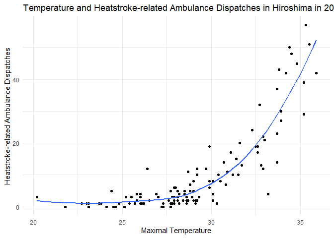
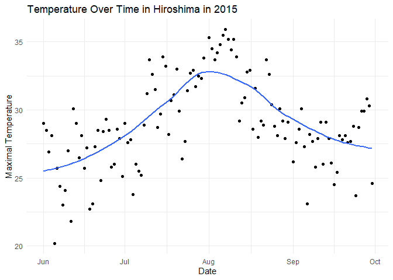
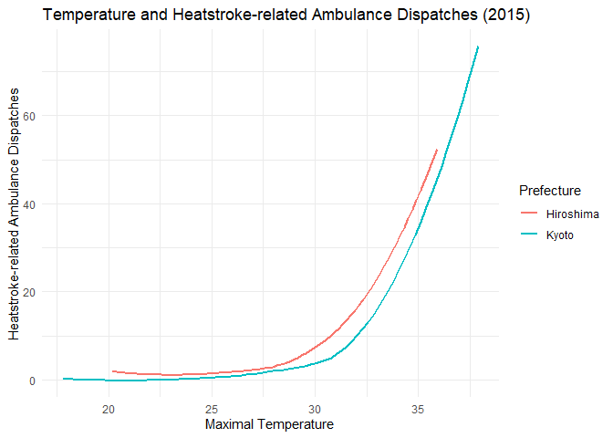
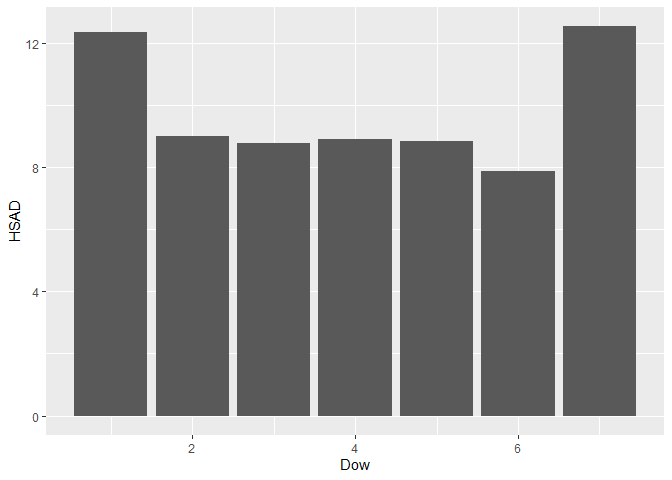

- [Introduction](#introduction)
- [Loading packages](#loading-packages)
- [Importing Data](#importing-data)
- [Merging the Data](#merging-the-data)
- [Analyzing Data for a Specific Prefecture and
  Year](#analyzing-data-for-a-specific-prefecture-and-year)
- [Visualizing the Data](#visualizing-the-data)
- [Trends Over Time](#trends-over-time)
- [Linear Regression Analysis](#linear-regression-analysis)
- [Comparing Two Prefectures](#comparing-two-prefectures)
- [Dispatches by Day of the Week](#dispatches-by-day-of-the-week)
- [Creating the Heat Index](#creating-the-heat-index)
- [Visualizing Heat Index and Ambulance
  Dispatches](#visualizing-heat-index-and-ambulance-dispatches)
- [Linear Regression with Heat
  Index](#linear-regression-with-heat-index)

# Introduction

In this encounter, we will explore the relationship between temperature
and heatstroke-related ambulance dispatches using data from Japan. The
data contains daily records of maximum temperature and relative humidity
across all 47 prefectures from 2015 to 2019.

# Loading packages

We will start by loading the tidyverse and rio packages. Ensure these
packages are installed before running the code.

``` r
# install.packages("tidyverse")
# install.packages("rio")
library(tidyverse)
library(rio)
```

# Importing Data

We will import two data sets: one for heatstroke-related ambulance
dispatches (HSAD) and one for temperature data.

``` r
hsad <- import("https://github.com/ucrdatacenter/projects/raw/refs/heads/main/SCIBIOM303/2025h1/data/HSAD.csv")
temp <- import("https://github.com/ucrdatacenter/projects/raw/refs/heads/main/SCIBIOM303/2025h1/data/temperature.csv")
```

# Merging the Data

To analyze the relationship between temperature and heatstroke-related
ambulance dispatches, we will merge the two data sets using the
left_join() function. We will join them on the columns Date and
Prefecture. Next, we convert the Date column into a date format.

``` r
merged <- left_join(temp, hsad, by = c("Date", "Prefecture")) |> 
  mutate(Date = dmy(Date)) 
```

# Analyzing Data for a Specific Prefecture and Year

We will focus on Hiroshima in 2015 to study the relationship between
daily maximum temperature and heatstroke-related ambulance dispatches.

``` r
hiroshima_2015 <- merged |> 
  filter(Prefecture == "Hiroshima") |> 
  filter(Year == 2015)
```

# Visualizing the Data

We will create a scatter plot to visualize the relationship between
maximum temperature and heatstroke-related ambulance dispatches. A trend
line is added to show the overall pattern.

``` r
ggplot(hiroshima_2015, aes(x = Tempmax, y = HSAD)) +
  geom_point() +
  geom_smooth(se = FALSE) +
  labs(title = "Temperature and Heatstroke-related Ambulance Dispatches in Hiroshima in 2015",
       x = "Maximum Temperature",
       y = "Heatstroke-related Ambulance Dispatches") +
  theme_minimal()
```

<!-- -->

The number of heatstroke-related ambulance dispatches increases
significantly when the temperature exceeds 30°C. This trend aligns with
what we expect because higher temperatures can cause a rapid rise in
core body temperature, leading to heatstroke
([source](https://www.mayoclinic.org/diseases-conditions/heat-stroke/symptoms-causes/syc-20353581)).

# Trends Over Time

We will create another plot to show how maximum temperature changes over
time in Hiroshima in 2015.

``` r
ggplot(hiroshima_2015, aes(x = Date, y = Tempmax)) +
  geom_point() +
  geom_smooth(se = FALSE) +
  labs(title = "Temperature Over Time in Hiroshima in 2015",
       x = "Date",
       y = "Maximum Temperature") +
  theme_minimal()
```

<!-- -->

The temperature rises in June, peaks in August (above 35°C), and then
decreases in October. This seasonal pattern is typical for Hiroshima
([source](https://www.climatestotravel.com/climate/japan/hiroshima)).

# Linear Regression Analysis

To quantify the relationship between temperature and heatstroke-related
ambulance dispatches, we perform a linear regression analysis.

``` r
lr <- lm(HSAD ~ Tempmax, data = hiroshima_2015)
summary(lr)
```

    ## 
    ## Call:
    ## lm(formula = HSAD ~ Tempmax, data = hiroshima_2015)
    ## 
    ## Residuals:
    ##     Min      1Q  Median      3Q     Max 
    ## -18.947  -5.163  -1.816   3.845  27.511 
    ## 
    ## Coefficients:
    ##             Estimate Std. Error t value Pr(>|t|)    
    ## (Intercept) -80.4723     6.5532  -12.28   <2e-16 ***
    ## Tempmax       3.1151     0.2248   13.86   <2e-16 ***
    ## ---
    ## Signif. codes:  0 '***' 0.001 '**' 0.01 '*' 0.05 '.' 0.1 ' ' 1
    ## 
    ## Residual standard error: 8.083 on 118 degrees of freedom
    ## Multiple R-squared:  0.6193, Adjusted R-squared:  0.6161 
    ## F-statistic:   192 on 1 and 118 DF,  p-value: < 2.2e-16

The R-squared value of 0.6193 indicates that about 61.93% of the
variability in ambulance dispatches can be explained by the maximum
temperature. This suggests a strong positive relationship between HSAD
and temperature.

# Comparing Two Prefectures

Next, we will compare the relationship between temperature and ambulance
dispatches in Hiroshima and Kyoto in 2015 using a line graph.

``` r
merged |> 
  filter(Prefecture == "Kyoto"| Prefecture == "Hiroshima") |> 
  filter(Year == 2015) |> 
  ggplot() +
  geom_smooth(aes(x = Tempmax, y = HSAD, color = Prefecture), se = FALSE) +
  labs(title = "Temperature and Heatstroke-related Ambulance Dispatches (2015)",
       x = "Maximum Temperature",
       y = "Heatstroke-related Ambulance Dispatches") +
  theme_minimal()
```

<!-- -->

Both prefectures show similar trends, with the number of dispatches
increasing as temperature rises
([source](https://doi.org/10.3961/jpmph.2012.45.5.309)).

# Dispatches by Day of the Week

We can also analyze the average number of dispatches by the day of the
week.

``` r
hiroshima_2015 |>
  group_by(Dow) |>
  summarize(HSAD = mean(HSAD)) |>
  ggplot(aes(x = Dow, y = HSAD)) +
  geom_col() +
  labs(title = "Heatstroke-related Ambulance Dispatches by Day of the Week (2015)",
       x = "Day of the week",
       y = "Heatstroke-related Ambulance Dispatches") +
  theme_minimal()
```

<!-- -->

There are more dispatches on days 1 and 7, which correspond to Sunday
and Saturday, respectively. This is expected, as heatstroke cases are
more frequent on weekends, especially on Sundays when people engage in
outdoor or sporting activities
([source](https://www.channelnewsasia.com/today/ground-up/heatstroke-heat-related-illnesses-dangers-risks-take-precautions-misconceptions-4647621)).

# Creating the Heat Index

The heat index, also known as the “feels-like” temperature, is
calculated using temperature and humidity to reflect how hot it feels to
the human body. This formula was developed by Robert G. Steadman in 1979
and later adapted by the National Weather Service. It accounts for the
reduced ability of the body to cool itself through sweating in
high-humidity conditions, making it a crucial indicator for heat-related
health risks ([source](https://www.weather.gov/ama/heatindex)).

We first convert the temperature to Fahrenheit to calculate the heat
index, then convert it back to Celsius.

``` r
hiroshima_lr_data <- hiroshima_2015 %>%
  mutate(
    Temp_F = Tempmax * 9 / 5 + 32,
    Heat_Index_F = -42.379 + 
      2.04901523 * Temp_F + 
      10.14333127 * Rhumave - 
      0.22475541 * Temp_F * Rhumave - 
      0.00683783 * Temp_F^2 - 
      0.05481717 * Rhumave^2 + 
      0.00122874 * Temp_F^2 * Rhumave + 
      0.00085282 * Temp_F * Rhumave^2 - 
      0.00000199 * Temp_F^2 * Rhumave^2,
    Heat_Index_C = (Heat_Index_F - 32) * 5 / 9)
```

# Visualizing Heat Index and Ambulance Dispatches

We will create a plot to show the relationship between the heat index
and ambulance dispatches.

``` r
ggplot(hiroshima_lr_data, aes(x = Heat_Index_C, y = HSAD)) +
  geom_point() +
  geom_smooth(se = FALSE) +
  labs(title = "Heat Index and Heatstroke-related Ambulance Dispatches in Hiroshima in 2015",
       x = "Heat Index",
       y = "Heatstroke-related Ambulance Dispatches") +
  theme_minimal()
```

<!-- -->

The number of dispatches rises sharply after the heat index exceeds
30°C, confirming that the heat index is a strong predictor of
heat-related emergencies
([source](https://doi.org/10.1186/s40779-015-0056-z)).

# Linear Regression with Heat Index

Finally, we perform a linear regression analysis using the heat index to
predict ambulance dispatches.

``` r
lr2 <- lm(HSAD ~ Heat_Index_C, data = hiroshima_lr_data)
summary(lr2)
```

    ## 
    ## Call:
    ## lm(formula = HSAD ~ Heat_Index_C, data = hiroshima_lr_data)
    ## 
    ## Residuals:
    ##      Min       1Q   Median       3Q      Max 
    ## -16.4816  -4.0284  -0.9406   3.2193  21.7201 
    ## 
    ## Coefficients:
    ##              Estimate Std. Error t value Pr(>|t|)    
    ## (Intercept)  -45.3048     3.2060  -14.13   <2e-16 ***
    ## Heat_Index_C   1.6585     0.0947   17.51   <2e-16 ***
    ## ---
    ## Signif. codes:  0 '***' 0.001 '**' 0.01 '*' 0.05 '.' 0.1 ' ' 1
    ## 
    ## Residual standard error: 6.905 on 118 degrees of freedom
    ## Multiple R-squared:  0.7222, Adjusted R-squared:  0.7198 
    ## F-statistic: 306.8 on 1 and 118 DF,  p-value: < 2.2e-16

The R-squared value is 0.7222, meaning that 72.22% of the variability in
dispatches can be explained by the heat index. This suggests the heat
index is an even stronger predictor than temperature alone.
