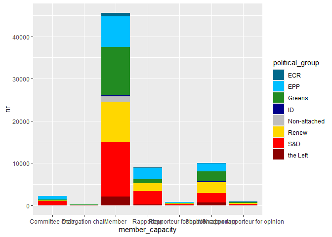
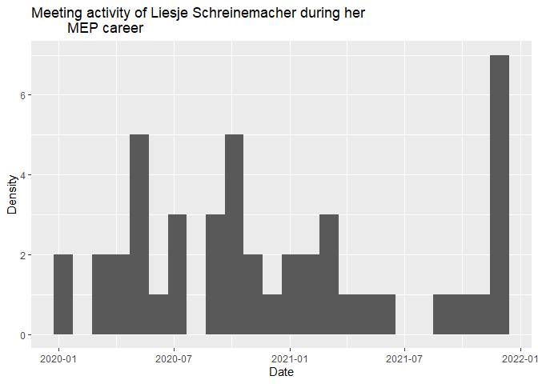
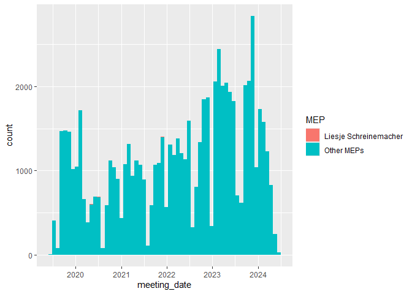
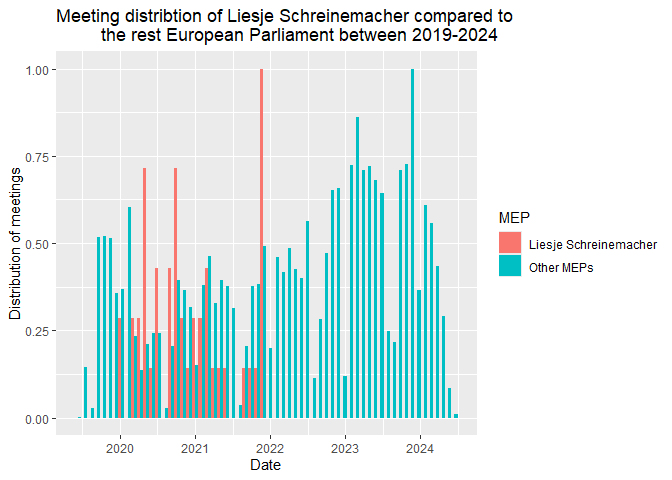
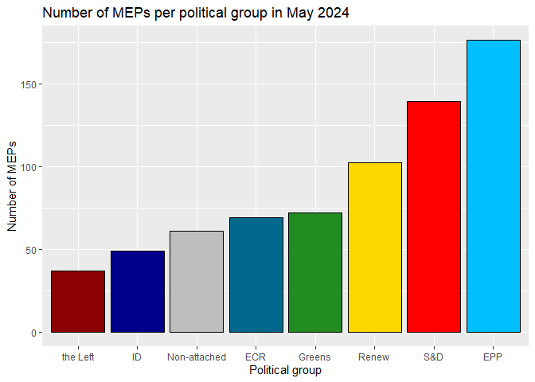
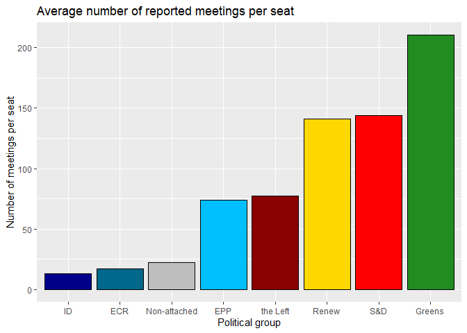
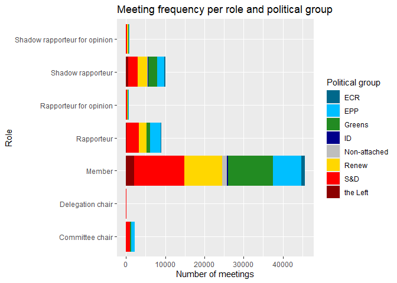

- [Loading libraries and data](#loading-libraries-and-data)
- [Describing the MEPs in the data](#describing-the-meps-in-the-data)
- [Differences between member
  states](#differences-between-member-states)
- [Meeting timelines](#meeting-timelines)
- [Differences between political
  groups](#differences-between-political-groups)
- [Role distributions](#role-distributions)
- [References to legislative
  dossiers](#references-to-legislative-dossiers)

# Loading libraries and data

``` r
# install.packages("tidyverse")
# install.packages("rio")
library(tidyverse)
library(rio)

meetings <- import("https://github.com/ucrdatacenter/projects/raw/main/SSCPOLI302/2024h2/Meetings_compl.xlsx", setclass = "tbl_df") |> 
  mutate(meeting_date = as.Date(meeting_date))
```

# Describing the MEPs in the data

List and count the total number of MEPs in the data.

``` r
# get all MEP names, MEP ID's, and nationalities
MEPs <- meetings |> 
  distinct(member_name, member_id, country)
  
head(MEPs) # show the first few rows
```

    ## # A tibble: 6 × 3
    ##   member_name           member_id country    
    ##   <chr>                     <dbl> <chr>      
    ## 1 GIESEKE Jens             124807 Germany    
    ## 2 KÖRNER Moritz            197445 Germany    
    ## 3 BLOSS Michael            197449 Germany    
    ## 4 BURKHARDT Delara         197440 Germany    
    ## 5 SCHREINEMACHER Liesje    197869 Netherlands
    ## 6 DELLI Karima              96868 France

``` r
nrow(MEPs) # number of MEPs in the data
```

    ## [1] 640

Not all of the 705 MEPs of term 2019-2024 are represented in the data.

# Differences between member states

``` r
# count the number of MEPs per country
MEPs |>
  count(country, sort = TRUE)
```

    ## # A tibble: 27 × 2
    ##    country         n
    ##    <chr>       <int>
    ##  1 Germany        98
    ##  2 France         73
    ##  3 Italy          65
    ##  4 Spain          56
    ##  5 Poland         40
    ##  6 Netherlands    29
    ##  7 Romania        28
    ##  8 Sweden         25
    ##  9 Hungary        21
    ## 10 Belgium        19
    ## # ℹ 17 more rows

``` r
# count the number of meetings per country
meetings |> 
  count(country, sort = TRUE)
```

    ## # A tibble: 27 × 2
    ##    country         n
    ##    <chr>       <int>
    ##  1 Germany     17231
    ##  2 France       9009
    ##  3 Spain        5665
    ##  4 Finland      4756
    ##  5 Netherlands  4645
    ##  6 Sweden       4575
    ##  7 Denmark      3036
    ##  8 Italy        2652
    ##  9 Belgium      2644
    ## 10 Austria      2106
    ## # ℹ 17 more rows

We can show differences between countries by plotting the number of
meetings per country on a bar chart.

``` r
# plot the number of meetings per country
meetings |> 
  count(country, sort = TRUE) |> 
  ggplot() +
  geom_col(aes(x = n, y = country)) +
  labs(title = "Number of meetings per country between 2019-2024", 
       x = "Country", 
       y = "Number of meetings")
```

<!-- -->

We can improve the display by arranging the bars based on the number of
meetings with the `reorder()` function.

``` r
# plot the number of meetings per country
meetings |> 
  count(country, sort = TRUE) |> 
  ggplot() +
  geom_col(aes(x = n, y = reorder(country, n))) +
  labs(title = "Number of meetings per country between 2019-2024", 
       x = "Country", 
       y = "Number of meetings")
```

<!-- -->

In this figure, the largest countries have the most meetings, which is
expected given that they have more MEPs. To account for this difference,
we can instead plot the average number of meetings per MEP in each
country, by dividing the number of meetings by the number of MEPs.

``` r
# average number of meetings per MEP in each country
countries <- meetings |> 
  group_by(country) |>
  summarize(n_meetings = n(),
            n_meps = n_distinct(member_id),
            avg_meetings = n_meetings / n_meps)
```

To visualize differences between countries in the average number of
meetings of their MEPs, we can present the data on a bar chart.

``` r
# plot the average number of meetings per MEP for each country
countries |> 
  ggplot() +
  geom_col(aes(x = avg_meetings, y = reorder(country, avg_meetings))) +
  labs(title = "Average number of meetings per MEP between 2019-2024", 
       x = "Country", 
       y = "Average number of meetings per MEP")
```

<!-- -->

This figure tells us more about the activity of MEPs in each country, as
it accounts for the number of MEPs in each country. We can see that MEPs
from Finland are particularly active. On the other hand, Cyprus not only
has the fewest MEPs but also the fewest meetings per MEP.

# Meeting timelines

Some countries have more MEPs than their EP seats. This means that an EP
member did not finish their term and was replaced by another, such as
the case of Liesje Schreinemacher.

We can plot the distribution of meetings over time with a histogram. A
histogram aggregates the data into bins and counts the number of
observations in each bin. In this case, we set each bin to be 30 days
wide.

``` r
# meeting dates of Liesje Schreinemacher
meetings |>
  filter(member_name == "SCHREINEMACHER Liesje") |> 
  ggplot() +
  geom_histogram(aes(x = meeting_date), binwidth = 30) +
  labs(title = "Meeting activity of Liesje Schreinemacher during her
         MEP career", 
       x = "Date", 
       y = "Frequency of meetings")
```

<!-- -->

We can also compare the density of Liesje Schreinemacher’s meetings to
the overall meeting density of the EP. We will do this by changing a few
things within the code.

First, we take the `meetings` dataset and define a new variable `MEP`
that indicates whether the MEP is Liesje Schreinemacher or not. Then, we
plot the histogram of the density of meetings for both Liesje
Schreinemacher and the other MEPs. We set the fill of the histogram to
be different depending on whether the MEP is Liesje Schreinemacher or
not.

``` r
meetings |> 
  mutate(MEP = ifelse(member_name == "SCHREINEMACHER Liesje",
                      "Liesje Schreinemacher",
                      "Other MEPs")) |>
  ggplot() +
  geom_histogram(aes(x = meeting_date, fill = MEP), binwidth = 30) +
  labs(title = "Meeting activity of Liesje Schreinemacher compared to other MEPs", 
       x = "Date", 
       y = "Frequency of meetings")
```

<!-- -->

By default the histogram shows the count of meetings. Compared to the
sum all MEPs, Liesje Schreinemacher had so few meetings that her
histogram is barely visible. By specifying the `y` aesthetic to be a
rescaled version of the count (so that the highest value within a group
is 1), we override this default behavior and make the comparison more
informative. We accomplish this by specifying `after_stat(ncount)` as
the `y` aesthetic. In addition, we can put the bars of the groups next
to each other instead of stacking them by specifying
`position = "dodge"`.

``` r
meetings |> 
  mutate(MEP = ifelse(member_name == "SCHREINEMACHER Liesje",
                      "Liesje Schreinemacher",
                      "Other MEPs")) |>
  ggplot() +
  geom_histogram(aes(x = meeting_date, y = after_stat(ncount), fill = MEP),
                 binwidth = 30, position = "dodge") +
    labs(title = "Meeting activity of Liesje Schreinemacher compared to other MEPs", 
       x = "Date", 
       y = "Frequency of meetings (rescaled)")
```

<!-- -->

As we can see, Liesje Schreinemacher’s activity stops about midway
through 2022, which is when she exited the EP.

# Differences between political groups

First, we can compare the number of meetings from each political group
who declared meetings compared to the total number of seats of each
group. Calculating the average number of meetings per seat in the
political groups helps us see which group has held the most meetings on
average while accounting for their size. We use seats because only one
MEP can occupy a seat at a time, therefore this definition accounts for
groups that saw many MEP replacements and thus have more MEPs than seats
in their data.

``` r
# define the number of seats per group (as of May 2024) and the position of each group on the left-right spectrum
seats <- tribble(
  ~political_group, ~seats, ~leftright,
  "EPP", 176, 5,
  "S&D", 139, 3,
  "Renew", 102, 4,
  "Greens", 72, 2,
  "ECR", 69, 6,
  "Non-attached", 61, 8,
  "ID", 49, 7,
  "the Left", 37, 1)

# count the number of meetings per political group in the meeting data
meetings_per_seat <- meetings |> 
  count(political_group) |> 
  # merge with the number of seats per group
  left_join(seats, by = "political_group") |> 
  # calculate the number of meetings per seat
  mutate(meetings_per_seat = n / seats)
```

We can compare visualizations for the number of MEPs per political group
and the average number of meetings per seat in each political group
using bar charts.

``` r
# number of MEP seats per political group
meetings_per_seat |> 
  ggplot() +
  geom_col(aes(x = political_group, y = seats)) +
  labs(title = "Number of MEPs per political group in May 2024", 
       x = "Political group", 
       y = "Number of MEPs")
```

<!-- -->

To improve the quality of the graph, we can organize the bars based on
the political orientation of the political group. In addition, we can
specify the colors of the bars to match those of their political groups.
We define these colors in a separate vector and use the
`scale_fill_manual()` function to apply them to the plot.

``` r
# define political group colors
colors <- c("EPP" = "deepskyblue", 
            "S&D" = "red",
            "Renew" = "gold", 
            "Greens" = "forestgreen",
            "ECR" = "deepskyblue4", 
            "ID" = "darkblue", 
            "the Left" = "darkred", 
            "Non-attached" = "grey")

# number of MEP seats per political group
meetings_per_seat |> 
  ggplot() +
  geom_col(aes(x = reorder(political_group, leftright), y = seats, 
               fill = political_group),
           # color the borders of the bars black and hide the legend
           color = "black", show.legend = FALSE) +
  labs(title = "Number of MEPs per political group in May 2024", 
       x = "Political group", 
       y = "Number of MEPs") +
  scale_fill_manual(values = colors)
```

<!-- -->

Now compare the previous plot to the average number of meetings per seat
in each political group.

``` r
# average number of meetings per seat per political group
meetings_per_seat |> 
  ggplot() +
  geom_col(aes(x = reorder(political_group, leftright), 
               y = meetings_per_seat, fill = political_group),
           color = "black", show.legend = FALSE) +
  labs(title = "Average number of reported meetings per seat", 
       x = "Political group", 
       y = "Number of meetings per seat") +
  scale_fill_manual(values = colors)
```

<!-- -->

# Role distributions

Meetings also differ based on the roles of the MEP in the meeting.
First, let’s compare the number of meetings for each role.

``` r
meetings |> 
  count(member_capacity, sort = TRUE)
```

    ## # A tibble: 7 × 2
    ##   member_capacity                   n
    ##   <chr>                         <int>
    ## 1 Member                        45560
    ## 2 Shadow rapporteur             10064
    ## 3 Rapporteur                     9009
    ## 4 Committee chair                2207
    ## 5 Shadow rapporteur for opinion   824
    ## 6 Rapporteur for opinion          753
    ## 7 Delegation chair                175

We can combine this information with the political group of the MEP to
see which combination of political groups and roles are most common.

``` r
meetings |> 
  count(political_group, member_capacity, sort = TRUE)
```

    ## # A tibble: 53 × 3
    ##    political_group member_capacity       n
    ##    <chr>           <chr>             <int>
    ##  1 S&D             Member            12955
    ##  2 Greens          Member            11435
    ##  3 Renew           Member             9547
    ##  4 EPP             Member             7257
    ##  5 S&D             Rapporteur         3184
    ##  6 EPP             Rapporteur         2684
    ##  7 Renew           Shadow rapporteur  2480
    ##  8 S&D             Shadow rapporteur  2314
    ##  9 Greens          Shadow rapporteur  2257
    ## 10 the Left        Member             2013
    ## # ℹ 43 more rows

This is a lot of information as a table, so let’s use a bar chart to
show the distribution of political groups within each role.

``` r
meetings |> 
  count(political_group, member_capacity) |> 
  ggplot() +
  geom_col(aes(x = n, y = member_capacity, fill = political_group)) +
  labs(title = "Meeting frequency per role and political group", 
       x = "Number of meetings",
       y = "Role",
       fill = "Political group") +
  scale_fill_manual(values = colors)
```

<!-- -->

# References to legislative dossiers

*Unclear what the purpose is, to be discussed*

Optional extra; try to figure out which roles have linked a procedure
reference. This is important for full transparency about the legislative
dossier their meeting relates to.

We first count the number of meetings with and without added references
per member role. We divide these counts with the total number of
meetings per role to get the share of meetings with a reference, and
plot these results on a bar chart.

``` r
meetings |> 
  mutate(reference = !is.na(procedure_reference)) |>
  count(member_capacity, reference) |> 
  group_by(member_capacity) |>
  mutate(reference_share = n / sum(n)) |> 
  ggplot() +
  geom_col(aes(x = reference_share, 
               y = member_capacity, 
               fill = reference)) +
  labs(title = "Share of meetings with a reference to a legislative dossier", 
       x = "Share of meetings",
       y = "Role",
       fill = "Linked reference")
```

<!-- -->
