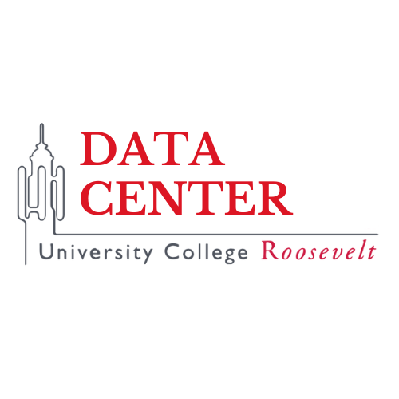

------------------------------------------------------------------------

## Welcome to the website of the UCR Data Center!

You can find information and supplementary materials for all data
encounters in UCR courses (ongoing or past) at the bottom of this page
or via the COURSES button in the header. In addition, please see below
for other initiatives, office hours, and general tutorials.

## DataFest 2024

The date is set: May 30, 2024. Then the new edition of the DataFest will
take place. A DataFest? Indeed, a hackathon, but for data-related
challenges. This time, students from the HZ University of Applied
Sciences, University College Roosevelt and Scalda will be exploring
innovative solutions together to improve mobility in Zeeland. With
various data sources regarding incoming and outgoing traffic in the
region. The focus is on predicting alternative routes, positioning
public transport hubs and understanding complex traffic patterns. The
aim is to develop concrete solutions that can improve the mobility and
flow of traffic in Zeeland.

[Link to DataFest
2023](https://hz.nl/en/applied-research/news/datafest-2023-data4climate-is-huge-success)

## DC Apprenticeship

You can find all materials related to the 2024 Winter Apprenticeship
workshops and projects [here](apprenticeship).

The call for proposals for the 2024 Summer Apprenticeship is now open;
more information is available in the UCR newsletter.

## Office hours

The Data Center student fellows hold office hours in the Data Center’s
office (Anne ground floor) to answer questions and help with assignments
related to the Data Center projects. The timing of office hours depends
on which courses have ongoing data encounters, and is announced on the
individual course pages and/or course Moodle pages.

If you would like to request an individual consultation, feel free to
send an email to <datacenter@ucr.nl>.

## General support

You can find some general tutorials on working with data and a
collection of useful data sources [here](tutorial).

## Ongoing courses

- [SCIBIOM303 - Mechanisms of Disease](SCIBIOM303)
- [AH-FTME101 - Introduction to Film, Theatre, and Media](AH-FTME101)

## Past courses

You can view the archived pages of all previous Data Center projects
[here](archive).
