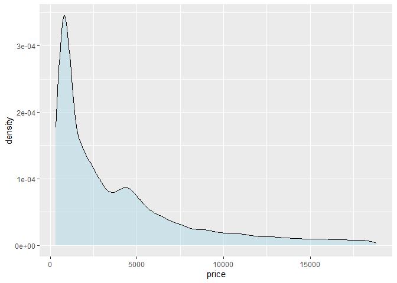

**This tutorial is not ready yet. Please come back later.**

# Introduction

Before you proceed, make sure you’re familiar with the logic of
`ggplot`, as explained in our [introduction to `ggplot`
tutorial](../r_ggplot_intro).

We’ll use the `diamonds` dataset that comes pre-loaded with `tidyverse`
to demonstrate how to visualize the distribution of a variable with
`ggplot2`, so let’s load `tidyverse` and have a look at the dataset:

``` r
# load tidyverse
library(tidyverse)

# add diamonds to the environment
data(diamonds)
```

# Univariate plots

You can plot a single continuous variable with a histogram, a density
plot, or a boxplot. Other than the name of the dataset and the variable
that you want to plot, no additional arguments need to be specified; but
you can customize the plot by adding arguments to the `geom_` functions.

``` r
# basic histogram of price
ggplot(diamonds, aes(x = price)) +
  geom_histogram()
```

<!-- -->

``` r
# custom binwidth or bins determine the number of bins
# with binwidth = 1000, each bin is $1,000 wide
# color affects the border; fill affects the inside
ggplot(diamonds, aes(x = price)) +
  geom_histogram(binwidth = 1000, color = "black", fill = "lightblue")
```

<!-- -->

``` r
# density plot
# alpha adjusts the transparency of the fill
ggplot(diamonds, aes(x = price)) +
  geom_density(fill = "lightblue", alpha = 0.5)
```

<!-- -->

``` r
# boxplot
ggplot(diamonds, aes(x = price)) +
  geom_boxplot()
```

<!-- -->

To compare the frequencies of discrete variables, you can use a bar
plot.

``` r
ggplot(diamonds, aes(x = cut)) +
  geom_bar()
```

<!-- -->

Whenever you make a plot, make sure to use clear labels and titles with
the `labs()` function to make your visualization easy to understand.

``` r
ggplot(diamonds, aes(x = cut)) +
  geom_bar() +
  labs(title = "Frequencies of diamond cuts",
       x = "Cut",
       y = "Number of diamonds")
```

<!-- -->

To learn more about other geoms and customization options, have a look
at our [advanced visualization tutorial](../r_adv_ggplot) and
[additional resources](../links#Help%20with%20%60ggplot%60).

## Video tutorial TBA
